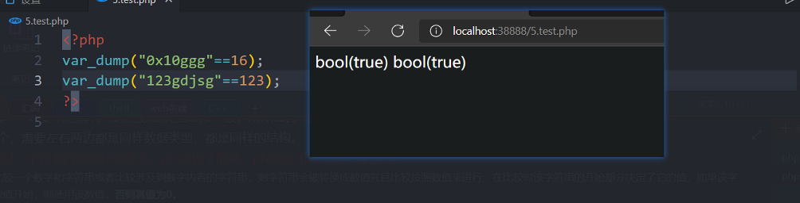
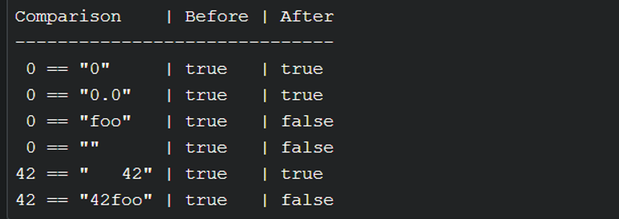
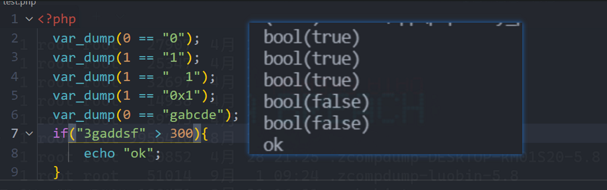
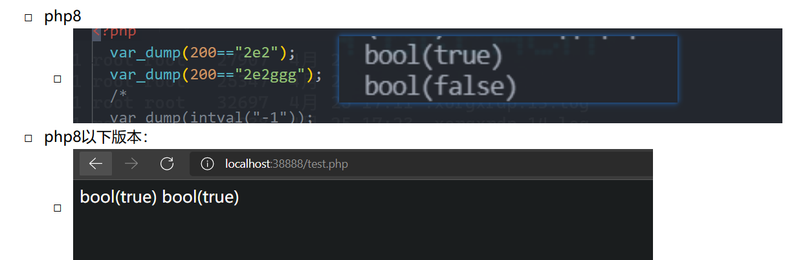
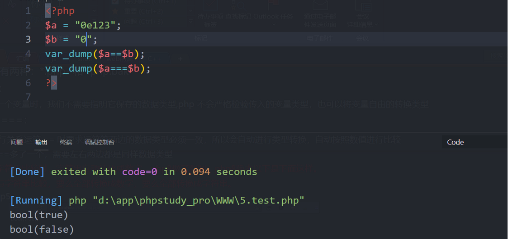

# PHP代码审计
> 多看漏洞案例，看看别人的思路
>
> https://github.com/jiangsir404
## 0x00 ctf中简单的php漏洞
> 一般非源码审计的php版本都很低的，所以可以不用看php8的特性
### php弱类型

> 在声明一个变量时，我们不需要指明它保存的数据类型,php 不会严格检验传入的变量类型，也可以将变量自由的转换类型，这样就产生了漏洞

- == 与 ===（弱等于与强等于）：
    - 执行关系运算 == 时要求运算符两边的数据类型必须一致，所以会自动进行类型转换，自动按照数值进行比较
    - ===比==多了一个，需要左右两边都是同样数据类型，都是同样的结构。
- **数字和字符串比较时，字符串自动转化成数字。**
    - 弱比较：如果比较一个数字和字符串或者比较涉及到数字内容的字符串，则字符串会被转换成数值并且比较按照数值来进行，在比较时该字符串的开始部分决定了它的值，如果该字符串以合法的数值开始，则使用该数值，否则其值为0。php8版本有些不一样。
    - id==0   典型的PHP弱比较，利用id=0a或id=0e123或id=asd均可实现绕过，因为php把字母开头的转化为整型时，转化为0， 前面数字后面字母的话就只取到第一个字母出现的位置之前（如intval('123abd45gf')结果为123）
        - 
    - **在php8版本以上，当比较数字字符时，使用数字与数字对比（即使字符串是以0x开头也不会表示为16进制数字（php7版本之上好像不会识别16进制数字），-开头会表示负数，有科学计数法但必须只为科学计数法无其他字符在后面，具体很像intval()函数）。而其他字符与数字比较时，统一使用字符串比较，且字符串全是数字就会同一转成数字再比较，如果不是就会同一转成字符串比较。**
        - 
        - 
    - 科学计数法：
        - 
- 字符串与字符串比较，要么全部转换成数字，要么全部转换成字符串。
    - php 5，7，8都是一样的
    - 
- **数字长度绕过**：当需要传入一个很大的数字，但是变量长度有范围限制，可以使用科学计数法2e\d,16进制
    - 比如2e2就表示为2x10^2=200
- **intval()**：将字符串类型转换成整形
    - `int intval ( mixed $var [, int $base = 10 ] )`
    - intval() 函数通过使用指定的进制 base 转换（默认是十进制），返回变量 var 的 integer 数值。 intval() 不能用于 object，否则会产生 E_NOTICE 错误并返回 1。
    - 如果参数是字符串，则返回字符串中第一个不是数字的字符之前的数字串所代表的整数值。如果字符串第一个是 -，则从第二个开始算起（识别负数）。否则返回0
    - 在php8，php7里面会识别科学计数法，但是php5版本并不会识别。
    - 输入浮点数字符串会四舍五入
    - 当base为0时候，可以识别2，8，16进制，但是字符串需要有前缀，比如0x，
    - 当base为2,8,16识别对应的进制，字符串不需要前缀。
    - 返回值：
        - 成功时返回 var 的 integer 值，失败时返回 0。 空的 array 返回 0，非空的 array 返回 1。
    - 会忽略字符串前面的换页，换行之类的，可以FUZZ测试。
- 数组和数组比较会比较数组的每一个值，弱比较也是。
- **好像大多数需要传入字符串参数的函数如果传入了一个数组,会返回NULL，弱比较时null也就是0，当然php8版本会直接报错**
### **md5和sha1函数绕过**
- md5(string,raw)
-	两个字符串不相同但是要求md5值相等==
    - `$_GET['name'] != $_GET['password']&&MD5($_GET['name']) == MD5($_GET['password'])`
    - **传入含有不同参数的数组**。php8会直接报错，其他版本会返回NULL
    - **魔法hash**：
        - PHP在处理哈希字符串时，它把每一个以"0E"开头的哈希值都解释为0(以0e开头的字符串会被当作科学计数法，也就是0了)，所以如果两个不同的密码经过哈希以后，其哈希值都是以"0E"开头的，那么PHP将会认为他们相同，都是0。
        - 以下值在md5加密后以0E开头：
          ```
          QNKCDZO
          240610708
          s878926199a
          s155964671a
          s214587387a
          s214587387a
          
          ```
        - 以下值在sha1加密后以0E开头：
          ```
          sha1('aaroZmOk')
          sha1('aaK1STfY')
          sha1('aaO8zKZF')
          sha1('aa3OFF9m')
          ```
      - GET传入a=QNKCDZO&b=240610708就能绕过了    
- 两个字符串不相同但是要求md5值强相等===:
    - 在php中`===`为完全等于运算，不仅比较值，而且还比较值的类型，只有两者一致才为真。再次使用a=QNKCDZO&b=240610708就不行了，因为a和b类型和值都不同。
    - 传入数组：
        - 传入a[]=1&b[]=2就能够绕过了
        - md5([1]) === md5([2]) === NULL
- sha1()函数绕过和MD5一样的绕过方式
### **正则绕过**
- 绕过eregi正则表达式匹配函数：
    - 当传入的字符串包含%00（这里的%00，是指我们进行了url编码后的数据有个%00，而当php得到的时候，该字符的二进制表示是0x00，这里需要搞清楚）时，只有%00前的字符串会传入函数并执行，而后半部分不会传入函数判断。因此可以使用%00截断，连接非法字符串，从而绕过函数，strpos函数不会被%00截断，会继续寻找下去。（ strlen函数对%00不截断但substr会截断）。
    - 传入数组参数arr[]，ereg是返回NULL
- 绕过preg_match正则匹配：
    -  preg_replace ( mixed $pattern , mixed $replacement , mixed $subject)
    -  数组绕过：preg_match()只能处理字符串，当传入的对象是数组时会返回false
    -  换行绕过：不会匹配换行符、在非多行模式（多行模式在正则表达式外面有个m）下会忽略在句尾的%0a，payload:%0aphp
    -  最大回溯绕过：pcre.backtrack_limit给pcre设定了一个回溯次数上限为了防止reDOS攻击，默认为100万，即当字符长度超过100万就不匹配了，如果回溯次数超过限定值，preg_match会返回false
    - 如果正则匹配后的数据会经过eval()：[https://www.cnblogs.com/v01cano/p/11736722.html](https://www.cnblogs.com/v01cano/p/11736722.html)
### 变量覆盖
- 全局变量覆盖：
    - 要求：register_globals=1
    - 变量如果**未被初始化**，且能够被用户所控制，那么很可能会导致安全问题
    - 当 register_globals=1时，提交 test.php?auth=1，auth 变量将自动得到赋值。
    ```php
    <?php
      echo "Register_globals: " . (int)ini_get("register_globals") . "<br/>";
      if ($auth=="flag") {
        echo "private!";
      }
    ?>
    ```
- extract()变量覆盖：
    - extract(array,extract_rules,prefix),从数组中将变量导入到当前的符号表。
    - 该函数使用数组键名（不需要$当作前缀）作为变量名，使用数组键值作为变量值。针对数组中的每个元素，将在当前符号表中创建对应的一个变量。- 第二个参数extract_rules 用于指定当某个变量已经存在，而数组中又有同名元素时，extract() 函数如何对待这样的冲突。没给参数就是可以覆盖
      ```text
      可选。extract() 函数将检查每个键名是否为合法的变量名，同时也检查和符号表中已存在的变量名是否冲突。对不合法和冲突的键名的处理将根据此参数决定。
      可能的值：
      • EXTR_OVERWRITE - 默认。如果有冲突，则覆盖已有的变量。
      • EXTR_SKIP - 如果有冲突，不覆盖已有的变量。
      • EXTR_PREFIX_SAME - 如果有冲突，在变量名前加上前缀 prefix。
      • EXTR_PREFIX_ALL - 给所有变量名加上前缀 prefix。
      • EXTR_PREFIX_INVALID - 仅在不合法或数字变量名前加上前缀 prefix。
      • EXTR_IF_EXISTS - 仅在当前符号表中已有同名变量时，覆盖它们的值。其它的都不处理。
      • EXTR_PREFIX_IF_EXISTS - 仅在当前符号表中已有同名变量时，建立附加了前缀的变量名，其它的都不处理。
      EXTR_REFS - 将变量作为引用提取。导入的变量仍然引用了数组参数的值。
      ```
    - 该函数返回成功导入到符号表中的变量数目。

- parse_str() 变量覆盖:
    - void parse_str ( string $str [, array &$arr ])
    - parse_str() 函数通常用于解析 URL 中的 querystring，但是当参数值可以被用户控制时，很可能导致变量覆盖。
- import_request_variables 变量覆盖：PHP 4 >= 4.1.0, PHP 5 < 5.4.0:
    - bool import_request_variables (string $types [, string $prefix])
    - import_request_variables 将 GET、POST、Cookies 中的变量导入到全局，使用这个函数只用简单地指定类型即可。
    - import_request_variables("G") 指定导入 GET 请求中的变量，提交 test.php?auth=1 出现变量覆盖。
    ```php
    <?php
    $auth = "0";
    import_request_variables("G");
    if ($auth == 1) {
      echo "private!";
    } else {
      echo "public!";
    }
    ?>
    ```
### php绕过waf
- PHP的字符串解析特性
     - 我们知道PHP将查询字符串（在URL或正文中）转换为内部$_GET或的关联数组$_POST。例如：当url传入/?foo=bar变成Array([foo] =>"bar")。
    值得注意的是，传入的url参数字符串在解析的过程中会将某些字符删除或用下划线代替。例如，`/?%20news[id%00=42会转换为Array([news_id] => 42)`。
    - 当一个waf拦截某个url参数传入的数据之后，我们就可以用`/news.php?%20news[id%00=42"+AND+1=0–`去绕过了，因为waf本来想检测news_id参数传入的值，但是我们传入的是`%20news[id%00`就不会被waf拦截了。上述PHP语句的参数`%20news[id%00`的值将存储到$_GET["news_id"]中。
    - 我的理解：
        - 假如waf不允许num变量传递字母：
        - 那么我们可以在num前加个空格：http://www.xxx.com/index.php? num = aaaa
        - 这样waf就找不到num这个变量了，因为现在的变量叫" num"，而不是"num"。但php在解析的时候，会先把空格给去掉，这样我们的代码还能正常运行，还上传了非法字符。
        - waf并不是说，题目是用php写的，那么waf就一定是用php写的。也正因如此，这题的waf才会无法识别" num"和"num"其实是一样的。
### 某些函数可以利用：
- create_function() 代码注入:
    - [https://blog.csdn.net/dyw_666666/article/details/90042852](https://blog.csdn.net/dyw_666666/article/details/90042852)
    - create_function()主要用来创建匿名函数,有时候匿名函数可以发挥它的作用。
    - 本质上可以看作是c语言里面的宏，运行的时候可以展开，当我们自定义函数的时候，可以闭合构造的函数，然后执行额外的php代码。
    - 只需要在create_function()构造时就可执行额外的php代码，而不需要构造好之后调用匿名函数才能执行。
- pearcmd.php:
    - 当存在文件包含的时候。可以包含这个php文件。


## 0x01 前期准备
### PHP代码审计工具
- 通用工具 
    - PHPStorm+xdebug：
        - 对PHP语法支持友好，能自动化指出一些错误
        - 自动追溯函数与类，支持动态调试
        - 支持常用的PHP框架与composer，edu邮箱可申请学生版免费版账户
    - PHPMyAdmin：用来管理数据库的
    - Burpsuite
- Windows环境搭建 
    - PHPStudy
    - Seay源代码审计系统 
        - 快速函数定位，自定义多窗口搜索，同文件多窗口查看
        - Mysql执行监控，一件调试选中代码，文档自动查询，自动审计
- Mac环境搭建 
    - PHPBrew
    - XAMPP

###  PHP动态调试

- 工具：PHPStrom + PHPDebug
- 动态调试技巧 
    - Ctrl + F8 下断点
    - F7 单步调试（进入子函数）
    - F8 单步调试（不进入子函数）
    - F9 执行到下一个断点
    - Alt + F8 计算表达式
    - Ctrl + Shift + F8 查看所有断点
- 溯源技巧 
    - Ctrl + Shift + F 全项目查找
    - Ctrl + 右键 查找函数调用、类定义、函数定义、包含文件所带位置
    - 每一行左侧小图标 查看父类方法
###  PHP手工调试

- 万金油函数 
    - var_dump
- 查看上下文内容 
    - get_defined_functions
    - get_defined_vars
    - get_defined_constants
    - get_included_files
    - get_loaded_extensions
    - get_extension_funcs
    - get_declared_classes
    - get_declared_interfaces
- 查看函数调用过程 
    - debug_backtrace
    - debug_print_backtrace
- XDebug手工测试 
    - xdebug_call_file 获取调用当前函数的文件
    - xdebug_call_line 获取调用当前函数的文件的行
    - xdebug_call_function 获取调用当前函数的函数
    - xdebug_dump_superglobals 获取所有超全局变量
    - xdebug_get_monitored_functions 监控函数调用

###  PHP服务架构

- PHP运行模式 
    - CLI
    - CGI
    - PHP Built-in Webserber
    - **Apache php_mod**
    - php-fpm(Fastcgi)
        - Nginx
        - IIS7+
        - Lighttpd
    - IIS6 + ISAPI
    - Swoole

###  PHP安全配置

- 那些影响PHP安全的全局配置 
    - magic_quotes_gpc：5.3后废除，5.4后移除
    - register_global：4.2后默认为false
    - allow_url_include：默认false
    - allow_url_open：默认ture
    - request_order：5.3后从GPC改为GP
    - short_open_tag：5.4+，无论是否开启，<?=..?>总是可以被执行的
    - safe_mode(5.4移除)
    - open_basedir
    - disable_functions/disable_classes
    - enable_dl(5.2默认false)

###  PHP危险函数归纳

- 危险操作、函数、方法、变量 
    - include/require/include_once/require_once/**spl_autoload** 
    - eavl/assert/**preg_replace**/**create_function** 
    - system/passthru/exec/shell_exec/popen/**pcntl_exec**/**dl**/`xx` 
    - file_get_contents/fread/readfile/file/**highlight_file**/**show_source** 
    - file_put_contents/fwrite/mkdir/**fputs** 
    - unlink/rmdir
    - move_uploaded_file/**copy**/**rename** 
    - curl_exec/**file_get_contents**/**readfile**/**fopen** 
    - extract/parse_str/**$$** 
    - simplexml_load_file/simplexml_load_string/**SqmpleMLElement**/**DOMDocunment**/**xml_parse** 
    -  **var_dump**/**print_r**/**exit**/**die** 
    - unserialize
    - urldecode/iconv/mb_convert_encoding/stripslashes**/base64_decode**/**substr** 

###  查缺补漏

- 阅读代码，遇到不懂的函数和类 
    - [PHP.NET](http://PHP.NET) 官方文档
    - Google.com&& Stackoverflow.com
    - Baidu && CSDN
- 如何找到一些有漏洞的源码进行练习 
    - [先知社区](http://XZ.Aliyun.com)
    - [Github.com](http://Github.com)
    - Wooyun历史漏洞
    - [Sec-News 安全文摘 (ioin.in)](http://wiki.ioin.in/)

##  0x02 代码审计流程

###  反向查找

- 流程
    1. 通过可控变量(输入点)回溯危险函数
    2. 查找危险函数确定可控变量
    3. 传递的过程中触发漏洞
- 特点
    - 上下文无关
    - 危险函数，调用即漏洞
- 使用反向查找流程挖掘漏洞
    - 危险函数全局查找
    - 自动化审计工具（RISP，VCG，Fortify SCA，Cobra，grepbugs，Sky wolf，Taint ）
- 反向漏洞挖掘特点
    - 根源：**危险函数导致漏洞** 
    - 特点： 
        - 暴力：全局搜索危险函数
        - 简单：无需过多理解目标网站功能和架构
        - 快速：适用于自动化代码审计工具
        - 命中率低：简单的漏洞越来越少
        - 无法挖掘逻辑漏洞：逻辑漏洞多数不存在危险函数，或危险函数的参数"看似"不可控
        - 适应性较差：不适合存在全局过滤的站点
- 案例：
    - [Z-BLOG Blind-XXE造成任意文件读取](https://bugs.leavesongs.com/php/z-blog-blind-xxe%E9%80%A0%E6%88%90%E4%BB%BB%E6%84%8F%E6%96%87%E4%BB%B6%E8%AF%BB%E5%8F%96/)

###  正向查找

- 流程
    1. 从入口点函数出发
    2. 找到控制器，理解URL派发规则
    3. 跟踪控制器调用，以理解代码为目标进行源码阅读
    4. 阅读代码的过程中，可能发现漏洞
- 挖掘特点
    - 根源：**程序员疏忽或逻辑问题导致漏洞** 
    - 特点： 
        - 复杂：需要极其了解目标源码的功能和架构
        - 跳跃性大：设涉及M/V/C/Service/Dao等多个层面
        - 漏洞的组合：通常是多个漏洞的组合，很可能存在逻辑相关的漏洞
        - 潜力无限：安全研究人员的宝库
- 案例：[PHPCMS V9.6.0 前台Getshell漏洞](https://www.hacking8.com/bug-web/Phpcms/Phpcms-V9.6.3-%E5%89%8D%E5%8F%B0getshell.html)
###  双向查找

- 流程
    - 略读代码，了解架构
    - 是否有全局过滤机制？ 
        - 有：是否可以绕过？ 
            - 可以：寻找漏洞触发点。
            - 不可以：寻找没有过滤的变量。
        - 没有：那么它是如何处理的？ 
            - 完全没有处理：可以挖成筛子。
            - 有处理：寻找遗漏的处理点
    - 找到了漏洞点，漏洞利用是否有坑 
        - 否：成功利用！
        - 是：利用所知的语言知识（trick）解决问题
- 挖掘特点
    - 根源：理解程序执行过程，找寻危险逻辑
    - 特点 
        - 高效：如挖隧道，双向开工，时间减半
        - 知识面广：需要同时掌握正向、反向挖掘技巧，并进行结合
        - 有所有正向、反向的优点

##  0x03 SQL注入篇

###  PHP + Mysql连接方式

- Mysql（废弃）
- Mysqli
- PDO

###  SQL注入漏洞常见过滤方法

- intval / addslashes / mysql_real_escape
- mysqli_escape_string / mysqli_real_escape_string / mysqli::escape_string
- PDO::quote
- 参数化查询

###  常见注入过滤绕过方法

- intval
- addslashes / mysql_real_escape 
  - 宽字符注入
  - 寻找字符串转换函数 
    - urldecode
    - base64_decode
    - iconv
    - json_decode
    - stripshasles
    - simple_xml_loadstring
- mysqli::escape_string /  PDO::quote 
  - 与addslashes差别：**是否会主动加引号包裹** 
  - 宽字符注入
- 参数化查询 
  - 寻找非SQL值位置
  - SELECT 'name' FROM `users`WHERE 'id' = ？ ORDER BY 'login_time' LIMIT 1

###  寻找遗漏过滤的漏洞点

- 案例：贷齐乐系统header注入
- 略读代码，了解架构 
  - 非MVC架构
  - 全局GPC转义
- 目标：找到没有进行过滤的输入点
- 结果：$*SERVER[HTTP**]均无过滤。导致注入
- 入手点 
  - 开发者不熟悉的边缘功能
  - 常被复制粘贴代码的功能

###  寻找过滤无效的漏洞点

- 案例：ThinkSNS某版本SQL注入漏洞
- 略读代码，了解架构 
  - 基于ThinkPHP3.1开发
  - MVC架构
  - 利用t函数过滤变量
- 结果：找到t函数过滤完成以后也可以注入的点
- 结果：表名位置SQL注入漏洞

###  寻找过滤可被绕过的利用点

- 案例：Metinfo企业网站管理系统SQL注入
- 略读代码，了解架构 
  - 非MVC架构
  - 全局覆盖的方式注册变量
  - 全局GPC转义
- 目标：获取绕过全局GPC的方法
- 结果：利用base64_decode来引入单引号

###  思路总结

- 开发者容易遗漏的输入点
  - HTTP头 
    - X-Forwarded-For
    - User-Agent
    - Referer
  - PHP_SELF
  - REQUSET_URI
  - 文件名 $_FILES[] [name]
  - wphp://input
- 引入单引号（转义符）的方法
  - stripslashes
  - base64_decode
  - urldecode
  - substr
  - iconv
  - str_relpace('0',",$sql)
  - xml
  - json_encode

##  0x04 任意文件操作篇

###  php文件操作函数汇总

- 文件包含 
  - include/require/include_once/require_once/spl_autoload
- 文件读取 
  - file_get_contents/fread/readfile/file/highlight_file/show_source
- 文件写入 
  - file_put_contents/fwrite/mkdir/fputs
- 文件删除 
  - unlink/rmdir
- 文件上传 
  - move_uploaded_file/copy/rename

###  文件上传漏洞

- 文件上传流程
  1. 检查文件大小、后缀、类型
  2. 检查文件内容（如图片头等）
  3. 提取文件后缀
  4. 生成新文件名
  5. 将上传临时文件拷贝到新文件名位置
- 文件上传逻辑常见错误
  - 只检查文件类型不检查文件后缀
  - 文件后缀黑名单导致遗漏
  - 使用原始文件名，导致\0截断等漏洞
- 什么也没过滤的情况
  - 案例：泛微Eoffice三处任意文件上传可直接getshell
  - 特点： 
    - 常见于路由设备。内部平台等
    - 可使用扫描器批量发现
- 前端验证的情况
  - 案例：泛微Eoffice三处任意文件上传可直接getshell
  - 特点： 
    - 服务端源码和前一种无任何差异
    - JavaScript进行文件名处理，无任何意义
    - 可使用扫描器批量发现
- MIme Type 检查的绕过
  - 案例：建站之星任意文件上传漏洞1
  - 特点： 
    - 上传时检查Mime-Type，不检查文件后缀
    - 或用Mime-Type生成文件后缀
    - 利用：修改数据包中的Mime-Type
    - 可使用扫描器批量发现
- 没有重命名文件的后果
  - 案例：建站之星任意文件上传漏洞2
  - 特点： 
    - 从POST变量中获取文件名（目录名）
    - 服务端语言不检查\0
    - 不重命名文件，导致\0进入操作系统
    - 截断文件名，留下xx.php

###  文件包含漏洞

- 文件包含漏洞！=文件读取漏洞
- PHP文件包含漏洞危害 
  - 文件读取
  - 代码执行
- 常见位置 
  - 模板文件名（切换模板）
  - 语言文件名（切换语言）
- 文件包含漏洞限制 
  - 寻找可被包含的文件：上传文件、临时文件、Session文件、日志文件
  - 后缀无法控制的情况：\0截断、协议利用
- 什么过滤也没有 
  - 案例：ThinkSNS任意文件包含1
  - 特点： 
    - 使用ThinkPHP框架
    - ThinkPHP老版本模板位置变量覆盖
    - 可包含任意文件
  - 效果 
    - 包含上传的图片 -> 执行任意代码
- 需要截断的任意文件包含 
  - 案例：ThinkSNS任意文件包含2
  - 特点： 
    - 使用ThinkPHP框架
    - 没有全局转义
    - \0不受过滤函数影响
    - \0截断导致任意文件包含漏洞
  - 限制： 
    - PHP5.3.4+对包含\0的文件操作函数进行限制
    - 突破：也有一些疏忽（CVE-2015-2348）
- 可以控制协议的任意文件包含 
  - 案例：Metinfo 5.3.10 版本Getshell漏洞
  - 特点： 
    - 可控前部分：include $file . '.php';
    - http协议利用：http://example.com/1.php 
    - PHP协议利用：zip/phar 
      - 制作包含2.php的压缩包2.jpg
      - 压缩包利用：zip:///var/www/upload/head/2.jpg#2.php

###  文件删除漏洞

- 案例：Discuz！X<=3.4任意文件删除漏洞
- 危害： 
  - 删除服务器任意文件，DOS服务器
  - 删除安装文件，导致目标环境可被重新安装
  - 重新安装->任意重置管理员密码

##  0x05 命令执行篇

###  PHP命令执行漏洞

- PHP命令执行函数 
  - system
  - passthru
  - exec
  - shell_exec
  - popen
  - pron_open
  - pcntl_exec
  - dl
  - `xx`
- PHP命令执行漏洞特点 
  - 没有给命令传入参数的方法
  - **字符串拼接的危害**
- 命令执行过滤函数 
  - escapeshellcmd
  - escapeshellarg
- 本质：用户输入无过滤，拼接到了系统命令中
- 案例：Disccuz!2.5命令执行漏洞
- 面试难题：如何防御PHP的命令执行漏洞？

###  escapshellcmd和escapeshellarg的区别

- PHP中只能使用escapeshellcmd和escapeshellarg进行命令参数的过滤
- 区分escapeshellcmd和escapeshellarg的角色差异
- escapeshellcmd 
  - "/usr/bin/tail" .escapeshellcmd($filename);
- escapeshellarg 
  - "/usr/bin/tail -n" .escapeshellarg($filename) ."/etc/passwd"
- 案例：PHPMailer（cve-2016-1003）任意文件写入漏洞 
  - 从Payload看起 
    - $address = "aaa-X/var/www/html/success.php@qq.com";
    - $mail = new PHPMailer;
    - $mail->setFrom($from);
    - $mail->addAddress('joe@example.net','joe User');
    - $mail->Subject = '<?=phpinfo()?>';
    - $mail->send()
  - 为什么发邮件能够导致文件写入
  - PHP Mail函数本质：sendmail命令执行 
    - mail('joe@example.com','<?=phpinfo()?>','...',"-f$from");
    - sendmail [joe@example.com](mailto:joe@example.com) ... -f**$from**
    - sendmail [joe@example.com](mailto:joe@example.com) ... -flol **-x/var/www/html/s.php** 
  - PHP内部对mail的第四个参数使用escapeshellcmd进行过滤
  - escapeshellcmd允许插入额外参数
  - sendmail -x 参数写入任意文件

###  PHP参数注入漏洞

- escapeshellarg真的安全吗？
- 案例：gitlist0.6.0远程命令执行漏洞 
  - $query = escapeshellarg($query);
  - $result = $this->getClient()->($this,"grep -i --line -number {$query}master");
- 有一个参数注入的案例：escapeshellarg仍无法防御参数注入漏洞
- 两种修复方法 
  - $result = $this->getClient()->($this,"grep -i --line -number -e{$query} master");
  - $result = $this->getClient()->($this,"grep -i --line -number --{$query} master");

##  0x06 XML实体注入篇

###  PHP XML实体注入漏洞现状

- PHP XML解析函数 
  - simplexml_load_file
  - simplexml_load_string
  - SimpleXMLElement
  - DOMDocument
  - xml_parse
- PHP中XXE漏洞逐渐减少 
  - PHP XML操作依赖libxml库
  - libxml2.9.0+默认关闭XML外部实体解析开关

###  如何挖掘XML实体注入（XXE）漏洞？

- **暴力搜索**

- 核心代码

  - $data = file_get_contents('php://input');
  - $object = simplexml_load_string($data);
  - //...
  - echo $object->name;

- 直接利用XXE读取任意文件

- 测试环境搭建：

  https://github.com/vulhub/vulhub/tree/master/php_xxe

###  利用Blind XXE读取任意文件

- 无输出点的XXE漏洞如何挖掘与利用？

- 核心代码

  - $data = file_get_contents('php://input');

  - $object = simplexml_load_string($data);

  - if(!$db->login($object->name,$object->pass)) {

    die("403 error");

    }

- 常见于需要权限验证的Web应用中

- 案例：Z-Blog Blind -XXE造成任意文件读取

##  0x07 前端漏洞篇

###  白盒测试中的前端漏洞

- 可能会遇到的前端漏洞类型
  - **XSS漏洞**
  - **CSRF漏洞**
  - **Jsonp劫持漏洞**
  - URL跳转漏洞
  - 点击劫持

###  XSS漏洞

- 寻找
  - 自动化FUZZ->寻找输出函数
  - 富文本XSS挖掘

- 富文本XSS
  - 什么是富文本
  - 常见富文本过滤方式
    - 黑名单过滤
    - 白名单过滤

  - 案例：Roundcude 邮件体XSS漏洞

    ```
    
    ```

- - ```php
    <?php
        else if($key == 'style' && ($style = $this->wash_style($value))){
            $quot = strpos($style,"")!==false ? "'":"'";
            $t.=' style=' .$quot . $style . $quot;
        }
    ```

    - 过滤过程：

    1. 用DOM对换入的HTML做解析，取出所有标签、相应属性的键和值
    2. 利用白名单，只保留允许存在的标签和属性
    3. 根据保留下来的标签、属性键和值，**拼接**成过滤后的HTML，输出

    - 利用方法：单双引号混用+HTML属性拼接 == 用户输入溢出属性范围
    - Payload：

- 挖掘代码中的富文本XSS漏洞

  - 黑名单 or 白名单 ？ 
    - 黑名单：找到不存在于名单中的关键词（标签，属性）
    - 白名单： 
      - 白名单中是否有可利用的标签，属性
      - 代码逻辑是否有问题（如用户输入的内容溢出属性外成为一个新属性）

- 收集，积累前端XSS技巧

- 案例：浅谈白盒安全审计中的XSS Fliter

###  CSRF漏洞

- 如何在白盒测试中挖掘CSRF漏洞 
  - 确定目标防御CSRF漏洞的方式 
    - 检查Referer
    - 检查Token
  - 寻找referer缺陷 
    - URL技巧
  - 寻找跨域漏洞 
    - Flash
    - Jsonp
    - CORS

###  Jsonp劫持漏洞

- 常见为位置 
  - Web框架默认支持ajax+jsonp方式请求
  - 程序员主动开发需要支持jsonp的应用
- jsonp劫持防御绕过 
  - Referer检查可被绕过
  - SOME攻击
- 案例：fanwe O2O用户密码可劫持

##  0x08 反序列化篇

- 什么是反序列化？为什么几乎所有语言都有序列化功能？

- 各种编程语言中的反序列化漏洞

  - PHP反序列化漏洞
  - Java反序列化漏洞
  - Python反序列化漏洞

- 反序列化的分类

  - 反序列化执行出发任意代码->Python
  - 反序列化后，通过已有代码利用你链，间接执行任意代码->PHP/Java

- PHP（反）序列化函数

  - serialize
  - unserialize

- PHP反序列化特点

  - 引入除资源型外任意类型变量
  - 无法引入函数->不能直接执行代码
  - 迂回战术 
    - 寻找程序中可能存在漏洞的类
    - **实例化类对象->触发漏洞**

- PHP反序列化后可能执行的方法

  - _wakeup：反序列化操作执行后触发
  - _destruct：类对象转换为字符串时触发
  - _toString：类对象转换为字符串时触发

- 漏洞挖掘过程

  1. 寻找调用反序列化函数的位置
  2. 寻找包含危险方法的类
  3. 反序列化上下文是否包含该类 
     - 包含：直接生成该类，触发漏洞
     - 不包含：寻找引用链

- 案例：wecenter反序列化造成任意SQL语句执行

  1. 寻找反序列化函数位置

     ```
     
     ```

```php
<?php
public function authorization_action(){
    $this->model('account')->logout();
    unset(AWS_APP::session()->WXConnect);
    ...       
}else if ($_GET['code'] OR $_GET['state']=='OAUTH'){
    if($_GET['state'=='OAUTH']{
        $access_token = unserialize(base64_decode($_GET['access_token']))
    }
}
```

寻找包含危险方法的类

```

<?php
class AWS_MODEL{
    ...
  /***MODEL类折构，执行延迟查询{*/
    public function_destruct(){
        $this->master();
        foreach($this->_shutdown_query AS $key => $query)
            $this->query($query);
    }
}
...
}
```

漏洞触发点是否包含可利用类？

- 包含

构造POC，触发漏洞。执行任意SQL语句

##  0x09 实战：cms审计