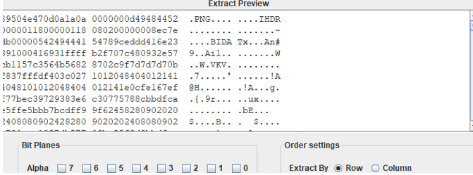
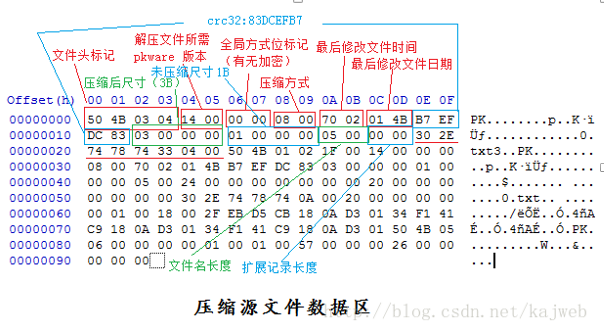

# 杂项
> 不要花费太多时间到杂项上面，打CTF比赛的时候可以做做杂项题目  

- 通用命令
    - 最重要是知道给的文件是什么类型的文件，不是通过后缀判定是什么文件（而是通过文件魔数判定）。利用linux下使用**file**命令可查看文件类型。
    - **strings**：打印文件中可打印的字符，经常用来发现文件中的一些提示信息或是一些特殊的编码信息，常常用来发现题目的突破口。
    - **binwalk**：查看该文件有没有加入其他文件
## 图片隐写
- Exif信息隐藏：exiftool命令查看图片的属性信息，可能有有用的信息。
- jpg：
    - jpg文件头 十六进制FF D8 FF E0
    - jpg图像会涉及到F5算法隐写，guess算法隐写
    - stegdetect（可检测通过JSteg,JPHide,OutGuess,Invisible,F5,oppendX,Camouflage等隐写工具隐藏的信息） 这程序好像有问题,检测可信度不高。
        ```shell
        	stegdetect xxx.jpg
			stegdetect -s 敏感度 xxx.jpgexi         敏感度调低点试试 比如1
			stegbreak（爆破密码）
			stegbreak.exe -r rules.ini -f password.txt p -c hide.jpg
        
        ```
    - jphide
        - jphide是基于最低有效位的LSB的JPEG格式图像的隐写算法，需要输入密码解密
        - steghide -extract -sf test.jpg -p 123456 从test.jpg中提取信息。
    - F5隐写
        - 在windows系统命令行下使用F5-steganography-master进行jpg图像是否为F5算法隐写。
        - `git clone  https://github.com/matthewgao/F5-steganography
        - 在cmd中输入命令：`java Extract 图片的绝对路径/123456.jpg -p 123456
        - 打开output.txt查看提取的信息
    - 如果用010editor打开软件发现有点一段多余的结构，无法识别数据，可能使用oursecret软件加密了，解密需要密码，可以找密码。
    - guess算法隐写: 在kali系统中使用outguess-master工具（需要安装），检测是否为guess算法隐写。

- png：
    - 文件头 89 50 4E 47 0D 0A 1A 0A + 数据块 + 数据块 + 数据块……（.PNG....）
    - pngcheck -v  ./xx.png  ：检查图片结构是否存在问题，发现是否有一些异常的IDAT块， pngcheck命令kali自带。
    - crc校验：PNGdebuger.exe  可以查看图片高度宽度是否被修改了
    - 爆破出图片原本高度和宽度并生成新图片。
        ```python
        import zlib
        import struct
        import binascii
        import sys
        #读文件
        file ='./5.dabai.png' 
        fr = open(file,'rb').read()
        data = bytearray(fr[12:29])
        crc32key = fr[29:33]
        crc32key = binascii.b2a_hex(crc32key).decode()
        crc32key = int("0x"+crc32key,16)
        #crc32key = 0xCBD6DF8A #补上0x，copy hex value
        n = 4095 #理论上0xffffffff,但考虑到屏幕实际，0x0fff就差不多了
        for w in range(n):#高和宽一起爆破
            width = bytearray(struct.pack('>i', w))#q为8字节，i为4字节，h为2字节
            for h in range(n):
                height = bytearray(struct.pack('>i', h))
                for x in range(4):
                    data[x+4] = width[x]
                    data[x+8] = height[x]
                    #print(data)
                crc32result = zlib.crc32(data)
                if crc32result == crc32key:
                    print(int.from_bytes(width,byteorder="big"),int.from_bytes(height,byteorder="big"))
                    #写文件
                    newpic = bytearray(fr)
                    for x in range(4):
                        newpic[x+16] = width[x]
                        newpic[x+20] = height[x]
                    fw = open(file+'副本.png','wb')#保存副本
                    fw.write(newpic)
                    fw.close()
                    sys.exit()
        ```
    - LSB隐写：
        - 可用zsteg工具自动来输出lsb隐写的，无需手动找。
        - 也可以使用Stegsolve去查看
        - 隐写了一个png图片，保存bin然后打开是个二维码
        ​			

- gif：
    - GIF文件头：47 49 46 38 39 61           （GIF89a）
    - GIF图多帧隐藏：使用 identify命令去拆解 GIF
    - 用神器Stegsolve可以一帧一帧查看，往往答案就隐藏在其中一帧。
        - 
    - 工具：Firework：使用winhex打开文件头部中包含firework的标识，通过firework可以找到隐藏图片。
- 二维码：
    - https://jiema.wwei.cn/   解码网站
    - 将二维码取反色，再扫码，当你发现二维码的三个定位点是白色的时候，就说明需要进行反色操作了。具体操作可以用windows自带的画图工具，选择-》反色。
    - 二维码修复：
        - https://merricx.github.io/qrazybox/
- 双图：
    - 图有很多种情况，比如两张图片做减法，做亦或，也有我们之前提到的隐水印，这些都是双图可能的形式。
    - 隐水印：
        - 图片经过傅里叶变换后，水印图片直接按像素覆盖到频率域，因为频谱是中心对称的，所以加水印也要对称的加，
		- 盲水印，因此需要一张保留了原始信息的原图，另外一张是注入了盲水印后的图，
		- 具体就是图片分上下两部分，左上加了什么，右下也要加同样的内容。之后傅里叶反变换回去。解水印的时候变换到傅里叶变换提取就可以了。
        - 工具：https://github.com/chishaxie/BlindWaterMark
- emoj-aes：使用AES和表情符号加密消息
    - https://aghorler.github.io/emoji-aes/#
## 压缩包
- zip压缩包

    - 文件头：PK

    - 用winhex打开，搜索字符pass 、 key 等，查看是否有含有压缩包密码

    - Zip伪加密：
        - 直接binwalk，foremost分离，能分离就是伪加密。
        
        - 
        
            
        
        - **识别真假加密**
        
        - **无加密**
        
        - - **压缩源文件数据区的全局加密应当为00 00**
            - **且压缩源文件目录区的全局方式位标记应当为00 00**
        
        - **假加密**
        
        - - **压缩源文件数据区的全局加密应当为00 00  也有可能是都改成了09 00**
            - **且压缩源文件目录区的全局方式位标记应当为09 00**
        
        - **真加密**
        
        - - **压缩源文件数据区的全局加密应当为09 00**
            - **且压缩源文件目录区的全局方式位标记应当为09 00**          
        
    - 根据提示爆破，比如多少位数字啊，一般最高6位。

        - AZPR工具爆破

- rar压缩包
    - 文件头标识：52 61 72 21 1A 07 00
    - 它的简单使用方法
    - rarcrack 文件名     --threads 线程数 --type rar|zip|7z
    - 如果你要修改rarcrack里面的字典，比如你只要爆破数字，那么你可以修改一个.rar.xml的文件
        - 

- 7zip文件

- 当压缩包内重要文件的字节数很少的时候，比如就10来个字符。使用crc校验爆破。

    - `python crc32.py reverse crc值  `


## 音频隐写

- 通用:

    - [Audacity](https://audacity.en.softonic.com/)
        - 一般得到题目文件，打开听到有杂音首选用这个工具打开。简单的题目就是在原音频中加入了一段摩斯密码，通过这个工具可以直接看出来
            - 

    - 点击查看频谱图可能会藏有信息

        

    - 如果音频里面有电话号码,需要识别:
        - 要先把关于电话号码的一段先提取出来,先选中,然后文件->导出选择的音频
        - 然后使用dtmf2num软件识别
            - 

- 针对mp3文件的隐写：

    - MP3Stego

    	- 如果mp3文件听上去没有什么奇怪的地方，那么就试试用这个工具。教程：https://blog.csdn.net/myloveprogrmming/article/details/52641916
        - 用这个工具会输入密码，有时候题目没有特别提示就可以试试弱口令，有时候甚至就是题目名字。

- 针对wav文件的隐写：

    - Audacity

    - 工具：silenteye

    - 将文件拖到里面点击decode。

    	

    - 简单的题目此时再点右下角的decode就能出结果，稍微绕点的就还需要输入密码

        


## 视频隐写

- 针对mp4文件的隐写

## 文本隐写

- word文档隐写

    - 白色文字

        - 由于一般word文档都是白色为底色，所以如果文本字体设置的是白色，就看不出来有东西，这个时候可以试试**ctrl+a**，全选文字，再把颜色改成其他颜色，就能看出来被隐藏的文字了。

    - **隐藏文字选项**

        - 在文本处右键鼠标，字体选项中有一处隐藏文字选项。
        - 

        - 取消勾选后被隐藏的文字就出现了

- pdf隐写：

    - wbs43open（可用于PDF、bmp等文件的隐写）

- 零宽字符隐写：

    - 参考资料：http://www.ga1axy.top/index.php/archives/20/

    - 零宽度字符是一种字节宽度为0的不可打印的Unicode字符,     在浏览器等环境不可见, 但是真是存在, 获取字符串长度时也会占位置, 表示某一种控制功能的字符。

    - 零宽空格（zero-width      space, ZWSP）用于可能需要换行处。
        -   Unicode: U+200B HTML: &#8203;
        - 零宽不连字 (zero-width      non-joiner，ZWNJ)放在电子文本的两个字符之间，抑制本来会发生的连字，而是以这两个字符原本的字形来绘制。
        -   Unicode: U+200C HTML: &#8204;
        - 零宽连字（zero-width      joiner，ZWJ）是一个控制字符，放在某些需要复杂排版语言（如阿拉伯语、印地语）的两个字符之间，使得这两个本不会发生连字的字符产生了连字效果。
        -   Unicode: U+200D HTML: &#8205;
        - 左至右符号（Left-to-right      mark，LRM）是一种控制字符，用于计算机的双向文稿排版中。
        -   Unicode: U+200E HTML: &lrm; &#x200E;      或&#8206;
        - 右至左符号（Right-to-left      mark，RLM）是一种控制字符，用于计算机的双向文稿排版中。
        -   Unicode: U+200F HTML: &rlm; &#x200F;      或&#8207;
        - 字节顺序标记（byte-order      mark，BOM）常被用来当做标示文件是以UTF-8、UTF-16或UTF-32编码的标记。
        -   Unicode: U+FEFF

    - 比如在下面这个例子中：
        - 
        - 我们能看到的只有六个字，但是显示的length有34，零宽度字符就会产生这个效果，他不影响阅读，但是真实存在，也会占长度。
        - 虽然我们看到的样子是上面这个样子，但是实际上他是下面这个样子~
            - 

    - 零宽度字符有什么用处?:

        - 数据防爬: 将零宽度字符插入关键词文本中，使得匹配关键字时不能正确匹配，但是不影响用户的正常阅读
        - 信息隐藏: 类似上面例子我们可以将信息隐藏在正常文字中而不影响阅读

    - 零宽度字符怎么进行隐写呢:

        - 隐写方法是可逆的，但是需要是相同的方法或者是网站呀~
        - http://www.ga1axy.top/index.php/archives/20/

    - 怎么判断是零宽度字符呢：

        - vim打开该文件

            ​	

        - 蓝色的就是零宽度字符啦

    - 解密方式：

      - https://offdev.net/demos/zwsp-steg-js ：将文本全部复制到解码框中，点击show，下面就是结果啦

      - http://330k.github.io/misc_tools/unicode_steganography.html
      - 将零宽度字符替换成01或者莫斯解码附两篇文章
        -  转化为二进制的加密：https://zhuanlan.zhihu.com/p/87919817
        -  转化为Morse编码的加密：https://zhuanlan.zhihu.com/p/75992161
        -  https://yuanfux.github.io/zero-width-web/

- ntfs数据流隐写：

    - NTFS（New Technology File System）是Windows NT内核的系列操作系统支持的、一个特别为网络和磁盘配额、文件加密等管理安全特性设计的磁盘格式，提供长文件名、数据保护和恢复，能通过目录和文件许可实现安全性，并支持跨越分区。 --《百度百科》

    - `echo abcdefg>>123.txt:222.txt`该条命令创建的是单独的NTFS流文件，系统不可见的同时我们无法通过普通方法看到

        ​	

    - 使用工具：NtfsStreamsEditor（右键以管理员身份运行）

        - 


## 内存取证

- 像内存取证这种题目会给一个vmem文件，是内存的镜像文件。

- **Volatility简介**

    - Volatility是一款开源的，基于Python开发的内存取证工具集，可以分析内存中的各种数据。Volatility支持对32位或64位Wnidows、Linux、Mac、Android操作系统的RAM数据进行提取与分析。

- volatility2的 使用

    - 参考资料：

        ```http
        https://cloud.tencent.com/developer/article/1076631
        https://blog.csdn.net/weixin_39866419/article/details/112579479?utm_medium=distribute.pc_relevant.none-task-blog-2~default~baidujs_title~default-1.control&spm=1001.2101.3001.4242
        https://blog.csdn.net/xuqi7/article/details/102675254
        https://segmentfault.com/a/1190000018813033
        ```
    
    - --help 查看可以使用的命令
    
    - 首先要知道vmem文件是哪个版本操作系统的内存。
    
        - 获取--profile的参数     ：`volatility -f mem.vmem imageinfo`
        - 使用imageinfo插件来猜测dump文件的profile值：WinXPSP2x86 
        -     
    
    - 知道--profile的参数值之后就可以使用各种插件命令了。
    
        - `volatility -f   <文件名> --profile=<配置文件> <插件> [插件参数] `
    
    - 提取内存中保留的 cmd 命令使用情况:
    
        ```shell
        volatility -f mem.vmem --profile=WinXPSP2x86 cmdscan
        
        cmdline        	Display process command-line arguments
        cmdscan        	Extract command history by scanning for _COMMAND_HISTORY
        consoles       	Extract command history by scanning for _CONSOLE_INFORMATION
        ```
    
    - 获取 IE     浏览器的使用情况 ：iehistory
    
    - 查看记事本当前显示的文本：notepad
    
    - 剪贴板：clipboard     
    
    - 列举进程： pslist，psscan，psxview，pstree
    
    - 将内存中的某个进程数据以 dmp     的格式保存出来 。memdump -p [PID] -D [dump 出的文件保存的目录]
    
    - 列举缓存在内存的注册表: hivelist
    
    - 获取内存中的系统密码，我们可以使用 hashdump 将它提取出来:
    
        - volatility -f     mem.vmem --profile=WinXPSP2x86 hashdump -y （注册表 system 的 virtual 地址 ）-s     （SAM 的 virtual 地址）
        - 地址在hivelist命令中查看
    
    - lsadump可以导出最后一个登陆用户的密码或者minitakz导出密码
    
    - 屏幕截图：screenshot --dump-dir=./  显示GDI样式的截屏
    
    - 文件扫描：filescan
    
        ```shell
        volatility -f mem.data --profile=Win7SP1x64 filescan | grep "doc\|docx\|rtf" 查看文档
        
        filescan | grep "jpg\|jpeg\|png\|tif\|gif\|bmp" 查看图片
        
        filescan | grep "Desktop" 查看桌面
        ```
    
    - 获取到当时的网络连接情况 ： netscan
    
    - 提取出文件：dumpfiles -Q     0x000000001efb9370 -D ./
    
    - 打印出注册表中的数据 ： hivedump -o 注册表的     virtual 地址
    
    - 打印桌面窗口的详细信息： windows
    
    - 获取SAM表中的用户 : printkey -K "SAM\Domains\Account\Users\Names" 
        - 
    
    - 获取最后登录系统的账户 ：
    
        - volatility -f mem.vmem --profile=WinXPSP2x86 printkey -K "SOFTWARE\Microsoft\Windows NT\CurrentVersion\Winlogon" 
    
    - 利用volatility将进程内存dump下来，然后利用Gimp打开内存数据，查看镜像中的系统界面
    
        - 使用volatility dump内存：（2768是mspaint的pid）
        	`volatility -f mem.data --profile=Win7SP1x64 memdump -p 2768     --dump-dir=./`
    
        - 将2768.dmp重命名为2768.data，使用gimp打开，打开方式选择"原始图像数据"
    
        - 出现这样一个界面，做如下操作：
    
        - 图像类型：RGB Alpha
        - 调整三个属性：高度调整到合适值就不用变了，我的最大是733。确定一个宽度，通常是常见的显示器分辨率，然后不断调整位移，使之出现可见的图像，也就是镜像中的系统界面。
        （接下来就是我不断测试的过程，测试了2小时。。。）
        **分辨率是1920**时：可以看见3个程序，之前的GDI纯白色框线界面就是扫雷的结算界面，写字板里写的也不是flag，看来就只有画图里有flag了。
        - **分辨率是1024**时：扫雷界面。证明在不同分辨率下，会显示不同的界面。
    
        - **分辨率是1568**时：部分画图界面，可能离成功不远了。
    
        - **分辨率是1457**时：getFlag！
    
        - 
    
        - 事后发现，微调位移为图像的左右方向平移，大幅调节位移则是图像的上下方向平移。而宽度不变时，始终显示的都是同一幅图像。
    

## 磁盘取证

## 流量分析

- 追踪协议流，流是一次交互一个流，可以有多个交互多个流。
- 统计-》协议分级，可以查看哪种协议数据包是最多的：
    - 

- 数据提取:

    - 使用wireshark可以自动提取通过http传输的文件内容，方法如下：

    - - 文件->导出对象->HTTP
        - 

    - 有时候自动提取得不到想要的结果时，也可以使用wireshark也可以手动提取文件内容：
    - 手动提取： 点击想要的数据包，选定media     type（可能不是这个名字，只要是数据所在的位置就行）的位置，点击文件->导出分组字节流
    - 

    - 查看数据包是否包含某个字符串：过滤命令`frame contains "flag"`

- 使用科来网络分析系统工具来进行流量分析。

## 路由器

用RouterPassView查看路由器配置文件，然后搜索flag。

