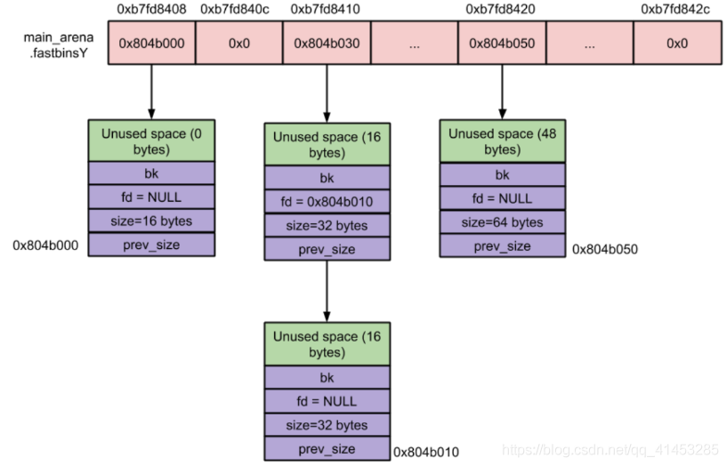
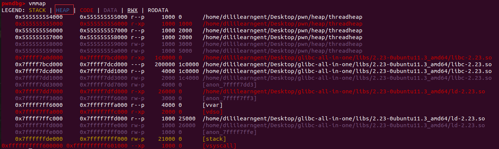
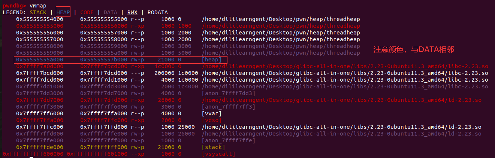
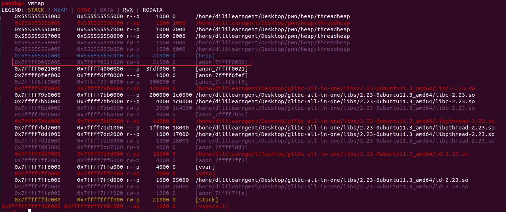
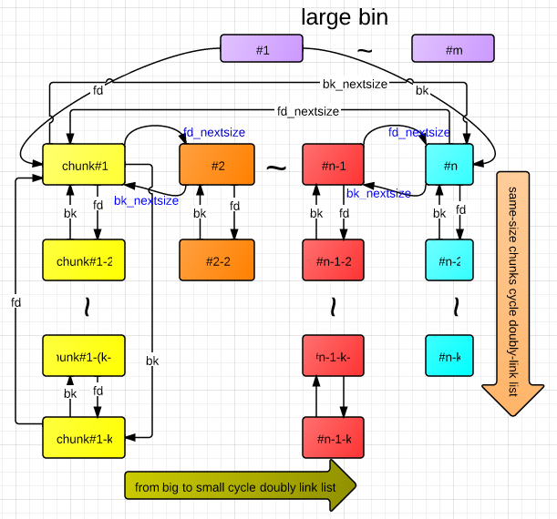

# 堆


```
pwndbg> heap
Allocated chunk | PREV_INUSE
Addr: 0x804d008
Size: 0x191

Allocated chunk | PREV_INUSE
Addr: 0x804d198
Size: 0x21

Allocated chunk | PREV_INUSE
Addr: 0x804d1b8
Size: 0x21

Allocated chunk | PREV_INUSE
Addr: 0x804d1d8
Size: 0x31

Top chunk | PREV_INUSE
Addr: 0x804d208
Size: 0x21df9
```


```
pwndbg> bins
tcachebins
empty
fastbins
0x10: 0x0
0x18: 0x0
0x20: 0x0
0x28: 0x0
0x30: 0x0
0x38: 0x0
0x40: 0x0
unsortedbin
all: 0x0
smallbins
empty
largebins
empty
```


```
pwndbg> heap
Allocated chunk | PREV_INUSE
Addr: 0x804d008
Size: 0x191

Allocated chunk | PREV_INUSE
Addr: 0x804d198
Size: 0x21

Allocated chunk | PREV_INUSE
Addr: 0x804d1b8
Size: 0x21

Allocated chunk | PREV_INUSE
Addr: 0x804d1d8
Size: 0x31

Top chunk | PREV_INUSE
Addr: 0x804d208
Size: 0x21df9
```


```
pwndbg> bins
tcachebins
0x18 [  2]: 0x804d1c0 —▸ 0x804d1a0 ◂— 0x0
fastbins
0x10: 0x0
0x18: 0x0
0x20: 0x0
0x28: 0x0
0x30: 0x0
0x38: 0x0
0x40: 0x0
unsortedbin
all: 0x0
smallbins
empty
largebins
empty
```


```
pwndbg> heap
Allocated chunk | PREV_INUSE
Addr: 0x804d008
Size: 0x191

Allocated chunk | PREV_INUSE
Addr: 0x804d198
Size: 0x21

Allocated chunk | PREV_INUSE
Addr: 0x804d1b8
Size: 0x21

Allocated chunk | PREV_INUSE
Addr: 0x804d1d8
Size: 0x31

Top chunk | PREV_INUSE
Addr: 0x804d208
Size: 0x21df9
```


```
pwndbg> bins
tcachebins
0x18 [  2]: 0x804d1c0 —▸ 0x804d1a0 ◂— 0x0
0x20 [  1]: 0x804d1e0 ◂— 0x0
fastbins
0x10: 0x0
0x18: 0x0
0x20: 0x0
0x28: 0x0
0x30: 0x0
0x38: 0x0
0x40: 0x0
unsortedbin
all: 0x0
smallbins
empty
largebins
empty
```


```
0x804d000  0x806f000 rw-p    22000 0      [heap]
```


### bins分类

#### fast bin

概念：为了快速重新分配回内存而存在的一个结构

fastbin特性：

+ **单链表存储**

  

  fastbinsY数组存储fastbins的规则:

  + fast bin中无论是添加还是移除fast chunk，都是对“链表尾”进行操作，而不会对某个中间的fast chunk进行操作

  + 单个fastbin链表中的chunk大小都是相同的，各个fastbin链表中的chunk大小是不同的。
  + fastbinY数组中的每个bin链表的排序，是按照链表元素的大小进行排序的。fastbin所包含chunk的大小为16 Bytes, 24 Bytes, 32 Bytes, … , 80 Bytes。当分配一块较小的内存(mem<=64 Bytes)时，会首先检查对应大小的fastbin中是否包含未被使用chunk，如果存在则直接将其从fastbin中移除并返回；否则通过其他方式（剪切top chunk）得到一块符合大小要求的chunk并返回。

+ **采用后进先出的方式维护链表**（LIFO）

+ **fastbins中的的chunk是不会合并的**（glibc规定这些chunk的PREV_INUSE位永远为1）


### malloc_consolidate

#### 理论

概念：将unsortedbin中的chunk在特定的条件下整理然后放入到smallbins或者largebins中。“consolidate”是要在特定的条件下才会发生的，并且与malloc紧密相关。

目的：对堆中的碎片chunk进行合并整理，减少堆中的碎片


#### 案例一

```
#include <unistd.h>
#include <malloc.h>
 
int main()
{
    void *p=malloc(0x30);
 
    sleep(0); //为了程序打断点使用
    free(p);
 
    void *p2=malloc(0x500);
    free(p2);
    return 0;
}
```

编译：其中第三行语句是用来切换glibc版本

```
dililearngent@dililearngent-virtual-machine:~/Desktop/pwn/heap$ vim consolidate.c
dililearngent@dililearngent-virtual-machine:~/Desktop/pwn/heap$ gcc -g -o consolidate consolidate.c 
dililearngent@dililearngent-virtual-machine:~/Desktop/pwn/heap$ patchelf --set-interpreter /home/dililearngent/Desktop/glibc-all-in-one/libs/2.23-0ubuntu11.3_amd64/ld-2.23.so --set-rpath /home/dililearngent/Desktop/glibc-all-in-one/libs/2.23-0ubuntu11.3_amd64 consolidate
```

第一步:在sleep处打断点，观察p申请内存后heap的情况，此时有一个正在使用的chunk和Top chunk

```
pwndbg> b sleep
Breakpoint 1 at 0x1090
pwndbg> r
...
pwndbg> heap
Allocated chunk | PREV_INUSE
Addr: 0x55555555a000
Size: 0x41

Top chunk | PREV_INUSE
Addr: 0x55555555a040
Size: 0x20fc1
```

第二步：在free(p)之后打断点，即选择在11行。此时根据释放内存大小将该chunk放入fastbins(也证明了fastbins在释放后也不会与Top chunk合并)

```
pwndbg> b 11
Breakpoint 2 at 0x11b9: file consolidate.c, line 11.
pwndbg> c
Continuing.
...
pwndbg> heap
Free chunk (fastbins) | PREV_INUSE
Addr: 0x55555555a000
Size: 0x41
fd: 0x00

Top chunk | PREV_INUSE
Addr: 0x55555555a040
Size: 0x20fc1

pwndbg> bins
fastbins
0x20: 0x0
0x30: 0x0
0x40: 0x55555555a000 ◂— 0x0
0x50: 0x0
0x60: 0x0
0x70: 0x0
0x80: 0x0
unsortedbin
all: 0x0
smallbins
empty
largebins
empty
```

第三步：重新申请p2，在12行打断点，观察heap

过程：系统去检测fastbins，发现fastbins中有一个freechunk，于是将freechunk移动到unsortedbin中，然后malloc去切unsortedbin中的这个freechunk，由于大小不够，发现不能够切割，于是就放入smallbin中，放入smallbin中之后便成为smallchunk了，就可以与topchunk合并了，于是就与topchunk合并。合并之后malloc从topchunk中申请一个堆块。**这里触发了unsortedbin的consolidate**

故下面的bins查看，可以看到bins链中没有任何freechunk

```
pwndbg> b 12
Breakpoint 3 at 0x5555555551c7: file consolidate.c, line 12.
pwndbg> c
Continuing.
pwndbg> heap
Allocated chunk | PREV_INUSE
Addr: 0x55555555a000
Size: 0x511

Top chunk | PREV_INUSE
Addr: 0x55555555a510
Size: 0x20af1

pwndbg> bins
fastbins
0x20: 0x0
0x30: 0x0
0x40: 0x0
0x50: 0x0
0x60: 0x0
0x70: 0x0
0x80: 0x0
unsortedbin
all: 0x0
smallbins
empty
largebins
empty
```

结论：

#### 案例二

```
#include <unistd.h>
#include <malloc.h>
 
int main()
{
    void *p=malloc(0x200);
    void *temp=malloc(0x30); //阻止p释放后与topchunk合并
 
    sleep(0); //为了程序打断点使用
    free(p);
 
    void *p2=malloc(0x500);
    free(p2);
    return 0;
}
```

编译过程同上

第一步：在sleep处打断点，观察p申请内存后heap的情况

```
pwndbg> b sleep
Breakpoint 1 at 0x1090
pwndbg> r
Starting program: /home/dililearngent/Desktop/pwn/heap/consolidate 
...
pwndbg> heap
Allocated chunk | PREV_INUSE
Addr: 0x55555555a000
Size: 0x211

Allocated chunk | PREV_INUSE
Addr: 0x55555555a210
Size: 0x41

Top chunk | PREV_INUSE
Addr: 0x55555555a250
Size: 0x20db1
```

第二步：在free(p)之后打断点，即选择在12行，观察此时的bins，将该free空间放在了unsortedbin，由于它与Top chunk之间还有一个内存区域，故没有合并

```
pwndbg> b 12
Breakpoint 2 at 0x5555555551c7: file consolidate.c, line 12.
pwndbg> c
Continuing.
...
pwndbg> heap
Free chunk (unsortedbin) | PREV_INUSE
Addr: 0x55555555a000
Size: 0x211
fd: 0x7ffff7dd1b78
bk: 0x7ffff7dd1b78

Allocated chunk
Addr: 0x55555555a210
Size: 0x40

Top chunk | PREV_INUSE
Addr: 0x55555555a250
Size: 0x20db1

pwndbg> bins
fastbins
0x20: 0x0
0x30: 0x0
0x40: 0x0
0x50: 0x0
0x60: 0x0
0x70: 0x0
0x80: 0x0
unsortedbin
all: 0x55555555a000 —▸ 0x7ffff7dd1b78 (main_arena+88) ◂— 0x55555555a000
smallbins
empty
largebins
empty
```

第三步：重新申请p2，在13行打断点，观察heap

过程：系统先去切割unsortedbin是否有可以用的大freechunk，发现0x500>0x200,不可以切割来使用，**触发unsortedbin的consolidate**，将0x55555555a000这个chunk分类到smallbins中去了，然后去第一次申请的大堆块上面申请了一块堆内存来使用

```
pwndbg> b 13
Breakpoint 3 at 0x5555555551d5: file consolidate.c, line 13.
pwndbg> c
Continuing.
...
pwndbg> heap
Free chunk (smallbins) | PREV_INUSE
Addr: 0x55555555a000
Size: 0x211
fd: 0x7ffff7dd1d78
bk: 0x7ffff7dd1d78

Allocated chunk
Addr: 0x55555555a210
Size: 0x40

Allocated chunk | PREV_INUSE
Addr: 0x55555555a250
Size: 0x511

Top chunk | PREV_INUSE
Addr: 0x55555555a760
Size: 0x208a1

pwndbg> bins
fastbins
0x20: 0x0
0x30: 0x0
0x40: 0x0
0x50: 0x0
0x60: 0x0
0x70: 0x0
0x80: 0x0
unsortedbin
all: 0x0
smallbins
0x210: 0x55555555a000 —▸ 0x7ffff7dd1d78 (main_arena+600) ◂— 0x55555555a000
largebins
empty
```

第四步：将p2释放后，由于与Top chunk相邻，故合并

```
pwndbg> heap
Free chunk (smallbins) | PREV_INUSE
Addr: 0x55555555a000
Size: 0x211
fd: 0x7ffff7dd1d78
bk: 0x7ffff7dd1d78

Allocated chunk
Addr: 0x55555555a210
Size: 0x40

Top chunk | PREV_INUSE
Addr: 0x55555555a250
Size: 0x20db1

pwndbg> bins
fastbins
0x20: 0x0
0x30: 0x0
0x40: 0x0
0x50: 0x0
0x60: 0x0
0x70: 0x0
0x80: 0x0
unsortedbin
all: 0x0
smallbins
0x210: 0x55555555a000 —▸ 0x7ffff7dd1d78 (main_arena+600) ◂— 0x55555555a000
largebins
empty
```

结论：

#### 案例三

```
#include<malloc.h>
#include<unistd.h>
 
int main(){
    int size = 0x60;
    void *p = malloc(size);
    void *junk = malloc(size);
    void *q = malloc(size);
    void *r = malloc(size); //防止q被释放之后，与topchunk合并
 
    sleep(0); //为了打断点使用
    free(p);
    free(q);
 
    malloc(0x400);
    return 0;
}
```

编译过程同上

第一步：在sleep处打断点，观察p申请内存后heap的情况,按正常情况分配了相应大小的chunk

```
pwndbg> b sleep
Breakpoint 1 at 0x1090
pwndbg> r
Starting program: /home/dililearngent/Desktop/pwn/heap/consolidate
...
pwndbg> heap
Allocated chunk | PREV_INUSE
Addr: 0x55555555a000
Size: 0x71

Allocated chunk | PREV_INUSE
Addr: 0x55555555a070
Size: 0x71

Allocated chunk | PREV_INUSE
Addr: 0x55555555a0e0
Size: 0x71

Allocated chunk | PREV_INUSE
Addr: 0x55555555a150
Size: 0x71

Top chunk | PREV_INUSE
Addr: 0x55555555a1c0
Size: 0x20e41
```

第二步：释放p和q，将断点设置在15行，此时p和q均放在了fastbins

```
pwndbg> b 15
Breakpoint 2 at 0x555555555202: file consolidate.c, line 15.
pwndbg> c
Continuing.
...
pwndbg> heap
Free chunk (fastbins) | PREV_INUSE         //p
Addr: 0x55555555a000
Size: 0x71
fd: 0x00

Allocated chunk | PREV_INUSE
Addr: 0x55555555a070
Size: 0x71

Free chunk (fastbins) | PREV_INUSE         //q
Addr: 0x55555555a0e0
Size: 0x71
fd: 0x55555555a000

Allocated chunk | PREV_INUSE
Addr: 0x55555555a150
Size: 0x71

Top chunk | PREV_INUSE
Addr: 0x55555555a1c0
Size: 0x20e41

pwndbg> bins
fastbins
0x20: 0x0
0x30: 0x0
0x40: 0x0
0x50: 0x0
0x60: 0x0
0x70: 0x55555555a0e0 —▸ 0x55555555a000 ◂— 0x0          //单向链表
0x80: 0x0
unsortedbin
all: 0x0
smallbins
empty
largebins
empty
```

第三步：重新申请内存

过程：申请一个大于smallchunk大小的堆空间（两个在fastbins上面的空闲chunk先被整理到了unsortedbin上，然后不够malloc(0x400)使用，就**被unsortedbin通过consolidate**整理到了smallbins上），因为没有bins链中没有满足条件的chunk使用，所以就去第一次申请的大堆块上面取空间来使用。

因为两个fastchunk从fastbins中移到了smallbins中，所以其fd和bk改变了（从单链表存储变为了双向循环列表存储）

```
pwndbg> b 16
Breakpoint 3 at 0x55555555520c: file consolidate.c, line 16.
pwndbg> c
Continuing.
...
pwndbg> heap
Free chunk (smallbins) | PREV_INUSE     //之前的p
Addr: 0x55555555a000
Size: 0x71
fd: 0x55555555a0e0
bk: 0x7ffff7dd1bd8

Allocated chunk
Addr: 0x55555555a070
Size: 0x70

Free chunk (smallbins) | PREV_INUSE     //之前的q
Addr: 0x55555555a0e0
Size: 0x71
fd: 0x7ffff7dd1bd8
bk: 0x55555555a000

Allocated chunk
Addr: 0x55555555a150
Size: 0x70

Allocated chunk | PREV_INUSE             //在Top chunk申请的内存
Addr: 0x55555555a1c0
Size: 0x411

Top chunk | PREV_INUSE
Addr: 0x55555555a5d0
Size: 0x20a31

pwndbg> bins
fastbins
0x20: 0x0
0x30: 0x0
0x40: 0x0
0x50: 0x0
0x60: 0x0
0x70: 0x0
0x80: 0x0
unsortedbin
all: 0x0
smallbins
0x70: 0x55555555a000 —▸ 0x55555555a0e0 —▸ 0x7ffff7dd1bd8 (main_arena+184) ◂— 0x55555555a000
largebins
empty
```

结论：

#### 案例四

```
#include<malloc.h>
#include<unistd.h>
 
int main(){
    int size = 0x60;
    void *p = malloc(size);
    void *q = malloc(size);
    void *r = malloc(size); //防止q被释放之后，与topchunk合并
 
 
    sleep(0); //为了打断点使用
    free(p);
    free(q);
 
    malloc(0x400);
 
    return 0;
}
```

编译过程同上

第一步：在sleep处打断点，观察p申请内存后heap的情况,按正常情况分配了相应大小的chunk

```
pwndbg> b sleep
Breakpoint 1 at 0x1090
pwndbg> r
Starting program: /home/dililearngent/Desktop/pwn/heap/consolidate 
...
pwndbg> heap
Allocated chunk | PREV_INUSE           //p
Addr: 0x55555555a000
Size: 0x71

Allocated chunk | PREV_INUSE           //q
Addr: 0x55555555a070
Size: 0x71

Allocated chunk | PREV_INUSE
Addr: 0x55555555a0e0
Size: 0x71

Top chunk | PREV_INUSE
Addr: 0x55555555a150
Size: 0x20eb1
```

第二步：释放p和q，将断点设置在15行，此时p和q均放在了fastbins

```
pwndbg> b 15
Breakpoint 2 at 0x5555555551f1: file consolidate.c, line 15.
pwndbg> c
Continuing.
...
pwndbg> heap
Free chunk (fastbins) | PREV_INUSE        //p
Addr: 0x55555555a000
Size: 0x71
fd: 0x00

Free chunk (fastbins) | PREV_INUSE       //q
Addr: 0x55555555a070
Size: 0x71
fd: 0x55555555a000

Allocated chunk | PREV_INUSE
Addr: 0x55555555a0e0
Size: 0x71

Top chunk | PREV_INUSE
Addr: 0x55555555a150
Size: 0x20eb1

pwndbg> bins
fastbins
0x20: 0x0
0x30: 0x0
0x40: 0x0
0x50: 0x0
0x60: 0x0
0x70: 0x55555555a070 —▸ 0x55555555a000 ◂— 0x0
0x80: 0x0
unsortedbin
all: 0x0
smallbins
empty
largebins
empty
```

第三步：malloc(0x400)，此时可以看到原本在fastbin中的两个freechunk由于是物理相邻的，所以**在consolidate的过程中**两者被整理合并了，然后一起放入smallbin中了（这个其实和案例三差不多，案例三在p和q之间有junk）

```
pwndbg> b 17
Breakpoint 3 at 0x5555555551fb: file consolidate.c, line 17.
pwndbg> c
Continuing.
...
pwndbg> heap
Free chunk (smallbins) | PREV_INUSE             //合并后的p和q
Addr: 0x55555555a000
Size: 0xe1
fd: 0x7ffff7dd1c48
bk: 0x7ffff7dd1c48

Allocated chunk
Addr: 0x55555555a0e0
Size: 0x70

Allocated chunk | PREV_INUSE
Addr: 0x55555555a150
Size: 0x411

Top chunk | PREV_INUSE
Addr: 0x55555555a560
Size: 0x20aa1

pwndbg> bins
fastbins
0x20: 0x0
0x30: 0x0
0x40: 0x0
0x50: 0x0
0x60: 0x0
0x70: 0x0
0x80: 0x0
unsortedbin
all: 0x0
smallbins
0xe0: 0x55555555a000 —▸ 0x7ffff7dd1c48 (main_arena+296) ◂— 0x55555555a000
largebins
empty
```

结论：

参考链接：https://dongshao.blog.csdn.net/article/details/97627411

### 多线程中的堆内存结构

#### 主线程

##### 理论

- 当程序只有一个线程（主线程）时，程序申请的堆是在堆区的（heap）
- 如果通过查看内存段信息：如果heap与程序的data段相邻，则堆块是有brk系统调用获得的，否则是由mmap系统调用申请的（mmap不与data段相邻）

##### 案例

```
#include <unistd.h>
#include <malloc.h>
 
int main()
{
	int size=0x100;
	sleep(0);  //程序打断点使用 
	void *p=malloc(size);	
	sleep(0);
	free(p);	
	return 0;
}
```

编译：

```
dililearngent@dililearngent-virtual-machine:~/Desktop/pwn/heap$ vim threadheap.c
dililearngent@dililearngent-virtual-machine:~/Desktop/pwn/heap$ gcc -g -o threadheap threadheap.c
dililearngent@dililearngent-virtual-machine:~/Desktop/pwn/heap$ patchelf --set-interpreter /home/dililearngent/Desktop/glibc-all-in-one/libs/2.23-0ubuntu11.3_amd64/ld-2.23.so --set-rpath /home/dililearngent/Desktop/glibc-all-in-one/libs/2.23-0ubuntu11.3_amd64 threadheap
```

第一步：在sleep处下断点，运行到第一个sleep断点处

```
pwndbg> b sleep
Breakpoint 1 at 0x1090
pwndbg> r
Starting program: /home/dililearngent/Desktop/pwn/heap/threadheap 
```

vmmap查看内存情况，发现程序此时没有堆



第二步:c继续运行，来到第二个sleep断点处，程序malloc创建了堆区，大小为21000。并且与程序的DATA断相邻，所有heap是通过brk系统调用创建的。



#### 多线程

##### 理论

+ 子线程与主线程的堆不是在同一个内存段中的，是处于不同的区域的。
+ 子线程的堆块是通过mmap系统调用申请的，所以子线程的堆不与DATA段相邻。
+ 子线程中chunk的NON_MAIN_ARNEA位为1，因为其不是有main_arena所管理的。
+ 子线程的各种堆信息不能通过gdb的heap和bins命令来查看，需要通过查看内存单元来查看

子线程与arena的关系：

- 如果malloc是在主线程中创建的，那么多个子线程共用这一个malloc申请出来的arena，这个就是main_arena。
- 如果在子线程执行函数中使用malloc函数申请的堆块，这个堆块的arena只给这个子线程使用，这就是thread_arena。

##### 案例

```
#include <unistd.h>
#include <malloc.h>
#include <pthread.h>
 
void *threadFunc(void *arg)
{
    int size=0x200;
    sleep(0);
    void *q=malloc(size);
    printf("%p\n",q);  //打印一下这个堆的地址在何处
    sleep(0);
    free(q);
    sleep(0);
}
 
int main()
{
    int size=0x100;
    void *p=malloc(size);
    free(p);
	
    pthread_t t1;
    void *s;
    int ret;
	
    ret=pthread_create(&t1,NULL,threadFunc,NULL); //线程创建并执行
    ret=pthread_join(t1,&s);  //等待子线程执行完成
    
    sleep(0);
    return 0;
}
```

编译：

```
dililearngent@dililearngent-virtual-machine:~/Desktop/pwn/heap$ vim threadheap.c
dililearngent@dililearngent-virtual-machine:~/Desktop/pwn/heap$ gcc -g -o threadheap threadheap.c
/usr/bin/ld: /tmp/ccTWBwtg.o: in function `main':
/home/dililearngent/Desktop/pwn/heap/threadheap.c:26: undefined reference to `pthread_create'
/usr/bin/ld: /home/dililearngent/Desktop/pwn/heap/threadheap.c:27: undefined reference to `pthread_join'
collect2: error: ld returned 1 exit status
dililearngent@dililearngent-virtual-machine:~/Desktop/pwn/heap$ gcc -g -o threadheap threadheap.c -lpthread
dililearngent@dililearngent-virtual-machine:~/Desktop/pwn/heap$ patchelf --set-interpreter /home/dililearngent/Desktop/glibc-all-in-one/libs/2.23-0ubuntu11.3_amd64/ld-2.23.so --set-rpath /home/dililearngent/Desktop/glibc-all-in-one/libs/2.23-0ubuntu11.3_amd64 threadheap
```

注：如果gcc在编译的时候出现如上错误，需要在编译的时候加上-lpthread

第一步：在sleep处下断点，r运行；程序断在第一个sleep处（第8行），参看当前线程信息可以发现

```
pwndbg> info threads
  Id   Target Id              Frame 
  1    LWP 11637 "threadheap" 0x00007ffff7bc298d in pthread_join () from /home/dililearngent/Desktop/glibc-all-in-one/libs/2.23-0ubuntu11.3_amd64/libpthread.so.0
  
* 2    LWP 11641 "threadheap" __sleep (seconds=0) at ../sysdeps/posix/sleep.c:34
```

第二步：c继续运行，程序断在第二个sleep处（第11行），此时程序打印出0x7ffff00008c0

```
pwndbg> c
Continuing.
0x7ffff00008c0
```

子线程的堆块与主线程的heap段不在同一个段中，这说明子线程的堆块是通过mmap系统调用申请的。



第三步：打印出的地址是q指针的起始地址0x7ffff00008c0，所以chunk的起始地址是0x7ffff00008c0-0x10=0x7ffff00008b0（因为malloc分配的空间的指针地址是从chunk的fd指针开始的）。查看0x7ffff00008b0就能看到p所指向的chunk的详细信息。该chunk的mchunk_size是0x215（malloc的0x200+chunk的前两个成员0x10+chunk的NON_MAIN_ARENA和PREV_INUSE位都为1就是0x5）

```
pwndbg> x /20gx 0x7ffff00008c0-0x10
0x7ffff00008b0:	0x0000000000000000	0x0000000000000215
0x7ffff00008c0:	0x0000000000000000	0x0000000000000000
0x7ffff00008d0:	0x0000000000000000	0x0000000000000000
0x7ffff00008e0:	0x0000000000000000	0x0000000000000000
0x7ffff00008f0:	0x0000000000000000	0x0000000000000000
0x7ffff0000900:	0x0000000000000000	0x0000000000000000
0x7ffff0000910:	0x0000000000000000	0x0000000000000000
0x7ffff0000920:	0x0000000000000000	0x0000000000000000
0x7ffff0000930:	0x0000000000000000	0x0000000000000000
0x7ffff0000940:	0x0000000000000000	0x0000000000000000
```

第四步：**子线程中的printf也是需要堆缓冲区的**，并且这个堆缓冲区在我们创建的chunk后面的（高地址处），所以通过查看内存0x7ffff00008b0+0x210（0x210就是我们申请的chunk的大小地址空间）就可以看到这个printf堆缓冲区的起始位置。

```
pwndbg> x /20gx 0x7ffff00008b0+0x210
0x7ffff0000ac0:	0x0000000000000000	0x0000000000000415
0x7ffff0000ad0:	0x3066666666377830	0x000a306338303030
0x7ffff0000ae0:	0x0000000000000000	0x0000000000000000
0x7ffff0000af0:	0x0000000000000000	0x0000000000000000
0x7ffff0000b00:	0x0000000000000000	0x0000000000000000
0x7ffff0000b10:	0x0000000000000000	0x0000000000000000
0x7ffff0000b20:	0x0000000000000000	0x0000000000000000
0x7ffff0000b30:	0x0000000000000000	0x0000000000000000
0x7ffff0000b40:	0x0000000000000000	0x0000000000000000
0x7ffff0000b50:	0x0000000000000000	0x0000000000000000
```

第五步：这个printf的堆缓冲区的大小为0x415(实际是0x410)，fd成员是从0x7ffff0000ad0处开始的。查看一下printf的内容(即打印的内容)

```
pwndbg> x /s 0x7ffff0000ad0
0x7ffff0000ad0:	"0x7ffff00008c0\n"
```

第六步：printf的堆缓冲区基地址+printf堆缓冲区的大小来到“topchunk”的基地址处来查看“topchunk”的内容

```
pwndbg> x /20gx 0x7ffff0000ac0+0x410
0x7ffff0000ed0:	0x0000000000000000	0x0000000000020131
0x7ffff0000ee0:	0x0000000000000000	0x0000000000000000
0x7ffff0000ef0:	0x0000000000000000	0x0000000000000000
0x7ffff0000f00:	0x0000000000000000	0x0000000000000000
0x7ffff0000f10:	0x0000000000000000	0x0000000000000000
0x7ffff0000f20:	0x0000000000000000	0x0000000000000000
0x7ffff0000f30:	0x0000000000000000	0x0000000000000000
0x7ffff0000f40:	0x0000000000000000	0x0000000000000000
0x7ffff0000f50:	0x0000000000000000	0x0000000000000000
0x7ffff0000f60:	0x0000000000000000	0x0000000000000000
```

第七步：c继续执行，断在子线程的第三个sleep处（第13行），chunk被free后，其信息发生了变化，mchunk_size变成了0x211(NON_MAIN_ARENA变成了0)

因为其被释放了，释放之后就会被放到arena对应的链表中所管理。我们知道freechunk会被加入到unsortedbin中去，并且chunk的fd和bk的指针会指向于bins链的地址处。因为这个chunk是bins链中的第一个且唯一一个chunk，所以其fd和bk是相同的

```
pwndbg> x /20gx 0x7ffff00008b0
0x7ffff00008b0:	0x0000000000000000	0x0000000000000211
0x7ffff00008c0:	0x00007ffff0000078	0x00007ffff0000078               //fd与bk
0x7ffff00008d0:	0x0000000000000000	0x0000000000000000
0x7ffff00008e0:	0x0000000000000000	0x0000000000000000
0x7ffff00008f0:	0x0000000000000000	0x0000000000000000
0x7ffff0000900:	0x0000000000000000	0x0000000000000000
0x7ffff0000910:	0x0000000000000000	0x0000000000000000
0x7ffff0000920:	0x0000000000000000	0x0000000000000000
0x7ffff0000930:	0x0000000000000000	0x0000000000000000
0x7ffff0000940:	0x0000000000000000	0x0000000000000000
```

第八步：通过地址可以推断出，0x00007ffff0000078这个地址是从表示arena的malloc_state结构体的开头偏移的，所以我们就可以查看0x00007ffff0000000这个地址，这个地址就是我们arena的地址，也就是malloc_state结构体的起始地址。

```
pwndbg> x /20gx 0x00007ffff0000000
0x7ffff0000000:	0x00007ffff0000020	0x0000000000000000
0x7ffff0000010:	0x0000000000021000	0x0000000000021000
0x7ffff0000020:	0x0000000300000000	0x0000000000000000
0x7ffff0000030:	0x0000000000000000	0x0000000000000000
0x7ffff0000040:	0x0000000000000000	0x0000000000000000
0x7ffff0000050:	0x0000000000000000	0x0000000000000000
0x7ffff0000060:	0x0000000000000000	0x0000000000000000
0x7ffff0000070:	0x0000000000000000	0x00007ffff0000ed0
0x7ffff0000080:	0x0000000000000000	0x00007ffff00008b0
0x7ffff0000090:	0x00007ffff00008b0	0x00007ffff0000088
```

参考链接：https://dongshao.blog.csdn.net/article/details/97645903

### last remainder

#### 案例一

```
#include<stdio.h>
#include<malloc.h>
#include<unistd.h>
#include<string.h>
int main()
{
    int size = 0x120;
    void *p = malloc(size);
    void *junk = malloc(size);  //放置释放p和q之后，p和q发生合并
    void *q = malloc(size);
    void *r = malloc(size);   //放置释放q之后，q和topchunk发生合并
    
    sleep(0);  //为了打断点使用
    free(p);
	
    sleep(0);
    free(q);
	
    sleep(0);
    malloc(0x90);
    sleep(0);
 
    return 0;
}
```

编译：

```
dililearngent@dililearngent-virtual-machine:~/Desktop/pwn/heap$ vim lastremainder.c
dililearngent@dililearngent-virtual-machine:~/Desktop/pwn/heap$ gcc -g -o lastremainder lastremainder.c
dililearngent@dililearngent-virtual-machine:~/Desktop/pwn/heap$ patchelf --set-interpreter /home/dililearngent/Desktop/glibc-all-in-one/libs/2.23-0ubuntu11.3_amd64/ld-2.23.so --set-rpath /home/dililearngent/Desktop/glibc-all-in-one/libs/2.23-0ubuntu11.3_amd64 lastremainder
```

第一步：sleep处下断点，查看malloc分配后的chunk

```
pwndbg> heap
Allocated chunk | PREV_INUSE            //p
Addr: 0x55555555a000
Size: 0x131

Allocated chunk | PREV_INUSE           //junk
Addr: 0x55555555a130
Size: 0x131

Allocated chunk | PREV_INUSE           //q
Addr: 0x55555555a260
Size: 0x131

Allocated chunk | PREV_INUSE          //r
Addr: 0x55555555a390
Size: 0x131

Top chunk | PREV_INUSE
Addr: 0x55555555a4c0
Size: 0x20b41
```

第二步：断在了第二个sleep处，此时程序free(p),根据空间大小，p加入了unsortedbin

```
pwndbg> heap
Free chunk (unsortedbin) | PREV_INUSE        //p
Addr: 0x55555555a000
Size: 0x131
fd: 0x7ffff7dd1b78
bk: 0x7ffff7dd1b78

Allocated chunk                             //junk
Addr: 0x55555555a130
Size: 0x130

Allocated chunk | PREV_INUSE               //q
Addr: 0x55555555a260
Size: 0x131

Allocated chunk | PREV_INUSE               //r
Addr: 0x55555555a390
Size: 0x131

Top chunk | PREV_INUSE
Addr: 0x55555555a4c0
Size: 0x20b41

pwndbg> bins
fastbins
0x20: 0x0
0x30: 0x0
0x40: 0x0
0x50: 0x0
0x60: 0x0
0x70: 0x0
0x80: 0x0
unsortedbin
all: 0x55555555a000 —▸ 0x7ffff7dd1b78 (main_arena+88) ◂— 0x55555555a000
smallbins
empty
largebins
empty
```

第三步：断在了第三个sleep处，q加入unsortedbin

```
pwndbg> heap
Free chunk (unsortedbin) | PREV_INUSE       //p
Addr: 0x55555555a000
Size: 0x131
fd: 0x7ffff7dd1b78
bk: 0x55555555a260

Allocated chunk                            //junk
Addr: 0x55555555a130
Size: 0x130

Free chunk (unsortedbin) | PREV_INUSE      //q
Addr: 0x55555555a260
Size: 0x131
fd: 0x55555555a000
bk: 0x7ffff7dd1b78

Allocated chunk                           //r
Addr: 0x55555555a390
Size: 0x130

Top chunk | PREV_INUSE
Addr: 0x55555555a4c0
Size: 0x20b41

pwndbg> bins
fastbins
0x20: 0x0
0x30: 0x0
0x40: 0x0
0x50: 0x0
0x60: 0x0
0x70: 0x0
0x80: 0x0
unsortedbin
all: 0x55555555a260 —▸ 0x55555555a000 —▸ 0x7ffff7dd1b78 (main_arena+88) ◂— 0x55555555a260
smallbins
empty
largebins
empty
```

第四步：来到第四个sleep，此时申请了一块0x90的chunk，根据unsortedbin的特性可知先切割p，原先的0x130的堆块前0xa0给malloc使用了，剩下的0x30就是我们的last remainder
并且通过bins可以看到，此次切割还触发了一次unsortedbin的consolidate，使q所指的chunk被整理到了smallbin中，但是切割之后的last remainder还留在unsortedbin中

```
pwndbg> heap
Allocated chunk | PREV_INUSE                         //之前的p，被切割使用的部分
Addr: 0x55555555a000
Size: 0xa1

Free chunk (unsortedbin) | PREV_INUSE               //切割剩余的p，被放在unsortedbin的Free chunk
Addr: 0x55555555a0a0
Size: 0x91
fd: 0x7ffff7dd1b78
bk: 0x7ffff7dd1b78

Allocated chunk                                      //junk
Addr: 0x55555555a130
Size: 0x130

Free chunk (smallbins) | PREV_INUSE                 //q
Addr: 0x55555555a260
Size: 0x131
fd: 0x7ffff7dd1c98
bk: 0x7ffff7dd1c98

Allocated chunk                                     //r
Addr: 0x55555555a390
Size: 0x130

Top chunk | PREV_INUSE
Addr: 0x55555555a4c0
Size: 0x20b41

pwndbg> bins
fastbins
0x20: 0x0
0x30: 0x0
0x40: 0x0
0x50: 0x0
0x60: 0x0
0x70: 0x0
0x80: 0x0
unsortedbin
all: 0x55555555a0a0 —▸ 0x7ffff7dd1b78 (main_arena+88) ◂— 0x55555555a0a0
smallbins
0x130: 0x55555555a260 —▸ 0x7ffff7dd1c98 (main_arena+376) ◂— 0x55555555a260
largebins
empty
```

#### 案例二

```
#include <unistd.h>
#include <malloc.h>
 
int main()
{
    int size=0x30;
    int size2=0x200;
 
    int *p1=malloc(size);
    int *p2=malloc(size2);
    int *temp=malloc(size); //防止p2和p3都被释放之后，p2和p3发生合并
    int *p3=malloc(size2);
    int *temp2=malloc(size); //防止p3被释放之后与topchunk合并
 
    sleep(0);  //只为打断点使用
    free(p1);
 
    sleep(0);
    free(p2);
    free(p3);
 
    sleep(0);
    malloc(0x100);
 
    sleep(0);
    return 0;
}
```

第一步：sleep处下断点，查看malloc分配后的chunk

```
pwndbg> heap
Allocated chunk | PREV_INUSE         //p1
Addr: 0x55555555a000
Size: 0x41

Allocated chunk | PREV_INUSE        //p2
Addr: 0x55555555a040
Size: 0x211

Allocated chunk | PREV_INUSE        //temp
Addr: 0x55555555a250
Size: 0x41

Allocated chunk | PREV_INUSE        //p3
Addr: 0x55555555a290
Size: 0x211

Allocated chunk | PREV_INUSE        //temp2
Addr: 0x55555555a4a0
Size: 0x41

Top chunk | PREV_INUSE
Addr: 0x55555555a4e0
Size: 0x20b21
```

第二步：断在第二个sleep处，根据大小，p1放在了fastbins处

```
pwndbg> heap
Free chunk (fastbins) | PREV_INUSE       //p1
Addr: 0x55555555a000
Size: 0x41
fd: 0x00

Allocated chunk | PREV_INUSE
Addr: 0x55555555a040
Size: 0x211

Allocated chunk | PREV_INUSE
Addr: 0x55555555a250
Size: 0x41

Allocated chunk | PREV_INUSE
Addr: 0x55555555a290
Size: 0x211

Allocated chunk | PREV_INUSE
Addr: 0x55555555a4a0
Size: 0x41

Top chunk | PREV_INUSE
Addr: 0x55555555a4e0
Size: 0x20b21
```

第三步:断在第三个sleep处，释放了p2和p3

```
pwndbg> heap
Free chunk (fastbins) | PREV_INUSE            //p1
Addr: 0x55555555a000
Size: 0x41
fd: 0x00

Free chunk (unsortedbin) | PREV_INUSE         //p2
Addr: 0x55555555a040
Size: 0x211
fd: 0x7ffff7dd1b78
bk: 0x55555555a290

Allocated chunk                              //temp
Addr: 0x55555555a250
Size: 0x40

Free chunk (unsortedbin) | PREV_INUSE        //p3
Addr: 0x55555555a290
Size: 0x211
fd: 0x55555555a040
bk: 0x7ffff7dd1b78

Allocated chunk                              //temp2
Addr: 0x55555555a4a0
Size: 0x40

Top chunk | PREV_INUSE
Addr: 0x55555555a4e0
Size: 0x20b21
```

第四步：申请了一个0x100的堆块，此时会去切割unsortedbin中的freechunk，并且触发consolidate，但是这个consolidate没有去整理fastbins，fastbins中的chunk没有变动。

```
pwndbg> heap
Free chunk (fastbins) | PREV_INUSE         //p1
Addr: 0x55555555a000
Size: 0x41
fd: 0x00

Allocated chunk | PREV_INUSE              //之前的p2，现在被切割成使用的部分
Addr: 0x55555555a040
Size: 0x111

Free chunk (unsortedbin) | PREV_INUSE     //之前的p2，切割后剩余的部分，被放在unsortedbin的Free chunk
Addr: 0x55555555a150
Size: 0x101
fd: 0x7ffff7dd1b78
bk: 0x7ffff7dd1b78

Allocated chunk                          //temp
Addr: 0x55555555a250
Size: 0x40

Free chunk (smallbins) | PREV_INUSE      //p3
Addr: 0x55555555a290
Size: 0x211
fd: 0x7ffff7dd1d78
bk: 0x7ffff7dd1d78

Allocated chunk                          //temp2
Addr: 0x55555555a4a0
Size: 0x40

Top chunk | PREV_INUSE
Addr: 0x55555555a4e0
Size: 0x20b21

pwndbg> bins
fastbins
0x20: 0x0
0x30: 0x0
0x40: 0x55555555a000 ◂— 0x0
0x50: 0x0
0x60: 0x0
0x70: 0x0
0x80: 0x0
unsortedbin
all: 0x55555555a150 —▸ 0x7ffff7dd1b78 (main_arena+88) ◂— 0x55555555a150
smallbins
0x210: 0x55555555a290 —▸ 0x7ffff7dd1d78 (main_arena+600) ◂— 0x55555555a290
largebins
empty
```

#### 案例三

```
#include <unistd.h>
#include <malloc.h>
 
int main()
{
    int size=0x300;
    
    int *p1=malloc(size);
    int *p2=malloc(size);  //防止p1被释放之后与topchunk合并
    
    sleep(0);  //为了程序打断点使用
    free(p1);
 
    sleep(0);
    malloc(0x700);
 
    sleep(0);
    malloc(0x200);
 
    return 0;
}
```

第一步：sleep处下断点，查看malloc分配后的chunk

```
pwndbg> heap
Allocated chunk | PREV_INUSE               //p1
Addr: 0x55555555a000
Size: 0x311

Allocated chunk | PREV_INUSE              //p2
Addr: 0x55555555a310
Size: 0x311

Top chunk | PREV_INUSE
Addr: 0x55555555a620
Size: 0x209e1
```

第二步：断在第2个sleep处，free(p1)后将p1放在了unsortedbin

```
pwndbg> heap
Free chunk (unsortedbin) | PREV_INUSE     //p1
Addr: 0x55555555a000
Size: 0x311
fd: 0x7ffff7dd1b78
bk: 0x7ffff7dd1b78

Allocated chunk                           //p2
Addr: 0x55555555a310
Size: 0x310

Top chunk | PREV_INUSE
Addr: 0x55555555a620
Size: 0x209e1
```

第三步：断在第三个sleep，malloc(0x700)的堆块，此时unsortedbin中的chunk（p1）被整理到smallbins中。而0x700在Top chunk中分配

```
pwndbg> heap
Free chunk (smallbins) | PREV_INUSE           //p1
Addr: 0x55555555a000
Size: 0x311
fd: 0x7ffff7dd1e78
bk: 0x7ffff7dd1e78

Allocated chunk                               //p2
Addr: 0x55555555a310
Size: 0x310

Allocated chunk | PREV_INUSE                  //malloc(0x700)
Addr: 0x55555555a620
Size: 0x711

Top chunk | PREV_INUSE
Addr: 0x55555555ad30
Size: 0x202d1

pwndbg> bins
fastbins
0x20: 0x0
0x30: 0x0
0x40: 0x0
0x50: 0x0
0x60: 0x0
0x70: 0x0
0x80: 0x0
unsortedbin
all: 0x0
smallbins
0x310: 0x55555555a000 —▸ 0x7ffff7dd1e78 (main_arena+856) ◂— 0x55555555a000
largebins
empty
```

第四步:申请一个0x200的堆块，申请的时候malloc发现smallbins中有满足的chunk可以切割，于是就去切割smallbins中的堆块，并产生last remainder，将last remainder放入unsortedbin中

```
pwndbg> heap
Allocated chunk | PREV_INUSE                   //原p1，malloc(0x200)后切割
Addr: 0x55555555a000
Size: 0x211

Free chunk (unsortedbin) | PREV_INUSE          //切割后剩余的部分
Addr: 0x55555555a210
Size: 0x101
fd: 0x7ffff7dd1b78
bk: 0x7ffff7dd1b78

Allocated chunk                                //p2
Addr: 0x55555555a310
Size: 0x310

Allocated chunk | PREV_INUSE                   //malloc(0x700)
Addr: 0x55555555a620
Size: 0x711

Top chunk | PREV_INUSE
Addr: 0x55555555ad30
Size: 0x202d1

pwndbg> bins
fastbins
0x20: 0x0
0x30: 0x0
0x40: 0x0
0x50: 0x0
0x60: 0x0
0x70: 0x0
0x80: 0x0
unsortedbin
all: 0x55555555a210 —▸ 0x7ffff7dd1b78 (main_arena+88) ◂— 0x55555555a210
smallbins
empty
largebins
empty
```

#### 案例四

```
#include <unistd.h>
#include <malloc.h>
 
int main()
{
    int size=0x300;
    
    int *temp=malloc(0x30);
    int *p1=malloc(size);
 
    //防止p1释放并consolidate到smallbins中之后，再释放p2导致p1和p2合并，合并之后又被放入unsortedbin中
    int *temp2=malloc(0x30);
 
    int *p2=malloc(0x100); 
    int *p3=malloc(size);//防止p2被释放之后与topchunk合并
    
    sleep(0);  //为了程序打断点使用
    free(p1);
 
    sleep(0);
    malloc(0x700);
    
    sleep(0);
    free(temp);
    free(p2);
 
    sleep(0);
    malloc(0x200);
 
    return 0;
}
```

第一步:在sleep处打断点，查看chunk的分配情况

```
pwndbg> heap
Allocated chunk | PREV_INUSE                 //temp
Addr: 0x55555555a000
Size: 0x41

Allocated chunk | PREV_INUSE                //p1
Addr: 0x55555555a040
Size: 0x311

Allocated chunk | PREV_INUSE                //temp2
Addr: 0x55555555a350
Size: 0x41

Allocated chunk | PREV_INUSE                //p2
Addr: 0x55555555a390
Size: 0x111

Allocated chunk | PREV_INUSE                //p3
Addr: 0x55555555a4a0
Size: 0x311

Top chunk | PREV_INUSE
Addr: 0x55555555a7b0
Size: 0x20851
```

第二步:断在第二个sleep处，p1放在了unsortedbin

```
pwndbg> heap
Allocated chunk | PREV_INUSE                    //temp
Addr: 0x55555555a000
Size: 0x41

Free chunk (unsortedbin) | PREV_INUSE           //p1
Addr: 0x55555555a040
Size: 0x311
fd: 0x7ffff7dd1b78
bk: 0x7ffff7dd1b78

Allocated chunk                                 //temp2
Addr: 0x55555555a350
Size: 0x40
 
Allocated chunk | PREV_INUSE                    //p2
Addr: 0x55555555a390
Size: 0x111

Allocated chunk | PREV_INUSE                    //p3
Addr: 0x55555555a4a0
Size: 0x311

Top chunk | PREV_INUSE
Addr: 0x55555555a7b0
Size: 0x20851
```

第三步:断在第三个sleep处，malloc(0x700)申请0x700大小的内存，将unsortedbin中的p1整理到smallbin中

```
pwndbg> heap
Allocated chunk | PREV_INUSE                  //temp
Addr: 0x55555555a000
Size: 0x41

Free chunk (smallbins) | PREV_INUSE           //p1
Addr: 0x55555555a040
Size: 0x311
fd: 0x7ffff7dd1e78
bk: 0x7ffff7dd1e78

Allocated chunk                               //temp2
Addr: 0x55555555a350
Size: 0x40

Allocated chunk | PREV_INUSE                  //p2
Addr: 0x55555555a390
Size: 0x111

Allocated chunk | PREV_INUSE                  //p3
Addr: 0x55555555a4a0
Size: 0x311

Allocated chunk | PREV_INUSE                  //malloc(0x700)
Addr: 0x55555555a7b0
Size: 0x711

Top chunk | PREV_INUSE
Addr: 0x55555555aec0
Size: 0x20141
```

第四步：接着释放temp和p2

```
pwndbg> heap
Free chunk (fastbins) | PREV_INUSE            //temp
Addr: 0x55555555a000
Size: 0x41
fd: 0x00

Free chunk (smallbins) | PREV_INUSE           //p1
Addr: 0x55555555a040
Size: 0x311
fd: 0x7ffff7dd1e78
bk: 0x7ffff7dd1e78

Allocated chunk                               //temp2
Addr: 0x55555555a350
Size: 0x40

Free chunk (unsortedbin) | PREV_INUSE        //p2
Addr: 0x55555555a390
Size: 0x111
fd: 0x7ffff7dd1b78
bk: 0x7ffff7dd1b78

Allocated chunk                              //p3
Addr: 0x55555555a4a0
Size: 0x310

Allocated chunk | PREV_INUSE                //malloc(0x700)
Addr: 0x55555555a7b0
Size: 0x711

Top chunk | PREV_INUSE
Addr: 0x55555555aec0
Size: 0x20141

pwndbg> bins
fastbins
0x20: 0x0
0x30: 0x0
0x40: 0x55555555a000 ◂— 0x0
0x50: 0x0
0x60: 0x0
0x70: 0x0
0x80: 0x0
unsortedbin
all: 0x55555555a390 —▸ 0x7ffff7dd1b78 (main_arena+88) ◂— 0x55555555a390
smallbins
0x310: 0x55555555a040 —▸ 0x7ffff7dd1e78 (main_arena+856) ◂— 0x55555555a040
largebins
empty
```

第五步：malloc(0x200);此时malloc会切割smallbins中的p1，并产生last remainder（0x55555555a250），并把last remainder放入到unsortedbin中。由于切割chunk并产生last remainder会发生consolidate，所以unsortedbin中的p2从unsortedbin中整理到smallbins中（由于此种情况的consolidate不会整理fastbins中的chunk，所以fastbins中的chunk仍然在fastbins中）。

```
pwndbg> heap
Free chunk (fastbins) | PREV_INUSE               //temp
Addr: 0x55555555a000
Size: 0x41
fd: 0x00

Allocated chunk | PREV_INUSE                    //p1切割后使用的部分
Addr: 0x55555555a040
Size: 0x211

Free chunk (unsortedbin) | PREV_INUSE          //p1切割后剩余的部分
Addr: 0x55555555a250
Size: 0x101
fd: 0x7ffff7dd1b78
bk: 0x7ffff7dd1b78

Allocated chunk                               //temp2
Addr: 0x55555555a350
Size: 0x40

Free chunk (smallbins) | PREV_INUSE           //p2
Addr: 0x55555555a390
Size: 0x111
fd: 0x7ffff7dd1c78
bk: 0x7ffff7dd1c78

Allocated chunk                               //p3
Addr: 0x55555555a4a0
Size: 0x310

Allocated chunk | PREV_INUSE                 //malloc(0x700)
Addr: 0x55555555a7b0
Size: 0x711

Top chunk | PREV_INUSE
Addr: 0x55555555aec0
Size: 0x20141

pwndbg> bins
fastbins
0x20: 0x0
0x30: 0x0
0x40: 0x55555555a000 ◂— 0x0
0x50: 0x0
0x60: 0x0
0x70: 0x0
0x80: 0x0
unsortedbin
all: 0x55555555a250 —▸ 0x7ffff7dd1b78 (main_arena+88) ◂— 0x55555555a250
smallbins
0x110: 0x55555555a390 —▸ 0x7ffff7dd1c78 (main_arena+344) ◂— 0x55555555a390
largebins
empty
```

### Ulink

## malloc申请堆块

### __libc_malloc

使用malloc函数来申请内存块时，通过对glibc源码的分析，该函数真正调用的函数是__libc_malloc 函数，同时\_\_libc\_mallo函数只是用来封装\_int\_malloc函数，\_int_malloc 才是申请内存块的核心。**用户申请的字节一旦进入申请内存函数中就变成了无符号整数**。

```c
void 
*__libc_malloc (size_t bytes)   //bytes:malloc需要的内存
{
  mstate ar_ptr;
  void *victim;     //返回的内存区
  
  //第一步：检查是否有内存分配钩子，如果有，调用钩子并返回.即读取__malloc_hook全局变量
  void *(*hook) (size_t, const void *)
    = atomic_forced_read (__malloc_hook);
  //__builtin_expect内置函数来判断hook指针是否为空，如果不为空则直接hook函数调用
  if (__builtin_expect (hook != NULL, 0))
    return (*hook)(bytes, RETURN_ADDRESS (0));
  //第二步：寻找一个 arena 来试图分配内存
  arena_get (ar_ptr, bytes);
  //第三步：调用 _int_malloc 函数去申请对应的内存
  victim = _int_malloc (ar_ptr, bytes);
  /* Retry with another arena only if we were able to find a usable arena
     before.  */
  //如果申请失败，就重新寻找arena并申请内存
  if (!victim && ar_ptr != NULL)
    {
      LIBC_PROBE (memory_malloc_retry, 1, bytes);
      ar_ptr = arena_get_retry (ar_ptr, bytes);
      victim = _int_malloc (ar_ptr, bytes);
    }
  //第四步：退出之前解锁
  if (ar_ptr != NULL)
    (void) mutex_unlock (&ar_ptr->mutex);
  //第五步：判断目前的状态是否满足以下条件
  /*
    1.要么没有申请到内存
    2.要么是 mmap 的内存
    3.要么申请到的内存必须在其所分配的 arena 中
  */
  //断言：程序终止，向输出流输出错误信息
  assert (!victim || chunk_is_mmapped (mem2chunk (victim)) ||
          ar_ptr == arena_for_chunk (mem2chunk (victim)));
  //第六步：返回内存
  return victim;
}
```

### _int_malloc

#### 第一步：定义相关变量

```c
static void *
_int_malloc (mstate av, size_t bytes)
{
  //第一步：定义相关变量
  INTERNAL_SIZE_T nb;               /* normalized request size */
  unsigned int idx;                 /* associated bin index */
  mbinptr bin;                      /* associated bin */

  mchunkptr victim;                 /* inspected/selected chunk */
  INTERNAL_SIZE_T size;             /* its size */
  int victim_index;                 /* its bin index */

  mchunkptr remainder;              /* remainder from a split */
  unsigned long remainder_size;     /* its size */

  unsigned int block;               /* bit map traverser */
  unsigned int bit;                 /* bit map traverser */
  unsigned int map;                 /* current word of binmap */

  mchunkptr fwd;                    /* misc temp for linking */
  mchunkptr bck;                    /* misc temp for linking */

  const char *errstr = NULL;

  /*
     Convert request size to internal form by adding SIZE_SZ bytes
     overhead plus possibly more to obtain necessary alignment and/or
     to obtain a size of at least MINSIZE, the smallest allocatable
     size. Also, checked_request2size traps (returning 0) request sizes
     that are so large that they wrap around zero when padded and
     aligned.
   */
  //将需要分配的大小转化成chunk的大小
  checked_request2size (bytes, nb);
```

其中checked_request2size见**解释1**

#### 第二步：是否有可用的arena

```c
/* There are no usable arenas.  Fall back to sysmalloc to get a chunk from
     mmap.  */
  //第二步：如果没有可用的arena，或者arena的内存不足，那么就通过系统调用mmap去申请一块内存，并返回
  if (__glibc_unlikely (av == NULL))
    {
      void *p = sysmalloc (nb, av);
      if (p != NULL)
	      alloc_perturb (p, bytes);
      return p;
    }
```

#### 第三步：申请大小在fastbins范围

这里的大小比较是无符号数比较，同时如果有相同大小的chunk，则会在bin链的头部开始取，这也与fastbins的特性有关

```c
/*
     If the size qualifies as a fastbin, first check corresponding bin.
     This code is safe to execute even if av is not yet initialized, so we
     can try it without checking, which saves some time on this fast path.
   */
  //第三步：如果申请的空间大小在fastbins大小范围内，查找是否有可用的freechunk
  if ((unsigned long) (nb) <= (unsigned long) (get_max_fast ()))  //比较无符号整数
    {
      idx = fastbin_index (nb);//得到对应的fastbins下标
      mfastbinptr *fb = &fastbin (av, idx);//得到对应的fastbins头指针
      mchunkptr pp = *fb;//临时指针变量
      //由于fastbins是单向链表结构，故利用fd遍历对应的bin内是否有空闲的chunk
      do
        {
          victim = pp;
          if (victim == NULL)
            break;
        }
      while ((pp = catomic_compare_and_exchange_val_acq (fb, victim->fd, victim))
             != victim);
      //如果存在可利用的chunk
      if (victim != 0)
        {
          //检查取到的 chunk 大小是否与相应的 fastbin 索引一致
          if (__builtin_expect (fastbin_index (chunksize (victim)) != idx, 0))
            {
              errstr = "malloc(): memory corruption (fast)";//报错
            errout:
              malloc_printerr (check_action, errstr, chunk2mem (victim), av);
              return NULL;
            }
          check_remalloced_chunk (av, victim, nb);//检查freechunk的size最低位是否为1
          void *p = chunk2mem (victim);//将取到的chunk转化成mem模式
          //如果设置了perturb_type，则将获取到的chunk初始化为perturb_type ^ 0xff
          alloc_perturb (p, bytes);
          return p;//返回
        }
    }
```

#### 第四步：申请大小在smallbin范围

从smallbin链的尾部取chunk

```c
/*
     If a small request, check regular bin.  Since these "smallbins"
     hold one size each, no searching within bins is necessary.
     (For a large request, we need to wait until unsorted chunks are
     processed to find best fit. But for small ones, fits are exact
     anyway, so we can check now, which is faster.)
   */
  //第四步：如果申请的大小在smallbin范围内，那就在smallbin中寻找可利用的free chunk
  if (in_smallbin_range (nb))
    {
      idx = smallbin_index (nb);//得到对应smallbin的索引
      bin = bin_at (av, idx);//获取对应small对应的头指针
      //先执行 victim = last(bin)，获取 small bin 的最后一个 chunk
      //判断该bin是否为空，如果victim=bin，即为空，跳过下面的程序，转到largebin
      //如果不相等，会有下面两种情况
      if ((victim = last (bin)) != bin)
        {
          //1、对应的bin还没有初始化
          if (victim == 0) /* initialization check */
            //进行初始化，将fastbins中的chunk合并
            malloc_consolidate (av);
          //2、该smallbin中存在空闲的chunk
          else
            {
              //获取该bin的倒数第二个chunk指针地址
              bck = victim->bk;
              //检查bck—>fd是否为victim，防止伪造
	            if (__glibc_unlikely (bck->fd != victim))
                {
                  errstr = "malloc(): smallbin double linked list corrupted";
                  goto errout;
                }
              //设置victim中对应的insue
              set_inuse_bit_at_offset (victim, nb);
              //修改相关指针，将victim(该smallbin中的最后一个chunk取出来)
              bin->bk = bck;
              bck->fd = bin;
              //如果不是main_arena，设置对应的size位
              if (av != &main_arena)
                victim->size |= NON_MAIN_ARENA;
              //检查该chunk的size的最低位是否为1
              check_malloced_chunk (av, victim, nb);
              //将取到的chunk转化成mem模式
              void *p = chunk2mem (victim);
              //如果设置了perturb_type，则将获取到的chunk初始化为perturb_type ^ 0xff
              alloc_perturb (p, bytes);
              return p;//返回
            }
        }
    }
```

#### 第五步：largebin

```c
/*
     If this is a large request, consolidate fastbins before continuing.
     While it might look excessive to kill all fastbins before
     even seeing if there is space available, this avoids
     fragmentation problems normally associated with fastbins.
     Also, in practice, programs tend to have runs of either small or
     large requests, but less often mixtures, so consolidation is not
     invoked all that often in most programs. And the programs that
     it is called frequently in otherwise tend to fragment.
   */
  //第五步：largebin与malloc_consolidate
  else
    {
      //去对应的largebin索引
      idx = largebin_index (nb);
      //如果存在fastbins，则会先使用malloc_consolidate处理fastbins
      if (have_fastchunks (av))
        malloc_consolidate (av);
    }
```

当 fast bin、small bin 中的 chunk 都不能满足用户请求 chunk 大小时，就会考虑是不是 large bin。但是，其实在 large bin 中并没有直接去扫描对应 bin 中的 chunk，而是先利用 malloc_consolidate（参见 malloc_state 相关函数） 函数处理 fast bin 中的 chunk，将有可能能够合并的 chunk 先进行合并后放到 unsorted bin 中，不能够合并的就直接放到 unsorted bin 中，然后再在下面的大循环中进行相应的处理。**为什么不直接从相应的 bin 中取出 large chunk 呢？这是 ptmalloc 的机制，它会在分配 large chunk 之前对堆中碎片 chunk 进行合并，以便减少堆中的碎片。**

#### 第六步：for大循环

**如果程序执行到了这里，那么说明需要分配的大小未能够在fastbins和smallbin中找到，接下来会在这个for循环中处理largebin，但是在处理largebin之前会先进行其他操作 **。

在接下来的这个循环中，主要做了以下的操作

- 按照 FIFO 的方式逐个将 unsorted bin 中的 chunk 取出来
  - 如果是 small request，则考虑是不是恰好满足，是的话，直接返回。
  - 如果不是的话，放到对应的 bin 中。
- 尝试从 large bin 中分配用户所需的内存

##### unsorted bin 遍历 (while循环）

###### 检查对齐

```c
//第1步：unsorted bin 遍历 
      //如果unsorted bin不为空，根据先进先出原则
      while ((victim = unsorted_chunks (av)->bk) != unsorted_chunks (av))
        {
          // victim 为 unsorted bin 的最后一个 chunk
          // bck 为 unsorted bin 的倒数第二个 chunk
          bck = victim->bk;
          //检查对齐规则，检查该chunk是否对齐(64位16字节对齐，32位8字节对齐)
          if (__builtin_expect (victim->size <= 2 * SIZE_SZ, 0)
              || __builtin_expect (victim->size > av->system_mem, 0))
            malloc_printerr (check_action, "malloc(): memory corruption",
                             chunk2mem (victim), av);
          //得到该chunk的大小
          size = chunksize (victim);
```

###### SMALL REQUEST

如果申请的chunk大小为smallbin的大小范围，并且在进入for循环之前在所有的smallbins中没有寻找可用的freechunk。那么进入for循环之后又会再一次申请smallchunk。
申请的条件：**申请的大小在smallbin中，且unsortedbin中只有一个chunk，即为last_remainder，并且切割后留下的chunk大小要满足最小chunk块大小**，满足以上条件，即可切割分配

set_head、set_foot：如果成功切割某个last remainder给malloc使用，由于last remainder被改变了，所以需要使用者两个宏定义重定设置last remainder的标志位。**切割后留下的chunk继续在unsortedbin中**。

```c
			/*
             If a small request, try to use last remainder if it is the
             only chunk in unsorted bin.  This helps promote locality for
             runs of consecutive small requests. This is the only
             exception to best-fit, and applies only when there is
             no exact fit for a small chunk.
           */
          //重新申请smallchunk
          if (in_smallbin_range (nb) &&      //申请的大小在范围在smallbin中
              bck == unsorted_chunks (av) && //unsortedbin中只有一个chunk
              victim == av->last_remainder &&     //是否为last_remainder
              (unsigned long) (size) > (unsigned long) (nb + MINSIZE))//切割剩下的大小不能小于0x20
            {
              /* split and reattach remainder */
              remainder_size = size - nb;//获取新的remainder大小
              remainder = chunk_at_offset (victim, nb);//获取新的 remainder 的位置
              unsorted_chunks (av)->bk = unsorted_chunks (av)->fd = remainder;//更新 unsorted bin 的情况
              av->last_remainder = remainder;//更新 av 中记录的 last_remainder
              remainder->bk = remainder->fd = unsorted_chunks (av);//更新last remainder的指针
              if (!in_smallbin_range (remainder_size))
                {
                  remainder->fd_nextsize = NULL;
                  remainder->bk_nextsize = NULL;
                }
              //设置victim的头部
              set_head (victim, nb | PREV_INUSE |
                        (av != &main_arena ? NON_MAIN_ARENA : 0));
              //设置 remainder 的头部
              set_head (remainder, remainder_size | PREV_INUSE);
              //设置记录 remainder 大小的 prev_size 字段，因为此时 remainder 处于空闲状态。
              set_foot (remainder, remainder_size);
              //检查
              check_malloced_chunk (av, victim, nb);
              //将取到的chunk转化成mem模式
              void *p = chunk2mem (victim);
              //如果设置了perturb_type，则将获取到的chunk初始化为perturb_type ^ 0xff
              alloc_perturb (p, bytes);
              return p;
            }
```

###### 取出

在SMALL REQUEST未符合要求后，会取出unsortedbin中的chunk进行分配

```c
          //将victim从unsorted list取出
          /* remove from unsorted list */
          unsorted_chunks (av)->bk = bck;
          bck->fd = unsorted_chunks (av);
```

###### EXACT FIT

```c
          /* Take now instead of binning if exact fit */
          //如果有正好合适大小的chunk，直接取走
          if (size == nb)
            {
              set_inuse_bit_at_offset (victim, size);
              if (av != &main_arena)
                victim->size |= NON_MAIN_ARENA;
              check_malloced_chunk (av, victim, nb);
              void *p = chunk2mem (victim);
              alloc_perturb (p, bytes);
              return p;
            }
```

###### PLACE CHUNK IN SMALL BIN

```c
          /* place chunk in bin */
          //把取出来的chunk放到对应的bin中
          if (in_smallbin_range (size))//如果大小在smallbin范围内，放入到smallbin中
            {
              victim_index = smallbin_index (size);
              bck = bin_at (av, victim_index);
              fwd = bck->fd;
            }
```

PLACE CHUNK IN LARGE BIN

```c
          else//如果在largebin范围内，放入到largebin中
            {
              victim_index = largebin_index (size);//相对应大小的largebin
              bck = bin_at (av, victim_index);//取其头部
              fwd = bck->fd;//第二个指针

              /* maintain large bins in sorted order */
              /*largebin 以 fd_nextsize 递减排序。
                同样大小的 chunk，后来的只会插入到之前同样大小的 chunk 后，
                而不会修改之前相同大小的fd/bk_nextsize，这也很容易理解，
                可以减低开销。此外，bin 头不参与 nextsize 链接*/
              //如果该largebin链不空
              if (fwd != bck)
                {
                  /* Or with inuse bit to speed comparisons */
                  //加速比较
                  size |= PREV_INUSE;
                  /* if smaller than smallest, bypass loop below */
                  // bck->bk 存储着相应 large bin 中最小的chunk。
                  // 如果遍历的 chunk 比当前最小的还要小，那就只需要插入到链表尾部。
                  // 判断 bck->bk 是不是在 main arena
                  assert ((bck->bk->size & NON_MAIN_ARENA) == 0);
                  if ((unsigned long) (size) < (unsigned long) (bck->bk->size))
                    {
                      fwd = bck;//该largebin的头部
                      bck = bck->bk;//该largebin的尾部
                      //插入操作，纯数据结构..
                      victim->fd_nextsize = fwd->fd;
                      victim->bk_nextsize = fwd->fd->bk_nextsize;
                      fwd->fd->bk_nextsize = victim->bk_nextsize->fd_nextsize = victim;
                    }
                  else//当前要插入的 victim 的大小大于最小的 chunk
                    {
                      // 判断 fwd 是否在 main arena
                      assert ((fwd->size & NON_MAIN_ARENA) == 0);
                      //从链表头部开始找到不比 victim 大的 chunk
                      while ((unsigned long) size < fwd->size)
                        {
                          fwd = fwd->fd_nextsize;
                          assert ((fwd->size & NON_MAIN_ARENA) == 0);
                        }
                      // 如果找到了一个和 victim 一样大的 chunk，
                      // 那就直接将 chunk 插入到该chunk的后面，并不修改 nextsize 指针
                      if ((unsigned long) size == (unsigned long) fwd->size)
                        /* Always insert in the second position.  */
                        fwd = fwd->fd;
                      // 如果找到的chunk和当前victim大小不一样
                      // 那么就需要构造 nextsize 双向链表了
                      else
                        {
                          victim->fd_nextsize = fwd;
                          victim->bk_nextsize = fwd->bk_nextsize;
                          fwd->bk_nextsize = victim;
                          victim->bk_nextsize->fd_nextsize = victim;
                        }
                      bck = fwd->bk;
                    }
                }
              else// 如果空的话，直接简单使得 fd_nextsize 与 bk_nextsize 构成一个双向链表即可
              victim->fd_nextsize = victim->bk_nextsize = victim;
            }
```

这里比较难理解，这与largebin的结构有关，其结构如下：



###### 取出

```c
          // 放到对应的 bin 中，构成 bck<-->victim<-->fwd
          mark_bin (av, victim_index);
          victim->bk = bck;
          victim->fd = fwd;
          fwd->bk = victim;
          bck->fd = victim;
```

###### while循环1000次

我的理解：正常来讲，根本不会循环1000次，随着unsortedbin中的chunk取尽后就会退出while循环，使用这条语句退出的原因可能真的unsortedbin中有1000个chunk吧(概率不大)

```
          #define MAX_ITERS       10000
          //while循环1000次即退出
          if (++iters >= MAX_ITERS)
            break;
        }
```

##### large chunk中寻找

```c
       /*
         If a large request, scan through the chunks of current bin in
         sorted order to find smallest that fits.  Use the skip list for this.
       */
      //第二步：如果malloc申请的大小属于largebin范围，从小到大查找
      if (!in_smallbin_range (nb))
        {
          bin = bin_at (av, idx);//取属于当前大小的largebin索引

          /* skip scan if empty or largest chunk is too small */
          //如果该bin为空或者最大的chunk都太小，则跳过
          //first(bin)是该bin的第一个chunk，也是最大的chunk
          if ((victim = first (bin)) != bin &&
              (unsigned long) (victim->size) >= (unsigned long) (nb))
            {
              //反向遍历表，知道知道第一个不小于所需chunk的chunk
              victim = victim->bk_nextsize;
              while (((unsigned long) (size = chunksize (victim)) <
                      (unsigned long) (nb)))
                victim = victim->bk_nextsize;

              /* Avoid removing the first entry for a size so that the skip
                 list does not have to be rerouted.  */
              // 如果最终取到的chunk不是该bin中的最后一个chunk，并且该chunk与其前面的chunk
              // 的大小相同，那么我们就取其前面的chunk，这样可以避免调整bk_nextsize,fd_nextsize
              //  链表。因为大小相同的chunk只有一个会被串在nextsize链上。
              if (victim != last (bin) && victim->size == victim->fd->size)
                victim = victim->fd;
              //计算分配后剩余的大小
              remainder_size = size - nb;
              //unlink
              unlink (av, victim, bck, fwd);

              /* Exhaust */
              //剩余的大小不足以当成一个块，就会一起分配给malloc，比如malloc(0x100)，而largebin有
              //0x110,则会把全部给malloc，即实际分配得到的内存大小是0x110
              if (remainder_size < MINSIZE)
                {
                  set_inuse_bit_at_offset (victim, size);
                  if (av != &main_arena)
                    victim->size |= NON_MAIN_ARENA;
                }
              /* Split */
              //剩余的大小还可以成为一个块，那就开始分割，即将剩余的放入unsortedbin
              else
                {
                  //获取剩下那部分chunk的指针，称为remainder
                  remainder = chunk_at_offset (victim, nb);
                  /* We cannot assume the unsorted list is empty and therefore
                     have to perform a complete insert here.  */
                  //获取unsortedbin中的头
                  bck = unsorted_chunks (av);
                  fwd = bck->fd;
                  //通过上面的while循环对unsortedbin遍历，正常来讲此时unsortedbin为空，故这里判断unsortedbin是否
                  //被破坏
	                if (__glibc_unlikely (fwd->bk != bck))
                    {
                      errstr = "malloc(): corrupted unsorted chunks";
                      goto errout;
                    }
                  //插入
                  remainder->bk = bck;
                  remainder->fd = fwd;
                  bck->fd = remainder;
                  fwd->bk = remainder;
                  //如果不在smallbin范围内，就设置对应字段
                  if (!in_smallbin_range (remainder_size))
                    {
                      remainder->fd_nextsize = NULL;
                      remainder->bk_nextsize = NULL;
                    }
                  //设置相关标记
                  set_head (victim, nb | PREV_INUSE |
                            (av != &main_arena ? NON_MAIN_ARENA : 0));
                  set_head (remainder, remainder_size | PREV_INUSE);
                  set_foot (remainder, remainder_size);
                }
              //检查
              check_malloced_chunk (av, victim, nb);
              //转换为mem状态
              void *p = chunk2mem (victim);
              alloc_perturb (p, bytes);
              return p;
            }
        
```

找到相应大小的largebin的bin链后，取第一个chunk(最大的chunk)开始反向遍历，找到第一个不小于申请大小的chunk集(即相同大小的chunk在一起的一部分),接着取相同chunk的最前面的那块chunk(不需要更改bk_nextsize等)，开始切割，**如果剩余大小不足以单独成为一个chunk，则将该chunk全部分配给我们申请的malloc空间，如果剩余大小足以成为一个chunk，那么将剩余的chunk放入unsortedbin中**

疑问：在寻找largebin chunk的时候，会找到对应大小所在的bin链中，如果该链最大的chunk没有我们申请的空间大，则会继续往下执行，但是又更大范围大小的bin链可能还存在更大的chunk，为什么此步没有进行循环，这样就有机会将更大的chunk进行分配？

其实疑问的产生在于标题，准确来说是在largebin中寻找合适的chunk，所有不在范围的chunk会在下面步骤中进行分配，这里结束并不代表直接在top chunk上面申请堆

##### 寻找更大的chunk

对于用户所需的 chunk，不能直接从其对应的合适的 bin 中获取 chunk，所以我们需要来查找比当前 bin 更大的 fast bin ， small bin 或者 large bin。

##### top chunk

如果没找到符合大小的chunk或没有空闲的chunk，则只能使用top chunk分配空间

```c
use_top:
      /*
         If large enough, split off the chunk bordering the end of memory
         (held in av->top). Note that this is in accord with the best-fit
         search rule.  In effect, av->top is treated as larger (and thus
         less well fitting) than any other available chunk since it can
         be extended to be as large as necessary (up to system
         limitations).

         We require that av->top always exists (i.e., has size >=
         MINSIZE) after initialization, so if it would otherwise be
         exhausted by current request, it is replenished. (The main
         reason for ensuring it exists is that we may need MINSIZE space
         to put in fenceposts in sysmalloc.)
       */
      //获取当前top chunk的大小，并且计算其大小
      victim = av->top;
      size = chunksize (victim);
      //如果分割之后大小满足chunk块的最小大小，则进行切割
      if ((unsigned long) (size) >= (unsigned long) (nb + MINSIZE))
        {
          remainder_size = size - nb;
          remainder = chunk_at_offset (victim, nb);
          av->top = remainder;
          //设置PREV_INUSE，防止其前面非fastbin chunk与top chunk合并
          set_head (victim, nb | PREV_INUSE |
                    (av != &main_arena ? NON_MAIN_ARENA : 0));
          set_head (remainder, remainder_size | PREV_INUSE);

          check_malloced_chunk (av, victim, nb);
          void *p = chunk2mem (victim);
          alloc_perturb (p, bytes);
          return p;
        }

      /* When we are using atomic ops to free fast chunks we can get
         here for all block sizes.  */
      //上面if不成立，这里判断是否有fast chunk
      else if (have_fastchunks (av))
        {
          //合并
          malloc_consolidate (av);
          /* restore original bin index */
          //判断申请的大小是否在small bin 和large bin范围
          if (in_smallbin_range (nb))
            idx = smallbin_index (nb);
          else
            idx = largebin_index (nb);
        }
```

注意：第五步中fast chunk的合并操作是基于我们申请的大小不在smallbin和fastbins的范围中，所以这里的合并操作不是多余的，尽管在第五步到此步的过程中没有再产生fast chunk

##### 从系统中申请内存

使用sysmalloc函数

```c
/*
         Otherwise, relay to handle system-dependent cases
       */
      //使用sysmalloc从系统中分配内存
      else
        {
          void *p = sysmalloc (nb, av);
          if (p != NULL)
            alloc_perturb (p, bytes);
          return p;
        }
    }
}
```

### 解释

#### 解释1

checked_request2size是一个宏定义，将需要分配的内存大小bytes转换为chunk的大小，见代码：

```c
/*  Same, except also perform argument check */

#define checked_request2size(req, sz)                             \
  if (REQUEST_OUT_OF_RANGE (req)) {					      \
      __set_errno (ENOMEM);						      \
      return 0;								      \
    }									      \
  (sz) = request2size (req);
```

对于if判断中的REQUEST_OUT_OF_RANGE，其宏定义如下：

```c
#define REQUEST_OUT_OF_RANGE(req)                                 \
  ((unsigned long) (req) >=						      \
   (unsigned long) (INTERNAL_SIZE_T) (-2 * MINSIZE))
```

这个条件一般都成立

其次调用了request2size，其宏定义：

```c
#define request2size(req)                                         \
  (((req) + SIZE_SZ + MALLOC_ALIGN_MASK < MINSIZE)  ?             \
   MINSIZE :                                                      \
   ((req) + SIZE_SZ + MALLOC_ALIGN_MASK) & ~MALLOC_ALIGN_MASK)
```

checked_request2size主要的功能即在这函数上面，解释：当一个chunk为空闲时，至少要有prev_size、size、fd和bk四个参数，因此MINSIZE就代表了这四个参数需要占用的内存大小；而当一个chunk被使用时，prev_size可能会被前一个chunk用来存储，fd和bk也会被当作内存存储数据，因此当chunk被使用时，只剩下了size参数需要设置，request2size中的SIZE_SZ就是INTERNAL_SIZE_T类型的大小，因此至少需要req+SIZE_SZ的内存大小。MALLOC_ALIGN_MASK用来对齐，因此request2size就计算出了所需的chunk的大小
House Of Force就需要利用这部分知识

### 总结

至此

## free释放堆块

### __libc_free

```c
void
__libc_free (void *mem)
{
  mstate ar_ptr;
  mchunkptr p;                          /* chunk corresponding to mem */
  //第一步：检查是否有内存分配钩子，如果有，调用钩子并返回.即读取__free_hook全局变量
  void (*hook) (void *, const void *)
    = atomic_forced_read (__free_hook);
  if (__builtin_expect (hook != NULL, 0))//检查hook是否为空
    {
      (*hook)(mem, RETURN_ADDRESS (0));
      return;
    }
  //free(0)不做任何操作
  if (mem == 0)                              /* free(0) has no effect */
    return;
  //将mem转换成chunk状态
  p = mem2chunk (mem);
  //第二步：判断该内存块是不是mmap得到的，主要是根据chunk的第二个标志位
  if (chunk_is_mmapped (p))                       /* release mmapped memory. */
    {
      /* see if the dynamic brk/mmap threshold needs adjusting */
      if (!mp_.no_dyn_threshold
          && p->size > mp_.mmap_threshold
          && p->size <= DEFAULT_MMAP_THRESHOLD_MAX)
        {
          mp_.mmap_threshold = chunksize (p);
          mp_.trim_threshold = 2 * mp_.mmap_threshold;
          LIBC_PROBE (memory_mallopt_free_dyn_thresholds, 2,
                      mp_.mmap_threshold, mp_.trim_threshold);
        }
      //如果是，调用munmap_chunk(p)
      munmap_chunk (p);
      return;
    }
  //第三步：根据chunk获得分配区指针，根据chunk的第三个表示为判断属不属于main_arena
  ar_ptr = arena_for_chunk (p);
  //第四步：调用_int_free释放堆块
  _int_free (ar_ptr, p, 0);
}
```


