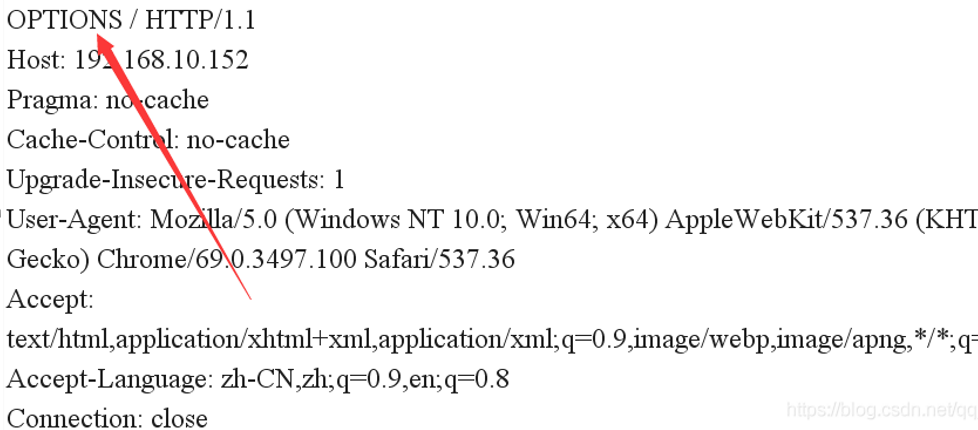
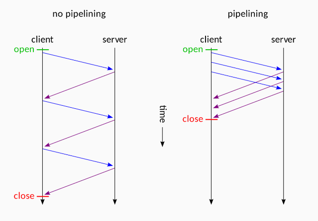
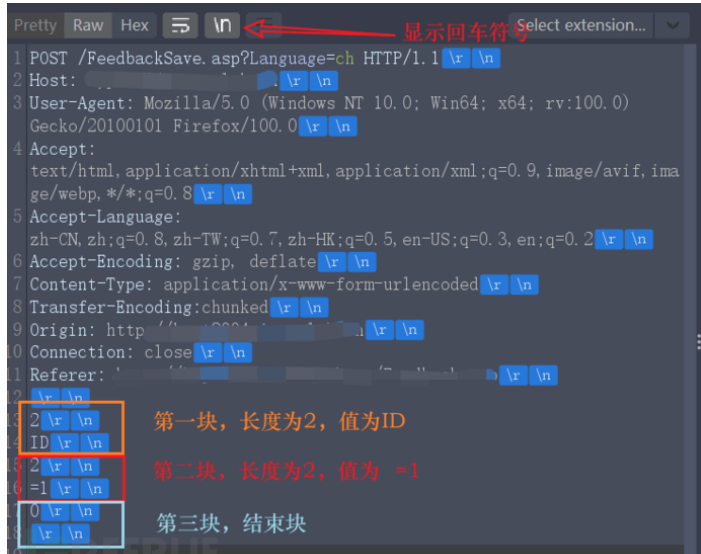
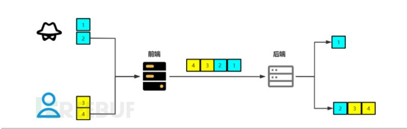
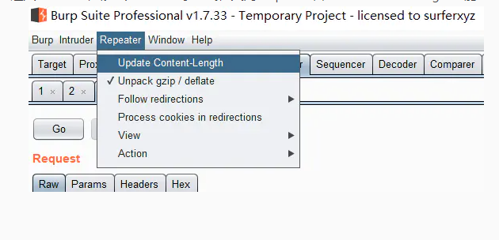
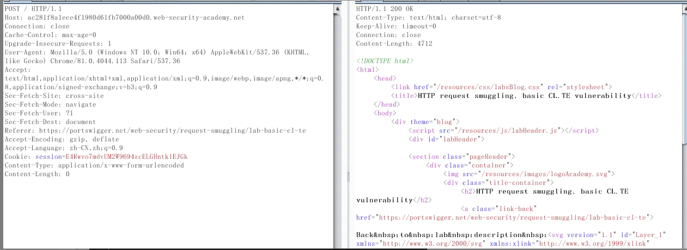
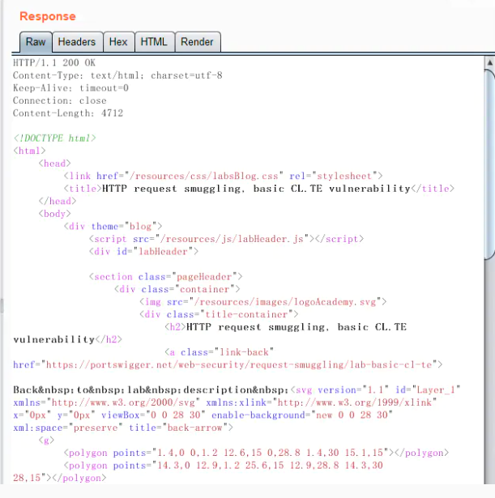
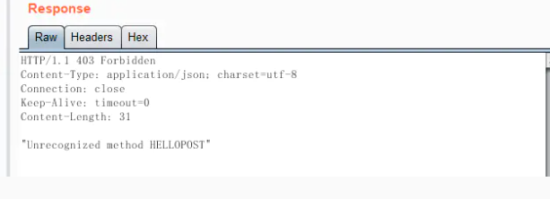

# http协议相关漏洞

## 不安全的http方法
- 我们常见的HTTP请求方法是GET、POST和HEAD。但是，其实除了这两个之外，HTTP还有一些其他的请求方法。
- WebDAV （Web-based Distributed Authoring and Versioning） ：一种基于 HTTP 1.1协议的通信协议。它扩展了HTTP 1.1，在GET、POST、HEAD等几个HTTP标准方法以外添加了一些新的方法，使应用程序可对Web Server直接读写，并支持写文件锁定(Locking)及解锁(Unlock)，还可以支持文件的版本控制。
- **使用OPTIONS方法查看网站支持哪几个方法**
    - Web服务器（以IIS为例）在没有任何设置时(即默认条件下)，使用OPTIONS命令，可以返回所有能够响应的HTTP方法，如OPTIONS, TRACE, GET, HEAD, COPY, PROPFIND, SEARCH, LOCK, UNLOCK。
    - 
    - 服务器会响应可以使用的HTTP方法，显示在Allow部分，检查原始测试响应的“Allow”头，并验证是否包含下列一个或多个不需要的选项：DELTE，SEARCE，COPY，MOVE，PROPFIND，PROPPATCH，MKCOL，LOCK，UNLOCK，PUT。
    - 响应头信息如下：
        ```http
        HTTP/1.1 200 OK 
        Server: Apache-Coyote/1.1 
        Allow: GET, HEAD, POST, PUT, DELETE, OPTIONS 
        Content-Length: 0
        Date: Mon, 25 Jul 2016 10:12:23 GMT 
        ```
- 我们首先了解一下这几个方法的由来：
    - HTTP1.0定义了三种请求方法： GET, POST 和 HEAD方法；HTTP1.1新增了五种请求方法：OPTIONS, PUT, DELETE, TRACE 和 CONNECT 方法。
    - WebDAV完全采用了HTTP1.1的方法，并且扩展了一些其他方法：
        - Options、Head、Trace：主要由应用程序来发现和跟踪服务器支持和网络行为
        - Get：检索文档
        - Put和Post：将文档提交到服务器
        - Delete：销毁资源或集合
        - Mkcol：创建集合
        - PropFind和PropPatch：针对资源和集合检索和设置属性
        - Copy和Move：管理命名空间上下文中的集合和资源
        - Lock和Unlock：改写保护
    - 很显然上述操作明细可以对web服务器进行上传、修改、删除等操作，对服务造成威胁。虽然WebDAV有权限控制但是网上一搜还是一大堆的攻击方法，所以如果不需要这些方法还是建议直接屏蔽就好了。所以，在不需要的情况下，建议关闭WebDAV。
- 风险等级：低风险(具体风险视通过不安全的HTTP请求能获得哪些信息)
- 修订建议：如果服务器不需要支持WebDAV，请务必禁用它，或禁止不必要的HTTP 方法，只留下GET、POST方法！
## CRLF Injection（http响应拆分攻击）
- **CRLF是”回车+换行”（\r\n）的简称。**
- 在HTTP协议中，HTTPHeader与HTTPBody是用两个CRLF分隔的，浏览器就是根据这两个CRLF来取出HTTP内容并显示出来。而http Header之间的字段是按照一个CRLF来分割的。所以，一旦我们能够控制HTTP消息头中的字符，注入一些恶意的换行，**这样我们就能注入一些会话Cookie或者HTML、js代码**，所以CRLF Injection又叫HTTP Response Splitting，简称HRS。
- 对于HRS最简单的利用方式是注入两个\r\n，之后在写入XSS代码，来构造一个xss。
    - 比如一个网站接受url参数http://test.sina.com.cn/?url=xxx，xxx放在Location后面作为一个跳转。如果我们输入的是
		http://test.sina.com.cn/?url=%0d%0a%0d%0a<imgsrc=1onerror=alert(/xss/)>
    - 我们的返回包就会变成这样：
        ```http
        	HTTP/1.1 302 Moved Temporarily 
			Date: Fri, 27 Jun 2014 17:52:17 GMT 
			Content-Type: text/html 
			Content-Length: 154 
			Connection: close 
			Location: 
			
			
        
        ```
    - 为什么说是无视浏览器filter的?
        - 这里涉及到另一个问题。
        - 浏览器的Filter是浏览器应对一些反射型XSS做的保护策略，当url中含有XSS相关特征的时候就会过滤掉不显示在页面中，所以不能触发XSS。
        - 怎样才能关掉filter？一般来说用户这边是不行的，只有数据包中http头含有X-XSS-Protection并且值为0的时候，浏览器才不会开启filter。
        - 说到这里应该就很清楚了，HRS不正是注入HTTP头的一个漏洞吗，我们可以将X-XSS-Protection:0注入到数据包中，再用两个CRLF来注入XSS代码，这样就成功地绕过了浏览器filter，并且执行我们的反射型XSS。
- HRS漏洞就是因为我们输入的数据传递到了http头里面然后返回给了我们。
## http请求走私(HTTP Request Smuggling)
> https://www.freebuf.com/articles/web/335223.html
>
> https://xz.aliyun.com/t/7501#toc-4
>
> 
### http请求走私简介
什么是http请求走私？
- http走私（HTTP Request Smuggling）最早是在2005年由Watchfire记录的，该漏洞利用了前端服务器（cdn）和后端服务器对数据包边界定义不一致的情况，将前一个数据包的内容插入至下一个数据包中。通常情况下，利用该漏洞可以窃取到用户的请求数据，如cookie等。
- 起初在HTTP1.0中的协议设计中，客户端每一次都要进行一次tcp连接，一旦响应返回就会关闭连接，这种连接称为短链接。
- 在HTTP1.1的时代，支持了Keep-Alive模式，也就是请求头中的Connection:Keep-Alive，在HTTP1.1中默认开启。它告诉服务器，接收回应此HTTP请求后，不要关闭TCP链接，对后面的HTTP请求重用该TCP连接，这样就减少了服务器的开销。但它只能请求一次响应一次。
- 在有了Keep-Alive后，后续就有了Pipeline(管线化)，它可以批量提交多个HTTP请求，不必请求一次响应一次。
    - 
- 假设我们一个TCP连接上，存在多个HTTP报文，我怎么知道哪些内容属于第一个报文，哪些是第二个的呢？
    - 这个时候Content-Length的作用就来了，Content-Length来告诉对方包的请求体的数据长度。
    - Content-length(实体长度)，指出报文实体主体的字节大小，如果 Content-Length 比实际长度短，会造成内容被截断；如果比实体内容长，会造成无响应至等待超时。
- 但是实际情况中，`Content-Length`获得起来会存在一些问题，例如一些文件，需要计算其长度就大大增加了内存的消耗，而且当`Content-Length`的数值多或者少的时候都会发生问题。
    - 这个时候`Transfer-Encoding`的优势就来了，它的值为`chunked`时，表示使用分块编码，一个块包含十六进制的长度值和数据，然后\r\n(回车，占两字节)，接着是块的内容，再回车此块结束,用0长度块表示结束块，最后空两行.如下图所示。
    - 

**产生原理：**

- **发生前提：**一般在前后端服务器分离或存在CDN加速服务的情况下
- 为了缓解源站的压力，一般会在用户和后端服务器（源站）之间加设前置服务器，用以缓存、简单校验、负载均衡等，而前置服务器与后端服务器往往是在可靠的网络域中，ip 也是相对固定的，所以可以重用 TCP 连接来减少频繁 TCP 握手带来的开销。这里就用到了 HTTP1.1 中的 `Keep-Alive` 和 `Pipeline` 特性：

- 一般是后端服务器和前端服务器对于请求的结束认证不一致导致的，相当于后端对于第一个包产生了截断，前者正常处理，后者就会和第二个包进行拼接，这样就对第二个包造成了影响，详细看下下面这两张图。
- 

简单演示

- 利用[https://portswigger.net/web-security/request-smuggling/lab-basic-cl-te](https://links.jianshu.com/go?to=https%3A%2F%2Fportswigger.net%2Fweb-security%2Frequest-smuggling%2Flab-basic-cl-te)中的靶场进行演示
     该靶场中利用的是CL-TE走私，**前端遵循Content-Length，后端遵循Transfer-Encoding，CL被忽略，按TE处理。**
- 进入靶场抓包，修改为POST请求方式，关闭burp suite自动更新Content-Length功能
    - 

- 正常提交数据包正常返回：
    - 

修改数据包，添加 Transfer-Encoding: chunked，修改数据包Content-Length的值

```http
POST / HTTP/1.1
Host: ac281f8a1ece4f1980d61fb7000a00d0.web-security-academy.net
Connection: close
Cache-Control: max-age=0
Upgrade-Insecure-Requests: 1
User-Agent: Mozilla/5.0 (Windows NT 10.0; Win64; x64) >AppleWebKit/537.36 (KHTML, like Gecko) Chrome/81.0.4044.113 >Safari/537.36
Accept: text/html,application/xhtml+xml,application/xml;q=0.9,image/webp,image/apng,*/*;q=0.8,application/signed-exchange;v=b3;q=0.9
Sec-Fetch-Site: cross-site
Sec-Fetch-Mode: navigate
Sec-Fetch-User: ?1
Sec-Fetch-Dest: document
Referer: https://portswigger.net/web-security/request-smuggling/lab-basic-cl-te
Accept-Encoding: gzip, deflate
Accept-Language: zh-CN,zh;q=0.9
Cookie: session=E4Rwvo7mdvUM2W9694zcELGHntk1EJGk
Content-Type: application/x-www-form-urlencoded
Content-Length: 10
Transfer-Encoding: chunked

0

HELLO


```

Content-Length为10的原因为回车占据两字节，回车+0+回车+HELLO共10字节，接着提交，返回正常



再次提交，提示："Unrecognized method HELLOPOST"



发现HELLO拼接到了另一个数据包，数据包变成了

````
HELLOPOST / HTTP/1.1
....
````


这便造成了一个简单的http走私。

总结：CL和TE都有就会按照TE来解析数据长度，这样原本数据包的一部分就会了下一个数据包连接在一起了。

**漏洞利用**

- 两个数据包是后台接受的两个数据包，但是前台不是由同一个人发送的。
- 攻击者可以将http请求留在后者的http请求里面，那么不是想干嘛就干嘛。

### http请求走私常见方法

CL-TE

- 前置服务器认为 `Content-Length` 优先级更高（或者根本就不支持 `Transfer-Encoding` ） ，后端认为 `Transfer-Encoding` 优先级更高

TE-CL

- 前置服务器认为 `Transfer-Encoding` 优先级更高，后端认为 `Content-Length` 优先级更高（或者不支持 `Transfer-Encoding` ）

TE-TE

- 前置和后端服务器都支持 `Transfer-Encoding`，但可以通过混淆让它们在处理时产生分歧

- 其实也就是变成了 CL-TE 或 TE-CL。

### http请求走私漏洞利用

- 绕过前置服务器的安全限制
- 获取前置服务器修改过的请求字段
- 获取其他用户的请求
- 反射型 XSS 组合拳
- 将 on-site 重定向变为开放式重定向
- 缓存投毒
- 缓存欺骗

其中有的利用条件是很苛刻的，师傅们已经讲的很清楚了，我就不重复了。实验环境在 [Exploiting HTTP request smuggling vulnerabilities](https://portswigger.net/web-security/request-smuggling/exploiting)，师傅们的分析在 https://paper.seebug.org/1048/#5 和 https://blog.zeddyu.info/2019/12/05/HTTP-Smuggling/#Attack-Surface ，油管一小哥制作的视频演示 https://www.youtube.com/playlist?list=PL0W_QjMcqdSA64v56rOlTpGoIgc504Hb4 。

### 解决方案

- 禁用代理服务器与后端服务器之间的 TCP 连接重用
- 使用 HTTP/2 协议
- 前后端使用相同的服务器

HTTP/1.1 的一些特性为请求走私创造了条件：

1. 纯文本，以换行符作为分隔符
2. 序列和阻塞机制

而在 HTTP/2 中已经没有了产生请求走私的机会：

- 使用**二进制编码**且分割为更小的传输单位（帧，拥有编号，**可乱序传输**）
- **同一个来源的所有通信都在一个 TCP 连接上完成**，此连接可以承载任意数量的双向数据流