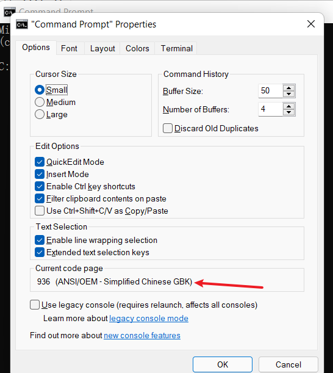

# 基础知识

### **不要对未授权网站进行渗透测试**

> **学习的时候本地搭建靶机，或者使用别人的在线靶机测试，或者使用在线ctf平台学习**    

- web安全是渗透测试中的重要一环，很多攻击都是从web率先攻破的，同时web的漏洞也是及其多的。
- 在学习web安全之前，我们应该学会怎么搭建一个网站，第一步我们需要学会，html(两三个小时搞定)，php，javascript。
- 是不是要像学c语言一样学习这些语言呢？不是
- 只需要学习基础就行，有哪些变量类型，循环语句怎么写，类怎么写，有哪些常用函数。在学习web语言的前期，我们只要保证我们能看懂代码就行。然后通过看代码一步步学习这门语言。
- 我们还要学会http协议。可以看图解http协议这本书。

### 网站架构/技术了解


前端技术：

- html5，css3，js es6。
- js框架：

    - jqurery: 简化dom操作。新项目基本不用了。
    - angular
    - react
    - **vue：**现在最常用的框架，新出了vue3。
        - 计算属性--虚拟化DOM
        - MVVM+虚拟DOM
    - Axio：前端通信模型，类似AJAX，因为Vue的边界很明确，就是为了处理DOM，并不具备通信能力，所以使用Axio，也可以使用AJAX，vue推荐使用Axio。
- UI框架：

    - Bootstrap:twitter推出的一个用于前端开发的开源工具包
    - **ElementUI**，iview，Ice 基于vue的UI框架。
- javascript构建工具

    - Babel
    - WebPack：模块打包工具，主要作用就是打包，压缩，合并以及按序加载。

- js做后端技术Nodejs：

后端技术：

- javase-》java web-》spring-》spring mvc-》spring boot

### 常用浏览器插件
- 浏览器代理工具：proxy switchyOmega，windows自带一个代理设置但是不是很好用。当我们需要使用代理，比如要使用burpsuite抓包，使用vps挂代理隐藏我们的ip。将浏览器数据发送到代理软件上。
- cmd命令行代理工具：proxychains
    - 当我们想要抓应用的数据包，而不是浏览器的数据包时。
    - 下载一个最新版如`proxychains_0.6.8_win32_x64.zip`，解压到自定义的目录下，将文件夹中的`proxychains_win32_x64.exe`重命名为`proxychains`。
    - 编辑目录下的`proxychains.conf`文件，将文件中最后一行的端口号改成代理中开的端口，例如`socks3 127.0.0.1 10080`。
    - 编辑计算机的系统变量，添加该文件夹所在的路径到系统PATH变量中
    - 新建一个系统变量名称`PROXYCHAINS_CONF_FILE`，值为proxychains.conf文件的路径
    - 打开cmd，使用方法是`proxychains command`，例如`proxychains curl baidu.com`
- get，post提交工具；hackbar。当我们想要提交修改get和post请求，但又不想打开burpsuite，就使用这个，同时还有各种漏洞的payload，方便很多。
- 网站指纹识别工具：wappalyzer，可以快速识别网站使用了什么语言，框架。
- Xdebug helper：php debug需要下载的插件。
- cookie Editor：查看和修改cookie的插件
### 编码和字符集
> 在我们处理数据的时候，经常会遇到编码问题，导致乱码。  
参考资料：[Java的字符编码问题](https://zazalu.space/2019/06/15/Java%E7%9A%84%E5%AD%97%E7%AC%A6%E7%BC%96%E7%A0%81%E9%97%AE%E9%A2%98%E4%B8%80%E8%AF%AD%E9%81%93%E7%A0%B4-GBK-UTF%E7%AD%89%E5%B8%B8%E7%94%A8%E7%BC%96%E7%A0%81/)
#### 什么是字符集和字符编码
在计算机中，所有的数据在存储和运算时都要使用二进制数表示（因为计算机用高电平和低电平分别表示1和0），例如，像a、b、c、d这样的52个字母（包括大写）以及0、1等数字还有一些常用的符号（例如*、#、@等）在计算机中存储时也要使用二进制数来表示，而具体用哪些二进制数字表示哪个符号，当然每个人都可以约定自己的一套（这就叫编码），而大家如果要想互相通信而不造成混乱，那么大家就必须使用相同的编码规则。ascii是最早的字符集，但是只支英文、阿拉伯数字等，不支持其他语言。

- 字符集：字符集是一个规则集合的名字，字符集=字库表+编码字符集+字符编码
    - 字库表：想当于是一个数据库，包含着所有可读或者可显示的字符。决定了改字符集能表示的所有字符的范围
    - 编码字符集：一切的数据都是二进制，所以需要用一个编码值来表示一个字符（即改字符在字库表中的位置），这个值称为字符对应于编码字符集（如：Unicode、ASCII）的序号。只是逻辑上的序号，并不表示这个序号存储在计算机中。
    - 字符编码：是编码字符集和实际存储数值之间的转换关系。**字符编码是定义在字符集上的映射规则。（逻辑序号<---->计算机中的实际存储值）**
    - 例如：
        - unicode是字符集，也是编码字符集，但是不是字符编码，unicode的字符编码有UTF-8、UTF-16、UTF-32等多种字符编码
        - ASCII，本身就是字符集、编码字符集，又是字符编码
        - GB2312，只有EUC-CN一种字符编码
    - **和文本交互，或者网络流传输数据时和字符编码有关**，**编程语言支持某种字符的显示，和编码字符集有关。**
- **字符到二进制叫编码，二进制到字符叫解码**
#### ASCII编码：
- ascii编码占用一个字节来表示字符。虽然只用到了0x00-0x7f。[ascii编码表](https://baike.baidu.com/item/ASCII/309296?fr=aladdin)
- 当我们使用ascii编码写入012#abc这几个字符到文件的时候时候，使用hexdump查看该文件16进制表示。
    ```shell
    $ cat ascii.txt
    012#abc
    $ hexdump -C ascii.txt
    00000000  30 31 32 23 61 62 63 0a                           |012#abc.|
    00000008
    ```
- 我们发现字符串保存在计算机中的二进制正是ascii的编码。直接hexdump ascii.txt不知道为什么会出现大小端问题。0a是换行符，无法显示就用.表示。
- 最重要的是看我们的编辑器是以什么什么方式写入的，像utf-8，gbk都兼容ascii（也就是遇到字节是0x00-0x7f直接的，就是按照ascii解析），如果只是输入ascii所表示的字符，无论怎么样都是不会乱码的。
- 像windows的默认编码字符是ansi，在中国就是gbk。也就是cmd输入的字符串都是gbk编码的。
- 我们可以通过vscode来查看文件是用什么编码的（一般gbk，utf-8这种可以推测出来，比较冷门的就难以推测出来了）
#### ANSI
- ANSI编码是一种对ASCII码的拓展：ANSI编码用 0x00~0x7f (0-127) 范围的1 个字节来表示 1 个英文字符，超出一个字节的 0x80~0xFFFF（128-65535） 范围来表示其他语言的其他字符。**也就是说，ANSI码仅在前128(0~127)个与ASCII码相同，之后的字符全是某个国家语言的所有字符。**
- 值得注意的是，两个字节最多可以存储的字符数目是2的16次方，即65536个字符，这对于一个语言的字符来说，绝对够了。还有ANSI编码其实包括很多编码：中国制定了GB2312编码，用来把中文编进去。另外，日本把日文编到Shift_JIS里，韩国把韩文编到Euc-kr里，各国有各国的标准。
- 受制于当时的条件，不同语言之间的ANSI码之间不能互相转换，这就会导致在多语言混合的文本中会有乱码。 在中国，ANSI是GBK编码，在日本是Shift_JIS编码，不同国家，ANSI代表不同的编码
- 同时，其它国家也在为自己的文字编码。最后，微软苦逼了：顾客就是上帝啊，你们的编码我都得满足啊，这样吧，卖给美国国内的系统默认就用ASCII编码吧，卖给中国人的系统默认就用GBK编码吧，卖给韩国人的系统默认就用EUC-KR编码，...但是为了避免你们误会我卖给你们的系统功能有差异，我就统一把你们的默认编码都显示成ANSI吧。
- **所以，ANSI编码在不同国家代表不同编码！**
#### 中文字符集(GBK/GB2312/GB18030)
- 英文字符（0x00-0x7F，单字节）汉字（0x8140－0xFEFE  两个字节）,这也是为什么gbk兼容ascii的原因。
- GB2312：中文字符集，包含ASCII字符集。ASCII部分用单字节表示，剩余部分用双字节表示。
- GBK：GB2312的扩展，完整包含了GB2312的所有内容。(最常用)
- GB18030：GBK字符集的超集，常叫大汉字字符集，也叫CJK（Chinese，Japanese，Korea）字符集，包含了中、日、韩三国语言中的所有字符。
- [GBK编码对应表](http://tools.jb51.net/table/gbk_table)
- cmd输入的字符串默认是gbk编码的。
    - 
- 我们在windows的cmd写入一个你好到gbk.txt中
    ```shell
    echo 你好 > gbk.txt
    ```
- 然后将文件移动到linux系统中使用hexdump查看16进制显示文件的二进制。并使用cat输出该文件内容发现乱码。
    ```shell
    $ hexdump -C gbk.txt
    00000000  c4 e3 ba c3 20 0d 0a                              |.... ..|
    00000007
    $  cat gbk.txt
    ���
    ```
- 对照gbk编码表,发现c4e3对应你，bac3对应好。20是ascii的空格，0d是ascii的回车键，0a是ascii的换行符。
- 因为hexdump只能解析ascii，所以非ascii编码范围都用..表示字符。
- linux系统我设置的是utf-8模式，以utf-8编码格式去解码gbk编码后的数据，会产生问题。

#### unicode字符集
- 将全球的符号合成一个编码字符集，如果全世界每一个符号都给予一个独一无二的编码，那么乱码问题就会消失。这就是Unicode，就像它的名字表示的，这是一种所有符号的编码。（就tm windows头铁，默认用的是ANSI）
- Unicode只是一个字符集，用 0000-0x10FFFF(0-1114111，2-3个字节) 来映射全球各国的语言文字，**它只规定了符号的二进制代码，并没有规定这个二进制代码应该如何存储**，所以存储到文件需要某种编码来编码。
- 比如，汉字"严"的unicode的16进制表示是4E25，转换成二进制是 100111000100101 ，有15位，需要用到2个字节。还有其他更大的符号，有可能需要3个字节。但是英文字母只用一个字节表示就够了，如果unicode统一规定，每个符号用3个字节表示，那么每个英文字母有2个字节是空的，这对于资源来说是非常浪费的。`你好的unicode的16进制表示是4f60 597d。`
- [unicode编码表](https://unicode-table.com/cn/blocks/),[中文转unicode工具](http://www.mytju.com/classcode/tools/encode_utf8.asp)
- 这就出现了后来的UTF8和UTF16编码，他们规定了字符如何存储！
- **utf-8**
    - UTF-8是unicode字符集下的字符编码。他规定了字符应该如何存储。
    - UTF-8最大的一个特点就是它的一种变长的编码方式。最新版的UTF-8中，它使用 1~4 个字节表示一个符号，根据不同的符号而变化字节长度。
    - 即UTF-8的物理存储和Unicode序号的转换关系。 UTF-8编码为变长编码。最短编码单位（code unit）为一个字节，最长编码单位4个字节，用1-4个字节描述一个字符。一个英文字符占1字节，一个中文占2个或者3个字节，有的中文占4个字节。
    - [utf-8编码表](http://www.mytju.com/classcode/tools/encode_utf8.asp)
    - 如果一个字节的以0开头，那么代表当前字符为单字节字符，占用一个字节的空间。0之后的所有部分（7个bit）代表在Unicode中的序号，有效位为7位
    - 如果一个字节以110开头，那么代表当前字符为双字节字符，占用2个字节的空间。110之后的所有部分（5个bit）加上后一个字节的除10外的部分（6个bit）代表在Unicode中的序号。且第二个字节以10开头。有效位为11位
    - 如果一个字节以1110开头，那么代表当前字符为三字节字符，占用3个字节的空间。110之后的所有部分（5个bit）加上后两个字节的除10外的部分（12个bit）代表在Unicode中的序号。且第二、第三个字节以10开头。有效位为17位
    - 如果一个字节以10开头，那么代表当前字节为多字节字符的第二个字节。10之后的所有部分（6个bit）和之前的部分一同组成在Unicode中的序号。
    - 我们可以得到以下规律：
        - 1个字节的UTF-8十六进制编码一定是以比 8 小的数字开头的
		- 2个字节的UTF-8十六进制编码一定是以 C 或 D 开头的
        - 3个字节的UTF-8十六进制编码一定是以 E 开头的
    - UTF-8码表规则不允许第一个字节就用10开头，因为这是表示多字节的第二个字节！针对这种情况，转换规则里存在一种机制，会把不允许的字节全部自动变成一个叫"[置换字符](https://en.wikipedia.org/wiki/Specials_(Unicode_block)#Replacement_character")的东西！UTF-8的置换字符为 ，在Unicode总表上查出来，所以char[3] = 'U+FFFD' 也就是' '，也不允11111。
    - `比如你好的utf-8编码就是e4 bd a0 e5 a5 bd `
- utf16：UTF-16编码采用2个字节代表一个字符，英文和中文都是占两个字节，同时还受大小端限制。
#### 编码问题 
> 在我们写入文件的时候，我们要清楚我们写入文件使用的编码是什么。在我们读文件的时候，要清楚文件的编码是什么。

- 当我们在写python或者java代码的时候，我们要知道我们的编辑器是使用什么编码保存这些代码文件的。如果我们用gbk编码保存，别人用utf-8打开文件如果代码中有中文那么肯定就乱码了。
- 我们经常会在python文件开头看到一个编码申明#coding=utf-8或者coding=gbk。
    - 这是为了告诉pythonn解释器，当读取该.py文件的时候，我该用什么格式去解码它，然后运行它。
    - 这个编码申明必须和该py文件的编码格式一样，不然python解释器运行的时候可能会因为乱码报错。
    - 这个编码申明仅仅做的也就是这点了，并不会改变系统默认编码，或者操作系统默认编码。
- python系统默认编码：
    - print(sys.getdefaultencoding())   #python3默认utf-8，和在哪个操作系统上无关,这个系统指的是python编译器
    - 在python3编译器读取.py文件时，若没有头文件编码声明，则默认使用"utf-8"来对.py文件进行解码。并且在调用 encode()这个函数时，不传参的话默认是"utf-8"。（这与下面的open( )函数中的"encoding"参数要做区分，非常误导人！！！）
- python本地默认编码：
    ```python
    print(locale.getdefaultlocale()) 
    ('zh_CN', 'cp936')
    ```
    - 会显示操作系统的编码，在windows下就是gbk
    - 编写的python3程序时，若使用了 open( )函数打开函数，而不给它传入 "encoding"这个参数，那么会自动使用本地默认编码。没错，如果在Windows系统中，就是默认用gbk格式,读写都是gbk。这样当读取一个utf-8编码后的文件就会可能乱码了。
- **在python3中字符都为unicode编码（不是utf-8）,存储在内存中。**
- python处理文件文件的时候是使用类似三明治的格式（java也差不多）。
    - 
    - 在读写文件之前和之后进行编码和解码，这样python代码指处理str（unicode编码）
    - 我们怎么知道文件是用哪种编码，vscode可以探测，python有个Chardet模块也可也探测，单也只是探测，不能百分百确定。
- 当python以gbk读取一个gbk文件并返回给一个字符串s的时候。
    - gbk编码的二进制序列经过python读取（gbk来解码）后，再转换成unicode字符给s（转换的过程是先再gbk编码表上找到该字符，然后去unicode编码表上找到相同字符的序号）。
    - 同理以utf-8读取一个utf-8文件。utf-8编码的二进制序列经过python读取（utf-8来解码）后，再转换成unicode字符给s。
- 当python以gbk编码将字符串s写入文件的时候。
    - 找到Unicode对应字符在gbk上对应的字符编码，然后使用gbk编码写入文件。
    - utf-8同理
- **当我们想要将一个gbk编码的文件改成utf-8编码后的文件，同时不乱码。**
    - python以gbk读取该文件给字符串s，然后将s以utf-8格式写入该文件即可。
    - **只要按照对应编码打开文件，想保存为什么格式的文件都不会乱码。**
- **如果我们用utf-8格式打开一个被gbk编码的文件，同时我们又以随便哪个格式保存到文件了，那这个文件乱码问题就无法解决了，
除非这个文件只有英文和数字。**
- 在html代码中我们经常会遇到下面这行，charset的意思是告诉浏览器要用utf-8编码来解析这个html文件。
    ```html
    <meta http-equiv="Content-Type" content="text/html; charset=UTF-8" />
    ```
    - 我们如果是用gbk来编写的html文件，就要将chartset改成gbk了，不然会乱码。用什么编码写的html文件，charset就要改成对应的。
### 和web有关的编码
#### url编码
- **url编码并不像是上面的字符编码，而像是c语言里面的转义。我们后面遇到的编码也不是像上面的和字符集有关的编码，而是各自的在字符层面上自己规定的编码，和二进制无关**。

- RFC3986文档规定，Url中只允许包含英文字母（a-zA-Z）、数字（0-9）、-_.~4个特殊字符以及所有保留字符! * ' ( ) ; : @ & = + $ , / ? # [ ] %

- 在url中有一些字符`（:/?#[]@）`是用作分隔不同组件的，（例如：冒号用于分隔协议和主机，/用于分隔主机和路径，?用于分隔路径和查询参数等等，#表示书签或者锚点。还有一些字符`（!$&'()*+,;=）`也有对应功能，如=用于表示查询参数中的键值对，&符号用于分隔查询多个键值对，）。**当我们想要在将这些字符当作普通数据进行传送而不是作为功能使用的时候，需要对其编码**。

- **有些浏览器会自动智能的帮我们编码url，hackbar会自动将post数据的特殊字符编码，而且有raw和非raw模式。**

- 开始编码：
    - 字母不需要进行URL编码
    
    - 特殊字符的URL编码是其ASCII值的16进制表示，前面加个%，比如#是%23
    
    - 中文的URL编码是其对应编码的16进制前面加个%，
    
        ```php
        <?php
        $id = $_GET['id'];
        echo $id;
        ?>
        ```
    
        - 比如服务器是utf-8，如果我们想传入中文给服务器，那么就是utf-8编码的16进制加上%。比如你好的url编码就是`%E4%BD%A0%E5%A5%BD`。这样后台就会输出中文到页面上了。
        - 如果服务器是gbk，如果我们想传入中文给服务器，那么就是gbk的编码的16进制加上%。比如你好的url就是`%c4%e3%ba%c3`
            - 设置default_charset = "GBK"。测试成功。
    
    - %的编码是在其前面再加个%
    
    - 表单提交：
        - 当Html的表单被提交时，每个表单域都会自动被Url编码之后才在被发送（主要还是看表单的type，text会，file不会）。由于历史的原因，表单使用的Url编码实现并不符合最新的标准。例如对于空格使用的编码并不是%20，而是+号。
        - 如果表单的type是text，而且使用的是Post方法提交的，我们可以在HTTP头中看到有一个Content-Type的header，值为**application/x-www-form-urlencoded**。**大部分应用程序均能处理这种非标准实现的Url编码，也有一些程序无法处理，最好自己手动编码或者不编码试试**。像**multipart/form-data**（上传文件的时候会用这个）的就和url编码解码无关了。**该数据会不会被url解码编码，还是要看Content-Type这个字段**。
        - 测试代码
            ```php
            <html>
            <head><title>test</title></head>
            <body>
                <form action="test.php" method="get">
                <p>First name: <input type="text" name="name" /></p>
                <p>Last name: <input type="text" name="password" /></p>
                <input type="submit" value="Submit" />
                </form>
            
                <?php
                    echo $_GET['name'];
                    echo $_GET['password'];
                ?>
            </body>
            </html>
            ```
        - 总结：**type为text的表单，提交的时候post的body会自动url编码，表单提交的get请求也是这样会自动编码。**
    
- 这些url编码后的数据还是字符串，然后经过网线运输给服务器（这里的二进制编码就是简单的ascii编码，然后服务器解码），服务器得到的也是字符串，然后php，java程序根据自己的默认编码来解码这些字符串。

- 在burpsuite抓到的http数据包，是对ascii进行解码的，是我们在客户端和服务器端拦截的数据，我们在burpsuite上也可以看到http请求的二进制字节。所以我们会看到数据传输过程中被编码的url字符，当我们修改了这些参数，而且输入的数据包含了特殊字符，我们就需要手动url编码。


#### html字符实体

> 参考资料：https://www.w3school.com.cn/html/html_entities.asp

在HTML中同样有一些字符是属于功能用处的，当作为内容的时候，我们是需要将其转义的。

比如在 HTML 中不能使用小于号（<）和大于号（>），这是因为浏览器会误认为它们是标签。

如果希望正确地显示预留字符，我们必须在 HTML 源代码中使用字符实体（character entities）。

字符实体类似这样：

```html
&entity_name; 
或者 
&#entity_number;  数字是该字符的ascii编码的10进制，或者&#x加上16进制

中文的字符的实体编码是&#xentity_number，是该字符unicode编码（非utf-8）的16进制再前缀加上x
&#x4f60;&#x597d; 就是你好的字符实体，当然也可以直接写中文，不需要用实体字符表示。
使用实体字符的好处是无论该html文件以任何编码保存，都不会乱码。
html实体字符和url有点不一样，url表示中文字符用的是%加utf-8数值的形式。
```


- 如需显示小于号，我们必须这样写：`&lt`; 或 `&#60;`

**提示：**使用实体名而不是数字的好处是，名称易于记忆。不过坏处是，浏览器也许并不支持所有实体名称（对实体数字的支持却很好）。

#### javascript中的编码

- **js支持在字符串中以\u加上unicode16进制数字的形式输出字符，比如"\u4f60\u597d"，当然也可以直接写字符**。

    - Unicode转义序列出现在字符串中时，它只会被解释为普通字符，而不会破坏字符串的上下文，这也就是转义的作用。
    - 例如，`<script>alert("\u0031\u0030");</script>`
    - 被编码转义的部分为10，是字符串，会被正常解码，JS代码也会被执行。

- **js允许Unicode转义序列存在于标识符中，即变量名（如函数名等…），它会被进行解码，而且和原本字符一样，同样具有功能。**

    - 例如，`<script>\u0061\u006c\u0065\u0072\u0074(10);</script>`
    - **被编码转义的部分为alert字符，是函数名，属于在标识符中的情况，因此会被正常解码，JS代码也会被执行**
    - 这点和我们平时见到的有些不一样。

- 控制字符中（in control characters）：

    - 若Unicode转义序列存在于控制字符中，那么它会被解码但不会被解释为控制字符，而会被解释为标识符或字符串字符的一部分。
    - 控制字符即`'`、`"`、`()`等。
    - 若Unicode转义序列存在于控制字符中，那么它会被解码但不会被解释为控制字符，而会被解释为标识符或字符串字符的一部分。**那就没有功能用处了**。
    - 例如，`<script>alert\u0028"xss"); </script>`，对`(`进行了Unicode编码，那么解码后它不再是作为控制字符，而是作为标识符的一部分`alert(`。**也就没法执行js代码了**。
    - **所以对控制字符进行unicode编码，控制字符失去原本的功能，而成为标识符的一部分**

- 示例1：

    ```html
    <script>\u0061\u006c\u0065\u0072\u0074\u0028\u0031\u0031\u0029</script>
    被编码部分为alert(11)。
    该例子中的JS不会执行弹窗功能了，因为控制字符被编码了。alert(11)被当作一个标识符了。
    ```

- 示例2：

    ```html
    <script>\u0061\u006c\u0065\u0072\u0074(\u0031\u0032)</script>
    被编码部分为alert及括号内为12。
    
    该例子中不会弹窗，原因在于括号内被编码的部分不能被正常解释为数字22，而是被当作标识符22了，可以在左右加入""或''使其变为字符串。
    
    ```

- 示例3：

    ```html
    <script>alert('13\u0027)</script>
    被编码处为'。
    
    该例的JS也不会弹窗，因为控制字符被编码了，解码后的'将变为字符串的一部分，而不再解释为控制字符。
    因此该例中字符串是不完整的，因为没有'来结束字符串。
    ```

- 示例4：

    ```html
    <script>alert('14\u000a')</script>
    
    该例的JS会弹窗，因为被编码的部分处于字符串内，只会被解释为普通字符，
    不会突破字符串上下文。
    ```

#### 浏览器解析url，js，html顺序(可以在学xss的时候看)。

> 参考资料：https://my.oschina.net/u/4593189/blog/4418422

- **这里url指的不是我们在浏览器地址栏输入的url，而是在网页内写的url，比如网页内有个超链接，有个图片之类的。**

- **这里的解析指的是哪个解释器先执行，是html解释器？还是js解释器？还是url解释器？**

- 网页的解析顺序：

    - HTML解析器对HTML文档进行解析，完成HTML解码并且创建DOM树。
    - HTML解析完了之后，JavaScript 或者CSS解析器对内联脚本进行解析，完成JS、CSS解码
    - 如果浏览器遇到需要URL的上下文环境，这时URL解析器也会介入完成URL的解码工作，URL解码会根据URL所在的顺序不同而在JS解码前或者解码后。

- **html解析器：html解码规则**

    - **HTML中有五类元素：**
        - 空元素(Void     elements)
            - 不能容纳任何内容（因为它们没有闭合标签，没有内容能够放在开始标签和闭合标签中间）。
            - 有area、base、br、col、command、embed、hr、img、input、keygen、link、meta、param、source、track、wbr。
        - 原始文本元素(Raw text elements)
            - 可以容纳文本。
            - `有<script>和<style>`
        - RCDATA元素(RCDATA elements)
            - 可以容纳文本和字符引用
            - `有<textarea>和<title>`
        - 外部元素
            - 可以容纳文本、字符引用、CDATA段、其他元素和注释
            - 例如MathML命名空间或者SVG命名空间的元素
        - 基本元素(Normal elements)
            - 基本元素(Normal elements)

    - **HTML解析器以状态机的方式运行，它从文档输入流中消耗字符并根据其转换规则转换到不同的状态。**
        - Tag open状态，Tag name状态，close tag open 状态，Data（数据状态）。
        - 
            ```html
            <html>
             <body>
               Hello world
             </body>
            </html>
            ```
        - 初始状态为"Data State"，当遇到"`<`"字符（非实体字符），状态变为"Tag open state"，读取一个a-z的字符将产生一个开始标签符号，状态相应变为"Tag name state"，一直保持这个状态直到读取到"`>`"，每个字符都附加到这个符号名上，例子中创建的是一个html符号。
        - 当读取到"`>`"，当前的符号就完成了，此时，状态回到"Datastate"，读取"<body>"时也是重复这一处理过程。到这里，html和body标签都识别出来了。现在，回到"Data state"，读取"Helloworld"中的字符"H"将创建并识别出一个字符符号，这里会为"Hello world"中的每个字符生成一个字符符号。

    - HTML解析器处于**数据状态（Data State）**、**RCDATA 状态（RCDATA State）**、**属性值状态（Attribute ValueState）**时，**字符实体会被解码为对应的字符**，这又是多了2种状态。

    - 示例：

        ```html
        <div>&#60;img src=x onerror=alert(4)&#62;</div>
        
        <和>被编码为字符实体&#60;和&#62;。
        
        当HTML解析器解析完<div>时，会进入数据状态（Data State）并发布标签令牌。
        接着解析到实体&#60;时因为处在数据状态（Data State）就会对实体进行解码为<
        后面的&#62;同样道理被解码为>。
            
        解码之后就是该字符了,如果有其他语言使用了这段，那么就是该字符了。
        例如 
        ```

        - 这里会有个问题，被解码后，img是否会被解析为HTML标签而导致JS执行呢？
        - 答案是否定的。因为解析器在使用字符引用后不会转换到标签打开状态（Tag Open State），不进入标签打开状态就不会被发布为HTML标签。因此，不会创建新HTML标签，只会将其作为数据来处理。
        - 这也是为什么我们可以使用字符实体来避免用户不安全输入导致XSS的原因。这里还很好理解

    - **原始文本元素(Raw text elements)**标签有script、style，这个标签有个特性，该标签的内容区域内的实体字符不会被html解码。

        ```html
        <script>&#97;&#108;&#101;&#114;&#116&#40;&#57;&#41;&#59</script>这样字符实体并不会被解码，也就不会执行JS。
        
        &#97;&#108;&#101;&#114;&#116&#40;&#57;&#41;&#59是alert(9)的实体编码
        ```

        

    - **RCDATA**：

        - 在HTML中，属于RCDATAElements的标签有两个：textarea、title。

        - RCDATA Elements类型的标签可以包含文本内容和字符实体。

        - 解析器解析到textarea、title标签的数据部分时，状态会进入RCDATA State。

        - 前面我们提到，处于RCDATA State状态时，字符实体是会被解析器解码的。

            ```html
            <textarea>&#60;script&#62;alert(5)&#60;/script&#62;</textarea>
            
            <和>被编码为实体&#60;和&#62;。
            解析器解析到它们时会进行解码，最终得到<textarea><script>alert(5)</script></textarea>。
            但是里面的JS同样还是不会被执行，原因还是因为解码字符实体状态机不会进入标签打开状态（Tag Open State），
            因此里面的<script>并不会被解析为HTML标签
            ```

    - **外部元素(Foreignelements)**:

        - Foreign elemnts来源于MathML和SVG命名空间

        - 在这里的实体字符会被解码。

        - `<svg>遵循XML和SVG的定义`

          ```html
            <svg><script>&#97;&#108;&#101;&#114;&#116&#40;&#57;&#41;&#59</script>
            按道理会进入识别到<script>之后,<script></script>中间的数据是不会被解码的，但是因为外面还有一个<svg>标签，所以会被解码。
            解码成<svg><script>alert(9);</script>
            
          ```

    - **属性值状态（Attribute ValueState）**:

        - 很容易理解，就是字符串的转义啊。

    - 通过html的标签命令，或者javascript伪协议才能进入javascript解析器。

- **JavaScript解析器**

    - html标签中的onerror， onclick等的属性值会调用javascript解释器来运行js代码。

        ```html
        
        <!--
        无法执行
        我们以浏览器的视角来看：首先读到<开始读取标签，然后读到onerror调用JS解析器。在JS中，单引号，双引号和圆括号等属于控制字符，
        编码后将无法识别。所以对于防御来说，应该编码这些控制字符。-->
        
        <!--下面这种方式可以执行：-->
        
        
        
        
        <!--可以结合上面的HTML编码
        按照解析顺序反过去，先JS编码然后HTML解码-->
        
        
        <!--浏览器读到了<标签开始构造语法树，然后HTML解码，解码之后发现onerror于是进入js解释器中运行js代码,js解释器开始进行JS解码，成功弹窗-->
        
        
        
        
        <!--延伸：
        开发人员单纯的设置敏感字符为HTML实体编码来作为防御xss的手段，但是如果用户输入点在alert中-->
        
        <!--
        如果用户正常输入的话凡是存在< ," 等都能被html先实体编码，然后弹出该输入。功能就是用户输入什么，弹出输入什么
        
        攻击者可以通过输入语句    FIRST XSS");alert("test
        编码后链接起来就是
        
        根据解码规则，先html解码为
        
        弹窗两次
        这样就插入了一段js代码，可以插入任意的js代码，形成xss漏洞了。-->
        
        <!--
        所以对于这种情况，正确防御XSS的方法：
        应该是先JavaScript编码然后再进行HTML编码
        用户输入 ");alert("test 后在服务端先JavaScript编码然后再进行HTML编码
        在
        在浏览器端：
        首先经过第一步HTML解码后变为\u0022\u0029\u003B\u0061\u006C\u0065\u0072\u0074\u0028\u0022\u0074\u0065\u0073\u0074
        然后JavaScript解析器开始工作，变为 ");alert("test 刚才已经讲过这种情况下JavaScript解析时会将整个");alert("test当作一个标识符名称。
        
        在这里采用的先JS编码后HTML编码后，最终结果只弹窗了一次。
        -->
        ```

        

    - **javascript伪协议**：出现于原本url该出现的地方，声明了URL的主体是任意的javascript代码，会进入javascript的解释器运行代码。在URL解析器中讲解这部分。

- **URL解析器**：

    - 

    - URL解析器也被建模为状态机，文档输入流中的字符可以将其导向不同的状态。

    - **首先，要注意的是URL的Scheme部分（协议部分）和`：`必须为ASCII字符，即不能为url编码后的字符，否则URL解析器的状态机将进入No Scheme状态。当然因为html解析在URL解析之前，所以该部分可以为html实体编码**

    - 示例：

        ```html
        <a href="%6a%61%76%61%73%63%72%69%70%74:%61%6c%65%72%74%28%31%29"></a>
        
        <!-- URL编码部分的是javascript:alert(1)。
        JS不会被执行，因为作为Scheme部分的"javascript"这个字符串被编码，导致URL解析器状态机进入No Scheme状态,这样就不会进入js解释器了。-->
        
        <a href="javascript%3aalert(3)"></a>
        <!-- 由于:被URL编码为%3a，导致URL状态机进入No Scheme状态，JS代码不能执行。-->
        ```

    - 示例

        ```html
        <a href="&#x6a;&#x61;&#x76;&#x61;&#x73;&#x63;&#x72;&#x69;&#x70;&#x74;:%61%6c%65%72%74%28%32%29">nihao</a>
        
        <!-- 
        html开始解码为 
        <a href="javascript:%61%6c%65%72%74%28%32%29">nihao</a>
        
        然后href标签里面是存放的是url，所以要url解码。
        <a href="javascript:alert(2)">nihao</a>
        
        因为javascript:并不是被url编码后的字符，所以alert(2)交给js解释器去执行，在浏览器中点击该链接就会执行弹窗。
        
        这里可以看到在这种需要输入url的情况下，url解释器要先于js解释器。
        -->
        ```

- URL和js哪个先解析：

    - **如果浏览器遇到需要URL的上下文环境，这时URL解析器也会介入完成URL的解码工作，URL解析器的解码顺序会根据URL所在位置不同，可能在JavaScript解析器之前或之后解析。HTML解析总是第一步。**

    - URL解析和JavaScript解析，它们的解析顺序要根据情况而定。

    - 示例1：

        ```html
        <a href="UserInput"></a>
        
        <!--
        该例子中，首先由HTML解析器对UserInput部分进行字符实体解码；
        接着URL解析器对UserInput进行URL decode；
        如果URL的Scheme部分为javascript:的话而且javascript:不是url编码后的话，JavaScript解析器会再对UserInput进行解码。
        所以解析顺序是：HTML解析->URL解析->JavaScript解析。
        -->
        ```

    - 示例2：

        ```html
        <a href=# onclick="window.open('UserInput')"></a>
        
        <!--
        该例子中，首先由HTML解析器对UserInput部分进行字符实体解码；
        接着由JavaScript解析器会再对onclick部分的JS进行解析并执行JS；
        执行JS后window.open('UserInput')函数的参数会传入URL，所以再由URL解析器对UserInput部分进行解码。
        因此解析顺序为：HTML解析->JavaScript解析->URL解析。-->
        ```

    - 示例3：

        ```html
        <a href="javascript:window.open('UserInput')">
            
        <!--
        该例子中，首先还是由HTML解析器对UserInput部分进行字符实体解码；
        接着由URL解析器解析href的属性值；
        然后由于Scheme为javascript，所以由JavaScript解析；
        解析执行JS后window.open('UserInput')函数传入URL，所以再由URL解析器解析。
        
        所以解析顺序为：HTML解析->URL解析->JavaScript解析->URL解析。-->
        ```

    - 综合实例：

        ```html
        <a href="&#x6a;&#x61;&#x76;&#x61;&#x73;&#x63;&#x72;&#x69;&#x70;
        &#x74;&#x3a;&#x25;&#x35;&#x63;&#x25;&#x37;&#x35;&#x25;&#x33;
        &#x30;&#x25;&#x33;&#x30;&#x25;&#x33;&#x36;&#x25;&#x33;&#x31;
        &#x25;&#x35;&#x63;&#x25;&#x37;&#x35;&#x25;&#x33;&#x30;&#x25;
        &#x33;&#x30;&#x25;&#x33;&#x36;&#x25;&#x36;&#x33;&#x25;&#x35;
        &#x63;&#x25;&#x37;&#x35;&#x25;&#x33;&#x30;&#x25;&#x33;&#x30;
        &#x25;&#x33;&#x36;&#x25;&#x33;&#x35;&#x25;&#x35;&#x63;&#x25;
        &#x37;&#x35;&#x25;&#x33;&#x30;&#x25;&#x33;&#x30;&#x25;&#x33;
        &#x37;&#x25;&#x33;&#x32;&#x25;&#x35;&#x63;&#x25;&#x37;&#x35;
        &#x25;&#x33;&#x30;&#x25;&#x33;&#x30;&#x25;&#x33;&#x37;&#x25;
        &#x33;&#x34;&#x28;&#x31;&#x35;&#x29;"></a>
        <!-- 自己尝试!-->
        ```


## 伪协议

各类语言支持的协议：

| libxml2 | PHP             | Java    | .NET  |
| ------- | --------------- | ------- | ----- |
| file    | file            | http    | file  |
| ftp     | http            | https   | http  |
| http    | ftp             | ftp     | https |
|         | php             | file    | ftp   |
|         | compress.zlib   | jar     |       |
|         | compress.bzlip2 | netdoc  |       |
|         | data            | mailto  |       |
|         | glob            | gopher* |       |
|         | phar            |         |       |

**在实战中，SSRF、文件包含、XXE等，经常需要用到一些伪协议，不同的漏洞不同的语言支持（伪）协议也不一样**

php为例：

- file协议用来读取本地敏感文件
- **http协议用来发送http请求，用来探测web服务，http请求除了探测到web服务，还可以探测其他的服务，比如mysql。（待补充）**
- php：比如php://filter -- 读取文件内容，filter进行过滤
- xxe专属：
    - RCE：安装expect扩展的PHP环境里执行系统命令
- ssrf专属：
    - Dict://
        - 允许通过DICT协议使用的定义或单词列表

    - SFTP://：
        - Sftp代表SSH文件传输协议（SSH File Transfer Protocol），或安全文件传输协议（Secure File Transfer Protocol），这是一种与SSH打包在一起的单独协议，它运行在安全连接上，并以类似的方式进行工作。

    - TFTP://：
        - TFTP（Trivial File Transfer Protocol,简单文件传输协议）是一种简单的基于lockstep机制的文件传输协议，它允许客户端从远程主机获取文件或将文件上传至远程主机

    - LDAP://
        - ladp代表轻量级目录访问协议。它是IP网络上的一种用于管理和访问分布式目录信息服务的应用程序协议。

    - Gopher://

- 文件包含：
    - PHP 带有很多内置 URL 风格的封装协议，可用于类似 `fopen()`、 `copy()`、 `file_exists()` 和 `filesize()` 的文件系统函数。
    - `php://filter` – 读取文件
    - `php://input` — 读取post数据
    - `phar://`压缩包名/内部文件名 – 配合文件上传，可把图片马压缩为一个压缩包后上传再查看
    - `zip://` 压缩文件绝对路径 %23 压缩文件内的子文件名 — # == %23
    - `data://text/plain,<?php ?>` – get方式提交数据
    - http包含远程webshell


java:

- netdoc：和file一样读取文件。

**敏感文件的绝对路径**

```
WINDOWS下:
c:/boot.ini //查看系统版本

c:/windows/php.ini //php配置信息

c:/windows/my.ini //MYSQL配置文件，记录管理员登陆过的MYSQL用户名和密码

c:/winnt/php.ini

c:/winnt/my.ini

C:\Windows\win.ini  //用于保存系统配置文件

c:\mysql\data\mysql\user.MYD //存储了mysql.user表中的数据库连接密码

c:\Program Files\RhinoSoft.com\Serv-U\ServUDaemon.ini //存储了虚拟主机网站路径和密码

c:\Program Files\Serv-U\ServUDaemon.ini

c:\windows\system32\inetsrv\MetaBase.xml 查看IIS的虚拟主机配置

c:\windows\repair\sam //存储了WINDOWS系统初次安装的密码

c:\Program Files\ Serv-U\ServUAdmin.exe //6.0版本以前的serv-u管理员密码存储于此

c:\Program Files\RhinoSoft.com\ServUDaemon.exe

C:\Documents and Settings\All Users\Application Data\Symantec\pcAnywhere\*.cif文件

//存储了pcAnywhere的登陆密码

c:\Program Files\Apache Group\Apache\conf\httpd.conf 或C:\apache\conf\httpd.conf //查看WINDOWS系统apache文件

c:/Resin-3.0.14/conf/resin.conf //查看jsp开发的网站 resin文件配置信息.

c:/Resin/conf/resin.conf /usr/local/resin/conf/resin.conf 查看linux系统配置的JSP虚拟主机

d:\APACHE\Apache2\conf\httpd.conf

C:\Program Files\mysql\my.ini

C:\mysql\data\mysql\user.MYD 存在MYSQL系统中的用户密码

LUNIX/UNIX 下:
/usr/local/app/apache2/conf/httpd.conf //apache2缺省配置文件

/usr/local/apache2/conf/httpd.conf

/usr/local/app/apache2/conf/extra/httpd-vhosts.conf //虚拟网站设置

/usr/local/app/php5/lib/php.ini //PHP相关设置

/etc/sysconfig/iptables //从中得到防火墙规则策略

/etc/httpd/conf/httpd.conf // apache配置文件

/etc/rsyncd.conf //同步程序配置文件

/etc/my.cnf //mysql的配置文件

/etc/redhat-release //系统版本

/etc/issue

/etc/issue.net

/usr/local/app/php5/lib/php.ini //PHP相关设置

/usr/local/app/apache2/conf/extra/httpd-vhosts.conf //虚拟网站设置

/etc/httpd/conf/httpd.conf或/usr/local/apche/conf/httpd.conf 查看linux APACHE虚拟主机配置文件

/usr/local/resin-3.0.22/conf/resin.conf 针对3.0.22的RESIN配置文件查看

/usr/local/resin-pro-3.0.22/conf/resin.conf 同上

/usr/local/app/apache2/conf/extra/httpd-vhosts.conf APASHE虚拟主机查看

/etc/httpd/conf/httpd.conf或/usr/local/apche/conf /httpd.conf 查看linux APACHE虚拟主机配置文件

/usr/local/resin-3.0.22/conf/resin.conf 针对3.0.22的RESIN配置文件查看

/usr/local/resin-pro-3.0.22/conf/resin.conf 同上

/usr/local/app/apache2/conf/extra/httpd-vhosts.conf APASHE虚拟主机查看

/etc/sysconfig/iptables 查看防火墙策略
```


