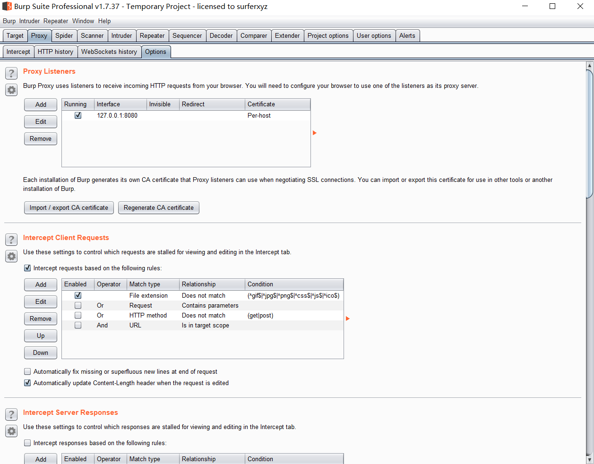
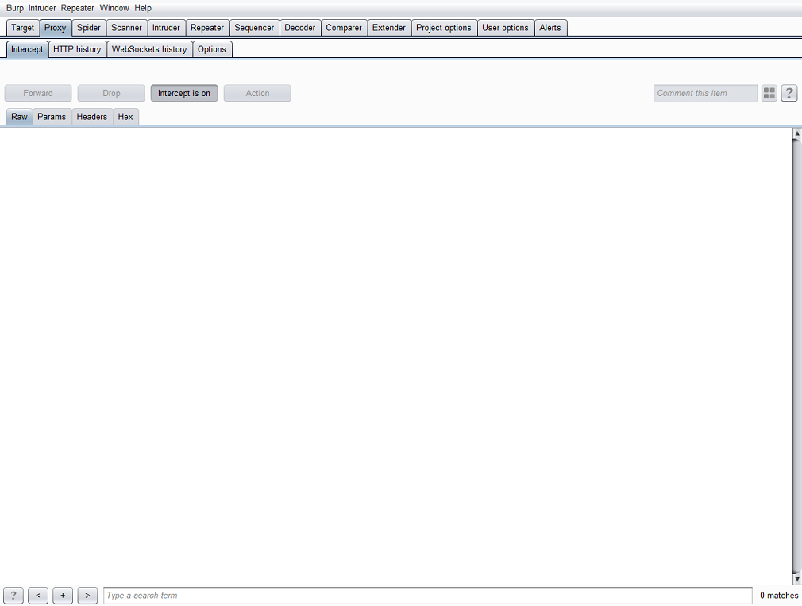
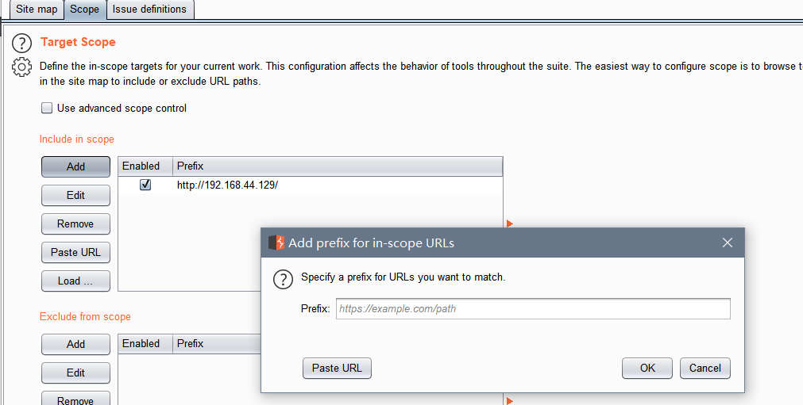
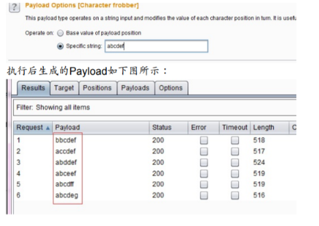

# Burp Suite的使用

[toc]


## Burp Suite基础

### **简介**

- 
    Burp Suite 是用于攻击web 应用程序的集成平台。它包含了许多工具，并为这些工具设计了许多接口，以促进加快攻击应用程序的过程。所有的工具都共享一个能处理并显示HTTP 消息，持久性，认证，代理，日志，警报的一个强大的可扩展的框架。

- 
    Burp Suite 包含了一系列burp 工具，这些工具之间有大量接口可以互相通信，之所以这样设计的目的是为了促进和提高 整个攻击的效率。平台中所有工具共享同一robust 框架，以便统一处理HTTP 请求，持久性，认证，上游代理，日志记录，报警和可扩展性。Burp Suite允许攻击者结合手工和自动技术去枚举、分析、攻击Web 应用程序。这些不同

- 的burp 工具通过协同工作，有效的分享信息，支持以某种工具中的信 息为基础供另一种工具使用的方式发起攻击。


### 主要模块：


```bash
1. Target(目标)——显示目标目录结构的的一个功能 
2. Proxy(代理)——拦截HTTP/S的代理服务器，作为一个在浏览器和目标应用程序之间的中间人，允许你拦截，查看，修改在两个方向上的原始数据流。 
3. Spider(蜘蛛)——应用智能感应的网络爬虫，它能完整的枚举应用程序的内容和功能。 
4. Scanner(扫描器)——高级工具，执行后，它能自动地发现web 应用程序的安全漏洞。 
5. Intruder(入侵)——一个定制的高度可配置的工具，对web应用程序进行自动化攻击，如：枚举标识符，收集有用的数据，以及使用fuzzing 技术探测常规漏洞。 
6. Repeater(中继器)——一个靠手动操作来触发单独的HTTP 请求，并分析应用程序响应的工具。 
7. Sequencer(会话)——用来分析那些不可预知的应用程序会话令牌和重要数据项的随机性的工具。 
8. Decoder(解码器)——进行手动执行或对应用程序数据者智能解码编码的工具。 
9. Comparer(对比)——通常是通过一些相关的请求和响应得到两项数据的一个可视化的“差异”。
10. Extender(扩展)——可以让你加载Burp Suite的扩展，使用你自己的或第三方代码来扩展Burp Suit的功能。 
11. Options(设置)——对Burp Suite的一些设置
12. Alerts(警告)——Burp Suite在运行过程中发生的一写错误
```


### 安装和环境配置

**中文版**

https://blog.csdn.net/LUOBIKUN/article/details/87457545?ops_request_misc=%257B%2522request%255Fid%2522%253A%2522164068187116780255288124%2522%252C%2522scm%2522%253A%252220140713.130102334..%2522%257D&request_id=164068187116780255288124&biz_id=0&utm_medium=distribute.pc_search_result.none-task-blog-2~all~top_positive~default-1-87457545.pc_search_mgc_flag&utm_term=burpsuite&spm=1018.2226.3001.4187

**Burp_Suite_Pro_v1.7.37**

https://blog.csdn.net/weixin_43811883/article/details/90272016?ops_request_misc=%257B%2522request%255Fid%2522%253A%2522164068221116780271985756%2522%252C%2522scm%2522%253A%252220140713.130102334..%2522%257D&request_id=164068221116780271985756&biz_id=0&utm_medium=distribute.pc_search_result.none-task-blog-2~all~sobaiduend~default-2-90272016.pc_search_mgc_flag&utm_term=burpsuite1.7&spm=1018.2226.3001.4187

**环境配置**

-  由于Burp Suite是用 java开发的所以要想使用这个工具、需先安装JDK、在安装好JDK之后、就要配置浏览器代理，关于JDK的安装就不做过多介绍，在上面中文版激活教程的链接中有关于JDK的安装和环境变量的配置。 


### 配置浏览器代理

> 抓包：浏览器浏览网页的数据包发送到burpsuite

（1）什么是浏览器代理

提供代理服务的电脑系统或其它类型的网络终端称为代理服务器（英文：Proxy Server）。一个完整的代理请求过程为：客户端首先与代理服务器创建连接，接着根据代理服务器所使用的代理协议，请求对目标服务器创建连接、或者获得目标服务器的指定资源。而所谓的浏览器代理就是给浏览器指定一个代理服务器，**浏览器的所有请求都会先发送到这个代理服务器**。

如何配置浏览器代理（以火狐为例）

1.打开火狐找到设置


2.在常规中找到网络设置


3.改为手动配置代理，输入你想要改成的代理地址和端口号


### 配置Burp Suite

在Proxy-options中修改代理设置信息




点击add可以添加代理ip


添加完后点击intercept，这里是抓取数据包的内容，打开intercept is on



以百度为例抓取数据包

**访问百度**


在burp suite中可以看到截获的数据包内容


此时可以点击forward发送数据包或者drop抛弃数据包，不修改数据包的内容发送即可恢复访问百度


## Burp Suite的功能

工具栏：


### **仪表盘**


- 有好多功能，可以开启主动扫描。流量审计。
    - 
- 爬行
    - crawl可以用于自动爬行的应用程序，以发现其内容和功能。
    - Burp     Scanner扫描方式主要有两种：主动扫描和被动扫描
    - 当某种业务场景的测试，每测试一次都会导致业务的某方面问题时，我们也可以使用被动扫描模式，去验证问题是否存在，减少测试的风险。
    - spider：被动爬网：（被动爬网获得的链接是手动爬网的时候返回页面的信息中分析发现超链接） 
    - 主动扫描scanner的时候设置（（也支持Passive     Scanning：指的是手动爬网的时候对返回信息进行判断是否存在漏洞 
    - 应用登陆（Application Login）此选择项主要用来控制抓取时，登陆页面的处理方式。
        - 

### 1. Target(目标)

burp建立了目标应用程序的站点地图。

**站点地图包含了所有你在浏览器中访问的URL，并且包含从请求和响应中的内容（例如，通过分析从HTML响应链接）**。

**Site Map**

- sitmap下纪录的是我们访问过的页面，对其数据包自动进行审查，找出漏洞，审查已通过爬虫被检测到，但尚未请求中的目标的任何项目的站点地图。这些站点显示为灰色的站点地图，所以这是一种被动的方式，需要人手工访问，避免自动加载有害代码。

**Scope**

- site map会记载所有访问，若只想关注某一网站，右键令其in scope(url必须满足，include内，不在exclude内才行)，可自动可手动添加
    - 


- **再使用过滤条件，只看范围内的访问，善用过滤，选择自己想要看的东西**
    1.  

1.  **Search term** 您可以过滤对反应是否不包含指定的搜索词。您可以设定搜索词是否是一个文 字字符串或正则表达式，以及是否区分大小写。如果您选择了“消极搜索”选项， 然后不匹配的搜索词唯一的项目将被显示。
2.  File extension 您可以设定是否要显示或隐藏指定的文件后缀的项目。
3.  Annotation 您可以设定是否显示仅添加过注释的数据（对每一条数据，我们自己可以添加注释，右键添加，高亮也是自己也是右键 ）的评论或仅高亮项目。
4.  将黑色地址 send to repeate就可看到返回的数据报
    1.  

5.  
6.  左边是网站的树形结构，右边是列表结构

7.  站点比较是在两个站点地图之间进行的，站点比较是一个Burp提供给渗透测试人员对站点进行动态分析的利器，我们在比较帐号权限时经常使用到它。
    1.  主要有以下3种场景：
        1.  同一个帐号，具有不同的权限，比较两次请求结果的差异。
        2.  两个不同的帐号，具有不同的权限，比较两次请求结果的差异。
        3.  两个不同的帐号，具有相同的权限，比较两次请求结果的差异。
    2.  攻击面分析是Burp Suite 交互工具（Engagement tools）中的功能
        

**导出此次渗透报告**

- 

### 2. Proxy(代理)

是一个拦截HTTP/S的代理服务器，作为一个在浏览器和目标应用程序之间的中间人，允许你拦截，查看，修改在两个方向上的原始数据流。选择“将所有的证书放入下列存储区”受信任的根证书颁发机构“才可实现https代理

Burp Proxy 是Burp Suite的核心，通过代理模式，可以让我们拦截、查看、修改所有在客户端和服务端之间传输的数据。

- Proxy组件下有四个标签，分别是
- Intercept(拦截),
- HTTP history(HTTP历史),
- WebSockets history(WebSockets历史),
- Options(选项)。

在这里可以输入注释，标记拦截的数据包，五颜六色的就是标记高亮颜色


##### 1）intercept（拦截）

 用于显示和修改HTTP请求和响应，通过你的浏览器和Web服务器之间。在Burp Proxy的选项中，您可以配置拦截规则来确定请求是什么和响应被拦截


```
**Forward**：当你编辑信息之后，发送信息到服务器或浏览器
**Drop**：当你不想要发送这次信息可以点击drop放弃这个拦截信息
**Interceptionis on/off**：这个按钮用来切换和关闭所有拦截。如果按钮显示Interceptionis On，表示请求和响应将被拦截或自动转发根据配置的拦截规则配置代理选项。如果按钮显示Interception is off则显示拦截之后的所有信息将自动转发。
**Action**：说明一个菜单可用的动作行为操作可以有哪些操作功能 

```


```
 ● Send to Spider**             发送给爬虫
● Do an active scan**          执行主动扫描
**Send to Intruder**             发送到入侵者
**Send to Repeater**          发送到中继器
**Send to Sequencer**       发送到序列发生器
**Send to Comparer**        发送到比较器
**Send to Decoder**   		发送到解码器
**Request in browser**       在浏览器的请求
**Engagement tools**        参与工具
**Change request method**  对所有的请求，经过把所有相关的请求参数适当地搬迁到这个请求里来，你就可以自动地把请求的方法在 POST 和 GET 中间切换。通过发送恶意的请求使用这个选项来快速测试应用程序的极限参数是多少。
**Change body encoding**   对于所有的请求，你可以在应用程序/X-WWW 格式的 URL 编码和多重表单/数据之间切换消息体的编码方式。
**Copy URL**       把当前的 URL 完整地复制到粘贴板上。
**Cope as curl command**   作为curl命令。
**Cope to file**       这个功能允许你把选择一个文件，并把消息的内容复制到这个文件里。这个对二进制数据来说是很方便的，要是通过粘贴板来复制会带来一些问题。复制操作是在选择的文本上进行的，如果没有被选中的内容，则是针对整个消息了。
**Pase form file**       这个功能允许你选择一个文件，并把文件里的内容粘贴到消息里。这个对二进制数据来说是很方便的，要是通过粘贴板来复制会带来一些问题。粘贴操作会替换掉被选中的内容，如果没有内容被选中，则在光标位置插入这些内容。
**Save item** 这个功能让你指定一个文件，把选中的请求和响应以XML的格式保存到这个文件，这里面包括所有的元数据如：响应的长度，HTTP 的状态码以及 MIME 类型。

**Don't intercept requests**      不再拦截此主机的消息、不再拦截此IP地址的消息、不再拦截此种文件类型的消息、不再拦截此目录的消息，也可以指定针对此消息拦截它的服务器端返回消息。

**Do intercept**          仅对请求有效，这允许你可以对当请求和响应的进行强制拦截。
**Convert seiection**                 这些功能让你能够以多种方案对选择的文本进行快速的编码和解码。
**URL-encode as you type**    如果这个选项被打开，你输入的像&和=这样的符号会被等价的 URL编码代替。
**Cut**                                           剪切
**Copy**                                       复制
**Paste**                                       粘贴
**Message edit help**               消息编辑帮助
**Proxy interception help**       代理拦截帮助


```


##### 2）HTTP History（历史）


显示所有请求产生的细节，显示的有目标服务器和端口，HTTP 方法，URL，以及请求中是否包含参数或被人工修改，HTTP 的响应状态码，响应字节大小，响应的 MIME类型，请求资源的文件类型，HTML 页面的标题，是否使用 SSL，远程 IP 地址，服务器设置的 cookies，请求的时间


 ##### 3）WebSockets history

 这个选项主要用于记录WebSockets的数据包，是HTML5中最强大的通信功能，定义了一个全双工的通信信道，只需Web上的一个 Socket即可进行通信，能减少不必要的网络流量并降低网络延迟

##### 4）Options

该选项主要用于设置代理监听、请求和响应，拦截反应，匹配和替换，ssl等，其中有八大选项:Proxy Listeners、Intercept Client Requests、Intercept Server Responses、Intercept WebSockets Messages、Response Modification、Match and replace、SSL Pass Through、Miscellaneous


```
 ● Proxy Listeners：代理监听 
 ● Intercept Client Requests：配置请求拦截规则 
 ● Intercept Server Responses：配置拦截响应龟则
 ● Intercept WebSockets Messages：拦截套接字信息 
 ● Response Modification：响应修改 
 ● Match and replace：匹配和响应
 ● SSL Pass Through：SSL通过 
 ● Miscellaneous：其它 
```

 

Passive Spidering（被动扫描）

 

```
● Passively spider as you browse:如果这个选项被选中，Burp Suite 会被动地处理所有通过 Burp Proxy 的 HTTP 请求，来确认访问页面上的链接和表格。使用这个选项能让 Burp Spider 建立一个包含应用程序内容的详细画面，甚至此时你仅仅使用浏览器浏览了内容的一个子集，因为所有被访问内容链接到内容都会自动地添加到 Suite 的站点地图上。

 ● link depth to associate with proxy requests:这个选项控制着与通过 Burp Proxy 访问的 web 页面 有关的” link depth”。为了防止 Burp Spider 跟踪这个页面里的所有链接，要设置一个比上面 选项卡里的” maximum link depth”值还高的一个值。
```


Form Submission（表单提交）

 

```
● individuate forms：个性化的形式。这个选项是配置个性化的标准(执行 URL，方法，区域，值)。当 Burp Spider 处理这些表格时，它会检查这些标准以确认表格是否是新的。旧的表格不会加入到提交序列。

 ● Don’t submit：开启后蜘蛛不会提交任何表单。

 ● prompt for guidance：提醒向导。如果被选中，在你提交每一个确认的表单前，Burp Suite 都会为你指示引导。这允许你根据需要在输入域中填写自定义的数据，以及选项提交到服务器的哪一个区域。

 ● automatically submit：自动提交。如果选中，Burp Spider 通过使用定义的规则来填写输入域的文本值来自动地提交范围内的表单。每一条规则让你指定一个简单的文本或者正则表达式来匹配表单字段名，并提交那些表单名匹配的字段值。

 ● set unmatched fields to：设置不匹配的字段。
```

application login（登录表单）

```
 ● don't submit login forms：不提交登录表单。开启后burp不会提交登录表单。
 ● prompt for guidance：提示向导。Burp能交互地为你提示引导。默认设置项。
 ● handle as ordinary forms：以一般形式处理。Burp 通过你配置的信息和自动填充规则，用处理其他表单的方式来处理登陆表单。
 ● automatically submit these credentials：自动提交自定义的数据。开启后burp遇到登录表单会按照设定的值进行提交。


```

Spider Engine(爬虫引擎)

 

```
● Number of threads - 设置请求线程。控制并发请求数。

 ● Number of retries on network failure - 如果出现连接错误或其他网络问题，Burp会放弃和移动之前重试的请求指定的次数。测试时间歇性网络故障是常见的，所以最好是在发生故障时重试该请求了好几次。

 ● Pause before retry - 当重试失败的请求，Burp会等待指定的时间（以毫秒为单位）以下，然后重试失败。如果服务器宕机，繁忙，或间歇性的问题发生，最好是等待很短的时间，然后重试。

 ● Throttle between requests：在每次请求之前等待一个指定的延迟（以毫秒为单位）。此选项很有用，以避免超载应用程序，或者是更隐蔽。

 ● Add random variations to throttle：添加随机的变化到请求中。增加隐蔽性。
```

Request Headers（请求头设置）

   可以配置头蜘蛛在请求中使用的自定义列表。这可能是有用的，以满足各个应用程序的特定要求 - 例如，测试设计用于移动设备的应用程序时，以模拟预期的用户代理。

```

 ● Use HTTP version 1.1 ：在蜘蛛请求中使用HTTP/1.1，不选中则使用HTTP/1.0.
 ● Use Referer header：当从一个页面访问另一个页面是加入Referer头，这将更加相似与浏览器访问。

   
```

### 4. Intruder(入侵)

对 web应用程序进行自动化攻击，如：枚举标识符，收集有用的数据，以及使用 fuzzing技术探测常规漏洞。Intruder在原始请求数据 的基础上，通过修改各种请求参数，以获取不同的请求应答。

Payload位置和攻击类型

- 狙击手模式（Sniper）——它使用一组Payload集合，依次替换Payload位置上（一次攻击只能使用一个Payload位置）被§标志的文本（而没有被§标志的文本将不受影响），第一个攻击点搞完后，换第二个攻击点，不同步改变两个
- 攻城锤模式（Battering ram）——它使用一组的Payload集合，依次替换Payload位置上 被§标志的文本（而没有被§标志的文本将不受影响），与狙击手 模式的区别在于，同时改变所有的攻击点，改成一样的payload
- 草叉模式（Pitchfork ）——它可以使用多组Payload集合，在每一个不同的Payload标志 位置上（最多20个），遍历所有的Payload。多组payload分别在自己的攻击点攻击，不交叉，不笛卡尔积，假设两组payload个数分别为5，5，则发动5次请求
- 集束炸弹模式（Cluster bomb） 它可以使用多组Payload集合，在每一个不同的Payload 标志位置上（最多20个），依次遍历所有的Payload。它与草叉模式的主要区别在于，笛卡尔级，假设两组payload个数分别为5，5，则发动25次请求

Grep Match——这个设置主要用来从响应消息中提取结果项，如果匹配，则在攻击结果 中添加的新列中标明，便于排序和数据提取。比如说，在密码猜测攻击，扫描诸如“密码 不正确”或“登录成功”，可以找到成功的登录;在测试SQL注入漏洞，扫描包 含“ODBC”，“错误”等消息可以识别脆弱的参数。 

Grep Payloads——这些设置可用于提取响应消息中是否包含Payload的值，比如说，你 想验证反射性的XSS脚本是否成功，可以通过此设置此项。当此项设置后，会在响应的 结果列表中，根据Payload组的数目，添加新的列，显示匹配的结果，你可以通过点击列 标题对结果集进行排序和查找。 

重定向（Redirections）——这些设置主要是用来控制执行攻击时Burp如何处理重定向， 在实际使用中往往是必须遵循重定向，才能实现你的攻击目的。


 

**payload类型，一共有18中类型**：

1. 简单列表（Simple list） ——最简单的Payload类型，通过配置一个字符串列表作为 Payload，也可以手工添加字符串列表或从文件加载字符串列表。

2. 运行时文件（Runtime file） ——指定文件，作为相对应Payload位置上的Payload列表。运行时，Burp Intruder将 读取文件的每一行作为一个Payload。 适用于密码文件较大的时候

3. 自定义迭代器（Custom iterator）——这是一款功能强大的Payload，它共有8个占位， 每一个占位可以指定简单列表的Payload类型，然后根据占位的多少，与每一个简单列表 的Payload进行笛卡尔积，生成最终的Payload列表。例如多用户与多密码的爆破

4. 字符串替换（Character     substitution）——顾名思义，此种Payload的类型是对预定义的 字符串进行替换后生成新的Payload。比如说，预定义字符串为ABCD，按照下图的替换 规则设置后，将对AB的值进行枚举后生成新的Payload为ABCD,4BCD,A8CD,48CD,每个单词都替换一次

5. 大小写替换（Case modification）To Propername（首字母大 写，其他小写）、To ProperName（首字母大写，其他不改变），

6. 递归grep （Recursive grep）——此Payload类型主要使用于从服务器端提取有效数据的 场景，需要先从服务器的响应中提取数据作为Payload，然后替换Payload的位置，又再发送一次请求，在Payload的可选项设置 （Options）中配置Grep规则，然后根据grep去提取数据才能发生攻击。

7. 不合法的Unicode编码（Illegal Unicode）—— 在payloads里用指定的不合法Unicode 编 码替换字符本身，从这些Payload列表里产生出一个或者多个有效负荷。在尝试回避基于 模式匹配的输入验证时，这个有效负荷会有用的，例在目标系统上回避高 级模式匹配控制时，这个功能就会很有用

8. 字符块（Character blocks）——这种类型的Payload是指使用一个给出的输入字符串， 根据指定的设置产生指定大小的字符块，表现形式为生成指定长度的字符串。它通常使 用了边界测试或缓冲区溢出。 

9. 数字类型（Number）——这种类型的Payload是指根据配置，生成一系列的数字作为 Payload。

10. 日期

11. 暴力字典（Brute forcer）——此类Payload生成包含一个指定的字符集的所有排列特定长 度的有效载荷，通常用于枚举字典的生成，其设置界面如下： 

12. 空类型（Null payloads）——这种负载类型产生的Payload，其值是一个空字符串。在攻 击时，需要同样的请求反复被执行，在没有任何修改原始请求的场景下此Payload是非常 有用的。例如cookie的序列分析、应用层Dos、或保活会话令牌是在 其它的间歇试验中使用。 

13. 字符frobber（Character frobber）——这种类型的Payload的生成规律是：依次修改指定 字符串在每个字符位置的值，每次都是在原字符上递增一个该字符的ASCII码，依次+1后取消。

    1. 

    - 它通常使 用于测试系统使用了复杂的会话令牌的部件来跟踪会话状态，当修改会话令牌中的单个 字符的值之后，您的会话还是进行了处理，那么很可能是这个令牌实际上没有被用来追 踪您的会话。

14. Bit翻转（Bit flipper）——这种类型的Payload的生成规律是：对预设的Payload原始值， 按照比特位，依次进行修改。会话令牌或其他参数值使用CBC模式的块密码加密，有可能系统地由前一密码块内修改 Bit位以改变解密后的数据。在这种情况下，你可以使用的Bit 翻转的Payload来确定加密 值内部修改了个别bit位后是否对应用程序产生影响，并了解应用程序是否容易受到攻击

15. 用户名生成器（Username generator）这种类型的Payload主要用于用户名和email帐号 的自动生成

16. ECB 加密块洗牌（ECB block shuffler）——这种类型的Payload是基于ECB加密模式的 Payload生成器，

17. Burp Payload生成插件（Extension-generated）——这种类型的Payload是基于Burp插 件来生成Payload值，因此使用前必须安装配置Burp插件，在插件里注册一个Intruder payload生成器，供此处调用。

18. Payload复制（Copy other payload）——这种类型的Payload是将其他位置的参数复制到 Payload位置上，作为新的Payload值，通常适用于多个参数的请求消息中，它的使用场 景可能是： 1.两个不同的参数需要使用相同的值，比如说，用户注册时，密码设置会输 入两遍，其值也完全一样，可以使用此Payload类型。 2.在一次请求中，一个参数的值是 基于另一个参数的值在前端通过脚本来生成的值，可以使用此Payload类型

    1. 

### 5. Repeater(重放)

 手动操作来触发单独的HTTP请求，并进行应用程序响应的工具。此功能用于根据不同的情况修改和发送相同的请求并分析，通过调整Request的参数，不断尝试，通过Response查看状态。从而节省在浏览器中操作的时间。 

在渗透测试过程中，我们经常使用Repeater来进行请求与响应的消息验证分析，比如修改请 求参数，验证输入的漏洞；修改请求参数，验证逻辑越权；从拦截历史记录中，捕获特征性 的请求消息进行请求重放

当我们在请求编码的数字上双击之后，可以修改请求的名字，这是为了方便多个请求消 息时，做备注或区分用的。

 在Repeater的操作界面中，左边的Request为请求消息区，右边的Request为应答消息区，请求消息区显示的是客户端发送的请求消息的详细信息。当编辑完请求消息后，单击"GO"按钮即可发送请求给服务器。

站内跳转 是指当前的同一站点内跳转；目标域跳转是指target scope中配置的域可以跳转； 

- 我们也可以禁用302跳转

- 

### 6. Sequencer(序列器)

**是一个用来分析那些不可预知的应用程序会话令牌和重要数据项的随机性的工具。**

Burp Sequencer作为Burp Suite中一款用于检测数据样本随机性质量的工具，**通常用于检测访问令牌是否可预测、密码重置令牌是否可预测等场景**（现在的框架基本无法去预测），通过Sequencer的数据样本分析，能很 好地降低这些关键数据被伪造的风险。

Sequencer作为一款随机数分析的工具，在分析过程中，可能会对系统造成不可预测的 影响，在你不是非常熟悉系统的情况下，建议不要在生产环境进行数据分析。

从Burp Proxy的历史日志记录中，寻找token或类似的参数，send to

配置

- 

### 7. Decoder(解码器)

Burp Decoder的功能比较简单，作为Burp Suite中一款编码解码工具，它能对原始数据进行各 种编码格式和散列的转换。其界面如下图，主要由输入域、输出域、编码解码选项三大部分 组成。 

可以多次加密


### 8. Comparer(对比)

Burp Comparer在Burp Suite中主要提供一个可视化的差异比对功能，来对比**分析两次数据包之间的区别。**

使用中的场景可能是： 1.枚举用户名过程中，对比分析登陆成功和失败时，服务 器端反馈结果的区别。

- 使用 Intruder 进行攻击时，对于不同的服务器端响应，可以很快的 分析出两次响应的区别在哪里。

-  进行SQL注入的盲注测试时，比较两次响应消息的差异，


### 9. Extender(扩展)

 可以让你加载Burp Suit的扩展，使用你自己的或第三方代码来扩展Burp Suit的功能，比如各种漏洞检测插件啊。

### 10. Project options(项目选项)

 对项目参数的一些设置

### 11. User Options(用户选项)

 对Burp Suit的一些设置
