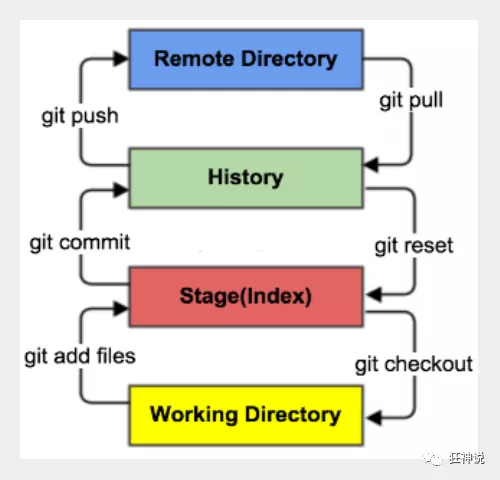

# git教程

### 0x01 什么是git?

1. Git 是一个开源的分布式版本控制系统，用于敏捷高效地处理任何或小或大的项目。

2. Git 是 Linus Torvalds 为了帮助管理 Linux 内核开发而开发的一个开放源码的版本控制软件。

3. Git 与常用的版本控制工具 CVS, Subversion 等不同，它采用了分布式版本库的方式，不必服务器端软件支持。

### 0x02 git安装

- [https://git-scm.com/](https://git-scm.com/) 下载git，双击然后一直下一步安装即可。  

- 使用cmd或者powershell，输入git，有正确显示就表示安装成功。

  ```
  (base) PS C:\Users\xxx> git
  usage: git [--version] [--help] [-C <path>] [-c <name>=<value>]
      [--exec-path[=<path>]] [--html-path] [--man-path] [--info-path]
      [-p | --paginate | -P | --no-pager] [--no-replace-objects] [--bare]
      [--git-dir=<path>] [--work-tree=<path>] [--namespace=<name>]
      [--super-prefix=<path>] [--config-env=<name>=<envvar>]
      <command> [<args>]
  ```

### 0x03 git原理

1. 


2. Git本地有三个工作区域:工作目录working directory(增、减、改东西的区域)、暂存区stage(又叫缓存区)（是一个隐藏文件,在本地生成的文件为.git文件）、资源库（用于存放我们进行文件修改的操作的）  
**工作目录**：即你能在电脑中看到的那个目录  
**暂存区**：一般存放于.git目录下的index文件中，一切行动所修改的暂留区。  
**版本库**：工作区中的一个**隐藏**文件夹.git。（需要打开可见隐藏项目这一选项）  
还有一个远程仓库,即通过github或者gittee所搭建的一个远程仓库（存储库），git通过链接到远程仓库(若是他人的私有库则需要获取权限)

**工作原理：**

1. **对文件进行操作后，这个操作本地先上传至暂存区，暂存区（又叫缓存区）东西提交给本地仓库，本地仓库Push至远程仓库**。
2. （也可逆向）如图示

3. （一般的大项目是需要在分支中进行代码的修改，随后合并到主分支中，而非直接push。）

4. 远程仓库:github(国外)、gitee（国内）;是代码托管的服务器

**git的工作流程：**

1. 在工作目录中添加、删除、修改文件；

2. 将修改的文件放入暂存区；

3. 将暂存区的文件提交到远程仓库

因此，git管理的文件有三种状态：已修改（modified）/已暂存(staged)/已提交(committed)

当你使用status命令时，即可查看（所有或指定）文件的状态。

### 0x04 git实践

**第一步**

全局配置

通过git命令，全局配置本地的用户名以及邮箱（用于后续push到远程仓库时留下记号，这样远程仓库可以得知某人在何时所提交的内容，其次远程仓库并不会验证用户名以及邮箱，只是强烈建议修改成自身github的用户名以及github注册的邮箱，是因为git是注重历史的，可以得知这个项目的贡献者，或者排查出bug出现在何次提交）

```
git config --global user.name "your_github_name"
git config --global user.email  "your_email"
```

**第二步**

创建本地库

```
$ git init
```

**建议先找寻到需要建库的文件夹目录下,随后鼠标右击用git-bash或者用cmd打开，随后执行命令。**（若无法用git-bash打开则是因为git路径问题，该问题csdn等等平台有详细解决办法，不赘述）

【注意】使用git clone时，本地会自动建立.git库，不需要额外创建库。(无论编写代码，还是查看代码，都建议先克隆到本地)  
所以在想要新建一个库时**不推荐使用`git init`创建本地库**，而是在github上创建库，然后`git colne`下载到本地。

**第三步**

对文件进行任何修改后，添加文件到暂存区，这样就会缓存修改了。

```
$ git add file
```

file为你所需要添加到暂存区到文件**全名**（即包括后缀名）

暂存区仅是起暂时存储的功能，将对代码的改变add到暂存区后，commit（后续会介绍）到本地库，随后push到远程库，远程库便会发生改变。

**第四步**

将暂存区的修改内容提交到本地库

```
$ git commit -m "message"  #提交所有的暂存区内容
```

"message"中的内容应记录为**本次修改的全部内容**(为了后续查看以及方便多人共享开发项目时他人的查看)，并且""中必须存在内容才能提交到本地库。

```
$ git commit file1 file2 -m "message"    #提交file1,file2至本地库
```

**第五步**

配置远程仓库

首先需要创建SSH Key. 在本地电脑用户主目录下，查看是否有.ssh文件夹存在。（若从未使用过git则不会存在），若未存在则在一个你记得住路径的文件夹里右击打开git-bash，执行命令：

```
$ ssh-keygen -t rsa -C "youremail@example.com"
```

邮件地址换成自己的github注册邮箱地址，随后**一路回车即可**。该Key无需加密，一般并无军事目的，不需要设置密码以及特殊加密。

执行完毕后，可以在该目录下会出现.ssh文件夹，该文件夹中会出现id_rsa和id_rsa.pub两个文件，id_rsa是私人密钥，不应泄漏。

随后登录Github,右上角头像处下拉栏中打开**setting**,随后找到**SSH and GPG keys**

点击 **Add SSH Key**，填上任意title，随后在Key文本框中粘贴：上述生成的两个文件之一的 **id_rsa.pub**  文件中的内容。（用记事本打开即可查看到id_rsa.pub的内容）

SSH Key的作用是认证，当使用clone(克隆)，pull(拉取)等等操作时，需要github将会对本机认证，查看是否具备权限实现操作。**当然，认证的方式不止一种，也可以使用github账号密码进行认证，这是一个可选择的认证方式，当你初次克隆或者拉取等操作时，git会弹出github窗口进行认证。**

**第六步**

添加远程库

若已经存在远程库，则git clone到本地

- 使用`git clone https://github.com/xxx/xxx.git`命令即可。这个连接可以在github页面点击code按钮得到。
  

  ```
  (base) PS D:\> git clone https://github.com/robin1577/security.git
  Cloning into 'security'...
  remote: Enumerating objects: 28, done.
  remote: Counting objects: 100% (28/28), done.
  remote: Compressing objects: 100% (14/14), done.
  remote: Total 28 (delta 1), reused 28 (delta 1), pack-reused 0
  Unpacking objects: 100% (28/28), 2.53 KiB | 27.00 KiB/s, done.
  ```

- 新建的本地库想同步到github中生成一个github存储库。

  - 不推荐这样做，如果想新建一个自己的库，且本地和github都有，那么直接在github上建立一个库，然后本地git clone即可。

**第七步**

将本地库的内容，推送至远程库

```
$ git push origin branch-name
```

branch-name是当前修改所在地分支名，一般会在bash中目录后面高亮显示。如果直接`git push`默认推送到主分支。

至此，git的基础使用已经完成。

### 0x05 文件操作


下面附上git基础命令

```
$ git rm file  #即删除版本库(本地库)中的文件，即已经commit到本地库的文件（若在工作区中手动删除文件，其实版本库中并未删除，也可以在工作区删除后再次commit到本地库，这样状态更新，也将该文件删除）
```

```
$ git status	#查看本地仓库的当前状态(包含当前所处分支，工作区已提交的文件，工作区未提交的文件)
```

```
$ git log		#查看日志(版本的历史记录)，即查看所有的提交(commit)情况.
```

```
$ git diff file #file为你需要查看的file名，该命令可以查看该文件到变化（增加,修改,删除,或是重命名等）
```

```
$ git checkout --file 	#撤回工作区的操作，即放弃对该文件修改（即你已经修改了文件，且commit到了本地库，此时使用该命令即在本地库中撤销对该文件的修改）
```

```
$ git remote -v #查看远程库的信息
```

**何时需要用到pull？**

场景：你在修改该远程库时，有一人在你克隆到本地后，还对远程库进行了修改，此时你想要将本次修改提交到远程库，git便会阻止你，可以使用pull命令将远程库修改的内容拉取到本地后，**进行合并**（有可能产生冲突有可能不产生冲突，产生冲突就要进行合并，合并后面会讲），再push。

```
$ git pull #更新
$ git pull origin  #更新
$ git pull origin master #将远程主机origin(记录着远程库的地址)的master分支拉取(pull)过来,与本地的当前分支合并。
$ git pull origin master:branch  #将远程主机origin的master分支拉取过来，与本地的branch分支合并
$ git pull --rebase origin master #在拉取过程中出现冲突及时提醒，并停止拉取。(推荐使用)
```

`git pull --rebase origin master` 如果这个步骤在执行过程中报错，目前遇到两种原因

* ”OpenSSL SSL_read: Connection was reset, errno 10054 “错误

  ```
  git config --global http.sslVerify "false"
  git pull --rebase origin master
  ```

* " Failed to connect to github.com port 443: Timed out"错误

  ```
  在本机的代理中，打开“自动检测设置”选项之后再执行git pull --rebase origin master
  ```

**.gitignore文件** 

该文件用于**忽略一些用户不想要上传到远程仓库的内容**，例如当你用mkdocs build命令在本地初始化一个页面时，mkdocs会自动将md代码等等生成一个site文件夹，该文件夹下的内容即是你打开网页的html-css-js内容。该内容是不需要上传到远程库的，所以可以使用.gitignore，在该文件中输入site/便将该文件夹下的全部内容忽略。

该文件的书写有如下**规则**：

1. 该文件中的空行或以(#)开始的行将会被忽略。（即#可以写明注释）

2. 可以使用Linux通配符。例如：星号（*）匹配多个字符，问号(?)匹配单个字符,方括号[abc]表示可选范围,大括号表示可选字符串等。

3. 一行只能出现一个语句

4. 规则的执行顺序是从上到下的。

5. "!"使用感叹号表示该文件不忽略

例如：

  ```
  #过滤项目的有所.txt文件
  *.txt
  #过滤整个项目的所有文件
  /*
  #过滤目录 file
  /file/
  #过滤file(当前目录)目录下单所有.txt文件，但是无法过滤/file2/xxx.txt
  /*.txt
  #保留所有的.txt文件
  !.txt
  #保留file目录以及其下的所有文件
  !/file/
  #保留当前目录下所有的.c以及.o文件
  !/*.[co]
  #保留当前目录下所有的.txt以及.cpp文件
  !/*.{txt,cpp}
  ```

### 0x06 版本回退
这个功能是我们在进行修改项目的时候，提交了修改，但后面又不想要这个修改了想还原成之前的。  
我们的提交的commit会形成一个个节点根据提交的顺序连成一条线，head会指向最新的commit，当我们想要回退的时候，只要指向之前的commit就行了。

查看历史版本

```
$ git log --pretty=oneline  #查看各个版本,并将每个版本的信息在一行显示(一个版本占一行)

$ git log --oneline        #显示方式与上述相同，不过版本hash显示部分，(只显示历史版本)更为简洁。

$ git reflog               #显示方式与上述相同，但是额外在每个版本后显示当前版本回退到该版本HEAD指针所需要移动的次数。(也可显示未来版本)  
```
  
可以看见Head(本质是一个指针)所指向的版本，即当前版本。

**版本回退操作**

```
$ git reset --hard 69c4a2b #后面的hash值是根据命令git reflog显示的局部索引值(推荐使用此种方法实现版本的前进后退)
```

  

```
$ git reset hard Head~n  #表示回退n步(仅能回退)
```

建议配合reflog命令，即可知道所需回退的版本需要回退多少步。

```
$ git reset --hard HEAD^   #版本回退一次。回退的次数由^符号的个数决定
```

该命令仅能回退版本，不能前进。

### 0x07 分支管理

分支的好处：

1. 同时并行推进多个功能开发，提高开发效率

2. 分支出现错误，不会影响其他分支与主分支

与分支有关的命令：

  ```
  $ git branch branchname #创建一个名为branchname的分支
  ```

  ```
  $ git branch -v  #查看分支数量
  ```

  ```
  $ git checkout branch  #切换至branch分支上
  ```

  ```
  $ git merge branch    #将branch分支合并至当前分支
  ```

**解决分支合并（或者本地和远程库）产生的冲突**：

- 当两个分支修改了同一个文件的内容时，git便无法决定，无法完成合并。**此时一直处于MERGING状态(即合并中的状态)**

解决方式：

- 可以打开产生冲突(使用git status查看哪个文件冲突)的文件，查看冲突的内容，并删除git产生的特殊符号。随后

- `git add file`
- `git commit -m "message" `  **此时commit后面不能跟具体文件名。**
- 使用图形化工具合并冲突更加方便。

### 0x08 标签

如果项目到达一个重要的阶段，并希望永远记住那个特别的提交**快照**（与虚拟机中的快照同义），那么可以使用git tag 给它打上标签。

*PS:*

**Git标签的本质就是指向某个commit的指针。**

> Git有commit，为什么还要引入tag？
>
> "请把上周一的那个版本打包发布，commit号是6a5819e…"
>
> "一串乱七八糟的数字不好找！"
>
> 如果换一个办法：
>
> "请把上周一的那个版本打包发布，版本号是v1.2"
>
> "好的，按照tag v1.2查找commit就行！"
>
> 所以，tag就是一个让人容易记住的有意义的名字，它跟某个commit绑在一起。

关于标签的命令：

```
$ git tag #查看已有的标签
$ git tag -a xxx   #-a表示给标签xxx加上注释,推荐一直使用带注释的标签。
当执行git tag -a命令时，Git会打开编辑器，让用户写一句标签注解。
```

```
$ git show v1.0  #查看标签v1.0指向的版本所修改的内容。
例：
[root@Git git]# git show v1.0
commit 91388f0883903ac9014e006611944f6688170ef4
Author: "syaving" <"819044347@qq.com">
Date: Fri Dec 16 02:32:05 2016 +0800
commit dir
diff –git a/readme b/readme
index 7a3d711..bfecb47 100644
— a/readme
+++ b/readme
@@ -1,2 +1,3 @@
text
hello git
+use commit
```

若版本提交到本地库了，但是忘记给予标签时，仍然可以给它追加标签。

假如发布提交了版本85fc7e7,但是忘记给予标签时：

```
$ git tag -a v0.9 85fc7e7
```

执行命令后即可追加标签。

### 0x09 跨团队协作
**无管理员权限的提交pr（pull request）**  

- 第一步：在需要的github库中点击github上的Fork

- 第二步：Fork完毕后在自己的github存储库中会存在一个Fork出来的库。

- 第三步：在本地克隆自己的库(Fork出来的库)。

- 第四步：克隆下来后，修改内容，随后push到自己的库。

- 第五步：发起pull request，即在自己的库中点击Pull requests。随后点击New pull request。随后点击Create pull request，随后写此次修改的内容等信息。

- 此时，在原存储库的所有人(管理员)处，可以查看该Pull requests，此时可以对话(类似聊天)。

- 管理员需要进行代码审核。审核完成后，点击Merge pull request，即可合并代码。

- 点击Merge pull request 随后可以填写消息，此消息即是进行commit操作的日志信息。  

**具有管理员权限的**

- 合并其他用户提交的pr
- 如果自己想修改文件内容，先克隆github库到本地，进行自己想要的修改，在进行一系列操作之后到最后一步git push的时候，先git pull拉取远程github分支，如果产生冲突合并冲突，再git push。
### 0x10 Github介绍

**什么是Github?**

Github 是一个基于git的代码托管平台，用户可以建立私人仓库或者公共仓库。公共仓库代码是公开的。

Github 由Chris Wanstrath, PJ Hyett 与Tom Preston-Werner三位开发者在2008年4月创办。

**注册账户以及创建仓库**

1.注册github账号

2.创建仓库: Create a New Repository,填写好名称后，Create。随后会出现一些仓库的配置信息，是一个git的简单教程。

**正是Github，让社会化编程成为现实。**
### 0x11 利用vscode简单化git操作
可以使用vscode编辑器下载GitLens — Git supercharged插件，可以有效的简化git操作。  


### 0x12 GitHub访问速度慢问题解决
* 在[ipaddress](https://www.ipaddress.com)查询
  查询下面三个域名ip：
    - github.com
    - github.global.ssl.fastly.net
    - codeload.Github.com
* 在本机打开C:\Windows\System32\drivers\etc\hosts，在hosts文件末尾中添加刚刚复制的IP，例如添加
```
140.82.112.3 github.com
199.232.69.194 github.global.ssl.fastly.net	
140.82.114.9 codeload.Github.com
```
* 保存hosts文件，打开cmd，输入指令`ipconfig /flushdns`，刷新系统DNS

### 0x13 利用gitbook来搜索别人写好的笔记

```js
site:gitbook.io web安全  
(site:"github.io" | site:"github.com" | site:""github.book") ("c++" + "代码审计")
```
