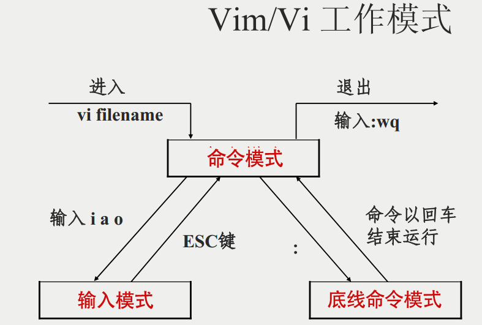

# Linux使用教程

## 虚拟机

### 0x01 什么是虚拟机软件？

1. 我们学过汇编语言，汇编语言可以看作是可读的机器指令，通过硬件来执行这些机器指令。我们所有的程序最终都会变成一条一条的机器指令然后硬件执行。
2. 操作系统也是一个软件，和我们平时写的c语言程序没什么区别，它最后也是变成机器指令一条一条执行。
3. 虚拟机软件通过宿主电脑的操作系统提供的api（应用程序接口）来模拟硬件环境（模拟出来cpu，内存，硬盘，汇编语言这些），内存和硬盘可以用一个c结构体来模拟，汇编指令也可以编写对应的c语言语句就行。可以根据硬件的cpu处理数据代码的逻辑，模拟出一个cpu。
4. 除了模拟硬件环境，还会模拟一个BIOS（Basic Input Output System）。像正常我们在主机上装系统时，是由BIOS读入操作系统，然后将cpu的执行转向操作系统。BIOS是电脑主板自带的。
5. **由虚拟机软件提供了虚拟硬件环境并安装了操作系统的环境叫做虚拟机。**

### 0x02 有哪些流行的虚拟机软件 

1. VMware Workstation（最好用的，收费），Virtual Box（开源），hyper（微软出品），wsl2(Windows Subsystem for Linux 微软出品)。

### 0x03 Vmware使用教程

1. 安装kali系统

    - 有两种办法
    - 下载iso镜像，然后自己用vmware安装操作系统。这样会生成虚拟机文件，用vmware打开就行。
    - 同理我们也可以直接下载由kali官方提供的已经安装完操作系统的文件。进入网址<https://www.kali.org/get-kali/#kali-virtual-machines>，直接下载配置好的镜像。下载好压缩包之后直接解压，打开镜像文件，用户名和密码都是**kali**。这种就不需要自己安装操作系统了。

2. 虚拟机硬件参数配置

    - 
    - 配置好内存，cpu，网络适配器选项。
    - 仅主机模式，nat，桥接的区别？  
        1. nat：这时候windows就相当于变成了一个路由器，虚拟机和windows复用windows的外网。（默认用这个，这样虚拟机可以连外网）  
        2. 桥接：就相当于多了一个网卡给虚拟机用，而且虚拟机和windows网卡是同级别的，他们会由外部的路由器分配到同一个网段，如果是连wifi，虚拟机和window时一样操作，打开wifi输入密码连接。  
        3. 仅主机模式：虚拟机无法通外网，虚拟机和windows构建了一个子网，只能虚拟机和windows之间访问。

3. kali更换下载源  

    * 官方下载源在下载软件时比较慢，因此需要更换成国内源（阿里云、华为等）

    * 使用root，进入/etc/apt文件夹下

    * 通过ls命令可以看到sources.list文件，使用vim打开，注释官方源（在改行最前面添加#即可），添加如下代码

        ```
        #阿里云
        deb http://mirrors.aliyun.com/kali kali-rolling main non-free contrib
        deb-src http://mirrors.aliyun.com/kali kali-rolling main non-free contrib
        #中科大
        deb http://mirrors.ustc.edu.cn/kali kali-rolling main non-free contrib
        deb-src http://mirrors.ustc.edu.cn/kali kali-rolling main non-free contrib
        ```

    * 更新系统，执行以下命令

        ```
        apt-get update
        apt-get upgrade
        apt-get dist-upgrade
        ```

    * 重启系统（`reboot`）

### 0x04 wsl2使用教程

1. wsl2相较于VMware有什么优缺点？  
    wsl2是一个轻量级的虚拟机，wsl2像是和windows融为一体了。我们可以打开一个linux软件像打开一个window程序一样呈现在windows下。
2. 如下图，我在windows中调用了kali的leafpad软件，直接显示在windows上了。
    
3. wsl1和wsl2的区别？  
    wsl2是由hyper虚拟机软件提供服务的，然后做了一些定制化，本身是虚拟机软件。而wsl1是做指令翻译，将linux可执行文件翻译成windows可执行文件，并没有做虚拟化内存，硬盘之类的。
4. 安装wsl2
    https://blog.csdn.net/weixin_39902608/article/details/111229132

### 0x05 docker的使用

> docker并不是一个虚拟机软件，他只是一个容器，而且只能在linux下运行。在一个linux操作系统中，我们可以利用docker来生成多个隔离的linux环境。

- docker上有很多配置好的靶机环境，我们可以使用别人的环境来进行测试，这样就不用自己搭建环境了。

- linux安装docker：

    - 登录系统，切换到root权限，安装docker（`apt-get install docker.io`）
    - 通过执行docker命令，观察是否安装成功。若安装成功，会提示若干docker命令

- windows安装docker：

- 换源：在配置文件中"registry-mirrors"的值添加国内源就行

    - 在windows下，docker使用的是wsl2或者hyper的linux环境，有图形化界面。

    - linux需要自己配置

- 找寻并下载靶机images：

    - 在库中搜索镜像： `docker search  imagename`

        - 比如搜索sqli-labs这个靶机。`docker search sqli-labs`

        - 然后会出现多个用户上传的靶机。选择一个STARTS高的就行。

            ```shell
            C:\Users\15775>docker search sqli-labs
            NAME                   DESCRIPTION                      				STARS  
            
            acgpiano/sqli-labs     sql injection labs                              	  28
            
            c0ny1/sqli-labs        sqli-labs是一个sql注入的练习靶机，项目地址为…           7
            
            sari3l/sqli-labs-safedog   Base: sqli-labs & safedog(version Linux64_2.…   2
            
            0bajie0/sqli-labs                                                          1
            
            promiseit/sqli-labs                                                        1
            
            ```

    - 在库中下载镜像：`docker pull   NAME`

        - 比如下载 `docker pull   acgpiano/slqi-labs`

- 镜像是我们下载下来的文件，通过镜像可以生成隔离的linux环境——容器，一旦容器生成成功，容器和镜像就没有关系了。容器是容器，镜像是镜像。

- 启动images产生一个容器Containers：

    - `docker run path/imagename`
        - -d 后台运行
        - -i 交互式操作
        - -t 终端
        - --name 容器别名
        - -p localport:靶机port
    - 例如：`docker run -dt --name slqi-labs -p 8080:80  acgpiano/sqli-labs`
        - **-p 8080:80**则是将靶机的80端口映射到主机的8080端口。这样我们访问http://localhost:8080就能访问到靶机了。
    - windows下，图形化界面生成容器，启动靶机。
        - 

- 启动完成后就可以在浏览器打开http://localhost:8080则能访问slqi-labs中的内容

- 其他docker命令：

    ```shell
    docker ps  							#查看当前正在运行的容器，有容器的id值
    docker ps -a 						#查看所有容器信息
    docker images						#列出本地镜像
    docker exec -it 容器id /bin.bash     #执行容器
    
    docker stop 容器名称/容器ID 			#停止该容器
    docker stop $(docker ps -q)			#停止全部运行中的容器
    
    docker start 容器名称/ID			 #启动该容器
    docker restart 容器名称				 #重启该容器
    
    docker rm 容器名称/容器ID			   #删除容器
    docker rmi 镜像名称					#删除镜像
    docker rm $(docker ps -aq)         #删除全部容器
    ```

    

## Linux基础

1. Linux 内核最初只是由芬兰人林纳斯·托瓦兹（Linus Torvalds）在赫尔辛基大学上学时出于个人爱好而编写的。

2. Linux 是一套免费使用和自由传播的类 Unix 操作系统，是一个基于 POSIX 和 UNIX 的多用户、多任务、支持多线程和多 CPU 的操作系统。

3. Linux 能运行主要的 UNIX 工具软件、应用程序和网络协议。它支持 32 位和 64 位硬件。Linux 继承了 Unix 以网络为核心的设计思想，是一个性能稳定的多用户网络操作系统。

**Linux发行版**


**Linux  VS  Windows**

| 比较     | Windows                                                      | Linux                                                        |
| :------- | :----------------------------------------------------------- | :----------------------------------------------------------- |
| 界面     | 界面统一，外壳程序固定所有 Windows 程序菜单几乎一致，快捷键也几乎相同 | 图形界面风格依发布版不同而不同，可能互不兼容。GNU/Linux 的终端机是从 UNIX 传承下来，基本命令和操作方法也几乎一致。 |
| 驱动程序 | 驱动程序丰富，版本更新频繁。默认安装程序里面一般包含有该版本发布时流行的硬件驱动程序，之后所出的新硬件驱动依赖于硬件厂商提供。对于一些老硬件，如果没有了原配的驱动有时很难支持。另外，有时硬件厂商未提供所需版本的 Windows 下的驱动，也会比较头痛。 | 由志愿者开发，由 Linux 核心开发小组发布，很多硬件厂商基于版权考虑并未提供驱动程序，尽管多数无需手动安装，但是涉及安装则相对复杂，使得新用户面对驱动程序问题（是否存在和安装方法）会一筹莫展。但是在开源开发模式下，许多老硬件尽管在Windows下很难支持的也容易找到驱动。HP、Intel、AMD 等硬件厂商逐步不同程度支持开源驱动，问题正在得到缓解。 |
| 使用     | 使用比较简单，容易入门。图形化界面对没有计算机背景知识的用户使用十分有利。 | 图形界面使用简单，容易入门。文字界面，需要学习才能掌握。     |
| 学习     | 系统构造复杂、变化频繁，且知识、技能淘汰快，深入学习困难。   | 系统构造简单、稳定，且知识、技能传承性好，深入学习相对容易。 |
| 软件     | 每一种特定功能可能都需要商业软件的支持，需要购买相应的授权。 | 大部分软件都可以自由获取，同样功能的软件选择较少。           |

### Linux安装

Ubuntu是世界上最流行的Linux发行版。

将以Ubuntu为例为大家介绍Linux的安装：在Windows系统上安装VMware Workstation 虚拟机软件，安装Ubuntu操作系统，并安装Mware- -Tools工具，实现主机和虚拟机之间的文件复制和虚拟机的全屏显示。

**1）准备软件包**

下载虚拟机软件VMware Workstation，并根据提示进行安装，安装完成后，下载Ubuntu版操作系统镜像文件，以备后面使用。

**2）配置虚拟机**

（1）打开VMware Workstation窗口，单击“文件”菜单，选择”新建虚拟机“子菜单，打开新建虚拟机向导对话框。


（2）在新建虚拟机向导对话框中，选中“自定义（高级）”单选按钮，单击”下一步“按钮。


（3）在“硬件兼容性”中选择“Workstation 10.0”，单击”下一步“按钮。


（4）选择“稍后安装操作系统”单选按钮，否则会全自动安装操作系统，并装成英文版，单击”下一步“按钮。


（5）在“客户机操作系统”中选择“Linux”单选按钮，“版本”中选择“Ubuntu”，单击”下一步“按钮。


（6）在“虚拟机名称”中输入“Ubuntu1”，并设置安装路径，单击”下一步“按钮。

（7）设置处理器数量，默认为一个处理机器，单击”下一步“按钮。


（8）设置“此虚拟机的内存”为“1024 MB”，也可以根据计算机实际内内存容量设置更大值，单击”下一步“按钮。


（9）设置虚拟机网络模式，选择“使用网络地址转换（NAT）模式”，虚拟机使用主机网络，单击”下一步“按钮。

（10）设置SCSI控制器类型，这里选择默认的“LSI Logic”单选按钮，单击”下一步“按钮。

（11）选择虚拟磁盘类型，这里选择“SCSI”单选按钮，单击”下一步“按钮。

（12）在“磁盘”中选择“创建新虚拟磁盘”单选按钮，单击”下一步“按钮。

（13）设置“最大磁盘大小（GB）”为”20“，其它选项使用默认设置，单击”下一步“按钮。


（14）设置磁盘文件存储位置，这里使用默认设置，单击”下一步“按钮。


（15）显示要创建的虚拟机信息，单击“完成”按钮，虚拟机创建完成。


**3）安装Ubuntu操作系统**

（1）开始准备安装Ubuntu操作系统，单击“开启此虚拟机”图标之前，查看左侧”CD/DVD（SATA）“项，若值为自动检测，则需要设置操作系统镜像文件，及单机CD/DVD(SATA)，打开“虚拟机设置”对话框，单击“浏览”按钮选择镜像文件，单击“确定”按钮，单机“开启此虚拟机”图标开始作为超级用户安装。


（2）点击确认，打开虚拟机


（3）在安装（作为超级用户）界面中，选择“中文（简体）”，单机“安装Ubuntu”按钮。


（4）选择”安装Ubuntu时下载更新“复选按钮，单击“继续”按钮，打开“安装类型”对话框。


（5）选择“清除整个磁盘并安装Ubuntu”单选按钮，单击“现在安装（I）”按钮。

（6）弹出提示窗口，在“您在什么地方？”对话框，进行时区选择，单击”继续“按钮。


（7）在“键盘布局”对话框中，设置键盘布局，选择语言，单击”继续“按钮。


（8）在“你是谁？”对话框中，输入相关信息，设置第一个用户名及密码，创建系统的第一个管理员用户，单击”继续“按钮。


（9）等待Ubuntu安装完成。

（10）安装完毕，重启系统，注意，若重启系统一直进不去，则检查CD/DVD (SATA)项，应设置成自动检测

（11）第一次启动系统，最好进行更新，更新系统要保持网络连接，单机“更新”按钮进行系统更新。

**安装VMware Tools**

（1）单击“虚拟机”菜单，选择“安装VMware Tools”选项，打开VMware Tools窗口。


（2）按照VMware Tools窗口操作提示进行操作。

（3）将VMware Tools-1.6.1-1378637.tar.gz压缩包拷贝到桌面的主文件夹中。


（4）在桌面下方找到终端图标，双击打开终端界面，在终端命令提示符下输入解压缩命令，输入管理员密码后，开始解压缩。

```
$ sudo tar -xvf  VMwareTools-9.6.1-1378637.tar.gz
```

（5）在主文件夹中出现了一个文件夹vmware-tools-distrib

（6）在终端窗口，执行命令

```
sudo passwd root
```

为超级用户root设置密码，然后用命令

```
su-root
```

转换为超级用户root，使用命令

```
cd /home/dxj/vmware-tools-distrib
```

进入vmware-tools-distrib文件夹

（7）在终端窗口，执行命令

```
-ls
```

可以查看当前目录下文件及子目录，然后执行命令

```
./vmware-install.pl
```


（8）安装完VMware Tools之后，重新启动该系统，单击全屏按钮，即可全屏。

### Linux系统目录

登录系统后，在终端命令窗口下输入命令：

```
ls /
```


#### 对这些目录的解释

**系统启动必须：**

- **/boot：**存放的启动Linux 时使用的内核文件，包括连接文件以及镜像文件。

- **/etc：**存放所有的的系统需要的**配置文件**和**子目录列表，**更改目录下的文件可能会导致系统不能启动。

- **/lib**：存放基本代码库（比如c++库），其作用类似于Windows里的DLL文件。几乎所有的应用程序都需要用到这些共享库。

- **/sys**： 这是linux2.6内核的一个很大的变化。该目录下安装了2.6内核中新出现的一个文件系统 sysfs 。sysfs文件系统集成了下面3种文件系统的信息：针对进程信息的proc文件系统、针对设备的devfs文件系统以及针对伪终端的devpts文件系统。该文件系统是内核设备树的一个直观反映。当一个内核对象被创建的时候，对应的文件和目录也在内核对象子系统中

**指令集合：**

- **/bin：**存放着最常用的程序和指令

- **/sbin：**只有系统管理员能使用的程序和指令。

**外部文件管理：**

- **/dev ：**Device(设备)的缩写, 存放的是Linux的外部设备

- **/media**：类Windows的其他设备，例如U盘、光驱等等，识别后linux会把设备放到这个目录下。

- **/mnt**：临时挂载别的文件系统的，我们可以将光驱挂载在/mnt/上，然后进入该目录就可以查看光驱里的内容了。

**临时文件：**

- **/run**：是一个临时文件系统，存储系统启动以来的信息。当系统重启时，这个目录下的文件应该被删掉或清除。如果你的系统上有 /var/run 目录，应该让它指向 run。

- **/lost+found**：一般情况下为空的，系统非法关机后，这里就存放一些文件。

- **/tmp**：这个目录是用来存放一些临时文件的。

**账户：**

- **/root**：系统管理员的用户主目录。

- **/home**：用户的主目录，以用户的账号命名的。

- **/usr**：用户的很多应用程序和文件都放在这个目录下，类似于windows下的program files目录。

- **/usr/bin：**系统用户使用的应用程序与指令。

- **/usr/sbin：**超级用户使用的比较高级的管理程序和系统守护程序。

- **/usr/src：**内核源代码默认的放置目录。

**运行过程中要用：**

- **/var**：存放经常修改的数据，比如程序运行的日志文件（/var/log 目录下）。

- **/proc**：管理内存空间虚拟的目录，是系统内存的映射，我们可以直接访问这个目录来，获取系统信息。这个目录的内容不在硬盘上而是在内存里，我们也可以直接修改里面的某些文件来做修改。

**扩展用的：**

- **/opt**：默认是空的，我们安装额外软件可以放在这个里面。

- **/srv**：存放服务启动后需要提取的数据**（不用服务器就是空）**

## linux常用软件/命令

### vim编辑器

**什么是vim？**

Vim 是从 vi 发展出来的一个文本编辑器。代码补全、编译及错误跳转等方便编程的功能特别丰富，在程序员中被广泛使用。

**vim键盘图**


#### **vim的使用**

基本上 vi/vim 共分为三种模式，分别是**命令模式（Command mode）**，**输入模式（Insert mode）**和**底线命令模式（Last line mode）**。

##### 命令模式：

用户刚刚启动 vi/vim，便进入了命令模式。

此状态下敲击键盘动作会被Vim识别为命令，而非输入字符。比如我们此时按下i，并不会输入一个字符，i被当作了一个命令。

以下是常用的几个命令：

- **i** 切换到输入模式，以输入字符。
- **x** 删除当前光标所在处的字符。
- **:** 切换到底线命令模式，以在最底一行输入命令。

##### 输入模式

在命令模式下按下i就进入了输入模式。

在输入模式中，可以使用以下按键：

- **字符按键以及Shift组合**，输入字符
- **ENTER**，回车键，换行
- **BACK SPACE**，退格键，删除光标前一个字符
- **DEL**，删除键，删除光标后一个字符
- **方向键**，在文本中移动光标
- **HOME**/**END**，移动光标到行首/行尾
- **Page Up**/**Page Down**，上/下翻页
- **Insert**，切换光标为输入/替换模式，光标将变成竖线/下划线
- **ESC**，退出输入模式，切换到命令模式

##### 底线命令模式

在命令模式下按下:（英文冒号）就进入了底线命令模式。

底线命令模式可以输入单个或多个字符的命令，可用的命令非常多。

在底线命令模式中，基本的命令有（已经省略了冒号）：

- q 退出程序
- w 保存文件
- 按ESC键可随时退出底线命令模式。

#### vim工作模式




### yum命令

**什么是yum命令？**

yum（ Yellow dog Updater, Modified）是一个在 Fedora 和 RedHat 以及 SUSE 中的 Shell 前端软件包管理器。

基于 RPM 包管理，能够从指定的服务器自动下载 RPM 包并且安装，可以自动处理依赖性关系，并且一次安装所有依赖的软件包，无须繁琐地一次次下载、安装。

yum 提供了查找、安装、删除某一个、一组甚至全部软件包的命令，而且命令简洁而又好记。

#### yum语法

```
yum [options] [command] [package ...]
```

- **options：**可选，选项包括-h（帮助），-y（当安装过程提示选择全部为 "yes"），-q（不显示安装的过程）等等。
- **command：**要进行的操作。
- **package：**安装的包名。

#### yum常用命令

-  列出所有可更新的软件清单命令

```
yum check-update
```

-  更新所有软件命令：

```
yum update
```

-  仅安装指定的软件命令：

```
yum install <package_name>
```

-  仅更新指定的软件命令：

```
yum update <package_name>
```

-  列出所有可安裝的软件清单命令：

```
yum list
```

- 删除软件包命令：

```
yum remove <package_name>
```

-  查找软件包命令：

```
yum search <keyword>
```

-  **清除缓存命令**:

- 清除缓存目录下的软件包

  ```
  yum clean packages
  ```

-  清除缓存目录下的 headers

  ```
  yum clean headers
  ```

- 清除缓存目录下旧的 headers

  ```
  yum clean oldheaders
  ```

- 清除缓存目录下的软件包及旧的 headers

  ```
  yum clean, yum clean all (= yum clean packages; yum clean oldheaders)
  ```

### apt命令

#### **什么是apt命令？**

- apt（Advanced Packaging Tool）是一个在 Debian 和 Ubuntu 中的 Shell 前端软件包管理器。

- apt 命令提供了查找、安装、升级、删除某一个、一组甚至全部软件包的命令，而且命令简洁而又好记。

- apt 命令执行需要超级管理员权限(root)。

#### apt语法

```
apt [options] [command] [package ...]
```

- **options：**可选，选项包括 -h（帮助），-y（当安装过程提示选择全部为"yes"），-q（不显示安装的过程）等等。
- **command：**要进行的操作。
- **package**：安装的包名。

#### apt常用命令

- 列出所有可更新的软件清单命令

  ```
  sudo apt update
  ```

- 升级软件包

  ```
  sudo apt upgrade
  ```

- 列出可更新的软件包及版本信息

  ```
  apt list --upgradeable
  ```

- 升级软件包，升级前先删除需要更新软件包

  ```
  sudo apt full-upgrade
  ```

- 安装指定的软件命令：

  ```
  sudo apt install <package_name>
  ```

- 安装多个软件包：

  ```
  sudo apt install <package_1> <package_2> <package_3>
  ```

- 更新指定的软件命令：

  ```
  sudo apt update <package_name>
  ```

- 显示软件包具体信息,例如：版本号，安装大小，依赖关系等等：

  ```
  sudo apt show <package_name>
  ```

- 删除软件包命令：

  ```
  sudo apt remove <package_name>
  ```

  

- 清理不再使用的依赖和库文件:

  ```
  sudo apt autoremove
  ```

  

- 移除软件包及配置文件:

  ```
  sudo apt purge <package_name>
  ```

  

- 查找软件包命令：

  ```
  sudo apt search <keyword>
  ```

  

- 列出所有已安装的包：

  ```
  apt list --installed
  ```

  

- 列出所有已安装的包的版本信息：

  ```
  apt list --all-versions
  ```


### linux常用命令

| **命令连接**                                                 |                                                              |
| ------------------------------------------------------------ | ------------------------------------------------------------ |
| ;                                                            | command1 ; command2  用;号隔开每个命令,  每个命令按照从左到右的顺序,顺序执行， 彼此之间不关心是否失败， 所有命令都会执行。 |
| &                                                            | 放在启动参数后面表示设置此进程为**后台进程** 方式：command1 & |
| &&                                                           | 命令之间使用  && 连接，实现逻辑与的功能。  只有在  && 左边的命令返回真（命令返回值 $? == 0），&& 右边的命令才会被执行。 |
| \|\|                                                         | 只有在 \|\|  左边的命令返回假（命令返回值 $? == 1），\|\| 右边的命令才会被执行 |
| **和用户有关的命令**                                         |                                                              |
| who                                                          | 显示目前登录系统的**所有用户**信息。                         |
| whoami                                                       | 显示**当前用户**身份，相当于执行id -un命令。                 |
| w                                                            | 显示已经登陆系统的用户列表，并显示用户**正在执行的指令**     |
| users                                                        | 显示当前登录系统的所有用户的用户列表，**只显示用户名列表**   |
| id                                                           | 查看用户的uid,gid及归属的用户组。                            |
| uname -a                                                     | 显示出关于系统的重要信息，如内核名称、主机名、内核版本、处理机类型等等 |
| df（Disk space free）                                        | 查看磁盘信息                                                 |
| ps （processes）                                             | 显示系统进程  ps -aux \| grep 3700 查看3700进程的详细信息    |
| echo $PATH                                                   | 查看当前 PATH 配置                                           |
| **history**                                                  | 查看命令执行的历史纪录。                                     |
| last                                                         | 显示最近登陆过的用户信息。                                   |
| setuid                                                       | 在Linux系统中每个普通用户都可以更改自己的密码，这是合理的设置。  问题是：用户的信息保存在文件/etc/passwd中，用户的密码保存在文件/etc/shadow中，也就是说用户更改自己密码时是修改了/etc/shadow文件中的加密密码，但是这两个文件都是只有root权限才可以修改的。  passwd命令有一个特殊的权限标记s ，存在于文件所有者的权限位上。这是一类特殊的权限SetUID ，可以这样来理解它：当一个具有执行权限的文件设置SetUID权限后，用户执行这个文件时将以文件所有者的身份执行。passwd命令具有SetUID权限，所有者为root（Linux中的命令默认所有者都是root），也就是说当普通用户使用passwd更改自己密码的时候，那一瞬间突然灵魂附体了，实际在以passwd命令所有者root的身份在执行，root当然可以将密码写入/etc/shadow文件（不要忘记root这个家伙是superuser什么事都可以干），命令执行完成后该身份也随之消失。  也就是root自己将特殊操作赋予了权限，但是这个特殊操作的使用范围及功能是限制的，所以是安全的，而不至于所有人的数据都被修改了  可以试验用root身份修改passwd命令权限去掉SetUID ：  chmod u-s  /usr/bin/passwd  管理员root给touch命令添加SetUID权限：  chmod u+s /bin/touch  # 或 chmod 4755 /bin/touch |
| 文件和目录操作命令                                           |                                                              |
| file                                                         | 查看文件的类型，是图形还是文本还是压缩包                     |
| head                                                         | 默认显示文件前10行，-n number 显示最多number行               |
| tail（print tail）                                           | 默认显示文件后10行，-n number 显示最多number行               |
| md5sum                                                       | 计算和校验文件的MD5值。                                      |
| grep                                                         | -i 忽略大小写   -c --count 计算符合样式的列数       **-b** **或**        **--byte-offset** :        在显示符合样式的那一行之前，标示出该行第一个字符的编号。          **-A<显示行数> 或 --after-context=<显示行数>** :        除了显示符合范本样式的那一列之外，并显示该行之后的内容。    **-B<显示行数> 或 --before-context=<显示行数>** :        除了显示符合样式的那一行之外，并显示该行之前的内容。    **-C<显示行数> 或 --context=<显示行数>或-<显示行数>** :        除了显示符合样式的那一行之外，并显示该行之前后的内容。         grep -C2 "millionth" data.txt 在data.txt 文件中查找millionth行并显示前后两行。              grep显示前后几行信息:         标准unix/linux下的grep通过下面參数控制上下文：     grep         -C 5 foo file 显示file文件里匹配foo字串那行以及上下5行     grep         -B 5 foo file 显示foo及前5行     grep         -A 5 foo file 显示foo及后5行     查看grep版本号的方法是     grep         -V        grep        查找含有某字符串的所有文件          grep   -rn "hello,world!"        *   : 表示当前目录所有文件，也可以是某个文件名       -r   是递归查找       -n   是显示行号       -R   查找所有文件包含子目录       -i   忽略大小写 |
| lsof                                                         | 显示系统打开的文件     -p pid     查看pid的进程打开的文件。  -c  进程名 查看该进程打开的文件  -i   ip或者协议:port  查看该ip或者协议和该port端口对应的一些进程，ip或者网络协议(tcp/UDP)可以不填 |
| cut                                                          | cut[命令](https://www.linuxcool.com/)用于文本处理。通过选择列，可以使用此[命令](https://www.linuxcool.com/)从文件中提取文本的一部分，每一行都会处理。  -f :  在截取好之后，选择哪个字段进行显示，选择哪一列。  -d :  cut命令使用“TAB”作为默认的字段分隔符。，使用此选项可以更改为其他的分隔符。 |
| Linux tr                                                     | 命令用于转换或删除文件中的字符。  tr "[a-z]" "[A-Z]" 1.txt 小写转成大写 |
| xxd                                                          | 可以把文件在二进制和十六进制之间互相转换，                   |
| linux中>表示覆盖原文件内容（文件的日期也会自动更新），>>表示追加内容（会另起一行，文件的日期也会自动更新）。 |                                                              |
| 搜索文件命令                                                 |                                                              |
| which                                                        | 查看可执行文件的位置。                                       |
| whereis                                                      | 查看文件的位置。                                             |
| locate                                                       | 配合数据库查看文件位置。                                     |
| find                                                         | 实际搜寻硬盘查询文件名称。               find pathname -name “Name”            在 pathname路径下找名字为Name的文件    a(read),c(update),             find . -size -#SIZE查找的是【0，#SIZE-1】大小的文件。      例如find . -size  -6k查找的文件大小为【0，5】，两边都是闭。  find -size n [c]  查找n值大小的文件,默认单位是块(1块=512字节),，b 代表 512 位元组的区块，c 表示字元数，k 表示 kilo bytes，w 是二个位元组  1. 查找大于1500字节的文件    find ~ -size 1500c  -type c  : 文件类型是 c 的文件  -ctime n  : 在过去n天内被修改过的文件  -user  #文件所有人   -group  #文件所有组   默认表示并且  -a #并且关系 ,  -o #或者关系 |
| **进程管理相关命令**                                         |                                                              |
| bg                                                           | 将一个在后台暂停的命令，变成继续执行 （在后台执行）。        |
| fg                                                           | 将后台中的命令调至前台继续运行。                             |
| jobs                                                         | 查看当前有多少在后台运行的命令。                             |
| kill                                                         | 终止进程。 -9 pid 强制杀死进程                               |
| killall pkill                                                | 通过进程名终止进程。                                         |
| crontab                                                      | 定时任务命令。   -e    选择文字编辑器来写一个定时任务  时间格式如下：f1 f2 f3 f4 f5 program     其中 f1 是表示分钟，f2 小时，f3 一个月份中的第几日，f4 月份，f5 表示一个星期中的第几天。program 表示要执行的程序。   当 f1 为 * 时表示每分钟都要执行 program，f2 为 * 时表示每小时都要执行程序，其馀类推   当 f1 为 a-b 时表示从第 a 分钟到第 b 分钟这段时间内要执行，f2 为 a-b 时表示从第 a 到第 b 小时都要执行，其馀类推   当 f1 为 */n 时表示每 n 分钟个时间间隔执行一次，f2 为 */n 表示每 n 小时个时间间隔执行一次，其馀类推   当 f1 为 a, b, c,... 时表示第 a, b, c,... 分钟要执行，f2 为 a, b, c,... 时表示第 a, b, c...个小时要执行，其馀类推     -l     (list user's crontab)  -r   (delete user's crontab)  -i   (prompt before deleting user's crontab)  -u user  是指设定指定 user 的时程表，这个前提是你必须要有其权限(比如说是 root)才能够指定他人的时程表。如果不使用 -u user  的话，就是表示设定自己的时程表。 |
| ps 是静态的进程查看                                          | 显示进程的快照。  -A 显示全部进程  -a  显示现行终端机下的所有程序，包括其他用户的程序  u   uid or username 显示有效的用户id或者是用户名   x 显示所有程序，不以终端机来区分  -aux    显示进程信息，包括无终端的（x）和针对用户（u）的进程：如USER, PID, %CPU,  %MEM等  -e  显示所有进程信息  -f ：做一个更为完整的输出。  ps -ef和ps -aux功能差不多  --sort   排序后接排序的参数  -p  pid  显示指定pid所表示的进程  -o选项就是把让ps格式化输出ps你想要的信息  比如lstat可以查看进程的启动时间 |
| pstree                                                       | 树形显示进程。                                               |
| strace                                                       | 可跟踪进程产生的系统调用，包括参数、返回值和执行所消耗的时间。若strace没有任何输出，并不代表此时进程发生阻塞；也可能程序进程正在执行某些不需要与系统其它部分发生通信的事情。strace从内核接收信息， |
| nice/renice                                                  | 调整程序运行的优先级。                                       |
| nohup                                                        | 忽略挂起信号运行指定的命令。                                 |
| pgrep                                                        | 查找匹配条件的进程。                                         |
| runlevel                                                     | 查看系统当前运行级别。                                       |
| init                                                         | 切换运行级别。                                               |
| service                                                      | 启动、停止、重新启动和关闭系统服务，还可以显示所有系统服务的当前状态。 |
| 基础网络操作命令                                             |                                                              |
| telnet                                                       | 使用TELNET协议远程登录。                                     |
| ssh                                                          | 使用SSH加密协议远程登录。                                    |
| scp                                                          | 全拼secure  copy，用于不同主机之间复制文件。                 |
| wget                                                         | 命令行下载文件。                                             |
| ping                                                         | 测试主机之间网络的连通性。                                   |
| route                                                        | 显示和设置linux系统的路由表。                                |
| ifconfig                                                     | 查看、配置、启用或禁用网络接口的命令。                       |
| ifup                                                         | 启动网卡。                                                   |
| ifdown                                                       | 关闭网卡。                                                   |
| netstat                                                      | 是一个监控TCP/IP网络的非常有用的工具，它可以显示路由表、实际的网络连接以及每一个网络接口设备的状态信息。Netstat用于显示与IP、TCP、UDP和ICMP协议相关的统计数据，一般用于检验本机各端口的网络连接情况。  -a (all)  显示所有选项，默认不显示LISTEN相关。  -p  显示建立相关链接的程序名  -n  拒绝显示别名，能显示数字的全部转化成数字。  -t (tcp)  仅显示tcp相关选项。  -u (udp)  仅显示udp相关选项。 |
| ss                                                           | 查看网络状态。                                               |

### gcc

| -m32/-m64                 | 就能将程序编译为32/64位的了                                  |
| ------------------------- | ------------------------------------------------------------ |
| -std=c11 prog.c           | 根据ISO C11版本来编译程序                                    |
| -Og                       | 生成符合原始C代码整体结构的机器代码的优化等级                |
| -E                        | 展开宏定义生成 .i文件                                        |
| -s                        | 生成汇编.s文件，所有以“.”开头的行都是指导汇编器和链接器工作的伪指令。 |
| -c                        | 生成目标文件.o                                               |
| **-g**                    | 要想gdb能调试带有源c语言信息                                 |
| **-****masm=intel**       | 会生成intel格式的汇编代码 默认是ATT                          |
| **--fno-stack-protector** | 开启栈保护，canary                                           |
| **-****mavx2**            | 生成AVX2代码                                                 |

### gdb

1. objdump -d 反汇编二进制文件
2. gdb test  -q：简约启动，关闭进入的提示信息

或者

（gdb）

file test 调试test文件（用了gdb test就不用这个命令）

| 开始和停止                  |                                                              |
| --------------------------- | ------------------------------------------------------------ |
| run                         | 开始运行程序，直到遇到断点或程序结束，或错误 后可加参数为传递给程序的参数 |
| kill                        | 结束程序                                                     |
| q                           | 退出gbd                                                      |
| starti                      | 在程序执行第一条指令时就停下                                 |
| 断点                        |                                                              |
| break （b）                 | 设置断点，b *0x555555555150，b  <functionname>               |
| delete num                  | 删除断点，num为断点序号， 或delete删除所有断点               |
| tbreak（ts）                | 设置临时断点，该断点一旦触发就会失效                         |
| info  breakpoints（i b）    | 查看全部设置的断点，                                         |
| start                       | main函数的第一个可执行语句打上临时断点，然后运行程序直到该断点。有无源c信息，断点不一样，有则断点为第一个c语句，无c则为第一个汇编语句 |
| 执行                        |                                                              |
| next（n）                   | 运行下一行代码，不进入单步调试，n 17：连续运行17行，函数会直接运行 |
| step（s）                   | 运行下一行代码，进入函数，si N单步执行N条命令                |
| continue                    | 继续运行整个程序，不是单步调试，是全部，直到遇到下一个断点   |
| 检查代码                    |                                                              |
| diasa                       | 反汇编当前函数                                               |
| layout asm                  | layout：用于分割窗口，可以一边查看代码，一边测试。           |
| disassemble <functionname>  | 查看函数汇编代码                                             |
| diasa  0x400544，0x40054d   | 反汇编指定地址范围内的代码                                   |
| print /x  $rip              | 以十六进制输出程序计数器的值                                 |
| list                        | 查看源码 可以查看第几行附近 list 20；可以查看函数附近，list main；需要源c信息，list start,end 指定范围 |
| 检查数据                    |                                                              |
| print  表达式               | gdb内部变量，print 100*100；$1=10000                         |
| print  $rax                 | 以十进制输出%rax的值，  \t 以二进制输出                      |
| print  *(long*) 0x7fffffe81 | 输出位于0x7fffffe81的开始的长整数                            |
| print  *(long*)($rsp+8)     | 输出位于地址%rip+8处的长整数                                 |
| x/nfu <地址>                | 查看 <地址>处内存，打印n个单位，每个单位长度为u，打印值的类型为f  f：c字符 d整数 f浮点 o s u无符号整型 x......  u: b-byte h-halfword(two bytes)   w-words   g-giantword双字8字节 |
| x/2g  0x7fffffe81           | 输出位于0x7fffffe81的开始的两个long长度，也就是2*8个字节     |
| x/20b  multstore            | 输出函数multstore的前20个字节                                |
| 有用的信息                  |                                                              |
| ！<command>                 | **运行shell程序 !ls,!cat**                                   |
| **backtrace（bt）**         | 打印函数堆栈帧，回溯整个函数调用过程，bt full 可以打印每个函数的局部变量 |
| info frame                  | 查看当前所处的函数堆栈帧信息                                 |
| info  register              | 查看寄存器信息                                               |
| help                        |                                                              |

## linux下用户/组/权限

## searchsploit

- searchsploit -u *#更新漏洞数据库*

- searchsploit -h *#查看使用帮助*

- | -c, --case [Term]         | 区分大小写(默认不区分大小写)                                 |
    | ------------------------- | ------------------------------------------------------------ |
    | -e, --exact [Term]        | 对exploit标题进行EXACT匹配 (默认为       AND) [Implies "-t"]. |
    | -j, --json [Term]         | 以JSON格式显示结果                                           |
    | **-m, --mirror [EDB-ID]** | **把一个****对应****id****的****exp拷贝到当前工作目录,参数后加目标id** |
    | -o, --overflow [Term]     | Exploit标题被允许溢出其列                                    |
    | -p, --path [EDB-ID]       | 显示漏洞利用的完整路径（如果可能，还将路径复制到剪贴板），后面跟漏洞ID号 |
    | **-t, --title [Term]**    | **仅仅搜索漏洞标题（默认是标题和文件的路径）**               |
    | -u, --update              | 检查并安装任何exploitdb软件包更新（deb或git）                |
    | -w, --www [Term]          | 显示Exploit-DB.com的URL而不是本地路径（在线搜索）            |
    | -x, --examine [EDB-ID]    | 使用$ PAGER检查（副本）Exp                                   |
    | --colour                  | 搜索结果不高亮显示关键词                                     |
    | --id                      | 显示EDB-ID                                                   |
    | --nmap [file.xml]         | 使用服务版本检查Nmap       XML输出中的所有结果（例如：nmap -sV -oX file.xml） |
    | 使用“-v”                  | （详细）来尝试更多的组合                                     |
    | --exclude="term"          | 从结果中删除值。通过使用“\|”分隔多个值                 例如--exclude=“term1 \| term2 \| term3”。 |

- **searchsploit的使用：**

    - **查找对应名称漏洞：**
        - **searchsploit ms17-010**
            - 但是这样的缺点就是我们得去相应的漏洞目录下复制exp，下面这个方法比较简单
            - searchsploit ms17-010 --id        #结果显示exp的ID，而不显示路径
            - searchsploit -m 41891 42031       #复制知道ID的exp到当前目录下，多个ID用空格隔开
    - **基本搜索：**
        - searchsploit      smb windows remote
    - **标题搜索**
        - searchsploit -t smb windows remote

    - **删除不想要的结果**

        - 使用 --exclude= 选项删除不想要的结果

        - searchsploit smb windows remote --exclude="(POC)|txt"

        - searchsploit smb windows remote | grep rb #只显示rb文件


- **联网搜索**：searchsploit eternalblue -w

## Shell 教程

### **什么是shell？**

- Shell 是一个用 C 语言编写的程序，它是用户使用 Linux 的桥梁。Shell 既是一种命令语言，又是一种程序设计语言。


- Shell 是指一种应用程序，这个应用程序提供了一个界面，用户通过这个界面访问操作系统内核的服务。

**Linux 的 Shell 种类众多，常见的有：**

- Bourne Shell（/usr/bin/sh或/bin/sh）
- Bourne Again Shell（/bin/bash）
- C Shell（/usr/bin/csh）
- K Shell（/usr/bin/ksh）
- Shell for Root（/sbin/sh）

Shell 脚本（shell script），是一种为 shell 编写的脚本程序。

Shell 编程跟 JavaScript、php 编程一样，只要有一个能编写代码的文本编辑器和一个能解释执行的脚本解释器就可以了。

**创建shell脚本**

打开文本编辑器(可以使用 vi/vim 命令来创建文件)，新建一个文件 test.sh，扩展名为 sh（sh代表shell）

eg：

```
#!/bin/bash
echo "Hello World !"
```

**#!** 是一个约定的标记，它告诉系统这个脚本需要什么解释器来执行，即使用哪一种 Shell。

echo 命令用于向窗口输出文本。

**运行 Shell 脚本的方法：**

**1、作为可执行程序**

将上面的代码保存为 test.sh，并 cd 到相应目录：

```
chmod +x ./test.sh  #使脚本具有执行权限
./test.sh  #执行脚本
```

注意，一定要写成 **./test.sh**，而不是 **test.sh**，运行其它二进制的程序也一样，直接写 test.sh，linux 系统会去 PATH 里寻找有没有叫 test.sh 的，而只有 /bin, /sbin, /usr/bin，/usr/sbin 等在 PATH 里，你的当前目录通常不在 PATH 里，所以写成 test.sh 是会找不到命令的，要用 ./test.sh 告诉系统说，就在当前目录找。

**2、作为解释器参数**

这种运行方式是，直接运行解释器，其参数就是 shell 脚本的文件名，如：

```
/bin/sh test.sh
/bin/php test.php
```

### shell变量

**变量类型**

运行shell时，会同时存在三种变量：

- **1) 局部变量** 局部变量在脚本或命令中定义，仅在当前shell实例中有效，其他shell启动的程序不能访问局部变量。
- **2) 环境变量** 所有的程序，包括shell启动的程序，都能访问环境变量，有些程序需要环境变量来保证其正常运行。必要的时候shell脚本也可以定义环境变量。
- **3) shell变量** shell变量是由shell程序设置的特殊变量。shell变量中有一部分是环境变量，有一部分是局部变量，这些变量保证了shell的正常运行

**定义变量**

定义变量时，变量名不加美元符号（$，PHP语言中变量需要），如：

```
your_name="cuicui"
```

**注意，变量名和等号之间不能有空格。**

同时，变量名的命名须遵循如下规则：

- 命名只能使用英文字母，数字和下划线，首个字符不能以数字开头。
- 中间不能有空格，可以使用下划线 **_**。
- 不能使用标点符号。
- 不能使用bash里的关键字（可用help命令查看保留关键字）。

**使用变量**

使用一个定义过的变量，只要在变量名前面加美元符号即可

eg：

```
your_name="cuicui"
echo $your_name
echo ${your_name}
```

变量名外面的花括号是为了帮助解释器识别变量的边界

eg：

```
for skill in Ada Coffe Action Java; do
    echo "I am good at ${skill}Script"
done
```

如果不给skill变量加花括号，解释器就会把$skillScript当成一个变量（其值为空），代码执行结果就不是我们期望的样子了。

推荐给所有变量加上花括号，这是个好的编程习惯。

已定义的变量，可以被重新定义，如：

```
your_name="cuicui"
echo $your_name
your_name="lihao"
echo $your_name
```

这样写是合法的，但注意，第二次赋值的时候不能写$your_name="lihao"，使用变量的时候才加美元符（$）。

**只读变量**

使用 readonly 命令可以将变量定义为只读变量，只读变量的值不能被改变。

下面的例子尝试更改只读变量，结果报错：

```
#!/bin/bash
myUrl="https://www.google.com"
readonly myUrl
myUrl="https://www.baidu.com"
```

运行脚本，结果如下：

```
/bin/sh: NAME: This variable is read only.
```

**删除变量**

使用 unset 命令可以删除变量。语法：

```
unset variable_name
```

变量被删除后不能再次使用。unset 命令不能删除只读变量。

### shell字符串

字符串是shell编程中最常用最有用的数据类型，字符串可以用单引号，也可以用双引号，也可以不用引号。

**单引号**

- 单引号里的任何字符都会原样输出，单引号字符串中的变量是无效的；

- 单引号字串中不能出现单独一个的单引号（对单引号使用转义符后也不行），但可成对出现，作为字符串拼接使用。

**双引号**

双引号的优点：

- 双引号里可以有变量
- 双引号里可以出现转义字符

**拼接字符串**

```
your_name="runoob"
# 使用双引号拼接
greeting="hello, "$your_name" !"
greeting_1="hello, ${your_name} !"
echo $greeting  $greeting_1
# 使用单引号拼接
greeting_2='hello, '$your_name' !'
greeting_3='hello, ${your_name} !'
echo $greeting_2  $greeting_3
```

输出结果为：

```
hello, runoob ! hello, runoob !
hello, runoob ! hello, ${your_name} !
```

**获取字符串长度**

```
string="abcd"
echo ${#string} #输出 4
```

**提取子字符串**

以下实例从字符串第 **2** 个字符开始截取 **4** 个字符：

```
string="runoob is a great site"
echo ${string:1:4} # 输出 unoo
```

**注意**：第一个字符的索引值为 **0**。

**查找子字符串**

查找字符 **i** 或 **o** 的位置(哪个字母先出现就计算哪个)：

```
string="runoob is a great site"
echo `expr index "$string" io`  # 输出 4
```

**注意：** 以上脚本中 **`** 是反引号，而不是单引号 **'**，不要看错了哦。

### Shell 数组

bash支持一维数组（不支持多维数组），并且没有限定数组的大小。

类似于 C 语言，数组元素的下标由 0 开始编号。获取数组中的元素要利用下标，下标可以是整数或算术表达式，其值应大于或等于 0。

#### 定义数组

在 Shell 中，用括号来表示数组，数组元素用"空格"符号分割开。定义数组的一般形式为：

```
数组名=(值1 值2 ... 值n)
```

还可以单独定义数组的各个分量

也可以不使用连续的下标，而且下标的范围没有限制。

#### 读取数组

读取数组元素值的一般格式是：

```
${数组名[下标]}
```

例如：

```
valuen=${array_name[n]}
```

使用 **@** 符号可以获取数组中的所有元素，例如：

```
echo ${array_name[@]}
```

#### 获取数组的长度

获取数组长度的方法与获取字符串长度的方法相同，例如：

```
# 取得数组元素的个数
length=${#array_name[@]}
# 或者
length=${#array_name[*]}
# 取得数组单个元素的长度
lengthn=${#array_name[n]}
```

### Shell 注释

以 **#** 开头的行就是注释，会被解释器忽略。

通过每一行加一个 **#** 号设置多行注释，像这样：

```
#--------------------------------------------
# 这是一个注释
#
#--------------------------------------------
#
#
#
# 这里可以添加注释
# 
#
##### 结束  #####
```

如果在开发过程中，遇到大段的代码需要临时注释起来，每一行加个#符号太费力了，可以把这一段要注释的代码用一对花括号括起来，**定义成一个函数**，没有地方调用这个函数，这块代码就不会执行，达到了和注释一样的效果。

#### 多行注释

多行注释还可以使用以下格式：

```
:<<EOF
注释内容...
注释内容...
注释内容...
EOF
```

EOF 也可以使用其他符号:

```
:<<'
注释内容...
注释内容...
注释内容...
'

:<<!
注释内容...
注释内容...
注释内容...
!
```

### Shell 传递参数

我们可以在执行 Shell 脚本时，向脚本传递参数，脚本内获取参数的格式为：**$n**。**n** 代表一个数字，1 为执行脚本的第一个参数，2 为执行脚本的第二个参数，以此类推……

**实例**

以下实例我们向脚本传递三个参数，并分别输出，其中 **$0** 为执行的文件名（包含文件路径）：

**实例**

*#!/bin/bash*

**echo** "Shell 传递参数实例！";
**echo** "执行的文件名：$0";
**echo** "第一个参数为：$1";
**echo** "第二个参数为：$2";
**echo** "第三个参数为：$3";

为脚本设置可执行权限，并执行脚本，输出结果如下所示：

```
$ chmod +x test.sh 
$ ./test.sh 1 2 3
Shell 传递参数实例！
执行的文件名：./test.sh
第一个参数为：1
第二个参数为：2
第三个参数为：3
```

另外，还有几个特殊字符用来处理参数：

| 参数处理 | 说明                                                         |
| :------- | :----------------------------------------------------------- |
| $#       | 传递到脚本的参数个数                                         |
| $*       | 以一个单字符串显示所有向脚本传递的参数。 如"$*"用「"」括起来的情况、以"$1 $2 … $n"的形式输出所有参数。 |
| $$       | 脚本运行的当前进程ID号                                       |
| $!       | 后台运行的最后一个进程的ID号                                 |
| $@       | 与$*相同，但是使用时加引号，并在引号中返回每个参数。 如"$@"用「"」括起来的情况、以"$1" "$2" … "$n" 的形式输出所有参数。 |
| $-       | 显示Shell使用的当前选项，与[set命令](https://www.runoob.com/linux/linux-comm-set.html)功能相同。 |
| $?       | 显示最后命令的退出状态。0表示没有错误，其他任何值表明有错误。 |

eg：

**echo** "Shell 传递参数实例！";
**echo** "第一个参数为：$1";

**echo** "参数个数为：$#";
**echo** "传递的参数作为一个字符串显示：$*";

执行脚本，输出结果如下所示：

```
$ chmod +x test.sh 
$ ./test.sh 1 2 3
Shell 传递参数实例！
第一个参数为：1
参数个数为：3
传递的参数作为一个字符串显示：1 2 3
```

$* 与 $@ 区别：

- 相同点：都是引用所有参数。
- 不同点：只有在双引号中体现出来。假设在脚本运行时写了三个参数 1、2、3，，则 " * " 等价于 "1 2 3"（传递了一个参数），而 "@" 等价于 "1" "2" "3"（传递了三个参数）。

eg：

**echo** "-- **\$*** 演示 ---"
**for** i **in** "$*"; **do**
  **echo** $i
**done**

**echo** "-- **\$**@ 演示 ---"
**for** i **in** "$@"; **do**
  **echo** $i
**done**

执行脚本，输出结果如下所示：

```
$ chmod +x test.sh 
$ ./test.sh 1 2 3
-- $* 演示 ---
1 2 3
-- $@ 演示 ---
1
2
3
```

### Shell 数组

数组中可以存放多个值。Bash Shell 只支持一维数组（不支持多维数组），初始化时不需要定义数组大小（与 PHP 类似）。

与大部分编程语言类似，数组元素的下标由 0 开始。

Shell 数组用括号来表示，元素用"空格"符号分割开，语法格式如下：

```
array_name=(value1 value2 ... valuen)
```

**实例**

```
#!/bin/bash

my_array=(A B "C" D)
```

我们也可以使用下标来定义数组:

```
array_name[0]=value0
array_name[1]=value1
array_name[2]=value2
```

#### 读取数组

读取数组元素值的一般格式是：

```
${array_name[index]}
```

**实例**

```
#!/bin/bash

my_array=(A B "C" D)

echo "第一个元素为: ${my_array[0]}"
echo "第二个元素为: ${my_array[1]}"
echo "第三个元素为: ${my_array[2]}"
echo "第四个元素为: ${my_array[3]}"
```

执行脚本，输出结果如下所示：

```
$ chmod +x test.sh 
$ ./test.sh
第一个元素为: A
第二个元素为: B
第三个元素为: C
第四个元素为: D
```

#### 获取数组中的所有元素

使用@ 或 * 可以获取数组中的所有元素，例如：

```
#!/bin/bash

my_array[0]=A
my_array[1]=B
my_array[2]=C
my_array[3]=D

echo "数组的元素为: ${my_array[*]}"
echo "数组的元素为: ${my_array[@]}"
```

执行脚本，输出结果如下所示：

```
$ chmod +x test.sh 
$ ./test.sh
数组的元素为: A B C D
数组的元素为: A B C D
```

#### 获取数组的长度

获取数组长度的方法与获取字符串长度的方法相同

```
#!/bin/bash

my_array[0]=A
my_array[1]=B
my_array[2]=C
my_array[3]=D

echo "数组元素个数为: ${#my_array[*]}"
echo "数组元素个数为: ${#my_array[@]}"
```

执行脚本，输出结果如下所示：

```
$ chmod +x test.sh 
$ ./test.sh
数组元素个数为: 4
数组元素个数为: 4
```

### Shell 基本运算符

Shell 和其他编程语言一样，支持多种运算符，包括：

- 算数运算符
- 关系运算符
- 布尔运算符
- 字符串运算符
- 文件测试运算符

原生bash不支持简单的数学运算，但是可以通过其他命令来实现，例如 awk 和 expr，expr 最常用。

expr 是一款表达式计算工具，使用它能完成表达式的求值操作。

例如，两个数相加(**注意使用的是反引号 \**`\** 而不是单引号 \**'\****)：

注意：

- 表达式和运算符之间要有空格，例如 2+2 是不对的，必须写成 2 + 2，这与我们熟悉的大多数编程语言不一样。
- 完整的表达式要被 **` `** 包含，注意这个字符不是常用的单引号，在 Esc 键下边。

**算术运算符**

下表列出了常用的算术运算符，假定变量 a 为 10，变量 b 为 20：

| 运算符 | 说明                                          | 举例                          |
| :----- | :-------------------------------------------- | :---------------------------- |
| +      | 加法                                          | `expr $a + $b` 结果为 30。    |
| -      | 减法                                          | `expr $a - $b` 结果为 -10。   |
| *      | 乘法                                          | `expr $a \* $b` 结果为  200。 |
| /      | 除法                                          | `expr $b / $a` 结果为 2。     |
| %      | 取余                                          | `expr $b % $a` 结果为 0。     |
| =      | 赋值                                          | a=$b 把变量 b 的值赋给 a。    |
| ==     | 相等。用于比较两个数字，相同则返回 true。     | [ $a == $b ] 返回 false。     |
| !=     | 不相等。用于比较两个数字，不相同则返回 true。 | [ $a != $b ] 返回 true。      |

**注意：**条件表达式要放在方括号之间，并且要有空格，例如: **[$a==$b]** 是错误的，必须写成 **[ $a == $b ]**。

> **注意：**
>
> - 乘号(*)前边必须加反斜杠(\)才能实现乘法运算；
> - if...then...fi 是条件语句，后续将会讲解。
> - 在 MAC 中 shell 的 expr 语法是：**$((表达式))**，此处表达式中的 "*" 不需要转义符号 "\" 。

**关系运算符**

关系运算符只支持数字，不支持字符串，除非字符串的值是数字。

下表列出了常用的关系运算符，假定变量 a 为 10，变量 b 为 20：

| 运算符 | 说明                                                  | 举例                       |
| :----- | :---------------------------------------------------- | :------------------------- |
| -eq    | 检测两个数是否相等，相等返回 true。                   | [ $a -eq $b ] 返回 false。 |
| -ne    | 检测两个数是否不相等，不相等返回 true。               | [ $a -ne $b ] 返回 true。  |
| -gt    | 检测左边的数是否大于右边的，如果是，则返回 true。     | [ $a -gt $b ] 返回 false。 |
| -lt    | 检测左边的数是否小于右边的，如果是，则返回 true。     | [ $a -lt $b ] 返回 true。  |
| -ge    | 检测左边的数是否大于等于右边的，如果是，则返回 true。 | [ $a -ge $b ] 返回 false。 |
| -le    | 检测左边的数是否小于等于右边的，如果是，则返回 true。 | [ $a -le $b ] 返回 true。  |

**布尔运算符**

下表列出了常用的布尔运算符，假定变量 a 为 10，变量 b 为 20：

| 运算符 | 说明                                                | 举例                                     |
| :----- | :-------------------------------------------------- | :--------------------------------------- |
| !      | 非运算，表达式为 true 则返回 false，否则返回 true。 | [ ! false ] 返回 true。                  |
| -o     | 或运算，有一个表达式为 true 则返回 true。           | [ $a -lt 20 -o $b -gt 100 ] 返回 true。  |
| -a     | 与运算，两个表达式都为 true 才返回 true。           | [ $a -lt 20 -a $b -gt 100 ] 返回 false。 |

**逻辑运算符**

以下介绍 Shell 的逻辑运算符，假定变量 a 为 10，变量 b 为 20:

| 运算符 | 说明       | 举例                                       |
| :----- | :--------- | :----------------------------------------- |
| &&     | 逻辑的 AND | [[ $a -lt 100 && $b -gt 100 ]] 返回 false  |
| \|\|   | 逻辑的 OR  | [[ $a -lt 100 \|\| $b -gt 100 ]] 返回 true |

**字符串运算符**

下表列出了常用的字符串运算符，假定变量 a 为 "abc"，变量 b 为 "efg"：

| 运算符 | 说明                                         | 举例                     |
| :----- | :------------------------------------------- | :----------------------- |
| =      | 检测两个字符串是否相等，相等返回 true。      | [ $a = $b ] 返回 false。 |
| !=     | 检测两个字符串是否不相等，不相等返回 true。  | [ $a != $b ] 返回 true。 |
| -z     | 检测字符串长度是否为0，为0返回 true。        | [ -z $a ] 返回 false。   |
| -n     | 检测字符串长度是否不为 0，不为 0 返回 true。 | [ -n "$a" ] 返回 true。  |
| $      | 检测字符串是否为空，不为空返回 true。        | [ $a ] 返回 true。       |

**文件测试运算符**

文件测试运算符用于检测 Unix 文件的各种属性。

属性检测描述如下：

| 操作符  | 说明                                                         | 举例                      |
| :------ | :----------------------------------------------------------- | :------------------------ |
| -b file | 检测文件是否是块设备文件，如果是，则返回 true。              | [ -b $file ] 返回 false。 |
| -c file | 检测文件是否是字符设备文件，如果是，则返回 true。            | [ -c $file ] 返回 false。 |
| -d file | 检测文件是否是目录，如果是，则返回 true。                    | [ -d $file ] 返回 false。 |
| -f file | 检测文件是否是普通文件（既不是目录，也不是设备文件），如果是，则返回 true。 | [ -f $file ] 返回 true。  |
| -g file | 检测文件是否设置了 SGID 位，如果是，则返回 true。            | [ -g $file ] 返回 false。 |
| -k file | 检测文件是否设置了粘着位(Sticky Bit)，如果是，则返回 true。  | [ -k $file ] 返回 false。 |
| -p file | 检测文件是否是有名管道，如果是，则返回 true。                | [ -p $file ] 返回 false。 |
| -u file | 检测文件是否设置了 SUID 位，如果是，则返回 true。            | [ -u $file ] 返回 false。 |
| -r file | 检测文件是否可读，如果是，则返回 true。                      | [ -r $file ] 返回 true。  |
| -w file | 检测文件是否可写，如果是，则返回 true。                      | [ -w $file ] 返回 true。  |
| -x file | 检测文件是否可执行，如果是，则返回 true。                    | [ -x $file ] 返回 true。  |
| -s file | 检测文件是否为空（文件大小是否大于0），不为空返回 true。     | [ -s $file ] 返回 true。  |
| -e file | 检测文件（包括目录）是否存在，如果是，则返回 true。          | [ -e $file ] 返回 true。  |

其他检查符：

- **-S**: 判断某文件是否 socket。
- **-L**: 检测文件是否存在并且是一个符号链接。

### Shell echo命令

Shell 的 echo 指令与 PHP 的 echo 指令类似，都是用于字符串的输出。命令格式：

```
echo string
```

**1.显示普通字符串:**

```
echo "It is a test"
```

这里的双引号完全可以省略，以下命令与上面实例效果一致：

```
echo It is a test
```

**2.显示转义字符**

```
echo "\"It is a test\""
```

结果将是:

```
"It is a test"
```

同样，双引号也可以省略

**3.显示变量**

read 命令从标准输入中读取一行,并把输入行的每个字段的值指定给 shell 变量

```
#!/bin/sh
read name 
echo "$name It is a test"
```

以上代码保存为 test.sh，name 接收标准输入的变量，结果将是:

```
OK                     #标准输入
OK It is a test        #输出
```

**4.显示换行**

```
echo -e "OK! \n" # -e 开启转义
echo "It is a test"
```

输出结果：

```
OK!

It is a test
```

**5.显示不换行**

```
#!/bin/sh
echo -e "OK! \c" # -e 开启转义 \c 不换行
echo "It is a test"
```

输出结果：

```
OK! It is a test
```

**6.显示结果定向至文件**

```
echo "It is a test" > myfile
```

**7.原样输出字符串，不进行转义或取变量(用单引号)**

```
echo '$name\"'
```

输出结果：

```
$name\"
```

**8.显示命令执行结果**

```
echo `date`
```

**注意：** 这里使用的是反引号 **`**, 而不是单引号 **'**。

结果将显示当前日期

```
Mon Jan 3 14:04:32 CST 2022
```

### Shell printf 命令

printf 命令模仿 C 程序库（library）里的 printf() 程序。

printf 由 POSIX 标准所定义，因此使用 printf 的脚本比使用 echo 移植性好。

printf 使用引用文本或空格分隔的参数，外面可以在 **printf** 中使用格式化字符串，还可以制定字符串的宽度、左右对齐方式等。默认的 printf 不会像 **echo** 自动添加换行符，我们可以手动添加 **\n**。

printf 命令的语法：

```
printf  format-string  [arguments...]
```

**参数说明：**

- **format-string:** 为格式控制字符串
- **arguments:** 为参数列表。

### printf 的转义序列

| 序列  | 说明                                                         |
| :---- | :----------------------------------------------------------- |
| \a    | 警告字符，通常为ASCII的BEL字符                               |
| \b    | 后退                                                         |
| \c    | 抑制（不显示）输出结果中任何结尾的换行字符（只在%b格式指示符控制下的参数字符串中有效），而且，任何留在参数里的字符、任何接下来的参数以及任何留在格式字符串中的字符，都被忽略 |
| \f    | 换页（formfeed）                                             |
| \n    | 换行                                                         |
| \r    | 回车（Carriage return）                                      |
| \t    | 水平制表符                                                   |
| \v    | 垂直制表符                                                   |
| \\    | 一个字面上的反斜杠字符                                       |
| \ddd  | 表示1到3位数八进制值的字符。仅在格式字符串中有效             |
| \0ddd | 表示1到3位的八进制值字符                                     |

### 数值测试

| 参数 | 说明           |
| :--- | :------------- |
| -eq  | 等于则为真     |
| -ne  | 不等于则为真   |
| -gt  | 大于则为真     |
| -ge  | 大于等于则为真 |
| -lt  | 小于则为真     |
| -le  | 小于等于则为真 |

### 字符串测试

| 参数      | 说明                     |
| :-------- | :----------------------- |
| =         | 等于则为真               |
| !=        | 不相等则为真             |
| -z 字符串 | 字符串的长度为零则为真   |
| -n 字符串 | 字符串的长度不为零则为真 |

### 文件测试

| 参数      | 说明                                 |
| :-------- | :----------------------------------- |
| -e 文件名 | 如果文件存在则为真                   |
| -r 文件名 | 如果文件存在且可读则为真             |
| -w 文件名 | 如果文件存在且可写则为真             |
| -x 文件名 | 如果文件存在且可执行则为真           |
| -s 文件名 | 如果文件存在且至少有一个字符则为真   |
| -d 文件名 | 如果文件存在且为目录则为真           |
| -f 文件名 | 如果文件存在且为普通文件则为真       |
| -c 文件名 | 如果文件存在且为字符型特殊文件则为真 |
| -b 文件名 | 如果文件存在且为块特殊文件则为真     |

### Shell 流程控制

和 Java、PHP 等语言不一样，sh 的流程控制不可为空。

**if else**

**fi**

if 语句语法格式：

```
if condition
then
    command1 
    command2
    ...
    commandN 
fi
```

写成一行（适用于终端命令提示符）：

```
if [ $(ps -ef | grep -c "ssh") -gt 1 ]; then echo "true"; fi
```

末尾的 fi 就是 if 倒过来拼写，后面还会遇到类似的。

**if else**

if else 语法格式：

```
if condition
then
    command1 
    command2
    ...
    commandN
else
    command
fi
```

**if else-if else**

if else-if else 语法格式：

```
if condition1
then
    command1
elif condition2 
then 
    command2
else
    commandN
fi
```

**for 循环**

与其他编程语言类似，Shell支持for循环。

for循环一般格式为：

```
for var in item1 item2 ... itemN
do
    command1
    command2
    ...
    commandN
done
```

写成一行：

```
for var in item1 item2 ... itemN; do command1; command2… done;
```

当变量值在列表里，for 循环即执行一次所有命令，使用变量名获取列表中的当前取值。命令可为任何有效的 shell 命令和语句。in 列表可以包含替换、字符串和文件名。

in列表是可选的，如果不用它，for循环使用命令行的位置参数。

**while 语句**

while 循环用于不断执行一系列命令，也用于从输入文件中读取数据。其语法格式为：

```
while condition
do
    command
done
```

以下是一个基本的 while 循环，测试条件是：如果 int 小于等于 5，那么条件返回真。int 从 1 开始，每次循环处理时，int 加 1。运行上述脚本，返回数字 1 到 5，然后终止。

**无限循环**

无限循环语法格式：

```
while :
do
    command
done
```

或者

```
while true
do
    command
done
```

或者

```
for (( ; ; ))
```

**until 循环**

until 循环执行一系列命令直至条件为 true 时停止。

until 循环与 while 循环在处理方式上刚好相反。

一般 while 循环优于 until 循环，但在某些时候—也只是极少数情况下，until 循环更加有用。

until 语法格式:

```
until condition
do
    command
done
```

condition 一般为条件表达式，如果返回值为 false，则继续执行循环体内的语句，否则跳出循环。

以下实例我们使用 until 命令来输出 0 ~ 9 的数字：

**case ... esac**

**case ... esac** 为多选择语句，与其他语言中的 switch ... case 语句类似，是一种多分支选择结构，每个 case 分支用右圆括号开始，用两个分号 **;;** 表示 break，即执行结束，跳出整个 case ... esac 语句，esac（就是 case 反过来）作为结束标记。

可以用 case 语句匹配一个值与一个模式，如果匹配成功，执行相匹配的命令。

**case ... esac** 语法格式如下：

```
case 值 in
模式1)
    command1
    command2
    ...
    commandN
    ;;
模式2)
    command1
    command2
    ...
    commandN
    ;;
esac
```

case 工作方式如上所示，取值后面必须为单词 **in**，每一模式必须以右括号结束。取值可以为变量或常数，匹配发现取值符合某一模式后，其间所有命令开始执行直至 **;;**。

取值将检测匹配的每一个模式。一旦模式匹配，则执行完匹配模式相应命令后不再继续其他模式。如果无一匹配模式，使用星号 * 捕获该值，再执行后面的命令。

**跳出循环**

在循环过程中，有时候需要在未达到循环结束条件时强制跳出循环，Shell使用两个命令来实现该功能：break和continue。

**break命令**

break命令允许跳出所有循环（终止执行后面的所有循环）。

下面的例子中，脚本进入死循环直至用户输入数字大于5。要跳出这个循环，返回到shell提示符下，需要使用break命令。

**continue**

continue命令与break命令类似，只有一点差别，它不会跳出所有循环，仅仅跳出当前循环。

**函数参数**

在Shell中，调用函数时可以向其传递参数。在函数体内部，通过 $n 的形式来获取参数的值，例如，$1表示第一个参数，$2表示第二个参数...

另外，还有几个特殊字符用来处理参数：

| 参数处理 | 说明                                                         |
| :------- | :----------------------------------------------------------- |
| $#       | 传递到脚本或函数的参数个数                                   |
| $*       | 以一个单字符串显示所有向脚本传递的参数                       |
| $$       | 脚本运行的当前进程ID号                                       |
| $!       | 后台运行的最后一个进程的ID号                                 |
| $@       | 与$*相同，但是使用时加引号，并在引号中返回每个参数。         |
| $-       | 显示Shell使用的当前选项，与set命令功能相同。                 |
| $?       | 显示最后命令的退出状态。0表示没有错误，其他任何值表明有错误。 |