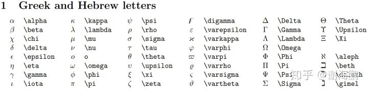
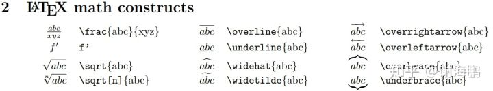
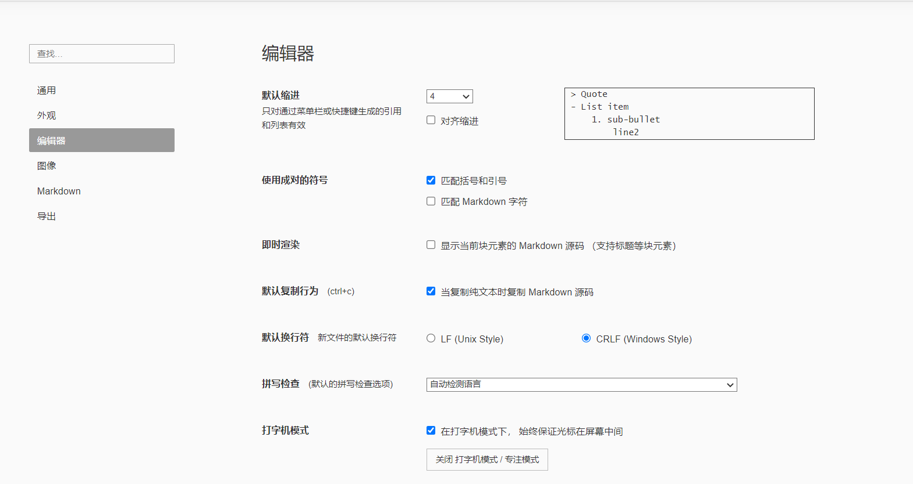
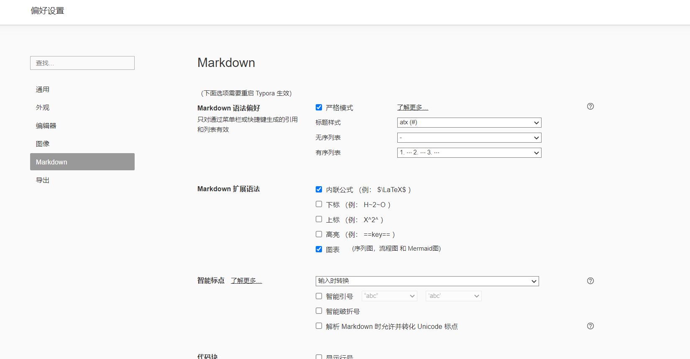

# markdown
> 参考资料：https://www.runoob.com/markdown.assets/md-tutorial.html

## 什么是MarkDown
- Markdown 是一种轻量级**标记**语言，用一些标记来设置文本显示的格式，它允许人们使用易读易写的纯文本格式编写文档。Markdown 编写的文档后缀为 .md, .markdown。
Markdown 能被使用来撰写电子书，如：Gitbook。  
- 当前许多网站都广泛使用 Markdown 来撰写帮助文档或是用于论坛上发表消息。例如：GitHub、简书、reddit、Diaspora、Stack Exchange、OpenStreetMap 、SourceForge等。
## MarkDown标记
- 转义符号: \\

    - 如果想显示本来作为标记的字符，那么在之前加上转义符号即可。

- 标题#
    - 记住有一个空格在#后
    - \# 一级标题  
    - \## 二级标题
    - \### 三级标题
    - …

- 正文
    - 什么标记都不加就是正文
    - 如果想要换行，直接回车是无效的，应该在后面输入两个空格后再回车，这样就换行了。
    - 想显示空格的话，使用html实体标记 `&nbsp;`

- 加粗，斜体,删除线
    - \*斜体*
    - `**加粗字体**`
    - `***加粗斜体***`
    - `~~删除线~~`

- 引用\>
    - \>引用
    - \>>引用中嵌套引用
    - \>>>
    - …

- 分割线
    - \---   三个或三个以上的-或*
    - \***
    - 演示效果
    ---

- 无序列表**- **  :
	- 无序列表
  - 多级列表：次级列表前空4个间隔。

- 有序列表 1. 
    1. 有序列表 注意有空格
    1. 第二行

- 图片
    - markdown不支持内嵌图片，只能引用连接。
    - ``
    - 图片alt就是显示在图片下面的文字，相当于对图片内容的解释。图片title是图片的标题，当鼠标移到图片上时显示的内容。title可加可不加。
    - 图片地址可以是网站url，也可也是相对路径，在本wiki下，尽量使用相对路径的方式。

- url超链接[]()
    - \[name](http://)
    - 演示:[baidu](http://www.baidu.com)

- 代码
    - \`单行代码`
    - \``` 
    多行代码  
    \```
    - 演示  
        ```python
        print("hello,world")
        ```

- 数学公式
    - 具体可以看[latex语法](https://uinika.gitee.io/Zen/LaTex/)
    - 行内：在`$ $`中间使用latex语法就可以插入公式了
    - 行间：`$ 回车 $`，在其中间使用latex语法就可以在行间插入公式了
    - 演示：$\frac{abc}{xyz}$
    - 输入希腊字母：\name，当name的第一个字母大写时，即该希腊字母大写  
         
    - 插入一些数学的结构:
        

- **当我们使用缩进代码块或者内容的时候，使用4个空格缩进。**

## typora
typora是一个所见即所得的markdown编辑器，能很大程度上简化写markdown文件的操作。

- 设置typora的换行为4空格

    

- 设置markdown语法为严格模式

    

## Mkdocs

> 参考资料 https://markdown-docs-zh.readthedocs.io/zh_CN/latest/  
https://squidfunk.github.io/mkdocs-material/setup/changing-the-colors/

- MkDocs能将markdown文件转换成静态网页，并可以以一种可观的界面来显示这些markdown文件。本项目由MkDocs构建。  
- **MkDocs构建的文档中最重要的是mkdocs.yml配置文件**，在里面可以配置网站显示哪些markdown文件，这些文件怎么排列。
-  安装Mkdocs：`pip install mkdocs`  使用python3环境
-  创建一个新的项目：`mkdocs new Security-Wiki`
    - 会在当前目录产生一个Security-Wiki文件夹
    - 有一个网站配置文件 mkdocs.yml, 和一个包含文档源码的 docs 文件夹. 在 docs 文件夹里包含了一个名为 index.md 的文档，我们的md文件会全部放在docs文件夹中，当然我们可以在里面新建子文件夹
- MkDocs 包含了一个内建的服务器以预览当前文档. 控制台切换当前目录到 mkdocs.yml 配置文件相同文件夹，也就是项目根目录, 输入 mkdocs serve 命令以启动内建服务器:  
    ```
    (base) PS D:\Security-Wiki> mkdocs serve
        INFO     -  Building documentation...
        INFO     -  Cleaning site directory
        INFO     -  Documentation built in 0.11 seconds
        INFO     -  [15:19:43] Serving on http://127.0.0.1:8000/
        INFO     -  [15:19:48] Browser connected: http://127.0.0.1:8000/
    ```
- 内建服务器支持在配置文件,文档目录或主题发生改变时自动载入并重新生成文档。也就是可以热启动。
- **mkdocs.yml:**  
  
    ```
    site_name: SecurityWiki 设置网站标题
    nav：                设置导航条
    - [index.md,Home]
    - [about.md,About]
    theme: material       配置主题
    ```
-  站点生成：
    - 我们现在已经可以发布我们的项目文档了。 通过mkdocs build命令生成文档，会生成html网页。
    - 该命令删除旧的site目录，创建了一个 site 新目录，里面将我们的文档转换成了html网页。
    - 如果你使用 git 等版本控制系统, 你可能不希望提交构建之后的文档到版本库. 在 .gitignore 中添加 site/ 即可忽略该目录.
        echo "site/" >> .gitignore
        
    - 一段时间后, 可能有文件被从源码中移除了, 但是相关的文档仍残留在 site 目录中. 在构建命令中添加 --clean 参数即可移除这些文档.mkdocs build --clean  
- **我们想要添加md文件到项目中，可以把md文件放到对应的目录下，然后在mkdocs.yml设置好网站的导航就可以了。**

## Markdown 编写规范

> 参考资料：[ctfWiki](https://github.com/ctf-wiki/ctf-wiki/wiki/Markdown-%E7%BC%96%E5%86%99%E8%A7%84%E8%8C%83)

为提高文档的阅读体验，充分参考 Google Markdown Style Guide 与 百度 FEX 前端团队 Markdown 编写规范，形成 Wiki 的 Markdown 编写规范。
### **文档格式**
- 使用 .md 后缀
- 文档编码使用 UTF-8
### **标题**
- 根据 MkDocs 的要求，文档中至多有一个一级标题 #，当没有一级标题时采用目录配置中的标题作为当前页面的一级标题

- 章节标题从 ## 开始

- 章节标题在 ## 后添加空格，且之后没有 ##
    ```
    // bad
    ##章节1
    
    // bad
    ## 章节1 ##
    
    // good
    ## 章节1
    ```
- **章节标题前后有且仅有一个空行**，这个typora自动会添加。
### 段落
- 使用空行换行，尽量不适用两空格换行  
  部分 IDE 会在提交时自动清理行末的空格。在嵌套列表中的换行还是用两空格换行。这个typora会自动处理。
- 需要强调的内容酌情使用 Admonition 插件，有 note、abstract、info、tip、success、question、warning、failure、danger、bug、example、quote 多种样式

### 列表

有序列表无需编码，直接1就行。

```java
1.  Foo.
1.  Bar.
    1.  Foofoo.
    1.  Barbar.
1.  Baz.
```

### 嵌套列表

**在有序和无需嵌套列表时使用 4 空格缩进。**

```
1.  2 spaces after a numbered list.
    4 space indent for wrapped text.
2.  2 spaces again.

*   3 spaces after a bullet.
    4 space indent for wrapped text.
    1.  2 spaces after a numbered list.
        8 space indent for the wrapped text of a nested list.
    2.  Looks nice, don't it?
*   3 spaces after a bullet.
```

**当没有嵌套时，也尽量使用 4 空格缩进。**

```
*   Foo,
    wrapped.

1.  2 spaces
    and 4 space indenting.
2.  2 spaces again.
```

当列表结构很简单时，可以在标识符后使用 1 个空格作为标记。

```
* Foo
* Bar
* Baz.

1. Foo.
2. Bar.
```

### 代码

- 代码块

    - 代码块使用 Fenced Block

        ````
        ```js
        console.log("");
        ```
        ````

    - 代码块注明语言，以便代码高亮，参见 Pygments 文档

- 行内代码

    - 行内代码使用反引号，且当引用文件时使用行内代码

        ```
        Be sure to update your `README.md`!
        ```

- **在多级列表中嵌套代码时候，不要加列表标记`-`一起用，而是使用4空格。**因为mkdocs模块的支持不是很完善。

    ```
    - good
    	'''python
    	print("hello")
    	'''
    - bad
    	- '''
    	  print("hello")
    	  '''
    ```
    

### 表格

以 [GitHub Flavored Markdown](https://help.github.com/articles/organizing-information-with-tables/) 格式为准。

```
| First Header  | Second Header |
| ------------- | ------------- |
| Content Cell  | Content Cell  |
| Content Cell  | Content Cell  |

| Left-aligned | Center-aligned | Right-aligned |
| :---         |     :---:      |          ---: |
| git status   | git status     | git status    |
| git diff     | git diff       | git diff      |

```

### 公式

合理使用行内公式和行间公式，前后无文字的尽量使用行间公式，可以居中显示，提升阅读体验。

```
行内公式 $ a + b = c $

行间公式
$$
a + b = c
$$

```


