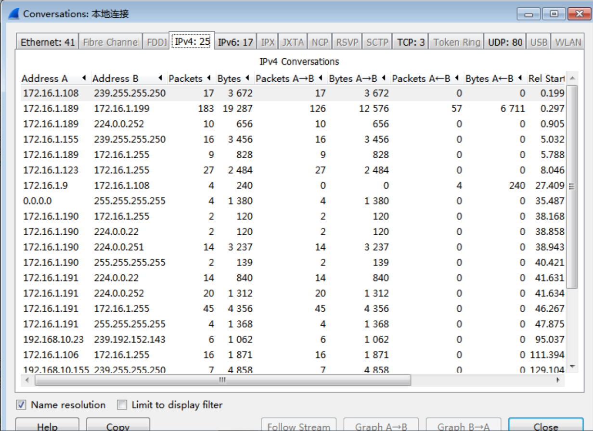
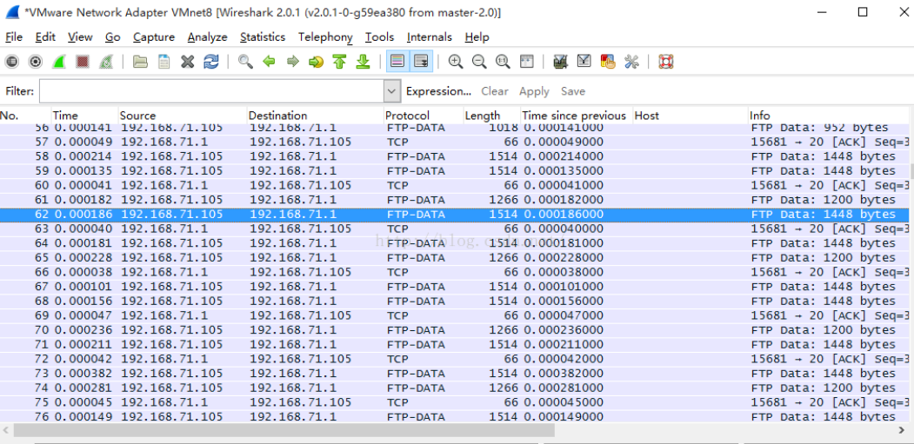
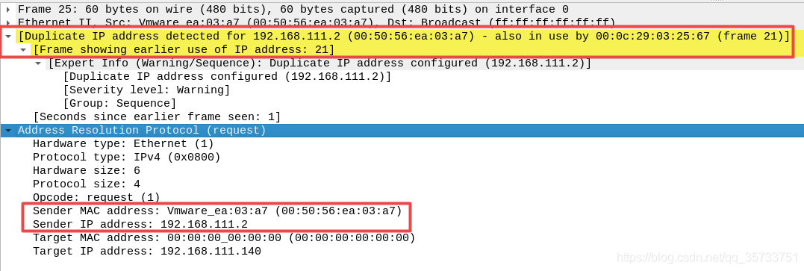

# Wireshark

> 待修改

## 一、 有关Wireshark基础知识的介绍

Wireshark（前称Ethereal）是一个网络数据包分析软件。网络数据包分析软件的功能是截取网络数据包，并尽可能显示出最为详细的网络数据包数据。Wireshark使用WinPCAP作为接口，直接与网卡进行数据报文交换。

##  1、wireshark开始界面

或者会出现这样的开始界面

wireshark是捕获机器上的某一块网卡的网络包，当你的机器上有多块网卡的时候，你需要选择一个网卡。

点击Caputre-\>Interfaces.. 出现下面对话框，选择正确的网卡。然后点击"Start"按钮,
开始抓包

##  2、Wireshark 窗口介绍

**WireShark 主要分为这几个界面**

1\. Display Filter(显示过滤器)，用于过滤

2\. Packet List
Pane(封包列表)，显示捕获到的封包，有源地址和目标地址以及端口号。其中颜色不同，代表

3\. Packet Details Pane(封包详细信息), 显示封包中的字段

4\. Dissector Pane(16进制数据)

5\. Miscellanous(地址栏，杂项)

##  3、wireshark作用

使用Wireshark可以完成以下任务。

### 3.1 一般分析任务

-   找出在一个网络内的发送数据包最多的主机。

-   查看网络通信。

-   查看某个主机使用了哪些程序。

-   了解基本正常的网络通信

-   验证特有的网络操作。

-   了解尝试连接无线网络的用户。

-   同时捕获多个网络的数据。

-   实施无人值守数据捕获。

-   捕获并分析到/来自一个特定主机或子网的数据。

-   通过FTP或HTTP查看和重新配置文件传输。

-   从其它捕获工具导入跟踪文件。

-   使用最少的资源捕获数据。

### **3.2 故障任务**

-   为故障创建一个自定义的分析环境。

-   确定路径、客户端和服务延迟。

-   确定TCP问题。

-   检查HTTP代理问题。

-   检查应用程序错误响应。

-   通过查看图形显示的结果，找出相关的网络问题。

-   确定重载的缓冲区。

-   比较缓慢的通信到正常通信的一个基准。

-   找出重复的IP地址。

-   确定DHCP服务或网络代理问题。

-   确定WLAN信号强度问题。

-   检测WLAN连接的次数。

-   检查各种网络配置错误。

-   确定应用程序正在加载一个网络片段。

### **3.3 安全分析（网络取证）任务**

-   为网络取证创建一个自定义分析环境。

-   检查使用非标准端口的应用程序。

-   确定到/来自可疑主机的数据。

-   查看哪台主机正在尝试获取一个IP地址。

-   确定“phone home”数据。

-   确定网络侦查过程。

-   全球定位和映射远程目标地址。

-   检查可疑数据重定向。

-   检查单个TCP或UDP客户端和服务器之间的会话。

-   检查到恶意畸形的帧。

-   在网络数据中找出攻击签名的关键因素。

### **3.4 应用程序分析任务**

-   了解应用程序和协议如何工作。

-   图形应用程序的带宽使用情况。

-   确定是否将支持应用程序的链接。

-   更新/升级后检查应用程序性能。

-   从一个新安装的应用程序中检查错误响应。

-   确定哪个用户正在运行一个特定的应用程序。

-   检查应用程序如何使用传输协议，如TCP或UDP。

## 4、Wireshark的应用

理解了Wireshark的作用后，就会根据Wireshark的不同作用进行运用。

下面介绍它的应用

1.  网络管理员可以使用Wireshark来检测网络问题。

2.  网络安全工程师可以使用Wireshark来检查安全隐患的相关问题。

3.  开发者可以使用Wireshark来测试协议的执行情况。

4.  普通使用者可以使用Wireshark来学习网络协定的相关知识。

5.  图表分析

## 5、图表分析

### 5.1 IO Graph

Graph对网络中的吞吐量进行实时图形显示。在wireshark抓包过程中打开statistic–\>IO
Graph

1.  IO图表展示了吞吐量过程，X轴表示时间流，y轴表示数据包，图表默认情况下统计网卡的吞吐量

1.  Craphs默认允许展示五条报表，例如在filter
    过滤器中输入http查看http在网络中占用的吞吐量，点击Graph2，显示出一条红色的波线就是http图表的吞吐量。管理员可以根据网络环境，在filter过滤器中添加更多的过滤条件

### **5.2 Flow Gragh**

1.  Flow Gragh 数据流图，将会话通信过程图形可视化出来。打开statistics–\>flow
    graph

1.  选择all对所有的包进行图表分析，displayed packets对过滤出来的包进行图表分析

3、图表分析界面，扫描时间点，源IP，目的IP，具体包内容都以图形化的方式显示出来

## **二、有关Wireshark过滤功能的介绍**

使用过滤是非常重要的，初学者使用wireshark时，将会得到大量的冗余信息，在几千甚至几万条记录中，以至于很难找到自己需要的部分。搞得晕头转向。过滤器会帮助我们在大量的数据中迅速找到我们需要的信息。

## **1、过滤功能**

过滤器有两种：

一种是显示过滤器，就是主界面上那个，用来在捕获的记录中找到所需要的记录。

一种是捕获过滤器，用来过滤捕获的封包，以免捕获太多的记录。

### 1.1  捕获过滤器

捕捉前依据协议的相关信息进行过滤设置

****

**字段详解：**

Protocol（协议）:

可能值: ether, fddi, ip, arp, rarp, decnet, lat, sca, moprc, mopdl, tcp and udp.

如果没指明协议类型，则默认为捕捉所有支持的协议。

注：在wireshark的HELP-Manual Pages-Wireshark Filter中查到其支持的协议。

Direction（方向）:

可能值: src, dst, src and dst, src or dst

如果没指明方向，则默认使用 “src or dst” 作为关键字。

”host 10.2.2.2″与”src or dst host 10.2.2.2″等价。

Host(s):

可能值： net, port, host, portrange.

默认使用”host”关键字，”src 10.1.1.1″与”src host 10.1.1.1″等价。

Logical Operations（逻辑运算）:

可能值：not, and, or.

其中：否(“not”)具有最高的优先级。或(“or”)和与(“and”)具有相同的优先级，运算时从左至右进行。

“not tcp port 3128 and tcp port 23″与”(not tcp port 3128) and tcp port 23″等价。

“not tcp port 3128 and tcp port 23″与”not (tcp port 3128 and tcp port
23)”不等价。

例如：捕获主机为10.88.6.225

![]C2NV6EO8C076\~K2[T5I6}M](wireshark.assets/eae557a2983be16a54a092c87b30fdbe.png)

###  1.2 显示过滤器

string1和string2是可选的。

依据协议过滤时，可直接通过协议来进行过滤，也能依据协议的属性值进行过滤。

按协议进行过滤：

snmp \|\| dns \|\| icmp 显示SNMP或DNS或ICMP封包。

按协议的属性值进行过滤：

ip.addr == 10.1.1.1

ip.src != 10.1.2.3 or ip.dst != 10.4.5.6

ip.src == 10.230.0.0/16 显示来自10.230网段的封包。

tcp.port == 25 显示来源或目的TCP端口号为25的封包。

tcp.dstport == 25 显示目的TCP端口号为25的封包。

http.request.method== "POST" 显示post请求方式的http封包。

http.host == "tracker.1ting.com" 显示请求的域名为tracker.1ting.com的http封包。

tcp.flags.syn == 0×02 显示包含TCP SYN标志的封包。

表示只显示Source为10.88.6.225的为：

Ip.src==10.88.6.225

###  1.3 内容过滤语法

深度字符串匹配

contains ：Does the protocol, field or slice contain a value

示例

tcp contains "http" 显示payload中包含"http"字符串的tcp封包。

http.request.uri contains "online" 显示请求的uri包含"online"的http封包。

特定偏移处值的过滤

tcp[20:3] == 47:45:54 /\*
16进制形式，tcp头部一般是20字节，所以这个是对payload的前三个字节进行过滤 \*/

http.host[0:4] == "trac"

过滤中函数的使用（upper、lower）

upper(string-field) - converts a string field to uppercase

lower(string-field) - converts a string field to lowercase

示例

upper(http.request.uri) contains "ONLINE"

wireshark过滤支持比较运算符、逻辑运算符，内容过滤时还能使用位运算。

如果过滤器的语法是正确的，表达式的背景呈绿色。如果呈红色，说明表达式有误。

### **1.4 捕获结果**

双击每一行记录，可在弹出窗口中查看详细记录

## **2、表达式规则**

### **2.1 协议过滤**

比如TCP，只显示TCP协议。

### **2.2 IP 过滤**

比如 ip.src ==10.88.6.225 显示源地址为10.88.6.225，

ip.dst==10.88.6.225, 目标地址为10.88.6.225

（Ps:需要注意的点）

一些过滤器字段与多个协议字段匹配。例如，“ip.addr”
匹配IP报头中的IP源地址和目标地址。还有 “tcp.port”, “udp.port”, “eth.addr”
等也是如此。

还要注意：ip.addr == 10.88.6.225

等效于ip.src == 10.88.6.225 or ip.dst == 10.88.6.225

### **2.3 端口过滤**

tcp.port ==80,端口为80的

tcp.srcport == 80,只显示TCP协议的愿端口为80的。

### **2.4 Http模式过滤**

http.request.method=="GET", 只显示HTTP GET方法的。

## 3、着色规则

在菜单“视图-着色规则”下查看

数据包的大致结构

第一行：数据包整体概述，

第二行：链路层详细信息，主要的是双方的mac地址

第三行：网络层详细信息，主要的是双方的IP地址

第四行：传输层的详细信息，主要的是双方的端口号。

## 三、有关Wireshark统计功能的介绍

Wireshark的一个强大的功能在于他的统计工具，使用Wireshark的时候我们有各种类型的工具可供选择，首先介绍基本网络统计工具。包括：捕捉文件摘要（Summary）、捕捉包层次结构（Protocol
Hirarchy）、会话（Conversations）、网络节点（Endpoints）、HTTP

捕捉文件摘要

## 1、捕捉文件概要

**操作步骤如下：**

1、捕捉文件摘要对抓取的数据包进行全局统计，Staristics–\>Summary

2、这一菜单简单收集所有抓包数据，在定义了过滤条件的时候，将呈现过滤后的数据，当想要知道每秒的平均报文数或字节数时，使用此工具

File：捕捉文件的一般信息，如文件名和路径，长度，等等。

Tme：第一个包和最后一个包的时间戳，以及抓包过程持续时间。

Capure：显示文件捕捉于哪一个接口，以及评论窗口。

Display窗口，展示抓包文件统计信息的摘要，包括：捕捉报文总数与百分比，显示报文数量（加上过滤条件之后），标记报文数量

## 2、捕捉包层次结构

1、捕捉包层次结构统计了通信流量中不同协议占用额百分比，通过这个工具可以对全网流量有直观的了解，到底整个网络那些流量占用最多，那些占用最少等等。打开statistics–\>protocol
hierarchy

图中我们可以看出，Ethernet的流量包括IPv4和IPv6，IPv4包括UDP和TCP，这几个分项的和就是以太网百分百的流量

Protocol：协议名称

％ Packets：含有该协议的包数目在捕捉文件所有包所占的比例

Packets：含有该协议的包的数目、Bytes含有该协议的字节数

Mbit/s：抓包时间内的协议带宽、End Packets
该协议中的包的数目（作为文件中的最高协议层）

End Bytes：该协议中的字节数（作为文件中的最高协议层）

End Mbit/s ：抓包时间内的协议带宽（作为文件中的最高协议层）

2、在网络异常的时候，通过分析这些数据包占用的流量我们可以判断网络问题，如图这是一个正常的网络占用百分比，例如网络发生了ARP攻击，那么ARP在这里的占用也许会显示20％或者30％

## 3、会话统计功能

**步骤如下：**

1、会话统计功能，统计通信会话之间接收和发送的数据包和字节数，通过这个工具可以找出网络中哪个会话（IP地址或端口号）最占用带宽，进一步作出网络策略。打开Statistics–\>Conversations

2、进入界面可以选择2层以太网统计数据，第3层IP统计数据，或4层tcp或udp统计数据。

3、在以太网回话统计中可以查找以下问题：（1）
可以看见较轻微的广播风暴；而对于每秒数千甚至数万个报文的严重广播风暴，Wireshark会停止显示数据并且屏幕冻结。只有断开Wireshark连接时才能看见。
（2）如果你看到来自某一MAC地址的大量数据，查看会话第一部分的vendor
ID，会给你一些导致问题的线索。即使MAC地址的第一部分标识了vendor，但它并不一定就标识了PC本身。这是由于MAC地址属于PC上安装的以太网芯片厂商，而并不一定属于PC制造商。如果无法识别数据流来源地址，可以ping嫌疑地址并通过ARP获取它的MAC地址，在交换机中查找该地址，如果有操作系统的话直接用find命令来定位。

在IP会话统计中可以查找一下问题：（1）查看收发大量数据流的IP地址。如果是你知道的服务器（你记得服务器的地址或地址范围），那问题就解决了；但也有可能只是某台设备正在扫描网络，或仅是一台产生过多数据的PC。（2）
查看扫描模式（scan
pattern）。这可能是一次正常的扫描，如SNMP软件发送ping报文以查找网络，但通常扫描都不是好事情。

在tcp/udp会话统计中可以查看以下问题（1）
查看带有太多TCP连接的设备。每一个PC合理的连接数是10到20个，上百个则是不正常的（2）尝试查找无法辨识的端口号。它可能是正常的，但也可能是有问题的。

## 4、网络节点统计

**步骤如下：**

1、网络节点功能，统计通信会话中每个节点接收和发送的数据包和字节数，通过这个工具可以找出网络中哪个节点（IP地址或端口号）最占用带宽。打开statistics–\>Endpoints

2、如下图所示，在此窗口中能够看到2,3,4层的endpoints，也就是以太网。IP，tcp或udp，终端节点统计是面向IP的，可以查看具体某一个IP发送的流量以及占用带宽

3、这一工具列出了Wireshark发现的所有endpoints上的统计信息，可以是一下任意一种情况：

少量以太网endpoints（MAC地址）与大量IP终端节点（IP地址）：可能的情况例如，一个路由器从很多远端设备收发报文，我们会看见路由器的MAC地址以及很多IP地址经由此处。

少量IP终端节点与大量tco终端节点：可能的情况是每一台主机有很多个tcp连接。可能是有很多连接到额服务器的一个正常操作，也可能是一种网络攻击（如SYN攻击）

## 5、HTTP

1、从statistic菜单，选择HTTP，将会出现以下窗口

2、在http子菜单中，可以看到以下信息

Packet Counter：每一个网站的报文数量。帮助识别有多少响应和请求。

Requests：各网站的请求分布

Load Distribution：各网站的负载分布

查看Packet
Couter统计信息，显示以下过滤窗口，在此窗口中，可设置过滤条件以查看符合条件的统计信息。信息想要查看整个抓包文件的统计信息，不添加信息就会显示IP层之上的统计信息，也就是所有http报文，点击Create
Stat。

3、如下图所示，显示了Http Requests，Http Responses信息

4、查看Requests信息，选择所需过滤条件，不输入过滤条件则对于所有数据

5、点击Create Stat按钮，会出现以下窗口

6、查看Load
Distribution统计信息，出现以下窗口。暂时不输入任何过滤条件，点击Create Stat按钮

7、当我们打开一个网页，通常会向若干个URL发出请求，这里记录了我们发送的若干个请求，到root
URL，到breaking_news URL，以及主页上的其他位置。

## 四、有关Wireshark重组数据功能的介绍

网络协议通常需要传输自身完整的大块数据，比如在传输文件时。底层协议可能无法处理数据块大小(例如网络数据包大小的限制)，或者是基于流的协议，比如TCP，它根本不知道数据块。在这种情况下，网络协议必须自己处理块边界，并且将数据分散到多个数据包上。显然，它还需要一种机制来确定接收端的边界。

所以，wireshark将这种机制叫做数据报重组，Wireshark的重组功能也是一个很核心的功能，它可以重组一个会话中不同数据包的信息，或者是一个重组一个完整的图片或文件。由于传输的文件往往较大，所以信息分布在多个数据包中。为了能够查看到整个图片或文件，这时候就需要使用重组数据的方法来实现。

## 1、重组功能的前提

在使用重组功能前，一定要确保 Allow subdissector to reassemble TCP streams
选项已启用。如果没有启用，在Wireshark菜单栏中依次选择
Edit\|Preferences\|Protocols，然后将 Allow subdissector to reassemble TCP
streams 复选框勾。

FTP 通信使用命令和数据通道进行连接。数据通道仅由 TCP
握手连接数据包。在数据通道中使用重组功能，可以很容易地将传输的文件重新组成原始格式。

## 2、重组 FTP 数据功能

操作步骤如下：

1、启用 Wireshark 功能。

2、选择捕获接口及捕获文件的位置和文件名。

3、单击 Start 按钮开始捕获数据。

4、为了使 Wireshark 能捕获到 FTP 数据包，需要在一个客户端主机上操作一些 FTP
命令。

例如：

C:\\Users\\Administrator\>ftp 192.168.71.105

连接到 192.168.71.105。

220 (vsFTPd 3.0.2)

200 Always in UTF8 mode.

用户(192.168.71.105:(none)): uftp

331 Please specify the password.

密码:

230 Login successful.

ftp\> dir

200 PORT command successful. Consider using PASV.

150 Here comes the directory listing.

\-rwxr-xr-x 1 0 0 25 Mar 01 14:21 hello.txt

\-rwxr-xr-x 1 0 0 270621 Mar 01 14:21 kali linux.jpg

226 Directory send OK.

ftp: 收到 142 字节，用时 0.00秒 35.50千字节/秒。

ftp\> get "kali linux.jpg"

200 PORT command successful. Consider using PASV.

150 Opening BINARY mode data connection for kali linux.jpg (270621 bytes).

226 Transfer complete.

ftp: 收到 270621 字节，用时 0.01秒 24601.91千字节/秒。

ftp\> get hello.txt

200 PORT command successful. Consider using PASV.

150 Opening BINARY mode data connection for hello.txt (25 bytes).

226 Transfer complete.

ftp: 收到 25 字节，用时 0.00秒 25000.00千字节/秒。

ftp\> quit

221 Goodbye.

以上信息执行了登陆 FTP 服务器、下载文件及退出等命令。

1.  此时返回到 Wireshark 界面，停止捕获。捕获到了FTP 数据

6、在 FTP 数据通道上重组传输的文件。在该界面右键单击62帧，并选择 Follow TCP
Stream 命令。

7、该界面显示的数据，就是传输的原格式重组后的结果。如果要查看该文件，单击 Save
As 按钮将该会话保存为一个新的文件。保存的文件名格式，必须要与在 RETR 或 STOR
命令中看到的格式相同。

## 3、提取 FTP 传输的文件

1、继续上面的捕获文件

2、显示过滤 FTP 数据包，利用 ftp matches "(?i)user" 过滤规则

1.  从该界面可以看到一个 USER ftp 命令包，右键单击，并选择 Follow TCP Stream。

4、从该界面可以清楚地看到，客户端和服务器之间互相发送的数据。如客户端登录服务器命令
USER 和 PASS、定义的端口命令 PORT、监听目录命令 LIST、请求文件命令 RETR
及断开服务器的连接命令 QUIT。

5、此时我们屏蔽掉 FTP 命令包，在上图中单击 Filter Out This Stream，得到过滤规则

6、此时，该捕获文件将不会出现有 FTP
命令的数据包。此时右键单击任何数据帧，并选择 Follow TCP Stream
命令，将显示如下图所示的界面。

7、该界面显示了在 FTP
中传输的一个文件，并且该文件是一个图片（png）。为了重组该图片，单击 Save
As按钮保存该文件。这样就成功了！

五、Wireshark之GeoIP显示IP地理位置及经纬度信息

## **1、操作说明**

Wireshark软件通过安装第三方数据库是可以显示IP地址位置的。

所谓GeoIP，Geolocation
IP，就是通过来访者的IP，定位他的经纬度，国家/地区，省市，甚至街道等位置信息。

安装的时候需要注意使用Wireshark的版本，新老版本的Wireshark在对第三方库的稍微有一点不一样，这里主要说明Wireshark3.0+的版本的安装方法。

## **2、准备工作**

下载第三方库官方地址：

<https://dev.maxmind.com/geoip/geoip2/geolite2/>

下载第三方库云盘地址：

<https://pan.baidu.com/s/1UV_G-47gv1B7yhSXuM5Bbw> 提取码：lxu8

下载wireshark云盘地址：<https://pan.baidu.com/s/1BldA7cN5Vy8PH8j8MqLrrw>
提取码：9iav

1.打开下载好的安装包，点击下载Wireshark-win64-3.0.0，下载完成

2.安装wireshark3.0后,打开wireshark界面,点击Edit(编辑)\>Prefencens(首选项)

3\. 点击Name Resolution-\>MaxMind database directories-\>Edit

4\. 添加第三方数据库的目录即可。这里稍微解释下，MaxMind DB
文件格式是使用高效的二进制搜索树将IPv4和IPv6地址映射到数据记录的数据库格式。

5\. 重启wireshark后开启抓包，点击标签页中的Statistics-\>Endpoints

6\. 点击IPv4标签页，即可看到Country,City,ASN,ASO等内容。

7.
设置就是这么简单，但是这里没有看到很多人想要的经纬度信息，这是因为在wireshark更新后，它支持的第三方库文件的后缀就变成了.mmdb格式，这种格式GeoIP并没有放出有经纬度信息的，记得好像是因为License的问题。当然如果有需要使用经纬度信息，那么就去安装wireshark3.0以下的版本吧。

## 3、WireShark3-使用GeoIP

1.设置方法基本一致，这里就不多说了，区别在于，Wireshark3以下用的第三方数据库文件的格式是.dat的，这里直接看效果就可以了。

2.可以看到低版本中没有AS相关的信息，增加了经纬度的信息。一定要注意，longitude代表经度，也就是经度写在了后面，Latitude才是代表纬度，写在了前面。

## 六、Wireshark网络安全分析——ARP欺骗攻击

## 1\. 中间人攻击

中间人攻击（Man-in-the-MiddleAttack）简称为MITM攻击，是一种比较常见的网络攻击方式，想要实施中间人攻击至少需要三个角色，其过程如下图所示：

所谓中间人攻击就是Client1和Client2在进行正常的网络通信时，Hacker实施中间人攻击监听Client1和Client2的通信，在这个过程中Hacker作为中间人会处理转发它们的数据信息，也就是说Client1和Client2之间依然可以正常通信，并且它们也不会发现通信过程中多了一个人。Client1以为自己是和Client2之间通信，然而实际上多了一个Hacker正在默默的监听Client1和Client2之间通信。

## 2\. ARP欺骗

ARP欺骗就是一种典型的中间人攻击方式
，它利用了ARP协议的缺点：没有任何认证机制。当一台主机收到一个发送方ip地址为192.168.111.139的ARP请求包时，该主机并不会对这个数据包做任何判断真伪校验，无论这个数据包是否真的来自192.168.111.139，它都会将其添加到ARP缓存表中，Hacker正是利用了这一点来冒充网关等主机。

以ping命令为例，139和140两台主机进行通信时：

139和140进行通信时会先在ARP缓存表查找140对应的ARP表项（即192.168.111.140对应的mac地址），如果没有找到则会发送ARP请求。
ip为192.168.111.139的主机首先会以广播方式发送一个ARP请求包获取192.168.111.140主机的mac地址，其内容为who
has 192.168.111.140? Tell 192.168.111.139。

当ip为192.168.111.140的主机收到这个ARP请求包并不会做任何的真伪校验，而是直接回复一个ARP响应包把自己的mac地址告诉对方。

无论这个ARP请求包是否真的来自ip为192.168.111.139的主机，140都会把192.168.111.139对应的mac地址表项添加到自己的ARP缓存表中（ARP欺骗正是利用了这一缺点进行的网络攻击）：

ARP缓存表中192.168.111.2是网关的ip地址，00-50-56-ea-03-a7是网关的mac地址。

## 3\. ARP欺骗过程分析

在VMware中分别创建两台主机，实验环境：

1\. Kali linux主机充当hacker进行安全测试，ip地址为192.168.111.139

2\. Windows7是进行安全测试的目标主机，ip地址为192.168.111.140

搭建完环境后，在kali中进行安全测试并开启路由转发功能：

通过arpspoof工具进行ARP欺骗安全测试：

\-i选项用于指定网卡，-t选项用于指定欺骗的目标主机ip和网关ip，当执行以上命令后arpspoof工具就会不断地发送伪造的ARP包对目标主机进行ARP欺骗。

在Kali linux主机上进行wireshark抓包，分析ARP欺骗攻击的过程：

在wireshark抓包中，ARP响应包中Sender MAC
address字段里封装的MAC地址不是网关192.168.111.2的mac地址，而是kali
linux主机的MAC地址，也就是说这个ARP响应包实际上是伪造的。

再查看被攻击的目标主机ARP缓存表：

在前面的实验环境中我们知道192.168.111.2网关对应的mac地址是00-50-56-ea-03-a7，当kali
linux主机进行ARP欺骗后，ARP缓存表中网关对应的mac地址变成了00-0c-29-03-25-67，但这个mac地址实际上是kali
linux主机的mac地址，目标主机收到这个ARP响应包并没有做任何的判断，而是直接接收数据包，包括在wireshark抓包工具中也间接证明了ARP协议的一重大缺点：ARP协议缺少对数据包的判断校验安全机制，hacker也就可能利用这个漏洞来冒充网关。

## 4\. Wireshark专家系统分析

通常在一个网络中如果出现了大量的ARP数据包是不太正常的，可以通过wireshark抓包工具的专家系统功能分析当前网络的问题所在。

在wireshark抓包工具的菜单栏中选择：分析--\>专家信息，如下所示：

在专家信息功能中可以看到有一段警告级别为Warning级别的ARP数据包，wireshark给出的警告提示Duplicate
IP address
configure，说明检测到了重复的IP地址配置，我们重点关注25和26两个数据包。

以Frame 25数据包为例：

Wireshark检测到了ip地址192.168.111.2
有重复的配置，在这个数据包中192.168.111.2使用的mac地址是00-50-56-ea-03-a7，在之前192.168.111.2使用的mac地址是00-0c-29-03-25-67，在这两个mac地址其中有一个肯定是伪造的mac地址，一般来说如果有大量的ARP响应包出现同一个mac地址，那么这个mac地址极有可能是伪造的。

## 5\. 如何防御ARP欺骗

当一个网络中出现大量的ARP数据包会有以下几个原因：

当前网络存在ARP主机扫描

当前网络存在ARP病毒

当前网络存在ARP欺骗攻击

防御ARP欺骗的措施：

arp -s命令静态绑定ARP表，但不适用大型网络

使用交换机DHCP-Snooping技术或者端口安全技术

划分VLAN

## 七、使用wireshaerk分析并发现Ddos攻击

与那些复杂而精密的入侵行为和漏洞利用相比，大部分的DDoS攻击显得十分粗线条，属于黑客世界中的“暴力犯罪”。然而，随着网络规模的不断扩大，可利用的僵尸网络规模的和带宽不断增加。现今DDoS攻击者的发起变得相对容易，发动的攻击规模不断扩大，能够使用较低成本轻易的造成目标网络的瘫痪。成为互联网上最广泛和危害最大的安全威胁之一。

不幸的是，目前最有效的DDoS攻击检测防御都还依靠昂贵的专用硬件防御设备进行，对于业内广泛的中小企业和站长朋友来说显得难以负担。

本文中整理了一些典型的DDoS攻击数据包，通过wireshark进行简易的分析，能够对攻击数据包的构成和特征进行粗略分析。通过简单的分析抓包文件认定攻击的发生和确定简单而行之有效的防御措施，**适用于在没有专用设备的情况下最大程度和攻击者斗智斗勇**，减少攻击影响和降低损失。

## **1、SYN Flood**攻击

1、 使用wireshark 过滤器tcp.flags==0x02 过滤检查数据包分布情况。如图所示，SYN
Flood攻击发生时数据包分布发生明显改变，Syn包比例明显增加。

## 2、 使用wireshark

### 2.1 static-\>ipv4-\>endpoint分析数据包源地址分布

当使用伪造IP地址的DDoS攻击发生时，抓包文件中的数据包数目和源地址对应关系会发生明显变化。从图中实例可以发现，除了被攻击的目的IP意外，wireshark统计每个源地址对应的数据包数目较小，数据包大小字节数（Bytes）几乎一致。

### 2.2 TTL分析发现攻击者的蛛丝马迹

当使用随机源进行DDoS攻击时，虽然使用了伪造源地址进行攻击，但攻击者无法伪造攻击主机与目标主机之间的位置关系。有时候通过观察数据包的TTL值变化，也能够获得攻击者的蛛丝马迹，为攻击防御提供辅助支持。下图所示的这个攻击程序并没有修改攻击数据包的TTL值，所有的攻击数据包使用相同的TTL值。聪明的你可能已经发现了，没错，这个攻击数据包是由局域网内的一个windows计算机发出的。

## 3、UDP FLOOD攻击

UDP FLOOD攻击的主要目的是通过发送大量的UDP数据包来堵塞服务器的带宽。同时针对DNS
，语音和流媒体等互联网业务，也会有通过UDP承载的应用层攻击出现。图示是著名的蜗牛攻击器产生的攻击数据包，可以明显的看出，这种数据包的payload固定，使用UDP大包进行攻击，同时使用真实源地址进行攻击。

## 4、ICMP FLOOD攻击

与UDP FLOOD相同，ICMP FLOOD主要以阻塞服务器带宽为主。但与UDP
FLOOD不同的是，ICMP通常不会承载数据业务，比较容易通过交换机ACL或者服务器的iptables等进行防御。同时，攻击实施者为了更加有效的利用手上的僵尸主机，会使用包大小较大的数据包和IP层分片的数据包进行攻击，这种攻击会绕过没有设置IP层分配的ACL，也会加重服务器分配重组的负担。值得一提的是，window客户端发出的ping数据包有特定的格式和数据包大小，使用通用的做白逻辑进行防御在大多数情况下也是有效的。

上图中的数据包是一个典型的UDP
FLOOD攻击数据包，数据包大小为1514Byte，payload固定，同时使用了分片标志。

## 5、来自应用层的DDoS

除了传统的网络层攻击之外，一些针对特定应用系统比如apache的应用层攻击也能够取得很好的效果。例如CVE-2011-3192
Range header DoS vulnerability Apache
HTTPD，是典型的使用应用层漏洞进行DDoS攻击的攻击方法。在这种攻击中，攻击者刻意构造畸形的http头，其中包含了大量重复的range字段。Apach在处理这种http请求时，会不断的进行range重组，最终导致目标系统CPU繁忙而无法响应正常请求。

## 6、正常流量TTL分布性质

在讲synflood
的时候已经提到，可以通过分析数据包的TTL值分布情况对是否发生攻击进行简要判断。但是在实际操作时不容易找到现网中TTL值的分布规律，或者需要很长时间训练才能明确。通过对现网中流量进行测量分析，能够得出现网中正常流量TTL分布性质，本文作者对国内外现网测量实验结论进行了简要整理，整理出性质如下：

1、某一条链路上的入境数据包源IP地址数目在不同TTL值上的分布基本保持稳定，但对整个观测区间内入境数据包源IP地址总数的测量显示：在当前网络环境下，入境数据包IP地址数目不会在较短时间内增加到饱和趋势，而是在比较长时间内保持近似常数的增长速率。

从图中可以得出，该链路未发生攻击时基于最终TTL值的数据包分布呈双峰分布。大部分的入境数据包的最终TTL值集中在64和128的左侧，这是由于参与通信的大部分境外主机采用缺省初始TTL值64和128作为初始TTL值。同时，分布曲线的重合证明基于最终TTL
值的入境IP地址数目的分布在同一测量间隔内保持稳定，随测量时间变化较小。

## 7、小结：

在没有专用的防护设备的条件下，相对于攻击者而言，防御方在资源方面处于绝对的弱势。对攻击发生时的cap文件进行仔细的分析，找出攻击者忽略的地方，找出攻击数据包与正常业务流量中有区别的地方，有些时候能够起到四两拨千斤的作用。而攻击者需要不断的变换特征和构造复杂的攻击，也在一定程度上提升了攻击实施的成本，使得防御方更加有利，能够有效的控制攻击影响。

## 八、WireShark学习——使用WirkShark分析SYN-Flooding攻击

## 1、拒绝服务攻击的的相关理论

服务器所面临的最大威胁当数拒绝服务攻击,拒绝服务攻击其实是一类攻击的合称。所有这种类型的攻击的目的都是相同的,那就是要是使受攻击的服务器系统瘫痪或服务失效,从而使合法用户无法得到相应的资源。虽然服务器的功能多种多样,但是这些差异都是表现在应用层,无论它们使用的是什么应用程序,但是最终都会使用到传输层的协议。而传输层常用的协议只有TCP和UDP两种。因此攻击者只需要研究这两个协议的缺陷,就几乎可以实现对所有类型服务器的攻击。

目前已经出现了很多种类型的拒绝服务攻击方式,我们只挑选其中最为典型的两种SYN
flooding攻击和UDP flooding攻击进行讲解。其中SYN
flooding攻击是针对TCP协议的,它的主要目的是占用目标上所有可用的连接请求。而UDP
flooding攻击则是针对UDP协议的,主要目的是耗尽目标所在网络的带宽。

## 2、使用Hping发起SYN Flooding攻击

我们先来一次简单的SYN FLOOD攻击：

(1)查看被攻击主机的IP和端口信息:ifconfig/all 获取IP

(2)netstat -ano 获取开放端口,最好找那些处于listenning的端口

(3)然后kali上输入:hping3 -S -p 135 --flood -V --rand-source 192.168.1.2

\-S表示采用SYN半连接方法

\--flood 尽可能快的发送数据包

\--rand-source 表示伪造IP地址

\-V 启用详细输出

(4)执行上述命令后在目标机上打开任务管理器

(5)查看CPU的利用率，你会发现明显提高了

1.我们采用Kali Linux
2中自带的hping3来进行一次拒绝服务攻击。这是一款用于生成和解析TCP/IP协议数据包的开源工具,之前推出过hping和hping2两个版本,目前最新的版本是hping3,利用这款工具我们可以快速定制数据包的各个部分,
hping3也是一个命令式的工具,其中的各种功能要依靠设置参数来实现。启动hping3的方式就是在Kali
Linux2中启动一个终端,然后输入"hping3 "即可.

root@kali:-\# hping3

hping3\>

2.现在我们就利用刚刚介绍过的hping3参数来构造一次基于TCP协议的拒绝服务攻击。在Kali
Linux 2中打开一个终端,然后在终端中输入:

hping3 -q -n --rand-source -S -p 80 --flood 目标IP

3\. 这时攻击就开始了,在这个过程中可以随时使用Ctrl+C组合键来结束这次攻击

1.  WireShark的流量图功能

2.  查看流量图

1.  左下角，的限制显示过滤器，勾上后会显示使用显示过滤器过滤后的包

1.  以下为正常的tcp流

1.  syn泛洪攻击的流，可以看到没有应答的包

## 3、SYN Flooding攻击解决方案

### 3.1 丢弃第一个SYN数据包

### 3.2 反向探测

### 3.3 代理模式

## 实用操作

- 在分组过滤窗口输入小写的协议名字，就能过滤出只包含该协议的分组，例如http，tcp
- and 组合过滤条件。or 
- 当您选择该HTTP     GET消息，那么它的以太网帧，IP数据报，TCP段和HTTP消息首部将显示在分组首部窗口中，可以点击显示详情或者缩略
- 

- 可以打印（“文件”菜单中选择“打印”）选中分组数据，按照我们在分组首部窗口的显示打印，或者全打印。
