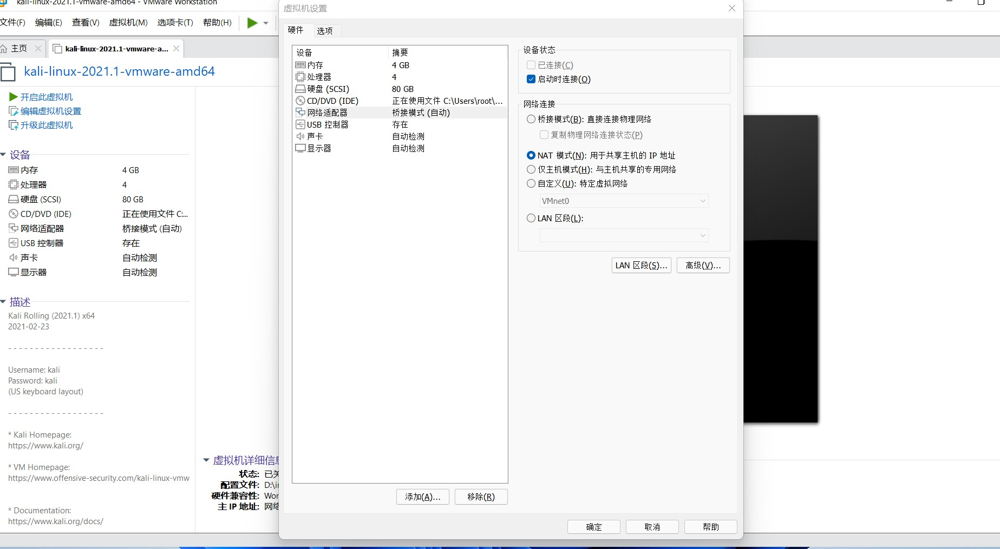
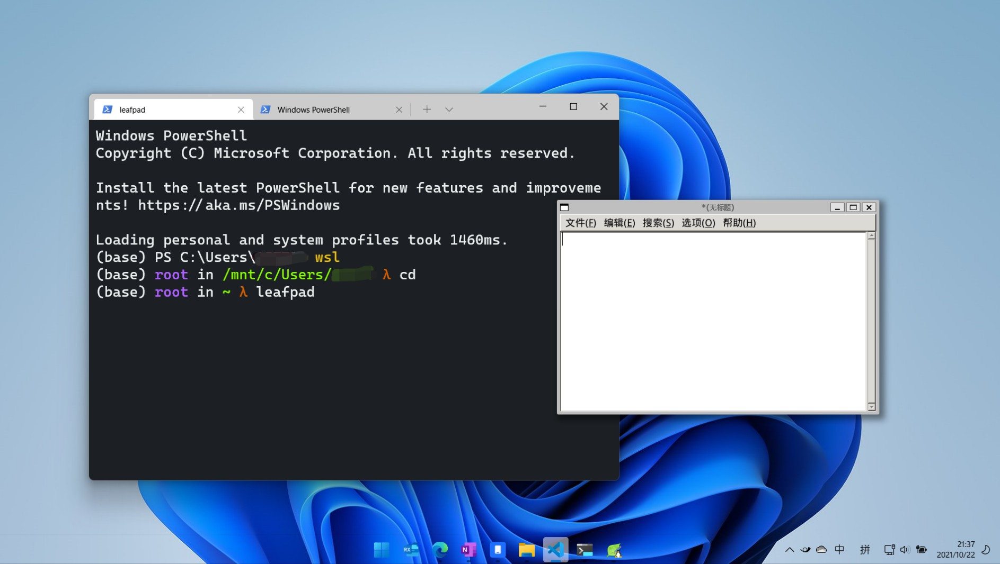

# 虚拟机
### 0x01 什么是虚拟机软件？
1. 我们学过汇编语言，汇编语言可以看作是可读的机器指令，通过硬件来执行这些机器指令。我们所有的程序最终都会变成一条一条的机器指令然后硬件执行。
2. 操作系统也是一个软件，和我们平时写的c语言程序没什么区别，它最后也是变成机器指令一条一条执行。
3. 虚拟机软件通过宿主电脑的操作系统提供的api（应用程序接口）来模拟硬件环境（模拟出来cpu，内存，硬盘，汇编语言这些），内存和硬盘可以用一个c结构体来模拟，汇编指令也可以编写对应的c语言语句就行。可以根据硬件的cpu处理数据代码的逻辑，模拟出一个cpu。
4. 除了模拟硬件环境，还会模拟一个BIOS（Basic Input Output System）。像正常我们在主机上装系统时，是由BIOS读入操作系统，然后将cpu的执行转向操作系统。BIOS是电脑主板自带的。
5. **由虚拟机软件提供了虚拟硬件环境并安装了操作系统的环境叫做虚拟机。**
### 0x02 有哪些流行的虚拟机软件 
1. VMware Workstation（最好用的，收费），Virtual Box（开源），hyper（微软出品），wsl2(Windows Subsystem for Linux 微软出品)。
### 0x03 Vmware使用教程
1. 安装kali系统
    - 有两种办法
    - 下载iso镜像，然后自己用vmware安装操作系统。这样会生成虚拟机文件，用vmware打开就行。
    - 同理我们也可以直接下载由kali官方提供的已经安装完操作系统的文件。进入网址<https://www.kali.org/get-kali/#kali-virtual-machines>，直接下载配置好的镜像。下载好压缩包之后直接解压，打开镜像文件，用户名和密码都是**kali**。这种就不需要自己安装操作系统了。
2. 虚拟机硬件参数配置
    - 
    - 配置好内存，cpu，网络适配器选项。
    - 仅主机模式，nat，桥接的区别？  
        1. nat：这时候windows就相当于变成了一个路由器，虚拟机和windows复用windows的外网。（默认用这个，这样虚拟机可以连外网）  
        2. 桥接：就相当于多了一个网卡给虚拟机用，而且虚拟机和windows网卡是同级别的，他们会由外部的路由器分配到同一个网段，如果是连wifi，虚拟机和window时一样操作，打开wifi输入密码连接。  
        3. 仅主机模式：虚拟机无法通外网，虚拟机和windows构建了一个子网，只能虚拟机和windows之间访问。
3. kali更换下载源  
    * 官方下载源在下载软件时比较慢，因此需要更换成国内源（阿里云、华为等）
    * 使用root，进入/etc/apt文件夹下
    * 通过ls命令可以看到sources.list文件，使用vim打开，注释官方源（在改行最前面添加#即可），添加如下代码
         ```
         #阿里云
         deb http://mirrors.aliyun.com/kali kali-rolling main non-free contrib
         deb-src http://mirrors.aliyun.com/kali kali-rolling main non-free contrib
         #中科大
         deb http://mirrors.ustc.edu.cn/kali kali-rolling main non-free contrib
         deb-src http://mirrors.ustc.edu.cn/kali kali-rolling main non-free contrib
         ```
    * 更新系统，执行以下命令
         ```
         apt-get update
         apt-get upgrade
         apt-get dist-upgrade
         ```

    * 重启系统（`reboot`）
    
### 0x04 wsl2使用教程
1. wsl2相较于VMware有什么优缺点？  
wsl2是一个轻量级的虚拟机，wsl2像是和windows融为一体了。我们可以打开一个linux软件像打开一个window程序一样呈现在windows下。
2. 如下图，我在windows中调用了kali的leafpad软件，直接显示在windows上了。

3. wsl1和wsl2的区别？  
wsl2是由hyper虚拟机软件提供服务的，然后做了一些定制化，本身是虚拟机软件。而wsl1是做指令翻译，将linux可执行文件翻译成windows可执行文件，并没有做虚拟化内存，硬盘之类的。
4. 安装wsl2
    https://blog.csdn.net/weixin_39902608/article/details/111229132
### 0x05 docker的使用
> docker并不是一个虚拟机软件，他只是一个容器，而且只能在linux下运行。在一个linux操作系统中，我们可以利用docker来生成多个隔离的linux环境。

- docker上有很多配置好的靶机环境，我们可以使用别人的环境来进行测试，这样就不用自己搭建环境了。

- linux安装docker：

    - 登录系统，切换到root权限，安装docker（`apt-get install docker.io`）
    - 通过执行docker命令，观察是否安装成功。若安装成功，会提示若干docker命令

- windows安装docker：

- 换源：在配置文件中"registry-mirrors"的值添加国内源就行
    - 在windows下，docker使用的是wsl2或者hyper的linux环境，有图形化界面。
        - 

    - linux需要自己配置

- 找寻并下载靶机images：

  - 在库中搜索镜像： `docker search  imagename`

      - 比如搜索sqli-labs这个靶机。`docker search sqli-labs`

      - 然后会出现多个用户上传的靶机。选择一个STARTS高的就行。

          ```shell
          C:\Users\15775>docker search sqli-labs
          NAME                   DESCRIPTION                      				STARS  
          
          acgpiano/sqli-labs     sql injection labs                              	  28
          
          c0ny1/sqli-labs        sqli-labs是一个sql注入的练习靶机，项目地址为…           7
          
          sari3l/sqli-labs-safedog   Base: sqli-labs & safedog(version Linux64_2.…   2
          
          0bajie0/sqli-labs                                                          1
          
          promiseit/sqli-labs                                                        1
          
          ```

  - 在库中下载镜像：`docker pull   NAME`

      - 比如下载 `docker pull   acgpiano/slqi-labs`

- 镜像是我们下载下来的文件，通过镜像可以生成隔离的linux环境——容器，一旦容器生成成功，容器和镜像就没有关系了。容器是容器，镜像是镜像。

- 启动images产生一个容器Containers：
    - `docker run path/imagename`
        - -d 后台运行
        - -i 交互式操作
        - -t 终端
        - --name 容器别名
        - -p localport:靶机port
    - 例如：`docker run -dt --name slqi-labs -p 8080:80  acgpiano/sqli-labs`
        - **-p 8080:80**则是将靶机的80端口映射到主机的8080端口。这样我们访问http://localhost:8080就能访问到靶机了。
    - windows下，图形化界面生成容器，启动靶机。
        - 

- 启动完成后就可以在浏览器打开http://localhost:8080则能访问slqi-labs中的内容

- 其他docker命令：

    ```shell
    docker ps  							#查看当前正在运行的容器，有容器的id值
    docker ps -a 						#查看所有容器信息
    docker images						#列出本地镜像
    docker exec -it 容器id /bin.bash     #执行容器
    
    docker stop 容器名称/容器ID 			#停止该容器
    docker stop $(docker ps -q)			#停止全部运行中的容器
    
    docker start 容器名称/ID			 #启动该容器
    docker restart 容器名称				 #重启该容器
    
    docker rm 容器名称/容器ID			   #删除容器
    docker rmi 镜像名称					#删除镜像
    docker rm $(docker ps -aq)         #删除全部容器
    ```

    

    


​    