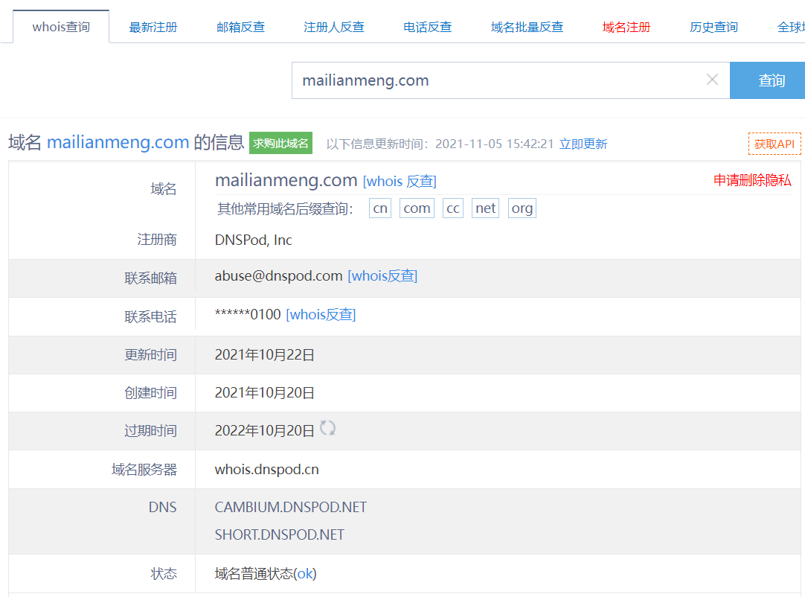

# 信息收集

>  通过信息搜集工作，确定渗透测试目标的范围；发现滲透目标的安全漏洞与脆弱点，为后续的滲透攻击提供基础。

## 基础

### 收集哪些信息

1. 域名，子域名，真实ip，旁站，C段，同ip站点。主机端口。
2. 网站架构，服务器指纹，比如操作系统，中间件，脚本语言，数据库，服务器，web容器等。
3. 网站目录，网站后台，网站敏感文件。

### 域名和ip

- **通过域名挖掘网络信息**：天眼查，whois，站长之家

    - 在whois查询中，获取注册人姓名和邮箱、电话信息，可以通过搜索引擎，社交网络，进一步挖掘出更多域名所有人的信息

    - 域名注册时的邮箱，可用于社工或是登录处的账号

    - http://whois.chinaz.com

    - 

- 网站备案信息：

    - 网站备案信息是根据国家法律法规规定，由网站所有者向国家有关部门申请的备案，是国家信息产业部对网站的一种管理途径，是为了防止在网上从事非法网站经营活动，当然主要是针对国内网站。

    - 在备案查询中我们主要关注的是：单位信息例如名称、备案编号、网站负责人、法人、电子邮箱、联系电话等。

    - 常用的备案信息查询网站有以下几个：

        ```
        ICP/IP地址/域名信息备案管理系统：http://beian.miit.gov.cn/publish/query/indexFirst.action
        
        ICP备案查询网：http://www.beianbeian.com/
        
        备案吧吧：https://www.beian88.com/
        
        天眼查：https://www.tianyancha.com/
        ```

        

- 通过ip反查域名

- 什么是CDN？

    - CDN的全称是Content Delivery Network，即内容分发网络。

    - CDN是构建在现有网络基础之上的智能虚拟网络，依靠部署在各地的边缘服务器，通过中心平台的负载均衡、内容分发、调度等模块，使用户就近获取所需内容，降低网络拥塞，提高用户访问响应速度和命中率。但在安全测试过程中，若存在CDN服务，将会影响到后续的安全测试过程

- **怎么知道网站是否开启了cdn？**

    - nslookup  想要查的域名，若是有多个ip就是用了cdn，多半为假ip。
    - 全球ping域名法，是否返回不同ip
        -  [多个地点Ping服务器,网站测速 - 站长工具 (chinaz.com)](http://ping.chinaz.com/)
        - [17CE](https://www.17ce.com/)
    - 在反查网站ip时，如果此网站有1000多个不同域名，那么这个ip多半不是真实ip。
    - 如果ip定位是在常见cdn服务商的服务器上，那么是真实ip的可能性就微乎其微了。

- **如何绕过CDN，寻找真实ip？**

    - **子域名查找法**，

        - 因为搭建CDN要花钱，所以管理员会对主站，访问量比较大的做cdn服务，但是不会对子站做cdn，这时候就可以通过查找子域名来查找网站的真实IP，且很有可能和主站在同一台服务器或者同一个C段内。

    - 查看ip与域名绑定的历史记录，可能会存在使用CDN前的记录，相关查询网站有：

        ```url
        https://dnsdb.io/zh-cn/
        https://x.threatbook.cn/
        http://toolbar.netcraft.com/site_report?url=
        http://viewdns.info/
        
        https://dnsdumpster.com/
        https://censys.io/ 
        https://securitytrails.com/  
        ```

    - 查询主域名：

        - 一般情况下，www.XXX.com和XXX.com指向的是同一个DNS服务器，进入XXX.com会自动跳转到www.XXX.com，所以XXX.com不需要大流量，不用做CDN。如果加www检测不出来，可以试着去掉，或许就可以得到真实IP了

    - **服务器合法服务主动连接我们：**

        - 比如RSS邮件订阅，很多网站都自带sendmail，会发邮件给我们。此时查看源码获得真实ip。
        - 很多公司内部都会有一个邮箱服务器，这种邮箱服务器大部分是不会做CDN的。因为邮箱服务器一般都是公司内部人去访问，所以大部分不做CDN。因此，我们就可以根据对方邮件服务器给我们发送的邮件

    - **使用国外主机解析域名**：

        - 国内厂商有可能只做了国内的线路，没有针对国外线路。使用国外主机访问就可能获取到真实ip。

    - 目标敏感文件泄露：

        - 一些站点在搭建之初，会用一些文件测试站点，例如“phpinfo()”文件，此类文件里就有可能包含了真实的IP地址。可以利用Google搜索引擎搜索关键字“site:xxx.com inurl:phpinfo.php”，搜索站点是否有遗留文件

    - 查询历史DNS记录：

        - 站点在使用CDN服务之前，它的真实IP地址可能被DNS服务器所记录到，此时我们就可以通过DNS历史记录找到目标真实IP。https://x.threatbook.cnDNSdb，https://dnsdb.io/zh-cn/

    - 利用网站漏洞：比如xss盲打，命令行反弹shell， SSRF等，让目标服务器主动来连接我们。

### 子域名查询

- 在线子域名查询

    - https://phpinfo.me/domain/
    - https://dns.bufferover.run/dns?q=baidu.com
    - http://api.hackertarget.com/reversedns/?q=target.com
    - https://dnsdumpster.com/
    - DNS查询：https://dnsdb.io/zh-cn/
    - 微步在线：https://x.threatbook.cn/
    - 在线域名信息查询：http://toolbar.netcraft.com/site_report?url=
    - DNS、IP等查询：http://viewdns.info/
    - CDN查询IP：https://tools.ipip.net/cdn.php
    - SecurityTrails平台： https://securitytrails.com/domain/www.baidu.com/history/a
    - 在线子域名二级域名查询：http://tools.bugscaner.com/subdomain/

- 有许多第三方服务聚合了大量的DNS数据集，并通过它们来检索给定域名的子域名。

    - VirusTotal：https://www.virustotal.com/#/home/search 

    - DNSdumpster：https://dnsdumpster.com/ 

- googlehack

- fofa 搜索ico图标找子域名： https://www.baidu.com/favicon.ico

- 爆破：Sublist3r，layer

    - 在子域名爆破中,经常会遇到泛解析问题

        - 什么是泛解析呢？
            - 利用通配符(*)将所有某个级别的域名解析到同一个IP地址上
                现有域名github.com, 设置泛解析后，所有该域名下的子域aaa.github.com,bbb.aaa.github.com都会被解析到和github.com相同的ip地址。

            - 比如电商网站都会给店铺提供自定义域名功能，域名必然是泛解析架构。

            - 所以当拿着字典爆破泛解析域名的子域名时，不论域名是否真实存在，都将会存在解析结果。

        - 判断是否是泛解析域名
            - 查询一个绝对不存在域名的A记录，比如`enumsubdomain-feei.feei.cn`
            - 根据是否返回IP来判断是否是泛解析（若返回IP则是泛解析域名）

        - 解决方法：
            - 比如开源工具oneforall会首先访问一个随机的并不存在的域，通过返回结果判断是否存在泛解析，确定存在泛解析以后，程序会开始不断的循环产生随机域名，去向服务器查询，将每次查询到的IP和TTL记录下来，直到大部分的IP地址出现次数都大于两次，则IP黑名单的收集结束，在得到了IP黑名单以后，oneforall接下来会将自己的字典中的每一项和要指定查询的域名进行拼接。在爆破过程中根据IP黑名单进行过滤。但这种宽泛的过滤容易导致漏报，所以oneforall将 TTL 也作为黑名单规则的一部分，评判的依据是：在权威 DNS 中，泛解析记录的 TTL 肯定是相同的，如果子域名记录相同，但 TTL 不同，那这条记录可以说肯定不是泛解析记录。 

    - 工具：

        - **工具名称：oneforall**

            - *项目地址：**https://github.com/shmilylty/OneForAll**
            - 工具描述：oneforall是近几年出现的比较优秀的子域名收集工具之一，目前还在不断地进行更新优化。这款工具集成了各种域名信息收集的“姿势”，手段可谓是非常全面了。包括利用证书透明度、常规检查、利用网上爬虫（正在实现）、DNS数据集、DNS查询、威胁情报平台、搜索引擎等，但笔者发现它对域名泛解析的处理还不是特别理想，存在较多误收集，同时存在用时较长等缺点。

        - **工具名称：SubdomainBrute**

            - 项目地址：**https://github.com/lijiejie/subDomainsBrute 

            - **工具描述：**李劼杰的SubdomainBrute是业内比较出名的子域名收集工具了，工具采用协程加快爆破速度，使用114DNS、百度DNS、阿里DNS这几个快速又可靠的公共DNS进行查询。准确率高，效果比较好。但对泛解析的处理规则是：超过10个域名指向同一IP，则此后发现的其他指向该IP的域名将被丢弃，该方法可能存在误删，但不可否认的是，该规则在一定程度上简便有效。

        - **工具名称：ESD**

            - **项目地址**：https://github.com/FeeiCN/ESD
            - **工具描述：**ESD的爆破速度极快，62万条数据只用了4分30秒左右，这款工具存在的缺点之一就是对性能要求高，１G２核的服务器CPU占用率达100%。除此之外，输出的结果也比较不稳定，同一网络下对同一域名进行收集，几次结果数量都不一样。

        - **工具名称：subfinder**

            - **项目地址：**https://github.com/projectdiscovery/subfinder
            - **工具描述：**使用subfinder来进行子域名信息的收集，它的输出结果多、基数大、速度快，并且输出格式多，便于后续处理（oneforall也有相同的优点）。

- 公众号，小程序。

### 旁站，c段B段信息，同ip站点情况

**旁站：是和目标网站在同一台服务器上的其它的网站，**

**C段：是和目标服务器ip处在同一个C段的其它服务旁站**

- 利用Google，语法：`site:125.125.125.*`
- 利用Nmap，语法：`nmap  -p  80,8080  –open  ip/24`
- 在线：http://www.webscan.cc/ 

同ip站点情况:

- https://site.ip138.com/ 

### google hack

> google hack是指使用[Google](https://baike.baidu.com/item/Google)等搜索引擎对某些特定的网络主机漏洞（通常是服务器上的脚本漏洞）进行搜索，以达到快速找到漏洞主机或特定主机的漏洞的目的。

**原理**

- [**GHDB 谷歌黑客数据库**](https://www.exploit-db.com/google-hacking-database/)

- 黑客们能通过简单的搜索框在网络中出入于无形，在这背后还有一个强大的后盾，那就是Google Hacking Database（GHDB）


googlehack 常用语法

- `site:www.xxx.com`   指定域名
    - 找C段主机：`site:111.123.111.*`
    - 


- inurl   URL存在关键字的网页
    - 


- **filetype 搜索指定文件类型**
    - 


```
intext  网页正文中存在关键字的网页

intitle  标题中存在关键字的网页

site:xx.com 返回所有与该站有关的url

link:xx.com 返回所有与该站做了链接的站

site:xx.com filetype:txt 查找TXT文件 
```

逻辑语法：

```
完全搜索 ：" "
+号指定一个一定存在的关键词
-号指定一个不存在的关键词
|或 满足一个条件就可以
AND 必须满足两个条件
```

**查找后台**

```
site:xx.com intext:管理

site:xx.com inurl:login
常用后台路径:admin/	system/login.phpManage/等等。。

site:xx.com intitle:后台
搜索思路多样化：使用不同的关键词，且达到一样的效果
intitle:后台
intitle:后台管理
intitle:管理员登陆
intitle:欢迎来到管理中心
组合使用：
intitle:登陆 inurl:admin
```

查看服务器目标语言：很多伪静态网站，我们可以通过google hack来找到真实的脚本语言

```
site:xx.com filetype:asp

site:xx.com filetype:php

site:xx.com filetype:jsp

site:xx.com filetype:aspx
```

 查找上传网页

```
site:xx.com inurl:file

site:xx.com inurl:load
```

批量找弱点站：

```
inurl:ewebeditor

inurl:ewebeditor/admin_login.asp

inurl:phpmyadmin

inurl:phpmyadmin/index.php

inurl:fckeditor

找编辑器，php集成环境
```

找管理员用户名: `site:edu.cn "发布人"`

### **github常用搜索语法**

> 在渗透测试的信息收集阶段，可以去Github和码云上搜索与目标有关的信息，或者就有意想不到的收获。(有些开发人员将代码上传到代码库的时候，有可能连一些重要的配置信息也上传了)
>
> 

 有关可以添加到任何搜索限定符以进一步改善结果的搜索语法列表，请参阅“[了解搜索语法](https://links.jianshu.com/go?to=https%3A%2F%2Fdocs.github.com%2Fcn%2Ffree-pro-team%40latest%2Farticles%2Funderstanding-the-search-syntax)”。

对多个字词的搜索词使用引号。 例如，如果要搜索具有标签 "In progress" 的议题，可搜索 `label:"in progress"`。 搜索不区分大小写。

按仓库名称、说明或自述文件内容搜索

通过 `in` 限定符，您可以将搜索限制为仓库名称、仓库说明、自述文件内容或这些的任意组合。 如果省略此限定符，则只搜索仓库名称和说明。

| 限定符            | 示例                                                         |
| ----------------- | ------------------------------------------------------------ |
| `in:name test`    | 仓库标题搜索含有关键字test                                   |
| `in:description`  | **jquery in:name,description** matches repositories with "jquery" in the repository name or description. |
| `in:readme`       | **jquery in:readme**  matches repositories mentioning "jquery" in the repository's README file. |
| `repo:owner/name` | **repo:octocat/hello-world** 匹配特定仓库名称。              |


基于仓库的内容搜索

除了使用 `in:readme` 以外，无法通过搜索仓库内的特定内容来查找仓库。 要搜索仓库内的特定文件或内容，您可以使用查找器或代码特定的搜索限定符。

| 限定符      | 示例                                                         |
| ----------- | ------------------------------------------------------------ |
| `in:readme` | **octocat in:readme** matches repositories mentioning "octocat" in the repository's README file. |


在用户或组织的仓库内搜索


要在特定用户或组织拥有的所有仓库中搜索，您可以使用 `user` 或 `org` 限定符。

| 限定符            | 示例                                                         |
| ----------------- | ------------------------------------------------------------ |
| `user:*USERNAME*` | **user:defunkt forks:>100** 匹配来自 @defunkt、拥有超过 100 复刻的仓库。 |
| `org:*ORGNAME*`   | **org:github** 匹配来自 GitHub 的仓库。                      |


①按仓库大小搜索

The `size` qualifier finds repositories that match a certain size (in kilobytes), using greater than, less than, and range qualifiers 

“size”限定符使用“大于”、“小于”和“范围”限定符查找匹配特定大小(以千字节为单位)的存储库

| 限定符     | 示例                                                   |
| ---------- | ------------------------------------------------------ |
| `size:*n*` | **size:1000** 匹配恰好为 1 MB 的仓库。                 |
|            | **size:>=30000** 匹配至少为 30 MB 的仓库。             |
|            | **size:<50** 匹配小于 50 KB 的仓库。                   |
|            | **size:50..120** 匹配介于 50 KB 与 120 KB 之间的仓库。 |


②按关注者数量搜索

| 限定符          | 示例                                                         |
| --------------- | ------------------------------------------------------------ |
| `followers:*n*` | **node followers:>=10000** 匹配有 10,000 或更多关注者提及文字 "node" 的仓库。 |
|                 | **styleguide linter followers:1..10** 匹配拥有 1 到 10 个关注者并且提及 "styleguide linter" 一词的的仓库。 |


③按复刻数量搜索

| 限定符      | 示例                                              |
| ----------- | ------------------------------------------------- |
| `forks:*n*` | **forks:5** 匹配具有至少 205 个复刻的仓库。       |
|             | **forks:<90** 匹配具有少于 90 个复刻的仓库。      |
|             | **forks:10..20** 匹配具有 10 到 20 个复刻的仓库。 |


④按星号数量搜索

| 限定符      | 示例                                                         |
| ----------- | ------------------------------------------------------------ |
| `stars:*n*` | **stars:500** 匹配恰好具有 500 个星号的仓库。                |
|             | **stars:10..20** 匹配具有 10 到 20 个星号、小于 1000 KB 的仓库。 |
|             | **stars:>=500 fork:true language:php** 匹配具有至少 500 个星号，包括复刻的星号（以 PHP 编写）的仓库。 |


⑤按仓库创建或上次更新时间搜索

您可以基于创建时间或上次更新时间过滤仓库。 对于仓库创建，您可以使用 `created` 限定符；要了解仓库上次更新的时间，您要使用 `pushed` 限定符。 `pushed` 限定符将返回仓库列表，按仓库中任意分支上最近进行的提交排序。

两者均采用日期作为参数。 日期格式必须遵循 [ISO8601](https://links.jianshu.com/go?to=http%3A%2F%2Fen.wikipedia.org%2Fwiki%2FISO_8601)标准，即 `YYYY-MM-DD`（年-月-日）。 您也可以在日期后添加可选的时间信息 `THH:MM:SS+00:00`，以便按小时、分钟和秒进行搜索。 这是 `T`，随后是 `HH:MM:SS`（时-分-秒）和 UTC 偏移 (`+00:00`)。

| 限定符                 | 示例                                                         |
| ---------------------- | ------------------------------------------------------------ |
| `created:*YYYY-MM-DD*` | **webos created:<2011-01-01** 匹配具有 "webos" 字样、在 2011 年之前创建的仓库。 |
| `pushed:*YYYY-MM-DD*`  | **css pushed:>2013-02-01** 匹配具有 "css" 字样、在 2013 年 1 月之后收到推送的仓库。 |
|                        | **case pushed:>=2013-03-06 fork:only** 匹配具有 "case" 字样、在 2013 年 3 月 6 日或之后收到推送并且作为复刻的仓库。 |

⑥按语言搜索

| 限定符                | 示例                                                         |
| --------------------- | ------------------------------------------------------------ |
| `language:*LANGUAGE*` | **rails language:javascript** 匹配具有 "rails" 字样、以 JavaScript 编写的仓库。 |

⑦按主题搜索

| 限定符          | 示例                                                |
| --------------- | --------------------------------------------------- |
| `topic:*TOPIC*` | **topic:jekyll** 匹配已归类为 "jekyll" 主题的仓库。 |

⑧按主题数量搜索

| 限定符       | 示例                                   |
| ------------ | -------------------------------------- |
| `topics:*n*` | **topics:5** 匹配具有五个主题的仓库。  |
|              | **topics:>3** 匹配超过三个主题的仓库。 |

⑨按许可搜索

| 限定符                      | 示例                                                         |
| --------------------------- | ------------------------------------------------------------ |
| `license:*LICENSE_KEYWORD*` | **license:apache-2.0** 匹配根据 Apache License 2.0 授权的仓库。 |

基于仓库是否为镜像搜索

| 限定符         | 示例                                                         |
| -------------- | ------------------------------------------------------------ |
| `mirror:true`  | **mirror:true GNOME**  matches repositories that are mirrors and contain the word "GNOME." |
| `mirror:false` | **mirror:false GNOME**  matches repositories that are not mirrors and contain the word "GNOME." |


基于仓库是否已存档搜索

| 限定符           | 示例                                                         |
| ---------------- | ------------------------------------------------------------ |
| `archived:true`  | **archived:true GNOME**  matches repositories that are archived and contain the word "GNOME." |
| `archived:false` | **archived:false GNOME** matches repositories that are not archived and contain the word "GNOME." |


基于具有 `good first issue` 或 `help wanted` 标签的议题数量搜索

您可以使用限定符 `help-wanted-issues:>n` 和 `good-first-issues:>n` 搜索具有最少数量标签为 `help-wanted` 或 `good-first-issue` 议题的仓库。。

| 限定符                  | 示例                                                         |
| ----------------------- | ------------------------------------------------------------ |
| `good-first-issues:>n`  | **good-first-issues:>2 javascript**  匹配具有超过两个标签为 `good-first-issue` 的议题且包含 "javascript" 字样的仓库。 |
| `help-wanted-issues:>n` | **help-wanted-issues:>4 react**  匹配具有超过四个标签为 `help-wanted` 的议题且包含 "React" 字样的仓库。 |

### 其他：

- https://www.spiderfoot.net/ **开源智能自动化信息收集工具**

## 资产收集

给我们的是一个公司或者组织的名字，让我们以这个公司为目标做红蓝对抗。
### [fofa](https://fofa.so/)

#### fofa介绍

FOFA 搜索引擎检索到的内容主要是服务器，数据库，某个网站管理后台，路由器，交换机，公共ip的打印机，网络摄像头，门禁系统，Web服务等等。 在**渗透测试过程中，Fofa能帮助测试人员快速发现目标资产**。这类搜索引擎又有另一个名字：网络空间测绘系统。


例如Apache出来了一个高危漏洞，受影响的版本号为2.4.23,我们需要去本公司可能受此漏洞影响的Apache服务器，那么我们可以使用高级查询语句server==”Apache/2.4.23”&&domain=”xxx.com”，搜索结果即为本公司域名下的所有子域名可能存在Apache2.4.23版本漏洞的URL，安全人员可以对结果进行检查，及时修复漏洞。（详细语法可在网页搜索框下方点击“查询语法”）


特点

1.支持API查询接口，便于进行程序间的自动化查询、处理功能，进行进一步的业务分析。

	用法：所有调用都需要提供身份信息，主要是email和key，email主要是注册和登陆时填写的email，key需要用户到个人中心获取32位的hash值，即为API KEY。将上面的两个信息填入api接口中，即可获取json格式的数据。

2.支持下载功能

	用法：搜索到结果之后可在右侧选择下载功能，可下载搜索到的所有数据，下载的格式支持CSV，JSON，XML格式，方便程序调用进行全网扫描。

注意

1) 普通会员和高级会员的 免费100条 和 免费10000条 是指每天调用API可以免费获取前100条和前10000条,假设高级会员调用API,每页获取3333条，第1、2、3页由于没有超过前10000条，所以免费，第4页超过前10000条，所以会扣除1FOFA币。
2) 直接下载数据，无论多少条数据，都要花费FOFA币。
   普通会员300 高级会员1000 终身制 。

#### fofa的语法

- 主要分为检索字段以及运算符，所有的查询语句都是由这两种元素组成的。

    - Fofa目前支持的检索字段包括：domain，host，ip，title，server，header，body，port，cert，country，city，os，appserver，middleware，language，tags，user_tag等等，
    - 支持的逻辑运算符包括：= ，==，!=     ，&&，||。

- | domain            | 搜索所有子域名                                               | domain="qq.com”                                              |
    | ----------------- | ------------------------------------------------------------ | ------------------------------------------------------------ |
    | host              | 从url中搜索，搜索host内所有带有XXX的域名:                    | host="qq.com”                                                |
    | ip                | 搜索ip相关信息：        支持ip段搜索                         | ip=“58.63.236.248”  ip=”111.1.1.1/24″                        |
    | server            | 搜索web服务器                                                | server="Apache"                                              |
    | title             | 从标题中搜索                                                 | title=“标题”                                                 |
    | header            | 从http头中搜索                                               | 例:搜索前段时间非常火的海康威视 header=”Hikvision”           |
    | body              | 从html正文中搜索                                             | 例:假如我想搜索微博的后台,域名为:weibo.com并且网页内body包含”后台”:body=”后台” &&  domain=”weibo.com”:与body=”后台” &&  domain=”weibo.com” 提取域名为:weibo.com并且网页内body包含”后台”的网站 需要同时满足两个条件 |
    | port              | 找端口                                                       | 例:想要找非80端口  port!=”80″                                |
    | cert              | 搜索证书(https或者imaps等)中带有XXX的资产                    | 例:百度公司为了检查自己的域名、可以使用语法: cert=”baidu”    |
    | country           | 搜索指定国家(编码)的资产例:搜索中国的服务器 country=”CN”注:country=”CN” | country后面的规则为各国家的缩写,全球国家缩写如下链接:https://zhidao.baidu.com/question/538403206.html |
    | city              | 搜索指定城市的资产                                           | 搜索上海的服务器 city=”Shanghai”  注:搜索城市时填写城市的全称,首字母必须大写! |
    | region="Xinjiang" | 搜索指定行政区的资产。                                       |                                                              |
    | os                | 搜索对应系统的资产                                           | 例:搜索centos所有主机 os="centos”                            |
    | app               | 搜索Microsoft-Exchange设备                                   |                                                              |
    | middleware        |                                                              |                                                              |
    | icp               | 查找备案号为“XXXX"的网站                                     | icp="京ICP证030173号"                                        |
    | js_name           | 查找html正文中包含了对应js文件名的资产                       | js_name="js/jquery.js" 查找网站正文中包含js/jquery.js的资产  |
    | js_md5            | 查找js源码md5值与之匹配的资产                                |                                                              |
    | icon_hash=“”      |                                                              |                                                              |
    | status_code       | 查询对应服务器状态，只针对http协议                           | 400 401 402 200                                              |
    | protocol          | 查询对应协议资产                                             |                                                              |
    |                   |                                                              |                                                              |

逻辑运算符：

- 多语句结合使用，针对范围做限制（切忌打偏打歪跨行业）

- 可以使用括号 和 && || !=等符号

    ```
    title="目标名称"&&region="XX省"
    title="目标名称"&&region="XX市"
    cert=“目标域名或者证书关键字"&&region="xx省"
    cert=“目标域名或者证书关键字"&&city="xx市"
    ((title="目标名称”||host="目标域名")&&country="CN")&&region!="HK"
    ```

- 学会在搜索的时候做总结，去发现新的关键字，同一个目标单位的查询关键词可能有好几个，比如行业唯一性的东西，搜索别人没有搜索到的关键字，就可能发现别人没有发现的资产。哪怕是在没有项目的时候也可以多尝试一些组合。

#### fofa可以搜什么

FOFA可以从不同维度搜索网络组件，例如地区，端口号，网络服务，操作系统，网络协议等等。目前FOFA支持了多个网络组件的指纹识别，包括建站模块、分享模块、各种开发框架、安全监测平台、项目管理系统、企业管理系统、视频监控系统、站长平台、电商系统、广告联盟、前端库、路由器、SSL证书、服务器管理系统、CDN、Web服务器、WAF、CMS等等，详细信息可见[https://fofa.so/library](https://fofa.so/library）。)

**资产过滤之Fofa快速刷c段：**

- 选择一款或多款合适的工具，快速筛选子域名的ip，已经可能范围的最大c段。
    - eg：subfinder+ksubdomain+httprobe+httpx
    - echo baidu.com|./SubFinder/subfinder -silent|./KsubDomain/ksubdomain -silent | ./HTTProbe/httprobe|./HTTPX/httpx -title/-ip
- 针对c段提取ip并探测title即脆弱资产（后台，常见漏洞集合，0day）
    - eg： subfinder+ksubdomain+httprobe+httpx+ehole/glass/kscan
- Hole（棱洞）2.0提供了两种指纹识别方式，可从本地读取识别，也可以从FOFA进行批量调用API识别(需要FOFA密钥)，同时支持结果JSON格式输出

### [shodan](https://www.shodan.io/)

**Shodan是用于搜索连接到互联网的设备的工具。**

与搜索引擎可以帮助你找到网站不同，Shodan可以帮助你找到有关台式机,服务器，loT设备等的信息。此信息包括元数据，例如在每个设备上运行的软件。
Shodan的常见用途包括网络安全，市场研究，网络风险，扫描loT设备和跟踪勒索软件。

连接shodan的方法有很多，比如网站、官方的python命令行界面工具和库，各种语言的社区驱动库以及官方的REST API与Shodan，此处主要介绍网站。


它的工作方式类似于CLI工具的搜索命令，但带有精美的WebUI来显示结果。它显示每个主机的摘要，与查询匹配的主机总数(如CLI的count命令）和一些统计信息(如stats命令)。

选择主机后，可以看到快照规范表，漏洞影响主机，开放端口和开放端口标识信息（如下）。


```
hostname：搜索指定的主机或域名，例如 hostname:"google"
port：搜索指定的端口或服务，例如 port:"21"
country：搜索指定的国家，例如 country:"CN"
city：搜索指定的城市，例如 city:"Hefei"
org：搜索指定的组织或公司，例如 org:"google"
isp：搜索指定的ISP供应商，例如 isp:"China Telecom"
product：搜索指定的操作系统/软件/平台，例如 product:"Apache httpd"
version：搜索指定的软件版本，例如 version:"1.6.2"
geo：搜索指定的地理位置，参数为经纬度，例如 geo:"31.8639, 117.2808"
before/after：搜索指定收录时间前后的数据，格式为dd-mm-yy，例如 before:"11-11-15"
net：搜索指定的IP地址或子网，例如 net:"210.45.240.0/24"
```

- **搜索实例**

  ```
  查找位于合肥的 Apache 服务器：apache city:"Hefei"
  
  查找位于国内的      Nginx 服务器：  nginx      country:"CN"
  查找 GWS(Google Web      Server) 服务器："Server: gws" hostname:"google"
  查找指定网段的华为设备：  huawei net:"61.191.146.0/24"
  ```

如上通过在基本关键字后增加指定的过滤关键字，能快速的帮助发现我们感兴趣的内容。当然，还有更快速更有意思的方法，那就是点击      Shodan 搜索栏右侧的 “Explore” 按钮，就会得到很多别人分享的搜索语法，你问我别人分享的语法有什么好玩的？那咱们就随便来看看吧：

- 咱们随便选取一个名为“NetSureveillance Web”的用户分享语法，从下面的描述信息我们基本就能得知这就是一个弱密码的漏洞，为了方便测试让我们把语法在增加一个国家的过滤信息，最终语法如下：
  - `Server: uc-httpd 1.0.0 200 OK Country:"CN"`
  - 现在让我们随便选取一个页面进去输入，使用admin账号和空密码就能顺利进入了:
  - 


**其他功能**

- Shodan      不仅可以查找网络设备，它还具有其他相当不错的功能。

- Exploits：每次查询完后，点击页面上的      “Exploits” 按钮，Shodan 就会帮我们查找针对不同平台、不同类型可利用的 exploits。当然也可以通过直接访问网址来自行搜索： https://exploits.shodan.io/welcome；
    - 

- 地图：每次查询完后，点击页面上的      “Maps” 按钮，Shodan 会将查询结果可视化的展示在地图当中；
- 报表：每次查询完后，点击页面上的      “Create Report” 按钮，Shodan 就会帮我们生成一份精美的报表，这是天天要写文档兄弟的一大好帮手啊；


## 蜜罐探测

### 什么是蜜罐？

>  蜜罐其实就相当于目标部署的一个陷阱，它伪装成一个正常的系统，静静地等待黑客前来入侵，进而监听黑客的攻击方式、操作动向、以及捕捉黑客画像。
>
> 利用jsonp可以进行窃取黑客的信息。

①按交互方式分类，蜜罐可以分为三类：低交互式蜜罐，中交互式蜜罐，高交互式蜜罐

- 低交互蜜罐：通常是指与操作系统交互程度较低的蜜罐系统，仅开放一些简单的服务或端口，用来检测扫描和连接，这种容易被识别

- 中交互式蜜罐：介于低交互式和高交互式之间，能够模拟操作系统更多的服务，让攻击者看起来更像一个真实的业务，从而对它发动攻击，这样蜜罐就能获取到更多有价值的信息

- 高交互式蜜罐：指的是与操作系统交互很高的蜜罐，它会提供一个更真实的环境，这样更容易吸引入侵者，有利于掌握新的攻击手法和类型，但同样也会存在隐患，会对真实网络造成攻击


##### 蜜罐观察与检测

**观察**

1.流量记录 观察burpsuite流量，出现许多api调用

2.网站响应速度
蜜罐经常会加载很多JS，会导致网页的响应速度变慢

3.网站JS
查看网站源码观察JS

4.端口
蜜罐往往开放了，很多端口；使用nmap对蜜罐进行端口扫描，进行判断

举例：使用nmap对一个ip进行扫描，同时开放了1433、3306、1521、那就有问题了...因为正常一个服务器不可能有3个数据库；同时开放了并识别了22 SSH服务、3389 RDP...这也是个问题

5.指纹
部分蜜罐会提供很多指纹信息，以此命中扫描

6.使用痕迹
举例：查看是否有系统所有者的使用文件，如密码文件、浏览器访问历史记录等，如果没有可能要注意一下了

7.系统限制
举例：查看系统命令执行状况如windows系统wmic、powershell是否执行；linux系统查看crontab、top等是否执行，原因就是部分蜜罐为了方便部署使用的镜像是最简系统

### **蜜罐检测**

浏览器插件

- anti-honeypot  地址：https:*//github.com/cnrstar/anti-honeypot*


shodan检测

- 正常系统：

    - 


- 有蜜罐时如下：
    - 


## 主机存活探测/端口/服务

> 拿到一个ip，首先要探测主机是否存活，什么系统啊, 探测主机存在的端口有哪些，对应端口运行了什么服务.
>
> 获取Banner信息后，可以在漏洞库中查找对应CVE编号的POC、EXP,在ExploitDB、Seebug等平台上查看相关的漏洞利用工具，然后到目标系统中验证漏洞是否存在，从而有针对性地进行安全加固。
> [Exploit-DB](https://www.exploit-db.com/)

- 存活探测：使用nmap即可`nmap -sP 111.xxx.xxx.xxx`

- 端口扫描：查看nmap教程

    - 探测到端口之后，可以尝试常见的未授权访问的服务如redis，mongodb的探测及利用。

- 服务探测：

    - nmap的-sV可以探测出服务版本，但有些情况下必须手动探测去验证

    - 可通过nc简单判断

        ```
        $: nc -vv localhost 8001  
        localhost [127.0.0.1] 8001 (?) open
        asd
        HTTP/1.1 400 Bad Request
        Date: Fri, 25 Aug 2017 12:15:25 GMT
        Server: Apache/2.4.23 (Debian)
        Content-Length: 301
        Connection: close
        Content-Type: text/html; charset=iso-8859-1
        <!DOCTYPE HTML PUBLIC "-//IETF//DTD HTML 2.0//EN">
        <html><head>
        <title>400 Bad Request</title>
        </head><body>
        <h1>Bad Request</h1>
        <p>Your browser sent a request that this server could not understand.<br />
        </p>
        <hr>
        <address>Apache/2.4.23 (Debian) Server at 127.0.0.1 Port 8001</address>
        </body></html>
        
        由此我们知道了这是一个http服务，因为我们发送的字符串不是一个合法的HTTP请求，因此返回一个400 Bad requests，我们还得到了系统的版本是Debian，WebServer是Apache
        ```


### 端口表

| 20，21，69     | FTP                                 | 主要看是否支持匿名，也可跑弱口令  匿名访问：用户名：anonymous   密码：为空或任意邮箱              用户名：FTP        密码：FTP或为空             用户名：USET     密码：pass             当然还有不需要用户名密码直接访问的，一般出现在局域网中   嗅探：ftp使用明文传输（但是嗅探给予局域网并需要欺骗或监听网关）  远程溢出漏洞：6.10.1 IIS FTP远程溢出漏洞， | msf中的ftp爆破模块                                           |
| -------------- | ----------------------------------- | ------------------------------------------------------------ | ------------------------------------------------------------ |
| 22             | SSH                                 | 弱口令爆破   28退格漏洞、OpenSSL漏洞                         | auxiliary/scanner/ssh/ssh_enumusers 用户枚举   auxiliary/scanner/ssh/ssh_login  密码爆破 |
| 23             | telnet                              | 爆破，嗅探，弱口令                                           |                                                              |
| 80-90          | WEB                                 | 常见WEB漏洞以及一些为管理后台  IIS  PUT写文件：利用IIS漏洞，put方法直接将文件放置到服务器上  解析漏洞：详细见apache服务  **Apache/Tomcat/Nginx/Axis2**  弱口令（爆破manager后台） |                                                              |
| 135            | RPC服务，远程命令执行               |                                                              |                                                              |
| 137，138，139  | samba，文件共享服务                 | 爆破：弱口令（爆破工具采用hydra）hydra -l username -P  PassFile IP smb                        未授权访问：给予public用户高权限              远程代码执行漏洞：CVE-2015-0240等等 |                                                              |
| 161            | snmp                                | public弱口令                                                 |                                                              |
| 389            | ldap，轻量级目录访问协议            | 注入攻击：盲注       未授权访问：       爆破：弱口令         |                                                              |
| 443            | openssl                             | 心脏出血以及一些WEB漏洞测试                                  |                                                              |
| 445            | smb                                 | 跑弱口令，检测是否有ms08_067等溢出(xp,和Windows server) 可能存在[永恒之蓝漏洞MS17-010](https://blog.csdn.net/qq_36119192/article/details/83215257) |                                                              |
| 873            | rsync                               | 是否为匿名访问，也可以跑弱口令 [rsync 未授权访问漏洞](https://vulhub.org/#/environments/rsync/common/) |                                                              |
| 1025           | RPC                                 | NFS匿名访问                                                  |                                                              |
| 1099           | java rmi                            | 远程命令执行漏洞                                             |                                                              |
| 1433           | mssql                               | 弱口令爆破                                                   |                                                              |
| 1521           | oracle                              | 弱口令爆破，注入，TNS爆破                                    |                                                              |
| 2049           | nfs，网络文件系统                   | 未授权访问：未限制IP以及用户权限设置错误                     |                                                              |
| 2082/2083      | cpanel主机管理系统登陆              | 弱口令爆破                                                   |                                                              |
| 2181           | zookeeper服务                       | 未授权访问                                                   |                                                              |
| 2222           | DA虚拟主机管理系统登陆              | 弱口令爆破                                                   |                                                              |
| 2601,2604      | zebra路由器                         | 默认密码zebra                                                |                                                              |
| 3128           | squid代理默认端口                   | 如果没设置口令很可能就直接漫游内网                           |                                                              |
| 3306           | mysql                               | 弱口令爆破                                                   |                                                              |
| 3312/3311      | kangle主机管理系统登陆              | 说明                                                         |                                                              |
| 3389           | RDP                                 | 弱口令爆破，SHIFT后门，放大镜，输入法漏洞， Shift粘滞键后门：5次shift后门，  利用ms12-020攻击3389端口，导致服务器关机 |                                                              |
| 4440           | rundeck                             | web                                                          |                                                              |
| 4848           | GlassFish web中间件                 | 弱口令admin/adminadmin                                       |                                                              |
| 5000           | sysbase/DB数据库                    | 爆破，注入                                                   |                                                              |
| 5432           | postgres                            | 弱口令爆破，注入，爆破                                       |                                                              |
| 5560,7778      | iSqlPlus                            |                                                              |                                                              |
| 5632           | PcAnywhere服务                      | 抓取密码，代码执行                                           |                                                              |
| 5900,5901,5902 | vnc                                 | 弱口令爆破，   认证口令绕过：    拒绝服务攻击：（[CVE-2015-5239](http://drops.wooyun.org/papers/9014)）    权限提升：（CVE-2013-6886） |                                                              |
| 5984           | CouchDB                             | http://xxx:5984/_utils/                                      |                                                              |
| 6082           | varnish                             |                                                              |                                                              |
| 6379           | redis                               | 一般无验证，直接访问                                         |                                                              |
| 7001,7002      | weblogic                            | 弱口令爆破， Java反序列化， Congsole后台部署webshell：       |                                                              |
| 7778           | Kloxo                               | 主机控制面板登录                                             |                                                              |
| 8080           | tomcat\jboss                        | 弱口令爆破，jboss后台可能不验证                              |                                                              |
| 8649           | ganglia                             |                                                              |                                                              |
| 8080-8090      | 常见WEB端口                         |                                                              |                                                              |
| 8083           | Vestacp主机管理系统  （国外用较多） |                                                              |                                                              |
| 8649           | ganglia                             |                                                              |                                                              |
| 8888           | amh/LuManager                       | 主机管理系统默认端口  说明                                   |                                                              |
| 9000           | fcgi                                | fcgi php命令执行漏洞                                         |                                                              |
| 9090           | WebSphere控制台                     | java反序列化，弱口令                                         |                                                              |
| 9200           | elasticsearch                       | 代码执行                                                     |                                                              |
| 9043           | websphere                           | 弱口令爆破                                                   |                                                              |
| 10000          | Virtualmin/Webmin                   | 服务器虚拟主机管理系统                                       |                                                              |
| 11211          | memcache                            | 内存泄露                                                     |                                                              |
| 27017,28017    | mongodb                             | 未授权访问                                                   |                                                              |
| 50000          | Upnp                                | SAP命令执行                                                  |                                                              |
| 50060,50030    | hadoop                              | WEB 未授权访问                                               |                                                              |


## 网站架构/指纹识别：


```
wappalyzer插件——火狐插件
云悉：http://www.yunsee.cn/info.html

CMS指纹识别：http://whatweb.bugscaner.com/look/ 
	CMS指纹识别又有很多方法，比如说御剑指纹识别、Webrobot工具、whatweb工具、还有在线查询的网站等等。

网页源代码。请求头/响应头。网站底部，顶部，左上角右上角。网站报错信息
显示网站使用的技术  https://builtwith.com/ 
	中间件、组件 Weblogic、tomcat、zabbix、struts、axis等 https://github.com/FortyNorthSecurity/EyeWitness
```

## 信息泄露、敏感文件、敏感目录、物理路径探测 

### 目录遍历

目录浏览漏洞属于目录遍历漏洞的一种，目录浏览漏洞是由于网站存在配置缺陷，存在目录可浏览漏洞，这会导致网站很多隐私文件与目录泄露，比如数据库备份文件、配置文件等，攻击者利用该信息可以更容易得到网站权限，导致网站被黑。 

风险：

- 攻击者通过访问网站某一目录时，该目录没有默认首页文件或没有正确设置默认首页文件，将会把整个目录结构列出来，将网站结构完全暴露给攻击者； 

- 攻击者可能通过浏览目录结构，访问到某些隐秘文件（如PHPINFO文件、服务器探针文件、网站管理员后台访问地址、数据库连接文件等）。

### 信息泄露

**源码泄露**

- https://github.com/kost/dvcs-ripper,  利用git，svn，hg/Mercurial，bzr，cvs

- Git： .git目录包含了整个代码的结构，可以通过.git目录下载整个网站。

    
- hg/Mercurial
- svn（Subversion)： SVN使用不当将.svn目录部署到生产环境中

    - https://github.com/admintony/svnExploit

- bzr/Bazaar：
- Cvs

- DS_Store:   Mac OS 保存文件夹的自定义属性的隐藏文件，包含该目录里面所有文件的清单

    - https://github.com/gehaxelt/Python-dsstore
    -  [**https://github.com/lijiejie/ds_store_exp**](https://github.com/lijiejie/ds_store_exp)

- .swp泄露  vim编辑器使用不当导致出现缓存

  - 编写数据后，直接关闭终端，未保存或正常退出会产生.swp文件
  - vim -r filename 查看缓存文件


**备份文件泄露、配置文件泄露**

- ([www.zip,xx.com.zip,www.xx.com.zip,wwwroot.zip](http://www.zip,xx.com.zip,www.xx.com.zip,wwwroot.zip))
- WEB-INF泄露

敏感文件、敏感目录挖掘一般都是靠工具、脚本来找，当然大佬手工也能找得到。

- 御剑，dirbuster
- 爬虫（AWVS、Burpsuite等）
- 搜索引擎（Google、Github等）
- wwwscan
- BBscan（https://github.com/lijiejie/BBScan ）
- GSIL（https://github.com/FeeiCN/GSIL ）

后台探测：

- **尝试常用后台**

- ```
    一般默认后台：
    /admin/
    /login/
    /system/
    /manage/
    /guanli/
    ```

- 后台路径具体怎么命名，取决于管理员

- robots.txt

- - robots是搜索引擎的蜘蛛指引文件，定义哪些文件可以被搜索引擎搜录
    - robots存在于网站根目录/robots.txt
    - 并不是所有网站都有

- **工具扫描：**扫描:一般使用字典，工具自动化扫描目录 御剑

- **通过搜索引擎**

- **底部或其他预留管理系统**

- **基于上传问题的后台探测**

- 直接查看图片属性路径，很可能得到后台路径

##### GitHub信息泄露

GitHub作为开源代码平台，给程序员提供了很多便利，但如果使用不当，比如将包含了账号密码、密钥等配置文件的代码上传了。

很多网站及系统都会使用pop3和smtp发送来邮件，不少开发者由于安全意识不足会把相关的配置文件信息也放到Github上，所以如果这时候我们动用一下Google搜索语法，就能把这些敏感信息给找出来了。

```
site:Github.com smtp
site:Github.com smtp @qq.com
site:Github.com smtp @126.com
site:Github.com smtp @163.com
site:Github.com smtp @sina.com.cn
……
```


数据库信息泄露：

```
site:Github.com sa password
site:Github.com root password
```

##### phpinfo文件

- PHPInfo函数信息泄露漏洞常发生一些默认的安装包，比如phpstudy等，默认安装完成后，没有及时删除这些提供环境测试的文件。

- 比较常见的为:phpinfo.php、1.php、test.php

- 通过phpinfo获取的php环境以及变量等信息，这些信息的泄露配合一些其它漏洞将有可能导致系统被渗透和提权。

- 有用的信息：

    > https://www.k0rz3n.com/2019/02/12/PHPINFO%20%E4%B8%AD%E7%9A%84%E9%87%8D%E8%A6%81%E4%BF%A1%E6%81%AF/

1. **PHP** 版本信息

    - 我们知道 PHP 不同版本之间在很多方面都有着差异，当然我么重点关注的肯定是一些函数参数以及一些安全性机制的差异。特别是 PHP5 和 PHP7 之间的差异尤其的大，因此知道了 PHP 的确切版本是我们需要做的第一步。

2. 操作系统版本：System

    - 系统无非是两种 Linux 和 Windows ，这在我们后期命令执行的时候或者是 bypass disable_function 的时候有用
3. Configure Command(编译命令)：
    1. 这个其实就是编译 php 的时候的命令,这里面其实包含了几乎所有的 php 要加载的扩展和功能，但是看起来不是很方便(因为比较乱),但也是一目了然，当然这些功能在后面都有专门的栏目介绍。

4. php.ini 所在路径：Loaded Configuration File
    - 这一栏表明了 php.ini 这个 php 配置文件的位置，在有文件读取的情况下可以进行读取，在渗透中还是很有帮助的。
5. Registered PHP Streams(支持的流)：

- | Registered PHP Streams | php, file, glob, data, http, ftp, zip, compress.zlib, https, ftps, phar |
    | ---------------------- | ------------------------------------------------------------ |

- 这个在文件包含、反序列化还有一些关键的 bypass 的时候非常有用

6. **Registered Stream Filters(支持的流过滤器)**：
    - 这个同样在文件包含、反序列化还有一些关键的 bypass 的时候非常有用


- | Registered Stream Filters | convert.iconv.*, mcrypt.*, mdecrypt.*, string.rot13, string.toupper, string.tolower, string.strip_tags, convert.*, consumed, dechunk, zlib.* |
    | ------------------------- | ------------------------------------------------------------ |

7. **Core(核心)**：

- 这个栏目里面有非常多重要的配置信息，我们可以简单的看一下：

- **allow_url_fopen&allow_url_include**：

    - 文件包含必看选项之一

- **disable_functions**:

    - 命令执行、代码执行必看选项之一，具体可以看[这篇文章](https://www.k0rz3n.com/2019/02/12/PHP 中可以利用的危险的函数/)

- **错误提示display_errors&display_startup_errors**：

    - 调试过程中经常使用的错误提示在没有关闭的情况下放入生产环境是不堪设想的

- **enable_dl**：

    - 该选项**默认为 on(在未来将被移除)** ，我们看一下 官方手册怎么说的

    - > 该指令仅对 Apache 模块版本的 PHP 有效。 你可以针对每个虚拟机或每个目录开启或关闭 dl() 动态加载 PHP 模块。
        >
        > 关闭动态加载的主要原因是为了安全。通过动态加载，有可能忽略所有 open_basedir 限制。 默认允许动态加载，除了使用 安全模式。在安全模式，总是无法使用 dl()。	

- **extension_dir**

    - 和 dl() 配合使用效果更好，具体可以看[这篇文章](https://www.k0rz3n.com/2019/02/12/PHP 中可以利用的危险的函数/)

    - ```
        extension_dir	D:\app\phpstudy_pro\Extensions\php\php7.0.9nts\ext	D:\app\phpstudy_pro\Extensions\php\php7.0.9nts\ext
        ```

- **include_path**

    - PHP 用include()函数包函文件时的默认路径

        ```
        include_path	.;C:\php\pear	.;C:\php\pear
        ```

        

- **open_basedir**

    - 这个选项设置了文件读取的时候的目录限制

- **short_open_tag**

    - 判断服务器是不是支持短标签，这在写 shell 的时候很有帮助


8. **phar**

    - 文件包含还有反序列化重点关注
    
    - phar
    
        | Phar: PHP Archive support | enabled                                         |
        | ------------------------- | ----------------------------------------------- |
        | Phar EXT version          | 2.0.2                                           |
        | Phar API version          | 1.1.1                                           |
        | SVN revision              | $Id: 860f5132d446a7b24c2bbf050ce6949381ea8db5 $ |
        | Phar-based phar archives  | enabled                                         |
        | Tar-based phar archives   | enabled                                         |
        | ZIP-based phar archives   | enabled                                         |
        | gzip compression          | enabled                                         |
        | bzip2 compression         | disabled (install pecl/bz2)                     |
        | OpenSSL support           | enabled                                         |

9. **SESSION**:

    ```
    session.save_path="" –设置session的存储路径
    session.save_handler="" –设定用户自定义存储函数，如果想使用PHP内置会话存储机制之外的可以使用本函数(数据库等方式)
    session.auto_start boolen –指定会话模块是否在请求开始时启动一个会话,默认为0不启动
    session.serialize_handler string –定义用来序列化/反序列化的处理器名字。默认使用php
    
    例如：
    
    session.save_path="D:\xampp\tmp"   表明所有的session文件都是存储在xampp/tmp下
    session.save_handler=files         表明session是以文件的方式来进行存储的
    session.auto_start=0               表明默认不启动session
    session.serialize_handler=php      表明session的默认序列话引擎使用的是php序列话引擎
    ```

10. **PHP Variables**

    - **$_SERVER['PATH']**

        - 这个是 windows 下特有的，能显示出系统的所有环境变量

    - **$_SERVER['SCRIPT_FILENAME']**

        这个是最常用，也是最有效的一个办法，找到phpinfo()页面可以直接找到网站的绝对路径，对于写shell和信息搜集是必不可少的。

11. **gopher**:可以配合 SSRF 发起攻击

12. **fastcgi**: 查看是否开启fastcgi和fastcgi的版本，可能导致解析漏洞、远程命令执行、任意文件读取等问题

13. **支持的程序**:

    1. 可以通过phpinfo()查看一些特殊的程序服务，比如redis、memcache、mysql、SMTP、curl等等如果服务器装了redis或者memcache可以通过ssrf来getshell了，在discuz中都出现过此类问题。如果确定装了redis或memcache的话，在没有思路的情况下，可以着重找一下ssrf

**PHPINFO 中要解释的信息**

**expose_php**: 这个选项开启将会在 http 包的头部显示 php 的版本等信息，是一种信息泄露，建议关闭


### 物理路径探测

> - 很多时候拿权限，写shell需要用到物理路径

**报错获得**
在处理报错信息的问题上如果处理不当，就可导致路径信息泄露，比如访问一些不存在的文件等思路。
**常用报错方法：**

- 有动态URL的地方可以替换参数 替换参数值为不存在的，很多时候都能爆物理路径

- 访问不存在的文件名 文件 或者改正常后缀为不支持的后缀。 IIS7.0以上，如果没有修改404页面，只要浏览web任意不存在的文件，都会直接暴出绝对路径。同理，thinkphp也有这个性质。
- 在id=1的注入点，使用各种不支持的字符，比如id=1’ id=? id=-1 id=\ id=/ 都有可能暴出绝对路径。
- 还有的时候传一些错误图片会报错 windows不支持的符号，?:<>之类的，还有windows不支持的文件名aux Windows服务器上传aux文件或者新建aux文件夹，因为不允许这种文件存在而报错泄露绝对路径。
- 尤其是php框架写的站，上传很容易爆出物理路径，根据具体情况了，比如一次提交允许的后缀，整体提交时抓包改为不支持的后缀，放包，很多时候都能爆出物理路径。

​	有一部分都是sql语句报错，sql很多时候会爆物理路径...

**后台获得**
	可以登录后台的话，后台首页一般都有服务器信息的，大部分情况下物理路径都在里面。

**图片上传**
	在上传图片处最可能存在问题的点，就是关于上传相关证明，进行实名制上传信息等功能页面

​	在上传图片时进行抓包，然后查看返回包，那么就可看到当前服务器的绝对路径信息。

**搜索引擎探测**
	结合关键字和site语法搜索出错页面的网页快照，常见关键字有warning和fatal error。
***注意:如果目标站点是二级域名，site接的是其对应的顶级域名，这样得到的信息要多得多。***

```
site:http://xxx.edu.tw warning
site:http://xxx.com.tw “fatal error”
```

常见报错关键词:

- warning
- error
- module file not exist
- 数据库
- 配置出错
- 找不到包含文件
- 包含路径
- 路径为
- select Warning: mysqli_query() expects parameter to be mysqli boolean given in on line directory in Fatal error require_once() 	Failed opening required include_path=

##### 容器特性

**爆物理路径**

如Apache Tomcat、Struts2、CMS、zabix、Nginx等等

例如Nginx的某版本解析漏洞，就可造成路径信息泄露。

- IIS大于6的版本，基本都是 导致他404就可以爆出物理路径、IIS名、IIS版本。这个很简单，随便访问个不存在的目录或文件就可以。

- nginx文件类型错误解析爆路径: 说明：要求Web服务器是nginx，且存在文件类型解析漏洞。有时在图片地址后加/x.php，该图片不但会被当作php文件执行，有可能爆出物理路径 

  /etc/httpd/conf/httpd.conf

  这是apache默认目录，最底下有一句

  Load config files in the "/etc/httpd/conf.d" directory, if any. IncludeOptional conf.d/.conf

  这代表，在/etc/httpd/conf.d目录下的所有.conf文件都会被加载，也就是说管理员可以在/etc/httpd/conf.d/.conf里面写网站目录。

  所以最后读 /etc/httpd/conf.d/vhost.conf

  成功读出网站绝对路径就是先读 /etc/httpd/conf/httpd.conf

- 没有网站目录就看IncludeOptional conf.d/*.conf 看完就尝试读 /etc/httpd/conf.d/httpd.conf

  /etc/httpd/conf.d/vhost.conf

  /etc/httpd/conf.d/httpd-vhost.conf

  /etc/httpd/conf.d/httpd.conf.bak ...

##### 文件泄露

**遗留文件/探针文件**
通过遗留文件获得，比如

-  phpinfo.php
-  info.php
-  site.php
- 1.php
- a.php ...

在遗留文件中搜索 SCRIPT_FILENAME。
很多网站的根目录下都存在测试文件，脚本代码通常都是phpinfo()，
如：test.php ceshi.php info.php phpinfo.php php_info.php 1.php

**phpmyadmin爆路径**

一旦找到phpmyadmin的管理页面，再访问该目录下的某些特定文件，就很有可能爆出物理路径。

至于phpmyadmin的地址可以用wwwscan这类的工具去扫，也可以选择google。

- /phpmyadmin/libraries/lect_lang.lib.php 
- /phpMyAdmin/index.php?lang[]=1 
- /phpMyAdmin/phpinfo.php load_file() 
- /phpmyadmin/themes/darkblue_orange/layout.inc.php 
- /phpmyadmin/libraries/select_lang.lib.php 
- /phpmyadmin/libraries/lect_lang.lib.php 
- /phpmyadmin/libraries/mcrypt.lib.php
  **XML处:**一些XML限制或删除不完全，可导致服务器等信息泄露。

**配置文件找路径**

如果注入点有文件读取权限，就可以手工load_file或工具读取配置文件，再从中寻找路径信息（一般在文件末尾）。各平台下Web服务器和PHP的配置文件默认路径可以上网查，这里列举常见的几个。

- C:\windows\php.ini php配置文件 
- C:\windows\system32\inetsrv\MetaBase.xml 
- IIS虚拟主机配置文件

如果有root读取文件的权限，或者任意文件读取漏洞，可以读取容器的配置文件，或者集成环境的固定web目录，判断集成环境，可以通过mysql的根目录判断，前面注入时说到的@@datadir: 常见配置文件:

- C:\Windows\system32\inetsrv\metabase.xml
- C:\Windows\System32\inetsrv\config\applicationHost.config 
- C:\xampp\apache\conf\httpd.conf /var/www/conf/httpd.conf

常见集成环境默认目录，后面往往还有以域名命名的目录，

- C:\www\baidu
- C:\Inetpub\wwwroot
- C:\xampp\htdocs

##### 默认路径

**Linux**

```
/var/www/html/网站名
/etc/php.ini php配置文件
/etc/httpd/conf.d/php.conf
/etc/httpd/conf/httpd.conf Apache配置文件
/usr/local/apache/conf/httpd.conf
/usr/local/apache2/conf/httpd.conf
/usr/local/apache/conf/extra/httpd-vhosts.conf 虚拟目录配置文件
```

## waf

### waf探测：

1. 手工（提交恶意数据，简单粗暴
2. Kaili工具（WAFW00F、Nmap） 
