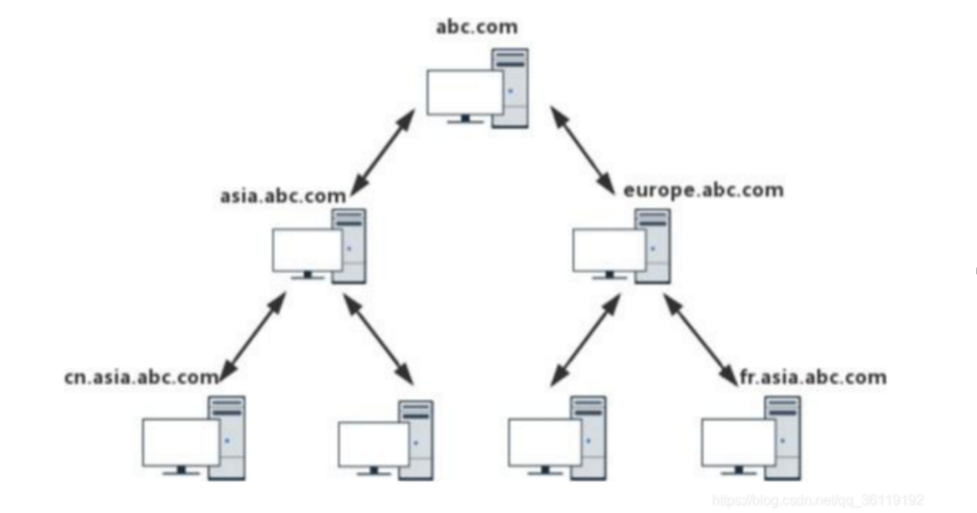
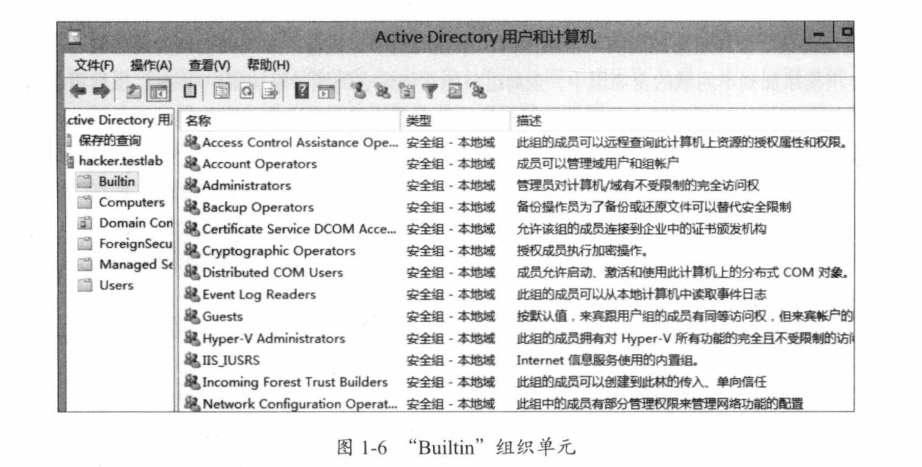
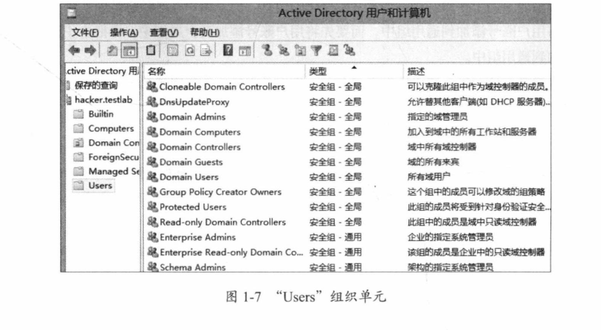
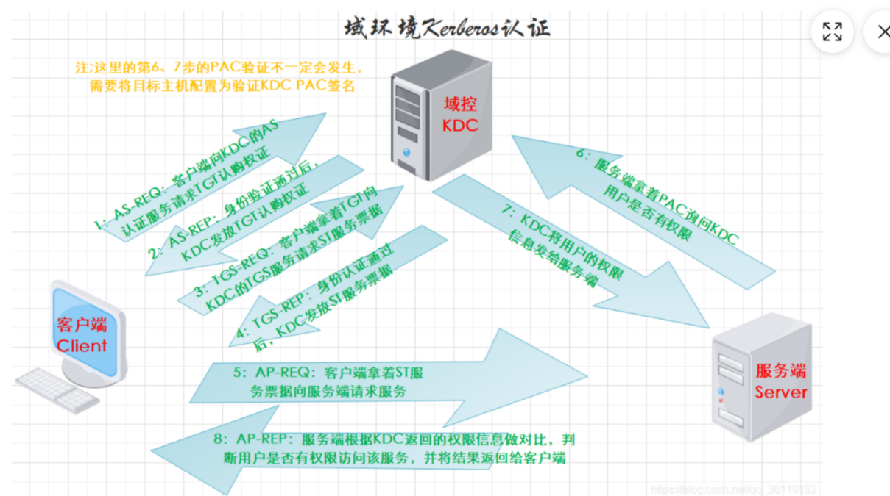
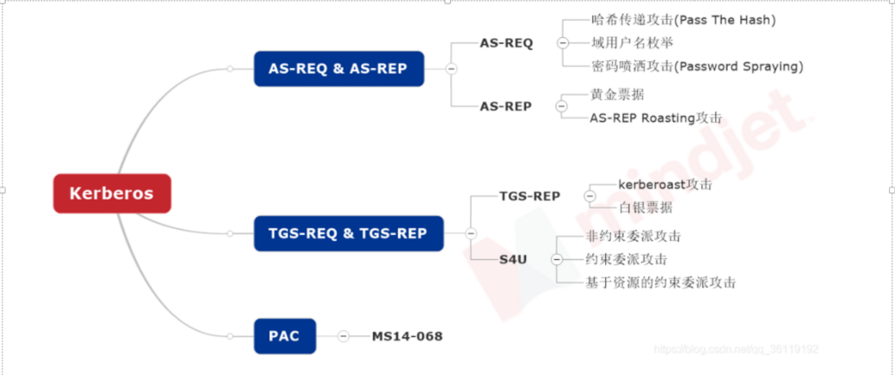
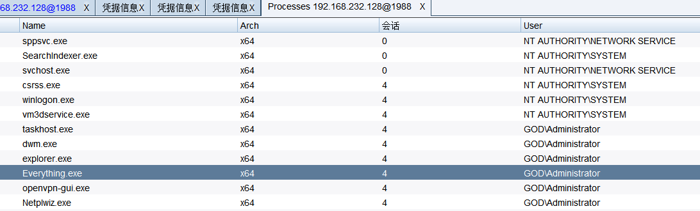

# 域渗透

> https://xie1997.blog.csdn.net/

- **域渗透目的**：获得域管理员账号，登录域控，进而控制域内所有主机，获得域内重要的信息
- “域名\用户名”是登入域，“主机名\用户名”是登入本地计算机

- **linux主机也可以加入域中**

## 什么是域

之前讲了什么是工作组，工作组因为缺乏集中管理与控制的机制，没有集中的统一帐户管理，没有对资源实施更加高效率的集中管理，没有实施工作站的有效配置和安全性严密控制，这一系列的缺点，所以大家都用域。

**描述：**

- 用来描述一种架构，和“工作组”相对应，由工作组升级而来的高级架构。
- **域 (Domain)是一个有安全边界的计算机集合（ 安全边界，意思是在两个域中，一个域中的用户无法访问另一个域中的资源）。**
- 可以简单的把域理解成升级版的“工作组”，相比工作组而言，它有一个更加严格的安全管理控制机制，如果你想访问域内的资源，就必须拥有一个合法的身份登陆到该域中,而你对该域内的资源拥有什么样的权限,还需要取决于你在该域中的用户身份。


**域的功能和特点：**

- 集中管理，可以集中地管理企业中成千上万分布于异地的计算机和用户
- 便捷的资源访问，能够很容易地定位到域中的资源。     用户依次登录就可以访问整个网络资源，集中地身份验证
- 可扩展性，既可以适用于几十台计算机的小规模网络，也可以用于跨国公司

**工作组和域的区别：**

- 工作组是对等网络，没有中心的概念，工作组上的所有主机都是对等的
- 域是B/S架构，集中管理，域控管理着整个域

### **域控DC(Domain Control)：**

-  在域架构中域控是用来管理所有客户端的服务器，它负责每一台联入的电脑和用户的验证工作，**域内电脑如果想互相访问首先都得经过它的审核**。域控是域架构的核心，每个域控制器上都包含了AD活动目录数据库。**一个域环境可以有多台域控，每一台域控的地位几乎是平等的**，他们各自存储着一份相同的活动目录数据库。当你在任何一台域控制器内添加一个用户账号或其他信息后，此信息默认会同步到其他域控的活动目录数据库中。多个域控的好处就是，当其中有域控出现故障了，仍然能够由其他域控来提供服务，除非所有域控都出现故障。**当域中的一台计算机安装了AD活动目录后，它就成了域控DC了**。域控制器在进行活动目录数据库复制时，分为两种复制模式：

	- **多主机复制模式**(Multi-master replication model)   ：活动目录数据库内的大部分数据是利用此模式进行复制的。在此模式下，你可以直接更新任何一台域控的活动目录对象，之后这个更新过的对象会被自动复制到其他域控制器。
	- **单主机复制模式** (Single-master replication      model)：活动目录数据库内的少部分数据是采用此模式进行复制的。在此模式下，当你提出修改对象数据的请求时，会由其中一台域控负责接收与处理此请求，也就是说该对象是先在该域控被更新，再由该域控复制给其他域控。
-  **只读域控制器**：

  - 只读域控制器(Read-Only      Domain Controller，RODC)的活**动目录数据库只可以被读取，不可以被修改**。也就是说用户或应用程序无法直接修改删除只读域控制器的活动目录数据库。RODC的活动目录数据库内容**只能够从其他可读写的域控复制过来**。除了账号密码外，RODC的活动目录数据库会存储域内所有对象与属性，因此在验证用户名密码时，仍然需要与总公司的域控来验证。**RODC主要是设计给远程分公司来使用的。**RODC可避免因活动目录数据库被破坏而影响到整个域环境。

### **活动目录AD(Active Directory)**：

- 活动目录AD是域环境中提供目录服务的组件。在活动目录中，所有的网络对象信息以一种结构化的数据存储方式来保存，使得管理员和用户能够轻松地查找和使用这些信息。活动目录以这种结构化的数据存储方式作为基础，对目录信息进行合乎逻辑的分层组织。
- 活动目录存储着有关网络对象（如用户、组、计算机、共享资源、打印机和联系人等）的信息。**目录服务是帮助用户快速准确从目录中查找到他所需要的信息的服务。**
- **安装有AD活动目录的服务器就是域控DC。**
- 如果将企业的内网看成是一本字典，那么内网里的资源就是字典的内容,活动目录就相当于字典的索引。即**活动目录存储的是网络中所有资源的快捷方式**，用户通过寻找快捷方式而定位资源。
- **在活动目录中记录的信息，被分为两大部分，一部分保存在活动目录数据库文件NTDS.dit 中**，另一部分保存在被复制的文件系统上。

**NTDS.dit：**

- 域用户帐户以域数据库的形式保存在活动目录中，**NTDS.dit是活动目录的数据库文件**，该文件记录的信息有以下三张表：
- Schema 表 ：这个表中包含了所有可在活动目录创建的对象信息以及他们之间的相互关系。包括各种类型对象的可选及不可选的各种属性。这个表是活动目录数据库中最小的一个表，但是也是最基础的一个表。 
- Link 表 ：Link表包含所有属性的关联，包括活动目录中所有对象的属性的值。一个用户对象的所有属性的类型，包括每个属性的值及用户所属于的组等信息都属于这个表。这个表要大于Schema 表，但与Data 表相比要小。 
- Data 表：活动目录中用户，组，应用程序特殊数据和其他的数据全部保存在Data表中。这是活动目录中存储信息最多的一个表，大量的活动目录的资料实际上还是存储在这个表中。

**Ntdsutil.exe：**

- ntdsutil.exe是域控制器自带的**域数据库管理工具**，从windows Server 2008开始就默认自带了。因此我们可以通过ntdsutil.exe提取出域中所有的域用户信息。
- 以下命令必须在域控上执行：

**逻辑结构：**

- 在活动目录中，管理员可以完全忽略被管理对象的具体地理位s置，而将这些对象按照一定的方式放置在不同的容器中。由于这种组织对象的做法不考虑被管理对象的具体地理位置，这种组织框架称为 “ 逻辑结构 ”。
- 活动目录的逻辑结构就包括上面讲到的 组织单元（ OU ）、域（ domain ）、域树（ tree ）、域森林（ forest ） 。**在域树内的所有域共享一个活动目录**，这个活动目录内的数据分散地存储在各个域内，且每一个域只存储该域内的数据。  **也就是目录包含了所有域资源的索引。**  

**活动目录的主要功能：**

- 帐号集中管理：**所有帐号均存在服务器上**，方便对帐号的重命名/重置密码。
- 软件集中管理：统一推送软件，统一安装网络打印机等。利用软件发布策略分发软件,可以让用户自由选择安装软件。
- 环境集中管理：利用AD可以统一客户端桌面，IE，TCP/IP等设置。
- 增强安全性：统一部署杀毒软件和扫毒任务，集中化管理用户的计算机权限、统一制订用户密码策略等，可监控网络，资料统一管理。
- 更可靠：更少的宕机时间。如：利用AD控制用户访问权限，利用群集、负载均衡等技术对文件服务器进行容灾设定，更可靠，宕机时间更少。
- 活动目录为Microsoft统一管理的基础平台，其它     ISA、Exchange、SMS 等服务都依赖于这个基础平台。
- uiltin容器：     Builtin容器是Active Driectory默认创建的第一个容器，主要用于保存域中本地安全组。
- Computers容器：     Computers容器是Active Driectory默认创建的第2个容器，用于存放Windows Server     2008域内所有成员计算机的计算机账号。
- Domain     Controllers容器： Domain Controllers是一个特殊的容器，主要用于保存当前域控制器下创建的所有子域和辅助域。
- Users容器：Users容器主要用于保存安装Active     Driectory时系统自动创建的用户和登录到当前域控制器的所有用户账户。

**DNS域名服务器：**

- **域控服务器要求DNS服务器按名称查找计算机、成员服务器和网络服务。**
- 域名解析： DNS服务器通过其A记录将域名解析成IP地址
- 定位活动目录服务：客户机通过DNS服务器上的SRV 服务记录定位提供某一个服务的计算机

- **一般情况下，我们在内网渗透时就通过寻找DNS服务器来定位域控制器，因为通常DNS服务器和域控制器会处在同一台机器上。**

- SRV服务记录是DNS服务器的数据库中支持的一种资源记录的类型，它记录了哪台计算机提供了哪个服务这么一个简单的信息。：

- 一般是为活动目录 AD设置的应用。DNS可以独立于活动目录，但是**活动目录必须有DNS的帮助才能工作**。为了活动目录能够正常的工作，DNS服务器必须支持服务定位（SRV）资源记录，资源记录把服务名字映射为提供服务的服务器名字。
  - 域主机和域控制器使用SRV资源记录决定域控制器的IP地址和提供服务的服务器IP地址

### 域结构

#### **单域：**

- 只有一个域，在一般的具有固定地理位置的小公司里，建立一个域就可以满足所需。

#### **域树**

- 指若干个域通过建立信任关系组成的集合。
- **一个域管理员只能管理本域的内部，不能访问或者管理其他的域**，二个域之间相互访问则需要建立 **信任关系 (Trust Relation)**。
- 

- 同一个域树中，**父域和子域会自动创建双向信任关系，并且信任关系可传递，但是子域之间不会建立双向信任关系**。所以也就是如下：abc.com     自动与 asia.abc.com 和 **europe.abc.com** 建立起了双向信任关系，**asia.abc.com** 和     cn.asia.abc.com以及 europe.abc.com 与 fr.asia.abc.com     自动建立起了双向信任关系。由于信任关系可以传递，所以cn.asia.abc.com和abc.com以及fr.asia.abc.com和abc.com都自动建立起了双向信任关系。**但是     asia.abc.com 和 europe.abc.com 之间并没有建立起信任关系。所以也就是 asia.abc.com 和     europe.abc.com 之间不能进行数据共享等操作。他们之间要想进行数据共享等操作，需要手动为他们之间建立信任关系。**

- **在域树内的所有域共享一个AD DS，也就是在此域树之下只有一个AD DS，不过其数据是分散存储在各个域中的，每一个域中只存储着属于该域的数据。**因此在域树中，因此**只要拥有任何一个域内的权限，那么就可以访问其他受信任域内的资源。**

- **建立域树的好处：**
  - 如果把不同地理位置的分公司放在同一个域内，那么他们之间信息交互（包括同步，复制等）所花费的时间会比较长，而且占用的带宽也比较大。（因为在同一个域内，信息交互的条目是很多的，而且不压缩；而在域和域之间，信息交互的条目相对较少，而且压缩。）
  - 还有一个好处，就是子公司可以通过自己的域来管理自己的资源。
  - 还有一种情况，就是出于安全策略的考虑，因为每个域都有自己独有的安全策略。比如一个公司的财务部门希望能使用特定的安全策略（包括帐号密码策略等），那么可以将财务部门做成一个子域来单独管理
  - 在一个域树中，父域可以包含很多子域，子域是相对父域来说的，指域名中的每一个段。子域只能使用父域作为域名的后缀，也就是说在一个域树中，域的名字是连续的。


#### **域林**

> 指若干个域树通过建立信任关系组成的集合。

- 由一个或多个没有形成连续名称空间的**域树组成**，**林中每个域树都有唯一的名称空间，之间不连续**。
- 可以通过**域树之间建立的信任关系来管理和使用整个域林中的资源**，从而又保持了原有域自身原有的特性。
- **同一个林中，林根域与其他树根域自动建立双向信任关系**.     信任关系可传递。因此，在林中，只要拥有其中一个域内的权限，就可以访问其他林中其他域的资源。

#### 域信任关系：

- 域之间的信任关系，相当于是不同域之间沟通的桥梁。域信任分为     单向信任 和 双向信任。单向信任只能是受信任域访问信任域，而信任域不能访问受信任域。双向信任是两个域可以互相访问。

- **父子信任：**父域与子域之间自动建立起了双向信任关系，并且信任关系可以传递。
- **树信任：**同一个林中，林根域与其他树根域自动建立双向信任关系。信任关系可传递。
- **快捷方式信任**：为了加速认证流程而产生的信任关系。需要管理员手工建立，信任关系可向下传递。
- **林信任：**在不更改AD结构的情况下，让不同林之间可以相互访问资源。信任关系可向下传递。
- **外部信任/ 跨林快捷方式信任：**类似于同林内的快捷方式信任. 单向, 信任关系不可传递：
- **领域信任：**为了让AD跟**非windows系统的kerberos**建立关系而存在的信任。

#### **域的总结**

- 其实可以把域和工作组联系起来理解，在工作组上你一切的设置比如在本机上进行各种策略，用户登录都是登录在本机的，密码是放在本机的数据库来验证的。
- 而如果你的计算机加入域的话，**各种策略是域控制器统一设定，用户名和密码也是放到域控制器去验证**，也就是说**你的账号密码(域用户)可以在同一个域的任何一台计算机登录。**
- 如果说工作组是“免费的旅店”，那么域（Domain）就是“星级的宾馆”；工作组可以随便出出进进，而域则需要严格控制。
- “域”的真正含义指的是服务器控制网络上的计算机能否加入计算机组合。一提到组合，势必需要严格的控制。所以实行严格的管理对网络安全是非常必要的。在对等网模式下，任何一台电脑只要接入网络，其他机器就都可以访问共享资源，如共享文件夹等。尽管对等网络上的共享文件可以加访问密码，但是非常容易被破解。
- **不过在“域”模式下，至少有一台服务器负责每一台联入网络的电脑和用户的验证工作，相当于一个单位的门卫一样，称为域控制器（Domain     Controller，简写为DC）。**
- **域控制器中包含了这个域内的账户、密码、域内的计算机等信息构成的数据库(AD)**。当电脑联入网络时，域控制器首先要鉴别这台电脑是否属于这个域，使用的登录账号是否存在、密码是否正确。如果以上信息有一样不正确，那么域控制器就会拒绝这个用户从这台电脑登录。不能登录，用户就不能访问服务器上有权限保护的资源，他只能以对等网用户的方式访问Windows共享出来的资源，这样就在一定程度上保护了网络上的资源。
- 要把一台电脑加入域，仅仅使它和服务器在网上邻居中能够相互“看”到是远远不够的，必须要由网络管理员进行相应的设置，把这台电脑加入到域中。这样才能实现文件的共享，集中统一，便于管理
- **在域控上，即使以域管理员的身份登录，也不能查看域成员的密码，可以给域成员重置密码，但是不能查看到域成员的密码。**

### 域中计算机的分类

- 域控
- 成员服务器
- 客户机
- 独立服务器：
    - 独立服务器和域没有关系。如果服务器既不加入域，也不安装活动目录，就称其为独立服务
        器。独立服务器可以创建工作组、与网络中的其他计算机共享资源，但不能使用活动目录提供的
        任何服务。
- 域控制器用于存放活动目录数据库，是域中必须要有的，而其他三种计算机则不是必须要有的。也就是说，最简单的域可以只包含一台计算机，这台计算机就是该域的域控制器。当然，域中各服务器的角色是可以改变的。例如，独立服务器既可以成为域控制器，也可以加入某个域，成为成员服务器。

### 域内权限解读

#### 1.域本地组

- 多域用户访问单域资源（访问同一个域），可以从任何域添加用户账号、通用组和全局组，但只能在其所在域内指派权限。
- 域本地组不能嵌套在其他组中。**域本地组主要用于授予本域内资源的访问权限。**

#### 2.全局组

- 单域用户访问多域资源（必须是同一个域中的用户），只能在创建该全局组的域中添加用户和全局组。可以在域森林的任何域内指派权限。全局组可以嵌套在其他组中。

- 可以将某个全局组添加到同一个域的另一个全局组中，或者添加到其他域的通用组和域本地组中(不能添加到不同域的全局组中，全局组只能在创建它的域中添加用户和组)。虽然可以通过

- 全局组授予用户访问任何域内资源的权限，但一般不直接用它来进行权限管理。

- **全局组和域本地组的关系，与域用户账号和本地账号的关系相似。域用户账号可以在全局使用，即在本域和其他关系的其他域中都可以使用，而本地账号只能在本机中使用。例如，将用户张三(域账号为Z3)添加到域本地组Administrators中，并不能使Z3对非DC的域成员计算机拥有任何特权，但若将Z3添加到全局组Domain Admins中，用户张三就成为域管理员了（可以在全局使用，对域成员计算机拥有特权）。**

### 3.通用组

- 通用组的成员来自域森林中任何域的用户账号、全局组和其他通用组，可以在该域森林的任何域中指派权限，可以嵌套在其他组中，非常适合在域森林内的跨域访问中使用。不过，**通用组的成员不是保存在各自的域控制器中的，而是保存在全局编录(GC)中的，任何变化都会导致全林复制。**
- 全局编录通常用于存储一些不经常发生变化的信息。由于用户账号信息是经常变化的，建议不要直接将用户账号添加到通用组中，而要先将用户账号添加到全局组中，再把这些相对稳定的全局组添加到通用组中。

可以这样简单地记忆：**域本地组创建自全林，作用于本域；全局组来自本域，作用于全林；通用组来自全林，作用于全林。**

### A-G-DL-P策略

A-G-DL-P策略是指将用户账号添加到全局组中，将全局组添加到域本地组中，然后为域本地
组分配资源权限。

- A表示用户账号(Account).
- G表示全局组(Global Group).
- U表示通用组(Universal Group)o
- DL表示域本地组(Domain Local Group)
- P表示资源权限(Permission,许可)。

按照A-G-DL-P策略对用户进行组织和管理是非常容易的。在A-G-DL-P策略形成以后，当需要给一个用户添加某个权限时，只要把这个用户添加到某个本地域组中就可以了。

在安装域控制器时，系统会自动生成一些组，称为内置组。内置组定义了一些常用的权限。通过将用户添加到内置组中，可以使用户获得相应的权限

Active Directory用户和计算机”控制台窗口的“Builtin”和“Users'”组织单元中的组就是内置组。

**内置的域本地组在“Builtin”组织单元中，内置的全局组和通用组在“Usrs”组织单元中。**





**几个重要的域本地组**

管理员组

- 管理员组(Administrators)的成员可以不受限制地存取计算机/域的资源。它不仅是最具权力的一个组，也是在活动目录和域控制器中默认具有管理员权限的组。该组的成员可以更改Enterprise Admins、Schema Admins和Domain Admins组的成员关系，是域森林中强大的服务管理组。

**几个重要的全剧组，通用组**

域用户组

- 域用户组(Domain Users)中是所有的域成员。在默认情况下，任何由我们建立的用户账号都属于Domain Users组，而任何由我们建立的计算机账号都属于Domain Computers组。因此，如果想让所有的账号都获得某种资源存取权限，可以将该权限指定给域用户组，或者让域用户组属于具有该权限的组。域用户组默认是内置域Uses组的成员。

域管理员组

- 域管理员组(Domain Admins)的成员在所有加入域的服务器（工作站）、域控制器和活动目录中均默认拥有完整的管理员权限。**因为该组会被添加到自己所在域的Administrators组中**，因此可以继承Administrators组的所有权限。同时，**该组默认会被添加到每台域成员计算机的本地Administrators组中，这样，Domain Admins组就获得了域中所有计算机的所有权**。如果希望某用户成为域系统管理员，建议将该用户添加到Domain Admins组中，而不要直接将该用户添加到Administrators组中。

## Kerberos协议

- 之前我们讲了windows本地认证的NTLM认证，本地工作组的Net-NTLM认证，现在讲域内的kerbos协议。


- kerberos是一种网络身份验证协议，**使用密钥加密**客户端、服务器端提供身份认证。
- **krbtgt用户**，是创建域时系统自动创建的一个账号（域控服务器的一个账号），其作用是密钥发行中心的服务账号，其密码是系统随机生成的，**无法正常登陆主机**。



- Kerberos协议有两个基础认证模块：**AS_REQ & AS_REP** 和 **TGS_REQ & TGS_REP** ，以及微软扩展的两个认证模块S4U 和 PAC 。
    - S4U是微软为了实现委派而扩展的模块，分为     S4U2Self 和 S4U2Proxy 。
    - 在Kerberos最初设计的流程里说明了如何证明客户端的真实身份，但是并没有说明客户端是否有权限访问该服务，因为在域中不同权限的用户能够访问的资源是不同的。所以微软为了解决权限这个问题，引入了 **PAC (Privilege Attribute Certificate，特权属性证书)** 的概念。
- Kerberos实际上是一种基于票据（Ticket）的认证方式。先要一张 **TGT认购权证**（Ticket Granting     Ticket)，再要 **ST服务票据(Service Ticker)**，**这样才能访问服务器端的某个服务**，**TGT认购权证** 和 **ST服务票据** 均由KDC(秘钥分发中心)发售，而 KDC     又是由域控担任，所以说 TGT 和 ST 均是由域控发放。

### AS-REQ & AS-REP协议分析：

- 可以利用wireshark抓包来学习

**如何获得TGT认购权证？**

- TGT 是 KDC 的 AS 认证服务（Authentication Service）发放的。也就是域控发放的。
- **AS-REQ：**
    - 当域内某个用户试图访问域中的某个服务，于是输入用户名和密码，本机的Kerberos服务会向KDC的AS认证服务发送一个AS-REQ认证请求。该请求包中包含： **请求的用户名**、**客户端主机名、加密类型** 和 **Authenticator(用户NTLM Hash加密的时间戳**) 以及一些其他信息。
- **AS-REP：**
    - 当KDC接收到请求之后，通过AD活动目录查询得到该用户的密码Hash，用该密码Hash对请求包的Authenticator进行解密，如果解密成功，则证明请求者提供的密码正确，**而且需要时间戳范围在五分钟内，且不是重放**，于是预认证成功。KAS成功认证对方的身份之后，发送响应包给客户端。
    - **响应包中主要包括**：krbtgt用户的NTLM Hash加密后的**TGT认购权证(即ticket这部分)** 和 用户NTLM Hash加密的Login Session key(即最外层 enc-part 这部分) 以及一些其他信息。
    - 该Login Session Key的作用是用于确保客户端和KDC下阶段之间通信安全。**最后TGT认购权证、加密的Login Session Key、时间戳 和     PAC等信息会发送给客户端。PAC中包含用户的SID，用户所在的组等一些信息。**
    - **注：**AS-REP中最核心的东西就是 Login session-key 和 加密的ticket。正常我们用工具生成的凭据是 .ccache 和 .kirbi     后缀的，用mimikatz，kekeo，rubeus生成的凭据是以 .kirbi 后缀的，impacket 生成的凭据的后缀是     .ccache 。两种票据主要包含的都是Login session-key 和 加密的 ticket，因此可以相互转化。

### TGS-REQ & TGS-REP：

- **如何获得ST服务票据？**
    - 经过上面的步骤，客户端获得了 TGT认购权证     和 Login Session Key。然后用自己的密码NTLM Hash解密Login Session Key得到 原始的Login Session Key。然后**它会在本地缓存此 TGT认购权证 和 原始的Login Session Key。**
    - 如果现在它需要访问某台服务器的某个服务，**它就需要凭借这张TGT认购凭证向KDC购买相应的入场券****ST服务票据（Service Ticket）。
    - ST服务票据是通过KDC的另一个服务 **TGS（Ticket Granting Service）**出售的。在这个阶段，微软引入了两个扩展自协议     S4u2self 和 S4u2Proxy(当委派的时候，才用的到，传送门：[约束性委派攻击抓包分析](https://xie1997.blog.csdn.net/article/details/104538160#约束性委派攻击抓包分析))。
- **TGS-REQ**：
    - 客户端向KDC购买针对指定服务的ST服务票据请求，该请求主要包含如下的内容：客户端信息、**Authenticator(Login Session Key加密的时间戳)**、**TGT认购权证**(padata下ap-req下的ticket) 和 **访问的服务名** 以及一些其他信息 。
- **TGS-REP**：
    - TGS接收到请求之后，首先会检查自身是否存在客户端所请求的服务。
    - 如果服务存在，则**通过 krbtgt 用户的NTLM Hash 解密TGT并得到Login Session Key**，**然后通过Login Session Key解密Authenticator**，如果解密成功，则验证了对方的真实身份，**同时还会验证时间戳是否在范围内**。并且还会检查TGT中的时间戳是否过期，且原始地址是否和TGT中保存的地址相同。
    - 在完成上述的检测后，如果验证通过，则TGS完成了对客户端的认证，会生成一个用Logon Session Key加密后的用于确保客户端-服务器之间通信安全的Service Session Key会话秘钥(也就是最外层enc-part部分)。并且会为该客户端生成ST服务票据。
    - ST服务票据主要包含两方面的内容：客户端用户信息 和 原始Service Session Key，**整个ST服务票据用该服务的NTLM Hash进行加密**。最终**Service Session Key** 和 **ST服务票据** 发送给客户端。这一步不管用户有没有访问服务的权限，只要TGT正确，就都会返回ST服务票据，这也是kerberoasting能利用的原因，任何一个用户，只要hash正确，就可以请求域内任何一个服务的ST票据，因为服务的认证在 后面的请求中判断。

### AP-REQ&AP-REP：

- **如何用ST服务票据双向认证，这时候和TGT票据就没有关系了**
- **AP-REQ**：
    - 客户端接收到TGS回复后，通过缓存的Logon   Session Key解密得到原始Service Session Key，同时它也拿到了ST(Service      Ticket)服务票据。该Serivce Session Key 和 ST服务票据 会被客户端缓存。客户端访问指定服务时，**将** **ST服务票据**和 **Authenticator(Service Session      Key加密的时间戳)** **发送给服务端。**

- **AP-REP**：
    - 服务端收到客户端发来的ST服务票据。但是，**服务端如何确保客户端发来的ST服务票据是通过TGS购买，而不是自己伪造的呢？**

    - **ST服务票据是通过该服务的NTLM   Hash进行加密的**。具体的操作过程是这样的，服务器在接收到请求之后，先通过该服务的NTLM     Hash哈希解密ST服务票据，并从中提取Service Session Key。然后通过提取出来的Service Session Key 解密     Authenticator，进而验证了客户端的真实身份。

    - **验证了客户端的身份后，服务端拿着PAC去询问KDC该用户是否有访问权限**。域控拿到PAC后解密，然后KDC通过SID判断用户的用户组信息，用户权限等，然后将结果返回给服务端，服务端再将此信息与用户请求的服务资源的ACL进行对比，最后决定是否给用户提供相关服务。
    - 为了解决客户端对服务器的验证，服务端需要用Service     Session Key加密时间戳作为Authenticator，发送给客户端。客户端再用缓存的Service Session     Key进行解密，如果解密成功，则可以证明自己正在访问的服务器和自己拥有相同的Service Session     Key。
    - 双向认证过后，开始了服务资源的访问（**有些服务并没有验证PAC这一步(需要将目标主机配置为验证KDC     PAC签名)，这也是白银票据能成功的前提。因为如果验证了PAC的话，就算攻击者拥有用户hash，可以制作ST票据，也不能制作PAC，所以也没有访问服务的权限**)
    - 需要说明的是，**PAC对于客户端和服务端全程都是不可见的，只有KDC能制作和查看PAC**。在PAC里包含有两个数字签名     PAC_SERVER_CHECKSUM 和 PAC_PRIVSVR_CHECKSUM，这两个数字签名分别由 服务器NTLM     Hash 和 KDC的NTLM Hash加密。


### 各协议攻击手段



#### AS-REQ：

- **哈希传递攻击获取黄金票据：**
    - 在AS-REQ阶段，**是用用户密码Hash加密的Authenticato**r，所以也就造成了**哈希传递攻击**，**用来获取TGT票据票据。**
-  **域内用户枚举/密码喷洒攻击**：<div id="密码喷洒" ></div>
    - 目的：爆破域内用户密码，用户枚举
    - 原理：
        - AS-REQ 的 cname 值，当用户不存在时，返回的数据包会提示错误，所以也就造成了 **域内用户枚举攻击** (当未获取到域用户权限时，可以使用这个方法枚举域内用户)。**并且当用户名存在，密码正确和错误时，返回包也不一样，所以可以进行用户名密码爆破**。
        - **返回包也不一样，所以可以进行用户名密码爆破**。会使用一种被称为 **密码喷洒（Password Spraying）**的攻击技术来进行测试和攻击。
        - 对密码进行喷洒式的攻击，这个叫法很形象，因为它属于自动化密码猜测的一种。这种针对所有用户的自动密码猜测通常是为了避免帐户被锁定，因为针对同一个用户的连续密码猜测会导致帐户被锁定。
        - 所以只有对所有用户同时执行特定的密码登录尝试，才能增加破解的概率，消除帐户被锁定的概率。
        - 普通的爆破就是用户名固定，爆破密码，但是**密码喷洒，是用固定的密码去跑用户名**
    - 攻击：
        - **域内用户枚举：**
            - 我们可以使用**Kerbrute工具**进行探测域内用户，
                - `kerbrute_windows_amd64.exe userenum --dc 192.168.10.24 -d xie.com user.txt`
            - 也可以使用python脚本**pyKerbrute**。pyKerbrute脚本相比于Kerbrute工具速度更快
                - ``python2 EnumADUser.py 192.168.10.24 xie.com user.txt udp`
                - `python2 EnumADUser.py 192.168.10.24 xie.com user.txt tcp`
        - **密码喷洒：**
            - 如使用python2编写的**ADPwdSpray.py**脚本，该脚本可以针对明文密码或者哈希进行喷洒，并且速度很快。
            - 还有exe工具kerbrute
            - 还有**powershell脚本工具DomainPasswordSpray**。默认情况下，该脚本利用LDAP从域中导出用户列表，然后扣掉被锁定的用户，再用固定密码进行密码喷洒。

#### AS-REP:

- **黄金票据（TGT认购权证）传递攻击：**
    - 目的：后渗透权限维持
    - 原理：
        - 在 AS-REP 阶段，由于返回的 TGT 认购权证是由 krbtgt 用户的密码Hash加密的，因此如果我们拥有 krbtgt 的 hash 就可以自己制作一个TGT认购权证，表明我们是任何一个用户，这就造成了黄金票据攻击
- [AS-REP Roasting攻击](https://xie1997.blog.csdn.net/article/details/105076459)
    - 目的
        - 获取用户的明文口令
    - 原理：
        - 在AS-REP阶段，最外层的 enc-part 是用用户密码 Hash 加密的。对于域用户，如果设置了选项” Do not require Kerberos preauthentication”，此时向域控制器的 88 端口发送 AS_REQ 请求，对收到的AS_REP内容(enc-part底下的ciper，因为这部分是使用用户 hash 加密的 Login Session Key，我们通过进行离线爆破就可以获得用户hash)重新组合，能够拼接成”Kerberos 5 AS-REP etype 23”(18200)的格式，接下来可以使用hashcat对其破解，最**终获得该用户的明文口令**，这就造成了 **AS-REP Roasting攻击**。

#### 在TGS-REP阶段:

- **Kerberoast攻击:**
    - 目的：
        - **爆破获得服务器用户的hash**
    - 原理：
        - 由于enc-part是用服务密码Hash加密的，所以我们**可以通过爆破获得服务的hash**，传送门：[域渗透之Kerberoast攻击](https://xie1997.blog.csdn.net/article/details/104049291)。
        - 这个问题存在的另外一个因素是因为用户向KDC发起TGS_REQ请求，不管用户对服务有没有访问权限，只要TGT正确，那么肯定会返回TGS。
        - 其实AS_REQ里面的服务就是krbtgt，也就是说这个同样可以用于爆破AS_REP里面的ticket部分的enc-part得到krbtgt的hash，但是之所以在网上没见到这种攻击方式是因为krbtgt的密码是随机生成的，爆破不出来。
- **白银票据传递攻击：**
    - 目的：后渗透权限维持
    - 原理：
        - 在TGS-REP阶段，TGS_REP里面的ticket的enc-part是使用服务的hash进行加密的，**如果我们拥有服务的hash，就可以给我们自己签发任意用户的TGS票据，这个票据也被称为白银票据。**相较于黄金票据，白银票据使用要访问服务的hash，而不是krbtgt的hash，由于生成的是TGS票据，不需要跟域控打交道，但是**白银票票据只能访问特定服务**。
        - 但是要注意的一点是，**伪造的白银票据没有带有有效KDC签名的PAC。如果将目标主机配置为验证KDC PAC签名，则银票将不起作用**。传送门：[白银票据(Silver Ticket)传递攻击](onenote:#票据传递攻击(Pass the Ticket,PtT)&section-id={B0A0B7EB-DB97-4DFD-83C4-6A3B5D1A7A01}&page-id={001C8483-4E9F-4276-9953-9F7ECA712E23}&end&base-path=https://d.docs.live.net/ad8ceb1c3ec7c2dd/OneNote/渗透/域渗透.one)

#### 在**AP-REQ阶段，PAC攻击。**

## 常用工具

linux下的一些工具

- WCE 这玩意给windows用，但是会被杀软杀
- minikatz 被杀软杀
- Responder
- DSHashes
- powerSploit 被杀软杀
- Nishang
- ps_encoder.py
- smbexec
- veil

windows下

- PowerSploit
- Nishagn
- Cain&Abel

## 搭建域环境

三台主机

- 域控
    - 设置一个内网ip，然后设置DNS指向本机ip，安装域控制器和DNS服务（设置根域名）。
    - 重启服务器，用域管理员HACKE\Administrator账户登陆。

- dmz区， 两个网卡，一个指向内网，一个指向外网。内网外网访问需要靠静态路由和默认路由设置。。
    - 设置一个内网ip，然后设置DNS为域控ip。该主机添加到域中，需要输入域管理的账号和密码。再设置一个外网网卡，dhcp就行，dns自动获取。

- 内网区，设置一个内网ip，然后设置DNS为域控ip

## 域渗透基础

**域渗透目的**：获得域管理员账号，登录域控，进而控制域内所有主机，获得域内重要的信息

**域渗透的思路**：先获取域内一台主机的权限，查看当前获取权限的用户是本地用户还是域用户。

- **本地用户：先提权，提权失败则内网渗透下一个主机**
    
    - **如果是本地用户**，则按非域环境渗透思路，**提升为administrator权限后**，则可以执行域命令。
    
        - ```cmd
            beacon> shell  whoami
            [*] Tasked beacon to run:  whoami
            [+] host called home, sent: 38 bytes
            [+] received output:
            nt authority\system
            
            
            beacon> shell net user /domain
            [*] Tasked beacon to run: net user /domain
            [+] host called home, sent: 47 bytes
            [+] received output:
            这项请求将在域 god.org 的域控制器处理。
            
            
            \\owa.god.org 的用户帐户
            
            -------------------------------------------------------------------------------
            Administrator            Guest                    krbtgt                   
            ligang                   liukaifeng01             
            命令运行完毕，但发生一个或多个错误
            ```
    
    - 如果提权失败，则想办法获取下一个主机权限，再查看是否是域用户或administrator权限。如此反复，最终需要能执行域命令，进行域渗透。
    
    - **或者可以进行域用户枚举，然后密码喷洒，就得到了一个域用户的密码账号了。**[密码喷洒](# 密码喷洒)
    
- **域用户：**直接进行各种域命令的查询，域内的横向渗透

### 查看当前用户权限

**“域名\用户名”是登入域，“主机名\用户名”是登入本地计算机 。**

**`whoami`**

- 获取一台主机的权限后，有如下两种情况。

- **本地用户是`主机名/用户名`，域内用户是`域名/用户名`**

- 本地用户：

    - 本地普通用户:

        - 当前为lambo主机的lambo用户。

        - ```
            C:\Users\lambo>whoami
            lambo\lambo
            ```

    - 本地管理员用户`lambo\administrator`

- 域内用户

    - 域内普通用户`god\liukaifeng01`
    - 域内管理员用户`god\administrator`

**在这三种情况中，如果当前内网中存在域，那么本地普通用户只能查询本机相关信息，不能查询域内信息**，

**而本地管理员用户和域内用户可以查询域内信息。**

- 其原理是：域内的所有查询都是通过域控制器实现的(基于LDAP协议)，而这个查询需要经过权限认证，所以，只有域用户才拥有这个权限；当域用户执行查询命令时，会自动使用Kerberos协议进行认证，无须额外输入账号和密码。
- 本地管理员Administrator权限可以直接提升为Ntauthority或System权限，因此，**在域中，除普通用户外，所有的机器都有一个机器用户(用户名是机器名加上“$”)。在本质上，机器的system用户对应的就是域里面的机器用户。所以，使用System权限可以运行域内的查询命令。**

### 域渗透常用名词

```
○ CN(Common Name) 通⽤名称：为⽤户名或服务器名，最⻓可以到80个字符，可以为中⽂。例如⼀个⽤户名为张三，那么张三就是⼀个CN，再如果⼀个计算机名为 Win7，那么Win7就是CN

○ OU(Organization Unit) 组织单元：最多可以有四级，每级最⻓32个字符，可以为中⽂

○ DC(Domain Component) 域组件，DC类似于DNS中的每个元素，例如 xie.com，⽤ . 分开的每个单元可以看成⼀个DC

○ GUID(Global Unique Identifier)：全局UID，系统会⾃动为每⼀个对象创建⼀个唯⼀的128位的GUID。虽然对象名称可以改变，但是其GUID永远不变

○ SN(Surname)：姓，如“许”

○ DN(Distinguished Name)：区分名是唯⼀的，Active Directory中的每个对象都有完全唯⼀的DN，DN 有三个属性，分别是 CN、OU、DC。DN可以表示为ldap的某个⽬录，也可以表示成⽬录中的某个对象，这个对象可以是⽤户、计算机等。

CN, OU, DC 都是 LDAP 连接服务器的端字符串中的区别名称（DN，distinguished  name），LDAP连接服务器的连接字串格式为：ldap://servername/DN 
如：【CN=Win2008,OU=Domain Controllers,DC=xie,DC=com】 这是⼀个DN,它是层次结构树,从右(根)向左(叶)。表示的是 xie.com域下的 Domain Controllers 组织单元下 的 win2008 对象。

○ RDN(Relative Distinguished Name)：他与⽬录结构⽆关，⽐如CN=Administrator,CN=Users,DC=xie,DC=com，他的RDN就是CN=Administrator

○ UPN(User Principal Name)：⽤户辨别名，如上⾯的administrator，它的UPN为：administrator@xie.com 。⽤户登录时最好输⼊UPN，因为⽆论此⽤户的账号被移动到哪⼀个域，其UPN都不会变化，因此⽤户可以⼀直⽤同⼀个UPN来登录

SPN(service Principal Name)：服务主体名称。
```

## 域用户下的信息收集

### 常见信息

查看下网卡信息，ipconfig 。systeminfo：得到域名。

```
net config workstation #查询该主机当前登录域及登录用户信息
net time /domain 	#查看时间服务器
net view /domain 	#查看有几个域
net view /domain:域名  查询域内所有计算机

net user /domain 	#查询域内用户 
net group "domain users" /domain #查看域用户
wmic useraccount get /all #查询域内用户的详细信息
net user xie /domain #查看指定域用户xie的详细信息

net group "domain admins" /domain	 #查看域管理员,该组内的成员对域控拥有完全控制权
net group "enterprise admins" /domain #查看企业管理组,该组内的成员对域控拥有完全控制权
net localgroup administrators 查看本机的管理员账户有哪些，也许当前机器上有域管理员
net view /domain:xxx #查看域内的特定主机信息

net group "domain controllers" /domain 	#查看域控的主机名      ping域名得到域控的ip
net group "domain computers" /domain 	#查看域内所有的主机
net view /domain:xxx #查看域内的特定主机信息

```

这样我们知道了域名，域内用户，域内主机，域控，域管理员，**域控的ip可以通过ping域名得到**。其他域主机ip通过扫描的到

```
net group /domain #查看域里面的组
net group "domain guest" /domain #查看域访客组,权限较低
nltest /domain_trusts #查看域信任信息
net accounts /domain #查询域密码策略，密码长度，错误锁定等
net time /domain #查看时间服务器
```

**whoami** **/user** **#查看用户SID和域SID，**

- 如用户的SID是：S-1-5-21-2189311154-2766837956-1982445477-520     则域SID则是去掉最后的520：S-1-5-21-2189311154-2766837956-1982445477

**以下命令只能在域控上查询**

- ```
    dsquery user #查询目录中的用户
    dsquery computer #查询目录中的主机
    dsquery group #查询目录中的组.
    dsquery ou #查询目录中的组织单元.
    dsquery site #查询目录中的站点
    dsquery server #查询域控
    dsquery contact #查询目录中的联系人
    dsquery subnet #查询目录中的子网
    dsquery quota #查询目录中的配额规定.
    dsquery partition #查询目录中的分区.
    dsquery * #用通用的LDAP查询来查找目录中的任何对
    dsquery server –domain xie.com | dsget server–dnsname –site #搜索域内域控制器的DNS主机名和站点名
    dsquery computer domainroot –name -xp –limit 10 #搜索域内以-xp结尾的机器10台
    dsquery user domainroot –name admin -limit #搜索域内以admin开头的用户10个
    ```

### **查询域控的机器名：**

在实际网络中，一个域内一般存在两台或两台以上的域控制器，其目的是：一旦主域控制器发生故障，备用的域控制器可以保证域内的服务和验证工作正常进行。

```
□ 方法一：net group "domain controllers" /domain      #这里查询结果后面会多一个 $
□ 方法二：nltest /DCLIST:xie.com
□ 方法三：net time /domain    在通常情况下，时间服务器为主域控制器。              
□ 方法四：nslookup -type=srv _ldap._tcp
□ 方法五：查看DNS服务器的地址，一般DNS服务器的IP就是域控的地址
□ 方法六：netdom query pdc #该命令只能在域控上执行
方法七：dsquery server  #该命令只能在域控上执行
```

### **定位域管理员和域用户：**

**目标：我们需要获取内网中特定用户或者机器的权限**

**域管理员定位概述**

- 在内网中，通常会部署大量的网络安全系统和设备，例如DS、PS、日志审计、安全网关、反病毒软件等。
- 在域网络攻击测试中，获取域内的一个支点后，需要获取域管理员权限。
- 在一个域中，当计算机加入域后，会默认给域管理员组赋予本地系统管理员权限。也就是说，当计算机被添加到域中，成为域的成员主机后，系统会自动将域管理员组添加到本地系统管理员。因此，域管理员组的成员均可以访问本地计算机，且具备完全控制权限。
- **定位域管理员的常规渠道，一是日志，二是会话。日志是指本地机器的管理员日志，可以使用脚本或 Wevtutil 工具导出查看。会话是指域内每台机器的登陆会话，可以使用netsess.exe,powerview等工具查询（可以匿名查询，不需要权限）**

**常用域管理员定位工具**

- 假设，我们已经取得了一个域用户的权限，我们想要域内横向移动，希望在域内横向移动，需要知道域内用户登录的位置（找到了主机位置，就拿下主机，这样就能拿到这个用户了）、他是否是任何系统的本地管理员、他所属的组、他是否有权访问文件共享等。枚举主机、用户和组，有助于更好地了解域的布局。


- 常用的域管理员定位工具有psloggedon.exe、PVEFindADUser.exe、netsess.exe,以及hunter、NetView等。在PowerShell中，常用的工具是PowerView

    - **Psloggedon.exe**

    - **PVEFindADUser.exe**

    - **netsess.exe：**

    - **PowerSploit的PowerView脚本**

    - **Nmap的NSE脚本**

    - **Empire的user_hunter模块**

### 查找域管理员进程

- 在渗透测试中，**一个典型的域权限提升过程，通常围绕着收集明文凭据或者通过mimikatz提权等方法，在获取了管理员权限的系统中寻找域管理员登录进程，进而收集域管理员的凭据。**

    - 


    - 直接在cs中inject就可以获得域管理员权限了。


- **如果域管理员登陆过这台机器，那么可以使用hashdump或者mimikatz，直接获得域管理员的hash密码或者明文密码**。然后远程登陆。
- 如果内网环境非常复杂，渗透测试人员无法立即在拥有权限的系统中获得域管理员进程，那么通常可以采用的方法是：**在跳板机之间跳转，直至获得域管理员权限，同时进行一些分析工作，进而找到渗透测试的路径。**


- 我们来看一种假设的情况：**渗透测试人员在某个内网环境中获得了一个域普通用户的权限，首先通过各种方法获得当前服务器的本地管理员权限，然后分析当前服务器的用户登录列表及会话信息，知道哪些用户登录了这台服务器。如果渗透测试人员通过分析发现，可以获取权限的登录用户都不是域管理员账户，同时没有域管理员组中的用户登录这台服务器，就可以使用另一个账户并寻找该账户在内网的哪台机器上具有管理权限，再枚举这台机器上的登录用户，然后继续进行渗透测试，直至找到一个可以获取域管理员权限的有效路径为止。在一个包含成千上万台计算机和众多用户的环境中，完成此过程可能需要几天甚至几周的时间。**

- 如果查找到域管理员进程，我们可以使用migrate命令迁移到该进程，这样，我们就获取到域管理员权限了。迁移到该进程后，我们可以执行以下命令创建用户，并将用户添加到域管理员组中

    ```cmd
    migrate pid
    #Shell下创建用户并添加到域管理员组中
    net user test2 root@123 /add /domain
    net group "domain admins" test2 /add /domain
    #meterpreter下创建用户并添加到域管理员组中,-h参数跟的是域控ip
    add_user test3 root@123 -h 192.168.10.131
    add_group_user "domain admins" test3 -h 192.168.10.131
    ```


- 

## **域内横向渗透：**

域内网横向渗透，除了**常规的横向渗透**外，还可以使用**域内独有的横向渗透方**法：

### MS14-068（提权漏洞，域用户-》域管理员）：

- 

### CVE-2019-1040 [NTLM Relay攻击](https://xie1997.blog.csdn.net/article/details/105135184)：

### CVE-2020-1472 zeroLogon(未授权控制域控)：

### [域渗透之Kerberoast攻击](https://blog.csdn.net/qq_36119192/article/details/104049291)

### [域渗透之委派攻击](https://blog.csdn.net/qq_36119192/article/details/104538160)

### [AS-REP      Roasting攻击](https://xie1997.blog.csdn.net/article/details/105076459)

### [Bypass      Applocker](https://xie1997.blog.csdn.net/article/details/104517225)

### Exchange的利用

- - [Exchange2domain](https://github.com/Ridter/Exchange2domain)
    - [CVE-2018-8581](https://github.com/WyAtu/CVE-2018-8581/)
    - [CVE-2019-1040](https://github.com/Ridter/CVE-2019-1040)
    - [CVE-2020-0688](https://github.com/Ridter/CVE-2020-0688)
    - [NtlmRelayToEWS](https://github.com/Arno0x/NtlmRelayToEWS)
    - [ewsManage](https://github.com/3gstudent/ewsManage)
    - [CVE-2021-26855](https://github.com/h4x0r-dz/CVE-2021-26855)
    - [CVE-2021-28482](https://gist.github.com/testanull/9ebbd6830f7a501e35e67f2fcaa57bda)

- 

## 拿到域管理员权限

### DNS记录的获取

- 在域渗透中，对域环境的信息搜集很关键，如果我们获得了域内管理员的权限，那么如何能够快速了解域内的网络架构呢？DNS记录无疑是一个很好的参考。
- 本文将要介绍在域渗透中，获得DNS管理员权限后，获取DNS记录的方法
    - 插件就行，调用的powershell脚本
- 会显示出域内的所有主机名和对应的ip，方便我们进行内网横向移动

### 远程连接域控

记得cs部署中继，ip选择内网ip

而在远程连接时，关于域管理员账号和administrator账号的一些区别，涉及到**LocalAccountTokenFilterPolicy**值。

#### `IPC$、ADMIN$、C$、D$`都是什么？

- ```
    NT2000在提供了 IPC$ 共享功能的同时，在初次安装系统时还打开了默认共享，即所有的逻辑共享(C$、D$、E$……)和系统⽬录共享(Admin$)。所有的这些初衷都是为了⽅便管理员的管理。但好的初衷并不⼀定有好的收效，⼀些别有⽤⼼者会利⽤IPC$，访问共享资源，导出⽤户列表并使⽤⼀些字典⼯具，进⾏密码探测。
    为了配合IPC共享⼯作，Windows操作系统（不包括Windows 98系列）在安装完成后，⾃动设置共享的⽬录为：C盘、D盘、E盘、ADMIN⽬录（C:\Windows）等，即为ADMIN$、C$、D$、E$等，但要注意，这些共享是隐藏的，只有管理员能够对他们进⾏远程操作。(怪不得连接需要管理员账号)。
    ```

- 输入 net share 可以查看开启的共享。所有的共享都依赖于139或445端口

    - ```
        net use                               	#查看本机建⽴的连接(本机连接其他机器)
        net session                           	#查看本机建⽴的连接(其他机器连接的本机)，需要administrator⽤户执⾏
        net share                           	  #查看本地开启的共享
        net share ipc$                        	#开启ipc$共享
        net share ipc$ /del                   	#删除ipc$共享
        net share admin$ /del                 	#删除admin$共享
        net share c$ /del                     	#删除C盘共享
        net share d$ /del                     	#删除D盘共享
        net use * /del                       	 #删除所有连接
        net use \\192.168.10.15                   	#与192.168.10.15建⽴ipc空连接
        net use \\192.168.10.15\ipc$              	#与192.168.10.15建⽴ipc空连接
        net use \\192.168.10.15\ipc$ /u:"" ""     	#与192.168.10.15建⽴ipc空连
        net view \\192.168.10.15                  	#查看远程主机开启的默认共享
        net use \\192.168.10.15 /u:"administrator" "root"   	#以administrator身份与192.168.10.15建⽴ipc连接
        net use \\192.168.10.15 /del              	#删除建⽴的ipc连接
        net time \\192.168.10.15                  	#查看该主机上的时间
        net use \\192.168.10.15\c$  /u:"administrator" "root"  	#建⽴C盘共享
        dir \\192.168.10.15\c$                  	#查看192.168.10.15C盘⽂件
        dir \\192.168.10.15\c$\user             	#查看192.168.10.15C盘⽂件下的user⽬录
        dir \\192.168.10.15\c$\user\test.exe    	#查看192.168.10.15C盘⽂件下的user⽬录下的test.exe⽂件
        net use \\192.168.10.15\c$  /del        	#删除该C盘共享连接
        net use k: \\192.168.10.15\c$  /u:"administrator" "root"  	#将⽬标C盘映射到本地K盘
        net use k: /del                                           	#删除该映射
        
        ```

- `IPC$:`

    - `IPC$` (Internet Process     Connection)     是共享“命名管道”的资源，它是为了让进程间通信⽽开放的命名管道，通过提供可信任的⽤户名和⼝令，连接双⽅可以建⽴安全的通道并以此通道进⾏加密数据的交换，从⽽实现对远程计算机的访问。
    - `IPC$`是NT2000的⼀项新功能，它有⼀个特点，即在同⼀时间内，两个IP之间只允许建⽴⼀个连接。

- `ADMIN$`共享

- - 共享 `ADMIN$` ，就是要把系统盘Windows文件夹目录（即系统根目录）共享出来

#### RDP远程连接：普通账号即可，但是动静大，容易被发现，不到万不得已最好不要远程连接。

#### `IPC$`远程连接：需管理员组内账号，对方主机需开启`IPC$`共享，连接成功后执行at、tasklist、schtasks等命令可获取权限。传送门：[`IPC$共享和其他共享(C$、D$、Admin$)`](https://blog.csdn.net/qq_36119192/article/details/83143354)

#### WMIC远程连接：需管理员组内账号，对方主机需开启admin$共享，传送门：[WMIC使用浅析](https://blog.csdn.net/qq_36119192/article/details/102984779)

#### smbexec远程连接：需管理员组内账号，对方主机需开启C$共享，传送门：[smbexec的使用(c$共享)](https://blog.csdn.net/qq_36119192/article/details/104147068)

#### WinRM远程连接：需管理员组内账号，对方主机需开启WinRM服务，传送门：[WinRM远程管理工具的使用](https://xie1997.blog.csdn.net/article/details/105122945)

#### DCOM远程连接：需管理员组内账号，传送门：[DCOM的使用](https://xie1997.blog.csdn.net/article/details/90707329)

#### 如果主机只开启了135端口，则可以使用：[使用135端口进行免杀横向移动(WMIHACKER)](https://xie1997.blog.csdn.net/article/details/107093842)

#### [哈希传递攻击(Pass-the-Hash,PtH)](onenote:#哈希传递攻击(Pass-the-Hash,PtH)：&section-id={B0A0B7EB-DB97-4DFD-83C4-6A3B5D1A7A01}&page-id={934B168D-3FED-4749-B109-8789D3B9F5A7}&end&base-path=https://d.docs.live.net/ad8ceb1c3ec7c2dd/OneNote/渗透/域渗透.one)：有密码hash但是不知道密码

#### **psexec远程连接**：需管理员组内账号密码或hash，对方主机需开启admin$共享，

- cs选择目标，右键psexec就行
- psexec 是 windows 下非常好的一款远程命令行工具。psexec的使用不需要对方主机开机3389端口，只需要对方开启admin$共享或 c$ (该共享默认开启，依赖于445端口)。但是，假如目标主机开启了防火墙(因为防火墙默认禁止445端口的连接)，psexec也是不能使用的，会提示找不到网络路径。由于psexec是windows提供的工具，所以杀毒软件会将其添加到白名单中。

## 拿到域控，域控信息收集

```
dsquery computer domainroot -limit 65535 && net group "domain computers" /domain ------> 列出该域内所有机器名 
dsquery user domainroot -limit 65535 && net user /domain------>列出该域内所有用户名 
dsquery subnet ------>列出该域内网段划分 
dsquery group && net group /domain ------>列出该域内分组 
dsquery ou ------>列出该域内组织单位 
dsquery server && net time /domain------>列出该域内域控制器 
```

**NTDS.dit**：当我们获取到域内管理员的权限后，我们肯定会想办法导出域内所有的信息，而这所有的信息都保存在域控的NTDS.dit文件中。

- 有关于如何导出域控的NTDS.dit文件：[导出域控的ntds.dit文件](https://blog.csdn.net/qq_36119192/article/details/104224851)
- 关于如何从导出的NTDS.dit文件中恢复数据：[导出NTDS.dit中的散列值](https://blog.csdn.net/qq_36119192/article/details/104227572)
- 有关于如何直接导出域用户散列值：[获取域用户散列值](https://blog.csdn.net/qq_36119192/article/details/104227872)

## **域控权限维持持久化。**

- [域控权限持久化之票据传递攻击(Pass the Ticket,PtT)](onenote:#票据传递攻击(Pass the Ticket,PtT)&section-id={B0A0B7EB-DB97-4DFD-83C4-6A3B5D1A7A01}&page-id={001C8483-4E9F-4276-9953-9F7ECA712E23}&end&base-path=https://d.docs.live.net/ad8ceb1c3ec7c2dd/OneNote/渗透/域渗透.one)。拿到krbtgt用户的hash，然后黄金票据攻击模拟管理员身份。
- [域控权限持久化之SID      History域后门](https://blog.csdn.net/qq_36119192/article/details/104372241)
- [域控权限持久化之Skeleton      Key(万能密码)](https://blog.csdn.net/qq_36119192/article/details/104375915)：
- [域控权限持久化之DSRM后门](https://blog.csdn.net/qq_36119192/article/details/104371122)
- [域控权限持久化之SSP安全服务提供](https://blog.csdn.net/qq_36119192/article/details/104375536)
- [域控权限持久化之Hook      PasswordChangeNotify](https://blog.csdn.net/qq_36119192/article/details/104376177)
- [利用委派打造隐蔽后门(权限维持)](https://xie1997.blog.csdn.net/article/details/105184905)

## 域内各种攻击手法

### 域传送漏洞检查

