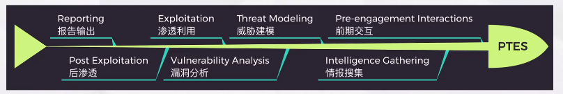
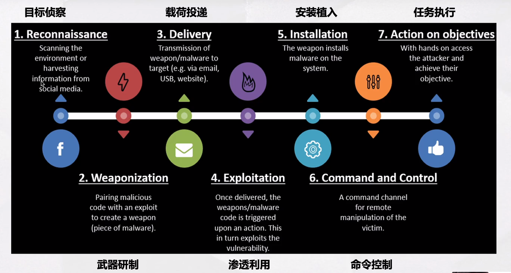
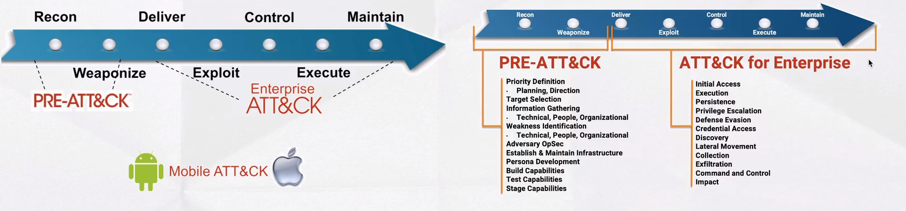
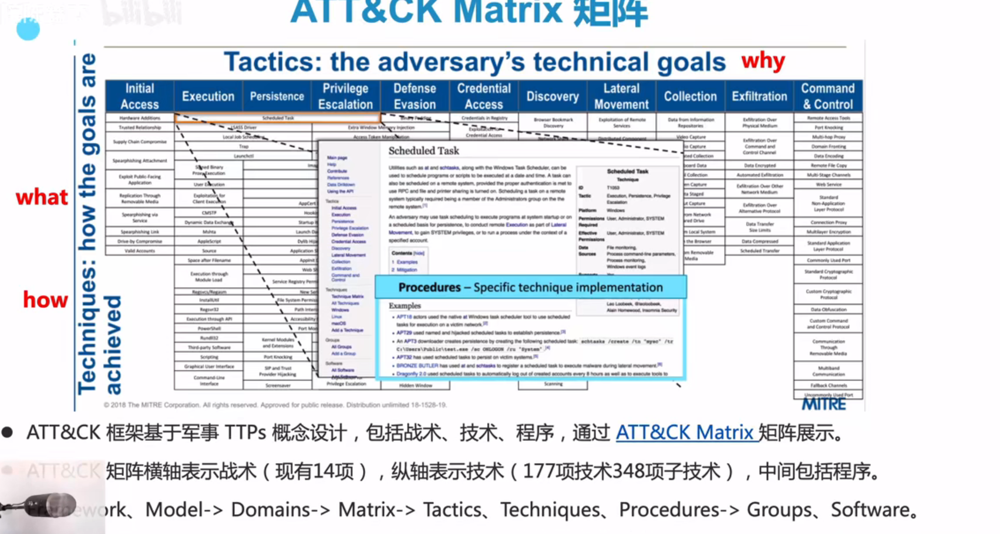
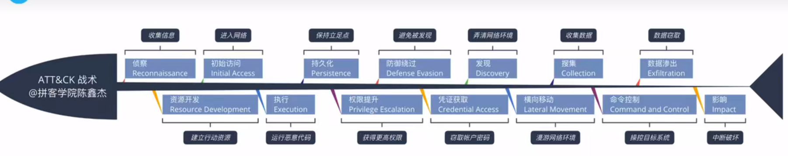
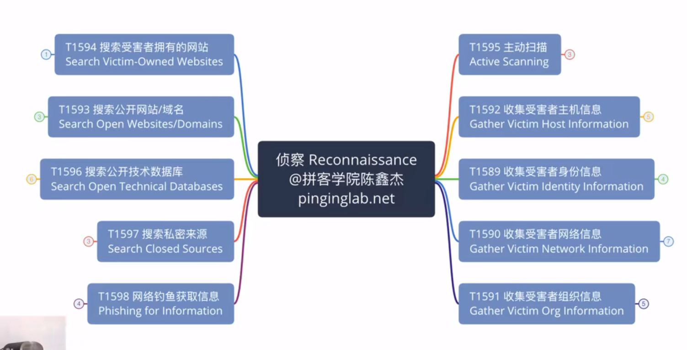
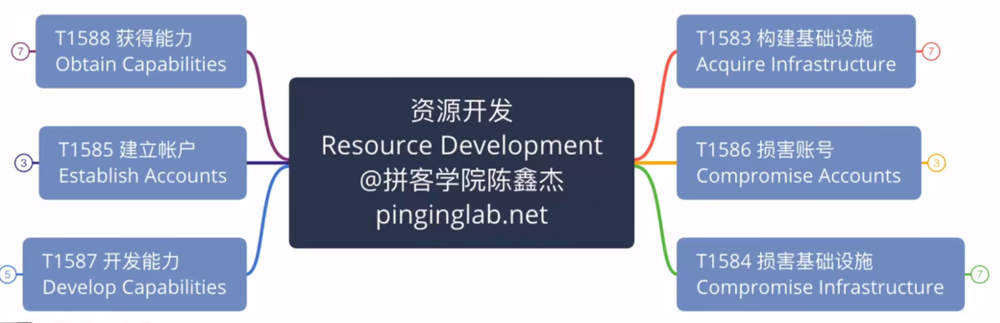
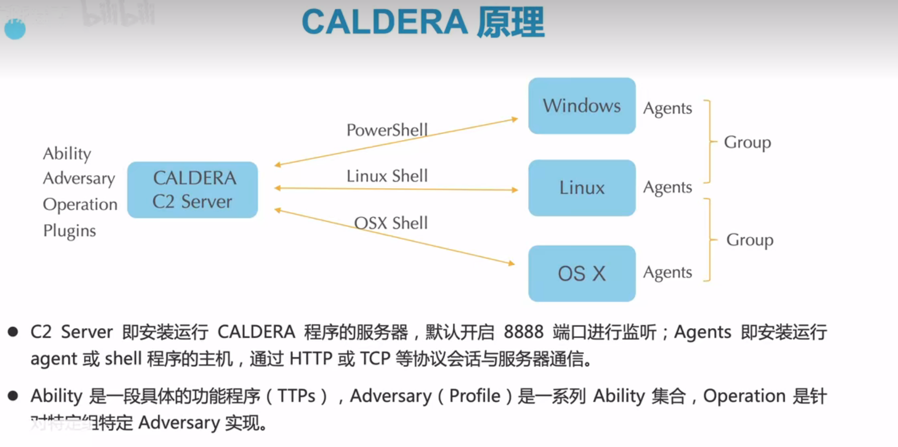

# ATT&CK

>  PETS（渗透测试标准），Cyber Kill Chain（CKC），ATT&CK
>
>  https://www.bilibili.com/video/BV1EV41117UJ/?spm_id_from=333.788&vd_source=5d8958f80a4e6a91969b8e49f99ace0d

PTES(Penetration Testing Execution Standard)

​	

- 即渗透测试执行标准，于2010年由业界安全技术专家共同发起，目标是为企业组织和安全服务商设计并制定渗透测试工作的通用描述准则
- 包括前期交互、情报搜集、威胁建模、漏洞分析、渗透利用、后渗透、报告输出7个标准动作。

Cyber Kill Chain网络杀伤链

## **ATT&CK（未来的趋势）**

> https://attack.mitre.org/

- MITRE起源于二战时期的MIT计算机实验室，成立于1958年，是一家非营利性公共服务机构，为美国联邦政府提供工程和技术指导，包括国防情报、国土安全、网络安全、航空航天等。
- MITRE通过政府资助运营着多个FFRDC（联邦资助研发中心），于2014年开始运营美国国家技术标准研究院(NIST)下面的国家网络安全中心NFC.
- ATT&CK来源于MITRE研究项目FMX(2010年)；CVE则由MITRE联合创始人David E.Mannand Steven M.Christey于l999年提出：《Towards a Common Enumeration of Vulnerabilities,》

ATT&CK(Adversarial Tactics,Techniques,and Common Knowledge),

- 是由MITRE公司2013年提出的「对抗战术、技术和常识」框架，基于真实世界的攻防数据来描述和分类对抗行为目的是为红队、蓝队、厂商、企业等不同组织构建一套通用语言，提供更细粒度、更易共享的战术、技术、流程、文档、工具等资源。

## 战术

- ATT&CK战术有14个，包括侦察、资源开发、初始访问、执行、持久化、权限提升、防御绕过、凭证获取、发现、横向移动、搜集、命令控制、数据渗出、影响。战术仅为作战行动提供目标纲领，具体行动由战术中的技术与子技术实现。
- **作战行动不要求使用所有战术，战术也没有前后顺序，战术的数量和顺序由使用者自行决定。**

### Reconnaissance（侦察）

### 资源开发

### 初始访问

## att&ck mitigations缓解措施

## ATT&CK GROUPS组织

ATT&CK缓解措施当前有42项，包括防病毒、审计、代码签名、漏洞扫描、应用程序隔离和沙箱、漏洞利用防护、网络入侵防护、威胁情报计划、软件更新、操作系统配置、加密敏感信息、多因素认证等。
每一项技术和子技术，会有相对应的缓解措施，帮助防御者提高安全防护能力。

## CALDERA

> https://github.com/mitre/caldera
>
> https://caldera.readthedocs.io/en/latest/

CALDERA是MITER官方基于ATT&CK推出的网络安全红蓝对抗实战框架，可用于自动化红队行动、手工红队行动、蓝队自动化应急响应。对ATT&CK理论框架相对应。中文直译“破火山口”。

### 安装教程

> https://blog.51cto.com/u_12125360/5397112 linux环境安装
>
> pip安装这个库recommonmark

ATT&CK矩阵分为Enterprise ，Mobile，ICS三个技术域。

### 功能

#### agents

和cs的bean一样

#### Adversaries/profiles/abilities

#### operations

### 插件

### Stockpile实习初始化访问

Stockpile库存插件描述了CALDERA框架当前所集成的能力数、配置脚本数等。

就是一个简单的展现功能，没法自定义。

### compass 指南针

攻防分析之类的，着色。

### Acess

Access访问插件可以实现在数据库中以任何能力向任何代理分配任务，还可以进行初始访问攻击。

### GameBoard 游戏榜

GameBoard游戏榜插件用于在演习中监控红队和蓝队的作战情况，看看蓝队是否能发现、回应和关闭红队对手。

蓝队也是给个agent，然后通过agent执行战术，比如做应急响应。

