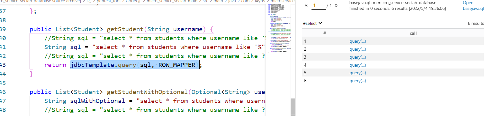

# codeql

> https://codeql.github.com/docs/index.html 官方文档

## 1. CODEQL基础

### 1.1 什么是CODEQL

- 参考资料：

  - https://www.freebuf.com/articles/web/283795.html
  - https://github.com/safe6Sec/CodeqlNote
- 最早期，安全人员会通过人工审计的方式来审计项目代码，查找危险函数，并跟进危险函数的参数是否可控，如果可控，说明存在安全漏洞。
- 但是随着项目数量的增加，以上的纯靠人工的方式很难实现所有项目漏洞的覆盖测试。所以出现了一些辅助人工审计的工具，比如前几年比较火的rips，cobra，通过这些工具，可以把危险函数代码代码检索出来，再通过人工审计来判断是否存在安全漏洞。
- 上面的方式主要还是需要人来判断，工作量还是很大，并且非常依赖安全工程师的个人能力。但是近些年出现了不少优秀的**自动化代码安全审计**产品，比如非常有名的**Checkmarx，Fortify SCA**。这些软件可以自动化的帮我们审计出安全漏洞，大大减少了人工工作量，并加快了安全审计速度。但是这些软件都是商业的，价格比较贵，一般企业可能没有这么多预算购买。
- 与此同时，Github为了解决其托管的海量项目的安全性问题，收购了CodeQL的创业公司，并宣布开源CodeQL的规则部分（通过编写规则来自动化找寻漏洞），这样全世界的安全工程师就可以贡献高效的QL审计规则给Github，帮助它解决托管项目的安全问题。
- 对于安全工程师，也就多了一个非商业的开源代码自动化审计工具。
- codeql支持的语言和框架

  - | Language                                                                                                | Variants                                                                                                                                                  | Compilers                                                                                                                                                                                                                                                                                                                        | Extensions                                                                                                                                                                                                                                           |
    | :------------------------------------------------------------------------------------------------------ | :-------------------------------------------------------------------------------------------------------------------------------------------------------- | :------------------------------------------------------------------------------------------------------------------------------------------------------------------------------------------------------------------------------------------------------------------------------------------------------------------------------- | :--------------------------------------------------------------------------------------------------------------------------------------------------------------------------------------------------------------------------------------------------- |
    | C/C++                                                                                                   | C89, C99, C11, C18, C++98, C++03, C++11, C++14, C++17, C++20 [[1\]](https://codeql.github.com/docs/codeql-overview/supported-languages-and-frameworks/#id10) | Clang (and clang-cl [[2\]](https://codeql.github.com/docs/codeql-overview/supported-languages-and-frameworks/#id11)) extensions (up to Clang 12.0),GNU extensions (up to GCC 11.1),Microsoft extensions (up to VS 2019),Arm Compiler 5 [[3\]](https://codeql.github.com/docs/codeql-overview/supported-languages-and-frameworks/#id12) | `.cpp`, , , , , , , , , `.c++``.cxx``.hpp``.hh``.h++``.hxx``.c``.cc``.h`                                                                                                                                                                         |
    | C#                                                                                                      | C# up to 10.0                                                                                                                                             | Microsoft Visual Studio up to 2019 with .NET up to 4.8,.NET Core up to 3.1.NET 5, .NET 6                                                                                                                                                                                                                                         | `.sln`, , , , `.csproj``.cs``.cshtml``.xaml`                                                                                                                                                                                                     |
    | Go (aka Golang)                                                                                         | Go up to 1.18                                                                                                                                             | Go 1.11 or more recent                                                                                                                                                                                                                                                                                                           | `.go`                                                                                                                                                                                                                                              |
    | Java                                                                                                    | Java 7 to 18 [[4\]](https://codeql.github.com/docs/codeql-overview/supported-languages-and-frameworks/#id13)                                                 | javac (OpenJDK and Oracle JDK),Eclipse compiler for Java (ECJ) [[5\]](https://codeql.github.com/docs/codeql-overview/supported-languages-and-frameworks/#id14)                                                                                                                                                                      | `.java`                                                                                                                                                                                                                                            |
    | JavaScript                                                                                              | ECMAScript 2022 or lower                                                                                                                                  | Not applicable                                                                                                                                                                                                                                                                                                                   | `.js`, , , , , , , , , , , , , , , , , [[6\]](https://codeql.github.com/docs/codeql-overview/supported-languages-and-frameworks/#id15) `.jsx``.mjs``.es``.es6``.htm``.html``.xhtm``.xhtml``.vue``.hbs``.ejs``.njk``.json``.yaml``.yml``.raml``.xml` |
    | Python                                                                                                  | 2.7, 3.5, 3.6, 3.7, 3.8, 3.9, 3.10                                                                                                                        | Not applicable                                                                                                                                                                                                                                                                                                                   | `.py`                                                                                                                                                                                                                                              |
    | Ruby [[7\]](https://codeql.github.com/docs/codeql-overview/supported-languages-and-frameworks/#id16)       | up to 3.0.2                                                                                                                                               | Not applicable                                                                                                                                                                                                                                                                                                                   | `.rb`, , , `.erb``.gemspec``Gemfile`                                                                                                                                                                                                             |
    | TypeScript [[8\]](https://codeql.github.com/docs/codeql-overview/supported-languages-and-frameworks/#id17) | 2.6-4.7                                                                                                                                                   | Standard TypeScript compiler                                                                                                                                                                                                                                                                                                     | `.ts`, ,                                                                                                                                                                                                                                           |

### 1.2 CodeQL安装

- java基本环境：

  - jdk
  - maven
- CodeQL本身包含两部分**解析引擎**+`SDK`。

  - 解析引擎用来解析我们编写的规则，虽然不开源，但是我们可以直接在官网下载二进制文件直接使用[exe下载](https://github.com/github/codeql-cli-binaries).
  - `SDK`完全开源，里面包含大部分现成的漏洞规则，我们也可以利用其编写自定义规则（放在在ql文件夹里面）。
    - 下载[vscode-codeql-starter](https://github.com/github/vscode-codeql-starter)，里面包含了各个语言的一些ql文件（该ql文件所用的语言和sql很像），添加到vscode工作区。
  - 下载vscode的Codeql插件
    - 
  - 
- 下载exe文件并且手动配置好path之后使得可以通过cmd访问，然后在vscode的配置文件配置好下载的codeql目录下codeql文件的绝对路径。

  - 
- 生成Database：由于 `CodeQL`的处理对象并不是源码本身，而是中间生成的AST结构数据库，所以我们先需要把我们的项目源码转换成 `CodeQL`能够识别的 `CodeDatabases`。
- **【注意】项目的路径不能含有非英文字符，比如中文**

  ```shell
  codeql database create 要创建的database的文件路径 --language="该项目使用的语言" --command="在项目转换执行，该项目要执行的一些命令" (因为Java是编译语言，所以需要使用–command命令先对项目进行编译，再进行转换，python和php这样的脚本语言不需要此命令)  --source-root="项目源码存在的路径" --threads=8
  
  codeql database create ~/CodeQL/databases/micro-service-seclab-database  --language="java"  --command="mvn clean install --file pom.xml" --source-root=~/CodeQL/micro-service-seclab/ --overwrite
  
   跳过测试，构建
   --command="mvn clean install --file pom.xml -Dmaven.test.skip=true"
   无论项目结果如何,构建从不失败
   --command="mvn -fn clean install --file pom.xml -Dmaven.test.skip=true"
  ```

  ```xml
  (base) PS D:\pentest_tool\CodeQL> codeql database create ./databases/java-sec-code-database  --language="java"  --command="mvn clean install --file pom.xml" --source-root="D:/JAVA/code/java-sec-code/"
  Initializing database at D:\pentest_tool\CodeQL\databases\java-sec-code-database.
  Running build command: [mvn, clean, install, --file, pom.xml]
  [2022-05-03 11:08:30] [build-stdout] [INFO] Scanning for projects...
  [2022-05-03 11:08:30] [build-stdout] [INFO]
  [2022-05-03 11:08:30] [build-stdout] [INFO] -------------------------< sec:java-sec-code >--------------------------
  [2022-05-03 11:08:30] [build-stdout] [INFO] Building java-sec-code 1.0.0
  [2022-05-03 11:08:30] [build-stdout] [INFO] --------------------------------[ jar ]---------------------------------
  [2022-05-03 11:08:31] [build-stdout] [INFO]
  [2022-05-03 11:08:31] [build-stdout] [INFO] --- maven-clean-plugin:2.6.1:clean (default-clean) @ java-sec-code ---
  -------------------------------------
  ---------------------------------------
  [2022-05-03 11:10:09] [build-stdout] [INFO] BUILD SUCCESS
  [2022-05-03 11:10:09] [build-stdout] [INFO] ------------------------------------------------------------------------
  [2022-05-03 11:10:09] [build-stdout] [INFO] Total time:  01:38 min
  [2022-05-03 11:10:09] [build-stdout] [INFO] Finished at: 2022-05-03T11:10:09+08:00
  [2022-05-03 11:10:09] [build-stdout] [INFO] ------------------------------------------------------------------------
  Finalizing database at D:\pentest_tool\CodeQL\databases\java-sec-code-database.
  [2022-05-03 11:10:11] [build-stderr] Scanning for files in D:\JAVA\code\java-sec-code...
  [2022-05-03 11:10:11] [build-stderr] D:\pentest_tool\CodeQL\databases\java-sec-code-database: Indexing files in in D:\JAVA\code\java-sec-code...
  [2022-05-03 11:10:11] [build-stderr] Running command in D:\JAVA\code\java-sec-code: [D:\pentest_tool\CodeQL\codeql\xml\tools\index-files.cmd, D:\pentest_tool\CodeQL\databases\java-sec-code-database\working\files-to-index10916644967724678685.list]
  Successfully created database at D:\pentest_tool\CodeQL\databases\java-sec-code-database.
  ```

  可以看到databases已经转换好了

  

  ```
  - log/                # 输出的日志信息
  - db-java/            # 编译的数据库
  - result/             #codeql的查询结果
  - src.zip             # 编译所对应的目标源码
  - codeql-database.yml # 数据库相关配置
  ```
- 添加一个databases库，我们需要对某个框架进行代码审计，这个库可以手动建立，或者从lgtm网站下载（这时候只要传入lgtm上对应框架的url就行）。

  - 

    - 将我们刚刚转换好的库导入。然后我们项目就会出现在工作区。

      
    - 把我们下载的vscode-codeql-starter文件夹导入到工作区当中
    - 

### 1.3 编写简单ql，测试helloworld。

- 在ql文件夹的对应语言的ql文件夹的examples文件夹添加一个demo.ql文件。
- 
- 然后右键 `run Query`，就会像sql语言一样返回我们的数据了。

  - 
- 教程用的是[micro_service_seclab](https://github.com/l4yn3/micro_service_seclab/) 靶场项目，那么我们也使用这个靶场，创建databases是和之前操作一样。

  - 直接创建databases的时候发现报错。

    ```java
    [2022-05-03 11:58:50] [build-stdout] [ERROR] Failed to execute goal org.apache.maven.plugins:maven-surefire-plugin:2.22.2:test (default-test) on project micro-service-seclab: There are test failures.
    [2022-05-03 11:58:50] [build-stdout] [ERROR]
    [2022-05-03 11:58:50] [build-stdout] [ERROR] Please refer to D:\pentest_tool\CodeQL\micro_service_seclab-main\target\surefire-reports for the individual test results.
    [2022-05-03 11:58:50] [build-stdout] [ERROR] Please refer to dump files (if any exist) [date].dump, [date]-jvmRun[N].dump and [date].dumpstream.
    ```
  - 解决方法：
    这是因为测试代码时遇到错误，它会停止编译。只需要在 pom.xml的 `<project>`里添加以下配置，使得测试出错不影响项目的编译。

    ```xml
    <build>
        <plugins>
            <plugin>   
                <groupId>org.apache.maven.plugins</groupId>
                <artifactId>maven-surefire-plugin</artifactId>
                <configuration>
                    <testFailureIgnore>true</testFailureIgnore>
                </configuration>
            </plugin>
        </plugins>
    </build>
    ```

    去修改源项目的pom.xml配置文件。

我们既可以通过vscode来使用codeql，也可以通过命令行来使用。vscode适合精细化的查找，命令行适合项目扫描

### 1.4  目录分析

**codeql java规则目录**

一些官方规则，可直接用。

```shell
vasoce-codeql-starter
	codeql-custom-queries-java codeql的一些语法规则

    ql
        -java  #和java有关的codeql

            --ql
            	---docs	codeql官方对codeql格式要求文档等

                ---src  

                    ----Security(正式运行的规则) //官方的规则，直接拿来用。

                    ----experimental(还在实验中的规则)//官方的规则，直接拿来用。

                ---lib

                    ----semmle  

                    	-----code  

                    		------java(这个下面都是框架相关的内容)
                --examples 一些codeql的代码示例，比如提取method的ql应该怎么写。
       	-misc
       		- bazel
       		- scripts
       		- suite-helps
       			- security-extended-selectors.yml
```

### 1.5 Codeql文件后缀词汇表

`.bqrs`文件

- A binary query result set (BQRS) file（二进制查询结果集），BQRS 是查询原始结果的二进制表示形式，保存了查询结果和相对于源码的关系。该文件可以转换成SARIF文件

.dil文件

- DIL 代表 Datalog 中介语言。它是 QL 和关系代数 （RA） 之间的中间表示形式，在查询编译期间生成。DIL 对于高级用户非常有用，可帮助调试查询性能。DIL 格式可能会在 CLI 版本之间更改，而不会发出警告。`--dump-dilcodeql `

SARIF 文件

- 静态分析结果交换格式 （SARIF） 是用于共享静态分析结果的输出格式

ql pack：

- QL 包用于组织 CodeQL 分析中使用的文件。它们包含查询、库文件、查询套件和重要的元数据。
- QL 包必须包含 `qlpack.yml`
  在其根目录中调用的文件。包内的其他文件和目录应按逻辑组织。
- QL包就相当于别人写好了的，整合在一起了的，我们不需要再添加任何文件就直接使用的包。

qls文件：

- 查询套件，查询套件允许您将多个查询传递给 CodeQL，而无需单独指定每个查询文件的路径。就是一套查询集合。
- ##### qls语法

  `query`
  ：指定ql文件路径，可以指定多个

  `queries`
  ：指定ql文件的目录，会递归目录下所有ql文件

  `from`
  ：如果需要引入不同qlpack的ql文件，则需要指定qlpack名

  `description`
  ：查询套件的描述

## 2 CodeQL基本语法

> https://codeql.github.com/docs/ql-language-reference/ 官方文档  官方文档是最棒的。
>
> https://github.com/SummerSec/learning-codeql

- code引擎帮我们将框架代码转换成Codeql的能识别的中间层数据库。然后我们需要编写QL查询语句来获取我们想要的数据。

  - 
  - 正如这张图描述的，由于CodeQL开源了所有的规则和规则库部分，所以我们能够做的就是编写符合我们业务逻辑的QL规则，然后使用CodeQL引擎去跑我们的规则，发现靶场的安全漏洞。
- QL是一种**声明性的**，**面向对象**的**查询语言**。sql是一种结构化的查询语言。所以两者逻辑上很像。
- 面向对象是QL的重要特征，好处是实现了信息隐藏，提高了模块性，并允许代码重用。QL将类建模为谓词，将继承建模为隐含。
- QL和通用编程语言的区别：

  - QL没有任何命令性的功能，例如分配变量或文件操作
  - QL对元组集合进行操作，并且查询可以视为定义查询结构的一组复杂的集合操作序列。
  - QL中，类只是描述 已经存在的值 的 集合 的 逻辑属性。
- QL的语法来自于Datalog，Datalog来源于Prolog。

**注释：**

- `//test`   `/*test*/`  ，还有一种QLDoc注释，用来描述QL实体。
- 你可以在 `.ql`文件的顶部定义当前这个查询的一些相关信息，比如这个查询的名字、id、描述信息、类型等。定义的时候在文件最上面以注释的形式进行声明，常用的元数据属性如下：

  | 属性名             | 说明                                                              |
  | :----------------- | :---------------------------------------------------------------- |
  | @description       | 查询的描述性说明                                                  |
  | @id                | id编号，一般是 "language/brief-description"这样的格式             |
  | **@kind**    | **problem或者path-problem**                                 |
  | @name              | 查询插件名                                                        |
  | @tags              | 分类标签，例如correctness、maintainability、readability、security |
  | @precision         | 精确程度，例如low、medium、high、very-high                        |
  | @problem.severity  | 问题严重性，例如error、warning、recommendation                    |
  | @security-severity | 安全严重性，分数，从0.0-10.0                                      |

  具体可以参考官方给出的格式[query-metadata-style-guide](https://github.com/github/codeql/blob/main/docs/query-metadata-style-guide.md)

### 2.1 基本数据类型

基本数据类型：整型int，浮点型string，日期型，布尔型，字符串

在QL中，数据类型都自带了对应的**内建函数（内建谓词）**，比如求一个整数的绝对值，直接调用 `-6.abs()`即可。

#### 2.1.1 整数和浮点数

我们还可以将多个内建函数连起来，就是对变量进行连续处理。`a.abs().sqrt()`

```sql
from int i
where i = -4
select i.abs().sqrt()
```

from where select是固定的查询结构，

from 和sql语言一样，用来表示数据的来源。int i用来定义一个整数集合i，

where用来筛选这个集合/变量（这个变量/集合需要满足什么条件），

select 显示结果。

与sql语言相比，只是位置换了下。

**内建函数**

Built-ins for float

The following built-in predicates are members of type :`float`

| Name          | Result type | Argument types | Content                                                                                                                   |
| :------------ | :---------- | :------------- | :------------------------------------------------------------------------------------------------------------------------ |
| `abs`       | float       |                | The result is the absolute value of the receiver.                                                                         |
| `acos`      | float       |                | The result is the inverse cosine of the receiver.                                                                         |
| `asin`      | float       |                | The result is the inverse sine of the receiver.                                                                           |
| `atan`      | float       |                | The result is the inverse tangent of the receiver.                                                                        |
| `ceil`      | int         |                | The result is the smallest integer greater than or equal to the receiver.                                                 |
| `copySign`  | float       | float          | The result is the floating point number with the magnitude of the receiver and the sign of the argument.                  |
| `cos`       | float       |                | The result is the cosine of the receiver.                                                                                 |
| `cosh`      | float       |                | The result is the hyperbolic cosine of the receiver.                                                                      |
| `exp`       | float       |                | The result is the value of e, the base of the natural logarithm, raised to the power of the receiver.                     |
| `floor`     | int         |                | The result is the largest integer that is not greater than the receiver.                                                  |
| `log`       | float       |                | The result is the natural logarithm of the receiver.                                                                      |
| `log`       | float       | float          | The result is the logarithm of the receiver with the base of the argument.                                                |
| `log`       | float       | int            | The result is the logarithm of the receiver with the base of the argument.                                                |
| `log10`     | float       |                | The result is the base-10 logarithm of the receiver.                                                                      |
| `log2`      | float       |                | The result is the base-2 logarithm of the receiver.                                                                       |
| `maximum`   | float       | float          | The result is the larger of the receiver and the argument.                                                                |
| `maximum`   | float       | int            | The result is the larger of the receiver and the argument.                                                                |
| `minimum`   | float       | float          | The result is the smaller of the receiver and the argument.                                                               |
| `minimum`   | float       | int            | The result is the smaller of the receiver and the argument.                                                               |
| `nextAfter` | float       | float          | The result is the number adjacent to the receiver in the direction of the argument.                                       |
| `nextDown`  | float       |                | The result is the number adjacent to the receiver in the direction of negative infinity.                                  |
| `nextUp`    | float       |                | The result is the number adjacent to the receiver in the direction of positive infinity.                                  |
| `pow`       | float       | float          | The result is the receiver raised to the power of the argument.                                                           |
| `pow`       | float       | int            | The result is the receiver raised to the power of the argument.                                                           |
| `signum`    | float       |                | The result is the sign of the receiver: zero if it is zero, 1.0 if it is greater than zero, -1.0 if it is less than zero. |
| `sin`       | float       |                | The result is the sine of the receiver.                                                                                   |
| `sinh`      | float       |                | The result is the hyperbolic sine of the receiver.                                                                        |
| `sqrt`      | float       |                | The result is the square root of the receiver.                                                                            |
| `tan`       | float       |                | The result is the tangent of the receiver.                                                                                |
| `tanh`      | float       |                | The result is the hyperbolic tangent of the receiver.                                                                     |
| `toString`  | string      |                | The decimal representation of the number as a string.                                                                     |
| `ulp`       | float       |                | The result is the ULP (unit in last place) of the receiver.                                                               |

Built-ins for int

The following built-in predicates are members of type :`int`

| Name                    | Result type | Argument types | Content                                                                                                        |
| :---------------------- | :---------- | :------------- | :------------------------------------------------------------------------------------------------------------- |
| `abs`                 | int         |                | The result is the absolute value of the receiver.                                                              |
| `acos`                | float       |                | The result is the inverse cosine of the receiver.                                                              |
| `asin`                | float       |                | The result is the inverse sine of the receiver.                                                                |
| `atan`                | float       |                | The result is the inverse tangent of the receiver.                                                             |
| `cos`                 | float       |                | The result is the cosine of the receiver.                                                                      |
| `cosh`                | float       |                | The result is the hyperbolic cosine of the receiver.                                                           |
| `exp`                 | float       |                | The result is the value of value of e, the base of the natural logarithm, raised to the power of the receiver. |
| `gcd`                 | int         | int            | The result is the greatest common divisor of the receiver and the argument.                                    |
| `log`                 | float       |                | The result is the natural logarithm of the receiver.                                                           |
| `log`                 | float       | float          | The result is the logarithm of the receiver with the base of the argument.                                     |
| `log`                 | float       | int            | The result is the logarithm of the receiver with the base of the argument.                                     |
| `log10`               | float       |                | The result is the base-10 logarithm of the receiver.                                                           |
| `log2`                | float       |                | The result is the base-2 logarithm of the receiver.                                                            |
| `maximum`             | float       | float          | The result is the larger of the receiver and the argument.                                                     |
| `maximum`             | int         | int            | The result is the larger of the receiver and the argument.                                                     |
| `minimum`             | float       | float          | The result is the smaller of the receiver and the argument.                                                    |
| `minimum`             | int         | int            | The result is the smaller of the receiver and the argument.                                                    |
| `pow`                 | float       | float          | The result is the receiver raised to the power of the argument.                                                |
| `pow`                 | float       | int            | The result is the receiver raised to the power of the argument.                                                |
| `sin`                 | float       |                | The result is the sine of the receiver.                                                                        |
| `sinh`                | float       |                | The result is the hyperbolic sine of the receiver.                                                             |
| `sqrt`                | float       |                | The result is the square root of the receiver.                                                                 |
| `tan`                 | float       |                | The result is the tangent of the receiver.                                                                     |
| `tanh`                | float       |                | The result is the hyperbolic tangent of the receiver.                                                          |
| `bitAnd`              | int         | int            | The result is the bitwise and of the receiver and the argument.                                                |
| `bitOr`               | int         | int            | The result is the bitwise or of the receiver and the argument.                                                 |
| `bitXor`              | int         | int            | The result is the bitwise xor of the receiver and the argument.                                                |
| `bitNot`              | int         |                | The result is the bitwise complement of the receiver.                                                          |
| `bitShiftLeft`        | int         | int            | The result is the bitwise left shift of the receiver by the argument, modulo 32.                               |
| `bitShiftRight`       | int         | int            | The result is the bitwise right shift of the receiver by the argument, modulo 32.                              |
| `bitShiftRightSigned` | int         | int            | The result is the signed bitwise right shift of the receiver by the argument, modulo 32.                       |
| `toString`            | string      |                | The result is the decimal representation of the number as a string.                                            |
| `toUnicode`           | string      |                | The result is the unicode character for the receiver seen as a unicode code point.                             |

The leftmost bit after depends on sign extension, whereas after it is zero.`bitShiftRightSigned``bitShiftRight`

#### 2.1.2 字符串

- 字符串通过用 `"test"`双引号来包裹。

  ```sql
  from string s
  where s = "hello"
  select s
  ```
- 有字符串肯定就有转义了，`\`，我们想要在字符串中用双引号，`"hello\"test"`
- 常用转义符合，和c语言一样。

  ```sql
  \"
  \\
  \n
  \r
  \t
  ```

**内建函数**：

| Name                 | Result type | Argument types   | Content                                                                                                                                                                                                                                                                                                                                                                   |
| :------------------- | :---------- | :--------------- | :------------------------------------------------------------------------------------------------------------------------------------------------------------------------------------------------------------------------------------------------------------------------------------------------------------------------------------------------------------------------ |
| "hello".`charAt(2)   | string      | int              | 传入index下标，返回对应下标字符，返回的也是字符串，但是只包含了一个字符                                                                                                                                                                                                                                                                                                   |
| `indexOf`          | int         | string           | The result is an index into the receiver where the argument occurs.                                                                                                                                                                                                                                                                                                       |
| `indexOf`          | int         | string, int, int | Let the arguments be , , and . The result is the index of occurrence of in the receiver that is no earlier in the string than .`s``n``start``n``substring``s``start`                                                                                                                                                                                                    |
| `isLowercase`      |             |                  | The receiver contains no upper-case letters.                                                                                                                                                                                                                                                                                                                              |
| `isUppercase`      |             |                  | The receiver contains no lower-case letters.                                                                                                                                                                                                                                                                                                                              |
| `length`           | int         |                  | The result is the number of characters in the receiver.                                                                                                                                                                                                                                                                                                                   |
| `matches`          |             | string           | The argument is a pattern that matches the receiver, in the same way as the LIKE operator in SQL. Patterns may include to match a single character and to match any sequence of characters. A backslash can be used to escape an underscore, a percent, or a backslash. Otherwise, all characters in the pattern other than and and must match exactly.`_``%``_``%``\\` |
| `prefix`           | string      | int              | The result is the prefix of the receiver that has a length exactly equal to the argument. If the argument is negative or greater than the receiver’s length, then there is no result.                                                                                                                                                                                    |
| `regexpCapture`    | string      | string, int      | The receiver exactly matches the regex in the first argument, and the result is the group of the match numbered by the second argument.                                                                                                                                                                                                                                   |
| `regexpFind`       | string      | string, int, int | The receiver contains one or more occurrences of the regex in the first argument. The result is the which matches the regex, the second argument is the occurrence number, and the third argument is the index within the receiver at which the occurrence begins.`substring`                                                                                           |
| `regexpMatch`      |             | string           | The receiver matches the argument as a regex.                                                                                                                                                                                                                                                                                                                             |
| `regexpReplaceAll` | string      | string, string   | The result is obtained by replacing all occurrences in the receiver of the first argument as a regex by the second argument.                                                                                                                                                                                                                                              |
| `replaceAll`       | string      | string, string   | The result is obtained by replacing all occurrences in the receiver of the first argument by the second.                                                                                                                                                                                                                                                                  |
| `splitAt`          | string      | string           | The result is one of the strings obtained by splitting the receiver at every occurrence of the argument.                                                                                                                                                                                                                                                                  |
| `splitAt`          | string      | string, int      | Let the arguments be and . The result is field number of the fields obtained by splitting the receiver at every occurrence of .`delim``i``i``delim`                                                                                                                                                                                                                     |
| `substring`        | string      | int, int         | The result is the of the receiver starting at the index of the first argument and ending just before the index of the second argument.`substring`                                                                                                                                                                                                                       |
| `suffix`           | string      | int              | The result is the suffix of the receiver that has a length exactly equal to the receiver’s length minus the argument. If the argument is negative or greater than the receiver’s length, then there is no result. As a result, the identity holds for in .`s.prefix(i)+s.suffix(i)=s``i``[0, s.length()]`                                                             |
| `toDate`           | date        |                  | 将传入的字符串转换成data数据，比如"01/01/2019".toDate()   The format of the receiver is unspecified, except that if is in , is in .`(d, s)``date.toString``(s, d)``string.toDate`                                                                                                                                                                                       |
| `toFloat`          | float       |                  | The result is the float whose value is represented by the receiver. If the receiver cannot be parsed as a float then there is no result.                                                                                                                                                                                                                                  |
| `toInt`            | int         |                  | The result is the integer whose value is represented by the receiver. If the receiver cannot be parsed as an integer or cannot be represented as a QL , then there is no result. The parser accepts an optional leading or character, followed by one or more decimal digits.`int``-``+`                                                                                |
| `toLowerCase`      | string      |                  | The result is the receiver with all letters converted to lower case.                                                                                                                                                                                                                                                                                                      |
| `toString`         | string      |                  | The result is the receiver.                                                                                                                                                                                                                                                                                                                                               |
| `toUpperCase`      | string      |                  | The result is the receiver with all letters converted to upper case.                                                                                                                                                                                                                                                                                                      |
| `trim`             | string      |                  | The result is the receiver with all whitespace removed from the beginning and end of the string.                                                                                                                                                                                                                                                                          |

#### 2.1.3 日期型

日期型变量用于保存公历表示的时间值和日期值，如年、月、日、时、分、秒以及毫秒等，注意，它们的取值都是整数。

其中，表示年的整数的取值范围是从-16777216到16777215，表示月的整数的取值范围为从0到11，表示日的整数的取值范围是从1到31，表示时的整数的取值范围是从0到23，表示分的整数的取值范围是从0到59，表示秒的整数的取值范围是从0到59，表示毫秒的整数的取值范围是从0到999。

下面，我们编写一个查询，来计算从2021年1月1月到2019年1月1日为止已经过去了多少天了，具体如下所示：

```sql
from date start, date end
where start = "01/01/2019".toDate() and end = "01/01/2021".toDate()
select start.daysTo(end)
```

**内建函数**

| Name            | Result type | Argument types | Content                                                                                                                                                                                                                               |
| :-------------- | :---------- | :------------- | :------------------------------------------------------------------------------------------------------------------------------------------------------------------------------------------------------------------------------------ |
| a.`daysTo`(b) | int         | date           | 返回a，b之间相差了多少天，The result is the number of days between but not including the receiver and the argument.                                                                                                                   |
| `getDay`      | int         |                | The result is the day component of the receiver.                                                                                                                                                                                      |
| `getHours`    | int         |                | The result is the hours component of the receiver.                                                                                                                                                                                    |
| `getMinutes`  | int         |                | The result is the minutes component of the receiver.                                                                                                                                                                                  |
| `getMonth`    | string      |                | The result is a string that is determined by the month component of the receiver. The string is one of , , , , , , , , , , , or .`January``February``March``April``May``June``July``August``September``October``November``December` |
| `getSeconds`  | int         |                | The result is the seconds component of the receiver.                                                                                                                                                                                  |
| `getYear`     | int         |                | The result is the year component of the receiver.                                                                                                                                                                                     |
| `toISO`       | string      |                | The result is a string representation of the date. The representation is left unspecified.                                                                                                                                            |
| `toString`    | string      |                | The result is a string representation of the date. The representation is left unspecified.                                                                                                                                            |

#### 2.1.4 布尔型

存放false，true

定义一个布尔型变量b，筛选该b为false值，然后对b进行逻辑非操作。

```sql
from boolean b
where b = false
select b.booleanNot()
```

**内建函数**

The following built-in predicates are members of type :`boolean`

| Name           | Result type | Argument types | Content                                                                  |
| :------------- | :---------- | :------------- | :----------------------------------------------------------------------- |
| `booleanAnd` | boolean     | boolean        | The result is the boolean and of the receiver and the argument.          |
| `booleanNot` | boolean     |                | 逻辑非                                                                   |
| `booleanOr`  | boolean     | boolean        | The result is the boolean or of the receiver and the argument.           |
| `booleanXor` | boolean     | boolean        | The result is the boolean exclusive or of the receiver and the argument. |
| `toString`   | string      |                | The result is “true” if the receiver is , otherwise “false.”`true` |

- 是一种查询语法，不是编程语言，类似sql，但是又有点java的风格。

  ```ql
  import java
  
  from int i
  where i = 1
  select i
  ```
- 第一行表示我们要引入CodeQl的 `类库`，因为我们分析的项目是java的，所以在ql语句里，必不可少。

  `from int i`，表示我们定义一个变量i，它的类型是int，表示我们获取所有的int类型的数据；

  `where i = 1`, 表示当i等于1的时候，符合条件；

  `select i`，表示输出i。

  一句话总结就是：在所有的整形数字i中，当i==1的时候，我们输出i。打印一下看看：
- QL查询的语法结构为：

  ```ql
  from [datatype] var
  where condition(var = something)
  select var
  ```

#### 2.2.5 变量

在编程语言中，变量是一个内存位置，随时可以保存数据，还可以赋值改变数据。而在QL中，变量是一个集合。

**声明一个变量**

`类型 变量名`，变量声明可以出现在不同位置，例如在 [select 子句](https://codeql.github.com/docs/ql-language-reference/queries/#select-clauses)中、[在量化公式](https://codeql.github.com/docs/ql-language-reference/formulas/#quantified-formulas)中、作为[谓词](https://codeql.github.com/docs/ql-language-reference/predicates/#predicates)的参数等等。

**自由变量和约束变量**

free变量：自由变量会受其他变量的值所影响，例如 `exists(float y | x.sqrt() = y)`。如果x是正数y就存在，x是负数，y不存在。

绑定变量：他的值是固定的。`x=[3..6]`，这里x是一个固定的集合，集合内容不受其他变量影响。

#### 2.2.6 查询

查询是QL程序的数据，用于对结果集进行筛选输出。有两种查询：

- 在该模块中定义的select子句
- 该模块谓词命名空间中的任何**查询谓词**（也就是一个函数，封装了查询语句），可以自己在模块中定义，也可也从其他模块导入。

**select 子句**

编写查询模块时，可以包含以下形式的 **select 子句**（通常在文件末尾）：

```sql
from /* ... variable declarations ... */
where /* ... logical formula ... */
select /* ... expressions ... */
```

from 与 where是可选的

select子句中，除了规定的表达式可以用，还可以用

- as 类似sql语言一样，将要输出的列取别名
- order by关键字，确定了显示的顺序

```sql
from int x, int y
where x = 3 and y in [0 .. 2]
select x, y, x * y as product, "product: " + product
```

```sql
from int x, int y
where x = 3 and y in [0 .. 2]
select x, y, x * y as product, "product: " + product order by y desc
```

**查询谓词**

查询谓词是带有批注的非成员谓词，返回内部计算到的所有的变量的集合，

```sql
query int getProduct(int x, int y) {
  x = 3 and
  y in [0 .. 2] and
  result = x * y
}
```

| x | y | 结果 |
| :- | :- | :--- |
| 3 | 0 | 0    |
| 3 | 1 | 3    |
| 3 | 2 | 6    |

编写查询谓词而不是 select 子句的一个好处是，您也可以在代码的其他部分中调用谓词。例如，您可以在[类](https://codeql.github.com/docs/ql-language-reference/types/#classes)的主体内部调用：`getProduct`

```sql
class MultipleOfThree extends int {
  MultipleOfThree() { this = getProduct(_, _) }
}
```

相反，select 子句类似于匿名谓词，因此以后无法调用它。

在调试代码时向谓词添加批注也很有帮助。这样，您可以显式查看谓词计算到的元组集。`query`

### 2.3 谓词

- 谓词：sql里面的概念

  - 像函数又不是函数，但其返回值是真值(true/false)
  - **他是一种描述，来指示某种状态，**构成QL程序的逻辑关系。
  - **在有限的集合中获取一个新的集合**就是谓词的功能

  谓词的定义方式如下：

  ```sql
  predicate name(type arg)
  {
    statements
  }
  ```
- 定义谓词有三个要素：

  - 关键词 predicate（如果没有返回值），或者结果的类型（如果当前谓词内存在返回值）
  - 谓词的名称
  - 谓词的参数列表
  - 谓词主体

#### 2.3.1 无返回值的谓词

- 无返回值的谓词以 `predicate`关键词开头。**若传入的值满足谓词主体中的逻辑，则该谓词将保留该值。**
- 无返回值谓词的使用范围较小，但仍然在某些情况下扮演了很重要的一个角色

  ```sql
  predicate isSmall(int i) {
    i in [1 .. 9]
  }
  
  from int i 
  where isSmall(i) // 将整数集合i从正无穷大的数据集含，限制至 1-9
  select i
  // 输出 1-9 的数字
  
  //若传入的 i 是小于 10 的正整数，则 isSmall(i) 将会使得传入的集合 i 只保留符合条件的值，其他值将会被舍弃。
  ```

#### 2.3.2 有返回值的谓词

当需要将某些结果从谓词中返回时，与编程语言的 return 语句不同的是，谓词使用的是一个特殊变量 `result`。

**谓词主体的语法只是为了表述逻辑之间的关系，因此务必不要用一般编程语言的语法来理解。**

```sql
int getSuccessor(int i) {
  // 若传入的 i 位于 1-9 内，则返回 i+1
  result = i + 1 and i in [1 .. 9]
}
  
select getSuccessor(3)  // 输出4
select getSuccessor(33) // 不输出任何信息
```

有点像函数了

在谓词主体中，`result` 变量可以像一般**变量**一样正常使用，唯一不同的是这个变量内的数据将会被返回。

谓词也可能对其参数的每个值具有多个结果（或根本没有结果）。例如：

```sql
predicate isCountry(string country) {
  country = "Germany"
  or
  country = "Belgium"
  or
  country = "France"
}

string getANeighbor(string country) {
    country = "France" and result = "Belgium"
    or
    country = "France" and result = "Germany"
    or
    country = "Germany" and result = "Austria"
    or
    country = "Germany" and result = "Belgium"
}

select getANeighbor("France")
// 返回两个条目，"Belgium" 与 "Germany"
```

- 通常，谓词中的所有元组都具有相同数量的元素。谓词的 **arity** 是元素的数量，不包括可能的变量。这里的arity分别为1，2

  **result变量与其他的参数使用的方式一样，可以按照任何方式来表达与其他变量之间的关系**

  - 例如给定一个父项的谓词getAParentOf，编写一个返回子项的谓词。

    ```sql
    Person getAChildOf(Person p) {
      p = getAParentOf(result)
    }
    ```
  - 这个就比较神奇了，有点看不懂了。

**谓词不允许**描述的数据集合个数是**无穷个数**的，**无论是参数还是返回值都不行**。举个例子：

```sql
// 该谓词将使得编译报错
int multiplyBy4(int i) {
  // i 是一个数据集合，此时该集合可能是「无限大小」
  // result 集合被设置为 i*4，意味着 result 集合的大小有可能也是无限大小
  result = i * 4
}


/*
  Compilation errors:
  ERROR: "i" is not bound to a value.
  ERROR: "result" is not bound to a value.
  ERROR: expression "i * 4" is not bound to a value.
*/
int multiplyBy4(int i) {
  result = i * 4
}

/*
  Compilation errors:
  ERROR: "str" is not bound to a value.
  ERROR: expression "str.length()" is not bound to a value.
*/
predicate shortString(string str) {
  str.length() < 10
}

```

但如果我们仍然需要定义这类函数，则必须**限制集合数据大小**，同时添加一个 `bindingset` 标注。该标注将会声明谓词 `plusOne` 所包含的数据集合是有限的，**前提是 `i` 会绑定到有限数量的数据集合**。

```sql
bindingset[x] bindingset[y]    //这是添加绑定集的注释
predicate plusOne(int x, int y) {
  x + 1 = y
}

from int x, int y
where y = 42 and plusOne(x, y)
select x, y

```

有点不懂：

```sql
bindingset[str, len]
string truncate(string str, int len) {
  if str.length() > len
  then result = str.prefix(len)
  else result = str
}

//输入字符串并将其截断为最大字符长度：strlen
```

#### 2.3.3 递归谓词

如同函数可以递归一样，谓词也可以递归。

例如求[1..10]的累加，代码如下：

```sql
int getANumber(int x) {
    x=1 and result = 1
    or
    x<=10 and result = getANumber(x-1)+x
  }
from int x
select getANumber(x)
```

#### **2.3.4 谓词的种类**

非成员谓词：不是类里面的谓词，普通谓词

成员谓词：类似类里面的普通方法。

特征谓词：**特征谓词**类似于类的构造函数，它将会进一步限制当前类所表示数据的集合。

```sql
int getSuccessor(int i) {  // 1. Non-member predicate
  result = i + 1 and
  i in [1 .. 9]
}

class FavoriteNumbers extends int {
  FavoriteNumbers() {  // 2. Characteristic predicate
    this = 1 or
    this = 4 or
    this = 9
  }

  string getName() {   // 3. Member predicate for the class `FavoriteNumbers`
    this = 1 and result = "one"
    or
    this = 4 and result = "four"
    or
    this = 9 and result = "nine"
  }
}
```

#### 2.3.5 数据库谓词

查询的每个数据库都包含表示值之间关系的表。数据库谓词处理方式和普通谓词一样。

不能在QL中定义数据库谓词，它是由基础数据库定义的。

**抽象谓词**

[抽象](https://codeql.github.com/docs/ql-language-reference/annotations/#abstract)谓词或[外部](https://codeql.github.com/docs/ql-language-reference/annotations/#external)谓词没有主体。要定义此类谓词，请以分号结束谓词定义。

### 2.4 模块 modules

概念和java里面的package一样。将一些类型，谓词，类组合在一起。可以导入模块。

定义模块的方法有很多种，下面是一个最简单的方法示例，声明一个名为包含类Example的 `OneTwoThree`模块。

```sql
module Example {
  class OneTwoThree extends int {
    OneTwoThree() {
      this = 1 or this = 2 or this = 3
    }
  }
}
```

#### **模块种类**

#### **文件模块**

每个查询文件（.ql）文件和库文件（.qll）都隐式定义了一个模块，该模块的名称与文件名相同。但文件名中的所有空格均由下划线代替。

#### **库模块 Library modules**

每.qll文件都是一个库模块

OneTwoThreeLib.qll

```
class OneTwoThree extends int {
  OneTwoThree() {
    this = 1 or this = 2 or this = 3
  }
}
```

此文件定义一个名为 `OneTwoThreeLib`的库模块。此模块的主体定义了类 `OneTwoThree`。

#### **查询模块**

- 每个.ql文件都是一个查询模块
- 查询模块无法导入。

一个查询模块在其命名空间里面至少有一个查询，可以是select，也可也是查询谓词。

**OneTwoQuery.ql**

```
import OneTwoThreeLib

from OneTwoThree ott
where ott = 1 or ott = 2
select ott
```

此文件定义一个名为 OneTwoQuery的查询模块。此模块的主体由[一个 import 语句](https://codeql.github.com/docs/ql-language-reference/modules/#importing-modules)和一个 [select 子句](https://codeql.github.com/docs/ql-language-reference/queries/#select-clauses)组成。``

#### **显示模块**

也就是在文件中显示的定义一个模块，比如在查询模块.ql文件中显示的定义一个模块。

显式模块由关键字定义，`module`后跟模块名称，然后用大括号括起来的模块正文。它可以包含下面“[模块主体](https://codeql.github.com/docs/ql-language-reference/modules/#module-bodies)”中列出的任何元素，除了选择子句。

例如，您可以将以下 QL 代码段添加到[上面](https://codeql.github.com/docs/ql-language-reference/modules/#library-modules)定义的库文件 **OneTwoThreeLib.qll** 中：

```
...
module M {
  class OneTwo extends OneTwoThree {
    OneTwo() {
      this = 1 or this = 2
    }
  }
}
```

这将定义一个名为 `M `的显式模块，此模块的主体定义了类 `OneTwo`

#### **模块主体**

模块的主体是模块定义中的代码，显示模块M中的类。

通常，模块的主体可以包含以下构造：

- [导入语句](https://codeql.github.com/docs/ql-language-reference/modules/#import-statements)
- [谓词](https://codeql.github.com/docs/ql-language-reference/predicates/#predicates)
- [类型](https://codeql.github.com/docs/ql-language-reference/types/#types)（包括用户定义的[类）](https://codeql.github.com/docs/ql-language-reference/types/#classes))
- [别名](https://codeql.github.com/docs/ql-language-reference/aliases/#aliases)
- [显式模块](https://codeql.github.com/docs/ql-language-reference/modules/#explicit-modules)
- [select子句](https://codeql.github.com/docs/ql-language-reference/queries/#select-clauses)（仅在[查询模块](https://codeql.github.com/docs/ql-language-reference/modules/#query-modules)中可用）)

#### 导入模块

导入语句用于导入模块。它们的形式是：

```
import <module_expression1> as <name>
import <module_expression2>
```

import 语句通常列在模块的开头。每个import导入语句导入一个模块。可以通过包含多个 import 语句（每个要导入的模块对应一个语句）来导入多个模块。

其本身可以是模块名称、选定内容或限定引用。更多信息请参阅“[名称解析](https://codeql.github.com/docs/ql-language-reference/name-resolution/#name-resolution)”。`<module_expression>`

有关如何查找导入语句的信息，请参阅 QL 语言规范中的“[模块解析](https://codeql.github.com/docs/ql-language-reference/ql-language-specification/#module-resolution)”。

QL首先尝试<module_name>.qll,如果找不到，则在文件自身寻找<module_name>.

不import，直接引用：
<module_expression>::`<name>`。

### 2.5 类（class用来定义type）

我们可以自己定义class。但是这个跟平常的class不太一样，这里的class主要是用来获取某个集合的。本质上**class也是声明了一个集合的定义范围**。类不会创建对象。

在 CodeQL 中的类，**并不意味着建立一个新的对象**，而只是表示特定一类的数据集合，定义一个类，需要三个步骤：

- 使用关键字 `class`
- 起一个类名，其中类名必须是首字母大写的。
- 确定是从哪个类中派生出来的

其中，基本类型 `boolean`、`float`、`int`、`string` 以及 `date` 也算在内。

如下是官方的一个样例：

```sql
class OneTwoThree extends int {
  OneTwoThree() { // characteristic predicate   
    this = 1 or this = 2 or this = 3
  }
 
  string getAString() { // member predicate
    result = "One, two or three: " + this.toString()
  }

  predicate isEven() { // member predicate
    this in [1 .. 2] 
  }
}

from OneTwoThree i 
where i = 1 or i.getAString() = "One, two or three: 2"
select i
// 输出 1 和 2

```

其中，**特征谓词**类似于类的构造函数，它将会进一步限制当前类所表示数据的集合。它将数据集合从原先的 `Int` 集，进一步限制至 1-3 这个范围。

`**this` 变量表示的是当前类中所包含的数据集合。与 `result` 变量类似，`this`同样是用于表示数据集合直接的关系。**

#### 类的主体

- 一个[特征谓词](https://codeql.github.com/docs/ql-language-reference/types/#characteristic-predicates)声明，类似构造函数。：

  - 这些是在类的主体内定义的[谓词](https://codeql.github.com/docs/ql-language-reference/predicates/#predicates)。它们是使用 `this`变量来限制类中可能的值的逻辑属性。
  - **也就是类是一个集合，this就是这个集合**
- 任意数量[的成员谓词](https://codeql.github.com/docs/ql-language-reference/types/#member-predicates)声明。类似成员函数

  - **成员谓词返回的是this的子集**
  - 这些[谓词](https://codeql.github.com/docs/ql-language-reference/predicates/#predicates)仅适用于特定类的成员，**其实也是进一步限定了**。您可以[根据值调用](https://codeql.github.com/docs/ql-language-reference/formulas/#calls)成员谓词。例如，可以使用[上述](https://codeql.github.com/docs/ql-language-reference/types/#defining-a-class)类中的成员谓词：

    ```
    1.(OneTwoThree).getAString()
    ```

    此调用返回结果 。`"One, two or three: 1"`
  - (OneTwoThree)是强制转换，将1原本的int型转换成OneTwoThree型。
- 任意数量的**字段**(Field)声明:

  - 这是在类主体中声明的变量。可以有任意个变量/集合声明。类似java里面的私有变量，然后成员函数可以使用。
  - 字段必须在[特征谓词](https://codeql.github.com/docs/ql-language-reference/types/#characteristic-predicates)中受到限制??????????????????????????

    ```sql
    class SmallInt extends int {
      SmallInt() { this = [1 .. 10] }
    }
    
    class DivisibleInt extends SmallInt {
      SmallInt divisor;   // declaration of the field `divisor`
      DivisibleInt() { this % divisor = 0 }
    
      SmallInt getADivisor() { result = divisor }
    }
    
    from DivisibleInt i
    select i, i.getADivisor()
    ```

#### **重写成员谓词**

#### **抽象类：**

抽象类被定义成子类的联合，也就是子类是一个一个的小集合，那么抽象类虽然我们没有放数据进去，但是他表示了由所有子类联合在一起的大集合。

### 2.6 别名

别名是现有 QL 实体的替代名称。

定义别名后，可以使用该新名称来引用当前模块[命名空间](https://codeql.github.com/docs/ql-language-reference/name-resolution/#namespaces)中的实体。

**定义别名**

您可以在任何[模块](https://codeql.github.com/docs/ql-language-reference/modules/#modules)的正文中定义别名。为此，应指定：

1. 关键字 module，class，predicate分别为module，type，no-member谓词定义别名。
2. 别名的名称。这应该是此类实体的有效名称。例如，有效的谓词别名以小写字母开头。
3. 对 QL 实体的引用。这包括实体的原始名称，对于谓词，还包括谓词的 arity。

您还可以为别名添加批注。请参阅可用于别名的[批注](https://codeql.github.com/docs/ql-language-reference/annotations/#annotations-overview)列表。

- 请注意，这些注释适用于别名引入的名称（而不是底层 QL 实体本身）。例如，别名可以具有与其别名的名称不同的可见性。

**模块别名**

使用以下语法定义[模块](https://codeql.github.com/docs/ql-language-reference/modules/#modules)的别名：

```
module ModAlias = ModuleName;
```

例如，创建的新模块NewVersion是OlderVersion的更新版本，则可以弃用NewVersion名称

```
deprecated module OldVersion = NewVersion;
```

这样，两个名称解析为同一个模块，但是如果您使用 `OldVersion`名称 ，则会显示弃用警告。

**类型别名**

使用以下语法为[类型](https://codeql.github.com/docs/ql-language-reference/types/#types)定义别名：

```
class TypeAlias = TypeName;
```

请注意，`class`只是一个关键字。您可以为任何类型（即[基元类型](https://codeql.github.com/docs/ql-language-reference/types/#primitive-types)、[数据库类型](https://codeql.github.com/docs/ql-language-reference/types/#database-types)和用户定义[类](https://codeql.github.com/docs/ql-language-reference/types/#classes)）定义别名。

例如，可以使用别名将基元类型的名称缩写为：`boolean`,`bool`

```
class bool = boolean;
```

或者，要使用 `OneTwoThreeLib` 中的M[模块](https://codeql.github.com/docs/ql-language-reference/modules/#explicit-modules)中定义的类OneTwo，可以创建一个别名来改用较短的名称OT

```
import OneTwoThreeLib

class OT = M::OneTwo;

...

from OT ot
select ot
```

**谓词别名**

使用以下语法为[非成员谓词](https://codeql.github.com/docs/ql-language-reference/predicates/#non-member-predicates)定义别名：

```
predicate PredAlias = PredicateName/Arity;
```

这适用于有或[没有](https://codeql.github.com/docs/ql-language-reference/predicates/#predicates-without-result)结果的谓词。

例如，假设您经常使用以下谓词，该谓词计算小于 10 的正整数的后继项：

```
int getSuccessor(int i) {
  result = i + 1 and
  i in [1 .. 9]
}
```

您可以使用别名将名称缩写为：`succ`

```
predicate succ = getSuccessor/1;
```

作为没有结果的谓词的示例，假设您有一个谓词，该谓词对于任何小于十的正整数都成立：

```
predicate isSmall(int i) {
  i in [1 .. 9]
}
```

您可以为谓词指定一个更具描述性的名称，如下所示：

```
predicate lessThanTen = isSmall/1;
```

### **2.7**表达式

**表达式的结果为一组值且具有类型。**

```
1+2   结果为3且是整型
"QL"
```

**常量：**

- 可以在QL中直接表达某些值，比如数字，布尔值，字符串**

**括号表达式：**()  作用和以前学的一样

**范围表达式：**`[1..10]`，表示范围的集合。

**父类表达式**：类里面调用父类方法，和java一样B.super.xx()

#### **聚合函数：**

- 聚合是一种映射，它从公式指定的一组输入值中计算结果值。和mysql一样。
- 一般语法为：

  ```
  <aggregate>(<variable declarations> | <formula> | <expression>)
  ```

  `<variable declarations>`中[声明的](https://codeql.github.com/docs/ql-language-reference/variables/#variable-declarations)变量称为**聚合变量**。
- 有序聚集体（min，max，rank，concat，strictconcat)由其 `<expression>`进行排序，顺序是数字（整数，浮点数）或者字典（字符串，基于每个字符的unicode值。），
- 要指定不同的顺序，在 `<expression>`后面加上des或者asc。默认asc

QL提供以下聚集函数。

count：

- ```sql
    count(File f | f.getTotalNumberOfLines() > 500 | f)
  ```
- 查找满足行数大于500的文件的总数

min，max：

- 这是确定聚集变量可能的含有的最大，最小值。
- 例如，返回js文件行数最多的一个或多个文件的名称

  ```sql
  max(File f | f.getExtension() = "js" | f.getBaseName() order by f.getTotalNumberOfLines(), f.getNumberOfLinesOfCode())


  //order by 通过文件行数排序
  //<expression> 返回筛选出来的集合
  ```

avg

sum

concat:

- 将满足条件的 `<expression>`按照字符串连接起来

rank

`strictconcat`, `strictcount`, and `strictsum`:

`unique`:

- 返回 `<expression>`的集合，但是里面的元素都是独一无二的，也就是重复的会删去。

#### 聚合函数是如何运算的：

总共4步：

1. 确定输入变量：在内部声明的变量/集合，或者在外部声明的变量/集合。
2. 输入变量进行筛选，然后不同的输入变量之间进行笛卡尔积。
3. `<expression> `使用筛选出来的集合来生成最后的元组，
4. 将聚合函数使用于步骤3生成的结果。

例如：

```sql
select sum(int i, int j |
    exists(string s | s = "hello".charAt(i)) and exists(string s | s = "world!".charAt(j)) 
           | i)
  ```

- 输入变量i，j
- 生成的变量，进行筛选 `(<value of i>, <value of j>)``(0, 0), (0, 1), (0, 2), (0, 3), (0, 4), (0, 5), (1, 0), (1, 1), ..., (4, 5)` i总共可以4种，j总共可以5种。笛卡尔积下。
- expression开始生成，`0, 0, 0, 0, 0, 0, 1, 1, 1, 1, 1, 1, 2, 2, 2, 2, 2, 2, 3, 3, 3, 3, 3, 3, 4, 4, 4, 4, 4, 4.`
- 然后对结果进行求和：60

**一元运算，二元运算**：

- 正负
- 加减乘除，取余
- **+还可以用来拼接字符串**，此时最少一个变量为字符串，另一个变量自动.toString()转换为字符串。

#### **强制转换**：本质上是个筛选

- 后缀强制转换：`x.(Foo)`，将x集合转换成Foo集合
- 前缀强制转换：`(Foo)x`   两种功能都一样，如果x后调用abc方法，((Foo)x)abc()

#### **don‘t care表达式**

以 `_`表示任何值，即不在乎值是什么。

无关表达式是没有类型的，即没有内置谓词。

```sql
from string s
where s = "hello".charAt(_)
select s
```

输出“hello”的全部字符。也就是告诉查询在每个可能的索引处选择字符。

### 2.8 公式Formula

> 公式 定义 表达式中 使用的**自由变量之间**的**逻辑关系**。**返回true/false**

**根据分配给这些[自由变量](https://codeql.github.com/docs/ql-language-reference/variables/#free-variables)的值，公式可以是 true 或 false。**也就是对于集合中的每个元素来进行判断，也就是会有多个true和false，返回true的就被我们限定了，这样就筛选了一个集合。

当一个公式为真时，我们经常说这个公式成立。有些公式没有自变量，比如 `1<`2始终成立，`1>2`始终不成立。

#### **比较公式**：

```s
<expression> <operator> <expression>
```

- 大小关系：`>` `>=` `<` `<=`
  - "Ann" < "Anne"  5+6>=11
- 相等：
  - `=` 表示两者存在**交集** ，要以集合的观点来看，而不是值来看。
  - `!=`表示两者存在**差集**
  - 两者都是单个元素：一样就相等，不一样就不相等
  - 一个是元素，一个是范围。
    - `1 != [1 .. 2]` 成立, because .`1 != 2`，   !=判断的时候有差集就返回true
    - `1 = [1 .. 2]` 成立, because .`1 = 1`           =判断的时候有交集就返回true
    - `not 1 = [1 .. 2]` 不成立,因为有共同的值.`1`
  - 比较1和空集empty()
    - 空集是什么都没有
    - `1 != empty()`不成立
    - `1 = empty()` 不成立
    - ``not 1 = empty()` 成立

#### 类型检测

类型检查是一个公式，如下所示：

```
<expression> instanceof <type>
```

可以使用类型检查公式来检查表达式是否具有特定类型。例如，如果变量x具有Person类型，则为 `x instanceof Person` 成立。

#### **范围检测：**

范围检查是一个公式，如下所示：

```
<expression> in <range>
```

可以使用范围检查公式来检查数值表达式是否在给定[范围内](https://codeql.github.com/docs/ql-language-reference/expressions/#ranges)。例如，如果变量介于值和（包括和自身）之间，则成立。`x in [2.1 .. 10.5]`

tips:`<expression> in <range>`和 `<expression> = <range>`是一样的，都是代表表达式是否有相同的交集。

#### 谓词调用

谓词可以是一个公式（无返回值），也可也是个表达式（有返回值）

#### **量化公式**:

量化公式引入临时变量，并在其主体的公式中使用它们。这是从现有公式创建新公式的一种方法。

**内置的量化名词：**：

- 以下明确的“量词”与数理逻辑中通常的存在量词和通用量词相同。
- **exists：**

  - 此量词具有以下语法：

    ```
    exists(<variable declarations> | <formula>)
    exists(<variable declarations> | <formula 1> | <formula 2>)    集合declarations同时满足1，2
    ```
  - 这个量化公式引入了一些新的变量，记住变量也是集合。**如果变量可以采用至少一组值来使主体的公式为真，则它成立。**
  - **也就是集合满足某种条件就返回true。**
  - 例如，引入一个满足OneTwoThree类型的临时变量i。`exists(int i | i instanceof OneTwoThree)`
- forall：

  ```
  forall(<variable declarations> | <formula 1> | <formula 2>)  必须保持2是1的超集
  ```

  - `forall`引入了一些新变量，并且通常在其正文中有两个公式。如果对于所有公式都满足，那么成立。
  - 例如，当i属于OneTwoThree并且i<5时，算式才成立。`forall(int i | i instanceof OneTwoThree | i < 5)`

  请注意，与下列逻辑相同

  `not exists(<vars> | <formula 1> | not <formula 2>) `   也就是1是2的子集
- forex：

  - 和forall一样，但是必须保持1，2都不是空集。
  - 比如：`forall(int i | i = 1 and i = 2 | i = 3)` 是 `true`，为什么？因为 `i = 1 and i = 2`是一个空集，所以 `i=3`一定是这个空集的超集，通常这并不是所期望的。

#### 连接逻辑词

用来组合公式的。将简单公式组合起来。

优先级排序：

- Negation ([not](https://codeql.github.com/docs/ql-language-reference/formulas/#negation))
- Conditional formula ([if … then … else](https://codeql.github.com/docs/ql-language-reference/formulas/#conditional))
- Conjunction ([and](https://codeql.github.com/docs/ql-language-reference/formulas/#conjunction))
- Disjunction ([or](https://codeql.github.com/docs/ql-language-reference/formulas/#disjunction))
- Implication ([implies](https://codeql.github.com/docs/ql-language-reference/formulas/#implication))：
  - `A implies B` : 即 `(not A) or B`。  数据不在A中或者数据在b中

`=`和 `!=`的底层方法：

`!=`:  `exists( a, b | a in A and b in B | a != b )`

`=`: `exists( a, b | a in A and b in B | a = b )`

### 2.9 注解

注释是一个字符串，您可以直接放在 QL 实体或名称的声明之前。

例如，要将模块声明为私有，可以使用 `private`：

```
private module M {
    ...
}
```

一些注解作用于实体本身，一些注释作用于实体的特定名称（也就是实体的其他别名不受这个注解影响）：

- 作用于实体：`abstract` `cached` `external` `transient` `final` `override` `pragma` `language` `bindingset`
- 作用于名称：`deprecated` `library` `private` `query`

当我们用private注释实体时，foo名称就变成内部集合了，这时候不能直接的调用了，但是我们起个别名，调用别名就行。

```
module M {
  private int foo() { result = 1 }
  predicate bar = foo/0;
}

 select M::foo() //会报错
 select M::bar()//就能允许。
 
```

**cached（缓存）**

#### **query（查询）**

**适用于：非成员谓词，别名**

用来将一个谓词定义为查询，意味着他说QL程序输出的一部分。

## 3 code for java

> https://codeql.github.com/docs/codeql-language-guides/basic-query-for-java-code/

### 3.1 AST基础

> https://www.jianshu.com/p/ff8ec920f5b9
>
> https://www.jianshu.com/p/4bd5dc13f35a
>
> https://www.jianshu.com/p/68fcbc154c2f

**抽象语法树（abstract syntax code，AST）**是源代码的 `抽象语法结构的树状表示`，编译原理里面的语法分析。

### 3.2 QL 中定义好的和java有关的class:

> 是QL中的class，不是java的class

- 上面我们提到，我们需要把我们的靶场项目，使用CodeQL引擎转换成CodeQL可以识别的database，这个过程当中，CodeQL引擎把我们的java代码转换成了可识别的AST数据库。
- AST Code大体长这个样子:

  - 当我们点击源码的某个代码文件的时候就可以看到这个文件的AST
  - 
- 我们的QL中java文件对应存储的class实际上就是上面AST的对应关系。

  - 比如说我们想获得java项目所有的类当中的方法，在AST里面 `Method`代表的就是类当中的方法；
  - 比如说我们想要所有的方法调用(包含函数调用的表达式。)，`MethodAccess`获取的就是所有的方法调用。
- 先把java模块导入进来 `import java`，里面就保存了各种class。

  ```sql
  //java.qll文件
  /** Provides all default Java QL imports. */
  
  import Customizations
  import semmle.code.FileSystem
  import semmle.code.Location
  import semmle.code.Unit
  import semmle.code.java.Annotation
  import semmle.code.java.CompilationUnit
  import semmle.code.java.ControlFlowGraph
  import semmle.code.java.Dependency
  import semmle.code.java.Element
  import semmle.code.java.Exception
  import semmle.code.java.Expr
  import semmle.code.java.GeneratedFiles
  import semmle.code.java.Generics
  import semmle.code.java.Import
  import semmle.code.java.J2EE
  import semmle.code.java.Javadoc
  import semmle.code.java.JDK
  import semmle.code.java.JDKAnnotations
  import semmle.code.java.JMX
  import semmle.code.java.Member
  import semmle.code.java.Modifier
  import semmle.code.java.Modules
  import semmle.code.java.Package
  import semmle.code.java.Statement
  import semmle.code.java.Type
  import semmle.code.java.UnitTests
  import semmle.code.java.Variable
  import semmle.code.java.controlflow.BasicBlocks
  import semmle.code.java.metrics.MetricCallable
  import semmle.code.java.metrics.MetricElement
  import semmle.code.java.metrics.MetricField
  import semmle.code.java.metrics.MetricPackage
  import semmle.code.java.metrics.MetricRefType
  import semmle.code.java.metrics.MetricStmt
  import semmle.code.xml.Ant
  import semmle.code.xml.XML
  ```

有一个广泛的库用于分析从Java项目中提取的CodeQL数据库。该库中的类以面向对象的形式呈现数据库中的数据，并提供抽象和谓词来帮助你完成常见的分析任务。

**这些标准库总共分为五大类：**

#### 代表程序元素的类（如类和方法）。

- **这些类表示命名的程序元素：包（Package）、编译单元（CompilationUnit）、类型（Type）、方法（Method）、构造器（Constructor）和变量（Variable）。**
- 它们共同的超类是Element，它提供了一般的成员谓词，用于确定程序元素的名称和检查两个元素内部是否相互嵌套。
- 通常，引用一个可能是方法或构造函数的元素是很方便的；类Callable是Method和Constructor的共同超类，可以用于这个目的。

##### **Type: **

> 对应java中的全部类的集合。

- 子类：
- **PrimitiveType(基础类型)：**代表Java中的boolean, byte, char, double, float, int, long, short类型，QL还将void和 `<nulltype>`（null文字的类型）归为基本类型。

  - `NumberType`
  - `BoxedType`
- **RefType：**代表java中的Class、Interface、enum、array等类型表示一个引用（即非基本类型）。

  - 子类：
  - `Class`: 代表一个Java类的集合。
    - `TopLevelClass`: 表示在编译单元的顶层声明的类。
    - `NestedClass`: 代表一个在另一个类型里面声明的类
      - `LocalClass`是一个在方法或构造函数里面声明的类。
      - `AnonymousClass`:是一个匿名类。
  - `Interface` : Interface代表一个Java接口的集合。
  - `EnumType`: 代表一个Java枚举类型。
  - `Array`: 代表一个Java数组类型。
  - 引用类型也根据其声明范围进行分类:
    - `NestedType `：代表java中的内部类的集合
    - `TopLevelType`: 表示在编译单元的顶层声明的引用类型。???????不明白什么意思
- 最后，该库还有一些单子类，这些单子类包裹了常用的Java标准库类。`TypeObject`、TypeCloneable、TypeRuntime、`TypeSerializable`、TypeString、TypeSystem和TypeClass。每一个CodeQL类都代表了其名称所建议的标准Java类。

  - 作为一个例子，我们可以写一个查询，找到所有直接扩展Object的嵌套类:
  - ```
     import java
    
     from NestedClass nc
     where nc.getASupertype() instanceof TypeObject
     select nc
    ```
- **泛型：** **Type还有几个子类用于处理通用类型。**

  - 一个GenericType是一个GenericInterface或一个GenericClass。它代表一个通用类型声明，如Java标准库中的java.util.Map接口:
  - 这个类型就是 `interface Map<K, V>`

    ```java
    package java.util.;
    
    public interface Map<K, V> {
        int size();
    
        // ...
    }
    ```
  - `TypeVariable`：泛型里面的参数类型，如本例中的K和V
  - `ParameterizedType`:泛型类型的参数化实例 提供了 用于实例化类型参数的 具体类型，如Map<String, File>（也就是参数的类型确定好的泛型用 `ParameterizedType`表示，它与代表它被实例化的通用类型的GenericType不同（这个参数类型是不确定的。）。）

    - 例如 `List<number>`是一个泛型，然后我们实例化了一个泛型，`List<E>`，那么我们可以这样指定这个泛型的参数 `from ParameterizedTypept pt, pt.getTypeArgument(0)="E"`
    - 要从一个ParameterizedType到它对应的GenericType，可以使用谓词getSourceDeclaration。
  - 例如，我们可以使用下面的查询来查找 java.util.Map.的所有参数化实例:

    ```ql
    import java
    
    from GenericInterface map, ParameterizedType pt
    where map.hasQualifiedName("java.util", "Map") and
        pt.getSourceDeclaration() = map
    select pt
    ```
  - 一般来说，通用类型可能会限制类型参数可以绑定到哪些类型。例如，从字符串到数字的映射类型可以声明如下:

    - ```
        class StringToNumMap<N extends Number> implements Map<String, N> {
            // ...
        }
      ```
    - 这意味着 `StringToNumberMap`的参数化实例只能用Number类型或它的一个子类型实例化类型参数N，而不能用例如File类型实例化类型参数N。我们说N是一个有界的类型参数，Number是它的上界。
    - 在QL中，可以使用谓词 `getATypeBound`查询一个类型变量的类型边界。类型约束本身由类 `TypeBound`表示，它有一个成员谓词 `getType`来检索变量被约束的类型。

      ```ql
      import java
      
      from TypeVariable tv, TypeBound tb
      where tb = tv.getATypeBound() and
          tb.getType().hasQualifiedName("java.lang", "Number")
      select tv
      ```
  - 对于处理不了解泛型的遗留代码，**每个泛型都有一个没有任何类型参数的 "原始 "版本**。在CodeQL库中，原始类型用类 `RawType`表示，它有预期的子类 `RawClass`和 `RawInterface`。同样，有一个谓词 `getSourceDeclaration`用于获取相应的通用类型。作为一个例子，我们可以找到（原始）类型Map的变量:

    ```
    import java
    
    from Variable v, RawType rt
    where rt = v.getType() and
        rt.getSourceDeclaration().hasQualifiedName("java.util", "Map")
    select v
    ```

    

##### **Variable :**

> 用来表示java中全部的变量，它既可以是一个类的成员字段（不管是静态的还是非静态的），也可以是一个局部变量，或者是一个参数 。

```ql
import java
from Variable x
```

这样就定义好了一个集合x，里面保存的是原来java项目中的所有变量。

查看Variable.qll源码

```ql
//Variable类的定义
class Variable extends @variable, Annotatable, Element, Modifiable {
  /** Gets the type of this variable. */
  /*abstract*/ Type getType() { none() }

  /** Gets an access to this variable. */
  VarAccess getAnAccess() { variableBinding(result, this) }

  /** Gets an expression on the right-hand side of an assignment to this variable. */
  Expr getAnAssignedValue() {
    exists(LocalVariableDeclExpr e | e.getVariable() = this and result = e.getInit())
    or
    exists(AssignExpr e | e.getDest() = this.getAnAccess() and result = e.getSource())
  }

  /** Gets the initializer expression of this variable. */
  Expr getInitializer() { none() }

  /** Gets a printable representation of this variable together with its type. */
  string pp() { result = this.getType().getName() + " " + this.getName() }
}
```

还发现了LocalScopeVariable，LocalVariableDecl，Parameter都是Variable 的子类，对Variable 集合进行了进一步的限定。

- `Field` ：代表一个类的成员变量。
- `LocalVariableDecl` ：代表一个局部变量。
- `Parameter` ：代表一个方法或构造函数的参数变量。
- `LocalScopeVariable`：java的方法中局部变量或者参数


- 直接看可以使用哪些谓词。
- .getType() 用来获取变量对应的类型(也就是java中的类)。 这个谓词实际上是在Element类中的。
- 假如想要分析代码中是否存在XXE漏洞，看看哪里实例化了 `XMLInputFactory类`，也就是找到这个变量。就可以使用如下代码进行查询：

  ```ql
  import java
  from Variable v,Type t
  where v.getType()=t and t.hasName("XMLInputFactory")
  select v
  ```

##### **instanceof**

- 一个集合属于某个集合，也就是包含与被包含的关系。
- instanceof给我们提供了一种机制，我们只需要定义一个abstract class，比如这个下面的案例当中的:

  ```
  /** A data flow source of remote user input. */
  abstract class RemoteFlowSource extends DataFlow::Node {
    /** Gets a string that describes the type of this remote flow source. */
    abstract string getSourceType();
  }
  ```
- 然后在isSource方法里进行instanceof，判断src是 RemoteFlowSource类型就可以了。

  - ```
      override predicate isSource(DataFlow::Node src) {
          src instanceof RemoteFlowSource
      }
    ```
- 学过java的人可能会很费解，我们继承了一个abstract抽象类，连个实现方法都没有，怎么就能够达到获取各种source的目的呢？
- CodeQL和Java不太一样，只要我们的子类继承了这个RemoteFlowSource类，那么所有子类就会被调用，它所代表的source也会被加载。
- 我们在 RemoteFlowSource定义下面会看到非常多子类，就是这个道理，它们的结果都会被用and串联加载。

  - 

#### 用于表示AST节点（如语句和表达式）的类。

##### Expr类和Stmt类：NODE

- 这两个class是用来表示java的抽象语法树节点（AST NODE）的，比较完整的描述在[《Abstract syntax tree classes for working with Java programs》](https://codeql.github.com/docs/codeql-language-guides/abstract-syntax-tree-classes-for-working-with-java-programs/)。
- Expr：就是AST的表达式，例如 `if(a=b)`，中的a=b
- Stmt：就是AST的语句，例如 `if(a=b)`中的if(....)就是一个IfStmt
- 例如可以筛选出if语句里的条件表达式有哪些，代码如下：

  - ```
      import java
      from Expr e
      where e.getParent() instanceof IfStmt
      select e
    ```
  - 这个项目只有两个if表达式。
  - 
- Expr和Stmt都提供了用于探索程序的抽象语法树的成员谓词。

  - Expr.getAChildExpr返回一个给定表达式的子表达式。
  - Stmt.getAChild返回一个直接嵌套在给定语句中的语句或表达式。
  - Expr.getParent和Stmt.getParent返回一个AST节点的父节点。
- 例如，下面的查询可以找到所有父母节点是返回语句的表达式:

  ```
  import java
  
  from Expr e
  where e.getParent() instanceof ReturnStmt
  select e
  ```

  

  - 因此，如果程序中包含一个返回语句return x + y;，这个查询将返回x + y。
- 作为另一个例子，下面的查询可以找到父语句是if语句的语句:

  ```
  import java
  
  from Stmt s
  where s.getParent() instanceof IfStmt
  select s
  ```

  

  - 这个查询可以找到程序中所有if语句中的then分支和 else分支。
- 最后，这里是一个查找方法体的查询:

  ```
  import java
  
  from Stmt s
  where s.getParent() instanceof Method
  select s
  ```

正如这些示例所示，**一个表达式的父节点并不总是一个表达式：它也可能是一个语句，例如，一个 IfStmt。**

同样，**一个语句的父节点也不总是一个语句：它也可能是一个方法或构造函数。**

为了抓住这一点，QL Java库提供了两个抽象类

- `ExprParent`: 代表任何可能是表达式的父节点
- `StmtParent`: 代表任何可能是语句的父节点。

#### 用于表示元数据（如注释和注解）的类。

> Java程序除了程序代码本身外，还有几种元数据。特别是有注解和Javadoc注释。
>
> 由于这些元数据对于增强代码分析和作为分析对象本身都很有趣，QL库定义了用于访问这些元数据的类。

- Annotation(是表达式的集合)和javaDoc。这两个主要是用来筛选出Java的Annotation和javaDoc的。
- 对于注解，类 `Annotatable`是所有可以注解的程序元素的超类。这包括包、引用类型、字段、方法、构造器和局部变量声明。
- 对于每一个这样的元素，它的谓词getAnAnnotation允许你检索该元素可能拥有的任何注解。例如，下面的查询可以找到所有关于构造函数的注解:

  ```
  import java
  
  from Constructor c
  select c.getAnAnnotation()
  ```

  

  这些注解由类Annotation表示。**注解**是一个简单的**表达式**，其类型是 `AnnotationType`。例如，你可以修改这个查询，使它只报告废弃的构造函数:

  ```
  import java
  
  from Constructor c, Annotation ann, AnnotationType anntp
  where ann = c.getAnAnnotation() and
      anntp = ann.getType() and
      anntp.hasQualifiedName("java.lang", "Deprecated")//
  select ann
  ```

  

  例如，SpringBoot中想要找到 `@RestController`即可使用如下代码。

  ```ql
  import java
  from Annotation a, Class c
  where a.getType().hasName("RestController") and c.getAnAnnotation()=a
  select c
  ```

  - Class和Type有什么区别呢？
    - Class是java里面的Class的全部集合，是codeql中Type的子类。
- 对于 `Javadoc`来说，类 `Element`有一个成员谓词 `getDoc`，它可以返回一个委派的 `Documentable对`象，然后可以查询其附加的Javadoc注释。例如，下面的查询可以找到私有字段的Javadoc注释:

  ```
  import java
  
  from Field f, Javadoc jdoc
  where f.isPrivate() and
      jdoc = f.getDoc().getJavadoc()
  select jdoc
  ```

  
- 类 `Javadoc `将一个 Javadoc 的整个注释表示为 `JavadocElement `节点的树，可以使用成员谓词 `getAChild `和 `getParent `遍历。例如，你可以编辑查询，使其找到私有字段的Javadoc注释中的所有 `@author`标签:
- ```
    import java
  
    from Field f, Javadoc jdoc, AuthorTag at
    where f.isPrivate() and
        jdoc = f.getDoc().getJavadoc() and
        at.getParent+() = jdoc
    select at
  
  ```
- 关于使用 Javadoc 的更多信息，see the [article on Javadoc](https://codeql.github.com/docs/codeql-language-guides/javadoc/).

#### 评价指标的类（如循环复杂度和耦合度)：

- 标准QL Java库为Java程序元素的度量计算提供了广泛的支持。为了避免与度量计算相关的成员谓词过多而给代表这些元素的类造成过重的负担，这些谓词被放在委托类上。
- 一共有六个这样的类。MetricElement、MetricPackage、MetricRefType、MetricField、MetricCallable和MetricStmt。相应的元素类都提供了一个成员谓词getMetrics，可以用来获取委托类的实例，然后在这个实例上进行度量计算。
- 例如，下面的查询可以找到循环复杂度大于40的方法:

  ```
  import java
  
  from Method m, MetricCallable mc
  where mc = m.getMetrics() and
      mc.getCyclomaticComplexity() > 40
  select m
  ```

  

#### 用于导航程序的调用图(Call graph)的类。

由Java代码库生成的CodeQL数据库中包含了关于程序调用图的预计算信息，即一个给定的调用在运行时可能会派发给哪些方法或构造函数。

简单的说，Callable就是可以被调用的东西，Call就是调用Callable的表达式

##### **Call：**

- Call存储在 `Expr.qll`库里，对应java**代码中**的**方法调用表达式**。(包括方法调用、新表达式和使用this或super的显式构造函数调用。)
- 例如：

  

  这里的 `request.getHeader("x-requested-with")`就是对应一个Call。Call类有两个常用方法：

  - getCallee：获取调用这个函数调用块对应的Callable，例如图中的Callalbe就是 `getHeader`
  - getCaller：获取这个函数调用块的父函数，即找到是哪一个函数里面有这个函数表达式。

  例如想要看看哪里调用了 `executeQuery`来排查SQL注入，既可以使用如下代码：

  ```
  import java
  from Call c
  where c.getCallee().hasName("executeQuery")
  select c
  ```
- ##### **MethodAccess:**

  不像Method是直接找到类定义的方法，我们想知道谁调用一些方法，我们想找到这个位置。也就是函数调用的表达式。

  比如我想知道哪个方法调用了 `query`方法。


  ```ql
  import java

  from Method method,MethodAccess call
  where method.hasName("query") and call.getMethod()=method
  select call
  ```

  

  ```ql
  //简写
  import java
  from MethodAccess call
  where call.getMethod().hasName("query")
  select call
  ```
- `ClassInstanceExpression`、`ThisConstructorInvocationStmt`和 `SuperConstructorInvocationStmt`

#### Callable:

存储在 `Member.qll`库中，表示**Java Class**里**方法**。

- Callable.getAReference返回一个引用它的Call。所以我们可以使用这个查询找到从未被调用的方法和构造函数:

  ```
  import java
  
  from Callable c
  where not exists(c.getAReference())
  select c
  ```
- 类Callable定义了大量的成员谓词；对于我们的目的，最重要的两个谓词是。

  - `calls(Callable target)`如果这个callable包含一个call，其calllee是target，则成功。（也就是一个方法中会运行另一个方法）
  - `polyCalls(Callable target)`如果这个callable在运行时可以调用target，那么就会成功；如果它包含一个call，其calllee是target或target覆盖的方法，那么就会成功。（也就是一个方法中会运行另一个方法，然后另外一个方法可以是覆盖了另另外的一个方法）

    ```
    class Super {
        int x;
    
        // callable
        public Super() {
            this(23);       // call
        }
    
        // callable
        public Super(int x) {
            this.x = x;
        }
    
        // callable
        public int getX() {
            return x;
        }
    }
    
        class Sub extends Super {
        // callable
        public Sub(int x) {
            super(x+19);    // call
        }
    
        // callable
        public int getX() {
            return x-19;
        }
    }
    
    class Client {
        // callable
        public static void main(String[] args) {
            Super s = new Sub(42);  // call
            s.getX();               // call
        }
    }
    ```

    Client.main中第二个调用的getCallee将返回Super.getX。但在运行时，这个调用实际上会调用Sub.getX（这里就是java的多态了）。

    在我们的例子中，Client.main调用了构造函数Sub(int)和方法Super.getX；此外，它还polyCalls方法Sub.getX。
- 我们可以使用Callable类来写一个查询，找到没有被其他方法调用的方法:

  ```ql
  import java
  
  from Callable callee
  where not exists(Callable caller | caller.polyCalls(callee))
  select callee
  ```

  我们必须在这里使用 polyCalls 而不是calls：我们要合理地确定 callee 没有被调用，无论是直接调用还是通过覆盖调用。
- 在一个典型的Java项目上运行这个查询会在Java标准库中产生大量的结果，因为没有一个客户机程序会使用标准库的所有方法。更一般地，我们可能希望从编译库中排除方法和构造函数。我们可以使用谓词 `fromSource`来检查编译单元是否为源文件，并改进查询:

  ```
  import java
  
  from Callable callee
  where not exists(Callable caller | caller.polyCalls(callee)) and
      callee.getCompilationUnit().fromSource()
  select callee, "Not called."
  ```

  我们还可能会注意到几个未使用的方法，它们的名称有些奇怪 `<clinit>`：这些方法是类初始化器；虽然它们在代码中的任何地方都没有被显式调用，但每当加载周围的类时，它们就会被隐式调用。因此，将它们从我们的查询中排除是有意义的。当我们在这里的时候，我们也可以排除最终化器，它们同样是隐式调用的:

  ```
  import java
  
  from Callable callee
  where not exists(Callable caller | caller.polyCalls(callee)) and
      callee.getCompilationUnit().fromSource() and
      not callee.hasName("<clinit>") and not callee.hasName("finalize")
  select callee, "Not called."
  ```

  我们可能还想从查询中排除公共方法，因为它们可能是外部 API 入口点:

  ```
  import java
  
  from Callable callee
  where not exists(Callable caller | caller.polyCalls(callee)) and
      callee.getCompilationUnit().fromSource() and
      not callee.hasName("<clinit>") and not callee.hasName("finalize") and
      not callee.isPublic()
  select callee, "Not called."
  ```

  还有一种特殊情况是非公共的默认构造函数：例如，在单子模式中，一个类提供了私有的空默认构造函数，以防止它被实例化。由于这类构造函数的目的就是它们不被调用，所以不应该将它们标记起来:

  ```
  import java
  
  from Callable callee
  where not exists(Callable caller | caller.polyCalls(callee)) and
      callee.getCompilationUnit().fromSource() and
      not callee.hasName("<clinit>") and not callee.hasName("finalize") and
      not callee.isPublic() and
      not callee.(Constructor).getNumberOfParameters() = 0
  select callee, "Not called."
  ```

  最后，在许多Java项目上，有一些方法是通过反射间接调用的。因此，虽然没有调用这些方法，但事实上，它们是被使用的。在一般情况下，很难识别这些方法。然而，一个非常常见的特殊情况是JUnit测试方法，这些方法是由测试运行器反射性调用的。Java的CodeQL库支持识别JUnit和其他测试框架的测试类，我们可以采用它来过滤掉这些类中定义的方法:

  ```
  import java
  
  from Callable callee
  where not exists(Callable caller | caller.polyCalls(callee)) and
      callee.getCompilationUnit().fromSource() and
      not callee.hasName("<clinit>") and not callee.hasName("finalize") and
      not callee.isPublic() and
      not callee.(Constructor).getNumberOfParameters() = 0 and
      not callee.getDeclaringType() instanceof TestClass
  select callee, "Not called."
  ```
- 子类
- #### **Method:**


  - 结合ql的语法，我们尝试获取任意项目当中定义的所有方法：

    ```ql
    import java
    
    from Method method
    select method
    ```
  - 我们再通过Method类内置的一些方法，把结果过滤一下。比如我们获取名字为getStudent的方法名称。

    ```
    import java
    
    from Method method
    where method.hasName("getStudent")
    select method.getName(), method.getDeclaringType()//输出方法名，和该方法对应的类
    ```

  ##### 3.3 [Analyzing data flow in Java](https://codeql.github.com/docs/codeql-language-guides/analyzing-data-flow-in-java/):

> 本文介绍了如何在Java的CodeQL库中实现数据流分析，并包含了一些例子来帮助你编写自己的数据流查询。下面的章节描述了如何使用这些库进行本地数据流、全局数据流和污点跟踪。

有关数据流建模的更一般介绍, [About data flow analysis](https://codeql.github.com/docs/writing-codeql-queries/about-data-flow-analysis/#about-data-flow-analysis).

#### 本地数据流：

本地数据流是指单个方法或 callable的数据流。本地数据流通常比全局数据流更简单、更快速、更精确，对于很多查询来说已经足够了。

**使用本地数据流**

本地数据流库在模块DataFlow中，它定义了类 `Node`，表示数据 可以流经的 任何元素。

`Node`分为表达式节点（ExprNode）和参数节点（ParameterNode）。

您可以使用成员谓词asExpr和asParameter在数据流节点和表达式/参数之间进行映射:

```
class Node {
  /** Gets the expression corresponding to this node, if any. */
  Expr asExpr() { ... }

  /** Gets the parameter corresponding to this node, if any. */
  Parameter asParameter() { ... }

  ...
}
```

或使用谓词 exprNode 和 parameterNode:

```
/**
 * Gets the node corresponding to expression `e`.
 */
ExprNode exprNode(Expr e) { ... }

/**
 * Gets the node corresponding to the value of parameter `p` at function entry.
 */
ParameterNode parameterNode(Parameter p) { ... }
```

如果存在从节点nodeFrom到节点nodeTo的即时数据流边，则谓词localFlowStep(Node nodeFrom, Node nodeTo)成立。您可以通过使用 `+`和 `*`运算符，或者通过使用定义的递归谓词localFlow（相当于 `localFlowStep*`）来递归应用该谓词。

例如，可以在零个或多个本地步骤中找到从参数源到表达式接收器的污点传播：`DataFlow::localFlow(DataFlow::parameterNode(source), DataFlow::exprNode(sink))`s

[Java types](https://codeql.github.com/docs/codeql-language-guides/types-in-java/):

[Navigating the call graph](https://codeql.github.com/docs/codeql-language-guides/navigating-the-call-graph/):

[Working with source locations](https://codeql.github.com/docs/codeql-language-guides/working-with-source-locations/):

[Abstract syntax tree classes for working with Java programs](https://codeql.github.com/docs/codeql-language-guides/abstract-syntax-tree-classes-for-working-with-java-programs/):

### 3.3 污点分析

使用codeQL进行污点分析主要步骤如下，以下以排查sqli漏洞为例：

#### 先写QL doc：

- | 属性名             | 说明                                                              |
  | :----------------- | :---------------------------------------------------------------- |
  | @description       | 查询的描述性说明                                                  |
  | @id                | id编号，一般是 "language/brief-description"这样的格式             |
  | @kind              | problem或者path-problem                                           |
  | @name              | 查询插件名                                                        |
  | @tags              | 分类标签，例如correctness、maintainability、readability、security |
  | @precision         | 精确程度，例如low、medium、high、very-high                        |
  | @problem.severity  | 问题严重性，例如error、warning、recommendation                    |
  | @security-severity | 安全严重性，分数，从0.0-10.0                                      |

  - 由于是路径分析，因此@kind要写成path-problem

    ```
    /**
     * @name sqli
     * @kind path-problem
     */
    ```

#### 导入模块：

```ql
import java
import semmle.code.java.dataflow.FlowSources
import DataFlow::PathGraph
```

#### **编写Config类:**

- 继承TaintTracking::Configuration类这是一个抽象类，要实现isSource和isSink这两个谓词。
  - vscode里输入taint代码提示将会弹出快速生成该类代码的提示。然后确定就会生成如下图所示的模板，只需要给Class起个名字就行。
  - 
  - 
- 在config类中定义source点和sink点

#### 设置Source和Sink

> 什么是source和sink
>
> 在代码自动化安全审计的理论当中，有一个最核心的三元组概念，就是(source，sink和sanitizer)。
>
> source是指漏洞污染链条的输入点。比如获取http请求的参数部分，就是非常明显的Source。
>
> sink是指漏洞污染链条的执行点，比如SQL注入漏洞，最终执行SQL语句的函数就是sink(这个函数可能叫query或者exeSql，或者其它)。
>
> sanitizer又叫净化函数，是指在整个的漏洞链条当中，如果存在一个方法阻断了整个传递链，那么这个方法就叫sanitizer。

有当source和sink同时存在，并且从source到sink的链路是通的，才表示当前漏洞是存在的。

- 
- source自己设置，一般为用户的输入参数，sink设置成危险函数。
- 设置好Source和Sink，就相当于搞定了首尾，但是首尾是否能够连通才能决定是否存在漏洞！

  - 一个受污染的变量，能够毫无阻拦的流转到危险函数，就表示存在漏洞！
  - 这个连通工作就是CodeQL引擎本身来完成的。我们通过使用 `config.hasFlowPath(source, sink)`方法来判断是否连通。

**codeql只能给出从source到sink的一条路径，但是这条路径中的一些过滤和条件是无法被判断的，这也就需要一部分的人工成本**。

1. **source是哪些呢？**

   思考一下，在我们的靶场系统(micro-service-seclab)中，source是什么？

   我们使用的是 `Spring Boot`框架，那么source就是http参数入口的代码参数，在下面的代码中，source就是username：

   ```java
   @RequestMapping(value = "/one")
   public List<Student> one(@RequestParam(value = "username") String username) {
       return indexLogic.getStudent(username);
   }
   ```

   在下面的代码中，source就是 `Student user`(user为Student类型，这个不受影响)。

   ```java
   @PostMapping(value = "/object")
   public List<Student> objectParam(@RequestBody Student user) {
       return indexLogic.getStudent(user.getUsername());
   }
   ```
2. **如何构建source**

   ```sql
   override predicate isSource(DataFlow::Node src) {}
   ```

   本例中我们设置Source的代码为

   ```
   override predicate isSource(DataFlow::Node src) { src instanceof RemoteFlowSource }
   ```

   - 这是 `SDK`自带的规则，里面包含了大多常用的Source入口。我们使用的SpringBoot也包含在其中, 我们可以直接使用。
   - 注: instanceof 语法是CodeQL提供的语法，后面在CodeQL进阶部分我们会讲到。
   - **`src instanceof RemoteFlowSource`** 表示src 限制为 RemoteFlowSource类型。
   - **在RemoteFlowSource里，官方提供很非常全的source定义，我们本次用到的Springboot的Source就已经涵盖了。**
3. **设置Sink**

   在本案例中，我们的sink应该为 `query`方法(Method)的调用(MethodAccess)，所以我们设置Sink为：

   ```ql
   override predicate isSink(DataFlow::Node sink) {
       exists(MethodAccess call|
           call.getMethod().hasName("query") and
           //sink.asExpr() = call.getArgument(0) 
           sink.asExpr() = call.getAnArgument()
           )
   }
   ```

   注：以上代码使用了exists子查询语法，格式为exists(Obj obj| somthing), 上面查询的意思为：查找一个query()方法的调用点，**并把它的第一个参数设置为sink，`sink.asExpr()`设置成随便获得一个参数就行。**
   在靶场系统(`micro-service-seclab`)中，sink就是：

   ```
   jdbcTemplate.query(sql, ROW_MAPPER);
   ```

   因为我们测试的注入漏洞，当source变量流入这个方法的时候，才会发生注入漏洞！

#### **FLOW数据流**

- **设置好Source和Sink，就相当于搞定了首尾，但是首尾是否能够连通才能决定是否存在漏洞！**
- 一个受污染的变量，能够毫无阻拦的流转到危险函数，就表示可能存在漏洞，毕竟存在过滤什么的吧！
- 这个连通工作就是CodeQL引擎本身来完成的。我们通过使用 `config.hasFlowPath(source, sink)`方法来判断是否连通。
- 比如如下代码：

```
from SqliConfig config, DataFlow::PathNode source, DataFlow::PathNode sink
where config.hasFlowPath(source, sink)
select source.getNode(), source, sink，"Potential sqli path"
```

- `config.hasFlowPath(source, sink)`传入的是 `PathNode`，我们在config里面写的是 `Node`，注意

  - 固定这样写，系统就会自动帮我们判断是否存在路径了
- path query的select语句需要遵循固定格式，要有四个字段，形如：

  ```
  select element, source, sink, string
  ```

  其中各个含义如下：

  - element:这个其实就是展示在结果最外层的点，一般大家都写成source节点或者sink节点
  - source和sink:这两个是你定义的Node
  - string: Message栏展示的信息
- 完整的代码：

  ```ql
  /* @id java/examples/vuldemo
   * @name Sql-Injection
   * @description Sql-Injection
   * @kind path-problem
   * @problem.severity warning
   */
  
  import java
  import semmle.code.java.dataflow.FlowSources
  import DataFlow::PathGraph
  
  class SqliConfig extends TaintTracking::Configuration {
      SqliConfig() { this = "sqliConfig" }
  
      override predicate isSource(DataFlow::Node src) {
          src instanceof RemoteFlowSource
      }
  
      override predicate isSink(DataFlow::Node sink) {
          exists(MethodAccess call|
              call.getMethod().hasName("query") and
              //sink.asExpr() = call.getArgument(0) 
              sink.asExpr() = call.getAnArgument()
              )
      }
  }
  
  from SqliConfig config, DataFlow::PathNode source, DataFlow::PathNode sink
  where config.hasFlowPath(source, sink)
  select source.getNode(), source, sink，"Potential sqli path"
  ```

显示找到的路径

    

显示路径的调用链：

    

**误报解决**：

```
    public List<Student> getStudentWithInLong(List<Long> name_list) {
        if(CollectionUtils.isEmpty(name_list)) {
            return Collections.EMPTY_LIST;
        }
        String sqlWithIn = "select * from students where username in ('"+ Joiner.on("','").join(name_list)+"')";
        return jdbcTemplate.query(sqlWithIn, ROW_MAPPER);
    }
}

```

这个方法的参数类型是 `List<Long>`，不可能存在注入漏洞，因为我们注入要输入字符串，然后后台接收是数字，就会报错。

这说明我们的规则里，对于 `List<Long>`，甚至 `List<Integer>`类型都会产生误报，source误把这种类型的参数涵盖了。

我们需要采取手段消除这种误报，这个手段就是 `isSanitizer`。

#### **isSanitizer**:误报

净化方法，当发现flow数据流中某个节点不满足我们的要求，就可以直接结束这个数据流，不会继续往下检测。

**在自己定义的config类里面重写isSanitizer谓词就行**

```ql
isSanitizer是CodeQL的类TaintTracking::Configuration提供的净化方法。它的函数原型是：
override predicate isSanitizer(DataFlow::Node node) {}

在CodeQL自带的默认规则里，对当前节点是否为基础类型做了判断。
override predicate isSanitizer(DataFlow::Node node) {
node.getType() instanceof PrimitiveType or
node.getType() instanceof BoxedType or
node.getType() instanceof NumberType
}

表示如果当前节点是上面提到的基础类型，那么此污染链将被净化阻断，漏洞将不存在。
默认都是些数字，bool，字节类型。可能只有字符串类型才会导致漏洞吧。
```

由于CodeQL检测SQL注入里的 `isSanitizer`方法，只对基础类型做了判断，并没有对这种复合类型做判断，才引起了这次误报问题。

那我们**只需要将这种复合类型**加入到isSanitizer方法，即可消除这种误报。

```
override predicate isSanitizer(DataFlow::Node node) {
    node.getType() instanceof PrimitiveType or
    node.getType() instanceof BoxedType or
    node.getType() instanceof NumberType or
    exists(ParameterizedType pt| node.getType() = pt and pt.getTypeArgument(0) instanceof NumberType )
  }
```

以上代码的意思为：如果当前node节点的类型为基础类型，数字类型和**泛型数字类型(**比如List)时，就切断数据流，认为数据流断掉了，不会继续往下检测。
重新执行query，我们发现，刚才那条误报已经被成功消除啦。

**漏报问题**：

#### **isAdditionalTaintStep**：漏报

**当codeql因为某些原因没有发现两个节点是有数据流的**，可以通过 `isAdditionalTaintStep`将这两个节点强制链接到一起


- 数据流断的原因

  - **外部的方法，因为没有编译到数据库中**（因为）

    - 这个是最常见的，基本上市面上的扫描器都存在这个问题，说起来复杂，原因大概是因为构建数据流会随着扫描AST的复杂程度递增导致数据库过大，最后大家在时间和易用性上做了平衡，选择了编译直接依赖的内容进行查询，从而导致这个问题的存在。
  - 复杂的字符串拼接,例如append，一些其他的字符串赋值，这个一般出场都是空的，要自己去搞，当然会有一些类似fortify的自带了部分场景的连接，不过有的时候要自己去排查
  - **强制类型转换**
  - **动态特性，例如class.ForName。**

    - codeQL有很好的反射类支持这个，对比fortify，你就知道什么是好，什么是不好。Fortify的类太简单了，你去看看codeQL官方手册里的类，简直对比下来就是指数级的，哪怕你看一眼 soot，都比fortify好。
- 在原来版本的codeql中，在这个java项目中，会漏报。

  ```
  @RequestMapping(value = "/optinal_like")
   public List<Student> optionalLike(@RequestParam(value = "username") Optional<String> optinal_username) {
          return indexLogic.getStudentWithOptional(optinal_username);
  }
  
      public List<Student> getStudentWithOptional(Optional<String> username) {
          String sqlWithOptional = "select * from students where username like '%" + username.get() + "%'";
          //String sql = "select * from students where username like ?";
          return jdbcTemplate.query(sqlWithOptional, ROW_MAPPER);
      }
  //Optional.get()会返回该对象，大概是因为Optional这种类型的使用没有在CodeQL的语法库里，所以username.get()这一步断掉了
  ```

  那么这里我们强制让username流转到username.get()，这样username.get()就变得可控了。这样应该就能识别出这个注入漏洞了。

  ```ql
  //expre是任何表达式，
  predicate isTaintedString(Expr expSrc, Expr expDest) {
      exists(Method method, MethodAccess call, MethodAccess call1 | 
          //找到起始表达式的完整表达式，该表达式的第一个位置的类型是"Optional<String>" ,也就是Optional<String> username这个表达式 。
          expSrc = call1.getArgument(0) and expDest=call and 
          call1.getArgument(0).getType().toString() = "Optional<String>
  
          //找到调用.get()的call表达式（目标位置，也就是username.get()），而且这个get方法的返回的类型是"Optional<String>"
          call.getMethod() = method and method.hasName("get") and 
          method.getDeclaringType().toString() = "Optional<String>" and 
  
          "  
          )
  }
  
  class VulConfig extends TaintTracking::Configuration {
  
  override predicate isAdditionalTaintStep(DataFlow::Node node1, DataFlow::Node node2) {
      isTaintedString(node1.asExpr(), node2.asExpr())
    }
  }
  ```

  **isAdditionalTaintStep**

  原始的java项目里面有11个和sql有关的输入参数。而codeql找出来的只有5个，来看看是不是漏报了。

  ```ql
  from VulConfig config, DataFlow::PathNode source, DataFlow::PathNode sink
  where config.hasFlowPath(source, sink)
  select source.getNode().getEnclosingCallable(),source.getNode(), source, sink,"source"
  ```

  可以输入，source（是一个表达式）所在的函数。`one in longin(误报的) objectParam optionaLike`

  看看其他的函数有没有问题。

  ```
  /objectint ,传入的是int，所以不存在sql注入
  /object_lombok   因为使用了lombok，所以漏报了
  /myBatis  使用的并不是query函数，所以不算漏报
  /myBatisWithAnnotations  也不算漏报
  /jpaone 使用了注解，也不算
  /jpaWithAnnotations也不算
  ```

### **3.4 lombok问题**

Lombok可以使用注解来简化各个属性的Getter和Setter方法，**但是由于lombok的实现机制，导致CodeQL无法获取到lombok自动生成的代码，所以就导致使用了lombok的代码即使存在漏洞，也无法被识别的问题。**

还好CodeQL官方的issue里面，有人给出了这个问题的解决办法（[查看](https://github.com/github/codeql/issues/4984#:~:text=Unfortunately Lombok does not work with the CodeQL,the source files before running CodeQL as follows%3A)）。

```
# get a copy of lombok.jar
wget https://projectlombok.org/downloads/lombok.jar -O "lombok.jar"
# run "delombok" on the source files and write the generated files to a folder named "delombok"
java -jar "lombok.jar" delombok -n --onlyChanged . -d "delombok"
# remove "generated by" comments
find "delombok" -name '*.java' -exec sed '/Generated by delombok/d' -i '{}' ';'
# remove any left-over import statements
find "delombok" -name '*.java' -exec sed '/import lombok/d' -i '{}' ';'
# copy delombok'd files over the original ones
cp -r "delombok/." "./"
# remove the "delombok" folder
rm -rf "delombok"
```

上面的代码，实现的功能是：去掉代码里的lombok注解，并还原setter和getter方法的java代码，从而使CodeQL的Flow流能够顺利走下去，

或者，在idea中引入delomok插件（这个特别方便，推荐使用）

```url
https://zhuanlan.zhihu.com/p/404855643
```

### 3.5 基本QL代码

#### sql注入：

## 4 CodeQL CLI

````shell
codeql resolve languages   codeql支持的语言
codeql resolve qlpacks     查找已有的ql包
	查询包，这些包包含将为每个分析运行的标准查询。codeql/{language}-queries
	库包，这些包包含查询库（如控制流和数据流库），这些库可能对查询编写者有用。codeql/{language}-all
	示例包，codeql的一些示例代码。codeql/{language}-examples
````

### 4.1 创建CODEQL数据库

```
codeql database create <database> --language=<language-identifier> --threads=8

Gradle:
# Use `--no-daemon` because a build delegated to an existing daemon cannot be detected by CodeQL:
codeql database create java-database --language=java --command='gradle --no-daemon clean test'

Maven:
codeql database create java-database --language=java --command='mvn clean install'

Ant:
codeql database create java-database --language=java --command='ant -f build.xml'


如果要使用的 CodeQL 查询比用于创建数据库的提取程序新，则可能会看到一条消息，告诉您在运行时需要升级数据库。可以通过运行该命令快速升级数据库。更多信息请参阅“升级 CodeQL 数据库”。database analyzedatabase upgrade
```

### 4.2 项目扫描

codeql analyze命令可以执行单个ql文件，目录下所有ql文件，和查询suite(.qls)

```shell
codeql database analyze source_database_name ./vscode-codeql-starter-main/ql/java/ql/src/codeql-suites/java-security-extended.qls --format=sarif-latest --output=java-results.sarif --threads=8（执行所有漏洞类查询）

codeql database analyze source_database_name ./CWE-020.ql --format=sarif-latest --output=result.csv 执行单个的ql查询

--format：分析期间生成的结果文件的格式。支持多种不同的格式，包括 CSV、sarif-latest 和图形格式。CSV包含了整个项目的漏洞情况，sarif则保存了漏洞的调用链。vscode 使用Sarif Viewer插件来打开.sarif文件。

--output：分析期间生成的结果文件的输出路径。

--threads：（可选）运行查询时要使用的线程数。默认选项是10 。您可以指定更多线程以加快查询执行速度。指定将线程数与逻辑处理器数相匹配。
```

java-security-extended.qls

```yaml
- description: Security-extended queries for Java
- queries: .
- apply: security-extended-selectors.yml
  from: codeql/suite-helpers
```

`./vscode-codeql-starter-main\ql\misc\suite-helpers\security-extended-selectors.yml`

```yaml
- description: Selectors for selecting the security-extended queries for a language
- include:
    kind:
    - problem
    - path-problem
    precision:
    - high
    - very-high
    tags contain:
    - security
- include:
    kind:
    - problem
    - path-problem
    precision:
    - medium
    problem.severity:
    - error
    - warning
    tags contain:
    - security
- include:
    kind:
    - diagnostic
- include:
    kind:
    - metric
    tags contain:
    - summary
- exclude:
    deprecated: //
- exclude:
    query path:
#      - /^experimental\/.*/   注释掉这一行就可以使用实验的ql查询了
      - Metrics/Summaries/FrameworkCoverage.ql
      - /Diagnostics/Internal/.*/
- exclude:
    tags contain:
      - model-generator
```

例子：

扫描jsherp3.2项目，得到jsh.sarif文件，然后在vsocde利用Sarif Viewer插件来打开


就会有对应的漏洞信息和利用链了。然后点击信息就会跳转到项目的代码，如果显示未找到代码文件，手动绑定路径就行。然后审计每条调用链就行。

## 5 lgtm

### CodeQL for Python

安装python的时候，记得勾选 `py launcher`选项，codeql调用python用的 `py -3`的命令。


