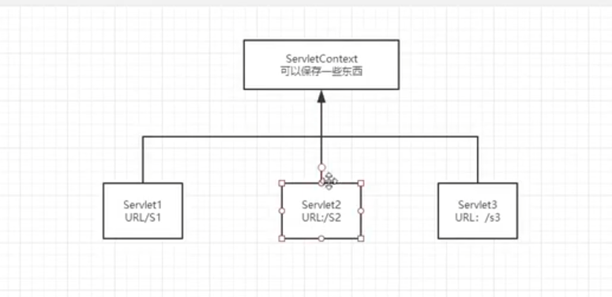
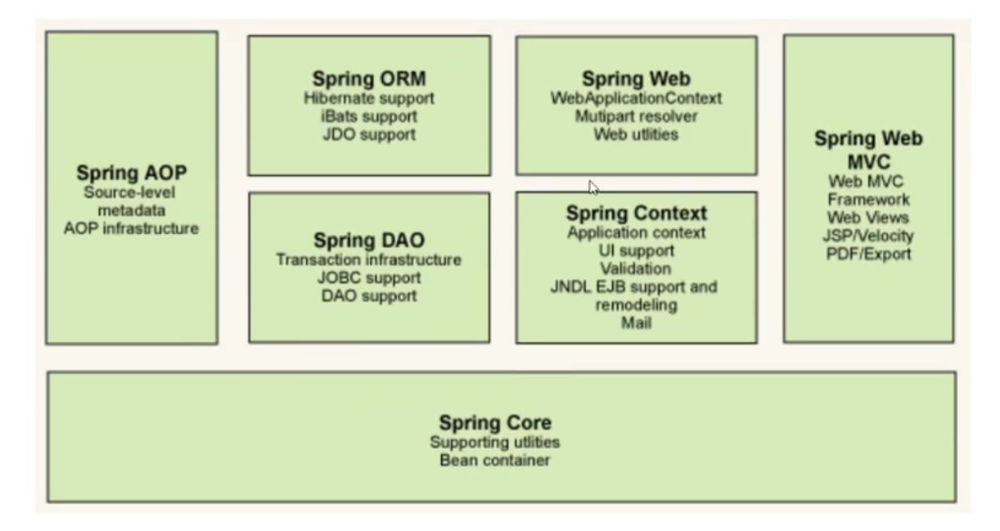
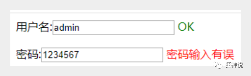

# java

## java基础

- java se/ee/me

    - 早期Java技术包含了Java SE、Jave EE、Java ME三个版本。一般来说，现在（2022年）的初学者完全不用关心细节上的区别，只需要知道：

    - Java ME不用学。它只应用在智能卡、嵌入式等领域，99.99%的互联网公司程序员都不会搞这个的。

    - Java EE不用学，因为：

        1. 从Web开发的角度看，**Jave EE早已出局，被Spring等各种新框架取代**。除非你的工作是给历史遗留项目擦屁股或者开发Web框架，不然基本没机会大量看到Java EE的东西。
        2. 从历史演进的角度看，Java EE事实上**已经“死”了**，不存在了，更名为Jakarta EE，连Java的字眼都不剩了。虽然也能做Web开发，但业界的应用远不如Spring广泛。
        3. **规定了许多规范，比如servlet还是需要学的。**

    - Java SE(Java Platform, Standard Edition，Java平台标准版)才是唯一要学的。

        - Java SE 以前称为J2SE，Java SE是Java技术的核心和基础，学习Java技术，Java SE是必经之路！

            刚接触Java要学习的基础知识就是Java SE！这些基础知识包括基础数据类型、条件控制语句、循环、变量、面向对象、方法、集合、线程、进程......

    - java web：

        - “Java Web应用由一组Servlet、HTML页、类、以及其它可以被绑定的资源构成。它可以在各种供应商提供的实现Servlet规范的 Servlet容器 中运行。“
        - 重点在与Web，显然Java Web是企业级开发的重要组成部分，只能算是企业级Java开发的一个子集，主要包括jsp、servlet等为基础的一系列技术，当然现在的企业开发已经见不到jsp和servlet了，**取而代之的是SSM或Spring Boot等一系列开发框架（但其实这些框架不仅仅局限于Web开发）**
        - 对于现在的开发而已，这已经被分为两个领域了，分为“服务端”和“[客户端](https://www.zhihu.com/search?q=客户端&search_source=Entity&hybrid_search_source=Entity&hybrid_search_extra={"sourceType"%3A"answer"%2C"sourceId"%3A"1664932045"})”，也就是两个岗位，**一个是后端**，一个是前端。

- jdk/jre

    - JRE： Java Runtime     Environment
    - JDK：Java     Development Kit 
    - JRE顾名思义是java运行时环境，包含了java虚拟机，java基础类库。是使用java语言编写的程序运行所需要的软件环境，是提供给想运行java程序的用户使用的。
    - JDK顾名思义是java开发工具包，是程序员使用java语言编写java程序所需的开发工具包，是提供给程序员使用的。JDK包含了JRE，同时还包含了编译java源码的编译器javac，还包含了很多java程序调试和分析的工具：jconsole，jvisualvm等工具软件，还包含了java程序编写所需的文档和demo例子程序。
    - 如果你需要运行java程序，只需安装JRE就可以了。如果你需要编写java程序，需要安装JDK。
    - 
        - 
        - bin文件夹：包含了javac ，javaw等各种执行文件
        - include：java底层有部分c写的程序，include文件夹中是c程序的头文件。
        - jre：java程序的基本库。
          - 
    
    - JDK版本的区别：
      - 不同数字版本就相当于版本升级，但是版本可能不兼容，JDK8和JDK11比较常用，8就是1.8，11就是1.11
    
      - JDK 8
    
        - （1）接口的默认方法（2）Lambda 表达式（3）函数式接口（4）方法与构造函数引用（5）Lambda 作用域（6）访问局部变量
        - ..................
    
      - **JDK     11**
    
        - **Local Var**: Lambda表达式中，可以使用var关键字来标识变量，变量类型由编译器自行推断。
        - **HttpClient**
        - JDK11的新的HttpClient支持HTTP/2和WebSocket，并且可以使用异步接
        
    

## java注解Annotation

> https://www.zhihu.com/question/456422157/answer/1856763166

JDK5.0开始引入的新技术，可以对程序做出解释，可以被其他程序读取

**注解概述**

**格式**

```java
public @interface 注解名称{
    属性列表;
}
```

格式有点奇怪，我们稍后再研究。

**分类**

大致分为三类：自定义注解、JDK内置注解、还有第三方框架提供的注解。

- 自定义注解就是我们自己写的注解，比如@UserLog
- JDK内置注解，比如@Override检验方法重写，@Deprecated标识方法过期等
- 第三方框架定义的注解比如SpringMVC的@Controller等

**使用位置**

实际开发中，注解常常出现在类、方法、成员变量、形参位置。当然还有其他位置，这里不提及。

**作用**

如果说注释是写给人看的，那么注解就是写给程序看的。**它更像一个标签，**贴在一个类、一个方法或者字段上。它的目的是**为当前读取该注解的程序提供判断依据及少量附加信息。**比如程序只要读到加了@Test的方法，就知道该方法是待测试方法，又比如@Before注解，程序看到这个注解，就知道该方法要放在@Test方法之前执行。

有时我们还可以通过注解属性，为将来读取这个注解的程序提供必要的附加信息，比如@RequestMapping("/user/info")提供了Controller某个接口的URL路径。

**级别**

注解和类、接口、枚举是同一级别的。

**注解的本质**

@interface和interface从名字上看非常相似，注解的本质就是一个接口，但是接口有些不同，还是单独看作就好。

**反射注解信息**

上文已经说过，注解就像一个标签，是贴在程序代码上供另一个程序读取的。所以三者关系是：


要牢记，只要用到注解，必然有**[三角关系]**

- **定义**注解
- **使用**注解
- **读取**注解

所以，接下来需要我们编写一个程序读取注解。读取注解的思路是：


反射获取注解信息：

Class、Method、Field对象都有个getAnnotation()方法，可以获取**各自位置上**的注解信息

**元注解**

**所谓元注解，就是加在注解上的注解。**作为普通程序员，常用的就是：

- @Documented：用于制作文档，不是很重要，忽略便是
- @Target：加在注解上，限定该注解的使用位置。不写的话，好像默认各个位置都是可以的。

所以如果需要限定注解的使用位置，可以**在自定义的注解上使用@Target（普通注解上使用元注解）**。我们本次默认即可，不特别限定。

- @Retention（注解的保留策略）


注解的保留策略有三种：SOURCE/ClASS/RUNTIME

“保留策略”这个元注解的意义在哪呢？

一般来说，普通开发者使用注解的时机都是运行时，比如反射读取注解（也有类似Lombok这类编译期注解）。既然反射是运行时调用，那就要求注解的信息必须保留到虚拟机将.class文件加载到内存为止。如果你需要反射读取注解，却把保留策略设置为RetentionPolicy.SOURCE、RetentionPolicy.CLASS，那就读取不到了。

但是，注解的读取并不只有反射一种途径。比如@Override，它由编译器读取（你写完代码ctrl+s时就编译了），而编译器只是检查语法错误，此时程序尚未运行。


## jar文件

- Jar(Java Archive File)，是 Java的一种文档格式。Jar 文件非常类似ZIP 文件——准确的说，它就是 ZIP 文件，所以叫它文件包。JAR 文件与ZIP文件唯一的区别就是在 JAR 文件的内容中，包含了一个 META-INF/MANIFEST.MF 文件，这个文件是在生成 JAR 文件的时候自动创建的。
- jar文件是一种封装，使用jar文件的人不需要知道jar文件中有多少个.class文件，每个文件中的功能与作用，只需要提供的接口即可。
    - jar包：通常是开发时要引用通用类，打成包便于存放管理。
    - war包：做好一个web应用后，通常是网站，打成包部署到容器中。
    - ear包：企业级应用，通常是EJB打成ear包。
- **打包jar包:**
- **运行jar包**：
    - 我们经常看到会使用` java -cp xx.jar `和`java -jar xx.jar` 命令运行jar包。
    - `java -cp xx.jar`
        -  -cp 和 -classpath 一样，是指定类运行所依赖其他类的路径，通常是类库和jar包，需要全路径到jar包，多个jar包之间连接符：window上分号 “;” 、Linux下使用 “:”。
        - windows环境：
            - `java -cp .;d:\work\other.jar;d:\work\my.jar    packname.mainclassname`
    - `java -jar xx.jar`
        - 执行该命令时，会用到目录 META-INF\MANIFEST.MF 文件，在该文件中，有一个叫Main-Class的参数，它说明了java -jar命令执行的类。
        - java -jar方式不可以指定附加依赖jar包。
    - **打包时指定了主类，可以直接用java -jar {xxx.jar}。**
    - **打包时没有指定主类，可以用 java -cp {xxx.jar} {主类名称的绝对路径}**: 
        - 如：`java -cp ysoserial-0.0.6-SNAPSHOT-BETA-all.jar ysoserial.exploit.JRMPListener 1099`
    - **要引用其他的 jar 包**，可以用 java -cp  {$CLASSPATH}:{xxxx.jar}     {主类名称的绝对路径}。


## Maven的使用

- Maven是Apache下的一个纯Java开发的开源项目，Maven是专门用于构建和管理Java相关项目的工具，其可以对Java 项目进行构建、**依赖管理（可以下载第三方的jar库，会自动帮我们导入和配置jar包）**。Maven利用配置文件能管理一个项目的构建、报告和文档等步骤。

- 在idea中可以用Maven来管理项目

- Maven项目目录结构:

    - Maven提倡使用一个共同的标准目录结构，Maven使用约定优于配置的原则，大家尽可能的遵守这样的目录结构。

        - 

    - | **目录**                           | **目的**                                                     |
        | ---------------------------------- | ------------------------------------------------------------ |
        | ${basedir}                         | 存放pom.xml和所有的子目录                                    |
        | **${basedir}/src/main/java**       | **项目的java源代码**                                         |
        | ${basedir}/src/main/resources      | 项目的资源，比如说property文件，springmvc.xml                |
        | ${basedir}/src/test/java           | 项目的测试类，比如说Junit代码                                |
        | ${basedir}/src/test/resources      | 测试用的资源                                                 |
        | ${basedir}/src/main/webapp/WEB-INF | web应用文件目录，web项目的信息，比如存放web.xml、本地图片、jsp视图页面 |
        | **${basedir}/target**              | **打包输出目录**                                             |
        | ${basedir}/target/classes          | 编译输出目录                                                 |
        | ${basedir}/target/test-classes     | 测试编译输出目录                                             |
        | **${basedir}/pom.xml**             | **用于维护当前项目都用了哪些jar包**                          |
        | ${user.home}/.m2/repository        | Maven默认的本地仓库目录位置                                  |

    - 下载maven：

        - 访问官方：http://maven.apache.org/download.cgi 下载Maven包，不需要安装，然后添加环境变量。
        - 查看是否配置成功，直接在cmd窗口输入命令：mvn -v

    - idea配置maven：可以使用自己下载的maven也可以使用idea的maven

        

    - 本地仓库：

        - 所谓的仓库就是用于存放项目需要的jar包的，maven采用一个仓库，多个项目的方式，让多个项目共享一个仓库里的相同jar包。
        - 仓库默认位置在`apache-maven-3.6.3\conf\settings.xml`，在52行指定了仓库的位置：`${user.home}/.m2/repository`对应`C:\Users\xx\.m2\repository `，我们也可以更改地址为自定义的仓库地址。`<localRepository>d:/maven/repository</localRepository>`

    - Maven换阿里云镜像源：

        - maven 默认从maven官方提供的服务器下载jar包，而官方服务器在国外，网速很慢，而且容易卡断。 为了便于快速下载相关jar包，可以使用国内阿里云的下载地址。

        - 打开用户设置文件：apache-maven-3.6.3\conf\settings.xml

        - 在mirrors里新加一个阿里云的镜像地址：

            ```xml
            <mirror>
                <id>alimaven</id>
                <mirrorOf>central</mirrorOf>
                <name>aliyun maven</name>
                <url>http://maven.aliyun.com/nexus/content/repositories/central/</url>
            </mirror>
            ```

    - 下载并添加第三方jar包：

        - 当java代码需要import一个第三方的java类的时候。找到该类对应的包名字，然后在pom.xml添加依赖配置就行，maven会自动下载这个jar包。

        - 找到相应包maven依赖：https://mvnrepository.com/

        - 比如commons-io这个java包的maven依赖配置

            ```xml
            <dependency>
                <groupId>commons-io</groupId>
                <artifactId>commons-io</artifactId>
                <version>2.6</version>
            </dependency>
            ```

    - maven中写的java代码用到的相对路径是这个项目的根目录。
    
    - **maven资源导出问题**
    
        - 在maven中我们resources中的资源会被自动导出到生成目录下面的，也就是classpath路径下面，但是其他的目录下的非java的资源文件不会自动导出，这时候就需要改maven配置了。
            - 
    
        - 
        - 
    
    - 改完maven配置之后，发现都被打包到了同一个路径下：classes，我们俗称这个路径为classpath：

## IDEA的使用

### idea反编译

- 自动反编译class文件
    - 将任意的`class`文件丢到`IDEA`的源码目录就可以立即看到反编译之后的文件，这样就可以省去打开反编译工具的时间了，如图：
    - 
- idea反编译jar文件
    - `IDEA`反编译`jar`文件也是非常的方便，只需把`jar`包丢到任意目录，然后`右键`->`Add as library`就可以了。
    - 
    - 然后就会自动反编译这个库了。
        - 

### 快捷键

全局搜索：ctrl+shift+F


## java web开发


**重点在 spring mvc和spring boot上面**


### java web基础


- J2ee是标准，spring boot是实现。
- 各种框架，如spring boot，spring mvc的最底层还是以 Servlet为基础的。
- **servlet程序需要对应的容器支持(如Tomcat/Jboss/Weblogic )。**
    - web容器，用来处理一些请求和给用户一些响应信息。
    - apache为html页面服务，而tomcat实际运行jsp页面和servlet。
    - 

- **Java Web常见开发框架模型：**
    - MVC框架模式
    - ORM框架模式: 用于数据库的。
- **JAVA Web前后端开发语言：**
    - **前端**：HTML、CSS、JavaScript、Jquery、BootStrap、Ext.js 等
    - **后端**：Servlet、Struct2、Spring、Hibernate、Mybatis
- MVC架构：
    - struts2：
    - Spring mvc：
- **springboot**：
    - **springboot**整合了springMVC，简化了springMVC等等一些项目配置，整合了很多jar包为starter，springMVC该怎么用还怎么用，只是不用你手动添加那么多配置了。还嵌入了Tomcat，无需部署WAR文件

### tomcat：

- 文件夹信息：

    - 

    - webapps中一个目录代表一个应用：然后通过不同的url目录访问不同的应用

        - 

        - 

- work目录：
  
    - idea中使用tomcat中会在tomcat中生成一个work目录
    - 
    
- 启动tomcat：

    - ./bin/startup.bat 就会启动8080端口
        - 

- 关闭tomcat：直接把弹出来的cmd关掉，或者调用shutdown.bat脚本关闭。

- tomcat配置：./conf/server.xml

    - tomcat默认端口更改：

        ```xml
        <Connector port="8080" protocol="HTTP/1.1"
                   connectionTimeout="20000"
                   redirectPort="8443" />
        
        ```

    - tomcat: localhost更改：这样无法通过localhost，需要使用对应域名访问了。

        ```xml
        <Host name="localhost"  appBase="webapps"
        unpackWARs="true" autoDeploy="true">
        ```

        - `appBase`：默认网站应用存放的路径。

- **任意一个网站下的/WEB-INF/web.xml**

    - 浏览器无法访问该文件夹下的内容，只有通过服务器端的代码才能访问其中的内容。
    - 在Servlet中讲解该文件。

- 发布一个web网站：

    - 将自己写的网站，放到服务器(tomcat)中指定的web应用的文件夹（webapps）下，就可以访问了。

    - 网站应该有的结构：

        ```
        --webapps:Tomcat服务器的web目录
            -ROOT
            -kuangstudy:网站的目录名
               - WEB-INF
                    -classes: java程序
                    -1ib: web应用所依赖的jar包
                    -web.xm1: 网站配置文件
               - index.html默认的首页
               - META-INF   META-INF文件夹相当于一个信息包，目录中的文件和目录获得Java 2平台的认可与解释，用来配置应用程序、扩展程序、类加载器和服务。其中的 MANIFEST.MF文件，在用jar打包时自动生成。
               - static
                    -css
                    -style.css
                    -js
                    -img
        ```

- 创建一个普通的maven web项目：

    - maven提供了很多项目模板，可以使用普通的模板，然后自己构建webapp的目录。
    - 

    - 

- 初始目录结构

    - ```
        --simpleweb:
        	-src
        		- main
        			-webapp
        				- WEB-INF
        					web.xml
        				index.jsp
            pom.xml
            simpleweb.iml
        ```

    - 相较于原始的maven创建的项目，少了几个文件夹。都加上

        ```
        --simpleweb:
        	-src
        		- main
        			- java
        			- resources
        			-webapp
        				- WEB-INF
        					web.xml
        				index.jsp
            pom.xml
            simpleweb.iml
        ```

    - 为webapp添加tomcat，添加一个配置文件：

        - 

        - 

        - 为什么会出现artifaces警告，因为tomcat webapps目录需要

    - 设置好tomcat后，我们需要将项目部署在tomcat上。
        - 

- 然后点击启动按钮启动tomcat。
    - 

- 

- pom.xml文件:
    - 

### Servlet:

- Servlet就是sun公司开发动态web的一门技术。

- 如果你想开发一个Servleti程序，只需要完成两个小步骤：

    - 编写一个类，实现Servlet接口
    - 把开发好的java类部署到web服务器中。

- **把实现了Servlet接口的ava程序叫做，Servlet**。sun公司有两个实现好的类，httpServlet, GenericServlet。

- **后台处理流程**

- 1. 接收浏览器 URL 的请求，访问 `/Hello`
    2. 在配置文件 web.xml      中的`<servlet-mapping>`里查找，确定由 HelloServlet 来处理
    3. 从`<servlet>      `里查找，确定对应的类是HelloServlet

- HelloServlet：

    - ```xml
        <dependency>
            <groupId>javax.servlet</groupId>
            <artifactId>javax.servlet-api</artifactId>
            <version>4.0.1</version>
        </dependency>
        <dependency>
            <groupId>javax.servlet.jsp</groupId>
            <artifactId>jsp-api</artifactId>
            <version>2.2</version>
        </dependency>
        ```

    - 如果在module中加入module，Maven对于父子工程：

        - 

- 在java文件夹中新建一个java包，并创建一个HelloSerlvet.java的文件，然后继承HttpServlet，可以看他的源码。

    - ```
        public class HelloServlet extends HttpServlet {
        }
        ```

    - 

- Servlet接口源码：

    ```java
    public interface Servlet {
        void init(ServletConfig var1) throws ServletException;
    
        ServletConfig getServletConfig();
    
        //最重要的，也是我们要实现的
        void service(ServletRequest var1, ServletResponse var2) throws ServletException, IOException;
    
        String getServletInfo();
    
        void destroy();
    }
    
    ```

- GenericServlet.java:

    ```java
    public abstract void service(ServletRequest var1, ServletResponse var2) throws ServletException, IOException;
    //可以看到并没有实现这个函数
    ```

- HttpServlet

    ```java
        protected void service(HttpServletRequest req, HttpServletResponse resp) throws ServletException, IOException {
            String method = req.getMethod();
            long lastModified;
            //如果http请求为get，那么就调用doGet方法
            if (method.equals("GET")) {
                lastModified = this.getLastModified(req);
                if (lastModified == -1L) {
                    this.doGet(req, resp);
                } else {
                    long ifModifiedSince = req.getDateHeader("If-Modified-Since");
                    if (ifModifiedSince < lastModified) {
                        this.maybeSetLastModified(resp, lastModified);
                        this.doGet(req, resp);
                    } else {
                        resp.setStatus(304);
                    }
                }
              //如果http请求为Head，就调用doHead
            } else if (method.equals("HEAD")) {
                lastModified = this.getLastModified(req);
                this.maybeSetLastModified(resp, lastModified);
                this.doHead(req, resp);
            } else if (method.equals("POST")) {
                this.doPost(req, resp);
            } else if (method.equals("PUT")) {
                this.doPut(req, resp);
            } else if (method.equals("DELETE")) {
                this.doDelete(req, resp);
            } else if (method.equals("OPTIONS")) {
                this.doOptions(req, resp);
            } else if (method.equals("TRACE")) {
                this.doTrace(req, resp);
            } else {
                String errMsg = lStrings.getString("http.method_not_implemented");
                Object[] errArgs = new Object[]{method};
                errMsg = MessageFormat.format(errMsg, errArgs);
                resp.sendError(501, errMsg);
            }
    
        }
    
    //这些默认的处理方法，都是需要我们重写的。一般重写doGet和doPost即可
    protected void doGet(HttpServletRequest req, HttpServletResponse resp) throws ServletException, IOException {
            String protocol = req.getProtocol();
            String msg = lStrings.getString("http.method_get_not_supported");
            if (protocol.endsWith("1.1")) {
                resp.sendError(405, msg);
            } else {
                resp.sendError(400, msg);
            }
    
        }
    ```

- HelloServlet.java

    ```java
    public class HelloServlet extends HttpServlet {
    
        //由于get或者post只是请求实现的不同方法，但是业务逻辑处理都一样，所以可以相互调用
        @Override
        protected void doGet(HttpServletRequest req, HttpServletResponse resp) throws ServletException, IOException {
            //创建返回消息的响应流
            PrintWriter writer = resp.getWriter();
            //同理也会有请求的输入流
    
            writer.print("hello,Servlet");
    
        }
    
        @Override
        protected void doPost(HttpServletRequest req, HttpServletResponse resp) throws ServletException, IOException {
            super.doGet(req, resp);
        }
    }
    ```

- **编写Servlet的映射：**

    - 为什么需要映射：我们写的是AVA程序，但是要通过浏览器访问，而浏览器需要连接web服务器，所以我们需
        要**在web服务中注册我们写的Servlet，还需给他一个浏览器能够访问的路径；**

    - 在web.xml文件中添加map。将Servlet代码和路径绑定了。

        ```xml
        <web-app>
          <display-name>Archetype Created Web Application</display-name>
        
          <!-- 注册Servlet-->
          <servlet>
            <servlet-name>hello</servlet-name>
            <servlet-class>com.sec.servlet.HelloServlet</servlet-class>
          </servlet>
          <!-- Servlet的请求路径-->
          <servlet-mapping>
            <servlet-name>hello</servlet-name>  <!-- 两个名称要一样，一个servlet对应一个servl-mapping -->
            <url-pattern>/hello</url-pattern>
          </servlet-mapping>
        </web-app>
        
        ```

        访问路径还要加上原本项目设置的路径

        

- 启动之后，我们的代码就会生成一个war包：

    - 

    - 

- **Servlet原理：**
    - 
    
- **Mapping问题**：
    - 一个Servlet请求可以指定一个/多个/通用/指定前缀或者后缀 映射路径
    - **不同的Servlet map存在优先级问题：**
        - 制定了映射路径的优先级最高，最后才是通配符的map
    
- 可以自己写个404：使用通配符/*来映射路径

#### ServletContext

- 看看就行，共享数据，请求转发等这些会用其他的方式实现

- 每一个Servlet都可以去获得全局的ServletContext对象。`this.getServletContext`

    - 

- web容器在启动的时候，它会为每个web程序都创建一个对应的ServletContext对象，它代表了当前web应用：

    - ```java
        ServletContext servletContext = this.getServletContext();
        ```

    - 共享数据：我在这个Servlet中保存的数据，可以在另外一个servlet中拿到；

    -  请求转发：

        - 将当前的http请求，转发到其他的serlvet中，传入其他serlvet路径即可。但是浏览器的url不会变，也就是和302重定向不同。

    - 读取资源文件：

        - Properties类：需要传入绝对路径
        - 读取该web项目中的某个文件，并且返回一个输入流：
            - `this.getServletContext().getResourceAsStream("/WEB-INF/classes/db.properties");`
            - 然后将这个流传入Properties类处理。

#### HttpServletResponse

- web服务器接收到客户端的http请求，针对这个请求，分别创建一个代表请求的HttpServletRequest
    对象，代表响应的一个HttpServletResponse;

    - 如果要获取客户端请求过来的参数：找HttpServletRequest
    - 如果要给客户端响应一些信息：找HttpServletResponse

- 查看ServletResponse的源码。

    - 简单分类：

        - 负责像浏览器发送数据的的方法。

            ```java
            ServletOutputStream getOutputStream() throws IOException;//写其他用这个
            
            PrintWriter getWriter() throws IOException;//写中文一般用这个
            ```

        - 负责向浏览器发送响应头的方法
            - ServletResponse和HttpServletResponse都有

    - HttpServletResponse响应的状态码常量。

        ```java
            int SC_CONTINUE = 100;
            int SC_SWITCHING_PROTOCOLS = 101;
            int SC_OK = 200;
            int SC_CREATED = 201;
            int SC_ACCEPTED = 202;
            int SC_NON_AUTHORITATIVE_INFORMATION = 203;
            int SC_NO_CONTENT = 204;
            int SC_RESET_CONTENT = 205;
            int SC_PARTIAL_CONTENT = 206;
            int SC_MULTIPLE_CHOICES = 300;
            int SC_MOVED_PERMANENTLY = 301;
            int SC_MOVED_TEMPORARILY = 302;
            int SC_FOUND = 302;
            void setStatus(int var1);
        ```

- 常见应用：

    - 像浏览器输出消息

    - 下载文件

        1. 要获取下载文件的路径，获取下载的文件名

        2. 想办法让浏览器支持我们需要下载的东西(百度http头文件响应content)：

        3. 获取下载文件的输入流

        4. 创建缓冲区

        5. 获取resp的OutputStream对象

        6. 将FileInputStream流写入到buff缓冲区，使用OutputStream将缓冲区中的数据输出到客户端。

            ```java
            protected void doGet(HttpServletRequest req, HttpServletResponse resp) throws ServletException, IOException {
                    //要获取下载文件的路径
                    String realPath = this.getServletContext().getRealPath("/img.png");
                    System.out.println("下载文件的路径"+realPath);
                    //下载的文件名
                    String fileName  = realPath.substring(realPath.lastIndexOf("\\")+1);
                    //想办法让浏览器支持我们需要下载的东西(百度http头文件响应content)：，如果有中文，需要将fileName urlencode()
                	//resp.setHeader("content-Dispostition","attachment;filename="+ URLEncoder.encode(fileName,"utf-8"));
                    resp.setHeader("content-Dispostition","attachment;filename="+fileName);
                    //获取下载文件的输入流
                    FileInputStream in = new FileInputStream(realPath);
                    //创建缓冲区
                    int len = 0;
                    byte[] buffer = new byte[1024];
                    //获取resp的OutputStream对象
                    ServletOutputStream out = resp.getOutputStream();
                    //将FileInputStream流写入到buff缓冲区,使用OutputStream将缓冲区中的数据输出到客户端。
                    while ((len=in.read(buffer))>0){
                        out.write(buffer,0,len);
                    }
            
                    in.close();
                    out.close();
            ```

            


- 验证码功能：

    - 前端实现：
    - 后端实现：

- 实现重定向：

    - 常见场景：

        - 用户登录

            ```java
            resp.sendRedirect("/admin");
            ```

#### HttpServletRequet

- 会封装http请求包
- 获取前端传递的参数
    - 
    - 传入参数名，获取前端传入的参数值。
- 请求转发:请求转发和重定向的路径不同。重定向输入的路径需要整个web的相对路径，而请求转发是当前web应用的相对路径（显然该web应用下的请求不能转发到其他web应用里面了）

#### Cookie和Session

- ```java
    public class CookieDemo01 extends HttpServlet {
        @Override
        protected void doGet(HttpServletRequest req, HttpServletResponse resp) throws ServletException, IOException {
            //获取http请求的cookie
            Cookie[] cookies = req.getCookies();
    
            //判断cookie是否存在，不存在就创建cookie
            if(cookies!=null){
                //如果存在cookie
                
            }else{
                //设置cookie
                Cookie cookie = new Cookie("name","admin");
                resp.addCookie(cookie);
            }
        }
    }
    ```

- 删除cookie：

    - 不设置有效期，关闭浏览器，自动失效

- Session：

    - 服务器给每个用户创建一个session对象。
    - 一个Session的独占一个浏览器，只要浏览器不关闭，session就一直存在。

### JSP:

- jsp本身继承了HttpServlet。本质上就是一个servlet，属于简化的jsp。会被转换成java文件和class文件。只有访问了才会被编译成class文件。
- 内置了很多对象，可以直接拿过来用。
- 编译成class文件之后
- 

​		

- jsp不需要去配置文件配置路径映射，会向php一样访问。

### javaBean

实体类

JavaBean有特定的写法：

- 必须要有一个无参构造
- 属性必须私有化
- 必须要有对应的get/set方法

一般用来和数据库的字段做映射。ORM

ORM:对象关系映射：

- 数据库中的一张表对应一个java类
- 字段-》属性
- 行记录-》对象
- 

- 在jsp中使用javaBean：
    - 

### MVC三层架构:

早期java架构：


用户直接访问控制层，控制层直接操作数据库

```java
servlet--crud-->数据库
弊端：程序十分臃肿，不利于维护
servlet的代码中：处理请求，响应，视图跳转，处理jdbc，处理业务代码，处理逻辑代码。
```

MVC：Model ，view，Controller

- 

- model：

    - 业务处理：业务逻辑（Service)
    - 数据持久层:CRUD（Dao）

- view：

    - 展示数据：
    - **提供链接发起Servlet请求**（a标签，form，img）

- Controller：（Servlet）：

    - 接收用户的请求(req:请求参数，Session信息...)

    - 交给业务层处理对应的代码

    - 控制视图的跳转

        ```Java
        登陆--》接收用户的登陆请求--》处理用户的请求（获取用户登陆的参数，用户名，密码）-》交给业务层处理登陆业务（判断用户名密码是否挣钱，事务）--》Dao层查询用户名和密码是否正确--》数据库
        ```

### Filter过滤器：

Filter：用来过滤网站的；

- 处理中文乱码，不设置响应包中的http头中字符设置为utf-8，那么就会乱码
- 登陆验证。
- 

编写过滤器：

- 要重写三个方法:

    ```java
    public class CharacterEncodingFilter implements Filter {
    
        //web服务器启动时，就初始化了，随时等待过滤对象出现
        @Override
        public void init(FilterConfig filterConfig) throws ServletException {
            //Filter.super.init(filterConfig)
        }
        /*
        过滤中的所有代码，在过滤特定的请求的时候都会执行
        必须要让过滤器继续执行
        */
        @Override
        public void doFilter(ServletRequest servletRequest, ServletResponse servletResponse, FilterChain filterChain) throws IOException, ServletException {
            servletRequest.setCharacterEncoding("utf-8");
            servletResponse.setCharacterEncoding("utf-8");
            servletResponse.setContentType("text/html;charset=utf-8");
            System.out.println("CharacterEncodingFilter 执行前");
            //让我们的请求继续走，如果不写，程序就在这里就被拦截停止了
            filterChain.doFilter(servletRequest,servletResponse);
            System.out.println("CharacterEncodingFilter 执行后");
        }
        //web服务器关闭时，过滤器就会销毁
        @Override
        public void destroy() {
            //Filter.super.destroy();
        }
    }
    ```

- 配置filter

    ```xml
    <filter>
      <filter-name>CharacterEncodingFilter</filter-name>
      <filter-class>com.sec.servlet.CharacterEncodingFilter</filter-class>
    </filter>
      <filter-mapping>
        <filter-name>CharacterEncodingFilter</filter-name>
        <!--只要是/servlet/下的任何请求都会经过这个filter-->
        <url-pattern>/servlet/*</url-pattern>
    </filter-mapping>
    ```

- Filter实现权限拦截：
    - 用户登陆之后才能访问主页，用户注销之后不能进入主页了
    - 登陆，注销都发起一个请求，写两个servlet。当注销的时候，一般不直接销毁session，而是直接移除session。
    - 在敏感目录下设置一个filter，判断权限，如果

### 监听器listener

- 现在java web不怎么用了。在gui编程中经常使用。
- 实现监听器接口就行了。
- 在web中，作用是[监听](https://so.csdn.net/so/search?q=监听&spm=1001.2101.3001.7020)Application、Session和Request三大对象创建或者删除，然后根据监听的结果来执行提前编写的代码。

## spring：

> https://www.bilibili.com/video/BV1WE411d7Dv?spm_id_from=333.337.search-card.all.click

### 基础

- **Spring**的特点：
    - 2002：首次推出了spring的框架雏形interface 21；然后2004年推出了1.0正式版spring框架。
    - spring理念：本身是一个大杂烩，整合了现有的技术框架。
    - SSM：spring mvc + spring +mybatis
    - **IOC（控制反转）**：
    - **AOP（面向切面）**：
    - **支持事务的处理，对框架整体的支持：**

- spring 组成：
    - 

- 扩展：

    

- IOC理论推导：

    - 就是控制权的反转，之前主动权在业务层（service），每次用户提出需求业务层就需要跟着做出改变，现在我们把主动权交给了用户层，它传进什么，就得到什么样的结果，这样业务层的代码就不用跟着改变了。
    - 业务层代码不再具有主动权，而是变成了被动的接受对象。
    - **控制反转是一种通过描述（XML或注解）并通过第三方去生产或获取特定对象的方式。在Spring中实现控制反转的是IoC容器，其实现方法是依赖注入（Dependency Injection,DI）。**

### 采用XML方式配置Bean

- Bean的定义信息是和实现分离的，

- 在xml中配置bean来配置对象。

    - 

    - 属性的设置，需要类配置好setter函数。
    - 然后直接在代码中调用Bean来创建对象1。
        - 

    - 这个过程就叫控制反转：

        - 控制：谁来控制对象的创建，传统应用程序的对象是由程序本身控制创建的，使用Spring后，对象是由Spring:来创建的。

        - **反转：程序本身不创建对象，而变成被动的接收对象**。

        - 依赖注入：就是利用set方法来进行注入的。

        - IOC是一种编程思想，由主动的编程变成被动的接收。可以通过newClassPathXmlApplicationContext去浏览一下底层源码。

        - OK,到了现在，我们彻底不用再程序中去改动了，要实现不同的操作，只需要在xml配置文件中进行修改，所谓的IoC,一句话搞定：对象由Spring来创建，管理，装配！

    - 从改程序代码，变成了，改配置文件。

    - **spring什么时候创建对象的？**

        - 在getBean函数的时候就创建了。并且使用的是无参构造。
        - 有参构造。
            - 

    - beans.xml配置

        - alias 别名：将beans起个别名。id name alias都是名字。name可以取多个别名。s
        - import: 一般用于团队开发，可以将多个beans.xml合成一个。

### 依赖注入

- 通过构造器注入
- **通过set方式注入**
    - 依赖：bean对象的创建依赖于容器！
    - 注入：bean对象中的所有属性，由容器来注入！
        - 普通值，直接设置value注入
        - 
- 扩展方式
    - c，p命名空间。 
- Bean的自动装配：
    - 自动装配是Spring满足bean依赖一种方式！
    - Spring会在上下文中自动寻找，并自动给bean装配属性！
    - 在Spring中有三种装配的方式
        - 在xml中显示的配置
        - 在java中显示配置
        - 隐式的自动装配bean【重要】
- ByName自动装配，ByType 自动装配

### 采用注解的方式

- 可以把两者合为一体，Bean的定义信息直接以注解的形式定义在实现类中，从而达到了零配置的目的。

- 要使用注解须知：
    - 导入约束
    - 配置注解的支持
- 使用注解之后，类就不需要set函数了。
- **@Autowired**
    - 直接在属性上使用即可！也可以在set方式上使用！
    - 使用Autowired我们可以不用编写Set方法了，前提是你这个自动装配的属性在IOC(Spring)容器中存在，且符合名字byname!
    - 如果Autowired.不能唯一自动装配上属性，则需要通过@Qualifier(value:="x)
- @Resource注解
    - @Autowired通过byTypet的方式实现，而且必须要求这个对象存在！【常用】
    - @Resource默认通过byname的方式实现，如果找不到名字，则通过byType3实现！如果两个都找不到的情况
        下，就报错！【常用】
    - 执行顺序不同：@Autowired先通过byType的方式实现。@Resource默认先通过byname的方式实现。

### 使用注解开发

- 配置注解支持，配置要扫描的包，这个包下所有注解都会实现。
- @Component ( 放在类上面)等价于在beans.xml中定义一个Bean。
- @Value("123") 给属性进行注解
- @Component的衍生注解，功能一样只是名字不一样

    - 我们在web开发中，会按照mvc三层架构分层！
    - dao [@Repository]
    - service [@Service]
    - controller [@Controller]
- 作用域

    - @scope默认单例
- xml和注解的区别：

    - xml与注解：
    - xml更加万能，适用于任何场合！维护简单方便
    - 注解不是自己类使用不了，维护相对复杂！
    - xml与注解最佳实践：
        xml用来管理bean;
        注解只负责完成属性的注入：
    - 我们在使用的过程中，只需要注意一个问题：必须让注解生效，就需要开启注解的支持
- 使用java的方式配置spring

    - 不使用Spring的xml配置，全权交给java来做
    -  


### JavaConfig

设置一个config的类，把类当原来的xml用。

- @Configure:  代表该类是配置类，和Beans.xml是一样的
- 同理可以再加上@ComponetScan("xxx")扫描其他类。
- 

​		

- 同理还可以导入其他的配置类。
- 

### java代理模式

- 参考资料：https://www.cnblogs.com/maohuidong/p/7992894.html

- 代理是一种常用的设计模式，其目的就是为其他对象提供一个代理以控制对某个对象的访问。代理类负责为委托类预处理消息，过滤消息并转发消息，以及进行消息被委托类执行后的后续处理。

- 为了保持行为的一致性，**代理类和委托类通常会实现相同的接口，所以在访问者看来两者没有丝毫的区别**。

- **静态代理：**

    - 角色分析：

        - 抽象角色：一般会使用接口或者抽象类
        - 真实角色：被代理的角色
        - 代理角色：代理真实角色，代理真实角色后，，一般会做一些额外操作。
        - 客户：使用抽象角色来调用

    - 假设现在项目经理有一个需求：在项目某个类的方法前后打印日志。

        - 首先这个方法需要是个接口（抽象角色）
        - 然后真实角色实现这个接口完成对应操作。
        - 然后创建一个代理类，再在构造函数中传入真实角色当作变量，这个我们的代理角色就包含了真实角色了。然后实现接口，这样在外部看来，真实角色和代理角色提供的都是同样的功能。实现这个接口的时候，调用目标对象同名方法，并添加一些额外操作,如打印日志，也就是说，代理对象 = 增强代码 + 目标对象（原对象）。有了代理对象后，就不用原对象了。逻辑还是很好理解的。
        - 

    - 一个例子

        ```java
        //具体用户管理实现类
        public class UserManagerImpl implements UserManager {  
          
            @Override  
            public void addUser(String userId, String userName) {  
                System.out.println("UserManagerImpl.addUser");  
            }  
          
            @Override  
            public void delUser(String userId) {  
                System.out.println("UserManagerImpl.delUser");  
            }  
          
            @Override  
            public String findUser(String userId) {  
                System.out.println("UserManagerImpl.findUser");  
                return "张三";  
            }  
          
            @Override  
            public void modifyUser(String userId, String userName) {  
                System.out.println("UserManagerImpl.modifyUser");  
          
            }  
        }  
        ```

        ```java
        //代理类--代理用户管理实现类
        public class UserManagerImplProxy implements UserManager {  
          
            // 目标对象  
            private UserManager userManager;  
            // 通过构造方法传入目标对象  
            public UserManagerImplProxy(UserManager userManager){  
                this.userManager=userManager;  
            }  
            @Override  
            public void addUser(String userId, String userName) {  
                try{  
                        //添加打印日志的功能  
                        //开始添加用户  
                        System.out.println("start-->addUser()");  
                        userManager.addUser(userId, userName);  
                        //添加用户成功  
                        System.out.println("success-->addUser()");  
                    }catch(Exception e){  
                        //添加用户失败  
                        System.out.println("error-->addUser()");  
                    }  
            }  
          
            @Override  
            public void delUser(String userId) {  
                userManager.delUser(userId);  
            }  
          
            @Override  
            public String findUser(String userId) {  
                userManager.findUser(userId);  
                return "张三";  
            }  
          
            @Override  
            public void modifyUser(String userId, String userName) {  
                userManager.modifyUser(userId,userName);  
            }  
          
        }  
        ```

        ```java
        //客户端调用，是通过公共接口来接受对象
        public class Client {  
          
            public static void main(String[] args){  
                //UserManager userManager=new UserManagerImpl();  
                UserManager userManager=new UserManagerImplProxy(new UserManagerImpl());  
                userManager.addUser("1111", "张三");  
            }  
        }
        ```

        

    - 静态代理的优缺点：

        - 优点：
            - 代理使客户端不需要知道实现类是什么，怎么做的，而客户端只需知道代理即可（解耦合），对于如上的客户端代码，newUserManagerImpl()可以应用工厂将它隐藏，如上只是举个例子而已。
        - 缺点：
            - 一个真实角色就会产生一个代理角色；代码量会翻倍~开发效率会变低~。
            - 而且抽象类多写一个方法，代理角色都同样要写一个方法。


**动态代理：**

- 我们既想要代理，又不想增加那么多的类。

- 动态代理的代理类是动态生成的，不是我们直接写好的！

- 动态代理分为两大类：基于接口的动态代理，基于类的动态代理

    - 基于接口-DK动态代理
    - 基于类：cglib
    - 基于java字节码实现：javassist

- 复习对象的创建：

    - 
    - 我们在java代码审计篇中学会了如何利用class对象进行反射来实例化对象。
    - **能否不写代理类，而直接得到代理Class对象，然后根据它创建代理实例**？
        - 通过接口的class对象来实现，之所以实现相同接口，是为了尽可能保证代理对象的内部结构和目标对象一致，这样我们对代理对象的操作最终都可以转移到目标对象身上。
        - 然而，接口时没有构造器的，无法创建对象的。怎么办？这就要使用动态代理的方法了。

- 在Java中要想实现动态代理机制，需要`java.lang.reflect.InvocationHandler`接口（调用处理程序，需要自己实现，也就是自己要添加一些想要的功能）和 `java.lang.reflect.Proxy `类(代理)的支持。

- **java.lang.reflect.Proxy类：**

    - 主要用于生成动态代理类Class、创建代理类实例，该类实现了java.io.Serializable接口。
    - **创建代理对象的函数：newProxyInstance**
        - Proxy有个静态方法：`getProxyClass(ClassLoader, interfaces)`，我们不会直接调用这个函数，而是newProxyInstance内部调用的。
            - 只要你给它传入类加载器和一组接口，它就给你返回代理Class对象。
            - 用通俗的话说，**getProxyClass()这个方法，会从你传入的接口Class中，“拷贝”类结构信息到一个新的Class对象中，但新的Class对象带有构造器，是可以创建对象的。**打个比方，一个大内太监（接口Class），空有一身武艺（类信息），但是无法传给后人。现在江湖上有个妙手神医（Proxy类），发明了克隆大法（getProxyClass），不仅能克隆太监的一身武艺，还保留了小DD（构造器）。
            - 所以，一旦我们明确接口，完全可以通过接口的Class对象，创建一个代理Class，通过代理Class即可创建代理对象。以Class造Class。
            - 

    ```java
    /**
    * 创建动态代理类实例
    *
    * @param loader     指定动态代理类的类加载器
    * @param interfaces 指定动态代理类的类需要实现的接口数组
    * @param h          动态代理处理类的对象                      这个需要我们自己实现
    * @return 返回动态代理生成的代理类实例
    * @throws IllegalArgumentException 不正确的参数异常
    */
    public static Object newProxyInstance(ClassLoader loader, Class<?>[] interfaces, InvocationHandler h)
    throws IllegalArgumentException {
    ...
    }
    ```

    - 创建代理类（本质是实现InvocationHandler接口，然后传入到`newProxyInstance`函数里面，然后返回得到的代理类），能给所有类的方法都添加上日志功能。

        - 需要实现`InvocationHandler`接口的`invoke()`方法，我们就是要在这个方法内添加我们自己想要的功能。

            - 每当接口的任意一个方法调用的时候，都会调用invoke()方法。可以通过反射把目标对象的方法调用了。

            - ```java
                public Object invoke(Object proxy, Method method, Object[] args)  throws Throwable {  
                    //在调用前，可以添加一些功能
                    
                    //调用目标方法，动态代理的本质，就是通过反射实现。
                    ret=method.invoke(targetObject, args);  
                	
                	//调用后，可以添加一些功能
                
                }  
                ```

        - 然后通过`newProxyInstance`函数实现动态代理功能，传入我们创建的类。

        ```java
        //动态代理类只能代理接口（不支持抽象类），代理类都需要实现InvocationHandler接口，实现invoke方法。该invoke方法就是调用被代理接口的所有方法时需要调用的，该invoke方法返回的值是被代理接口的一个实现类  
             
        public class LogHandler implements InvocationHandler {  
          
            // 目标对象  
            private Object targetObject;  
            //绑定关系，也就是关联到哪个接口（与具体的实现类绑定）的哪些方法将被调用时，执行invoke方法。              
            public Object newProxyInstance(Object targetObject){  
                this.targetObject=targetObject;  
                //该方法用于为指定类装载器、一组接口及调用处理器生成动态代理类实例    
                //第一个参数指定产生代理对象的类加载器，需要将其指定为和目标对象同一个类加载器  
                //第二个参数要实现和目标对象一样的接口，所以只需要拿到目标对象的实现接口  
                //第三个参数表明这些被拦截的方法在被拦截时需要执行哪个InvocationHandler的invoke方法  
                //根据传入的目标返回一个代理对象  
                return Proxy.newProxyInstance(targetObject.getClass().getClassLoader(),  
                        targetObject.getClass().getInterfaces(),this);  
            }  
            
            @Override  
            //关联的这个实现类的方法被调用时将被执行  
            /*InvocationHandler接口的方法，proxy表示代理，method表示原对象被调用的方法，args表示方法的参数*/  
            public Object invoke(Object proxy, Method method, Object[] args)  throws Throwable {  
                
                System.out.println("start-->>");  
                for(int i=0;i<args.length;i++){  
                    System.out.println(args[i]);  
                }  
                
                Object ret=null;  
                try{  
                    /*原对象方法调用前处理日志信息*/  
                    System.out.println("satrt-->>");  
                      
                    //调用目标方法，动态代理的本质，就是通过反射实现。
                    ret=method.invoke(targetObject, args);  
                    /*原对象方法调用后处理日志信息*/  
                    System.out.println("success-->>");  
                }catch(Exception e){  
                    e.printStackTrace();  
                    System.out.println("error-->>");  
                    throw e;  
                }  
                return ret;  
            }  
          
        }  
        ```

    - 客户端代码

        ```java
        public class Client {  
          
            public static void main(String[] args){  
                LogHandler logHandler=new LogHandler();  
                UserManager userManager=(UserManager)logHandler.newProxyInstance(new UserManagerImpl());  
                //UserManager userManager=new UserManagerImpl();  
                userManager.addUser("1111", "张三");  
            }  
        } 
        ```


    - 总结：
        - 动态代理本质是传入目标对象，然后以目标对象继承的接口构造出一个接口类，然后在调用接口的方法的时候调用自己实现的invoke方法，invoke方法中通过反射调用目标对象实现的接口的方法，然后还可以执行其他的代码，完成我们想要的功能。
        - 一个动态代理类代理的是一个接口，一般就是对应的一类业务。
        - 一个动态代理类可以代理多个类，只要是实现了同一个接口即可！

### AOP模式

> spring 利用动态代理实现的一些功能，简化了我们直接使用动态代理。
>
> 
>
>  AOP(Aspect Oriented Programming)意为：面向切面编程，通过预编译方式和运行期动态代理实现程序功能
> 的统一维护的一种技术。
>
> AOP是OOP的延续，是软件开发中的一个热点，也是Spig框架中的一个重要内容，是函数式编程的一种衍生范型。利用AOP可以对业务逻辑的各个部分进行隔离，从而使得业务逻辑各部分之间的耦合度降低，提高程序的可重用性，同时提高了开发的效率。

原本业务是增删改查，现在添加功能需要验证参数，添加日志，但是不改变原有代码。


- 一堆概念，不需要记住：

    - 横切关注点：
        - 跨越应用程序多个模块的方法或功能。即是，与我们业务逻辑无关的，但是我们需要关注的部分，就是横切关注点。如日志，安全，缓存，事务等等…
        - 就是我们想要添加的额外功能。
    - 切面(ASPECT): 类
        - 横切关注点被模块化的特殊对象。即，它是一个类。
        - 就是我们实现的日志代理类。
    - 通知(Advice): 方法
        - 切面必须要完成的工作。即，它是类中的一个方法
        - 就是我们在日志代理类中实现的方法。
    - 目标(Target):
        - 被通知对象。
        - 也就是目标对象或者目标方法
    - 代理(PoXy)：
        - 向目标对象应用通知之后创建的对象。
        - 也就是我们创建的日志类对象
    - 切入点(PointCut)):
        - 切面通知执行的“地点"的定义。
        - 也就是目标类的方法
    - 连接点(JointPoint)：
        - 与切入点匹配的执行点。
        - 和切入点差不多，但是可以或者一些信息。

- SpringAOP中，通过Advice定义横切逻辑，Spring中支持5种类型的Advice:

    - 

    - 即Aop在不改变原有代码的情况下，取增加新的功能。

- 使用Spring实现Aop

    ```xml
    <dependency>
    	<groupId>org.aspectj</groupId>
    	<artifactId>aspectjweaver</artifactId>
    	<version>1.9.4</version>
    </dependency>
    ```

- 1. 使用Spring的API接口实现：

    - 创建一个日志类。在目标方法调用前后，打印日志。

        ```java
        import org.springframework.aop.MethodBeforeAdvice;
        import org.springframework.aop.AfterReturningAdvice;
        import java.lang.reflect.Method;
        
        public class Log implements MethodBeforeAdvice,AfterReturningAdvice{
        
        //method:要执行的目标对象的方法
        //args:参数
        //target:目标对象
        //目标方法调用前调用
        public void before(Method method,object[] args,object target)throws Throwable{
        	System.out.printin(target.getclass().getName（）+"的"+method.getName()+"被执行了");
        }
            
        //returnVaLue.;返回值
        public void afterReturning(object returnValue,Method method,object[] args,object target)throws Throwable{
        	System.out.printin("执行了"+method.getName（）+"方法，返回结果为："+returnValue);   
        	}
        }
        
        ```

    - 代理类写好了，那么我们就需要修改配置文件，使得调用目标方法的时候，执行的是代理类的方法。

        - 

        - 先把代理类注册bean，然后配置aop，配置好切入点，要代理哪些目标对象，然后配置执行环绕，配置哪些代理类代理切入点。
        - 客户端
            - 

    - 日志功能，和原本的功能隔离开了。

- 2. 使用自定义来实现Aop：主要是切面定义

    - 

    - 

    - 随便写一个类，通过配置成切面，这个类就成为了代理类。然后配置通知，这个类中的方法就成为了，不同时候调用的方法了。然后一样配置切入点。

- 

- 3使用注解实现

    - 

    - 

### 整合Mybatis

- 导入相关jar包
    -  junit
    - mybatis
    - mysql数据库
    - spring相关的
    - aop织入
    - mybatis-.spring[new]
- 编写配置文件
- 测试

## SpringMVC

### DISpatcherServlet

Spring的web框架围绕DispatcherServlet设计。DispatcherServlet的作用是将请求分发到不同的处理器。从Spring 2.5开始，使用Java 5或者以上版本的用户可以采用基于注解的controller声明方式。

​	Spring MVC框架像许多其他MVC框架一样, **以请求为驱动** , **围绕一个中心Servlet分派请求及提供其他功能**，**DispatcherServlet是一个实际的Servlet (它继承自HttpServlet 基类)**。


我们现在不需要在web.xml上配置servlet的映射了，而是只需要配置DispatcherServlet就行。可是多了一个springmvc-servlet.xml文件需要写，感觉就是多此一举呢？


图为SpringMVC的一个较完整的流程图，实线表示SpringMVC框架提供的技术，不需要开发者实现，虚线表示需要开发者实现。

**简要分析执行流程**

1. DispatcherServlet表示前置控制器，是整个SpringMVC的控制中心。用户发出请求，DispatcherServlet接收请求并拦截请求。

    我们假设请求的url为 : http://localhost:8080/SpringMVC/hello

    **如上url拆分成三部分：**

    http://localhost:8080服务器域名

    SpringMVC部署在服务器上的web站点

    hello表示控制器

    通过分析，如上url表示为：请求位于服务器localhost:8080上的SpringMVC站点的hello控制器。

2. HandlerMapping为处理器映射。DispatcherServlet调用HandlerMapping,HandlerMapping根据请求url查找Handler。

3. HandlerExecution表示具体的Handler,其主要作用是根据url查找控制器，如上url被查找控制器为：hello。

4. HandlerExecution将解析后的信息传递给DispatcherServlet,如解析控制器映射等。

5. HandlerAdapter表示处理器适配器，其按照特定的规则去执行Handler。

6. Handler让具体的Controller执行。

7. Controller将具体的执行信息返回给HandlerAdapter,如ModelAndView。

8. HandlerAdapter将视图逻辑名或模型传递给DispatcherServlet。

9. DispatcherServlet调用视图解析器(ViewResolver)来解析HandlerAdapter传递的逻辑视图名。

10. 视图解析器将解析的逻辑视图名传给DispatcherServlet。

11. DispatcherServlet根据视图解析器解析的视图结果，调用具体的视图。

12. 最终视图呈现给用户。

### 使用注解开发springmvc

**1、新建一个Moudle，springmvc-03-hello-annotation 。添加web支持！**

2、由于Maven可能存在资源过滤的问题，我们将配置完善

```xml
<build>
   <resources>
       <resource>
           <directory>src/main/java</directory>
           <includes>
               <include>**/*.properties</include>
               <include>**/*.xml</include>
           </includes>
           <filtering>false</filtering>
       </resource>
       <resource>
           <directory>src/main/resources</directory>
           <includes>
               <include>**/*.properties</include>
               <include>**/*.xml</include>
           </includes>
           <filtering>false</filtering>
       </resource>
   </resources>
</build>
```

3、在pom.xml文件引入相关的依赖：主要有Spring框架核心库、Spring MVC、servlet , JSTL等。

**4、配置web.xml**

注意点：

 ```xml
<?xml version="1.0" encoding="UTF-8"?>
<web-app xmlns="http://xmlns.jcp.org/xml/ns/javaee"
        xmlns:xsi="http://www.w3.org/2001/XMLSchema-instance"
        xsi:schemaLocation="http://xmlns.jcp.org/xml/ns/javaee http://xmlns.jcp.org/xml/ns/javaee/web-app_4_0.xsd"
        version="4.0">

   <!--1.注册servlet-->
   <servlet>
       <servlet-name>SpringMVC</servlet-name>
       <servlet-class>org.springframework.web.servlet.DispatcherServlet</servlet-class>
       <!--通过初始化参数指定SpringMVC配置文件的位置，进行关联-->
       <init-param>
           <param-name>contextConfigLocation</param-name>
           <param-value>classpath:springmvc-servlet.xml</param-value>
       </init-param>
       <!-- 启动顺序，数字越小，启动越早 -->
       <load-on-startup>1</load-on-startup>
   </servlet>

   <!--所有请求都会被springmvc拦截 -->
   <servlet-mapping>
       <servlet-name>SpringMVC</servlet-name>
       <url-pattern>/</url-pattern>
   </servlet-mapping>

</web-app>
 ```

**`classpath: `即存放各种class[字节码](https://so.csdn.net/so/search?q=字节码&spm=1001.2101.3001.7020)文件处的目录**，在spring的maven项目中，这个位置位于和src同级的target目录中,


src目录下的resources文件夹的全部内容将复制到classes文件夹中，实际扫描时也是运行classes中的配置文件，**因此在xml中，classpath常常被误以为就是resources文件夹的路径，实则是classes所在的路径**


**/ 和 /\* 的区别：**< url-pattern > / </ url-pattern > 不会匹配到.jsp， 只针对我们编写的请求；即：.jsp 不会进入spring的 DispatcherServlet类 。< url-pattern > /* </ url-pattern > 会匹配 *.jsp，会出现返回 jsp视图 时再次进入spring的DispatcherServlet 类，导致找不到对应的controller所以报404错。

1. - 注意web.xml版本问题，要最新版！
    - 注册DispatcherServlet
    - 关联SpringMVC的配置文件
    - 启动级别为1
    - 映射路径为 / 【不要用/*，会404】


1. **5、添加Spring MVC配置文件**

2. 在resource目录下添加springmvc-servlet.xml配置文件，配置的形式与Spring容器配置基本类似，为了支持基于注解的IOC，设置了自动扫描包的功能，具体配置信息如下：

```xml
<?xml version="1.0" encoding="UTF-8"?>
<beans xmlns="http://www.springframework.org/schema/beans"
      xmlns:xsi="http://www.w3.org/2001/XMLSchema-instance"
      xmlns:context="http://www.springframework.org/schema/context"
      xmlns:mvc="http://www.springframework.org/schema/mvc"
      xsi:schemaLocation="http://www.springframework.org/schema/beans
       http://www.springframework.org/schema/beans/spring-beans.xsd
       http://www.springframework.org/schema/context
       https://www.springframework.org/schema/context/spring-context.xsd
       http://www.springframework.org/schema/mvc
       https://www.springframework.org/schema/mvc/spring-mvc.xsd">

   <!-- 自动扫描包，让指定包下的注解生效,由IOC容器统一管理 -->
   <context:component-scan base-package="com.kuang.controller"/>
   <!-- 让Spring MVC不处理静态资源 -->
   <mvc:default-servlet-handler />
   <!--
   支持mvc注解驱动
       在spring中一般采用@RequestMapping注解来完成映射关系
       要想使@RequestMapping注解生效
       必须向上下文中注册DefaultAnnotationHandlerMapping
       和一个AnnotationMethodHandlerAdapter实例
       这两个实例分别在类级别和方法级别处理。
       而annotation-driven配置帮助我们自动完成上述两个实例的注入。
    -->
   <mvc:annotation-driven />

   <!-- 视图解析器 -->
   <bean class="org.springframework.web.servlet.view.InternalResourceViewResolver"
         id="internalResourceViewResolver">
       <!-- 前缀 -->
       <property name="prefix" value="/WEB-INF/jsp/" />
       <!-- 后缀 -->
       <property name="suffix" value=".jsp" />
   </bean>

</beans>
```

1. 

2. 在视图解析器中我们把所有的视图都存放在/WEB-INF/目录下，这样可以保证视图安全，因为这个目录下的文件，客户端不能直接访问。

3. - 让IOC的注解生效
    - 静态资源过滤 ：HTML . JS . CSS . 图片 ， 视频 .....
    - MVC的注解驱动
    - 配置视图解析器

### 使用注解@Controller

- @Controller注解类型用于声明Spring类的实例是一个控制器（在讲IOC时还提到了另外3个注解）；
- Spring可以使用扫描机制来找到应用程序中所有基于注解的控制器类，为了保证Spring能找到你的控制器，需要在配置文件中声明组件扫描。

```xml
<!-- 自动扫描指定的包，下面所有注解类交给IOC容器管理 -->
<context:component-scan base-package="com.kuang.controller"/>
```

- 增加一个ControllerTest2类，使用注解实现；

    ```java
    //@Controller注解的类会自动添加到Spring上下文中
    @Controller
    public class ControllerTest2{
    
       //映射访问路径
       @RequestMapping("/t2")                     //这样一个controller类可以处理多个url请求了，一个url对应一个函数。
       public String index(Model model){
           //Spring MVC会自动实例化一个Model对象用于向视图中传值
           model.addAttribute("msg", "ControllerTest2");    //这里直接把数据存到模型了。
           //返回视图位置
           return "test";    //这里，直接返回的字符串是视图的名字。到时候就会访问test.jsp
      }
    
    }
    ```

    视图是被复用的，而控制器与视图之间是弱偶合关系。**

    **注解方式是平时使用的最多的方式！**

    

    ### RequestMapping

    **@RequestMapping**

    - @RequestMapping注解用于映射url到控制器类或一个特定的处理程序方法。可用于类或方法上。用于类上，表示类中的所有响应请求的方法都是以该地址作为父路径。

    - 为了测试结论更加准确，我们可以加上一个项目名测试 myweb

    - 只注解在方法上面

        ```java
        @Controller
        public class TestController {
           @RequestMapping("/h1")
           public String test(){
               return "test";
          }
        }
        ```

        

    - 访问路径：http://localhost:8080 / 项目名 / h1

    - 同时注解类与方法

    ```java
    @Controller
    @RequestMapping("/admin")
    public class TestController {
       @RequestMapping("/h1")
       public String test(){
           return "test";
      }
    }
    ```

    访问路径：http://localhost:8080 / 项目名/ admin /h1  , 需要先指定类的路径再指定方法的路径；

### RestFul 风格

**概念**

Restful就是一个资源定位及资源操作的风格。不是标准也不是协议，只是一种风格。基于这个风格设计的软件可以更简洁，更有层次，更易于实现缓存等机制。

**功能**

资源：互联网所有的事物都可以被抽象为资源

资源操作：使用POST、DELETE、PUT、GET，使用不同方法对资源进行操作。

分别对应 添加、 删除、修改、查询。

**传统方式操作资源**  ：通过不同的参数来实现不同的效果！方法单一，post 和 get

​	http://127.0.0.1/item/queryItem.action?id=1 查询,GET

​	http://127.0.0.1/item/saveItem.action 新增,POST

​	http://127.0.0.1/item/updateItem.action 更新,POST

​	http://127.0.0.1/item/deleteItem.action?id=1 删除,GET或POST

**使用RESTful操作资源** ：可以通过不同的请求方式来实现不同的效果！如下：请求地址一样，但是功能可以不同！

​	http://127.0.0.1/item/1 查询,GET

​	http://127.0.0.1/item 新增,POST

​	http://127.0.0.1/item 更新,PUT

​	http://127.0.0.1/item/1 删除,DELETE

**学习测试**

1. 在新建一个类 RestFulController

```java
@Controller
public class RestFulController {
}
```

2. 在Spring MVC中可以使用 ` @PathVariable `注解，让方法参数的值对应绑定到一个URI模板变量上。

```java
@Controller
public class RestFulController {

   //映射访问路径
   @RequestMapping("/commit/{p1}/{p2}")
   public String index(@PathVariable int p1, @PathVariable int p2, Model model){
       
       int result = p1+p2;
       //Spring MVC会自动实例化一个Model对象用于向视图中传值
       model.addAttribute("msg", "结果："+result);
       //返回视图位置
       return "test";
       
  }   
}
```

3. 我们来测试请求查看下


1. 思考：使用路径变量的好处？

2. - 使路径变得更加简洁；
    - 获得参数更加方便，框架会自动进行类型转换。
    - 通过路径变量的类型可以约束访问参数，如果类型不一样，则访问不到对应的请求方法，如这里访问是的路径是/commit/1/a，则路径与方法不匹配，而不会是参数转换失败。


5. 我们来修改下对应的参数类型，再次测试

```java
//映射访问路径
@RequestMapping("/commit/{p1}/{p2}")
public String index(@PathVariable int p1, @PathVariable String p2, Model model){

   String result = p1+p2;
   //Spring MVC会自动实例化一个Model对象用于向视图中传值
   model.addAttribute("msg", "结果："+result);
   //返回视图位置
   return "test";

}
```


**使用method属性指定请求类型**

用于约束请求的类型，可以收窄请求范围。指定请求谓词的类型如GET, POST, HEAD, OPTIONS, PUT, PATCH, DELETE, TRACE等

我们来测试一下：

- 增加一个方法

```java
//映射访问路径,必须是POST请求
@RequestMapping(value = "/hello",method = {RequestMethod.POST})
public String index2(Model model){
   model.addAttribute("msg", "hello!");
   return "test";
}
```

- 我们使用浏览器地址栏进行访问默认是Get请求，会报错405：


- 如果将POST修改为GET则正常了；

    ```java
    //映射访问路径,必须是Get请求
    @RequestMapping(value = "/hello",method = {RequestMethod.GET})
    public String index2(Model model){
       model.addAttribute("msg", "hello!");
       return "test";
    }
    ```

    

**小结：**

Spring MVC 的 @RequestMapping 注解能够处理 HTTP 请求的方法, 比如 GET, PUT, POST, DELETE 以及 PATCH。

**所有的地址栏请求默认都会是 HTTP GET 类型的。**

方法级别的注解变体有如下几个：组合注解

```
@GetMapping
@PostMapping
@PutMapping
@DeleteMapping
@PatchMapping
```

@GetMapping 是一个组合注解，平时使用的会比较多！

它所扮演的是 @RequestMapping(method =RequestMethod.GET) 的一个快捷方式。

### 结果跳转方式

#### ModelAndView

设置ModelAndView对象 , 根据view的名称 , 和视图解析器跳到指定的页面 .

页面 : {视图解析器前缀} + viewName +{视图解析器后缀}


```xml
<!-- 视图解析器 -->
<bean class="org.springframework.web.servlet.view.InternalResourceViewResolver"
     id="internalResourceViewResolver">
   <!-- 前缀 -->
   <property name="prefix" value="/WEB-INF/jsp/" />
   <!-- 后缀 -->
   <property name="suffix" value=".jsp" />
</bean>
```

对应的controller类

```java
public class ControllerTest1 implements Controller {

   public ModelAndView handleRequest(HttpServletRequest httpServletRequest, HttpServletResponse httpServletResponse) throws Exception {
       //返回一个模型视图对象
       ModelAndView mv = new ModelAndView();
       mv.addObject("msg","ControllerTest1");
       mv.setViewName("test");
       return mv;
  }
}
```

#### ServletAPI

通过设置ServletAPI , 不需要视图解析器 .

1、通过HttpServletResponse进行输出

2、通过HttpServletResponse实现重定向

3、通过HttpServletResponse实现转发


```java
@Controller
public class ResultGo {

   @RequestMapping("/result/t1")
   public void test1(HttpServletRequest req, HttpServletResponse rsp) throws IOException {
       rsp.getWriter().println("Hello,Spring BY servlet API");
  }

   @RequestMapping("/result/t2")
   public void test2(HttpServletRequest req, HttpServletResponse rsp) throws IOException {
       rsp.sendRedirect("/index.jsp");
  }

   @RequestMapping("/result/t3")
   public void test3(HttpServletRequest req, HttpServletResponse rsp) throws Exception {
       //转发
       req.setAttribute("msg","/result/t3");
       req.getRequestDispatcher("/WEB-INF/jsp/test.jsp").forward(req,rsp);
  }

}
```


#### SpringMVC

**通过SpringMVC来实现转发和重定向 - 无需视图解析器；**

测试前，需要将视图解析器注释掉

```java
@Controller
public class ResultSpringMVC {
   @RequestMapping("/rsm/t1")
   public String test1(){
       //转发
       return "/index.jsp";
  }

   @RequestMapping("/rsm/t2")
   public String test2(){
       //转发二
       return "forward:/index.jsp";
  }

   @RequestMapping("/rsm/t3")
   public String test3(){
       //重定向
       return "redirect:/index.jsp";
  }
}
```

**通过SpringMVC来实现转发和重定向 - 有视图解析器；**

重定向 , 不需要视图解析器 , 本质就是重新请求一个新地方嘛 , 所以注意路径问题.

可以重定向到另外一个请求实现 .

```java
@Controller
public class ResultSpringMVC2 {
   @RequestMapping("/rsm2/t1")
   public String test1(){
       //转发
       return "test";
  }

   @RequestMapping("/rsm2/t2")
   public String test2(){
       //重定向
       return "redirect:/index.jsp";
       //return "redirect:hello.do"; //hello.do为另一个请求/
  }

}
```


### 数据处理

#### 处理提交数据

**1、提交的域名称和处理方法的参数名一致**

提交数据 : http://localhost:8080/hello?name=kuangshen

处理方法 :

```java
@RequestMapping("/hello")
public String hello(String name){
   System.out.println(name);
   return "hello";
}
```

后台输出 : kuangshen


**2、提交的域名称和处理方法的参数名不一致**

提交数据 : http://localhost:8080/hello?username=kuangshen

处理方法 :

```java
//@RequestParam("username") : username提交的域的名称 .
@RequestMapping("/hello")
public String hello(@RequestParam("username") String name){
   System.out.println(name);
   return "hello";
}
```

后台输出 : kuangshen


**3、提交的是一个对象**

要求提交的表单域和对象的属性名一致  , 参数使用对象即可

1、实体类

```java
public class User {
   private int id;
   private String name;
   private int age;
   //构造
   //get/set
   //tostring()
}
```

2、提交数据 : http://localhost:8080/mvc04/user?name=kuangshen&id=1&age=15

3、处理方法 :

```java
@RequestMapping("/user")
public String user(User user){
   System.out.println(user);
   return "hello";
}
```

后台输出 : User { id=1, name='kuangshen', age=15 }

说明：如果使用对象的话，前端传递的参数名和对象名必须一致，否则就是null。


#### 数据显示到前端

**第一种 : 通过ModelAndView**

我们前面一直都是如此 . 就不过多解释

```java
public class ControllerTest1 implements Controller {

   public ModelAndView handleRequest(HttpServletRequest httpServletRequest, HttpServletResponse httpServletResponse) throws Exception {
       //返回一个模型视图对象
       ModelAndView mv = new ModelAndView();
       mv.addObject("msg","ControllerTest1");
       mv.setViewName("test");
       return mv;
  }
}
```

**第二种 : 通过ModelMap**

ModelMap

```JAVA
@RequestMapping("/hello")
public String hello(@RequestParam("username") String name, ModelMap model){
   //封装要显示到视图中的数据
   //相当于req.setAttribute("name",name);
   model.addAttribute("name",name);
   System.out.println(name);
   return "hello";
}
```

**第三种 : 通过Model**

Model

```java
@RequestMapping("/ct2/hello")
public String hello(@RequestParam("username") String name, Model model){
   //封装要显示到视图中的数据
   //相当于req.setAttribute("name",name);
   model.addAttribute("msg",name);
   System.out.println(name);
   return "test";
}
```

**第四种：直接传递给http body，而不是使用视图**

**@ResponseBody:    会将返回数据传入的http body中，而不是跳转到视图**。可以放在类上，表示每一个方法都是返回字符串到body中。

- 当一个处理请求的方法标记为@ResponseBody时，就说明该方法需要输出其他视图（json、xml）,**@ResponseBody本身不会将数据转换成json，而是SpringMVC通过已定义的转化器（需要自己配置，所以如果不配置，就直接输出字符串。对象调用toString方法输出字符串）做转化输出，默认输出json。**

@RestController 是@controller和@ResponseBody 的结合。

#### 对比

就对于新手而言简单来说使用区别就是：

```
Model 只有寥寥几个方法只适合用于储存数据，简化了新手对于Model对象的操作和理解；

ModelMap 继承了 LinkedMap ，除了实现了自身的一些方法，同样的继承 LinkedMap 的方法和特性；

ModelAndView 可以在储存数据的同时，可以进行设置返回的逻辑视图，进行控制展示层的跳转。
```

当然更多的以后开发考虑的更多的是性能和优化，就不能单单仅限于此的了解。

**请使用80%的时间打好扎实的基础，剩下18%的时间研究框架，2%的时间去学点英文，框架的官方文档永远是最好的教程。**


#### **JSON**

- **当前后端分离的时候，数据的传递就使用json格式了。也就是传递jason字符串。**

    >  在 JavaScript 语言中，一切都是对象。因此，任何JavaScript 支持的类型都可以通过 JSON 来表示，例如字符串、数字、对象、数组等。看看他的要求和语法格式：

JSON的三种格式

- **简单值的形式**：
    - **JSON的简单值的格式对应着JS中的基础数据类型：数字 字符串 布尔值**
    - **注意事项：**
        - JSON中没有undefined
        - JSON中的字符串必须使用双引号
        - JSON中是不能用注释


- 花括号保存对象:

    - **JSON 键值对**是用来保存 JavaScript 对象的一种方式，和 JavaScript 对象的写法也大同小异，键/值对组合中的键名写在前面并用双引号 "" 包裹，使用冒号 : 分隔，然后紧接着值：

        ```js
        {"name": "jack"}
        {"age": 3}
        {:hobby":["篮球"]}
        {"sex": "男"}
        ```


- **方括号保存数组：**

    - **注意事项：**

        - 数组中的字符串必须使用双引号
        - JSON中只要涉及到字符串 就必须使用双引号
        - 不支持undefined

    -   `["你好","test"]`这样就往后台传递一个数组了

        ```
        [
            {
            "id":1,
            "name":"jack",
            }
           {
            "id":2,
            "name":"rose",
            }
        ]
        ```

        


前端：

- **JSON 和 JavaScript 对象互转**

    一个是字符串，一个是对象。当然类里面的方法也不会传递，当java对象变成json时候，也就是对java反序列化做了一些改变。

    

    要实现从JSON字符串转换为JavaScript 对象，使用 JSON.parse() 方法：

    ```js
    var obj = JSON.parse('{"a": "Hello", "b": "World"}');
    //结果是 {a: 'Hello', b: 'World'}
    ```

    要实现从JavaScript 对象转换为JSON字符串，使用 JSON.stringify() 方法：

    ```js
    var json = JSON.stringify({a: 'Hello', b: 'World'});
    //结果是 '{"a": "Hello", "b": "World"}'
    ```


后端

jackson包: spring boot会自动配置这个。当然可以换到fastjson

```xml
<dependency>
   <groupId>com.fasterxml.jackson.core</groupId>
   <artifactId>jackson-databind</artifactId>
   <version>2.9.8</version>
</dependency>
```

- 这里我们需要两个新东西，一个是@ResponseBody，一个是ObjectMapper对象(jackson下面的对象)，我们看下具体的用法

    编写一个Controller；

    **@ResponseBody标志数据不返回到视图。**

    **jackson处理返回数据为json格式**

    ```java
    @Controller
    public class UserController {
    
       @RequestMapping("/json1")
       @ResponseBody
       public String json1() throws JsonProcessingException {
           //创建一个jackson的对象映射器，用来解析数据
           ObjectMapper mapper = new ObjectMapper();
           //创建一个对象
           User user = new User("秦疆1号", 3, "男");
           //将我们的对象解析成为json格式
           String str = mapper.writeValueAsString(user);
           return str;
      }
    }
    ```


**fastjson**

fastjson.jar是阿里开发的一款专门用于Java开发的包，**可以方便的实现json对象与JavaBean对象的转换**，实现JavaBean对象与json字符串的转换，实现json对象与json字符串的转换。实现json的转换方法很多，最后的实现结果都是一样的。

fastjson 的 pom依赖！

```xml
<dependency>
   <groupId>com.alibaba</groupId>
   <artifactId>fastjson</artifactId>
   <version>1.2.60</version>
</dependency>
```

fastjson 三个主要的类：

**JSONObject  代表 json 对象** 

- JSONObject实现了Map接口, 猜想 JSONObject底层操作是由Map实现的。
- JSONObject对应json对象，通过各种形式的get()方法可以获取json对象中的数据，也可利用诸如size()，isEmpty()等方法获取"键：值"对的个数和判断是否为空。其本质是通过实现Map接口并调用接口中的方法完成的。

**JSONArray  代表 json 对象数组**

- 内部是有List接口中的方法来完成操作的。

**JSON代表 JSONObject和JSONArray的转化**

- JSON类源码分析与使用
- 仔细观察这些方法，主要是实现json对象，json对象数组，javabean对象，json字符串之间的相互转化。

**代码测试，我们新建一个FastJsonDemo 类**

```java
package com.kuang.controller;

import com.alibaba.fastjson.JSON;
import com.alibaba.fastjson.JSONObject;
import com.kuang.pojo.User;

import java.util.ArrayList;
import java.util.List;

public class FastJsonDemo {
   public static void main(String[] args) {
       //创建一个对象
       User user1 = new User("秦疆1号", 3, "男");
       User user2 = new User("秦疆2号", 3, "男");
       User user3 = new User("秦疆3号", 3, "男");
       User user4 = new User("秦疆4号", 3, "男");
       List<User> list = new ArrayList<User>();
       list.add(user1);
       list.add(user2);
       list.add(user3);
       list.add(user4);

       System.out.println("*******Java对象 转 JSON字符串*******");
       String str1 = JSON.toJSONString(list);
       System.out.println("JSON.toJSONString(list)==>"+str1);
       String str2 = JSON.toJSONString(user1);
       System.out.println("JSON.toJSONString(user1)==>"+str2);

       System.out.println("\n****** JSON字符串 转 Java对象*******");
       User jp_user1=JSON.parseObject(str2,User.class);
       System.out.println("JSON.parseObject(str2,User.class)==>"+jp_user1);

       System.out.println("\n****** Java对象 转 JSON对象 ******");
       JSONObject jsonObject1 = (JSONObject) JSON.toJSON(user2);
       System.out.println("(JSONObject) JSON.toJSON(user2)==>"+jsonObject1.getString("name"));

       System.out.println("\n****** JSON对象 转 Java对象 ******");
       User to_java_user = JSON.toJavaObject(jsonObject1, User.class);
       System.out.println("JSON.toJavaObject(jsonObject1, User.class)==>"+to_java_user);
  }
}
```

这种工具类，我们只需要掌握使用就好了，在使用的时候在根据具体的业务去找对应的实现。和以前的commons-io那种工具包一样，拿来用就好了！


#### 乱码问题

测试步骤：

1、我们可以在首页编写一个提交的表单

```html
<form action="/e/t" method="post">
 <input type="text" name="name">
 <input type="submit">
</form>
```

2、后台编写对应的处理类

```java
@Controller
public class Encoding {
   @RequestMapping("/e/t")
   public String test(Model model,String name){
       model.addAttribute("msg",name); //获取表单提交的值
       return "test"; //跳转到test页面显示输入的值
  }
}
```

3、输入中文测试，发现乱码


不得不说，乱码问题是在我们开发中十分常见的问题，也是让我们程序猿比较头大的问题！

**以前乱码问题通过过滤器解决 , 而SpringMVC给我们提供了一个过滤器 , 可以在web.xml中配置 .**

修改了xml文件需要重启服务器！

```xml
<filter>
   <filter-name>encoding</filter-name>
   <filter-class>org.springframework.web.filter.CharacterEncodingFilter</filter-class>
   <init-param>
       <param-name>encoding</param-name>
       <param-value>utf-8</param-value>
   </init-param>
</filter>

<filter-mapping>
   <filter-name>encoding</filter-name>
   <url-pattern>/*</url-pattern>
</filter-mapping>
```

但是我们发现 , 有些极端情况下.这个过滤器对get的支持不好 .

处理方法 :

1、修改tomcat配置文件 ：设置编码！

```xml
<Connector URIEncoding="utf-8" port="8080" protocol="HTTP/1.1"
          connectionTimeout="20000"
          redirectPort="8443" />
```

2、自定义过滤器

```java
package com.kuang.filter;

import javax.servlet.*;
import javax.servlet.http.HttpServletRequest;
import javax.servlet.http.HttpServletRequestWrapper;
import javax.servlet.http.HttpServletResponse;
import java.io.IOException;
import java.io.UnsupportedEncodingException;
import java.util.Map;

/**
* 解决get和post请求 全部乱码的过滤器
*/
public class GenericEncodingFilter implements Filter {

   @Override
   public void destroy() {
  }

   @Override
   public void doFilter(ServletRequest request, ServletResponse response, FilterChain chain) throws IOException, ServletException {
       //处理response的字符编码
       HttpServletResponse myResponse=(HttpServletResponse) response;
       myResponse.setContentType("text/html;charset=UTF-8");

       // 转型为与协议相关对象
       HttpServletRequest httpServletRequest = (HttpServletRequest) request;
       // 对request包装增强
       HttpServletRequest myrequest = new MyRequest(httpServletRequest);
       chain.doFilter(myrequest, response);
  }

   @Override
   public void init(FilterConfig filterConfig) throws ServletException {
  }

}

//自定义request对象，HttpServletRequest的包装类
class MyRequest extends HttpServletRequestWrapper {

   private HttpServletRequest request;
   //是否编码的标记
   private boolean hasEncode;
   //定义一个可以传入HttpServletRequest对象的构造函数，以便对其进行装饰
   public MyRequest(HttpServletRequest request) {
       super(request);// super必须写
       this.request = request;
  }

   // 对需要增强方法 进行覆盖
   @Override
   public Map getParameterMap() {
       // 先获得请求方式
       String method = request.getMethod();
       if (method.equalsIgnoreCase("post")) {
           // post请求
           try {
               // 处理post乱码
               request.setCharacterEncoding("utf-8");
               return request.getParameterMap();
          } catch (UnsupportedEncodingException e) {
               e.printStackTrace();
          }
      } else if (method.equalsIgnoreCase("get")) {
           // get请求
           Map<String, String[]> parameterMap = request.getParameterMap();
           if (!hasEncode) { // 确保get手动编码逻辑只运行一次
               for (String parameterName : parameterMap.keySet()) {
                   String[] values = parameterMap.get(parameterName);
                   if (values != null) {
                       for (int i = 0; i < values.length; i++) {
                           try {
                               // 处理get乱码
                               values[i] = new String(values[i]
                                      .getBytes("ISO-8859-1"), "utf-8");
                          } catch (UnsupportedEncodingException e) {
                               e.printStackTrace();
                          }
                      }
                  }
              }
               hasEncode = true;
          }
           return parameterMap;
      }
       return super.getParameterMap();
  }

   //取一个值
   @Override
   public String getParameter(String name) {
       Map<String, String[]> parameterMap = getParameterMap();
       String[] values = parameterMap.get(name);
       if (values == null) {
           return null;
      }
       return values[0]; // 取回参数的第一个值
  }

   //取所有值
   @Override
   public String[] getParameterValues(String name) {
       Map<String, String[]> parameterMap = getParameterMap();
       String[] values = parameterMap.get(name);
       return values;
  }
}
```

这个也是我在网上找的一些大神写的，一般情况下，SpringMVC默认的乱码处理就已经能够很好的解决了！

**然后在web.xml中配置这个过滤器即可！**

乱码问题，需要平时多注意，在尽可能能设置编码的地方，都设置为统一编码 UTF-8！

有了这些知识，我们马上就可以进行SSM整合了！

### filter

实际工作中，我们都是使用 SpringBoot 进行业务开发，本文总结三种 Filter 用法

编写Filter
要编写 Filter ，只需要实现javax.servlet.Filter接口就可以了

```java
@Component
@Order(1)
public class MyFilter implements Filter {
    @Override
    public void doFilter(ServletRequest servletRequest, ServletResponse servletResponse, FilterChain filterChain) throws IOException, ServletException {
        System.out.println("MyFilter");
        // 要继续处理请求，必须添加 filterChain.doFilter()
        filterChain.doFilter(servletRequest,servletResponse);
    }
}
```

**配置Filter被 Spring 管理**

**使用@Component+@Order**

- **在刚刚定义的MyFilter类上加上@Component和@Order注解，即可被Spring管理**

- 
    没错就这么简单，这样 MyFilter 就生效了，写个Controller 调用一下就可以看到效果。

- 当有多个Filter时，这里的@Order(1)注解会指定执行顺序，数字越小，越优先执行，如果只写@Order，默认顺序值是Integer.MAX_VALUE。


- **@Component + @Order 注解方式配置简单，支持自定义 Filter 顺序。缺点是只能拦截所有URL，不能通过配置去拦截指定的 URL。**

**.@WebFilter+@ServletComponentScan**

- 在 MyFilter上添加@WebFilter注解，并在启动类上增加`@ServletComponentScan("com.zhengxl.filterdemo.filter")`注解，参数就是Filter所在的包路径，相当于告诉 SpringBoot，去哪里扫描 Filter

```java
@WebFilter(urlPatterns = "/*")
public class MyFilter implements Filter {
    @Override
    public void doFilter(ServletRequest servletRequest, ServletResponse servletResponse, FilterChain filterChain) throws IOException, ServletException {
        System.out.println("MyFilter");
        // 要继续处理请求，必须添加 filterChain.doFilter()
        filterChain.doFilter(servletRequest,servletResponse);
    }
}
@SpringBootApplication
@ServletComponentScan("com.zhengxl.filterdemo.filter")
public class FilterDemoApplication {
    public static void main(String[] args) {
    SpringApplication.run(FilterDemoApplication.class, args);
}
```


**@WebFilter+@ServletComponentScan 注解方式支持对 Filter 匹配指定URL，但是不支持指定 Filter 的执行顺序。**

**JavaConfig 配置方式**

```java
@Configuration
public class FilterConfig {
    @Bean
    public FilterRegistrationBean registerMyFilter(){
        FilterRegistrationBean<MyFilter> bean = new FilterRegistrationBean<>();
        bean.setOrder(1);
        bean.setFilter(new MyFilter());
        // 匹配"/hello/"下面的所有url
        bean.addUrlPatterns("/hello/*");
        return bean;
    }
    @Bean
    public FilterRegistrationBean registerMyAnotherFilter(){
        FilterRegistrationBean<MyAnotherFilter> bean = new FilterRegistrationBean<>();
        bean.setOrder(2);
        bean.setFilter(new MyAnotherFilter());
        // 匹配所有url
        bean.addUrlPatterns("/*");
        return bean;
    }
}
```

**通过 Java 代码显式配置 Filter ，功能强大，配置灵活。只需要把每个自定义的 Filter 声明成 Bean 交给 Spring 管理即可，还可以设置匹配的 URL 、指定 Filter 的先后顺序。**

| 使用方式                         | 排序 | 指定URL |
| -------------------------------- | ---- | ------- |
| @Component @Order                | 1    | 0       |
| @WebFilter @ServletComponentScan | 0    | 1       |
| JavaConfig                       | 1    | 1       |

实际使用过程中，可以按照业务需求选择合适的使用方式，比如：如果编写的过滤器要拦截所有请求，不需要指定URL，那选择最简单的 @Component+@Order 就非常合适。


### 拦截器

SpringMVC的处理器拦截器类似于Servlet开发中的过滤器Filter,用于对处理器进行预处理和后处理。开发者可以自己定义一些拦截器来实现特定的功能。

**过滤器与拦截器的区别：**拦截器是AOP思想的具体应用。切面是各个controller。

**过滤器**

- servlet规范中的一部分，任何java web工程都可以使用
- 在url-pattern中配置了/*之后，可以对所有要访问的资源进行拦截

**拦截器** 

- **拦截器是SpringMVC框架自己的，只有使用了SpringMVC框架的工程才能使用**
- **拦截器会拦截静态资源，所以需要放行**

**怎么实现：写一个类，实现 HandlerInterceptor 接口**

1、新建一个Moudule ， springmvc-07-Interceptor  ， 添加web支持

2、配置web.xml 和 springmvc-servlet.xml 文件

3、编写一个拦截器

```java
package com.kuang.interceptor;

import org.springframework.web.servlet.HandlerInterceptor;
import org.springframework.web.servlet.ModelAndView;

import javax.servlet.http.HttpServletRequest;
import javax.servlet.http.HttpServletResponse;

public class MyInterceptor implements HandlerInterceptor {

   //在请求处理的方法之前执行
   //如果返回true执行下一个拦截器
   //如果返回false就不执行下一个拦截器   ，也就是这条http请求就终止了，java后台也不处理了。
   public boolean preHandle(HttpServletRequest httpServletRequest, HttpServletResponse httpServletResponse, Object o) throws Exception {
       System.out.println("------------处理前------------");
       return true;
  }

    //可以用作添加拦截日志。
   //在请求处理方法执行之后执行
   public void postHandle(HttpServletRequest httpServletRequest, HttpServletResponse httpServletResponse, Object o, ModelAndView modelAndView) throws Exception {
       System.out.println("------------处理后------------");
  }

   //在dispatcherServlet处理后执行,做清理工作.
   public void afterCompletion(HttpServletRequest httpServletRequest, HttpServletResponse httpServletResponse, Object o, Exception e) throws Exception {
       System.out.println("------------清理------------");
  }
}
```

4、在springmvc的配置文件中配置拦截器

```xml
<!--关于拦截器的配置-->
<mvc:interceptors>
   <mvc:interceptor>
       <!--/** 包括路径及其子路径-->
       <!--/admin/* 拦截的是/admin/add等等这种 , /admin/add/user不会被拦截-->
       <!--/admin/** 拦截的是/admin/下的所有-->
       <mvc:mapping path="/**"/>
       <!--bean配置的就是拦截器-->
       <bean class="com.kuang.interceptor.MyInterceptor"/>
   </mvc:interceptor>
</mvc:interceptors>
```

5、编写一个Controller，接收请求

```java
package com.kuang.controller;

import org.springframework.stereotype.Controller;
import org.springframework.web.bind.annotation.RequestMapping;
import org.springframework.web.bind.annotation.ResponseBody;

//测试拦截器的控制器
@Controller
public class InterceptorController {

   @RequestMapping("/interceptor")
   @ResponseBody
   public String testFunction() {
       System.out.println("控制器中的方法执行了");
       return "hello";
  }
}
```

6、前端 index.jsp

```html
<a href="${pageContext.request.contextPath}/interceptor">拦截器测试</a>
```

7、启动tomcat 测试一下！


**可以看到拦截器，对于每一个cotroller，都进行了拦截操作，符合规则的就放行。**


### 验证用户是否登录 (认证用户)

**实现思路**

1、有一个登陆页面，需要写一个controller访问页面。

2、登陆页面有一提交表单的动作。需要在controller中处理。判断用户名密码是否正确。如果正确，向session中写入用户信息。*返回登陆成功。*

3、拦截用户请求，判断用户是否登陆。如果用户已经登陆。放行， 如果用户未登陆，跳转到登陆页面

**测试：**

1、编写一个登陆页面  login.jsp

```jsp
<%@ page contentType="text/html;charset=UTF-8" language="java" %>
<html>
<head>
   <title>Title</title>
</head>

<h1>登录页面</h1>
<hr>

<body>
<form action="${pageContext.request.contextPath}/user/login">
  用户名：<input type="text" name="username"> <br>
  密码：<input type="password" name="pwd"> <br>
   <input type="submit" value="提交">
</form>
</body>
</html>
```

2、编写一个Controller处理请求

```java
package com.kuang.controller;

import org.springframework.stereotype.Controller;
import org.springframework.web.bind.annotation.RequestMapping;

import javax.servlet.http.HttpSession;

@Controller
@RequestMapping("/user")
public class UserController {

   //跳转到登陆页面
   @RequestMapping("/jumplogin")
   public String jumpLogin() throws Exception {
       return "login";
  }

   //跳转到成功页面
   @RequestMapping("/jumpSuccess")
   public String jumpSuccess() throws Exception {
       return "success";
  }

   //登陆提交
   @RequestMapping("/login")
   public String login(HttpSession session, String username, String pwd) throws Exception {
       // 向session记录用户身份信息
       System.out.println("接收前端==="+username);
       session.setAttribute("user", username);
       return "success";
  }

   //退出登陆
   @RequestMapping("logout")
   public String logout(HttpSession session) throws Exception {
       // session 过期
       session.invalidate();
       return "login";
  }
}
```

3、编写一个登陆成功的页面 success.jsp

```jsp
<%@ page contentType="text/html;charset=UTF-8" language="java" %>
<html>
<head>
   <title>Title</title>
</head>
<body>

<h1>登录成功页面</h1>
<hr>

${user}
<a href="${pageContext.request.contextPath}/user/logout">注销</a>
</body>
</html>
```

4、在 index 页面上测试跳转！启动Tomcat 测试，未登录也可以进入主页！

```jsp
<%@ page contentType="text/html;charset=UTF-8" language="java" %>
<html>
 <head>
   <title>$Title$</title>
 </head>
 <body>
 <h1>首页</h1>
 <hr>
<%--登录--%>
 <a href="${pageContext.request.contextPath}/user/jumplogin">登录</a>
 <a href="${pageContext.request.contextPath}/user/jumpSuccess">成功页面</a>
 </body>
</html>
```

- ${pageContext.request.contextPath}是JSP取得绝对路径的方法，等价于<%=request.getContextPath()%> 。

    也就是取出部署的应用程序名或者是当前的项目名称

    如原路径为： 
    ”/images/title.gif”，改为 
    “${pageContext.request.contextPath}/images/title.gif”。 
    代码” ${pageContext.request.contextPath}”的作用是取出部署的应用程序名，这样不管如何部署，所用路径都是正确的。 
    缺点： 
    	操作不便，其他工具无法正确解释${pageContext.request.contextPath} 

5、编写用户登录拦截器

```java
package com.kuang.interceptor;

import org.springframework.web.servlet.HandlerInterceptor;
import org.springframework.web.servlet.ModelAndView;

import javax.servlet.ServletException;
import javax.servlet.http.HttpServletRequest;
import javax.servlet.http.HttpServletResponse;
import javax.servlet.http.HttpSession;
import java.io.IOException;

public class LoginInterceptor implements HandlerInterceptor {

   public boolean preHandle(HttpServletRequest request, HttpServletResponse response, Object handler) throws ServletException, IOException {
       // 如果是登陆页面则放行
       System.out.println("uri: " + request.getRequestURI());
       if (request.getRequestURI().contains("login")) {
           return true;
      }

       HttpSession session = request.getSession();

       // 如果用户已登陆也放行
       if(session.getAttribute("user") != null) {
           return true;
      }

       // 用户没有登陆跳转到登陆页面
       request.getRequestDispatcher("/WEB-INF/jsp/login.jsp").forward(request, response);
       return false;
  }

   public void postHandle(HttpServletRequest httpServletRequest, HttpServletResponse httpServletResponse, Object o, ModelAndView modelAndView) throws Exception {

  }
   
   public void afterCompletion(HttpServletRequest httpServletRequest, HttpServletResponse httpServletResponse, Object o, Exception e) throws Exception {

  }
}
```

6、在Springmvc的配置文件中注册拦截器

```xml
<!--关于拦截器的配置-->
<mvc:interceptors>
   <mvc:interceptor>
       <mvc:mapping path="/**"/>
       <bean id="loginInterceptor" class="com.kuang.interceptor.LoginInterceptor"/>
   </mvc:interceptor>
</mvc:interceptors>
```

7、再次重启Tomcat测试！

**OK，测试登录拦截功能无误.**

### 文件上传和下载

> 准备工作

文件上传是项目开发中最常见的功能之一 ,springMVC 可以很好的支持文件上传，但是SpringMVC上下文中默认没有装配MultipartResolver，因此默认情况下其不能处理文件上传工作。如果想使用Spring的文件上传功能，则需要在上下文中配置MultipartResolver。

前端表单要求：为了能上传文件，必须将表单的method设置为POST，并将enctype设置为multipart/form-data。只有在这样的情况下，浏览器才会把用户选择的文件以二进制数据发送给服务器；

**对表单中的 enctype 属性做个详细的说明：**

- application/x-www=form-urlencoded：默认方式，只处理表单域中的 value 属性值，采用这种编码方式的表单会将表单域中的值处理成 URL 编码方式。
- multipart/form-data：这种编码方式会以二进制流的方式来处理表单数据，这种编码方式会把文件域指定文件的内容也封装到请求参数中，不会对字符编码。
- text/plain：除了把空格转换为 "+" 号外，其他字符都不做编码处理，这种方式适用直接通过表单发送邮件。

```html
<form action="" enctype="multipart/form-data" method="post">
   <input type="file" name="file"/>
   <input type="submit">
</form>
```

一旦设置了enctype为multipart/form-data，浏览器即会采用二进制流的方式来处理表单数据，而对于文件上传的处理则涉及在服务器端解析原始的HTTP响应。在2003年，Apache Software Foundation发布了开源的Commons FileUpload组件，其很快成为Servlet/JSP程序员上传文件的最佳选择。

- Servlet3.0规范已经提供方法来处理文件上传，但这种上传需要在Servlet中完成。
- 而Spring MVC则提供了更简单的封装。
- Spring MVC为文件上传提供了直接的支持，这种支持是用即插即用的MultipartResolver实现的。
- **Spring MVC使用Apache Commons FileUpload技术实现了一个MultipartResolver实现类：**
- CommonsMultipartResolver。因此，SpringMVC的文件上传还需要依赖Apache Commons FileUpload的组件。


> #### 文件上传

1、导入文件上传的jar包，commons-fileupload ， Maven会自动帮我们导入他的依赖包 commons-io包；

```xml
<!--文件上传-->
<dependency>
   <groupId>commons-fileupload</groupId>
   <artifactId>commons-fileupload</artifactId>
   <version>1.3.3</version>
</dependency>
<!--servlet-api导入高版本的-->
<dependency>
   <groupId>javax.servlet</groupId>
   <artifactId>javax.servlet-api</artifactId>
   <version>4.0.1</version>
</dependency>
```

2、配置bean：multipartResolver

【**注意！！！这个bena的id必须为：multipartResolver ， 否则上传文件会报400的错误！在这里栽过坑,教训！**】

```xml
<!--文件上传配置-->
<bean id="multipartResolver"  class="org.springframework.web.multipart.commons.CommonsMultipartResolver">
   <!-- 请求的编码格式，必须和jSP的pageEncoding属性一致，以便正确读取表单的内容，默认为ISO-8859-1 -->
   <property name="defaultEncoding" value="utf-8"/>
   <!-- 上传文件大小上限，单位为字节（10485760=10M） -->
   <property name="maxUploadSize" value="10485760"/>
   <property name="maxInMemorySize" value="40960"/>
</bean>
```

CommonsMultipartFile 的 常用方法：

- **String getOriginalFilename()：获取上传文件的原名**
- **InputStream getInputStream()：获取文件流**
- **void transferTo(File dest)：将上传文件保存到一个目录文件中**

 我们去实际测试一下

3、编写前端页面

```html
<form action="/upload" enctype="multipart/form-data" method="post">
 <input type="file" name="file"/>
 <input type="submit" value="upload">
</form>
```

4、**Controller**

```java
package com.kuang.controller;

import org.springframework.stereotype.Controller;
import org.springframework.web.bind.annotation.RequestMapping;
import org.springframework.web.bind.annotation.RequestParam;
import org.springframework.web.multipart.commons.CommonsMultipartFile;

import javax.servlet.http.HttpServletRequest;
import java.io.*;

@Controller
public class FileController {
   //@RequestParam("file") 将name=file控件得到的文件封装成CommonsMultipartFile 对象
   //批量上传CommonsMultipartFile则为数组即可
   @RequestMapping("/upload")
   public String fileUpload(@RequestParam("file") CommonsMultipartFile file , HttpServletRequest request) throws IOException {

       //获取文件名 : file.getOriginalFilename();
       String uploadFileName = file.getOriginalFilename();

       //如果文件名为空，直接回到首页！
       if ("".equals(uploadFileName)){
           return "redirect:/index.jsp";
      }
       System.out.println("上传文件名 : "+uploadFileName);

       //上传路径保存设置
       String path = request.getServletContext().getRealPath("/upload");
       //如果路径不存在，创建一个
       File realPath = new File(path);
       if (!realPath.exists()){
           realPath.mkdir();
      }
       System.out.println("上传文件保存地址："+realPath);

       InputStream is = file.getInputStream(); //文件输入流
       OutputStream os = new FileOutputStream(new File(realPath,uploadFileName)); //文件输出流

       //读取写出
       int len=0;
       byte[] buffer = new byte[1024];
       while ((len=is.read(buffer))!=-1){
           os.write(buffer,0,len);
           os.flush();
      }
       os.close();
       is.close();
       return "redirect:/index.jsp";
  }
}
```

5、测试上传文件，OK！


**采用file.Transto 来保存上传的文件**

1、编写Controller

```java
/*
* 采用file.Transto 来保存上传的文件
*/
@RequestMapping("/upload2")
public String  fileUpload2(@RequestParam("file") CommonsMultipartFile file, HttpServletRequest request) throws IOException {

   //上传路径保存设置
   String path = request.getServletContext().getRealPath("/upload");
   File realPath = new File(path);
   if (!realPath.exists()){
       realPath.mkdir();
  }
   //上传文件地址
   System.out.println("上传文件保存地址："+realPath);

   //通过CommonsMultipartFile的方法直接写文件（注意这个时候）
   file.transferTo(new File(realPath +"/"+ file.getOriginalFilename()));

   return "redirect:/index.jsp";
}
```

2、前端表单提交地址修改

3、访问提交测试，OK！

> 文件下载

**文件下载步骤：**

1、设置 response 响应头

2、读取文件 -- InputStream

3、写出文件 -- OutputStream

4、执行操作

5、关闭流 （先开后关）

**代码实现：**

```java
@RequestMapping(value="/download")
public String downloads(HttpServletResponse response ,HttpServletRequest request) throws Exception{
   //要下载的图片地址
   String  path = request.getServletContext().getRealPath("/upload");
   String  fileName = "基础语法.jpg";

   //1、设置response 响应头
   response.reset(); //设置页面不缓存,清空buffer
   response.setCharacterEncoding("UTF-8"); //字符编码
   response.setContentType("multipart/form-data"); //二进制传输数据
   //设置响应头
   response.setHeader("Content-Disposition",
           "attachment;fileName="+URLEncoder.encode(fileName, "UTF-8"));

   File file = new File(path,fileName);
   //2、 读取文件--输入流
   InputStream input=new FileInputStream(file);
   //3、 写出文件--输出流
   OutputStream out = response.getOutputStream();

   byte[] buff =new byte[1024];
   int index=0;
   //4、执行 写出操作
   while((index= input.read(buff))!= -1){
       out.write(buff, 0, index);
       out.flush();
  }
   out.close();
   input.close();
   return null;
}
```

request.getServletContext().getRealPath("/upload")会获取静态资源的真实路径。也就是tomcat webapps容器下的真实路径，会带项目名。


前端

```html
<a href="/download">点击下载</a>
```

测试，文件下载OK，大家可以和我们之前学习的JavaWeb原生的方式对比一下，就可以知道这个便捷多了!

### Ajax

> 简介

- **AJAX = Asynchronous JavaScript and XML（异步的 JavaScript 和 XML）。**
- AJAX 是一种在无需重新加载整个网页的情况下，能够更新部分网页的技术。
- **Ajax 不是一种新的编程语言，而是一种用于创建更好更快以及交互性更强的Web应用程序的技术。**
- 在 2005 年，Google 通过其 Google Suggest 使 AJAX 变得流行起来。Google Suggest能够自动帮你完成搜索单词。
- Google Suggest 使用 AJAX 创造出动态性极强的 web 界面：当您在谷歌的搜索框输入关键字时，JavaScript 会把这些字符发送到服务器，然后服务器会返回一个搜索建议的列表。
- 就和国内百度的搜索框一样!

- 传统的网页(即不用ajax技术的网页)，想要更新内容或者提交一个表单，都需要重新加载整个网页。
- 使用ajax技术的网页，通过在后台服务器进行少量的数据交换，就可以实现异步局部更新。
- 使用Ajax，用户可以创建接近本地桌面应用的直接、高可用、更丰富、更动态的Web用户界面。


> 伪造Ajax

我们可以使用前端的一个标签来伪造一个ajax的样子。iframe标签

1、新建一个module ：sspringmvc-06-ajax ， 导入web支持！

2、编写一个 ajax-frame.html 使用 iframe 测试，感受下效果

```jsp
<!DOCTYPE html>
<html>
<head lang="en">
   <meta charset="UTF-8">
   <title>kuangshen</title>
</head>
<body>

<script type="text/javascript">
   window.onload = function(){
       var myDate = new Date();
       document.getElementById('currentTime').innerText = myDate.getTime();
  };

   function LoadPage(){
       var targetUrl =  document.getElementById('url').value;
       console.log(targetUrl);
       document.getElementById("iframePosition").src = targetUrl;
  }

</script>

<div>
   <p>请输入要加载的地址：<span id="currentTime"></span></p>
   <p>
       <input id="url" type="text" value="https://www.baidu.com/"/>
       <input type="button" value="提交" onclick="LoadPage()">
   </p>
</div>

<div>
   <h3>加载页面位置：</h3>
   <iframe id="iframePosition" style="width: 100%;height: 500px;"></iframe>
</div>

</body>
</html>
```

3、使用IDEA开浏览器测试一下！

**利用AJAX可以做：**

- 注册时，输入用户名自动检测用户是否已经存在。
- 登陆时，提示用户名密码错误
- 删除数据行时，将行ID发送到后台，后台在数据库中删除，数据库删除成功后，在页面DOM中将数据行也删除。
- ....等等


> jQuery.ajax

纯JS原生实现Ajax我们不去讲解这里，直接使用jquery提供的，方便学习和使用，避免重复造轮子，有兴趣的同学可以去了解下JS原生XMLHttpRequest ！

Ajax的核心是XMLHttpRequest对象(XHR)。XHR为向服务器发送请求和解析服务器响应提供了接口。能够以异步方式从服务器获取新数据。

jQuery 提供多个与 AJAX 有关的方法。

通过 jQuery AJAX 方法，您能够使用 HTTP Get 和 HTTP Post 从远程服务器上请求文本、HTML、XML 或 JSON – 同时您能够把这些外部数据直接载入网页的被选元素中。

jQuery 不是生产者，而是大自然搬运工。

jQuery Ajax本质就是 XMLHttpRequest，对他进行了封装，方便调用！

```js
jQuery.ajax(...)
      部分参数：
            url：请求地址
            type：请求方式，GET、POST（1.9.0之后用method）
        headers：请求头
            data：要发送的数据
    contentType：即将发送信息至服务器的内容编码类型(默认: "application/x-www-form-urlencoded; charset=UTF-8")
          async：是否异步
        timeout：设置请求超时时间（毫秒）
      beforeSend：发送请求前执行的函数(全局)
        complete：完成之后执行的回调函数(全局)
        success：成功之后执行的回调函数(全局)
          error：失败之后执行的回调函数(全局)
        accepts：通过请求头发送给服务器，告诉服务器当前客户端可接受的数据类型
        dataType：将服务器端返回的数据转换成指定类型
          "xml": 将服务器端返回的内容转换成xml格式
          "text": 将服务器端返回的内容转换成普通文本格式
          "html": 将服务器端返回的内容转换成普通文本格式，在插入DOM中时，如果包含JavaScript标签，则会尝试去执行。
        "script": 尝试将返回值当作JavaScript去执行，然后再将服务器端返回的内容转换成普通文本格式
          "json": 将服务器端返回的内容转换成相应的JavaScript对象
        "jsonp": JSONP 格式使用 JSONP 形式调用函数时，如 "myurl?callback=?" jQuery 将自动替换 ? 为正确的函数名，以执行回调函数
```

**我们来个简单的测试，使用最原始的HttpServletResponse处理 , .最简单 , 最通用**

1、配置web.xml 和 springmvc的配置文件，复制上面案例的即可 【记得静态资源过滤和注解驱动配置上】

```xml
<?xml version="1.0" encoding="UTF-8"?>
<beans xmlns="http://www.springframework.org/schema/beans"
      xmlns:xsi="http://www.w3.org/2001/XMLSchema-instance"
      xmlns:context="http://www.springframework.org/schema/context"
      xmlns:mvc="http://www.springframework.org/schema/mvc"
      xsi:schemaLocation="http://www.springframework.org/schema/beans
       http://www.springframework.org/schema/beans/spring-beans.xsd
       http://www.springframework.org/schema/context
       https://www.springframework.org/schema/context/spring-context.xsd
       http://www.springframework.org/schema/mvc
       https://www.springframework.org/schema/mvc/spring-mvc.xsd">

   <!-- 自动扫描指定的包，下面所有注解类交给IOC容器管理 -->
   <context:component-scan base-package="com.kuang.controller"/>
    
   <mvc:default-servlet-handler />    <!-- 静态资源过滤  也就是静态资料不会进行url映射-->
    
   <mvc:annotation-driven />

   <!-- 视图解析器 -->
   <bean class="org.springframework.web.servlet.view.InternalResourceViewResolver"
         id="internalResourceViewResolver">
       <!-- 前缀 -->
       <property name="prefix" value="/WEB-INF/jsp/" />
       <!-- 后缀 -->
       <property name="suffix" value=".jsp" />
   </bean>

</beans>
```

2、编写一个AjaxController

```java
@Controller
public class AjaxController {

   @RequestMapping("/a1")
   public void ajax1(String name , HttpServletResponse response) throws IOException {
       if ("admin".equals(name)){
           response.getWriter().print("true");
      }else{
           response.getWriter().print("false");
      }
  }

}
```

3、导入jquery ， 可以使用在线的CDN ， 也可以下载导入

```html
<script src="https://code.jquery.com/jquery-3.1.1.min.js"></script>
<script src="${pageContext.request.contextPath}/statics/js/jquery-3.1.1.min.js"></script>
```

4、编写index.jsp测试

```jsp
<%@ page contentType="text/html;charset=UTF-8" language="java" %>
<html>
 <head>
   <title>$Title$</title>
  <%--<script src="https://code.jquery.com/jquery-3.1.1.min.js"></script>--%>
   <script src="${pageContext.request.contextPath}/statics/js/jquery-3.1.1.min.js"></script>
   <script>
       function a1(){
           $.post({
               url:"${pageContext.request.contextPath}/a1",
               data:{'name':$("#txtName").val()},
               success:function (data,status) {
                   alert(data);
                   alert(status);
              }
          });
      }
   </script>
 </head>
 <body>

<%--onblur：失去焦点触发事件--%>
用户名:<input type="text" id="txtName" onblur="a1()"/>

 </body>
</html>
```

5、启动tomcat测试！打开浏览器的控制台，当我们鼠标离开输入框的时候，可以看到发出了一个ajax的请求！是后台返回给我们的结果！测试成功！

 

**Springmvc实现**

实体类user

```java
@Data
@AllArgsConstructor
@NoArgsConstructor
public class User {

   private String name;
   private int age;
   private String sex;

}
```

我们来获取一个集合对象，展示到前端页面

```java
@RequestMapping("/a2")
public List<User> ajax2(){
   List<User> list = new ArrayList<User>();
   list.add(new User("秦疆1号",3,"男"));
   list.add(new User("秦疆2号",3,"男"));
   list.add(new User("秦疆3号",3,"男"));
   return list; //由于@RestController注解，将list转成json格式返回
}
```

前端页面

```jsp
<%@ page contentType="text/html;charset=UTF-8" language="java" %>
<html>
<head>
   <title>Title</title>
</head>
<body>
<input type="button" id="btn" value="获取数据"/>
<table width="80%" align="center">
   <tr>
       <td>姓名</td>
       <td>年龄</td>
       <td>性别</td>
   </tr>
   <tbody id="content">
   </tbody>
</table>

<script src="${pageContext.request.contextPath}/statics/js/jquery-3.1.1.min.js"></script>
<script>

   $(function () {
       $("#btn").click(function () {
           $.post("${pageContext.request.contextPath}/a2",function (data) {
               console.log(data)
               var html="";
               for (var i = 0; i <data.length ; i++) {
                   html+= "<tr>" +
                       "<td>" + data[i].name + "</td>" +
                       "<td>" + data[i].age + "</td>" +
                       "<td>" + data[i].sex + "</td>" +
                       "</tr>"
              }
               $("#content").html(html);
          });
      })
  })
</script>
</body>
</html>
```

**成功实现了数据回显！可以体会一下Ajax的好处！**


> 注册提示效果

我们再测试一个小Demo，思考一下我们平时注册时候，输入框后面的实时提示怎么做到的；如何优化

我们写一个Controller

```java
@RequestMapping("/a3")
public String ajax3(String name,String pwd){
   String msg = "";
   //模拟数据库中存在数据
   if (name!=null){
       if ("admin".equals(name)){
           msg = "OK";
      }else {
           msg = "用户名输入错误";
      }
  }
   if (pwd!=null){
       if ("123456".equals(pwd)){
           msg = "OK";
      }else {
           msg = "密码输入有误";
      }
  }
   return msg; //由于@RestController注解，将msg转成json格式返回
}
```

前端页面 login.jsp

```jsp
<%@ page contentType="text/html;charset=UTF-8" language="java" %>
<html>
<head>
   <title>ajax</title>
   <script src="${pageContext.request.contextPath}/statics/js/jquery-3.1.1.min.js"></script>
   <script>

       function a1(){
           $.post({
               url:"${pageContext.request.contextPath}/a3",
               data:{'name':$("#name").val()},
               success:function (data) {
                   if (data.toString()=='OK'){
                       $("#userInfo").css("color","green");
                  }else {
                       $("#userInfo").css("color","red");
                  }
                   $("#userInfo").html(data);
              }
          });
      }
       function a2(){
           $.post({
               url:"${pageContext.request.contextPath}/a3",
               data:{'pwd':$("#pwd").val()},
               success:function (data) {
                   if (data.toString()=='OK'){
                       $("#pwdInfo").css("color","green");
                  }else {
                       $("#pwdInfo").css("color","red");
                  }
                   $("#pwdInfo").html(data);
              }
          });
      }

   </script>
</head>
<body>
<p>
  用户名:<input type="text" id="name" onblur="a1()"/>
   <span id="userInfo"></span>
</p>
<p>
  密码:<input type="text" id="pwd" onblur="a2()"/>
   <span id="pwdInfo"></span>
</p>
</body>
</html>
```

【记得处理json乱码问题】

测试一下效果，动态请求响应，局部刷新，就是如此！




> 获取baidu接口Demo

```html
<!DOCTYPE HTML>
<html>
<head>
   <meta http-equiv="Content-Type" content="text/html; charset=utf-8">
   <title>JSONP百度搜索</title>
   <style>
       #q{
           width: 500px;
           height: 30px;
           border:1px solid #ddd;
           line-height: 30px;
           display: block;
           margin: 0 auto;
           padding: 0 10px;
           font-size: 14px;
      }
       #ul{
           width: 520px;
           list-style: none;
           margin: 0 auto;
           padding: 0;
           border:1px solid #ddd;
           margin-top: -1px;
           display: none;
      }
       #ul li{
           line-height: 30px;
           padding: 0 10px;
      }
       #ul li:hover{
           background-color: #f60;
           color: #fff;
      }
   </style>
   <script>

       // 2.步骤二
       // 定义demo函数 (分析接口、数据)
       function demo(data){
           var Ul = document.getElementById('ul');
           var html = '';
           // 如果搜索数据存在 把内容添加进去
           if (data.s.length) {
               // 隐藏掉的ul显示出来
               Ul.style.display = 'block';
               // 搜索到的数据循环追加到li里
               for(var i = 0;i<data.s.length;i++){
                   html += '<li>'+data.s[i]+'</li>';
              }
               // 循环的li写入ul
               Ul.innerHTML = html;
          }
      }

       // 1.步骤一
       window.onload = function(){
           // 获取输入框和ul
           var Q = document.getElementById('q');
           var Ul = document.getElementById('ul');

           // 事件鼠标抬起时候
           Q.onkeyup = function(){
               // 如果输入框不等于空
               if (this.value != '') {
                   // ☆☆☆☆☆☆☆☆☆☆☆☆☆☆☆☆☆☆JSONPz重点☆☆☆☆☆☆☆☆☆☆☆☆☆☆☆☆☆☆☆☆
                   // 创建标签
                   var script = document.createElement('script');
                   //给定要跨域的地址 赋值给src
                   //这里是要请求的跨域的地址 我写的是百度搜索的跨域地址
                   script.src = 'https://sp0.baidu.com/5a1Fazu8AA54nxGko9WTAnF6hhy/su?wd='+this.value+'&cb=demo';
                   // 将组合好的带src的script标签追加到body里
                   document.body.appendChild(script);
              }
          }
      }
   </script>
</head>

<body>
<input type="text" id="q" />
<ul id="ul">

</ul>
</body>
</html>
```


Ajax在我们开发中十分重要，一定要学会使用！

## Spring Boot

> https://www.bilibili.com/video/BV19K4y1L7MT?spm_id_from=333.337.search-card.all.click
>
> https://www.yuque.com/atguigu/springboot

- 一个快速开发的脚手架。基于spring boot可以快速开发单个微服务。
- **约定大于配置。**

创建一个Spring boot项目


spring boot配置拦截器的时候，注意要设置静态资源排除路径。


### spring boot使用servlet，filter，listener


### **Spring boot数据库**

- **JDBC**(Java Database Connectivity)：是Java提供对数据库进行连接、操作的标准API。Java自身并不会去实现对数据库的连接、查询、更新等操作而是通过抽象出数据库操作的API接口(JDBC)，**不同的数据库提供商必须实现JDBC定义的接口从而也就实现了对数据库的一系列操作**。
- **数据源**：在真实的Java项目中通常不会使用原生的JDBC的DriverManager去连接数据库，而是使用数据源(javax.sql.DataSource)来代替DriverManager管理数据库的连接。一般情况下在Web服务启动时候会预先定义好数据源，有了数据源程序就不再需要编写任何数据库连接相关的代码了，直接引用DataSource对象即可获取数据库连接了。

**数据源的自动配置**

导入JDBC场景

```xml
<dependency>
    <groupId>org.springframework.boot</groupId>
    <artifactId>spring-boot-starter-data-jdbc</artifactId>
</dependency>
```

分析自动配置


数据库驱动？

不导入驱动的原因？官方不知道我们想用什么数据库。

同时他给容器中放入了一个bean，JdbcTemplate，用来操作数据库

**导入mysql驱动**

```xml
<!--默认版本：-->
<mysql.version>8.0.22</mysql.version>

<dependency>
    <groupId>mysql</groupId>
    <artifactId>mysql-connector-java</artifactId>
    <!--<version>5.1.49</version>-->
</dependency>

<!--默认版本：-->
<mysql.version>8.0.22</mysql.version>

<!--
想要修改版本
1、直接依赖引入具体版本（maven的就近依赖原则）
2、重新声明版本（maven的属性的就近优先原则）
-->
<properties>
    <java.version>1.8</java.version>
    <mysql.version>5.1.49</mysql.version>
</properties>
```

**修改配置项**

```xml
spring:
  datasource:
    url: jdbc:mysql://localhost:3306/db_account
    username: root
    password: 123456
    driver-class-name: com.mysql.jdbc.Driver
```

#### **使用druid数据源**

它是数据库连接池，它能够提供强大的监控和扩展功能，能提供防止sql注入。

[官方文档 - Druid连接池介绍](https://github.com/alibaba/druid/wiki/Druid%E8%BF%9E%E6%8E%A5%E6%B1%A0%E4%BB%8B%E7%BB%8D)

Spring Boot整合第三方技术的两种方式：

- 自定义
- 找starter场景

**添加依赖**：

```xml
<dependency>
    <groupId>com.alibaba</groupId>
    <artifactId>druid</artifactId>
    <version>1.1.17</version>
</dependency>
```

**配置Druid数据源**：

```java
@Configuration
public class MyConfig {

    @Bean
    @ConfigurationProperties("spring.datasource")//复用配置文件的数据源配置,将配置与bean的属性绑定
    public DataSource dataSource() throws SQLException {
        DruidDataSource druidDataSource = new DruidDataSource();

//        druidDataSource.setUrl();
//        druidDataSource.setUsername();
//        druidDataSource.setPassword();

        return druidDataSource;
    }
}
```

**配置Druid的监控页功能**：

- Druid内置提供了一个`StatViewServlet`用于展示Druid的统计信息。[官方文档 - 配置_StatViewServlet配置](https://github.com/alibaba/druid/wiki/%E9%85%8D%E7%BD%AE_StatViewServlet%E9%85%8D%E7%BD%AE)。这个`StatViewServlet`的用途包括：

    - 提供监控信息展示的html页面
    - 提供监控信息的JSON API

- Druid内置提供一个`StatFilter`，用于统计监控信息。[官方文档 - 配置_StatFilter](https://github.com/alibaba/druid/wiki/%E9%85%8D%E7%BD%AE_StatFilter)

- `WebStatFilter`用于采集web-jdbc关联监控的数据，如SQL监控、URI监控。[官方文档 - 配置_配置WebStatFilter](https://github.com/alibaba/druid/wiki/%E9%85%8D%E7%BD%AE_%E9%85%8D%E7%BD%AEWebStatFilter)

- Druid提供了`WallFilter`，它是基于SQL语义分析来实现防御SQL注入攻击的。[官方文档 - 配置 wallfilter](

    ```java
    @Configuration
    public class MyConfig {
    
        @Bean
        @ConfigurationProperties("spring.datasource")
        public DataSource dataSource() throws SQLException {
            DruidDataSource druidDataSource = new DruidDataSource();
    
            //加入监控和防火墙功能功能
            druidDataSource.setFilters("stat,wall");
            
            return druidDataSource;
        }
        
        /**
         * 配置 druid的监控页功能
         * @return
         */
        @Bean
        public ServletRegistrationBean statViewServlet(){
            StatViewServlet statViewServlet = new StatViewServlet();
            ServletRegistrationBean<StatViewServlet> registrationBean = 
                new ServletRegistrationBean<>(statViewServlet, "/druid/*");
    
            //监控页账号密码：
            registrationBean.addInitParameter("loginUsername","admin");
            registrationBean.addInitParameter("loginPassword","123456");
    
            return registrationBean;
        }
        
         /**
         * WebStatFilter 用于采集web-jdbc关联监控的数据。
         */
        @Bean
        public FilterRegistrationBean webStatFilter(){
            WebStatFilter webStatFilter = new WebStatFilter();
    
            FilterRegistrationBean<WebStatFilter> filterRegistrationBean = new FilterRegistrationBean<>(webStatFilter);
            filterRegistrationBean.setUrlPatterns(Arrays.asList("/*"));
            filterRegistrationBean.addInitParameter("exclusions","*.js,*.gif,*.jpg,*.png,*.css,*.ico,/druid/*");
    
            return filterRegistrationBean;
        }
        
    }
    ```

### **druid数据源starter整合方式**


```yaml
spring:
  datasource:
    url: jdbc:mysql://localhost:3306/db_account
    username: root
    password: 123456
    driver-class-name: com.mysql.jdbc.Driver
druid:
  aop-patterns: com.atguigu.admin.*  #监控SpringBean
  filters: stat,wall     # 底层开启功能，stat（sql监控），wall（防火墙）

  stat-view-servlet:   # 配置监控页功能
    enabled: true
    login-username: admin
    login-password: admin
    resetEnable: false

  web-stat-filter:  # 监控web
    enabled: true
    urlPattern: /*
    exclusions: '*.js,*.gif,*.jpg,*.png,*.css,*.ico,/druid/*'
  filter:
    stat:    # 对上面filters里面的stat的详细配置
      slow-sql-millis: 1000
      logSlowSql: true
      enabled: true
    wall:
      enabled: true
      config:
        drop-table-allow: false
```

### 注解

@Value("${xxxxx}")

- 用来将application.properties配置文件的一条配置注入到类的属性，也就是给属性赋值一条配置。

    ```
    @Value("${spring.datasource.url}")
    private String url;
    
    @Value("${spring.datasource.username}")
    private String user;
    
    @Value("${spring.datasource.password}")
    private String password;
    ```

    application.properties

    ```
    spring.datasource.url=jdbc:mysql://localhost:3306/java_sec_code?AllowPublicKeyRetrieval=true&useSSL=false&serverTimezone=UTC
    spring.datasource.username=javasec
    spring.datasource.password=lambo123
    ```

- 

## **mybatis**

> [MyBatis的GitHub仓库](https://github.com/mybatis)
>
> [MyBatis官方](https://mybatis.org/mybatis-3/zh/index.html)

#### 什么是mybatis？

- MyBatis 是持久层框架，**本质上是JDBC的一次封装**，它支持定制化 SQL、存储过程以及高级映射。MyBatis 避免了几乎所有的 JDBC 代码和手动设置参数以及获取结果集。
- MyBatis可以使用简单的 **XML** 或**注解**来配置和映射原生类型、接口和 Java 的 POJO（Plain Old Java Objects，普通老式 Java 对象）为数据库中的记录。
- 解决方案：持久层（DAO）的零实现，所谓的**零实现，**就是不用写实现类代码，直接使用接口就可以操作数据库。

**和其他持久化层技术的对比：**

- JDBC  
    - **SQL 夹杂在Java代码中耦合度高，导致硬编码内伤**  
    - 维护不易且实际开发需求中 SQL 有变化，频繁修改的情况多见  
    - 代码冗长，开发效率低
- Hibernate 和 JPA
    - 操作简便，开发效率高  
    - 程序中的长难复杂 SQL 需要绕过框架  ，比较复杂的sql语句要自己写。
    - **内部自动生产的 SQL，不容易做特殊优化**  
    - 基于全映射的全自动框架，大量字段的 POJO 进行部分映射时比较困难。  
    - 反射操作太多，导致数据库性能下降
- MyBatis
    - 轻量级，性能出色  
    - **SQL 和 Java 编码分开，功能边界清晰。Java代码专注业务、SQL语句专注数据**  （IOC的思想）
    - 开发效率稍逊于HIbernate，但是完全能够接受

**如何用mybatis**

- XML形式：
    - 每一个表所要用到的SQL对应一个xml文件，xml文件对应到一个java的接口，xml中根据mybatis的标签来写不同类型的sql，返回的格式可以用实体、字符串、列表来接收。每一个sql对应到该xml所对应接口中的一个方法。在进行sql查询时调用方法即可

- 注解形式：
    - 基本原理跟XML类似，这种方式是我在用spring boot进行开发是用到的，一个表对应到一个java接口，每个方法上根据sql不同写不同的注解，具体的注解有哪些，网上有很多的资料，注解内也支持xml的标签，完成一些注解没办法做到的事情。


**starter的命名方式**：

1. SpringBoot官方的Starter：`spring-boot-starter-*`
2. 第三方的： `*-spring-boot-starter`

**引入依赖**：

```xml
<dependency>
    <groupId>org.mybatis.spring.boot</groupId>
    <artifactId>mybatis-spring-boot-starter</artifactId>
    <version>2.1.4</version>
</dependency>
```

#### 创建MyBatis的核心配置文件

> 习惯上命名为`mybatis-config.xml`，这个文件名仅仅只是建议，并非强制要求。**将来整合Spring之后，这个配置文件可以省略**，所以大家操作时可以直接复制、粘贴。
> 核心配置文件主要用于配置连接数据库的环境以及MyBatis的全局配置信息
> 核心配置文件存放的位置是src/main/resources目录下，和application.properties同样目录

```xml
<?xml version="1.0" encoding="UTF-8" ?>  
<!DOCTYPE configuration  
PUBLIC "-//mybatis.org//DTD Config 3.0//EN"  
"http://mybatis.org/dtd/mybatis-3-config.dtd">  

<configuration>  
    
	<!--设置连接数据库的环境，可以配置多个数据库的环境。-->  
    <!-- 环境，可以配置多个，default：指定采用哪个环境 -->
	<environments default="development">  
        
        <!-- id：唯一标识 -->
		<environment id="development">  
            <!-- 事务管理器，JDBC类型的事务管理器 -->
			<transactionManager type="JDBC"/>  
             <!-- 数据源，池类型的数据源 -->
			<dataSource type="POOLED">  
				<property name="driver" value="com.mysql.cj.jdbc.Driver"/>  
				<property name="url" value="jdbc:mysql://localhost:3306/MyBatis"/>  
				<property name="username" value="root"/>  
				<property name="password" value="123456"/>  
			</dataSource>  
		</environment>  
        
	</environments>  
    
	<!--引入映射文件-->  
	<mappers>  
		<mapper resource="mappers/UserMapper.xml"/>  
	</mappers> 
    
</configuration>
```

#### 实体类

**一个实体类对应数据库中的一张表。**一般放在pojo目录下面。

类里面的属性对应表的列名。

```java
import lombok.AllArgsConstructor;
import lombok.Data;
import lombok.NoArgsConstructor;

@Data
@AllArgsConstructor
@NoArgsConstructor
public class User {
    private Integer id;
    private String username;
    private String password;
    private Integer age;
    private String sex;
    private String email;
}

```

#### 创建mapper接口

> 在软件包下创建一个mapper文件夹，然后mapper接口文件就放在里面。

>MyBatis中的mapper接口相当于以前的dao。但是区别在于，mapper仅仅是接口，我们不需要提供实现类。
>
>mapper接口提供对该表的增删查改，名称为实体类名+Mapper

```java
package com.atguigu.mybatis.mapper;  
  
public interface UserMapper {  
	/**  
	* 添加用户信息  
	*/  
	int insertUser();  
}
```

接口中的每一个方法对应一个sql语句，然后sql语句是写在映射文件里面的，**接口的方法名《===》配置文件里面的id。**

#### 创建MyBatis的映射文件

> 将java对象和数据库的数据做一个映射。

- 相关概念：ORM（Object Relationship Mapping）对象关系映射。  
 - 对象：Java的实体类对象  
    - 关系：关系型数据库  
    - 映射：二者之间的对应关系

| Java概念 | 数据库概念 |
| -------- | ---------- |
| 类       | 表         |
| 属性     | 字段/列    |
| 对象     | 记录/行    |

- 映射文件的命名规则
    - 表所对应的实体类的类名+Mapper.xml，也就是和Mapper接口的名字一致。
        - 例如：表t_user，映射的**实体类为User**，所对应的**映射文件为UserMapper.xml** ，**对应接口为UserMapper.java**。
        - **因此一个映射文件对应一个实体类，对应一张表的操作**
        - MyBatis映射文件用于编写SQL，访问以及操作表中的数据
        - **MyBatis映射文件存放的位置是src/main/resources/mappers目录下**
    - MyBatis中可以面向接口操作数据，要保证两个一致
        - **mapper接口的全类名和映射文件的命名空间（namespace）保持一致**
        - **mapper接口中方法的方法名和映射文件中编写SQL的标签的id属性保持一致**

```xml
<?xml version="1.0" encoding="UTF-8" ?>  
<!DOCTYPE mapper  
PUBLIC "-//mybatis.org//DTD Mapper 3.0//EN"  
"http://mybatis.org/dtd/mybatis-3-mapper.dtd">  

<mapper namespace="com.atguigu.mybatis.mapper.UserMapper">  //文件命名空间，和接口类绑定。
    //这里面就写sql语句，增删改查。
    
	<!--int insertUser();-->  
	<insert id="insertUser">  
		insert into t_user values(null,'张三','123',23,'女')  
	</insert>  
    
</mapper>
```

**表---实体类--mapper接口---映射文件。一一对应**

#### 通过junit测试功能

- SqlSession：代表Java程序和数据库之间的会话。（HttpSession是Java程序和浏览器之间的会话）

- SqlSessionFactory：是“生产”SqlSession的“工厂”

- 工厂模式：如果创建某一个对象，使用的过程基本固定，那么我们就可以把创建这个对象的相关代码封装到一个“工厂类”中，以后都使用这个工厂类来“生产”我们需要的对象

    

```java
public class UserMapperTest {
    @Test
    public void testInsertUser() throws IOException {
        //获取sqlSession对象
        
        //读取MyBatis的核心配置文件
        InputStream is = Resources.getResourceAsStream("mybatis-config.xml");
        //获取SqlSessionFactoryBuilder对象
        SqlSessionFactoryBuilder sqlSessionFactoryBuilder = new SqlSessionFactoryBuilder();
        //通过核心配置文件所对应的字节输入流创建工厂类SqlSessionFactory，生产SqlSession对象
        SqlSessionFactory sqlSessionFactory = sqlSessionFactoryBuilder.build(is);
        
        
        //获取sqlSession，此时通过SqlSession对象所操作的sql都必须手动提交或回滚事务
        //SqlSession sqlSession = sqlSessionFactory.openSession();
        
	    //创建SqlSession对象，此时通过SqlSession对象所操作的sql都会自动提交  
		SqlSession sqlSession = sqlSessionFactory.openSession(true);
        
        //通过代理模式创建UserMapper接口的代理实现类对象，返回的是接口的对象。
        UserMapper userMapper = sqlSession.getMapper(UserMapper.class);
        
        //调用UserMapper接口中的方法，就可以根据UserMapper的全类名匹配元素文件，通过调用的方法名匹配映射文件中的SQL标签，并执行标签中的SQL语句
        int result = userMapper.insertUser();
        //提交事务
        //sqlSession.commit();
        System.out.println("result:" + result);
    }
}
```

- 此时需要手动提交事务，如果要自动提交事务，则在获取sqlSession对象时，使用`SqlSession sqlSession = sqlSessionFactory.openSession(true);`，传入一个Boolean类型的参数，值为true，这样就可以自动提交

#### 加入log4j日志功能

1. 加入依赖

    ```xml
    <!-- log4j日志 -->
    <dependency>
    <groupId>log4j</groupId>
    <artifactId>log4j</artifactId>
    <version>1.2.17</version>
    </dependency>
    ```

2. 加入log4j的配置文件

    - log4j的配置文件名为log4j.xml，存放的位置是src/main/resources目录下
    - 日志的级别：FATAL(致命)>ERROR(错误)>WARN(警告)>INFO(信息)>DEBUG(调试) 从左到右打印的内容越来越详细

    ```xml
    <?xml version="1.0" encoding="UTF-8" ?>
    <!DOCTYPE log4j:configuration SYSTEM "log4j.dtd">
    <log4j:configuration xmlns:log4j="http://jakarta.apache.org/log4j/">
        
        <appender name="STDOUT" class="org.apache.log4j.ConsoleAppender">
            <param name="Encoding" value="UTF-8" />
            <layout class="org.apache.log4j.PatternLayout">
    			<param name="ConversionPattern" value="%-5p %d{MM-dd HH:mm:ss,SSS} %m (%F:%L) \n" />
            </layout>
        </appender>
        
        <logger name="java.sql">
            <level value="debug" />
        </logger>
        
        <logger name="org.apache.ibatis">
            <level value="info" />
        </logger>
        <root>
            <level value="debug" />
            <appender-ref ref="STDOUT" />
        </root>
    </log4j:configuration>
    ```

#### spring boot整合mybatis

- `SqlSessionFactory`：自动配置好了
- `SqlSession`：自动配置了`SqlSessionTemplate` 组合了`SqlSession`
- `@Import(AutoConfiguredMapperScannerRegistrar.class)`
- `Mapper`： 只要我们写的操作MyBatis的接口标准了`@Mapper`就会被自动扫描进来

```java
@EnableConfigurationProperties(MybatisProperties.class) ： MyBatis配置项绑定类。
@AutoConfigureAfter({ DataSourceAutoConfiguration.class, MybatisLanguageDriverAutoConfiguration.class })
public class MybatisAutoConfiguration{
    ...
}

@ConfigurationProperties(prefix = "mybatis")
public class MybatisProperties{
    ...
}
```

---

**配置文件**：

```yaml
spring:
  datasource:
    username: root
    password: 1234
    url: jdbc:mysql://localhost:3306/my
    driver-class-name: com.mysql.jdbc.Driver

# 配置mybatis规则
mybatis:
  config-location: classpath:mybatis/mybatis-config.xml  #全局配置文件位置
  mapper-locations: classpath:mybatis/*.xml  #sql映射文件位置
```

**mybatis-config.xml**:

```xml
<?xml version="1.0" encoding="UTF-8" ?>
<!DOCTYPE configuration
  PUBLIC "-//mybatis.org//DTD Config 3.0//EN"
  "http://mybatis.org/dtd/mybatis-3-config.dtd">
<configuration>
	
    <!-- 由于Spring Boot自动配置缘故，此处不必配置，只用来做做样。-->
</configuration>
```

**Mapper接口**：

```xml
<?xml version="1.0" encoding="UTF-8" ?>
<!DOCTYPE mapper
        PUBLIC "-//mybatis.org//DTD Mapper 3.0//EN"
        "http://mybatis.org/dtd/mybatis-3-mapper.dtd">
<mapper namespace="com.lun.boot.mapper.UserMapper">

    <select id="getUser" resultType="com.lun.boot.bean.User">
        select * from user where id=#{id}
    </select>
</mapper>
```

```java
import com.lun.boot.bean.User;
import org.apache.ibatis.annotations.Mapper;

@Mapper
public interface UserMapper {
    public User getUser(Integer id);
}
```

**POJO**：

```java
public class User {
    private Integer id;
    private String name;
    
	//getters and setters...
}
```

**DB**：

```sql
CREATE TABLE `user` (
  `id` int(11) NOT NULL AUTO_INCREMENT,
  `name` varchar(45) DEFAULT NULL,
  PRIMARY KEY (`id`)
) ENGINE=InnoDB AUTO_INCREMENT=3 DEFAULT CHARSET=utf8mb4;
```

**Controller and Service**：

```java
@Controller
public class UserController {

    @Autowired
    private UserService userService;

    @ResponseBody
    @GetMapping("/user/{id}")
    public User getUser(@PathVariable("id") Integer id){

        return userService.getUser(id);
    }

}
```

```java
@Service
public class UserService {

    @Autowired
    private UserMapper userMapper;//IDEA下标红线，可忽视这红线

    public User getUser(Integer id){
        return userMapper.getUser(id);
    }

}
```


配置`private Configuration configuration;` 也就是配置`mybatis.configuration`相关的，就是相当于改mybatis全局配置文件中的值。（也就是说配置了`mybatis.configuration`，就不需配置mybatis全局配置文件了）

```yaml
# 配置mybatis规则
mybatis:
  mapper-locations: classpath:mybatis/mapper/*.xml
  # 可以不写全局配置文件，所有全局配置文件的配置都放在configuration配置项中了。
  # config-location: classpath:mybatis/mybatis-config.xml
  configuration:
    map-underscore-to-camel-case: true
```

小结

- 导入MyBatis官方Starter。
- 编写Mapper接口，需`@Mapper`注解。
- 编写SQL映射文件并绑定Mapper接口。
- 在`application.yaml`中指定Mapper配置文件的所处位置，以及指定全局配置文件的信息 （建议：**配置在`mybatis.configuration`**）。

你可以通过Spring Initializr添加MyBatis的Starer。

**注解与配置混合搭配，干活不累**：

```java
@Mapper
public interface UserMapper {
    public User getUser(Integer id);

    @Select("select * from user where id=#{id}")
    public User getUser2(Integer id);

    public void saveUser(User user);

    @Insert("insert into user(`name`) values(#{name})")
    @Options(useGeneratedKeys = true, keyProperty = "id")
    public void saveUser2(User user);

}

```

```xml
<?xml version="1.0" encoding="UTF-8" ?>
<!DOCTYPE mapper
        PUBLIC "-//mybatis.org//DTD Mapper 3.0//EN"
        "http://mybatis.org/dtd/mybatis-3-mapper.dtd">
<mapper namespace="com.lun.boot.mapper.UserMapper">

    <select id="getUser" resultType="com.lun.boot.bean.User">
        select * from user where id=#{id}
    </select>

    <insert id="saveUser" useGeneratedKeys="true" keyProperty="id">
        insert into user(`name`) values(#{name})
    </insert>

</mapper>
```

- 简单DAO方法就写在注解上。复杂的就写在配置文件里。

- 使用`@MapperScan("com.lun.boot.mapper")` 简化，Mapper接口就可以不用标注`@Mapper`注解。


```java
@MapperScan("com.lun.boot.mapper")
@SpringBootApplication
public class MainApplication {

    public static void main(String[] args) {
        SpringApplication.run(MainApplication.class, args);
    }

}
```

## javagui-javafx


