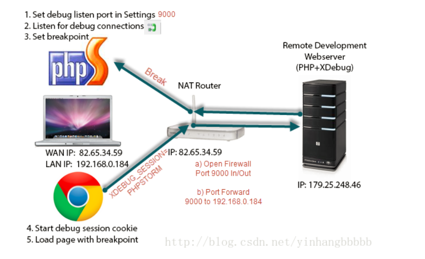
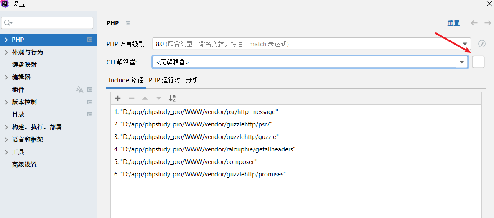
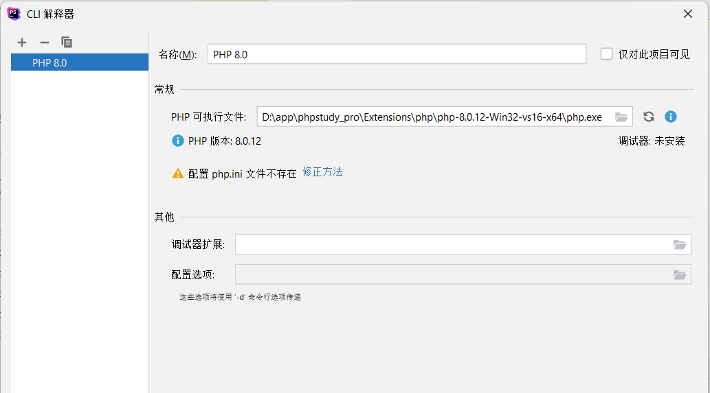
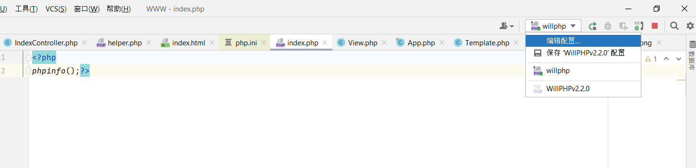
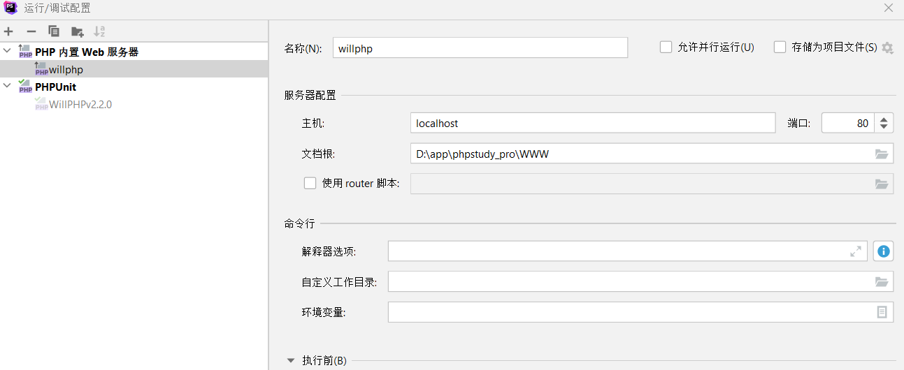
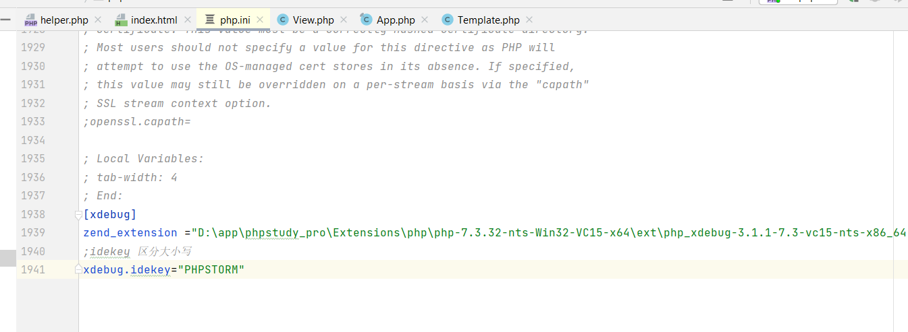
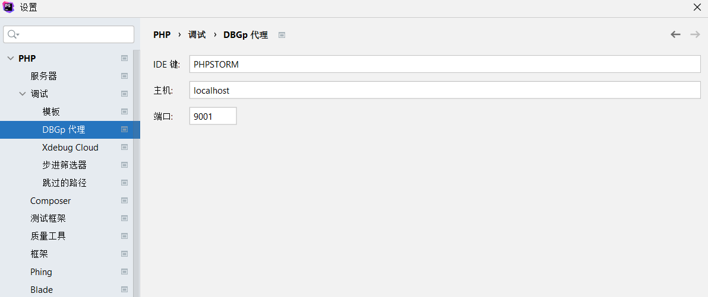
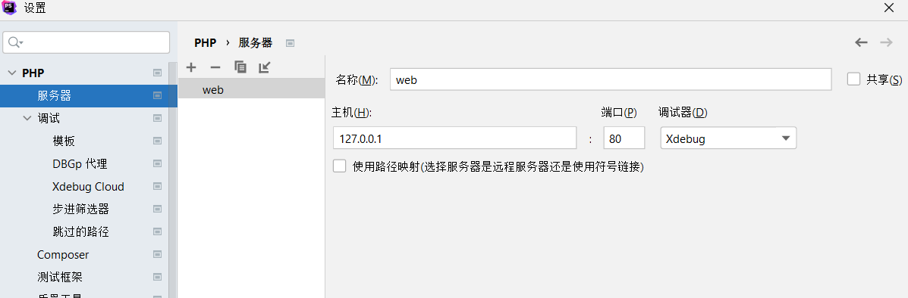
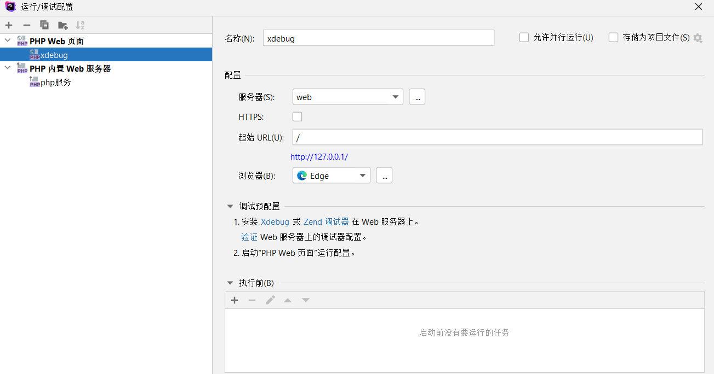
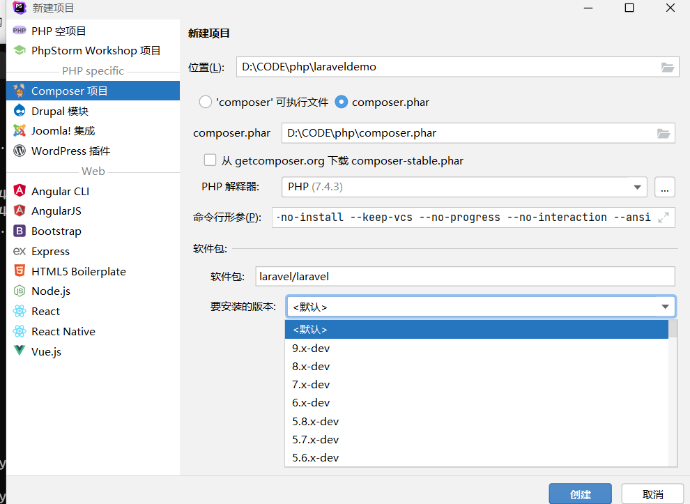

# php
> 参考资料：[https://www.php.net/manual/zh/getting-started.php](https://www.php.net/manual/zh/getting-started.php)
## 0x00基础环境搭建
### 什么是php
### phpstudy
可以一键式部署好php环境，只要把php代码放到对应目录就可以运行了。

### phpstorm+xdebug
> [https://segmentfault.com/a/1190000011907425](https://segmentfault.com/a/1190000011907425)  

- 调试过程
    - 
    - 这里php环境和xdebug是安装在服务器上面的。调试的设置是在客户端上。两者不在一个地方
- 服务器设置：
    - 利用phpstorm本机启动一个php环境（作用和phpstudy一样，所以也可以用phpstudy启动一个php环境）
    - 在phpstorm中配置好php环境
        - [下载好php文件](https://windows.php.net/download#php-7.3-ts-VC15-x64)（需要自己下载，可以下载7.3.32，不要下载8.0.2，不然后面会出问题），
        - 在设置-》PHP 配置好，设置好php.exe的路径(同理，我们只要修改这里，就可以使用不同的php版本了)，然后将php文件夹中的php的php.ini-development重命名为php.ini
            
            
        - 设置本机提供php服务：修改php默认端口和web路径：
            - PhpStorm有一个内置的Web服务器，始终在运行，默认端口63342,可以针对每个项目自己设置端口号80。
                
            - 选择添加PHP内置web服务器，端口和网站根目录。
                
            - 启动项目，整个php环境就搭建好了，访问http://localhost/就可以了。
    - 下载xdebug：
        - xdebug是要和php版本符号的，不同php版本xdebug的版本也不一样，我们根据php版本选择合适的xdebug版本。
        - 在根目录设置一个test.php
            ```php
            <?php phpinfo();?>
            ```
        - 然后访问该网页：http://localhost/test.php   可以看到phpinfo的信息
        - ctrl+a复制网页全部信息，访问[https://xdebug.org/wizard](https://xdebug.org/wizard)，粘贴信息，就可以找到符合我们当前php版本的xdebug了。
        - 然后跟着提示安装xdebug就行，php_xdebug-3.1.1-7.3-vc15-nts-x86_64.dll文件可以放在php文件夹ext文件夹下，而不是c盘，然后zend_extension = 改成php_xdebug-3.1.1-7.3-vc15-nts-x86_64.dll文件的绝对路径就行。
        
        - 重新启动项目，访问http://localhost/test.php，搜索是否有xdebug字段，有就是安装好了。
        - **我们知道了，xdebug在php.ini文件中配置，也就是xdebug是和php一起启动的**
    - **经过上面过程之后，我们在http://127.0.0.1/ 上设置了一个网站，可以把它看作是服务器**
- 本机ide调试：看作是客户端
    - 设置-》php-》调试，启动BGDp服务，设置监听端口（客户端上面的），ide会通过这个服务发送调试命令到服务器的xdebug，并用来监听xdebug发来的调试信息。
        
    - ide怎么知道调试命令要发到那个服务器上面呢呢？（如果是本机phpstorm软件启动的php网站，可以不用这条配置，phpstorm自己会找得到）
        - 设置-》php-》服务器，设置好ip和端口（这里需要填入的是服务器的ip和端口）
              
        - 然后在项目中编辑配置，添加一个PHP Web页面，选中之前设置好的服务器。
            
    - ide下断点,然后运行监听服务，就会发送调试命令，然后服务器接受之后xdebug就会处理命令，当有浏览器访问网页时候，xdebug会将得到的调试结果发回给本机的9001端口。
- 本机浏览器设置:
    - 需要下载xdebug helper插件，然后启动插件就行，用来表示我们的网页请求是需要调试的，不然服务器的xdebug是不会处理这条请求的。
- 总结：
    - 当我们在本地调试php代码，客户端，服务器端都是本机的时候，配置好php环境+xdebug的时候，下断点，然后运行php服务，ide上的bgdp服务会自动监听的。当然浏览器还是需要下载xdebug helper插件。

## 0x10 php包管理
### php的运行机制
### 第三方包管理
- Composer是PHP用来管理依赖（dependency）关系的工具。你可以在自己的项目中声明所依赖的外部工具库（libraries），Composer 会帮你安装这些依赖的库文件。类似java的maven，python的pip。

- phpstorm软件会自带，设置-》php-》Composer
    - 在网站根目录下新建一个composer.json,在这个文件上右键->composer->安装,Composer就是根据这个配置文件来处理第三方库的。

- composer换源：

    ```shell
    php composer.phar config -g repo.packagist composer https://mirrors.aliyun.com/composer/
    ```
## 0x11 php的mvc控制
MVC模式（Model-View-Controller）是软件工程中的一种软件架构模式，即 模型(Model)—视图(View)—控制器(Controller)。
- 模型（Model）：业务功能编写（例如算法实现）、数据库设计以及数据存取操作实现。模型是应用程序的主体部分。模型代表了业务数据和业务执行逻辑。当数据发生变化时，负责通知视图部分。一个模型可以同时为多个视图提供数据，由于同一个模型可以被多个视图重用，所以提高了应用的可重用性。
- 视图（View）：负责界面显示。视图是用户看到并与之交互的页面，视图向客户显示相关的业务数据，并能接收用户的输入。视图层并不执行实际的业务逻辑，也不改变数据模型。它能接收模型发出的数据更新请求，从而对用户界面进行同步更新；
- 控制器（Controller）：负责转发请求，对请求进行处理。主要用于前端web请求的分支，调度后台的业务逻辑执行。当web用户单击web页面中的提交按钮来发送html表单时，控制器接收请求并调用相应的模型组件去处理请求，然后调用相应的视图来显示模型返回的数据；

### thinkPHP框架学习
> 不用学怎么写，学框架是怎么运行起来的。[https://www.kancloud.cn/manual/thinkphp5_1/353948](https://www.kancloud.cn/manual/thinkphp5_1/353948)
> ThinkPHP，最早诞生于2006年初，2007年元旦正式更名为ThinkPHP，2017年02月27日，Thinkphp5.0.5完整版正式发布，2019年12月24日，Thinkphp6.0.1版本发布。  
> 在做ctf题目，源码审计的时候，我们需要看懂框架吗？感觉动态调试就可以了。

#### laravel框架




